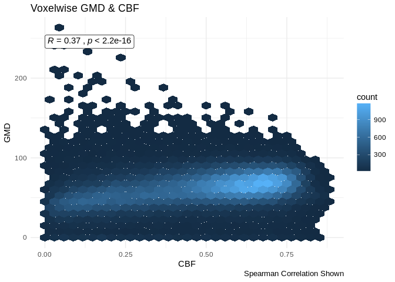
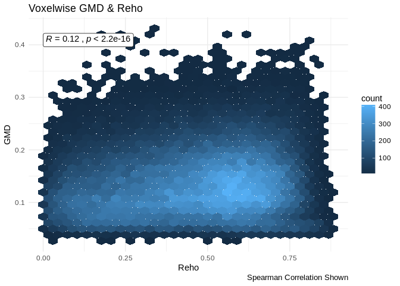

GMD Correlation Plots
================
Tinashe M. Tapera
2018-02-04

``` r
suppressPackageStartupMessages({
  library(tidyr, quietly = TRUE)
  library(dplyr, quietly = TRUE)
  library(knitr, quietly = TRUE)
  library(ggplot2, quietly = TRUE)
  library(magrittr, quietly = TRUE)
  library(stringr, quietly = TRUE)
  library(oro.nifti, quietly = TRUE)
  library(purrr, quietly = TRUE)
  library(ggpubr, quietly = TRUE)
  library(fslr, quietly = TRUE)
})
set.seed(1000)
SAMPLE <- FALSE # sample the full data if memory is limited e.g. not in qsub
```

Introduction
============

Here we visualise the relationship between voxelwise GMD values and CBF, Alff, and Reho in the PNC sample for ISLA. This method uses spatial correlation between two variables. As an example, here we calculate the spatial correlation between two participant's GMD and CBF measures.

``` r
gmd_path <- file.path("/data/joy/BBL/studies/pnc/n1601_dataFreeze/neuroimaging/t1struct/voxelwiseMaps_gmd")
mask_path <- file.path("/data/jux/BBL/projects/isla/data/Masks/gm10perc_PcaslCoverageMask.nii.gz")
cbf_path <- file.path("/data/joy/BBL/studies/pnc/n1601_dataFreeze/neuroimaging/asl/voxelwiseMaps_cbf")

# two gmd images
gmd_example <-
  list.files(gmd_path,
    pattern = regex("[^tmp.nii.gz]"),
    full.names = TRUE)[1:2] %>%
  tibble(path = .) %>%
  mutate(scanid = str_extract(path, "(?<=/)[:digit:]{4,}")) %>%
  select(scanid, everything())

# the same scanid's cbf images
cbf_example <-
  list.files(cbf_path,
    pattern = regex("[^tmp.nii.gz]"),
    full.names = TRUE) %>%
  tibble(path = .) %>%
  mutate(scanid = str_extract(path, "(?<=/)[:digit:]{4,}")) %>%
  select(scanid, everything()) %>%
  filter(scanid == gmd_example$scanid)

# the mask for this sample
pcasl_mask <- readNIfTI(mask_path)
pcasl_mask <- img_data(pcasl_mask)
```

Set the threshold for negative voxels

``` r
cbf_example <- cbf_example %>%
  mutate(
    path = fsl_maths(path, opts = c("-thr", 0))
  )
```

    ## fslmaths "/data/joy/BBL/studies/pnc/n1601_dataFreeze/neuroimaging/asl/voxelwiseMaps_cbf/2632_asl_quant_ssT1Std.nii.gz"  -thr 0 "/tmp/4354672.1.himem.q/Rtmp7i6w32/file572754e449b";fslmaths "/data/joy/BBL/studies/pnc/n1601_dataFreeze/neuroimaging/asl/voxelwiseMaps_cbf/2637_asl_quant_ssT1Std.nii.gz"  -thr 0 "/tmp/4354672.1.himem.q/Rtmp7i6w32/file572754e449b";

``` r
gmd_example <- gmd_example %>%
  mutate(
    path = fsl_maths(path, opts = c("-thr", 0))
  )
```

    ## fslmaths "/data/joy/BBL/studies/pnc/n1601_dataFreeze/neuroimaging/t1struct/voxelwiseMaps_gmd/2632_atropos3class_prob02SubjToTemp2mm.nii.gz"  -thr 0 "/tmp/4354672.1.himem.q/Rtmp7i6w32/file5728476f7f";fslmaths "/data/joy/BBL/studies/pnc/n1601_dataFreeze/neuroimaging/t1struct/voxelwiseMaps_gmd/2637_atropos3class_prob02SubjToTemp2mm.nii.gz"  -thr 0 "/tmp/4354672.1.himem.q/Rtmp7i6w32/file5728476f7f";

Next we use `fslmerge` to merge the CBF images into one volume:

``` r
merged_cbf <-
  fsl_merge(
    cbf_example$path,
    direction = c("t")
  )
```

    ## fslmerge -t "/tmp/4354672.1.himem.q/Rtmp7i6w32/file5724651400c" /tmp/4354672.1.himem.q/Rtmp7i6w32/file572754e449b.nii.gz /tmp/4354672.1.himem.q/Rtmp7i6w32/file572754e449b.nii.gz

And the GMD into one volume:

``` r
merged_gmd <-
  fsl_merge(
    gmd_example$path,
    direction = c("t")
  )
```

    ## fslmerge -t "/tmp/4354672.1.himem.q/Rtmp7i6w32/file57246c7db95" /tmp/4354672.1.himem.q/Rtmp7i6w32/file5728476f7f.nii.gz /tmp/4354672.1.himem.q/Rtmp7i6w32/file5728476f7f.nii.gz

Then we calculate the mean values using `fslmaths`

``` r
mean_cbf <- fsl_maths(merged_cbf, opts = "-Tmean")
```

    ## fslmaths "/tmp/4354672.1.himem.q/Rtmp7i6w32/file5724651400c.nii.gz"  -Tmean "/tmp/4354672.1.himem.q/Rtmp7i6w32/file5721bd078ee";

``` r
mean_gmd <- fsl_maths(merged_gmd, opts = "-Tmean")
```

    ## fslmaths "/tmp/4354672.1.himem.q/Rtmp7i6w32/file57246c7db95.nii.gz"  -Tmean "/tmp/4354672.1.himem.q/Rtmp7i6w32/file57247a40cd9";

From here, we can extract the data from the images and plot it:

``` r
cbf_dat <- readNIfTI(mean_cbf)
cbf_dat <- img_data(cbf_dat)
cbf_dat <- cbf_dat[pcasl_mask != 0]
gmd_dat <- readNIfTI(mean_cbf)
gmd_dat <- img_data(gmd_dat)
gmd_dat <- gmd_dat[pcasl_mask != 0]

df <- data_frame(cbf_dat, gmd_dat)
df %>%
  ggplot(aes(x = cbf_dat, y = gmd_dat)) +
    geom_hex() +
    stat_cor(geom = "label", method = "spearman", output.type = "expression")
```

    ## Loading required package: methods


Looks good!

GMD~CBF
=======

We specify the sample here:

``` r
cbf_sample <- read.csv("/data/jux/BBL/projects/isla/data/cbfSample.csv") %>%
  select(-X) %>%
  { if( SAMPLE ) sample_n(., 100) else .}
```

And read in the images:

``` r
gmd_images <-
  list.files(gmd_path,
    pattern = regex("[^tmp.nii.gz]"),
    full.names = TRUE) %>%
  tibble(path = .) %>%
  mutate(scanid = str_extract(path, "(?<=/)[:digit:]{4,}")) %>%
  filter(scanid %in% cbf_sample$scanid) %>%
  select(scanid, everything())

cbf_images <-
  list.files(cbf_path,
    pattern = regex("[^tmp.nii.gz]"),
    full.names = TRUE) %>%
  tibble(path = .) %>%
  mutate(scanid = str_extract(path, "(?<=/)[:digit:]{4,}")) %>%
  filter(scanid %in% cbf_sample$scanid) %>%
  select(scanid, everything())

read_and_load <- function(path, mask){

  dat <- readNIfTI(path)
  dat <- img_data(dat)

  dat[mask == 1]

}
```

Set the threshold for negative voxels

``` r
cbf_images <- cbf_images %>%
  mutate(
    path = fsl_maths(path, opts = c("-thr", 0), verbose = FALSE)
  )

gmd_images <- gmd_images %>%
  mutate(
    path = fsl_maths(path, opts = c("-thr", 0), verbose = FALSE)
  )
```

Join paths; then 1) merge, 2) mean, and 3) mask the images:

``` r
df <- left_join(gmd_images, cbf_images, by = "scanid") %>%
  summarise_at(
    .vars = vars(contains("path")),
    .funs = fsl_merge,
    direction = c("t"),
    verbose = FALSE
  ) %>%
  summarise_at(
    .vars = vars(contains("path")),
    .funs = fsl_maths,
    opts = c("-Tmean"),
    verbose = FALSE
  )

df2 <-
  data_frame(
    V1 = read_and_load(df$path.x, pcasl_mask),
    V2 = read_and_load(df$path.y, pcasl_mask)
  )
```

And plot:

``` r
df2 %>%
  ggplot(aes(x = V1, y = V2)) +
  geom_hex() +
  labs(
    x = "CBF",
    y = "GMD",
    title = "Voxelwise GMD & CBF",
    caption = "Spearman Correlation Shown"
  ) +
  stat_cor(method = "spearman", geom = "label") +
  theme_minimal()
```



GMD~Alff
========

We specify the sample, image paths, and mask here:

``` r
rest_sample <- read.csv("/data/jux/BBL/projects/isla/data/restSample.csv") %>%
  select(-X) %>%
  { if( SAMPLE ) sample_n(., 5) else .}

alff_path <- "/data/joy/BBL/studies/pnc/n1601_dataFreeze/neuroimaging/rest/voxelwiseMaps_alff"
mask_path <- file.path("/data/jux/BBL/projects/isla/data/Masks/gm10perc_RestCoverageMask.nii.gz")
rest_mask <- readNIfTI(mask_path)
```

And read in the images:

``` r
gmd_images <-
  list.files(gmd_path,
    pattern = regex("[^tmp.nii.gz]"),
    full.names = TRUE) %>%
  tibble(path = .) %>%
  mutate(scanid = str_extract(path, "(?<=/)[:digit:]{4,}")) %>%
  filter(scanid %in% rest_sample$scanid) %>%
  select(scanid, everything())

alff_images <-
  list.files(alff_path,
    pattern = regex("[^tmp.nii.gz]"),
    full.names = TRUE) %>%
  tibble(path = .) %>%
  mutate(scanid = str_extract(path, "(?<=/)[:digit:]{4,}")) %>%
  filter(scanid %in% rest_sample$scanid) %>%
  select(scanid, everything())
```

Threshold each of the images at 0

``` r
alff_images <- alff_images %>%
  mutate(
    path = fsl_maths(path, opts = c("-thr", 0), verbose = FALSE)
  )

gmd_images <- gmd_images %>%
  mutate(
    path = fsl_maths(path, opts = c("-thr", 0), verbose = FALSE)
  )
```

Join paths; then 1) merge, 2) mean, and 3) mask the images:

``` r
df <- left_join(gmd_images, alff_images, by = "scanid") %>%
  summarise_at(
    .vars = vars(contains("path")),
    .funs = fsl_merge,
    direction = c("t"),
    verbose = FALSE
  ) %>%
  summarise_at(
    .vars = vars(contains("path")),
    .funs = fsl_maths,
    opts = c("-Tmean"),
    verbose = FALSE
  )

df2 <-
  data_frame(
    V1 = read_and_load(df$path.x, rest_mask),
    V2 = read_and_load(df$path.y, rest_mask)
  )
```

And plot:

``` r
df2 %>%
  ggplot(aes(x = V1, y = V2)) +
  geom_hex() +
  labs(
    x = "Alff",
    y = "GMD",
    title = "Voxelwise GMD & Alff",
    caption = "Spearman Correlation Shown"
  ) +
  stat_cor(method = "spearman", geom = "label") +
  theme_minimal()
```


GMD~Reho
========

Sample and mask are already specified, we just need the path to `reho` images:

``` r
reho_path <- "/data/joy/BBL/studies/pnc/n1601_dataFreeze/neuroimaging/rest/voxelwiseMaps_reho"
```

And read in the images (`gmd` is already specified):

``` r
reho_images <-
  list.files(reho_path,
    pattern = regex("[^tmp.nii.gz]"),
    full.names = TRUE) %>%
  tibble(path = .) %>%
  mutate(scanid = str_extract(path, "(?<=/)[:digit:]{4,}")) %>%
  filter(scanid %in% rest_sample$scanid) %>%
  select(scanid, everything())
```

Threshold each of the images at 0

``` r
reho_images <- reho_images %>%
  mutate(
    path = fsl_maths(path, opts = c("-thr", 0), verbose = FALSE)
  )
```

Join paths; then 1) mask, 2) merge, and 3) mean the images:

``` r
df <- left_join(gmd_images, reho_images, by = "scanid") %>%
  summarise_at(
    .vars = vars(contains("path")),
    .funs = fsl_merge,
    direction = c("t"),
    verbose = FALSE
  ) %>%
  summarise_at(
    .vars = vars(contains("path")),
    .funs = fsl_maths,
    opts = c("-Tmean"),
    verbose = FALSE
  )

df2 <-
  data_frame(
    V1 = read_and_load(df$path.x, rest_mask),
    V2 = read_and_load(df$path.y, rest_mask)
  )
```

And plot:

``` r
df2 %>%
  ggplot(aes(x = V1, y = V2)) +
  geom_hex() +
  labs(
    x = "Reho",
    y = "GMD",
    title = "Voxelwise GMD & Reho",
    caption = "Spearman Correlation Shown"
  ) +
  stat_cor(method = "spearman", geom = "label") +
  theme_minimal()
```



Done! Session info:

``` r
print(R.version.string)
```

    ## [1] "R version 3.4.1 (2017-06-30)"

``` r
print(paste("Updated:", format(Sys.time(), "%Y-%m-%d")))
```

    ## [1] "Updated: 2019-02-12"
