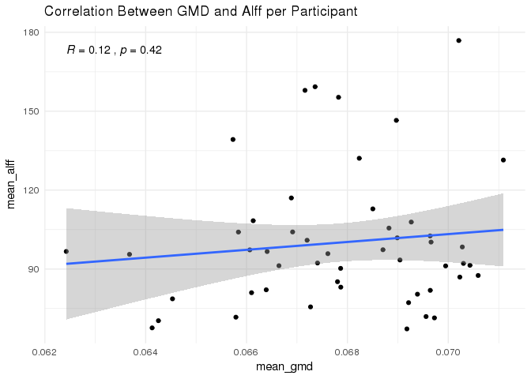
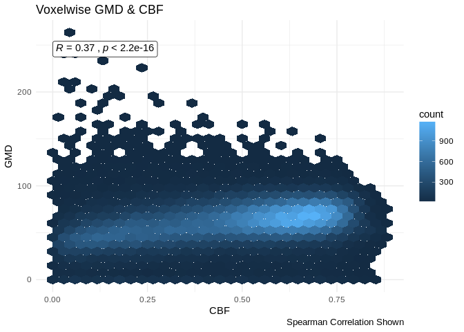
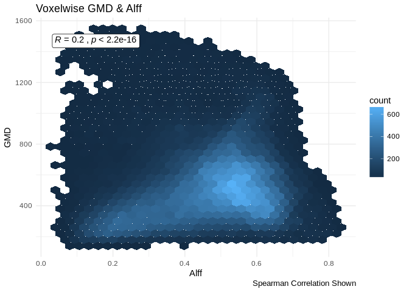
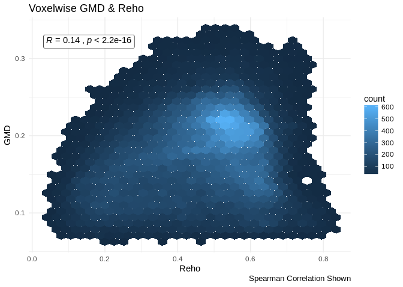

GMD Correlation Plots
================
Tinashe M. Tapera
2018-02-04

``` r
suppressPackageStartupMessages({
  library(tidyr, quietly = TRUE)
  library(dplyr, quietly = TRUE)
  library(knitr, quietly = TRUE)
  library(ggplot2, quietly = TRUE)
  library(magrittr, quietly = TRUE)
  library(stringr, quietly = TRUE)
  library(oro.nifti, quietly = TRUE)
  library(purrr, quietly = TRUE)
  library(ggpubr, quietly = TRUE)
  library(fslr, quietly = TRUE)
})
set.seed(1000)
SAMPLE <- FALSE # sample the full data if memory is limited e.g. not in qsub
```

Introduction
============

Here we visualise the relationship between voxelwise GMD values and CBF, Alff, and Reho in the PNC sample for ISLA. This method uses spatial correlation between two variables. As an example, here we calculate the spatial correlation between two participant's GMD and CBF measures.

``` r
gmd_path <- file.path("/data/joy/BBL/studies/pnc/n1601_dataFreeze/neuroimaging/t1struct/voxelwiseMaps_gmd")
mask_path <- file.path("/data/jux/BBL/projects/isla/data/Masks/gm10perc_PcaslCoverageMask.nii.gz")
cbf_path <- file.path("/data/joy/BBL/studies/pnc/n1601_dataFreeze/neuroimaging/asl/voxelwiseMaps_cbf")

# two gmd images
gmd_example <-
  list.files(gmd_path,
    pattern = regex("[^tmp.nii.gz]"),
    full.names = TRUE)[1:2] %>%
  tibble(path = .) %>%
  mutate(scanid = str_extract(path, "(?<=/)[:digit:]{4,}")) %>%
  select(scanid, everything())

# the same scanid's cbf images
cbf_example <-
  list.files(cbf_path,
    pattern = regex("[^tmp.nii.gz]"),
    full.names = TRUE) %>%
  tibble(path = .) %>%
  mutate(scanid = str_extract(path, "(?<=/)[:digit:]{4,}")) %>%
  select(scanid, everything()) %>%
  filter(scanid == gmd_example$scanid)

# the mask for this sample
pcasl_mask <- readNIfTI(mask_path)
pcasl_mask <- img_data(pcasl_mask)
```

Set the threshold for negative voxels

``` r
cbf_example <- cbf_example %>%
  mutate(
    path = fsl_maths(path, opts = c("-thr", 0))
  )
```

    ## fslmaths "/data/joy/BBL/studies/pnc/n1601_dataFreeze/neuroimaging/asl/voxelwiseMaps_cbf/2632_asl_quant_ssT1Std.nii.gz"  -thr 0 "/tmp/4345491.1.himem.q/Rtmpuv5xYK/file3bf338810ade";fslmaths "/data/joy/BBL/studies/pnc/n1601_dataFreeze/neuroimaging/asl/voxelwiseMaps_cbf/2637_asl_quant_ssT1Std.nii.gz"  -thr 0 "/tmp/4345491.1.himem.q/Rtmpuv5xYK/file3bf338810ade";

``` r
gmd_example <- gmd_example %>%
  mutate(
    path = fsl_maths(path, opts = c("-thr", 0))
  )
```

    ## fslmaths "/data/joy/BBL/studies/pnc/n1601_dataFreeze/neuroimaging/t1struct/voxelwiseMaps_gmd/2632_atropos3class_prob02SubjToTemp2mm.nii.gz"  -thr 0 "/tmp/4345491.1.himem.q/Rtmpuv5xYK/file3bf3acaa6c3";fslmaths "/data/joy/BBL/studies/pnc/n1601_dataFreeze/neuroimaging/t1struct/voxelwiseMaps_gmd/2637_atropos3class_prob02SubjToTemp2mm.nii.gz"  -thr 0 "/tmp/4345491.1.himem.q/Rtmpuv5xYK/file3bf3acaa6c3";

Next we use `fslmerge` to merge the CBF images into one volume:

``` r
merged_cbf <-
  fsl_merge(
    cbf_example$path,
    direction = c("t")
  )
```

    ## fslmerge -t "/tmp/4345491.1.himem.q/Rtmpuv5xYK/file3bf31f95cf47" /tmp/4345491.1.himem.q/Rtmpuv5xYK/file3bf338810ade.nii.gz /tmp/4345491.1.himem.q/Rtmpuv5xYK/file3bf338810ade.nii.gz

And the GMD into one volume:

``` r
merged_gmd <-
  fsl_merge(
    gmd_example$path,
    direction = c("t")
  )
```

    ## fslmerge -t "/tmp/4345491.1.himem.q/Rtmpuv5xYK/file3bf36e84b776" /tmp/4345491.1.himem.q/Rtmpuv5xYK/file3bf3acaa6c3.nii.gz /tmp/4345491.1.himem.q/Rtmpuv5xYK/file3bf3acaa6c3.nii.gz

Then we calculate the mean values using `fslmaths`

``` r
mean_cbf <- fsl_maths(merged_cbf, opts = "-Tmean")
```

    ## fslmaths "/tmp/4345491.1.himem.q/Rtmpuv5xYK/file3bf31f95cf47.nii.gz"  -Tmean "/tmp/4345491.1.himem.q/Rtmpuv5xYK/file3bf314b9641f";

``` r
mean_gmd <- fsl_maths(merged_gmd, opts = "-Tmean")
```

    ## fslmaths "/tmp/4345491.1.himem.q/Rtmpuv5xYK/file3bf36e84b776.nii.gz"  -Tmean "/tmp/4345491.1.himem.q/Rtmpuv5xYK/file3bf35ec4c23e";

From here, we can extract the data from the images and plot it:

``` r
cbf_dat <- readNIfTI(mean_cbf)
cbf_dat <- img_data(cbf_dat)
cbf_dat <- cbf_dat[pcasl_mask != 0]
gmd_dat <- readNIfTI(mean_cbf)
gmd_dat <- img_data(gmd_dat)
gmd_dat <- gmd_dat[pcasl_mask != 0]

df <- data_frame(cbf_dat, gmd_dat)
df %>%
  ggplot(aes(x = cbf_dat, y = gmd_dat)) +
    geom_hex() +
    stat_cor(geom = "label", method = "spearman", output.type = "expression")
```

    ## Loading required package: methods



Looks good!

GMD~CBF
=======

We specify the sample here:

``` r
cbf_sample <- read.csv("/data/jux/BBL/projects/isla/data/cbfSample.csv") %>%
  select(-X) %>%
  { if( SAMPLE ) sample_n(., 100) else .}
```

And read in the images:

``` r
gmd_images <-
  list.files(gmd_path,
    pattern = regex("[^tmp.nii.gz]"),
    full.names = TRUE) %>%
  tibble(path = .) %>%
  mutate(scanid = str_extract(path, "(?<=/)[:digit:]{4,}")) %>%
  filter(scanid %in% cbf_sample$scanid) %>%
  select(scanid, everything())

cbf_images <-
  list.files(cbf_path,
    pattern = regex("[^tmp.nii.gz]"),
    full.names = TRUE) %>%
  tibble(path = .) %>%
  mutate(scanid = str_extract(path, "(?<=/)[:digit:]{4,}")) %>%
  filter(scanid %in% cbf_sample$scanid) %>%
  select(scanid, everything())

read_and_load <- function(path, mask){

  dat <- readNIfTI(path)
  dat <- img_data(dat)

  dat[mask == 1]

}
```

Set the threshold for negative voxels

``` r
cbf_images <- cbf_images %>%
  mutate(
    path = fsl_maths(path, opts = c("-thr", 0))
  )
```

    ## fslmaths "/data/joy/BBL/studies/pnc/n1601_dataFreeze/neuroimaging/asl/voxelwiseMaps_cbf/2646_asl_quant_ssT1Std.nii.gz"  -thr 0 "/tmp/4345491.1.himem.q/Rtmpuv5xYK/file3bf34de93c6b";fslmaths "/data/joy/BBL/studies/pnc/n1601_dataFreeze/neuroimaging/asl/voxelwiseMaps_cbf/2647_asl_quant_ssT1Std.nii.gz"  -thr 0 "/tmp/4345491.1.himem.q/Rtmpuv5xYK/file3bf34de93c6b";fslmaths "/data/joy/BBL/studies/pnc/n1601_dataFreeze/neuroimaging/asl/voxelwiseMaps_cbf/2648_asl_quant_ssT1Std.nii.gz"  -thr 0 "/tmp/4345491.1.himem.q/Rtmpuv5xYK/file3bf34de93c6b";fslmaths "/data/joy/BBL/studies/pnc/n1601_dataFreeze/neuroimaging/asl/voxelwiseMaps_cbf/2675_asl_quant_ssT1Std.nii.gz"  -thr 0 "/tmp/4345491.1.himem.q/Rtmpuv5xYK/file3bf34de93c6b";fslmaths "/data/joy/BBL/studies/pnc/n1601_dataFreeze/neuroimaging/asl/voxelwiseMaps_cbf/2682_asl_quant_ssT1Std.nii.gz"  -thr 0 "/tmp/4345491.1.himem.q/Rtmpuv5xYK/file3bf34de93c6b";fslmaths "/data/joy/BBL/studies/pnc/n1601_dataFreeze/neuroimaging/asl/voxelwiseMaps_cbf/2706_asl_quant_ssT1Std.nii.gz"  -thr 0 "/tmp/4345491.1.himem.q/Rtmpuv5xYK/file3bf34de93c6b";fslmaths "/data/joy/BBL/studies/pnc/n1601_dataFreeze/neuroimaging/asl/voxelwiseMaps_cbf/2725_asl_quant_ssT1Std.nii.gz"  -thr 0 "/tmp/4345491.1.himem.q/Rtmpuv5xYK/file3bf34de93c6b";fslmaths "/data/joy/BBL/studies/pnc/n1601_dataFreeze/neuroimaging/asl/voxelwiseMaps_cbf/2726_asl_quant_ssT1Std.nii.gz"  -thr 0 "/tmp/4345491.1.himem.q/Rtmpuv5xYK/file3bf34de93c6b";fslmaths "/data/joy/BBL/studies/pnc/n1601_dataFreeze/neuroimaging/asl/voxelwiseMaps_cbf/2738_asl_quant_ssT1Std.nii.gz"  -thr 0 "/tmp/4345491.1.himem.q/Rtmpuv5xYK/file3bf34de93c6b";fslmaths "/data/joy/BBL/studies/pnc/n1601_dataFreeze/neuroimaging/asl/voxelwiseMaps_cbf/2740_asl_quant_ssT1Std.nii.gz"  -thr 0 "/tmp/4345491.1.himem.q/Rtmpuv5xYK/file3bf34de93c6b";fslmaths "/data/joy/BBL/studies/pnc/n1601_dataFreeze/neuroimaging/asl/voxelwiseMaps_cbf/2751_asl_quant_ssT1Std.nii.gz"  -thr 0 "/tmp/4345491.1.himem.q/Rtmpuv5xYK/file3bf34de93c6b";fslmaths "/data/joy/BBL/studies/pnc/n1601_dataFreeze/neuroimaging/asl/voxelwiseMaps_cbf/2796_asl_quant_ssT1Std.nii.gz"  -thr 0 "/tmp/4345491.1.himem.q/Rtmpuv5xYK/file3bf34de93c6b";fslmaths "/data/joy/BBL/studies/pnc/n1601_dataFreeze/neuroimaging/asl/voxelwiseMaps_cbf/2818_asl_quant_ssT1Std.nii.gz"  -thr 0 "/tmp/4345491.1.himem.q/Rtmpuv5xYK/file3bf34de93c6b";fslmaths "/data/joy/BBL/studies/pnc/n1601_dataFreeze/neuroimaging/asl/voxelwiseMaps_cbf/2822_asl_quant_ssT1Std.nii.gz"  -thr 0 "/tmp/4345491.1.himem.q/Rtmpuv5xYK/file3bf34de93c6b";fslmaths "/data/joy/BBL/studies/pnc/n1601_dataFreeze/neuroimaging/asl/voxelwiseMaps_cbf/2823_asl_quant_ssT1Std.nii.gz"  -thr 0 "/tmp/4345491.1.himem.q/Rtmpuv5xYK/file3bf34de93c6b";fslmaths "/data/joy/BBL/studies/pnc/n1601_dataFreeze/neuroimaging/asl/voxelwiseMaps_cbf/2825_asl_quant_ssT1Std.nii.gz"  -thr 0 "/tmp/4345491.1.himem.q/Rtmpuv5xYK/file3bf34de93c6b";fslmaths "/data/joy/BBL/studies/pnc/n1601_dataFreeze/neuroimaging/asl/voxelwiseMaps_cbf/2854_asl_quant_ssT1Std.nii.gz"  -thr 0 "/tmp/4345491.1.himem.q/Rtmpuv5xYK/file3bf34de93c6b";fslmaths "/data/joy/BBL/studies/pnc/n1601_dataFreeze/neuroimaging/asl/voxelwiseMaps_cbf/2855_asl_quant_ssT1Std.nii.gz"  -thr 0 "/tmp/4345491.1.himem.q/Rtmpuv5xYK/file3bf34de93c6b";fslmaths "/data/joy/BBL/studies/pnc/n1601_dataFreeze/neuroimaging/asl/voxelwiseMaps_cbf/2856_asl_quant_ssT1Std.nii.gz"  -thr 0 "/tmp/4345491.1.himem.q/Rtmpuv5xYK/file3bf34de93c6b";fslmaths "/data/joy/BBL/studies/pnc/n1601_dataFreeze/neuroimaging/asl/voxelwiseMaps_cbf/2859_asl_quant_ssT1Std.nii.gz"  -thr 0 "/tmp/4345491.1.himem.q/Rtmpuv5xYK/file3bf34de93c6b";fslmaths "/data/joy/BBL/studies/pnc/n1601_dataFreeze/neuroimaging/asl/voxelwiseMaps_cbf/2865_asl_quant_ssT1Std.nii.gz"  -thr 0 "/tmp/4345491.1.himem.q/Rtmpuv5xYK/file3bf34de93c6b";fslmaths "/data/joy/BBL/studies/pnc/n1601_dataFreeze/neuroimaging/asl/voxelwiseMaps_cbf/2894_asl_quant_ssT1Std.nii.gz"  -thr 0 "/tmp/4345491.1.himem.q/Rtmpuv5xYK/file3bf34de93c6b";fslmaths "/data/joy/BBL/studies/pnc/n1601_dataFreeze/neuroimaging/asl/voxelwiseMaps_cbf/2896_asl_quant_ssT1Std.nii.gz"  -thr 0 "/tmp/4345491.1.himem.q/Rtmpuv5xYK/file3bf34de93c6b";fslmaths "/data/joy/BBL/studies/pnc/n1601_dataFreeze/neuroimaging/asl/voxelwiseMaps_cbf/2902_asl_quant_ssT1Std.nii.gz"  -thr 0 "/tmp/4345491.1.himem.q/Rtmpuv5xYK/file3bf34de93c6b";fslmaths "/data/joy/BBL/studies/pnc/n1601_dataFreeze/neuroimaging/asl/voxelwiseMaps_cbf/2909_asl_quant_ssT1Std.nii.gz"  -thr 0 "/tmp/4345491.1.himem.q/Rtmpuv5xYK/file3bf34de93c6b";fslmaths "/data/joy/BBL/studies/pnc/n1601_dataFreeze/neuroimaging/asl/voxelwiseMaps_cbf/2922_asl_quant_ssT1Std.nii.gz"  -thr 0 "/tmp/4345491.1.himem.q/Rtmpuv5xYK/file3bf34de93c6b";fslmaths "/data/joy/BBL/studies/pnc/n1601_dataFreeze/neuroimaging/asl/voxelwiseMaps_cbf/2951_asl_quant_ssT1Std.nii.gz"  -thr 0 "/tmp/4345491.1.himem.q/Rtmpuv5xYK/file3bf34de93c6b";fslmaths "/data/joy/BBL/studies/pnc/n1601_dataFreeze/neuroimaging/asl/voxelwiseMaps_cbf/2952_asl_quant_ssT1Std.nii.gz"  -thr 0 "/tmp/4345491.1.himem.q/Rtmpuv5xYK/file3bf34de93c6b";fslmaths "/data/joy/BBL/studies/pnc/n1601_dataFreeze/neuroimaging/asl/voxelwiseMaps_cbf/2954_asl_quant_ssT1Std.nii.gz"  -thr 0 "/tmp/4345491.1.himem.q/Rtmpuv5xYK/file3bf34de93c6b";fslmaths "/data/joy/BBL/studies/pnc/n1601_dataFreeze/neuroimaging/asl/voxelwiseMaps_cbf/2963_asl_quant_ssT1Std.nii.gz"  -thr 0 "/tmp/4345491.1.himem.q/Rtmpuv5xYK/file3bf34de93c6b";fslmaths "/data/joy/BBL/studies/pnc/n1601_dataFreeze/neuroimaging/asl/voxelwiseMaps_cbf/2967_asl_quant_ssT1Std.nii.gz"  -thr 0 "/tmp/4345491.1.himem.q/Rtmpuv5xYK/file3bf34de93c6b";fslmaths "/data/joy/BBL/studies/pnc/n1601_dataFreeze/neuroimaging/asl/voxelwiseMaps_cbf/2995_asl_quant_ssT1Std.nii.gz"  -thr 0 "/tmp/4345491.1.himem.q/Rtmpuv5xYK/file3bf34de93c6b";fslmaths "/data/joy/BBL/studies/pnc/n1601_dataFreeze/neuroimaging/asl/voxelwiseMaps_cbf/3013_asl_quant_ssT1Std.nii.gz"  -thr 0 "/tmp/4345491.1.himem.q/Rtmpuv5xYK/file3bf34de93c6b";fslmaths "/data/joy/BBL/studies/pnc/n1601_dataFreeze/neuroimaging/asl/voxelwiseMaps_cbf/3014_asl_quant_ssT1Std.nii.gz"  -thr 0 "/tmp/4345491.1.himem.q/Rtmpuv5xYK/file3bf34de93c6b";fslmaths "/data/joy/BBL/studies/pnc/n1601_dataFreeze/neuroimaging/asl/voxelwiseMaps_cbf/3016_asl_quant_ssT1Std.nii.gz"  -thr 0 "/tmp/4345491.1.himem.q/Rtmpuv5xYK/file3bf34de93c6b";fslmaths "/data/joy/BBL/studies/pnc/n1601_dataFreeze/neuroimaging/asl/voxelwiseMaps_cbf/3018_asl_quant_ssT1Std.nii.gz"  -thr 0 "/tmp/4345491.1.himem.q/Rtmpuv5xYK/file3bf34de93c6b";fslmaths "/data/joy/BBL/studies/pnc/n1601_dataFreeze/neuroimaging/asl/voxelwiseMaps_cbf/3020_asl_quant_ssT1Std.nii.gz"  -thr 0 "/tmp/4345491.1.himem.q/Rtmpuv5xYK/file3bf34de93c6b";fslmaths "/data/joy/BBL/studies/pnc/n1601_dataFreeze/neuroimaging/asl/voxelwiseMaps_cbf/3033_asl_quant_ssT1Std.nii.gz"  -thr 0 "/tmp/4345491.1.himem.q/Rtmpuv5xYK/file3bf34de93c6b";fslmaths "/data/joy/BBL/studies/pnc/n1601_dataFreeze/neuroimaging/asl/voxelwiseMaps_cbf/3034_asl_quant_ssT1Std.nii.gz"  -thr 0 "/tmp/4345491.1.himem.q/Rtmpuv5xYK/file3bf34de93c6b";fslmaths "/data/joy/BBL/studies/pnc/n1601_dataFreeze/neuroimaging/asl/voxelwiseMaps_cbf/3036_asl_quant_ssT1Std.nii.gz"  -thr 0 "/tmp/4345491.1.himem.q/Rtmpuv5xYK/file3bf34de93c6b";fslmaths "/data/joy/BBL/studies/pnc/n1601_dataFreeze/neuroimaging/asl/voxelwiseMaps_cbf/3039_asl_quant_ssT1Std.nii.gz"  -thr 0 "/tmp/4345491.1.himem.q/Rtmpuv5xYK/file3bf34de93c6b";fslmaths "/data/joy/BBL/studies/pnc/n1601_dataFreeze/neuroimaging/asl/voxelwiseMaps_cbf/3040_asl_quant_ssT1Std.nii.gz"  -thr 0 "/tmp/4345491.1.himem.q/Rtmpuv5xYK/file3bf34de93c6b";fslmaths "/data/joy/BBL/studies/pnc/n1601_dataFreeze/neuroimaging/asl/voxelwiseMaps_cbf/3043_asl_quant_ssT1Std.nii.gz"  -thr 0 "/tmp/4345491.1.himem.q/Rtmpuv5xYK/file3bf34de93c6b";fslmaths "/data/joy/BBL/studies/pnc/n1601_dataFreeze/neuroimaging/asl/voxelwiseMaps_cbf/3044_asl_quant_ssT1Std.nii.gz"  -thr 0 "/tmp/4345491.1.himem.q/Rtmpuv5xYK/file3bf34de93c6b";fslmaths "/data/joy/BBL/studies/pnc/n1601_dataFreeze/neuroimaging/asl/voxelwiseMaps_cbf/3045_asl_quant_ssT1Std.nii.gz"  -thr 0 "/tmp/4345491.1.himem.q/Rtmpuv5xYK/file3bf34de93c6b";fslmaths "/data/joy/BBL/studies/pnc/n1601_dataFreeze/neuroimaging/asl/voxelwiseMaps_cbf/3048_asl_quant_ssT1Std.nii.gz"  -thr 0 "/tmp/4345491.1.himem.q/Rtmpuv5xYK/file3bf34de93c6b";fslmaths "/data/joy/BBL/studies/pnc/n1601_dataFreeze/neuroimaging/asl/voxelwiseMaps_cbf/3075_asl_quant_ssT1Std.nii.gz"  -thr 0 "/tmp/4345491.1.himem.q/Rtmpuv5xYK/file3bf34de93c6b";fslmaths "/data/joy/BBL/studies/pnc/n1601_dataFreeze/neuroimaging/asl/voxelwiseMaps_cbf/3081_asl_quant_ssT1Std.nii.gz"  -thr 0 "/tmp/4345491.1.himem.q/Rtmpuv5xYK/file3bf34de93c6b";fslmaths "/data/joy/BBL/studies/pnc/n1601_dataFreeze/neuroimaging/asl/voxelwiseMaps_cbf/3086_asl_quant_ssT1Std.nii.gz"  -thr 0 "/tmp/4345491.1.himem.q/Rtmpuv5xYK/file3bf34de93c6b";fslmaths "/data/joy/BBL/studies/pnc/n1601_dataFreeze/neuroimaging/asl/voxelwiseMaps_cbf/3088_asl_quant_ssT1Std.nii.gz"  -thr 0 "/tmp/4345491.1.himem.q/Rtmpuv5xYK/file3bf34de93c6b";fslmaths "/data/joy/BBL/studies/pnc/n1601_dataFreeze/neuroimaging/asl/voxelwiseMaps_cbf/3090_asl_quant_ssT1Std.nii.gz"  -thr 0 "/tmp/4345491.1.himem.q/Rtmpuv5xYK/file3bf34de93c6b";fslmaths "/data/joy/BBL/studies/pnc/n1601_dataFreeze/neuroimaging/asl/voxelwiseMaps_cbf/3091_asl_quant_ssT1Std.nii.gz"  -thr 0 "/tmp/4345491.1.himem.q/Rtmpuv5xYK/file3bf34de93c6b";fslmaths "/data/joy/BBL/studies/pnc/n1601_dataFreeze/neuroimaging/asl/voxelwiseMaps_cbf/3113_asl_quant_ssT1Std.nii.gz"  -thr 0 "/tmp/4345491.1.himem.q/Rtmpuv5xYK/file3bf34de93c6b";fslmaths "/data/joy/BBL/studies/pnc/n1601_dataFreeze/neuroimaging/asl/voxelwiseMaps_cbf/3115_asl_quant_ssT1Std.nii.gz"  -thr 0 "/tmp/4345491.1.himem.q/Rtmpuv5xYK/file3bf34de93c6b";fslmaths "/data/joy/BBL/studies/pnc/n1601_dataFreeze/neuroimaging/asl/voxelwiseMaps_cbf/3116_asl_quant_ssT1Std.nii.gz"  -thr 0 "/tmp/4345491.1.himem.q/Rtmpuv5xYK/file3bf34de93c6b";fslmaths "/data/joy/BBL/studies/pnc/n1601_dataFreeze/neuroimaging/asl/voxelwiseMaps_cbf/3122_asl_quant_ssT1Std.nii.gz"  -thr 0 "/tmp/4345491.1.himem.q/Rtmpuv5xYK/file3bf34de93c6b";fslmaths "/data/joy/BBL/studies/pnc/n1601_dataFreeze/neuroimaging/asl/voxelwiseMaps_cbf/3125_asl_quant_ssT1Std.nii.gz"  -thr 0 "/tmp/4345491.1.himem.q/Rtmpuv5xYK/file3bf34de93c6b";fslmaths "/data/joy/BBL/studies/pnc/n1601_dataFreeze/neuroimaging/asl/voxelwiseMaps_cbf/3138_asl_quant_ssT1Std.nii.gz"  -thr 0 "/tmp/4345491.1.himem.q/Rtmpuv5xYK/file3bf34de93c6b";fslmaths "/data/joy/BBL/studies/pnc/n1601_dataFreeze/neuroimaging/asl/voxelwiseMaps_cbf/3141_asl_quant_ssT1Std.nii.gz"  -thr 0 "/tmp/4345491.1.himem.q/Rtmpuv5xYK/file3bf34de93c6b";fslmaths "/data/joy/BBL/studies/pnc/n1601_dataFreeze/neuroimaging/asl/voxelwiseMaps_cbf/3144_asl_quant_ssT1Std.nii.gz"  -thr 0 "/tmp/4345491.1.himem.q/Rtmpuv5xYK/file3bf34de93c6b";fslmaths "/data/joy/BBL/studies/pnc/n1601_dataFreeze/neuroimaging/asl/voxelwiseMaps_cbf/3145_asl_quant_ssT1Std.nii.gz"  -thr 0 "/tmp/4345491.1.himem.q/Rtmpuv5xYK/file3bf34de93c6b";fslmaths "/data/joy/BBL/studies/pnc/n1601_dataFreeze/neuroimaging/asl/voxelwiseMaps_cbf/3146_asl_quant_ssT1Std.nii.gz"  -thr 0 "/tmp/4345491.1.himem.q/Rtmpuv5xYK/file3bf34de93c6b";fslmaths "/data/joy/BBL/studies/pnc/n1601_dataFreeze/neuroimaging/asl/voxelwiseMaps_cbf/3152_asl_quant_ssT1Std.nii.gz"  -thr 0 "/tmp/4345491.1.himem.q/Rtmpuv5xYK/file3bf34de93c6b";fslmaths "/data/joy/BBL/studies/pnc/n1601_dataFreeze/neuroimaging/asl/voxelwiseMaps_cbf/3178_asl_quant_ssT1Std.nii.gz"  -thr 0 "/tmp/4345491.1.himem.q/Rtmpuv5xYK/file3bf34de93c6b";fslmaths "/data/joy/BBL/studies/pnc/n1601_dataFreeze/neuroimaging/asl/voxelwiseMaps_cbf/3179_asl_quant_ssT1Std.nii.gz"  -thr 0 "/tmp/4345491.1.himem.q/Rtmpuv5xYK/file3bf34de93c6b";fslmaths "/data/joy/BBL/studies/pnc/n1601_dataFreeze/neuroimaging/asl/voxelwiseMaps_cbf/3183_asl_quant_ssT1Std.nii.gz"  -thr 0 "/tmp/4345491.1.himem.q/Rtmpuv5xYK/file3bf34de93c6b";fslmaths "/data/joy/BBL/studies/pnc/n1601_dataFreeze/neuroimaging/asl/voxelwiseMaps_cbf/3184_asl_quant_ssT1Std.nii.gz"  -thr 0 "/tmp/4345491.1.himem.q/Rtmpuv5xYK/file3bf34de93c6b";fslmaths "/data/joy/BBL/studies/pnc/n1601_dataFreeze/neuroimaging/asl/voxelwiseMaps_cbf/3187_asl_quant_ssT1Std.nii.gz"  -thr 0 "/tmp/4345491.1.himem.q/Rtmpuv5xYK/file3bf34de93c6b";fslmaths "/data/joy/BBL/studies/pnc/n1601_dataFreeze/neuroimaging/asl/voxelwiseMaps_cbf/3189_asl_quant_ssT1Std.nii.gz"  -thr 0 "/tmp/4345491.1.himem.q/Rtmpuv5xYK/file3bf34de93c6b";fslmaths "/data/joy/BBL/studies/pnc/n1601_dataFreeze/neuroimaging/asl/voxelwiseMaps_cbf/3190_asl_quant_ssT1Std.nii.gz"  -thr 0 "/tmp/4345491.1.himem.q/Rtmpuv5xYK/file3bf34de93c6b";fslmaths "/data/joy/BBL/studies/pnc/n1601_dataFreeze/neuroimaging/asl/voxelwiseMaps_cbf/3202_asl_quant_ssT1Std.nii.gz"  -thr 0 "/tmp/4345491.1.himem.q/Rtmpuv5xYK/file3bf34de93c6b";fslmaths "/data/joy/BBL/studies/pnc/n1601_dataFreeze/neuroimaging/asl/voxelwiseMaps_cbf/3209_asl_quant_ssT1Std.nii.gz"  -thr 0 "/tmp/4345491.1.himem.q/Rtmpuv5xYK/file3bf34de93c6b";fslmaths "/data/joy/BBL/studies/pnc/n1601_dataFreeze/neuroimaging/asl/voxelwiseMaps_cbf/3210_asl_quant_ssT1Std.nii.gz"  -thr 0 "/tmp/4345491.1.himem.q/Rtmpuv5xYK/file3bf34de93c6b";fslmaths "/data/joy/BBL/studies/pnc/n1601_dataFreeze/neuroimaging/asl/voxelwiseMaps_cbf/3212_asl_quant_ssT1Std.nii.gz"  -thr 0 "/tmp/4345491.1.himem.q/Rtmpuv5xYK/file3bf34de93c6b";fslmaths "/data/joy/BBL/studies/pnc/n1601_dataFreeze/neuroimaging/asl/voxelwiseMaps_cbf/3216_asl_quant_ssT1Std.nii.gz"  -thr 0 "/tmp/4345491.1.himem.q/Rtmpuv5xYK/file3bf34de93c6b";fslmaths "/data/joy/BBL/studies/pnc/n1601_dataFreeze/neuroimaging/asl/voxelwiseMaps_cbf/3224_asl_quant_ssT1Std.nii.gz"  -thr 0 "/tmp/4345491.1.himem.q/Rtmpuv5xYK/file3bf34de93c6b";fslmaths "/data/joy/BBL/studies/pnc/n1601_dataFreeze/neuroimaging/asl/voxelwiseMaps_cbf/3230_asl_quant_ssT1Std.nii.gz"  -thr 0 "/tmp/4345491.1.himem.q/Rtmpuv5xYK/file3bf34de93c6b";fslmaths "/data/joy/BBL/studies/pnc/n1601_dataFreeze/neuroimaging/asl/voxelwiseMaps_cbf/3232_asl_quant_ssT1Std.nii.gz"  -thr 0 "/tmp/4345491.1.himem.q/Rtmpuv5xYK/file3bf34de93c6b";fslmaths "/data/joy/BBL/studies/pnc/n1601_dataFreeze/neuroimaging/asl/voxelwiseMaps_cbf/3233_asl_quant_ssT1Std.nii.gz"  -thr 0 "/tmp/4345491.1.himem.q/Rtmpuv5xYK/file3bf34de93c6b";fslmaths "/data/joy/BBL/studies/pnc/n1601_dataFreeze/neuroimaging/asl/voxelwiseMaps_cbf/3234_asl_quant_ssT1Std.nii.gz"  -thr 0 "/tmp/4345491.1.himem.q/Rtmpuv5xYK/file3bf34de93c6b";fslmaths "/data/joy/BBL/studies/pnc/n1601_dataFreeze/neuroimaging/asl/voxelwiseMaps_cbf/3235_asl_quant_ssT1Std.nii.gz"  -thr 0 "/tmp/4345491.1.himem.q/Rtmpuv5xYK/file3bf34de93c6b";fslmaths "/data/joy/BBL/studies/pnc/n1601_dataFreeze/neuroimaging/asl/voxelwiseMaps_cbf/3245_asl_quant_ssT1Std.nii.gz"  -thr 0 "/tmp/4345491.1.himem.q/Rtmpuv5xYK/file3bf34de93c6b";fslmaths "/data/joy/BBL/studies/pnc/n1601_dataFreeze/neuroimaging/asl/voxelwiseMaps_cbf/3281_asl_quant_ssT1Std.nii.gz"  -thr 0 "/tmp/4345491.1.himem.q/Rtmpuv5xYK/file3bf34de93c6b";fslmaths "/data/joy/BBL/studies/pnc/n1601_dataFreeze/neuroimaging/asl/voxelwiseMaps_cbf/3282_asl_quant_ssT1Std.nii.gz"  -thr 0 "/tmp/4345491.1.himem.q/Rtmpuv5xYK/file3bf34de93c6b";fslmaths "/data/joy/BBL/studies/pnc/n1601_dataFreeze/neuroimaging/asl/voxelwiseMaps_cbf/3284_asl_quant_ssT1Std.nii.gz"  -thr 0 "/tmp/4345491.1.himem.q/Rtmpuv5xYK/file3bf34de93c6b";fslmaths "/data/joy/BBL/studies/pnc/n1601_dataFreeze/neuroimaging/asl/voxelwiseMaps_cbf/3291_asl_quant_ssT1Std.nii.gz"  -thr 0 "/tmp/4345491.1.himem.q/Rtmpuv5xYK/file3bf34de93c6b";fslmaths "/data/joy/BBL/studies/pnc/n1601_dataFreeze/neuroimaging/asl/voxelwiseMaps_cbf/3293_asl_quant_ssT1Std.nii.gz"  -thr 0 "/tmp/4345491.1.himem.q/Rtmpuv5xYK/file3bf34de93c6b";fslmaths "/data/joy/BBL/studies/pnc/n1601_dataFreeze/neuroimaging/asl/voxelwiseMaps_cbf/3295_asl_quant_ssT1Std.nii.gz"  -thr 0 "/tmp/4345491.1.himem.q/Rtmpuv5xYK/file3bf34de93c6b";fslmaths "/data/joy/BBL/studies/pnc/n1601_dataFreeze/neuroimaging/asl/voxelwiseMaps_cbf/3296_asl_quant_ssT1Std.nii.gz"  -thr 0 "/tmp/4345491.1.himem.q/Rtmpuv5xYK/file3bf34de93c6b";fslmaths "/data/joy/BBL/studies/pnc/n1601_dataFreeze/neuroimaging/asl/voxelwiseMaps_cbf/3308_asl_quant_ssT1Std.nii.gz"  -thr 0 "/tmp/4345491.1.himem.q/Rtmpuv5xYK/file3bf34de93c6b";fslmaths "/data/joy/BBL/studies/pnc/n1601_dataFreeze/neuroimaging/asl/voxelwiseMaps_cbf/3309_asl_quant_ssT1Std.nii.gz"  -thr 0 "/tmp/4345491.1.himem.q/Rtmpuv5xYK/file3bf34de93c6b";fslmaths "/data/joy/BBL/studies/pnc/n1601_dataFreeze/neuroimaging/asl/voxelwiseMaps_cbf/3316_asl_quant_ssT1Std.nii.gz"  -thr 0 "/tmp/4345491.1.himem.q/Rtmpuv5xYK/file3bf34de93c6b";fslmaths "/data/joy/BBL/studies/pnc/n1601_dataFreeze/neuroimaging/asl/voxelwiseMaps_cbf/3321_asl_quant_ssT1Std.nii.gz"  -thr 0 "/tmp/4345491.1.himem.q/Rtmpuv5xYK/file3bf34de93c6b";fslmaths "/data/joy/BBL/studies/pnc/n1601_dataFreeze/neuroimaging/asl/voxelwiseMaps_cbf/3322_asl_quant_ssT1Std.nii.gz"  -thr 0 "/tmp/4345491.1.himem.q/Rtmpuv5xYK/file3bf34de93c6b";fslmaths "/data/joy/BBL/studies/pnc/n1601_dataFreeze/neuroimaging/asl/voxelwiseMaps_cbf/3323_asl_quant_ssT1Std.nii.gz"  -thr 0 "/tmp/4345491.1.himem.q/Rtmpuv5xYK/file3bf34de93c6b";fslmaths "/data/joy/BBL/studies/pnc/n1601_dataFreeze/neuroimaging/asl/voxelwiseMaps_cbf/3325_asl_quant_ssT1Std.nii.gz"  -thr 0 "/tmp/4345491.1.himem.q/Rtmpuv5xYK/file3bf34de93c6b";fslmaths "/data/joy/BBL/studies/pnc/n1601_dataFreeze/neuroimaging/asl/voxelwiseMaps_cbf/3326_asl_quant_ssT1Std.nii.gz"  -thr 0 "/tmp/4345491.1.himem.q/Rtmpuv5xYK/file3bf34de93c6b";fslmaths "/data/joy/BBL/studies/pnc/n1601_dataFreeze/neuroimaging/asl/voxelwiseMaps_cbf/3344_asl_quant_ssT1Std.nii.gz"  -thr 0 "/tmp/4345491.1.himem.q/Rtmpuv5xYK/file3bf34de93c6b";fslmaths "/data/joy/BBL/studies/pnc/n1601_dataFreeze/neuroimaging/asl/voxelwiseMaps_cbf/3345_asl_quant_ssT1Std.nii.gz"  -thr 0 "/tmp/4345491.1.himem.q/Rtmpuv5xYK/file3bf34de93c6b";fslmaths "/data/joy/BBL/studies/pnc/n1601_dataFreeze/neuroimaging/asl/voxelwiseMaps_cbf/3346_asl_quant_ssT1Std.nii.gz"  -thr 0 "/tmp/4345491.1.himem.q/Rtmpuv5xYK/file3bf34de93c6b";fslmaths "/data/joy/BBL/studies/pnc/n1601_dataFreeze/neuroimaging/asl/voxelwiseMaps_cbf/3350_asl_quant_ssT1Std.nii.gz"  -thr 0 "/tmp/4345491.1.himem.q/Rtmpuv5xYK/file3bf34de93c6b";fslmaths "/data/joy/BBL/studies/pnc/n1601_dataFreeze/neuroimaging/asl/voxelwiseMaps_cbf/3353_asl_quant_ssT1Std.nii.gz"  -thr 0 "/tmp/4345491.1.himem.q/Rtmpuv5xYK/file3bf34de93c6b";fslmaths "/data/joy/BBL/studies/pnc/n1601_dataFreeze/neuroimaging/asl/voxelwiseMaps_cbf/3362_asl_quant_ssT1Std.nii.gz"  -thr 0 "/tmp/4345491.1.himem.q/Rtmpuv5xYK/file3bf34de93c6b";fslmaths "/data/joy/BBL/studies/pnc/n1601_dataFreeze/neuroimaging/asl/voxelwiseMaps_cbf/3367_asl_quant_ssT1Std.nii.gz"  -thr 0 "/tmp/4345491.1.himem.q/Rtmpuv5xYK/file3bf34de93c6b";fslmaths "/data/joy/BBL/studies/pnc/n1601_dataFreeze/neuroimaging/asl/voxelwiseMaps_cbf/3370_asl_quant_ssT1Std.nii.gz"  -thr 0 "/tmp/4345491.1.himem.q/Rtmpuv5xYK/file3bf34de93c6b";fslmaths "/data/joy/BBL/studies/pnc/n1601_dataFreeze/neuroimaging/asl/voxelwiseMaps_cbf/3371_asl_quant_ssT1Std.nii.gz"  -thr 0 "/tmp/4345491.1.himem.q/Rtmpuv5xYK/file3bf34de93c6b";fslmaths "/data/joy/BBL/studies/pnc/n1601_dataFreeze/neuroimaging/asl/voxelwiseMaps_cbf/3372_asl_quant_ssT1Std.nii.gz"  -thr 0 "/tmp/4345491.1.himem.q/Rtmpuv5xYK/file3bf34de93c6b";fslmaths "/data/joy/BBL/studies/pnc/n1601_dataFreeze/neuroimaging/asl/voxelwiseMaps_cbf/3373_asl_quant_ssT1Std.nii.gz"  -thr 0 "/tmp/4345491.1.himem.q/Rtmpuv5xYK/file3bf34de93c6b";fslmaths "/data/joy/BBL/studies/pnc/n1601_dataFreeze/neuroimaging/asl/voxelwiseMaps_cbf/3374_asl_quant_ssT1Std.nii.gz"  -thr 0 "/tmp/4345491.1.himem.q/Rtmpuv5xYK/file3bf34de93c6b";fslmaths "/data/joy/BBL/studies/pnc/n1601_dataFreeze/neuroimaging/asl/voxelwiseMaps_cbf/3400_asl_quant_ssT1Std.nii.gz"  -thr 0 "/tmp/4345491.1.himem.q/Rtmpuv5xYK/file3bf34de93c6b";fslmaths "/data/joy/BBL/studies/pnc/n1601_dataFreeze/neuroimaging/asl/voxelwiseMaps_cbf/3404_asl_quant_ssT1Std.nii.gz"  -thr 0 "/tmp/4345491.1.himem.q/Rtmpuv5xYK/file3bf34de93c6b";fslmaths "/data/joy/BBL/studies/pnc/n1601_dataFreeze/neuroimaging/asl/voxelwiseMaps_cbf/3405_asl_quant_ssT1Std.nii.gz"  -thr 0 "/tmp/4345491.1.himem.q/Rtmpuv5xYK/file3bf34de93c6b";fslmaths "/data/joy/BBL/studies/pnc/n1601_dataFreeze/neuroimaging/asl/voxelwiseMaps_cbf/3407_asl_quant_ssT1Std.nii.gz"  -thr 0 "/tmp/4345491.1.himem.q/Rtmpuv5xYK/file3bf34de93c6b";fslmaths "/data/joy/BBL/studies/pnc/n1601_dataFreeze/neuroimaging/asl/voxelwiseMaps_cbf/3410_asl_quant_ssT1Std.nii.gz"  -thr 0 "/tmp/4345491.1.himem.q/Rtmpuv5xYK/file3bf34de93c6b";fslmaths "/data/joy/BBL/studies/pnc/n1601_dataFreeze/neuroimaging/asl/voxelwiseMaps_cbf/3411_asl_quant_ssT1Std.nii.gz"  -thr 0 "/tmp/4345491.1.himem.q/Rtmpuv5xYK/file3bf34de93c6b";fslmaths "/data/joy/BBL/studies/pnc/n1601_dataFreeze/neuroimaging/asl/voxelwiseMaps_cbf/3414_asl_quant_ssT1Std.nii.gz"  -thr 0 "/tmp/4345491.1.himem.q/Rtmpuv5xYK/file3bf34de93c6b";fslmaths "/data/joy/BBL/studies/pnc/n1601_dataFreeze/neuroimaging/asl/voxelwiseMaps_cbf/3426_asl_quant_ssT1Std.nii.gz"  -thr 0 "/tmp/4345491.1.himem.q/Rtmpuv5xYK/file3bf34de93c6b";fslmaths "/data/joy/BBL/studies/pnc/n1601_dataFreeze/neuroimaging/asl/voxelwiseMaps_cbf/3428_asl_quant_ssT1Std.nii.gz"  -thr 0 "/tmp/4345491.1.himem.q/Rtmpuv5xYK/file3bf34de93c6b";fslmaths "/data/joy/BBL/studies/pnc/n1601_dataFreeze/neuroimaging/asl/voxelwiseMaps_cbf/3429_asl_quant_ssT1Std.nii.gz"  -thr 0 "/tmp/4345491.1.himem.q/Rtmpuv5xYK/file3bf34de93c6b";fslmaths "/data/joy/BBL/studies/pnc/n1601_dataFreeze/neuroimaging/asl/voxelwiseMaps_cbf/3430_asl_quant_ssT1Std.nii.gz"  -thr 0 "/tmp/4345491.1.himem.q/Rtmpuv5xYK/file3bf34de93c6b";fslmaths "/data/joy/BBL/studies/pnc/n1601_dataFreeze/neuroimaging/asl/voxelwiseMaps_cbf/3435_asl_quant_ssT1Std.nii.gz"  -thr 0 "/tmp/4345491.1.himem.q/Rtmpuv5xYK/file3bf34de93c6b";fslmaths "/data/joy/BBL/studies/pnc/n1601_dataFreeze/neuroimaging/asl/voxelwiseMaps_cbf/3437_asl_quant_ssT1Std.nii.gz"  -thr 0 "/tmp/4345491.1.himem.q/Rtmpuv5xYK/file3bf34de93c6b";fslmaths "/data/joy/BBL/studies/pnc/n1601_dataFreeze/neuroimaging/asl/voxelwiseMaps_cbf/3456_asl_quant_ssT1Std.nii.gz"  -thr 0 "/tmp/4345491.1.himem.q/Rtmpuv5xYK/file3bf34de93c6b";fslmaths "/data/joy/BBL/studies/pnc/n1601_dataFreeze/neuroimaging/asl/voxelwiseMaps_cbf/3457_asl_quant_ssT1Std.nii.gz"  -thr 0 "/tmp/4345491.1.himem.q/Rtmpuv5xYK/file3bf34de93c6b";fslmaths "/data/joy/BBL/studies/pnc/n1601_dataFreeze/neuroimaging/asl/voxelwiseMaps_cbf/3458_asl_quant_ssT1Std.nii.gz"  -thr 0 "/tmp/4345491.1.himem.q/Rtmpuv5xYK/file3bf34de93c6b";fslmaths "/data/joy/BBL/studies/pnc/n1601_dataFreeze/neuroimaging/asl/voxelwiseMaps_cbf/3463_asl_quant_ssT1Std.nii.gz"  -thr 0 "/tmp/4345491.1.himem.q/Rtmpuv5xYK/file3bf34de93c6b";fslmaths "/data/joy/BBL/studies/pnc/n1601_dataFreeze/neuroimaging/asl/voxelwiseMaps_cbf/3464_asl_quant_ssT1Std.nii.gz"  -thr 0 "/tmp/4345491.1.himem.q/Rtmpuv5xYK/file3bf34de93c6b";fslmaths "/data/joy/BBL/studies/pnc/n1601_dataFreeze/neuroimaging/asl/voxelwiseMaps_cbf/3465_asl_quant_ssT1Std.nii.gz"  -thr 0 "/tmp/4345491.1.himem.q/Rtmpuv5xYK/file3bf34de93c6b";fslmaths "/data/joy/BBL/studies/pnc/n1601_dataFreeze/neuroimaging/asl/voxelwiseMaps_cbf/3466_asl_quant_ssT1Std.nii.gz"  -thr 0 "/tmp/4345491.1.himem.q/Rtmpuv5xYK/file3bf34de93c6b";fslmaths "/data/joy/BBL/studies/pnc/n1601_dataFreeze/neuroimaging/asl/voxelwiseMaps_cbf/3467_asl_quant_ssT1Std.nii.gz"  -thr 0 "/tmp/4345491.1.himem.q/Rtmpuv5xYK/file3bf34de93c6b";fslmaths "/data/joy/BBL/studies/pnc/n1601_dataFreeze/neuroimaging/asl/voxelwiseMaps_cbf/3475_asl_quant_ssT1Std.nii.gz"  -thr 0 "/tmp/4345491.1.himem.q/Rtmpuv5xYK/file3bf34de93c6b";fslmaths "/data/joy/BBL/studies/pnc/n1601_dataFreeze/neuroimaging/asl/voxelwiseMaps_cbf/3476_asl_quant_ssT1Std.nii.gz"  -thr 0 "/tmp/4345491.1.himem.q/Rtmpuv5xYK/file3bf34de93c6b";fslmaths "/data/joy/BBL/studies/pnc/n1601_dataFreeze/neuroimaging/asl/voxelwiseMaps_cbf/3490_asl_quant_ssT1Std.nii.gz"  -thr 0 "/tmp/4345491.1.himem.q/Rtmpuv5xYK/file3bf34de93c6b";fslmaths "/data/joy/BBL/studies/pnc/n1601_dataFreeze/neuroimaging/asl/voxelwiseMaps_cbf/3493_asl_quant_ssT1Std.nii.gz"  -thr 0 "/tmp/4345491.1.himem.q/Rtmpuv5xYK/file3bf34de93c6b";fslmaths "/data/joy/BBL/studies/pnc/n1601_dataFreeze/neuroimaging/asl/voxelwiseMaps_cbf/3494_asl_quant_ssT1Std.nii.gz"  -thr 0 "/tmp/4345491.1.himem.q/Rtmpuv5xYK/file3bf34de93c6b";fslmaths "/data/joy/BBL/studies/pnc/n1601_dataFreeze/neuroimaging/asl/voxelwiseMaps_cbf/3495_asl_quant_ssT1Std.nii.gz"  -thr 0 "/tmp/4345491.1.himem.q/Rtmpuv5xYK/file3bf34de93c6b";fslmaths "/data/joy/BBL/studies/pnc/n1601_dataFreeze/neuroimaging/asl/voxelwiseMaps_cbf/3497_asl_quant_ssT1Std.nii.gz"  -thr 0 "/tmp/4345491.1.himem.q/Rtmpuv5xYK/file3bf34de93c6b";fslmaths "/data/joy/BBL/studies/pnc/n1601_dataFreeze/neuroimaging/asl/voxelwiseMaps_cbf/3498_asl_quant_ssT1Std.nii.gz"  -thr 0 "/tmp/4345491.1.himem.q/Rtmpuv5xYK/file3bf34de93c6b";fslmaths "/data/joy/BBL/studies/pnc/n1601_dataFreeze/neuroimaging/asl/voxelwiseMaps_cbf/3500_asl_quant_ssT1Std.nii.gz"  -thr 0 "/tmp/4345491.1.himem.q/Rtmpuv5xYK/file3bf34de93c6b";fslmaths "/data/joy/BBL/studies/pnc/n1601_dataFreeze/neuroimaging/asl/voxelwiseMaps_cbf/3508_asl_quant_ssT1Std.nii.gz"  -thr 0 "/tmp/4345491.1.himem.q/Rtmpuv5xYK/file3bf34de93c6b";fslmaths "/data/joy/BBL/studies/pnc/n1601_dataFreeze/neuroimaging/asl/voxelwiseMaps_cbf/3512_asl_quant_ssT1Std.nii.gz"  -thr 0 "/tmp/4345491.1.himem.q/Rtmpuv5xYK/file3bf34de93c6b";fslmaths "/data/joy/BBL/studies/pnc/n1601_dataFreeze/neuroimaging/asl/voxelwiseMaps_cbf/3513_asl_quant_ssT1Std.nii.gz"  -thr 0 "/tmp/4345491.1.himem.q/Rtmpuv5xYK/file3bf34de93c6b";fslmaths "/data/joy/BBL/studies/pnc/n1601_dataFreeze/neuroimaging/asl/voxelwiseMaps_cbf/3516_asl_quant_ssT1Std.nii.gz"  -thr 0 "/tmp/4345491.1.himem.q/Rtmpuv5xYK/file3bf34de93c6b";fslmaths "/data/joy/BBL/studies/pnc/n1601_dataFreeze/neuroimaging/asl/voxelwiseMaps_cbf/3523_asl_quant_ssT1Std.nii.gz"  -thr 0 "/tmp/4345491.1.himem.q/Rtmpuv5xYK/file3bf34de93c6b";fslmaths "/data/joy/BBL/studies/pnc/n1601_dataFreeze/neuroimaging/asl/voxelwiseMaps_cbf/3524_asl_quant_ssT1Std.nii.gz"  -thr 0 "/tmp/4345491.1.himem.q/Rtmpuv5xYK/file3bf34de93c6b";fslmaths "/data/joy/BBL/studies/pnc/n1601_dataFreeze/neuroimaging/asl/voxelwiseMaps_cbf/3526_asl_quant_ssT1Std.nii.gz"  -thr 0 "/tmp/4345491.1.himem.q/Rtmpuv5xYK/file3bf34de93c6b";fslmaths "/data/joy/BBL/studies/pnc/n1601_dataFreeze/neuroimaging/asl/voxelwiseMaps_cbf/3528_asl_quant_ssT1Std.nii.gz"  -thr 0 "/tmp/4345491.1.himem.q/Rtmpuv5xYK/file3bf34de93c6b";fslmaths "/data/joy/BBL/studies/pnc/n1601_dataFreeze/neuroimaging/asl/voxelwiseMaps_cbf/3532_asl_quant_ssT1Std.nii.gz"  -thr 0 "/tmp/4345491.1.himem.q/Rtmpuv5xYK/file3bf34de93c6b";fslmaths "/data/joy/BBL/studies/pnc/n1601_dataFreeze/neuroimaging/asl/voxelwiseMaps_cbf/3535_asl_quant_ssT1Std.nii.gz"  -thr 0 "/tmp/4345491.1.himem.q/Rtmpuv5xYK/file3bf34de93c6b";fslmaths "/data/joy/BBL/studies/pnc/n1601_dataFreeze/neuroimaging/asl/voxelwiseMaps_cbf/3536_asl_quant_ssT1Std.nii.gz"  -thr 0 "/tmp/4345491.1.himem.q/Rtmpuv5xYK/file3bf34de93c6b";fslmaths "/data/joy/BBL/studies/pnc/n1601_dataFreeze/neuroimaging/asl/voxelwiseMaps_cbf/3540_asl_quant_ssT1Std.nii.gz"  -thr 0 "/tmp/4345491.1.himem.q/Rtmpuv5xYK/file3bf34de93c6b";fslmaths "/data/joy/BBL/studies/pnc/n1601_dataFreeze/neuroimaging/asl/voxelwiseMaps_cbf/3541_asl_quant_ssT1Std.nii.gz"  -thr 0 "/tmp/4345491.1.himem.q/Rtmpuv5xYK/file3bf34de93c6b";fslmaths "/data/joy/BBL/studies/pnc/n1601_dataFreeze/neuroimaging/asl/voxelwiseMaps_cbf/3543_asl_quant_ssT1Std.nii.gz"  -thr 0 "/tmp/4345491.1.himem.q/Rtmpuv5xYK/file3bf34de93c6b";fslmaths "/data/joy/BBL/studies/pnc/n1601_dataFreeze/neuroimaging/asl/voxelwiseMaps_cbf/3567_asl_quant_ssT1Std.nii.gz"  -thr 0 "/tmp/4345491.1.himem.q/Rtmpuv5xYK/file3bf34de93c6b";fslmaths "/data/joy/BBL/studies/pnc/n1601_dataFreeze/neuroimaging/asl/voxelwiseMaps_cbf/3568_asl_quant_ssT1Std.nii.gz"  -thr 0 "/tmp/4345491.1.himem.q/Rtmpuv5xYK/file3bf34de93c6b";fslmaths "/data/joy/BBL/studies/pnc/n1601_dataFreeze/neuroimaging/asl/voxelwiseMaps_cbf/3575_asl_quant_ssT1Std.nii.gz"  -thr 0 "/tmp/4345491.1.himem.q/Rtmpuv5xYK/file3bf34de93c6b";fslmaths "/data/joy/BBL/studies/pnc/n1601_dataFreeze/neuroimaging/asl/voxelwiseMaps_cbf/3578_asl_quant_ssT1Std.nii.gz"  -thr 0 "/tmp/4345491.1.himem.q/Rtmpuv5xYK/file3bf34de93c6b";fslmaths "/data/joy/BBL/studies/pnc/n1601_dataFreeze/neuroimaging/asl/voxelwiseMaps_cbf/3581_asl_quant_ssT1Std.nii.gz"  -thr 0 "/tmp/4345491.1.himem.q/Rtmpuv5xYK/file3bf34de93c6b";fslmaths "/data/joy/BBL/studies/pnc/n1601_dataFreeze/neuroimaging/asl/voxelwiseMaps_cbf/3582_asl_quant_ssT1Std.nii.gz"  -thr 0 "/tmp/4345491.1.himem.q/Rtmpuv5xYK/file3bf34de93c6b";fslmaths "/data/joy/BBL/studies/pnc/n1601_dataFreeze/neuroimaging/asl/voxelwiseMaps_cbf/3583_asl_quant_ssT1Std.nii.gz"  -thr 0 "/tmp/4345491.1.himem.q/Rtmpuv5xYK/file3bf34de93c6b";fslmaths "/data/joy/BBL/studies/pnc/n1601_dataFreeze/neuroimaging/asl/voxelwiseMaps_cbf/3584_asl_quant_ssT1Std.nii.gz"  -thr 0 "/tmp/4345491.1.himem.q/Rtmpuv5xYK/file3bf34de93c6b";fslmaths "/data/joy/BBL/studies/pnc/n1601_dataFreeze/neuroimaging/asl/voxelwiseMaps_cbf/3586_asl_quant_ssT1Std.nii.gz"  -thr 0 "/tmp/4345491.1.himem.q/Rtmpuv5xYK/file3bf34de93c6b";fslmaths "/data/joy/BBL/studies/pnc/n1601_dataFreeze/neuroimaging/asl/voxelwiseMaps_cbf/3595_asl_quant_ssT1Std.nii.gz"  -thr 0 "/tmp/4345491.1.himem.q/Rtmpuv5xYK/file3bf34de93c6b";fslmaths "/data/joy/BBL/studies/pnc/n1601_dataFreeze/neuroimaging/asl/voxelwiseMaps_cbf/3596_asl_quant_ssT1Std.nii.gz"  -thr 0 "/tmp/4345491.1.himem.q/Rtmpuv5xYK/file3bf34de93c6b";fslmaths "/data/joy/BBL/studies/pnc/n1601_dataFreeze/neuroimaging/asl/voxelwiseMaps_cbf/3599_asl_quant_ssT1Std.nii.gz"  -thr 0 "/tmp/4345491.1.himem.q/Rtmpuv5xYK/file3bf34de93c6b";fslmaths "/data/joy/BBL/studies/pnc/n1601_dataFreeze/neuroimaging/asl/voxelwiseMaps_cbf/3600_asl_quant_ssT1Std.nii.gz"  -thr 0 "/tmp/4345491.1.himem.q/Rtmpuv5xYK/file3bf34de93c6b";fslmaths "/data/joy/BBL/studies/pnc/n1601_dataFreeze/neuroimaging/asl/voxelwiseMaps_cbf/3611_asl_quant_ssT1Std.nii.gz"  -thr 0 "/tmp/4345491.1.himem.q/Rtmpuv5xYK/file3bf34de93c6b";fslmaths "/data/joy/BBL/studies/pnc/n1601_dataFreeze/neuroimaging/asl/voxelwiseMaps_cbf/3614_asl_quant_ssT1Std.nii.gz"  -thr 0 "/tmp/4345491.1.himem.q/Rtmpuv5xYK/file3bf34de93c6b";fslmaths "/data/joy/BBL/studies/pnc/n1601_dataFreeze/neuroimaging/asl/voxelwiseMaps_cbf/3615_asl_quant_ssT1Std.nii.gz"  -thr 0 "/tmp/4345491.1.himem.q/Rtmpuv5xYK/file3bf34de93c6b";fslmaths "/data/joy/BBL/studies/pnc/n1601_dataFreeze/neuroimaging/asl/voxelwiseMaps_cbf/3616_asl_quant_ssT1Std.nii.gz"  -thr 0 "/tmp/4345491.1.himem.q/Rtmpuv5xYK/file3bf34de93c6b";fslmaths "/data/joy/BBL/studies/pnc/n1601_dataFreeze/neuroimaging/asl/voxelwiseMaps_cbf/3618_asl_quant_ssT1Std.nii.gz"  -thr 0 "/tmp/4345491.1.himem.q/Rtmpuv5xYK/file3bf34de93c6b";fslmaths "/data/joy/BBL/studies/pnc/n1601_dataFreeze/neuroimaging/asl/voxelwiseMaps_cbf/3633_asl_quant_ssT1Std.nii.gz"  -thr 0 "/tmp/4345491.1.himem.q/Rtmpuv5xYK/file3bf34de93c6b";fslmaths "/data/joy/BBL/studies/pnc/n1601_dataFreeze/neuroimaging/asl/voxelwiseMaps_cbf/3635_asl_quant_ssT1Std.nii.gz"  -thr 0 "/tmp/4345491.1.himem.q/Rtmpuv5xYK/file3bf34de93c6b";fslmaths "/data/joy/BBL/studies/pnc/n1601_dataFreeze/neuroimaging/asl/voxelwiseMaps_cbf/3637_asl_quant_ssT1Std.nii.gz"  -thr 0 "/tmp/4345491.1.himem.q/Rtmpuv5xYK/file3bf34de93c6b";fslmaths "/data/joy/BBL/studies/pnc/n1601_dataFreeze/neuroimaging/asl/voxelwiseMaps_cbf/3638_asl_quant_ssT1Std.nii.gz"  -thr 0 "/tmp/4345491.1.himem.q/Rtmpuv5xYK/file3bf34de93c6b";fslmaths "/data/joy/BBL/studies/pnc/n1601_dataFreeze/neuroimaging/asl/voxelwiseMaps_cbf/3645_asl_quant_ssT1Std.nii.gz"  -thr 0 "/tmp/4345491.1.himem.q/Rtmpuv5xYK/file3bf34de93c6b";fslmaths "/data/joy/BBL/studies/pnc/n1601_dataFreeze/neuroimaging/asl/voxelwiseMaps_cbf/3646_asl_quant_ssT1Std.nii.gz"  -thr 0 "/tmp/4345491.1.himem.q/Rtmpuv5xYK/file3bf34de93c6b";fslmaths "/data/joy/BBL/studies/pnc/n1601_dataFreeze/neuroimaging/asl/voxelwiseMaps_cbf/3647_asl_quant_ssT1Std.nii.gz"  -thr 0 "/tmp/4345491.1.himem.q/Rtmpuv5xYK/file3bf34de93c6b";fslmaths "/data/joy/BBL/studies/pnc/n1601_dataFreeze/neuroimaging/asl/voxelwiseMaps_cbf/3648_asl_quant_ssT1Std.nii.gz"  -thr 0 "/tmp/4345491.1.himem.q/Rtmpuv5xYK/file3bf34de93c6b";fslmaths "/data/joy/BBL/studies/pnc/n1601_dataFreeze/neuroimaging/asl/voxelwiseMaps_cbf/3649_asl_quant_ssT1Std.nii.gz"  -thr 0 "/tmp/4345491.1.himem.q/Rtmpuv5xYK/file3bf34de93c6b";fslmaths "/data/joy/BBL/studies/pnc/n1601_dataFreeze/neuroimaging/asl/voxelwiseMaps_cbf/3668_asl_quant_ssT1Std.nii.gz"  -thr 0 "/tmp/4345491.1.himem.q/Rtmpuv5xYK/file3bf34de93c6b";fslmaths "/data/joy/BBL/studies/pnc/n1601_dataFreeze/neuroimaging/asl/voxelwiseMaps_cbf/3676_asl_quant_ssT1Std.nii.gz"  -thr 0 "/tmp/4345491.1.himem.q/Rtmpuv5xYK/file3bf34de93c6b";fslmaths "/data/joy/BBL/studies/pnc/n1601_dataFreeze/neuroimaging/asl/voxelwiseMaps_cbf/3681_asl_quant_ssT1Std.nii.gz"  -thr 0 "/tmp/4345491.1.himem.q/Rtmpuv5xYK/file3bf34de93c6b";fslmaths "/data/joy/BBL/studies/pnc/n1601_dataFreeze/neuroimaging/asl/voxelwiseMaps_cbf/3682_asl_quant_ssT1Std.nii.gz"  -thr 0 "/tmp/4345491.1.himem.q/Rtmpuv5xYK/file3bf34de93c6b";fslmaths "/data/joy/BBL/studies/pnc/n1601_dataFreeze/neuroimaging/asl/voxelwiseMaps_cbf/3683_asl_quant_ssT1Std.nii.gz"  -thr 0 "/tmp/4345491.1.himem.q/Rtmpuv5xYK/file3bf34de93c6b";fslmaths "/data/joy/BBL/studies/pnc/n1601_dataFreeze/neuroimaging/asl/voxelwiseMaps_cbf/3692_asl_quant_ssT1Std.nii.gz"  -thr 0 "/tmp/4345491.1.himem.q/Rtmpuv5xYK/file3bf34de93c6b";fslmaths "/data/joy/BBL/studies/pnc/n1601_dataFreeze/neuroimaging/asl/voxelwiseMaps_cbf/3699_asl_quant_ssT1Std.nii.gz"  -thr 0 "/tmp/4345491.1.himem.q/Rtmpuv5xYK/file3bf34de93c6b";fslmaths "/data/joy/BBL/studies/pnc/n1601_dataFreeze/neuroimaging/asl/voxelwiseMaps_cbf/3700_asl_quant_ssT1Std.nii.gz"  -thr 0 "/tmp/4345491.1.himem.q/Rtmpuv5xYK/file3bf34de93c6b";fslmaths "/data/joy/BBL/studies/pnc/n1601_dataFreeze/neuroimaging/asl/voxelwiseMaps_cbf/3702_asl_quant_ssT1Std.nii.gz"  -thr 0 "/tmp/4345491.1.himem.q/Rtmpuv5xYK/file3bf34de93c6b";fslmaths "/data/joy/BBL/studies/pnc/n1601_dataFreeze/neuroimaging/asl/voxelwiseMaps_cbf/3703_asl_quant_ssT1Std.nii.gz"  -thr 0 "/tmp/4345491.1.himem.q/Rtmpuv5xYK/file3bf34de93c6b";fslmaths "/data/joy/BBL/studies/pnc/n1601_dataFreeze/neuroimaging/asl/voxelwiseMaps_cbf/3708_asl_quant_ssT1Std.nii.gz"  -thr 0 "/tmp/4345491.1.himem.q/Rtmpuv5xYK/file3bf34de93c6b";fslmaths "/data/joy/BBL/studies/pnc/n1601_dataFreeze/neuroimaging/asl/voxelwiseMaps_cbf/3713_asl_quant_ssT1Std.nii.gz"  -thr 0 "/tmp/4345491.1.himem.q/Rtmpuv5xYK/file3bf34de93c6b";fslmaths "/data/joy/BBL/studies/pnc/n1601_dataFreeze/neuroimaging/asl/voxelwiseMaps_cbf/3714_asl_quant_ssT1Std.nii.gz"  -thr 0 "/tmp/4345491.1.himem.q/Rtmpuv5xYK/file3bf34de93c6b";fslmaths "/data/joy/BBL/studies/pnc/n1601_dataFreeze/neuroimaging/asl/voxelwiseMaps_cbf/3725_asl_quant_ssT1Std.nii.gz"  -thr 0 "/tmp/4345491.1.himem.q/Rtmpuv5xYK/file3bf34de93c6b";fslmaths "/data/joy/BBL/studies/pnc/n1601_dataFreeze/neuroimaging/asl/voxelwiseMaps_cbf/3726_asl_quant_ssT1Std.nii.gz"  -thr 0 "/tmp/4345491.1.himem.q/Rtmpuv5xYK/file3bf34de93c6b";fslmaths "/data/joy/BBL/studies/pnc/n1601_dataFreeze/neuroimaging/asl/voxelwiseMaps_cbf/3727_asl_quant_ssT1Std.nii.gz"  -thr 0 "/tmp/4345491.1.himem.q/Rtmpuv5xYK/file3bf34de93c6b";fslmaths "/data/joy/BBL/studies/pnc/n1601_dataFreeze/neuroimaging/asl/voxelwiseMaps_cbf/3730_asl_quant_ssT1Std.nii.gz"  -thr 0 "/tmp/4345491.1.himem.q/Rtmpuv5xYK/file3bf34de93c6b";fslmaths "/data/joy/BBL/studies/pnc/n1601_dataFreeze/neuroimaging/asl/voxelwiseMaps_cbf/3738_asl_quant_ssT1Std.nii.gz"  -thr 0 "/tmp/4345491.1.himem.q/Rtmpuv5xYK/file3bf34de93c6b";fslmaths "/data/joy/BBL/studies/pnc/n1601_dataFreeze/neuroimaging/asl/voxelwiseMaps_cbf/3742_asl_quant_ssT1Std.nii.gz"  -thr 0 "/tmp/4345491.1.himem.q/Rtmpuv5xYK/file3bf34de93c6b";fslmaths "/data/joy/BBL/studies/pnc/n1601_dataFreeze/neuroimaging/asl/voxelwiseMaps_cbf/3755_asl_quant_ssT1Std.nii.gz"  -thr 0 "/tmp/4345491.1.himem.q/Rtmpuv5xYK/file3bf34de93c6b";fslmaths "/data/joy/BBL/studies/pnc/n1601_dataFreeze/neuroimaging/asl/voxelwiseMaps_cbf/3756_asl_quant_ssT1Std.nii.gz"  -thr 0 "/tmp/4345491.1.himem.q/Rtmpuv5xYK/file3bf34de93c6b";fslmaths "/data/joy/BBL/studies/pnc/n1601_dataFreeze/neuroimaging/asl/voxelwiseMaps_cbf/3757_asl_quant_ssT1Std.nii.gz"  -thr 0 "/tmp/4345491.1.himem.q/Rtmpuv5xYK/file3bf34de93c6b";fslmaths "/data/joy/BBL/studies/pnc/n1601_dataFreeze/neuroimaging/asl/voxelwiseMaps_cbf/3759_asl_quant_ssT1Std.nii.gz"  -thr 0 "/tmp/4345491.1.himem.q/Rtmpuv5xYK/file3bf34de93c6b";fslmaths "/data/joy/BBL/studies/pnc/n1601_dataFreeze/neuroimaging/asl/voxelwiseMaps_cbf/3765_asl_quant_ssT1Std.nii.gz"  -thr 0 "/tmp/4345491.1.himem.q/Rtmpuv5xYK/file3bf34de93c6b";fslmaths "/data/joy/BBL/studies/pnc/n1601_dataFreeze/neuroimaging/asl/voxelwiseMaps_cbf/3792_asl_quant_ssT1Std.nii.gz"  -thr 0 "/tmp/4345491.1.himem.q/Rtmpuv5xYK/file3bf34de93c6b";fslmaths "/data/joy/BBL/studies/pnc/n1601_dataFreeze/neuroimaging/asl/voxelwiseMaps_cbf/3796_asl_quant_ssT1Std.nii.gz"  -thr 0 "/tmp/4345491.1.himem.q/Rtmpuv5xYK/file3bf34de93c6b";fslmaths "/data/joy/BBL/studies/pnc/n1601_dataFreeze/neuroimaging/asl/voxelwiseMaps_cbf/3798_asl_quant_ssT1Std.nii.gz"  -thr 0 "/tmp/4345491.1.himem.q/Rtmpuv5xYK/file3bf34de93c6b";fslmaths "/data/joy/BBL/studies/pnc/n1601_dataFreeze/neuroimaging/asl/voxelwiseMaps_cbf/3799_asl_quant_ssT1Std.nii.gz"  -thr 0 "/tmp/4345491.1.himem.q/Rtmpuv5xYK/file3bf34de93c6b";fslmaths "/data/joy/BBL/studies/pnc/n1601_dataFreeze/neuroimaging/asl/voxelwiseMaps_cbf/3800_asl_quant_ssT1Std.nii.gz"  -thr 0 "/tmp/4345491.1.himem.q/Rtmpuv5xYK/file3bf34de93c6b";fslmaths "/data/joy/BBL/studies/pnc/n1601_dataFreeze/neuroimaging/asl/voxelwiseMaps_cbf/3802_asl_quant_ssT1Std.nii.gz"  -thr 0 "/tmp/4345491.1.himem.q/Rtmpuv5xYK/file3bf34de93c6b";fslmaths "/data/joy/BBL/studies/pnc/n1601_dataFreeze/neuroimaging/asl/voxelwiseMaps_cbf/3804_asl_quant_ssT1Std.nii.gz"  -thr 0 "/tmp/4345491.1.himem.q/Rtmpuv5xYK/file3bf34de93c6b";fslmaths "/data/joy/BBL/studies/pnc/n1601_dataFreeze/neuroimaging/asl/voxelwiseMaps_cbf/3816_asl_quant_ssT1Std.nii.gz"  -thr 0 "/tmp/4345491.1.himem.q/Rtmpuv5xYK/file3bf34de93c6b";fslmaths "/data/joy/BBL/studies/pnc/n1601_dataFreeze/neuroimaging/asl/voxelwiseMaps_cbf/3817_asl_quant_ssT1Std.nii.gz"  -thr 0 "/tmp/4345491.1.himem.q/Rtmpuv5xYK/file3bf34de93c6b";fslmaths "/data/joy/BBL/studies/pnc/n1601_dataFreeze/neuroimaging/asl/voxelwiseMaps_cbf/3818_asl_quant_ssT1Std.nii.gz"  -thr 0 "/tmp/4345491.1.himem.q/Rtmpuv5xYK/file3bf34de93c6b";fslmaths "/data/joy/BBL/studies/pnc/n1601_dataFreeze/neuroimaging/asl/voxelwiseMaps_cbf/3820_asl_quant_ssT1Std.nii.gz"  -thr 0 "/tmp/4345491.1.himem.q/Rtmpuv5xYK/file3bf34de93c6b";fslmaths "/data/joy/BBL/studies/pnc/n1601_dataFreeze/neuroimaging/asl/voxelwiseMaps_cbf/3825_asl_quant_ssT1Std.nii.gz"  -thr 0 "/tmp/4345491.1.himem.q/Rtmpuv5xYK/file3bf34de93c6b";fslmaths "/data/joy/BBL/studies/pnc/n1601_dataFreeze/neuroimaging/asl/voxelwiseMaps_cbf/3829_asl_quant_ssT1Std.nii.gz"  -thr 0 "/tmp/4345491.1.himem.q/Rtmpuv5xYK/file3bf34de93c6b";fslmaths "/data/joy/BBL/studies/pnc/n1601_dataFreeze/neuroimaging/asl/voxelwiseMaps_cbf/3830_asl_quant_ssT1Std.nii.gz"  -thr 0 "/tmp/4345491.1.himem.q/Rtmpuv5xYK/file3bf34de93c6b";fslmaths "/data/joy/BBL/studies/pnc/n1601_dataFreeze/neuroimaging/asl/voxelwiseMaps_cbf/3844_asl_quant_ssT1Std.nii.gz"  -thr 0 "/tmp/4345491.1.himem.q/Rtmpuv5xYK/file3bf34de93c6b";fslmaths "/data/joy/BBL/studies/pnc/n1601_dataFreeze/neuroimaging/asl/voxelwiseMaps_cbf/3846_asl_quant_ssT1Std.nii.gz"  -thr 0 "/tmp/4345491.1.himem.q/Rtmpuv5xYK/file3bf34de93c6b";fslmaths "/data/joy/BBL/studies/pnc/n1601_dataFreeze/neuroimaging/asl/voxelwiseMaps_cbf/3852_asl_quant_ssT1Std.nii.gz"  -thr 0 "/tmp/4345491.1.himem.q/Rtmpuv5xYK/file3bf34de93c6b";fslmaths "/data/joy/BBL/studies/pnc/n1601_dataFreeze/neuroimaging/asl/voxelwiseMaps_cbf/3853_asl_quant_ssT1Std.nii.gz"  -thr 0 "/tmp/4345491.1.himem.q/Rtmpuv5xYK/file3bf34de93c6b";fslmaths "/data/joy/BBL/studies/pnc/n1601_dataFreeze/neuroimaging/asl/voxelwiseMaps_cbf/3854_asl_quant_ssT1Std.nii.gz"  -thr 0 "/tmp/4345491.1.himem.q/Rtmpuv5xYK/file3bf34de93c6b";fslmaths "/data/joy/BBL/studies/pnc/n1601_dataFreeze/neuroimaging/asl/voxelwiseMaps_cbf/3855_asl_quant_ssT1Std.nii.gz"  -thr 0 "/tmp/4345491.1.himem.q/Rtmpuv5xYK/file3bf34de93c6b";fslmaths "/data/joy/BBL/studies/pnc/n1601_dataFreeze/neuroimaging/asl/voxelwiseMaps_cbf/3856_asl_quant_ssT1Std.nii.gz"  -thr 0 "/tmp/4345491.1.himem.q/Rtmpuv5xYK/file3bf34de93c6b";fslmaths "/data/joy/BBL/studies/pnc/n1601_dataFreeze/neuroimaging/asl/voxelwiseMaps_cbf/3858_asl_quant_ssT1Std.nii.gz"  -thr 0 "/tmp/4345491.1.himem.q/Rtmpuv5xYK/file3bf34de93c6b";fslmaths "/data/joy/BBL/studies/pnc/n1601_dataFreeze/neuroimaging/asl/voxelwiseMaps_cbf/3865_asl_quant_ssT1Std.nii.gz"  -thr 0 "/tmp/4345491.1.himem.q/Rtmpuv5xYK/file3bf34de93c6b";fslmaths "/data/joy/BBL/studies/pnc/n1601_dataFreeze/neuroimaging/asl/voxelwiseMaps_cbf/3881_asl_quant_ssT1Std.nii.gz"  -thr 0 "/tmp/4345491.1.himem.q/Rtmpuv5xYK/file3bf34de93c6b";fslmaths "/data/joy/BBL/studies/pnc/n1601_dataFreeze/neuroimaging/asl/voxelwiseMaps_cbf/3883_asl_quant_ssT1Std.nii.gz"  -thr 0 "/tmp/4345491.1.himem.q/Rtmpuv5xYK/file3bf34de93c6b";fslmaths "/data/joy/BBL/studies/pnc/n1601_dataFreeze/neuroimaging/asl/voxelwiseMaps_cbf/3894_asl_quant_ssT1Std.nii.gz"  -thr 0 "/tmp/4345491.1.himem.q/Rtmpuv5xYK/file3bf34de93c6b";fslmaths "/data/joy/BBL/studies/pnc/n1601_dataFreeze/neuroimaging/asl/voxelwiseMaps_cbf/3895_asl_quant_ssT1Std.nii.gz"  -thr 0 "/tmp/4345491.1.himem.q/Rtmpuv5xYK/file3bf34de93c6b";fslmaths "/data/joy/BBL/studies/pnc/n1601_dataFreeze/neuroimaging/asl/voxelwiseMaps_cbf/3897_asl_quant_ssT1Std.nii.gz"  -thr 0 "/tmp/4345491.1.himem.q/Rtmpuv5xYK/file3bf34de93c6b";fslmaths "/data/joy/BBL/studies/pnc/n1601_dataFreeze/neuroimaging/asl/voxelwiseMaps_cbf/3898_asl_quant_ssT1Std.nii.gz"  -thr 0 "/tmp/4345491.1.himem.q/Rtmpuv5xYK/file3bf34de93c6b";fslmaths "/data/joy/BBL/studies/pnc/n1601_dataFreeze/neuroimaging/asl/voxelwiseMaps_cbf/3899_asl_quant_ssT1Std.nii.gz"  -thr 0 "/tmp/4345491.1.himem.q/Rtmpuv5xYK/file3bf34de93c6b";fslmaths "/data/joy/BBL/studies/pnc/n1601_dataFreeze/neuroimaging/asl/voxelwiseMaps_cbf/3902_asl_quant_ssT1Std.nii.gz"  -thr 0 "/tmp/4345491.1.himem.q/Rtmpuv5xYK/file3bf34de93c6b";fslmaths "/data/joy/BBL/studies/pnc/n1601_dataFreeze/neuroimaging/asl/voxelwiseMaps_cbf/3906_asl_quant_ssT1Std.nii.gz"  -thr 0 "/tmp/4345491.1.himem.q/Rtmpuv5xYK/file3bf34de93c6b";fslmaths "/data/joy/BBL/studies/pnc/n1601_dataFreeze/neuroimaging/asl/voxelwiseMaps_cbf/3907_asl_quant_ssT1Std.nii.gz"  -thr 0 "/tmp/4345491.1.himem.q/Rtmpuv5xYK/file3bf34de93c6b";fslmaths "/data/joy/BBL/studies/pnc/n1601_dataFreeze/neuroimaging/asl/voxelwiseMaps_cbf/3910_asl_quant_ssT1Std.nii.gz"  -thr 0 "/tmp/4345491.1.himem.q/Rtmpuv5xYK/file3bf34de93c6b";fslmaths "/data/joy/BBL/studies/pnc/n1601_dataFreeze/neuroimaging/asl/voxelwiseMaps_cbf/3911_asl_quant_ssT1Std.nii.gz"  -thr 0 "/tmp/4345491.1.himem.q/Rtmpuv5xYK/file3bf34de93c6b";fslmaths "/data/joy/BBL/studies/pnc/n1601_dataFreeze/neuroimaging/asl/voxelwiseMaps_cbf/3912_asl_quant_ssT1Std.nii.gz"  -thr 0 "/tmp/4345491.1.himem.q/Rtmpuv5xYK/file3bf34de93c6b";fslmaths "/data/joy/BBL/studies/pnc/n1601_dataFreeze/neuroimaging/asl/voxelwiseMaps_cbf/3918_asl_quant_ssT1Std.nii.gz"  -thr 0 "/tmp/4345491.1.himem.q/Rtmpuv5xYK/file3bf34de93c6b";fslmaths "/data/joy/BBL/studies/pnc/n1601_dataFreeze/neuroimaging/asl/voxelwiseMaps_cbf/3919_asl_quant_ssT1Std.nii.gz"  -thr 0 "/tmp/4345491.1.himem.q/Rtmpuv5xYK/file3bf34de93c6b";fslmaths "/data/joy/BBL/studies/pnc/n1601_dataFreeze/neuroimaging/asl/voxelwiseMaps_cbf/3924_asl_quant_ssT1Std.nii.gz"  -thr 0 "/tmp/4345491.1.himem.q/Rtmpuv5xYK/file3bf34de93c6b";fslmaths "/data/joy/BBL/studies/pnc/n1601_dataFreeze/neuroimaging/asl/voxelwiseMaps_cbf/3927_asl_quant_ssT1Std.nii.gz"  -thr 0 "/tmp/4345491.1.himem.q/Rtmpuv5xYK/file3bf34de93c6b";fslmaths "/data/joy/BBL/studies/pnc/n1601_dataFreeze/neuroimaging/asl/voxelwiseMaps_cbf/3928_asl_quant_ssT1Std.nii.gz"  -thr 0 "/tmp/4345491.1.himem.q/Rtmpuv5xYK/file3bf34de93c6b";fslmaths "/data/joy/BBL/studies/pnc/n1601_dataFreeze/neuroimaging/asl/voxelwiseMaps_cbf/3933_asl_quant_ssT1Std.nii.gz"  -thr 0 "/tmp/4345491.1.himem.q/Rtmpuv5xYK/file3bf34de93c6b";fslmaths "/data/joy/BBL/studies/pnc/n1601_dataFreeze/neuroimaging/asl/voxelwiseMaps_cbf/3934_asl_quant_ssT1Std.nii.gz"  -thr 0 "/tmp/4345491.1.himem.q/Rtmpuv5xYK/file3bf34de93c6b";fslmaths "/data/joy/BBL/studies/pnc/n1601_dataFreeze/neuroimaging/asl/voxelwiseMaps_cbf/3950_asl_quant_ssT1Std.nii.gz"  -thr 0 "/tmp/4345491.1.himem.q/Rtmpuv5xYK/file3bf34de93c6b";fslmaths "/data/joy/BBL/studies/pnc/n1601_dataFreeze/neuroimaging/asl/voxelwiseMaps_cbf/3951_asl_quant_ssT1Std.nii.gz"  -thr 0 "/tmp/4345491.1.himem.q/Rtmpuv5xYK/file3bf34de93c6b";fslmaths "/data/joy/BBL/studies/pnc/n1601_dataFreeze/neuroimaging/asl/voxelwiseMaps_cbf/3952_asl_quant_ssT1Std.nii.gz"  -thr 0 "/tmp/4345491.1.himem.q/Rtmpuv5xYK/file3bf34de93c6b";fslmaths "/data/joy/BBL/studies/pnc/n1601_dataFreeze/neuroimaging/asl/voxelwiseMaps_cbf/3954_asl_quant_ssT1Std.nii.gz"  -thr 0 "/tmp/4345491.1.himem.q/Rtmpuv5xYK/file3bf34de93c6b";fslmaths "/data/joy/BBL/studies/pnc/n1601_dataFreeze/neuroimaging/asl/voxelwiseMaps_cbf/3956_asl_quant_ssT1Std.nii.gz"  -thr 0 "/tmp/4345491.1.himem.q/Rtmpuv5xYK/file3bf34de93c6b";fslmaths "/data/joy/BBL/studies/pnc/n1601_dataFreeze/neuroimaging/asl/voxelwiseMaps_cbf/3957_asl_quant_ssT1Std.nii.gz"  -thr 0 "/tmp/4345491.1.himem.q/Rtmpuv5xYK/file3bf34de93c6b";fslmaths "/data/joy/BBL/studies/pnc/n1601_dataFreeze/neuroimaging/asl/voxelwiseMaps_cbf/3962_asl_quant_ssT1Std.nii.gz"  -thr 0 "/tmp/4345491.1.himem.q/Rtmpuv5xYK/file3bf34de93c6b";fslmaths "/data/joy/BBL/studies/pnc/n1601_dataFreeze/neuroimaging/asl/voxelwiseMaps_cbf/3964_asl_quant_ssT1Std.nii.gz"  -thr 0 "/tmp/4345491.1.himem.q/Rtmpuv5xYK/file3bf34de93c6b";fslmaths "/data/joy/BBL/studies/pnc/n1601_dataFreeze/neuroimaging/asl/voxelwiseMaps_cbf/3966_asl_quant_ssT1Std.nii.gz"  -thr 0 "/tmp/4345491.1.himem.q/Rtmpuv5xYK/file3bf34de93c6b";fslmaths "/data/joy/BBL/studies/pnc/n1601_dataFreeze/neuroimaging/asl/voxelwiseMaps_cbf/3967_asl_quant_ssT1Std.nii.gz"  -thr 0 "/tmp/4345491.1.himem.q/Rtmpuv5xYK/file3bf34de93c6b";fslmaths "/data/joy/BBL/studies/pnc/n1601_dataFreeze/neuroimaging/asl/voxelwiseMaps_cbf/3971_asl_quant_ssT1Std.nii.gz"  -thr 0 "/tmp/4345491.1.himem.q/Rtmpuv5xYK/file3bf34de93c6b";fslmaths "/data/joy/BBL/studies/pnc/n1601_dataFreeze/neuroimaging/asl/voxelwiseMaps_cbf/3973_asl_quant_ssT1Std.nii.gz"  -thr 0 "/tmp/4345491.1.himem.q/Rtmpuv5xYK/file3bf34de93c6b";fslmaths "/data/joy/BBL/studies/pnc/n1601_dataFreeze/neuroimaging/asl/voxelwiseMaps_cbf/3998_asl_quant_ssT1Std.nii.gz"  -thr 0 "/tmp/4345491.1.himem.q/Rtmpuv5xYK/file3bf34de93c6b";fslmaths "/data/joy/BBL/studies/pnc/n1601_dataFreeze/neuroimaging/asl/voxelwiseMaps_cbf/4001_asl_quant_ssT1Std.nii.gz"  -thr 0 "/tmp/4345491.1.himem.q/Rtmpuv5xYK/file3bf34de93c6b";fslmaths "/data/joy/BBL/studies/pnc/n1601_dataFreeze/neuroimaging/asl/voxelwiseMaps_cbf/4004_asl_quant_ssT1Std.nii.gz"  -thr 0 "/tmp/4345491.1.himem.q/Rtmpuv5xYK/file3bf34de93c6b";fslmaths "/data/joy/BBL/studies/pnc/n1601_dataFreeze/neuroimaging/asl/voxelwiseMaps_cbf/4007_asl_quant_ssT1Std.nii.gz"  -thr 0 "/tmp/4345491.1.himem.q/Rtmpuv5xYK/file3bf34de93c6b";fslmaths "/data/joy/BBL/studies/pnc/n1601_dataFreeze/neuroimaging/asl/voxelwiseMaps_cbf/4008_asl_quant_ssT1Std.nii.gz"  -thr 0 "/tmp/4345491.1.himem.q/Rtmpuv5xYK/file3bf34de93c6b";fslmaths "/data/joy/BBL/studies/pnc/n1601_dataFreeze/neuroimaging/asl/voxelwiseMaps_cbf/4009_asl_quant_ssT1Std.nii.gz"  -thr 0 "/tmp/4345491.1.himem.q/Rtmpuv5xYK/file3bf34de93c6b";fslmaths "/data/joy/BBL/studies/pnc/n1601_dataFreeze/neuroimaging/asl/voxelwiseMaps_cbf/4010_asl_quant_ssT1Std.nii.gz"  -thr 0 "/tmp/4345491.1.himem.q/Rtmpuv5xYK/file3bf34de93c6b";fslmaths "/data/joy/BBL/studies/pnc/n1601_dataFreeze/neuroimaging/asl/voxelwiseMaps_cbf/4011_asl_quant_ssT1Std.nii.gz"  -thr 0 "/tmp/4345491.1.himem.q/Rtmpuv5xYK/file3bf34de93c6b";fslmaths "/data/joy/BBL/studies/pnc/n1601_dataFreeze/neuroimaging/asl/voxelwiseMaps_cbf/4021_asl_quant_ssT1Std.nii.gz"  -thr 0 "/tmp/4345491.1.himem.q/Rtmpuv5xYK/file3bf34de93c6b";fslmaths "/data/joy/BBL/studies/pnc/n1601_dataFreeze/neuroimaging/asl/voxelwiseMaps_cbf/4038_asl_quant_ssT1Std.nii.gz"  -thr 0 "/tmp/4345491.1.himem.q/Rtmpuv5xYK/file3bf34de93c6b";fslmaths "/data/joy/BBL/studies/pnc/n1601_dataFreeze/neuroimaging/asl/voxelwiseMaps_cbf/4040_asl_quant_ssT1Std.nii.gz"  -thr 0 "/tmp/4345491.1.himem.q/Rtmpuv5xYK/file3bf34de93c6b";fslmaths "/data/joy/BBL/studies/pnc/n1601_dataFreeze/neuroimaging/asl/voxelwiseMaps_cbf/4043_asl_quant_ssT1Std.nii.gz"  -thr 0 "/tmp/4345491.1.himem.q/Rtmpuv5xYK/file3bf34de93c6b";fslmaths "/data/joy/BBL/studies/pnc/n1601_dataFreeze/neuroimaging/asl/voxelwiseMaps_cbf/4045_asl_quant_ssT1Std.nii.gz"  -thr 0 "/tmp/4345491.1.himem.q/Rtmpuv5xYK/file3bf34de93c6b";fslmaths "/data/joy/BBL/studies/pnc/n1601_dataFreeze/neuroimaging/asl/voxelwiseMaps_cbf/4049_asl_quant_ssT1Std.nii.gz"  -thr 0 "/tmp/4345491.1.himem.q/Rtmpuv5xYK/file3bf34de93c6b";fslmaths "/data/joy/BBL/studies/pnc/n1601_dataFreeze/neuroimaging/asl/voxelwiseMaps_cbf/4053_asl_quant_ssT1Std.nii.gz"  -thr 0 "/tmp/4345491.1.himem.q/Rtmpuv5xYK/file3bf34de93c6b";fslmaths "/data/joy/BBL/studies/pnc/n1601_dataFreeze/neuroimaging/asl/voxelwiseMaps_cbf/4063_asl_quant_ssT1Std.nii.gz"  -thr 0 "/tmp/4345491.1.himem.q/Rtmpuv5xYK/file3bf34de93c6b";fslmaths "/data/joy/BBL/studies/pnc/n1601_dataFreeze/neuroimaging/asl/voxelwiseMaps_cbf/4065_asl_quant_ssT1Std.nii.gz"  -thr 0 "/tmp/4345491.1.himem.q/Rtmpuv5xYK/file3bf34de93c6b";fslmaths "/data/joy/BBL/studies/pnc/n1601_dataFreeze/neuroimaging/asl/voxelwiseMaps_cbf/4066_asl_quant_ssT1Std.nii.gz"  -thr 0 "/tmp/4345491.1.himem.q/Rtmpuv5xYK/file3bf34de93c6b";fslmaths "/data/joy/BBL/studies/pnc/n1601_dataFreeze/neuroimaging/asl/voxelwiseMaps_cbf/4067_asl_quant_ssT1Std.nii.gz"  -thr 0 "/tmp/4345491.1.himem.q/Rtmpuv5xYK/file3bf34de93c6b";fslmaths "/data/joy/BBL/studies/pnc/n1601_dataFreeze/neuroimaging/asl/voxelwiseMaps_cbf/4069_asl_quant_ssT1Std.nii.gz"  -thr 0 "/tmp/4345491.1.himem.q/Rtmpuv5xYK/file3bf34de93c6b";fslmaths "/data/joy/BBL/studies/pnc/n1601_dataFreeze/neuroimaging/asl/voxelwiseMaps_cbf/4070_asl_quant_ssT1Std.nii.gz"  -thr 0 "/tmp/4345491.1.himem.q/Rtmpuv5xYK/file3bf34de93c6b";fslmaths "/data/joy/BBL/studies/pnc/n1601_dataFreeze/neuroimaging/asl/voxelwiseMaps_cbf/4071_asl_quant_ssT1Std.nii.gz"  -thr 0 "/tmp/4345491.1.himem.q/Rtmpuv5xYK/file3bf34de93c6b";fslmaths "/data/joy/BBL/studies/pnc/n1601_dataFreeze/neuroimaging/asl/voxelwiseMaps_cbf/4073_asl_quant_ssT1Std.nii.gz"  -thr 0 "/tmp/4345491.1.himem.q/Rtmpuv5xYK/file3bf34de93c6b";fslmaths "/data/joy/BBL/studies/pnc/n1601_dataFreeze/neuroimaging/asl/voxelwiseMaps_cbf/4075_asl_quant_ssT1Std.nii.gz"  -thr 0 "/tmp/4345491.1.himem.q/Rtmpuv5xYK/file3bf34de93c6b";fslmaths "/data/joy/BBL/studies/pnc/n1601_dataFreeze/neuroimaging/asl/voxelwiseMaps_cbf/4079_asl_quant_ssT1Std.nii.gz"  -thr 0 "/tmp/4345491.1.himem.q/Rtmpuv5xYK/file3bf34de93c6b";fslmaths "/data/joy/BBL/studies/pnc/n1601_dataFreeze/neuroimaging/asl/voxelwiseMaps_cbf/4094_asl_quant_ssT1Std.nii.gz"  -thr 0 "/tmp/4345491.1.himem.q/Rtmpuv5xYK/file3bf34de93c6b";fslmaths "/data/joy/BBL/studies/pnc/n1601_dataFreeze/neuroimaging/asl/voxelwiseMaps_cbf/4095_asl_quant_ssT1Std.nii.gz"  -thr 0 "/tmp/4345491.1.himem.q/Rtmpuv5xYK/file3bf34de93c6b";fslmaths "/data/joy/BBL/studies/pnc/n1601_dataFreeze/neuroimaging/asl/voxelwiseMaps_cbf/4101_asl_quant_ssT1Std.nii.gz"  -thr 0 "/tmp/4345491.1.himem.q/Rtmpuv5xYK/file3bf34de93c6b";fslmaths "/data/joy/BBL/studies/pnc/n1601_dataFreeze/neuroimaging/asl/voxelwiseMaps_cbf/4103_asl_quant_ssT1Std.nii.gz"  -thr 0 "/tmp/4345491.1.himem.q/Rtmpuv5xYK/file3bf34de93c6b";fslmaths "/data/joy/BBL/studies/pnc/n1601_dataFreeze/neuroimaging/asl/voxelwiseMaps_cbf/4104_asl_quant_ssT1Std.nii.gz"  -thr 0 "/tmp/4345491.1.himem.q/Rtmpuv5xYK/file3bf34de93c6b";fslmaths "/data/joy/BBL/studies/pnc/n1601_dataFreeze/neuroimaging/asl/voxelwiseMaps_cbf/4111_asl_quant_ssT1Std.nii.gz"  -thr 0 "/tmp/4345491.1.himem.q/Rtmpuv5xYK/file3bf34de93c6b";fslmaths "/data/joy/BBL/studies/pnc/n1601_dataFreeze/neuroimaging/asl/voxelwiseMaps_cbf/4113_asl_quant_ssT1Std.nii.gz"  -thr 0 "/tmp/4345491.1.himem.q/Rtmpuv5xYK/file3bf34de93c6b";fslmaths "/data/joy/BBL/studies/pnc/n1601_dataFreeze/neuroimaging/asl/voxelwiseMaps_cbf/4114_asl_quant_ssT1Std.nii.gz"  -thr 0 "/tmp/4345491.1.himem.q/Rtmpuv5xYK/file3bf34de93c6b";fslmaths "/data/joy/BBL/studies/pnc/n1601_dataFreeze/neuroimaging/asl/voxelwiseMaps_cbf/4117_asl_quant_ssT1Std.nii.gz"  -thr 0 "/tmp/4345491.1.himem.q/Rtmpuv5xYK/file3bf34de93c6b";fslmaths "/data/joy/BBL/studies/pnc/n1601_dataFreeze/neuroimaging/asl/voxelwiseMaps_cbf/4118_asl_quant_ssT1Std.nii.gz"  -thr 0 "/tmp/4345491.1.himem.q/Rtmpuv5xYK/file3bf34de93c6b";fslmaths "/data/joy/BBL/studies/pnc/n1601_dataFreeze/neuroimaging/asl/voxelwiseMaps_cbf/4119_asl_quant_ssT1Std.nii.gz"  -thr 0 "/tmp/4345491.1.himem.q/Rtmpuv5xYK/file3bf34de93c6b";fslmaths "/data/joy/BBL/studies/pnc/n1601_dataFreeze/neuroimaging/asl/voxelwiseMaps_cbf/4125_asl_quant_ssT1Std.nii.gz"  -thr 0 "/tmp/4345491.1.himem.q/Rtmpuv5xYK/file3bf34de93c6b";fslmaths "/data/joy/BBL/studies/pnc/n1601_dataFreeze/neuroimaging/asl/voxelwiseMaps_cbf/4127_asl_quant_ssT1Std.nii.gz"  -thr 0 "/tmp/4345491.1.himem.q/Rtmpuv5xYK/file3bf34de93c6b";fslmaths "/data/joy/BBL/studies/pnc/n1601_dataFreeze/neuroimaging/asl/voxelwiseMaps_cbf/4150_asl_quant_ssT1Std.nii.gz"  -thr 0 "/tmp/4345491.1.himem.q/Rtmpuv5xYK/file3bf34de93c6b";fslmaths "/data/joy/BBL/studies/pnc/n1601_dataFreeze/neuroimaging/asl/voxelwiseMaps_cbf/4151_asl_quant_ssT1Std.nii.gz"  -thr 0 "/tmp/4345491.1.himem.q/Rtmpuv5xYK/file3bf34de93c6b";fslmaths "/data/joy/BBL/studies/pnc/n1601_dataFreeze/neuroimaging/asl/voxelwiseMaps_cbf/4156_asl_quant_ssT1Std.nii.gz"  -thr 0 "/tmp/4345491.1.himem.q/Rtmpuv5xYK/file3bf34de93c6b";fslmaths "/data/joy/BBL/studies/pnc/n1601_dataFreeze/neuroimaging/asl/voxelwiseMaps_cbf/4158_asl_quant_ssT1Std.nii.gz"  -thr 0 "/tmp/4345491.1.himem.q/Rtmpuv5xYK/file3bf34de93c6b";fslmaths "/data/joy/BBL/studies/pnc/n1601_dataFreeze/neuroimaging/asl/voxelwiseMaps_cbf/4160_asl_quant_ssT1Std.nii.gz"  -thr 0 "/tmp/4345491.1.himem.q/Rtmpuv5xYK/file3bf34de93c6b";fslmaths "/data/joy/BBL/studies/pnc/n1601_dataFreeze/neuroimaging/asl/voxelwiseMaps_cbf/4168_asl_quant_ssT1Std.nii.gz"  -thr 0 "/tmp/4345491.1.himem.q/Rtmpuv5xYK/file3bf34de93c6b";fslmaths "/data/joy/BBL/studies/pnc/n1601_dataFreeze/neuroimaging/asl/voxelwiseMaps_cbf/4172_asl_quant_ssT1Std.nii.gz"  -thr 0 "/tmp/4345491.1.himem.q/Rtmpuv5xYK/file3bf34de93c6b";fslmaths "/data/joy/BBL/studies/pnc/n1601_dataFreeze/neuroimaging/asl/voxelwiseMaps_cbf/4173_asl_quant_ssT1Std.nii.gz"  -thr 0 "/tmp/4345491.1.himem.q/Rtmpuv5xYK/file3bf34de93c6b";fslmaths "/data/joy/BBL/studies/pnc/n1601_dataFreeze/neuroimaging/asl/voxelwiseMaps_cbf/4193_asl_quant_ssT1Std.nii.gz"  -thr 0 "/tmp/4345491.1.himem.q/Rtmpuv5xYK/file3bf34de93c6b";fslmaths "/data/joy/BBL/studies/pnc/n1601_dataFreeze/neuroimaging/asl/voxelwiseMaps_cbf/4194_asl_quant_ssT1Std.nii.gz"  -thr 0 "/tmp/4345491.1.himem.q/Rtmpuv5xYK/file3bf34de93c6b";fslmaths "/data/joy/BBL/studies/pnc/n1601_dataFreeze/neuroimaging/asl/voxelwiseMaps_cbf/4202_asl_quant_ssT1Std.nii.gz"  -thr 0 "/tmp/4345491.1.himem.q/Rtmpuv5xYK/file3bf34de93c6b";fslmaths "/data/joy/BBL/studies/pnc/n1601_dataFreeze/neuroimaging/asl/voxelwiseMaps_cbf/4203_asl_quant_ssT1Std.nii.gz"  -thr 0 "/tmp/4345491.1.himem.q/Rtmpuv5xYK/file3bf34de93c6b";fslmaths "/data/joy/BBL/studies/pnc/n1601_dataFreeze/neuroimaging/asl/voxelwiseMaps_cbf/4209_asl_quant_ssT1Std.nii.gz"  -thr 0 "/tmp/4345491.1.himem.q/Rtmpuv5xYK/file3bf34de93c6b";fslmaths "/data/joy/BBL/studies/pnc/n1601_dataFreeze/neuroimaging/asl/voxelwiseMaps_cbf/4211_asl_quant_ssT1Std.nii.gz"  -thr 0 "/tmp/4345491.1.himem.q/Rtmpuv5xYK/file3bf34de93c6b";fslmaths "/data/joy/BBL/studies/pnc/n1601_dataFreeze/neuroimaging/asl/voxelwiseMaps_cbf/4212_asl_quant_ssT1Std.nii.gz"  -thr 0 "/tmp/4345491.1.himem.q/Rtmpuv5xYK/file3bf34de93c6b";fslmaths "/data/joy/BBL/studies/pnc/n1601_dataFreeze/neuroimaging/asl/voxelwiseMaps_cbf/4215_asl_quant_ssT1Std.nii.gz"  -thr 0 "/tmp/4345491.1.himem.q/Rtmpuv5xYK/file3bf34de93c6b";fslmaths "/data/joy/BBL/studies/pnc/n1601_dataFreeze/neuroimaging/asl/voxelwiseMaps_cbf/4216_asl_quant_ssT1Std.nii.gz"  -thr 0 "/tmp/4345491.1.himem.q/Rtmpuv5xYK/file3bf34de93c6b";fslmaths "/data/joy/BBL/studies/pnc/n1601_dataFreeze/neuroimaging/asl/voxelwiseMaps_cbf/4219_asl_quant_ssT1Std.nii.gz"  -thr 0 "/tmp/4345491.1.himem.q/Rtmpuv5xYK/file3bf34de93c6b";fslmaths "/data/joy/BBL/studies/pnc/n1601_dataFreeze/neuroimaging/asl/voxelwiseMaps_cbf/4220_asl_quant_ssT1Std.nii.gz"  -thr 0 "/tmp/4345491.1.himem.q/Rtmpuv5xYK/file3bf34de93c6b";fslmaths "/data/joy/BBL/studies/pnc/n1601_dataFreeze/neuroimaging/asl/voxelwiseMaps_cbf/4222_asl_quant_ssT1Std.nii.gz"  -thr 0 "/tmp/4345491.1.himem.q/Rtmpuv5xYK/file3bf34de93c6b";fslmaths "/data/joy/BBL/studies/pnc/n1601_dataFreeze/neuroimaging/asl/voxelwiseMaps_cbf/4223_asl_quant_ssT1Std.nii.gz"  -thr 0 "/tmp/4345491.1.himem.q/Rtmpuv5xYK/file3bf34de93c6b";fslmaths "/data/joy/BBL/studies/pnc/n1601_dataFreeze/neuroimaging/asl/voxelwiseMaps_cbf/4241_asl_quant_ssT1Std.nii.gz"  -thr 0 "/tmp/4345491.1.himem.q/Rtmpuv5xYK/file3bf34de93c6b";fslmaths "/data/joy/BBL/studies/pnc/n1601_dataFreeze/neuroimaging/asl/voxelwiseMaps_cbf/4242_asl_quant_ssT1Std.nii.gz"  -thr 0 "/tmp/4345491.1.himem.q/Rtmpuv5xYK/file3bf34de93c6b";fslmaths "/data/joy/BBL/studies/pnc/n1601_dataFreeze/neuroimaging/asl/voxelwiseMaps_cbf/4245_asl_quant_ssT1Std.nii.gz"  -thr 0 "/tmp/4345491.1.himem.q/Rtmpuv5xYK/file3bf34de93c6b";fslmaths "/data/joy/BBL/studies/pnc/n1601_dataFreeze/neuroimaging/asl/voxelwiseMaps_cbf/4248_asl_quant_ssT1Std.nii.gz"  -thr 0 "/tmp/4345491.1.himem.q/Rtmpuv5xYK/file3bf34de93c6b";fslmaths "/data/joy/BBL/studies/pnc/n1601_dataFreeze/neuroimaging/asl/voxelwiseMaps_cbf/4250_asl_quant_ssT1Std.nii.gz"  -thr 0 "/tmp/4345491.1.himem.q/Rtmpuv5xYK/file3bf34de93c6b";fslmaths "/data/joy/BBL/studies/pnc/n1601_dataFreeze/neuroimaging/asl/voxelwiseMaps_cbf/4252_asl_quant_ssT1Std.nii.gz"  -thr 0 "/tmp/4345491.1.himem.q/Rtmpuv5xYK/file3bf34de93c6b";fslmaths "/data/joy/BBL/studies/pnc/n1601_dataFreeze/neuroimaging/asl/voxelwiseMaps_cbf/4253_asl_quant_ssT1Std.nii.gz"  -thr 0 "/tmp/4345491.1.himem.q/Rtmpuv5xYK/file3bf34de93c6b";fslmaths "/data/joy/BBL/studies/pnc/n1601_dataFreeze/neuroimaging/asl/voxelwiseMaps_cbf/4254_asl_quant_ssT1Std.nii.gz"  -thr 0 "/tmp/4345491.1.himem.q/Rtmpuv5xYK/file3bf34de93c6b";fslmaths "/data/joy/BBL/studies/pnc/n1601_dataFreeze/neuroimaging/asl/voxelwiseMaps_cbf/4264_asl_quant_ssT1Std.nii.gz"  -thr 0 "/tmp/4345491.1.himem.q/Rtmpuv5xYK/file3bf34de93c6b";fslmaths "/data/joy/BBL/studies/pnc/n1601_dataFreeze/neuroimaging/asl/voxelwiseMaps_cbf/4266_asl_quant_ssT1Std.nii.gz"  -thr 0 "/tmp/4345491.1.himem.q/Rtmpuv5xYK/file3bf34de93c6b";fslmaths "/data/joy/BBL/studies/pnc/n1601_dataFreeze/neuroimaging/asl/voxelwiseMaps_cbf/4277_asl_quant_ssT1Std.nii.gz"  -thr 0 "/tmp/4345491.1.himem.q/Rtmpuv5xYK/file3bf34de93c6b";fslmaths "/data/joy/BBL/studies/pnc/n1601_dataFreeze/neuroimaging/asl/voxelwiseMaps_cbf/4278_asl_quant_ssT1Std.nii.gz"  -thr 0 "/tmp/4345491.1.himem.q/Rtmpuv5xYK/file3bf34de93c6b";fslmaths "/data/joy/BBL/studies/pnc/n1601_dataFreeze/neuroimaging/asl/voxelwiseMaps_cbf/4279_asl_quant_ssT1Std.nii.gz"  -thr 0 "/tmp/4345491.1.himem.q/Rtmpuv5xYK/file3bf34de93c6b";fslmaths "/data/joy/BBL/studies/pnc/n1601_dataFreeze/neuroimaging/asl/voxelwiseMaps_cbf/4280_asl_quant_ssT1Std.nii.gz"  -thr 0 "/tmp/4345491.1.himem.q/Rtmpuv5xYK/file3bf34de93c6b";fslmaths "/data/joy/BBL/studies/pnc/n1601_dataFreeze/neuroimaging/asl/voxelwiseMaps_cbf/4284_asl_quant_ssT1Std.nii.gz"  -thr 0 "/tmp/4345491.1.himem.q/Rtmpuv5xYK/file3bf34de93c6b";fslmaths "/data/joy/BBL/studies/pnc/n1601_dataFreeze/neuroimaging/asl/voxelwiseMaps_cbf/4287_asl_quant_ssT1Std.nii.gz"  -thr 0 "/tmp/4345491.1.himem.q/Rtmpuv5xYK/file3bf34de93c6b";fslmaths "/data/joy/BBL/studies/pnc/n1601_dataFreeze/neuroimaging/asl/voxelwiseMaps_cbf/4288_asl_quant_ssT1Std.nii.gz"  -thr 0 "/tmp/4345491.1.himem.q/Rtmpuv5xYK/file3bf34de93c6b";fslmaths "/data/joy/BBL/studies/pnc/n1601_dataFreeze/neuroimaging/asl/voxelwiseMaps_cbf/4293_asl_quant_ssT1Std.nii.gz"  -thr 0 "/tmp/4345491.1.himem.q/Rtmpuv5xYK/file3bf34de93c6b";fslmaths "/data/joy/BBL/studies/pnc/n1601_dataFreeze/neuroimaging/asl/voxelwiseMaps_cbf/4295_asl_quant_ssT1Std.nii.gz"  -thr 0 "/tmp/4345491.1.himem.q/Rtmpuv5xYK/file3bf34de93c6b";fslmaths "/data/joy/BBL/studies/pnc/n1601_dataFreeze/neuroimaging/asl/voxelwiseMaps_cbf/4296_asl_quant_ssT1Std.nii.gz"  -thr 0 "/tmp/4345491.1.himem.q/Rtmpuv5xYK/file3bf34de93c6b";fslmaths "/data/joy/BBL/studies/pnc/n1601_dataFreeze/neuroimaging/asl/voxelwiseMaps_cbf/4331_asl_quant_ssT1Std.nii.gz"  -thr 0 "/tmp/4345491.1.himem.q/Rtmpuv5xYK/file3bf34de93c6b";fslmaths "/data/joy/BBL/studies/pnc/n1601_dataFreeze/neuroimaging/asl/voxelwiseMaps_cbf/4332_asl_quant_ssT1Std.nii.gz"  -thr 0 "/tmp/4345491.1.himem.q/Rtmpuv5xYK/file3bf34de93c6b";fslmaths "/data/joy/BBL/studies/pnc/n1601_dataFreeze/neuroimaging/asl/voxelwiseMaps_cbf/4335_asl_quant_ssT1Std.nii.gz"  -thr 0 "/tmp/4345491.1.himem.q/Rtmpuv5xYK/file3bf34de93c6b";fslmaths "/data/joy/BBL/studies/pnc/n1601_dataFreeze/neuroimaging/asl/voxelwiseMaps_cbf/4338_asl_quant_ssT1Std.nii.gz"  -thr 0 "/tmp/4345491.1.himem.q/Rtmpuv5xYK/file3bf34de93c6b";fslmaths "/data/joy/BBL/studies/pnc/n1601_dataFreeze/neuroimaging/asl/voxelwiseMaps_cbf/4339_asl_quant_ssT1Std.nii.gz"  -thr 0 "/tmp/4345491.1.himem.q/Rtmpuv5xYK/file3bf34de93c6b";fslmaths "/data/joy/BBL/studies/pnc/n1601_dataFreeze/neuroimaging/asl/voxelwiseMaps_cbf/4343_asl_quant_ssT1Std.nii.gz"  -thr 0 "/tmp/4345491.1.himem.q/Rtmpuv5xYK/file3bf34de93c6b";fslmaths "/data/joy/BBL/studies/pnc/n1601_dataFreeze/neuroimaging/asl/voxelwiseMaps_cbf/4352_asl_quant_ssT1Std.nii.gz"  -thr 0 "/tmp/4345491.1.himem.q/Rtmpuv5xYK/file3bf34de93c6b";fslmaths "/data/joy/BBL/studies/pnc/n1601_dataFreeze/neuroimaging/asl/voxelwiseMaps_cbf/4353_asl_quant_ssT1Std.nii.gz"  -thr 0 "/tmp/4345491.1.himem.q/Rtmpuv5xYK/file3bf34de93c6b";fslmaths "/data/joy/BBL/studies/pnc/n1601_dataFreeze/neuroimaging/asl/voxelwiseMaps_cbf/4361_asl_quant_ssT1Std.nii.gz"  -thr 0 "/tmp/4345491.1.himem.q/Rtmpuv5xYK/file3bf34de93c6b";fslmaths "/data/joy/BBL/studies/pnc/n1601_dataFreeze/neuroimaging/asl/voxelwiseMaps_cbf/4362_asl_quant_ssT1Std.nii.gz"  -thr 0 "/tmp/4345491.1.himem.q/Rtmpuv5xYK/file3bf34de93c6b";fslmaths "/data/joy/BBL/studies/pnc/n1601_dataFreeze/neuroimaging/asl/voxelwiseMaps_cbf/4370_asl_quant_ssT1Std.nii.gz"  -thr 0 "/tmp/4345491.1.himem.q/Rtmpuv5xYK/file3bf34de93c6b";fslmaths "/data/joy/BBL/studies/pnc/n1601_dataFreeze/neuroimaging/asl/voxelwiseMaps_cbf/4371_asl_quant_ssT1Std.nii.gz"  -thr 0 "/tmp/4345491.1.himem.q/Rtmpuv5xYK/file3bf34de93c6b";fslmaths "/data/joy/BBL/studies/pnc/n1601_dataFreeze/neuroimaging/asl/voxelwiseMaps_cbf/4372_asl_quant_ssT1Std.nii.gz"  -thr 0 "/tmp/4345491.1.himem.q/Rtmpuv5xYK/file3bf34de93c6b";fslmaths "/data/joy/BBL/studies/pnc/n1601_dataFreeze/neuroimaging/asl/voxelwiseMaps_cbf/4373_asl_quant_ssT1Std.nii.gz"  -thr 0 "/tmp/4345491.1.himem.q/Rtmpuv5xYK/file3bf34de93c6b";fslmaths "/data/joy/BBL/studies/pnc/n1601_dataFreeze/neuroimaging/asl/voxelwiseMaps_cbf/4375_asl_quant_ssT1Std.nii.gz"  -thr 0 "/tmp/4345491.1.himem.q/Rtmpuv5xYK/file3bf34de93c6b";fslmaths "/data/joy/BBL/studies/pnc/n1601_dataFreeze/neuroimaging/asl/voxelwiseMaps_cbf/4378_asl_quant_ssT1Std.nii.gz"  -thr 0 "/tmp/4345491.1.himem.q/Rtmpuv5xYK/file3bf34de93c6b";fslmaths "/data/joy/BBL/studies/pnc/n1601_dataFreeze/neuroimaging/asl/voxelwiseMaps_cbf/4380_asl_quant_ssT1Std.nii.gz"  -thr 0 "/tmp/4345491.1.himem.q/Rtmpuv5xYK/file3bf34de93c6b";fslmaths "/data/joy/BBL/studies/pnc/n1601_dataFreeze/neuroimaging/asl/voxelwiseMaps_cbf/4381_asl_quant_ssT1Std.nii.gz"  -thr 0 "/tmp/4345491.1.himem.q/Rtmpuv5xYK/file3bf34de93c6b";fslmaths "/data/joy/BBL/studies/pnc/n1601_dataFreeze/neuroimaging/asl/voxelwiseMaps_cbf/4396_asl_quant_ssT1Std.nii.gz"  -thr 0 "/tmp/4345491.1.himem.q/Rtmpuv5xYK/file3bf34de93c6b";fslmaths "/data/joy/BBL/studies/pnc/n1601_dataFreeze/neuroimaging/asl/voxelwiseMaps_cbf/4397_asl_quant_ssT1Std.nii.gz"  -thr 0 "/tmp/4345491.1.himem.q/Rtmpuv5xYK/file3bf34de93c6b";fslmaths "/data/joy/BBL/studies/pnc/n1601_dataFreeze/neuroimaging/asl/voxelwiseMaps_cbf/4398_asl_quant_ssT1Std.nii.gz"  -thr 0 "/tmp/4345491.1.himem.q/Rtmpuv5xYK/file3bf34de93c6b";fslmaths "/data/joy/BBL/studies/pnc/n1601_dataFreeze/neuroimaging/asl/voxelwiseMaps_cbf/4399_asl_quant_ssT1Std.nii.gz"  -thr 0 "/tmp/4345491.1.himem.q/Rtmpuv5xYK/file3bf34de93c6b";fslmaths "/data/joy/BBL/studies/pnc/n1601_dataFreeze/neuroimaging/asl/voxelwiseMaps_cbf/4400_asl_quant_ssT1Std.nii.gz"  -thr 0 "/tmp/4345491.1.himem.q/Rtmpuv5xYK/file3bf34de93c6b";fslmaths "/data/joy/BBL/studies/pnc/n1601_dataFreeze/neuroimaging/asl/voxelwiseMaps_cbf/4409_asl_quant_ssT1Std.nii.gz"  -thr 0 "/tmp/4345491.1.himem.q/Rtmpuv5xYK/file3bf34de93c6b";fslmaths "/data/joy/BBL/studies/pnc/n1601_dataFreeze/neuroimaging/asl/voxelwiseMaps_cbf/4410_asl_quant_ssT1Std.nii.gz"  -thr 0 "/tmp/4345491.1.himem.q/Rtmpuv5xYK/file3bf34de93c6b";fslmaths "/data/joy/BBL/studies/pnc/n1601_dataFreeze/neuroimaging/asl/voxelwiseMaps_cbf/4411_asl_quant_ssT1Std.nii.gz"  -thr 0 "/tmp/4345491.1.himem.q/Rtmpuv5xYK/file3bf34de93c6b";fslmaths "/data/joy/BBL/studies/pnc/n1601_dataFreeze/neuroimaging/asl/voxelwiseMaps_cbf/4413_asl_quant_ssT1Std.nii.gz"  -thr 0 "/tmp/4345491.1.himem.q/Rtmpuv5xYK/file3bf34de93c6b";fslmaths "/data/joy/BBL/studies/pnc/n1601_dataFreeze/neuroimaging/asl/voxelwiseMaps_cbf/4414_asl_quant_ssT1Std.nii.gz"  -thr 0 "/tmp/4345491.1.himem.q/Rtmpuv5xYK/file3bf34de93c6b";fslmaths "/data/joy/BBL/studies/pnc/n1601_dataFreeze/neuroimaging/asl/voxelwiseMaps_cbf/4415_asl_quant_ssT1Std.nii.gz"  -thr 0 "/tmp/4345491.1.himem.q/Rtmpuv5xYK/file3bf34de93c6b";fslmaths "/data/joy/BBL/studies/pnc/n1601_dataFreeze/neuroimaging/asl/voxelwiseMaps_cbf/4418_asl_quant_ssT1Std.nii.gz"  -thr 0 "/tmp/4345491.1.himem.q/Rtmpuv5xYK/file3bf34de93c6b";fslmaths "/data/joy/BBL/studies/pnc/n1601_dataFreeze/neuroimaging/asl/voxelwiseMaps_cbf/4438_asl_quant_ssT1Std.nii.gz"  -thr 0 "/tmp/4345491.1.himem.q/Rtmpuv5xYK/file3bf34de93c6b";fslmaths "/data/joy/BBL/studies/pnc/n1601_dataFreeze/neuroimaging/asl/voxelwiseMaps_cbf/4439_asl_quant_ssT1Std.nii.gz"  -thr 0 "/tmp/4345491.1.himem.q/Rtmpuv5xYK/file3bf34de93c6b";fslmaths "/data/joy/BBL/studies/pnc/n1601_dataFreeze/neuroimaging/asl/voxelwiseMaps_cbf/4441_asl_quant_ssT1Std.nii.gz"  -thr 0 "/tmp/4345491.1.himem.q/Rtmpuv5xYK/file3bf34de93c6b";fslmaths "/data/joy/BBL/studies/pnc/n1601_dataFreeze/neuroimaging/asl/voxelwiseMaps_cbf/4442_asl_quant_ssT1Std.nii.gz"  -thr 0 "/tmp/4345491.1.himem.q/Rtmpuv5xYK/file3bf34de93c6b";fslmaths "/data/joy/BBL/studies/pnc/n1601_dataFreeze/neuroimaging/asl/voxelwiseMaps_cbf/4443_asl_quant_ssT1Std.nii.gz"  -thr 0 "/tmp/4345491.1.himem.q/Rtmpuv5xYK/file3bf34de93c6b";fslmaths "/data/joy/BBL/studies/pnc/n1601_dataFreeze/neuroimaging/asl/voxelwiseMaps_cbf/4462_asl_quant_ssT1Std.nii.gz"  -thr 0 "/tmp/4345491.1.himem.q/Rtmpuv5xYK/file3bf34de93c6b";fslmaths "/data/joy/BBL/studies/pnc/n1601_dataFreeze/neuroimaging/asl/voxelwiseMaps_cbf/4465_asl_quant_ssT1Std.nii.gz"  -thr 0 "/tmp/4345491.1.himem.q/Rtmpuv5xYK/file3bf34de93c6b";fslmaths "/data/joy/BBL/studies/pnc/n1601_dataFreeze/neuroimaging/asl/voxelwiseMaps_cbf/4466_asl_quant_ssT1Std.nii.gz"  -thr 0 "/tmp/4345491.1.himem.q/Rtmpuv5xYK/file3bf34de93c6b";fslmaths "/data/joy/BBL/studies/pnc/n1601_dataFreeze/neuroimaging/asl/voxelwiseMaps_cbf/4467_asl_quant_ssT1Std.nii.gz"  -thr 0 "/tmp/4345491.1.himem.q/Rtmpuv5xYK/file3bf34de93c6b";fslmaths "/data/joy/BBL/studies/pnc/n1601_dataFreeze/neuroimaging/asl/voxelwiseMaps_cbf/4469_asl_quant_ssT1Std.nii.gz"  -thr 0 "/tmp/4345491.1.himem.q/Rtmpuv5xYK/file3bf34de93c6b";fslmaths "/data/joy/BBL/studies/pnc/n1601_dataFreeze/neuroimaging/asl/voxelwiseMaps_cbf/4478_asl_quant_ssT1Std.nii.gz"  -thr 0 "/tmp/4345491.1.himem.q/Rtmpuv5xYK/file3bf34de93c6b";fslmaths "/data/joy/BBL/studies/pnc/n1601_dataFreeze/neuroimaging/asl/voxelwiseMaps_cbf/4480_asl_quant_ssT1Std.nii.gz"  -thr 0 "/tmp/4345491.1.himem.q/Rtmpuv5xYK/file3bf34de93c6b";fslmaths "/data/joy/BBL/studies/pnc/n1601_dataFreeze/neuroimaging/asl/voxelwiseMaps_cbf/4481_asl_quant_ssT1Std.nii.gz"  -thr 0 "/tmp/4345491.1.himem.q/Rtmpuv5xYK/file3bf34de93c6b";fslmaths "/data/joy/BBL/studies/pnc/n1601_dataFreeze/neuroimaging/asl/voxelwiseMaps_cbf/4487_asl_quant_ssT1Std.nii.gz"  -thr 0 "/tmp/4345491.1.himem.q/Rtmpuv5xYK/file3bf34de93c6b";fslmaths "/data/joy/BBL/studies/pnc/n1601_dataFreeze/neuroimaging/asl/voxelwiseMaps_cbf/4488_asl_quant_ssT1Std.nii.gz"  -thr 0 "/tmp/4345491.1.himem.q/Rtmpuv5xYK/file3bf34de93c6b";fslmaths "/data/joy/BBL/studies/pnc/n1601_dataFreeze/neuroimaging/asl/voxelwiseMaps_cbf/4489_asl_quant_ssT1Std.nii.gz"  -thr 0 "/tmp/4345491.1.himem.q/Rtmpuv5xYK/file3bf34de93c6b";fslmaths "/data/joy/BBL/studies/pnc/n1601_dataFreeze/neuroimaging/asl/voxelwiseMaps_cbf/4499_asl_quant_ssT1Std.nii.gz"  -thr 0 "/tmp/4345491.1.himem.q/Rtmpuv5xYK/file3bf34de93c6b";fslmaths "/data/joy/BBL/studies/pnc/n1601_dataFreeze/neuroimaging/asl/voxelwiseMaps_cbf/4500_asl_quant_ssT1Std.nii.gz"  -thr 0 "/tmp/4345491.1.himem.q/Rtmpuv5xYK/file3bf34de93c6b";fslmaths "/data/joy/BBL/studies/pnc/n1601_dataFreeze/neuroimaging/asl/voxelwiseMaps_cbf/4505_asl_quant_ssT1Std.nii.gz"  -thr 0 "/tmp/4345491.1.himem.q/Rtmpuv5xYK/file3bf34de93c6b";fslmaths "/data/joy/BBL/studies/pnc/n1601_dataFreeze/neuroimaging/asl/voxelwiseMaps_cbf/4506_asl_quant_ssT1Std.nii.gz"  -thr 0 "/tmp/4345491.1.himem.q/Rtmpuv5xYK/file3bf34de93c6b";fslmaths "/data/joy/BBL/studies/pnc/n1601_dataFreeze/neuroimaging/asl/voxelwiseMaps_cbf/4507_asl_quant_ssT1Std.nii.gz"  -thr 0 "/tmp/4345491.1.himem.q/Rtmpuv5xYK/file3bf34de93c6b";fslmaths "/data/joy/BBL/studies/pnc/n1601_dataFreeze/neuroimaging/asl/voxelwiseMaps_cbf/4512_asl_quant_ssT1Std.nii.gz"  -thr 0 "/tmp/4345491.1.himem.q/Rtmpuv5xYK/file3bf34de93c6b";fslmaths "/data/joy/BBL/studies/pnc/n1601_dataFreeze/neuroimaging/asl/voxelwiseMaps_cbf/4513_asl_quant_ssT1Std.nii.gz"  -thr 0 "/tmp/4345491.1.himem.q/Rtmpuv5xYK/file3bf34de93c6b";fslmaths "/data/joy/BBL/studies/pnc/n1601_dataFreeze/neuroimaging/asl/voxelwiseMaps_cbf/4516_asl_quant_ssT1Std.nii.gz"  -thr 0 "/tmp/4345491.1.himem.q/Rtmpuv5xYK/file3bf34de93c6b";fslmaths "/data/joy/BBL/studies/pnc/n1601_dataFreeze/neuroimaging/asl/voxelwiseMaps_cbf/4533_asl_quant_ssT1Std.nii.gz"  -thr 0 "/tmp/4345491.1.himem.q/Rtmpuv5xYK/file3bf34de93c6b";fslmaths "/data/joy/BBL/studies/pnc/n1601_dataFreeze/neuroimaging/asl/voxelwiseMaps_cbf/4534_asl_quant_ssT1Std.nii.gz"  -thr 0 "/tmp/4345491.1.himem.q/Rtmpuv5xYK/file3bf34de93c6b";fslmaths "/data/joy/BBL/studies/pnc/n1601_dataFreeze/neuroimaging/asl/voxelwiseMaps_cbf/4541_asl_quant_ssT1Std.nii.gz"  -thr 0 "/tmp/4345491.1.himem.q/Rtmpuv5xYK/file3bf34de93c6b";fslmaths "/data/joy/BBL/studies/pnc/n1601_dataFreeze/neuroimaging/asl/voxelwiseMaps_cbf/4543_asl_quant_ssT1Std.nii.gz"  -thr 0 "/tmp/4345491.1.himem.q/Rtmpuv5xYK/file3bf34de93c6b";fslmaths "/data/joy/BBL/studies/pnc/n1601_dataFreeze/neuroimaging/asl/voxelwiseMaps_cbf/4544_asl_quant_ssT1Std.nii.gz"  -thr 0 "/tmp/4345491.1.himem.q/Rtmpuv5xYK/file3bf34de93c6b";fslmaths "/data/joy/BBL/studies/pnc/n1601_dataFreeze/neuroimaging/asl/voxelwiseMaps_cbf/4545_asl_quant_ssT1Std.nii.gz"  -thr 0 "/tmp/4345491.1.himem.q/Rtmpuv5xYK/file3bf34de93c6b";fslmaths "/data/joy/BBL/studies/pnc/n1601_dataFreeze/neuroimaging/asl/voxelwiseMaps_cbf/4546_asl_quant_ssT1Std.nii.gz"  -thr 0 "/tmp/4345491.1.himem.q/Rtmpuv5xYK/file3bf34de93c6b";fslmaths "/data/joy/BBL/studies/pnc/n1601_dataFreeze/neuroimaging/asl/voxelwiseMaps_cbf/4548_asl_quant_ssT1Std.nii.gz"  -thr 0 "/tmp/4345491.1.himem.q/Rtmpuv5xYK/file3bf34de93c6b";fslmaths "/data/joy/BBL/studies/pnc/n1601_dataFreeze/neuroimaging/asl/voxelwiseMaps_cbf/4550_asl_quant_ssT1Std.nii.gz"  -thr 0 "/tmp/4345491.1.himem.q/Rtmpuv5xYK/file3bf34de93c6b";fslmaths "/data/joy/BBL/studies/pnc/n1601_dataFreeze/neuroimaging/asl/voxelwiseMaps_cbf/4558_asl_quant_ssT1Std.nii.gz"  -thr 0 "/tmp/4345491.1.himem.q/Rtmpuv5xYK/file3bf34de93c6b";fslmaths "/data/joy/BBL/studies/pnc/n1601_dataFreeze/neuroimaging/asl/voxelwiseMaps_cbf/4559_asl_quant_ssT1Std.nii.gz"  -thr 0 "/tmp/4345491.1.himem.q/Rtmpuv5xYK/file3bf34de93c6b";fslmaths "/data/joy/BBL/studies/pnc/n1601_dataFreeze/neuroimaging/asl/voxelwiseMaps_cbf/4566_asl_quant_ssT1Std.nii.gz"  -thr 0 "/tmp/4345491.1.himem.q/Rtmpuv5xYK/file3bf34de93c6b";fslmaths "/data/joy/BBL/studies/pnc/n1601_dataFreeze/neuroimaging/asl/voxelwiseMaps_cbf/4567_asl_quant_ssT1Std.nii.gz"  -thr 0 "/tmp/4345491.1.himem.q/Rtmpuv5xYK/file3bf34de93c6b";fslmaths "/data/joy/BBL/studies/pnc/n1601_dataFreeze/neuroimaging/asl/voxelwiseMaps_cbf/4570_asl_quant_ssT1Std.nii.gz"  -thr 0 "/tmp/4345491.1.himem.q/Rtmpuv5xYK/file3bf34de93c6b";fslmaths "/data/joy/BBL/studies/pnc/n1601_dataFreeze/neuroimaging/asl/voxelwiseMaps_cbf/4571_asl_quant_ssT1Std.nii.gz"  -thr 0 "/tmp/4345491.1.himem.q/Rtmpuv5xYK/file3bf34de93c6b";fslmaths "/data/joy/BBL/studies/pnc/n1601_dataFreeze/neuroimaging/asl/voxelwiseMaps_cbf/4572_asl_quant_ssT1Std.nii.gz"  -thr 0 "/tmp/4345491.1.himem.q/Rtmpuv5xYK/file3bf34de93c6b";fslmaths "/data/joy/BBL/studies/pnc/n1601_dataFreeze/neuroimaging/asl/voxelwiseMaps_cbf/4573_asl_quant_ssT1Std.nii.gz"  -thr 0 "/tmp/4345491.1.himem.q/Rtmpuv5xYK/file3bf34de93c6b";fslmaths "/data/joy/BBL/studies/pnc/n1601_dataFreeze/neuroimaging/asl/voxelwiseMaps_cbf/4575_asl_quant_ssT1Std.nii.gz"  -thr 0 "/tmp/4345491.1.himem.q/Rtmpuv5xYK/file3bf34de93c6b";fslmaths "/data/joy/BBL/studies/pnc/n1601_dataFreeze/neuroimaging/asl/voxelwiseMaps_cbf/4576_asl_quant_ssT1Std.nii.gz"  -thr 0 "/tmp/4345491.1.himem.q/Rtmpuv5xYK/file3bf34de93c6b";fslmaths "/data/joy/BBL/studies/pnc/n1601_dataFreeze/neuroimaging/asl/voxelwiseMaps_cbf/4577_asl_quant_ssT1Std.nii.gz"  -thr 0 "/tmp/4345491.1.himem.q/Rtmpuv5xYK/file3bf34de93c6b";fslmaths "/data/joy/BBL/studies/pnc/n1601_dataFreeze/neuroimaging/asl/voxelwiseMaps_cbf/4578_asl_quant_ssT1Std.nii.gz"  -thr 0 "/tmp/4345491.1.himem.q/Rtmpuv5xYK/file3bf34de93c6b";fslmaths "/data/joy/BBL/studies/pnc/n1601_dataFreeze/neuroimaging/asl/voxelwiseMaps_cbf/4581_asl_quant_ssT1Std.nii.gz"  -thr 0 "/tmp/4345491.1.himem.q/Rtmpuv5xYK/file3bf34de93c6b";fslmaths "/data/joy/BBL/studies/pnc/n1601_dataFreeze/neuroimaging/asl/voxelwiseMaps_cbf/4582_asl_quant_ssT1Std.nii.gz"  -thr 0 "/tmp/4345491.1.himem.q/Rtmpuv5xYK/file3bf34de93c6b";fslmaths "/data/joy/BBL/studies/pnc/n1601_dataFreeze/neuroimaging/asl/voxelwiseMaps_cbf/4591_asl_quant_ssT1Std.nii.gz"  -thr 0 "/tmp/4345491.1.himem.q/Rtmpuv5xYK/file3bf34de93c6b";fslmaths "/data/joy/BBL/studies/pnc/n1601_dataFreeze/neuroimaging/asl/voxelwiseMaps_cbf/4592_asl_quant_ssT1Std.nii.gz"  -thr 0 "/tmp/4345491.1.himem.q/Rtmpuv5xYK/file3bf34de93c6b";fslmaths "/data/joy/BBL/studies/pnc/n1601_dataFreeze/neuroimaging/asl/voxelwiseMaps_cbf/4595_asl_quant_ssT1Std.nii.gz"  -thr 0 "/tmp/4345491.1.himem.q/Rtmpuv5xYK/file3bf34de93c6b";fslmaths "/data/joy/BBL/studies/pnc/n1601_dataFreeze/neuroimaging/asl/voxelwiseMaps_cbf/4596_asl_quant_ssT1Std.nii.gz"  -thr 0 "/tmp/4345491.1.himem.q/Rtmpuv5xYK/file3bf34de93c6b";fslmaths "/data/joy/BBL/studies/pnc/n1601_dataFreeze/neuroimaging/asl/voxelwiseMaps_cbf/4608_asl_quant_ssT1Std.nii.gz"  -thr 0 "/tmp/4345491.1.himem.q/Rtmpuv5xYK/file3bf34de93c6b";fslmaths "/data/joy/BBL/studies/pnc/n1601_dataFreeze/neuroimaging/asl/voxelwiseMaps_cbf/4611_asl_quant_ssT1Std.nii.gz"  -thr 0 "/tmp/4345491.1.himem.q/Rtmpuv5xYK/file3bf34de93c6b";fslmaths "/data/joy/BBL/studies/pnc/n1601_dataFreeze/neuroimaging/asl/voxelwiseMaps_cbf/4612_asl_quant_ssT1Std.nii.gz"  -thr 0 "/tmp/4345491.1.himem.q/Rtmpuv5xYK/file3bf34de93c6b";fslmaths "/data/joy/BBL/studies/pnc/n1601_dataFreeze/neuroimaging/asl/voxelwiseMaps_cbf/4614_asl_quant_ssT1Std.nii.gz"  -thr 0 "/tmp/4345491.1.himem.q/Rtmpuv5xYK/file3bf34de93c6b";fslmaths "/data/joy/BBL/studies/pnc/n1601_dataFreeze/neuroimaging/asl/voxelwiseMaps_cbf/4615_asl_quant_ssT1Std.nii.gz"  -thr 0 "/tmp/4345491.1.himem.q/Rtmpuv5xYK/file3bf34de93c6b";fslmaths "/data/joy/BBL/studies/pnc/n1601_dataFreeze/neuroimaging/asl/voxelwiseMaps_cbf/4620_asl_quant_ssT1Std.nii.gz"  -thr 0 "/tmp/4345491.1.himem.q/Rtmpuv5xYK/file3bf34de93c6b";fslmaths "/data/joy/BBL/studies/pnc/n1601_dataFreeze/neuroimaging/asl/voxelwiseMaps_cbf/4623_asl_quant_ssT1Std.nii.gz"  -thr 0 "/tmp/4345491.1.himem.q/Rtmpuv5xYK/file3bf34de93c6b";fslmaths "/data/joy/BBL/studies/pnc/n1601_dataFreeze/neuroimaging/asl/voxelwiseMaps_cbf/4624_asl_quant_ssT1Std.nii.gz"  -thr 0 "/tmp/4345491.1.himem.q/Rtmpuv5xYK/file3bf34de93c6b";fslmaths "/data/joy/BBL/studies/pnc/n1601_dataFreeze/neuroimaging/asl/voxelwiseMaps_cbf/4634_asl_quant_ssT1Std.nii.gz"  -thr 0 "/tmp/4345491.1.himem.q/Rtmpuv5xYK/file3bf34de93c6b";fslmaths "/data/joy/BBL/studies/pnc/n1601_dataFreeze/neuroimaging/asl/voxelwiseMaps_cbf/4639_asl_quant_ssT1Std.nii.gz"  -thr 0 "/tmp/4345491.1.himem.q/Rtmpuv5xYK/file3bf34de93c6b";fslmaths "/data/joy/BBL/studies/pnc/n1601_dataFreeze/neuroimaging/asl/voxelwiseMaps_cbf/4640_asl_quant_ssT1Std.nii.gz"  -thr 0 "/tmp/4345491.1.himem.q/Rtmpuv5xYK/file3bf34de93c6b";fslmaths "/data/joy/BBL/studies/pnc/n1601_dataFreeze/neuroimaging/asl/voxelwiseMaps_cbf/4641_asl_quant_ssT1Std.nii.gz"  -thr 0 "/tmp/4345491.1.himem.q/Rtmpuv5xYK/file3bf34de93c6b";fslmaths "/data/joy/BBL/studies/pnc/n1601_dataFreeze/neuroimaging/asl/voxelwiseMaps_cbf/4646_asl_quant_ssT1Std.nii.gz"  -thr 0 "/tmp/4345491.1.himem.q/Rtmpuv5xYK/file3bf34de93c6b";fslmaths "/data/joy/BBL/studies/pnc/n1601_dataFreeze/neuroimaging/asl/voxelwiseMaps_cbf/4647_asl_quant_ssT1Std.nii.gz"  -thr 0 "/tmp/4345491.1.himem.q/Rtmpuv5xYK/file3bf34de93c6b";fslmaths "/data/joy/BBL/studies/pnc/n1601_dataFreeze/neuroimaging/asl/voxelwiseMaps_cbf/4651_asl_quant_ssT1Std.nii.gz"  -thr 0 "/tmp/4345491.1.himem.q/Rtmpuv5xYK/file3bf34de93c6b";fslmaths "/data/joy/BBL/studies/pnc/n1601_dataFreeze/neuroimaging/asl/voxelwiseMaps_cbf/4654_asl_quant_ssT1Std.nii.gz"  -thr 0 "/tmp/4345491.1.himem.q/Rtmpuv5xYK/file3bf34de93c6b";fslmaths "/data/joy/BBL/studies/pnc/n1601_dataFreeze/neuroimaging/asl/voxelwiseMaps_cbf/4655_asl_quant_ssT1Std.nii.gz"  -thr 0 "/tmp/4345491.1.himem.q/Rtmpuv5xYK/file3bf34de93c6b";fslmaths "/data/joy/BBL/studies/pnc/n1601_dataFreeze/neuroimaging/asl/voxelwiseMaps_cbf/4676_asl_quant_ssT1Std.nii.gz"  -thr 0 "/tmp/4345491.1.himem.q/Rtmpuv5xYK/file3bf34de93c6b";fslmaths "/data/joy/BBL/studies/pnc/n1601_dataFreeze/neuroimaging/asl/voxelwiseMaps_cbf/4677_asl_quant_ssT1Std.nii.gz"  -thr 0 "/tmp/4345491.1.himem.q/Rtmpuv5xYK/file3bf34de93c6b";fslmaths "/data/joy/BBL/studies/pnc/n1601_dataFreeze/neuroimaging/asl/voxelwiseMaps_cbf/4678_asl_quant_ssT1Std.nii.gz"  -thr 0 "/tmp/4345491.1.himem.q/Rtmpuv5xYK/file3bf34de93c6b";fslmaths "/data/joy/BBL/studies/pnc/n1601_dataFreeze/neuroimaging/asl/voxelwiseMaps_cbf/4679_asl_quant_ssT1Std.nii.gz"  -thr 0 "/tmp/4345491.1.himem.q/Rtmpuv5xYK/file3bf34de93c6b";fslmaths "/data/joy/BBL/studies/pnc/n1601_dataFreeze/neuroimaging/asl/voxelwiseMaps_cbf/4680_asl_quant_ssT1Std.nii.gz"  -thr 0 "/tmp/4345491.1.himem.q/Rtmpuv5xYK/file3bf34de93c6b";fslmaths "/data/joy/BBL/studies/pnc/n1601_dataFreeze/neuroimaging/asl/voxelwiseMaps_cbf/4682_asl_quant_ssT1Std.nii.gz"  -thr 0 "/tmp/4345491.1.himem.q/Rtmpuv5xYK/file3bf34de93c6b";fslmaths "/data/joy/BBL/studies/pnc/n1601_dataFreeze/neuroimaging/asl/voxelwiseMaps_cbf/4685_asl_quant_ssT1Std.nii.gz"  -thr 0 "/tmp/4345491.1.himem.q/Rtmpuv5xYK/file3bf34de93c6b";fslmaths "/data/joy/BBL/studies/pnc/n1601_dataFreeze/neuroimaging/asl/voxelwiseMaps_cbf/4691_asl_quant_ssT1Std.nii.gz"  -thr 0 "/tmp/4345491.1.himem.q/Rtmpuv5xYK/file3bf34de93c6b";fslmaths "/data/joy/BBL/studies/pnc/n1601_dataFreeze/neuroimaging/asl/voxelwiseMaps_cbf/4695_asl_quant_ssT1Std.nii.gz"  -thr 0 "/tmp/4345491.1.himem.q/Rtmpuv5xYK/file3bf34de93c6b";fslmaths "/data/joy/BBL/studies/pnc/n1601_dataFreeze/neuroimaging/asl/voxelwiseMaps_cbf/4696_asl_quant_ssT1Std.nii.gz"  -thr 0 "/tmp/4345491.1.himem.q/Rtmpuv5xYK/file3bf34de93c6b";fslmaths "/data/joy/BBL/studies/pnc/n1601_dataFreeze/neuroimaging/asl/voxelwiseMaps_cbf/4697_asl_quant_ssT1Std.nii.gz"  -thr 0 "/tmp/4345491.1.himem.q/Rtmpuv5xYK/file3bf34de93c6b";fslmaths "/data/joy/BBL/studies/pnc/n1601_dataFreeze/neuroimaging/asl/voxelwiseMaps_cbf/4704_asl_quant_ssT1Std.nii.gz"  -thr 0 "/tmp/4345491.1.himem.q/Rtmpuv5xYK/file3bf34de93c6b";fslmaths "/data/joy/BBL/studies/pnc/n1601_dataFreeze/neuroimaging/asl/voxelwiseMaps_cbf/4706_asl_quant_ssT1Std.nii.gz"  -thr 0 "/tmp/4345491.1.himem.q/Rtmpuv5xYK/file3bf34de93c6b";fslmaths "/data/joy/BBL/studies/pnc/n1601_dataFreeze/neuroimaging/asl/voxelwiseMaps_cbf/4708_asl_quant_ssT1Std.nii.gz"  -thr 0 "/tmp/4345491.1.himem.q/Rtmpuv5xYK/file3bf34de93c6b";fslmaths "/data/joy/BBL/studies/pnc/n1601_dataFreeze/neuroimaging/asl/voxelwiseMaps_cbf/4710_asl_quant_ssT1Std.nii.gz"  -thr 0 "/tmp/4345491.1.himem.q/Rtmpuv5xYK/file3bf34de93c6b";fslmaths "/data/joy/BBL/studies/pnc/n1601_dataFreeze/neuroimaging/asl/voxelwiseMaps_cbf/4730_asl_quant_ssT1Std.nii.gz"  -thr 0 "/tmp/4345491.1.himem.q/Rtmpuv5xYK/file3bf34de93c6b";fslmaths "/data/joy/BBL/studies/pnc/n1601_dataFreeze/neuroimaging/asl/voxelwiseMaps_cbf/4732_asl_quant_ssT1Std.nii.gz"  -thr 0 "/tmp/4345491.1.himem.q/Rtmpuv5xYK/file3bf34de93c6b";fslmaths "/data/joy/BBL/studies/pnc/n1601_dataFreeze/neuroimaging/asl/voxelwiseMaps_cbf/4734_asl_quant_ssT1Std.nii.gz"  -thr 0 "/tmp/4345491.1.himem.q/Rtmpuv5xYK/file3bf34de93c6b";fslmaths "/data/joy/BBL/studies/pnc/n1601_dataFreeze/neuroimaging/asl/voxelwiseMaps_cbf/4738_asl_quant_ssT1Std.nii.gz"  -thr 0 "/tmp/4345491.1.himem.q/Rtmpuv5xYK/file3bf34de93c6b";fslmaths "/data/joy/BBL/studies/pnc/n1601_dataFreeze/neuroimaging/asl/voxelwiseMaps_cbf/4746_asl_quant_ssT1Std.nii.gz"  -thr 0 "/tmp/4345491.1.himem.q/Rtmpuv5xYK/file3bf34de93c6b";fslmaths "/data/joy/BBL/studies/pnc/n1601_dataFreeze/neuroimaging/asl/voxelwiseMaps_cbf/4747_asl_quant_ssT1Std.nii.gz"  -thr 0 "/tmp/4345491.1.himem.q/Rtmpuv5xYK/file3bf34de93c6b";fslmaths "/data/joy/BBL/studies/pnc/n1601_dataFreeze/neuroimaging/asl/voxelwiseMaps_cbf/4754_asl_quant_ssT1Std.nii.gz"  -thr 0 "/tmp/4345491.1.himem.q/Rtmpuv5xYK/file3bf34de93c6b";fslmaths "/data/joy/BBL/studies/pnc/n1601_dataFreeze/neuroimaging/asl/voxelwiseMaps_cbf/4756_asl_quant_ssT1Std.nii.gz"  -thr 0 "/tmp/4345491.1.himem.q/Rtmpuv5xYK/file3bf34de93c6b";fslmaths "/data/joy/BBL/studies/pnc/n1601_dataFreeze/neuroimaging/asl/voxelwiseMaps_cbf/4757_asl_quant_ssT1Std.nii.gz"  -thr 0 "/tmp/4345491.1.himem.q/Rtmpuv5xYK/file3bf34de93c6b";fslmaths "/data/joy/BBL/studies/pnc/n1601_dataFreeze/neuroimaging/asl/voxelwiseMaps_cbf/4763_asl_quant_ssT1Std.nii.gz"  -thr 0 "/tmp/4345491.1.himem.q/Rtmpuv5xYK/file3bf34de93c6b";fslmaths "/data/joy/BBL/studies/pnc/n1601_dataFreeze/neuroimaging/asl/voxelwiseMaps_cbf/4767_asl_quant_ssT1Std.nii.gz"  -thr 0 "/tmp/4345491.1.himem.q/Rtmpuv5xYK/file3bf34de93c6b";fslmaths "/data/joy/BBL/studies/pnc/n1601_dataFreeze/neuroimaging/asl/voxelwiseMaps_cbf/4768_asl_quant_ssT1Std.nii.gz"  -thr 0 "/tmp/4345491.1.himem.q/Rtmpuv5xYK/file3bf34de93c6b";fslmaths "/data/joy/BBL/studies/pnc/n1601_dataFreeze/neuroimaging/asl/voxelwiseMaps_cbf/4776_asl_quant_ssT1Std.nii.gz"  -thr 0 "/tmp/4345491.1.himem.q/Rtmpuv5xYK/file3bf34de93c6b";fslmaths "/data/joy/BBL/studies/pnc/n1601_dataFreeze/neuroimaging/asl/voxelwiseMaps_cbf/4781_asl_quant_ssT1Std.nii.gz"  -thr 0 "/tmp/4345491.1.himem.q/Rtmpuv5xYK/file3bf34de93c6b";fslmaths "/data/joy/BBL/studies/pnc/n1601_dataFreeze/neuroimaging/asl/voxelwiseMaps_cbf/4792_asl_quant_ssT1Std.nii.gz"  -thr 0 "/tmp/4345491.1.himem.q/Rtmpuv5xYK/file3bf34de93c6b";fslmaths "/data/joy/BBL/studies/pnc/n1601_dataFreeze/neuroimaging/asl/voxelwiseMaps_cbf/4794_asl_quant_ssT1Std.nii.gz"  -thr 0 "/tmp/4345491.1.himem.q/Rtmpuv5xYK/file3bf34de93c6b";fslmaths "/data/joy/BBL/studies/pnc/n1601_dataFreeze/neuroimaging/asl/voxelwiseMaps_cbf/4795_asl_quant_ssT1Std.nii.gz"  -thr 0 "/tmp/4345491.1.himem.q/Rtmpuv5xYK/file3bf34de93c6b";fslmaths "/data/joy/BBL/studies/pnc/n1601_dataFreeze/neuroimaging/asl/voxelwiseMaps_cbf/4804_asl_quant_ssT1Std.nii.gz"  -thr 0 "/tmp/4345491.1.himem.q/Rtmpuv5xYK/file3bf34de93c6b";fslmaths "/data/joy/BBL/studies/pnc/n1601_dataFreeze/neuroimaging/asl/voxelwiseMaps_cbf/4807_asl_quant_ssT1Std.nii.gz"  -thr 0 "/tmp/4345491.1.himem.q/Rtmpuv5xYK/file3bf34de93c6b";fslmaths "/data/joy/BBL/studies/pnc/n1601_dataFreeze/neuroimaging/asl/voxelwiseMaps_cbf/4808_asl_quant_ssT1Std.nii.gz"  -thr 0 "/tmp/4345491.1.himem.q/Rtmpuv5xYK/file3bf34de93c6b";fslmaths "/data/joy/BBL/studies/pnc/n1601_dataFreeze/neuroimaging/asl/voxelwiseMaps_cbf/4811_asl_quant_ssT1Std.nii.gz"  -thr 0 "/tmp/4345491.1.himem.q/Rtmpuv5xYK/file3bf34de93c6b";fslmaths "/data/joy/BBL/studies/pnc/n1601_dataFreeze/neuroimaging/asl/voxelwiseMaps_cbf/4812_asl_quant_ssT1Std.nii.gz"  -thr 0 "/tmp/4345491.1.himem.q/Rtmpuv5xYK/file3bf34de93c6b";fslmaths "/data/joy/BBL/studies/pnc/n1601_dataFreeze/neuroimaging/asl/voxelwiseMaps_cbf/4814_asl_quant_ssT1Std.nii.gz"  -thr 0 "/tmp/4345491.1.himem.q/Rtmpuv5xYK/file3bf34de93c6b";fslmaths "/data/joy/BBL/studies/pnc/n1601_dataFreeze/neuroimaging/asl/voxelwiseMaps_cbf/4824_asl_quant_ssT1Std.nii.gz"  -thr 0 "/tmp/4345491.1.himem.q/Rtmpuv5xYK/file3bf34de93c6b";fslmaths "/data/joy/BBL/studies/pnc/n1601_dataFreeze/neuroimaging/asl/voxelwiseMaps_cbf/4825_asl_quant_ssT1Std.nii.gz"  -thr 0 "/tmp/4345491.1.himem.q/Rtmpuv5xYK/file3bf34de93c6b";fslmaths "/data/joy/BBL/studies/pnc/n1601_dataFreeze/neuroimaging/asl/voxelwiseMaps_cbf/4826_asl_quant_ssT1Std.nii.gz"  -thr 0 "/tmp/4345491.1.himem.q/Rtmpuv5xYK/file3bf34de93c6b";fslmaths "/data/joy/BBL/studies/pnc/n1601_dataFreeze/neuroimaging/asl/voxelwiseMaps_cbf/4843_asl_quant_ssT1Std.nii.gz"  -thr 0 "/tmp/4345491.1.himem.q/Rtmpuv5xYK/file3bf34de93c6b";fslmaths "/data/joy/BBL/studies/pnc/n1601_dataFreeze/neuroimaging/asl/voxelwiseMaps_cbf/4845_asl_quant_ssT1Std.nii.gz"  -thr 0 "/tmp/4345491.1.himem.q/Rtmpuv5xYK/file3bf34de93c6b";fslmaths "/data/joy/BBL/studies/pnc/n1601_dataFreeze/neuroimaging/asl/voxelwiseMaps_cbf/4852_asl_quant_ssT1Std.nii.gz"  -thr 0 "/tmp/4345491.1.himem.q/Rtmpuv5xYK/file3bf34de93c6b";fslmaths "/data/joy/BBL/studies/pnc/n1601_dataFreeze/neuroimaging/asl/voxelwiseMaps_cbf/4853_asl_quant_ssT1Std.nii.gz"  -thr 0 "/tmp/4345491.1.himem.q/Rtmpuv5xYK/file3bf34de93c6b";fslmaths "/data/joy/BBL/studies/pnc/n1601_dataFreeze/neuroimaging/asl/voxelwiseMaps_cbf/4855_asl_quant_ssT1Std.nii.gz"  -thr 0 "/tmp/4345491.1.himem.q/Rtmpuv5xYK/file3bf34de93c6b";fslmaths "/data/joy/BBL/studies/pnc/n1601_dataFreeze/neuroimaging/asl/voxelwiseMaps_cbf/4866_asl_quant_ssT1Std.nii.gz"  -thr 0 "/tmp/4345491.1.himem.q/Rtmpuv5xYK/file3bf34de93c6b";fslmaths "/data/joy/BBL/studies/pnc/n1601_dataFreeze/neuroimaging/asl/voxelwiseMaps_cbf/4886_asl_quant_ssT1Std.nii.gz"  -thr 0 "/tmp/4345491.1.himem.q/Rtmpuv5xYK/file3bf34de93c6b";fslmaths "/data/joy/BBL/studies/pnc/n1601_dataFreeze/neuroimaging/asl/voxelwiseMaps_cbf/4901_asl_quant_ssT1Std.nii.gz"  -thr 0 "/tmp/4345491.1.himem.q/Rtmpuv5xYK/file3bf34de93c6b";fslmaths "/data/joy/BBL/studies/pnc/n1601_dataFreeze/neuroimaging/asl/voxelwiseMaps_cbf/4902_asl_quant_ssT1Std.nii.gz"  -thr 0 "/tmp/4345491.1.himem.q/Rtmpuv5xYK/file3bf34de93c6b";fslmaths "/data/joy/BBL/studies/pnc/n1601_dataFreeze/neuroimaging/asl/voxelwiseMaps_cbf/4907_asl_quant_ssT1Std.nii.gz"  -thr 0 "/tmp/4345491.1.himem.q/Rtmpuv5xYK/file3bf34de93c6b";fslmaths "/data/joy/BBL/studies/pnc/n1601_dataFreeze/neuroimaging/asl/voxelwiseMaps_cbf/4908_asl_quant_ssT1Std.nii.gz"  -thr 0 "/tmp/4345491.1.himem.q/Rtmpuv5xYK/file3bf34de93c6b";fslmaths "/data/joy/BBL/studies/pnc/n1601_dataFreeze/neuroimaging/asl/voxelwiseMaps_cbf/4929_asl_quant_ssT1Std.nii.gz"  -thr 0 "/tmp/4345491.1.himem.q/Rtmpuv5xYK/file3bf34de93c6b";fslmaths "/data/joy/BBL/studies/pnc/n1601_dataFreeze/neuroimaging/asl/voxelwiseMaps_cbf/4930_asl_quant_ssT1Std.nii.gz"  -thr 0 "/tmp/4345491.1.himem.q/Rtmpuv5xYK/file3bf34de93c6b";fslmaths "/data/joy/BBL/studies/pnc/n1601_dataFreeze/neuroimaging/asl/voxelwiseMaps_cbf/4931_asl_quant_ssT1Std.nii.gz"  -thr 0 "/tmp/4345491.1.himem.q/Rtmpuv5xYK/file3bf34de93c6b";fslmaths "/data/joy/BBL/studies/pnc/n1601_dataFreeze/neuroimaging/asl/voxelwiseMaps_cbf/4932_asl_quant_ssT1Std.nii.gz"  -thr 0 "/tmp/4345491.1.himem.q/Rtmpuv5xYK/file3bf34de93c6b";fslmaths "/data/joy/BBL/studies/pnc/n1601_dataFreeze/neuroimaging/asl/voxelwiseMaps_cbf/4933_asl_quant_ssT1Std.nii.gz"  -thr 0 "/tmp/4345491.1.himem.q/Rtmpuv5xYK/file3bf34de93c6b";fslmaths "/data/joy/BBL/studies/pnc/n1601_dataFreeze/neuroimaging/asl/voxelwiseMaps_cbf/4934_asl_quant_ssT1Std.nii.gz"  -thr 0 "/tmp/4345491.1.himem.q/Rtmpuv5xYK/file3bf34de93c6b";fslmaths "/data/joy/BBL/studies/pnc/n1601_dataFreeze/neuroimaging/asl/voxelwiseMaps_cbf/4936_asl_quant_ssT1Std.nii.gz"  -thr 0 "/tmp/4345491.1.himem.q/Rtmpuv5xYK/file3bf34de93c6b";fslmaths "/data/joy/BBL/studies/pnc/n1601_dataFreeze/neuroimaging/asl/voxelwiseMaps_cbf/4937_asl_quant_ssT1Std.nii.gz"  -thr 0 "/tmp/4345491.1.himem.q/Rtmpuv5xYK/file3bf34de93c6b";fslmaths "/data/joy/BBL/studies/pnc/n1601_dataFreeze/neuroimaging/asl/voxelwiseMaps_cbf/4939_asl_quant_ssT1Std.nii.gz"  -thr 0 "/tmp/4345491.1.himem.q/Rtmpuv5xYK/file3bf34de93c6b";fslmaths "/data/joy/BBL/studies/pnc/n1601_dataFreeze/neuroimaging/asl/voxelwiseMaps_cbf/4941_asl_quant_ssT1Std.nii.gz"  -thr 0 "/tmp/4345491.1.himem.q/Rtmpuv5xYK/file3bf34de93c6b";fslmaths "/data/joy/BBL/studies/pnc/n1601_dataFreeze/neuroimaging/asl/voxelwiseMaps_cbf/4943_asl_quant_ssT1Std.nii.gz"  -thr 0 "/tmp/4345491.1.himem.q/Rtmpuv5xYK/file3bf34de93c6b";fslmaths "/data/joy/BBL/studies/pnc/n1601_dataFreeze/neuroimaging/asl/voxelwiseMaps_cbf/4944_asl_quant_ssT1Std.nii.gz"  -thr 0 "/tmp/4345491.1.himem.q/Rtmpuv5xYK/file3bf34de93c6b";fslmaths "/data/joy/BBL/studies/pnc/n1601_dataFreeze/neuroimaging/asl/voxelwiseMaps_cbf/4945_asl_quant_ssT1Std.nii.gz"  -thr 0 "/tmp/4345491.1.himem.q/Rtmpuv5xYK/file3bf34de93c6b";fslmaths "/data/joy/BBL/studies/pnc/n1601_dataFreeze/neuroimaging/asl/voxelwiseMaps_cbf/4946_asl_quant_ssT1Std.nii.gz"  -thr 0 "/tmp/4345491.1.himem.q/Rtmpuv5xYK/file3bf34de93c6b";fslmaths "/data/joy/BBL/studies/pnc/n1601_dataFreeze/neuroimaging/asl/voxelwiseMaps_cbf/4947_asl_quant_ssT1Std.nii.gz"  -thr 0 "/tmp/4345491.1.himem.q/Rtmpuv5xYK/file3bf34de93c6b";fslmaths "/data/joy/BBL/studies/pnc/n1601_dataFreeze/neuroimaging/asl/voxelwiseMaps_cbf/4949_asl_quant_ssT1Std.nii.gz"  -thr 0 "/tmp/4345491.1.himem.q/Rtmpuv5xYK/file3bf34de93c6b";fslmaths "/data/joy/BBL/studies/pnc/n1601_dataFreeze/neuroimaging/asl/voxelwiseMaps_cbf/4965_asl_quant_ssT1Std.nii.gz"  -thr 0 "/tmp/4345491.1.himem.q/Rtmpuv5xYK/file3bf34de93c6b";fslmaths "/data/joy/BBL/studies/pnc/n1601_dataFreeze/neuroimaging/asl/voxelwiseMaps_cbf/4967_asl_quant_ssT1Std.nii.gz"  -thr 0 "/tmp/4345491.1.himem.q/Rtmpuv5xYK/file3bf34de93c6b";fslmaths "/data/joy/BBL/studies/pnc/n1601_dataFreeze/neuroimaging/asl/voxelwiseMaps_cbf/4979_asl_quant_ssT1Std.nii.gz"  -thr 0 "/tmp/4345491.1.himem.q/Rtmpuv5xYK/file3bf34de93c6b";fslmaths "/data/joy/BBL/studies/pnc/n1601_dataFreeze/neuroimaging/asl/voxelwiseMaps_cbf/4980_asl_quant_ssT1Std.nii.gz"  -thr 0 "/tmp/4345491.1.himem.q/Rtmpuv5xYK/file3bf34de93c6b";fslmaths "/data/joy/BBL/studies/pnc/n1601_dataFreeze/neuroimaging/asl/voxelwiseMaps_cbf/4982_asl_quant_ssT1Std.nii.gz"  -thr 0 "/tmp/4345491.1.himem.q/Rtmpuv5xYK/file3bf34de93c6b";fslmaths "/data/joy/BBL/studies/pnc/n1601_dataFreeze/neuroimaging/asl/voxelwiseMaps_cbf/4996_asl_quant_ssT1Std.nii.gz"  -thr 0 "/tmp/4345491.1.himem.q/Rtmpuv5xYK/file3bf34de93c6b";fslmaths "/data/joy/BBL/studies/pnc/n1601_dataFreeze/neuroimaging/asl/voxelwiseMaps_cbf/4997_asl_quant_ssT1Std.nii.gz"  -thr 0 "/tmp/4345491.1.himem.q/Rtmpuv5xYK/file3bf34de93c6b";fslmaths "/data/joy/BBL/studies/pnc/n1601_dataFreeze/neuroimaging/asl/voxelwiseMaps_cbf/4998_asl_quant_ssT1Std.nii.gz"  -thr 0 "/tmp/4345491.1.himem.q/Rtmpuv5xYK/file3bf34de93c6b";fslmaths "/data/joy/BBL/studies/pnc/n1601_dataFreeze/neuroimaging/asl/voxelwiseMaps_cbf/5008_asl_quant_ssT1Std.nii.gz"  -thr 0 "/tmp/4345491.1.himem.q/Rtmpuv5xYK/file3bf34de93c6b";fslmaths "/data/joy/BBL/studies/pnc/n1601_dataFreeze/neuroimaging/asl/voxelwiseMaps_cbf/5009_asl_quant_ssT1Std.nii.gz"  -thr 0 "/tmp/4345491.1.himem.q/Rtmpuv5xYK/file3bf34de93c6b";fslmaths "/data/joy/BBL/studies/pnc/n1601_dataFreeze/neuroimaging/asl/voxelwiseMaps_cbf/5010_asl_quant_ssT1Std.nii.gz"  -thr 0 "/tmp/4345491.1.himem.q/Rtmpuv5xYK/file3bf34de93c6b";fslmaths "/data/joy/BBL/studies/pnc/n1601_dataFreeze/neuroimaging/asl/voxelwiseMaps_cbf/5012_asl_quant_ssT1Std.nii.gz"  -thr 0 "/tmp/4345491.1.himem.q/Rtmpuv5xYK/file3bf34de93c6b";fslmaths "/data/joy/BBL/studies/pnc/n1601_dataFreeze/neuroimaging/asl/voxelwiseMaps_cbf/5016_asl_quant_ssT1Std.nii.gz"  -thr 0 "/tmp/4345491.1.himem.q/Rtmpuv5xYK/file3bf34de93c6b";fslmaths "/data/joy/BBL/studies/pnc/n1601_dataFreeze/neuroimaging/asl/voxelwiseMaps_cbf/5018_asl_quant_ssT1Std.nii.gz"  -thr 0 "/tmp/4345491.1.himem.q/Rtmpuv5xYK/file3bf34de93c6b";fslmaths "/data/joy/BBL/studies/pnc/n1601_dataFreeze/neuroimaging/asl/voxelwiseMaps_cbf/5020_asl_quant_ssT1Std.nii.gz"  -thr 0 "/tmp/4345491.1.himem.q/Rtmpuv5xYK/file3bf34de93c6b";fslmaths "/data/joy/BBL/studies/pnc/n1601_dataFreeze/neuroimaging/asl/voxelwiseMaps_cbf/5022_asl_quant_ssT1Std.nii.gz"  -thr 0 "/tmp/4345491.1.himem.q/Rtmpuv5xYK/file3bf34de93c6b";fslmaths "/data/joy/BBL/studies/pnc/n1601_dataFreeze/neuroimaging/asl/voxelwiseMaps_cbf/5023_asl_quant_ssT1Std.nii.gz"  -thr 0 "/tmp/4345491.1.himem.q/Rtmpuv5xYK/file3bf34de93c6b";fslmaths "/data/joy/BBL/studies/pnc/n1601_dataFreeze/neuroimaging/asl/voxelwiseMaps_cbf/5024_asl_quant_ssT1Std.nii.gz"  -thr 0 "/tmp/4345491.1.himem.q/Rtmpuv5xYK/file3bf34de93c6b";fslmaths "/data/joy/BBL/studies/pnc/n1601_dataFreeze/neuroimaging/asl/voxelwiseMaps_cbf/5027_asl_quant_ssT1Std.nii.gz"  -thr 0 "/tmp/4345491.1.himem.q/Rtmpuv5xYK/file3bf34de93c6b";fslmaths "/data/joy/BBL/studies/pnc/n1601_dataFreeze/neuroimaging/asl/voxelwiseMaps_cbf/5038_asl_quant_ssT1Std.nii.gz"  -thr 0 "/tmp/4345491.1.himem.q/Rtmpuv5xYK/file3bf34de93c6b";fslmaths "/data/joy/BBL/studies/pnc/n1601_dataFreeze/neuroimaging/asl/voxelwiseMaps_cbf/5039_asl_quant_ssT1Std.nii.gz"  -thr 0 "/tmp/4345491.1.himem.q/Rtmpuv5xYK/file3bf34de93c6b";fslmaths "/data/joy/BBL/studies/pnc/n1601_dataFreeze/neuroimaging/asl/voxelwiseMaps_cbf/5056_asl_quant_ssT1Std.nii.gz"  -thr 0 "/tmp/4345491.1.himem.q/Rtmpuv5xYK/file3bf34de93c6b";fslmaths "/data/joy/BBL/studies/pnc/n1601_dataFreeze/neuroimaging/asl/voxelwiseMaps_cbf/5060_asl_quant_ssT1Std.nii.gz"  -thr 0 "/tmp/4345491.1.himem.q/Rtmpuv5xYK/file3bf34de93c6b";fslmaths "/data/joy/BBL/studies/pnc/n1601_dataFreeze/neuroimaging/asl/voxelwiseMaps_cbf/5061_asl_quant_ssT1Std.nii.gz"  -thr 0 "/tmp/4345491.1.himem.q/Rtmpuv5xYK/file3bf34de93c6b";fslmaths "/data/joy/BBL/studies/pnc/n1601_dataFreeze/neuroimaging/asl/voxelwiseMaps_cbf/5064_asl_quant_ssT1Std.nii.gz"  -thr 0 "/tmp/4345491.1.himem.q/Rtmpuv5xYK/file3bf34de93c6b";fslmaths "/data/joy/BBL/studies/pnc/n1601_dataFreeze/neuroimaging/asl/voxelwiseMaps_cbf/5070_asl_quant_ssT1Std.nii.gz"  -thr 0 "/tmp/4345491.1.himem.q/Rtmpuv5xYK/file3bf34de93c6b";fslmaths "/data/joy/BBL/studies/pnc/n1601_dataFreeze/neuroimaging/asl/voxelwiseMaps_cbf/5072_asl_quant_ssT1Std.nii.gz"  -thr 0 "/tmp/4345491.1.himem.q/Rtmpuv5xYK/file3bf34de93c6b";fslmaths "/data/joy/BBL/studies/pnc/n1601_dataFreeze/neuroimaging/asl/voxelwiseMaps_cbf/5073_asl_quant_ssT1Std.nii.gz"  -thr 0 "/tmp/4345491.1.himem.q/Rtmpuv5xYK/file3bf34de93c6b";fslmaths "/data/joy/BBL/studies/pnc/n1601_dataFreeze/neuroimaging/asl/voxelwiseMaps_cbf/5075_asl_quant_ssT1Std.nii.gz"  -thr 0 "/tmp/4345491.1.himem.q/Rtmpuv5xYK/file3bf34de93c6b";fslmaths "/data/joy/BBL/studies/pnc/n1601_dataFreeze/neuroimaging/asl/voxelwiseMaps_cbf/5077_asl_quant_ssT1Std.nii.gz"  -thr 0 "/tmp/4345491.1.himem.q/Rtmpuv5xYK/file3bf34de93c6b";fslmaths "/data/joy/BBL/studies/pnc/n1601_dataFreeze/neuroimaging/asl/voxelwiseMaps_cbf/5079_asl_quant_ssT1Std.nii.gz"  -thr 0 "/tmp/4345491.1.himem.q/Rtmpuv5xYK/file3bf34de93c6b";fslmaths "/data/joy/BBL/studies/pnc/n1601_dataFreeze/neuroimaging/asl/voxelwiseMaps_cbf/5086_asl_quant_ssT1Std.nii.gz"  -thr 0 "/tmp/4345491.1.himem.q/Rtmpuv5xYK/file3bf34de93c6b";fslmaths "/data/joy/BBL/studies/pnc/n1601_dataFreeze/neuroimaging/asl/voxelwiseMaps_cbf/5107_asl_quant_ssT1Std.nii.gz"  -thr 0 "/tmp/4345491.1.himem.q/Rtmpuv5xYK/file3bf34de93c6b";fslmaths "/data/joy/BBL/studies/pnc/n1601_dataFreeze/neuroimaging/asl/voxelwiseMaps_cbf/5108_asl_quant_ssT1Std.nii.gz"  -thr 0 "/tmp/4345491.1.himem.q/Rtmpuv5xYK/file3bf34de93c6b";fslmaths "/data/joy/BBL/studies/pnc/n1601_dataFreeze/neuroimaging/asl/voxelwiseMaps_cbf/5109_asl_quant_ssT1Std.nii.gz"  -thr 0 "/tmp/4345491.1.himem.q/Rtmpuv5xYK/file3bf34de93c6b";fslmaths "/data/joy/BBL/studies/pnc/n1601_dataFreeze/neuroimaging/asl/voxelwiseMaps_cbf/5119_asl_quant_ssT1Std.nii.gz"  -thr 0 "/tmp/4345491.1.himem.q/Rtmpuv5xYK/file3bf34de93c6b";fslmaths "/data/joy/BBL/studies/pnc/n1601_dataFreeze/neuroimaging/asl/voxelwiseMaps_cbf/5120_asl_quant_ssT1Std.nii.gz"  -thr 0 "/tmp/4345491.1.himem.q/Rtmpuv5xYK/file3bf34de93c6b";fslmaths "/data/joy/BBL/studies/pnc/n1601_dataFreeze/neuroimaging/asl/voxelwiseMaps_cbf/5139_asl_quant_ssT1Std.nii.gz"  -thr 0 "/tmp/4345491.1.himem.q/Rtmpuv5xYK/file3bf34de93c6b";fslmaths "/data/joy/BBL/studies/pnc/n1601_dataFreeze/neuroimaging/asl/voxelwiseMaps_cbf/5146_asl_quant_ssT1Std.nii.gz"  -thr 0 "/tmp/4345491.1.himem.q/Rtmpuv5xYK/file3bf34de93c6b";fslmaths "/data/joy/BBL/studies/pnc/n1601_dataFreeze/neuroimaging/asl/voxelwiseMaps_cbf/5147_asl_quant_ssT1Std.nii.gz"  -thr 0 "/tmp/4345491.1.himem.q/Rtmpuv5xYK/file3bf34de93c6b";fslmaths "/data/joy/BBL/studies/pnc/n1601_dataFreeze/neuroimaging/asl/voxelwiseMaps_cbf/5148_asl_quant_ssT1Std.nii.gz"  -thr 0 "/tmp/4345491.1.himem.q/Rtmpuv5xYK/file3bf34de93c6b";fslmaths "/data/joy/BBL/studies/pnc/n1601_dataFreeze/neuroimaging/asl/voxelwiseMaps_cbf/5150_asl_quant_ssT1Std.nii.gz"  -thr 0 "/tmp/4345491.1.himem.q/Rtmpuv5xYK/file3bf34de93c6b";fslmaths "/data/joy/BBL/studies/pnc/n1601_dataFreeze/neuroimaging/asl/voxelwiseMaps_cbf/5152_asl_quant_ssT1Std.nii.gz"  -thr 0 "/tmp/4345491.1.himem.q/Rtmpuv5xYK/file3bf34de93c6b";fslmaths "/data/joy/BBL/studies/pnc/n1601_dataFreeze/neuroimaging/asl/voxelwiseMaps_cbf/5153_asl_quant_ssT1Std.nii.gz"  -thr 0 "/tmp/4345491.1.himem.q/Rtmpuv5xYK/file3bf34de93c6b";fslmaths "/data/joy/BBL/studies/pnc/n1601_dataFreeze/neuroimaging/asl/voxelwiseMaps_cbf/5154_asl_quant_ssT1Std.nii.gz"  -thr 0 "/tmp/4345491.1.himem.q/Rtmpuv5xYK/file3bf34de93c6b";fslmaths "/data/joy/BBL/studies/pnc/n1601_dataFreeze/neuroimaging/asl/voxelwiseMaps_cbf/5159_asl_quant_ssT1Std.nii.gz"  -thr 0 "/tmp/4345491.1.himem.q/Rtmpuv5xYK/file3bf34de93c6b";fslmaths "/data/joy/BBL/studies/pnc/n1601_dataFreeze/neuroimaging/asl/voxelwiseMaps_cbf/5160_asl_quant_ssT1Std.nii.gz"  -thr 0 "/tmp/4345491.1.himem.q/Rtmpuv5xYK/file3bf34de93c6b";fslmaths "/data/joy/BBL/studies/pnc/n1601_dataFreeze/neuroimaging/asl/voxelwiseMaps_cbf/5161_asl_quant_ssT1Std.nii.gz"  -thr 0 "/tmp/4345491.1.himem.q/Rtmpuv5xYK/file3bf34de93c6b";fslmaths "/data/joy/BBL/studies/pnc/n1601_dataFreeze/neuroimaging/asl/voxelwiseMaps_cbf/5177_asl_quant_ssT1Std.nii.gz"  -thr 0 "/tmp/4345491.1.himem.q/Rtmpuv5xYK/file3bf34de93c6b";fslmaths "/data/joy/BBL/studies/pnc/n1601_dataFreeze/neuroimaging/asl/voxelwiseMaps_cbf/5179_asl_quant_ssT1Std.nii.gz"  -thr 0 "/tmp/4345491.1.himem.q/Rtmpuv5xYK/file3bf34de93c6b";fslmaths "/data/joy/BBL/studies/pnc/n1601_dataFreeze/neuroimaging/asl/voxelwiseMaps_cbf/5183_asl_quant_ssT1Std.nii.gz"  -thr 0 "/tmp/4345491.1.himem.q/Rtmpuv5xYK/file3bf34de93c6b";fslmaths "/data/joy/BBL/studies/pnc/n1601_dataFreeze/neuroimaging/asl/voxelwiseMaps_cbf/5184_asl_quant_ssT1Std.nii.gz"  -thr 0 "/tmp/4345491.1.himem.q/Rtmpuv5xYK/file3bf34de93c6b";fslmaths "/data/joy/BBL/studies/pnc/n1601_dataFreeze/neuroimaging/asl/voxelwiseMaps_cbf/5185_asl_quant_ssT1Std.nii.gz"  -thr 0 "/tmp/4345491.1.himem.q/Rtmpuv5xYK/file3bf34de93c6b";fslmaths "/data/joy/BBL/studies/pnc/n1601_dataFreeze/neuroimaging/asl/voxelwiseMaps_cbf/5186_asl_quant_ssT1Std.nii.gz"  -thr 0 "/tmp/4345491.1.himem.q/Rtmpuv5xYK/file3bf34de93c6b";fslmaths "/data/joy/BBL/studies/pnc/n1601_dataFreeze/neuroimaging/asl/voxelwiseMaps_cbf/5187_asl_quant_ssT1Std.nii.gz"  -thr 0 "/tmp/4345491.1.himem.q/Rtmpuv5xYK/file3bf34de93c6b";fslmaths "/data/joy/BBL/studies/pnc/n1601_dataFreeze/neuroimaging/asl/voxelwiseMaps_cbf/5189_asl_quant_ssT1Std.nii.gz"  -thr 0 "/tmp/4345491.1.himem.q/Rtmpuv5xYK/file3bf34de93c6b";fslmaths "/data/joy/BBL/studies/pnc/n1601_dataFreeze/neuroimaging/asl/voxelwiseMaps_cbf/5190_asl_quant_ssT1Std.nii.gz"  -thr 0 "/tmp/4345491.1.himem.q/Rtmpuv5xYK/file3bf34de93c6b";fslmaths "/data/joy/BBL/studies/pnc/n1601_dataFreeze/neuroimaging/asl/voxelwiseMaps_cbf/5191_asl_quant_ssT1Std.nii.gz"  -thr 0 "/tmp/4345491.1.himem.q/Rtmpuv5xYK/file3bf34de93c6b";fslmaths "/data/joy/BBL/studies/pnc/n1601_dataFreeze/neuroimaging/asl/voxelwiseMaps_cbf/5192_asl_quant_ssT1Std.nii.gz"  -thr 0 "/tmp/4345491.1.himem.q/Rtmpuv5xYK/file3bf34de93c6b";fslmaths "/data/joy/BBL/studies/pnc/n1601_dataFreeze/neuroimaging/asl/voxelwiseMaps_cbf/5193_asl_quant_ssT1Std.nii.gz"  -thr 0 "/tmp/4345491.1.himem.q/Rtmpuv5xYK/file3bf34de93c6b";fslmaths "/data/joy/BBL/studies/pnc/n1601_dataFreeze/neuroimaging/asl/voxelwiseMaps_cbf/5195_asl_quant_ssT1Std.nii.gz"  -thr 0 "/tmp/4345491.1.himem.q/Rtmpuv5xYK/file3bf34de93c6b";fslmaths "/data/joy/BBL/studies/pnc/n1601_dataFreeze/neuroimaging/asl/voxelwiseMaps_cbf/5197_asl_quant_ssT1Std.nii.gz"  -thr 0 "/tmp/4345491.1.himem.q/Rtmpuv5xYK/file3bf34de93c6b";fslmaths "/data/joy/BBL/studies/pnc/n1601_dataFreeze/neuroimaging/asl/voxelwiseMaps_cbf/5199_asl_quant_ssT1Std.nii.gz"  -thr 0 "/tmp/4345491.1.himem.q/Rtmpuv5xYK/file3bf34de93c6b";fslmaths "/data/joy/BBL/studies/pnc/n1601_dataFreeze/neuroimaging/asl/voxelwiseMaps_cbf/5222_asl_quant_ssT1Std.nii.gz"  -thr 0 "/tmp/4345491.1.himem.q/Rtmpuv5xYK/file3bf34de93c6b";fslmaths "/data/joy/BBL/studies/pnc/n1601_dataFreeze/neuroimaging/asl/voxelwiseMaps_cbf/5224_asl_quant_ssT1Std.nii.gz"  -thr 0 "/tmp/4345491.1.himem.q/Rtmpuv5xYK/file3bf34de93c6b";fslmaths "/data/joy/BBL/studies/pnc/n1601_dataFreeze/neuroimaging/asl/voxelwiseMaps_cbf/5225_asl_quant_ssT1Std.nii.gz"  -thr 0 "/tmp/4345491.1.himem.q/Rtmpuv5xYK/file3bf34de93c6b";fslmaths "/data/joy/BBL/studies/pnc/n1601_dataFreeze/neuroimaging/asl/voxelwiseMaps_cbf/5226_asl_quant_ssT1Std.nii.gz"  -thr 0 "/tmp/4345491.1.himem.q/Rtmpuv5xYK/file3bf34de93c6b";fslmaths "/data/joy/BBL/studies/pnc/n1601_dataFreeze/neuroimaging/asl/voxelwiseMaps_cbf/5227_asl_quant_ssT1Std.nii.gz"  -thr 0 "/tmp/4345491.1.himem.q/Rtmpuv5xYK/file3bf34de93c6b";fslmaths "/data/joy/BBL/studies/pnc/n1601_dataFreeze/neuroimaging/asl/voxelwiseMaps_cbf/5229_asl_quant_ssT1Std.nii.gz"  -thr 0 "/tmp/4345491.1.himem.q/Rtmpuv5xYK/file3bf34de93c6b";fslmaths "/data/joy/BBL/studies/pnc/n1601_dataFreeze/neuroimaging/asl/voxelwiseMaps_cbf/5230_asl_quant_ssT1Std.nii.gz"  -thr 0 "/tmp/4345491.1.himem.q/Rtmpuv5xYK/file3bf34de93c6b";fslmaths "/data/joy/BBL/studies/pnc/n1601_dataFreeze/neuroimaging/asl/voxelwiseMaps_cbf/5233_asl_quant_ssT1Std.nii.gz"  -thr 0 "/tmp/4345491.1.himem.q/Rtmpuv5xYK/file3bf34de93c6b";fslmaths "/data/joy/BBL/studies/pnc/n1601_dataFreeze/neuroimaging/asl/voxelwiseMaps_cbf/5234_asl_quant_ssT1Std.nii.gz"  -thr 0 "/tmp/4345491.1.himem.q/Rtmpuv5xYK/file3bf34de93c6b";fslmaths "/data/joy/BBL/studies/pnc/n1601_dataFreeze/neuroimaging/asl/voxelwiseMaps_cbf/5237_asl_quant_ssT1Std.nii.gz"  -thr 0 "/tmp/4345491.1.himem.q/Rtmpuv5xYK/file3bf34de93c6b";fslmaths "/data/joy/BBL/studies/pnc/n1601_dataFreeze/neuroimaging/asl/voxelwiseMaps_cbf/5243_asl_quant_ssT1Std.nii.gz"  -thr 0 "/tmp/4345491.1.himem.q/Rtmpuv5xYK/file3bf34de93c6b";fslmaths "/data/joy/BBL/studies/pnc/n1601_dataFreeze/neuroimaging/asl/voxelwiseMaps_cbf/5244_asl_quant_ssT1Std.nii.gz"  -thr 0 "/tmp/4345491.1.himem.q/Rtmpuv5xYK/file3bf34de93c6b";fslmaths "/data/joy/BBL/studies/pnc/n1601_dataFreeze/neuroimaging/asl/voxelwiseMaps_cbf/5259_asl_quant_ssT1Std.nii.gz"  -thr 0 "/tmp/4345491.1.himem.q/Rtmpuv5xYK/file3bf34de93c6b";fslmaths "/data/joy/BBL/studies/pnc/n1601_dataFreeze/neuroimaging/asl/voxelwiseMaps_cbf/5260_asl_quant_ssT1Std.nii.gz"  -thr 0 "/tmp/4345491.1.himem.q/Rtmpuv5xYK/file3bf34de93c6b";fslmaths "/data/joy/BBL/studies/pnc/n1601_dataFreeze/neuroimaging/asl/voxelwiseMaps_cbf/5261_asl_quant_ssT1Std.nii.gz"  -thr 0 "/tmp/4345491.1.himem.q/Rtmpuv5xYK/file3bf34de93c6b";fslmaths "/data/joy/BBL/studies/pnc/n1601_dataFreeze/neuroimaging/asl/voxelwiseMaps_cbf/5263_asl_quant_ssT1Std.nii.gz"  -thr 0 "/tmp/4345491.1.himem.q/Rtmpuv5xYK/file3bf34de93c6b";fslmaths "/data/joy/BBL/studies/pnc/n1601_dataFreeze/neuroimaging/asl/voxelwiseMaps_cbf/5264_asl_quant_ssT1Std.nii.gz"  -thr 0 "/tmp/4345491.1.himem.q/Rtmpuv5xYK/file3bf34de93c6b";fslmaths "/data/joy/BBL/studies/pnc/n1601_dataFreeze/neuroimaging/asl/voxelwiseMaps_cbf/5266_asl_quant_ssT1Std.nii.gz"  -thr 0 "/tmp/4345491.1.himem.q/Rtmpuv5xYK/file3bf34de93c6b";fslmaths "/data/joy/BBL/studies/pnc/n1601_dataFreeze/neuroimaging/asl/voxelwiseMaps_cbf/5267_asl_quant_ssT1Std.nii.gz"  -thr 0 "/tmp/4345491.1.himem.q/Rtmpuv5xYK/file3bf34de93c6b";fslmaths "/data/joy/BBL/studies/pnc/n1601_dataFreeze/neuroimaging/asl/voxelwiseMaps_cbf/5269_asl_quant_ssT1Std.nii.gz"  -thr 0 "/tmp/4345491.1.himem.q/Rtmpuv5xYK/file3bf34de93c6b";fslmaths "/data/joy/BBL/studies/pnc/n1601_dataFreeze/neuroimaging/asl/voxelwiseMaps_cbf/5273_asl_quant_ssT1Std.nii.gz"  -thr 0 "/tmp/4345491.1.himem.q/Rtmpuv5xYK/file3bf34de93c6b";fslmaths "/data/joy/BBL/studies/pnc/n1601_dataFreeze/neuroimaging/asl/voxelwiseMaps_cbf/5274_asl_quant_ssT1Std.nii.gz"  -thr 0 "/tmp/4345491.1.himem.q/Rtmpuv5xYK/file3bf34de93c6b";fslmaths "/data/joy/BBL/studies/pnc/n1601_dataFreeze/neuroimaging/asl/voxelwiseMaps_cbf/5275_asl_quant_ssT1Std.nii.gz"  -thr 0 "/tmp/4345491.1.himem.q/Rtmpuv5xYK/file3bf34de93c6b";fslmaths "/data/joy/BBL/studies/pnc/n1601_dataFreeze/neuroimaging/asl/voxelwiseMaps_cbf/5277_asl_quant_ssT1Std.nii.gz"  -thr 0 "/tmp/4345491.1.himem.q/Rtmpuv5xYK/file3bf34de93c6b";fslmaths "/data/joy/BBL/studies/pnc/n1601_dataFreeze/neuroimaging/asl/voxelwiseMaps_cbf/5292_asl_quant_ssT1Std.nii.gz"  -thr 0 "/tmp/4345491.1.himem.q/Rtmpuv5xYK/file3bf34de93c6b";fslmaths "/data/joy/BBL/studies/pnc/n1601_dataFreeze/neuroimaging/asl/voxelwiseMaps_cbf/5293_asl_quant_ssT1Std.nii.gz"  -thr 0 "/tmp/4345491.1.himem.q/Rtmpuv5xYK/file3bf34de93c6b";fslmaths "/data/joy/BBL/studies/pnc/n1601_dataFreeze/neuroimaging/asl/voxelwiseMaps_cbf/5295_asl_quant_ssT1Std.nii.gz"  -thr 0 "/tmp/4345491.1.himem.q/Rtmpuv5xYK/file3bf34de93c6b";fslmaths "/data/joy/BBL/studies/pnc/n1601_dataFreeze/neuroimaging/asl/voxelwiseMaps_cbf/5319_asl_quant_ssT1Std.nii.gz"  -thr 0 "/tmp/4345491.1.himem.q/Rtmpuv5xYK/file3bf34de93c6b";fslmaths "/data/joy/BBL/studies/pnc/n1601_dataFreeze/neuroimaging/asl/voxelwiseMaps_cbf/5320_asl_quant_ssT1Std.nii.gz"  -thr 0 "/tmp/4345491.1.himem.q/Rtmpuv5xYK/file3bf34de93c6b";fslmaths "/data/joy/BBL/studies/pnc/n1601_dataFreeze/neuroimaging/asl/voxelwiseMaps_cbf/5322_asl_quant_ssT1Std.nii.gz"  -thr 0 "/tmp/4345491.1.himem.q/Rtmpuv5xYK/file3bf34de93c6b";fslmaths "/data/joy/BBL/studies/pnc/n1601_dataFreeze/neuroimaging/asl/voxelwiseMaps_cbf/5323_asl_quant_ssT1Std.nii.gz"  -thr 0 "/tmp/4345491.1.himem.q/Rtmpuv5xYK/file3bf34de93c6b";fslmaths "/data/joy/BBL/studies/pnc/n1601_dataFreeze/neuroimaging/asl/voxelwiseMaps_cbf/5332_asl_quant_ssT1Std.nii.gz"  -thr 0 "/tmp/4345491.1.himem.q/Rtmpuv5xYK/file3bf34de93c6b";fslmaths "/data/joy/BBL/studies/pnc/n1601_dataFreeze/neuroimaging/asl/voxelwiseMaps_cbf/5333_asl_quant_ssT1Std.nii.gz"  -thr 0 "/tmp/4345491.1.himem.q/Rtmpuv5xYK/file3bf34de93c6b";fslmaths "/data/joy/BBL/studies/pnc/n1601_dataFreeze/neuroimaging/asl/voxelwiseMaps_cbf/5336_asl_quant_ssT1Std.nii.gz"  -thr 0 "/tmp/4345491.1.himem.q/Rtmpuv5xYK/file3bf34de93c6b";fslmaths "/data/joy/BBL/studies/pnc/n1601_dataFreeze/neuroimaging/asl/voxelwiseMaps_cbf/5337_asl_quant_ssT1Std.nii.gz"  -thr 0 "/tmp/4345491.1.himem.q/Rtmpuv5xYK/file3bf34de93c6b";fslmaths "/data/joy/BBL/studies/pnc/n1601_dataFreeze/neuroimaging/asl/voxelwiseMaps_cbf/5340_asl_quant_ssT1Std.nii.gz"  -thr 0 "/tmp/4345491.1.himem.q/Rtmpuv5xYK/file3bf34de93c6b";fslmaths "/data/joy/BBL/studies/pnc/n1601_dataFreeze/neuroimaging/asl/voxelwiseMaps_cbf/5345_asl_quant_ssT1Std.nii.gz"  -thr 0 "/tmp/4345491.1.himem.q/Rtmpuv5xYK/file3bf34de93c6b";fslmaths "/data/joy/BBL/studies/pnc/n1601_dataFreeze/neuroimaging/asl/voxelwiseMaps_cbf/5346_asl_quant_ssT1Std.nii.gz"  -thr 0 "/tmp/4345491.1.himem.q/Rtmpuv5xYK/file3bf34de93c6b";fslmaths "/data/joy/BBL/studies/pnc/n1601_dataFreeze/neuroimaging/asl/voxelwiseMaps_cbf/5366_asl_quant_ssT1Std.nii.gz"  -thr 0 "/tmp/4345491.1.himem.q/Rtmpuv5xYK/file3bf34de93c6b";fslmaths "/data/joy/BBL/studies/pnc/n1601_dataFreeze/neuroimaging/asl/voxelwiseMaps_cbf/5378_asl_quant_ssT1Std.nii.gz"  -thr 0 "/tmp/4345491.1.himem.q/Rtmpuv5xYK/file3bf34de93c6b";fslmaths "/data/joy/BBL/studies/pnc/n1601_dataFreeze/neuroimaging/asl/voxelwiseMaps_cbf/5381_asl_quant_ssT1Std.nii.gz"  -thr 0 "/tmp/4345491.1.himem.q/Rtmpuv5xYK/file3bf34de93c6b";fslmaths "/data/joy/BBL/studies/pnc/n1601_dataFreeze/neuroimaging/asl/voxelwiseMaps_cbf/5382_asl_quant_ssT1Std.nii.gz"  -thr 0 "/tmp/4345491.1.himem.q/Rtmpuv5xYK/file3bf34de93c6b";fslmaths "/data/joy/BBL/studies/pnc/n1601_dataFreeze/neuroimaging/asl/voxelwiseMaps_cbf/5385_asl_quant_ssT1Std.nii.gz"  -thr 0 "/tmp/4345491.1.himem.q/Rtmpuv5xYK/file3bf34de93c6b";fslmaths "/data/joy/BBL/studies/pnc/n1601_dataFreeze/neuroimaging/asl/voxelwiseMaps_cbf/5389_asl_quant_ssT1Std.nii.gz"  -thr 0 "/tmp/4345491.1.himem.q/Rtmpuv5xYK/file3bf34de93c6b";fslmaths "/data/joy/BBL/studies/pnc/n1601_dataFreeze/neuroimaging/asl/voxelwiseMaps_cbf/5391_asl_quant_ssT1Std.nii.gz"  -thr 0 "/tmp/4345491.1.himem.q/Rtmpuv5xYK/file3bf34de93c6b";fslmaths "/data/joy/BBL/studies/pnc/n1601_dataFreeze/neuroimaging/asl/voxelwiseMaps_cbf/5393_asl_quant_ssT1Std.nii.gz"  -thr 0 "/tmp/4345491.1.himem.q/Rtmpuv5xYK/file3bf34de93c6b";fslmaths "/data/joy/BBL/studies/pnc/n1601_dataFreeze/neuroimaging/asl/voxelwiseMaps_cbf/5394_asl_quant_ssT1Std.nii.gz"  -thr 0 "/tmp/4345491.1.himem.q/Rtmpuv5xYK/file3bf34de93c6b";fslmaths "/data/joy/BBL/studies/pnc/n1601_dataFreeze/neuroimaging/asl/voxelwiseMaps_cbf/5409_asl_quant_ssT1Std.nii.gz"  -thr 0 "/tmp/4345491.1.himem.q/Rtmpuv5xYK/file3bf34de93c6b";fslmaths "/data/joy/BBL/studies/pnc/n1601_dataFreeze/neuroimaging/asl/voxelwiseMaps_cbf/5410_asl_quant_ssT1Std.nii.gz"  -thr 0 "/tmp/4345491.1.himem.q/Rtmpuv5xYK/file3bf34de93c6b";fslmaths "/data/joy/BBL/studies/pnc/n1601_dataFreeze/neuroimaging/asl/voxelwiseMaps_cbf/5411_asl_quant_ssT1Std.nii.gz"  -thr 0 "/tmp/4345491.1.himem.q/Rtmpuv5xYK/file3bf34de93c6b";fslmaths "/data/joy/BBL/studies/pnc/n1601_dataFreeze/neuroimaging/asl/voxelwiseMaps_cbf/5412_asl_quant_ssT1Std.nii.gz"  -thr 0 "/tmp/4345491.1.himem.q/Rtmpuv5xYK/file3bf34de93c6b";fslmaths "/data/joy/BBL/studies/pnc/n1601_dataFreeze/neuroimaging/asl/voxelwiseMaps_cbf/5413_asl_quant_ssT1Std.nii.gz"  -thr 0 "/tmp/4345491.1.himem.q/Rtmpuv5xYK/file3bf34de93c6b";fslmaths "/data/joy/BBL/studies/pnc/n1601_dataFreeze/neuroimaging/asl/voxelwiseMaps_cbf/5416_asl_quant_ssT1Std.nii.gz"  -thr 0 "/tmp/4345491.1.himem.q/Rtmpuv5xYK/file3bf34de93c6b";fslmaths "/data/joy/BBL/studies/pnc/n1601_dataFreeze/neuroimaging/asl/voxelwiseMaps_cbf/5419_asl_quant_ssT1Std.nii.gz"  -thr 0 "/tmp/4345491.1.himem.q/Rtmpuv5xYK/file3bf34de93c6b";fslmaths "/data/joy/BBL/studies/pnc/n1601_dataFreeze/neuroimaging/asl/voxelwiseMaps_cbf/5420_asl_quant_ssT1Std.nii.gz"  -thr 0 "/tmp/4345491.1.himem.q/Rtmpuv5xYK/file3bf34de93c6b";fslmaths "/data/joy/BBL/studies/pnc/n1601_dataFreeze/neuroimaging/asl/voxelwiseMaps_cbf/5423_asl_quant_ssT1Std.nii.gz"  -thr 0 "/tmp/4345491.1.himem.q/Rtmpuv5xYK/file3bf34de93c6b";fslmaths "/data/joy/BBL/studies/pnc/n1601_dataFreeze/neuroimaging/asl/voxelwiseMaps_cbf/5425_asl_quant_ssT1Std.nii.gz"  -thr 0 "/tmp/4345491.1.himem.q/Rtmpuv5xYK/file3bf34de93c6b";fslmaths "/data/joy/BBL/studies/pnc/n1601_dataFreeze/neuroimaging/asl/voxelwiseMaps_cbf/5426_asl_quant_ssT1Std.nii.gz"  -thr 0 "/tmp/4345491.1.himem.q/Rtmpuv5xYK/file3bf34de93c6b";fslmaths "/data/joy/BBL/studies/pnc/n1601_dataFreeze/neuroimaging/asl/voxelwiseMaps_cbf/5428_asl_quant_ssT1Std.nii.gz"  -thr 0 "/tmp/4345491.1.himem.q/Rtmpuv5xYK/file3bf34de93c6b";fslmaths "/data/joy/BBL/studies/pnc/n1601_dataFreeze/neuroimaging/asl/voxelwiseMaps_cbf/5434_asl_quant_ssT1Std.nii.gz"  -thr 0 "/tmp/4345491.1.himem.q/Rtmpuv5xYK/file3bf34de93c6b";fslmaths "/data/joy/BBL/studies/pnc/n1601_dataFreeze/neuroimaging/asl/voxelwiseMaps_cbf/5435_asl_quant_ssT1Std.nii.gz"  -thr 0 "/tmp/4345491.1.himem.q/Rtmpuv5xYK/file3bf34de93c6b";fslmaths "/data/joy/BBL/studies/pnc/n1601_dataFreeze/neuroimaging/asl/voxelwiseMaps_cbf/5436_asl_quant_ssT1Std.nii.gz"  -thr 0 "/tmp/4345491.1.himem.q/Rtmpuv5xYK/file3bf34de93c6b";fslmaths "/data/joy/BBL/studies/pnc/n1601_dataFreeze/neuroimaging/asl/voxelwiseMaps_cbf/5458_asl_quant_ssT1Std.nii.gz"  -thr 0 "/tmp/4345491.1.himem.q/Rtmpuv5xYK/file3bf34de93c6b";fslmaths "/data/joy/BBL/studies/pnc/n1601_dataFreeze/neuroimaging/asl/voxelwiseMaps_cbf/5464_asl_quant_ssT1Std.nii.gz"  -thr 0 "/tmp/4345491.1.himem.q/Rtmpuv5xYK/file3bf34de93c6b";fslmaths "/data/joy/BBL/studies/pnc/n1601_dataFreeze/neuroimaging/asl/voxelwiseMaps_cbf/5465_asl_quant_ssT1Std.nii.gz"  -thr 0 "/tmp/4345491.1.himem.q/Rtmpuv5xYK/file3bf34de93c6b";fslmaths "/data/joy/BBL/studies/pnc/n1601_dataFreeze/neuroimaging/asl/voxelwiseMaps_cbf/5468_asl_quant_ssT1Std.nii.gz"  -thr 0 "/tmp/4345491.1.himem.q/Rtmpuv5xYK/file3bf34de93c6b";fslmaths "/data/joy/BBL/studies/pnc/n1601_dataFreeze/neuroimaging/asl/voxelwiseMaps_cbf/5469_asl_quant_ssT1Std.nii.gz"  -thr 0 "/tmp/4345491.1.himem.q/Rtmpuv5xYK/file3bf34de93c6b";fslmaths "/data/joy/BBL/studies/pnc/n1601_dataFreeze/neuroimaging/asl/voxelwiseMaps_cbf/5472_asl_quant_ssT1Std.nii.gz"  -thr 0 "/tmp/4345491.1.himem.q/Rtmpuv5xYK/file3bf34de93c6b";fslmaths "/data/joy/BBL/studies/pnc/n1601_dataFreeze/neuroimaging/asl/voxelwiseMaps_cbf/5473_asl_quant_ssT1Std.nii.gz"  -thr 0 "/tmp/4345491.1.himem.q/Rtmpuv5xYK/file3bf34de93c6b";fslmaths "/data/joy/BBL/studies/pnc/n1601_dataFreeze/neuroimaging/asl/voxelwiseMaps_cbf/5474_asl_quant_ssT1Std.nii.gz"  -thr 0 "/tmp/4345491.1.himem.q/Rtmpuv5xYK/file3bf34de93c6b";fslmaths "/data/joy/BBL/studies/pnc/n1601_dataFreeze/neuroimaging/asl/voxelwiseMaps_cbf/5480_asl_quant_ssT1Std.nii.gz"  -thr 0 "/tmp/4345491.1.himem.q/Rtmpuv5xYK/file3bf34de93c6b";fslmaths "/data/joy/BBL/studies/pnc/n1601_dataFreeze/neuroimaging/asl/voxelwiseMaps_cbf/5481_asl_quant_ssT1Std.nii.gz"  -thr 0 "/tmp/4345491.1.himem.q/Rtmpuv5xYK/file3bf34de93c6b";fslmaths "/data/joy/BBL/studies/pnc/n1601_dataFreeze/neuroimaging/asl/voxelwiseMaps_cbf/5484_asl_quant_ssT1Std.nii.gz"  -thr 0 "/tmp/4345491.1.himem.q/Rtmpuv5xYK/file3bf34de93c6b";fslmaths "/data/joy/BBL/studies/pnc/n1601_dataFreeze/neuroimaging/asl/voxelwiseMaps_cbf/5494_asl_quant_ssT1Std.nii.gz"  -thr 0 "/tmp/4345491.1.himem.q/Rtmpuv5xYK/file3bf34de93c6b";fslmaths "/data/joy/BBL/studies/pnc/n1601_dataFreeze/neuroimaging/asl/voxelwiseMaps_cbf/5495_asl_quant_ssT1Std.nii.gz"  -thr 0 "/tmp/4345491.1.himem.q/Rtmpuv5xYK/file3bf34de93c6b";fslmaths "/data/joy/BBL/studies/pnc/n1601_dataFreeze/neuroimaging/asl/voxelwiseMaps_cbf/5496_asl_quant_ssT1Std.nii.gz"  -thr 0 "/tmp/4345491.1.himem.q/Rtmpuv5xYK/file3bf34de93c6b";fslmaths "/data/joy/BBL/studies/pnc/n1601_dataFreeze/neuroimaging/asl/voxelwiseMaps_cbf/5500_asl_quant_ssT1Std.nii.gz"  -thr 0 "/tmp/4345491.1.himem.q/Rtmpuv5xYK/file3bf34de93c6b";fslmaths "/data/joy/BBL/studies/pnc/n1601_dataFreeze/neuroimaging/asl/voxelwiseMaps_cbf/5501_asl_quant_ssT1Std.nii.gz"  -thr 0 "/tmp/4345491.1.himem.q/Rtmpuv5xYK/file3bf34de93c6b";fslmaths "/data/joy/BBL/studies/pnc/n1601_dataFreeze/neuroimaging/asl/voxelwiseMaps_cbf/5502_asl_quant_ssT1Std.nii.gz"  -thr 0 "/tmp/4345491.1.himem.q/Rtmpuv5xYK/file3bf34de93c6b";fslmaths "/data/joy/BBL/studies/pnc/n1601_dataFreeze/neuroimaging/asl/voxelwiseMaps_cbf/5506_asl_quant_ssT1Std.nii.gz"  -thr 0 "/tmp/4345491.1.himem.q/Rtmpuv5xYK/file3bf34de93c6b";fslmaths "/data/joy/BBL/studies/pnc/n1601_dataFreeze/neuroimaging/asl/voxelwiseMaps_cbf/5507_asl_quant_ssT1Std.nii.gz"  -thr 0 "/tmp/4345491.1.himem.q/Rtmpuv5xYK/file3bf34de93c6b";fslmaths "/data/joy/BBL/studies/pnc/n1601_dataFreeze/neuroimaging/asl/voxelwiseMaps_cbf/5511_asl_quant_ssT1Std.nii.gz"  -thr 0 "/tmp/4345491.1.himem.q/Rtmpuv5xYK/file3bf34de93c6b";fslmaths "/data/joy/BBL/studies/pnc/n1601_dataFreeze/neuroimaging/asl/voxelwiseMaps_cbf/5512_asl_quant_ssT1Std.nii.gz"  -thr 0 "/tmp/4345491.1.himem.q/Rtmpuv5xYK/file3bf34de93c6b";fslmaths "/data/joy/BBL/studies/pnc/n1601_dataFreeze/neuroimaging/asl/voxelwiseMaps_cbf/5515_asl_quant_ssT1Std.nii.gz"  -thr 0 "/tmp/4345491.1.himem.q/Rtmpuv5xYK/file3bf34de93c6b";fslmaths "/data/joy/BBL/studies/pnc/n1601_dataFreeze/neuroimaging/asl/voxelwiseMaps_cbf/5516_asl_quant_ssT1Std.nii.gz"  -thr 0 "/tmp/4345491.1.himem.q/Rtmpuv5xYK/file3bf34de93c6b";fslmaths "/data/joy/BBL/studies/pnc/n1601_dataFreeze/neuroimaging/asl/voxelwiseMaps_cbf/5537_asl_quant_ssT1Std.nii.gz"  -thr 0 "/tmp/4345491.1.himem.q/Rtmpuv5xYK/file3bf34de93c6b";fslmaths "/data/joy/BBL/studies/pnc/n1601_dataFreeze/neuroimaging/asl/voxelwiseMaps_cbf/5544_asl_quant_ssT1Std.nii.gz"  -thr 0 "/tmp/4345491.1.himem.q/Rtmpuv5xYK/file3bf34de93c6b";fslmaths "/data/joy/BBL/studies/pnc/n1601_dataFreeze/neuroimaging/asl/voxelwiseMaps_cbf/5545_asl_quant_ssT1Std.nii.gz"  -thr 0 "/tmp/4345491.1.himem.q/Rtmpuv5xYK/file3bf34de93c6b";fslmaths "/data/joy/BBL/studies/pnc/n1601_dataFreeze/neuroimaging/asl/voxelwiseMaps_cbf/5546_asl_quant_ssT1Std.nii.gz"  -thr 0 "/tmp/4345491.1.himem.q/Rtmpuv5xYK/file3bf34de93c6b";fslmaths "/data/joy/BBL/studies/pnc/n1601_dataFreeze/neuroimaging/asl/voxelwiseMaps_cbf/5549_asl_quant_ssT1Std.nii.gz"  -thr 0 "/tmp/4345491.1.himem.q/Rtmpuv5xYK/file3bf34de93c6b";fslmaths "/data/joy/BBL/studies/pnc/n1601_dataFreeze/neuroimaging/asl/voxelwiseMaps_cbf/5550_asl_quant_ssT1Std.nii.gz"  -thr 0 "/tmp/4345491.1.himem.q/Rtmpuv5xYK/file3bf34de93c6b";fslmaths "/data/joy/BBL/studies/pnc/n1601_dataFreeze/neuroimaging/asl/voxelwiseMaps_cbf/5551_asl_quant_ssT1Std.nii.gz"  -thr 0 "/tmp/4345491.1.himem.q/Rtmpuv5xYK/file3bf34de93c6b";fslmaths "/data/joy/BBL/studies/pnc/n1601_dataFreeze/neuroimaging/asl/voxelwiseMaps_cbf/5554_asl_quant_ssT1Std.nii.gz"  -thr 0 "/tmp/4345491.1.himem.q/Rtmpuv5xYK/file3bf34de93c6b";fslmaths "/data/joy/BBL/studies/pnc/n1601_dataFreeze/neuroimaging/asl/voxelwiseMaps_cbf/5556_asl_quant_ssT1Std.nii.gz"  -thr 0 "/tmp/4345491.1.himem.q/Rtmpuv5xYK/file3bf34de93c6b";fslmaths "/data/joy/BBL/studies/pnc/n1601_dataFreeze/neuroimaging/asl/voxelwiseMaps_cbf/5557_asl_quant_ssT1Std.nii.gz"  -thr 0 "/tmp/4345491.1.himem.q/Rtmpuv5xYK/file3bf34de93c6b";fslmaths "/data/joy/BBL/studies/pnc/n1601_dataFreeze/neuroimaging/asl/voxelwiseMaps_cbf/5560_asl_quant_ssT1Std.nii.gz"  -thr 0 "/tmp/4345491.1.himem.q/Rtmpuv5xYK/file3bf34de93c6b";fslmaths "/data/joy/BBL/studies/pnc/n1601_dataFreeze/neuroimaging/asl/voxelwiseMaps_cbf/5561_asl_quant_ssT1Std.nii.gz"  -thr 0 "/tmp/4345491.1.himem.q/Rtmpuv5xYK/file3bf34de93c6b";fslmaths "/data/joy/BBL/studies/pnc/n1601_dataFreeze/neuroimaging/asl/voxelwiseMaps_cbf/5569_asl_quant_ssT1Std.nii.gz"  -thr 0 "/tmp/4345491.1.himem.q/Rtmpuv5xYK/file3bf34de93c6b";fslmaths "/data/joy/BBL/studies/pnc/n1601_dataFreeze/neuroimaging/asl/voxelwiseMaps_cbf/5571_asl_quant_ssT1Std.nii.gz"  -thr 0 "/tmp/4345491.1.himem.q/Rtmpuv5xYK/file3bf34de93c6b";fslmaths "/data/joy/BBL/studies/pnc/n1601_dataFreeze/neuroimaging/asl/voxelwiseMaps_cbf/5572_asl_quant_ssT1Std.nii.gz"  -thr 0 "/tmp/4345491.1.himem.q/Rtmpuv5xYK/file3bf34de93c6b";fslmaths "/data/joy/BBL/studies/pnc/n1601_dataFreeze/neuroimaging/asl/voxelwiseMaps_cbf/5588_asl_quant_ssT1Std.nii.gz"  -thr 0 "/tmp/4345491.1.himem.q/Rtmpuv5xYK/file3bf34de93c6b";fslmaths "/data/joy/BBL/studies/pnc/n1601_dataFreeze/neuroimaging/asl/voxelwiseMaps_cbf/5589_asl_quant_ssT1Std.nii.gz"  -thr 0 "/tmp/4345491.1.himem.q/Rtmpuv5xYK/file3bf34de93c6b";fslmaths "/data/joy/BBL/studies/pnc/n1601_dataFreeze/neuroimaging/asl/voxelwiseMaps_cbf/5590_asl_quant_ssT1Std.nii.gz"  -thr 0 "/tmp/4345491.1.himem.q/Rtmpuv5xYK/file3bf34de93c6b";fslmaths "/data/joy/BBL/studies/pnc/n1601_dataFreeze/neuroimaging/asl/voxelwiseMaps_cbf/5591_asl_quant_ssT1Std.nii.gz"  -thr 0 "/tmp/4345491.1.himem.q/Rtmpuv5xYK/file3bf34de93c6b";fslmaths "/data/joy/BBL/studies/pnc/n1601_dataFreeze/neuroimaging/asl/voxelwiseMaps_cbf/5592_asl_quant_ssT1Std.nii.gz"  -thr 0 "/tmp/4345491.1.himem.q/Rtmpuv5xYK/file3bf34de93c6b";fslmaths "/data/joy/BBL/studies/pnc/n1601_dataFreeze/neuroimaging/asl/voxelwiseMaps_cbf/5596_asl_quant_ssT1Std.nii.gz"  -thr 0 "/tmp/4345491.1.himem.q/Rtmpuv5xYK/file3bf34de93c6b";fslmaths "/data/joy/BBL/studies/pnc/n1601_dataFreeze/neuroimaging/asl/voxelwiseMaps_cbf/5605_asl_quant_ssT1Std.nii.gz"  -thr 0 "/tmp/4345491.1.himem.q/Rtmpuv5xYK/file3bf34de93c6b";fslmaths "/data/joy/BBL/studies/pnc/n1601_dataFreeze/neuroimaging/asl/voxelwiseMaps_cbf/5608_asl_quant_ssT1Std.nii.gz"  -thr 0 "/tmp/4345491.1.himem.q/Rtmpuv5xYK/file3bf34de93c6b";fslmaths "/data/joy/BBL/studies/pnc/n1601_dataFreeze/neuroimaging/asl/voxelwiseMaps_cbf/5624_asl_quant_ssT1Std.nii.gz"  -thr 0 "/tmp/4345491.1.himem.q/Rtmpuv5xYK/file3bf34de93c6b";fslmaths "/data/joy/BBL/studies/pnc/n1601_dataFreeze/neuroimaging/asl/voxelwiseMaps_cbf/5625_asl_quant_ssT1Std.nii.gz"  -thr 0 "/tmp/4345491.1.himem.q/Rtmpuv5xYK/file3bf34de93c6b";fslmaths "/data/joy/BBL/studies/pnc/n1601_dataFreeze/neuroimaging/asl/voxelwiseMaps_cbf/5630_asl_quant_ssT1Std.nii.gz"  -thr 0 "/tmp/4345491.1.himem.q/Rtmpuv5xYK/file3bf34de93c6b";fslmaths "/data/joy/BBL/studies/pnc/n1601_dataFreeze/neuroimaging/asl/voxelwiseMaps_cbf/5631_asl_quant_ssT1Std.nii.gz"  -thr 0 "/tmp/4345491.1.himem.q/Rtmpuv5xYK/file3bf34de93c6b";fslmaths "/data/joy/BBL/studies/pnc/n1601_dataFreeze/neuroimaging/asl/voxelwiseMaps_cbf/5632_asl_quant_ssT1Std.nii.gz"  -thr 0 "/tmp/4345491.1.himem.q/Rtmpuv5xYK/file3bf34de93c6b";fslmaths "/data/joy/BBL/studies/pnc/n1601_dataFreeze/neuroimaging/asl/voxelwiseMaps_cbf/5639_asl_quant_ssT1Std.nii.gz"  -thr 0 "/tmp/4345491.1.himem.q/Rtmpuv5xYK/file3bf34de93c6b";fslmaths "/data/joy/BBL/studies/pnc/n1601_dataFreeze/neuroimaging/asl/voxelwiseMaps_cbf/5641_asl_quant_ssT1Std.nii.gz"  -thr 0 "/tmp/4345491.1.himem.q/Rtmpuv5xYK/file3bf34de93c6b";fslmaths "/data/joy/BBL/studies/pnc/n1601_dataFreeze/neuroimaging/asl/voxelwiseMaps_cbf/5642_asl_quant_ssT1Std.nii.gz"  -thr 0 "/tmp/4345491.1.himem.q/Rtmpuv5xYK/file3bf34de93c6b";fslmaths "/data/joy/BBL/studies/pnc/n1601_dataFreeze/neuroimaging/asl/voxelwiseMaps_cbf/5657_asl_quant_ssT1Std.nii.gz"  -thr 0 "/tmp/4345491.1.himem.q/Rtmpuv5xYK/file3bf34de93c6b";fslmaths "/data/joy/BBL/studies/pnc/n1601_dataFreeze/neuroimaging/asl/voxelwiseMaps_cbf/5658_asl_quant_ssT1Std.nii.gz"  -thr 0 "/tmp/4345491.1.himem.q/Rtmpuv5xYK/file3bf34de93c6b";fslmaths "/data/joy/BBL/studies/pnc/n1601_dataFreeze/neuroimaging/asl/voxelwiseMaps_cbf/5673_asl_quant_ssT1Std.nii.gz"  -thr 0 "/tmp/4345491.1.himem.q/Rtmpuv5xYK/file3bf34de93c6b";fslmaths "/data/joy/BBL/studies/pnc/n1601_dataFreeze/neuroimaging/asl/voxelwiseMaps_cbf/5674_asl_quant_ssT1Std.nii.gz"  -thr 0 "/tmp/4345491.1.himem.q/Rtmpuv5xYK/file3bf34de93c6b";fslmaths "/data/joy/BBL/studies/pnc/n1601_dataFreeze/neuroimaging/asl/voxelwiseMaps_cbf/5676_asl_quant_ssT1Std.nii.gz"  -thr 0 "/tmp/4345491.1.himem.q/Rtmpuv5xYK/file3bf34de93c6b";fslmaths "/data/joy/BBL/studies/pnc/n1601_dataFreeze/neuroimaging/asl/voxelwiseMaps_cbf/5679_asl_quant_ssT1Std.nii.gz"  -thr 0 "/tmp/4345491.1.himem.q/Rtmpuv5xYK/file3bf34de93c6b";fslmaths "/data/joy/BBL/studies/pnc/n1601_dataFreeze/neuroimaging/asl/voxelwiseMaps_cbf/5680_asl_quant_ssT1Std.nii.gz"  -thr 0 "/tmp/4345491.1.himem.q/Rtmpuv5xYK/file3bf34de93c6b";fslmaths "/data/joy/BBL/studies/pnc/n1601_dataFreeze/neuroimaging/asl/voxelwiseMaps_cbf/5681_asl_quant_ssT1Std.nii.gz"  -thr 0 "/tmp/4345491.1.himem.q/Rtmpuv5xYK/file3bf34de93c6b";fslmaths "/data/joy/BBL/studies/pnc/n1601_dataFreeze/neuroimaging/asl/voxelwiseMaps_cbf/5683_asl_quant_ssT1Std.nii.gz"  -thr 0 "/tmp/4345491.1.himem.q/Rtmpuv5xYK/file3bf34de93c6b";fslmaths "/data/joy/BBL/studies/pnc/n1601_dataFreeze/neuroimaging/asl/voxelwiseMaps_cbf/5686_asl_quant_ssT1Std.nii.gz"  -thr 0 "/tmp/4345491.1.himem.q/Rtmpuv5xYK/file3bf34de93c6b";fslmaths "/data/joy/BBL/studies/pnc/n1601_dataFreeze/neuroimaging/asl/voxelwiseMaps_cbf/5692_asl_quant_ssT1Std.nii.gz"  -thr 0 "/tmp/4345491.1.himem.q/Rtmpuv5xYK/file3bf34de93c6b";fslmaths "/data/joy/BBL/studies/pnc/n1601_dataFreeze/neuroimaging/asl/voxelwiseMaps_cbf/5693_asl_quant_ssT1Std.nii.gz"  -thr 0 "/tmp/4345491.1.himem.q/Rtmpuv5xYK/file3bf34de93c6b";fslmaths "/data/joy/BBL/studies/pnc/n1601_dataFreeze/neuroimaging/asl/voxelwiseMaps_cbf/5712_asl_quant_ssT1Std.nii.gz"  -thr 0 "/tmp/4345491.1.himem.q/Rtmpuv5xYK/file3bf34de93c6b";fslmaths "/data/joy/BBL/studies/pnc/n1601_dataFreeze/neuroimaging/asl/voxelwiseMaps_cbf/5713_asl_quant_ssT1Std.nii.gz"  -thr 0 "/tmp/4345491.1.himem.q/Rtmpuv5xYK/file3bf34de93c6b";fslmaths "/data/joy/BBL/studies/pnc/n1601_dataFreeze/neuroimaging/asl/voxelwiseMaps_cbf/5716_asl_quant_ssT1Std.nii.gz"  -thr 0 "/tmp/4345491.1.himem.q/Rtmpuv5xYK/file3bf34de93c6b";fslmaths "/data/joy/BBL/studies/pnc/n1601_dataFreeze/neuroimaging/asl/voxelwiseMaps_cbf/5718_asl_quant_ssT1Std.nii.gz"  -thr 0 "/tmp/4345491.1.himem.q/Rtmpuv5xYK/file3bf34de93c6b";fslmaths "/data/joy/BBL/studies/pnc/n1601_dataFreeze/neuroimaging/asl/voxelwiseMaps_cbf/5719_asl_quant_ssT1Std.nii.gz"  -thr 0 "/tmp/4345491.1.himem.q/Rtmpuv5xYK/file3bf34de93c6b";fslmaths "/data/joy/BBL/studies/pnc/n1601_dataFreeze/neuroimaging/asl/voxelwiseMaps_cbf/5720_asl_quant_ssT1Std.nii.gz"  -thr 0 "/tmp/4345491.1.himem.q/Rtmpuv5xYK/file3bf34de93c6b";fslmaths "/data/joy/BBL/studies/pnc/n1601_dataFreeze/neuroimaging/asl/voxelwiseMaps_cbf/5722_asl_quant_ssT1Std.nii.gz"  -thr 0 "/tmp/4345491.1.himem.q/Rtmpuv5xYK/file3bf34de93c6b";fslmaths "/data/joy/BBL/studies/pnc/n1601_dataFreeze/neuroimaging/asl/voxelwiseMaps_cbf/5724_asl_quant_ssT1Std.nii.gz"  -thr 0 "/tmp/4345491.1.himem.q/Rtmpuv5xYK/file3bf34de93c6b";fslmaths "/data/joy/BBL/studies/pnc/n1601_dataFreeze/neuroimaging/asl/voxelwiseMaps_cbf/5730_asl_quant_ssT1Std.nii.gz"  -thr 0 "/tmp/4345491.1.himem.q/Rtmpuv5xYK/file3bf34de93c6b";fslmaths "/data/joy/BBL/studies/pnc/n1601_dataFreeze/neuroimaging/asl/voxelwiseMaps_cbf/5744_asl_quant_ssT1Std.nii.gz"  -thr 0 "/tmp/4345491.1.himem.q/Rtmpuv5xYK/file3bf34de93c6b";fslmaths "/data/joy/BBL/studies/pnc/n1601_dataFreeze/neuroimaging/asl/voxelwiseMaps_cbf/5745_asl_quant_ssT1Std.nii.gz"  -thr 0 "/tmp/4345491.1.himem.q/Rtmpuv5xYK/file3bf34de93c6b";fslmaths "/data/joy/BBL/studies/pnc/n1601_dataFreeze/neuroimaging/asl/voxelwiseMaps_cbf/5748_asl_quant_ssT1Std.nii.gz"  -thr 0 "/tmp/4345491.1.himem.q/Rtmpuv5xYK/file3bf34de93c6b";fslmaths "/data/joy/BBL/studies/pnc/n1601_dataFreeze/neuroimaging/asl/voxelwiseMaps_cbf/5749_asl_quant_ssT1Std.nii.gz"  -thr 0 "/tmp/4345491.1.himem.q/Rtmpuv5xYK/file3bf34de93c6b";fslmaths "/data/joy/BBL/studies/pnc/n1601_dataFreeze/neuroimaging/asl/voxelwiseMaps_cbf/5750_asl_quant_ssT1Std.nii.gz"  -thr 0 "/tmp/4345491.1.himem.q/Rtmpuv5xYK/file3bf34de93c6b";fslmaths "/data/joy/BBL/studies/pnc/n1601_dataFreeze/neuroimaging/asl/voxelwiseMaps_cbf/5751_asl_quant_ssT1Std.nii.gz"  -thr 0 "/tmp/4345491.1.himem.q/Rtmpuv5xYK/file3bf34de93c6b";fslmaths "/data/joy/BBL/studies/pnc/n1601_dataFreeze/neuroimaging/asl/voxelwiseMaps_cbf/5755_asl_quant_ssT1Std.nii.gz"  -thr 0 "/tmp/4345491.1.himem.q/Rtmpuv5xYK/file3bf34de93c6b";fslmaths "/data/joy/BBL/studies/pnc/n1601_dataFreeze/neuroimaging/asl/voxelwiseMaps_cbf/5758_asl_quant_ssT1Std.nii.gz"  -thr 0 "/tmp/4345491.1.himem.q/Rtmpuv5xYK/file3bf34de93c6b";fslmaths "/data/joy/BBL/studies/pnc/n1601_dataFreeze/neuroimaging/asl/voxelwiseMaps_cbf/5761_asl_quant_ssT1Std.nii.gz"  -thr 0 "/tmp/4345491.1.himem.q/Rtmpuv5xYK/file3bf34de93c6b";fslmaths "/data/joy/BBL/studies/pnc/n1601_dataFreeze/neuroimaging/asl/voxelwiseMaps_cbf/5763_asl_quant_ssT1Std.nii.gz"  -thr 0 "/tmp/4345491.1.himem.q/Rtmpuv5xYK/file3bf34de93c6b";fslmaths "/data/joy/BBL/studies/pnc/n1601_dataFreeze/neuroimaging/asl/voxelwiseMaps_cbf/5764_asl_quant_ssT1Std.nii.gz"  -thr 0 "/tmp/4345491.1.himem.q/Rtmpuv5xYK/file3bf34de93c6b";fslmaths "/data/joy/BBL/studies/pnc/n1601_dataFreeze/neuroimaging/asl/voxelwiseMaps_cbf/5788_asl_quant_ssT1Std.nii.gz"  -thr 0 "/tmp/4345491.1.himem.q/Rtmpuv5xYK/file3bf34de93c6b";fslmaths "/data/joy/BBL/studies/pnc/n1601_dataFreeze/neuroimaging/asl/voxelwiseMaps_cbf/5789_asl_quant_ssT1Std.nii.gz"  -thr 0 "/tmp/4345491.1.himem.q/Rtmpuv5xYK/file3bf34de93c6b";fslmaths "/data/joy/BBL/studies/pnc/n1601_dataFreeze/neuroimaging/asl/voxelwiseMaps_cbf/5791_asl_quant_ssT1Std.nii.gz"  -thr 0 "/tmp/4345491.1.himem.q/Rtmpuv5xYK/file3bf34de93c6b";fslmaths "/data/joy/BBL/studies/pnc/n1601_dataFreeze/neuroimaging/asl/voxelwiseMaps_cbf/5794_asl_quant_ssT1Std.nii.gz"  -thr 0 "/tmp/4345491.1.himem.q/Rtmpuv5xYK/file3bf34de93c6b";fslmaths "/data/joy/BBL/studies/pnc/n1601_dataFreeze/neuroimaging/asl/voxelwiseMaps_cbf/5795_asl_quant_ssT1Std.nii.gz"  -thr 0 "/tmp/4345491.1.himem.q/Rtmpuv5xYK/file3bf34de93c6b";fslmaths "/data/joy/BBL/studies/pnc/n1601_dataFreeze/neuroimaging/asl/voxelwiseMaps_cbf/5796_asl_quant_ssT1Std.nii.gz"  -thr 0 "/tmp/4345491.1.himem.q/Rtmpuv5xYK/file3bf34de93c6b";fslmaths "/data/joy/BBL/studies/pnc/n1601_dataFreeze/neuroimaging/asl/voxelwiseMaps_cbf/5799_asl_quant_ssT1Std.nii.gz"  -thr 0 "/tmp/4345491.1.himem.q/Rtmpuv5xYK/file3bf34de93c6b";fslmaths "/data/joy/BBL/studies/pnc/n1601_dataFreeze/neuroimaging/asl/voxelwiseMaps_cbf/5800_asl_quant_ssT1Std.nii.gz"  -thr 0 "/tmp/4345491.1.himem.q/Rtmpuv5xYK/file3bf34de93c6b";fslmaths "/data/joy/BBL/studies/pnc/n1601_dataFreeze/neuroimaging/asl/voxelwiseMaps_cbf/5801_asl_quant_ssT1Std.nii.gz"  -thr 0 "/tmp/4345491.1.himem.q/Rtmpuv5xYK/file3bf34de93c6b";fslmaths "/data/joy/BBL/studies/pnc/n1601_dataFreeze/neuroimaging/asl/voxelwiseMaps_cbf/5802_asl_quant_ssT1Std.nii.gz"  -thr 0 "/tmp/4345491.1.himem.q/Rtmpuv5xYK/file3bf34de93c6b";fslmaths "/data/joy/BBL/studies/pnc/n1601_dataFreeze/neuroimaging/asl/voxelwiseMaps_cbf/5803_asl_quant_ssT1Std.nii.gz"  -thr 0 "/tmp/4345491.1.himem.q/Rtmpuv5xYK/file3bf34de93c6b";fslmaths "/data/joy/BBL/studies/pnc/n1601_dataFreeze/neuroimaging/asl/voxelwiseMaps_cbf/5806_asl_quant_ssT1Std.nii.gz"  -thr 0 "/tmp/4345491.1.himem.q/Rtmpuv5xYK/file3bf34de93c6b";fslmaths "/data/joy/BBL/studies/pnc/n1601_dataFreeze/neuroimaging/asl/voxelwiseMaps_cbf/5811_asl_quant_ssT1Std.nii.gz"  -thr 0 "/tmp/4345491.1.himem.q/Rtmpuv5xYK/file3bf34de93c6b";fslmaths "/data/joy/BBL/studies/pnc/n1601_dataFreeze/neuroimaging/asl/voxelwiseMaps_cbf/5812_asl_quant_ssT1Std.nii.gz"  -thr 0 "/tmp/4345491.1.himem.q/Rtmpuv5xYK/file3bf34de93c6b";fslmaths "/data/joy/BBL/studies/pnc/n1601_dataFreeze/neuroimaging/asl/voxelwiseMaps_cbf/5835_asl_quant_ssT1Std.nii.gz"  -thr 0 "/tmp/4345491.1.himem.q/Rtmpuv5xYK/file3bf34de93c6b";fslmaths "/data/joy/BBL/studies/pnc/n1601_dataFreeze/neuroimaging/asl/voxelwiseMaps_cbf/5836_asl_quant_ssT1Std.nii.gz"  -thr 0 "/tmp/4345491.1.himem.q/Rtmpuv5xYK/file3bf34de93c6b";fslmaths "/data/joy/BBL/studies/pnc/n1601_dataFreeze/neuroimaging/asl/voxelwiseMaps_cbf/5844_asl_quant_ssT1Std.nii.gz"  -thr 0 "/tmp/4345491.1.himem.q/Rtmpuv5xYK/file3bf34de93c6b";fslmaths "/data/joy/BBL/studies/pnc/n1601_dataFreeze/neuroimaging/asl/voxelwiseMaps_cbf/5847_asl_quant_ssT1Std.nii.gz"  -thr 0 "/tmp/4345491.1.himem.q/Rtmpuv5xYK/file3bf34de93c6b";fslmaths "/data/joy/BBL/studies/pnc/n1601_dataFreeze/neuroimaging/asl/voxelwiseMaps_cbf/5848_asl_quant_ssT1Std.nii.gz"  -thr 0 "/tmp/4345491.1.himem.q/Rtmpuv5xYK/file3bf34de93c6b";fslmaths "/data/joy/BBL/studies/pnc/n1601_dataFreeze/neuroimaging/asl/voxelwiseMaps_cbf/5849_asl_quant_ssT1Std.nii.gz"  -thr 0 "/tmp/4345491.1.himem.q/Rtmpuv5xYK/file3bf34de93c6b";fslmaths "/data/joy/BBL/studies/pnc/n1601_dataFreeze/neuroimaging/asl/voxelwiseMaps_cbf/5850_asl_quant_ssT1Std.nii.gz"  -thr 0 "/tmp/4345491.1.himem.q/Rtmpuv5xYK/file3bf34de93c6b";fslmaths "/data/joy/BBL/studies/pnc/n1601_dataFreeze/neuroimaging/asl/voxelwiseMaps_cbf/5853_asl_quant_ssT1Std.nii.gz"  -thr 0 "/tmp/4345491.1.himem.q/Rtmpuv5xYK/file3bf34de93c6b";fslmaths "/data/joy/BBL/studies/pnc/n1601_dataFreeze/neuroimaging/asl/voxelwiseMaps_cbf/5871_asl_quant_ssT1Std.nii.gz"  -thr 0 "/tmp/4345491.1.himem.q/Rtmpuv5xYK/file3bf34de93c6b";fslmaths "/data/joy/BBL/studies/pnc/n1601_dataFreeze/neuroimaging/asl/voxelwiseMaps_cbf/5876_asl_quant_ssT1Std.nii.gz"  -thr 0 "/tmp/4345491.1.himem.q/Rtmpuv5xYK/file3bf34de93c6b";fslmaths "/data/joy/BBL/studies/pnc/n1601_dataFreeze/neuroimaging/asl/voxelwiseMaps_cbf/5878_asl_quant_ssT1Std.nii.gz"  -thr 0 "/tmp/4345491.1.himem.q/Rtmpuv5xYK/file3bf34de93c6b";fslmaths "/data/joy/BBL/studies/pnc/n1601_dataFreeze/neuroimaging/asl/voxelwiseMaps_cbf/5882_asl_quant_ssT1Std.nii.gz"  -thr 0 "/tmp/4345491.1.himem.q/Rtmpuv5xYK/file3bf34de93c6b";fslmaths "/data/joy/BBL/studies/pnc/n1601_dataFreeze/neuroimaging/asl/voxelwiseMaps_cbf/5883_asl_quant_ssT1Std.nii.gz"  -thr 0 "/tmp/4345491.1.himem.q/Rtmpuv5xYK/file3bf34de93c6b";fslmaths "/data/joy/BBL/studies/pnc/n1601_dataFreeze/neuroimaging/asl/voxelwiseMaps_cbf/5884_asl_quant_ssT1Std.nii.gz"  -thr 0 "/tmp/4345491.1.himem.q/Rtmpuv5xYK/file3bf34de93c6b";fslmaths "/data/joy/BBL/studies/pnc/n1601_dataFreeze/neuroimaging/asl/voxelwiseMaps_cbf/5886_asl_quant_ssT1Std.nii.gz"  -thr 0 "/tmp/4345491.1.himem.q/Rtmpuv5xYK/file3bf34de93c6b";fslmaths "/data/joy/BBL/studies/pnc/n1601_dataFreeze/neuroimaging/asl/voxelwiseMaps_cbf/5887_asl_quant_ssT1Std.nii.gz"  -thr 0 "/tmp/4345491.1.himem.q/Rtmpuv5xYK/file3bf34de93c6b";fslmaths "/data/joy/BBL/studies/pnc/n1601_dataFreeze/neuroimaging/asl/voxelwiseMaps_cbf/5901_asl_quant_ssT1Std.nii.gz"  -thr 0 "/tmp/4345491.1.himem.q/Rtmpuv5xYK/file3bf34de93c6b";fslmaths "/data/joy/BBL/studies/pnc/n1601_dataFreeze/neuroimaging/asl/voxelwiseMaps_cbf/5902_asl_quant_ssT1Std.nii.gz"  -thr 0 "/tmp/4345491.1.himem.q/Rtmpuv5xYK/file3bf34de93c6b";fslmaths "/data/joy/BBL/studies/pnc/n1601_dataFreeze/neuroimaging/asl/voxelwiseMaps_cbf/5904_asl_quant_ssT1Std.nii.gz"  -thr 0 "/tmp/4345491.1.himem.q/Rtmpuv5xYK/file3bf34de93c6b";fslmaths "/data/joy/BBL/studies/pnc/n1601_dataFreeze/neuroimaging/asl/voxelwiseMaps_cbf/5908_asl_quant_ssT1Std.nii.gz"  -thr 0 "/tmp/4345491.1.himem.q/Rtmpuv5xYK/file3bf34de93c6b";fslmaths "/data/joy/BBL/studies/pnc/n1601_dataFreeze/neuroimaging/asl/voxelwiseMaps_cbf/5910_asl_quant_ssT1Std.nii.gz"  -thr 0 "/tmp/4345491.1.himem.q/Rtmpuv5xYK/file3bf34de93c6b";fslmaths "/data/joy/BBL/studies/pnc/n1601_dataFreeze/neuroimaging/asl/voxelwiseMaps_cbf/5911_asl_quant_ssT1Std.nii.gz"  -thr 0 "/tmp/4345491.1.himem.q/Rtmpuv5xYK/file3bf34de93c6b";fslmaths "/data/joy/BBL/studies/pnc/n1601_dataFreeze/neuroimaging/asl/voxelwiseMaps_cbf/5912_asl_quant_ssT1Std.nii.gz"  -thr 0 "/tmp/4345491.1.himem.q/Rtmpuv5xYK/file3bf34de93c6b";fslmaths "/data/joy/BBL/studies/pnc/n1601_dataFreeze/neuroimaging/asl/voxelwiseMaps_cbf/5913_asl_quant_ssT1Std.nii.gz"  -thr 0 "/tmp/4345491.1.himem.q/Rtmpuv5xYK/file3bf34de93c6b";fslmaths "/data/joy/BBL/studies/pnc/n1601_dataFreeze/neuroimaging/asl/voxelwiseMaps_cbf/5914_asl_quant_ssT1Std.nii.gz"  -thr 0 "/tmp/4345491.1.himem.q/Rtmpuv5xYK/file3bf34de93c6b";fslmaths "/data/joy/BBL/studies/pnc/n1601_dataFreeze/neuroimaging/asl/voxelwiseMaps_cbf/5916_asl_quant_ssT1Std.nii.gz"  -thr 0 "/tmp/4345491.1.himem.q/Rtmpuv5xYK/file3bf34de93c6b";fslmaths "/data/joy/BBL/studies/pnc/n1601_dataFreeze/neuroimaging/asl/voxelwiseMaps_cbf/5918_asl_quant_ssT1Std.nii.gz"  -thr 0 "/tmp/4345491.1.himem.q/Rtmpuv5xYK/file3bf34de93c6b";fslmaths "/data/joy/BBL/studies/pnc/n1601_dataFreeze/neuroimaging/asl/voxelwiseMaps_cbf/5919_asl_quant_ssT1Std.nii.gz"  -thr 0 "/tmp/4345491.1.himem.q/Rtmpuv5xYK/file3bf34de93c6b";fslmaths "/data/joy/BBL/studies/pnc/n1601_dataFreeze/neuroimaging/asl/voxelwiseMaps_cbf/5920_asl_quant_ssT1Std.nii.gz"  -thr 0 "/tmp/4345491.1.himem.q/Rtmpuv5xYK/file3bf34de93c6b";fslmaths "/data/joy/BBL/studies/pnc/n1601_dataFreeze/neuroimaging/asl/voxelwiseMaps_cbf/5926_asl_quant_ssT1Std.nii.gz"  -thr 0 "/tmp/4345491.1.himem.q/Rtmpuv5xYK/file3bf34de93c6b";fslmaths "/data/joy/BBL/studies/pnc/n1601_dataFreeze/neuroimaging/asl/voxelwiseMaps_cbf/5941_asl_quant_ssT1Std.nii.gz"  -thr 0 "/tmp/4345491.1.himem.q/Rtmpuv5xYK/file3bf34de93c6b";fslmaths "/data/joy/BBL/studies/pnc/n1601_dataFreeze/neuroimaging/asl/voxelwiseMaps_cbf/5945_asl_quant_ssT1Std.nii.gz"  -thr 0 "/tmp/4345491.1.himem.q/Rtmpuv5xYK/file3bf34de93c6b";fslmaths "/data/joy/BBL/studies/pnc/n1601_dataFreeze/neuroimaging/asl/voxelwiseMaps_cbf/5946_asl_quant_ssT1Std.nii.gz"  -thr 0 "/tmp/4345491.1.himem.q/Rtmpuv5xYK/file3bf34de93c6b";fslmaths "/data/joy/BBL/studies/pnc/n1601_dataFreeze/neuroimaging/asl/voxelwiseMaps_cbf/5947_asl_quant_ssT1Std.nii.gz"  -thr 0 "/tmp/4345491.1.himem.q/Rtmpuv5xYK/file3bf34de93c6b";fslmaths "/data/joy/BBL/studies/pnc/n1601_dataFreeze/neuroimaging/asl/voxelwiseMaps_cbf/5948_asl_quant_ssT1Std.nii.gz"  -thr 0 "/tmp/4345491.1.himem.q/Rtmpuv5xYK/file3bf34de93c6b";fslmaths "/data/joy/BBL/studies/pnc/n1601_dataFreeze/neuroimaging/asl/voxelwiseMaps_cbf/5949_asl_quant_ssT1Std.nii.gz"  -thr 0 "/tmp/4345491.1.himem.q/Rtmpuv5xYK/file3bf34de93c6b";fslmaths "/data/joy/BBL/studies/pnc/n1601_dataFreeze/neuroimaging/asl/voxelwiseMaps_cbf/5954_asl_quant_ssT1Std.nii.gz"  -thr 0 "/tmp/4345491.1.himem.q/Rtmpuv5xYK/file3bf34de93c6b";fslmaths "/data/joy/BBL/studies/pnc/n1601_dataFreeze/neuroimaging/asl/voxelwiseMaps_cbf/5955_asl_quant_ssT1Std.nii.gz"  -thr 0 "/tmp/4345491.1.himem.q/Rtmpuv5xYK/file3bf34de93c6b";fslmaths "/data/joy/BBL/studies/pnc/n1601_dataFreeze/neuroimaging/asl/voxelwiseMaps_cbf/5957_asl_quant_ssT1Std.nii.gz"  -thr 0 "/tmp/4345491.1.himem.q/Rtmpuv5xYK/file3bf34de93c6b";fslmaths "/data/joy/BBL/studies/pnc/n1601_dataFreeze/neuroimaging/asl/voxelwiseMaps_cbf/5977_asl_quant_ssT1Std.nii.gz"  -thr 0 "/tmp/4345491.1.himem.q/Rtmpuv5xYK/file3bf34de93c6b";fslmaths "/data/joy/BBL/studies/pnc/n1601_dataFreeze/neuroimaging/asl/voxelwiseMaps_cbf/5978_asl_quant_ssT1Std.nii.gz"  -thr 0 "/tmp/4345491.1.himem.q/Rtmpuv5xYK/file3bf34de93c6b";fslmaths "/data/joy/BBL/studies/pnc/n1601_dataFreeze/neuroimaging/asl/voxelwiseMaps_cbf/5979_asl_quant_ssT1Std.nii.gz"  -thr 0 "/tmp/4345491.1.himem.q/Rtmpuv5xYK/file3bf34de93c6b";fslmaths "/data/joy/BBL/studies/pnc/n1601_dataFreeze/neuroimaging/asl/voxelwiseMaps_cbf/5980_asl_quant_ssT1Std.nii.gz"  -thr 0 "/tmp/4345491.1.himem.q/Rtmpuv5xYK/file3bf34de93c6b";fslmaths "/data/joy/BBL/studies/pnc/n1601_dataFreeze/neuroimaging/asl/voxelwiseMaps_cbf/5981_asl_quant_ssT1Std.nii.gz"  -thr 0 "/tmp/4345491.1.himem.q/Rtmpuv5xYK/file3bf34de93c6b";fslmaths "/data/joy/BBL/studies/pnc/n1601_dataFreeze/neuroimaging/asl/voxelwiseMaps_cbf/5982_asl_quant_ssT1Std.nii.gz"  -thr 0 "/tmp/4345491.1.himem.q/Rtmpuv5xYK/file3bf34de93c6b";fslmaths "/data/joy/BBL/studies/pnc/n1601_dataFreeze/neuroimaging/asl/voxelwiseMaps_cbf/5983_asl_quant_ssT1Std.nii.gz"  -thr 0 "/tmp/4345491.1.himem.q/Rtmpuv5xYK/file3bf34de93c6b";fslmaths "/data/joy/BBL/studies/pnc/n1601_dataFreeze/neuroimaging/asl/voxelwiseMaps_cbf/5984_asl_quant_ssT1Std.nii.gz"  -thr 0 "/tmp/4345491.1.himem.q/Rtmpuv5xYK/file3bf34de93c6b";fslmaths "/data/joy/BBL/studies/pnc/n1601_dataFreeze/neuroimaging/asl/voxelwiseMaps_cbf/5985_asl_quant_ssT1Std.nii.gz"  -thr 0 "/tmp/4345491.1.himem.q/Rtmpuv5xYK/file3bf34de93c6b";fslmaths "/data/joy/BBL/studies/pnc/n1601_dataFreeze/neuroimaging/asl/voxelwiseMaps_cbf/5986_asl_quant_ssT1Std.nii.gz"  -thr 0 "/tmp/4345491.1.himem.q/Rtmpuv5xYK/file3bf34de93c6b";fslmaths "/data/joy/BBL/studies/pnc/n1601_dataFreeze/neuroimaging/asl/voxelwiseMaps_cbf/5987_asl_quant_ssT1Std.nii.gz"  -thr 0 "/tmp/4345491.1.himem.q/Rtmpuv5xYK/file3bf34de93c6b";fslmaths "/data/joy/BBL/studies/pnc/n1601_dataFreeze/neuroimaging/asl/voxelwiseMaps_cbf/5990_asl_quant_ssT1Std.nii.gz"  -thr 0 "/tmp/4345491.1.himem.q/Rtmpuv5xYK/file3bf34de93c6b";fslmaths "/data/joy/BBL/studies/pnc/n1601_dataFreeze/neuroimaging/asl/voxelwiseMaps_cbf/5992_asl_quant_ssT1Std.nii.gz"  -thr 0 "/tmp/4345491.1.himem.q/Rtmpuv5xYK/file3bf34de93c6b";fslmaths "/data/joy/BBL/studies/pnc/n1601_dataFreeze/neuroimaging/asl/voxelwiseMaps_cbf/5997_asl_quant_ssT1Std.nii.gz"  -thr 0 "/tmp/4345491.1.himem.q/Rtmpuv5xYK/file3bf34de93c6b";fslmaths "/data/joy/BBL/studies/pnc/n1601_dataFreeze/neuroimaging/asl/voxelwiseMaps_cbf/5999_asl_quant_ssT1Std.nii.gz"  -thr 0 "/tmp/4345491.1.himem.q/Rtmpuv5xYK/file3bf34de93c6b";fslmaths "/data/joy/BBL/studies/pnc/n1601_dataFreeze/neuroimaging/asl/voxelwiseMaps_cbf/6000_asl_quant_ssT1Std.nii.gz"  -thr 0 "/tmp/4345491.1.himem.q/Rtmpuv5xYK/file3bf34de93c6b";fslmaths "/data/joy/BBL/studies/pnc/n1601_dataFreeze/neuroimaging/asl/voxelwiseMaps_cbf/6002_asl_quant_ssT1Std.nii.gz"  -thr 0 "/tmp/4345491.1.himem.q/Rtmpuv5xYK/file3bf34de93c6b";fslmaths "/data/joy/BBL/studies/pnc/n1601_dataFreeze/neuroimaging/asl/voxelwiseMaps_cbf/6018_asl_quant_ssT1Std.nii.gz"  -thr 0 "/tmp/4345491.1.himem.q/Rtmpuv5xYK/file3bf34de93c6b";fslmaths "/data/joy/BBL/studies/pnc/n1601_dataFreeze/neuroimaging/asl/voxelwiseMaps_cbf/6019_asl_quant_ssT1Std.nii.gz"  -thr 0 "/tmp/4345491.1.himem.q/Rtmpuv5xYK/file3bf34de93c6b";fslmaths "/data/joy/BBL/studies/pnc/n1601_dataFreeze/neuroimaging/asl/voxelwiseMaps_cbf/6022_asl_quant_ssT1Std.nii.gz"  -thr 0 "/tmp/4345491.1.himem.q/Rtmpuv5xYK/file3bf34de93c6b";fslmaths "/data/joy/BBL/studies/pnc/n1601_dataFreeze/neuroimaging/asl/voxelwiseMaps_cbf/6024_asl_quant_ssT1Std.nii.gz"  -thr 0 "/tmp/4345491.1.himem.q/Rtmpuv5xYK/file3bf34de93c6b";fslmaths "/data/joy/BBL/studies/pnc/n1601_dataFreeze/neuroimaging/asl/voxelwiseMaps_cbf/6025_asl_quant_ssT1Std.nii.gz"  -thr 0 "/tmp/4345491.1.himem.q/Rtmpuv5xYK/file3bf34de93c6b";fslmaths "/data/joy/BBL/studies/pnc/n1601_dataFreeze/neuroimaging/asl/voxelwiseMaps_cbf/6027_asl_quant_ssT1Std.nii.gz"  -thr 0 "/tmp/4345491.1.himem.q/Rtmpuv5xYK/file3bf34de93c6b";fslmaths "/data/joy/BBL/studies/pnc/n1601_dataFreeze/neuroimaging/asl/voxelwiseMaps_cbf/6029_asl_quant_ssT1Std.nii.gz"  -thr 0 "/tmp/4345491.1.himem.q/Rtmpuv5xYK/file3bf34de93c6b";fslmaths "/data/joy/BBL/studies/pnc/n1601_dataFreeze/neuroimaging/asl/voxelwiseMaps_cbf/6033_asl_quant_ssT1Std.nii.gz"  -thr 0 "/tmp/4345491.1.himem.q/Rtmpuv5xYK/file3bf34de93c6b";fslmaths "/data/joy/BBL/studies/pnc/n1601_dataFreeze/neuroimaging/asl/voxelwiseMaps_cbf/6040_asl_quant_ssT1Std.nii.gz"  -thr 0 "/tmp/4345491.1.himem.q/Rtmpuv5xYK/file3bf34de93c6b";fslmaths "/data/joy/BBL/studies/pnc/n1601_dataFreeze/neuroimaging/asl/voxelwiseMaps_cbf/6041_asl_quant_ssT1Std.nii.gz"  -thr 0 "/tmp/4345491.1.himem.q/Rtmpuv5xYK/file3bf34de93c6b";fslmaths "/data/joy/BBL/studies/pnc/n1601_dataFreeze/neuroimaging/asl/voxelwiseMaps_cbf/6043_asl_quant_ssT1Std.nii.gz"  -thr 0 "/tmp/4345491.1.himem.q/Rtmpuv5xYK/file3bf34de93c6b";fslmaths "/data/joy/BBL/studies/pnc/n1601_dataFreeze/neuroimaging/asl/voxelwiseMaps_cbf/6066_asl_quant_ssT1Std.nii.gz"  -thr 0 "/tmp/4345491.1.himem.q/Rtmpuv5xYK/file3bf34de93c6b";fslmaths "/data/joy/BBL/studies/pnc/n1601_dataFreeze/neuroimaging/asl/voxelwiseMaps_cbf/6067_asl_quant_ssT1Std.nii.gz"  -thr 0 "/tmp/4345491.1.himem.q/Rtmpuv5xYK/file3bf34de93c6b";fslmaths "/data/joy/BBL/studies/pnc/n1601_dataFreeze/neuroimaging/asl/voxelwiseMaps_cbf/6068_asl_quant_ssT1Std.nii.gz"  -thr 0 "/tmp/4345491.1.himem.q/Rtmpuv5xYK/file3bf34de93c6b";fslmaths "/data/joy/BBL/studies/pnc/n1601_dataFreeze/neuroimaging/asl/voxelwiseMaps_cbf/6070_asl_quant_ssT1Std.nii.gz"  -thr 0 "/tmp/4345491.1.himem.q/Rtmpuv5xYK/file3bf34de93c6b";fslmaths "/data/joy/BBL/studies/pnc/n1601_dataFreeze/neuroimaging/asl/voxelwiseMaps_cbf/6073_asl_quant_ssT1Std.nii.gz"  -thr 0 "/tmp/4345491.1.himem.q/Rtmpuv5xYK/file3bf34de93c6b";fslmaths "/data/joy/BBL/studies/pnc/n1601_dataFreeze/neuroimaging/asl/voxelwiseMaps_cbf/6075_asl_quant_ssT1Std.nii.gz"  -thr 0 "/tmp/4345491.1.himem.q/Rtmpuv5xYK/file3bf34de93c6b";fslmaths "/data/joy/BBL/studies/pnc/n1601_dataFreeze/neuroimaging/asl/voxelwiseMaps_cbf/6076_asl_quant_ssT1Std.nii.gz"  -thr 0 "/tmp/4345491.1.himem.q/Rtmpuv5xYK/file3bf34de93c6b";fslmaths "/data/joy/BBL/studies/pnc/n1601_dataFreeze/neuroimaging/asl/voxelwiseMaps_cbf/6083_asl_quant_ssT1Std.nii.gz"  -thr 0 "/tmp/4345491.1.himem.q/Rtmpuv5xYK/file3bf34de93c6b";fslmaths "/data/joy/BBL/studies/pnc/n1601_dataFreeze/neuroimaging/asl/voxelwiseMaps_cbf/6101_asl_quant_ssT1Std.nii.gz"  -thr 0 "/tmp/4345491.1.himem.q/Rtmpuv5xYK/file3bf34de93c6b";fslmaths "/data/joy/BBL/studies/pnc/n1601_dataFreeze/neuroimaging/asl/voxelwiseMaps_cbf/6103_asl_quant_ssT1Std.nii.gz"  -thr 0 "/tmp/4345491.1.himem.q/Rtmpuv5xYK/file3bf34de93c6b";fslmaths "/data/joy/BBL/studies/pnc/n1601_dataFreeze/neuroimaging/asl/voxelwiseMaps_cbf/6112_asl_quant_ssT1Std.nii.gz"  -thr 0 "/tmp/4345491.1.himem.q/Rtmpuv5xYK/file3bf34de93c6b";fslmaths "/data/joy/BBL/studies/pnc/n1601_dataFreeze/neuroimaging/asl/voxelwiseMaps_cbf/6114_asl_quant_ssT1Std.nii.gz"  -thr 0 "/tmp/4345491.1.himem.q/Rtmpuv5xYK/file3bf34de93c6b";fslmaths "/data/joy/BBL/studies/pnc/n1601_dataFreeze/neuroimaging/asl/voxelwiseMaps_cbf/6115_asl_quant_ssT1Std.nii.gz"  -thr 0 "/tmp/4345491.1.himem.q/Rtmpuv5xYK/file3bf34de93c6b";fslmaths "/data/joy/BBL/studies/pnc/n1601_dataFreeze/neuroimaging/asl/voxelwiseMaps_cbf/6118_asl_quant_ssT1Std.nii.gz"  -thr 0 "/tmp/4345491.1.himem.q/Rtmpuv5xYK/file3bf34de93c6b";fslmaths "/data/joy/BBL/studies/pnc/n1601_dataFreeze/neuroimaging/asl/voxelwiseMaps_cbf/6119_asl_quant_ssT1Std.nii.gz"  -thr 0 "/tmp/4345491.1.himem.q/Rtmpuv5xYK/file3bf34de93c6b";fslmaths "/data/joy/BBL/studies/pnc/n1601_dataFreeze/neuroimaging/asl/voxelwiseMaps_cbf/6120_asl_quant_ssT1Std.nii.gz"  -thr 0 "/tmp/4345491.1.himem.q/Rtmpuv5xYK/file3bf34de93c6b";fslmaths "/data/joy/BBL/studies/pnc/n1601_dataFreeze/neuroimaging/asl/voxelwiseMaps_cbf/6122_asl_quant_ssT1Std.nii.gz"  -thr 0 "/tmp/4345491.1.himem.q/Rtmpuv5xYK/file3bf34de93c6b";fslmaths "/data/joy/BBL/studies/pnc/n1601_dataFreeze/neuroimaging/asl/voxelwiseMaps_cbf/6123_asl_quant_ssT1Std.nii.gz"  -thr 0 "/tmp/4345491.1.himem.q/Rtmpuv5xYK/file3bf34de93c6b";fslmaths "/data/joy/BBL/studies/pnc/n1601_dataFreeze/neuroimaging/asl/voxelwiseMaps_cbf/6126_asl_quant_ssT1Std.nii.gz"  -thr 0 "/tmp/4345491.1.himem.q/Rtmpuv5xYK/file3bf34de93c6b";fslmaths "/data/joy/BBL/studies/pnc/n1601_dataFreeze/neuroimaging/asl/voxelwiseMaps_cbf/6127_asl_quant_ssT1Std.nii.gz"  -thr 0 "/tmp/4345491.1.himem.q/Rtmpuv5xYK/file3bf34de93c6b";fslmaths "/data/joy/BBL/studies/pnc/n1601_dataFreeze/neuroimaging/asl/voxelwiseMaps_cbf/6129_asl_quant_ssT1Std.nii.gz"  -thr 0 "/tmp/4345491.1.himem.q/Rtmpuv5xYK/file3bf34de93c6b";fslmaths "/data/joy/BBL/studies/pnc/n1601_dataFreeze/neuroimaging/asl/voxelwiseMaps_cbf/6142_asl_quant_ssT1Std.nii.gz"  -thr 0 "/tmp/4345491.1.himem.q/Rtmpuv5xYK/file3bf34de93c6b";fslmaths "/data/joy/BBL/studies/pnc/n1601_dataFreeze/neuroimaging/asl/voxelwiseMaps_cbf/6148_asl_quant_ssT1Std.nii.gz"  -thr 0 "/tmp/4345491.1.himem.q/Rtmpuv5xYK/file3bf34de93c6b";fslmaths "/data/joy/BBL/studies/pnc/n1601_dataFreeze/neuroimaging/asl/voxelwiseMaps_cbf/6151_asl_quant_ssT1Std.nii.gz"  -thr 0 "/tmp/4345491.1.himem.q/Rtmpuv5xYK/file3bf34de93c6b";fslmaths "/data/joy/BBL/studies/pnc/n1601_dataFreeze/neuroimaging/asl/voxelwiseMaps_cbf/6152_asl_quant_ssT1Std.nii.gz"  -thr 0 "/tmp/4345491.1.himem.q/Rtmpuv5xYK/file3bf34de93c6b";fslmaths "/data/joy/BBL/studies/pnc/n1601_dataFreeze/neuroimaging/asl/voxelwiseMaps_cbf/6153_asl_quant_ssT1Std.nii.gz"  -thr 0 "/tmp/4345491.1.himem.q/Rtmpuv5xYK/file3bf34de93c6b";fslmaths "/data/joy/BBL/studies/pnc/n1601_dataFreeze/neuroimaging/asl/voxelwiseMaps_cbf/6154_asl_quant_ssT1Std.nii.gz"  -thr 0 "/tmp/4345491.1.himem.q/Rtmpuv5xYK/file3bf34de93c6b";fslmaths "/data/joy/BBL/studies/pnc/n1601_dataFreeze/neuroimaging/asl/voxelwiseMaps_cbf/6155_asl_quant_ssT1Std.nii.gz"  -thr 0 "/tmp/4345491.1.himem.q/Rtmpuv5xYK/file3bf34de93c6b";fslmaths "/data/joy/BBL/studies/pnc/n1601_dataFreeze/neuroimaging/asl/voxelwiseMaps_cbf/6157_asl_quant_ssT1Std.nii.gz"  -thr 0 "/tmp/4345491.1.himem.q/Rtmpuv5xYK/file3bf34de93c6b";fslmaths "/data/joy/BBL/studies/pnc/n1601_dataFreeze/neuroimaging/asl/voxelwiseMaps_cbf/6159_asl_quant_ssT1Std.nii.gz"  -thr 0 "/tmp/4345491.1.himem.q/Rtmpuv5xYK/file3bf34de93c6b";fslmaths "/data/joy/BBL/studies/pnc/n1601_dataFreeze/neuroimaging/asl/voxelwiseMaps_cbf/6172_asl_quant_ssT1Std.nii.gz"  -thr 0 "/tmp/4345491.1.himem.q/Rtmpuv5xYK/file3bf34de93c6b";fslmaths "/data/joy/BBL/studies/pnc/n1601_dataFreeze/neuroimaging/asl/voxelwiseMaps_cbf/6173_asl_quant_ssT1Std.nii.gz"  -thr 0 "/tmp/4345491.1.himem.q/Rtmpuv5xYK/file3bf34de93c6b";fslmaths "/data/joy/BBL/studies/pnc/n1601_dataFreeze/neuroimaging/asl/voxelwiseMaps_cbf/6182_asl_quant_ssT1Std.nii.gz"  -thr 0 "/tmp/4345491.1.himem.q/Rtmpuv5xYK/file3bf34de93c6b";fslmaths "/data/joy/BBL/studies/pnc/n1601_dataFreeze/neuroimaging/asl/voxelwiseMaps_cbf/6184_asl_quant_ssT1Std.nii.gz"  -thr 0 "/tmp/4345491.1.himem.q/Rtmpuv5xYK/file3bf34de93c6b";fslmaths "/data/joy/BBL/studies/pnc/n1601_dataFreeze/neuroimaging/asl/voxelwiseMaps_cbf/6185_asl_quant_ssT1Std.nii.gz"  -thr 0 "/tmp/4345491.1.himem.q/Rtmpuv5xYK/file3bf34de93c6b";fslmaths "/data/joy/BBL/studies/pnc/n1601_dataFreeze/neuroimaging/asl/voxelwiseMaps_cbf/6186_asl_quant_ssT1Std.nii.gz"  -thr 0 "/tmp/4345491.1.himem.q/Rtmpuv5xYK/file3bf34de93c6b";fslmaths "/data/joy/BBL/studies/pnc/n1601_dataFreeze/neuroimaging/asl/voxelwiseMaps_cbf/6188_asl_quant_ssT1Std.nii.gz"  -thr 0 "/tmp/4345491.1.himem.q/Rtmpuv5xYK/file3bf34de93c6b";fslmaths "/data/joy/BBL/studies/pnc/n1601_dataFreeze/neuroimaging/asl/voxelwiseMaps_cbf/6189_asl_quant_ssT1Std.nii.gz"  -thr 0 "/tmp/4345491.1.himem.q/Rtmpuv5xYK/file3bf34de93c6b";fslmaths "/data/joy/BBL/studies/pnc/n1601_dataFreeze/neuroimaging/asl/voxelwiseMaps_cbf/6190_asl_quant_ssT1Std.nii.gz"  -thr 0 "/tmp/4345491.1.himem.q/Rtmpuv5xYK/file3bf34de93c6b";fslmaths "/data/joy/BBL/studies/pnc/n1601_dataFreeze/neuroimaging/asl/voxelwiseMaps_cbf/6192_asl_quant_ssT1Std.nii.gz"  -thr 0 "/tmp/4345491.1.himem.q/Rtmpuv5xYK/file3bf34de93c6b";fslmaths "/data/joy/BBL/studies/pnc/n1601_dataFreeze/neuroimaging/asl/voxelwiseMaps_cbf/6193_asl_quant_ssT1Std.nii.gz"  -thr 0 "/tmp/4345491.1.himem.q/Rtmpuv5xYK/file3bf34de93c6b";fslmaths "/data/joy/BBL/studies/pnc/n1601_dataFreeze/neuroimaging/asl/voxelwiseMaps_cbf/6200_asl_quant_ssT1Std.nii.gz"  -thr 0 "/tmp/4345491.1.himem.q/Rtmpuv5xYK/file3bf34de93c6b";fslmaths "/data/joy/BBL/studies/pnc/n1601_dataFreeze/neuroimaging/asl/voxelwiseMaps_cbf/6201_asl_quant_ssT1Std.nii.gz"  -thr 0 "/tmp/4345491.1.himem.q/Rtmpuv5xYK/file3bf34de93c6b";fslmaths "/data/joy/BBL/studies/pnc/n1601_dataFreeze/neuroimaging/asl/voxelwiseMaps_cbf/6215_asl_quant_ssT1Std.nii.gz"  -thr 0 "/tmp/4345491.1.himem.q/Rtmpuv5xYK/file3bf34de93c6b";fslmaths "/data/joy/BBL/studies/pnc/n1601_dataFreeze/neuroimaging/asl/voxelwiseMaps_cbf/6217_asl_quant_ssT1Std.nii.gz"  -thr 0 "/tmp/4345491.1.himem.q/Rtmpuv5xYK/file3bf34de93c6b";fslmaths "/data/joy/BBL/studies/pnc/n1601_dataFreeze/neuroimaging/asl/voxelwiseMaps_cbf/6219_asl_quant_ssT1Std.nii.gz"  -thr 0 "/tmp/4345491.1.himem.q/Rtmpuv5xYK/file3bf34de93c6b";fslmaths "/data/joy/BBL/studies/pnc/n1601_dataFreeze/neuroimaging/asl/voxelwiseMaps_cbf/6223_asl_quant_ssT1Std.nii.gz"  -thr 0 "/tmp/4345491.1.himem.q/Rtmpuv5xYK/file3bf34de93c6b";fslmaths "/data/joy/BBL/studies/pnc/n1601_dataFreeze/neuroimaging/asl/voxelwiseMaps_cbf/6239_asl_quant_ssT1Std.nii.gz"  -thr 0 "/tmp/4345491.1.himem.q/Rtmpuv5xYK/file3bf34de93c6b";fslmaths "/data/joy/BBL/studies/pnc/n1601_dataFreeze/neuroimaging/asl/voxelwiseMaps_cbf/6241_asl_quant_ssT1Std.nii.gz"  -thr 0 "/tmp/4345491.1.himem.q/Rtmpuv5xYK/file3bf34de93c6b";fslmaths "/data/joy/BBL/studies/pnc/n1601_dataFreeze/neuroimaging/asl/voxelwiseMaps_cbf/6242_asl_quant_ssT1Std.nii.gz"  -thr 0 "/tmp/4345491.1.himem.q/Rtmpuv5xYK/file3bf34de93c6b";fslmaths "/data/joy/BBL/studies/pnc/n1601_dataFreeze/neuroimaging/asl/voxelwiseMaps_cbf/6246_asl_quant_ssT1Std.nii.gz"  -thr 0 "/tmp/4345491.1.himem.q/Rtmpuv5xYK/file3bf34de93c6b";fslmaths "/data/joy/BBL/studies/pnc/n1601_dataFreeze/neuroimaging/asl/voxelwiseMaps_cbf/6249_asl_quant_ssT1Std.nii.gz"  -thr 0 "/tmp/4345491.1.himem.q/Rtmpuv5xYK/file3bf34de93c6b";fslmaths "/data/joy/BBL/studies/pnc/n1601_dataFreeze/neuroimaging/asl/voxelwiseMaps_cbf/6250_asl_quant_ssT1Std.nii.gz"  -thr 0 "/tmp/4345491.1.himem.q/Rtmpuv5xYK/file3bf34de93c6b";fslmaths "/data/joy/BBL/studies/pnc/n1601_dataFreeze/neuroimaging/asl/voxelwiseMaps_cbf/6251_asl_quant_ssT1Std.nii.gz"  -thr 0 "/tmp/4345491.1.himem.q/Rtmpuv5xYK/file3bf34de93c6b";fslmaths "/data/joy/BBL/studies/pnc/n1601_dataFreeze/neuroimaging/asl/voxelwiseMaps_cbf/6252_asl_quant_ssT1Std.nii.gz"  -thr 0 "/tmp/4345491.1.himem.q/Rtmpuv5xYK/file3bf34de93c6b";fslmaths "/data/joy/BBL/studies/pnc/n1601_dataFreeze/neuroimaging/asl/voxelwiseMaps_cbf/6254_asl_quant_ssT1Std.nii.gz"  -thr 0 "/tmp/4345491.1.himem.q/Rtmpuv5xYK/file3bf34de93c6b";fslmaths "/data/joy/BBL/studies/pnc/n1601_dataFreeze/neuroimaging/asl/voxelwiseMaps_cbf/6255_asl_quant_ssT1Std.nii.gz"  -thr 0 "/tmp/4345491.1.himem.q/Rtmpuv5xYK/file3bf34de93c6b";fslmaths "/data/joy/BBL/studies/pnc/n1601_dataFreeze/neuroimaging/asl/voxelwiseMaps_cbf/6259_asl_quant_ssT1Std.nii.gz"  -thr 0 "/tmp/4345491.1.himem.q/Rtmpuv5xYK/file3bf34de93c6b";fslmaths "/data/joy/BBL/studies/pnc/n1601_dataFreeze/neuroimaging/asl/voxelwiseMaps_cbf/6260_asl_quant_ssT1Std.nii.gz"  -thr 0 "/tmp/4345491.1.himem.q/Rtmpuv5xYK/file3bf34de93c6b";fslmaths "/data/joy/BBL/studies/pnc/n1601_dataFreeze/neuroimaging/asl/voxelwiseMaps_cbf/6261_asl_quant_ssT1Std.nii.gz"  -thr 0 "/tmp/4345491.1.himem.q/Rtmpuv5xYK/file3bf34de93c6b";fslmaths "/data/joy/BBL/studies/pnc/n1601_dataFreeze/neuroimaging/asl/voxelwiseMaps_cbf/6276_asl_quant_ssT1Std.nii.gz"  -thr 0 "/tmp/4345491.1.himem.q/Rtmpuv5xYK/file3bf34de93c6b";fslmaths "/data/joy/BBL/studies/pnc/n1601_dataFreeze/neuroimaging/asl/voxelwiseMaps_cbf/6277_asl_quant_ssT1Std.nii.gz"  -thr 0 "/tmp/4345491.1.himem.q/Rtmpuv5xYK/file3bf34de93c6b";fslmaths "/data/joy/BBL/studies/pnc/n1601_dataFreeze/neuroimaging/asl/voxelwiseMaps_cbf/6280_asl_quant_ssT1Std.nii.gz"  -thr 0 "/tmp/4345491.1.himem.q/Rtmpuv5xYK/file3bf34de93c6b";fslmaths "/data/joy/BBL/studies/pnc/n1601_dataFreeze/neuroimaging/asl/voxelwiseMaps_cbf/6285_asl_quant_ssT1Std.nii.gz"  -thr 0 "/tmp/4345491.1.himem.q/Rtmpuv5xYK/file3bf34de93c6b";fslmaths "/data/joy/BBL/studies/pnc/n1601_dataFreeze/neuroimaging/asl/voxelwiseMaps_cbf/6286_asl_quant_ssT1Std.nii.gz"  -thr 0 "/tmp/4345491.1.himem.q/Rtmpuv5xYK/file3bf34de93c6b";fslmaths "/data/joy/BBL/studies/pnc/n1601_dataFreeze/neuroimaging/asl/voxelwiseMaps_cbf/6291_asl_quant_ssT1Std.nii.gz"  -thr 0 "/tmp/4345491.1.himem.q/Rtmpuv5xYK/file3bf34de93c6b";fslmaths "/data/joy/BBL/studies/pnc/n1601_dataFreeze/neuroimaging/asl/voxelwiseMaps_cbf/6294_asl_quant_ssT1Std.nii.gz"  -thr 0 "/tmp/4345491.1.himem.q/Rtmpuv5xYK/file3bf34de93c6b";fslmaths "/data/joy/BBL/studies/pnc/n1601_dataFreeze/neuroimaging/asl/voxelwiseMaps_cbf/6296_asl_quant_ssT1Std.nii.gz"  -thr 0 "/tmp/4345491.1.himem.q/Rtmpuv5xYK/file3bf34de93c6b";fslmaths "/data/joy/BBL/studies/pnc/n1601_dataFreeze/neuroimaging/asl/voxelwiseMaps_cbf/6311_asl_quant_ssT1Std.nii.gz"  -thr 0 "/tmp/4345491.1.himem.q/Rtmpuv5xYK/file3bf34de93c6b";fslmaths "/data/joy/BBL/studies/pnc/n1601_dataFreeze/neuroimaging/asl/voxelwiseMaps_cbf/6314_asl_quant_ssT1Std.nii.gz"  -thr 0 "/tmp/4345491.1.himem.q/Rtmpuv5xYK/file3bf34de93c6b";fslmaths "/data/joy/BBL/studies/pnc/n1601_dataFreeze/neuroimaging/asl/voxelwiseMaps_cbf/6323_asl_quant_ssT1Std.nii.gz"  -thr 0 "/tmp/4345491.1.himem.q/Rtmpuv5xYK/file3bf34de93c6b";fslmaths "/data/joy/BBL/studies/pnc/n1601_dataFreeze/neuroimaging/asl/voxelwiseMaps_cbf/6324_asl_quant_ssT1Std.nii.gz"  -thr 0 "/tmp/4345491.1.himem.q/Rtmpuv5xYK/file3bf34de93c6b";fslmaths "/data/joy/BBL/studies/pnc/n1601_dataFreeze/neuroimaging/asl/voxelwiseMaps_cbf/6326_asl_quant_ssT1Std.nii.gz"  -thr 0 "/tmp/4345491.1.himem.q/Rtmpuv5xYK/file3bf34de93c6b";fslmaths "/data/joy/BBL/studies/pnc/n1601_dataFreeze/neuroimaging/asl/voxelwiseMaps_cbf/6327_asl_quant_ssT1Std.nii.gz"  -thr 0 "/tmp/4345491.1.himem.q/Rtmpuv5xYK/file3bf34de93c6b";fslmaths "/data/joy/BBL/studies/pnc/n1601_dataFreeze/neuroimaging/asl/voxelwiseMaps_cbf/6329_asl_quant_ssT1Std.nii.gz"  -thr 0 "/tmp/4345491.1.himem.q/Rtmpuv5xYK/file3bf34de93c6b";fslmaths "/data/joy/BBL/studies/pnc/n1601_dataFreeze/neuroimaging/asl/voxelwiseMaps_cbf/6332_asl_quant_ssT1Std.nii.gz"  -thr 0 "/tmp/4345491.1.himem.q/Rtmpuv5xYK/file3bf34de93c6b";fslmaths "/data/joy/BBL/studies/pnc/n1601_dataFreeze/neuroimaging/asl/voxelwiseMaps_cbf/6334_asl_quant_ssT1Std.nii.gz"  -thr 0 "/tmp/4345491.1.himem.q/Rtmpuv5xYK/file3bf34de93c6b";fslmaths "/data/joy/BBL/studies/pnc/n1601_dataFreeze/neuroimaging/asl/voxelwiseMaps_cbf/6335_asl_quant_ssT1Std.nii.gz"  -thr 0 "/tmp/4345491.1.himem.q/Rtmpuv5xYK/file3bf34de93c6b";fslmaths "/data/joy/BBL/studies/pnc/n1601_dataFreeze/neuroimaging/asl/voxelwiseMaps_cbf/6338_asl_quant_ssT1Std.nii.gz"  -thr 0 "/tmp/4345491.1.himem.q/Rtmpuv5xYK/file3bf34de93c6b";fslmaths "/data/joy/BBL/studies/pnc/n1601_dataFreeze/neuroimaging/asl/voxelwiseMaps_cbf/6351_asl_quant_ssT1Std.nii.gz"  -thr 0 "/tmp/4345491.1.himem.q/Rtmpuv5xYK/file3bf34de93c6b";fslmaths "/data/joy/BBL/studies/pnc/n1601_dataFreeze/neuroimaging/asl/voxelwiseMaps_cbf/6352_asl_quant_ssT1Std.nii.gz"  -thr 0 "/tmp/4345491.1.himem.q/Rtmpuv5xYK/file3bf34de93c6b";fslmaths "/data/joy/BBL/studies/pnc/n1601_dataFreeze/neuroimaging/asl/voxelwiseMaps_cbf/6354_asl_quant_ssT1Std.nii.gz"  -thr 0 "/tmp/4345491.1.himem.q/Rtmpuv5xYK/file3bf34de93c6b";fslmaths "/data/joy/BBL/studies/pnc/n1601_dataFreeze/neuroimaging/asl/voxelwiseMaps_cbf/6355_asl_quant_ssT1Std.nii.gz"  -thr 0 "/tmp/4345491.1.himem.q/Rtmpuv5xYK/file3bf34de93c6b";fslmaths "/data/joy/BBL/studies/pnc/n1601_dataFreeze/neuroimaging/asl/voxelwiseMaps_cbf/6358_asl_quant_ssT1Std.nii.gz"  -thr 0 "/tmp/4345491.1.himem.q/Rtmpuv5xYK/file3bf34de93c6b";fslmaths "/data/joy/BBL/studies/pnc/n1601_dataFreeze/neuroimaging/asl/voxelwiseMaps_cbf/6362_asl_quant_ssT1Std.nii.gz"  -thr 0 "/tmp/4345491.1.himem.q/Rtmpuv5xYK/file3bf34de93c6b";fslmaths "/data/joy/BBL/studies/pnc/n1601_dataFreeze/neuroimaging/asl/voxelwiseMaps_cbf/6364_asl_quant_ssT1Std.nii.gz"  -thr 0 "/tmp/4345491.1.himem.q/Rtmpuv5xYK/file3bf34de93c6b";fslmaths "/data/joy/BBL/studies/pnc/n1601_dataFreeze/neuroimaging/asl/voxelwiseMaps_cbf/6366_asl_quant_ssT1Std.nii.gz"  -thr 0 "/tmp/4345491.1.himem.q/Rtmpuv5xYK/file3bf34de93c6b";fslmaths "/data/joy/BBL/studies/pnc/n1601_dataFreeze/neuroimaging/asl/voxelwiseMaps_cbf/6369_asl_quant_ssT1Std.nii.gz"  -thr 0 "/tmp/4345491.1.himem.q/Rtmpuv5xYK/file3bf34de93c6b";fslmaths "/data/joy/BBL/studies/pnc/n1601_dataFreeze/neuroimaging/asl/voxelwiseMaps_cbf/6370_asl_quant_ssT1Std.nii.gz"  -thr 0 "/tmp/4345491.1.himem.q/Rtmpuv5xYK/file3bf34de93c6b";fslmaths "/data/joy/BBL/studies/pnc/n1601_dataFreeze/neuroimaging/asl/voxelwiseMaps_cbf/6387_asl_quant_ssT1Std.nii.gz"  -thr 0 "/tmp/4345491.1.himem.q/Rtmpuv5xYK/file3bf34de93c6b";fslmaths "/data/joy/BBL/studies/pnc/n1601_dataFreeze/neuroimaging/asl/voxelwiseMaps_cbf/6388_asl_quant_ssT1Std.nii.gz"  -thr 0 "/tmp/4345491.1.himem.q/Rtmpuv5xYK/file3bf34de93c6b";fslmaths "/data/joy/BBL/studies/pnc/n1601_dataFreeze/neuroimaging/asl/voxelwiseMaps_cbf/6389_asl_quant_ssT1Std.nii.gz"  -thr 0 "/tmp/4345491.1.himem.q/Rtmpuv5xYK/file3bf34de93c6b";fslmaths "/data/joy/BBL/studies/pnc/n1601_dataFreeze/neuroimaging/asl/voxelwiseMaps_cbf/6392_asl_quant_ssT1Std.nii.gz"  -thr 0 "/tmp/4345491.1.himem.q/Rtmpuv5xYK/file3bf34de93c6b";fslmaths "/data/joy/BBL/studies/pnc/n1601_dataFreeze/neuroimaging/asl/voxelwiseMaps_cbf/6393_asl_quant_ssT1Std.nii.gz"  -thr 0 "/tmp/4345491.1.himem.q/Rtmpuv5xYK/file3bf34de93c6b";fslmaths "/data/joy/BBL/studies/pnc/n1601_dataFreeze/neuroimaging/asl/voxelwiseMaps_cbf/6401_asl_quant_ssT1Std.nii.gz"  -thr 0 "/tmp/4345491.1.himem.q/Rtmpuv5xYK/file3bf34de93c6b";fslmaths "/data/joy/BBL/studies/pnc/n1601_dataFreeze/neuroimaging/asl/voxelwiseMaps_cbf/6402_asl_quant_ssT1Std.nii.gz"  -thr 0 "/tmp/4345491.1.himem.q/Rtmpuv5xYK/file3bf34de93c6b";fslmaths "/data/joy/BBL/studies/pnc/n1601_dataFreeze/neuroimaging/asl/voxelwiseMaps_cbf/6414_asl_quant_ssT1Std.nii.gz"  -thr 0 "/tmp/4345491.1.himem.q/Rtmpuv5xYK/file3bf34de93c6b";fslmaths "/data/joy/BBL/studies/pnc/n1601_dataFreeze/neuroimaging/asl/voxelwiseMaps_cbf/6415_asl_quant_ssT1Std.nii.gz"  -thr 0 "/tmp/4345491.1.himem.q/Rtmpuv5xYK/file3bf34de93c6b";fslmaths "/data/joy/BBL/studies/pnc/n1601_dataFreeze/neuroimaging/asl/voxelwiseMaps_cbf/6416_asl_quant_ssT1Std.nii.gz"  -thr 0 "/tmp/4345491.1.himem.q/Rtmpuv5xYK/file3bf34de93c6b";fslmaths "/data/joy/BBL/studies/pnc/n1601_dataFreeze/neuroimaging/asl/voxelwiseMaps_cbf/6417_asl_quant_ssT1Std.nii.gz"  -thr 0 "/tmp/4345491.1.himem.q/Rtmpuv5xYK/file3bf34de93c6b";fslmaths "/data/joy/BBL/studies/pnc/n1601_dataFreeze/neuroimaging/asl/voxelwiseMaps_cbf/6421_asl_quant_ssT1Std.nii.gz"  -thr 0 "/tmp/4345491.1.himem.q/Rtmpuv5xYK/file3bf34de93c6b";fslmaths "/data/joy/BBL/studies/pnc/n1601_dataFreeze/neuroimaging/asl/voxelwiseMaps_cbf/6429_asl_quant_ssT1Std.nii.gz"  -thr 0 "/tmp/4345491.1.himem.q/Rtmpuv5xYK/file3bf34de93c6b";fslmaths "/data/joy/BBL/studies/pnc/n1601_dataFreeze/neuroimaging/asl/voxelwiseMaps_cbf/6430_asl_quant_ssT1Std.nii.gz"  -thr 0 "/tmp/4345491.1.himem.q/Rtmpuv5xYK/file3bf34de93c6b";fslmaths "/data/joy/BBL/studies/pnc/n1601_dataFreeze/neuroimaging/asl/voxelwiseMaps_cbf/6431_asl_quant_ssT1Std.nii.gz"  -thr 0 "/tmp/4345491.1.himem.q/Rtmpuv5xYK/file3bf34de93c6b";fslmaths "/data/joy/BBL/studies/pnc/n1601_dataFreeze/neuroimaging/asl/voxelwiseMaps_cbf/6433_asl_quant_ssT1Std.nii.gz"  -thr 0 "/tmp/4345491.1.himem.q/Rtmpuv5xYK/file3bf34de93c6b";fslmaths "/data/joy/BBL/studies/pnc/n1601_dataFreeze/neuroimaging/asl/voxelwiseMaps_cbf/6435_asl_quant_ssT1Std.nii.gz"  -thr 0 "/tmp/4345491.1.himem.q/Rtmpuv5xYK/file3bf34de93c6b";fslmaths "/data/joy/BBL/studies/pnc/n1601_dataFreeze/neuroimaging/asl/voxelwiseMaps_cbf/6439_asl_quant_ssT1Std.nii.gz"  -thr 0 "/tmp/4345491.1.himem.q/Rtmpuv5xYK/file3bf34de93c6b";fslmaths "/data/joy/BBL/studies/pnc/n1601_dataFreeze/neuroimaging/asl/voxelwiseMaps_cbf/6441_asl_quant_ssT1Std.nii.gz"  -thr 0 "/tmp/4345491.1.himem.q/Rtmpuv5xYK/file3bf34de93c6b";fslmaths "/data/joy/BBL/studies/pnc/n1601_dataFreeze/neuroimaging/asl/voxelwiseMaps_cbf/6458_asl_quant_ssT1Std.nii.gz"  -thr 0 "/tmp/4345491.1.himem.q/Rtmpuv5xYK/file3bf34de93c6b";fslmaths "/data/joy/BBL/studies/pnc/n1601_dataFreeze/neuroimaging/asl/voxelwiseMaps_cbf/6459_asl_quant_ssT1Std.nii.gz"  -thr 0 "/tmp/4345491.1.himem.q/Rtmpuv5xYK/file3bf34de93c6b";fslmaths "/data/joy/BBL/studies/pnc/n1601_dataFreeze/neuroimaging/asl/voxelwiseMaps_cbf/6460_asl_quant_ssT1Std.nii.gz"  -thr 0 "/tmp/4345491.1.himem.q/Rtmpuv5xYK/file3bf34de93c6b";fslmaths "/data/joy/BBL/studies/pnc/n1601_dataFreeze/neuroimaging/asl/voxelwiseMaps_cbf/6464_asl_quant_ssT1Std.nii.gz"  -thr 0 "/tmp/4345491.1.himem.q/Rtmpuv5xYK/file3bf34de93c6b";fslmaths "/data/joy/BBL/studies/pnc/n1601_dataFreeze/neuroimaging/asl/voxelwiseMaps_cbf/6465_asl_quant_ssT1Std.nii.gz"  -thr 0 "/tmp/4345491.1.himem.q/Rtmpuv5xYK/file3bf34de93c6b";fslmaths "/data/joy/BBL/studies/pnc/n1601_dataFreeze/neuroimaging/asl/voxelwiseMaps_cbf/6468_asl_quant_ssT1Std.nii.gz"  -thr 0 "/tmp/4345491.1.himem.q/Rtmpuv5xYK/file3bf34de93c6b";fslmaths "/data/joy/BBL/studies/pnc/n1601_dataFreeze/neuroimaging/asl/voxelwiseMaps_cbf/6470_asl_quant_ssT1Std.nii.gz"  -thr 0 "/tmp/4345491.1.himem.q/Rtmpuv5xYK/file3bf34de93c6b";fslmaths "/data/joy/BBL/studies/pnc/n1601_dataFreeze/neuroimaging/asl/voxelwiseMaps_cbf/6476_asl_quant_ssT1Std.nii.gz"  -thr 0 "/tmp/4345491.1.himem.q/Rtmpuv5xYK/file3bf34de93c6b";fslmaths "/data/joy/BBL/studies/pnc/n1601_dataFreeze/neuroimaging/asl/voxelwiseMaps_cbf/6488_asl_quant_ssT1Std.nii.gz"  -thr 0 "/tmp/4345491.1.himem.q/Rtmpuv5xYK/file3bf34de93c6b";fslmaths "/data/joy/BBL/studies/pnc/n1601_dataFreeze/neuroimaging/asl/voxelwiseMaps_cbf/6489_asl_quant_ssT1Std.nii.gz"  -thr 0 "/tmp/4345491.1.himem.q/Rtmpuv5xYK/file3bf34de93c6b";fslmaths "/data/joy/BBL/studies/pnc/n1601_dataFreeze/neuroimaging/asl/voxelwiseMaps_cbf/6492_asl_quant_ssT1Std.nii.gz"  -thr 0 "/tmp/4345491.1.himem.q/Rtmpuv5xYK/file3bf34de93c6b";fslmaths "/data/joy/BBL/studies/pnc/n1601_dataFreeze/neuroimaging/asl/voxelwiseMaps_cbf/6495_asl_quant_ssT1Std.nii.gz"  -thr 0 "/tmp/4345491.1.himem.q/Rtmpuv5xYK/file3bf34de93c6b";fslmaths "/data/joy/BBL/studies/pnc/n1601_dataFreeze/neuroimaging/asl/voxelwiseMaps_cbf/6498_asl_quant_ssT1Std.nii.gz"  -thr 0 "/tmp/4345491.1.himem.q/Rtmpuv5xYK/file3bf34de93c6b";fslmaths "/data/joy/BBL/studies/pnc/n1601_dataFreeze/neuroimaging/asl/voxelwiseMaps_cbf/6499_asl_quant_ssT1Std.nii.gz"  -thr 0 "/tmp/4345491.1.himem.q/Rtmpuv5xYK/file3bf34de93c6b";fslmaths "/data/joy/BBL/studies/pnc/n1601_dataFreeze/neuroimaging/asl/voxelwiseMaps_cbf/6506_asl_quant_ssT1Std.nii.gz"  -thr 0 "/tmp/4345491.1.himem.q/Rtmpuv5xYK/file3bf34de93c6b";fslmaths "/data/joy/BBL/studies/pnc/n1601_dataFreeze/neuroimaging/asl/voxelwiseMaps_cbf/6526_asl_quant_ssT1Std.nii.gz"  -thr 0 "/tmp/4345491.1.himem.q/Rtmpuv5xYK/file3bf34de93c6b";fslmaths "/data/joy/BBL/studies/pnc/n1601_dataFreeze/neuroimaging/asl/voxelwiseMaps_cbf/6529_asl_quant_ssT1Std.nii.gz"  -thr 0 "/tmp/4345491.1.himem.q/Rtmpuv5xYK/file3bf34de93c6b";fslmaths "/data/joy/BBL/studies/pnc/n1601_dataFreeze/neuroimaging/asl/voxelwiseMaps_cbf/6530_asl_quant_ssT1Std.nii.gz"  -thr 0 "/tmp/4345491.1.himem.q/Rtmpuv5xYK/file3bf34de93c6b";fslmaths "/data/joy/BBL/studies/pnc/n1601_dataFreeze/neuroimaging/asl/voxelwiseMaps_cbf/6532_asl_quant_ssT1Std.nii.gz"  -thr 0 "/tmp/4345491.1.himem.q/Rtmpuv5xYK/file3bf34de93c6b";fslmaths "/data/joy/BBL/studies/pnc/n1601_dataFreeze/neuroimaging/asl/voxelwiseMaps_cbf/6533_asl_quant_ssT1Std.nii.gz"  -thr 0 "/tmp/4345491.1.himem.q/Rtmpuv5xYK/file3bf34de93c6b";fslmaths "/data/joy/BBL/studies/pnc/n1601_dataFreeze/neuroimaging/asl/voxelwiseMaps_cbf/6535_asl_quant_ssT1Std.nii.gz"  -thr 0 "/tmp/4345491.1.himem.q/Rtmpuv5xYK/file3bf34de93c6b";fslmaths "/data/joy/BBL/studies/pnc/n1601_dataFreeze/neuroimaging/asl/voxelwiseMaps_cbf/6536_asl_quant_ssT1Std.nii.gz"  -thr 0 "/tmp/4345491.1.himem.q/Rtmpuv5xYK/file3bf34de93c6b";fslmaths "/data/joy/BBL/studies/pnc/n1601_dataFreeze/neuroimaging/asl/voxelwiseMaps_cbf/6540_asl_quant_ssT1Std.nii.gz"  -thr 0 "/tmp/4345491.1.himem.q/Rtmpuv5xYK/file3bf34de93c6b";fslmaths "/data/joy/BBL/studies/pnc/n1601_dataFreeze/neuroimaging/asl/voxelwiseMaps_cbf/6541_asl_quant_ssT1Std.nii.gz"  -thr 0 "/tmp/4345491.1.himem.q/Rtmpuv5xYK/file3bf34de93c6b";fslmaths "/data/joy/BBL/studies/pnc/n1601_dataFreeze/neuroimaging/asl/voxelwiseMaps_cbf/6542_asl_quant_ssT1Std.nii.gz"  -thr 0 "/tmp/4345491.1.himem.q/Rtmpuv5xYK/file3bf34de93c6b";fslmaths "/data/joy/BBL/studies/pnc/n1601_dataFreeze/neuroimaging/asl/voxelwiseMaps_cbf/6544_asl_quant_ssT1Std.nii.gz"  -thr 0 "/tmp/4345491.1.himem.q/Rtmpuv5xYK/file3bf34de93c6b";fslmaths "/data/joy/BBL/studies/pnc/n1601_dataFreeze/neuroimaging/asl/voxelwiseMaps_cbf/6545_asl_quant_ssT1Std.nii.gz"  -thr 0 "/tmp/4345491.1.himem.q/Rtmpuv5xYK/file3bf34de93c6b";fslmaths "/data/joy/BBL/studies/pnc/n1601_dataFreeze/neuroimaging/asl/voxelwiseMaps_cbf/6552_asl_quant_ssT1Std.nii.gz"  -thr 0 "/tmp/4345491.1.himem.q/Rtmpuv5xYK/file3bf34de93c6b";fslmaths "/data/joy/BBL/studies/pnc/n1601_dataFreeze/neuroimaging/asl/voxelwiseMaps_cbf/6564_asl_quant_ssT1Std.nii.gz"  -thr 0 "/tmp/4345491.1.himem.q/Rtmpuv5xYK/file3bf34de93c6b";fslmaths "/data/joy/BBL/studies/pnc/n1601_dataFreeze/neuroimaging/asl/voxelwiseMaps_cbf/6565_asl_quant_ssT1Std.nii.gz"  -thr 0 "/tmp/4345491.1.himem.q/Rtmpuv5xYK/file3bf34de93c6b";fslmaths "/data/joy/BBL/studies/pnc/n1601_dataFreeze/neuroimaging/asl/voxelwiseMaps_cbf/6571_asl_quant_ssT1Std.nii.gz"  -thr 0 "/tmp/4345491.1.himem.q/Rtmpuv5xYK/file3bf34de93c6b";fslmaths "/data/joy/BBL/studies/pnc/n1601_dataFreeze/neuroimaging/asl/voxelwiseMaps_cbf/6573_asl_quant_ssT1Std.nii.gz"  -thr 0 "/tmp/4345491.1.himem.q/Rtmpuv5xYK/file3bf34de93c6b";fslmaths "/data/joy/BBL/studies/pnc/n1601_dataFreeze/neuroimaging/asl/voxelwiseMaps_cbf/6574_asl_quant_ssT1Std.nii.gz"  -thr 0 "/tmp/4345491.1.himem.q/Rtmpuv5xYK/file3bf34de93c6b";fslmaths "/data/joy/BBL/studies/pnc/n1601_dataFreeze/neuroimaging/asl/voxelwiseMaps_cbf/6575_asl_quant_ssT1Std.nii.gz"  -thr 0 "/tmp/4345491.1.himem.q/Rtmpuv5xYK/file3bf34de93c6b";fslmaths "/data/joy/BBL/studies/pnc/n1601_dataFreeze/neuroimaging/asl/voxelwiseMaps_cbf/6577_asl_quant_ssT1Std.nii.gz"  -thr 0 "/tmp/4345491.1.himem.q/Rtmpuv5xYK/file3bf34de93c6b";fslmaths "/data/joy/BBL/studies/pnc/n1601_dataFreeze/neuroimaging/asl/voxelwiseMaps_cbf/6579_asl_quant_ssT1Std.nii.gz"  -thr 0 "/tmp/4345491.1.himem.q/Rtmpuv5xYK/file3bf34de93c6b";fslmaths "/data/joy/BBL/studies/pnc/n1601_dataFreeze/neuroimaging/asl/voxelwiseMaps_cbf/6582_asl_quant_ssT1Std.nii.gz"  -thr 0 "/tmp/4345491.1.himem.q/Rtmpuv5xYK/file3bf34de93c6b";fslmaths "/data/joy/BBL/studies/pnc/n1601_dataFreeze/neuroimaging/asl/voxelwiseMaps_cbf/6584_asl_quant_ssT1Std.nii.gz"  -thr 0 "/tmp/4345491.1.himem.q/Rtmpuv5xYK/file3bf34de93c6b";fslmaths "/data/joy/BBL/studies/pnc/n1601_dataFreeze/neuroimaging/asl/voxelwiseMaps_cbf/6597_asl_quant_ssT1Std.nii.gz"  -thr 0 "/tmp/4345491.1.himem.q/Rtmpuv5xYK/file3bf34de93c6b";fslmaths "/data/joy/BBL/studies/pnc/n1601_dataFreeze/neuroimaging/asl/voxelwiseMaps_cbf/6598_asl_quant_ssT1Std.nii.gz"  -thr 0 "/tmp/4345491.1.himem.q/Rtmpuv5xYK/file3bf34de93c6b";fslmaths "/data/joy/BBL/studies/pnc/n1601_dataFreeze/neuroimaging/asl/voxelwiseMaps_cbf/6601_asl_quant_ssT1Std.nii.gz"  -thr 0 "/tmp/4345491.1.himem.q/Rtmpuv5xYK/file3bf34de93c6b";fslmaths "/data/joy/BBL/studies/pnc/n1601_dataFreeze/neuroimaging/asl/voxelwiseMaps_cbf/6602_asl_quant_ssT1Std.nii.gz"  -thr 0 "/tmp/4345491.1.himem.q/Rtmpuv5xYK/file3bf34de93c6b";fslmaths "/data/joy/BBL/studies/pnc/n1601_dataFreeze/neuroimaging/asl/voxelwiseMaps_cbf/6603_asl_quant_ssT1Std.nii.gz"  -thr 0 "/tmp/4345491.1.himem.q/Rtmpuv5xYK/file3bf34de93c6b";fslmaths "/data/joy/BBL/studies/pnc/n1601_dataFreeze/neuroimaging/asl/voxelwiseMaps_cbf/6604_asl_quant_ssT1Std.nii.gz"  -thr 0 "/tmp/4345491.1.himem.q/Rtmpuv5xYK/file3bf34de93c6b";fslmaths "/data/joy/BBL/studies/pnc/n1601_dataFreeze/neuroimaging/asl/voxelwiseMaps_cbf/6606_asl_quant_ssT1Std.nii.gz"  -thr 0 "/tmp/4345491.1.himem.q/Rtmpuv5xYK/file3bf34de93c6b";fslmaths "/data/joy/BBL/studies/pnc/n1601_dataFreeze/neuroimaging/asl/voxelwiseMaps_cbf/6608_asl_quant_ssT1Std.nii.gz"  -thr 0 "/tmp/4345491.1.himem.q/Rtmpuv5xYK/file3bf34de93c6b";fslmaths "/data/joy/BBL/studies/pnc/n1601_dataFreeze/neuroimaging/asl/voxelwiseMaps_cbf/6609_asl_quant_ssT1Std.nii.gz"  -thr 0 "/tmp/4345491.1.himem.q/Rtmpuv5xYK/file3bf34de93c6b";fslmaths "/data/joy/BBL/studies/pnc/n1601_dataFreeze/neuroimaging/asl/voxelwiseMaps_cbf/6610_asl_quant_ssT1Std.nii.gz"  -thr 0 "/tmp/4345491.1.himem.q/Rtmpuv5xYK/file3bf34de93c6b";fslmaths "/data/joy/BBL/studies/pnc/n1601_dataFreeze/neuroimaging/asl/voxelwiseMaps_cbf/6611_asl_quant_ssT1Std.nii.gz"  -thr 0 "/tmp/4345491.1.himem.q/Rtmpuv5xYK/file3bf34de93c6b";fslmaths "/data/joy/BBL/studies/pnc/n1601_dataFreeze/neuroimaging/asl/voxelwiseMaps_cbf/6612_asl_quant_ssT1Std.nii.gz"  -thr 0 "/tmp/4345491.1.himem.q/Rtmpuv5xYK/file3bf34de93c6b";fslmaths "/data/joy/BBL/studies/pnc/n1601_dataFreeze/neuroimaging/asl/voxelwiseMaps_cbf/6613_asl_quant_ssT1Std.nii.gz"  -thr 0 "/tmp/4345491.1.himem.q/Rtmpuv5xYK/file3bf34de93c6b";fslmaths "/data/joy/BBL/studies/pnc/n1601_dataFreeze/neuroimaging/asl/voxelwiseMaps_cbf/6617_asl_quant_ssT1Std.nii.gz"  -thr 0 "/tmp/4345491.1.himem.q/Rtmpuv5xYK/file3bf34de93c6b";fslmaths "/data/joy/BBL/studies/pnc/n1601_dataFreeze/neuroimaging/asl/voxelwiseMaps_cbf/6619_asl_quant_ssT1Std.nii.gz"  -thr 0 "/tmp/4345491.1.himem.q/Rtmpuv5xYK/file3bf34de93c6b";fslmaths "/data/joy/BBL/studies/pnc/n1601_dataFreeze/neuroimaging/asl/voxelwiseMaps_cbf/6630_asl_quant_ssT1Std.nii.gz"  -thr 0 "/tmp/4345491.1.himem.q/Rtmpuv5xYK/file3bf34de93c6b";fslmaths "/data/joy/BBL/studies/pnc/n1601_dataFreeze/neuroimaging/asl/voxelwiseMaps_cbf/6631_asl_quant_ssT1Std.nii.gz"  -thr 0 "/tmp/4345491.1.himem.q/Rtmpuv5xYK/file3bf34de93c6b";fslmaths "/data/joy/BBL/studies/pnc/n1601_dataFreeze/neuroimaging/asl/voxelwiseMaps_cbf/6639_asl_quant_ssT1Std.nii.gz"  -thr 0 "/tmp/4345491.1.himem.q/Rtmpuv5xYK/file3bf34de93c6b";fslmaths "/data/joy/BBL/studies/pnc/n1601_dataFreeze/neuroimaging/asl/voxelwiseMaps_cbf/6640_asl_quant_ssT1Std.nii.gz"  -thr 0 "/tmp/4345491.1.himem.q/Rtmpuv5xYK/file3bf34de93c6b";fslmaths "/data/joy/BBL/studies/pnc/n1601_dataFreeze/neuroimaging/asl/voxelwiseMaps_cbf/6643_asl_quant_ssT1Std.nii.gz"  -thr 0 "/tmp/4345491.1.himem.q/Rtmpuv5xYK/file3bf34de93c6b";fslmaths "/data/joy/BBL/studies/pnc/n1601_dataFreeze/neuroimaging/asl/voxelwiseMaps_cbf/6664_asl_quant_ssT1Std.nii.gz"  -thr 0 "/tmp/4345491.1.himem.q/Rtmpuv5xYK/file3bf34de93c6b";fslmaths "/data/joy/BBL/studies/pnc/n1601_dataFreeze/neuroimaging/asl/voxelwiseMaps_cbf/6665_asl_quant_ssT1Std.nii.gz"  -thr 0 "/tmp/4345491.1.himem.q/Rtmpuv5xYK/file3bf34de93c6b";fslmaths "/data/joy/BBL/studies/pnc/n1601_dataFreeze/neuroimaging/asl/voxelwiseMaps_cbf/6666_asl_quant_ssT1Std.nii.gz"  -thr 0 "/tmp/4345491.1.himem.q/Rtmpuv5xYK/file3bf34de93c6b";fslmaths "/data/joy/BBL/studies/pnc/n1601_dataFreeze/neuroimaging/asl/voxelwiseMaps_cbf/6672_asl_quant_ssT1Std.nii.gz"  -thr 0 "/tmp/4345491.1.himem.q/Rtmpuv5xYK/file3bf34de93c6b";fslmaths "/data/joy/BBL/studies/pnc/n1601_dataFreeze/neuroimaging/asl/voxelwiseMaps_cbf/6673_asl_quant_ssT1Std.nii.gz"  -thr 0 "/tmp/4345491.1.himem.q/Rtmpuv5xYK/file3bf34de93c6b";fslmaths "/data/joy/BBL/studies/pnc/n1601_dataFreeze/neuroimaging/asl/voxelwiseMaps_cbf/6675_asl_quant_ssT1Std.nii.gz"  -thr 0 "/tmp/4345491.1.himem.q/Rtmpuv5xYK/file3bf34de93c6b";fslmaths "/data/joy/BBL/studies/pnc/n1601_dataFreeze/neuroimaging/asl/voxelwiseMaps_cbf/6676_asl_quant_ssT1Std.nii.gz"  -thr 0 "/tmp/4345491.1.himem.q/Rtmpuv5xYK/file3bf34de93c6b";fslmaths "/data/joy/BBL/studies/pnc/n1601_dataFreeze/neuroimaging/asl/voxelwiseMaps_cbf/6677_asl_quant_ssT1Std.nii.gz"  -thr 0 "/tmp/4345491.1.himem.q/Rtmpuv5xYK/file3bf34de93c6b";fslmaths "/data/joy/BBL/studies/pnc/n1601_dataFreeze/neuroimaging/asl/voxelwiseMaps_cbf/6680_asl_quant_ssT1Std.nii.gz"  -thr 0 "/tmp/4345491.1.himem.q/Rtmpuv5xYK/file3bf34de93c6b";fslmaths "/data/joy/BBL/studies/pnc/n1601_dataFreeze/neuroimaging/asl/voxelwiseMaps_cbf/6682_asl_quant_ssT1Std.nii.gz"  -thr 0 "/tmp/4345491.1.himem.q/Rtmpuv5xYK/file3bf34de93c6b";fslmaths "/data/joy/BBL/studies/pnc/n1601_dataFreeze/neuroimaging/asl/voxelwiseMaps_cbf/6694_asl_quant_ssT1Std.nii.gz"  -thr 0 "/tmp/4345491.1.himem.q/Rtmpuv5xYK/file3bf34de93c6b";fslmaths "/data/joy/BBL/studies/pnc/n1601_dataFreeze/neuroimaging/asl/voxelwiseMaps_cbf/6695_asl_quant_ssT1Std.nii.gz"  -thr 0 "/tmp/4345491.1.himem.q/Rtmpuv5xYK/file3bf34de93c6b";fslmaths "/data/joy/BBL/studies/pnc/n1601_dataFreeze/neuroimaging/asl/voxelwiseMaps_cbf/6697_asl_quant_ssT1Std.nii.gz"  -thr 0 "/tmp/4345491.1.himem.q/Rtmpuv5xYK/file3bf34de93c6b";fslmaths "/data/joy/BBL/studies/pnc/n1601_dataFreeze/neuroimaging/asl/voxelwiseMaps_cbf/6698_asl_quant_ssT1Std.nii.gz"  -thr 0 "/tmp/4345491.1.himem.q/Rtmpuv5xYK/file3bf34de93c6b";fslmaths "/data/joy/BBL/studies/pnc/n1601_dataFreeze/neuroimaging/asl/voxelwiseMaps_cbf/6699_asl_quant_ssT1Std.nii.gz"  -thr 0 "/tmp/4345491.1.himem.q/Rtmpuv5xYK/file3bf34de93c6b";fslmaths "/data/joy/BBL/studies/pnc/n1601_dataFreeze/neuroimaging/asl/voxelwiseMaps_cbf/6702_asl_quant_ssT1Std.nii.gz"  -thr 0 "/tmp/4345491.1.himem.q/Rtmpuv5xYK/file3bf34de93c6b";fslmaths "/data/joy/BBL/studies/pnc/n1601_dataFreeze/neuroimaging/asl/voxelwiseMaps_cbf/6703_asl_quant_ssT1Std.nii.gz"  -thr 0 "/tmp/4345491.1.himem.q/Rtmpuv5xYK/file3bf34de93c6b";fslmaths "/data/joy/BBL/studies/pnc/n1601_dataFreeze/neuroimaging/asl/voxelwiseMaps_cbf/6711_asl_quant_ssT1Std.nii.gz"  -thr 0 "/tmp/4345491.1.himem.q/Rtmpuv5xYK/file3bf34de93c6b";fslmaths "/data/joy/BBL/studies/pnc/n1601_dataFreeze/neuroimaging/asl/voxelwiseMaps_cbf/6723_asl_quant_ssT1Std.nii.gz"  -thr 0 "/tmp/4345491.1.himem.q/Rtmpuv5xYK/file3bf34de93c6b";fslmaths "/data/joy/BBL/studies/pnc/n1601_dataFreeze/neuroimaging/asl/voxelwiseMaps_cbf/6728_asl_quant_ssT1Std.nii.gz"  -thr 0 "/tmp/4345491.1.himem.q/Rtmpuv5xYK/file3bf34de93c6b";fslmaths "/data/joy/BBL/studies/pnc/n1601_dataFreeze/neuroimaging/asl/voxelwiseMaps_cbf/6730_asl_quant_ssT1Std.nii.gz"  -thr 0 "/tmp/4345491.1.himem.q/Rtmpuv5xYK/file3bf34de93c6b";fslmaths "/data/joy/BBL/studies/pnc/n1601_dataFreeze/neuroimaging/asl/voxelwiseMaps_cbf/6731_asl_quant_ssT1Std.nii.gz"  -thr 0 "/tmp/4345491.1.himem.q/Rtmpuv5xYK/file3bf34de93c6b";fslmaths "/data/joy/BBL/studies/pnc/n1601_dataFreeze/neuroimaging/asl/voxelwiseMaps_cbf/6733_asl_quant_ssT1Std.nii.gz"  -thr 0 "/tmp/4345491.1.himem.q/Rtmpuv5xYK/file3bf34de93c6b";fslmaths "/data/joy/BBL/studies/pnc/n1601_dataFreeze/neuroimaging/asl/voxelwiseMaps_cbf/6747_asl_quant_ssT1Std.nii.gz"  -thr 0 "/tmp/4345491.1.himem.q/Rtmpuv5xYK/file3bf34de93c6b";fslmaths "/data/joy/BBL/studies/pnc/n1601_dataFreeze/neuroimaging/asl/voxelwiseMaps_cbf/6749_asl_quant_ssT1Std.nii.gz"  -thr 0 "/tmp/4345491.1.himem.q/Rtmpuv5xYK/file3bf34de93c6b";fslmaths "/data/joy/BBL/studies/pnc/n1601_dataFreeze/neuroimaging/asl/voxelwiseMaps_cbf/6756_asl_quant_ssT1Std.nii.gz"  -thr 0 "/tmp/4345491.1.himem.q/Rtmpuv5xYK/file3bf34de93c6b";fslmaths "/data/joy/BBL/studies/pnc/n1601_dataFreeze/neuroimaging/asl/voxelwiseMaps_cbf/6757_asl_quant_ssT1Std.nii.gz"  -thr 0 "/tmp/4345491.1.himem.q/Rtmpuv5xYK/file3bf34de93c6b";fslmaths "/data/joy/BBL/studies/pnc/n1601_dataFreeze/neuroimaging/asl/voxelwiseMaps_cbf/6759_asl_quant_ssT1Std.nii.gz"  -thr 0 "/tmp/4345491.1.himem.q/Rtmpuv5xYK/file3bf34de93c6b";fslmaths "/data/joy/BBL/studies/pnc/n1601_dataFreeze/neuroimaging/asl/voxelwiseMaps_cbf/6784_asl_quant_ssT1Std.nii.gz"  -thr 0 "/tmp/4345491.1.himem.q/Rtmpuv5xYK/file3bf34de93c6b";fslmaths "/data/joy/BBL/studies/pnc/n1601_dataFreeze/neuroimaging/asl/voxelwiseMaps_cbf/6790_asl_quant_ssT1Std.nii.gz"  -thr 0 "/tmp/4345491.1.himem.q/Rtmpuv5xYK/file3bf34de93c6b";fslmaths "/data/joy/BBL/studies/pnc/n1601_dataFreeze/neuroimaging/asl/voxelwiseMaps_cbf/6795_asl_quant_ssT1Std.nii.gz"  -thr 0 "/tmp/4345491.1.himem.q/Rtmpuv5xYK/file3bf34de93c6b";fslmaths "/data/joy/BBL/studies/pnc/n1601_dataFreeze/neuroimaging/asl/voxelwiseMaps_cbf/6798_asl_quant_ssT1Std.nii.gz"  -thr 0 "/tmp/4345491.1.himem.q/Rtmpuv5xYK/file3bf34de93c6b";fslmaths "/data/joy/BBL/studies/pnc/n1601_dataFreeze/neuroimaging/asl/voxelwiseMaps_cbf/6803_asl_quant_ssT1Std.nii.gz"  -thr 0 "/tmp/4345491.1.himem.q/Rtmpuv5xYK/file3bf34de93c6b";fslmaths "/data/joy/BBL/studies/pnc/n1601_dataFreeze/neuroimaging/asl/voxelwiseMaps_cbf/6805_asl_quant_ssT1Std.nii.gz"  -thr 0 "/tmp/4345491.1.himem.q/Rtmpuv5xYK/file3bf34de93c6b";fslmaths "/data/joy/BBL/studies/pnc/n1601_dataFreeze/neuroimaging/asl/voxelwiseMaps_cbf/6806_asl_quant_ssT1Std.nii.gz"  -thr 0 "/tmp/4345491.1.himem.q/Rtmpuv5xYK/file3bf34de93c6b";fslmaths "/data/joy/BBL/studies/pnc/n1601_dataFreeze/neuroimaging/asl/voxelwiseMaps_cbf/6815_asl_quant_ssT1Std.nii.gz"  -thr 0 "/tmp/4345491.1.himem.q/Rtmpuv5xYK/file3bf34de93c6b";fslmaths "/data/joy/BBL/studies/pnc/n1601_dataFreeze/neuroimaging/asl/voxelwiseMaps_cbf/6818_asl_quant_ssT1Std.nii.gz"  -thr 0 "/tmp/4345491.1.himem.q/Rtmpuv5xYK/file3bf34de93c6b";fslmaths "/data/joy/BBL/studies/pnc/n1601_dataFreeze/neuroimaging/asl/voxelwiseMaps_cbf/6826_asl_quant_ssT1Std.nii.gz"  -thr 0 "/tmp/4345491.1.himem.q/Rtmpuv5xYK/file3bf34de93c6b";fslmaths "/data/joy/BBL/studies/pnc/n1601_dataFreeze/neuroimaging/asl/voxelwiseMaps_cbf/6827_asl_quant_ssT1Std.nii.gz"  -thr 0 "/tmp/4345491.1.himem.q/Rtmpuv5xYK/file3bf34de93c6b";fslmaths "/data/joy/BBL/studies/pnc/n1601_dataFreeze/neuroimaging/asl/voxelwiseMaps_cbf/6841_asl_quant_ssT1Std.nii.gz"  -thr 0 "/tmp/4345491.1.himem.q/Rtmpuv5xYK/file3bf34de93c6b";fslmaths "/data/joy/BBL/studies/pnc/n1601_dataFreeze/neuroimaging/asl/voxelwiseMaps_cbf/6844_asl_quant_ssT1Std.nii.gz"  -thr 0 "/tmp/4345491.1.himem.q/Rtmpuv5xYK/file3bf34de93c6b";fslmaths "/data/joy/BBL/studies/pnc/n1601_dataFreeze/neuroimaging/asl/voxelwiseMaps_cbf/6846_asl_quant_ssT1Std.nii.gz"  -thr 0 "/tmp/4345491.1.himem.q/Rtmpuv5xYK/file3bf34de93c6b";fslmaths "/data/joy/BBL/studies/pnc/n1601_dataFreeze/neuroimaging/asl/voxelwiseMaps_cbf/6848_asl_quant_ssT1Std.nii.gz"  -thr 0 "/tmp/4345491.1.himem.q/Rtmpuv5xYK/file3bf34de93c6b";fslmaths "/data/joy/BBL/studies/pnc/n1601_dataFreeze/neuroimaging/asl/voxelwiseMaps_cbf/6851_asl_quant_ssT1Std.nii.gz"  -thr 0 "/tmp/4345491.1.himem.q/Rtmpuv5xYK/file3bf34de93c6b";fslmaths "/data/joy/BBL/studies/pnc/n1601_dataFreeze/neuroimaging/asl/voxelwiseMaps_cbf/6865_asl_quant_ssT1Std.nii.gz"  -thr 0 "/tmp/4345491.1.himem.q/Rtmpuv5xYK/file3bf34de93c6b";fslmaths "/data/joy/BBL/studies/pnc/n1601_dataFreeze/neuroimaging/asl/voxelwiseMaps_cbf/6867_asl_quant_ssT1Std.nii.gz"  -thr 0 "/tmp/4345491.1.himem.q/Rtmpuv5xYK/file3bf34de93c6b";fslmaths "/data/joy/BBL/studies/pnc/n1601_dataFreeze/neuroimaging/asl/voxelwiseMaps_cbf/6869_asl_quant_ssT1Std.nii.gz"  -thr 0 "/tmp/4345491.1.himem.q/Rtmpuv5xYK/file3bf34de93c6b";fslmaths "/data/joy/BBL/studies/pnc/n1601_dataFreeze/neuroimaging/asl/voxelwiseMaps_cbf/6872_asl_quant_ssT1Std.nii.gz"  -thr 0 "/tmp/4345491.1.himem.q/Rtmpuv5xYK/file3bf34de93c6b";fslmaths "/data/joy/BBL/studies/pnc/n1601_dataFreeze/neuroimaging/asl/voxelwiseMaps_cbf/6875_asl_quant_ssT1Std.nii.gz"  -thr 0 "/tmp/4345491.1.himem.q/Rtmpuv5xYK/file3bf34de93c6b";fslmaths "/data/joy/BBL/studies/pnc/n1601_dataFreeze/neuroimaging/asl/voxelwiseMaps_cbf/6878_asl_quant_ssT1Std.nii.gz"  -thr 0 "/tmp/4345491.1.himem.q/Rtmpuv5xYK/file3bf34de93c6b";fslmaths "/data/joy/BBL/studies/pnc/n1601_dataFreeze/neuroimaging/asl/voxelwiseMaps_cbf/6881_asl_quant_ssT1Std.nii.gz"  -thr 0 "/tmp/4345491.1.himem.q/Rtmpuv5xYK/file3bf34de93c6b";fslmaths "/data/joy/BBL/studies/pnc/n1601_dataFreeze/neuroimaging/asl/voxelwiseMaps_cbf/6917_asl_quant_ssT1Std.nii.gz"  -thr 0 "/tmp/4345491.1.himem.q/Rtmpuv5xYK/file3bf34de93c6b";fslmaths "/data/joy/BBL/studies/pnc/n1601_dataFreeze/neuroimaging/asl/voxelwiseMaps_cbf/6962_asl_quant_ssT1Std.nii.gz"  -thr 0 "/tmp/4345491.1.himem.q/Rtmpuv5xYK/file3bf34de93c6b";fslmaths "/data/joy/BBL/studies/pnc/n1601_dataFreeze/neuroimaging/asl/voxelwiseMaps_cbf/6986_asl_quant_ssT1Std.nii.gz"  -thr 0 "/tmp/4345491.1.himem.q/Rtmpuv5xYK/file3bf34de93c6b";fslmaths "/data/joy/BBL/studies/pnc/n1601_dataFreeze/neuroimaging/asl/voxelwiseMaps_cbf/6987_asl_quant_ssT1Std.nii.gz"  -thr 0 "/tmp/4345491.1.himem.q/Rtmpuv5xYK/file3bf34de93c6b";fslmaths "/data/joy/BBL/studies/pnc/n1601_dataFreeze/neuroimaging/asl/voxelwiseMaps_cbf/7037_asl_quant_ssT1Std.nii.gz"  -thr 0 "/tmp/4345491.1.himem.q/Rtmpuv5xYK/file3bf34de93c6b";fslmaths "/data/joy/BBL/studies/pnc/n1601_dataFreeze/neuroimaging/asl/voxelwiseMaps_cbf/7265_asl_quant_ssT1Std.nii.gz"  -thr 0 "/tmp/4345491.1.himem.q/Rtmpuv5xYK/file3bf34de93c6b";fslmaths "/data/joy/BBL/studies/pnc/n1601_dataFreeze/neuroimaging/asl/voxelwiseMaps_cbf/7283_asl_quant_ssT1Std.nii.gz"  -thr 0 "/tmp/4345491.1.himem.q/Rtmpuv5xYK/file3bf34de93c6b";fslmaths "/data/joy/BBL/studies/pnc/n1601_dataFreeze/neuroimaging/asl/voxelwiseMaps_cbf/7284_asl_quant_ssT1Std.nii.gz"  -thr 0 "/tmp/4345491.1.himem.q/Rtmpuv5xYK/file3bf34de93c6b";fslmaths "/data/joy/BBL/studies/pnc/n1601_dataFreeze/neuroimaging/asl/voxelwiseMaps_cbf/7287_asl_quant_ssT1Std.nii.gz"  -thr 0 "/tmp/4345491.1.himem.q/Rtmpuv5xYK/file3bf34de93c6b";fslmaths "/data/joy/BBL/studies/pnc/n1601_dataFreeze/neuroimaging/asl/voxelwiseMaps_cbf/7289_asl_quant_ssT1Std.nii.gz"  -thr 0 "/tmp/4345491.1.himem.q/Rtmpuv5xYK/file3bf34de93c6b";fslmaths "/data/joy/BBL/studies/pnc/n1601_dataFreeze/neuroimaging/asl/voxelwiseMaps_cbf/7292_asl_quant_ssT1Std.nii.gz"  -thr 0 "/tmp/4345491.1.himem.q/Rtmpuv5xYK/file3bf34de93c6b";fslmaths "/data/joy/BBL/studies/pnc/n1601_dataFreeze/neuroimaging/asl/voxelwiseMaps_cbf/7296_asl_quant_ssT1Std.nii.gz"  -thr 0 "/tmp/4345491.1.himem.q/Rtmpuv5xYK/file3bf34de93c6b";fslmaths "/data/joy/BBL/studies/pnc/n1601_dataFreeze/neuroimaging/asl/voxelwiseMaps_cbf/7297_asl_quant_ssT1Std.nii.gz"  -thr 0 "/tmp/4345491.1.himem.q/Rtmpuv5xYK/file3bf34de93c6b";fslmaths "/data/joy/BBL/studies/pnc/n1601_dataFreeze/neuroimaging/asl/voxelwiseMaps_cbf/7298_asl_quant_ssT1Std.nii.gz"  -thr 0 "/tmp/4345491.1.himem.q/Rtmpuv5xYK/file3bf34de93c6b";fslmaths "/data/joy/BBL/studies/pnc/n1601_dataFreeze/neuroimaging/asl/voxelwiseMaps_cbf/7308_asl_quant_ssT1Std.nii.gz"  -thr 0 "/tmp/4345491.1.himem.q/Rtmpuv5xYK/file3bf34de93c6b";fslmaths "/data/joy/BBL/studies/pnc/n1601_dataFreeze/neuroimaging/asl/voxelwiseMaps_cbf/7315_asl_quant_ssT1Std.nii.gz"  -thr 0 "/tmp/4345491.1.himem.q/Rtmpuv5xYK/file3bf34de93c6b";fslmaths "/data/joy/BBL/studies/pnc/n1601_dataFreeze/neuroimaging/asl/voxelwiseMaps_cbf/7335_asl_quant_ssT1Std.nii.gz"  -thr 0 "/tmp/4345491.1.himem.q/Rtmpuv5xYK/file3bf34de93c6b";fslmaths "/data/joy/BBL/studies/pnc/n1601_dataFreeze/neuroimaging/asl/voxelwiseMaps_cbf/7368_asl_quant_ssT1Std.nii.gz"  -thr 0 "/tmp/4345491.1.himem.q/Rtmpuv5xYK/file3bf34de93c6b";fslmaths "/data/joy/BBL/studies/pnc/n1601_dataFreeze/neuroimaging/asl/voxelwiseMaps_cbf/7369_asl_quant_ssT1Std.nii.gz"  -thr 0 "/tmp/4345491.1.himem.q/Rtmpuv5xYK/file3bf34de93c6b";fslmaths "/data/joy/BBL/studies/pnc/n1601_dataFreeze/neuroimaging/asl/voxelwiseMaps_cbf/7375_asl_quant_ssT1Std.nii.gz"  -thr 0 "/tmp/4345491.1.himem.q/Rtmpuv5xYK/file3bf34de93c6b";fslmaths "/data/joy/BBL/studies/pnc/n1601_dataFreeze/neuroimaging/asl/voxelwiseMaps_cbf/7381_asl_quant_ssT1Std.nii.gz"  -thr 0 "/tmp/4345491.1.himem.q/Rtmpuv5xYK/file3bf34de93c6b";fslmaths "/data/joy/BBL/studies/pnc/n1601_dataFreeze/neuroimaging/asl/voxelwiseMaps_cbf/7383_asl_quant_ssT1Std.nii.gz"  -thr 0 "/tmp/4345491.1.himem.q/Rtmpuv5xYK/file3bf34de93c6b";fslmaths "/data/joy/BBL/studies/pnc/n1601_dataFreeze/neuroimaging/asl/voxelwiseMaps_cbf/7390_asl_quant_ssT1Std.nii.gz"  -thr 0 "/tmp/4345491.1.himem.q/Rtmpuv5xYK/file3bf34de93c6b";fslmaths "/data/joy/BBL/studies/pnc/n1601_dataFreeze/neuroimaging/asl/voxelwiseMaps_cbf/7412_asl_quant_ssT1Std.nii.gz"  -thr 0 "/tmp/4345491.1.himem.q/Rtmpuv5xYK/file3bf34de93c6b";fslmaths "/data/joy/BBL/studies/pnc/n1601_dataFreeze/neuroimaging/asl/voxelwiseMaps_cbf/7419_asl_quant_ssT1Std.nii.gz"  -thr 0 "/tmp/4345491.1.himem.q/Rtmpuv5xYK/file3bf34de93c6b";fslmaths "/data/joy/BBL/studies/pnc/n1601_dataFreeze/neuroimaging/asl/voxelwiseMaps_cbf/7426_asl_quant_ssT1Std.nii.gz"  -thr 0 "/tmp/4345491.1.himem.q/Rtmpuv5xYK/file3bf34de93c6b";fslmaths "/data/joy/BBL/studies/pnc/n1601_dataFreeze/neuroimaging/asl/voxelwiseMaps_cbf/7434_asl_quant_ssT1Std.nii.gz"  -thr 0 "/tmp/4345491.1.himem.q/Rtmpuv5xYK/file3bf34de93c6b";fslmaths "/data/joy/BBL/studies/pnc/n1601_dataFreeze/neuroimaging/asl/voxelwiseMaps_cbf/7439_asl_quant_ssT1Std.nii.gz"  -thr 0 "/tmp/4345491.1.himem.q/Rtmpuv5xYK/file3bf34de93c6b";fslmaths "/data/joy/BBL/studies/pnc/n1601_dataFreeze/neuroimaging/asl/voxelwiseMaps_cbf/7443_asl_quant_ssT1Std.nii.gz"  -thr 0 "/tmp/4345491.1.himem.q/Rtmpuv5xYK/file3bf34de93c6b";fslmaths "/data/joy/BBL/studies/pnc/n1601_dataFreeze/neuroimaging/asl/voxelwiseMaps_cbf/7484_asl_quant_ssT1Std.nii.gz"  -thr 0 "/tmp/4345491.1.himem.q/Rtmpuv5xYK/file3bf34de93c6b";fslmaths "/data/joy/BBL/studies/pnc/n1601_dataFreeze/neuroimaging/asl/voxelwiseMaps_cbf/7499_asl_quant_ssT1Std.nii.gz"  -thr 0 "/tmp/4345491.1.himem.q/Rtmpuv5xYK/file3bf34de93c6b";fslmaths "/data/joy/BBL/studies/pnc/n1601_dataFreeze/neuroimaging/asl/voxelwiseMaps_cbf/7500_asl_quant_ssT1Std.nii.gz"  -thr 0 "/tmp/4345491.1.himem.q/Rtmpuv5xYK/file3bf34de93c6b";fslmaths "/data/joy/BBL/studies/pnc/n1601_dataFreeze/neuroimaging/asl/voxelwiseMaps_cbf/7501_asl_quant_ssT1Std.nii.gz"  -thr 0 "/tmp/4345491.1.himem.q/Rtmpuv5xYK/file3bf34de93c6b";fslmaths "/data/joy/BBL/studies/pnc/n1601_dataFreeze/neuroimaging/asl/voxelwiseMaps_cbf/7503_asl_quant_ssT1Std.nii.gz"  -thr 0 "/tmp/4345491.1.himem.q/Rtmpuv5xYK/file3bf34de93c6b";fslmaths "/data/joy/BBL/studies/pnc/n1601_dataFreeze/neuroimaging/asl/voxelwiseMaps_cbf/7507_asl_quant_ssT1Std.nii.gz"  -thr 0 "/tmp/4345491.1.himem.q/Rtmpuv5xYK/file3bf34de93c6b";fslmaths "/data/joy/BBL/studies/pnc/n1601_dataFreeze/neuroimaging/asl/voxelwiseMaps_cbf/7546_asl_quant_ssT1Std.nii.gz"  -thr 0 "/tmp/4345491.1.himem.q/Rtmpuv5xYK/file3bf34de93c6b";fslmaths "/data/joy/BBL/studies/pnc/n1601_dataFreeze/neuroimaging/asl/voxelwiseMaps_cbf/7549_asl_quant_ssT1Std.nii.gz"  -thr 0 "/tmp/4345491.1.himem.q/Rtmpuv5xYK/file3bf34de93c6b";fslmaths "/data/joy/BBL/studies/pnc/n1601_dataFreeze/neuroimaging/asl/voxelwiseMaps_cbf/7551_asl_quant_ssT1Std.nii.gz"  -thr 0 "/tmp/4345491.1.himem.q/Rtmpuv5xYK/file3bf34de93c6b";fslmaths "/data/joy/BBL/studies/pnc/n1601_dataFreeze/neuroimaging/asl/voxelwiseMaps_cbf/7574_asl_quant_ssT1Std.nii.gz"  -thr 0 "/tmp/4345491.1.himem.q/Rtmpuv5xYK/file3bf34de93c6b";fslmaths "/data/joy/BBL/studies/pnc/n1601_dataFreeze/neuroimaging/asl/voxelwiseMaps_cbf/7603_asl_quant_ssT1Std.nii.gz"  -thr 0 "/tmp/4345491.1.himem.q/Rtmpuv5xYK/file3bf34de93c6b";fslmaths "/data/joy/BBL/studies/pnc/n1601_dataFreeze/neuroimaging/asl/voxelwiseMaps_cbf/7621_asl_quant_ssT1Std.nii.gz"  -thr 0 "/tmp/4345491.1.himem.q/Rtmpuv5xYK/file3bf34de93c6b";fslmaths "/data/joy/BBL/studies/pnc/n1601_dataFreeze/neuroimaging/asl/voxelwiseMaps_cbf/7623_asl_quant_ssT1Std.nii.gz"  -thr 0 "/tmp/4345491.1.himem.q/Rtmpuv5xYK/file3bf34de93c6b";fslmaths "/data/joy/BBL/studies/pnc/n1601_dataFreeze/neuroimaging/asl/voxelwiseMaps_cbf/7624_asl_quant_ssT1Std.nii.gz"  -thr 0 "/tmp/4345491.1.himem.q/Rtmpuv5xYK/file3bf34de93c6b";fslmaths "/data/joy/BBL/studies/pnc/n1601_dataFreeze/neuroimaging/asl/voxelwiseMaps_cbf/7630_asl_quant_ssT1Std.nii.gz"  -thr 0 "/tmp/4345491.1.himem.q/Rtmpuv5xYK/file3bf34de93c6b";fslmaths "/data/joy/BBL/studies/pnc/n1601_dataFreeze/neuroimaging/asl/voxelwiseMaps_cbf/7703_asl_quant_ssT1Std.nii.gz"  -thr 0 "/tmp/4345491.1.himem.q/Rtmpuv5xYK/file3bf34de93c6b";fslmaths "/data/joy/BBL/studies/pnc/n1601_dataFreeze/neuroimaging/asl/voxelwiseMaps_cbf/7736_asl_quant_ssT1Std.nii.gz"  -thr 0 "/tmp/4345491.1.himem.q/Rtmpuv5xYK/file3bf34de93c6b";fslmaths "/data/joy/BBL/studies/pnc/n1601_dataFreeze/neuroimaging/asl/voxelwiseMaps_cbf/7753_asl_quant_ssT1Std.nii.gz"  -thr 0 "/tmp/4345491.1.himem.q/Rtmpuv5xYK/file3bf34de93c6b";fslmaths "/data/joy/BBL/studies/pnc/n1601_dataFreeze/neuroimaging/asl/voxelwiseMaps_cbf/7819_asl_quant_ssT1Std.nii.gz"  -thr 0 "/tmp/4345491.1.himem.q/Rtmpuv5xYK/file3bf34de93c6b";fslmaths "/data/joy/BBL/studies/pnc/n1601_dataFreeze/neuroimaging/asl/voxelwiseMaps_cbf/7865_asl_quant_ssT1Std.nii.gz"  -thr 0 "/tmp/4345491.1.himem.q/Rtmpuv5xYK/file3bf34de93c6b";fslmaths "/data/joy/BBL/studies/pnc/n1601_dataFreeze/neuroimaging/asl/voxelwiseMaps_cbf/7869_asl_quant_ssT1Std.nii.gz"  -thr 0 "/tmp/4345491.1.himem.q/Rtmpuv5xYK/file3bf34de93c6b";fslmaths "/data/joy/BBL/studies/pnc/n1601_dataFreeze/neuroimaging/asl/voxelwiseMaps_cbf/7870_asl_quant_ssT1Std.nii.gz"  -thr 0 "/tmp/4345491.1.himem.q/Rtmpuv5xYK/file3bf34de93c6b";fslmaths "/data/joy/BBL/studies/pnc/n1601_dataFreeze/neuroimaging/asl/voxelwiseMaps_cbf/7887_asl_quant_ssT1Std.nii.gz"  -thr 0 "/tmp/4345491.1.himem.q/Rtmpuv5xYK/file3bf34de93c6b";fslmaths "/data/joy/BBL/studies/pnc/n1601_dataFreeze/neuroimaging/asl/voxelwiseMaps_cbf/7905_asl_quant_ssT1Std.nii.gz"  -thr 0 "/tmp/4345491.1.himem.q/Rtmpuv5xYK/file3bf34de93c6b";fslmaths "/data/joy/BBL/studies/pnc/n1601_dataFreeze/neuroimaging/asl/voxelwiseMaps_cbf/7910_asl_quant_ssT1Std.nii.gz"  -thr 0 "/tmp/4345491.1.himem.q/Rtmpuv5xYK/file3bf34de93c6b";fslmaths "/data/joy/BBL/studies/pnc/n1601_dataFreeze/neuroimaging/asl/voxelwiseMaps_cbf/7947_asl_quant_ssT1Std.nii.gz"  -thr 0 "/tmp/4345491.1.himem.q/Rtmpuv5xYK/file3bf34de93c6b";fslmaths "/data/joy/BBL/studies/pnc/n1601_dataFreeze/neuroimaging/asl/voxelwiseMaps_cbf/7951_asl_quant_ssT1Std.nii.gz"  -thr 0 "/tmp/4345491.1.himem.q/Rtmpuv5xYK/file3bf34de93c6b";fslmaths "/data/joy/BBL/studies/pnc/n1601_dataFreeze/neuroimaging/asl/voxelwiseMaps_cbf/7999_asl_quant_ssT1Std.nii.gz"  -thr 0 "/tmp/4345491.1.himem.q/Rtmpuv5xYK/file3bf34de93c6b";fslmaths "/data/joy/BBL/studies/pnc/n1601_dataFreeze/neuroimaging/asl/voxelwiseMaps_cbf/8003_asl_quant_ssT1Std.nii.gz"  -thr 0 "/tmp/4345491.1.himem.q/Rtmpuv5xYK/file3bf34de93c6b";fslmaths "/data/joy/BBL/studies/pnc/n1601_dataFreeze/neuroimaging/asl/voxelwiseMaps_cbf/8091_asl_quant_ssT1Std.nii.gz"  -thr 0 "/tmp/4345491.1.himem.q/Rtmpuv5xYK/file3bf34de93c6b";fslmaths "/data/joy/BBL/studies/pnc/n1601_dataFreeze/neuroimaging/asl/voxelwiseMaps_cbf/8108_asl_quant_ssT1Std.nii.gz"  -thr 0 "/tmp/4345491.1.himem.q/Rtmpuv5xYK/file3bf34de93c6b";fslmaths "/data/joy/BBL/studies/pnc/n1601_dataFreeze/neuroimaging/asl/voxelwiseMaps_cbf/8138_asl_quant_ssT1Std.nii.gz"  -thr 0 "/tmp/4345491.1.himem.q/Rtmpuv5xYK/file3bf34de93c6b";fslmaths "/data/joy/BBL/studies/pnc/n1601_dataFreeze/neuroimaging/asl/voxelwiseMaps_cbf/8159_asl_quant_ssT1Std.nii.gz"  -thr 0 "/tmp/4345491.1.himem.q/Rtmpuv5xYK/file3bf34de93c6b";fslmaths "/data/joy/BBL/studies/pnc/n1601_dataFreeze/neuroimaging/asl/voxelwiseMaps_cbf/8166_asl_quant_ssT1Std.nii.gz"  -thr 0 "/tmp/4345491.1.himem.q/Rtmpuv5xYK/file3bf34de93c6b";fslmaths "/data/joy/BBL/studies/pnc/n1601_dataFreeze/neuroimaging/asl/voxelwiseMaps_cbf/8167_asl_quant_ssT1Std.nii.gz"  -thr 0 "/tmp/4345491.1.himem.q/Rtmpuv5xYK/file3bf34de93c6b";fslmaths "/data/joy/BBL/studies/pnc/n1601_dataFreeze/neuroimaging/asl/voxelwiseMaps_cbf/8177_asl_quant_ssT1Std.nii.gz"  -thr 0 "/tmp/4345491.1.himem.q/Rtmpuv5xYK/file3bf34de93c6b";fslmaths "/data/joy/BBL/studies/pnc/n1601_dataFreeze/neuroimaging/asl/voxelwiseMaps_cbf/8204_asl_quant_ssT1Std.nii.gz"  -thr 0 "/tmp/4345491.1.himem.q/Rtmpuv5xYK/file3bf34de93c6b";fslmaths "/data/joy/BBL/studies/pnc/n1601_dataFreeze/neuroimaging/asl/voxelwiseMaps_cbf/8220_asl_quant_ssT1Std.nii.gz"  -thr 0 "/tmp/4345491.1.himem.q/Rtmpuv5xYK/file3bf34de93c6b";fslmaths "/data/joy/BBL/studies/pnc/n1601_dataFreeze/neuroimaging/asl/voxelwiseMaps_cbf/8221_asl_quant_ssT1Std.nii.gz"  -thr 0 "/tmp/4345491.1.himem.q/Rtmpuv5xYK/file3bf34de93c6b";fslmaths "/data/joy/BBL/studies/pnc/n1601_dataFreeze/neuroimaging/asl/voxelwiseMaps_cbf/8223_asl_quant_ssT1Std.nii.gz"  -thr 0 "/tmp/4345491.1.himem.q/Rtmpuv5xYK/file3bf34de93c6b";fslmaths "/data/joy/BBL/studies/pnc/n1601_dataFreeze/neuroimaging/asl/voxelwiseMaps_cbf/8231_asl_quant_ssT1Std.nii.gz"  -thr 0 "/tmp/4345491.1.himem.q/Rtmpuv5xYK/file3bf34de93c6b";fslmaths "/data/joy/BBL/studies/pnc/n1601_dataFreeze/neuroimaging/asl/voxelwiseMaps_cbf/8238_asl_quant_ssT1Std.nii.gz"  -thr 0 "/tmp/4345491.1.himem.q/Rtmpuv5xYK/file3bf34de93c6b";fslmaths "/data/joy/BBL/studies/pnc/n1601_dataFreeze/neuroimaging/asl/voxelwiseMaps_cbf/8243_asl_quant_ssT1Std.nii.gz"  -thr 0 "/tmp/4345491.1.himem.q/Rtmpuv5xYK/file3bf34de93c6b";fslmaths "/data/joy/BBL/studies/pnc/n1601_dataFreeze/neuroimaging/asl/voxelwiseMaps_cbf/8247_asl_quant_ssT1Std.nii.gz"  -thr 0 "/tmp/4345491.1.himem.q/Rtmpuv5xYK/file3bf34de93c6b";fslmaths "/data/joy/BBL/studies/pnc/n1601_dataFreeze/neuroimaging/asl/voxelwiseMaps_cbf/8250_asl_quant_ssT1Std.nii.gz"  -thr 0 "/tmp/4345491.1.himem.q/Rtmpuv5xYK/file3bf34de93c6b";fslmaths "/data/joy/BBL/studies/pnc/n1601_dataFreeze/neuroimaging/asl/voxelwiseMaps_cbf/8256_asl_quant_ssT1Std.nii.gz"  -thr 0 "/tmp/4345491.1.himem.q/Rtmpuv5xYK/file3bf34de93c6b";fslmaths "/data/joy/BBL/studies/pnc/n1601_dataFreeze/neuroimaging/asl/voxelwiseMaps_cbf/8270_asl_quant_ssT1Std.nii.gz"  -thr 0 "/tmp/4345491.1.himem.q/Rtmpuv5xYK/file3bf34de93c6b";fslmaths "/data/joy/BBL/studies/pnc/n1601_dataFreeze/neuroimaging/asl/voxelwiseMaps_cbf/8272_asl_quant_ssT1Std.nii.gz"  -thr 0 "/tmp/4345491.1.himem.q/Rtmpuv5xYK/file3bf34de93c6b";fslmaths "/data/joy/BBL/studies/pnc/n1601_dataFreeze/neuroimaging/asl/voxelwiseMaps_cbf/8283_asl_quant_ssT1Std.nii.gz"  -thr 0 "/tmp/4345491.1.himem.q/Rtmpuv5xYK/file3bf34de93c6b";fslmaths "/data/joy/BBL/studies/pnc/n1601_dataFreeze/neuroimaging/asl/voxelwiseMaps_cbf/8286_asl_quant_ssT1Std.nii.gz"  -thr 0 "/tmp/4345491.1.himem.q/Rtmpuv5xYK/file3bf34de93c6b";fslmaths "/data/joy/BBL/studies/pnc/n1601_dataFreeze/neuroimaging/asl/voxelwiseMaps_cbf/8287_asl_quant_ssT1Std.nii.gz"  -thr 0 "/tmp/4345491.1.himem.q/Rtmpuv5xYK/file3bf34de93c6b";fslmaths "/data/joy/BBL/studies/pnc/n1601_dataFreeze/neuroimaging/asl/voxelwiseMaps_cbf/8289_asl_quant_ssT1Std.nii.gz"  -thr 0 "/tmp/4345491.1.himem.q/Rtmpuv5xYK/file3bf34de93c6b";fslmaths "/data/joy/BBL/studies/pnc/n1601_dataFreeze/neuroimaging/asl/voxelwiseMaps_cbf/8290_asl_quant_ssT1Std.nii.gz"  -thr 0 "/tmp/4345491.1.himem.q/Rtmpuv5xYK/file3bf34de93c6b";fslmaths "/data/joy/BBL/studies/pnc/n1601_dataFreeze/neuroimaging/asl/voxelwiseMaps_cbf/8302_asl_quant_ssT1Std.nii.gz"  -thr 0 "/tmp/4345491.1.himem.q/Rtmpuv5xYK/file3bf34de93c6b";fslmaths "/data/joy/BBL/studies/pnc/n1601_dataFreeze/neuroimaging/asl/voxelwiseMaps_cbf/8309_asl_quant_ssT1Std.nii.gz"  -thr 0 "/tmp/4345491.1.himem.q/Rtmpuv5xYK/file3bf34de93c6b";fslmaths "/data/joy/BBL/studies/pnc/n1601_dataFreeze/neuroimaging/asl/voxelwiseMaps_cbf/8311_asl_quant_ssT1Std.nii.gz"  -thr 0 "/tmp/4345491.1.himem.q/Rtmpuv5xYK/file3bf34de93c6b";fslmaths "/data/joy/BBL/studies/pnc/n1601_dataFreeze/neuroimaging/asl/voxelwiseMaps_cbf/8312_asl_quant_ssT1Std.nii.gz"  -thr 0 "/tmp/4345491.1.himem.q/Rtmpuv5xYK/file3bf34de93c6b";fslmaths "/data/joy/BBL/studies/pnc/n1601_dataFreeze/neuroimaging/asl/voxelwiseMaps_cbf/8315_asl_quant_ssT1Std.nii.gz"  -thr 0 "/tmp/4345491.1.himem.q/Rtmpuv5xYK/file3bf34de93c6b";fslmaths "/data/joy/BBL/studies/pnc/n1601_dataFreeze/neuroimaging/asl/voxelwiseMaps_cbf/8327_asl_quant_ssT1Std.nii.gz"  -thr 0 "/tmp/4345491.1.himem.q/Rtmpuv5xYK/file3bf34de93c6b";fslmaths "/data/joy/BBL/studies/pnc/n1601_dataFreeze/neuroimaging/asl/voxelwiseMaps_cbf/8329_asl_quant_ssT1Std.nii.gz"  -thr 0 "/tmp/4345491.1.himem.q/Rtmpuv5xYK/file3bf34de93c6b";fslmaths "/data/joy/BBL/studies/pnc/n1601_dataFreeze/neuroimaging/asl/voxelwiseMaps_cbf/8341_asl_quant_ssT1Std.nii.gz"  -thr 0 "/tmp/4345491.1.himem.q/Rtmpuv5xYK/file3bf34de93c6b";fslmaths "/data/joy/BBL/studies/pnc/n1601_dataFreeze/neuroimaging/asl/voxelwiseMaps_cbf/8350_asl_quant_ssT1Std.nii.gz"  -thr 0 "/tmp/4345491.1.himem.q/Rtmpuv5xYK/file3bf34de93c6b";fslmaths "/data/joy/BBL/studies/pnc/n1601_dataFreeze/neuroimaging/asl/voxelwiseMaps_cbf/8351_asl_quant_ssT1Std.nii.gz"  -thr 0 "/tmp/4345491.1.himem.q/Rtmpuv5xYK/file3bf34de93c6b";fslmaths "/data/joy/BBL/studies/pnc/n1601_dataFreeze/neuroimaging/asl/voxelwiseMaps_cbf/8354_asl_quant_ssT1Std.nii.gz"  -thr 0 "/tmp/4345491.1.himem.q/Rtmpuv5xYK/file3bf34de93c6b";fslmaths "/data/joy/BBL/studies/pnc/n1601_dataFreeze/neuroimaging/asl/voxelwiseMaps_cbf/8361_asl_quant_ssT1Std.nii.gz"  -thr 0 "/tmp/4345491.1.himem.q/Rtmpuv5xYK/file3bf34de93c6b";fslmaths "/data/joy/BBL/studies/pnc/n1601_dataFreeze/neuroimaging/asl/voxelwiseMaps_cbf/8364_asl_quant_ssT1Std.nii.gz"  -thr 0 "/tmp/4345491.1.himem.q/Rtmpuv5xYK/file3bf34de93c6b";fslmaths "/data/joy/BBL/studies/pnc/n1601_dataFreeze/neuroimaging/asl/voxelwiseMaps_cbf/8372_asl_quant_ssT1Std.nii.gz"  -thr 0 "/tmp/4345491.1.himem.q/Rtmpuv5xYK/file3bf34de93c6b";fslmaths "/data/joy/BBL/studies/pnc/n1601_dataFreeze/neuroimaging/asl/voxelwiseMaps_cbf/8373_asl_quant_ssT1Std.nii.gz"  -thr 0 "/tmp/4345491.1.himem.q/Rtmpuv5xYK/file3bf34de93c6b";fslmaths "/data/joy/BBL/studies/pnc/n1601_dataFreeze/neuroimaging/asl/voxelwiseMaps_cbf/8394_asl_quant_ssT1Std.nii.gz"  -thr 0 "/tmp/4345491.1.himem.q/Rtmpuv5xYK/file3bf34de93c6b";fslmaths "/data/joy/BBL/studies/pnc/n1601_dataFreeze/neuroimaging/asl/voxelwiseMaps_cbf/8398_asl_quant_ssT1Std.nii.gz"  -thr 0 "/tmp/4345491.1.himem.q/Rtmpuv5xYK/file3bf34de93c6b";fslmaths "/data/joy/BBL/studies/pnc/n1601_dataFreeze/neuroimaging/asl/voxelwiseMaps_cbf/8402_asl_quant_ssT1Std.nii.gz"  -thr 0 "/tmp/4345491.1.himem.q/Rtmpuv5xYK/file3bf34de93c6b";fslmaths "/data/joy/BBL/studies/pnc/n1601_dataFreeze/neuroimaging/asl/voxelwiseMaps_cbf/8404_asl_quant_ssT1Std.nii.gz"  -thr 0 "/tmp/4345491.1.himem.q/Rtmpuv5xYK/file3bf34de93c6b";fslmaths "/data/joy/BBL/studies/pnc/n1601_dataFreeze/neuroimaging/asl/voxelwiseMaps_cbf/8410_asl_quant_ssT1Std.nii.gz"  -thr 0 "/tmp/4345491.1.himem.q/Rtmpuv5xYK/file3bf34de93c6b";fslmaths "/data/joy/BBL/studies/pnc/n1601_dataFreeze/neuroimaging/asl/voxelwiseMaps_cbf/8412_asl_quant_ssT1Std.nii.gz"  -thr 0 "/tmp/4345491.1.himem.q/Rtmpuv5xYK/file3bf34de93c6b";fslmaths "/data/joy/BBL/studies/pnc/n1601_dataFreeze/neuroimaging/asl/voxelwiseMaps_cbf/8415_asl_quant_ssT1Std.nii.gz"  -thr 0 "/tmp/4345491.1.himem.q/Rtmpuv5xYK/file3bf34de93c6b";fslmaths "/data/joy/BBL/studies/pnc/n1601_dataFreeze/neuroimaging/asl/voxelwiseMaps_cbf/8416_asl_quant_ssT1Std.nii.gz"  -thr 0 "/tmp/4345491.1.himem.q/Rtmpuv5xYK/file3bf34de93c6b";fslmaths "/data/joy/BBL/studies/pnc/n1601_dataFreeze/neuroimaging/asl/voxelwiseMaps_cbf/8419_asl_quant_ssT1Std.nii.gz"  -thr 0 "/tmp/4345491.1.himem.q/Rtmpuv5xYK/file3bf34de93c6b";fslmaths "/data/joy/BBL/studies/pnc/n1601_dataFreeze/neuroimaging/asl/voxelwiseMaps_cbf/8423_asl_quant_ssT1Std.nii.gz"  -thr 0 "/tmp/4345491.1.himem.q/Rtmpuv5xYK/file3bf34de93c6b";fslmaths "/data/joy/BBL/studies/pnc/n1601_dataFreeze/neuroimaging/asl/voxelwiseMaps_cbf/8425_asl_quant_ssT1Std.nii.gz"  -thr 0 "/tmp/4345491.1.himem.q/Rtmpuv5xYK/file3bf34de93c6b";fslmaths "/data/joy/BBL/studies/pnc/n1601_dataFreeze/neuroimaging/asl/voxelwiseMaps_cbf/8430_asl_quant_ssT1Std.nii.gz"  -thr 0 "/tmp/4345491.1.himem.q/Rtmpuv5xYK/file3bf34de93c6b";fslmaths "/data/joy/BBL/studies/pnc/n1601_dataFreeze/neuroimaging/asl/voxelwiseMaps_cbf/8435_asl_quant_ssT1Std.nii.gz"  -thr 0 "/tmp/4345491.1.himem.q/Rtmpuv5xYK/file3bf34de93c6b";fslmaths "/data/joy/BBL/studies/pnc/n1601_dataFreeze/neuroimaging/asl/voxelwiseMaps_cbf/8442_asl_quant_ssT1Std.nii.gz"  -thr 0 "/tmp/4345491.1.himem.q/Rtmpuv5xYK/file3bf34de93c6b";fslmaths "/data/joy/BBL/studies/pnc/n1601_dataFreeze/neuroimaging/asl/voxelwiseMaps_cbf/8443_asl_quant_ssT1Std.nii.gz"  -thr 0 "/tmp/4345491.1.himem.q/Rtmpuv5xYK/file3bf34de93c6b";fslmaths "/data/joy/BBL/studies/pnc/n1601_dataFreeze/neuroimaging/asl/voxelwiseMaps_cbf/8449_asl_quant_ssT1Std.nii.gz"  -thr 0 "/tmp/4345491.1.himem.q/Rtmpuv5xYK/file3bf34de93c6b";fslmaths "/data/joy/BBL/studies/pnc/n1601_dataFreeze/neuroimaging/asl/voxelwiseMaps_cbf/8450_asl_quant_ssT1Std.nii.gz"  -thr 0 "/tmp/4345491.1.himem.q/Rtmpuv5xYK/file3bf34de93c6b";fslmaths "/data/joy/BBL/studies/pnc/n1601_dataFreeze/neuroimaging/asl/voxelwiseMaps_cbf/8456_asl_quant_ssT1Std.nii.gz"  -thr 0 "/tmp/4345491.1.himem.q/Rtmpuv5xYK/file3bf34de93c6b";fslmaths "/data/joy/BBL/studies/pnc/n1601_dataFreeze/neuroimaging/asl/voxelwiseMaps_cbf/8457_asl_quant_ssT1Std.nii.gz"  -thr 0 "/tmp/4345491.1.himem.q/Rtmpuv5xYK/file3bf34de93c6b";fslmaths "/data/joy/BBL/studies/pnc/n1601_dataFreeze/neuroimaging/asl/voxelwiseMaps_cbf/8458_asl_quant_ssT1Std.nii.gz"  -thr 0 "/tmp/4345491.1.himem.q/Rtmpuv5xYK/file3bf34de93c6b";fslmaths "/data/joy/BBL/studies/pnc/n1601_dataFreeze/neuroimaging/asl/voxelwiseMaps_cbf/8465_asl_quant_ssT1Std.nii.gz"  -thr 0 "/tmp/4345491.1.himem.q/Rtmpuv5xYK/file3bf34de93c6b";fslmaths "/data/joy/BBL/studies/pnc/n1601_dataFreeze/neuroimaging/asl/voxelwiseMaps_cbf/8469_asl_quant_ssT1Std.nii.gz"  -thr 0 "/tmp/4345491.1.himem.q/Rtmpuv5xYK/file3bf34de93c6b";

``` r
gmd_images <- gmd_images %>%
  mutate(
    path = fsl_maths(path, opts = c("-thr", 0))
  )
```

    ## fslmaths "/data/joy/BBL/studies/pnc/n1601_dataFreeze/neuroimaging/t1struct/voxelwiseMaps_gmd/2646_atropos3class_prob02SubjToTemp2mm.nii.gz"  -thr 0 "/tmp/4345491.1.himem.q/Rtmpuv5xYK/file3bf34ffe741a";fslmaths "/data/joy/BBL/studies/pnc/n1601_dataFreeze/neuroimaging/t1struct/voxelwiseMaps_gmd/2647_atropos3class_prob02SubjToTemp2mm.nii.gz"  -thr 0 "/tmp/4345491.1.himem.q/Rtmpuv5xYK/file3bf34ffe741a";fslmaths "/data/joy/BBL/studies/pnc/n1601_dataFreeze/neuroimaging/t1struct/voxelwiseMaps_gmd/2648_atropos3class_prob02SubjToTemp2mm.nii.gz"  -thr 0 "/tmp/4345491.1.himem.q/Rtmpuv5xYK/file3bf34ffe741a";fslmaths "/data/joy/BBL/studies/pnc/n1601_dataFreeze/neuroimaging/t1struct/voxelwiseMaps_gmd/2675_atropos3class_prob02SubjToTemp2mm.nii.gz"  -thr 0 "/tmp/4345491.1.himem.q/Rtmpuv5xYK/file3bf34ffe741a";fslmaths "/data/joy/BBL/studies/pnc/n1601_dataFreeze/neuroimaging/t1struct/voxelwiseMaps_gmd/2682_atropos3class_prob02SubjToTemp2mm.nii.gz"  -thr 0 "/tmp/4345491.1.himem.q/Rtmpuv5xYK/file3bf34ffe741a";fslmaths "/data/joy/BBL/studies/pnc/n1601_dataFreeze/neuroimaging/t1struct/voxelwiseMaps_gmd/2706_atropos3class_prob02SubjToTemp2mm.nii.gz"  -thr 0 "/tmp/4345491.1.himem.q/Rtmpuv5xYK/file3bf34ffe741a";fslmaths "/data/joy/BBL/studies/pnc/n1601_dataFreeze/neuroimaging/t1struct/voxelwiseMaps_gmd/2725_atropos3class_prob02SubjToTemp2mm.nii.gz"  -thr 0 "/tmp/4345491.1.himem.q/Rtmpuv5xYK/file3bf34ffe741a";fslmaths "/data/joy/BBL/studies/pnc/n1601_dataFreeze/neuroimaging/t1struct/voxelwiseMaps_gmd/2726_atropos3class_prob02SubjToTemp2mm.nii.gz"  -thr 0 "/tmp/4345491.1.himem.q/Rtmpuv5xYK/file3bf34ffe741a";fslmaths "/data/joy/BBL/studies/pnc/n1601_dataFreeze/neuroimaging/t1struct/voxelwiseMaps_gmd/2738_atropos3class_prob02SubjToTemp2mm.nii.gz"  -thr 0 "/tmp/4345491.1.himem.q/Rtmpuv5xYK/file3bf34ffe741a";fslmaths "/data/joy/BBL/studies/pnc/n1601_dataFreeze/neuroimaging/t1struct/voxelwiseMaps_gmd/2740_atropos3class_prob02SubjToTemp2mm.nii.gz"  -thr 0 "/tmp/4345491.1.himem.q/Rtmpuv5xYK/file3bf34ffe741a";fslmaths "/data/joy/BBL/studies/pnc/n1601_dataFreeze/neuroimaging/t1struct/voxelwiseMaps_gmd/2751_atropos3class_prob02SubjToTemp2mm.nii.gz"  -thr 0 "/tmp/4345491.1.himem.q/Rtmpuv5xYK/file3bf34ffe741a";fslmaths "/data/joy/BBL/studies/pnc/n1601_dataFreeze/neuroimaging/t1struct/voxelwiseMaps_gmd/2796_atropos3class_prob02SubjToTemp2mm.nii.gz"  -thr 0 "/tmp/4345491.1.himem.q/Rtmpuv5xYK/file3bf34ffe741a";fslmaths "/data/joy/BBL/studies/pnc/n1601_dataFreeze/neuroimaging/t1struct/voxelwiseMaps_gmd/2818_atropos3class_prob02SubjToTemp2mm.nii.gz"  -thr 0 "/tmp/4345491.1.himem.q/Rtmpuv5xYK/file3bf34ffe741a";fslmaths "/data/joy/BBL/studies/pnc/n1601_dataFreeze/neuroimaging/t1struct/voxelwiseMaps_gmd/2822_atropos3class_prob02SubjToTemp2mm.nii.gz"  -thr 0 "/tmp/4345491.1.himem.q/Rtmpuv5xYK/file3bf34ffe741a";fslmaths "/data/joy/BBL/studies/pnc/n1601_dataFreeze/neuroimaging/t1struct/voxelwiseMaps_gmd/2823_atropos3class_prob02SubjToTemp2mm.nii.gz"  -thr 0 "/tmp/4345491.1.himem.q/Rtmpuv5xYK/file3bf34ffe741a";fslmaths "/data/joy/BBL/studies/pnc/n1601_dataFreeze/neuroimaging/t1struct/voxelwiseMaps_gmd/2825_atropos3class_prob02SubjToTemp2mm.nii.gz"  -thr 0 "/tmp/4345491.1.himem.q/Rtmpuv5xYK/file3bf34ffe741a";fslmaths "/data/joy/BBL/studies/pnc/n1601_dataFreeze/neuroimaging/t1struct/voxelwiseMaps_gmd/2854_atropos3class_prob02SubjToTemp2mm.nii.gz"  -thr 0 "/tmp/4345491.1.himem.q/Rtmpuv5xYK/file3bf34ffe741a";fslmaths "/data/joy/BBL/studies/pnc/n1601_dataFreeze/neuroimaging/t1struct/voxelwiseMaps_gmd/2855_atropos3class_prob02SubjToTemp2mm.nii.gz"  -thr 0 "/tmp/4345491.1.himem.q/Rtmpuv5xYK/file3bf34ffe741a";fslmaths "/data/joy/BBL/studies/pnc/n1601_dataFreeze/neuroimaging/t1struct/voxelwiseMaps_gmd/2856_atropos3class_prob02SubjToTemp2mm.nii.gz"  -thr 0 "/tmp/4345491.1.himem.q/Rtmpuv5xYK/file3bf34ffe741a";fslmaths "/data/joy/BBL/studies/pnc/n1601_dataFreeze/neuroimaging/t1struct/voxelwiseMaps_gmd/2859_atropos3class_prob02SubjToTemp2mm.nii.gz"  -thr 0 "/tmp/4345491.1.himem.q/Rtmpuv5xYK/file3bf34ffe741a";fslmaths "/data/joy/BBL/studies/pnc/n1601_dataFreeze/neuroimaging/t1struct/voxelwiseMaps_gmd/2865_atropos3class_prob02SubjToTemp2mm.nii.gz"  -thr 0 "/tmp/4345491.1.himem.q/Rtmpuv5xYK/file3bf34ffe741a";fslmaths "/data/joy/BBL/studies/pnc/n1601_dataFreeze/neuroimaging/t1struct/voxelwiseMaps_gmd/2894_atropos3class_prob02SubjToTemp2mm.nii.gz"  -thr 0 "/tmp/4345491.1.himem.q/Rtmpuv5xYK/file3bf34ffe741a";fslmaths "/data/joy/BBL/studies/pnc/n1601_dataFreeze/neuroimaging/t1struct/voxelwiseMaps_gmd/2896_atropos3class_prob02SubjToTemp2mm.nii.gz"  -thr 0 "/tmp/4345491.1.himem.q/Rtmpuv5xYK/file3bf34ffe741a";fslmaths "/data/joy/BBL/studies/pnc/n1601_dataFreeze/neuroimaging/t1struct/voxelwiseMaps_gmd/2902_atropos3class_prob02SubjToTemp2mm.nii.gz"  -thr 0 "/tmp/4345491.1.himem.q/Rtmpuv5xYK/file3bf34ffe741a";fslmaths "/data/joy/BBL/studies/pnc/n1601_dataFreeze/neuroimaging/t1struct/voxelwiseMaps_gmd/2909_atropos3class_prob02SubjToTemp2mm.nii.gz"  -thr 0 "/tmp/4345491.1.himem.q/Rtmpuv5xYK/file3bf34ffe741a";fslmaths "/data/joy/BBL/studies/pnc/n1601_dataFreeze/neuroimaging/t1struct/voxelwiseMaps_gmd/2922_atropos3class_prob02SubjToTemp2mm.nii.gz"  -thr 0 "/tmp/4345491.1.himem.q/Rtmpuv5xYK/file3bf34ffe741a";fslmaths "/data/joy/BBL/studies/pnc/n1601_dataFreeze/neuroimaging/t1struct/voxelwiseMaps_gmd/2951_atropos3class_prob02SubjToTemp2mm.nii.gz"  -thr 0 "/tmp/4345491.1.himem.q/Rtmpuv5xYK/file3bf34ffe741a";fslmaths "/data/joy/BBL/studies/pnc/n1601_dataFreeze/neuroimaging/t1struct/voxelwiseMaps_gmd/2952_atropos3class_prob02SubjToTemp2mm.nii.gz"  -thr 0 "/tmp/4345491.1.himem.q/Rtmpuv5xYK/file3bf34ffe741a";fslmaths "/data/joy/BBL/studies/pnc/n1601_dataFreeze/neuroimaging/t1struct/voxelwiseMaps_gmd/2954_atropos3class_prob02SubjToTemp2mm.nii.gz"  -thr 0 "/tmp/4345491.1.himem.q/Rtmpuv5xYK/file3bf34ffe741a";fslmaths "/data/joy/BBL/studies/pnc/n1601_dataFreeze/neuroimaging/t1struct/voxelwiseMaps_gmd/2963_atropos3class_prob02SubjToTemp2mm.nii.gz"  -thr 0 "/tmp/4345491.1.himem.q/Rtmpuv5xYK/file3bf34ffe741a";fslmaths "/data/joy/BBL/studies/pnc/n1601_dataFreeze/neuroimaging/t1struct/voxelwiseMaps_gmd/2967_atropos3class_prob02SubjToTemp2mm.nii.gz"  -thr 0 "/tmp/4345491.1.himem.q/Rtmpuv5xYK/file3bf34ffe741a";fslmaths "/data/joy/BBL/studies/pnc/n1601_dataFreeze/neuroimaging/t1struct/voxelwiseMaps_gmd/2995_atropos3class_prob02SubjToTemp2mm.nii.gz"  -thr 0 "/tmp/4345491.1.himem.q/Rtmpuv5xYK/file3bf34ffe741a";fslmaths "/data/joy/BBL/studies/pnc/n1601_dataFreeze/neuroimaging/t1struct/voxelwiseMaps_gmd/3013_atropos3class_prob02SubjToTemp2mm.nii.gz"  -thr 0 "/tmp/4345491.1.himem.q/Rtmpuv5xYK/file3bf34ffe741a";fslmaths "/data/joy/BBL/studies/pnc/n1601_dataFreeze/neuroimaging/t1struct/voxelwiseMaps_gmd/3014_atropos3class_prob02SubjToTemp2mm.nii.gz"  -thr 0 "/tmp/4345491.1.himem.q/Rtmpuv5xYK/file3bf34ffe741a";fslmaths "/data/joy/BBL/studies/pnc/n1601_dataFreeze/neuroimaging/t1struct/voxelwiseMaps_gmd/3016_atropos3class_prob02SubjToTemp2mm.nii.gz"  -thr 0 "/tmp/4345491.1.himem.q/Rtmpuv5xYK/file3bf34ffe741a";fslmaths "/data/joy/BBL/studies/pnc/n1601_dataFreeze/neuroimaging/t1struct/voxelwiseMaps_gmd/3018_atropos3class_prob02SubjToTemp2mm.nii.gz"  -thr 0 "/tmp/4345491.1.himem.q/Rtmpuv5xYK/file3bf34ffe741a";fslmaths "/data/joy/BBL/studies/pnc/n1601_dataFreeze/neuroimaging/t1struct/voxelwiseMaps_gmd/3020_atropos3class_prob02SubjToTemp2mm.nii.gz"  -thr 0 "/tmp/4345491.1.himem.q/Rtmpuv5xYK/file3bf34ffe741a";fslmaths "/data/joy/BBL/studies/pnc/n1601_dataFreeze/neuroimaging/t1struct/voxelwiseMaps_gmd/3033_atropos3class_prob02SubjToTemp2mm.nii.gz"  -thr 0 "/tmp/4345491.1.himem.q/Rtmpuv5xYK/file3bf34ffe741a";fslmaths "/data/joy/BBL/studies/pnc/n1601_dataFreeze/neuroimaging/t1struct/voxelwiseMaps_gmd/3034_atropos3class_prob02SubjToTemp2mm.nii.gz"  -thr 0 "/tmp/4345491.1.himem.q/Rtmpuv5xYK/file3bf34ffe741a";fslmaths "/data/joy/BBL/studies/pnc/n1601_dataFreeze/neuroimaging/t1struct/voxelwiseMaps_gmd/3036_atropos3class_prob02SubjToTemp2mm.nii.gz"  -thr 0 "/tmp/4345491.1.himem.q/Rtmpuv5xYK/file3bf34ffe741a";fslmaths "/data/joy/BBL/studies/pnc/n1601_dataFreeze/neuroimaging/t1struct/voxelwiseMaps_gmd/3039_atropos3class_prob02SubjToTemp2mm.nii.gz"  -thr 0 "/tmp/4345491.1.himem.q/Rtmpuv5xYK/file3bf34ffe741a";fslmaths "/data/joy/BBL/studies/pnc/n1601_dataFreeze/neuroimaging/t1struct/voxelwiseMaps_gmd/3040_atropos3class_prob02SubjToTemp2mm.nii.gz"  -thr 0 "/tmp/4345491.1.himem.q/Rtmpuv5xYK/file3bf34ffe741a";fslmaths "/data/joy/BBL/studies/pnc/n1601_dataFreeze/neuroimaging/t1struct/voxelwiseMaps_gmd/3043_atropos3class_prob02SubjToTemp2mm.nii.gz"  -thr 0 "/tmp/4345491.1.himem.q/Rtmpuv5xYK/file3bf34ffe741a";fslmaths "/data/joy/BBL/studies/pnc/n1601_dataFreeze/neuroimaging/t1struct/voxelwiseMaps_gmd/3044_atropos3class_prob02SubjToTemp2mm.nii.gz"  -thr 0 "/tmp/4345491.1.himem.q/Rtmpuv5xYK/file3bf34ffe741a";fslmaths "/data/joy/BBL/studies/pnc/n1601_dataFreeze/neuroimaging/t1struct/voxelwiseMaps_gmd/3045_atropos3class_prob02SubjToTemp2mm.nii.gz"  -thr 0 "/tmp/4345491.1.himem.q/Rtmpuv5xYK/file3bf34ffe741a";fslmaths "/data/joy/BBL/studies/pnc/n1601_dataFreeze/neuroimaging/t1struct/voxelwiseMaps_gmd/3048_atropos3class_prob02SubjToTemp2mm.nii.gz"  -thr 0 "/tmp/4345491.1.himem.q/Rtmpuv5xYK/file3bf34ffe741a";fslmaths "/data/joy/BBL/studies/pnc/n1601_dataFreeze/neuroimaging/t1struct/voxelwiseMaps_gmd/3075_atropos3class_prob02SubjToTemp2mm.nii.gz"  -thr 0 "/tmp/4345491.1.himem.q/Rtmpuv5xYK/file3bf34ffe741a";fslmaths "/data/joy/BBL/studies/pnc/n1601_dataFreeze/neuroimaging/t1struct/voxelwiseMaps_gmd/3081_atropos3class_prob02SubjToTemp2mm.nii.gz"  -thr 0 "/tmp/4345491.1.himem.q/Rtmpuv5xYK/file3bf34ffe741a";fslmaths "/data/joy/BBL/studies/pnc/n1601_dataFreeze/neuroimaging/t1struct/voxelwiseMaps_gmd/3086_atropos3class_prob02SubjToTemp2mm.nii.gz"  -thr 0 "/tmp/4345491.1.himem.q/Rtmpuv5xYK/file3bf34ffe741a";fslmaths "/data/joy/BBL/studies/pnc/n1601_dataFreeze/neuroimaging/t1struct/voxelwiseMaps_gmd/3088_atropos3class_prob02SubjToTemp2mm.nii.gz"  -thr 0 "/tmp/4345491.1.himem.q/Rtmpuv5xYK/file3bf34ffe741a";fslmaths "/data/joy/BBL/studies/pnc/n1601_dataFreeze/neuroimaging/t1struct/voxelwiseMaps_gmd/3090_atropos3class_prob02SubjToTemp2mm.nii.gz"  -thr 0 "/tmp/4345491.1.himem.q/Rtmpuv5xYK/file3bf34ffe741a";fslmaths "/data/joy/BBL/studies/pnc/n1601_dataFreeze/neuroimaging/t1struct/voxelwiseMaps_gmd/3091_atropos3class_prob02SubjToTemp2mm.nii.gz"  -thr 0 "/tmp/4345491.1.himem.q/Rtmpuv5xYK/file3bf34ffe741a";fslmaths "/data/joy/BBL/studies/pnc/n1601_dataFreeze/neuroimaging/t1struct/voxelwiseMaps_gmd/3113_atropos3class_prob02SubjToTemp2mm.nii.gz"  -thr 0 "/tmp/4345491.1.himem.q/Rtmpuv5xYK/file3bf34ffe741a";fslmaths "/data/joy/BBL/studies/pnc/n1601_dataFreeze/neuroimaging/t1struct/voxelwiseMaps_gmd/3115_atropos3class_prob02SubjToTemp2mm.nii.gz"  -thr 0 "/tmp/4345491.1.himem.q/Rtmpuv5xYK/file3bf34ffe741a";fslmaths "/data/joy/BBL/studies/pnc/n1601_dataFreeze/neuroimaging/t1struct/voxelwiseMaps_gmd/3116_atropos3class_prob02SubjToTemp2mm.nii.gz"  -thr 0 "/tmp/4345491.1.himem.q/Rtmpuv5xYK/file3bf34ffe741a";fslmaths "/data/joy/BBL/studies/pnc/n1601_dataFreeze/neuroimaging/t1struct/voxelwiseMaps_gmd/3122_atropos3class_prob02SubjToTemp2mm.nii.gz"  -thr 0 "/tmp/4345491.1.himem.q/Rtmpuv5xYK/file3bf34ffe741a";fslmaths "/data/joy/BBL/studies/pnc/n1601_dataFreeze/neuroimaging/t1struct/voxelwiseMaps_gmd/3125_atropos3class_prob02SubjToTemp2mm.nii.gz"  -thr 0 "/tmp/4345491.1.himem.q/Rtmpuv5xYK/file3bf34ffe741a";fslmaths "/data/joy/BBL/studies/pnc/n1601_dataFreeze/neuroimaging/t1struct/voxelwiseMaps_gmd/3138_atropos3class_prob02SubjToTemp2mm.nii.gz"  -thr 0 "/tmp/4345491.1.himem.q/Rtmpuv5xYK/file3bf34ffe741a";fslmaths "/data/joy/BBL/studies/pnc/n1601_dataFreeze/neuroimaging/t1struct/voxelwiseMaps_gmd/3141_atropos3class_prob02SubjToTemp2mm.nii.gz"  -thr 0 "/tmp/4345491.1.himem.q/Rtmpuv5xYK/file3bf34ffe741a";fslmaths "/data/joy/BBL/studies/pnc/n1601_dataFreeze/neuroimaging/t1struct/voxelwiseMaps_gmd/3144_atropos3class_prob02SubjToTemp2mm.nii.gz"  -thr 0 "/tmp/4345491.1.himem.q/Rtmpuv5xYK/file3bf34ffe741a";fslmaths "/data/joy/BBL/studies/pnc/n1601_dataFreeze/neuroimaging/t1struct/voxelwiseMaps_gmd/3145_atropos3class_prob02SubjToTemp2mm.nii.gz"  -thr 0 "/tmp/4345491.1.himem.q/Rtmpuv5xYK/file3bf34ffe741a";fslmaths "/data/joy/BBL/studies/pnc/n1601_dataFreeze/neuroimaging/t1struct/voxelwiseMaps_gmd/3146_atropos3class_prob02SubjToTemp2mm.nii.gz"  -thr 0 "/tmp/4345491.1.himem.q/Rtmpuv5xYK/file3bf34ffe741a";fslmaths "/data/joy/BBL/studies/pnc/n1601_dataFreeze/neuroimaging/t1struct/voxelwiseMaps_gmd/3152_atropos3class_prob02SubjToTemp2mm.nii.gz"  -thr 0 "/tmp/4345491.1.himem.q/Rtmpuv5xYK/file3bf34ffe741a";fslmaths "/data/joy/BBL/studies/pnc/n1601_dataFreeze/neuroimaging/t1struct/voxelwiseMaps_gmd/3178_atropos3class_prob02SubjToTemp2mm.nii.gz"  -thr 0 "/tmp/4345491.1.himem.q/Rtmpuv5xYK/file3bf34ffe741a";fslmaths "/data/joy/BBL/studies/pnc/n1601_dataFreeze/neuroimaging/t1struct/voxelwiseMaps_gmd/3179_atropos3class_prob02SubjToTemp2mm.nii.gz"  -thr 0 "/tmp/4345491.1.himem.q/Rtmpuv5xYK/file3bf34ffe741a";fslmaths "/data/joy/BBL/studies/pnc/n1601_dataFreeze/neuroimaging/t1struct/voxelwiseMaps_gmd/3183_atropos3class_prob02SubjToTemp2mm.nii.gz"  -thr 0 "/tmp/4345491.1.himem.q/Rtmpuv5xYK/file3bf34ffe741a";fslmaths "/data/joy/BBL/studies/pnc/n1601_dataFreeze/neuroimaging/t1struct/voxelwiseMaps_gmd/3184_atropos3class_prob02SubjToTemp2mm.nii.gz"  -thr 0 "/tmp/4345491.1.himem.q/Rtmpuv5xYK/file3bf34ffe741a";fslmaths "/data/joy/BBL/studies/pnc/n1601_dataFreeze/neuroimaging/t1struct/voxelwiseMaps_gmd/3187_atropos3class_prob02SubjToTemp2mm.nii.gz"  -thr 0 "/tmp/4345491.1.himem.q/Rtmpuv5xYK/file3bf34ffe741a";fslmaths "/data/joy/BBL/studies/pnc/n1601_dataFreeze/neuroimaging/t1struct/voxelwiseMaps_gmd/3189_atropos3class_prob02SubjToTemp2mm.nii.gz"  -thr 0 "/tmp/4345491.1.himem.q/Rtmpuv5xYK/file3bf34ffe741a";fslmaths "/data/joy/BBL/studies/pnc/n1601_dataFreeze/neuroimaging/t1struct/voxelwiseMaps_gmd/3190_atropos3class_prob02SubjToTemp2mm.nii.gz"  -thr 0 "/tmp/4345491.1.himem.q/Rtmpuv5xYK/file3bf34ffe741a";fslmaths "/data/joy/BBL/studies/pnc/n1601_dataFreeze/neuroimaging/t1struct/voxelwiseMaps_gmd/3202_atropos3class_prob02SubjToTemp2mm.nii.gz"  -thr 0 "/tmp/4345491.1.himem.q/Rtmpuv5xYK/file3bf34ffe741a";fslmaths "/data/joy/BBL/studies/pnc/n1601_dataFreeze/neuroimaging/t1struct/voxelwiseMaps_gmd/3209_atropos3class_prob02SubjToTemp2mm.nii.gz"  -thr 0 "/tmp/4345491.1.himem.q/Rtmpuv5xYK/file3bf34ffe741a";fslmaths "/data/joy/BBL/studies/pnc/n1601_dataFreeze/neuroimaging/t1struct/voxelwiseMaps_gmd/3210_atropos3class_prob02SubjToTemp2mm.nii.gz"  -thr 0 "/tmp/4345491.1.himem.q/Rtmpuv5xYK/file3bf34ffe741a";fslmaths "/data/joy/BBL/studies/pnc/n1601_dataFreeze/neuroimaging/t1struct/voxelwiseMaps_gmd/3212_atropos3class_prob02SubjToTemp2mm.nii.gz"  -thr 0 "/tmp/4345491.1.himem.q/Rtmpuv5xYK/file3bf34ffe741a";fslmaths "/data/joy/BBL/studies/pnc/n1601_dataFreeze/neuroimaging/t1struct/voxelwiseMaps_gmd/3216_atropos3class_prob02SubjToTemp2mm.nii.gz"  -thr 0 "/tmp/4345491.1.himem.q/Rtmpuv5xYK/file3bf34ffe741a";fslmaths "/data/joy/BBL/studies/pnc/n1601_dataFreeze/neuroimaging/t1struct/voxelwiseMaps_gmd/3224_atropos3class_prob02SubjToTemp2mm.nii.gz"  -thr 0 "/tmp/4345491.1.himem.q/Rtmpuv5xYK/file3bf34ffe741a";fslmaths "/data/joy/BBL/studies/pnc/n1601_dataFreeze/neuroimaging/t1struct/voxelwiseMaps_gmd/3230_atropos3class_prob02SubjToTemp2mm.nii.gz"  -thr 0 "/tmp/4345491.1.himem.q/Rtmpuv5xYK/file3bf34ffe741a";fslmaths "/data/joy/BBL/studies/pnc/n1601_dataFreeze/neuroimaging/t1struct/voxelwiseMaps_gmd/3232_atropos3class_prob02SubjToTemp2mm.nii.gz"  -thr 0 "/tmp/4345491.1.himem.q/Rtmpuv5xYK/file3bf34ffe741a";fslmaths "/data/joy/BBL/studies/pnc/n1601_dataFreeze/neuroimaging/t1struct/voxelwiseMaps_gmd/3233_atropos3class_prob02SubjToTemp2mm.nii.gz"  -thr 0 "/tmp/4345491.1.himem.q/Rtmpuv5xYK/file3bf34ffe741a";fslmaths "/data/joy/BBL/studies/pnc/n1601_dataFreeze/neuroimaging/t1struct/voxelwiseMaps_gmd/3234_atropos3class_prob02SubjToTemp2mm.nii.gz"  -thr 0 "/tmp/4345491.1.himem.q/Rtmpuv5xYK/file3bf34ffe741a";fslmaths "/data/joy/BBL/studies/pnc/n1601_dataFreeze/neuroimaging/t1struct/voxelwiseMaps_gmd/3235_atropos3class_prob02SubjToTemp2mm.nii.gz"  -thr 0 "/tmp/4345491.1.himem.q/Rtmpuv5xYK/file3bf34ffe741a";fslmaths "/data/joy/BBL/studies/pnc/n1601_dataFreeze/neuroimaging/t1struct/voxelwiseMaps_gmd/3245_atropos3class_prob02SubjToTemp2mm.nii.gz"  -thr 0 "/tmp/4345491.1.himem.q/Rtmpuv5xYK/file3bf34ffe741a";fslmaths "/data/joy/BBL/studies/pnc/n1601_dataFreeze/neuroimaging/t1struct/voxelwiseMaps_gmd/3281_atropos3class_prob02SubjToTemp2mm.nii.gz"  -thr 0 "/tmp/4345491.1.himem.q/Rtmpuv5xYK/file3bf34ffe741a";fslmaths "/data/joy/BBL/studies/pnc/n1601_dataFreeze/neuroimaging/t1struct/voxelwiseMaps_gmd/3282_atropos3class_prob02SubjToTemp2mm.nii.gz"  -thr 0 "/tmp/4345491.1.himem.q/Rtmpuv5xYK/file3bf34ffe741a";fslmaths "/data/joy/BBL/studies/pnc/n1601_dataFreeze/neuroimaging/t1struct/voxelwiseMaps_gmd/3284_atropos3class_prob02SubjToTemp2mm.nii.gz"  -thr 0 "/tmp/4345491.1.himem.q/Rtmpuv5xYK/file3bf34ffe741a";fslmaths "/data/joy/BBL/studies/pnc/n1601_dataFreeze/neuroimaging/t1struct/voxelwiseMaps_gmd/3291_atropos3class_prob02SubjToTemp2mm.nii.gz"  -thr 0 "/tmp/4345491.1.himem.q/Rtmpuv5xYK/file3bf34ffe741a";fslmaths "/data/joy/BBL/studies/pnc/n1601_dataFreeze/neuroimaging/t1struct/voxelwiseMaps_gmd/3293_atropos3class_prob02SubjToTemp2mm.nii.gz"  -thr 0 "/tmp/4345491.1.himem.q/Rtmpuv5xYK/file3bf34ffe741a";fslmaths "/data/joy/BBL/studies/pnc/n1601_dataFreeze/neuroimaging/t1struct/voxelwiseMaps_gmd/3295_atropos3class_prob02SubjToTemp2mm.nii.gz"  -thr 0 "/tmp/4345491.1.himem.q/Rtmpuv5xYK/file3bf34ffe741a";fslmaths "/data/joy/BBL/studies/pnc/n1601_dataFreeze/neuroimaging/t1struct/voxelwiseMaps_gmd/3296_atropos3class_prob02SubjToTemp2mm.nii.gz"  -thr 0 "/tmp/4345491.1.himem.q/Rtmpuv5xYK/file3bf34ffe741a";fslmaths "/data/joy/BBL/studies/pnc/n1601_dataFreeze/neuroimaging/t1struct/voxelwiseMaps_gmd/3308_atropos3class_prob02SubjToTemp2mm.nii.gz"  -thr 0 "/tmp/4345491.1.himem.q/Rtmpuv5xYK/file3bf34ffe741a";fslmaths "/data/joy/BBL/studies/pnc/n1601_dataFreeze/neuroimaging/t1struct/voxelwiseMaps_gmd/3309_atropos3class_prob02SubjToTemp2mm.nii.gz"  -thr 0 "/tmp/4345491.1.himem.q/Rtmpuv5xYK/file3bf34ffe741a";fslmaths "/data/joy/BBL/studies/pnc/n1601_dataFreeze/neuroimaging/t1struct/voxelwiseMaps_gmd/3316_atropos3class_prob02SubjToTemp2mm.nii.gz"  -thr 0 "/tmp/4345491.1.himem.q/Rtmpuv5xYK/file3bf34ffe741a";fslmaths "/data/joy/BBL/studies/pnc/n1601_dataFreeze/neuroimaging/t1struct/voxelwiseMaps_gmd/3321_atropos3class_prob02SubjToTemp2mm.nii.gz"  -thr 0 "/tmp/4345491.1.himem.q/Rtmpuv5xYK/file3bf34ffe741a";fslmaths "/data/joy/BBL/studies/pnc/n1601_dataFreeze/neuroimaging/t1struct/voxelwiseMaps_gmd/3322_atropos3class_prob02SubjToTemp2mm.nii.gz"  -thr 0 "/tmp/4345491.1.himem.q/Rtmpuv5xYK/file3bf34ffe741a";fslmaths "/data/joy/BBL/studies/pnc/n1601_dataFreeze/neuroimaging/t1struct/voxelwiseMaps_gmd/3323_atropos3class_prob02SubjToTemp2mm.nii.gz"  -thr 0 "/tmp/4345491.1.himem.q/Rtmpuv5xYK/file3bf34ffe741a";fslmaths "/data/joy/BBL/studies/pnc/n1601_dataFreeze/neuroimaging/t1struct/voxelwiseMaps_gmd/3325_atropos3class_prob02SubjToTemp2mm.nii.gz"  -thr 0 "/tmp/4345491.1.himem.q/Rtmpuv5xYK/file3bf34ffe741a";fslmaths "/data/joy/BBL/studies/pnc/n1601_dataFreeze/neuroimaging/t1struct/voxelwiseMaps_gmd/3326_atropos3class_prob02SubjToTemp2mm.nii.gz"  -thr 0 "/tmp/4345491.1.himem.q/Rtmpuv5xYK/file3bf34ffe741a";fslmaths "/data/joy/BBL/studies/pnc/n1601_dataFreeze/neuroimaging/t1struct/voxelwiseMaps_gmd/3344_atropos3class_prob02SubjToTemp2mm.nii.gz"  -thr 0 "/tmp/4345491.1.himem.q/Rtmpuv5xYK/file3bf34ffe741a";fslmaths "/data/joy/BBL/studies/pnc/n1601_dataFreeze/neuroimaging/t1struct/voxelwiseMaps_gmd/3345_atropos3class_prob02SubjToTemp2mm.nii.gz"  -thr 0 "/tmp/4345491.1.himem.q/Rtmpuv5xYK/file3bf34ffe741a";fslmaths "/data/joy/BBL/studies/pnc/n1601_dataFreeze/neuroimaging/t1struct/voxelwiseMaps_gmd/3346_atropos3class_prob02SubjToTemp2mm.nii.gz"  -thr 0 "/tmp/4345491.1.himem.q/Rtmpuv5xYK/file3bf34ffe741a";fslmaths "/data/joy/BBL/studies/pnc/n1601_dataFreeze/neuroimaging/t1struct/voxelwiseMaps_gmd/3350_atropos3class_prob02SubjToTemp2mm.nii.gz"  -thr 0 "/tmp/4345491.1.himem.q/Rtmpuv5xYK/file3bf34ffe741a";fslmaths "/data/joy/BBL/studies/pnc/n1601_dataFreeze/neuroimaging/t1struct/voxelwiseMaps_gmd/3353_atropos3class_prob02SubjToTemp2mm.nii.gz"  -thr 0 "/tmp/4345491.1.himem.q/Rtmpuv5xYK/file3bf34ffe741a";fslmaths "/data/joy/BBL/studies/pnc/n1601_dataFreeze/neuroimaging/t1struct/voxelwiseMaps_gmd/3362_atropos3class_prob02SubjToTemp2mm.nii.gz"  -thr 0 "/tmp/4345491.1.himem.q/Rtmpuv5xYK/file3bf34ffe741a";fslmaths "/data/joy/BBL/studies/pnc/n1601_dataFreeze/neuroimaging/t1struct/voxelwiseMaps_gmd/3367_atropos3class_prob02SubjToTemp2mm.nii.gz"  -thr 0 "/tmp/4345491.1.himem.q/Rtmpuv5xYK/file3bf34ffe741a";fslmaths "/data/joy/BBL/studies/pnc/n1601_dataFreeze/neuroimaging/t1struct/voxelwiseMaps_gmd/3370_atropos3class_prob02SubjToTemp2mm.nii.gz"  -thr 0 "/tmp/4345491.1.himem.q/Rtmpuv5xYK/file3bf34ffe741a";fslmaths "/data/joy/BBL/studies/pnc/n1601_dataFreeze/neuroimaging/t1struct/voxelwiseMaps_gmd/3371_atropos3class_prob02SubjToTemp2mm.nii.gz"  -thr 0 "/tmp/4345491.1.himem.q/Rtmpuv5xYK/file3bf34ffe741a";fslmaths "/data/joy/BBL/studies/pnc/n1601_dataFreeze/neuroimaging/t1struct/voxelwiseMaps_gmd/3372_atropos3class_prob02SubjToTemp2mm.nii.gz"  -thr 0 "/tmp/4345491.1.himem.q/Rtmpuv5xYK/file3bf34ffe741a";fslmaths "/data/joy/BBL/studies/pnc/n1601_dataFreeze/neuroimaging/t1struct/voxelwiseMaps_gmd/3373_atropos3class_prob02SubjToTemp2mm.nii.gz"  -thr 0 "/tmp/4345491.1.himem.q/Rtmpuv5xYK/file3bf34ffe741a";fslmaths "/data/joy/BBL/studies/pnc/n1601_dataFreeze/neuroimaging/t1struct/voxelwiseMaps_gmd/3374_atropos3class_prob02SubjToTemp2mm.nii.gz"  -thr 0 "/tmp/4345491.1.himem.q/Rtmpuv5xYK/file3bf34ffe741a";fslmaths "/data/joy/BBL/studies/pnc/n1601_dataFreeze/neuroimaging/t1struct/voxelwiseMaps_gmd/3400_atropos3class_prob02SubjToTemp2mm.nii.gz"  -thr 0 "/tmp/4345491.1.himem.q/Rtmpuv5xYK/file3bf34ffe741a";fslmaths "/data/joy/BBL/studies/pnc/n1601_dataFreeze/neuroimaging/t1struct/voxelwiseMaps_gmd/3404_atropos3class_prob02SubjToTemp2mm.nii.gz"  -thr 0 "/tmp/4345491.1.himem.q/Rtmpuv5xYK/file3bf34ffe741a";fslmaths "/data/joy/BBL/studies/pnc/n1601_dataFreeze/neuroimaging/t1struct/voxelwiseMaps_gmd/3405_atropos3class_prob02SubjToTemp2mm.nii.gz"  -thr 0 "/tmp/4345491.1.himem.q/Rtmpuv5xYK/file3bf34ffe741a";fslmaths "/data/joy/BBL/studies/pnc/n1601_dataFreeze/neuroimaging/t1struct/voxelwiseMaps_gmd/3407_atropos3class_prob02SubjToTemp2mm.nii.gz"  -thr 0 "/tmp/4345491.1.himem.q/Rtmpuv5xYK/file3bf34ffe741a";fslmaths "/data/joy/BBL/studies/pnc/n1601_dataFreeze/neuroimaging/t1struct/voxelwiseMaps_gmd/3410_atropos3class_prob02SubjToTemp2mm.nii.gz"  -thr 0 "/tmp/4345491.1.himem.q/Rtmpuv5xYK/file3bf34ffe741a";fslmaths "/data/joy/BBL/studies/pnc/n1601_dataFreeze/neuroimaging/t1struct/voxelwiseMaps_gmd/3411_atropos3class_prob02SubjToTemp2mm.nii.gz"  -thr 0 "/tmp/4345491.1.himem.q/Rtmpuv5xYK/file3bf34ffe741a";fslmaths "/data/joy/BBL/studies/pnc/n1601_dataFreeze/neuroimaging/t1struct/voxelwiseMaps_gmd/3414_atropos3class_prob02SubjToTemp2mm.nii.gz"  -thr 0 "/tmp/4345491.1.himem.q/Rtmpuv5xYK/file3bf34ffe741a";fslmaths "/data/joy/BBL/studies/pnc/n1601_dataFreeze/neuroimaging/t1struct/voxelwiseMaps_gmd/3426_atropos3class_prob02SubjToTemp2mm.nii.gz"  -thr 0 "/tmp/4345491.1.himem.q/Rtmpuv5xYK/file3bf34ffe741a";fslmaths "/data/joy/BBL/studies/pnc/n1601_dataFreeze/neuroimaging/t1struct/voxelwiseMaps_gmd/3428_atropos3class_prob02SubjToTemp2mm.nii.gz"  -thr 0 "/tmp/4345491.1.himem.q/Rtmpuv5xYK/file3bf34ffe741a";fslmaths "/data/joy/BBL/studies/pnc/n1601_dataFreeze/neuroimaging/t1struct/voxelwiseMaps_gmd/3429_atropos3class_prob02SubjToTemp2mm.nii.gz"  -thr 0 "/tmp/4345491.1.himem.q/Rtmpuv5xYK/file3bf34ffe741a";fslmaths "/data/joy/BBL/studies/pnc/n1601_dataFreeze/neuroimaging/t1struct/voxelwiseMaps_gmd/3430_atropos3class_prob02SubjToTemp2mm.nii.gz"  -thr 0 "/tmp/4345491.1.himem.q/Rtmpuv5xYK/file3bf34ffe741a";fslmaths "/data/joy/BBL/studies/pnc/n1601_dataFreeze/neuroimaging/t1struct/voxelwiseMaps_gmd/3435_atropos3class_prob02SubjToTemp2mm.nii.gz"  -thr 0 "/tmp/4345491.1.himem.q/Rtmpuv5xYK/file3bf34ffe741a";fslmaths "/data/joy/BBL/studies/pnc/n1601_dataFreeze/neuroimaging/t1struct/voxelwiseMaps_gmd/3437_atropos3class_prob02SubjToTemp2mm.nii.gz"  -thr 0 "/tmp/4345491.1.himem.q/Rtmpuv5xYK/file3bf34ffe741a";fslmaths "/data/joy/BBL/studies/pnc/n1601_dataFreeze/neuroimaging/t1struct/voxelwiseMaps_gmd/3456_atropos3class_prob02SubjToTemp2mm.nii.gz"  -thr 0 "/tmp/4345491.1.himem.q/Rtmpuv5xYK/file3bf34ffe741a";fslmaths "/data/joy/BBL/studies/pnc/n1601_dataFreeze/neuroimaging/t1struct/voxelwiseMaps_gmd/3457_atropos3class_prob02SubjToTemp2mm.nii.gz"  -thr 0 "/tmp/4345491.1.himem.q/Rtmpuv5xYK/file3bf34ffe741a";fslmaths "/data/joy/BBL/studies/pnc/n1601_dataFreeze/neuroimaging/t1struct/voxelwiseMaps_gmd/3458_atropos3class_prob02SubjToTemp2mm.nii.gz"  -thr 0 "/tmp/4345491.1.himem.q/Rtmpuv5xYK/file3bf34ffe741a";fslmaths "/data/joy/BBL/studies/pnc/n1601_dataFreeze/neuroimaging/t1struct/voxelwiseMaps_gmd/3463_atropos3class_prob02SubjToTemp2mm.nii.gz"  -thr 0 "/tmp/4345491.1.himem.q/Rtmpuv5xYK/file3bf34ffe741a";fslmaths "/data/joy/BBL/studies/pnc/n1601_dataFreeze/neuroimaging/t1struct/voxelwiseMaps_gmd/3464_atropos3class_prob02SubjToTemp2mm.nii.gz"  -thr 0 "/tmp/4345491.1.himem.q/Rtmpuv5xYK/file3bf34ffe741a";fslmaths "/data/joy/BBL/studies/pnc/n1601_dataFreeze/neuroimaging/t1struct/voxelwiseMaps_gmd/3465_atropos3class_prob02SubjToTemp2mm.nii.gz"  -thr 0 "/tmp/4345491.1.himem.q/Rtmpuv5xYK/file3bf34ffe741a";fslmaths "/data/joy/BBL/studies/pnc/n1601_dataFreeze/neuroimaging/t1struct/voxelwiseMaps_gmd/3466_atropos3class_prob02SubjToTemp2mm.nii.gz"  -thr 0 "/tmp/4345491.1.himem.q/Rtmpuv5xYK/file3bf34ffe741a";fslmaths "/data/joy/BBL/studies/pnc/n1601_dataFreeze/neuroimaging/t1struct/voxelwiseMaps_gmd/3467_atropos3class_prob02SubjToTemp2mm.nii.gz"  -thr 0 "/tmp/4345491.1.himem.q/Rtmpuv5xYK/file3bf34ffe741a";fslmaths "/data/joy/BBL/studies/pnc/n1601_dataFreeze/neuroimaging/t1struct/voxelwiseMaps_gmd/3475_atropos3class_prob02SubjToTemp2mm.nii.gz"  -thr 0 "/tmp/4345491.1.himem.q/Rtmpuv5xYK/file3bf34ffe741a";fslmaths "/data/joy/BBL/studies/pnc/n1601_dataFreeze/neuroimaging/t1struct/voxelwiseMaps_gmd/3476_atropos3class_prob02SubjToTemp2mm.nii.gz"  -thr 0 "/tmp/4345491.1.himem.q/Rtmpuv5xYK/file3bf34ffe741a";fslmaths "/data/joy/BBL/studies/pnc/n1601_dataFreeze/neuroimaging/t1struct/voxelwiseMaps_gmd/3490_atropos3class_prob02SubjToTemp2mm.nii.gz"  -thr 0 "/tmp/4345491.1.himem.q/Rtmpuv5xYK/file3bf34ffe741a";fslmaths "/data/joy/BBL/studies/pnc/n1601_dataFreeze/neuroimaging/t1struct/voxelwiseMaps_gmd/3493_atropos3class_prob02SubjToTemp2mm.nii.gz"  -thr 0 "/tmp/4345491.1.himem.q/Rtmpuv5xYK/file3bf34ffe741a";fslmaths "/data/joy/BBL/studies/pnc/n1601_dataFreeze/neuroimaging/t1struct/voxelwiseMaps_gmd/3494_atropos3class_prob02SubjToTemp2mm.nii.gz"  -thr 0 "/tmp/4345491.1.himem.q/Rtmpuv5xYK/file3bf34ffe741a";fslmaths "/data/joy/BBL/studies/pnc/n1601_dataFreeze/neuroimaging/t1struct/voxelwiseMaps_gmd/3495_atropos3class_prob02SubjToTemp2mm.nii.gz"  -thr 0 "/tmp/4345491.1.himem.q/Rtmpuv5xYK/file3bf34ffe741a";fslmaths "/data/joy/BBL/studies/pnc/n1601_dataFreeze/neuroimaging/t1struct/voxelwiseMaps_gmd/3497_atropos3class_prob02SubjToTemp2mm.nii.gz"  -thr 0 "/tmp/4345491.1.himem.q/Rtmpuv5xYK/file3bf34ffe741a";fslmaths "/data/joy/BBL/studies/pnc/n1601_dataFreeze/neuroimaging/t1struct/voxelwiseMaps_gmd/3498_atropos3class_prob02SubjToTemp2mm.nii.gz"  -thr 0 "/tmp/4345491.1.himem.q/Rtmpuv5xYK/file3bf34ffe741a";fslmaths "/data/joy/BBL/studies/pnc/n1601_dataFreeze/neuroimaging/t1struct/voxelwiseMaps_gmd/3500_atropos3class_prob02SubjToTemp2mm.nii.gz"  -thr 0 "/tmp/4345491.1.himem.q/Rtmpuv5xYK/file3bf34ffe741a";fslmaths "/data/joy/BBL/studies/pnc/n1601_dataFreeze/neuroimaging/t1struct/voxelwiseMaps_gmd/3508_atropos3class_prob02SubjToTemp2mm.nii.gz"  -thr 0 "/tmp/4345491.1.himem.q/Rtmpuv5xYK/file3bf34ffe741a";fslmaths "/data/joy/BBL/studies/pnc/n1601_dataFreeze/neuroimaging/t1struct/voxelwiseMaps_gmd/3512_atropos3class_prob02SubjToTemp2mm.nii.gz"  -thr 0 "/tmp/4345491.1.himem.q/Rtmpuv5xYK/file3bf34ffe741a";fslmaths "/data/joy/BBL/studies/pnc/n1601_dataFreeze/neuroimaging/t1struct/voxelwiseMaps_gmd/3513_atropos3class_prob02SubjToTemp2mm.nii.gz"  -thr 0 "/tmp/4345491.1.himem.q/Rtmpuv5xYK/file3bf34ffe741a";fslmaths "/data/joy/BBL/studies/pnc/n1601_dataFreeze/neuroimaging/t1struct/voxelwiseMaps_gmd/3516_atropos3class_prob02SubjToTemp2mm.nii.gz"  -thr 0 "/tmp/4345491.1.himem.q/Rtmpuv5xYK/file3bf34ffe741a";fslmaths "/data/joy/BBL/studies/pnc/n1601_dataFreeze/neuroimaging/t1struct/voxelwiseMaps_gmd/3523_atropos3class_prob02SubjToTemp2mm.nii.gz"  -thr 0 "/tmp/4345491.1.himem.q/Rtmpuv5xYK/file3bf34ffe741a";fslmaths "/data/joy/BBL/studies/pnc/n1601_dataFreeze/neuroimaging/t1struct/voxelwiseMaps_gmd/3524_atropos3class_prob02SubjToTemp2mm.nii.gz"  -thr 0 "/tmp/4345491.1.himem.q/Rtmpuv5xYK/file3bf34ffe741a";fslmaths "/data/joy/BBL/studies/pnc/n1601_dataFreeze/neuroimaging/t1struct/voxelwiseMaps_gmd/3526_atropos3class_prob02SubjToTemp2mm.nii.gz"  -thr 0 "/tmp/4345491.1.himem.q/Rtmpuv5xYK/file3bf34ffe741a";fslmaths "/data/joy/BBL/studies/pnc/n1601_dataFreeze/neuroimaging/t1struct/voxelwiseMaps_gmd/3528_atropos3class_prob02SubjToTemp2mm.nii.gz"  -thr 0 "/tmp/4345491.1.himem.q/Rtmpuv5xYK/file3bf34ffe741a";fslmaths "/data/joy/BBL/studies/pnc/n1601_dataFreeze/neuroimaging/t1struct/voxelwiseMaps_gmd/3532_atropos3class_prob02SubjToTemp2mm.nii.gz"  -thr 0 "/tmp/4345491.1.himem.q/Rtmpuv5xYK/file3bf34ffe741a";fslmaths "/data/joy/BBL/studies/pnc/n1601_dataFreeze/neuroimaging/t1struct/voxelwiseMaps_gmd/3535_atropos3class_prob02SubjToTemp2mm.nii.gz"  -thr 0 "/tmp/4345491.1.himem.q/Rtmpuv5xYK/file3bf34ffe741a";fslmaths "/data/joy/BBL/studies/pnc/n1601_dataFreeze/neuroimaging/t1struct/voxelwiseMaps_gmd/3536_atropos3class_prob02SubjToTemp2mm.nii.gz"  -thr 0 "/tmp/4345491.1.himem.q/Rtmpuv5xYK/file3bf34ffe741a";fslmaths "/data/joy/BBL/studies/pnc/n1601_dataFreeze/neuroimaging/t1struct/voxelwiseMaps_gmd/3540_atropos3class_prob02SubjToTemp2mm.nii.gz"  -thr 0 "/tmp/4345491.1.himem.q/Rtmpuv5xYK/file3bf34ffe741a";fslmaths "/data/joy/BBL/studies/pnc/n1601_dataFreeze/neuroimaging/t1struct/voxelwiseMaps_gmd/3541_atropos3class_prob02SubjToTemp2mm.nii.gz"  -thr 0 "/tmp/4345491.1.himem.q/Rtmpuv5xYK/file3bf34ffe741a";fslmaths "/data/joy/BBL/studies/pnc/n1601_dataFreeze/neuroimaging/t1struct/voxelwiseMaps_gmd/3543_atropos3class_prob02SubjToTemp2mm.nii.gz"  -thr 0 "/tmp/4345491.1.himem.q/Rtmpuv5xYK/file3bf34ffe741a";fslmaths "/data/joy/BBL/studies/pnc/n1601_dataFreeze/neuroimaging/t1struct/voxelwiseMaps_gmd/3567_atropos3class_prob02SubjToTemp2mm.nii.gz"  -thr 0 "/tmp/4345491.1.himem.q/Rtmpuv5xYK/file3bf34ffe741a";fslmaths "/data/joy/BBL/studies/pnc/n1601_dataFreeze/neuroimaging/t1struct/voxelwiseMaps_gmd/3568_atropos3class_prob02SubjToTemp2mm.nii.gz"  -thr 0 "/tmp/4345491.1.himem.q/Rtmpuv5xYK/file3bf34ffe741a";fslmaths "/data/joy/BBL/studies/pnc/n1601_dataFreeze/neuroimaging/t1struct/voxelwiseMaps_gmd/3575_atropos3class_prob02SubjToTemp2mm.nii.gz"  -thr 0 "/tmp/4345491.1.himem.q/Rtmpuv5xYK/file3bf34ffe741a";fslmaths "/data/joy/BBL/studies/pnc/n1601_dataFreeze/neuroimaging/t1struct/voxelwiseMaps_gmd/3578_atropos3class_prob02SubjToTemp2mm.nii.gz"  -thr 0 "/tmp/4345491.1.himem.q/Rtmpuv5xYK/file3bf34ffe741a";fslmaths "/data/joy/BBL/studies/pnc/n1601_dataFreeze/neuroimaging/t1struct/voxelwiseMaps_gmd/3581_atropos3class_prob02SubjToTemp2mm.nii.gz"  -thr 0 "/tmp/4345491.1.himem.q/Rtmpuv5xYK/file3bf34ffe741a";fslmaths "/data/joy/BBL/studies/pnc/n1601_dataFreeze/neuroimaging/t1struct/voxelwiseMaps_gmd/3582_atropos3class_prob02SubjToTemp2mm.nii.gz"  -thr 0 "/tmp/4345491.1.himem.q/Rtmpuv5xYK/file3bf34ffe741a";fslmaths "/data/joy/BBL/studies/pnc/n1601_dataFreeze/neuroimaging/t1struct/voxelwiseMaps_gmd/3583_atropos3class_prob02SubjToTemp2mm.nii.gz"  -thr 0 "/tmp/4345491.1.himem.q/Rtmpuv5xYK/file3bf34ffe741a";fslmaths "/data/joy/BBL/studies/pnc/n1601_dataFreeze/neuroimaging/t1struct/voxelwiseMaps_gmd/3584_atropos3class_prob02SubjToTemp2mm.nii.gz"  -thr 0 "/tmp/4345491.1.himem.q/Rtmpuv5xYK/file3bf34ffe741a";fslmaths "/data/joy/BBL/studies/pnc/n1601_dataFreeze/neuroimaging/t1struct/voxelwiseMaps_gmd/3586_atropos3class_prob02SubjToTemp2mm.nii.gz"  -thr 0 "/tmp/4345491.1.himem.q/Rtmpuv5xYK/file3bf34ffe741a";fslmaths "/data/joy/BBL/studies/pnc/n1601_dataFreeze/neuroimaging/t1struct/voxelwiseMaps_gmd/3595_atropos3class_prob02SubjToTemp2mm.nii.gz"  -thr 0 "/tmp/4345491.1.himem.q/Rtmpuv5xYK/file3bf34ffe741a";fslmaths "/data/joy/BBL/studies/pnc/n1601_dataFreeze/neuroimaging/t1struct/voxelwiseMaps_gmd/3596_atropos3class_prob02SubjToTemp2mm.nii.gz"  -thr 0 "/tmp/4345491.1.himem.q/Rtmpuv5xYK/file3bf34ffe741a";fslmaths "/data/joy/BBL/studies/pnc/n1601_dataFreeze/neuroimaging/t1struct/voxelwiseMaps_gmd/3599_atropos3class_prob02SubjToTemp2mm.nii.gz"  -thr 0 "/tmp/4345491.1.himem.q/Rtmpuv5xYK/file3bf34ffe741a";fslmaths "/data/joy/BBL/studies/pnc/n1601_dataFreeze/neuroimaging/t1struct/voxelwiseMaps_gmd/3600_atropos3class_prob02SubjToTemp2mm.nii.gz"  -thr 0 "/tmp/4345491.1.himem.q/Rtmpuv5xYK/file3bf34ffe741a";fslmaths "/data/joy/BBL/studies/pnc/n1601_dataFreeze/neuroimaging/t1struct/voxelwiseMaps_gmd/3611_atropos3class_prob02SubjToTemp2mm.nii.gz"  -thr 0 "/tmp/4345491.1.himem.q/Rtmpuv5xYK/file3bf34ffe741a";fslmaths "/data/joy/BBL/studies/pnc/n1601_dataFreeze/neuroimaging/t1struct/voxelwiseMaps_gmd/3614_atropos3class_prob02SubjToTemp2mm.nii.gz"  -thr 0 "/tmp/4345491.1.himem.q/Rtmpuv5xYK/file3bf34ffe741a";fslmaths "/data/joy/BBL/studies/pnc/n1601_dataFreeze/neuroimaging/t1struct/voxelwiseMaps_gmd/3615_atropos3class_prob02SubjToTemp2mm.nii.gz"  -thr 0 "/tmp/4345491.1.himem.q/Rtmpuv5xYK/file3bf34ffe741a";fslmaths "/data/joy/BBL/studies/pnc/n1601_dataFreeze/neuroimaging/t1struct/voxelwiseMaps_gmd/3616_atropos3class_prob02SubjToTemp2mm.nii.gz"  -thr 0 "/tmp/4345491.1.himem.q/Rtmpuv5xYK/file3bf34ffe741a";fslmaths "/data/joy/BBL/studies/pnc/n1601_dataFreeze/neuroimaging/t1struct/voxelwiseMaps_gmd/3618_atropos3class_prob02SubjToTemp2mm.nii.gz"  -thr 0 "/tmp/4345491.1.himem.q/Rtmpuv5xYK/file3bf34ffe741a";fslmaths "/data/joy/BBL/studies/pnc/n1601_dataFreeze/neuroimaging/t1struct/voxelwiseMaps_gmd/3633_atropos3class_prob02SubjToTemp2mm.nii.gz"  -thr 0 "/tmp/4345491.1.himem.q/Rtmpuv5xYK/file3bf34ffe741a";fslmaths "/data/joy/BBL/studies/pnc/n1601_dataFreeze/neuroimaging/t1struct/voxelwiseMaps_gmd/3635_atropos3class_prob02SubjToTemp2mm.nii.gz"  -thr 0 "/tmp/4345491.1.himem.q/Rtmpuv5xYK/file3bf34ffe741a";fslmaths "/data/joy/BBL/studies/pnc/n1601_dataFreeze/neuroimaging/t1struct/voxelwiseMaps_gmd/3637_atropos3class_prob02SubjToTemp2mm.nii.gz"  -thr 0 "/tmp/4345491.1.himem.q/Rtmpuv5xYK/file3bf34ffe741a";fslmaths "/data/joy/BBL/studies/pnc/n1601_dataFreeze/neuroimaging/t1struct/voxelwiseMaps_gmd/3638_atropos3class_prob02SubjToTemp2mm.nii.gz"  -thr 0 "/tmp/4345491.1.himem.q/Rtmpuv5xYK/file3bf34ffe741a";fslmaths "/data/joy/BBL/studies/pnc/n1601_dataFreeze/neuroimaging/t1struct/voxelwiseMaps_gmd/3645_atropos3class_prob02SubjToTemp2mm.nii.gz"  -thr 0 "/tmp/4345491.1.himem.q/Rtmpuv5xYK/file3bf34ffe741a";fslmaths "/data/joy/BBL/studies/pnc/n1601_dataFreeze/neuroimaging/t1struct/voxelwiseMaps_gmd/3646_atropos3class_prob02SubjToTemp2mm.nii.gz"  -thr 0 "/tmp/4345491.1.himem.q/Rtmpuv5xYK/file3bf34ffe741a";fslmaths "/data/joy/BBL/studies/pnc/n1601_dataFreeze/neuroimaging/t1struct/voxelwiseMaps_gmd/3647_atropos3class_prob02SubjToTemp2mm.nii.gz"  -thr 0 "/tmp/4345491.1.himem.q/Rtmpuv5xYK/file3bf34ffe741a";fslmaths "/data/joy/BBL/studies/pnc/n1601_dataFreeze/neuroimaging/t1struct/voxelwiseMaps_gmd/3648_atropos3class_prob02SubjToTemp2mm.nii.gz"  -thr 0 "/tmp/4345491.1.himem.q/Rtmpuv5xYK/file3bf34ffe741a";fslmaths "/data/joy/BBL/studies/pnc/n1601_dataFreeze/neuroimaging/t1struct/voxelwiseMaps_gmd/3649_atropos3class_prob02SubjToTemp2mm.nii.gz"  -thr 0 "/tmp/4345491.1.himem.q/Rtmpuv5xYK/file3bf34ffe741a";fslmaths "/data/joy/BBL/studies/pnc/n1601_dataFreeze/neuroimaging/t1struct/voxelwiseMaps_gmd/3668_atropos3class_prob02SubjToTemp2mm.nii.gz"  -thr 0 "/tmp/4345491.1.himem.q/Rtmpuv5xYK/file3bf34ffe741a";fslmaths "/data/joy/BBL/studies/pnc/n1601_dataFreeze/neuroimaging/t1struct/voxelwiseMaps_gmd/3676_atropos3class_prob02SubjToTemp2mm.nii.gz"  -thr 0 "/tmp/4345491.1.himem.q/Rtmpuv5xYK/file3bf34ffe741a";fslmaths "/data/joy/BBL/studies/pnc/n1601_dataFreeze/neuroimaging/t1struct/voxelwiseMaps_gmd/3681_atropos3class_prob02SubjToTemp2mm.nii.gz"  -thr 0 "/tmp/4345491.1.himem.q/Rtmpuv5xYK/file3bf34ffe741a";fslmaths "/data/joy/BBL/studies/pnc/n1601_dataFreeze/neuroimaging/t1struct/voxelwiseMaps_gmd/3682_atropos3class_prob02SubjToTemp2mm.nii.gz"  -thr 0 "/tmp/4345491.1.himem.q/Rtmpuv5xYK/file3bf34ffe741a";fslmaths "/data/joy/BBL/studies/pnc/n1601_dataFreeze/neuroimaging/t1struct/voxelwiseMaps_gmd/3683_atropos3class_prob02SubjToTemp2mm.nii.gz"  -thr 0 "/tmp/4345491.1.himem.q/Rtmpuv5xYK/file3bf34ffe741a";fslmaths "/data/joy/BBL/studies/pnc/n1601_dataFreeze/neuroimaging/t1struct/voxelwiseMaps_gmd/3692_atropos3class_prob02SubjToTemp2mm.nii.gz"  -thr 0 "/tmp/4345491.1.himem.q/Rtmpuv5xYK/file3bf34ffe741a";fslmaths "/data/joy/BBL/studies/pnc/n1601_dataFreeze/neuroimaging/t1struct/voxelwiseMaps_gmd/3699_atropos3class_prob02SubjToTemp2mm.nii.gz"  -thr 0 "/tmp/4345491.1.himem.q/Rtmpuv5xYK/file3bf34ffe741a";fslmaths "/data/joy/BBL/studies/pnc/n1601_dataFreeze/neuroimaging/t1struct/voxelwiseMaps_gmd/3700_atropos3class_prob02SubjToTemp2mm.nii.gz"  -thr 0 "/tmp/4345491.1.himem.q/Rtmpuv5xYK/file3bf34ffe741a";fslmaths "/data/joy/BBL/studies/pnc/n1601_dataFreeze/neuroimaging/t1struct/voxelwiseMaps_gmd/3702_atropos3class_prob02SubjToTemp2mm.nii.gz"  -thr 0 "/tmp/4345491.1.himem.q/Rtmpuv5xYK/file3bf34ffe741a";fslmaths "/data/joy/BBL/studies/pnc/n1601_dataFreeze/neuroimaging/t1struct/voxelwiseMaps_gmd/3703_atropos3class_prob02SubjToTemp2mm.nii.gz"  -thr 0 "/tmp/4345491.1.himem.q/Rtmpuv5xYK/file3bf34ffe741a";fslmaths "/data/joy/BBL/studies/pnc/n1601_dataFreeze/neuroimaging/t1struct/voxelwiseMaps_gmd/3708_atropos3class_prob02SubjToTemp2mm.nii.gz"  -thr 0 "/tmp/4345491.1.himem.q/Rtmpuv5xYK/file3bf34ffe741a";fslmaths "/data/joy/BBL/studies/pnc/n1601_dataFreeze/neuroimaging/t1struct/voxelwiseMaps_gmd/3713_atropos3class_prob02SubjToTemp2mm.nii.gz"  -thr 0 "/tmp/4345491.1.himem.q/Rtmpuv5xYK/file3bf34ffe741a";fslmaths "/data/joy/BBL/studies/pnc/n1601_dataFreeze/neuroimaging/t1struct/voxelwiseMaps_gmd/3714_atropos3class_prob02SubjToTemp2mm.nii.gz"  -thr 0 "/tmp/4345491.1.himem.q/Rtmpuv5xYK/file3bf34ffe741a";fslmaths "/data/joy/BBL/studies/pnc/n1601_dataFreeze/neuroimaging/t1struct/voxelwiseMaps_gmd/3725_atropos3class_prob02SubjToTemp2mm.nii.gz"  -thr 0 "/tmp/4345491.1.himem.q/Rtmpuv5xYK/file3bf34ffe741a";fslmaths "/data/joy/BBL/studies/pnc/n1601_dataFreeze/neuroimaging/t1struct/voxelwiseMaps_gmd/3726_atropos3class_prob02SubjToTemp2mm.nii.gz"  -thr 0 "/tmp/4345491.1.himem.q/Rtmpuv5xYK/file3bf34ffe741a";fslmaths "/data/joy/BBL/studies/pnc/n1601_dataFreeze/neuroimaging/t1struct/voxelwiseMaps_gmd/3727_atropos3class_prob02SubjToTemp2mm.nii.gz"  -thr 0 "/tmp/4345491.1.himem.q/Rtmpuv5xYK/file3bf34ffe741a";fslmaths "/data/joy/BBL/studies/pnc/n1601_dataFreeze/neuroimaging/t1struct/voxelwiseMaps_gmd/3730_atropos3class_prob02SubjToTemp2mm.nii.gz"  -thr 0 "/tmp/4345491.1.himem.q/Rtmpuv5xYK/file3bf34ffe741a";fslmaths "/data/joy/BBL/studies/pnc/n1601_dataFreeze/neuroimaging/t1struct/voxelwiseMaps_gmd/3738_atropos3class_prob02SubjToTemp2mm.nii.gz"  -thr 0 "/tmp/4345491.1.himem.q/Rtmpuv5xYK/file3bf34ffe741a";fslmaths "/data/joy/BBL/studies/pnc/n1601_dataFreeze/neuroimaging/t1struct/voxelwiseMaps_gmd/3742_atropos3class_prob02SubjToTemp2mm.nii.gz"  -thr 0 "/tmp/4345491.1.himem.q/Rtmpuv5xYK/file3bf34ffe741a";fslmaths "/data/joy/BBL/studies/pnc/n1601_dataFreeze/neuroimaging/t1struct/voxelwiseMaps_gmd/3755_atropos3class_prob02SubjToTemp2mm.nii.gz"  -thr 0 "/tmp/4345491.1.himem.q/Rtmpuv5xYK/file3bf34ffe741a";fslmaths "/data/joy/BBL/studies/pnc/n1601_dataFreeze/neuroimaging/t1struct/voxelwiseMaps_gmd/3756_atropos3class_prob02SubjToTemp2mm.nii.gz"  -thr 0 "/tmp/4345491.1.himem.q/Rtmpuv5xYK/file3bf34ffe741a";fslmaths "/data/joy/BBL/studies/pnc/n1601_dataFreeze/neuroimaging/t1struct/voxelwiseMaps_gmd/3757_atropos3class_prob02SubjToTemp2mm.nii.gz"  -thr 0 "/tmp/4345491.1.himem.q/Rtmpuv5xYK/file3bf34ffe741a";fslmaths "/data/joy/BBL/studies/pnc/n1601_dataFreeze/neuroimaging/t1struct/voxelwiseMaps_gmd/3759_atropos3class_prob02SubjToTemp2mm.nii.gz"  -thr 0 "/tmp/4345491.1.himem.q/Rtmpuv5xYK/file3bf34ffe741a";fslmaths "/data/joy/BBL/studies/pnc/n1601_dataFreeze/neuroimaging/t1struct/voxelwiseMaps_gmd/3765_atropos3class_prob02SubjToTemp2mm.nii.gz"  -thr 0 "/tmp/4345491.1.himem.q/Rtmpuv5xYK/file3bf34ffe741a";fslmaths "/data/joy/BBL/studies/pnc/n1601_dataFreeze/neuroimaging/t1struct/voxelwiseMaps_gmd/3792_atropos3class_prob02SubjToTemp2mm.nii.gz"  -thr 0 "/tmp/4345491.1.himem.q/Rtmpuv5xYK/file3bf34ffe741a";fslmaths "/data/joy/BBL/studies/pnc/n1601_dataFreeze/neuroimaging/t1struct/voxelwiseMaps_gmd/3796_atropos3class_prob02SubjToTemp2mm.nii.gz"  -thr 0 "/tmp/4345491.1.himem.q/Rtmpuv5xYK/file3bf34ffe741a";fslmaths "/data/joy/BBL/studies/pnc/n1601_dataFreeze/neuroimaging/t1struct/voxelwiseMaps_gmd/3798_atropos3class_prob02SubjToTemp2mm.nii.gz"  -thr 0 "/tmp/4345491.1.himem.q/Rtmpuv5xYK/file3bf34ffe741a";fslmaths "/data/joy/BBL/studies/pnc/n1601_dataFreeze/neuroimaging/t1struct/voxelwiseMaps_gmd/3799_atropos3class_prob02SubjToTemp2mm.nii.gz"  -thr 0 "/tmp/4345491.1.himem.q/Rtmpuv5xYK/file3bf34ffe741a";fslmaths "/data/joy/BBL/studies/pnc/n1601_dataFreeze/neuroimaging/t1struct/voxelwiseMaps_gmd/3800_atropos3class_prob02SubjToTemp2mm.nii.gz"  -thr 0 "/tmp/4345491.1.himem.q/Rtmpuv5xYK/file3bf34ffe741a";fslmaths "/data/joy/BBL/studies/pnc/n1601_dataFreeze/neuroimaging/t1struct/voxelwiseMaps_gmd/3802_atropos3class_prob02SubjToTemp2mm.nii.gz"  -thr 0 "/tmp/4345491.1.himem.q/Rtmpuv5xYK/file3bf34ffe741a";fslmaths "/data/joy/BBL/studies/pnc/n1601_dataFreeze/neuroimaging/t1struct/voxelwiseMaps_gmd/3804_atropos3class_prob02SubjToTemp2mm.nii.gz"  -thr 0 "/tmp/4345491.1.himem.q/Rtmpuv5xYK/file3bf34ffe741a";fslmaths "/data/joy/BBL/studies/pnc/n1601_dataFreeze/neuroimaging/t1struct/voxelwiseMaps_gmd/3816_atropos3class_prob02SubjToTemp2mm.nii.gz"  -thr 0 "/tmp/4345491.1.himem.q/Rtmpuv5xYK/file3bf34ffe741a";fslmaths "/data/joy/BBL/studies/pnc/n1601_dataFreeze/neuroimaging/t1struct/voxelwiseMaps_gmd/3817_atropos3class_prob02SubjToTemp2mm.nii.gz"  -thr 0 "/tmp/4345491.1.himem.q/Rtmpuv5xYK/file3bf34ffe741a";fslmaths "/data/joy/BBL/studies/pnc/n1601_dataFreeze/neuroimaging/t1struct/voxelwiseMaps_gmd/3818_atropos3class_prob02SubjToTemp2mm.nii.gz"  -thr 0 "/tmp/4345491.1.himem.q/Rtmpuv5xYK/file3bf34ffe741a";fslmaths "/data/joy/BBL/studies/pnc/n1601_dataFreeze/neuroimaging/t1struct/voxelwiseMaps_gmd/3820_atropos3class_prob02SubjToTemp2mm.nii.gz"  -thr 0 "/tmp/4345491.1.himem.q/Rtmpuv5xYK/file3bf34ffe741a";fslmaths "/data/joy/BBL/studies/pnc/n1601_dataFreeze/neuroimaging/t1struct/voxelwiseMaps_gmd/3825_atropos3class_prob02SubjToTemp2mm.nii.gz"  -thr 0 "/tmp/4345491.1.himem.q/Rtmpuv5xYK/file3bf34ffe741a";fslmaths "/data/joy/BBL/studies/pnc/n1601_dataFreeze/neuroimaging/t1struct/voxelwiseMaps_gmd/3829_atropos3class_prob02SubjToTemp2mm.nii.gz"  -thr 0 "/tmp/4345491.1.himem.q/Rtmpuv5xYK/file3bf34ffe741a";fslmaths "/data/joy/BBL/studies/pnc/n1601_dataFreeze/neuroimaging/t1struct/voxelwiseMaps_gmd/3830_atropos3class_prob02SubjToTemp2mm.nii.gz"  -thr 0 "/tmp/4345491.1.himem.q/Rtmpuv5xYK/file3bf34ffe741a";fslmaths "/data/joy/BBL/studies/pnc/n1601_dataFreeze/neuroimaging/t1struct/voxelwiseMaps_gmd/3844_atropos3class_prob02SubjToTemp2mm.nii.gz"  -thr 0 "/tmp/4345491.1.himem.q/Rtmpuv5xYK/file3bf34ffe741a";fslmaths "/data/joy/BBL/studies/pnc/n1601_dataFreeze/neuroimaging/t1struct/voxelwiseMaps_gmd/3846_atropos3class_prob02SubjToTemp2mm.nii.gz"  -thr 0 "/tmp/4345491.1.himem.q/Rtmpuv5xYK/file3bf34ffe741a";fslmaths "/data/joy/BBL/studies/pnc/n1601_dataFreeze/neuroimaging/t1struct/voxelwiseMaps_gmd/3852_atropos3class_prob02SubjToTemp2mm.nii.gz"  -thr 0 "/tmp/4345491.1.himem.q/Rtmpuv5xYK/file3bf34ffe741a";fslmaths "/data/joy/BBL/studies/pnc/n1601_dataFreeze/neuroimaging/t1struct/voxelwiseMaps_gmd/3853_atropos3class_prob02SubjToTemp2mm.nii.gz"  -thr 0 "/tmp/4345491.1.himem.q/Rtmpuv5xYK/file3bf34ffe741a";fslmaths "/data/joy/BBL/studies/pnc/n1601_dataFreeze/neuroimaging/t1struct/voxelwiseMaps_gmd/3854_atropos3class_prob02SubjToTemp2mm.nii.gz"  -thr 0 "/tmp/4345491.1.himem.q/Rtmpuv5xYK/file3bf34ffe741a";fslmaths "/data/joy/BBL/studies/pnc/n1601_dataFreeze/neuroimaging/t1struct/voxelwiseMaps_gmd/3855_atropos3class_prob02SubjToTemp2mm.nii.gz"  -thr 0 "/tmp/4345491.1.himem.q/Rtmpuv5xYK/file3bf34ffe741a";fslmaths "/data/joy/BBL/studies/pnc/n1601_dataFreeze/neuroimaging/t1struct/voxelwiseMaps_gmd/3856_atropos3class_prob02SubjToTemp2mm.nii.gz"  -thr 0 "/tmp/4345491.1.himem.q/Rtmpuv5xYK/file3bf34ffe741a";fslmaths "/data/joy/BBL/studies/pnc/n1601_dataFreeze/neuroimaging/t1struct/voxelwiseMaps_gmd/3858_atropos3class_prob02SubjToTemp2mm.nii.gz"  -thr 0 "/tmp/4345491.1.himem.q/Rtmpuv5xYK/file3bf34ffe741a";fslmaths "/data/joy/BBL/studies/pnc/n1601_dataFreeze/neuroimaging/t1struct/voxelwiseMaps_gmd/3865_atropos3class_prob02SubjToTemp2mm.nii.gz"  -thr 0 "/tmp/4345491.1.himem.q/Rtmpuv5xYK/file3bf34ffe741a";fslmaths "/data/joy/BBL/studies/pnc/n1601_dataFreeze/neuroimaging/t1struct/voxelwiseMaps_gmd/3881_atropos3class_prob02SubjToTemp2mm.nii.gz"  -thr 0 "/tmp/4345491.1.himem.q/Rtmpuv5xYK/file3bf34ffe741a";fslmaths "/data/joy/BBL/studies/pnc/n1601_dataFreeze/neuroimaging/t1struct/voxelwiseMaps_gmd/3883_atropos3class_prob02SubjToTemp2mm.nii.gz"  -thr 0 "/tmp/4345491.1.himem.q/Rtmpuv5xYK/file3bf34ffe741a";fslmaths "/data/joy/BBL/studies/pnc/n1601_dataFreeze/neuroimaging/t1struct/voxelwiseMaps_gmd/3894_atropos3class_prob02SubjToTemp2mm.nii.gz"  -thr 0 "/tmp/4345491.1.himem.q/Rtmpuv5xYK/file3bf34ffe741a";fslmaths "/data/joy/BBL/studies/pnc/n1601_dataFreeze/neuroimaging/t1struct/voxelwiseMaps_gmd/3895_atropos3class_prob02SubjToTemp2mm.nii.gz"  -thr 0 "/tmp/4345491.1.himem.q/Rtmpuv5xYK/file3bf34ffe741a";fslmaths "/data/joy/BBL/studies/pnc/n1601_dataFreeze/neuroimaging/t1struct/voxelwiseMaps_gmd/3897_atropos3class_prob02SubjToTemp2mm.nii.gz"  -thr 0 "/tmp/4345491.1.himem.q/Rtmpuv5xYK/file3bf34ffe741a";fslmaths "/data/joy/BBL/studies/pnc/n1601_dataFreeze/neuroimaging/t1struct/voxelwiseMaps_gmd/3898_atropos3class_prob02SubjToTemp2mm.nii.gz"  -thr 0 "/tmp/4345491.1.himem.q/Rtmpuv5xYK/file3bf34ffe741a";fslmaths "/data/joy/BBL/studies/pnc/n1601_dataFreeze/neuroimaging/t1struct/voxelwiseMaps_gmd/3899_atropos3class_prob02SubjToTemp2mm.nii.gz"  -thr 0 "/tmp/4345491.1.himem.q/Rtmpuv5xYK/file3bf34ffe741a";fslmaths "/data/joy/BBL/studies/pnc/n1601_dataFreeze/neuroimaging/t1struct/voxelwiseMaps_gmd/3902_atropos3class_prob02SubjToTemp2mm.nii.gz"  -thr 0 "/tmp/4345491.1.himem.q/Rtmpuv5xYK/file3bf34ffe741a";fslmaths "/data/joy/BBL/studies/pnc/n1601_dataFreeze/neuroimaging/t1struct/voxelwiseMaps_gmd/3906_atropos3class_prob02SubjToTemp2mm.nii.gz"  -thr 0 "/tmp/4345491.1.himem.q/Rtmpuv5xYK/file3bf34ffe741a";fslmaths "/data/joy/BBL/studies/pnc/n1601_dataFreeze/neuroimaging/t1struct/voxelwiseMaps_gmd/3907_atropos3class_prob02SubjToTemp2mm.nii.gz"  -thr 0 "/tmp/4345491.1.himem.q/Rtmpuv5xYK/file3bf34ffe741a";fslmaths "/data/joy/BBL/studies/pnc/n1601_dataFreeze/neuroimaging/t1struct/voxelwiseMaps_gmd/3910_atropos3class_prob02SubjToTemp2mm.nii.gz"  -thr 0 "/tmp/4345491.1.himem.q/Rtmpuv5xYK/file3bf34ffe741a";fslmaths "/data/joy/BBL/studies/pnc/n1601_dataFreeze/neuroimaging/t1struct/voxelwiseMaps_gmd/3911_atropos3class_prob02SubjToTemp2mm.nii.gz"  -thr 0 "/tmp/4345491.1.himem.q/Rtmpuv5xYK/file3bf34ffe741a";fslmaths "/data/joy/BBL/studies/pnc/n1601_dataFreeze/neuroimaging/t1struct/voxelwiseMaps_gmd/3912_atropos3class_prob02SubjToTemp2mm.nii.gz"  -thr 0 "/tmp/4345491.1.himem.q/Rtmpuv5xYK/file3bf34ffe741a";fslmaths "/data/joy/BBL/studies/pnc/n1601_dataFreeze/neuroimaging/t1struct/voxelwiseMaps_gmd/3918_atropos3class_prob02SubjToTemp2mm.nii.gz"  -thr 0 "/tmp/4345491.1.himem.q/Rtmpuv5xYK/file3bf34ffe741a";fslmaths "/data/joy/BBL/studies/pnc/n1601_dataFreeze/neuroimaging/t1struct/voxelwiseMaps_gmd/3919_atropos3class_prob02SubjToTemp2mm.nii.gz"  -thr 0 "/tmp/4345491.1.himem.q/Rtmpuv5xYK/file3bf34ffe741a";fslmaths "/data/joy/BBL/studies/pnc/n1601_dataFreeze/neuroimaging/t1struct/voxelwiseMaps_gmd/3924_atropos3class_prob02SubjToTemp2mm.nii.gz"  -thr 0 "/tmp/4345491.1.himem.q/Rtmpuv5xYK/file3bf34ffe741a";fslmaths "/data/joy/BBL/studies/pnc/n1601_dataFreeze/neuroimaging/t1struct/voxelwiseMaps_gmd/3927_atropos3class_prob02SubjToTemp2mm.nii.gz"  -thr 0 "/tmp/4345491.1.himem.q/Rtmpuv5xYK/file3bf34ffe741a";fslmaths "/data/joy/BBL/studies/pnc/n1601_dataFreeze/neuroimaging/t1struct/voxelwiseMaps_gmd/3928_atropos3class_prob02SubjToTemp2mm.nii.gz"  -thr 0 "/tmp/4345491.1.himem.q/Rtmpuv5xYK/file3bf34ffe741a";fslmaths "/data/joy/BBL/studies/pnc/n1601_dataFreeze/neuroimaging/t1struct/voxelwiseMaps_gmd/3933_atropos3class_prob02SubjToTemp2mm.nii.gz"  -thr 0 "/tmp/4345491.1.himem.q/Rtmpuv5xYK/file3bf34ffe741a";fslmaths "/data/joy/BBL/studies/pnc/n1601_dataFreeze/neuroimaging/t1struct/voxelwiseMaps_gmd/3934_atropos3class_prob02SubjToTemp2mm.nii.gz"  -thr 0 "/tmp/4345491.1.himem.q/Rtmpuv5xYK/file3bf34ffe741a";fslmaths "/data/joy/BBL/studies/pnc/n1601_dataFreeze/neuroimaging/t1struct/voxelwiseMaps_gmd/3950_atropos3class_prob02SubjToTemp2mm.nii.gz"  -thr 0 "/tmp/4345491.1.himem.q/Rtmpuv5xYK/file3bf34ffe741a";fslmaths "/data/joy/BBL/studies/pnc/n1601_dataFreeze/neuroimaging/t1struct/voxelwiseMaps_gmd/3951_atropos3class_prob02SubjToTemp2mm.nii.gz"  -thr 0 "/tmp/4345491.1.himem.q/Rtmpuv5xYK/file3bf34ffe741a";fslmaths "/data/joy/BBL/studies/pnc/n1601_dataFreeze/neuroimaging/t1struct/voxelwiseMaps_gmd/3952_atropos3class_prob02SubjToTemp2mm.nii.gz"  -thr 0 "/tmp/4345491.1.himem.q/Rtmpuv5xYK/file3bf34ffe741a";fslmaths "/data/joy/BBL/studies/pnc/n1601_dataFreeze/neuroimaging/t1struct/voxelwiseMaps_gmd/3954_atropos3class_prob02SubjToTemp2mm.nii.gz"  -thr 0 "/tmp/4345491.1.himem.q/Rtmpuv5xYK/file3bf34ffe741a";fslmaths "/data/joy/BBL/studies/pnc/n1601_dataFreeze/neuroimaging/t1struct/voxelwiseMaps_gmd/3956_atropos3class_prob02SubjToTemp2mm.nii.gz"  -thr 0 "/tmp/4345491.1.himem.q/Rtmpuv5xYK/file3bf34ffe741a";fslmaths "/data/joy/BBL/studies/pnc/n1601_dataFreeze/neuroimaging/t1struct/voxelwiseMaps_gmd/3957_atropos3class_prob02SubjToTemp2mm.nii.gz"  -thr 0 "/tmp/4345491.1.himem.q/Rtmpuv5xYK/file3bf34ffe741a";fslmaths "/data/joy/BBL/studies/pnc/n1601_dataFreeze/neuroimaging/t1struct/voxelwiseMaps_gmd/3962_atropos3class_prob02SubjToTemp2mm.nii.gz"  -thr 0 "/tmp/4345491.1.himem.q/Rtmpuv5xYK/file3bf34ffe741a";fslmaths "/data/joy/BBL/studies/pnc/n1601_dataFreeze/neuroimaging/t1struct/voxelwiseMaps_gmd/3964_atropos3class_prob02SubjToTemp2mm.nii.gz"  -thr 0 "/tmp/4345491.1.himem.q/Rtmpuv5xYK/file3bf34ffe741a";fslmaths "/data/joy/BBL/studies/pnc/n1601_dataFreeze/neuroimaging/t1struct/voxelwiseMaps_gmd/3966_atropos3class_prob02SubjToTemp2mm.nii.gz"  -thr 0 "/tmp/4345491.1.himem.q/Rtmpuv5xYK/file3bf34ffe741a";fslmaths "/data/joy/BBL/studies/pnc/n1601_dataFreeze/neuroimaging/t1struct/voxelwiseMaps_gmd/3967_atropos3class_prob02SubjToTemp2mm.nii.gz"  -thr 0 "/tmp/4345491.1.himem.q/Rtmpuv5xYK/file3bf34ffe741a";fslmaths "/data/joy/BBL/studies/pnc/n1601_dataFreeze/neuroimaging/t1struct/voxelwiseMaps_gmd/3971_atropos3class_prob02SubjToTemp2mm.nii.gz"  -thr 0 "/tmp/4345491.1.himem.q/Rtmpuv5xYK/file3bf34ffe741a";fslmaths "/data/joy/BBL/studies/pnc/n1601_dataFreeze/neuroimaging/t1struct/voxelwiseMaps_gmd/3973_atropos3class_prob02SubjToTemp2mm.nii.gz"  -thr 0 "/tmp/4345491.1.himem.q/Rtmpuv5xYK/file3bf34ffe741a";fslmaths "/data/joy/BBL/studies/pnc/n1601_dataFreeze/neuroimaging/t1struct/voxelwiseMaps_gmd/3998_atropos3class_prob02SubjToTemp2mm.nii.gz"  -thr 0 "/tmp/4345491.1.himem.q/Rtmpuv5xYK/file3bf34ffe741a";fslmaths "/data/joy/BBL/studies/pnc/n1601_dataFreeze/neuroimaging/t1struct/voxelwiseMaps_gmd/4001_atropos3class_prob02SubjToTemp2mm.nii.gz"  -thr 0 "/tmp/4345491.1.himem.q/Rtmpuv5xYK/file3bf34ffe741a";fslmaths "/data/joy/BBL/studies/pnc/n1601_dataFreeze/neuroimaging/t1struct/voxelwiseMaps_gmd/4004_atropos3class_prob02SubjToTemp2mm.nii.gz"  -thr 0 "/tmp/4345491.1.himem.q/Rtmpuv5xYK/file3bf34ffe741a";fslmaths "/data/joy/BBL/studies/pnc/n1601_dataFreeze/neuroimaging/t1struct/voxelwiseMaps_gmd/4007_atropos3class_prob02SubjToTemp2mm.nii.gz"  -thr 0 "/tmp/4345491.1.himem.q/Rtmpuv5xYK/file3bf34ffe741a";fslmaths "/data/joy/BBL/studies/pnc/n1601_dataFreeze/neuroimaging/t1struct/voxelwiseMaps_gmd/4008_atropos3class_prob02SubjToTemp2mm.nii.gz"  -thr 0 "/tmp/4345491.1.himem.q/Rtmpuv5xYK/file3bf34ffe741a";fslmaths "/data/joy/BBL/studies/pnc/n1601_dataFreeze/neuroimaging/t1struct/voxelwiseMaps_gmd/4009_atropos3class_prob02SubjToTemp2mm.nii.gz"  -thr 0 "/tmp/4345491.1.himem.q/Rtmpuv5xYK/file3bf34ffe741a";fslmaths "/data/joy/BBL/studies/pnc/n1601_dataFreeze/neuroimaging/t1struct/voxelwiseMaps_gmd/4010_atropos3class_prob02SubjToTemp2mm.nii.gz"  -thr 0 "/tmp/4345491.1.himem.q/Rtmpuv5xYK/file3bf34ffe741a";fslmaths "/data/joy/BBL/studies/pnc/n1601_dataFreeze/neuroimaging/t1struct/voxelwiseMaps_gmd/4011_atropos3class_prob02SubjToTemp2mm.nii.gz"  -thr 0 "/tmp/4345491.1.himem.q/Rtmpuv5xYK/file3bf34ffe741a";fslmaths "/data/joy/BBL/studies/pnc/n1601_dataFreeze/neuroimaging/t1struct/voxelwiseMaps_gmd/4021_atropos3class_prob02SubjToTemp2mm.nii.gz"  -thr 0 "/tmp/4345491.1.himem.q/Rtmpuv5xYK/file3bf34ffe741a";fslmaths "/data/joy/BBL/studies/pnc/n1601_dataFreeze/neuroimaging/t1struct/voxelwiseMaps_gmd/4038_atropos3class_prob02SubjToTemp2mm.nii.gz"  -thr 0 "/tmp/4345491.1.himem.q/Rtmpuv5xYK/file3bf34ffe741a";fslmaths "/data/joy/BBL/studies/pnc/n1601_dataFreeze/neuroimaging/t1struct/voxelwiseMaps_gmd/4040_atropos3class_prob02SubjToTemp2mm.nii.gz"  -thr 0 "/tmp/4345491.1.himem.q/Rtmpuv5xYK/file3bf34ffe741a";fslmaths "/data/joy/BBL/studies/pnc/n1601_dataFreeze/neuroimaging/t1struct/voxelwiseMaps_gmd/4043_atropos3class_prob02SubjToTemp2mm.nii.gz"  -thr 0 "/tmp/4345491.1.himem.q/Rtmpuv5xYK/file3bf34ffe741a";fslmaths "/data/joy/BBL/studies/pnc/n1601_dataFreeze/neuroimaging/t1struct/voxelwiseMaps_gmd/4045_atropos3class_prob02SubjToTemp2mm.nii.gz"  -thr 0 "/tmp/4345491.1.himem.q/Rtmpuv5xYK/file3bf34ffe741a";fslmaths "/data/joy/BBL/studies/pnc/n1601_dataFreeze/neuroimaging/t1struct/voxelwiseMaps_gmd/4049_atropos3class_prob02SubjToTemp2mm.nii.gz"  -thr 0 "/tmp/4345491.1.himem.q/Rtmpuv5xYK/file3bf34ffe741a";fslmaths "/data/joy/BBL/studies/pnc/n1601_dataFreeze/neuroimaging/t1struct/voxelwiseMaps_gmd/4053_atropos3class_prob02SubjToTemp2mm.nii.gz"  -thr 0 "/tmp/4345491.1.himem.q/Rtmpuv5xYK/file3bf34ffe741a";fslmaths "/data/joy/BBL/studies/pnc/n1601_dataFreeze/neuroimaging/t1struct/voxelwiseMaps_gmd/4063_atropos3class_prob02SubjToTemp2mm.nii.gz"  -thr 0 "/tmp/4345491.1.himem.q/Rtmpuv5xYK/file3bf34ffe741a";fslmaths "/data/joy/BBL/studies/pnc/n1601_dataFreeze/neuroimaging/t1struct/voxelwiseMaps_gmd/4065_atropos3class_prob02SubjToTemp2mm.nii.gz"  -thr 0 "/tmp/4345491.1.himem.q/Rtmpuv5xYK/file3bf34ffe741a";fslmaths "/data/joy/BBL/studies/pnc/n1601_dataFreeze/neuroimaging/t1struct/voxelwiseMaps_gmd/4066_atropos3class_prob02SubjToTemp2mm.nii.gz"  -thr 0 "/tmp/4345491.1.himem.q/Rtmpuv5xYK/file3bf34ffe741a";fslmaths "/data/joy/BBL/studies/pnc/n1601_dataFreeze/neuroimaging/t1struct/voxelwiseMaps_gmd/4067_atropos3class_prob02SubjToTemp2mm.nii.gz"  -thr 0 "/tmp/4345491.1.himem.q/Rtmpuv5xYK/file3bf34ffe741a";fslmaths "/data/joy/BBL/studies/pnc/n1601_dataFreeze/neuroimaging/t1struct/voxelwiseMaps_gmd/4069_atropos3class_prob02SubjToTemp2mm.nii.gz"  -thr 0 "/tmp/4345491.1.himem.q/Rtmpuv5xYK/file3bf34ffe741a";fslmaths "/data/joy/BBL/studies/pnc/n1601_dataFreeze/neuroimaging/t1struct/voxelwiseMaps_gmd/4070_atropos3class_prob02SubjToTemp2mm.nii.gz"  -thr 0 "/tmp/4345491.1.himem.q/Rtmpuv5xYK/file3bf34ffe741a";fslmaths "/data/joy/BBL/studies/pnc/n1601_dataFreeze/neuroimaging/t1struct/voxelwiseMaps_gmd/4071_atropos3class_prob02SubjToTemp2mm.nii.gz"  -thr 0 "/tmp/4345491.1.himem.q/Rtmpuv5xYK/file3bf34ffe741a";fslmaths "/data/joy/BBL/studies/pnc/n1601_dataFreeze/neuroimaging/t1struct/voxelwiseMaps_gmd/4073_atropos3class_prob02SubjToTemp2mm.nii.gz"  -thr 0 "/tmp/4345491.1.himem.q/Rtmpuv5xYK/file3bf34ffe741a";fslmaths "/data/joy/BBL/studies/pnc/n1601_dataFreeze/neuroimaging/t1struct/voxelwiseMaps_gmd/4075_atropos3class_prob02SubjToTemp2mm.nii.gz"  -thr 0 "/tmp/4345491.1.himem.q/Rtmpuv5xYK/file3bf34ffe741a";fslmaths "/data/joy/BBL/studies/pnc/n1601_dataFreeze/neuroimaging/t1struct/voxelwiseMaps_gmd/4079_atropos3class_prob02SubjToTemp2mm.nii.gz"  -thr 0 "/tmp/4345491.1.himem.q/Rtmpuv5xYK/file3bf34ffe741a";fslmaths "/data/joy/BBL/studies/pnc/n1601_dataFreeze/neuroimaging/t1struct/voxelwiseMaps_gmd/4094_atropos3class_prob02SubjToTemp2mm.nii.gz"  -thr 0 "/tmp/4345491.1.himem.q/Rtmpuv5xYK/file3bf34ffe741a";fslmaths "/data/joy/BBL/studies/pnc/n1601_dataFreeze/neuroimaging/t1struct/voxelwiseMaps_gmd/4095_atropos3class_prob02SubjToTemp2mm.nii.gz"  -thr 0 "/tmp/4345491.1.himem.q/Rtmpuv5xYK/file3bf34ffe741a";fslmaths "/data/joy/BBL/studies/pnc/n1601_dataFreeze/neuroimaging/t1struct/voxelwiseMaps_gmd/4101_atropos3class_prob02SubjToTemp2mm.nii.gz"  -thr 0 "/tmp/4345491.1.himem.q/Rtmpuv5xYK/file3bf34ffe741a";fslmaths "/data/joy/BBL/studies/pnc/n1601_dataFreeze/neuroimaging/t1struct/voxelwiseMaps_gmd/4103_atropos3class_prob02SubjToTemp2mm.nii.gz"  -thr 0 "/tmp/4345491.1.himem.q/Rtmpuv5xYK/file3bf34ffe741a";fslmaths "/data/joy/BBL/studies/pnc/n1601_dataFreeze/neuroimaging/t1struct/voxelwiseMaps_gmd/4104_atropos3class_prob02SubjToTemp2mm.nii.gz"  -thr 0 "/tmp/4345491.1.himem.q/Rtmpuv5xYK/file3bf34ffe741a";fslmaths "/data/joy/BBL/studies/pnc/n1601_dataFreeze/neuroimaging/t1struct/voxelwiseMaps_gmd/4111_atropos3class_prob02SubjToTemp2mm.nii.gz"  -thr 0 "/tmp/4345491.1.himem.q/Rtmpuv5xYK/file3bf34ffe741a";fslmaths "/data/joy/BBL/studies/pnc/n1601_dataFreeze/neuroimaging/t1struct/voxelwiseMaps_gmd/4113_atropos3class_prob02SubjToTemp2mm.nii.gz"  -thr 0 "/tmp/4345491.1.himem.q/Rtmpuv5xYK/file3bf34ffe741a";fslmaths "/data/joy/BBL/studies/pnc/n1601_dataFreeze/neuroimaging/t1struct/voxelwiseMaps_gmd/4114_atropos3class_prob02SubjToTemp2mm.nii.gz"  -thr 0 "/tmp/4345491.1.himem.q/Rtmpuv5xYK/file3bf34ffe741a";fslmaths "/data/joy/BBL/studies/pnc/n1601_dataFreeze/neuroimaging/t1struct/voxelwiseMaps_gmd/4117_atropos3class_prob02SubjToTemp2mm.nii.gz"  -thr 0 "/tmp/4345491.1.himem.q/Rtmpuv5xYK/file3bf34ffe741a";fslmaths "/data/joy/BBL/studies/pnc/n1601_dataFreeze/neuroimaging/t1struct/voxelwiseMaps_gmd/4118_atropos3class_prob02SubjToTemp2mm.nii.gz"  -thr 0 "/tmp/4345491.1.himem.q/Rtmpuv5xYK/file3bf34ffe741a";fslmaths "/data/joy/BBL/studies/pnc/n1601_dataFreeze/neuroimaging/t1struct/voxelwiseMaps_gmd/4119_atropos3class_prob02SubjToTemp2mm.nii.gz"  -thr 0 "/tmp/4345491.1.himem.q/Rtmpuv5xYK/file3bf34ffe741a";fslmaths "/data/joy/BBL/studies/pnc/n1601_dataFreeze/neuroimaging/t1struct/voxelwiseMaps_gmd/4125_atropos3class_prob02SubjToTemp2mm.nii.gz"  -thr 0 "/tmp/4345491.1.himem.q/Rtmpuv5xYK/file3bf34ffe741a";fslmaths "/data/joy/BBL/studies/pnc/n1601_dataFreeze/neuroimaging/t1struct/voxelwiseMaps_gmd/4127_atropos3class_prob02SubjToTemp2mm.nii.gz"  -thr 0 "/tmp/4345491.1.himem.q/Rtmpuv5xYK/file3bf34ffe741a";fslmaths "/data/joy/BBL/studies/pnc/n1601_dataFreeze/neuroimaging/t1struct/voxelwiseMaps_gmd/4150_atropos3class_prob02SubjToTemp2mm.nii.gz"  -thr 0 "/tmp/4345491.1.himem.q/Rtmpuv5xYK/file3bf34ffe741a";fslmaths "/data/joy/BBL/studies/pnc/n1601_dataFreeze/neuroimaging/t1struct/voxelwiseMaps_gmd/4151_atropos3class_prob02SubjToTemp2mm.nii.gz"  -thr 0 "/tmp/4345491.1.himem.q/Rtmpuv5xYK/file3bf34ffe741a";fslmaths "/data/joy/BBL/studies/pnc/n1601_dataFreeze/neuroimaging/t1struct/voxelwiseMaps_gmd/4156_atropos3class_prob02SubjToTemp2mm.nii.gz"  -thr 0 "/tmp/4345491.1.himem.q/Rtmpuv5xYK/file3bf34ffe741a";fslmaths "/data/joy/BBL/studies/pnc/n1601_dataFreeze/neuroimaging/t1struct/voxelwiseMaps_gmd/4158_atropos3class_prob02SubjToTemp2mm.nii.gz"  -thr 0 "/tmp/4345491.1.himem.q/Rtmpuv5xYK/file3bf34ffe741a";fslmaths "/data/joy/BBL/studies/pnc/n1601_dataFreeze/neuroimaging/t1struct/voxelwiseMaps_gmd/4160_atropos3class_prob02SubjToTemp2mm.nii.gz"  -thr 0 "/tmp/4345491.1.himem.q/Rtmpuv5xYK/file3bf34ffe741a";fslmaths "/data/joy/BBL/studies/pnc/n1601_dataFreeze/neuroimaging/t1struct/voxelwiseMaps_gmd/4168_atropos3class_prob02SubjToTemp2mm.nii.gz"  -thr 0 "/tmp/4345491.1.himem.q/Rtmpuv5xYK/file3bf34ffe741a";fslmaths "/data/joy/BBL/studies/pnc/n1601_dataFreeze/neuroimaging/t1struct/voxelwiseMaps_gmd/4172_atropos3class_prob02SubjToTemp2mm.nii.gz"  -thr 0 "/tmp/4345491.1.himem.q/Rtmpuv5xYK/file3bf34ffe741a";fslmaths "/data/joy/BBL/studies/pnc/n1601_dataFreeze/neuroimaging/t1struct/voxelwiseMaps_gmd/4173_atropos3class_prob02SubjToTemp2mm.nii.gz"  -thr 0 "/tmp/4345491.1.himem.q/Rtmpuv5xYK/file3bf34ffe741a";fslmaths "/data/joy/BBL/studies/pnc/n1601_dataFreeze/neuroimaging/t1struct/voxelwiseMaps_gmd/4193_atropos3class_prob02SubjToTemp2mm.nii.gz"  -thr 0 "/tmp/4345491.1.himem.q/Rtmpuv5xYK/file3bf34ffe741a";fslmaths "/data/joy/BBL/studies/pnc/n1601_dataFreeze/neuroimaging/t1struct/voxelwiseMaps_gmd/4194_atropos3class_prob02SubjToTemp2mm.nii.gz"  -thr 0 "/tmp/4345491.1.himem.q/Rtmpuv5xYK/file3bf34ffe741a";fslmaths "/data/joy/BBL/studies/pnc/n1601_dataFreeze/neuroimaging/t1struct/voxelwiseMaps_gmd/4202_atropos3class_prob02SubjToTemp2mm.nii.gz"  -thr 0 "/tmp/4345491.1.himem.q/Rtmpuv5xYK/file3bf34ffe741a";fslmaths "/data/joy/BBL/studies/pnc/n1601_dataFreeze/neuroimaging/t1struct/voxelwiseMaps_gmd/4203_atropos3class_prob02SubjToTemp2mm.nii.gz"  -thr 0 "/tmp/4345491.1.himem.q/Rtmpuv5xYK/file3bf34ffe741a";fslmaths "/data/joy/BBL/studies/pnc/n1601_dataFreeze/neuroimaging/t1struct/voxelwiseMaps_gmd/4209_atropos3class_prob02SubjToTemp2mm.nii.gz"  -thr 0 "/tmp/4345491.1.himem.q/Rtmpuv5xYK/file3bf34ffe741a";fslmaths "/data/joy/BBL/studies/pnc/n1601_dataFreeze/neuroimaging/t1struct/voxelwiseMaps_gmd/4211_atropos3class_prob02SubjToTemp2mm.nii.gz"  -thr 0 "/tmp/4345491.1.himem.q/Rtmpuv5xYK/file3bf34ffe741a";fslmaths "/data/joy/BBL/studies/pnc/n1601_dataFreeze/neuroimaging/t1struct/voxelwiseMaps_gmd/4212_atropos3class_prob02SubjToTemp2mm.nii.gz"  -thr 0 "/tmp/4345491.1.himem.q/Rtmpuv5xYK/file3bf34ffe741a";fslmaths "/data/joy/BBL/studies/pnc/n1601_dataFreeze/neuroimaging/t1struct/voxelwiseMaps_gmd/4215_atropos3class_prob02SubjToTemp2mm.nii.gz"  -thr 0 "/tmp/4345491.1.himem.q/Rtmpuv5xYK/file3bf34ffe741a";fslmaths "/data/joy/BBL/studies/pnc/n1601_dataFreeze/neuroimaging/t1struct/voxelwiseMaps_gmd/4216_atropos3class_prob02SubjToTemp2mm.nii.gz"  -thr 0 "/tmp/4345491.1.himem.q/Rtmpuv5xYK/file3bf34ffe741a";fslmaths "/data/joy/BBL/studies/pnc/n1601_dataFreeze/neuroimaging/t1struct/voxelwiseMaps_gmd/4219_atropos3class_prob02SubjToTemp2mm.nii.gz"  -thr 0 "/tmp/4345491.1.himem.q/Rtmpuv5xYK/file3bf34ffe741a";fslmaths "/data/joy/BBL/studies/pnc/n1601_dataFreeze/neuroimaging/t1struct/voxelwiseMaps_gmd/4220_atropos3class_prob02SubjToTemp2mm.nii.gz"  -thr 0 "/tmp/4345491.1.himem.q/Rtmpuv5xYK/file3bf34ffe741a";fslmaths "/data/joy/BBL/studies/pnc/n1601_dataFreeze/neuroimaging/t1struct/voxelwiseMaps_gmd/4222_atropos3class_prob02SubjToTemp2mm.nii.gz"  -thr 0 "/tmp/4345491.1.himem.q/Rtmpuv5xYK/file3bf34ffe741a";fslmaths "/data/joy/BBL/studies/pnc/n1601_dataFreeze/neuroimaging/t1struct/voxelwiseMaps_gmd/4223_atropos3class_prob02SubjToTemp2mm.nii.gz"  -thr 0 "/tmp/4345491.1.himem.q/Rtmpuv5xYK/file3bf34ffe741a";fslmaths "/data/joy/BBL/studies/pnc/n1601_dataFreeze/neuroimaging/t1struct/voxelwiseMaps_gmd/4241_atropos3class_prob02SubjToTemp2mm.nii.gz"  -thr 0 "/tmp/4345491.1.himem.q/Rtmpuv5xYK/file3bf34ffe741a";fslmaths "/data/joy/BBL/studies/pnc/n1601_dataFreeze/neuroimaging/t1struct/voxelwiseMaps_gmd/4242_atropos3class_prob02SubjToTemp2mm.nii.gz"  -thr 0 "/tmp/4345491.1.himem.q/Rtmpuv5xYK/file3bf34ffe741a";fslmaths "/data/joy/BBL/studies/pnc/n1601_dataFreeze/neuroimaging/t1struct/voxelwiseMaps_gmd/4245_atropos3class_prob02SubjToTemp2mm.nii.gz"  -thr 0 "/tmp/4345491.1.himem.q/Rtmpuv5xYK/file3bf34ffe741a";fslmaths "/data/joy/BBL/studies/pnc/n1601_dataFreeze/neuroimaging/t1struct/voxelwiseMaps_gmd/4248_atropos3class_prob02SubjToTemp2mm.nii.gz"  -thr 0 "/tmp/4345491.1.himem.q/Rtmpuv5xYK/file3bf34ffe741a";fslmaths "/data/joy/BBL/studies/pnc/n1601_dataFreeze/neuroimaging/t1struct/voxelwiseMaps_gmd/4250_atropos3class_prob02SubjToTemp2mm.nii.gz"  -thr 0 "/tmp/4345491.1.himem.q/Rtmpuv5xYK/file3bf34ffe741a";fslmaths "/data/joy/BBL/studies/pnc/n1601_dataFreeze/neuroimaging/t1struct/voxelwiseMaps_gmd/4252_atropos3class_prob02SubjToTemp2mm.nii.gz"  -thr 0 "/tmp/4345491.1.himem.q/Rtmpuv5xYK/file3bf34ffe741a";fslmaths "/data/joy/BBL/studies/pnc/n1601_dataFreeze/neuroimaging/t1struct/voxelwiseMaps_gmd/4253_atropos3class_prob02SubjToTemp2mm.nii.gz"  -thr 0 "/tmp/4345491.1.himem.q/Rtmpuv5xYK/file3bf34ffe741a";fslmaths "/data/joy/BBL/studies/pnc/n1601_dataFreeze/neuroimaging/t1struct/voxelwiseMaps_gmd/4254_atropos3class_prob02SubjToTemp2mm.nii.gz"  -thr 0 "/tmp/4345491.1.himem.q/Rtmpuv5xYK/file3bf34ffe741a";fslmaths "/data/joy/BBL/studies/pnc/n1601_dataFreeze/neuroimaging/t1struct/voxelwiseMaps_gmd/4264_atropos3class_prob02SubjToTemp2mm.nii.gz"  -thr 0 "/tmp/4345491.1.himem.q/Rtmpuv5xYK/file3bf34ffe741a";fslmaths "/data/joy/BBL/studies/pnc/n1601_dataFreeze/neuroimaging/t1struct/voxelwiseMaps_gmd/4266_atropos3class_prob02SubjToTemp2mm.nii.gz"  -thr 0 "/tmp/4345491.1.himem.q/Rtmpuv5xYK/file3bf34ffe741a";fslmaths "/data/joy/BBL/studies/pnc/n1601_dataFreeze/neuroimaging/t1struct/voxelwiseMaps_gmd/4277_atropos3class_prob02SubjToTemp2mm.nii.gz"  -thr 0 "/tmp/4345491.1.himem.q/Rtmpuv5xYK/file3bf34ffe741a";fslmaths "/data/joy/BBL/studies/pnc/n1601_dataFreeze/neuroimaging/t1struct/voxelwiseMaps_gmd/4278_atropos3class_prob02SubjToTemp2mm.nii.gz"  -thr 0 "/tmp/4345491.1.himem.q/Rtmpuv5xYK/file3bf34ffe741a";fslmaths "/data/joy/BBL/studies/pnc/n1601_dataFreeze/neuroimaging/t1struct/voxelwiseMaps_gmd/4279_atropos3class_prob02SubjToTemp2mm.nii.gz"  -thr 0 "/tmp/4345491.1.himem.q/Rtmpuv5xYK/file3bf34ffe741a";fslmaths "/data/joy/BBL/studies/pnc/n1601_dataFreeze/neuroimaging/t1struct/voxelwiseMaps_gmd/4280_atropos3class_prob02SubjToTemp2mm.nii.gz"  -thr 0 "/tmp/4345491.1.himem.q/Rtmpuv5xYK/file3bf34ffe741a";fslmaths "/data/joy/BBL/studies/pnc/n1601_dataFreeze/neuroimaging/t1struct/voxelwiseMaps_gmd/4284_atropos3class_prob02SubjToTemp2mm.nii.gz"  -thr 0 "/tmp/4345491.1.himem.q/Rtmpuv5xYK/file3bf34ffe741a";fslmaths "/data/joy/BBL/studies/pnc/n1601_dataFreeze/neuroimaging/t1struct/voxelwiseMaps_gmd/4287_atropos3class_prob02SubjToTemp2mm.nii.gz"  -thr 0 "/tmp/4345491.1.himem.q/Rtmpuv5xYK/file3bf34ffe741a";fslmaths "/data/joy/BBL/studies/pnc/n1601_dataFreeze/neuroimaging/t1struct/voxelwiseMaps_gmd/4288_atropos3class_prob02SubjToTemp2mm.nii.gz"  -thr 0 "/tmp/4345491.1.himem.q/Rtmpuv5xYK/file3bf34ffe741a";fslmaths "/data/joy/BBL/studies/pnc/n1601_dataFreeze/neuroimaging/t1struct/voxelwiseMaps_gmd/4293_atropos3class_prob02SubjToTemp2mm.nii.gz"  -thr 0 "/tmp/4345491.1.himem.q/Rtmpuv5xYK/file3bf34ffe741a";fslmaths "/data/joy/BBL/studies/pnc/n1601_dataFreeze/neuroimaging/t1struct/voxelwiseMaps_gmd/4295_atropos3class_prob02SubjToTemp2mm.nii.gz"  -thr 0 "/tmp/4345491.1.himem.q/Rtmpuv5xYK/file3bf34ffe741a";fslmaths "/data/joy/BBL/studies/pnc/n1601_dataFreeze/neuroimaging/t1struct/voxelwiseMaps_gmd/4296_atropos3class_prob02SubjToTemp2mm.nii.gz"  -thr 0 "/tmp/4345491.1.himem.q/Rtmpuv5xYK/file3bf34ffe741a";fslmaths "/data/joy/BBL/studies/pnc/n1601_dataFreeze/neuroimaging/t1struct/voxelwiseMaps_gmd/4331_atropos3class_prob02SubjToTemp2mm.nii.gz"  -thr 0 "/tmp/4345491.1.himem.q/Rtmpuv5xYK/file3bf34ffe741a";fslmaths "/data/joy/BBL/studies/pnc/n1601_dataFreeze/neuroimaging/t1struct/voxelwiseMaps_gmd/4332_atropos3class_prob02SubjToTemp2mm.nii.gz"  -thr 0 "/tmp/4345491.1.himem.q/Rtmpuv5xYK/file3bf34ffe741a";fslmaths "/data/joy/BBL/studies/pnc/n1601_dataFreeze/neuroimaging/t1struct/voxelwiseMaps_gmd/4335_atropos3class_prob02SubjToTemp2mm.nii.gz"  -thr 0 "/tmp/4345491.1.himem.q/Rtmpuv5xYK/file3bf34ffe741a";fslmaths "/data/joy/BBL/studies/pnc/n1601_dataFreeze/neuroimaging/t1struct/voxelwiseMaps_gmd/4338_atropos3class_prob02SubjToTemp2mm.nii.gz"  -thr 0 "/tmp/4345491.1.himem.q/Rtmpuv5xYK/file3bf34ffe741a";fslmaths "/data/joy/BBL/studies/pnc/n1601_dataFreeze/neuroimaging/t1struct/voxelwiseMaps_gmd/4339_atropos3class_prob02SubjToTemp2mm.nii.gz"  -thr 0 "/tmp/4345491.1.himem.q/Rtmpuv5xYK/file3bf34ffe741a";fslmaths "/data/joy/BBL/studies/pnc/n1601_dataFreeze/neuroimaging/t1struct/voxelwiseMaps_gmd/4343_atropos3class_prob02SubjToTemp2mm.nii.gz"  -thr 0 "/tmp/4345491.1.himem.q/Rtmpuv5xYK/file3bf34ffe741a";fslmaths "/data/joy/BBL/studies/pnc/n1601_dataFreeze/neuroimaging/t1struct/voxelwiseMaps_gmd/4352_atropos3class_prob02SubjToTemp2mm.nii.gz"  -thr 0 "/tmp/4345491.1.himem.q/Rtmpuv5xYK/file3bf34ffe741a";fslmaths "/data/joy/BBL/studies/pnc/n1601_dataFreeze/neuroimaging/t1struct/voxelwiseMaps_gmd/4353_atropos3class_prob02SubjToTemp2mm.nii.gz"  -thr 0 "/tmp/4345491.1.himem.q/Rtmpuv5xYK/file3bf34ffe741a";fslmaths "/data/joy/BBL/studies/pnc/n1601_dataFreeze/neuroimaging/t1struct/voxelwiseMaps_gmd/4361_atropos3class_prob02SubjToTemp2mm.nii.gz"  -thr 0 "/tmp/4345491.1.himem.q/Rtmpuv5xYK/file3bf34ffe741a";fslmaths "/data/joy/BBL/studies/pnc/n1601_dataFreeze/neuroimaging/t1struct/voxelwiseMaps_gmd/4362_atropos3class_prob02SubjToTemp2mm.nii.gz"  -thr 0 "/tmp/4345491.1.himem.q/Rtmpuv5xYK/file3bf34ffe741a";fslmaths "/data/joy/BBL/studies/pnc/n1601_dataFreeze/neuroimaging/t1struct/voxelwiseMaps_gmd/4370_atropos3class_prob02SubjToTemp2mm.nii.gz"  -thr 0 "/tmp/4345491.1.himem.q/Rtmpuv5xYK/file3bf34ffe741a";fslmaths "/data/joy/BBL/studies/pnc/n1601_dataFreeze/neuroimaging/t1struct/voxelwiseMaps_gmd/4371_atropos3class_prob02SubjToTemp2mm.nii.gz"  -thr 0 "/tmp/4345491.1.himem.q/Rtmpuv5xYK/file3bf34ffe741a";fslmaths "/data/joy/BBL/studies/pnc/n1601_dataFreeze/neuroimaging/t1struct/voxelwiseMaps_gmd/4372_atropos3class_prob02SubjToTemp2mm.nii.gz"  -thr 0 "/tmp/4345491.1.himem.q/Rtmpuv5xYK/file3bf34ffe741a";fslmaths "/data/joy/BBL/studies/pnc/n1601_dataFreeze/neuroimaging/t1struct/voxelwiseMaps_gmd/4373_atropos3class_prob02SubjToTemp2mm.nii.gz"  -thr 0 "/tmp/4345491.1.himem.q/Rtmpuv5xYK/file3bf34ffe741a";fslmaths "/data/joy/BBL/studies/pnc/n1601_dataFreeze/neuroimaging/t1struct/voxelwiseMaps_gmd/4375_atropos3class_prob02SubjToTemp2mm.nii.gz"  -thr 0 "/tmp/4345491.1.himem.q/Rtmpuv5xYK/file3bf34ffe741a";fslmaths "/data/joy/BBL/studies/pnc/n1601_dataFreeze/neuroimaging/t1struct/voxelwiseMaps_gmd/4378_atropos3class_prob02SubjToTemp2mm.nii.gz"  -thr 0 "/tmp/4345491.1.himem.q/Rtmpuv5xYK/file3bf34ffe741a";fslmaths "/data/joy/BBL/studies/pnc/n1601_dataFreeze/neuroimaging/t1struct/voxelwiseMaps_gmd/4380_atropos3class_prob02SubjToTemp2mm.nii.gz"  -thr 0 "/tmp/4345491.1.himem.q/Rtmpuv5xYK/file3bf34ffe741a";fslmaths "/data/joy/BBL/studies/pnc/n1601_dataFreeze/neuroimaging/t1struct/voxelwiseMaps_gmd/4381_atropos3class_prob02SubjToTemp2mm.nii.gz"  -thr 0 "/tmp/4345491.1.himem.q/Rtmpuv5xYK/file3bf34ffe741a";fslmaths "/data/joy/BBL/studies/pnc/n1601_dataFreeze/neuroimaging/t1struct/voxelwiseMaps_gmd/4396_atropos3class_prob02SubjToTemp2mm.nii.gz"  -thr 0 "/tmp/4345491.1.himem.q/Rtmpuv5xYK/file3bf34ffe741a";fslmaths "/data/joy/BBL/studies/pnc/n1601_dataFreeze/neuroimaging/t1struct/voxelwiseMaps_gmd/4397_atropos3class_prob02SubjToTemp2mm.nii.gz"  -thr 0 "/tmp/4345491.1.himem.q/Rtmpuv5xYK/file3bf34ffe741a";fslmaths "/data/joy/BBL/studies/pnc/n1601_dataFreeze/neuroimaging/t1struct/voxelwiseMaps_gmd/4398_atropos3class_prob02SubjToTemp2mm.nii.gz"  -thr 0 "/tmp/4345491.1.himem.q/Rtmpuv5xYK/file3bf34ffe741a";fslmaths "/data/joy/BBL/studies/pnc/n1601_dataFreeze/neuroimaging/t1struct/voxelwiseMaps_gmd/4399_atropos3class_prob02SubjToTemp2mm.nii.gz"  -thr 0 "/tmp/4345491.1.himem.q/Rtmpuv5xYK/file3bf34ffe741a";fslmaths "/data/joy/BBL/studies/pnc/n1601_dataFreeze/neuroimaging/t1struct/voxelwiseMaps_gmd/4400_atropos3class_prob02SubjToTemp2mm.nii.gz"  -thr 0 "/tmp/4345491.1.himem.q/Rtmpuv5xYK/file3bf34ffe741a";fslmaths "/data/joy/BBL/studies/pnc/n1601_dataFreeze/neuroimaging/t1struct/voxelwiseMaps_gmd/4409_atropos3class_prob02SubjToTemp2mm.nii.gz"  -thr 0 "/tmp/4345491.1.himem.q/Rtmpuv5xYK/file3bf34ffe741a";fslmaths "/data/joy/BBL/studies/pnc/n1601_dataFreeze/neuroimaging/t1struct/voxelwiseMaps_gmd/4410_atropos3class_prob02SubjToTemp2mm.nii.gz"  -thr 0 "/tmp/4345491.1.himem.q/Rtmpuv5xYK/file3bf34ffe741a";fslmaths "/data/joy/BBL/studies/pnc/n1601_dataFreeze/neuroimaging/t1struct/voxelwiseMaps_gmd/4411_atropos3class_prob02SubjToTemp2mm.nii.gz"  -thr 0 "/tmp/4345491.1.himem.q/Rtmpuv5xYK/file3bf34ffe741a";fslmaths "/data/joy/BBL/studies/pnc/n1601_dataFreeze/neuroimaging/t1struct/voxelwiseMaps_gmd/4413_atropos3class_prob02SubjToTemp2mm.nii.gz"  -thr 0 "/tmp/4345491.1.himem.q/Rtmpuv5xYK/file3bf34ffe741a";fslmaths "/data/joy/BBL/studies/pnc/n1601_dataFreeze/neuroimaging/t1struct/voxelwiseMaps_gmd/4414_atropos3class_prob02SubjToTemp2mm.nii.gz"  -thr 0 "/tmp/4345491.1.himem.q/Rtmpuv5xYK/file3bf34ffe741a";fslmaths "/data/joy/BBL/studies/pnc/n1601_dataFreeze/neuroimaging/t1struct/voxelwiseMaps_gmd/4415_atropos3class_prob02SubjToTemp2mm.nii.gz"  -thr 0 "/tmp/4345491.1.himem.q/Rtmpuv5xYK/file3bf34ffe741a";fslmaths "/data/joy/BBL/studies/pnc/n1601_dataFreeze/neuroimaging/t1struct/voxelwiseMaps_gmd/4418_atropos3class_prob02SubjToTemp2mm.nii.gz"  -thr 0 "/tmp/4345491.1.himem.q/Rtmpuv5xYK/file3bf34ffe741a";fslmaths "/data/joy/BBL/studies/pnc/n1601_dataFreeze/neuroimaging/t1struct/voxelwiseMaps_gmd/4438_atropos3class_prob02SubjToTemp2mm.nii.gz"  -thr 0 "/tmp/4345491.1.himem.q/Rtmpuv5xYK/file3bf34ffe741a";fslmaths "/data/joy/BBL/studies/pnc/n1601_dataFreeze/neuroimaging/t1struct/voxelwiseMaps_gmd/4439_atropos3class_prob02SubjToTemp2mm.nii.gz"  -thr 0 "/tmp/4345491.1.himem.q/Rtmpuv5xYK/file3bf34ffe741a";fslmaths "/data/joy/BBL/studies/pnc/n1601_dataFreeze/neuroimaging/t1struct/voxelwiseMaps_gmd/4441_atropos3class_prob02SubjToTemp2mm.nii.gz"  -thr 0 "/tmp/4345491.1.himem.q/Rtmpuv5xYK/file3bf34ffe741a";fslmaths "/data/joy/BBL/studies/pnc/n1601_dataFreeze/neuroimaging/t1struct/voxelwiseMaps_gmd/4442_atropos3class_prob02SubjToTemp2mm.nii.gz"  -thr 0 "/tmp/4345491.1.himem.q/Rtmpuv5xYK/file3bf34ffe741a";fslmaths "/data/joy/BBL/studies/pnc/n1601_dataFreeze/neuroimaging/t1struct/voxelwiseMaps_gmd/4443_atropos3class_prob02SubjToTemp2mm.nii.gz"  -thr 0 "/tmp/4345491.1.himem.q/Rtmpuv5xYK/file3bf34ffe741a";fslmaths "/data/joy/BBL/studies/pnc/n1601_dataFreeze/neuroimaging/t1struct/voxelwiseMaps_gmd/4462_atropos3class_prob02SubjToTemp2mm.nii.gz"  -thr 0 "/tmp/4345491.1.himem.q/Rtmpuv5xYK/file3bf34ffe741a";fslmaths "/data/joy/BBL/studies/pnc/n1601_dataFreeze/neuroimaging/t1struct/voxelwiseMaps_gmd/4465_atropos3class_prob02SubjToTemp2mm.nii.gz"  -thr 0 "/tmp/4345491.1.himem.q/Rtmpuv5xYK/file3bf34ffe741a";fslmaths "/data/joy/BBL/studies/pnc/n1601_dataFreeze/neuroimaging/t1struct/voxelwiseMaps_gmd/4466_atropos3class_prob02SubjToTemp2mm.nii.gz"  -thr 0 "/tmp/4345491.1.himem.q/Rtmpuv5xYK/file3bf34ffe741a";fslmaths "/data/joy/BBL/studies/pnc/n1601_dataFreeze/neuroimaging/t1struct/voxelwiseMaps_gmd/4467_atropos3class_prob02SubjToTemp2mm.nii.gz"  -thr 0 "/tmp/4345491.1.himem.q/Rtmpuv5xYK/file3bf34ffe741a";fslmaths "/data/joy/BBL/studies/pnc/n1601_dataFreeze/neuroimaging/t1struct/voxelwiseMaps_gmd/4469_atropos3class_prob02SubjToTemp2mm.nii.gz"  -thr 0 "/tmp/4345491.1.himem.q/Rtmpuv5xYK/file3bf34ffe741a";fslmaths "/data/joy/BBL/studies/pnc/n1601_dataFreeze/neuroimaging/t1struct/voxelwiseMaps_gmd/4478_atropos3class_prob02SubjToTemp2mm.nii.gz"  -thr 0 "/tmp/4345491.1.himem.q/Rtmpuv5xYK/file3bf34ffe741a";fslmaths "/data/joy/BBL/studies/pnc/n1601_dataFreeze/neuroimaging/t1struct/voxelwiseMaps_gmd/4480_atropos3class_prob02SubjToTemp2mm.nii.gz"  -thr 0 "/tmp/4345491.1.himem.q/Rtmpuv5xYK/file3bf34ffe741a";fslmaths "/data/joy/BBL/studies/pnc/n1601_dataFreeze/neuroimaging/t1struct/voxelwiseMaps_gmd/4481_atropos3class_prob02SubjToTemp2mm.nii.gz"  -thr 0 "/tmp/4345491.1.himem.q/Rtmpuv5xYK/file3bf34ffe741a";fslmaths "/data/joy/BBL/studies/pnc/n1601_dataFreeze/neuroimaging/t1struct/voxelwiseMaps_gmd/4487_atropos3class_prob02SubjToTemp2mm.nii.gz"  -thr 0 "/tmp/4345491.1.himem.q/Rtmpuv5xYK/file3bf34ffe741a";fslmaths "/data/joy/BBL/studies/pnc/n1601_dataFreeze/neuroimaging/t1struct/voxelwiseMaps_gmd/4488_atropos3class_prob02SubjToTemp2mm.nii.gz"  -thr 0 "/tmp/4345491.1.himem.q/Rtmpuv5xYK/file3bf34ffe741a";fslmaths "/data/joy/BBL/studies/pnc/n1601_dataFreeze/neuroimaging/t1struct/voxelwiseMaps_gmd/4489_atropos3class_prob02SubjToTemp2mm.nii.gz"  -thr 0 "/tmp/4345491.1.himem.q/Rtmpuv5xYK/file3bf34ffe741a";fslmaths "/data/joy/BBL/studies/pnc/n1601_dataFreeze/neuroimaging/t1struct/voxelwiseMaps_gmd/4499_atropos3class_prob02SubjToTemp2mm.nii.gz"  -thr 0 "/tmp/4345491.1.himem.q/Rtmpuv5xYK/file3bf34ffe741a";fslmaths "/data/joy/BBL/studies/pnc/n1601_dataFreeze/neuroimaging/t1struct/voxelwiseMaps_gmd/4500_atropos3class_prob02SubjToTemp2mm.nii.gz"  -thr 0 "/tmp/4345491.1.himem.q/Rtmpuv5xYK/file3bf34ffe741a";fslmaths "/data/joy/BBL/studies/pnc/n1601_dataFreeze/neuroimaging/t1struct/voxelwiseMaps_gmd/4505_atropos3class_prob02SubjToTemp2mm.nii.gz"  -thr 0 "/tmp/4345491.1.himem.q/Rtmpuv5xYK/file3bf34ffe741a";fslmaths "/data/joy/BBL/studies/pnc/n1601_dataFreeze/neuroimaging/t1struct/voxelwiseMaps_gmd/4506_atropos3class_prob02SubjToTemp2mm.nii.gz"  -thr 0 "/tmp/4345491.1.himem.q/Rtmpuv5xYK/file3bf34ffe741a";fslmaths "/data/joy/BBL/studies/pnc/n1601_dataFreeze/neuroimaging/t1struct/voxelwiseMaps_gmd/4507_atropos3class_prob02SubjToTemp2mm.nii.gz"  -thr 0 "/tmp/4345491.1.himem.q/Rtmpuv5xYK/file3bf34ffe741a";fslmaths "/data/joy/BBL/studies/pnc/n1601_dataFreeze/neuroimaging/t1struct/voxelwiseMaps_gmd/4512_atropos3class_prob02SubjToTemp2mm.nii.gz"  -thr 0 "/tmp/4345491.1.himem.q/Rtmpuv5xYK/file3bf34ffe741a";fslmaths "/data/joy/BBL/studies/pnc/n1601_dataFreeze/neuroimaging/t1struct/voxelwiseMaps_gmd/4513_atropos3class_prob02SubjToTemp2mm.nii.gz"  -thr 0 "/tmp/4345491.1.himem.q/Rtmpuv5xYK/file3bf34ffe741a";fslmaths "/data/joy/BBL/studies/pnc/n1601_dataFreeze/neuroimaging/t1struct/voxelwiseMaps_gmd/4516_atropos3class_prob02SubjToTemp2mm.nii.gz"  -thr 0 "/tmp/4345491.1.himem.q/Rtmpuv5xYK/file3bf34ffe741a";fslmaths "/data/joy/BBL/studies/pnc/n1601_dataFreeze/neuroimaging/t1struct/voxelwiseMaps_gmd/4533_atropos3class_prob02SubjToTemp2mm.nii.gz"  -thr 0 "/tmp/4345491.1.himem.q/Rtmpuv5xYK/file3bf34ffe741a";fslmaths "/data/joy/BBL/studies/pnc/n1601_dataFreeze/neuroimaging/t1struct/voxelwiseMaps_gmd/4534_atropos3class_prob02SubjToTemp2mm.nii.gz"  -thr 0 "/tmp/4345491.1.himem.q/Rtmpuv5xYK/file3bf34ffe741a";fslmaths "/data/joy/BBL/studies/pnc/n1601_dataFreeze/neuroimaging/t1struct/voxelwiseMaps_gmd/4541_atropos3class_prob02SubjToTemp2mm.nii.gz"  -thr 0 "/tmp/4345491.1.himem.q/Rtmpuv5xYK/file3bf34ffe741a";fslmaths "/data/joy/BBL/studies/pnc/n1601_dataFreeze/neuroimaging/t1struct/voxelwiseMaps_gmd/4543_atropos3class_prob02SubjToTemp2mm.nii.gz"  -thr 0 "/tmp/4345491.1.himem.q/Rtmpuv5xYK/file3bf34ffe741a";fslmaths "/data/joy/BBL/studies/pnc/n1601_dataFreeze/neuroimaging/t1struct/voxelwiseMaps_gmd/4544_atropos3class_prob02SubjToTemp2mm.nii.gz"  -thr 0 "/tmp/4345491.1.himem.q/Rtmpuv5xYK/file3bf34ffe741a";fslmaths "/data/joy/BBL/studies/pnc/n1601_dataFreeze/neuroimaging/t1struct/voxelwiseMaps_gmd/4545_atropos3class_prob02SubjToTemp2mm.nii.gz"  -thr 0 "/tmp/4345491.1.himem.q/Rtmpuv5xYK/file3bf34ffe741a";fslmaths "/data/joy/BBL/studies/pnc/n1601_dataFreeze/neuroimaging/t1struct/voxelwiseMaps_gmd/4546_atropos3class_prob02SubjToTemp2mm.nii.gz"  -thr 0 "/tmp/4345491.1.himem.q/Rtmpuv5xYK/file3bf34ffe741a";fslmaths "/data/joy/BBL/studies/pnc/n1601_dataFreeze/neuroimaging/t1struct/voxelwiseMaps_gmd/4548_atropos3class_prob02SubjToTemp2mm.nii.gz"  -thr 0 "/tmp/4345491.1.himem.q/Rtmpuv5xYK/file3bf34ffe741a";fslmaths "/data/joy/BBL/studies/pnc/n1601_dataFreeze/neuroimaging/t1struct/voxelwiseMaps_gmd/4550_atropos3class_prob02SubjToTemp2mm.nii.gz"  -thr 0 "/tmp/4345491.1.himem.q/Rtmpuv5xYK/file3bf34ffe741a";fslmaths "/data/joy/BBL/studies/pnc/n1601_dataFreeze/neuroimaging/t1struct/voxelwiseMaps_gmd/4558_atropos3class_prob02SubjToTemp2mm.nii.gz"  -thr 0 "/tmp/4345491.1.himem.q/Rtmpuv5xYK/file3bf34ffe741a";fslmaths "/data/joy/BBL/studies/pnc/n1601_dataFreeze/neuroimaging/t1struct/voxelwiseMaps_gmd/4559_atropos3class_prob02SubjToTemp2mm.nii.gz"  -thr 0 "/tmp/4345491.1.himem.q/Rtmpuv5xYK/file3bf34ffe741a";fslmaths "/data/joy/BBL/studies/pnc/n1601_dataFreeze/neuroimaging/t1struct/voxelwiseMaps_gmd/4566_atropos3class_prob02SubjToTemp2mm.nii.gz"  -thr 0 "/tmp/4345491.1.himem.q/Rtmpuv5xYK/file3bf34ffe741a";fslmaths "/data/joy/BBL/studies/pnc/n1601_dataFreeze/neuroimaging/t1struct/voxelwiseMaps_gmd/4567_atropos3class_prob02SubjToTemp2mm.nii.gz"  -thr 0 "/tmp/4345491.1.himem.q/Rtmpuv5xYK/file3bf34ffe741a";fslmaths "/data/joy/BBL/studies/pnc/n1601_dataFreeze/neuroimaging/t1struct/voxelwiseMaps_gmd/4570_atropos3class_prob02SubjToTemp2mm.nii.gz"  -thr 0 "/tmp/4345491.1.himem.q/Rtmpuv5xYK/file3bf34ffe741a";fslmaths "/data/joy/BBL/studies/pnc/n1601_dataFreeze/neuroimaging/t1struct/voxelwiseMaps_gmd/4571_atropos3class_prob02SubjToTemp2mm.nii.gz"  -thr 0 "/tmp/4345491.1.himem.q/Rtmpuv5xYK/file3bf34ffe741a";fslmaths "/data/joy/BBL/studies/pnc/n1601_dataFreeze/neuroimaging/t1struct/voxelwiseMaps_gmd/4572_atropos3class_prob02SubjToTemp2mm.nii.gz"  -thr 0 "/tmp/4345491.1.himem.q/Rtmpuv5xYK/file3bf34ffe741a";fslmaths "/data/joy/BBL/studies/pnc/n1601_dataFreeze/neuroimaging/t1struct/voxelwiseMaps_gmd/4573_atropos3class_prob02SubjToTemp2mm.nii.gz"  -thr 0 "/tmp/4345491.1.himem.q/Rtmpuv5xYK/file3bf34ffe741a";fslmaths "/data/joy/BBL/studies/pnc/n1601_dataFreeze/neuroimaging/t1struct/voxelwiseMaps_gmd/4575_atropos3class_prob02SubjToTemp2mm.nii.gz"  -thr 0 "/tmp/4345491.1.himem.q/Rtmpuv5xYK/file3bf34ffe741a";fslmaths "/data/joy/BBL/studies/pnc/n1601_dataFreeze/neuroimaging/t1struct/voxelwiseMaps_gmd/4576_atropos3class_prob02SubjToTemp2mm.nii.gz"  -thr 0 "/tmp/4345491.1.himem.q/Rtmpuv5xYK/file3bf34ffe741a";fslmaths "/data/joy/BBL/studies/pnc/n1601_dataFreeze/neuroimaging/t1struct/voxelwiseMaps_gmd/4577_atropos3class_prob02SubjToTemp2mm.nii.gz"  -thr 0 "/tmp/4345491.1.himem.q/Rtmpuv5xYK/file3bf34ffe741a";fslmaths "/data/joy/BBL/studies/pnc/n1601_dataFreeze/neuroimaging/t1struct/voxelwiseMaps_gmd/4578_atropos3class_prob02SubjToTemp2mm.nii.gz"  -thr 0 "/tmp/4345491.1.himem.q/Rtmpuv5xYK/file3bf34ffe741a";fslmaths "/data/joy/BBL/studies/pnc/n1601_dataFreeze/neuroimaging/t1struct/voxelwiseMaps_gmd/4581_atropos3class_prob02SubjToTemp2mm.nii.gz"  -thr 0 "/tmp/4345491.1.himem.q/Rtmpuv5xYK/file3bf34ffe741a";fslmaths "/data/joy/BBL/studies/pnc/n1601_dataFreeze/neuroimaging/t1struct/voxelwiseMaps_gmd/4582_atropos3class_prob02SubjToTemp2mm.nii.gz"  -thr 0 "/tmp/4345491.1.himem.q/Rtmpuv5xYK/file3bf34ffe741a";fslmaths "/data/joy/BBL/studies/pnc/n1601_dataFreeze/neuroimaging/t1struct/voxelwiseMaps_gmd/4591_atropos3class_prob02SubjToTemp2mm.nii.gz"  -thr 0 "/tmp/4345491.1.himem.q/Rtmpuv5xYK/file3bf34ffe741a";fslmaths "/data/joy/BBL/studies/pnc/n1601_dataFreeze/neuroimaging/t1struct/voxelwiseMaps_gmd/4592_atropos3class_prob02SubjToTemp2mm.nii.gz"  -thr 0 "/tmp/4345491.1.himem.q/Rtmpuv5xYK/file3bf34ffe741a";fslmaths "/data/joy/BBL/studies/pnc/n1601_dataFreeze/neuroimaging/t1struct/voxelwiseMaps_gmd/4595_atropos3class_prob02SubjToTemp2mm.nii.gz"  -thr 0 "/tmp/4345491.1.himem.q/Rtmpuv5xYK/file3bf34ffe741a";fslmaths "/data/joy/BBL/studies/pnc/n1601_dataFreeze/neuroimaging/t1struct/voxelwiseMaps_gmd/4596_atropos3class_prob02SubjToTemp2mm.nii.gz"  -thr 0 "/tmp/4345491.1.himem.q/Rtmpuv5xYK/file3bf34ffe741a";fslmaths "/data/joy/BBL/studies/pnc/n1601_dataFreeze/neuroimaging/t1struct/voxelwiseMaps_gmd/4608_atropos3class_prob02SubjToTemp2mm.nii.gz"  -thr 0 "/tmp/4345491.1.himem.q/Rtmpuv5xYK/file3bf34ffe741a";fslmaths "/data/joy/BBL/studies/pnc/n1601_dataFreeze/neuroimaging/t1struct/voxelwiseMaps_gmd/4611_atropos3class_prob02SubjToTemp2mm.nii.gz"  -thr 0 "/tmp/4345491.1.himem.q/Rtmpuv5xYK/file3bf34ffe741a";fslmaths "/data/joy/BBL/studies/pnc/n1601_dataFreeze/neuroimaging/t1struct/voxelwiseMaps_gmd/4612_atropos3class_prob02SubjToTemp2mm.nii.gz"  -thr 0 "/tmp/4345491.1.himem.q/Rtmpuv5xYK/file3bf34ffe741a";fslmaths "/data/joy/BBL/studies/pnc/n1601_dataFreeze/neuroimaging/t1struct/voxelwiseMaps_gmd/4614_atropos3class_prob02SubjToTemp2mm.nii.gz"  -thr 0 "/tmp/4345491.1.himem.q/Rtmpuv5xYK/file3bf34ffe741a";fslmaths "/data/joy/BBL/studies/pnc/n1601_dataFreeze/neuroimaging/t1struct/voxelwiseMaps_gmd/4615_atropos3class_prob02SubjToTemp2mm.nii.gz"  -thr 0 "/tmp/4345491.1.himem.q/Rtmpuv5xYK/file3bf34ffe741a";fslmaths "/data/joy/BBL/studies/pnc/n1601_dataFreeze/neuroimaging/t1struct/voxelwiseMaps_gmd/4620_atropos3class_prob02SubjToTemp2mm.nii.gz"  -thr 0 "/tmp/4345491.1.himem.q/Rtmpuv5xYK/file3bf34ffe741a";fslmaths "/data/joy/BBL/studies/pnc/n1601_dataFreeze/neuroimaging/t1struct/voxelwiseMaps_gmd/4623_atropos3class_prob02SubjToTemp2mm.nii.gz"  -thr 0 "/tmp/4345491.1.himem.q/Rtmpuv5xYK/file3bf34ffe741a";fslmaths "/data/joy/BBL/studies/pnc/n1601_dataFreeze/neuroimaging/t1struct/voxelwiseMaps_gmd/4624_atropos3class_prob02SubjToTemp2mm.nii.gz"  -thr 0 "/tmp/4345491.1.himem.q/Rtmpuv5xYK/file3bf34ffe741a";fslmaths "/data/joy/BBL/studies/pnc/n1601_dataFreeze/neuroimaging/t1struct/voxelwiseMaps_gmd/4634_atropos3class_prob02SubjToTemp2mm.nii.gz"  -thr 0 "/tmp/4345491.1.himem.q/Rtmpuv5xYK/file3bf34ffe741a";fslmaths "/data/joy/BBL/studies/pnc/n1601_dataFreeze/neuroimaging/t1struct/voxelwiseMaps_gmd/4639_atropos3class_prob02SubjToTemp2mm.nii.gz"  -thr 0 "/tmp/4345491.1.himem.q/Rtmpuv5xYK/file3bf34ffe741a";fslmaths "/data/joy/BBL/studies/pnc/n1601_dataFreeze/neuroimaging/t1struct/voxelwiseMaps_gmd/4640_atropos3class_prob02SubjToTemp2mm.nii.gz"  -thr 0 "/tmp/4345491.1.himem.q/Rtmpuv5xYK/file3bf34ffe741a";fslmaths "/data/joy/BBL/studies/pnc/n1601_dataFreeze/neuroimaging/t1struct/voxelwiseMaps_gmd/4641_atropos3class_prob02SubjToTemp2mm.nii.gz"  -thr 0 "/tmp/4345491.1.himem.q/Rtmpuv5xYK/file3bf34ffe741a";fslmaths "/data/joy/BBL/studies/pnc/n1601_dataFreeze/neuroimaging/t1struct/voxelwiseMaps_gmd/4646_atropos3class_prob02SubjToTemp2mm.nii.gz"  -thr 0 "/tmp/4345491.1.himem.q/Rtmpuv5xYK/file3bf34ffe741a";fslmaths "/data/joy/BBL/studies/pnc/n1601_dataFreeze/neuroimaging/t1struct/voxelwiseMaps_gmd/4647_atropos3class_prob02SubjToTemp2mm.nii.gz"  -thr 0 "/tmp/4345491.1.himem.q/Rtmpuv5xYK/file3bf34ffe741a";fslmaths "/data/joy/BBL/studies/pnc/n1601_dataFreeze/neuroimaging/t1struct/voxelwiseMaps_gmd/4651_atropos3class_prob02SubjToTemp2mm.nii.gz"  -thr 0 "/tmp/4345491.1.himem.q/Rtmpuv5xYK/file3bf34ffe741a";fslmaths "/data/joy/BBL/studies/pnc/n1601_dataFreeze/neuroimaging/t1struct/voxelwiseMaps_gmd/4654_atropos3class_prob02SubjToTemp2mm.nii.gz"  -thr 0 "/tmp/4345491.1.himem.q/Rtmpuv5xYK/file3bf34ffe741a";fslmaths "/data/joy/BBL/studies/pnc/n1601_dataFreeze/neuroimaging/t1struct/voxelwiseMaps_gmd/4655_atropos3class_prob02SubjToTemp2mm.nii.gz"  -thr 0 "/tmp/4345491.1.himem.q/Rtmpuv5xYK/file3bf34ffe741a";fslmaths "/data/joy/BBL/studies/pnc/n1601_dataFreeze/neuroimaging/t1struct/voxelwiseMaps_gmd/4676_atropos3class_prob02SubjToTemp2mm.nii.gz"  -thr 0 "/tmp/4345491.1.himem.q/Rtmpuv5xYK/file3bf34ffe741a";fslmaths "/data/joy/BBL/studies/pnc/n1601_dataFreeze/neuroimaging/t1struct/voxelwiseMaps_gmd/4677_atropos3class_prob02SubjToTemp2mm.nii.gz"  -thr 0 "/tmp/4345491.1.himem.q/Rtmpuv5xYK/file3bf34ffe741a";fslmaths "/data/joy/BBL/studies/pnc/n1601_dataFreeze/neuroimaging/t1struct/voxelwiseMaps_gmd/4678_atropos3class_prob02SubjToTemp2mm.nii.gz"  -thr 0 "/tmp/4345491.1.himem.q/Rtmpuv5xYK/file3bf34ffe741a";fslmaths "/data/joy/BBL/studies/pnc/n1601_dataFreeze/neuroimaging/t1struct/voxelwiseMaps_gmd/4679_atropos3class_prob02SubjToTemp2mm.nii.gz"  -thr 0 "/tmp/4345491.1.himem.q/Rtmpuv5xYK/file3bf34ffe741a";fslmaths "/data/joy/BBL/studies/pnc/n1601_dataFreeze/neuroimaging/t1struct/voxelwiseMaps_gmd/4680_atropos3class_prob02SubjToTemp2mm.nii.gz"  -thr 0 "/tmp/4345491.1.himem.q/Rtmpuv5xYK/file3bf34ffe741a";fslmaths "/data/joy/BBL/studies/pnc/n1601_dataFreeze/neuroimaging/t1struct/voxelwiseMaps_gmd/4682_atropos3class_prob02SubjToTemp2mm.nii.gz"  -thr 0 "/tmp/4345491.1.himem.q/Rtmpuv5xYK/file3bf34ffe741a";fslmaths "/data/joy/BBL/studies/pnc/n1601_dataFreeze/neuroimaging/t1struct/voxelwiseMaps_gmd/4685_atropos3class_prob02SubjToTemp2mm.nii.gz"  -thr 0 "/tmp/4345491.1.himem.q/Rtmpuv5xYK/file3bf34ffe741a";fslmaths "/data/joy/BBL/studies/pnc/n1601_dataFreeze/neuroimaging/t1struct/voxelwiseMaps_gmd/4691_atropos3class_prob02SubjToTemp2mm.nii.gz"  -thr 0 "/tmp/4345491.1.himem.q/Rtmpuv5xYK/file3bf34ffe741a";fslmaths "/data/joy/BBL/studies/pnc/n1601_dataFreeze/neuroimaging/t1struct/voxelwiseMaps_gmd/4695_atropos3class_prob02SubjToTemp2mm.nii.gz"  -thr 0 "/tmp/4345491.1.himem.q/Rtmpuv5xYK/file3bf34ffe741a";fslmaths "/data/joy/BBL/studies/pnc/n1601_dataFreeze/neuroimaging/t1struct/voxelwiseMaps_gmd/4696_atropos3class_prob02SubjToTemp2mm.nii.gz"  -thr 0 "/tmp/4345491.1.himem.q/Rtmpuv5xYK/file3bf34ffe741a";fslmaths "/data/joy/BBL/studies/pnc/n1601_dataFreeze/neuroimaging/t1struct/voxelwiseMaps_gmd/4697_atropos3class_prob02SubjToTemp2mm.nii.gz"  -thr 0 "/tmp/4345491.1.himem.q/Rtmpuv5xYK/file3bf34ffe741a";fslmaths "/data/joy/BBL/studies/pnc/n1601_dataFreeze/neuroimaging/t1struct/voxelwiseMaps_gmd/4704_atropos3class_prob02SubjToTemp2mm.nii.gz"  -thr 0 "/tmp/4345491.1.himem.q/Rtmpuv5xYK/file3bf34ffe741a";fslmaths "/data/joy/BBL/studies/pnc/n1601_dataFreeze/neuroimaging/t1struct/voxelwiseMaps_gmd/4706_atropos3class_prob02SubjToTemp2mm.nii.gz"  -thr 0 "/tmp/4345491.1.himem.q/Rtmpuv5xYK/file3bf34ffe741a";fslmaths "/data/joy/BBL/studies/pnc/n1601_dataFreeze/neuroimaging/t1struct/voxelwiseMaps_gmd/4708_atropos3class_prob02SubjToTemp2mm.nii.gz"  -thr 0 "/tmp/4345491.1.himem.q/Rtmpuv5xYK/file3bf34ffe741a";fslmaths "/data/joy/BBL/studies/pnc/n1601_dataFreeze/neuroimaging/t1struct/voxelwiseMaps_gmd/4710_atropos3class_prob02SubjToTemp2mm.nii.gz"  -thr 0 "/tmp/4345491.1.himem.q/Rtmpuv5xYK/file3bf34ffe741a";fslmaths "/data/joy/BBL/studies/pnc/n1601_dataFreeze/neuroimaging/t1struct/voxelwiseMaps_gmd/4730_atropos3class_prob02SubjToTemp2mm.nii.gz"  -thr 0 "/tmp/4345491.1.himem.q/Rtmpuv5xYK/file3bf34ffe741a";fslmaths "/data/joy/BBL/studies/pnc/n1601_dataFreeze/neuroimaging/t1struct/voxelwiseMaps_gmd/4732_atropos3class_prob02SubjToTemp2mm.nii.gz"  -thr 0 "/tmp/4345491.1.himem.q/Rtmpuv5xYK/file3bf34ffe741a";fslmaths "/data/joy/BBL/studies/pnc/n1601_dataFreeze/neuroimaging/t1struct/voxelwiseMaps_gmd/4734_atropos3class_prob02SubjToTemp2mm.nii.gz"  -thr 0 "/tmp/4345491.1.himem.q/Rtmpuv5xYK/file3bf34ffe741a";fslmaths "/data/joy/BBL/studies/pnc/n1601_dataFreeze/neuroimaging/t1struct/voxelwiseMaps_gmd/4738_atropos3class_prob02SubjToTemp2mm.nii.gz"  -thr 0 "/tmp/4345491.1.himem.q/Rtmpuv5xYK/file3bf34ffe741a";fslmaths "/data/joy/BBL/studies/pnc/n1601_dataFreeze/neuroimaging/t1struct/voxelwiseMaps_gmd/4746_atropos3class_prob02SubjToTemp2mm.nii.gz"  -thr 0 "/tmp/4345491.1.himem.q/Rtmpuv5xYK/file3bf34ffe741a";fslmaths "/data/joy/BBL/studies/pnc/n1601_dataFreeze/neuroimaging/t1struct/voxelwiseMaps_gmd/4747_atropos3class_prob02SubjToTemp2mm.nii.gz"  -thr 0 "/tmp/4345491.1.himem.q/Rtmpuv5xYK/file3bf34ffe741a";fslmaths "/data/joy/BBL/studies/pnc/n1601_dataFreeze/neuroimaging/t1struct/voxelwiseMaps_gmd/4754_atropos3class_prob02SubjToTemp2mm.nii.gz"  -thr 0 "/tmp/4345491.1.himem.q/Rtmpuv5xYK/file3bf34ffe741a";fslmaths "/data/joy/BBL/studies/pnc/n1601_dataFreeze/neuroimaging/t1struct/voxelwiseMaps_gmd/4756_atropos3class_prob02SubjToTemp2mm.nii.gz"  -thr 0 "/tmp/4345491.1.himem.q/Rtmpuv5xYK/file3bf34ffe741a";fslmaths "/data/joy/BBL/studies/pnc/n1601_dataFreeze/neuroimaging/t1struct/voxelwiseMaps_gmd/4757_atropos3class_prob02SubjToTemp2mm.nii.gz"  -thr 0 "/tmp/4345491.1.himem.q/Rtmpuv5xYK/file3bf34ffe741a";fslmaths "/data/joy/BBL/studies/pnc/n1601_dataFreeze/neuroimaging/t1struct/voxelwiseMaps_gmd/4763_atropos3class_prob02SubjToTemp2mm.nii.gz"  -thr 0 "/tmp/4345491.1.himem.q/Rtmpuv5xYK/file3bf34ffe741a";fslmaths "/data/joy/BBL/studies/pnc/n1601_dataFreeze/neuroimaging/t1struct/voxelwiseMaps_gmd/4767_atropos3class_prob02SubjToTemp2mm.nii.gz"  -thr 0 "/tmp/4345491.1.himem.q/Rtmpuv5xYK/file3bf34ffe741a";fslmaths "/data/joy/BBL/studies/pnc/n1601_dataFreeze/neuroimaging/t1struct/voxelwiseMaps_gmd/4768_atropos3class_prob02SubjToTemp2mm.nii.gz"  -thr 0 "/tmp/4345491.1.himem.q/Rtmpuv5xYK/file3bf34ffe741a";fslmaths "/data/joy/BBL/studies/pnc/n1601_dataFreeze/neuroimaging/t1struct/voxelwiseMaps_gmd/4776_atropos3class_prob02SubjToTemp2mm.nii.gz"  -thr 0 "/tmp/4345491.1.himem.q/Rtmpuv5xYK/file3bf34ffe741a";fslmaths "/data/joy/BBL/studies/pnc/n1601_dataFreeze/neuroimaging/t1struct/voxelwiseMaps_gmd/4781_atropos3class_prob02SubjToTemp2mm.nii.gz"  -thr 0 "/tmp/4345491.1.himem.q/Rtmpuv5xYK/file3bf34ffe741a";fslmaths "/data/joy/BBL/studies/pnc/n1601_dataFreeze/neuroimaging/t1struct/voxelwiseMaps_gmd/4792_atropos3class_prob02SubjToTemp2mm.nii.gz"  -thr 0 "/tmp/4345491.1.himem.q/Rtmpuv5xYK/file3bf34ffe741a";fslmaths "/data/joy/BBL/studies/pnc/n1601_dataFreeze/neuroimaging/t1struct/voxelwiseMaps_gmd/4794_atropos3class_prob02SubjToTemp2mm.nii.gz"  -thr 0 "/tmp/4345491.1.himem.q/Rtmpuv5xYK/file3bf34ffe741a";fslmaths "/data/joy/BBL/studies/pnc/n1601_dataFreeze/neuroimaging/t1struct/voxelwiseMaps_gmd/4795_atropos3class_prob02SubjToTemp2mm.nii.gz"  -thr 0 "/tmp/4345491.1.himem.q/Rtmpuv5xYK/file3bf34ffe741a";fslmaths "/data/joy/BBL/studies/pnc/n1601_dataFreeze/neuroimaging/t1struct/voxelwiseMaps_gmd/4804_atropos3class_prob02SubjToTemp2mm.nii.gz"  -thr 0 "/tmp/4345491.1.himem.q/Rtmpuv5xYK/file3bf34ffe741a";fslmaths "/data/joy/BBL/studies/pnc/n1601_dataFreeze/neuroimaging/t1struct/voxelwiseMaps_gmd/4807_atropos3class_prob02SubjToTemp2mm.nii.gz"  -thr 0 "/tmp/4345491.1.himem.q/Rtmpuv5xYK/file3bf34ffe741a";fslmaths "/data/joy/BBL/studies/pnc/n1601_dataFreeze/neuroimaging/t1struct/voxelwiseMaps_gmd/4808_atropos3class_prob02SubjToTemp2mm.nii.gz"  -thr 0 "/tmp/4345491.1.himem.q/Rtmpuv5xYK/file3bf34ffe741a";fslmaths "/data/joy/BBL/studies/pnc/n1601_dataFreeze/neuroimaging/t1struct/voxelwiseMaps_gmd/4811_atropos3class_prob02SubjToTemp2mm.nii.gz"  -thr 0 "/tmp/4345491.1.himem.q/Rtmpuv5xYK/file3bf34ffe741a";fslmaths "/data/joy/BBL/studies/pnc/n1601_dataFreeze/neuroimaging/t1struct/voxelwiseMaps_gmd/4812_atropos3class_prob02SubjToTemp2mm.nii.gz"  -thr 0 "/tmp/4345491.1.himem.q/Rtmpuv5xYK/file3bf34ffe741a";fslmaths "/data/joy/BBL/studies/pnc/n1601_dataFreeze/neuroimaging/t1struct/voxelwiseMaps_gmd/4814_atropos3class_prob02SubjToTemp2mm.nii.gz"  -thr 0 "/tmp/4345491.1.himem.q/Rtmpuv5xYK/file3bf34ffe741a";fslmaths "/data/joy/BBL/studies/pnc/n1601_dataFreeze/neuroimaging/t1struct/voxelwiseMaps_gmd/4824_atropos3class_prob02SubjToTemp2mm.nii.gz"  -thr 0 "/tmp/4345491.1.himem.q/Rtmpuv5xYK/file3bf34ffe741a";fslmaths "/data/joy/BBL/studies/pnc/n1601_dataFreeze/neuroimaging/t1struct/voxelwiseMaps_gmd/4825_atropos3class_prob02SubjToTemp2mm.nii.gz"  -thr 0 "/tmp/4345491.1.himem.q/Rtmpuv5xYK/file3bf34ffe741a";fslmaths "/data/joy/BBL/studies/pnc/n1601_dataFreeze/neuroimaging/t1struct/voxelwiseMaps_gmd/4826_atropos3class_prob02SubjToTemp2mm.nii.gz"  -thr 0 "/tmp/4345491.1.himem.q/Rtmpuv5xYK/file3bf34ffe741a";fslmaths "/data/joy/BBL/studies/pnc/n1601_dataFreeze/neuroimaging/t1struct/voxelwiseMaps_gmd/4843_atropos3class_prob02SubjToTemp2mm.nii.gz"  -thr 0 "/tmp/4345491.1.himem.q/Rtmpuv5xYK/file3bf34ffe741a";fslmaths "/data/joy/BBL/studies/pnc/n1601_dataFreeze/neuroimaging/t1struct/voxelwiseMaps_gmd/4845_atropos3class_prob02SubjToTemp2mm.nii.gz"  -thr 0 "/tmp/4345491.1.himem.q/Rtmpuv5xYK/file3bf34ffe741a";fslmaths "/data/joy/BBL/studies/pnc/n1601_dataFreeze/neuroimaging/t1struct/voxelwiseMaps_gmd/4852_atropos3class_prob02SubjToTemp2mm.nii.gz"  -thr 0 "/tmp/4345491.1.himem.q/Rtmpuv5xYK/file3bf34ffe741a";fslmaths "/data/joy/BBL/studies/pnc/n1601_dataFreeze/neuroimaging/t1struct/voxelwiseMaps_gmd/4853_atropos3class_prob02SubjToTemp2mm.nii.gz"  -thr 0 "/tmp/4345491.1.himem.q/Rtmpuv5xYK/file3bf34ffe741a";fslmaths "/data/joy/BBL/studies/pnc/n1601_dataFreeze/neuroimaging/t1struct/voxelwiseMaps_gmd/4855_atropos3class_prob02SubjToTemp2mm.nii.gz"  -thr 0 "/tmp/4345491.1.himem.q/Rtmpuv5xYK/file3bf34ffe741a";fslmaths "/data/joy/BBL/studies/pnc/n1601_dataFreeze/neuroimaging/t1struct/voxelwiseMaps_gmd/4866_atropos3class_prob02SubjToTemp2mm.nii.gz"  -thr 0 "/tmp/4345491.1.himem.q/Rtmpuv5xYK/file3bf34ffe741a";fslmaths "/data/joy/BBL/studies/pnc/n1601_dataFreeze/neuroimaging/t1struct/voxelwiseMaps_gmd/4886_atropos3class_prob02SubjToTemp2mm.nii.gz"  -thr 0 "/tmp/4345491.1.himem.q/Rtmpuv5xYK/file3bf34ffe741a";fslmaths "/data/joy/BBL/studies/pnc/n1601_dataFreeze/neuroimaging/t1struct/voxelwiseMaps_gmd/4901_atropos3class_prob02SubjToTemp2mm.nii.gz"  -thr 0 "/tmp/4345491.1.himem.q/Rtmpuv5xYK/file3bf34ffe741a";fslmaths "/data/joy/BBL/studies/pnc/n1601_dataFreeze/neuroimaging/t1struct/voxelwiseMaps_gmd/4902_atropos3class_prob02SubjToTemp2mm.nii.gz"  -thr 0 "/tmp/4345491.1.himem.q/Rtmpuv5xYK/file3bf34ffe741a";fslmaths "/data/joy/BBL/studies/pnc/n1601_dataFreeze/neuroimaging/t1struct/voxelwiseMaps_gmd/4907_atropos3class_prob02SubjToTemp2mm.nii.gz"  -thr 0 "/tmp/4345491.1.himem.q/Rtmpuv5xYK/file3bf34ffe741a";fslmaths "/data/joy/BBL/studies/pnc/n1601_dataFreeze/neuroimaging/t1struct/voxelwiseMaps_gmd/4908_atropos3class_prob02SubjToTemp2mm.nii.gz"  -thr 0 "/tmp/4345491.1.himem.q/Rtmpuv5xYK/file3bf34ffe741a";fslmaths "/data/joy/BBL/studies/pnc/n1601_dataFreeze/neuroimaging/t1struct/voxelwiseMaps_gmd/4929_atropos3class_prob02SubjToTemp2mm.nii.gz"  -thr 0 "/tmp/4345491.1.himem.q/Rtmpuv5xYK/file3bf34ffe741a";fslmaths "/data/joy/BBL/studies/pnc/n1601_dataFreeze/neuroimaging/t1struct/voxelwiseMaps_gmd/4930_atropos3class_prob02SubjToTemp2mm.nii.gz"  -thr 0 "/tmp/4345491.1.himem.q/Rtmpuv5xYK/file3bf34ffe741a";fslmaths "/data/joy/BBL/studies/pnc/n1601_dataFreeze/neuroimaging/t1struct/voxelwiseMaps_gmd/4931_atropos3class_prob02SubjToTemp2mm.nii.gz"  -thr 0 "/tmp/4345491.1.himem.q/Rtmpuv5xYK/file3bf34ffe741a";fslmaths "/data/joy/BBL/studies/pnc/n1601_dataFreeze/neuroimaging/t1struct/voxelwiseMaps_gmd/4932_atropos3class_prob02SubjToTemp2mm.nii.gz"  -thr 0 "/tmp/4345491.1.himem.q/Rtmpuv5xYK/file3bf34ffe741a";fslmaths "/data/joy/BBL/studies/pnc/n1601_dataFreeze/neuroimaging/t1struct/voxelwiseMaps_gmd/4933_atropos3class_prob02SubjToTemp2mm.nii.gz"  -thr 0 "/tmp/4345491.1.himem.q/Rtmpuv5xYK/file3bf34ffe741a";fslmaths "/data/joy/BBL/studies/pnc/n1601_dataFreeze/neuroimaging/t1struct/voxelwiseMaps_gmd/4934_atropos3class_prob02SubjToTemp2mm.nii.gz"  -thr 0 "/tmp/4345491.1.himem.q/Rtmpuv5xYK/file3bf34ffe741a";fslmaths "/data/joy/BBL/studies/pnc/n1601_dataFreeze/neuroimaging/t1struct/voxelwiseMaps_gmd/4936_atropos3class_prob02SubjToTemp2mm.nii.gz"  -thr 0 "/tmp/4345491.1.himem.q/Rtmpuv5xYK/file3bf34ffe741a";fslmaths "/data/joy/BBL/studies/pnc/n1601_dataFreeze/neuroimaging/t1struct/voxelwiseMaps_gmd/4937_atropos3class_prob02SubjToTemp2mm.nii.gz"  -thr 0 "/tmp/4345491.1.himem.q/Rtmpuv5xYK/file3bf34ffe741a";fslmaths "/data/joy/BBL/studies/pnc/n1601_dataFreeze/neuroimaging/t1struct/voxelwiseMaps_gmd/4939_atropos3class_prob02SubjToTemp2mm.nii.gz"  -thr 0 "/tmp/4345491.1.himem.q/Rtmpuv5xYK/file3bf34ffe741a";fslmaths "/data/joy/BBL/studies/pnc/n1601_dataFreeze/neuroimaging/t1struct/voxelwiseMaps_gmd/4941_atropos3class_prob02SubjToTemp2mm.nii.gz"  -thr 0 "/tmp/4345491.1.himem.q/Rtmpuv5xYK/file3bf34ffe741a";fslmaths "/data/joy/BBL/studies/pnc/n1601_dataFreeze/neuroimaging/t1struct/voxelwiseMaps_gmd/4943_atropos3class_prob02SubjToTemp2mm.nii.gz"  -thr 0 "/tmp/4345491.1.himem.q/Rtmpuv5xYK/file3bf34ffe741a";fslmaths "/data/joy/BBL/studies/pnc/n1601_dataFreeze/neuroimaging/t1struct/voxelwiseMaps_gmd/4944_atropos3class_prob02SubjToTemp2mm.nii.gz"  -thr 0 "/tmp/4345491.1.himem.q/Rtmpuv5xYK/file3bf34ffe741a";fslmaths "/data/joy/BBL/studies/pnc/n1601_dataFreeze/neuroimaging/t1struct/voxelwiseMaps_gmd/4945_atropos3class_prob02SubjToTemp2mm.nii.gz"  -thr 0 "/tmp/4345491.1.himem.q/Rtmpuv5xYK/file3bf34ffe741a";fslmaths "/data/joy/BBL/studies/pnc/n1601_dataFreeze/neuroimaging/t1struct/voxelwiseMaps_gmd/4946_atropos3class_prob02SubjToTemp2mm.nii.gz"  -thr 0 "/tmp/4345491.1.himem.q/Rtmpuv5xYK/file3bf34ffe741a";fslmaths "/data/joy/BBL/studies/pnc/n1601_dataFreeze/neuroimaging/t1struct/voxelwiseMaps_gmd/4947_atropos3class_prob02SubjToTemp2mm.nii.gz"  -thr 0 "/tmp/4345491.1.himem.q/Rtmpuv5xYK/file3bf34ffe741a";fslmaths "/data/joy/BBL/studies/pnc/n1601_dataFreeze/neuroimaging/t1struct/voxelwiseMaps_gmd/4949_atropos3class_prob02SubjToTemp2mm.nii.gz"  -thr 0 "/tmp/4345491.1.himem.q/Rtmpuv5xYK/file3bf34ffe741a";fslmaths "/data/joy/BBL/studies/pnc/n1601_dataFreeze/neuroimaging/t1struct/voxelwiseMaps_gmd/4965_atropos3class_prob02SubjToTemp2mm.nii.gz"  -thr 0 "/tmp/4345491.1.himem.q/Rtmpuv5xYK/file3bf34ffe741a";fslmaths "/data/joy/BBL/studies/pnc/n1601_dataFreeze/neuroimaging/t1struct/voxelwiseMaps_gmd/4967_atropos3class_prob02SubjToTemp2mm.nii.gz"  -thr 0 "/tmp/4345491.1.himem.q/Rtmpuv5xYK/file3bf34ffe741a";fslmaths "/data/joy/BBL/studies/pnc/n1601_dataFreeze/neuroimaging/t1struct/voxelwiseMaps_gmd/4979_atropos3class_prob02SubjToTemp2mm.nii.gz"  -thr 0 "/tmp/4345491.1.himem.q/Rtmpuv5xYK/file3bf34ffe741a";fslmaths "/data/joy/BBL/studies/pnc/n1601_dataFreeze/neuroimaging/t1struct/voxelwiseMaps_gmd/4980_atropos3class_prob02SubjToTemp2mm.nii.gz"  -thr 0 "/tmp/4345491.1.himem.q/Rtmpuv5xYK/file3bf34ffe741a";fslmaths "/data/joy/BBL/studies/pnc/n1601_dataFreeze/neuroimaging/t1struct/voxelwiseMaps_gmd/4982_atropos3class_prob02SubjToTemp2mm.nii.gz"  -thr 0 "/tmp/4345491.1.himem.q/Rtmpuv5xYK/file3bf34ffe741a";fslmaths "/data/joy/BBL/studies/pnc/n1601_dataFreeze/neuroimaging/t1struct/voxelwiseMaps_gmd/4996_atropos3class_prob02SubjToTemp2mm.nii.gz"  -thr 0 "/tmp/4345491.1.himem.q/Rtmpuv5xYK/file3bf34ffe741a";fslmaths "/data/joy/BBL/studies/pnc/n1601_dataFreeze/neuroimaging/t1struct/voxelwiseMaps_gmd/4997_atropos3class_prob02SubjToTemp2mm.nii.gz"  -thr 0 "/tmp/4345491.1.himem.q/Rtmpuv5xYK/file3bf34ffe741a";fslmaths "/data/joy/BBL/studies/pnc/n1601_dataFreeze/neuroimaging/t1struct/voxelwiseMaps_gmd/4998_atropos3class_prob02SubjToTemp2mm.nii.gz"  -thr 0 "/tmp/4345491.1.himem.q/Rtmpuv5xYK/file3bf34ffe741a";fslmaths "/data/joy/BBL/studies/pnc/n1601_dataFreeze/neuroimaging/t1struct/voxelwiseMaps_gmd/5008_atropos3class_prob02SubjToTemp2mm.nii.gz"  -thr 0 "/tmp/4345491.1.himem.q/Rtmpuv5xYK/file3bf34ffe741a";fslmaths "/data/joy/BBL/studies/pnc/n1601_dataFreeze/neuroimaging/t1struct/voxelwiseMaps_gmd/5009_atropos3class_prob02SubjToTemp2mm.nii.gz"  -thr 0 "/tmp/4345491.1.himem.q/Rtmpuv5xYK/file3bf34ffe741a";fslmaths "/data/joy/BBL/studies/pnc/n1601_dataFreeze/neuroimaging/t1struct/voxelwiseMaps_gmd/5010_atropos3class_prob02SubjToTemp2mm.nii.gz"  -thr 0 "/tmp/4345491.1.himem.q/Rtmpuv5xYK/file3bf34ffe741a";fslmaths "/data/joy/BBL/studies/pnc/n1601_dataFreeze/neuroimaging/t1struct/voxelwiseMaps_gmd/5012_atropos3class_prob02SubjToTemp2mm.nii.gz"  -thr 0 "/tmp/4345491.1.himem.q/Rtmpuv5xYK/file3bf34ffe741a";fslmaths "/data/joy/BBL/studies/pnc/n1601_dataFreeze/neuroimaging/t1struct/voxelwiseMaps_gmd/5016_atropos3class_prob02SubjToTemp2mm.nii.gz"  -thr 0 "/tmp/4345491.1.himem.q/Rtmpuv5xYK/file3bf34ffe741a";fslmaths "/data/joy/BBL/studies/pnc/n1601_dataFreeze/neuroimaging/t1struct/voxelwiseMaps_gmd/5018_atropos3class_prob02SubjToTemp2mm.nii.gz"  -thr 0 "/tmp/4345491.1.himem.q/Rtmpuv5xYK/file3bf34ffe741a";fslmaths "/data/joy/BBL/studies/pnc/n1601_dataFreeze/neuroimaging/t1struct/voxelwiseMaps_gmd/5020_atropos3class_prob02SubjToTemp2mm.nii.gz"  -thr 0 "/tmp/4345491.1.himem.q/Rtmpuv5xYK/file3bf34ffe741a";fslmaths "/data/joy/BBL/studies/pnc/n1601_dataFreeze/neuroimaging/t1struct/voxelwiseMaps_gmd/5022_atropos3class_prob02SubjToTemp2mm.nii.gz"  -thr 0 "/tmp/4345491.1.himem.q/Rtmpuv5xYK/file3bf34ffe741a";fslmaths "/data/joy/BBL/studies/pnc/n1601_dataFreeze/neuroimaging/t1struct/voxelwiseMaps_gmd/5023_atropos3class_prob02SubjToTemp2mm.nii.gz"  -thr 0 "/tmp/4345491.1.himem.q/Rtmpuv5xYK/file3bf34ffe741a";fslmaths "/data/joy/BBL/studies/pnc/n1601_dataFreeze/neuroimaging/t1struct/voxelwiseMaps_gmd/5024_atropos3class_prob02SubjToTemp2mm.nii.gz"  -thr 0 "/tmp/4345491.1.himem.q/Rtmpuv5xYK/file3bf34ffe741a";fslmaths "/data/joy/BBL/studies/pnc/n1601_dataFreeze/neuroimaging/t1struct/voxelwiseMaps_gmd/5027_atropos3class_prob02SubjToTemp2mm.nii.gz"  -thr 0 "/tmp/4345491.1.himem.q/Rtmpuv5xYK/file3bf34ffe741a";fslmaths "/data/joy/BBL/studies/pnc/n1601_dataFreeze/neuroimaging/t1struct/voxelwiseMaps_gmd/5038_atropos3class_prob02SubjToTemp2mm.nii.gz"  -thr 0 "/tmp/4345491.1.himem.q/Rtmpuv5xYK/file3bf34ffe741a";fslmaths "/data/joy/BBL/studies/pnc/n1601_dataFreeze/neuroimaging/t1struct/voxelwiseMaps_gmd/5039_atropos3class_prob02SubjToTemp2mm.nii.gz"  -thr 0 "/tmp/4345491.1.himem.q/Rtmpuv5xYK/file3bf34ffe741a";fslmaths "/data/joy/BBL/studies/pnc/n1601_dataFreeze/neuroimaging/t1struct/voxelwiseMaps_gmd/5056_atropos3class_prob02SubjToTemp2mm.nii.gz"  -thr 0 "/tmp/4345491.1.himem.q/Rtmpuv5xYK/file3bf34ffe741a";fslmaths "/data/joy/BBL/studies/pnc/n1601_dataFreeze/neuroimaging/t1struct/voxelwiseMaps_gmd/5060_atropos3class_prob02SubjToTemp2mm.nii.gz"  -thr 0 "/tmp/4345491.1.himem.q/Rtmpuv5xYK/file3bf34ffe741a";fslmaths "/data/joy/BBL/studies/pnc/n1601_dataFreeze/neuroimaging/t1struct/voxelwiseMaps_gmd/5061_atropos3class_prob02SubjToTemp2mm.nii.gz"  -thr 0 "/tmp/4345491.1.himem.q/Rtmpuv5xYK/file3bf34ffe741a";fslmaths "/data/joy/BBL/studies/pnc/n1601_dataFreeze/neuroimaging/t1struct/voxelwiseMaps_gmd/5064_atropos3class_prob02SubjToTemp2mm.nii.gz"  -thr 0 "/tmp/4345491.1.himem.q/Rtmpuv5xYK/file3bf34ffe741a";fslmaths "/data/joy/BBL/studies/pnc/n1601_dataFreeze/neuroimaging/t1struct/voxelwiseMaps_gmd/5070_atropos3class_prob02SubjToTemp2mm.nii.gz"  -thr 0 "/tmp/4345491.1.himem.q/Rtmpuv5xYK/file3bf34ffe741a";fslmaths "/data/joy/BBL/studies/pnc/n1601_dataFreeze/neuroimaging/t1struct/voxelwiseMaps_gmd/5072_atropos3class_prob02SubjToTemp2mm.nii.gz"  -thr 0 "/tmp/4345491.1.himem.q/Rtmpuv5xYK/file3bf34ffe741a";fslmaths "/data/joy/BBL/studies/pnc/n1601_dataFreeze/neuroimaging/t1struct/voxelwiseMaps_gmd/5073_atropos3class_prob02SubjToTemp2mm.nii.gz"  -thr 0 "/tmp/4345491.1.himem.q/Rtmpuv5xYK/file3bf34ffe741a";fslmaths "/data/joy/BBL/studies/pnc/n1601_dataFreeze/neuroimaging/t1struct/voxelwiseMaps_gmd/5075_atropos3class_prob02SubjToTemp2mm.nii.gz"  -thr 0 "/tmp/4345491.1.himem.q/Rtmpuv5xYK/file3bf34ffe741a";fslmaths "/data/joy/BBL/studies/pnc/n1601_dataFreeze/neuroimaging/t1struct/voxelwiseMaps_gmd/5077_atropos3class_prob02SubjToTemp2mm.nii.gz"  -thr 0 "/tmp/4345491.1.himem.q/Rtmpuv5xYK/file3bf34ffe741a";fslmaths "/data/joy/BBL/studies/pnc/n1601_dataFreeze/neuroimaging/t1struct/voxelwiseMaps_gmd/5079_atropos3class_prob02SubjToTemp2mm.nii.gz"  -thr 0 "/tmp/4345491.1.himem.q/Rtmpuv5xYK/file3bf34ffe741a";fslmaths "/data/joy/BBL/studies/pnc/n1601_dataFreeze/neuroimaging/t1struct/voxelwiseMaps_gmd/5086_atropos3class_prob02SubjToTemp2mm.nii.gz"  -thr 0 "/tmp/4345491.1.himem.q/Rtmpuv5xYK/file3bf34ffe741a";fslmaths "/data/joy/BBL/studies/pnc/n1601_dataFreeze/neuroimaging/t1struct/voxelwiseMaps_gmd/5107_atropos3class_prob02SubjToTemp2mm.nii.gz"  -thr 0 "/tmp/4345491.1.himem.q/Rtmpuv5xYK/file3bf34ffe741a";fslmaths "/data/joy/BBL/studies/pnc/n1601_dataFreeze/neuroimaging/t1struct/voxelwiseMaps_gmd/5108_atropos3class_prob02SubjToTemp2mm.nii.gz"  -thr 0 "/tmp/4345491.1.himem.q/Rtmpuv5xYK/file3bf34ffe741a";fslmaths "/data/joy/BBL/studies/pnc/n1601_dataFreeze/neuroimaging/t1struct/voxelwiseMaps_gmd/5109_atropos3class_prob02SubjToTemp2mm.nii.gz"  -thr 0 "/tmp/4345491.1.himem.q/Rtmpuv5xYK/file3bf34ffe741a";fslmaths "/data/joy/BBL/studies/pnc/n1601_dataFreeze/neuroimaging/t1struct/voxelwiseMaps_gmd/5119_atropos3class_prob02SubjToTemp2mm.nii.gz"  -thr 0 "/tmp/4345491.1.himem.q/Rtmpuv5xYK/file3bf34ffe741a";fslmaths "/data/joy/BBL/studies/pnc/n1601_dataFreeze/neuroimaging/t1struct/voxelwiseMaps_gmd/5120_atropos3class_prob02SubjToTemp2mm.nii.gz"  -thr 0 "/tmp/4345491.1.himem.q/Rtmpuv5xYK/file3bf34ffe741a";fslmaths "/data/joy/BBL/studies/pnc/n1601_dataFreeze/neuroimaging/t1struct/voxelwiseMaps_gmd/5139_atropos3class_prob02SubjToTemp2mm.nii.gz"  -thr 0 "/tmp/4345491.1.himem.q/Rtmpuv5xYK/file3bf34ffe741a";fslmaths "/data/joy/BBL/studies/pnc/n1601_dataFreeze/neuroimaging/t1struct/voxelwiseMaps_gmd/5146_atropos3class_prob02SubjToTemp2mm.nii.gz"  -thr 0 "/tmp/4345491.1.himem.q/Rtmpuv5xYK/file3bf34ffe741a";fslmaths "/data/joy/BBL/studies/pnc/n1601_dataFreeze/neuroimaging/t1struct/voxelwiseMaps_gmd/5147_atropos3class_prob02SubjToTemp2mm.nii.gz"  -thr 0 "/tmp/4345491.1.himem.q/Rtmpuv5xYK/file3bf34ffe741a";fslmaths "/data/joy/BBL/studies/pnc/n1601_dataFreeze/neuroimaging/t1struct/voxelwiseMaps_gmd/5148_atropos3class_prob02SubjToTemp2mm.nii.gz"  -thr 0 "/tmp/4345491.1.himem.q/Rtmpuv5xYK/file3bf34ffe741a";fslmaths "/data/joy/BBL/studies/pnc/n1601_dataFreeze/neuroimaging/t1struct/voxelwiseMaps_gmd/5150_atropos3class_prob02SubjToTemp2mm.nii.gz"  -thr 0 "/tmp/4345491.1.himem.q/Rtmpuv5xYK/file3bf34ffe741a";fslmaths "/data/joy/BBL/studies/pnc/n1601_dataFreeze/neuroimaging/t1struct/voxelwiseMaps_gmd/5152_atropos3class_prob02SubjToTemp2mm.nii.gz"  -thr 0 "/tmp/4345491.1.himem.q/Rtmpuv5xYK/file3bf34ffe741a";fslmaths "/data/joy/BBL/studies/pnc/n1601_dataFreeze/neuroimaging/t1struct/voxelwiseMaps_gmd/5153_atropos3class_prob02SubjToTemp2mm.nii.gz"  -thr 0 "/tmp/4345491.1.himem.q/Rtmpuv5xYK/file3bf34ffe741a";fslmaths "/data/joy/BBL/studies/pnc/n1601_dataFreeze/neuroimaging/t1struct/voxelwiseMaps_gmd/5154_atropos3class_prob02SubjToTemp2mm.nii.gz"  -thr 0 "/tmp/4345491.1.himem.q/Rtmpuv5xYK/file3bf34ffe741a";fslmaths "/data/joy/BBL/studies/pnc/n1601_dataFreeze/neuroimaging/t1struct/voxelwiseMaps_gmd/5159_atropos3class_prob02SubjToTemp2mm.nii.gz"  -thr 0 "/tmp/4345491.1.himem.q/Rtmpuv5xYK/file3bf34ffe741a";fslmaths "/data/joy/BBL/studies/pnc/n1601_dataFreeze/neuroimaging/t1struct/voxelwiseMaps_gmd/5160_atropos3class_prob02SubjToTemp2mm.nii.gz"  -thr 0 "/tmp/4345491.1.himem.q/Rtmpuv5xYK/file3bf34ffe741a";fslmaths "/data/joy/BBL/studies/pnc/n1601_dataFreeze/neuroimaging/t1struct/voxelwiseMaps_gmd/5161_atropos3class_prob02SubjToTemp2mm.nii.gz"  -thr 0 "/tmp/4345491.1.himem.q/Rtmpuv5xYK/file3bf34ffe741a";fslmaths "/data/joy/BBL/studies/pnc/n1601_dataFreeze/neuroimaging/t1struct/voxelwiseMaps_gmd/5177_atropos3class_prob02SubjToTemp2mm.nii.gz"  -thr 0 "/tmp/4345491.1.himem.q/Rtmpuv5xYK/file3bf34ffe741a";fslmaths "/data/joy/BBL/studies/pnc/n1601_dataFreeze/neuroimaging/t1struct/voxelwiseMaps_gmd/5179_atropos3class_prob02SubjToTemp2mm.nii.gz"  -thr 0 "/tmp/4345491.1.himem.q/Rtmpuv5xYK/file3bf34ffe741a";fslmaths "/data/joy/BBL/studies/pnc/n1601_dataFreeze/neuroimaging/t1struct/voxelwiseMaps_gmd/5183_atropos3class_prob02SubjToTemp2mm.nii.gz"  -thr 0 "/tmp/4345491.1.himem.q/Rtmpuv5xYK/file3bf34ffe741a";fslmaths "/data/joy/BBL/studies/pnc/n1601_dataFreeze/neuroimaging/t1struct/voxelwiseMaps_gmd/5184_atropos3class_prob02SubjToTemp2mm.nii.gz"  -thr 0 "/tmp/4345491.1.himem.q/Rtmpuv5xYK/file3bf34ffe741a";fslmaths "/data/joy/BBL/studies/pnc/n1601_dataFreeze/neuroimaging/t1struct/voxelwiseMaps_gmd/5185_atropos3class_prob02SubjToTemp2mm.nii.gz"  -thr 0 "/tmp/4345491.1.himem.q/Rtmpuv5xYK/file3bf34ffe741a";fslmaths "/data/joy/BBL/studies/pnc/n1601_dataFreeze/neuroimaging/t1struct/voxelwiseMaps_gmd/5186_atropos3class_prob02SubjToTemp2mm.nii.gz"  -thr 0 "/tmp/4345491.1.himem.q/Rtmpuv5xYK/file3bf34ffe741a";fslmaths "/data/joy/BBL/studies/pnc/n1601_dataFreeze/neuroimaging/t1struct/voxelwiseMaps_gmd/5187_atropos3class_prob02SubjToTemp2mm.nii.gz"  -thr 0 "/tmp/4345491.1.himem.q/Rtmpuv5xYK/file3bf34ffe741a";fslmaths "/data/joy/BBL/studies/pnc/n1601_dataFreeze/neuroimaging/t1struct/voxelwiseMaps_gmd/5189_atropos3class_prob02SubjToTemp2mm.nii.gz"  -thr 0 "/tmp/4345491.1.himem.q/Rtmpuv5xYK/file3bf34ffe741a";fslmaths "/data/joy/BBL/studies/pnc/n1601_dataFreeze/neuroimaging/t1struct/voxelwiseMaps_gmd/5190_atropos3class_prob02SubjToTemp2mm.nii.gz"  -thr 0 "/tmp/4345491.1.himem.q/Rtmpuv5xYK/file3bf34ffe741a";fslmaths "/data/joy/BBL/studies/pnc/n1601_dataFreeze/neuroimaging/t1struct/voxelwiseMaps_gmd/5191_atropos3class_prob02SubjToTemp2mm.nii.gz"  -thr 0 "/tmp/4345491.1.himem.q/Rtmpuv5xYK/file3bf34ffe741a";fslmaths "/data/joy/BBL/studies/pnc/n1601_dataFreeze/neuroimaging/t1struct/voxelwiseMaps_gmd/5192_atropos3class_prob02SubjToTemp2mm.nii.gz"  -thr 0 "/tmp/4345491.1.himem.q/Rtmpuv5xYK/file3bf34ffe741a";fslmaths "/data/joy/BBL/studies/pnc/n1601_dataFreeze/neuroimaging/t1struct/voxelwiseMaps_gmd/5193_atropos3class_prob02SubjToTemp2mm.nii.gz"  -thr 0 "/tmp/4345491.1.himem.q/Rtmpuv5xYK/file3bf34ffe741a";fslmaths "/data/joy/BBL/studies/pnc/n1601_dataFreeze/neuroimaging/t1struct/voxelwiseMaps_gmd/5195_atropos3class_prob02SubjToTemp2mm.nii.gz"  -thr 0 "/tmp/4345491.1.himem.q/Rtmpuv5xYK/file3bf34ffe741a";fslmaths "/data/joy/BBL/studies/pnc/n1601_dataFreeze/neuroimaging/t1struct/voxelwiseMaps_gmd/5197_atropos3class_prob02SubjToTemp2mm.nii.gz"  -thr 0 "/tmp/4345491.1.himem.q/Rtmpuv5xYK/file3bf34ffe741a";fslmaths "/data/joy/BBL/studies/pnc/n1601_dataFreeze/neuroimaging/t1struct/voxelwiseMaps_gmd/5199_atropos3class_prob02SubjToTemp2mm.nii.gz"  -thr 0 "/tmp/4345491.1.himem.q/Rtmpuv5xYK/file3bf34ffe741a";fslmaths "/data/joy/BBL/studies/pnc/n1601_dataFreeze/neuroimaging/t1struct/voxelwiseMaps_gmd/5222_atropos3class_prob02SubjToTemp2mm.nii.gz"  -thr 0 "/tmp/4345491.1.himem.q/Rtmpuv5xYK/file3bf34ffe741a";fslmaths "/data/joy/BBL/studies/pnc/n1601_dataFreeze/neuroimaging/t1struct/voxelwiseMaps_gmd/5224_atropos3class_prob02SubjToTemp2mm.nii.gz"  -thr 0 "/tmp/4345491.1.himem.q/Rtmpuv5xYK/file3bf34ffe741a";fslmaths "/data/joy/BBL/studies/pnc/n1601_dataFreeze/neuroimaging/t1struct/voxelwiseMaps_gmd/5225_atropos3class_prob02SubjToTemp2mm.nii.gz"  -thr 0 "/tmp/4345491.1.himem.q/Rtmpuv5xYK/file3bf34ffe741a";fslmaths "/data/joy/BBL/studies/pnc/n1601_dataFreeze/neuroimaging/t1struct/voxelwiseMaps_gmd/5226_atropos3class_prob02SubjToTemp2mm.nii.gz"  -thr 0 "/tmp/4345491.1.himem.q/Rtmpuv5xYK/file3bf34ffe741a";fslmaths "/data/joy/BBL/studies/pnc/n1601_dataFreeze/neuroimaging/t1struct/voxelwiseMaps_gmd/5227_atropos3class_prob02SubjToTemp2mm.nii.gz"  -thr 0 "/tmp/4345491.1.himem.q/Rtmpuv5xYK/file3bf34ffe741a";fslmaths "/data/joy/BBL/studies/pnc/n1601_dataFreeze/neuroimaging/t1struct/voxelwiseMaps_gmd/5229_atropos3class_prob02SubjToTemp2mm.nii.gz"  -thr 0 "/tmp/4345491.1.himem.q/Rtmpuv5xYK/file3bf34ffe741a";fslmaths "/data/joy/BBL/studies/pnc/n1601_dataFreeze/neuroimaging/t1struct/voxelwiseMaps_gmd/5230_atropos3class_prob02SubjToTemp2mm.nii.gz"  -thr 0 "/tmp/4345491.1.himem.q/Rtmpuv5xYK/file3bf34ffe741a";fslmaths "/data/joy/BBL/studies/pnc/n1601_dataFreeze/neuroimaging/t1struct/voxelwiseMaps_gmd/5233_atropos3class_prob02SubjToTemp2mm.nii.gz"  -thr 0 "/tmp/4345491.1.himem.q/Rtmpuv5xYK/file3bf34ffe741a";fslmaths "/data/joy/BBL/studies/pnc/n1601_dataFreeze/neuroimaging/t1struct/voxelwiseMaps_gmd/5234_atropos3class_prob02SubjToTemp2mm.nii.gz"  -thr 0 "/tmp/4345491.1.himem.q/Rtmpuv5xYK/file3bf34ffe741a";fslmaths "/data/joy/BBL/studies/pnc/n1601_dataFreeze/neuroimaging/t1struct/voxelwiseMaps_gmd/5237_atropos3class_prob02SubjToTemp2mm.nii.gz"  -thr 0 "/tmp/4345491.1.himem.q/Rtmpuv5xYK/file3bf34ffe741a";fslmaths "/data/joy/BBL/studies/pnc/n1601_dataFreeze/neuroimaging/t1struct/voxelwiseMaps_gmd/5243_atropos3class_prob02SubjToTemp2mm.nii.gz"  -thr 0 "/tmp/4345491.1.himem.q/Rtmpuv5xYK/file3bf34ffe741a";fslmaths "/data/joy/BBL/studies/pnc/n1601_dataFreeze/neuroimaging/t1struct/voxelwiseMaps_gmd/5244_atropos3class_prob02SubjToTemp2mm.nii.gz"  -thr 0 "/tmp/4345491.1.himem.q/Rtmpuv5xYK/file3bf34ffe741a";fslmaths "/data/joy/BBL/studies/pnc/n1601_dataFreeze/neuroimaging/t1struct/voxelwiseMaps_gmd/5259_atropos3class_prob02SubjToTemp2mm.nii.gz"  -thr 0 "/tmp/4345491.1.himem.q/Rtmpuv5xYK/file3bf34ffe741a";fslmaths "/data/joy/BBL/studies/pnc/n1601_dataFreeze/neuroimaging/t1struct/voxelwiseMaps_gmd/5260_atropos3class_prob02SubjToTemp2mm.nii.gz"  -thr 0 "/tmp/4345491.1.himem.q/Rtmpuv5xYK/file3bf34ffe741a";fslmaths "/data/joy/BBL/studies/pnc/n1601_dataFreeze/neuroimaging/t1struct/voxelwiseMaps_gmd/5261_atropos3class_prob02SubjToTemp2mm.nii.gz"  -thr 0 "/tmp/4345491.1.himem.q/Rtmpuv5xYK/file3bf34ffe741a";fslmaths "/data/joy/BBL/studies/pnc/n1601_dataFreeze/neuroimaging/t1struct/voxelwiseMaps_gmd/5263_atropos3class_prob02SubjToTemp2mm.nii.gz"  -thr 0 "/tmp/4345491.1.himem.q/Rtmpuv5xYK/file3bf34ffe741a";fslmaths "/data/joy/BBL/studies/pnc/n1601_dataFreeze/neuroimaging/t1struct/voxelwiseMaps_gmd/5264_atropos3class_prob02SubjToTemp2mm.nii.gz"  -thr 0 "/tmp/4345491.1.himem.q/Rtmpuv5xYK/file3bf34ffe741a";fslmaths "/data/joy/BBL/studies/pnc/n1601_dataFreeze/neuroimaging/t1struct/voxelwiseMaps_gmd/5266_atropos3class_prob02SubjToTemp2mm.nii.gz"  -thr 0 "/tmp/4345491.1.himem.q/Rtmpuv5xYK/file3bf34ffe741a";fslmaths "/data/joy/BBL/studies/pnc/n1601_dataFreeze/neuroimaging/t1struct/voxelwiseMaps_gmd/5267_atropos3class_prob02SubjToTemp2mm.nii.gz"  -thr 0 "/tmp/4345491.1.himem.q/Rtmpuv5xYK/file3bf34ffe741a";fslmaths "/data/joy/BBL/studies/pnc/n1601_dataFreeze/neuroimaging/t1struct/voxelwiseMaps_gmd/5269_atropos3class_prob02SubjToTemp2mm.nii.gz"  -thr 0 "/tmp/4345491.1.himem.q/Rtmpuv5xYK/file3bf34ffe741a";fslmaths "/data/joy/BBL/studies/pnc/n1601_dataFreeze/neuroimaging/t1struct/voxelwiseMaps_gmd/5273_atropos3class_prob02SubjToTemp2mm.nii.gz"  -thr 0 "/tmp/4345491.1.himem.q/Rtmpuv5xYK/file3bf34ffe741a";fslmaths "/data/joy/BBL/studies/pnc/n1601_dataFreeze/neuroimaging/t1struct/voxelwiseMaps_gmd/5274_atropos3class_prob02SubjToTemp2mm.nii.gz"  -thr 0 "/tmp/4345491.1.himem.q/Rtmpuv5xYK/file3bf34ffe741a";fslmaths "/data/joy/BBL/studies/pnc/n1601_dataFreeze/neuroimaging/t1struct/voxelwiseMaps_gmd/5275_atropos3class_prob02SubjToTemp2mm.nii.gz"  -thr 0 "/tmp/4345491.1.himem.q/Rtmpuv5xYK/file3bf34ffe741a";fslmaths "/data/joy/BBL/studies/pnc/n1601_dataFreeze/neuroimaging/t1struct/voxelwiseMaps_gmd/5277_atropos3class_prob02SubjToTemp2mm.nii.gz"  -thr 0 "/tmp/4345491.1.himem.q/Rtmpuv5xYK/file3bf34ffe741a";fslmaths "/data/joy/BBL/studies/pnc/n1601_dataFreeze/neuroimaging/t1struct/voxelwiseMaps_gmd/5292_atropos3class_prob02SubjToTemp2mm.nii.gz"  -thr 0 "/tmp/4345491.1.himem.q/Rtmpuv5xYK/file3bf34ffe741a";fslmaths "/data/joy/BBL/studies/pnc/n1601_dataFreeze/neuroimaging/t1struct/voxelwiseMaps_gmd/5293_atropos3class_prob02SubjToTemp2mm.nii.gz"  -thr 0 "/tmp/4345491.1.himem.q/Rtmpuv5xYK/file3bf34ffe741a";fslmaths "/data/joy/BBL/studies/pnc/n1601_dataFreeze/neuroimaging/t1struct/voxelwiseMaps_gmd/5295_atropos3class_prob02SubjToTemp2mm.nii.gz"  -thr 0 "/tmp/4345491.1.himem.q/Rtmpuv5xYK/file3bf34ffe741a";fslmaths "/data/joy/BBL/studies/pnc/n1601_dataFreeze/neuroimaging/t1struct/voxelwiseMaps_gmd/5319_atropos3class_prob02SubjToTemp2mm.nii.gz"  -thr 0 "/tmp/4345491.1.himem.q/Rtmpuv5xYK/file3bf34ffe741a";fslmaths "/data/joy/BBL/studies/pnc/n1601_dataFreeze/neuroimaging/t1struct/voxelwiseMaps_gmd/5320_atropos3class_prob02SubjToTemp2mm.nii.gz"  -thr 0 "/tmp/4345491.1.himem.q/Rtmpuv5xYK/file3bf34ffe741a";fslmaths "/data/joy/BBL/studies/pnc/n1601_dataFreeze/neuroimaging/t1struct/voxelwiseMaps_gmd/5322_atropos3class_prob02SubjToTemp2mm.nii.gz"  -thr 0 "/tmp/4345491.1.himem.q/Rtmpuv5xYK/file3bf34ffe741a";fslmaths "/data/joy/BBL/studies/pnc/n1601_dataFreeze/neuroimaging/t1struct/voxelwiseMaps_gmd/5323_atropos3class_prob02SubjToTemp2mm.nii.gz"  -thr 0 "/tmp/4345491.1.himem.q/Rtmpuv5xYK/file3bf34ffe741a";fslmaths "/data/joy/BBL/studies/pnc/n1601_dataFreeze/neuroimaging/t1struct/voxelwiseMaps_gmd/5332_atropos3class_prob02SubjToTemp2mm.nii.gz"  -thr 0 "/tmp/4345491.1.himem.q/Rtmpuv5xYK/file3bf34ffe741a";fslmaths "/data/joy/BBL/studies/pnc/n1601_dataFreeze/neuroimaging/t1struct/voxelwiseMaps_gmd/5333_atropos3class_prob02SubjToTemp2mm.nii.gz"  -thr 0 "/tmp/4345491.1.himem.q/Rtmpuv5xYK/file3bf34ffe741a";fslmaths "/data/joy/BBL/studies/pnc/n1601_dataFreeze/neuroimaging/t1struct/voxelwiseMaps_gmd/5336_atropos3class_prob02SubjToTemp2mm.nii.gz"  -thr 0 "/tmp/4345491.1.himem.q/Rtmpuv5xYK/file3bf34ffe741a";fslmaths "/data/joy/BBL/studies/pnc/n1601_dataFreeze/neuroimaging/t1struct/voxelwiseMaps_gmd/5337_atropos3class_prob02SubjToTemp2mm.nii.gz"  -thr 0 "/tmp/4345491.1.himem.q/Rtmpuv5xYK/file3bf34ffe741a";fslmaths "/data/joy/BBL/studies/pnc/n1601_dataFreeze/neuroimaging/t1struct/voxelwiseMaps_gmd/5340_atropos3class_prob02SubjToTemp2mm.nii.gz"  -thr 0 "/tmp/4345491.1.himem.q/Rtmpuv5xYK/file3bf34ffe741a";fslmaths "/data/joy/BBL/studies/pnc/n1601_dataFreeze/neuroimaging/t1struct/voxelwiseMaps_gmd/5345_atropos3class_prob02SubjToTemp2mm.nii.gz"  -thr 0 "/tmp/4345491.1.himem.q/Rtmpuv5xYK/file3bf34ffe741a";fslmaths "/data/joy/BBL/studies/pnc/n1601_dataFreeze/neuroimaging/t1struct/voxelwiseMaps_gmd/5346_atropos3class_prob02SubjToTemp2mm.nii.gz"  -thr 0 "/tmp/4345491.1.himem.q/Rtmpuv5xYK/file3bf34ffe741a";fslmaths "/data/joy/BBL/studies/pnc/n1601_dataFreeze/neuroimaging/t1struct/voxelwiseMaps_gmd/5366_atropos3class_prob02SubjToTemp2mm.nii.gz"  -thr 0 "/tmp/4345491.1.himem.q/Rtmpuv5xYK/file3bf34ffe741a";fslmaths "/data/joy/BBL/studies/pnc/n1601_dataFreeze/neuroimaging/t1struct/voxelwiseMaps_gmd/5378_atropos3class_prob02SubjToTemp2mm.nii.gz"  -thr 0 "/tmp/4345491.1.himem.q/Rtmpuv5xYK/file3bf34ffe741a";fslmaths "/data/joy/BBL/studies/pnc/n1601_dataFreeze/neuroimaging/t1struct/voxelwiseMaps_gmd/5381_atropos3class_prob02SubjToTemp2mm.nii.gz"  -thr 0 "/tmp/4345491.1.himem.q/Rtmpuv5xYK/file3bf34ffe741a";fslmaths "/data/joy/BBL/studies/pnc/n1601_dataFreeze/neuroimaging/t1struct/voxelwiseMaps_gmd/5382_atropos3class_prob02SubjToTemp2mm.nii.gz"  -thr 0 "/tmp/4345491.1.himem.q/Rtmpuv5xYK/file3bf34ffe741a";fslmaths "/data/joy/BBL/studies/pnc/n1601_dataFreeze/neuroimaging/t1struct/voxelwiseMaps_gmd/5385_atropos3class_prob02SubjToTemp2mm.nii.gz"  -thr 0 "/tmp/4345491.1.himem.q/Rtmpuv5xYK/file3bf34ffe741a";fslmaths "/data/joy/BBL/studies/pnc/n1601_dataFreeze/neuroimaging/t1struct/voxelwiseMaps_gmd/5389_atropos3class_prob02SubjToTemp2mm.nii.gz"  -thr 0 "/tmp/4345491.1.himem.q/Rtmpuv5xYK/file3bf34ffe741a";fslmaths "/data/joy/BBL/studies/pnc/n1601_dataFreeze/neuroimaging/t1struct/voxelwiseMaps_gmd/5391_atropos3class_prob02SubjToTemp2mm.nii.gz"  -thr 0 "/tmp/4345491.1.himem.q/Rtmpuv5xYK/file3bf34ffe741a";fslmaths "/data/joy/BBL/studies/pnc/n1601_dataFreeze/neuroimaging/t1struct/voxelwiseMaps_gmd/5393_atropos3class_prob02SubjToTemp2mm.nii.gz"  -thr 0 "/tmp/4345491.1.himem.q/Rtmpuv5xYK/file3bf34ffe741a";fslmaths "/data/joy/BBL/studies/pnc/n1601_dataFreeze/neuroimaging/t1struct/voxelwiseMaps_gmd/5394_atropos3class_prob02SubjToTemp2mm.nii.gz"  -thr 0 "/tmp/4345491.1.himem.q/Rtmpuv5xYK/file3bf34ffe741a";fslmaths "/data/joy/BBL/studies/pnc/n1601_dataFreeze/neuroimaging/t1struct/voxelwiseMaps_gmd/5409_atropos3class_prob02SubjToTemp2mm.nii.gz"  -thr 0 "/tmp/4345491.1.himem.q/Rtmpuv5xYK/file3bf34ffe741a";fslmaths "/data/joy/BBL/studies/pnc/n1601_dataFreeze/neuroimaging/t1struct/voxelwiseMaps_gmd/5410_atropos3class_prob02SubjToTemp2mm.nii.gz"  -thr 0 "/tmp/4345491.1.himem.q/Rtmpuv5xYK/file3bf34ffe741a";fslmaths "/data/joy/BBL/studies/pnc/n1601_dataFreeze/neuroimaging/t1struct/voxelwiseMaps_gmd/5411_atropos3class_prob02SubjToTemp2mm.nii.gz"  -thr 0 "/tmp/4345491.1.himem.q/Rtmpuv5xYK/file3bf34ffe741a";fslmaths "/data/joy/BBL/studies/pnc/n1601_dataFreeze/neuroimaging/t1struct/voxelwiseMaps_gmd/5412_atropos3class_prob02SubjToTemp2mm.nii.gz"  -thr 0 "/tmp/4345491.1.himem.q/Rtmpuv5xYK/file3bf34ffe741a";fslmaths "/data/joy/BBL/studies/pnc/n1601_dataFreeze/neuroimaging/t1struct/voxelwiseMaps_gmd/5413_atropos3class_prob02SubjToTemp2mm.nii.gz"  -thr 0 "/tmp/4345491.1.himem.q/Rtmpuv5xYK/file3bf34ffe741a";fslmaths "/data/joy/BBL/studies/pnc/n1601_dataFreeze/neuroimaging/t1struct/voxelwiseMaps_gmd/5416_atropos3class_prob02SubjToTemp2mm.nii.gz"  -thr 0 "/tmp/4345491.1.himem.q/Rtmpuv5xYK/file3bf34ffe741a";fslmaths "/data/joy/BBL/studies/pnc/n1601_dataFreeze/neuroimaging/t1struct/voxelwiseMaps_gmd/5419_atropos3class_prob02SubjToTemp2mm.nii.gz"  -thr 0 "/tmp/4345491.1.himem.q/Rtmpuv5xYK/file3bf34ffe741a";fslmaths "/data/joy/BBL/studies/pnc/n1601_dataFreeze/neuroimaging/t1struct/voxelwiseMaps_gmd/5420_atropos3class_prob02SubjToTemp2mm.nii.gz"  -thr 0 "/tmp/4345491.1.himem.q/Rtmpuv5xYK/file3bf34ffe741a";fslmaths "/data/joy/BBL/studies/pnc/n1601_dataFreeze/neuroimaging/t1struct/voxelwiseMaps_gmd/5423_atropos3class_prob02SubjToTemp2mm.nii.gz"  -thr 0 "/tmp/4345491.1.himem.q/Rtmpuv5xYK/file3bf34ffe741a";fslmaths "/data/joy/BBL/studies/pnc/n1601_dataFreeze/neuroimaging/t1struct/voxelwiseMaps_gmd/5425_atropos3class_prob02SubjToTemp2mm.nii.gz"  -thr 0 "/tmp/4345491.1.himem.q/Rtmpuv5xYK/file3bf34ffe741a";fslmaths "/data/joy/BBL/studies/pnc/n1601_dataFreeze/neuroimaging/t1struct/voxelwiseMaps_gmd/5426_atropos3class_prob02SubjToTemp2mm.nii.gz"  -thr 0 "/tmp/4345491.1.himem.q/Rtmpuv5xYK/file3bf34ffe741a";fslmaths "/data/joy/BBL/studies/pnc/n1601_dataFreeze/neuroimaging/t1struct/voxelwiseMaps_gmd/5428_atropos3class_prob02SubjToTemp2mm.nii.gz"  -thr 0 "/tmp/4345491.1.himem.q/Rtmpuv5xYK/file3bf34ffe741a";fslmaths "/data/joy/BBL/studies/pnc/n1601_dataFreeze/neuroimaging/t1struct/voxelwiseMaps_gmd/5434_atropos3class_prob02SubjToTemp2mm.nii.gz"  -thr 0 "/tmp/4345491.1.himem.q/Rtmpuv5xYK/file3bf34ffe741a";fslmaths "/data/joy/BBL/studies/pnc/n1601_dataFreeze/neuroimaging/t1struct/voxelwiseMaps_gmd/5435_atropos3class_prob02SubjToTemp2mm.nii.gz"  -thr 0 "/tmp/4345491.1.himem.q/Rtmpuv5xYK/file3bf34ffe741a";fslmaths "/data/joy/BBL/studies/pnc/n1601_dataFreeze/neuroimaging/t1struct/voxelwiseMaps_gmd/5436_atropos3class_prob02SubjToTemp2mm.nii.gz"  -thr 0 "/tmp/4345491.1.himem.q/Rtmpuv5xYK/file3bf34ffe741a";fslmaths "/data/joy/BBL/studies/pnc/n1601_dataFreeze/neuroimaging/t1struct/voxelwiseMaps_gmd/5458_atropos3class_prob02SubjToTemp2mm.nii.gz"  -thr 0 "/tmp/4345491.1.himem.q/Rtmpuv5xYK/file3bf34ffe741a";fslmaths "/data/joy/BBL/studies/pnc/n1601_dataFreeze/neuroimaging/t1struct/voxelwiseMaps_gmd/5464_atropos3class_prob02SubjToTemp2mm.nii.gz"  -thr 0 "/tmp/4345491.1.himem.q/Rtmpuv5xYK/file3bf34ffe741a";fslmaths "/data/joy/BBL/studies/pnc/n1601_dataFreeze/neuroimaging/t1struct/voxelwiseMaps_gmd/5465_atropos3class_prob02SubjToTemp2mm.nii.gz"  -thr 0 "/tmp/4345491.1.himem.q/Rtmpuv5xYK/file3bf34ffe741a";fslmaths "/data/joy/BBL/studies/pnc/n1601_dataFreeze/neuroimaging/t1struct/voxelwiseMaps_gmd/5468_atropos3class_prob02SubjToTemp2mm.nii.gz"  -thr 0 "/tmp/4345491.1.himem.q/Rtmpuv5xYK/file3bf34ffe741a";fslmaths "/data/joy/BBL/studies/pnc/n1601_dataFreeze/neuroimaging/t1struct/voxelwiseMaps_gmd/5469_atropos3class_prob02SubjToTemp2mm.nii.gz"  -thr 0 "/tmp/4345491.1.himem.q/Rtmpuv5xYK/file3bf34ffe741a";fslmaths "/data/joy/BBL/studies/pnc/n1601_dataFreeze/neuroimaging/t1struct/voxelwiseMaps_gmd/5472_atropos3class_prob02SubjToTemp2mm.nii.gz"  -thr 0 "/tmp/4345491.1.himem.q/Rtmpuv5xYK/file3bf34ffe741a";fslmaths "/data/joy/BBL/studies/pnc/n1601_dataFreeze/neuroimaging/t1struct/voxelwiseMaps_gmd/5473_atropos3class_prob02SubjToTemp2mm.nii.gz"  -thr 0 "/tmp/4345491.1.himem.q/Rtmpuv5xYK/file3bf34ffe741a";fslmaths "/data/joy/BBL/studies/pnc/n1601_dataFreeze/neuroimaging/t1struct/voxelwiseMaps_gmd/5474_atropos3class_prob02SubjToTemp2mm.nii.gz"  -thr 0 "/tmp/4345491.1.himem.q/Rtmpuv5xYK/file3bf34ffe741a";fslmaths "/data/joy/BBL/studies/pnc/n1601_dataFreeze/neuroimaging/t1struct/voxelwiseMaps_gmd/5480_atropos3class_prob02SubjToTemp2mm.nii.gz"  -thr 0 "/tmp/4345491.1.himem.q/Rtmpuv5xYK/file3bf34ffe741a";fslmaths "/data/joy/BBL/studies/pnc/n1601_dataFreeze/neuroimaging/t1struct/voxelwiseMaps_gmd/5481_atropos3class_prob02SubjToTemp2mm.nii.gz"  -thr 0 "/tmp/4345491.1.himem.q/Rtmpuv5xYK/file3bf34ffe741a";fslmaths "/data/joy/BBL/studies/pnc/n1601_dataFreeze/neuroimaging/t1struct/voxelwiseMaps_gmd/5484_atropos3class_prob02SubjToTemp2mm.nii.gz"  -thr 0 "/tmp/4345491.1.himem.q/Rtmpuv5xYK/file3bf34ffe741a";fslmaths "/data/joy/BBL/studies/pnc/n1601_dataFreeze/neuroimaging/t1struct/voxelwiseMaps_gmd/5494_atropos3class_prob02SubjToTemp2mm.nii.gz"  -thr 0 "/tmp/4345491.1.himem.q/Rtmpuv5xYK/file3bf34ffe741a";fslmaths "/data/joy/BBL/studies/pnc/n1601_dataFreeze/neuroimaging/t1struct/voxelwiseMaps_gmd/5495_atropos3class_prob02SubjToTemp2mm.nii.gz"  -thr 0 "/tmp/4345491.1.himem.q/Rtmpuv5xYK/file3bf34ffe741a";fslmaths "/data/joy/BBL/studies/pnc/n1601_dataFreeze/neuroimaging/t1struct/voxelwiseMaps_gmd/5496_atropos3class_prob02SubjToTemp2mm.nii.gz"  -thr 0 "/tmp/4345491.1.himem.q/Rtmpuv5xYK/file3bf34ffe741a";fslmaths "/data/joy/BBL/studies/pnc/n1601_dataFreeze/neuroimaging/t1struct/voxelwiseMaps_gmd/5500_atropos3class_prob02SubjToTemp2mm.nii.gz"  -thr 0 "/tmp/4345491.1.himem.q/Rtmpuv5xYK/file3bf34ffe741a";fslmaths "/data/joy/BBL/studies/pnc/n1601_dataFreeze/neuroimaging/t1struct/voxelwiseMaps_gmd/5501_atropos3class_prob02SubjToTemp2mm.nii.gz"  -thr 0 "/tmp/4345491.1.himem.q/Rtmpuv5xYK/file3bf34ffe741a";fslmaths "/data/joy/BBL/studies/pnc/n1601_dataFreeze/neuroimaging/t1struct/voxelwiseMaps_gmd/5502_atropos3class_prob02SubjToTemp2mm.nii.gz"  -thr 0 "/tmp/4345491.1.himem.q/Rtmpuv5xYK/file3bf34ffe741a";fslmaths "/data/joy/BBL/studies/pnc/n1601_dataFreeze/neuroimaging/t1struct/voxelwiseMaps_gmd/5506_atropos3class_prob02SubjToTemp2mm.nii.gz"  -thr 0 "/tmp/4345491.1.himem.q/Rtmpuv5xYK/file3bf34ffe741a";fslmaths "/data/joy/BBL/studies/pnc/n1601_dataFreeze/neuroimaging/t1struct/voxelwiseMaps_gmd/5507_atropos3class_prob02SubjToTemp2mm.nii.gz"  -thr 0 "/tmp/4345491.1.himem.q/Rtmpuv5xYK/file3bf34ffe741a";fslmaths "/data/joy/BBL/studies/pnc/n1601_dataFreeze/neuroimaging/t1struct/voxelwiseMaps_gmd/5511_atropos3class_prob02SubjToTemp2mm.nii.gz"  -thr 0 "/tmp/4345491.1.himem.q/Rtmpuv5xYK/file3bf34ffe741a";fslmaths "/data/joy/BBL/studies/pnc/n1601_dataFreeze/neuroimaging/t1struct/voxelwiseMaps_gmd/5512_atropos3class_prob02SubjToTemp2mm.nii.gz"  -thr 0 "/tmp/4345491.1.himem.q/Rtmpuv5xYK/file3bf34ffe741a";fslmaths "/data/joy/BBL/studies/pnc/n1601_dataFreeze/neuroimaging/t1struct/voxelwiseMaps_gmd/5515_atropos3class_prob02SubjToTemp2mm.nii.gz"  -thr 0 "/tmp/4345491.1.himem.q/Rtmpuv5xYK/file3bf34ffe741a";fslmaths "/data/joy/BBL/studies/pnc/n1601_dataFreeze/neuroimaging/t1struct/voxelwiseMaps_gmd/5516_atropos3class_prob02SubjToTemp2mm.nii.gz"  -thr 0 "/tmp/4345491.1.himem.q/Rtmpuv5xYK/file3bf34ffe741a";fslmaths "/data/joy/BBL/studies/pnc/n1601_dataFreeze/neuroimaging/t1struct/voxelwiseMaps_gmd/5537_atropos3class_prob02SubjToTemp2mm.nii.gz"  -thr 0 "/tmp/4345491.1.himem.q/Rtmpuv5xYK/file3bf34ffe741a";fslmaths "/data/joy/BBL/studies/pnc/n1601_dataFreeze/neuroimaging/t1struct/voxelwiseMaps_gmd/5544_atropos3class_prob02SubjToTemp2mm.nii.gz"  -thr 0 "/tmp/4345491.1.himem.q/Rtmpuv5xYK/file3bf34ffe741a";fslmaths "/data/joy/BBL/studies/pnc/n1601_dataFreeze/neuroimaging/t1struct/voxelwiseMaps_gmd/5545_atropos3class_prob02SubjToTemp2mm.nii.gz"  -thr 0 "/tmp/4345491.1.himem.q/Rtmpuv5xYK/file3bf34ffe741a";fslmaths "/data/joy/BBL/studies/pnc/n1601_dataFreeze/neuroimaging/t1struct/voxelwiseMaps_gmd/5546_atropos3class_prob02SubjToTemp2mm.nii.gz"  -thr 0 "/tmp/4345491.1.himem.q/Rtmpuv5xYK/file3bf34ffe741a";fslmaths "/data/joy/BBL/studies/pnc/n1601_dataFreeze/neuroimaging/t1struct/voxelwiseMaps_gmd/5549_atropos3class_prob02SubjToTemp2mm.nii.gz"  -thr 0 "/tmp/4345491.1.himem.q/Rtmpuv5xYK/file3bf34ffe741a";fslmaths "/data/joy/BBL/studies/pnc/n1601_dataFreeze/neuroimaging/t1struct/voxelwiseMaps_gmd/5550_atropos3class_prob02SubjToTemp2mm.nii.gz"  -thr 0 "/tmp/4345491.1.himem.q/Rtmpuv5xYK/file3bf34ffe741a";fslmaths "/data/joy/BBL/studies/pnc/n1601_dataFreeze/neuroimaging/t1struct/voxelwiseMaps_gmd/5551_atropos3class_prob02SubjToTemp2mm.nii.gz"  -thr 0 "/tmp/4345491.1.himem.q/Rtmpuv5xYK/file3bf34ffe741a";fslmaths "/data/joy/BBL/studies/pnc/n1601_dataFreeze/neuroimaging/t1struct/voxelwiseMaps_gmd/5554_atropos3class_prob02SubjToTemp2mm.nii.gz"  -thr 0 "/tmp/4345491.1.himem.q/Rtmpuv5xYK/file3bf34ffe741a";fslmaths "/data/joy/BBL/studies/pnc/n1601_dataFreeze/neuroimaging/t1struct/voxelwiseMaps_gmd/5556_atropos3class_prob02SubjToTemp2mm.nii.gz"  -thr 0 "/tmp/4345491.1.himem.q/Rtmpuv5xYK/file3bf34ffe741a";fslmaths "/data/joy/BBL/studies/pnc/n1601_dataFreeze/neuroimaging/t1struct/voxelwiseMaps_gmd/5557_atropos3class_prob02SubjToTemp2mm.nii.gz"  -thr 0 "/tmp/4345491.1.himem.q/Rtmpuv5xYK/file3bf34ffe741a";fslmaths "/data/joy/BBL/studies/pnc/n1601_dataFreeze/neuroimaging/t1struct/voxelwiseMaps_gmd/5560_atropos3class_prob02SubjToTemp2mm.nii.gz"  -thr 0 "/tmp/4345491.1.himem.q/Rtmpuv5xYK/file3bf34ffe741a";fslmaths "/data/joy/BBL/studies/pnc/n1601_dataFreeze/neuroimaging/t1struct/voxelwiseMaps_gmd/5561_atropos3class_prob02SubjToTemp2mm.nii.gz"  -thr 0 "/tmp/4345491.1.himem.q/Rtmpuv5xYK/file3bf34ffe741a";fslmaths "/data/joy/BBL/studies/pnc/n1601_dataFreeze/neuroimaging/t1struct/voxelwiseMaps_gmd/5569_atropos3class_prob02SubjToTemp2mm.nii.gz"  -thr 0 "/tmp/4345491.1.himem.q/Rtmpuv5xYK/file3bf34ffe741a";fslmaths "/data/joy/BBL/studies/pnc/n1601_dataFreeze/neuroimaging/t1struct/voxelwiseMaps_gmd/5571_atropos3class_prob02SubjToTemp2mm.nii.gz"  -thr 0 "/tmp/4345491.1.himem.q/Rtmpuv5xYK/file3bf34ffe741a";fslmaths "/data/joy/BBL/studies/pnc/n1601_dataFreeze/neuroimaging/t1struct/voxelwiseMaps_gmd/5572_atropos3class_prob02SubjToTemp2mm.nii.gz"  -thr 0 "/tmp/4345491.1.himem.q/Rtmpuv5xYK/file3bf34ffe741a";fslmaths "/data/joy/BBL/studies/pnc/n1601_dataFreeze/neuroimaging/t1struct/voxelwiseMaps_gmd/5588_atropos3class_prob02SubjToTemp2mm.nii.gz"  -thr 0 "/tmp/4345491.1.himem.q/Rtmpuv5xYK/file3bf34ffe741a";fslmaths "/data/joy/BBL/studies/pnc/n1601_dataFreeze/neuroimaging/t1struct/voxelwiseMaps_gmd/5589_atropos3class_prob02SubjToTemp2mm.nii.gz"  -thr 0 "/tmp/4345491.1.himem.q/Rtmpuv5xYK/file3bf34ffe741a";fslmaths "/data/joy/BBL/studies/pnc/n1601_dataFreeze/neuroimaging/t1struct/voxelwiseMaps_gmd/5590_atropos3class_prob02SubjToTemp2mm.nii.gz"  -thr 0 "/tmp/4345491.1.himem.q/Rtmpuv5xYK/file3bf34ffe741a";fslmaths "/data/joy/BBL/studies/pnc/n1601_dataFreeze/neuroimaging/t1struct/voxelwiseMaps_gmd/5591_atropos3class_prob02SubjToTemp2mm.nii.gz"  -thr 0 "/tmp/4345491.1.himem.q/Rtmpuv5xYK/file3bf34ffe741a";fslmaths "/data/joy/BBL/studies/pnc/n1601_dataFreeze/neuroimaging/t1struct/voxelwiseMaps_gmd/5592_atropos3class_prob02SubjToTemp2mm.nii.gz"  -thr 0 "/tmp/4345491.1.himem.q/Rtmpuv5xYK/file3bf34ffe741a";fslmaths "/data/joy/BBL/studies/pnc/n1601_dataFreeze/neuroimaging/t1struct/voxelwiseMaps_gmd/5596_atropos3class_prob02SubjToTemp2mm.nii.gz"  -thr 0 "/tmp/4345491.1.himem.q/Rtmpuv5xYK/file3bf34ffe741a";fslmaths "/data/joy/BBL/studies/pnc/n1601_dataFreeze/neuroimaging/t1struct/voxelwiseMaps_gmd/5605_atropos3class_prob02SubjToTemp2mm.nii.gz"  -thr 0 "/tmp/4345491.1.himem.q/Rtmpuv5xYK/file3bf34ffe741a";fslmaths "/data/joy/BBL/studies/pnc/n1601_dataFreeze/neuroimaging/t1struct/voxelwiseMaps_gmd/5608_atropos3class_prob02SubjToTemp2mm.nii.gz"  -thr 0 "/tmp/4345491.1.himem.q/Rtmpuv5xYK/file3bf34ffe741a";fslmaths "/data/joy/BBL/studies/pnc/n1601_dataFreeze/neuroimaging/t1struct/voxelwiseMaps_gmd/5624_atropos3class_prob02SubjToTemp2mm.nii.gz"  -thr 0 "/tmp/4345491.1.himem.q/Rtmpuv5xYK/file3bf34ffe741a";fslmaths "/data/joy/BBL/studies/pnc/n1601_dataFreeze/neuroimaging/t1struct/voxelwiseMaps_gmd/5625_atropos3class_prob02SubjToTemp2mm.nii.gz"  -thr 0 "/tmp/4345491.1.himem.q/Rtmpuv5xYK/file3bf34ffe741a";fslmaths "/data/joy/BBL/studies/pnc/n1601_dataFreeze/neuroimaging/t1struct/voxelwiseMaps_gmd/5630_atropos3class_prob02SubjToTemp2mm.nii.gz"  -thr 0 "/tmp/4345491.1.himem.q/Rtmpuv5xYK/file3bf34ffe741a";fslmaths "/data/joy/BBL/studies/pnc/n1601_dataFreeze/neuroimaging/t1struct/voxelwiseMaps_gmd/5631_atropos3class_prob02SubjToTemp2mm.nii.gz"  -thr 0 "/tmp/4345491.1.himem.q/Rtmpuv5xYK/file3bf34ffe741a";fslmaths "/data/joy/BBL/studies/pnc/n1601_dataFreeze/neuroimaging/t1struct/voxelwiseMaps_gmd/5632_atropos3class_prob02SubjToTemp2mm.nii.gz"  -thr 0 "/tmp/4345491.1.himem.q/Rtmpuv5xYK/file3bf34ffe741a";fslmaths "/data/joy/BBL/studies/pnc/n1601_dataFreeze/neuroimaging/t1struct/voxelwiseMaps_gmd/5639_atropos3class_prob02SubjToTemp2mm.nii.gz"  -thr 0 "/tmp/4345491.1.himem.q/Rtmpuv5xYK/file3bf34ffe741a";fslmaths "/data/joy/BBL/studies/pnc/n1601_dataFreeze/neuroimaging/t1struct/voxelwiseMaps_gmd/5641_atropos3class_prob02SubjToTemp2mm.nii.gz"  -thr 0 "/tmp/4345491.1.himem.q/Rtmpuv5xYK/file3bf34ffe741a";fslmaths "/data/joy/BBL/studies/pnc/n1601_dataFreeze/neuroimaging/t1struct/voxelwiseMaps_gmd/5642_atropos3class_prob02SubjToTemp2mm.nii.gz"  -thr 0 "/tmp/4345491.1.himem.q/Rtmpuv5xYK/file3bf34ffe741a";fslmaths "/data/joy/BBL/studies/pnc/n1601_dataFreeze/neuroimaging/t1struct/voxelwiseMaps_gmd/5657_atropos3class_prob02SubjToTemp2mm.nii.gz"  -thr 0 "/tmp/4345491.1.himem.q/Rtmpuv5xYK/file3bf34ffe741a";fslmaths "/data/joy/BBL/studies/pnc/n1601_dataFreeze/neuroimaging/t1struct/voxelwiseMaps_gmd/5658_atropos3class_prob02SubjToTemp2mm.nii.gz"  -thr 0 "/tmp/4345491.1.himem.q/Rtmpuv5xYK/file3bf34ffe741a";fslmaths "/data/joy/BBL/studies/pnc/n1601_dataFreeze/neuroimaging/t1struct/voxelwiseMaps_gmd/5673_atropos3class_prob02SubjToTemp2mm.nii.gz"  -thr 0 "/tmp/4345491.1.himem.q/Rtmpuv5xYK/file3bf34ffe741a";fslmaths "/data/joy/BBL/studies/pnc/n1601_dataFreeze/neuroimaging/t1struct/voxelwiseMaps_gmd/5674_atropos3class_prob02SubjToTemp2mm.nii.gz"  -thr 0 "/tmp/4345491.1.himem.q/Rtmpuv5xYK/file3bf34ffe741a";fslmaths "/data/joy/BBL/studies/pnc/n1601_dataFreeze/neuroimaging/t1struct/voxelwiseMaps_gmd/5676_atropos3class_prob02SubjToTemp2mm.nii.gz"  -thr 0 "/tmp/4345491.1.himem.q/Rtmpuv5xYK/file3bf34ffe741a";fslmaths "/data/joy/BBL/studies/pnc/n1601_dataFreeze/neuroimaging/t1struct/voxelwiseMaps_gmd/5679_atropos3class_prob02SubjToTemp2mm.nii.gz"  -thr 0 "/tmp/4345491.1.himem.q/Rtmpuv5xYK/file3bf34ffe741a";fslmaths "/data/joy/BBL/studies/pnc/n1601_dataFreeze/neuroimaging/t1struct/voxelwiseMaps_gmd/5680_atropos3class_prob02SubjToTemp2mm.nii.gz"  -thr 0 "/tmp/4345491.1.himem.q/Rtmpuv5xYK/file3bf34ffe741a";fslmaths "/data/joy/BBL/studies/pnc/n1601_dataFreeze/neuroimaging/t1struct/voxelwiseMaps_gmd/5681_atropos3class_prob02SubjToTemp2mm.nii.gz"  -thr 0 "/tmp/4345491.1.himem.q/Rtmpuv5xYK/file3bf34ffe741a";fslmaths "/data/joy/BBL/studies/pnc/n1601_dataFreeze/neuroimaging/t1struct/voxelwiseMaps_gmd/5683_atropos3class_prob02SubjToTemp2mm.nii.gz"  -thr 0 "/tmp/4345491.1.himem.q/Rtmpuv5xYK/file3bf34ffe741a";fslmaths "/data/joy/BBL/studies/pnc/n1601_dataFreeze/neuroimaging/t1struct/voxelwiseMaps_gmd/5686_atropos3class_prob02SubjToTemp2mm.nii.gz"  -thr 0 "/tmp/4345491.1.himem.q/Rtmpuv5xYK/file3bf34ffe741a";fslmaths "/data/joy/BBL/studies/pnc/n1601_dataFreeze/neuroimaging/t1struct/voxelwiseMaps_gmd/5692_atropos3class_prob02SubjToTemp2mm.nii.gz"  -thr 0 "/tmp/4345491.1.himem.q/Rtmpuv5xYK/file3bf34ffe741a";fslmaths "/data/joy/BBL/studies/pnc/n1601_dataFreeze/neuroimaging/t1struct/voxelwiseMaps_gmd/5693_atropos3class_prob02SubjToTemp2mm.nii.gz"  -thr 0 "/tmp/4345491.1.himem.q/Rtmpuv5xYK/file3bf34ffe741a";fslmaths "/data/joy/BBL/studies/pnc/n1601_dataFreeze/neuroimaging/t1struct/voxelwiseMaps_gmd/5712_atropos3class_prob02SubjToTemp2mm.nii.gz"  -thr 0 "/tmp/4345491.1.himem.q/Rtmpuv5xYK/file3bf34ffe741a";fslmaths "/data/joy/BBL/studies/pnc/n1601_dataFreeze/neuroimaging/t1struct/voxelwiseMaps_gmd/5713_atropos3class_prob02SubjToTemp2mm.nii.gz"  -thr 0 "/tmp/4345491.1.himem.q/Rtmpuv5xYK/file3bf34ffe741a";fslmaths "/data/joy/BBL/studies/pnc/n1601_dataFreeze/neuroimaging/t1struct/voxelwiseMaps_gmd/5716_atropos3class_prob02SubjToTemp2mm.nii.gz"  -thr 0 "/tmp/4345491.1.himem.q/Rtmpuv5xYK/file3bf34ffe741a";fslmaths "/data/joy/BBL/studies/pnc/n1601_dataFreeze/neuroimaging/t1struct/voxelwiseMaps_gmd/5718_atropos3class_prob02SubjToTemp2mm.nii.gz"  -thr 0 "/tmp/4345491.1.himem.q/Rtmpuv5xYK/file3bf34ffe741a";fslmaths "/data/joy/BBL/studies/pnc/n1601_dataFreeze/neuroimaging/t1struct/voxelwiseMaps_gmd/5719_atropos3class_prob02SubjToTemp2mm.nii.gz"  -thr 0 "/tmp/4345491.1.himem.q/Rtmpuv5xYK/file3bf34ffe741a";fslmaths "/data/joy/BBL/studies/pnc/n1601_dataFreeze/neuroimaging/t1struct/voxelwiseMaps_gmd/5720_atropos3class_prob02SubjToTemp2mm.nii.gz"  -thr 0 "/tmp/4345491.1.himem.q/Rtmpuv5xYK/file3bf34ffe741a";fslmaths "/data/joy/BBL/studies/pnc/n1601_dataFreeze/neuroimaging/t1struct/voxelwiseMaps_gmd/5722_atropos3class_prob02SubjToTemp2mm.nii.gz"  -thr 0 "/tmp/4345491.1.himem.q/Rtmpuv5xYK/file3bf34ffe741a";fslmaths "/data/joy/BBL/studies/pnc/n1601_dataFreeze/neuroimaging/t1struct/voxelwiseMaps_gmd/5724_atropos3class_prob02SubjToTemp2mm.nii.gz"  -thr 0 "/tmp/4345491.1.himem.q/Rtmpuv5xYK/file3bf34ffe741a";fslmaths "/data/joy/BBL/studies/pnc/n1601_dataFreeze/neuroimaging/t1struct/voxelwiseMaps_gmd/5730_atropos3class_prob02SubjToTemp2mm.nii.gz"  -thr 0 "/tmp/4345491.1.himem.q/Rtmpuv5xYK/file3bf34ffe741a";fslmaths "/data/joy/BBL/studies/pnc/n1601_dataFreeze/neuroimaging/t1struct/voxelwiseMaps_gmd/5744_atropos3class_prob02SubjToTemp2mm.nii.gz"  -thr 0 "/tmp/4345491.1.himem.q/Rtmpuv5xYK/file3bf34ffe741a";fslmaths "/data/joy/BBL/studies/pnc/n1601_dataFreeze/neuroimaging/t1struct/voxelwiseMaps_gmd/5745_atropos3class_prob02SubjToTemp2mm.nii.gz"  -thr 0 "/tmp/4345491.1.himem.q/Rtmpuv5xYK/file3bf34ffe741a";fslmaths "/data/joy/BBL/studies/pnc/n1601_dataFreeze/neuroimaging/t1struct/voxelwiseMaps_gmd/5748_atropos3class_prob02SubjToTemp2mm.nii.gz"  -thr 0 "/tmp/4345491.1.himem.q/Rtmpuv5xYK/file3bf34ffe741a";fslmaths "/data/joy/BBL/studies/pnc/n1601_dataFreeze/neuroimaging/t1struct/voxelwiseMaps_gmd/5749_atropos3class_prob02SubjToTemp2mm.nii.gz"  -thr 0 "/tmp/4345491.1.himem.q/Rtmpuv5xYK/file3bf34ffe741a";fslmaths "/data/joy/BBL/studies/pnc/n1601_dataFreeze/neuroimaging/t1struct/voxelwiseMaps_gmd/5750_atropos3class_prob02SubjToTemp2mm.nii.gz"  -thr 0 "/tmp/4345491.1.himem.q/Rtmpuv5xYK/file3bf34ffe741a";fslmaths "/data/joy/BBL/studies/pnc/n1601_dataFreeze/neuroimaging/t1struct/voxelwiseMaps_gmd/5751_atropos3class_prob02SubjToTemp2mm.nii.gz"  -thr 0 "/tmp/4345491.1.himem.q/Rtmpuv5xYK/file3bf34ffe741a";fslmaths "/data/joy/BBL/studies/pnc/n1601_dataFreeze/neuroimaging/t1struct/voxelwiseMaps_gmd/5755_atropos3class_prob02SubjToTemp2mm.nii.gz"  -thr 0 "/tmp/4345491.1.himem.q/Rtmpuv5xYK/file3bf34ffe741a";fslmaths "/data/joy/BBL/studies/pnc/n1601_dataFreeze/neuroimaging/t1struct/voxelwiseMaps_gmd/5758_atropos3class_prob02SubjToTemp2mm.nii.gz"  -thr 0 "/tmp/4345491.1.himem.q/Rtmpuv5xYK/file3bf34ffe741a";fslmaths "/data/joy/BBL/studies/pnc/n1601_dataFreeze/neuroimaging/t1struct/voxelwiseMaps_gmd/5761_atropos3class_prob02SubjToTemp2mm.nii.gz"  -thr 0 "/tmp/4345491.1.himem.q/Rtmpuv5xYK/file3bf34ffe741a";fslmaths "/data/joy/BBL/studies/pnc/n1601_dataFreeze/neuroimaging/t1struct/voxelwiseMaps_gmd/5763_atropos3class_prob02SubjToTemp2mm.nii.gz"  -thr 0 "/tmp/4345491.1.himem.q/Rtmpuv5xYK/file3bf34ffe741a";fslmaths "/data/joy/BBL/studies/pnc/n1601_dataFreeze/neuroimaging/t1struct/voxelwiseMaps_gmd/5764_atropos3class_prob02SubjToTemp2mm.nii.gz"  -thr 0 "/tmp/4345491.1.himem.q/Rtmpuv5xYK/file3bf34ffe741a";fslmaths "/data/joy/BBL/studies/pnc/n1601_dataFreeze/neuroimaging/t1struct/voxelwiseMaps_gmd/5788_atropos3class_prob02SubjToTemp2mm.nii.gz"  -thr 0 "/tmp/4345491.1.himem.q/Rtmpuv5xYK/file3bf34ffe741a";fslmaths "/data/joy/BBL/studies/pnc/n1601_dataFreeze/neuroimaging/t1struct/voxelwiseMaps_gmd/5789_atropos3class_prob02SubjToTemp2mm.nii.gz"  -thr 0 "/tmp/4345491.1.himem.q/Rtmpuv5xYK/file3bf34ffe741a";fslmaths "/data/joy/BBL/studies/pnc/n1601_dataFreeze/neuroimaging/t1struct/voxelwiseMaps_gmd/5791_atropos3class_prob02SubjToTemp2mm.nii.gz"  -thr 0 "/tmp/4345491.1.himem.q/Rtmpuv5xYK/file3bf34ffe741a";fslmaths "/data/joy/BBL/studies/pnc/n1601_dataFreeze/neuroimaging/t1struct/voxelwiseMaps_gmd/5794_atropos3class_prob02SubjToTemp2mm.nii.gz"  -thr 0 "/tmp/4345491.1.himem.q/Rtmpuv5xYK/file3bf34ffe741a";fslmaths "/data/joy/BBL/studies/pnc/n1601_dataFreeze/neuroimaging/t1struct/voxelwiseMaps_gmd/5795_atropos3class_prob02SubjToTemp2mm.nii.gz"  -thr 0 "/tmp/4345491.1.himem.q/Rtmpuv5xYK/file3bf34ffe741a";fslmaths "/data/joy/BBL/studies/pnc/n1601_dataFreeze/neuroimaging/t1struct/voxelwiseMaps_gmd/5796_atropos3class_prob02SubjToTemp2mm.nii.gz"  -thr 0 "/tmp/4345491.1.himem.q/Rtmpuv5xYK/file3bf34ffe741a";fslmaths "/data/joy/BBL/studies/pnc/n1601_dataFreeze/neuroimaging/t1struct/voxelwiseMaps_gmd/5799_atropos3class_prob02SubjToTemp2mm.nii.gz"  -thr 0 "/tmp/4345491.1.himem.q/Rtmpuv5xYK/file3bf34ffe741a";fslmaths "/data/joy/BBL/studies/pnc/n1601_dataFreeze/neuroimaging/t1struct/voxelwiseMaps_gmd/5800_atropos3class_prob02SubjToTemp2mm.nii.gz"  -thr 0 "/tmp/4345491.1.himem.q/Rtmpuv5xYK/file3bf34ffe741a";fslmaths "/data/joy/BBL/studies/pnc/n1601_dataFreeze/neuroimaging/t1struct/voxelwiseMaps_gmd/5801_atropos3class_prob02SubjToTemp2mm.nii.gz"  -thr 0 "/tmp/4345491.1.himem.q/Rtmpuv5xYK/file3bf34ffe741a";fslmaths "/data/joy/BBL/studies/pnc/n1601_dataFreeze/neuroimaging/t1struct/voxelwiseMaps_gmd/5802_atropos3class_prob02SubjToTemp2mm.nii.gz"  -thr 0 "/tmp/4345491.1.himem.q/Rtmpuv5xYK/file3bf34ffe741a";fslmaths "/data/joy/BBL/studies/pnc/n1601_dataFreeze/neuroimaging/t1struct/voxelwiseMaps_gmd/5803_atropos3class_prob02SubjToTemp2mm.nii.gz"  -thr 0 "/tmp/4345491.1.himem.q/Rtmpuv5xYK/file3bf34ffe741a";fslmaths "/data/joy/BBL/studies/pnc/n1601_dataFreeze/neuroimaging/t1struct/voxelwiseMaps_gmd/5806_atropos3class_prob02SubjToTemp2mm.nii.gz"  -thr 0 "/tmp/4345491.1.himem.q/Rtmpuv5xYK/file3bf34ffe741a";fslmaths "/data/joy/BBL/studies/pnc/n1601_dataFreeze/neuroimaging/t1struct/voxelwiseMaps_gmd/5811_atropos3class_prob02SubjToTemp2mm.nii.gz"  -thr 0 "/tmp/4345491.1.himem.q/Rtmpuv5xYK/file3bf34ffe741a";fslmaths "/data/joy/BBL/studies/pnc/n1601_dataFreeze/neuroimaging/t1struct/voxelwiseMaps_gmd/5812_atropos3class_prob02SubjToTemp2mm.nii.gz"  -thr 0 "/tmp/4345491.1.himem.q/Rtmpuv5xYK/file3bf34ffe741a";fslmaths "/data/joy/BBL/studies/pnc/n1601_dataFreeze/neuroimaging/t1struct/voxelwiseMaps_gmd/5835_atropos3class_prob02SubjToTemp2mm.nii.gz"  -thr 0 "/tmp/4345491.1.himem.q/Rtmpuv5xYK/file3bf34ffe741a";fslmaths "/data/joy/BBL/studies/pnc/n1601_dataFreeze/neuroimaging/t1struct/voxelwiseMaps_gmd/5836_atropos3class_prob02SubjToTemp2mm.nii.gz"  -thr 0 "/tmp/4345491.1.himem.q/Rtmpuv5xYK/file3bf34ffe741a";fslmaths "/data/joy/BBL/studies/pnc/n1601_dataFreeze/neuroimaging/t1struct/voxelwiseMaps_gmd/5844_atropos3class_prob02SubjToTemp2mm.nii.gz"  -thr 0 "/tmp/4345491.1.himem.q/Rtmpuv5xYK/file3bf34ffe741a";fslmaths "/data/joy/BBL/studies/pnc/n1601_dataFreeze/neuroimaging/t1struct/voxelwiseMaps_gmd/5847_atropos3class_prob02SubjToTemp2mm.nii.gz"  -thr 0 "/tmp/4345491.1.himem.q/Rtmpuv5xYK/file3bf34ffe741a";fslmaths "/data/joy/BBL/studies/pnc/n1601_dataFreeze/neuroimaging/t1struct/voxelwiseMaps_gmd/5848_atropos3class_prob02SubjToTemp2mm.nii.gz"  -thr 0 "/tmp/4345491.1.himem.q/Rtmpuv5xYK/file3bf34ffe741a";fslmaths "/data/joy/BBL/studies/pnc/n1601_dataFreeze/neuroimaging/t1struct/voxelwiseMaps_gmd/5849_atropos3class_prob02SubjToTemp2mm.nii.gz"  -thr 0 "/tmp/4345491.1.himem.q/Rtmpuv5xYK/file3bf34ffe741a";fslmaths "/data/joy/BBL/studies/pnc/n1601_dataFreeze/neuroimaging/t1struct/voxelwiseMaps_gmd/5850_atropos3class_prob02SubjToTemp2mm.nii.gz"  -thr 0 "/tmp/4345491.1.himem.q/Rtmpuv5xYK/file3bf34ffe741a";fslmaths "/data/joy/BBL/studies/pnc/n1601_dataFreeze/neuroimaging/t1struct/voxelwiseMaps_gmd/5853_atropos3class_prob02SubjToTemp2mm.nii.gz"  -thr 0 "/tmp/4345491.1.himem.q/Rtmpuv5xYK/file3bf34ffe741a";fslmaths "/data/joy/BBL/studies/pnc/n1601_dataFreeze/neuroimaging/t1struct/voxelwiseMaps_gmd/5871_atropos3class_prob02SubjToTemp2mm.nii.gz"  -thr 0 "/tmp/4345491.1.himem.q/Rtmpuv5xYK/file3bf34ffe741a";fslmaths "/data/joy/BBL/studies/pnc/n1601_dataFreeze/neuroimaging/t1struct/voxelwiseMaps_gmd/5876_atropos3class_prob02SubjToTemp2mm.nii.gz"  -thr 0 "/tmp/4345491.1.himem.q/Rtmpuv5xYK/file3bf34ffe741a";fslmaths "/data/joy/BBL/studies/pnc/n1601_dataFreeze/neuroimaging/t1struct/voxelwiseMaps_gmd/5878_atropos3class_prob02SubjToTemp2mm.nii.gz"  -thr 0 "/tmp/4345491.1.himem.q/Rtmpuv5xYK/file3bf34ffe741a";fslmaths "/data/joy/BBL/studies/pnc/n1601_dataFreeze/neuroimaging/t1struct/voxelwiseMaps_gmd/5882_atropos3class_prob02SubjToTemp2mm.nii.gz"  -thr 0 "/tmp/4345491.1.himem.q/Rtmpuv5xYK/file3bf34ffe741a";fslmaths "/data/joy/BBL/studies/pnc/n1601_dataFreeze/neuroimaging/t1struct/voxelwiseMaps_gmd/5883_atropos3class_prob02SubjToTemp2mm.nii.gz"  -thr 0 "/tmp/4345491.1.himem.q/Rtmpuv5xYK/file3bf34ffe741a";fslmaths "/data/joy/BBL/studies/pnc/n1601_dataFreeze/neuroimaging/t1struct/voxelwiseMaps_gmd/5884_atropos3class_prob02SubjToTemp2mm.nii.gz"  -thr 0 "/tmp/4345491.1.himem.q/Rtmpuv5xYK/file3bf34ffe741a";fslmaths "/data/joy/BBL/studies/pnc/n1601_dataFreeze/neuroimaging/t1struct/voxelwiseMaps_gmd/5886_atropos3class_prob02SubjToTemp2mm.nii.gz"  -thr 0 "/tmp/4345491.1.himem.q/Rtmpuv5xYK/file3bf34ffe741a";fslmaths "/data/joy/BBL/studies/pnc/n1601_dataFreeze/neuroimaging/t1struct/voxelwiseMaps_gmd/5887_atropos3class_prob02SubjToTemp2mm.nii.gz"  -thr 0 "/tmp/4345491.1.himem.q/Rtmpuv5xYK/file3bf34ffe741a";fslmaths "/data/joy/BBL/studies/pnc/n1601_dataFreeze/neuroimaging/t1struct/voxelwiseMaps_gmd/5901_atropos3class_prob02SubjToTemp2mm.nii.gz"  -thr 0 "/tmp/4345491.1.himem.q/Rtmpuv5xYK/file3bf34ffe741a";fslmaths "/data/joy/BBL/studies/pnc/n1601_dataFreeze/neuroimaging/t1struct/voxelwiseMaps_gmd/5902_atropos3class_prob02SubjToTemp2mm.nii.gz"  -thr 0 "/tmp/4345491.1.himem.q/Rtmpuv5xYK/file3bf34ffe741a";fslmaths "/data/joy/BBL/studies/pnc/n1601_dataFreeze/neuroimaging/t1struct/voxelwiseMaps_gmd/5904_atropos3class_prob02SubjToTemp2mm.nii.gz"  -thr 0 "/tmp/4345491.1.himem.q/Rtmpuv5xYK/file3bf34ffe741a";fslmaths "/data/joy/BBL/studies/pnc/n1601_dataFreeze/neuroimaging/t1struct/voxelwiseMaps_gmd/5908_atropos3class_prob02SubjToTemp2mm.nii.gz"  -thr 0 "/tmp/4345491.1.himem.q/Rtmpuv5xYK/file3bf34ffe741a";fslmaths "/data/joy/BBL/studies/pnc/n1601_dataFreeze/neuroimaging/t1struct/voxelwiseMaps_gmd/5910_atropos3class_prob02SubjToTemp2mm.nii.gz"  -thr 0 "/tmp/4345491.1.himem.q/Rtmpuv5xYK/file3bf34ffe741a";fslmaths "/data/joy/BBL/studies/pnc/n1601_dataFreeze/neuroimaging/t1struct/voxelwiseMaps_gmd/5911_atropos3class_prob02SubjToTemp2mm.nii.gz"  -thr 0 "/tmp/4345491.1.himem.q/Rtmpuv5xYK/file3bf34ffe741a";fslmaths "/data/joy/BBL/studies/pnc/n1601_dataFreeze/neuroimaging/t1struct/voxelwiseMaps_gmd/5912_atropos3class_prob02SubjToTemp2mm.nii.gz"  -thr 0 "/tmp/4345491.1.himem.q/Rtmpuv5xYK/file3bf34ffe741a";fslmaths "/data/joy/BBL/studies/pnc/n1601_dataFreeze/neuroimaging/t1struct/voxelwiseMaps_gmd/5913_atropos3class_prob02SubjToTemp2mm.nii.gz"  -thr 0 "/tmp/4345491.1.himem.q/Rtmpuv5xYK/file3bf34ffe741a";fslmaths "/data/joy/BBL/studies/pnc/n1601_dataFreeze/neuroimaging/t1struct/voxelwiseMaps_gmd/5914_atropos3class_prob02SubjToTemp2mm.nii.gz"  -thr 0 "/tmp/4345491.1.himem.q/Rtmpuv5xYK/file3bf34ffe741a";fslmaths "/data/joy/BBL/studies/pnc/n1601_dataFreeze/neuroimaging/t1struct/voxelwiseMaps_gmd/5916_atropos3class_prob02SubjToTemp2mm.nii.gz"  -thr 0 "/tmp/4345491.1.himem.q/Rtmpuv5xYK/file3bf34ffe741a";fslmaths "/data/joy/BBL/studies/pnc/n1601_dataFreeze/neuroimaging/t1struct/voxelwiseMaps_gmd/5918_atropos3class_prob02SubjToTemp2mm.nii.gz"  -thr 0 "/tmp/4345491.1.himem.q/Rtmpuv5xYK/file3bf34ffe741a";fslmaths "/data/joy/BBL/studies/pnc/n1601_dataFreeze/neuroimaging/t1struct/voxelwiseMaps_gmd/5919_atropos3class_prob02SubjToTemp2mm.nii.gz"  -thr 0 "/tmp/4345491.1.himem.q/Rtmpuv5xYK/file3bf34ffe741a";fslmaths "/data/joy/BBL/studies/pnc/n1601_dataFreeze/neuroimaging/t1struct/voxelwiseMaps_gmd/5920_atropos3class_prob02SubjToTemp2mm.nii.gz"  -thr 0 "/tmp/4345491.1.himem.q/Rtmpuv5xYK/file3bf34ffe741a";fslmaths "/data/joy/BBL/studies/pnc/n1601_dataFreeze/neuroimaging/t1struct/voxelwiseMaps_gmd/5926_atropos3class_prob02SubjToTemp2mm.nii.gz"  -thr 0 "/tmp/4345491.1.himem.q/Rtmpuv5xYK/file3bf34ffe741a";fslmaths "/data/joy/BBL/studies/pnc/n1601_dataFreeze/neuroimaging/t1struct/voxelwiseMaps_gmd/5941_atropos3class_prob02SubjToTemp2mm.nii.gz"  -thr 0 "/tmp/4345491.1.himem.q/Rtmpuv5xYK/file3bf34ffe741a";fslmaths "/data/joy/BBL/studies/pnc/n1601_dataFreeze/neuroimaging/t1struct/voxelwiseMaps_gmd/5945_atropos3class_prob02SubjToTemp2mm.nii.gz"  -thr 0 "/tmp/4345491.1.himem.q/Rtmpuv5xYK/file3bf34ffe741a";fslmaths "/data/joy/BBL/studies/pnc/n1601_dataFreeze/neuroimaging/t1struct/voxelwiseMaps_gmd/5946_atropos3class_prob02SubjToTemp2mm.nii.gz"  -thr 0 "/tmp/4345491.1.himem.q/Rtmpuv5xYK/file3bf34ffe741a";fslmaths "/data/joy/BBL/studies/pnc/n1601_dataFreeze/neuroimaging/t1struct/voxelwiseMaps_gmd/5947_atropos3class_prob02SubjToTemp2mm.nii.gz"  -thr 0 "/tmp/4345491.1.himem.q/Rtmpuv5xYK/file3bf34ffe741a";fslmaths "/data/joy/BBL/studies/pnc/n1601_dataFreeze/neuroimaging/t1struct/voxelwiseMaps_gmd/5948_atropos3class_prob02SubjToTemp2mm.nii.gz"  -thr 0 "/tmp/4345491.1.himem.q/Rtmpuv5xYK/file3bf34ffe741a";fslmaths "/data/joy/BBL/studies/pnc/n1601_dataFreeze/neuroimaging/t1struct/voxelwiseMaps_gmd/5949_atropos3class_prob02SubjToTemp2mm.nii.gz"  -thr 0 "/tmp/4345491.1.himem.q/Rtmpuv5xYK/file3bf34ffe741a";fslmaths "/data/joy/BBL/studies/pnc/n1601_dataFreeze/neuroimaging/t1struct/voxelwiseMaps_gmd/5954_atropos3class_prob02SubjToTemp2mm.nii.gz"  -thr 0 "/tmp/4345491.1.himem.q/Rtmpuv5xYK/file3bf34ffe741a";fslmaths "/data/joy/BBL/studies/pnc/n1601_dataFreeze/neuroimaging/t1struct/voxelwiseMaps_gmd/5955_atropos3class_prob02SubjToTemp2mm.nii.gz"  -thr 0 "/tmp/4345491.1.himem.q/Rtmpuv5xYK/file3bf34ffe741a";fslmaths "/data/joy/BBL/studies/pnc/n1601_dataFreeze/neuroimaging/t1struct/voxelwiseMaps_gmd/5957_atropos3class_prob02SubjToTemp2mm.nii.gz"  -thr 0 "/tmp/4345491.1.himem.q/Rtmpuv5xYK/file3bf34ffe741a";fslmaths "/data/joy/BBL/studies/pnc/n1601_dataFreeze/neuroimaging/t1struct/voxelwiseMaps_gmd/5977_atropos3class_prob02SubjToTemp2mm.nii.gz"  -thr 0 "/tmp/4345491.1.himem.q/Rtmpuv5xYK/file3bf34ffe741a";fslmaths "/data/joy/BBL/studies/pnc/n1601_dataFreeze/neuroimaging/t1struct/voxelwiseMaps_gmd/5978_atropos3class_prob02SubjToTemp2mm.nii.gz"  -thr 0 "/tmp/4345491.1.himem.q/Rtmpuv5xYK/file3bf34ffe741a";fslmaths "/data/joy/BBL/studies/pnc/n1601_dataFreeze/neuroimaging/t1struct/voxelwiseMaps_gmd/5979_atropos3class_prob02SubjToTemp2mm.nii.gz"  -thr 0 "/tmp/4345491.1.himem.q/Rtmpuv5xYK/file3bf34ffe741a";fslmaths "/data/joy/BBL/studies/pnc/n1601_dataFreeze/neuroimaging/t1struct/voxelwiseMaps_gmd/5980_atropos3class_prob02SubjToTemp2mm.nii.gz"  -thr 0 "/tmp/4345491.1.himem.q/Rtmpuv5xYK/file3bf34ffe741a";fslmaths "/data/joy/BBL/studies/pnc/n1601_dataFreeze/neuroimaging/t1struct/voxelwiseMaps_gmd/5981_atropos3class_prob02SubjToTemp2mm.nii.gz"  -thr 0 "/tmp/4345491.1.himem.q/Rtmpuv5xYK/file3bf34ffe741a";fslmaths "/data/joy/BBL/studies/pnc/n1601_dataFreeze/neuroimaging/t1struct/voxelwiseMaps_gmd/5982_atropos3class_prob02SubjToTemp2mm.nii.gz"  -thr 0 "/tmp/4345491.1.himem.q/Rtmpuv5xYK/file3bf34ffe741a";fslmaths "/data/joy/BBL/studies/pnc/n1601_dataFreeze/neuroimaging/t1struct/voxelwiseMaps_gmd/5983_atropos3class_prob02SubjToTemp2mm.nii.gz"  -thr 0 "/tmp/4345491.1.himem.q/Rtmpuv5xYK/file3bf34ffe741a";fslmaths "/data/joy/BBL/studies/pnc/n1601_dataFreeze/neuroimaging/t1struct/voxelwiseMaps_gmd/5984_atropos3class_prob02SubjToTemp2mm.nii.gz"  -thr 0 "/tmp/4345491.1.himem.q/Rtmpuv5xYK/file3bf34ffe741a";fslmaths "/data/joy/BBL/studies/pnc/n1601_dataFreeze/neuroimaging/t1struct/voxelwiseMaps_gmd/5985_atropos3class_prob02SubjToTemp2mm.nii.gz"  -thr 0 "/tmp/4345491.1.himem.q/Rtmpuv5xYK/file3bf34ffe741a";fslmaths "/data/joy/BBL/studies/pnc/n1601_dataFreeze/neuroimaging/t1struct/voxelwiseMaps_gmd/5986_atropos3class_prob02SubjToTemp2mm.nii.gz"  -thr 0 "/tmp/4345491.1.himem.q/Rtmpuv5xYK/file3bf34ffe741a";fslmaths "/data/joy/BBL/studies/pnc/n1601_dataFreeze/neuroimaging/t1struct/voxelwiseMaps_gmd/5987_atropos3class_prob02SubjToTemp2mm.nii.gz"  -thr 0 "/tmp/4345491.1.himem.q/Rtmpuv5xYK/file3bf34ffe741a";fslmaths "/data/joy/BBL/studies/pnc/n1601_dataFreeze/neuroimaging/t1struct/voxelwiseMaps_gmd/5990_atropos3class_prob02SubjToTemp2mm.nii.gz"  -thr 0 "/tmp/4345491.1.himem.q/Rtmpuv5xYK/file3bf34ffe741a";fslmaths "/data/joy/BBL/studies/pnc/n1601_dataFreeze/neuroimaging/t1struct/voxelwiseMaps_gmd/5992_atropos3class_prob02SubjToTemp2mm.nii.gz"  -thr 0 "/tmp/4345491.1.himem.q/Rtmpuv5xYK/file3bf34ffe741a";fslmaths "/data/joy/BBL/studies/pnc/n1601_dataFreeze/neuroimaging/t1struct/voxelwiseMaps_gmd/5997_atropos3class_prob02SubjToTemp2mm.nii.gz"  -thr 0 "/tmp/4345491.1.himem.q/Rtmpuv5xYK/file3bf34ffe741a";fslmaths "/data/joy/BBL/studies/pnc/n1601_dataFreeze/neuroimaging/t1struct/voxelwiseMaps_gmd/5999_atropos3class_prob02SubjToTemp2mm.nii.gz"  -thr 0 "/tmp/4345491.1.himem.q/Rtmpuv5xYK/file3bf34ffe741a";fslmaths "/data/joy/BBL/studies/pnc/n1601_dataFreeze/neuroimaging/t1struct/voxelwiseMaps_gmd/6000_atropos3class_prob02SubjToTemp2mm.nii.gz"  -thr 0 "/tmp/4345491.1.himem.q/Rtmpuv5xYK/file3bf34ffe741a";fslmaths "/data/joy/BBL/studies/pnc/n1601_dataFreeze/neuroimaging/t1struct/voxelwiseMaps_gmd/6002_atropos3class_prob02SubjToTemp2mm.nii.gz"  -thr 0 "/tmp/4345491.1.himem.q/Rtmpuv5xYK/file3bf34ffe741a";fslmaths "/data/joy/BBL/studies/pnc/n1601_dataFreeze/neuroimaging/t1struct/voxelwiseMaps_gmd/6018_atropos3class_prob02SubjToTemp2mm.nii.gz"  -thr 0 "/tmp/4345491.1.himem.q/Rtmpuv5xYK/file3bf34ffe741a";fslmaths "/data/joy/BBL/studies/pnc/n1601_dataFreeze/neuroimaging/t1struct/voxelwiseMaps_gmd/6019_atropos3class_prob02SubjToTemp2mm.nii.gz"  -thr 0 "/tmp/4345491.1.himem.q/Rtmpuv5xYK/file3bf34ffe741a";fslmaths "/data/joy/BBL/studies/pnc/n1601_dataFreeze/neuroimaging/t1struct/voxelwiseMaps_gmd/6022_atropos3class_prob02SubjToTemp2mm.nii.gz"  -thr 0 "/tmp/4345491.1.himem.q/Rtmpuv5xYK/file3bf34ffe741a";fslmaths "/data/joy/BBL/studies/pnc/n1601_dataFreeze/neuroimaging/t1struct/voxelwiseMaps_gmd/6024_atropos3class_prob02SubjToTemp2mm.nii.gz"  -thr 0 "/tmp/4345491.1.himem.q/Rtmpuv5xYK/file3bf34ffe741a";fslmaths "/data/joy/BBL/studies/pnc/n1601_dataFreeze/neuroimaging/t1struct/voxelwiseMaps_gmd/6025_atropos3class_prob02SubjToTemp2mm.nii.gz"  -thr 0 "/tmp/4345491.1.himem.q/Rtmpuv5xYK/file3bf34ffe741a";fslmaths "/data/joy/BBL/studies/pnc/n1601_dataFreeze/neuroimaging/t1struct/voxelwiseMaps_gmd/6027_atropos3class_prob02SubjToTemp2mm.nii.gz"  -thr 0 "/tmp/4345491.1.himem.q/Rtmpuv5xYK/file3bf34ffe741a";fslmaths "/data/joy/BBL/studies/pnc/n1601_dataFreeze/neuroimaging/t1struct/voxelwiseMaps_gmd/6029_atropos3class_prob02SubjToTemp2mm.nii.gz"  -thr 0 "/tmp/4345491.1.himem.q/Rtmpuv5xYK/file3bf34ffe741a";fslmaths "/data/joy/BBL/studies/pnc/n1601_dataFreeze/neuroimaging/t1struct/voxelwiseMaps_gmd/6033_atropos3class_prob02SubjToTemp2mm.nii.gz"  -thr 0 "/tmp/4345491.1.himem.q/Rtmpuv5xYK/file3bf34ffe741a";fslmaths "/data/joy/BBL/studies/pnc/n1601_dataFreeze/neuroimaging/t1struct/voxelwiseMaps_gmd/6040_atropos3class_prob02SubjToTemp2mm.nii.gz"  -thr 0 "/tmp/4345491.1.himem.q/Rtmpuv5xYK/file3bf34ffe741a";fslmaths "/data/joy/BBL/studies/pnc/n1601_dataFreeze/neuroimaging/t1struct/voxelwiseMaps_gmd/6041_atropos3class_prob02SubjToTemp2mm.nii.gz"  -thr 0 "/tmp/4345491.1.himem.q/Rtmpuv5xYK/file3bf34ffe741a";fslmaths "/data/joy/BBL/studies/pnc/n1601_dataFreeze/neuroimaging/t1struct/voxelwiseMaps_gmd/6043_atropos3class_prob02SubjToTemp2mm.nii.gz"  -thr 0 "/tmp/4345491.1.himem.q/Rtmpuv5xYK/file3bf34ffe741a";fslmaths "/data/joy/BBL/studies/pnc/n1601_dataFreeze/neuroimaging/t1struct/voxelwiseMaps_gmd/6066_atropos3class_prob02SubjToTemp2mm.nii.gz"  -thr 0 "/tmp/4345491.1.himem.q/Rtmpuv5xYK/file3bf34ffe741a";fslmaths "/data/joy/BBL/studies/pnc/n1601_dataFreeze/neuroimaging/t1struct/voxelwiseMaps_gmd/6067_atropos3class_prob02SubjToTemp2mm.nii.gz"  -thr 0 "/tmp/4345491.1.himem.q/Rtmpuv5xYK/file3bf34ffe741a";fslmaths "/data/joy/BBL/studies/pnc/n1601_dataFreeze/neuroimaging/t1struct/voxelwiseMaps_gmd/6068_atropos3class_prob02SubjToTemp2mm.nii.gz"  -thr 0 "/tmp/4345491.1.himem.q/Rtmpuv5xYK/file3bf34ffe741a";fslmaths "/data/joy/BBL/studies/pnc/n1601_dataFreeze/neuroimaging/t1struct/voxelwiseMaps_gmd/6070_atropos3class_prob02SubjToTemp2mm.nii.gz"  -thr 0 "/tmp/4345491.1.himem.q/Rtmpuv5xYK/file3bf34ffe741a";fslmaths "/data/joy/BBL/studies/pnc/n1601_dataFreeze/neuroimaging/t1struct/voxelwiseMaps_gmd/6073_atropos3class_prob02SubjToTemp2mm.nii.gz"  -thr 0 "/tmp/4345491.1.himem.q/Rtmpuv5xYK/file3bf34ffe741a";fslmaths "/data/joy/BBL/studies/pnc/n1601_dataFreeze/neuroimaging/t1struct/voxelwiseMaps_gmd/6075_atropos3class_prob02SubjToTemp2mm.nii.gz"  -thr 0 "/tmp/4345491.1.himem.q/Rtmpuv5xYK/file3bf34ffe741a";fslmaths "/data/joy/BBL/studies/pnc/n1601_dataFreeze/neuroimaging/t1struct/voxelwiseMaps_gmd/6076_atropos3class_prob02SubjToTemp2mm.nii.gz"  -thr 0 "/tmp/4345491.1.himem.q/Rtmpuv5xYK/file3bf34ffe741a";fslmaths "/data/joy/BBL/studies/pnc/n1601_dataFreeze/neuroimaging/t1struct/voxelwiseMaps_gmd/6083_atropos3class_prob02SubjToTemp2mm.nii.gz"  -thr 0 "/tmp/4345491.1.himem.q/Rtmpuv5xYK/file3bf34ffe741a";fslmaths "/data/joy/BBL/studies/pnc/n1601_dataFreeze/neuroimaging/t1struct/voxelwiseMaps_gmd/6101_atropos3class_prob02SubjToTemp2mm.nii.gz"  -thr 0 "/tmp/4345491.1.himem.q/Rtmpuv5xYK/file3bf34ffe741a";fslmaths "/data/joy/BBL/studies/pnc/n1601_dataFreeze/neuroimaging/t1struct/voxelwiseMaps_gmd/6103_atropos3class_prob02SubjToTemp2mm.nii.gz"  -thr 0 "/tmp/4345491.1.himem.q/Rtmpuv5xYK/file3bf34ffe741a";fslmaths "/data/joy/BBL/studies/pnc/n1601_dataFreeze/neuroimaging/t1struct/voxelwiseMaps_gmd/6112_atropos3class_prob02SubjToTemp2mm.nii.gz"  -thr 0 "/tmp/4345491.1.himem.q/Rtmpuv5xYK/file3bf34ffe741a";fslmaths "/data/joy/BBL/studies/pnc/n1601_dataFreeze/neuroimaging/t1struct/voxelwiseMaps_gmd/6114_atropos3class_prob02SubjToTemp2mm.nii.gz"  -thr 0 "/tmp/4345491.1.himem.q/Rtmpuv5xYK/file3bf34ffe741a";fslmaths "/data/joy/BBL/studies/pnc/n1601_dataFreeze/neuroimaging/t1struct/voxelwiseMaps_gmd/6115_atropos3class_prob02SubjToTemp2mm.nii.gz"  -thr 0 "/tmp/4345491.1.himem.q/Rtmpuv5xYK/file3bf34ffe741a";fslmaths "/data/joy/BBL/studies/pnc/n1601_dataFreeze/neuroimaging/t1struct/voxelwiseMaps_gmd/6118_atropos3class_prob02SubjToTemp2mm.nii.gz"  -thr 0 "/tmp/4345491.1.himem.q/Rtmpuv5xYK/file3bf34ffe741a";fslmaths "/data/joy/BBL/studies/pnc/n1601_dataFreeze/neuroimaging/t1struct/voxelwiseMaps_gmd/6119_atropos3class_prob02SubjToTemp2mm.nii.gz"  -thr 0 "/tmp/4345491.1.himem.q/Rtmpuv5xYK/file3bf34ffe741a";fslmaths "/data/joy/BBL/studies/pnc/n1601_dataFreeze/neuroimaging/t1struct/voxelwiseMaps_gmd/6120_atropos3class_prob02SubjToTemp2mm.nii.gz"  -thr 0 "/tmp/4345491.1.himem.q/Rtmpuv5xYK/file3bf34ffe741a";fslmaths "/data/joy/BBL/studies/pnc/n1601_dataFreeze/neuroimaging/t1struct/voxelwiseMaps_gmd/6122_atropos3class_prob02SubjToTemp2mm.nii.gz"  -thr 0 "/tmp/4345491.1.himem.q/Rtmpuv5xYK/file3bf34ffe741a";fslmaths "/data/joy/BBL/studies/pnc/n1601_dataFreeze/neuroimaging/t1struct/voxelwiseMaps_gmd/6123_atropos3class_prob02SubjToTemp2mm.nii.gz"  -thr 0 "/tmp/4345491.1.himem.q/Rtmpuv5xYK/file3bf34ffe741a";fslmaths "/data/joy/BBL/studies/pnc/n1601_dataFreeze/neuroimaging/t1struct/voxelwiseMaps_gmd/6126_atropos3class_prob02SubjToTemp2mm.nii.gz"  -thr 0 "/tmp/4345491.1.himem.q/Rtmpuv5xYK/file3bf34ffe741a";fslmaths "/data/joy/BBL/studies/pnc/n1601_dataFreeze/neuroimaging/t1struct/voxelwiseMaps_gmd/6127_atropos3class_prob02SubjToTemp2mm.nii.gz"  -thr 0 "/tmp/4345491.1.himem.q/Rtmpuv5xYK/file3bf34ffe741a";fslmaths "/data/joy/BBL/studies/pnc/n1601_dataFreeze/neuroimaging/t1struct/voxelwiseMaps_gmd/6129_atropos3class_prob02SubjToTemp2mm.nii.gz"  -thr 0 "/tmp/4345491.1.himem.q/Rtmpuv5xYK/file3bf34ffe741a";fslmaths "/data/joy/BBL/studies/pnc/n1601_dataFreeze/neuroimaging/t1struct/voxelwiseMaps_gmd/6142_atropos3class_prob02SubjToTemp2mm.nii.gz"  -thr 0 "/tmp/4345491.1.himem.q/Rtmpuv5xYK/file3bf34ffe741a";fslmaths "/data/joy/BBL/studies/pnc/n1601_dataFreeze/neuroimaging/t1struct/voxelwiseMaps_gmd/6148_atropos3class_prob02SubjToTemp2mm.nii.gz"  -thr 0 "/tmp/4345491.1.himem.q/Rtmpuv5xYK/file3bf34ffe741a";fslmaths "/data/joy/BBL/studies/pnc/n1601_dataFreeze/neuroimaging/t1struct/voxelwiseMaps_gmd/6151_atropos3class_prob02SubjToTemp2mm.nii.gz"  -thr 0 "/tmp/4345491.1.himem.q/Rtmpuv5xYK/file3bf34ffe741a";fslmaths "/data/joy/BBL/studies/pnc/n1601_dataFreeze/neuroimaging/t1struct/voxelwiseMaps_gmd/6152_atropos3class_prob02SubjToTemp2mm.nii.gz"  -thr 0 "/tmp/4345491.1.himem.q/Rtmpuv5xYK/file3bf34ffe741a";fslmaths "/data/joy/BBL/studies/pnc/n1601_dataFreeze/neuroimaging/t1struct/voxelwiseMaps_gmd/6153_atropos3class_prob02SubjToTemp2mm.nii.gz"  -thr 0 "/tmp/4345491.1.himem.q/Rtmpuv5xYK/file3bf34ffe741a";fslmaths "/data/joy/BBL/studies/pnc/n1601_dataFreeze/neuroimaging/t1struct/voxelwiseMaps_gmd/6154_atropos3class_prob02SubjToTemp2mm.nii.gz"  -thr 0 "/tmp/4345491.1.himem.q/Rtmpuv5xYK/file3bf34ffe741a";fslmaths "/data/joy/BBL/studies/pnc/n1601_dataFreeze/neuroimaging/t1struct/voxelwiseMaps_gmd/6155_atropos3class_prob02SubjToTemp2mm.nii.gz"  -thr 0 "/tmp/4345491.1.himem.q/Rtmpuv5xYK/file3bf34ffe741a";fslmaths "/data/joy/BBL/studies/pnc/n1601_dataFreeze/neuroimaging/t1struct/voxelwiseMaps_gmd/6157_atropos3class_prob02SubjToTemp2mm.nii.gz"  -thr 0 "/tmp/4345491.1.himem.q/Rtmpuv5xYK/file3bf34ffe741a";fslmaths "/data/joy/BBL/studies/pnc/n1601_dataFreeze/neuroimaging/t1struct/voxelwiseMaps_gmd/6159_atropos3class_prob02SubjToTemp2mm.nii.gz"  -thr 0 "/tmp/4345491.1.himem.q/Rtmpuv5xYK/file3bf34ffe741a";fslmaths "/data/joy/BBL/studies/pnc/n1601_dataFreeze/neuroimaging/t1struct/voxelwiseMaps_gmd/6172_atropos3class_prob02SubjToTemp2mm.nii.gz"  -thr 0 "/tmp/4345491.1.himem.q/Rtmpuv5xYK/file3bf34ffe741a";fslmaths "/data/joy/BBL/studies/pnc/n1601_dataFreeze/neuroimaging/t1struct/voxelwiseMaps_gmd/6173_atropos3class_prob02SubjToTemp2mm.nii.gz"  -thr 0 "/tmp/4345491.1.himem.q/Rtmpuv5xYK/file3bf34ffe741a";fslmaths "/data/joy/BBL/studies/pnc/n1601_dataFreeze/neuroimaging/t1struct/voxelwiseMaps_gmd/6182_atropos3class_prob02SubjToTemp2mm.nii.gz"  -thr 0 "/tmp/4345491.1.himem.q/Rtmpuv5xYK/file3bf34ffe741a";fslmaths "/data/joy/BBL/studies/pnc/n1601_dataFreeze/neuroimaging/t1struct/voxelwiseMaps_gmd/6184_atropos3class_prob02SubjToTemp2mm.nii.gz"  -thr 0 "/tmp/4345491.1.himem.q/Rtmpuv5xYK/file3bf34ffe741a";fslmaths "/data/joy/BBL/studies/pnc/n1601_dataFreeze/neuroimaging/t1struct/voxelwiseMaps_gmd/6185_atropos3class_prob02SubjToTemp2mm.nii.gz"  -thr 0 "/tmp/4345491.1.himem.q/Rtmpuv5xYK/file3bf34ffe741a";fslmaths "/data/joy/BBL/studies/pnc/n1601_dataFreeze/neuroimaging/t1struct/voxelwiseMaps_gmd/6186_atropos3class_prob02SubjToTemp2mm.nii.gz"  -thr 0 "/tmp/4345491.1.himem.q/Rtmpuv5xYK/file3bf34ffe741a";fslmaths "/data/joy/BBL/studies/pnc/n1601_dataFreeze/neuroimaging/t1struct/voxelwiseMaps_gmd/6188_atropos3class_prob02SubjToTemp2mm.nii.gz"  -thr 0 "/tmp/4345491.1.himem.q/Rtmpuv5xYK/file3bf34ffe741a";fslmaths "/data/joy/BBL/studies/pnc/n1601_dataFreeze/neuroimaging/t1struct/voxelwiseMaps_gmd/6189_atropos3class_prob02SubjToTemp2mm.nii.gz"  -thr 0 "/tmp/4345491.1.himem.q/Rtmpuv5xYK/file3bf34ffe741a";fslmaths "/data/joy/BBL/studies/pnc/n1601_dataFreeze/neuroimaging/t1struct/voxelwiseMaps_gmd/6190_atropos3class_prob02SubjToTemp2mm.nii.gz"  -thr 0 "/tmp/4345491.1.himem.q/Rtmpuv5xYK/file3bf34ffe741a";fslmaths "/data/joy/BBL/studies/pnc/n1601_dataFreeze/neuroimaging/t1struct/voxelwiseMaps_gmd/6192_atropos3class_prob02SubjToTemp2mm.nii.gz"  -thr 0 "/tmp/4345491.1.himem.q/Rtmpuv5xYK/file3bf34ffe741a";fslmaths "/data/joy/BBL/studies/pnc/n1601_dataFreeze/neuroimaging/t1struct/voxelwiseMaps_gmd/6193_atropos3class_prob02SubjToTemp2mm.nii.gz"  -thr 0 "/tmp/4345491.1.himem.q/Rtmpuv5xYK/file3bf34ffe741a";fslmaths "/data/joy/BBL/studies/pnc/n1601_dataFreeze/neuroimaging/t1struct/voxelwiseMaps_gmd/6200_atropos3class_prob02SubjToTemp2mm.nii.gz"  -thr 0 "/tmp/4345491.1.himem.q/Rtmpuv5xYK/file3bf34ffe741a";fslmaths "/data/joy/BBL/studies/pnc/n1601_dataFreeze/neuroimaging/t1struct/voxelwiseMaps_gmd/6201_atropos3class_prob02SubjToTemp2mm.nii.gz"  -thr 0 "/tmp/4345491.1.himem.q/Rtmpuv5xYK/file3bf34ffe741a";fslmaths "/data/joy/BBL/studies/pnc/n1601_dataFreeze/neuroimaging/t1struct/voxelwiseMaps_gmd/6215_atropos3class_prob02SubjToTemp2mm.nii.gz"  -thr 0 "/tmp/4345491.1.himem.q/Rtmpuv5xYK/file3bf34ffe741a";fslmaths "/data/joy/BBL/studies/pnc/n1601_dataFreeze/neuroimaging/t1struct/voxelwiseMaps_gmd/6217_atropos3class_prob02SubjToTemp2mm.nii.gz"  -thr 0 "/tmp/4345491.1.himem.q/Rtmpuv5xYK/file3bf34ffe741a";fslmaths "/data/joy/BBL/studies/pnc/n1601_dataFreeze/neuroimaging/t1struct/voxelwiseMaps_gmd/6219_atropos3class_prob02SubjToTemp2mm.nii.gz"  -thr 0 "/tmp/4345491.1.himem.q/Rtmpuv5xYK/file3bf34ffe741a";fslmaths "/data/joy/BBL/studies/pnc/n1601_dataFreeze/neuroimaging/t1struct/voxelwiseMaps_gmd/6223_atropos3class_prob02SubjToTemp2mm.nii.gz"  -thr 0 "/tmp/4345491.1.himem.q/Rtmpuv5xYK/file3bf34ffe741a";fslmaths "/data/joy/BBL/studies/pnc/n1601_dataFreeze/neuroimaging/t1struct/voxelwiseMaps_gmd/6239_atropos3class_prob02SubjToTemp2mm.nii.gz"  -thr 0 "/tmp/4345491.1.himem.q/Rtmpuv5xYK/file3bf34ffe741a";fslmaths "/data/joy/BBL/studies/pnc/n1601_dataFreeze/neuroimaging/t1struct/voxelwiseMaps_gmd/6241_atropos3class_prob02SubjToTemp2mm.nii.gz"  -thr 0 "/tmp/4345491.1.himem.q/Rtmpuv5xYK/file3bf34ffe741a";fslmaths "/data/joy/BBL/studies/pnc/n1601_dataFreeze/neuroimaging/t1struct/voxelwiseMaps_gmd/6242_atropos3class_prob02SubjToTemp2mm.nii.gz"  -thr 0 "/tmp/4345491.1.himem.q/Rtmpuv5xYK/file3bf34ffe741a";fslmaths "/data/joy/BBL/studies/pnc/n1601_dataFreeze/neuroimaging/t1struct/voxelwiseMaps_gmd/6246_atropos3class_prob02SubjToTemp2mm.nii.gz"  -thr 0 "/tmp/4345491.1.himem.q/Rtmpuv5xYK/file3bf34ffe741a";fslmaths "/data/joy/BBL/studies/pnc/n1601_dataFreeze/neuroimaging/t1struct/voxelwiseMaps_gmd/6249_atropos3class_prob02SubjToTemp2mm.nii.gz"  -thr 0 "/tmp/4345491.1.himem.q/Rtmpuv5xYK/file3bf34ffe741a";fslmaths "/data/joy/BBL/studies/pnc/n1601_dataFreeze/neuroimaging/t1struct/voxelwiseMaps_gmd/6250_atropos3class_prob02SubjToTemp2mm.nii.gz"  -thr 0 "/tmp/4345491.1.himem.q/Rtmpuv5xYK/file3bf34ffe741a";fslmaths "/data/joy/BBL/studies/pnc/n1601_dataFreeze/neuroimaging/t1struct/voxelwiseMaps_gmd/6251_atropos3class_prob02SubjToTemp2mm.nii.gz"  -thr 0 "/tmp/4345491.1.himem.q/Rtmpuv5xYK/file3bf34ffe741a";fslmaths "/data/joy/BBL/studies/pnc/n1601_dataFreeze/neuroimaging/t1struct/voxelwiseMaps_gmd/6252_atropos3class_prob02SubjToTemp2mm.nii.gz"  -thr 0 "/tmp/4345491.1.himem.q/Rtmpuv5xYK/file3bf34ffe741a";fslmaths "/data/joy/BBL/studies/pnc/n1601_dataFreeze/neuroimaging/t1struct/voxelwiseMaps_gmd/6254_atropos3class_prob02SubjToTemp2mm.nii.gz"  -thr 0 "/tmp/4345491.1.himem.q/Rtmpuv5xYK/file3bf34ffe741a";fslmaths "/data/joy/BBL/studies/pnc/n1601_dataFreeze/neuroimaging/t1struct/voxelwiseMaps_gmd/6255_atropos3class_prob02SubjToTemp2mm.nii.gz"  -thr 0 "/tmp/4345491.1.himem.q/Rtmpuv5xYK/file3bf34ffe741a";fslmaths "/data/joy/BBL/studies/pnc/n1601_dataFreeze/neuroimaging/t1struct/voxelwiseMaps_gmd/6259_atropos3class_prob02SubjToTemp2mm.nii.gz"  -thr 0 "/tmp/4345491.1.himem.q/Rtmpuv5xYK/file3bf34ffe741a";fslmaths "/data/joy/BBL/studies/pnc/n1601_dataFreeze/neuroimaging/t1struct/voxelwiseMaps_gmd/6260_atropos3class_prob02SubjToTemp2mm.nii.gz"  -thr 0 "/tmp/4345491.1.himem.q/Rtmpuv5xYK/file3bf34ffe741a";fslmaths "/data/joy/BBL/studies/pnc/n1601_dataFreeze/neuroimaging/t1struct/voxelwiseMaps_gmd/6261_atropos3class_prob02SubjToTemp2mm.nii.gz"  -thr 0 "/tmp/4345491.1.himem.q/Rtmpuv5xYK/file3bf34ffe741a";fslmaths "/data/joy/BBL/studies/pnc/n1601_dataFreeze/neuroimaging/t1struct/voxelwiseMaps_gmd/6276_atropos3class_prob02SubjToTemp2mm.nii.gz"  -thr 0 "/tmp/4345491.1.himem.q/Rtmpuv5xYK/file3bf34ffe741a";fslmaths "/data/joy/BBL/studies/pnc/n1601_dataFreeze/neuroimaging/t1struct/voxelwiseMaps_gmd/6277_atropos3class_prob02SubjToTemp2mm.nii.gz"  -thr 0 "/tmp/4345491.1.himem.q/Rtmpuv5xYK/file3bf34ffe741a";fslmaths "/data/joy/BBL/studies/pnc/n1601_dataFreeze/neuroimaging/t1struct/voxelwiseMaps_gmd/6280_atropos3class_prob02SubjToTemp2mm.nii.gz"  -thr 0 "/tmp/4345491.1.himem.q/Rtmpuv5xYK/file3bf34ffe741a";fslmaths "/data/joy/BBL/studies/pnc/n1601_dataFreeze/neuroimaging/t1struct/voxelwiseMaps_gmd/6285_atropos3class_prob02SubjToTemp2mm.nii.gz"  -thr 0 "/tmp/4345491.1.himem.q/Rtmpuv5xYK/file3bf34ffe741a";fslmaths "/data/joy/BBL/studies/pnc/n1601_dataFreeze/neuroimaging/t1struct/voxelwiseMaps_gmd/6286_atropos3class_prob02SubjToTemp2mm.nii.gz"  -thr 0 "/tmp/4345491.1.himem.q/Rtmpuv5xYK/file3bf34ffe741a";fslmaths "/data/joy/BBL/studies/pnc/n1601_dataFreeze/neuroimaging/t1struct/voxelwiseMaps_gmd/6291_atropos3class_prob02SubjToTemp2mm.nii.gz"  -thr 0 "/tmp/4345491.1.himem.q/Rtmpuv5xYK/file3bf34ffe741a";fslmaths "/data/joy/BBL/studies/pnc/n1601_dataFreeze/neuroimaging/t1struct/voxelwiseMaps_gmd/6294_atropos3class_prob02SubjToTemp2mm.nii.gz"  -thr 0 "/tmp/4345491.1.himem.q/Rtmpuv5xYK/file3bf34ffe741a";fslmaths "/data/joy/BBL/studies/pnc/n1601_dataFreeze/neuroimaging/t1struct/voxelwiseMaps_gmd/6296_atropos3class_prob02SubjToTemp2mm.nii.gz"  -thr 0 "/tmp/4345491.1.himem.q/Rtmpuv5xYK/file3bf34ffe741a";fslmaths "/data/joy/BBL/studies/pnc/n1601_dataFreeze/neuroimaging/t1struct/voxelwiseMaps_gmd/6311_atropos3class_prob02SubjToTemp2mm.nii.gz"  -thr 0 "/tmp/4345491.1.himem.q/Rtmpuv5xYK/file3bf34ffe741a";fslmaths "/data/joy/BBL/studies/pnc/n1601_dataFreeze/neuroimaging/t1struct/voxelwiseMaps_gmd/6314_atropos3class_prob02SubjToTemp2mm.nii.gz"  -thr 0 "/tmp/4345491.1.himem.q/Rtmpuv5xYK/file3bf34ffe741a";fslmaths "/data/joy/BBL/studies/pnc/n1601_dataFreeze/neuroimaging/t1struct/voxelwiseMaps_gmd/6323_atropos3class_prob02SubjToTemp2mm.nii.gz"  -thr 0 "/tmp/4345491.1.himem.q/Rtmpuv5xYK/file3bf34ffe741a";fslmaths "/data/joy/BBL/studies/pnc/n1601_dataFreeze/neuroimaging/t1struct/voxelwiseMaps_gmd/6324_atropos3class_prob02SubjToTemp2mm.nii.gz"  -thr 0 "/tmp/4345491.1.himem.q/Rtmpuv5xYK/file3bf34ffe741a";fslmaths "/data/joy/BBL/studies/pnc/n1601_dataFreeze/neuroimaging/t1struct/voxelwiseMaps_gmd/6326_atropos3class_prob02SubjToTemp2mm.nii.gz"  -thr 0 "/tmp/4345491.1.himem.q/Rtmpuv5xYK/file3bf34ffe741a";fslmaths "/data/joy/BBL/studies/pnc/n1601_dataFreeze/neuroimaging/t1struct/voxelwiseMaps_gmd/6327_atropos3class_prob02SubjToTemp2mm.nii.gz"  -thr 0 "/tmp/4345491.1.himem.q/Rtmpuv5xYK/file3bf34ffe741a";fslmaths "/data/joy/BBL/studies/pnc/n1601_dataFreeze/neuroimaging/t1struct/voxelwiseMaps_gmd/6329_atropos3class_prob02SubjToTemp2mm.nii.gz"  -thr 0 "/tmp/4345491.1.himem.q/Rtmpuv5xYK/file3bf34ffe741a";fslmaths "/data/joy/BBL/studies/pnc/n1601_dataFreeze/neuroimaging/t1struct/voxelwiseMaps_gmd/6332_atropos3class_prob02SubjToTemp2mm.nii.gz"  -thr 0 "/tmp/4345491.1.himem.q/Rtmpuv5xYK/file3bf34ffe741a";fslmaths "/data/joy/BBL/studies/pnc/n1601_dataFreeze/neuroimaging/t1struct/voxelwiseMaps_gmd/6334_atropos3class_prob02SubjToTemp2mm.nii.gz"  -thr 0 "/tmp/4345491.1.himem.q/Rtmpuv5xYK/file3bf34ffe741a";fslmaths "/data/joy/BBL/studies/pnc/n1601_dataFreeze/neuroimaging/t1struct/voxelwiseMaps_gmd/6335_atropos3class_prob02SubjToTemp2mm.nii.gz"  -thr 0 "/tmp/4345491.1.himem.q/Rtmpuv5xYK/file3bf34ffe741a";fslmaths "/data/joy/BBL/studies/pnc/n1601_dataFreeze/neuroimaging/t1struct/voxelwiseMaps_gmd/6338_atropos3class_prob02SubjToTemp2mm.nii.gz"  -thr 0 "/tmp/4345491.1.himem.q/Rtmpuv5xYK/file3bf34ffe741a";fslmaths "/data/joy/BBL/studies/pnc/n1601_dataFreeze/neuroimaging/t1struct/voxelwiseMaps_gmd/6351_atropos3class_prob02SubjToTemp2mm.nii.gz"  -thr 0 "/tmp/4345491.1.himem.q/Rtmpuv5xYK/file3bf34ffe741a";fslmaths "/data/joy/BBL/studies/pnc/n1601_dataFreeze/neuroimaging/t1struct/voxelwiseMaps_gmd/6352_atropos3class_prob02SubjToTemp2mm.nii.gz"  -thr 0 "/tmp/4345491.1.himem.q/Rtmpuv5xYK/file3bf34ffe741a";fslmaths "/data/joy/BBL/studies/pnc/n1601_dataFreeze/neuroimaging/t1struct/voxelwiseMaps_gmd/6354_atropos3class_prob02SubjToTemp2mm.nii.gz"  -thr 0 "/tmp/4345491.1.himem.q/Rtmpuv5xYK/file3bf34ffe741a";fslmaths "/data/joy/BBL/studies/pnc/n1601_dataFreeze/neuroimaging/t1struct/voxelwiseMaps_gmd/6355_atropos3class_prob02SubjToTemp2mm.nii.gz"  -thr 0 "/tmp/4345491.1.himem.q/Rtmpuv5xYK/file3bf34ffe741a";fslmaths "/data/joy/BBL/studies/pnc/n1601_dataFreeze/neuroimaging/t1struct/voxelwiseMaps_gmd/6358_atropos3class_prob02SubjToTemp2mm.nii.gz"  -thr 0 "/tmp/4345491.1.himem.q/Rtmpuv5xYK/file3bf34ffe741a";fslmaths "/data/joy/BBL/studies/pnc/n1601_dataFreeze/neuroimaging/t1struct/voxelwiseMaps_gmd/6362_atropos3class_prob02SubjToTemp2mm.nii.gz"  -thr 0 "/tmp/4345491.1.himem.q/Rtmpuv5xYK/file3bf34ffe741a";fslmaths "/data/joy/BBL/studies/pnc/n1601_dataFreeze/neuroimaging/t1struct/voxelwiseMaps_gmd/6364_atropos3class_prob02SubjToTemp2mm.nii.gz"  -thr 0 "/tmp/4345491.1.himem.q/Rtmpuv5xYK/file3bf34ffe741a";fslmaths "/data/joy/BBL/studies/pnc/n1601_dataFreeze/neuroimaging/t1struct/voxelwiseMaps_gmd/6366_atropos3class_prob02SubjToTemp2mm.nii.gz"  -thr 0 "/tmp/4345491.1.himem.q/Rtmpuv5xYK/file3bf34ffe741a";fslmaths "/data/joy/BBL/studies/pnc/n1601_dataFreeze/neuroimaging/t1struct/voxelwiseMaps_gmd/6369_atropos3class_prob02SubjToTemp2mm.nii.gz"  -thr 0 "/tmp/4345491.1.himem.q/Rtmpuv5xYK/file3bf34ffe741a";fslmaths "/data/joy/BBL/studies/pnc/n1601_dataFreeze/neuroimaging/t1struct/voxelwiseMaps_gmd/6370_atropos3class_prob02SubjToTemp2mm.nii.gz"  -thr 0 "/tmp/4345491.1.himem.q/Rtmpuv5xYK/file3bf34ffe741a";fslmaths "/data/joy/BBL/studies/pnc/n1601_dataFreeze/neuroimaging/t1struct/voxelwiseMaps_gmd/6387_atropos3class_prob02SubjToTemp2mm.nii.gz"  -thr 0 "/tmp/4345491.1.himem.q/Rtmpuv5xYK/file3bf34ffe741a";fslmaths "/data/joy/BBL/studies/pnc/n1601_dataFreeze/neuroimaging/t1struct/voxelwiseMaps_gmd/6388_atropos3class_prob02SubjToTemp2mm.nii.gz"  -thr 0 "/tmp/4345491.1.himem.q/Rtmpuv5xYK/file3bf34ffe741a";fslmaths "/data/joy/BBL/studies/pnc/n1601_dataFreeze/neuroimaging/t1struct/voxelwiseMaps_gmd/6389_atropos3class_prob02SubjToTemp2mm.nii.gz"  -thr 0 "/tmp/4345491.1.himem.q/Rtmpuv5xYK/file3bf34ffe741a";fslmaths "/data/joy/BBL/studies/pnc/n1601_dataFreeze/neuroimaging/t1struct/voxelwiseMaps_gmd/6392_atropos3class_prob02SubjToTemp2mm.nii.gz"  -thr 0 "/tmp/4345491.1.himem.q/Rtmpuv5xYK/file3bf34ffe741a";fslmaths "/data/joy/BBL/studies/pnc/n1601_dataFreeze/neuroimaging/t1struct/voxelwiseMaps_gmd/6393_atropos3class_prob02SubjToTemp2mm.nii.gz"  -thr 0 "/tmp/4345491.1.himem.q/Rtmpuv5xYK/file3bf34ffe741a";fslmaths "/data/joy/BBL/studies/pnc/n1601_dataFreeze/neuroimaging/t1struct/voxelwiseMaps_gmd/6401_atropos3class_prob02SubjToTemp2mm.nii.gz"  -thr 0 "/tmp/4345491.1.himem.q/Rtmpuv5xYK/file3bf34ffe741a";fslmaths "/data/joy/BBL/studies/pnc/n1601_dataFreeze/neuroimaging/t1struct/voxelwiseMaps_gmd/6402_atropos3class_prob02SubjToTemp2mm.nii.gz"  -thr 0 "/tmp/4345491.1.himem.q/Rtmpuv5xYK/file3bf34ffe741a";fslmaths "/data/joy/BBL/studies/pnc/n1601_dataFreeze/neuroimaging/t1struct/voxelwiseMaps_gmd/6414_atropos3class_prob02SubjToTemp2mm.nii.gz"  -thr 0 "/tmp/4345491.1.himem.q/Rtmpuv5xYK/file3bf34ffe741a";fslmaths "/data/joy/BBL/studies/pnc/n1601_dataFreeze/neuroimaging/t1struct/voxelwiseMaps_gmd/6415_atropos3class_prob02SubjToTemp2mm.nii.gz"  -thr 0 "/tmp/4345491.1.himem.q/Rtmpuv5xYK/file3bf34ffe741a";fslmaths "/data/joy/BBL/studies/pnc/n1601_dataFreeze/neuroimaging/t1struct/voxelwiseMaps_gmd/6416_atropos3class_prob02SubjToTemp2mm.nii.gz"  -thr 0 "/tmp/4345491.1.himem.q/Rtmpuv5xYK/file3bf34ffe741a";fslmaths "/data/joy/BBL/studies/pnc/n1601_dataFreeze/neuroimaging/t1struct/voxelwiseMaps_gmd/6417_atropos3class_prob02SubjToTemp2mm.nii.gz"  -thr 0 "/tmp/4345491.1.himem.q/Rtmpuv5xYK/file3bf34ffe741a";fslmaths "/data/joy/BBL/studies/pnc/n1601_dataFreeze/neuroimaging/t1struct/voxelwiseMaps_gmd/6421_atropos3class_prob02SubjToTemp2mm.nii.gz"  -thr 0 "/tmp/4345491.1.himem.q/Rtmpuv5xYK/file3bf34ffe741a";fslmaths "/data/joy/BBL/studies/pnc/n1601_dataFreeze/neuroimaging/t1struct/voxelwiseMaps_gmd/6429_atropos3class_prob02SubjToTemp2mm.nii.gz"  -thr 0 "/tmp/4345491.1.himem.q/Rtmpuv5xYK/file3bf34ffe741a";fslmaths "/data/joy/BBL/studies/pnc/n1601_dataFreeze/neuroimaging/t1struct/voxelwiseMaps_gmd/6430_atropos3class_prob02SubjToTemp2mm.nii.gz"  -thr 0 "/tmp/4345491.1.himem.q/Rtmpuv5xYK/file3bf34ffe741a";fslmaths "/data/joy/BBL/studies/pnc/n1601_dataFreeze/neuroimaging/t1struct/voxelwiseMaps_gmd/6431_atropos3class_prob02SubjToTemp2mm.nii.gz"  -thr 0 "/tmp/4345491.1.himem.q/Rtmpuv5xYK/file3bf34ffe741a";fslmaths "/data/joy/BBL/studies/pnc/n1601_dataFreeze/neuroimaging/t1struct/voxelwiseMaps_gmd/6433_atropos3class_prob02SubjToTemp2mm.nii.gz"  -thr 0 "/tmp/4345491.1.himem.q/Rtmpuv5xYK/file3bf34ffe741a";fslmaths "/data/joy/BBL/studies/pnc/n1601_dataFreeze/neuroimaging/t1struct/voxelwiseMaps_gmd/6435_atropos3class_prob02SubjToTemp2mm.nii.gz"  -thr 0 "/tmp/4345491.1.himem.q/Rtmpuv5xYK/file3bf34ffe741a";fslmaths "/data/joy/BBL/studies/pnc/n1601_dataFreeze/neuroimaging/t1struct/voxelwiseMaps_gmd/6439_atropos3class_prob02SubjToTemp2mm.nii.gz"  -thr 0 "/tmp/4345491.1.himem.q/Rtmpuv5xYK/file3bf34ffe741a";fslmaths "/data/joy/BBL/studies/pnc/n1601_dataFreeze/neuroimaging/t1struct/voxelwiseMaps_gmd/6441_atropos3class_prob02SubjToTemp2mm.nii.gz"  -thr 0 "/tmp/4345491.1.himem.q/Rtmpuv5xYK/file3bf34ffe741a";fslmaths "/data/joy/BBL/studies/pnc/n1601_dataFreeze/neuroimaging/t1struct/voxelwiseMaps_gmd/6458_atropos3class_prob02SubjToTemp2mm.nii.gz"  -thr 0 "/tmp/4345491.1.himem.q/Rtmpuv5xYK/file3bf34ffe741a";fslmaths "/data/joy/BBL/studies/pnc/n1601_dataFreeze/neuroimaging/t1struct/voxelwiseMaps_gmd/6459_atropos3class_prob02SubjToTemp2mm.nii.gz"  -thr 0 "/tmp/4345491.1.himem.q/Rtmpuv5xYK/file3bf34ffe741a";fslmaths "/data/joy/BBL/studies/pnc/n1601_dataFreeze/neuroimaging/t1struct/voxelwiseMaps_gmd/6460_atropos3class_prob02SubjToTemp2mm.nii.gz"  -thr 0 "/tmp/4345491.1.himem.q/Rtmpuv5xYK/file3bf34ffe741a";fslmaths "/data/joy/BBL/studies/pnc/n1601_dataFreeze/neuroimaging/t1struct/voxelwiseMaps_gmd/6464_atropos3class_prob02SubjToTemp2mm.nii.gz"  -thr 0 "/tmp/4345491.1.himem.q/Rtmpuv5xYK/file3bf34ffe741a";fslmaths "/data/joy/BBL/studies/pnc/n1601_dataFreeze/neuroimaging/t1struct/voxelwiseMaps_gmd/6465_atropos3class_prob02SubjToTemp2mm.nii.gz"  -thr 0 "/tmp/4345491.1.himem.q/Rtmpuv5xYK/file3bf34ffe741a";fslmaths "/data/joy/BBL/studies/pnc/n1601_dataFreeze/neuroimaging/t1struct/voxelwiseMaps_gmd/6468_atropos3class_prob02SubjToTemp2mm.nii.gz"  -thr 0 "/tmp/4345491.1.himem.q/Rtmpuv5xYK/file3bf34ffe741a";fslmaths "/data/joy/BBL/studies/pnc/n1601_dataFreeze/neuroimaging/t1struct/voxelwiseMaps_gmd/6470_atropos3class_prob02SubjToTemp2mm.nii.gz"  -thr 0 "/tmp/4345491.1.himem.q/Rtmpuv5xYK/file3bf34ffe741a";fslmaths "/data/joy/BBL/studies/pnc/n1601_dataFreeze/neuroimaging/t1struct/voxelwiseMaps_gmd/6476_atropos3class_prob02SubjToTemp2mm.nii.gz"  -thr 0 "/tmp/4345491.1.himem.q/Rtmpuv5xYK/file3bf34ffe741a";fslmaths "/data/joy/BBL/studies/pnc/n1601_dataFreeze/neuroimaging/t1struct/voxelwiseMaps_gmd/6488_atropos3class_prob02SubjToTemp2mm.nii.gz"  -thr 0 "/tmp/4345491.1.himem.q/Rtmpuv5xYK/file3bf34ffe741a";fslmaths "/data/joy/BBL/studies/pnc/n1601_dataFreeze/neuroimaging/t1struct/voxelwiseMaps_gmd/6489_atropos3class_prob02SubjToTemp2mm.nii.gz"  -thr 0 "/tmp/4345491.1.himem.q/Rtmpuv5xYK/file3bf34ffe741a";fslmaths "/data/joy/BBL/studies/pnc/n1601_dataFreeze/neuroimaging/t1struct/voxelwiseMaps_gmd/6492_atropos3class_prob02SubjToTemp2mm.nii.gz"  -thr 0 "/tmp/4345491.1.himem.q/Rtmpuv5xYK/file3bf34ffe741a";fslmaths "/data/joy/BBL/studies/pnc/n1601_dataFreeze/neuroimaging/t1struct/voxelwiseMaps_gmd/6495_atropos3class_prob02SubjToTemp2mm.nii.gz"  -thr 0 "/tmp/4345491.1.himem.q/Rtmpuv5xYK/file3bf34ffe741a";fslmaths "/data/joy/BBL/studies/pnc/n1601_dataFreeze/neuroimaging/t1struct/voxelwiseMaps_gmd/6498_atropos3class_prob02SubjToTemp2mm.nii.gz"  -thr 0 "/tmp/4345491.1.himem.q/Rtmpuv5xYK/file3bf34ffe741a";fslmaths "/data/joy/BBL/studies/pnc/n1601_dataFreeze/neuroimaging/t1struct/voxelwiseMaps_gmd/6499_atropos3class_prob02SubjToTemp2mm.nii.gz"  -thr 0 "/tmp/4345491.1.himem.q/Rtmpuv5xYK/file3bf34ffe741a";fslmaths "/data/joy/BBL/studies/pnc/n1601_dataFreeze/neuroimaging/t1struct/voxelwiseMaps_gmd/6506_atropos3class_prob02SubjToTemp2mm.nii.gz"  -thr 0 "/tmp/4345491.1.himem.q/Rtmpuv5xYK/file3bf34ffe741a";fslmaths "/data/joy/BBL/studies/pnc/n1601_dataFreeze/neuroimaging/t1struct/voxelwiseMaps_gmd/6526_atropos3class_prob02SubjToTemp2mm.nii.gz"  -thr 0 "/tmp/4345491.1.himem.q/Rtmpuv5xYK/file3bf34ffe741a";fslmaths "/data/joy/BBL/studies/pnc/n1601_dataFreeze/neuroimaging/t1struct/voxelwiseMaps_gmd/6529_atropos3class_prob02SubjToTemp2mm.nii.gz"  -thr 0 "/tmp/4345491.1.himem.q/Rtmpuv5xYK/file3bf34ffe741a";fslmaths "/data/joy/BBL/studies/pnc/n1601_dataFreeze/neuroimaging/t1struct/voxelwiseMaps_gmd/6530_atropos3class_prob02SubjToTemp2mm.nii.gz"  -thr 0 "/tmp/4345491.1.himem.q/Rtmpuv5xYK/file3bf34ffe741a";fslmaths "/data/joy/BBL/studies/pnc/n1601_dataFreeze/neuroimaging/t1struct/voxelwiseMaps_gmd/6532_atropos3class_prob02SubjToTemp2mm.nii.gz"  -thr 0 "/tmp/4345491.1.himem.q/Rtmpuv5xYK/file3bf34ffe741a";fslmaths "/data/joy/BBL/studies/pnc/n1601_dataFreeze/neuroimaging/t1struct/voxelwiseMaps_gmd/6533_atropos3class_prob02SubjToTemp2mm.nii.gz"  -thr 0 "/tmp/4345491.1.himem.q/Rtmpuv5xYK/file3bf34ffe741a";fslmaths "/data/joy/BBL/studies/pnc/n1601_dataFreeze/neuroimaging/t1struct/voxelwiseMaps_gmd/6535_atropos3class_prob02SubjToTemp2mm.nii.gz"  -thr 0 "/tmp/4345491.1.himem.q/Rtmpuv5xYK/file3bf34ffe741a";fslmaths "/data/joy/BBL/studies/pnc/n1601_dataFreeze/neuroimaging/t1struct/voxelwiseMaps_gmd/6536_atropos3class_prob02SubjToTemp2mm.nii.gz"  -thr 0 "/tmp/4345491.1.himem.q/Rtmpuv5xYK/file3bf34ffe741a";fslmaths "/data/joy/BBL/studies/pnc/n1601_dataFreeze/neuroimaging/t1struct/voxelwiseMaps_gmd/6540_atropos3class_prob02SubjToTemp2mm.nii.gz"  -thr 0 "/tmp/4345491.1.himem.q/Rtmpuv5xYK/file3bf34ffe741a";fslmaths "/data/joy/BBL/studies/pnc/n1601_dataFreeze/neuroimaging/t1struct/voxelwiseMaps_gmd/6541_atropos3class_prob02SubjToTemp2mm.nii.gz"  -thr 0 "/tmp/4345491.1.himem.q/Rtmpuv5xYK/file3bf34ffe741a";fslmaths "/data/joy/BBL/studies/pnc/n1601_dataFreeze/neuroimaging/t1struct/voxelwiseMaps_gmd/6542_atropos3class_prob02SubjToTemp2mm.nii.gz"  -thr 0 "/tmp/4345491.1.himem.q/Rtmpuv5xYK/file3bf34ffe741a";fslmaths "/data/joy/BBL/studies/pnc/n1601_dataFreeze/neuroimaging/t1struct/voxelwiseMaps_gmd/6544_atropos3class_prob02SubjToTemp2mm.nii.gz"  -thr 0 "/tmp/4345491.1.himem.q/Rtmpuv5xYK/file3bf34ffe741a";fslmaths "/data/joy/BBL/studies/pnc/n1601_dataFreeze/neuroimaging/t1struct/voxelwiseMaps_gmd/6545_atropos3class_prob02SubjToTemp2mm.nii.gz"  -thr 0 "/tmp/4345491.1.himem.q/Rtmpuv5xYK/file3bf34ffe741a";fslmaths "/data/joy/BBL/studies/pnc/n1601_dataFreeze/neuroimaging/t1struct/voxelwiseMaps_gmd/6552_atropos3class_prob02SubjToTemp2mm.nii.gz"  -thr 0 "/tmp/4345491.1.himem.q/Rtmpuv5xYK/file3bf34ffe741a";fslmaths "/data/joy/BBL/studies/pnc/n1601_dataFreeze/neuroimaging/t1struct/voxelwiseMaps_gmd/6564_atropos3class_prob02SubjToTemp2mm.nii.gz"  -thr 0 "/tmp/4345491.1.himem.q/Rtmpuv5xYK/file3bf34ffe741a";fslmaths "/data/joy/BBL/studies/pnc/n1601_dataFreeze/neuroimaging/t1struct/voxelwiseMaps_gmd/6565_atropos3class_prob02SubjToTemp2mm.nii.gz"  -thr 0 "/tmp/4345491.1.himem.q/Rtmpuv5xYK/file3bf34ffe741a";fslmaths "/data/joy/BBL/studies/pnc/n1601_dataFreeze/neuroimaging/t1struct/voxelwiseMaps_gmd/6571_atropos3class_prob02SubjToTemp2mm.nii.gz"  -thr 0 "/tmp/4345491.1.himem.q/Rtmpuv5xYK/file3bf34ffe741a";fslmaths "/data/joy/BBL/studies/pnc/n1601_dataFreeze/neuroimaging/t1struct/voxelwiseMaps_gmd/6573_atropos3class_prob02SubjToTemp2mm.nii.gz"  -thr 0 "/tmp/4345491.1.himem.q/Rtmpuv5xYK/file3bf34ffe741a";fslmaths "/data/joy/BBL/studies/pnc/n1601_dataFreeze/neuroimaging/t1struct/voxelwiseMaps_gmd/6574_atropos3class_prob02SubjToTemp2mm.nii.gz"  -thr 0 "/tmp/4345491.1.himem.q/Rtmpuv5xYK/file3bf34ffe741a";fslmaths "/data/joy/BBL/studies/pnc/n1601_dataFreeze/neuroimaging/t1struct/voxelwiseMaps_gmd/6575_atropos3class_prob02SubjToTemp2mm.nii.gz"  -thr 0 "/tmp/4345491.1.himem.q/Rtmpuv5xYK/file3bf34ffe741a";fslmaths "/data/joy/BBL/studies/pnc/n1601_dataFreeze/neuroimaging/t1struct/voxelwiseMaps_gmd/6577_atropos3class_prob02SubjToTemp2mm.nii.gz"  -thr 0 "/tmp/4345491.1.himem.q/Rtmpuv5xYK/file3bf34ffe741a";fslmaths "/data/joy/BBL/studies/pnc/n1601_dataFreeze/neuroimaging/t1struct/voxelwiseMaps_gmd/6579_atropos3class_prob02SubjToTemp2mm.nii.gz"  -thr 0 "/tmp/4345491.1.himem.q/Rtmpuv5xYK/file3bf34ffe741a";fslmaths "/data/joy/BBL/studies/pnc/n1601_dataFreeze/neuroimaging/t1struct/voxelwiseMaps_gmd/6582_atropos3class_prob02SubjToTemp2mm.nii.gz"  -thr 0 "/tmp/4345491.1.himem.q/Rtmpuv5xYK/file3bf34ffe741a";fslmaths "/data/joy/BBL/studies/pnc/n1601_dataFreeze/neuroimaging/t1struct/voxelwiseMaps_gmd/6584_atropos3class_prob02SubjToTemp2mm.nii.gz"  -thr 0 "/tmp/4345491.1.himem.q/Rtmpuv5xYK/file3bf34ffe741a";fslmaths "/data/joy/BBL/studies/pnc/n1601_dataFreeze/neuroimaging/t1struct/voxelwiseMaps_gmd/6597_atropos3class_prob02SubjToTemp2mm.nii.gz"  -thr 0 "/tmp/4345491.1.himem.q/Rtmpuv5xYK/file3bf34ffe741a";fslmaths "/data/joy/BBL/studies/pnc/n1601_dataFreeze/neuroimaging/t1struct/voxelwiseMaps_gmd/6598_atropos3class_prob02SubjToTemp2mm.nii.gz"  -thr 0 "/tmp/4345491.1.himem.q/Rtmpuv5xYK/file3bf34ffe741a";fslmaths "/data/joy/BBL/studies/pnc/n1601_dataFreeze/neuroimaging/t1struct/voxelwiseMaps_gmd/6601_atropos3class_prob02SubjToTemp2mm.nii.gz"  -thr 0 "/tmp/4345491.1.himem.q/Rtmpuv5xYK/file3bf34ffe741a";fslmaths "/data/joy/BBL/studies/pnc/n1601_dataFreeze/neuroimaging/t1struct/voxelwiseMaps_gmd/6602_atropos3class_prob02SubjToTemp2mm.nii.gz"  -thr 0 "/tmp/4345491.1.himem.q/Rtmpuv5xYK/file3bf34ffe741a";fslmaths "/data/joy/BBL/studies/pnc/n1601_dataFreeze/neuroimaging/t1struct/voxelwiseMaps_gmd/6603_atropos3class_prob02SubjToTemp2mm.nii.gz"  -thr 0 "/tmp/4345491.1.himem.q/Rtmpuv5xYK/file3bf34ffe741a";fslmaths "/data/joy/BBL/studies/pnc/n1601_dataFreeze/neuroimaging/t1struct/voxelwiseMaps_gmd/6604_atropos3class_prob02SubjToTemp2mm.nii.gz"  -thr 0 "/tmp/4345491.1.himem.q/Rtmpuv5xYK/file3bf34ffe741a";fslmaths "/data/joy/BBL/studies/pnc/n1601_dataFreeze/neuroimaging/t1struct/voxelwiseMaps_gmd/6606_atropos3class_prob02SubjToTemp2mm.nii.gz"  -thr 0 "/tmp/4345491.1.himem.q/Rtmpuv5xYK/file3bf34ffe741a";fslmaths "/data/joy/BBL/studies/pnc/n1601_dataFreeze/neuroimaging/t1struct/voxelwiseMaps_gmd/6608_atropos3class_prob02SubjToTemp2mm.nii.gz"  -thr 0 "/tmp/4345491.1.himem.q/Rtmpuv5xYK/file3bf34ffe741a";fslmaths "/data/joy/BBL/studies/pnc/n1601_dataFreeze/neuroimaging/t1struct/voxelwiseMaps_gmd/6609_atropos3class_prob02SubjToTemp2mm.nii.gz"  -thr 0 "/tmp/4345491.1.himem.q/Rtmpuv5xYK/file3bf34ffe741a";fslmaths "/data/joy/BBL/studies/pnc/n1601_dataFreeze/neuroimaging/t1struct/voxelwiseMaps_gmd/6610_atropos3class_prob02SubjToTemp2mm.nii.gz"  -thr 0 "/tmp/4345491.1.himem.q/Rtmpuv5xYK/file3bf34ffe741a";fslmaths "/data/joy/BBL/studies/pnc/n1601_dataFreeze/neuroimaging/t1struct/voxelwiseMaps_gmd/6611_atropos3class_prob02SubjToTemp2mm.nii.gz"  -thr 0 "/tmp/4345491.1.himem.q/Rtmpuv5xYK/file3bf34ffe741a";fslmaths "/data/joy/BBL/studies/pnc/n1601_dataFreeze/neuroimaging/t1struct/voxelwiseMaps_gmd/6612_atropos3class_prob02SubjToTemp2mm.nii.gz"  -thr 0 "/tmp/4345491.1.himem.q/Rtmpuv5xYK/file3bf34ffe741a";fslmaths "/data/joy/BBL/studies/pnc/n1601_dataFreeze/neuroimaging/t1struct/voxelwiseMaps_gmd/6613_atropos3class_prob02SubjToTemp2mm.nii.gz"  -thr 0 "/tmp/4345491.1.himem.q/Rtmpuv5xYK/file3bf34ffe741a";fslmaths "/data/joy/BBL/studies/pnc/n1601_dataFreeze/neuroimaging/t1struct/voxelwiseMaps_gmd/6617_atropos3class_prob02SubjToTemp2mm.nii.gz"  -thr 0 "/tmp/4345491.1.himem.q/Rtmpuv5xYK/file3bf34ffe741a";fslmaths "/data/joy/BBL/studies/pnc/n1601_dataFreeze/neuroimaging/t1struct/voxelwiseMaps_gmd/6619_atropos3class_prob02SubjToTemp2mm.nii.gz"  -thr 0 "/tmp/4345491.1.himem.q/Rtmpuv5xYK/file3bf34ffe741a";fslmaths "/data/joy/BBL/studies/pnc/n1601_dataFreeze/neuroimaging/t1struct/voxelwiseMaps_gmd/6630_atropos3class_prob02SubjToTemp2mm.nii.gz"  -thr 0 "/tmp/4345491.1.himem.q/Rtmpuv5xYK/file3bf34ffe741a";fslmaths "/data/joy/BBL/studies/pnc/n1601_dataFreeze/neuroimaging/t1struct/voxelwiseMaps_gmd/6631_atropos3class_prob02SubjToTemp2mm.nii.gz"  -thr 0 "/tmp/4345491.1.himem.q/Rtmpuv5xYK/file3bf34ffe741a";fslmaths "/data/joy/BBL/studies/pnc/n1601_dataFreeze/neuroimaging/t1struct/voxelwiseMaps_gmd/6639_atropos3class_prob02SubjToTemp2mm.nii.gz"  -thr 0 "/tmp/4345491.1.himem.q/Rtmpuv5xYK/file3bf34ffe741a";fslmaths "/data/joy/BBL/studies/pnc/n1601_dataFreeze/neuroimaging/t1struct/voxelwiseMaps_gmd/6640_atropos3class_prob02SubjToTemp2mm.nii.gz"  -thr 0 "/tmp/4345491.1.himem.q/Rtmpuv5xYK/file3bf34ffe741a";fslmaths "/data/joy/BBL/studies/pnc/n1601_dataFreeze/neuroimaging/t1struct/voxelwiseMaps_gmd/6643_atropos3class_prob02SubjToTemp2mm.nii.gz"  -thr 0 "/tmp/4345491.1.himem.q/Rtmpuv5xYK/file3bf34ffe741a";fslmaths "/data/joy/BBL/studies/pnc/n1601_dataFreeze/neuroimaging/t1struct/voxelwiseMaps_gmd/6664_atropos3class_prob02SubjToTemp2mm.nii.gz"  -thr 0 "/tmp/4345491.1.himem.q/Rtmpuv5xYK/file3bf34ffe741a";fslmaths "/data/joy/BBL/studies/pnc/n1601_dataFreeze/neuroimaging/t1struct/voxelwiseMaps_gmd/6665_atropos3class_prob02SubjToTemp2mm.nii.gz"  -thr 0 "/tmp/4345491.1.himem.q/Rtmpuv5xYK/file3bf34ffe741a";fslmaths "/data/joy/BBL/studies/pnc/n1601_dataFreeze/neuroimaging/t1struct/voxelwiseMaps_gmd/6666_atropos3class_prob02SubjToTemp2mm.nii.gz"  -thr 0 "/tmp/4345491.1.himem.q/Rtmpuv5xYK/file3bf34ffe741a";fslmaths "/data/joy/BBL/studies/pnc/n1601_dataFreeze/neuroimaging/t1struct/voxelwiseMaps_gmd/6672_atropos3class_prob02SubjToTemp2mm.nii.gz"  -thr 0 "/tmp/4345491.1.himem.q/Rtmpuv5xYK/file3bf34ffe741a";fslmaths "/data/joy/BBL/studies/pnc/n1601_dataFreeze/neuroimaging/t1struct/voxelwiseMaps_gmd/6673_atropos3class_prob02SubjToTemp2mm.nii.gz"  -thr 0 "/tmp/4345491.1.himem.q/Rtmpuv5xYK/file3bf34ffe741a";fslmaths "/data/joy/BBL/studies/pnc/n1601_dataFreeze/neuroimaging/t1struct/voxelwiseMaps_gmd/6675_atropos3class_prob02SubjToTemp2mm.nii.gz"  -thr 0 "/tmp/4345491.1.himem.q/Rtmpuv5xYK/file3bf34ffe741a";fslmaths "/data/joy/BBL/studies/pnc/n1601_dataFreeze/neuroimaging/t1struct/voxelwiseMaps_gmd/6676_atropos3class_prob02SubjToTemp2mm.nii.gz"  -thr 0 "/tmp/4345491.1.himem.q/Rtmpuv5xYK/file3bf34ffe741a";fslmaths "/data/joy/BBL/studies/pnc/n1601_dataFreeze/neuroimaging/t1struct/voxelwiseMaps_gmd/6677_atropos3class_prob02SubjToTemp2mm.nii.gz"  -thr 0 "/tmp/4345491.1.himem.q/Rtmpuv5xYK/file3bf34ffe741a";fslmaths "/data/joy/BBL/studies/pnc/n1601_dataFreeze/neuroimaging/t1struct/voxelwiseMaps_gmd/6680_atropos3class_prob02SubjToTemp2mm.nii.gz"  -thr 0 "/tmp/4345491.1.himem.q/Rtmpuv5xYK/file3bf34ffe741a";fslmaths "/data/joy/BBL/studies/pnc/n1601_dataFreeze/neuroimaging/t1struct/voxelwiseMaps_gmd/6682_atropos3class_prob02SubjToTemp2mm.nii.gz"  -thr 0 "/tmp/4345491.1.himem.q/Rtmpuv5xYK/file3bf34ffe741a";fslmaths "/data/joy/BBL/studies/pnc/n1601_dataFreeze/neuroimaging/t1struct/voxelwiseMaps_gmd/6694_atropos3class_prob02SubjToTemp2mm.nii.gz"  -thr 0 "/tmp/4345491.1.himem.q/Rtmpuv5xYK/file3bf34ffe741a";fslmaths "/data/joy/BBL/studies/pnc/n1601_dataFreeze/neuroimaging/t1struct/voxelwiseMaps_gmd/6695_atropos3class_prob02SubjToTemp2mm.nii.gz"  -thr 0 "/tmp/4345491.1.himem.q/Rtmpuv5xYK/file3bf34ffe741a";fslmaths "/data/joy/BBL/studies/pnc/n1601_dataFreeze/neuroimaging/t1struct/voxelwiseMaps_gmd/6697_atropos3class_prob02SubjToTemp2mm.nii.gz"  -thr 0 "/tmp/4345491.1.himem.q/Rtmpuv5xYK/file3bf34ffe741a";fslmaths "/data/joy/BBL/studies/pnc/n1601_dataFreeze/neuroimaging/t1struct/voxelwiseMaps_gmd/6698_atropos3class_prob02SubjToTemp2mm.nii.gz"  -thr 0 "/tmp/4345491.1.himem.q/Rtmpuv5xYK/file3bf34ffe741a";fslmaths "/data/joy/BBL/studies/pnc/n1601_dataFreeze/neuroimaging/t1struct/voxelwiseMaps_gmd/6699_atropos3class_prob02SubjToTemp2mm.nii.gz"  -thr 0 "/tmp/4345491.1.himem.q/Rtmpuv5xYK/file3bf34ffe741a";fslmaths "/data/joy/BBL/studies/pnc/n1601_dataFreeze/neuroimaging/t1struct/voxelwiseMaps_gmd/6702_atropos3class_prob02SubjToTemp2mm.nii.gz"  -thr 0 "/tmp/4345491.1.himem.q/Rtmpuv5xYK/file3bf34ffe741a";fslmaths "/data/joy/BBL/studies/pnc/n1601_dataFreeze/neuroimaging/t1struct/voxelwiseMaps_gmd/6703_atropos3class_prob02SubjToTemp2mm.nii.gz"  -thr 0 "/tmp/4345491.1.himem.q/Rtmpuv5xYK/file3bf34ffe741a";fslmaths "/data/joy/BBL/studies/pnc/n1601_dataFreeze/neuroimaging/t1struct/voxelwiseMaps_gmd/6711_atropos3class_prob02SubjToTemp2mm.nii.gz"  -thr 0 "/tmp/4345491.1.himem.q/Rtmpuv5xYK/file3bf34ffe741a";fslmaths "/data/joy/BBL/studies/pnc/n1601_dataFreeze/neuroimaging/t1struct/voxelwiseMaps_gmd/6723_atropos3class_prob02SubjToTemp2mm.nii.gz"  -thr 0 "/tmp/4345491.1.himem.q/Rtmpuv5xYK/file3bf34ffe741a";fslmaths "/data/joy/BBL/studies/pnc/n1601_dataFreeze/neuroimaging/t1struct/voxelwiseMaps_gmd/6728_atropos3class_prob02SubjToTemp2mm.nii.gz"  -thr 0 "/tmp/4345491.1.himem.q/Rtmpuv5xYK/file3bf34ffe741a";fslmaths "/data/joy/BBL/studies/pnc/n1601_dataFreeze/neuroimaging/t1struct/voxelwiseMaps_gmd/6730_atropos3class_prob02SubjToTemp2mm.nii.gz"  -thr 0 "/tmp/4345491.1.himem.q/Rtmpuv5xYK/file3bf34ffe741a";fslmaths "/data/joy/BBL/studies/pnc/n1601_dataFreeze/neuroimaging/t1struct/voxelwiseMaps_gmd/6731_atropos3class_prob02SubjToTemp2mm.nii.gz"  -thr 0 "/tmp/4345491.1.himem.q/Rtmpuv5xYK/file3bf34ffe741a";fslmaths "/data/joy/BBL/studies/pnc/n1601_dataFreeze/neuroimaging/t1struct/voxelwiseMaps_gmd/6733_atropos3class_prob02SubjToTemp2mm.nii.gz"  -thr 0 "/tmp/4345491.1.himem.q/Rtmpuv5xYK/file3bf34ffe741a";fslmaths "/data/joy/BBL/studies/pnc/n1601_dataFreeze/neuroimaging/t1struct/voxelwiseMaps_gmd/6747_atropos3class_prob02SubjToTemp2mm.nii.gz"  -thr 0 "/tmp/4345491.1.himem.q/Rtmpuv5xYK/file3bf34ffe741a";fslmaths "/data/joy/BBL/studies/pnc/n1601_dataFreeze/neuroimaging/t1struct/voxelwiseMaps_gmd/6749_atropos3class_prob02SubjToTemp2mm.nii.gz"  -thr 0 "/tmp/4345491.1.himem.q/Rtmpuv5xYK/file3bf34ffe741a";fslmaths "/data/joy/BBL/studies/pnc/n1601_dataFreeze/neuroimaging/t1struct/voxelwiseMaps_gmd/6756_atropos3class_prob02SubjToTemp2mm.nii.gz"  -thr 0 "/tmp/4345491.1.himem.q/Rtmpuv5xYK/file3bf34ffe741a";fslmaths "/data/joy/BBL/studies/pnc/n1601_dataFreeze/neuroimaging/t1struct/voxelwiseMaps_gmd/6757_atropos3class_prob02SubjToTemp2mm.nii.gz"  -thr 0 "/tmp/4345491.1.himem.q/Rtmpuv5xYK/file3bf34ffe741a";fslmaths "/data/joy/BBL/studies/pnc/n1601_dataFreeze/neuroimaging/t1struct/voxelwiseMaps_gmd/6759_atropos3class_prob02SubjToTemp2mm.nii.gz"  -thr 0 "/tmp/4345491.1.himem.q/Rtmpuv5xYK/file3bf34ffe741a";fslmaths "/data/joy/BBL/studies/pnc/n1601_dataFreeze/neuroimaging/t1struct/voxelwiseMaps_gmd/6784_atropos3class_prob02SubjToTemp2mm.nii.gz"  -thr 0 "/tmp/4345491.1.himem.q/Rtmpuv5xYK/file3bf34ffe741a";fslmaths "/data/joy/BBL/studies/pnc/n1601_dataFreeze/neuroimaging/t1struct/voxelwiseMaps_gmd/6790_atropos3class_prob02SubjToTemp2mm.nii.gz"  -thr 0 "/tmp/4345491.1.himem.q/Rtmpuv5xYK/file3bf34ffe741a";fslmaths "/data/joy/BBL/studies/pnc/n1601_dataFreeze/neuroimaging/t1struct/voxelwiseMaps_gmd/6795_atropos3class_prob02SubjToTemp2mm.nii.gz"  -thr 0 "/tmp/4345491.1.himem.q/Rtmpuv5xYK/file3bf34ffe741a";fslmaths "/data/joy/BBL/studies/pnc/n1601_dataFreeze/neuroimaging/t1struct/voxelwiseMaps_gmd/6798_atropos3class_prob02SubjToTemp2mm.nii.gz"  -thr 0 "/tmp/4345491.1.himem.q/Rtmpuv5xYK/file3bf34ffe741a";fslmaths "/data/joy/BBL/studies/pnc/n1601_dataFreeze/neuroimaging/t1struct/voxelwiseMaps_gmd/6803_atropos3class_prob02SubjToTemp2mm.nii.gz"  -thr 0 "/tmp/4345491.1.himem.q/Rtmpuv5xYK/file3bf34ffe741a";fslmaths "/data/joy/BBL/studies/pnc/n1601_dataFreeze/neuroimaging/t1struct/voxelwiseMaps_gmd/6805_atropos3class_prob02SubjToTemp2mm.nii.gz"  -thr 0 "/tmp/4345491.1.himem.q/Rtmpuv5xYK/file3bf34ffe741a";fslmaths "/data/joy/BBL/studies/pnc/n1601_dataFreeze/neuroimaging/t1struct/voxelwiseMaps_gmd/6806_atropos3class_prob02SubjToTemp2mm.nii.gz"  -thr 0 "/tmp/4345491.1.himem.q/Rtmpuv5xYK/file3bf34ffe741a";fslmaths "/data/joy/BBL/studies/pnc/n1601_dataFreeze/neuroimaging/t1struct/voxelwiseMaps_gmd/6815_atropos3class_prob02SubjToTemp2mm.nii.gz"  -thr 0 "/tmp/4345491.1.himem.q/Rtmpuv5xYK/file3bf34ffe741a";fslmaths "/data/joy/BBL/studies/pnc/n1601_dataFreeze/neuroimaging/t1struct/voxelwiseMaps_gmd/6818_atropos3class_prob02SubjToTemp2mm.nii.gz"  -thr 0 "/tmp/4345491.1.himem.q/Rtmpuv5xYK/file3bf34ffe741a";fslmaths "/data/joy/BBL/studies/pnc/n1601_dataFreeze/neuroimaging/t1struct/voxelwiseMaps_gmd/6826_atropos3class_prob02SubjToTemp2mm.nii.gz"  -thr 0 "/tmp/4345491.1.himem.q/Rtmpuv5xYK/file3bf34ffe741a";fslmaths "/data/joy/BBL/studies/pnc/n1601_dataFreeze/neuroimaging/t1struct/voxelwiseMaps_gmd/6827_atropos3class_prob02SubjToTemp2mm.nii.gz"  -thr 0 "/tmp/4345491.1.himem.q/Rtmpuv5xYK/file3bf34ffe741a";fslmaths "/data/joy/BBL/studies/pnc/n1601_dataFreeze/neuroimaging/t1struct/voxelwiseMaps_gmd/6841_atropos3class_prob02SubjToTemp2mm.nii.gz"  -thr 0 "/tmp/4345491.1.himem.q/Rtmpuv5xYK/file3bf34ffe741a";fslmaths "/data/joy/BBL/studies/pnc/n1601_dataFreeze/neuroimaging/t1struct/voxelwiseMaps_gmd/6844_atropos3class_prob02SubjToTemp2mm.nii.gz"  -thr 0 "/tmp/4345491.1.himem.q/Rtmpuv5xYK/file3bf34ffe741a";fslmaths "/data/joy/BBL/studies/pnc/n1601_dataFreeze/neuroimaging/t1struct/voxelwiseMaps_gmd/6846_atropos3class_prob02SubjToTemp2mm.nii.gz"  -thr 0 "/tmp/4345491.1.himem.q/Rtmpuv5xYK/file3bf34ffe741a";fslmaths "/data/joy/BBL/studies/pnc/n1601_dataFreeze/neuroimaging/t1struct/voxelwiseMaps_gmd/6848_atropos3class_prob02SubjToTemp2mm.nii.gz"  -thr 0 "/tmp/4345491.1.himem.q/Rtmpuv5xYK/file3bf34ffe741a";fslmaths "/data/joy/BBL/studies/pnc/n1601_dataFreeze/neuroimaging/t1struct/voxelwiseMaps_gmd/6851_atropos3class_prob02SubjToTemp2mm.nii.gz"  -thr 0 "/tmp/4345491.1.himem.q/Rtmpuv5xYK/file3bf34ffe741a";fslmaths "/data/joy/BBL/studies/pnc/n1601_dataFreeze/neuroimaging/t1struct/voxelwiseMaps_gmd/6865_atropos3class_prob02SubjToTemp2mm.nii.gz"  -thr 0 "/tmp/4345491.1.himem.q/Rtmpuv5xYK/file3bf34ffe741a";fslmaths "/data/joy/BBL/studies/pnc/n1601_dataFreeze/neuroimaging/t1struct/voxelwiseMaps_gmd/6867_atropos3class_prob02SubjToTemp2mm.nii.gz"  -thr 0 "/tmp/4345491.1.himem.q/Rtmpuv5xYK/file3bf34ffe741a";fslmaths "/data/joy/BBL/studies/pnc/n1601_dataFreeze/neuroimaging/t1struct/voxelwiseMaps_gmd/6869_atropos3class_prob02SubjToTemp2mm.nii.gz"  -thr 0 "/tmp/4345491.1.himem.q/Rtmpuv5xYK/file3bf34ffe741a";fslmaths "/data/joy/BBL/studies/pnc/n1601_dataFreeze/neuroimaging/t1struct/voxelwiseMaps_gmd/6872_atropos3class_prob02SubjToTemp2mm.nii.gz"  -thr 0 "/tmp/4345491.1.himem.q/Rtmpuv5xYK/file3bf34ffe741a";fslmaths "/data/joy/BBL/studies/pnc/n1601_dataFreeze/neuroimaging/t1struct/voxelwiseMaps_gmd/6875_atropos3class_prob02SubjToTemp2mm.nii.gz"  -thr 0 "/tmp/4345491.1.himem.q/Rtmpuv5xYK/file3bf34ffe741a";fslmaths "/data/joy/BBL/studies/pnc/n1601_dataFreeze/neuroimaging/t1struct/voxelwiseMaps_gmd/6878_atropos3class_prob02SubjToTemp2mm.nii.gz"  -thr 0 "/tmp/4345491.1.himem.q/Rtmpuv5xYK/file3bf34ffe741a";fslmaths "/data/joy/BBL/studies/pnc/n1601_dataFreeze/neuroimaging/t1struct/voxelwiseMaps_gmd/6881_atropos3class_prob02SubjToTemp2mm.nii.gz"  -thr 0 "/tmp/4345491.1.himem.q/Rtmpuv5xYK/file3bf34ffe741a";fslmaths "/data/joy/BBL/studies/pnc/n1601_dataFreeze/neuroimaging/t1struct/voxelwiseMaps_gmd/6917_atropos3class_prob02SubjToTemp2mm.nii.gz"  -thr 0 "/tmp/4345491.1.himem.q/Rtmpuv5xYK/file3bf34ffe741a";fslmaths "/data/joy/BBL/studies/pnc/n1601_dataFreeze/neuroimaging/t1struct/voxelwiseMaps_gmd/6962_atropos3class_prob02SubjToTemp2mm.nii.gz"  -thr 0 "/tmp/4345491.1.himem.q/Rtmpuv5xYK/file3bf34ffe741a";fslmaths "/data/joy/BBL/studies/pnc/n1601_dataFreeze/neuroimaging/t1struct/voxelwiseMaps_gmd/6986_atropos3class_prob02SubjToTemp2mm.nii.gz"  -thr 0 "/tmp/4345491.1.himem.q/Rtmpuv5xYK/file3bf34ffe741a";fslmaths "/data/joy/BBL/studies/pnc/n1601_dataFreeze/neuroimaging/t1struct/voxelwiseMaps_gmd/6987_atropos3class_prob02SubjToTemp2mm.nii.gz"  -thr 0 "/tmp/4345491.1.himem.q/Rtmpuv5xYK/file3bf34ffe741a";fslmaths "/data/joy/BBL/studies/pnc/n1601_dataFreeze/neuroimaging/t1struct/voxelwiseMaps_gmd/7037_atropos3class_prob02SubjToTemp2mm.nii.gz"  -thr 0 "/tmp/4345491.1.himem.q/Rtmpuv5xYK/file3bf34ffe741a";fslmaths "/data/joy/BBL/studies/pnc/n1601_dataFreeze/neuroimaging/t1struct/voxelwiseMaps_gmd/7265_atropos3class_prob02SubjToTemp2mm.nii.gz"  -thr 0 "/tmp/4345491.1.himem.q/Rtmpuv5xYK/file3bf34ffe741a";fslmaths "/data/joy/BBL/studies/pnc/n1601_dataFreeze/neuroimaging/t1struct/voxelwiseMaps_gmd/7283_atropos3class_prob02SubjToTemp2mm.nii.gz"  -thr 0 "/tmp/4345491.1.himem.q/Rtmpuv5xYK/file3bf34ffe741a";fslmaths "/data/joy/BBL/studies/pnc/n1601_dataFreeze/neuroimaging/t1struct/voxelwiseMaps_gmd/7284_atropos3class_prob02SubjToTemp2mm.nii.gz"  -thr 0 "/tmp/4345491.1.himem.q/Rtmpuv5xYK/file3bf34ffe741a";fslmaths "/data/joy/BBL/studies/pnc/n1601_dataFreeze/neuroimaging/t1struct/voxelwiseMaps_gmd/7287_atropos3class_prob02SubjToTemp2mm.nii.gz"  -thr 0 "/tmp/4345491.1.himem.q/Rtmpuv5xYK/file3bf34ffe741a";fslmaths "/data/joy/BBL/studies/pnc/n1601_dataFreeze/neuroimaging/t1struct/voxelwiseMaps_gmd/7289_atropos3class_prob02SubjToTemp2mm.nii.gz"  -thr 0 "/tmp/4345491.1.himem.q/Rtmpuv5xYK/file3bf34ffe741a";fslmaths "/data/joy/BBL/studies/pnc/n1601_dataFreeze/neuroimaging/t1struct/voxelwiseMaps_gmd/7292_atropos3class_prob02SubjToTemp2mm.nii.gz"  -thr 0 "/tmp/4345491.1.himem.q/Rtmpuv5xYK/file3bf34ffe741a";fslmaths "/data/joy/BBL/studies/pnc/n1601_dataFreeze/neuroimaging/t1struct/voxelwiseMaps_gmd/7296_atropos3class_prob02SubjToTemp2mm.nii.gz"  -thr 0 "/tmp/4345491.1.himem.q/Rtmpuv5xYK/file3bf34ffe741a";fslmaths "/data/joy/BBL/studies/pnc/n1601_dataFreeze/neuroimaging/t1struct/voxelwiseMaps_gmd/7297_atropos3class_prob02SubjToTemp2mm.nii.gz"  -thr 0 "/tmp/4345491.1.himem.q/Rtmpuv5xYK/file3bf34ffe741a";fslmaths "/data/joy/BBL/studies/pnc/n1601_dataFreeze/neuroimaging/t1struct/voxelwiseMaps_gmd/7298_atropos3class_prob02SubjToTemp2mm.nii.gz"  -thr 0 "/tmp/4345491.1.himem.q/Rtmpuv5xYK/file3bf34ffe741a";fslmaths "/data/joy/BBL/studies/pnc/n1601_dataFreeze/neuroimaging/t1struct/voxelwiseMaps_gmd/7308_atropos3class_prob02SubjToTemp2mm.nii.gz"  -thr 0 "/tmp/4345491.1.himem.q/Rtmpuv5xYK/file3bf34ffe741a";fslmaths "/data/joy/BBL/studies/pnc/n1601_dataFreeze/neuroimaging/t1struct/voxelwiseMaps_gmd/7315_atropos3class_prob02SubjToTemp2mm.nii.gz"  -thr 0 "/tmp/4345491.1.himem.q/Rtmpuv5xYK/file3bf34ffe741a";fslmaths "/data/joy/BBL/studies/pnc/n1601_dataFreeze/neuroimaging/t1struct/voxelwiseMaps_gmd/7335_atropos3class_prob02SubjToTemp2mm.nii.gz"  -thr 0 "/tmp/4345491.1.himem.q/Rtmpuv5xYK/file3bf34ffe741a";fslmaths "/data/joy/BBL/studies/pnc/n1601_dataFreeze/neuroimaging/t1struct/voxelwiseMaps_gmd/7368_atropos3class_prob02SubjToTemp2mm.nii.gz"  -thr 0 "/tmp/4345491.1.himem.q/Rtmpuv5xYK/file3bf34ffe741a";fslmaths "/data/joy/BBL/studies/pnc/n1601_dataFreeze/neuroimaging/t1struct/voxelwiseMaps_gmd/7369_atropos3class_prob02SubjToTemp2mm.nii.gz"  -thr 0 "/tmp/4345491.1.himem.q/Rtmpuv5xYK/file3bf34ffe741a";fslmaths "/data/joy/BBL/studies/pnc/n1601_dataFreeze/neuroimaging/t1struct/voxelwiseMaps_gmd/7375_atropos3class_prob02SubjToTemp2mm.nii.gz"  -thr 0 "/tmp/4345491.1.himem.q/Rtmpuv5xYK/file3bf34ffe741a";fslmaths "/data/joy/BBL/studies/pnc/n1601_dataFreeze/neuroimaging/t1struct/voxelwiseMaps_gmd/7381_atropos3class_prob02SubjToTemp2mm.nii.gz"  -thr 0 "/tmp/4345491.1.himem.q/Rtmpuv5xYK/file3bf34ffe741a";fslmaths "/data/joy/BBL/studies/pnc/n1601_dataFreeze/neuroimaging/t1struct/voxelwiseMaps_gmd/7383_atropos3class_prob02SubjToTemp2mm.nii.gz"  -thr 0 "/tmp/4345491.1.himem.q/Rtmpuv5xYK/file3bf34ffe741a";fslmaths "/data/joy/BBL/studies/pnc/n1601_dataFreeze/neuroimaging/t1struct/voxelwiseMaps_gmd/7390_atropos3class_prob02SubjToTemp2mm.nii.gz"  -thr 0 "/tmp/4345491.1.himem.q/Rtmpuv5xYK/file3bf34ffe741a";fslmaths "/data/joy/BBL/studies/pnc/n1601_dataFreeze/neuroimaging/t1struct/voxelwiseMaps_gmd/7412_atropos3class_prob02SubjToTemp2mm.nii.gz"  -thr 0 "/tmp/4345491.1.himem.q/Rtmpuv5xYK/file3bf34ffe741a";fslmaths "/data/joy/BBL/studies/pnc/n1601_dataFreeze/neuroimaging/t1struct/voxelwiseMaps_gmd/7419_atropos3class_prob02SubjToTemp2mm.nii.gz"  -thr 0 "/tmp/4345491.1.himem.q/Rtmpuv5xYK/file3bf34ffe741a";fslmaths "/data/joy/BBL/studies/pnc/n1601_dataFreeze/neuroimaging/t1struct/voxelwiseMaps_gmd/7426_atropos3class_prob02SubjToTemp2mm.nii.gz"  -thr 0 "/tmp/4345491.1.himem.q/Rtmpuv5xYK/file3bf34ffe741a";fslmaths "/data/joy/BBL/studies/pnc/n1601_dataFreeze/neuroimaging/t1struct/voxelwiseMaps_gmd/7434_atropos3class_prob02SubjToTemp2mm.nii.gz"  -thr 0 "/tmp/4345491.1.himem.q/Rtmpuv5xYK/file3bf34ffe741a";fslmaths "/data/joy/BBL/studies/pnc/n1601_dataFreeze/neuroimaging/t1struct/voxelwiseMaps_gmd/7439_atropos3class_prob02SubjToTemp2mm.nii.gz"  -thr 0 "/tmp/4345491.1.himem.q/Rtmpuv5xYK/file3bf34ffe741a";fslmaths "/data/joy/BBL/studies/pnc/n1601_dataFreeze/neuroimaging/t1struct/voxelwiseMaps_gmd/7443_atropos3class_prob02SubjToTemp2mm.nii.gz"  -thr 0 "/tmp/4345491.1.himem.q/Rtmpuv5xYK/file3bf34ffe741a";fslmaths "/data/joy/BBL/studies/pnc/n1601_dataFreeze/neuroimaging/t1struct/voxelwiseMaps_gmd/7484_atropos3class_prob02SubjToTemp2mm.nii.gz"  -thr 0 "/tmp/4345491.1.himem.q/Rtmpuv5xYK/file3bf34ffe741a";fslmaths "/data/joy/BBL/studies/pnc/n1601_dataFreeze/neuroimaging/t1struct/voxelwiseMaps_gmd/7499_atropos3class_prob02SubjToTemp2mm.nii.gz"  -thr 0 "/tmp/4345491.1.himem.q/Rtmpuv5xYK/file3bf34ffe741a";fslmaths "/data/joy/BBL/studies/pnc/n1601_dataFreeze/neuroimaging/t1struct/voxelwiseMaps_gmd/7500_atropos3class_prob02SubjToTemp2mm.nii.gz"  -thr 0 "/tmp/4345491.1.himem.q/Rtmpuv5xYK/file3bf34ffe741a";fslmaths "/data/joy/BBL/studies/pnc/n1601_dataFreeze/neuroimaging/t1struct/voxelwiseMaps_gmd/7501_atropos3class_prob02SubjToTemp2mm.nii.gz"  -thr 0 "/tmp/4345491.1.himem.q/Rtmpuv5xYK/file3bf34ffe741a";fslmaths "/data/joy/BBL/studies/pnc/n1601_dataFreeze/neuroimaging/t1struct/voxelwiseMaps_gmd/7503_atropos3class_prob02SubjToTemp2mm.nii.gz"  -thr 0 "/tmp/4345491.1.himem.q/Rtmpuv5xYK/file3bf34ffe741a";fslmaths "/data/joy/BBL/studies/pnc/n1601_dataFreeze/neuroimaging/t1struct/voxelwiseMaps_gmd/7507_atropos3class_prob02SubjToTemp2mm.nii.gz"  -thr 0 "/tmp/4345491.1.himem.q/Rtmpuv5xYK/file3bf34ffe741a";fslmaths "/data/joy/BBL/studies/pnc/n1601_dataFreeze/neuroimaging/t1struct/voxelwiseMaps_gmd/7546_atropos3class_prob02SubjToTemp2mm.nii.gz"  -thr 0 "/tmp/4345491.1.himem.q/Rtmpuv5xYK/file3bf34ffe741a";fslmaths "/data/joy/BBL/studies/pnc/n1601_dataFreeze/neuroimaging/t1struct/voxelwiseMaps_gmd/7549_atropos3class_prob02SubjToTemp2mm.nii.gz"  -thr 0 "/tmp/4345491.1.himem.q/Rtmpuv5xYK/file3bf34ffe741a";fslmaths "/data/joy/BBL/studies/pnc/n1601_dataFreeze/neuroimaging/t1struct/voxelwiseMaps_gmd/7551_atropos3class_prob02SubjToTemp2mm.nii.gz"  -thr 0 "/tmp/4345491.1.himem.q/Rtmpuv5xYK/file3bf34ffe741a";fslmaths "/data/joy/BBL/studies/pnc/n1601_dataFreeze/neuroimaging/t1struct/voxelwiseMaps_gmd/7574_atropos3class_prob02SubjToTemp2mm.nii.gz"  -thr 0 "/tmp/4345491.1.himem.q/Rtmpuv5xYK/file3bf34ffe741a";fslmaths "/data/joy/BBL/studies/pnc/n1601_dataFreeze/neuroimaging/t1struct/voxelwiseMaps_gmd/7603_atropos3class_prob02SubjToTemp2mm.nii.gz"  -thr 0 "/tmp/4345491.1.himem.q/Rtmpuv5xYK/file3bf34ffe741a";fslmaths "/data/joy/BBL/studies/pnc/n1601_dataFreeze/neuroimaging/t1struct/voxelwiseMaps_gmd/7621_atropos3class_prob02SubjToTemp2mm.nii.gz"  -thr 0 "/tmp/4345491.1.himem.q/Rtmpuv5xYK/file3bf34ffe741a";fslmaths "/data/joy/BBL/studies/pnc/n1601_dataFreeze/neuroimaging/t1struct/voxelwiseMaps_gmd/7623_atropos3class_prob02SubjToTemp2mm.nii.gz"  -thr 0 "/tmp/4345491.1.himem.q/Rtmpuv5xYK/file3bf34ffe741a";fslmaths "/data/joy/BBL/studies/pnc/n1601_dataFreeze/neuroimaging/t1struct/voxelwiseMaps_gmd/7624_atropos3class_prob02SubjToTemp2mm.nii.gz"  -thr 0 "/tmp/4345491.1.himem.q/Rtmpuv5xYK/file3bf34ffe741a";fslmaths "/data/joy/BBL/studies/pnc/n1601_dataFreeze/neuroimaging/t1struct/voxelwiseMaps_gmd/7630_atropos3class_prob02SubjToTemp2mm.nii.gz"  -thr 0 "/tmp/4345491.1.himem.q/Rtmpuv5xYK/file3bf34ffe741a";fslmaths "/data/joy/BBL/studies/pnc/n1601_dataFreeze/neuroimaging/t1struct/voxelwiseMaps_gmd/7703_atropos3class_prob02SubjToTemp2mm.nii.gz"  -thr 0 "/tmp/4345491.1.himem.q/Rtmpuv5xYK/file3bf34ffe741a";fslmaths "/data/joy/BBL/studies/pnc/n1601_dataFreeze/neuroimaging/t1struct/voxelwiseMaps_gmd/7736_atropos3class_prob02SubjToTemp2mm.nii.gz"  -thr 0 "/tmp/4345491.1.himem.q/Rtmpuv5xYK/file3bf34ffe741a";fslmaths "/data/joy/BBL/studies/pnc/n1601_dataFreeze/neuroimaging/t1struct/voxelwiseMaps_gmd/7753_atropos3class_prob02SubjToTemp2mm.nii.gz"  -thr 0 "/tmp/4345491.1.himem.q/Rtmpuv5xYK/file3bf34ffe741a";fslmaths "/data/joy/BBL/studies/pnc/n1601_dataFreeze/neuroimaging/t1struct/voxelwiseMaps_gmd/7819_atropos3class_prob02SubjToTemp2mm.nii.gz"  -thr 0 "/tmp/4345491.1.himem.q/Rtmpuv5xYK/file3bf34ffe741a";fslmaths "/data/joy/BBL/studies/pnc/n1601_dataFreeze/neuroimaging/t1struct/voxelwiseMaps_gmd/7865_atropos3class_prob02SubjToTemp2mm.nii.gz"  -thr 0 "/tmp/4345491.1.himem.q/Rtmpuv5xYK/file3bf34ffe741a";fslmaths "/data/joy/BBL/studies/pnc/n1601_dataFreeze/neuroimaging/t1struct/voxelwiseMaps_gmd/7869_atropos3class_prob02SubjToTemp2mm.nii.gz"  -thr 0 "/tmp/4345491.1.himem.q/Rtmpuv5xYK/file3bf34ffe741a";fslmaths "/data/joy/BBL/studies/pnc/n1601_dataFreeze/neuroimaging/t1struct/voxelwiseMaps_gmd/7870_atropos3class_prob02SubjToTemp2mm.nii.gz"  -thr 0 "/tmp/4345491.1.himem.q/Rtmpuv5xYK/file3bf34ffe741a";fslmaths "/data/joy/BBL/studies/pnc/n1601_dataFreeze/neuroimaging/t1struct/voxelwiseMaps_gmd/7887_atropos3class_prob02SubjToTemp2mm.nii.gz"  -thr 0 "/tmp/4345491.1.himem.q/Rtmpuv5xYK/file3bf34ffe741a";fslmaths "/data/joy/BBL/studies/pnc/n1601_dataFreeze/neuroimaging/t1struct/voxelwiseMaps_gmd/7905_atropos3class_prob02SubjToTemp2mm.nii.gz"  -thr 0 "/tmp/4345491.1.himem.q/Rtmpuv5xYK/file3bf34ffe741a";fslmaths "/data/joy/BBL/studies/pnc/n1601_dataFreeze/neuroimaging/t1struct/voxelwiseMaps_gmd/7910_atropos3class_prob02SubjToTemp2mm.nii.gz"  -thr 0 "/tmp/4345491.1.himem.q/Rtmpuv5xYK/file3bf34ffe741a";fslmaths "/data/joy/BBL/studies/pnc/n1601_dataFreeze/neuroimaging/t1struct/voxelwiseMaps_gmd/7947_atropos3class_prob02SubjToTemp2mm.nii.gz"  -thr 0 "/tmp/4345491.1.himem.q/Rtmpuv5xYK/file3bf34ffe741a";fslmaths "/data/joy/BBL/studies/pnc/n1601_dataFreeze/neuroimaging/t1struct/voxelwiseMaps_gmd/7951_atropos3class_prob02SubjToTemp2mm.nii.gz"  -thr 0 "/tmp/4345491.1.himem.q/Rtmpuv5xYK/file3bf34ffe741a";fslmaths "/data/joy/BBL/studies/pnc/n1601_dataFreeze/neuroimaging/t1struct/voxelwiseMaps_gmd/7999_atropos3class_prob02SubjToTemp2mm.nii.gz"  -thr 0 "/tmp/4345491.1.himem.q/Rtmpuv5xYK/file3bf34ffe741a";fslmaths "/data/joy/BBL/studies/pnc/n1601_dataFreeze/neuroimaging/t1struct/voxelwiseMaps_gmd/8003_atropos3class_prob02SubjToTemp2mm.nii.gz"  -thr 0 "/tmp/4345491.1.himem.q/Rtmpuv5xYK/file3bf34ffe741a";fslmaths "/data/joy/BBL/studies/pnc/n1601_dataFreeze/neuroimaging/t1struct/voxelwiseMaps_gmd/8091_atropos3class_prob02SubjToTemp2mm.nii.gz"  -thr 0 "/tmp/4345491.1.himem.q/Rtmpuv5xYK/file3bf34ffe741a";fslmaths "/data/joy/BBL/studies/pnc/n1601_dataFreeze/neuroimaging/t1struct/voxelwiseMaps_gmd/8108_atropos3class_prob02SubjToTemp2mm.nii.gz"  -thr 0 "/tmp/4345491.1.himem.q/Rtmpuv5xYK/file3bf34ffe741a";fslmaths "/data/joy/BBL/studies/pnc/n1601_dataFreeze/neuroimaging/t1struct/voxelwiseMaps_gmd/8138_atropos3class_prob02SubjToTemp2mm.nii.gz"  -thr 0 "/tmp/4345491.1.himem.q/Rtmpuv5xYK/file3bf34ffe741a";fslmaths "/data/joy/BBL/studies/pnc/n1601_dataFreeze/neuroimaging/t1struct/voxelwiseMaps_gmd/8159_atropos3class_prob02SubjToTemp2mm.nii.gz"  -thr 0 "/tmp/4345491.1.himem.q/Rtmpuv5xYK/file3bf34ffe741a";fslmaths "/data/joy/BBL/studies/pnc/n1601_dataFreeze/neuroimaging/t1struct/voxelwiseMaps_gmd/8166_atropos3class_prob02SubjToTemp2mm.nii.gz"  -thr 0 "/tmp/4345491.1.himem.q/Rtmpuv5xYK/file3bf34ffe741a";fslmaths "/data/joy/BBL/studies/pnc/n1601_dataFreeze/neuroimaging/t1struct/voxelwiseMaps_gmd/8167_atropos3class_prob02SubjToTemp2mm.nii.gz"  -thr 0 "/tmp/4345491.1.himem.q/Rtmpuv5xYK/file3bf34ffe741a";fslmaths "/data/joy/BBL/studies/pnc/n1601_dataFreeze/neuroimaging/t1struct/voxelwiseMaps_gmd/8177_atropos3class_prob02SubjToTemp2mm.nii.gz"  -thr 0 "/tmp/4345491.1.himem.q/Rtmpuv5xYK/file3bf34ffe741a";fslmaths "/data/joy/BBL/studies/pnc/n1601_dataFreeze/neuroimaging/t1struct/voxelwiseMaps_gmd/8204_atropos3class_prob02SubjToTemp2mm.nii.gz"  -thr 0 "/tmp/4345491.1.himem.q/Rtmpuv5xYK/file3bf34ffe741a";fslmaths "/data/joy/BBL/studies/pnc/n1601_dataFreeze/neuroimaging/t1struct/voxelwiseMaps_gmd/8220_atropos3class_prob02SubjToTemp2mm.nii.gz"  -thr 0 "/tmp/4345491.1.himem.q/Rtmpuv5xYK/file3bf34ffe741a";fslmaths "/data/joy/BBL/studies/pnc/n1601_dataFreeze/neuroimaging/t1struct/voxelwiseMaps_gmd/8221_atropos3class_prob02SubjToTemp2mm.nii.gz"  -thr 0 "/tmp/4345491.1.himem.q/Rtmpuv5xYK/file3bf34ffe741a";fslmaths "/data/joy/BBL/studies/pnc/n1601_dataFreeze/neuroimaging/t1struct/voxelwiseMaps_gmd/8223_atropos3class_prob02SubjToTemp2mm.nii.gz"  -thr 0 "/tmp/4345491.1.himem.q/Rtmpuv5xYK/file3bf34ffe741a";fslmaths "/data/joy/BBL/studies/pnc/n1601_dataFreeze/neuroimaging/t1struct/voxelwiseMaps_gmd/8231_atropos3class_prob02SubjToTemp2mm.nii.gz"  -thr 0 "/tmp/4345491.1.himem.q/Rtmpuv5xYK/file3bf34ffe741a";fslmaths "/data/joy/BBL/studies/pnc/n1601_dataFreeze/neuroimaging/t1struct/voxelwiseMaps_gmd/8238_atropos3class_prob02SubjToTemp2mm.nii.gz"  -thr 0 "/tmp/4345491.1.himem.q/Rtmpuv5xYK/file3bf34ffe741a";fslmaths "/data/joy/BBL/studies/pnc/n1601_dataFreeze/neuroimaging/t1struct/voxelwiseMaps_gmd/8243_atropos3class_prob02SubjToTemp2mm.nii.gz"  -thr 0 "/tmp/4345491.1.himem.q/Rtmpuv5xYK/file3bf34ffe741a";fslmaths "/data/joy/BBL/studies/pnc/n1601_dataFreeze/neuroimaging/t1struct/voxelwiseMaps_gmd/8247_atropos3class_prob02SubjToTemp2mm.nii.gz"  -thr 0 "/tmp/4345491.1.himem.q/Rtmpuv5xYK/file3bf34ffe741a";fslmaths "/data/joy/BBL/studies/pnc/n1601_dataFreeze/neuroimaging/t1struct/voxelwiseMaps_gmd/8250_atropos3class_prob02SubjToTemp2mm.nii.gz"  -thr 0 "/tmp/4345491.1.himem.q/Rtmpuv5xYK/file3bf34ffe741a";fslmaths "/data/joy/BBL/studies/pnc/n1601_dataFreeze/neuroimaging/t1struct/voxelwiseMaps_gmd/8256_atropos3class_prob02SubjToTemp2mm.nii.gz"  -thr 0 "/tmp/4345491.1.himem.q/Rtmpuv5xYK/file3bf34ffe741a";fslmaths "/data/joy/BBL/studies/pnc/n1601_dataFreeze/neuroimaging/t1struct/voxelwiseMaps_gmd/8270_atropos3class_prob02SubjToTemp2mm.nii.gz"  -thr 0 "/tmp/4345491.1.himem.q/Rtmpuv5xYK/file3bf34ffe741a";fslmaths "/data/joy/BBL/studies/pnc/n1601_dataFreeze/neuroimaging/t1struct/voxelwiseMaps_gmd/8272_atropos3class_prob02SubjToTemp2mm.nii.gz"  -thr 0 "/tmp/4345491.1.himem.q/Rtmpuv5xYK/file3bf34ffe741a";fslmaths "/data/joy/BBL/studies/pnc/n1601_dataFreeze/neuroimaging/t1struct/voxelwiseMaps_gmd/8283_atropos3class_prob02SubjToTemp2mm.nii.gz"  -thr 0 "/tmp/4345491.1.himem.q/Rtmpuv5xYK/file3bf34ffe741a";fslmaths "/data/joy/BBL/studies/pnc/n1601_dataFreeze/neuroimaging/t1struct/voxelwiseMaps_gmd/8286_atropos3class_prob02SubjToTemp2mm.nii.gz"  -thr 0 "/tmp/4345491.1.himem.q/Rtmpuv5xYK/file3bf34ffe741a";fslmaths "/data/joy/BBL/studies/pnc/n1601_dataFreeze/neuroimaging/t1struct/voxelwiseMaps_gmd/8287_atropos3class_prob02SubjToTemp2mm.nii.gz"  -thr 0 "/tmp/4345491.1.himem.q/Rtmpuv5xYK/file3bf34ffe741a";fslmaths "/data/joy/BBL/studies/pnc/n1601_dataFreeze/neuroimaging/t1struct/voxelwiseMaps_gmd/8289_atropos3class_prob02SubjToTemp2mm.nii.gz"  -thr 0 "/tmp/4345491.1.himem.q/Rtmpuv5xYK/file3bf34ffe741a";fslmaths "/data/joy/BBL/studies/pnc/n1601_dataFreeze/neuroimaging/t1struct/voxelwiseMaps_gmd/8290_atropos3class_prob02SubjToTemp2mm.nii.gz"  -thr 0 "/tmp/4345491.1.himem.q/Rtmpuv5xYK/file3bf34ffe741a";fslmaths "/data/joy/BBL/studies/pnc/n1601_dataFreeze/neuroimaging/t1struct/voxelwiseMaps_gmd/8302_atropos3class_prob02SubjToTemp2mm.nii.gz"  -thr 0 "/tmp/4345491.1.himem.q/Rtmpuv5xYK/file3bf34ffe741a";fslmaths "/data/joy/BBL/studies/pnc/n1601_dataFreeze/neuroimaging/t1struct/voxelwiseMaps_gmd/8309_atropos3class_prob02SubjToTemp2mm.nii.gz"  -thr 0 "/tmp/4345491.1.himem.q/Rtmpuv5xYK/file3bf34ffe741a";fslmaths "/data/joy/BBL/studies/pnc/n1601_dataFreeze/neuroimaging/t1struct/voxelwiseMaps_gmd/8311_atropos3class_prob02SubjToTemp2mm.nii.gz"  -thr 0 "/tmp/4345491.1.himem.q/Rtmpuv5xYK/file3bf34ffe741a";fslmaths "/data/joy/BBL/studies/pnc/n1601_dataFreeze/neuroimaging/t1struct/voxelwiseMaps_gmd/8312_atropos3class_prob02SubjToTemp2mm.nii.gz"  -thr 0 "/tmp/4345491.1.himem.q/Rtmpuv5xYK/file3bf34ffe741a";fslmaths "/data/joy/BBL/studies/pnc/n1601_dataFreeze/neuroimaging/t1struct/voxelwiseMaps_gmd/8315_atropos3class_prob02SubjToTemp2mm.nii.gz"  -thr 0 "/tmp/4345491.1.himem.q/Rtmpuv5xYK/file3bf34ffe741a";fslmaths "/data/joy/BBL/studies/pnc/n1601_dataFreeze/neuroimaging/t1struct/voxelwiseMaps_gmd/8327_atropos3class_prob02SubjToTemp2mm.nii.gz"  -thr 0 "/tmp/4345491.1.himem.q/Rtmpuv5xYK/file3bf34ffe741a";fslmaths "/data/joy/BBL/studies/pnc/n1601_dataFreeze/neuroimaging/t1struct/voxelwiseMaps_gmd/8329_atropos3class_prob02SubjToTemp2mm.nii.gz"  -thr 0 "/tmp/4345491.1.himem.q/Rtmpuv5xYK/file3bf34ffe741a";fslmaths "/data/joy/BBL/studies/pnc/n1601_dataFreeze/neuroimaging/t1struct/voxelwiseMaps_gmd/8341_atropos3class_prob02SubjToTemp2mm.nii.gz"  -thr 0 "/tmp/4345491.1.himem.q/Rtmpuv5xYK/file3bf34ffe741a";fslmaths "/data/joy/BBL/studies/pnc/n1601_dataFreeze/neuroimaging/t1struct/voxelwiseMaps_gmd/8350_atropos3class_prob02SubjToTemp2mm.nii.gz"  -thr 0 "/tmp/4345491.1.himem.q/Rtmpuv5xYK/file3bf34ffe741a";fslmaths "/data/joy/BBL/studies/pnc/n1601_dataFreeze/neuroimaging/t1struct/voxelwiseMaps_gmd/8351_atropos3class_prob02SubjToTemp2mm.nii.gz"  -thr 0 "/tmp/4345491.1.himem.q/Rtmpuv5xYK/file3bf34ffe741a";fslmaths "/data/joy/BBL/studies/pnc/n1601_dataFreeze/neuroimaging/t1struct/voxelwiseMaps_gmd/8354_atropos3class_prob02SubjToTemp2mm.nii.gz"  -thr 0 "/tmp/4345491.1.himem.q/Rtmpuv5xYK/file3bf34ffe741a";fslmaths "/data/joy/BBL/studies/pnc/n1601_dataFreeze/neuroimaging/t1struct/voxelwiseMaps_gmd/8361_atropos3class_prob02SubjToTemp2mm.nii.gz"  -thr 0 "/tmp/4345491.1.himem.q/Rtmpuv5xYK/file3bf34ffe741a";fslmaths "/data/joy/BBL/studies/pnc/n1601_dataFreeze/neuroimaging/t1struct/voxelwiseMaps_gmd/8364_atropos3class_prob02SubjToTemp2mm.nii.gz"  -thr 0 "/tmp/4345491.1.himem.q/Rtmpuv5xYK/file3bf34ffe741a";fslmaths "/data/joy/BBL/studies/pnc/n1601_dataFreeze/neuroimaging/t1struct/voxelwiseMaps_gmd/8372_atropos3class_prob02SubjToTemp2mm.nii.gz"  -thr 0 "/tmp/4345491.1.himem.q/Rtmpuv5xYK/file3bf34ffe741a";fslmaths "/data/joy/BBL/studies/pnc/n1601_dataFreeze/neuroimaging/t1struct/voxelwiseMaps_gmd/8373_atropos3class_prob02SubjToTemp2mm.nii.gz"  -thr 0 "/tmp/4345491.1.himem.q/Rtmpuv5xYK/file3bf34ffe741a";fslmaths "/data/joy/BBL/studies/pnc/n1601_dataFreeze/neuroimaging/t1struct/voxelwiseMaps_gmd/8394_atropos3class_prob02SubjToTemp2mm.nii.gz"  -thr 0 "/tmp/4345491.1.himem.q/Rtmpuv5xYK/file3bf34ffe741a";fslmaths "/data/joy/BBL/studies/pnc/n1601_dataFreeze/neuroimaging/t1struct/voxelwiseMaps_gmd/8398_atropos3class_prob02SubjToTemp2mm.nii.gz"  -thr 0 "/tmp/4345491.1.himem.q/Rtmpuv5xYK/file3bf34ffe741a";fslmaths "/data/joy/BBL/studies/pnc/n1601_dataFreeze/neuroimaging/t1struct/voxelwiseMaps_gmd/8402_atropos3class_prob02SubjToTemp2mm.nii.gz"  -thr 0 "/tmp/4345491.1.himem.q/Rtmpuv5xYK/file3bf34ffe741a";fslmaths "/data/joy/BBL/studies/pnc/n1601_dataFreeze/neuroimaging/t1struct/voxelwiseMaps_gmd/8404_atropos3class_prob02SubjToTemp2mm.nii.gz"  -thr 0 "/tmp/4345491.1.himem.q/Rtmpuv5xYK/file3bf34ffe741a";fslmaths "/data/joy/BBL/studies/pnc/n1601_dataFreeze/neuroimaging/t1struct/voxelwiseMaps_gmd/8410_atropos3class_prob02SubjToTemp2mm.nii.gz"  -thr 0 "/tmp/4345491.1.himem.q/Rtmpuv5xYK/file3bf34ffe741a";fslmaths "/data/joy/BBL/studies/pnc/n1601_dataFreeze/neuroimaging/t1struct/voxelwiseMaps_gmd/8412_atropos3class_prob02SubjToTemp2mm.nii.gz"  -thr 0 "/tmp/4345491.1.himem.q/Rtmpuv5xYK/file3bf34ffe741a";fslmaths "/data/joy/BBL/studies/pnc/n1601_dataFreeze/neuroimaging/t1struct/voxelwiseMaps_gmd/8415_atropos3class_prob02SubjToTemp2mm.nii.gz"  -thr 0 "/tmp/4345491.1.himem.q/Rtmpuv5xYK/file3bf34ffe741a";fslmaths "/data/joy/BBL/studies/pnc/n1601_dataFreeze/neuroimaging/t1struct/voxelwiseMaps_gmd/8416_atropos3class_prob02SubjToTemp2mm.nii.gz"  -thr 0 "/tmp/4345491.1.himem.q/Rtmpuv5xYK/file3bf34ffe741a";fslmaths "/data/joy/BBL/studies/pnc/n1601_dataFreeze/neuroimaging/t1struct/voxelwiseMaps_gmd/8419_atropos3class_prob02SubjToTemp2mm.nii.gz"  -thr 0 "/tmp/4345491.1.himem.q/Rtmpuv5xYK/file3bf34ffe741a";fslmaths "/data/joy/BBL/studies/pnc/n1601_dataFreeze/neuroimaging/t1struct/voxelwiseMaps_gmd/8423_atropos3class_prob02SubjToTemp2mm.nii.gz"  -thr 0 "/tmp/4345491.1.himem.q/Rtmpuv5xYK/file3bf34ffe741a";fslmaths "/data/joy/BBL/studies/pnc/n1601_dataFreeze/neuroimaging/t1struct/voxelwiseMaps_gmd/8425_atropos3class_prob02SubjToTemp2mm.nii.gz"  -thr 0 "/tmp/4345491.1.himem.q/Rtmpuv5xYK/file3bf34ffe741a";fslmaths "/data/joy/BBL/studies/pnc/n1601_dataFreeze/neuroimaging/t1struct/voxelwiseMaps_gmd/8430_atropos3class_prob02SubjToTemp2mm.nii.gz"  -thr 0 "/tmp/4345491.1.himem.q/Rtmpuv5xYK/file3bf34ffe741a";fslmaths "/data/joy/BBL/studies/pnc/n1601_dataFreeze/neuroimaging/t1struct/voxelwiseMaps_gmd/8435_atropos3class_prob02SubjToTemp2mm.nii.gz"  -thr 0 "/tmp/4345491.1.himem.q/Rtmpuv5xYK/file3bf34ffe741a";fslmaths "/data/joy/BBL/studies/pnc/n1601_dataFreeze/neuroimaging/t1struct/voxelwiseMaps_gmd/8442_atropos3class_prob02SubjToTemp2mm.nii.gz"  -thr 0 "/tmp/4345491.1.himem.q/Rtmpuv5xYK/file3bf34ffe741a";fslmaths "/data/joy/BBL/studies/pnc/n1601_dataFreeze/neuroimaging/t1struct/voxelwiseMaps_gmd/8443_atropos3class_prob02SubjToTemp2mm.nii.gz"  -thr 0 "/tmp/4345491.1.himem.q/Rtmpuv5xYK/file3bf34ffe741a";fslmaths "/data/joy/BBL/studies/pnc/n1601_dataFreeze/neuroimaging/t1struct/voxelwiseMaps_gmd/8449_atropos3class_prob02SubjToTemp2mm.nii.gz"  -thr 0 "/tmp/4345491.1.himem.q/Rtmpuv5xYK/file3bf34ffe741a";fslmaths "/data/joy/BBL/studies/pnc/n1601_dataFreeze/neuroimaging/t1struct/voxelwiseMaps_gmd/8450_atropos3class_prob02SubjToTemp2mm.nii.gz"  -thr 0 "/tmp/4345491.1.himem.q/Rtmpuv5xYK/file3bf34ffe741a";fslmaths "/data/joy/BBL/studies/pnc/n1601_dataFreeze/neuroimaging/t1struct/voxelwiseMaps_gmd/8456_atropos3class_prob02SubjToTemp2mm.nii.gz"  -thr 0 "/tmp/4345491.1.himem.q/Rtmpuv5xYK/file3bf34ffe741a";fslmaths "/data/joy/BBL/studies/pnc/n1601_dataFreeze/neuroimaging/t1struct/voxelwiseMaps_gmd/8457_atropos3class_prob02SubjToTemp2mm.nii.gz"  -thr 0 "/tmp/4345491.1.himem.q/Rtmpuv5xYK/file3bf34ffe741a";fslmaths "/data/joy/BBL/studies/pnc/n1601_dataFreeze/neuroimaging/t1struct/voxelwiseMaps_gmd/8458_atropos3class_prob02SubjToTemp2mm.nii.gz"  -thr 0 "/tmp/4345491.1.himem.q/Rtmpuv5xYK/file3bf34ffe741a";fslmaths "/data/joy/BBL/studies/pnc/n1601_dataFreeze/neuroimaging/t1struct/voxelwiseMaps_gmd/8465_atropos3class_prob02SubjToTemp2mm.nii.gz"  -thr 0 "/tmp/4345491.1.himem.q/Rtmpuv5xYK/file3bf34ffe741a";fslmaths "/data/joy/BBL/studies/pnc/n1601_dataFreeze/neuroimaging/t1struct/voxelwiseMaps_gmd/8469_atropos3class_prob02SubjToTemp2mm.nii.gz"  -thr 0 "/tmp/4345491.1.himem.q/Rtmpuv5xYK/file3bf34ffe741a";

Join paths; then 1) merge, 2) mean, and 3) mask the images:

``` r
df <- left_join(gmd_images, cbf_images, by = "scanid") %>%
  summarise_at(
    .vars = vars(contains("path")),
    .funs = fsl_merge,
    direction = c("t")
  ) %>%
  summarise_at(
    .vars = vars(contains("path")),
    .funs = fsl_maths,
    opts = c("-Tmean")
  )
```

    ## fslmerge -t "/tmp/4345491.1.himem.q/Rtmpuv5xYK/file3bf35bebdb40" /tmp/4345491.1.himem.q/Rtmpuv5xYK/file3bf34ffe741a.nii.gz /tmp/4345491.1.himem.q/Rtmpuv5xYK/file3bf34ffe741a.nii.gz /tmp/4345491.1.himem.q/Rtmpuv5xYK/file3bf34ffe741a.nii.gz /tmp/4345491.1.himem.q/Rtmpuv5xYK/file3bf34ffe741a.nii.gz /tmp/4345491.1.himem.q/Rtmpuv5xYK/file3bf34ffe741a.nii.gz /tmp/4345491.1.himem.q/Rtmpuv5xYK/file3bf34ffe741a.nii.gz /tmp/4345491.1.himem.q/Rtmpuv5xYK/file3bf34ffe741a.nii.gz /tmp/4345491.1.himem.q/Rtmpuv5xYK/file3bf34ffe741a.nii.gz /tmp/4345491.1.himem.q/Rtmpuv5xYK/file3bf34ffe741a.nii.gz /tmp/4345491.1.himem.q/Rtmpuv5xYK/file3bf34ffe741a.nii.gz /tmp/4345491.1.himem.q/Rtmpuv5xYK/file3bf34ffe741a.nii.gz /tmp/4345491.1.himem.q/Rtmpuv5xYK/file3bf34ffe741a.nii.gz /tmp/4345491.1.himem.q/Rtmpuv5xYK/file3bf34ffe741a.nii.gz /tmp/4345491.1.himem.q/Rtmpuv5xYK/file3bf34ffe741a.nii.gz /tmp/4345491.1.himem.q/Rtmpuv5xYK/file3bf34ffe741a.nii.gz /tmp/4345491.1.himem.q/Rtmpuv5xYK/file3bf34ffe741a.nii.gz /tmp/4345491.1.himem.q/Rtmpuv5xYK/file3bf34ffe741a.nii.gz /tmp/4345491.1.himem.q/Rtmpuv5xYK/file3bf34ffe741a.nii.gz /tmp/4345491.1.himem.q/Rtmpuv5xYK/file3bf34ffe741a.nii.gz /tmp/4345491.1.himem.q/Rtmpuv5xYK/file3bf34ffe741a.nii.gz /tmp/4345491.1.himem.q/Rtmpuv5xYK/file3bf34ffe741a.nii.gz /tmp/4345491.1.himem.q/Rtmpuv5xYK/file3bf34ffe741a.nii.gz /tmp/4345491.1.himem.q/Rtmpuv5xYK/file3bf34ffe741a.nii.gz /tmp/4345491.1.himem.q/Rtmpuv5xYK/file3bf34ffe741a.nii.gz /tmp/4345491.1.himem.q/Rtmpuv5xYK/file3bf34ffe741a.nii.gz /tmp/4345491.1.himem.q/Rtmpuv5xYK/file3bf34ffe741a.nii.gz /tmp/4345491.1.himem.q/Rtmpuv5xYK/file3bf34ffe741a.nii.gz /tmp/4345491.1.himem.q/Rtmpuv5xYK/file3bf34ffe741a.nii.gz /tmp/4345491.1.himem.q/Rtmpuv5xYK/file3bf34ffe741a.nii.gz /tmp/4345491.1.himem.q/Rtmpuv5xYK/file3bf34ffe741a.nii.gz /tmp/4345491.1.himem.q/Rtmpuv5xYK/file3bf34ffe741a.nii.gz /tmp/4345491.1.himem.q/Rtmpuv5xYK/file3bf34ffe741a.nii.gz /tmp/4345491.1.himem.q/Rtmpuv5xYK/file3bf34ffe741a.nii.gz /tmp/4345491.1.himem.q/Rtmpuv5xYK/file3bf34ffe741a.nii.gz /tmp/4345491.1.himem.q/Rtmpuv5xYK/file3bf34ffe741a.nii.gz /tmp/4345491.1.himem.q/Rtmpuv5xYK/file3bf34ffe741a.nii.gz /tmp/4345491.1.himem.q/Rtmpuv5xYK/file3bf34ffe741a.nii.gz /tmp/4345491.1.himem.q/Rtmpuv5xYK/file3bf34ffe741a.nii.gz /tmp/4345491.1.himem.q/Rtmpuv5xYK/file3bf34ffe741a.nii.gz /tmp/4345491.1.himem.q/Rtmpuv5xYK/file3bf34ffe741a.nii.gz /tmp/4345491.1.himem.q/Rtmpuv5xYK/file3bf34ffe741a.nii.gz /tmp/4345491.1.himem.q/Rtmpuv5xYK/file3bf34ffe741a.nii.gz /tmp/4345491.1.himem.q/Rtmpuv5xYK/file3bf34ffe741a.nii.gz /tmp/4345491.1.himem.q/Rtmpuv5xYK/file3bf34ffe741a.nii.gz /tmp/4345491.1.himem.q/Rtmpuv5xYK/file3bf34ffe741a.nii.gz /tmp/4345491.1.himem.q/Rtmpuv5xYK/file3bf34ffe741a.nii.gz /tmp/4345491.1.himem.q/Rtmpuv5xYK/file3bf34ffe741a.nii.gz /tmp/4345491.1.himem.q/Rtmpuv5xYK/file3bf34ffe741a.nii.gz /tmp/4345491.1.himem.q/Rtmpuv5xYK/file3bf34ffe741a.nii.gz /tmp/4345491.1.himem.q/Rtmpuv5xYK/file3bf34ffe741a.nii.gz /tmp/4345491.1.himem.q/Rtmpuv5xYK/file3bf34ffe741a.nii.gz /tmp/4345491.1.himem.q/Rtmpuv5xYK/file3bf34ffe741a.nii.gz /tmp/4345491.1.himem.q/Rtmpuv5xYK/file3bf34ffe741a.nii.gz /tmp/4345491.1.himem.q/Rtmpuv5xYK/file3bf34ffe741a.nii.gz /tmp/4345491.1.himem.q/Rtmpuv5xYK/file3bf34ffe741a.nii.gz /tmp/4345491.1.himem.q/Rtmpuv5xYK/file3bf34ffe741a.nii.gz /tmp/4345491.1.himem.q/Rtmpuv5xYK/file3bf34ffe741a.nii.gz /tmp/4345491.1.himem.q/Rtmpuv5xYK/file3bf34ffe741a.nii.gz /tmp/4345491.1.himem.q/Rtmpuv5xYK/file3bf34ffe741a.nii.gz /tmp/4345491.1.himem.q/Rtmpuv5xYK/file3bf34ffe741a.nii.gz /tmp/4345491.1.himem.q/Rtmpuv5xYK/file3bf34ffe741a.nii.gz /tmp/4345491.1.himem.q/Rtmpuv5xYK/file3bf34ffe741a.nii.gz /tmp/4345491.1.himem.q/Rtmpuv5xYK/file3bf34ffe741a.nii.gz /tmp/4345491.1.himem.q/Rtmpuv5xYK/file3bf34ffe741a.nii.gz /tmp/4345491.1.himem.q/Rtmpuv5xYK/file3bf34ffe741a.nii.gz /tmp/4345491.1.himem.q/Rtmpuv5xYK/file3bf34ffe741a.nii.gz /tmp/4345491.1.himem.q/Rtmpuv5xYK/file3bf34ffe741a.nii.gz /tmp/4345491.1.himem.q/Rtmpuv5xYK/file3bf34ffe741a.nii.gz /tmp/4345491.1.himem.q/Rtmpuv5xYK/file3bf34ffe741a.nii.gz /tmp/4345491.1.himem.q/Rtmpuv5xYK/file3bf34ffe741a.nii.gz /tmp/4345491.1.himem.q/Rtmpuv5xYK/file3bf34ffe741a.nii.gz /tmp/4345491.1.himem.q/Rtmpuv5xYK/file3bf34ffe741a.nii.gz /tmp/4345491.1.himem.q/Rtmpuv5xYK/file3bf34ffe741a.nii.gz /tmp/4345491.1.himem.q/Rtmpuv5xYK/file3bf34ffe741a.nii.gz /tmp/4345491.1.himem.q/Rtmpuv5xYK/file3bf34ffe741a.nii.gz /tmp/4345491.1.himem.q/Rtmpuv5xYK/file3bf34ffe741a.nii.gz /tmp/4345491.1.himem.q/Rtmpuv5xYK/file3bf34ffe741a.nii.gz /tmp/4345491.1.himem.q/Rtmpuv5xYK/file3bf34ffe741a.nii.gz /tmp/4345491.1.himem.q/Rtmpuv5xYK/file3bf34ffe741a.nii.gz /tmp/4345491.1.himem.q/Rtmpuv5xYK/file3bf34ffe741a.nii.gz /tmp/4345491.1.himem.q/Rtmpuv5xYK/file3bf34ffe741a.nii.gz /tmp/4345491.1.himem.q/Rtmpuv5xYK/file3bf34ffe741a.nii.gz /tmp/4345491.1.himem.q/Rtmpuv5xYK/file3bf34ffe741a.nii.gz /tmp/4345491.1.himem.q/Rtmpuv5xYK/file3bf34ffe741a.nii.gz /tmp/4345491.1.himem.q/Rtmpuv5xYK/file3bf34ffe741a.nii.gz /tmp/4345491.1.himem.q/Rtmpuv5xYK/file3bf34ffe741a.nii.gz /tmp/4345491.1.himem.q/Rtmpuv5xYK/file3bf34ffe741a.nii.gz /tmp/4345491.1.himem.q/Rtmpuv5xYK/file3bf34ffe741a.nii.gz /tmp/4345491.1.himem.q/Rtmpuv5xYK/file3bf34ffe741a.nii.gz /tmp/4345491.1.himem.q/Rtmpuv5xYK/file3bf34ffe741a.nii.gz /tmp/4345491.1.himem.q/Rtmpuv5xYK/file3bf34ffe741a.nii.gz /tmp/4345491.1.himem.q/Rtmpuv5xYK/file3bf34ffe741a.nii.gz /tmp/4345491.1.himem.q/Rtmpuv5xYK/file3bf34ffe741a.nii.gz /tmp/4345491.1.himem.q/Rtmpuv5xYK/file3bf34ffe741a.nii.gz /tmp/4345491.1.himem.q/Rtmpuv5xYK/file3bf34ffe741a.nii.gz /tmp/4345491.1.himem.q/Rtmpuv5xYK/file3bf34ffe741a.nii.gz /tmp/4345491.1.himem.q/Rtmpuv5xYK/file3bf34ffe741a.nii.gz /tmp/4345491.1.himem.q/Rtmpuv5xYK/file3bf34ffe741a.nii.gz /tmp/4345491.1.himem.q/Rtmpuv5xYK/file3bf34ffe741a.nii.gz /tmp/4345491.1.himem.q/Rtmpuv5xYK/file3bf34ffe741a.nii.gz /tmp/4345491.1.himem.q/Rtmpuv5xYK/file3bf34ffe741a.nii.gz /tmp/4345491.1.himem.q/Rtmpuv5xYK/file3bf34ffe741a.nii.gz /tmp/4345491.1.himem.q/Rtmpuv5xYK/file3bf34ffe741a.nii.gz /tmp/4345491.1.himem.q/Rtmpuv5xYK/file3bf34ffe741a.nii.gz /tmp/4345491.1.himem.q/Rtmpuv5xYK/file3bf34ffe741a.nii.gz /tmp/4345491.1.himem.q/Rtmpuv5xYK/file3bf34ffe741a.nii.gz /tmp/4345491.1.himem.q/Rtmpuv5xYK/file3bf34ffe741a.nii.gz /tmp/4345491.1.himem.q/Rtmpuv5xYK/file3bf34ffe741a.nii.gz /tmp/4345491.1.himem.q/Rtmpuv5xYK/file3bf34ffe741a.nii.gz /tmp/4345491.1.himem.q/Rtmpuv5xYK/file3bf34ffe741a.nii.gz /tmp/4345491.1.himem.q/Rtmpuv5xYK/file3bf34ffe741a.nii.gz /tmp/4345491.1.himem.q/Rtmpuv5xYK/file3bf34ffe741a.nii.gz /tmp/4345491.1.himem.q/Rtmpuv5xYK/file3bf34ffe741a.nii.gz /tmp/4345491.1.himem.q/Rtmpuv5xYK/file3bf34ffe741a.nii.gz /tmp/4345491.1.himem.q/Rtmpuv5xYK/file3bf34ffe741a.nii.gz /tmp/4345491.1.himem.q/Rtmpuv5xYK/file3bf34ffe741a.nii.gz /tmp/4345491.1.himem.q/Rtmpuv5xYK/file3bf34ffe741a.nii.gz /tmp/4345491.1.himem.q/Rtmpuv5xYK/file3bf34ffe741a.nii.gz /tmp/4345491.1.himem.q/Rtmpuv5xYK/file3bf34ffe741a.nii.gz /tmp/4345491.1.himem.q/Rtmpuv5xYK/file3bf34ffe741a.nii.gz /tmp/4345491.1.himem.q/Rtmpuv5xYK/file3bf34ffe741a.nii.gz /tmp/4345491.1.himem.q/Rtmpuv5xYK/file3bf34ffe741a.nii.gz /tmp/4345491.1.himem.q/Rtmpuv5xYK/file3bf34ffe741a.nii.gz /tmp/4345491.1.himem.q/Rtmpuv5xYK/file3bf34ffe741a.nii.gz /tmp/4345491.1.himem.q/Rtmpuv5xYK/file3bf34ffe741a.nii.gz /tmp/4345491.1.himem.q/Rtmpuv5xYK/file3bf34ffe741a.nii.gz /tmp/4345491.1.himem.q/Rtmpuv5xYK/file3bf34ffe741a.nii.gz /tmp/4345491.1.himem.q/Rtmpuv5xYK/file3bf34ffe741a.nii.gz /tmp/4345491.1.himem.q/Rtmpuv5xYK/file3bf34ffe741a.nii.gz /tmp/4345491.1.himem.q/Rtmpuv5xYK/file3bf34ffe741a.nii.gz /tmp/4345491.1.himem.q/Rtmpuv5xYK/file3bf34ffe741a.nii.gz /tmp/4345491.1.himem.q/Rtmpuv5xYK/file3bf34ffe741a.nii.gz /tmp/4345491.1.himem.q/Rtmpuv5xYK/file3bf34ffe741a.nii.gz /tmp/4345491.1.himem.q/Rtmpuv5xYK/file3bf34ffe741a.nii.gz /tmp/4345491.1.himem.q/Rtmpuv5xYK/file3bf34ffe741a.nii.gz /tmp/4345491.1.himem.q/Rtmpuv5xYK/file3bf34ffe741a.nii.gz /tmp/4345491.1.himem.q/Rtmpuv5xYK/file3bf34ffe741a.nii.gz /tmp/4345491.1.himem.q/Rtmpuv5xYK/file3bf34ffe741a.nii.gz /tmp/4345491.1.himem.q/Rtmpuv5xYK/file3bf34ffe741a.nii.gz /tmp/4345491.1.himem.q/Rtmpuv5xYK/file3bf34ffe741a.nii.gz /tmp/4345491.1.himem.q/Rtmpuv5xYK/file3bf34ffe741a.nii.gz /tmp/4345491.1.himem.q/Rtmpuv5xYK/file3bf34ffe741a.nii.gz /tmp/4345491.1.himem.q/Rtmpuv5xYK/file3bf34ffe741a.nii.gz /tmp/4345491.1.himem.q/Rtmpuv5xYK/file3bf34ffe741a.nii.gz /tmp/4345491.1.himem.q/Rtmpuv5xYK/file3bf34ffe741a.nii.gz /tmp/4345491.1.himem.q/Rtmpuv5xYK/file3bf34ffe741a.nii.gz /tmp/4345491.1.himem.q/Rtmpuv5xYK/file3bf34ffe741a.nii.gz /tmp/4345491.1.himem.q/Rtmpuv5xYK/file3bf34ffe741a.nii.gz /tmp/4345491.1.himem.q/Rtmpuv5xYK/file3bf34ffe741a.nii.gz /tmp/4345491.1.himem.q/Rtmpuv5xYK/file3bf34ffe741a.nii.gz /tmp/4345491.1.himem.q/Rtmpuv5xYK/file3bf34ffe741a.nii.gz /tmp/4345491.1.himem.q/Rtmpuv5xYK/file3bf34ffe741a.nii.gz /tmp/4345491.1.himem.q/Rtmpuv5xYK/file3bf34ffe741a.nii.gz /tmp/4345491.1.himem.q/Rtmpuv5xYK/file3bf34ffe741a.nii.gz /tmp/4345491.1.himem.q/Rtmpuv5xYK/file3bf34ffe741a.nii.gz /tmp/4345491.1.himem.q/Rtmpuv5xYK/file3bf34ffe741a.nii.gz /tmp/4345491.1.himem.q/Rtmpuv5xYK/file3bf34ffe741a.nii.gz /tmp/4345491.1.himem.q/Rtmpuv5xYK/file3bf34ffe741a.nii.gz /tmp/4345491.1.himem.q/Rtmpuv5xYK/file3bf34ffe741a.nii.gz /tmp/4345491.1.himem.q/Rtmpuv5xYK/file3bf34ffe741a.nii.gz /tmp/4345491.1.himem.q/Rtmpuv5xYK/file3bf34ffe741a.nii.gz /tmp/4345491.1.himem.q/Rtmpuv5xYK/file3bf34ffe741a.nii.gz /tmp/4345491.1.himem.q/Rtmpuv5xYK/file3bf34ffe741a.nii.gz /tmp/4345491.1.himem.q/Rtmpuv5xYK/file3bf34ffe741a.nii.gz /tmp/4345491.1.himem.q/Rtmpuv5xYK/file3bf34ffe741a.nii.gz /tmp/4345491.1.himem.q/Rtmpuv5xYK/file3bf34ffe741a.nii.gz /tmp/4345491.1.himem.q/Rtmpuv5xYK/file3bf34ffe741a.nii.gz /tmp/4345491.1.himem.q/Rtmpuv5xYK/file3bf34ffe741a.nii.gz /tmp/4345491.1.himem.q/Rtmpuv5xYK/file3bf34ffe741a.nii.gz /tmp/4345491.1.himem.q/Rtmpuv5xYK/file3bf34ffe741a.nii.gz /tmp/4345491.1.himem.q/Rtmpuv5xYK/file3bf34ffe741a.nii.gz /tmp/4345491.1.himem.q/Rtmpuv5xYK/file3bf34ffe741a.nii.gz /tmp/4345491.1.himem.q/Rtmpuv5xYK/file3bf34ffe741a.nii.gz /tmp/4345491.1.himem.q/Rtmpuv5xYK/file3bf34ffe741a.nii.gz /tmp/4345491.1.himem.q/Rtmpuv5xYK/file3bf34ffe741a.nii.gz /tmp/4345491.1.himem.q/Rtmpuv5xYK/file3bf34ffe741a.nii.gz /tmp/4345491.1.himem.q/Rtmpuv5xYK/file3bf34ffe741a.nii.gz /tmp/4345491.1.himem.q/Rtmpuv5xYK/file3bf34ffe741a.nii.gz /tmp/4345491.1.himem.q/Rtmpuv5xYK/file3bf34ffe741a.nii.gz /tmp/4345491.1.himem.q/Rtmpuv5xYK/file3bf34ffe741a.nii.gz /tmp/4345491.1.himem.q/Rtmpuv5xYK/file3bf34ffe741a.nii.gz /tmp/4345491.1.himem.q/Rtmpuv5xYK/file3bf34ffe741a.nii.gz /tmp/4345491.1.himem.q/Rtmpuv5xYK/file3bf34ffe741a.nii.gz /tmp/4345491.1.himem.q/Rtmpuv5xYK/file3bf34ffe741a.nii.gz /tmp/4345491.1.himem.q/Rtmpuv5xYK/file3bf34ffe741a.nii.gz /tmp/4345491.1.himem.q/Rtmpuv5xYK/file3bf34ffe741a.nii.gz /tmp/4345491.1.himem.q/Rtmpuv5xYK/file3bf34ffe741a.nii.gz /tmp/4345491.1.himem.q/Rtmpuv5xYK/file3bf34ffe741a.nii.gz /tmp/4345491.1.himem.q/Rtmpuv5xYK/file3bf34ffe741a.nii.gz /tmp/4345491.1.himem.q/Rtmpuv5xYK/file3bf34ffe741a.nii.gz /tmp/4345491.1.himem.q/Rtmpuv5xYK/file3bf34ffe741a.nii.gz /tmp/4345491.1.himem.q/Rtmpuv5xYK/file3bf34ffe741a.nii.gz /tmp/4345491.1.himem.q/Rtmpuv5xYK/file3bf34ffe741a.nii.gz /tmp/4345491.1.himem.q/Rtmpuv5xYK/file3bf34ffe741a.nii.gz /tmp/4345491.1.himem.q/Rtmpuv5xYK/file3bf34ffe741a.nii.gz /tmp/4345491.1.himem.q/Rtmpuv5xYK/file3bf34ffe741a.nii.gz /tmp/4345491.1.himem.q/Rtmpuv5xYK/file3bf34ffe741a.nii.gz /tmp/4345491.1.himem.q/Rtmpuv5xYK/file3bf34ffe741a.nii.gz /tmp/4345491.1.himem.q/Rtmpuv5xYK/file3bf34ffe741a.nii.gz /tmp/4345491.1.himem.q/Rtmpuv5xYK/file3bf34ffe741a.nii.gz /tmp/4345491.1.himem.q/Rtmpuv5xYK/file3bf34ffe741a.nii.gz /tmp/4345491.1.himem.q/Rtmpuv5xYK/file3bf34ffe741a.nii.gz /tmp/4345491.1.himem.q/Rtmpuv5xYK/file3bf34ffe741a.nii.gz /tmp/4345491.1.himem.q/Rtmpuv5xYK/file3bf34ffe741a.nii.gz /tmp/4345491.1.himem.q/Rtmpuv5xYK/file3bf34ffe741a.nii.gz /tmp/4345491.1.himem.q/Rtmpuv5xYK/file3bf34ffe741a.nii.gz /tmp/4345491.1.himem.q/Rtmpuv5xYK/file3bf34ffe741a.nii.gz /tmp/4345491.1.himem.q/Rtmpuv5xYK/file3bf34ffe741a.nii.gz /tmp/4345491.1.himem.q/Rtmpuv5xYK/file3bf34ffe741a.nii.gz /tmp/4345491.1.himem.q/Rtmpuv5xYK/file3bf34ffe741a.nii.gz /tmp/4345491.1.himem.q/Rtmpuv5xYK/file3bf34ffe741a.nii.gz /tmp/4345491.1.himem.q/Rtmpuv5xYK/file3bf34ffe741a.nii.gz /tmp/4345491.1.himem.q/Rtmpuv5xYK/file3bf34ffe741a.nii.gz /tmp/4345491.1.himem.q/Rtmpuv5xYK/file3bf34ffe741a.nii.gz /tmp/4345491.1.himem.q/Rtmpuv5xYK/file3bf34ffe741a.nii.gz /tmp/4345491.1.himem.q/Rtmpuv5xYK/file3bf34ffe741a.nii.gz /tmp/4345491.1.himem.q/Rtmpuv5xYK/file3bf34ffe741a.nii.gz /tmp/4345491.1.himem.q/Rtmpuv5xYK/file3bf34ffe741a.nii.gz /tmp/4345491.1.himem.q/Rtmpuv5xYK/file3bf34ffe741a.nii.gz /tmp/4345491.1.himem.q/Rtmpuv5xYK/file3bf34ffe741a.nii.gz /tmp/4345491.1.himem.q/Rtmpuv5xYK/file3bf34ffe741a.nii.gz /tmp/4345491.1.himem.q/Rtmpuv5xYK/file3bf34ffe741a.nii.gz /tmp/4345491.1.himem.q/Rtmpuv5xYK/file3bf34ffe741a.nii.gz /tmp/4345491.1.himem.q/Rtmpuv5xYK/file3bf34ffe741a.nii.gz /tmp/4345491.1.himem.q/Rtmpuv5xYK/file3bf34ffe741a.nii.gz /tmp/4345491.1.himem.q/Rtmpuv5xYK/file3bf34ffe741a.nii.gz /tmp/4345491.1.himem.q/Rtmpuv5xYK/file3bf34ffe741a.nii.gz /tmp/4345491.1.himem.q/Rtmpuv5xYK/file3bf34ffe741a.nii.gz /tmp/4345491.1.himem.q/Rtmpuv5xYK/file3bf34ffe741a.nii.gz /tmp/4345491.1.himem.q/Rtmpuv5xYK/file3bf34ffe741a.nii.gz /tmp/4345491.1.himem.q/Rtmpuv5xYK/file3bf34ffe741a.nii.gz /tmp/4345491.1.himem.q/Rtmpuv5xYK/file3bf34ffe741a.nii.gz /tmp/4345491.1.himem.q/Rtmpuv5xYK/file3bf34ffe741a.nii.gz /tmp/4345491.1.himem.q/Rtmpuv5xYK/file3bf34ffe741a.nii.gz /tmp/4345491.1.himem.q/Rtmpuv5xYK/file3bf34ffe741a.nii.gz /tmp/4345491.1.himem.q/Rtmpuv5xYK/file3bf34ffe741a.nii.gz /tmp/4345491.1.himem.q/Rtmpuv5xYK/file3bf34ffe741a.nii.gz /tmp/4345491.1.himem.q/Rtmpuv5xYK/file3bf34ffe741a.nii.gz /tmp/4345491.1.himem.q/Rtmpuv5xYK/file3bf34ffe741a.nii.gz /tmp/4345491.1.himem.q/Rtmpuv5xYK/file3bf34ffe741a.nii.gz /tmp/4345491.1.himem.q/Rtmpuv5xYK/file3bf34ffe741a.nii.gz /tmp/4345491.1.himem.q/Rtmpuv5xYK/file3bf34ffe741a.nii.gz /tmp/4345491.1.himem.q/Rtmpuv5xYK/file3bf34ffe741a.nii.gz /tmp/4345491.1.himem.q/Rtmpuv5xYK/file3bf34ffe741a.nii.gz /tmp/4345491.1.himem.q/Rtmpuv5xYK/file3bf34ffe741a.nii.gz /tmp/4345491.1.himem.q/Rtmpuv5xYK/file3bf34ffe741a.nii.gz /tmp/4345491.1.himem.q/Rtmpuv5xYK/file3bf34ffe741a.nii.gz /tmp/4345491.1.himem.q/Rtmpuv5xYK/file3bf34ffe741a.nii.gz /tmp/4345491.1.himem.q/Rtmpuv5xYK/file3bf34ffe741a.nii.gz /tmp/4345491.1.himem.q/Rtmpuv5xYK/file3bf34ffe741a.nii.gz /tmp/4345491.1.himem.q/Rtmpuv5xYK/file3bf34ffe741a.nii.gz /tmp/4345491.1.himem.q/Rtmpuv5xYK/file3bf34ffe741a.nii.gz /tmp/4345491.1.himem.q/Rtmpuv5xYK/file3bf34ffe741a.nii.gz /tmp/4345491.1.himem.q/Rtmpuv5xYK/file3bf34ffe741a.nii.gz /tmp/4345491.1.himem.q/Rtmpuv5xYK/file3bf34ffe741a.nii.gz /tmp/4345491.1.himem.q/Rtmpuv5xYK/file3bf34ffe741a.nii.gz /tmp/4345491.1.himem.q/Rtmpuv5xYK/file3bf34ffe741a.nii.gz /tmp/4345491.1.himem.q/Rtmpuv5xYK/file3bf34ffe741a.nii.gz /tmp/4345491.1.himem.q/Rtmpuv5xYK/file3bf34ffe741a.nii.gz /tmp/4345491.1.himem.q/Rtmpuv5xYK/file3bf34ffe741a.nii.gz /tmp/4345491.1.himem.q/Rtmpuv5xYK/file3bf34ffe741a.nii.gz /tmp/4345491.1.himem.q/Rtmpuv5xYK/file3bf34ffe741a.nii.gz /tmp/4345491.1.himem.q/Rtmpuv5xYK/file3bf34ffe741a.nii.gz /tmp/4345491.1.himem.q/Rtmpuv5xYK/file3bf34ffe741a.nii.gz /tmp/4345491.1.himem.q/Rtmpuv5xYK/file3bf34ffe741a.nii.gz /tmp/4345491.1.himem.q/Rtmpuv5xYK/file3bf34ffe741a.nii.gz /tmp/4345491.1.himem.q/Rtmpuv5xYK/file3bf34ffe741a.nii.gz /tmp/4345491.1.himem.q/Rtmpuv5xYK/file3bf34ffe741a.nii.gz /tmp/4345491.1.himem.q/Rtmpuv5xYK/file3bf34ffe741a.nii.gz /tmp/4345491.1.himem.q/Rtmpuv5xYK/file3bf34ffe741a.nii.gz /tmp/4345491.1.himem.q/Rtmpuv5xYK/file3bf34ffe741a.nii.gz /tmp/4345491.1.himem.q/Rtmpuv5xYK/file3bf34ffe741a.nii.gz /tmp/4345491.1.himem.q/Rtmpuv5xYK/file3bf34ffe741a.nii.gz /tmp/4345491.1.himem.q/Rtmpuv5xYK/file3bf34ffe741a.nii.gz /tmp/4345491.1.himem.q/Rtmpuv5xYK/file3bf34ffe741a.nii.gz /tmp/4345491.1.himem.q/Rtmpuv5xYK/file3bf34ffe741a.nii.gz /tmp/4345491.1.himem.q/Rtmpuv5xYK/file3bf34ffe741a.nii.gz /tmp/4345491.1.himem.q/Rtmpuv5xYK/file3bf34ffe741a.nii.gz /tmp/4345491.1.himem.q/Rtmpuv5xYK/file3bf34ffe741a.nii.gz /tmp/4345491.1.himem.q/Rtmpuv5xYK/file3bf34ffe741a.nii.gz /tmp/4345491.1.himem.q/Rtmpuv5xYK/file3bf34ffe741a.nii.gz /tmp/4345491.1.himem.q/Rtmpuv5xYK/file3bf34ffe741a.nii.gz /tmp/4345491.1.himem.q/Rtmpuv5xYK/file3bf34ffe741a.nii.gz /tmp/4345491.1.himem.q/Rtmpuv5xYK/file3bf34ffe741a.nii.gz /tmp/4345491.1.himem.q/Rtmpuv5xYK/file3bf34ffe741a.nii.gz /tmp/4345491.1.himem.q/Rtmpuv5xYK/file3bf34ffe741a.nii.gz /tmp/4345491.1.himem.q/Rtmpuv5xYK/file3bf34ffe741a.nii.gz /tmp/4345491.1.himem.q/Rtmpuv5xYK/file3bf34ffe741a.nii.gz /tmp/4345491.1.himem.q/Rtmpuv5xYK/file3bf34ffe741a.nii.gz /tmp/4345491.1.himem.q/Rtmpuv5xYK/file3bf34ffe741a.nii.gz /tmp/4345491.1.himem.q/Rtmpuv5xYK/file3bf34ffe741a.nii.gz /tmp/4345491.1.himem.q/Rtmpuv5xYK/file3bf34ffe741a.nii.gz /tmp/4345491.1.himem.q/Rtmpuv5xYK/file3bf34ffe741a.nii.gz /tmp/4345491.1.himem.q/Rtmpuv5xYK/file3bf34ffe741a.nii.gz /tmp/4345491.1.himem.q/Rtmpuv5xYK/file3bf34ffe741a.nii.gz /tmp/4345491.1.himem.q/Rtmpuv5xYK/file3bf34ffe741a.nii.gz /tmp/4345491.1.himem.q/Rtmpuv5xYK/file3bf34ffe741a.nii.gz /tmp/4345491.1.himem.q/Rtmpuv5xYK/file3bf34ffe741a.nii.gz /tmp/4345491.1.himem.q/Rtmpuv5xYK/file3bf34ffe741a.nii.gz /tmp/4345491.1.himem.q/Rtmpuv5xYK/file3bf34ffe741a.nii.gz /tmp/4345491.1.himem.q/Rtmpuv5xYK/file3bf34ffe741a.nii.gz /tmp/4345491.1.himem.q/Rtmpuv5xYK/file3bf34ffe741a.nii.gz /tmp/4345491.1.himem.q/Rtmpuv5xYK/file3bf34ffe741a.nii.gz /tmp/4345491.1.himem.q/Rtmpuv5xYK/file3bf34ffe741a.nii.gz /tmp/4345491.1.himem.q/Rtmpuv5xYK/file3bf34ffe741a.nii.gz /tmp/4345491.1.himem.q/Rtmpuv5xYK/file3bf34ffe741a.nii.gz /tmp/4345491.1.himem.q/Rtmpuv5xYK/file3bf34ffe741a.nii.gz /tmp/4345491.1.himem.q/Rtmpuv5xYK/file3bf34ffe741a.nii.gz /tmp/4345491.1.himem.q/Rtmpuv5xYK/file3bf34ffe741a.nii.gz /tmp/4345491.1.himem.q/Rtmpuv5xYK/file3bf34ffe741a.nii.gz /tmp/4345491.1.himem.q/Rtmpuv5xYK/file3bf34ffe741a.nii.gz /tmp/4345491.1.himem.q/Rtmpuv5xYK/file3bf34ffe741a.nii.gz /tmp/4345491.1.himem.q/Rtmpuv5xYK/file3bf34ffe741a.nii.gz /tmp/4345491.1.himem.q/Rtmpuv5xYK/file3bf34ffe741a.nii.gz /tmp/4345491.1.himem.q/Rtmpuv5xYK/file3bf34ffe741a.nii.gz /tmp/4345491.1.himem.q/Rtmpuv5xYK/file3bf34ffe741a.nii.gz /tmp/4345491.1.himem.q/Rtmpuv5xYK/file3bf34ffe741a.nii.gz /tmp/4345491.1.himem.q/Rtmpuv5xYK/file3bf34ffe741a.nii.gz /tmp/4345491.1.himem.q/Rtmpuv5xYK/file3bf34ffe741a.nii.gz /tmp/4345491.1.himem.q/Rtmpuv5xYK/file3bf34ffe741a.nii.gz /tmp/4345491.1.himem.q/Rtmpuv5xYK/file3bf34ffe741a.nii.gz /tmp/4345491.1.himem.q/Rtmpuv5xYK/file3bf34ffe741a.nii.gz /tmp/4345491.1.himem.q/Rtmpuv5xYK/file3bf34ffe741a.nii.gz /tmp/4345491.1.himem.q/Rtmpuv5xYK/file3bf34ffe741a.nii.gz /tmp/4345491.1.himem.q/Rtmpuv5xYK/file3bf34ffe741a.nii.gz /tmp/4345491.1.himem.q/Rtmpuv5xYK/file3bf34ffe741a.nii.gz /tmp/4345491.1.himem.q/Rtmpuv5xYK/file3bf34ffe741a.nii.gz /tmp/4345491.1.himem.q/Rtmpuv5xYK/file3bf34ffe741a.nii.gz /tmp/4345491.1.himem.q/Rtmpuv5xYK/file3bf34ffe741a.nii.gz /tmp/4345491.1.himem.q/Rtmpuv5xYK/file3bf34ffe741a.nii.gz /tmp/4345491.1.himem.q/Rtmpuv5xYK/file3bf34ffe741a.nii.gz /tmp/4345491.1.himem.q/Rtmpuv5xYK/file3bf34ffe741a.nii.gz /tmp/4345491.1.himem.q/Rtmpuv5xYK/file3bf34ffe741a.nii.gz /tmp/4345491.1.himem.q/Rtmpuv5xYK/file3bf34ffe741a.nii.gz /tmp/4345491.1.himem.q/Rtmpuv5xYK/file3bf34ffe741a.nii.gz /tmp/4345491.1.himem.q/Rtmpuv5xYK/file3bf34ffe741a.nii.gz /tmp/4345491.1.himem.q/Rtmpuv5xYK/file3bf34ffe741a.nii.gz /tmp/4345491.1.himem.q/Rtmpuv5xYK/file3bf34ffe741a.nii.gz /tmp/4345491.1.himem.q/Rtmpuv5xYK/file3bf34ffe741a.nii.gz /tmp/4345491.1.himem.q/Rtmpuv5xYK/file3bf34ffe741a.nii.gz /tmp/4345491.1.himem.q/Rtmpuv5xYK/file3bf34ffe741a.nii.gz /tmp/4345491.1.himem.q/Rtmpuv5xYK/file3bf34ffe741a.nii.gz /tmp/4345491.1.himem.q/Rtmpuv5xYK/file3bf34ffe741a.nii.gz /tmp/4345491.1.himem.q/Rtmpuv5xYK/file3bf34ffe741a.nii.gz /tmp/4345491.1.himem.q/Rtmpuv5xYK/file3bf34ffe741a.nii.gz /tmp/4345491.1.himem.q/Rtmpuv5xYK/file3bf34ffe741a.nii.gz /tmp/4345491.1.himem.q/Rtmpuv5xYK/file3bf34ffe741a.nii.gz /tmp/4345491.1.himem.q/Rtmpuv5xYK/file3bf34ffe741a.nii.gz /tmp/4345491.1.himem.q/Rtmpuv5xYK/file3bf34ffe741a.nii.gz /tmp/4345491.1.himem.q/Rtmpuv5xYK/file3bf34ffe741a.nii.gz /tmp/4345491.1.himem.q/Rtmpuv5xYK/file3bf34ffe741a.nii.gz /tmp/4345491.1.himem.q/Rtmpuv5xYK/file3bf34ffe741a.nii.gz /tmp/4345491.1.himem.q/Rtmpuv5xYK/file3bf34ffe741a.nii.gz /tmp/4345491.1.himem.q/Rtmpuv5xYK/file3bf34ffe741a.nii.gz /tmp/4345491.1.himem.q/Rtmpuv5xYK/file3bf34ffe741a.nii.gz /tmp/4345491.1.himem.q/Rtmpuv5xYK/file3bf34ffe741a.nii.gz /tmp/4345491.1.himem.q/Rtmpuv5xYK/file3bf34ffe741a.nii.gz /tmp/4345491.1.himem.q/Rtmpuv5xYK/file3bf34ffe741a.nii.gz /tmp/4345491.1.himem.q/Rtmpuv5xYK/file3bf34ffe741a.nii.gz /tmp/4345491.1.himem.q/Rtmpuv5xYK/file3bf34ffe741a.nii.gz /tmp/4345491.1.himem.q/Rtmpuv5xYK/file3bf34ffe741a.nii.gz /tmp/4345491.1.himem.q/Rtmpuv5xYK/file3bf34ffe741a.nii.gz /tmp/4345491.1.himem.q/Rtmpuv5xYK/file3bf34ffe741a.nii.gz /tmp/4345491.1.himem.q/Rtmpuv5xYK/file3bf34ffe741a.nii.gz /tmp/4345491.1.himem.q/Rtmpuv5xYK/file3bf34ffe741a.nii.gz /tmp/4345491.1.himem.q/Rtmpuv5xYK/file3bf34ffe741a.nii.gz /tmp/4345491.1.himem.q/Rtmpuv5xYK/file3bf34ffe741a.nii.gz /tmp/4345491.1.himem.q/Rtmpuv5xYK/file3bf34ffe741a.nii.gz /tmp/4345491.1.himem.q/Rtmpuv5xYK/file3bf34ffe741a.nii.gz /tmp/4345491.1.himem.q/Rtmpuv5xYK/file3bf34ffe741a.nii.gz /tmp/4345491.1.himem.q/Rtmpuv5xYK/file3bf34ffe741a.nii.gz /tmp/4345491.1.himem.q/Rtmpuv5xYK/file3bf34ffe741a.nii.gz /tmp/4345491.1.himem.q/Rtmpuv5xYK/file3bf34ffe741a.nii.gz /tmp/4345491.1.himem.q/Rtmpuv5xYK/file3bf34ffe741a.nii.gz /tmp/4345491.1.himem.q/Rtmpuv5xYK/file3bf34ffe741a.nii.gz /tmp/4345491.1.himem.q/Rtmpuv5xYK/file3bf34ffe741a.nii.gz /tmp/4345491.1.himem.q/Rtmpuv5xYK/file3bf34ffe741a.nii.gz /tmp/4345491.1.himem.q/Rtmpuv5xYK/file3bf34ffe741a.nii.gz /tmp/4345491.1.himem.q/Rtmpuv5xYK/file3bf34ffe741a.nii.gz /tmp/4345491.1.himem.q/Rtmpuv5xYK/file3bf34ffe741a.nii.gz /tmp/4345491.1.himem.q/Rtmpuv5xYK/file3bf34ffe741a.nii.gz /tmp/4345491.1.himem.q/Rtmpuv5xYK/file3bf34ffe741a.nii.gz /tmp/4345491.1.himem.q/Rtmpuv5xYK/file3bf34ffe741a.nii.gz /tmp/4345491.1.himem.q/Rtmpuv5xYK/file3bf34ffe741a.nii.gz /tmp/4345491.1.himem.q/Rtmpuv5xYK/file3bf34ffe741a.nii.gz /tmp/4345491.1.himem.q/Rtmpuv5xYK/file3bf34ffe741a.nii.gz /tmp/4345491.1.himem.q/Rtmpuv5xYK/file3bf34ffe741a.nii.gz /tmp/4345491.1.himem.q/Rtmpuv5xYK/file3bf34ffe741a.nii.gz /tmp/4345491.1.himem.q/Rtmpuv5xYK/file3bf34ffe741a.nii.gz /tmp/4345491.1.himem.q/Rtmpuv5xYK/file3bf34ffe741a.nii.gz /tmp/4345491.1.himem.q/Rtmpuv5xYK/file3bf34ffe741a.nii.gz /tmp/4345491.1.himem.q/Rtmpuv5xYK/file3bf34ffe741a.nii.gz /tmp/4345491.1.himem.q/Rtmpuv5xYK/file3bf34ffe741a.nii.gz /tmp/4345491.1.himem.q/Rtmpuv5xYK/file3bf34ffe741a.nii.gz /tmp/4345491.1.himem.q/Rtmpuv5xYK/file3bf34ffe741a.nii.gz /tmp/4345491.1.himem.q/Rtmpuv5xYK/file3bf34ffe741a.nii.gz /tmp/4345491.1.himem.q/Rtmpuv5xYK/file3bf34ffe741a.nii.gz /tmp/4345491.1.himem.q/Rtmpuv5xYK/file3bf34ffe741a.nii.gz /tmp/4345491.1.himem.q/Rtmpuv5xYK/file3bf34ffe741a.nii.gz /tmp/4345491.1.himem.q/Rtmpuv5xYK/file3bf34ffe741a.nii.gz /tmp/4345491.1.himem.q/Rtmpuv5xYK/file3bf34ffe741a.nii.gz /tmp/4345491.1.himem.q/Rtmpuv5xYK/file3bf34ffe741a.nii.gz /tmp/4345491.1.himem.q/Rtmpuv5xYK/file3bf34ffe741a.nii.gz /tmp/4345491.1.himem.q/Rtmpuv5xYK/file3bf34ffe741a.nii.gz /tmp/4345491.1.himem.q/Rtmpuv5xYK/file3bf34ffe741a.nii.gz /tmp/4345491.1.himem.q/Rtmpuv5xYK/file3bf34ffe741a.nii.gz /tmp/4345491.1.himem.q/Rtmpuv5xYK/file3bf34ffe741a.nii.gz /tmp/4345491.1.himem.q/Rtmpuv5xYK/file3bf34ffe741a.nii.gz /tmp/4345491.1.himem.q/Rtmpuv5xYK/file3bf34ffe741a.nii.gz /tmp/4345491.1.himem.q/Rtmpuv5xYK/file3bf34ffe741a.nii.gz /tmp/4345491.1.himem.q/Rtmpuv5xYK/file3bf34ffe741a.nii.gz /tmp/4345491.1.himem.q/Rtmpuv5xYK/file3bf34ffe741a.nii.gz /tmp/4345491.1.himem.q/Rtmpuv5xYK/file3bf34ffe741a.nii.gz /tmp/4345491.1.himem.q/Rtmpuv5xYK/file3bf34ffe741a.nii.gz /tmp/4345491.1.himem.q/Rtmpuv5xYK/file3bf34ffe741a.nii.gz /tmp/4345491.1.himem.q/Rtmpuv5xYK/file3bf34ffe741a.nii.gz /tmp/4345491.1.himem.q/Rtmpuv5xYK/file3bf34ffe741a.nii.gz /tmp/4345491.1.himem.q/Rtmpuv5xYK/file3bf34ffe741a.nii.gz /tmp/4345491.1.himem.q/Rtmpuv5xYK/file3bf34ffe741a.nii.gz /tmp/4345491.1.himem.q/Rtmpuv5xYK/file3bf34ffe741a.nii.gz /tmp/4345491.1.himem.q/Rtmpuv5xYK/file3bf34ffe741a.nii.gz /tmp/4345491.1.himem.q/Rtmpuv5xYK/file3bf34ffe741a.nii.gz /tmp/4345491.1.himem.q/Rtmpuv5xYK/file3bf34ffe741a.nii.gz /tmp/4345491.1.himem.q/Rtmpuv5xYK/file3bf34ffe741a.nii.gz /tmp/4345491.1.himem.q/Rtmpuv5xYK/file3bf34ffe741a.nii.gz /tmp/4345491.1.himem.q/Rtmpuv5xYK/file3bf34ffe741a.nii.gz /tmp/4345491.1.himem.q/Rtmpuv5xYK/file3bf34ffe741a.nii.gz /tmp/4345491.1.himem.q/Rtmpuv5xYK/file3bf34ffe741a.nii.gz /tmp/4345491.1.himem.q/Rtmpuv5xYK/file3bf34ffe741a.nii.gz /tmp/4345491.1.himem.q/Rtmpuv5xYK/file3bf34ffe741a.nii.gz /tmp/4345491.1.himem.q/Rtmpuv5xYK/file3bf34ffe741a.nii.gz /tmp/4345491.1.himem.q/Rtmpuv5xYK/file3bf34ffe741a.nii.gz /tmp/4345491.1.himem.q/Rtmpuv5xYK/file3bf34ffe741a.nii.gz /tmp/4345491.1.himem.q/Rtmpuv5xYK/file3bf34ffe741a.nii.gz /tmp/4345491.1.himem.q/Rtmpuv5xYK/file3bf34ffe741a.nii.gz /tmp/4345491.1.himem.q/Rtmpuv5xYK/file3bf34ffe741a.nii.gz /tmp/4345491.1.himem.q/Rtmpuv5xYK/file3bf34ffe741a.nii.gz /tmp/4345491.1.himem.q/Rtmpuv5xYK/file3bf34ffe741a.nii.gz /tmp/4345491.1.himem.q/Rtmpuv5xYK/file3bf34ffe741a.nii.gz /tmp/4345491.1.himem.q/Rtmpuv5xYK/file3bf34ffe741a.nii.gz /tmp/4345491.1.himem.q/Rtmpuv5xYK/file3bf34ffe741a.nii.gz /tmp/4345491.1.himem.q/Rtmpuv5xYK/file3bf34ffe741a.nii.gz /tmp/4345491.1.himem.q/Rtmpuv5xYK/file3bf34ffe741a.nii.gz /tmp/4345491.1.himem.q/Rtmpuv5xYK/file3bf34ffe741a.nii.gz /tmp/4345491.1.himem.q/Rtmpuv5xYK/file3bf34ffe741a.nii.gz /tmp/4345491.1.himem.q/Rtmpuv5xYK/file3bf34ffe741a.nii.gz /tmp/4345491.1.himem.q/Rtmpuv5xYK/file3bf34ffe741a.nii.gz /tmp/4345491.1.himem.q/Rtmpuv5xYK/file3bf34ffe741a.nii.gz /tmp/4345491.1.himem.q/Rtmpuv5xYK/file3bf34ffe741a.nii.gz /tmp/4345491.1.himem.q/Rtmpuv5xYK/file3bf34ffe741a.nii.gz /tmp/4345491.1.himem.q/Rtmpuv5xYK/file3bf34ffe741a.nii.gz /tmp/4345491.1.himem.q/Rtmpuv5xYK/file3bf34ffe741a.nii.gz /tmp/4345491.1.himem.q/Rtmpuv5xYK/file3bf34ffe741a.nii.gz /tmp/4345491.1.himem.q/Rtmpuv5xYK/file3bf34ffe741a.nii.gz /tmp/4345491.1.himem.q/Rtmpuv5xYK/file3bf34ffe741a.nii.gz /tmp/4345491.1.himem.q/Rtmpuv5xYK/file3bf34ffe741a.nii.gz /tmp/4345491.1.himem.q/Rtmpuv5xYK/file3bf34ffe741a.nii.gz /tmp/4345491.1.himem.q/Rtmpuv5xYK/file3bf34ffe741a.nii.gz /tmp/4345491.1.himem.q/Rtmpuv5xYK/file3bf34ffe741a.nii.gz /tmp/4345491.1.himem.q/Rtmpuv5xYK/file3bf34ffe741a.nii.gz /tmp/4345491.1.himem.q/Rtmpuv5xYK/file3bf34ffe741a.nii.gz /tmp/4345491.1.himem.q/Rtmpuv5xYK/file3bf34ffe741a.nii.gz /tmp/4345491.1.himem.q/Rtmpuv5xYK/file3bf34ffe741a.nii.gz /tmp/4345491.1.himem.q/Rtmpuv5xYK/file3bf34ffe741a.nii.gz /tmp/4345491.1.himem.q/Rtmpuv5xYK/file3bf34ffe741a.nii.gz /tmp/4345491.1.himem.q/Rtmpuv5xYK/file3bf34ffe741a.nii.gz /tmp/4345491.1.himem.q/Rtmpuv5xYK/file3bf34ffe741a.nii.gz /tmp/4345491.1.himem.q/Rtmpuv5xYK/file3bf34ffe741a.nii.gz /tmp/4345491.1.himem.q/Rtmpuv5xYK/file3bf34ffe741a.nii.gz /tmp/4345491.1.himem.q/Rtmpuv5xYK/file3bf34ffe741a.nii.gz /tmp/4345491.1.himem.q/Rtmpuv5xYK/file3bf34ffe741a.nii.gz /tmp/4345491.1.himem.q/Rtmpuv5xYK/file3bf34ffe741a.nii.gz /tmp/4345491.1.himem.q/Rtmpuv5xYK/file3bf34ffe741a.nii.gz /tmp/4345491.1.himem.q/Rtmpuv5xYK/file3bf34ffe741a.nii.gz /tmp/4345491.1.himem.q/Rtmpuv5xYK/file3bf34ffe741a.nii.gz /tmp/4345491.1.himem.q/Rtmpuv5xYK/file3bf34ffe741a.nii.gz /tmp/4345491.1.himem.q/Rtmpuv5xYK/file3bf34ffe741a.nii.gz /tmp/4345491.1.himem.q/Rtmpuv5xYK/file3bf34ffe741a.nii.gz /tmp/4345491.1.himem.q/Rtmpuv5xYK/file3bf34ffe741a.nii.gz /tmp/4345491.1.himem.q/Rtmpuv5xYK/file3bf34ffe741a.nii.gz /tmp/4345491.1.himem.q/Rtmpuv5xYK/file3bf34ffe741a.nii.gz /tmp/4345491.1.himem.q/Rtmpuv5xYK/file3bf34ffe741a.nii.gz /tmp/4345491.1.himem.q/Rtmpuv5xYK/file3bf34ffe741a.nii.gz /tmp/4345491.1.himem.q/Rtmpuv5xYK/file3bf34ffe741a.nii.gz /tmp/4345491.1.himem.q/Rtmpuv5xYK/file3bf34ffe741a.nii.gz /tmp/4345491.1.himem.q/Rtmpuv5xYK/file3bf34ffe741a.nii.gz /tmp/4345491.1.himem.q/Rtmpuv5xYK/file3bf34ffe741a.nii.gz /tmp/4345491.1.himem.q/Rtmpuv5xYK/file3bf34ffe741a.nii.gz /tmp/4345491.1.himem.q/Rtmpuv5xYK/file3bf34ffe741a.nii.gz /tmp/4345491.1.himem.q/Rtmpuv5xYK/file3bf34ffe741a.nii.gz /tmp/4345491.1.himem.q/Rtmpuv5xYK/file3bf34ffe741a.nii.gz /tmp/4345491.1.himem.q/Rtmpuv5xYK/file3bf34ffe741a.nii.gz /tmp/4345491.1.himem.q/Rtmpuv5xYK/file3bf34ffe741a.nii.gz /tmp/4345491.1.himem.q/Rtmpuv5xYK/file3bf34ffe741a.nii.gz /tmp/4345491.1.himem.q/Rtmpuv5xYK/file3bf34ffe741a.nii.gz /tmp/4345491.1.himem.q/Rtmpuv5xYK/file3bf34ffe741a.nii.gz /tmp/4345491.1.himem.q/Rtmpuv5xYK/file3bf34ffe741a.nii.gz /tmp/4345491.1.himem.q/Rtmpuv5xYK/file3bf34ffe741a.nii.gz /tmp/4345491.1.himem.q/Rtmpuv5xYK/file3bf34ffe741a.nii.gz /tmp/4345491.1.himem.q/Rtmpuv5xYK/file3bf34ffe741a.nii.gz /tmp/4345491.1.himem.q/Rtmpuv5xYK/file3bf34ffe741a.nii.gz /tmp/4345491.1.himem.q/Rtmpuv5xYK/file3bf34ffe741a.nii.gz /tmp/4345491.1.himem.q/Rtmpuv5xYK/file3bf34ffe741a.nii.gz /tmp/4345491.1.himem.q/Rtmpuv5xYK/file3bf34ffe741a.nii.gz /tmp/4345491.1.himem.q/Rtmpuv5xYK/file3bf34ffe741a.nii.gz /tmp/4345491.1.himem.q/Rtmpuv5xYK/file3bf34ffe741a.nii.gz /tmp/4345491.1.himem.q/Rtmpuv5xYK/file3bf34ffe741a.nii.gz /tmp/4345491.1.himem.q/Rtmpuv5xYK/file3bf34ffe741a.nii.gz /tmp/4345491.1.himem.q/Rtmpuv5xYK/file3bf34ffe741a.nii.gz /tmp/4345491.1.himem.q/Rtmpuv5xYK/file3bf34ffe741a.nii.gz /tmp/4345491.1.himem.q/Rtmpuv5xYK/file3bf34ffe741a.nii.gz /tmp/4345491.1.himem.q/Rtmpuv5xYK/file3bf34ffe741a.nii.gz /tmp/4345491.1.himem.q/Rtmpuv5xYK/file3bf34ffe741a.nii.gz /tmp/4345491.1.himem.q/Rtmpuv5xYK/file3bf34ffe741a.nii.gz /tmp/4345491.1.himem.q/Rtmpuv5xYK/file3bf34ffe741a.nii.gz /tmp/4345491.1.himem.q/Rtmpuv5xYK/file3bf34ffe741a.nii.gz /tmp/4345491.1.himem.q/Rtmpuv5xYK/file3bf34ffe741a.nii.gz /tmp/4345491.1.himem.q/Rtmpuv5xYK/file3bf34ffe741a.nii.gz /tmp/4345491.1.himem.q/Rtmpuv5xYK/file3bf34ffe741a.nii.gz /tmp/4345491.1.himem.q/Rtmpuv5xYK/file3bf34ffe741a.nii.gz /tmp/4345491.1.himem.q/Rtmpuv5xYK/file3bf34ffe741a.nii.gz /tmp/4345491.1.himem.q/Rtmpuv5xYK/file3bf34ffe741a.nii.gz /tmp/4345491.1.himem.q/Rtmpuv5xYK/file3bf34ffe741a.nii.gz /tmp/4345491.1.himem.q/Rtmpuv5xYK/file3bf34ffe741a.nii.gz /tmp/4345491.1.himem.q/Rtmpuv5xYK/file3bf34ffe741a.nii.gz /tmp/4345491.1.himem.q/Rtmpuv5xYK/file3bf34ffe741a.nii.gz /tmp/4345491.1.himem.q/Rtmpuv5xYK/file3bf34ffe741a.nii.gz /tmp/4345491.1.himem.q/Rtmpuv5xYK/file3bf34ffe741a.nii.gz /tmp/4345491.1.himem.q/Rtmpuv5xYK/file3bf34ffe741a.nii.gz /tmp/4345491.1.himem.q/Rtmpuv5xYK/file3bf34ffe741a.nii.gz /tmp/4345491.1.himem.q/Rtmpuv5xYK/file3bf34ffe741a.nii.gz /tmp/4345491.1.himem.q/Rtmpuv5xYK/file3bf34ffe741a.nii.gz /tmp/4345491.1.himem.q/Rtmpuv5xYK/file3bf34ffe741a.nii.gz /tmp/4345491.1.himem.q/Rtmpuv5xYK/file3bf34ffe741a.nii.gz /tmp/4345491.1.himem.q/Rtmpuv5xYK/file3bf34ffe741a.nii.gz /tmp/4345491.1.himem.q/Rtmpuv5xYK/file3bf34ffe741a.nii.gz /tmp/4345491.1.himem.q/Rtmpuv5xYK/file3bf34ffe741a.nii.gz /tmp/4345491.1.himem.q/Rtmpuv5xYK/file3bf34ffe741a.nii.gz /tmp/4345491.1.himem.q/Rtmpuv5xYK/file3bf34ffe741a.nii.gz /tmp/4345491.1.himem.q/Rtmpuv5xYK/file3bf34ffe741a.nii.gz /tmp/4345491.1.himem.q/Rtmpuv5xYK/file3bf34ffe741a.nii.gz /tmp/4345491.1.himem.q/Rtmpuv5xYK/file3bf34ffe741a.nii.gz /tmp/4345491.1.himem.q/Rtmpuv5xYK/file3bf34ffe741a.nii.gz /tmp/4345491.1.himem.q/Rtmpuv5xYK/file3bf34ffe741a.nii.gz /tmp/4345491.1.himem.q/Rtmpuv5xYK/file3bf34ffe741a.nii.gz /tmp/4345491.1.himem.q/Rtmpuv5xYK/file3bf34ffe741a.nii.gz /tmp/4345491.1.himem.q/Rtmpuv5xYK/file3bf34ffe741a.nii.gz /tmp/4345491.1.himem.q/Rtmpuv5xYK/file3bf34ffe741a.nii.gz /tmp/4345491.1.himem.q/Rtmpuv5xYK/file3bf34ffe741a.nii.gz /tmp/4345491.1.himem.q/Rtmpuv5xYK/file3bf34ffe741a.nii.gz /tmp/4345491.1.himem.q/Rtmpuv5xYK/file3bf34ffe741a.nii.gz /tmp/4345491.1.himem.q/Rtmpuv5xYK/file3bf34ffe741a.nii.gz /tmp/4345491.1.himem.q/Rtmpuv5xYK/file3bf34ffe741a.nii.gz /tmp/4345491.1.himem.q/Rtmpuv5xYK/file3bf34ffe741a.nii.gz /tmp/4345491.1.himem.q/Rtmpuv5xYK/file3bf34ffe741a.nii.gz /tmp/4345491.1.himem.q/Rtmpuv5xYK/file3bf34ffe741a.nii.gz /tmp/4345491.1.himem.q/Rtmpuv5xYK/file3bf34ffe741a.nii.gz /tmp/4345491.1.himem.q/Rtmpuv5xYK/file3bf34ffe741a.nii.gz /tmp/4345491.1.himem.q/Rtmpuv5xYK/file3bf34ffe741a.nii.gz /tmp/4345491.1.himem.q/Rtmpuv5xYK/file3bf34ffe741a.nii.gz /tmp/4345491.1.himem.q/Rtmpuv5xYK/file3bf34ffe741a.nii.gz /tmp/4345491.1.himem.q/Rtmpuv5xYK/file3bf34ffe741a.nii.gz /tmp/4345491.1.himem.q/Rtmpuv5xYK/file3bf34ffe741a.nii.gz /tmp/4345491.1.himem.q/Rtmpuv5xYK/file3bf34ffe741a.nii.gz /tmp/4345491.1.himem.q/Rtmpuv5xYK/file3bf34ffe741a.nii.gz /tmp/4345491.1.himem.q/Rtmpuv5xYK/file3bf34ffe741a.nii.gz /tmp/4345491.1.himem.q/Rtmpuv5xYK/file3bf34ffe741a.nii.gz /tmp/4345491.1.himem.q/Rtmpuv5xYK/file3bf34ffe741a.nii.gz /tmp/4345491.1.himem.q/Rtmpuv5xYK/file3bf34ffe741a.nii.gz /tmp/4345491.1.himem.q/Rtmpuv5xYK/file3bf34ffe741a.nii.gz /tmp/4345491.1.himem.q/Rtmpuv5xYK/file3bf34ffe741a.nii.gz /tmp/4345491.1.himem.q/Rtmpuv5xYK/file3bf34ffe741a.nii.gz /tmp/4345491.1.himem.q/Rtmpuv5xYK/file3bf34ffe741a.nii.gz /tmp/4345491.1.himem.q/Rtmpuv5xYK/file3bf34ffe741a.nii.gz /tmp/4345491.1.himem.q/Rtmpuv5xYK/file3bf34ffe741a.nii.gz /tmp/4345491.1.himem.q/Rtmpuv5xYK/file3bf34ffe741a.nii.gz /tmp/4345491.1.himem.q/Rtmpuv5xYK/file3bf34ffe741a.nii.gz /tmp/4345491.1.himem.q/Rtmpuv5xYK/file3bf34ffe741a.nii.gz /tmp/4345491.1.himem.q/Rtmpuv5xYK/file3bf34ffe741a.nii.gz /tmp/4345491.1.himem.q/Rtmpuv5xYK/file3bf34ffe741a.nii.gz /tmp/4345491.1.himem.q/Rtmpuv5xYK/file3bf34ffe741a.nii.gz /tmp/4345491.1.himem.q/Rtmpuv5xYK/file3bf34ffe741a.nii.gz /tmp/4345491.1.himem.q/Rtmpuv5xYK/file3bf34ffe741a.nii.gz /tmp/4345491.1.himem.q/Rtmpuv5xYK/file3bf34ffe741a.nii.gz /tmp/4345491.1.himem.q/Rtmpuv5xYK/file3bf34ffe741a.nii.gz /tmp/4345491.1.himem.q/Rtmpuv5xYK/file3bf34ffe741a.nii.gz /tmp/4345491.1.himem.q/Rtmpuv5xYK/file3bf34ffe741a.nii.gz /tmp/4345491.1.himem.q/Rtmpuv5xYK/file3bf34ffe741a.nii.gz /tmp/4345491.1.himem.q/Rtmpuv5xYK/file3bf34ffe741a.nii.gz /tmp/4345491.1.himem.q/Rtmpuv5xYK/file3bf34ffe741a.nii.gz /tmp/4345491.1.himem.q/Rtmpuv5xYK/file3bf34ffe741a.nii.gz /tmp/4345491.1.himem.q/Rtmpuv5xYK/file3bf34ffe741a.nii.gz /tmp/4345491.1.himem.q/Rtmpuv5xYK/file3bf34ffe741a.nii.gz /tmp/4345491.1.himem.q/Rtmpuv5xYK/file3bf34ffe741a.nii.gz /tmp/4345491.1.himem.q/Rtmpuv5xYK/file3bf34ffe741a.nii.gz /tmp/4345491.1.himem.q/Rtmpuv5xYK/file3bf34ffe741a.nii.gz /tmp/4345491.1.himem.q/Rtmpuv5xYK/file3bf34ffe741a.nii.gz /tmp/4345491.1.himem.q/Rtmpuv5xYK/file3bf34ffe741a.nii.gz /tmp/4345491.1.himem.q/Rtmpuv5xYK/file3bf34ffe741a.nii.gz /tmp/4345491.1.himem.q/Rtmpuv5xYK/file3bf34ffe741a.nii.gz /tmp/4345491.1.himem.q/Rtmpuv5xYK/file3bf34ffe741a.nii.gz /tmp/4345491.1.himem.q/Rtmpuv5xYK/file3bf34ffe741a.nii.gz /tmp/4345491.1.himem.q/Rtmpuv5xYK/file3bf34ffe741a.nii.gz /tmp/4345491.1.himem.q/Rtmpuv5xYK/file3bf34ffe741a.nii.gz /tmp/4345491.1.himem.q/Rtmpuv5xYK/file3bf34ffe741a.nii.gz /tmp/4345491.1.himem.q/Rtmpuv5xYK/file3bf34ffe741a.nii.gz /tmp/4345491.1.himem.q/Rtmpuv5xYK/file3bf34ffe741a.nii.gz /tmp/4345491.1.himem.q/Rtmpuv5xYK/file3bf34ffe741a.nii.gz /tmp/4345491.1.himem.q/Rtmpuv5xYK/file3bf34ffe741a.nii.gz /tmp/4345491.1.himem.q/Rtmpuv5xYK/file3bf34ffe741a.nii.gz /tmp/4345491.1.himem.q/Rtmpuv5xYK/file3bf34ffe741a.nii.gz /tmp/4345491.1.himem.q/Rtmpuv5xYK/file3bf34ffe741a.nii.gz /tmp/4345491.1.himem.q/Rtmpuv5xYK/file3bf34ffe741a.nii.gz /tmp/4345491.1.himem.q/Rtmpuv5xYK/file3bf34ffe741a.nii.gz /tmp/4345491.1.himem.q/Rtmpuv5xYK/file3bf34ffe741a.nii.gz /tmp/4345491.1.himem.q/Rtmpuv5xYK/file3bf34ffe741a.nii.gz /tmp/4345491.1.himem.q/Rtmpuv5xYK/file3bf34ffe741a.nii.gz /tmp/4345491.1.himem.q/Rtmpuv5xYK/file3bf34ffe741a.nii.gz /tmp/4345491.1.himem.q/Rtmpuv5xYK/file3bf34ffe741a.nii.gz /tmp/4345491.1.himem.q/Rtmpuv5xYK/file3bf34ffe741a.nii.gz /tmp/4345491.1.himem.q/Rtmpuv5xYK/file3bf34ffe741a.nii.gz /tmp/4345491.1.himem.q/Rtmpuv5xYK/file3bf34ffe741a.nii.gz /tmp/4345491.1.himem.q/Rtmpuv5xYK/file3bf34ffe741a.nii.gz /tmp/4345491.1.himem.q/Rtmpuv5xYK/file3bf34ffe741a.nii.gz /tmp/4345491.1.himem.q/Rtmpuv5xYK/file3bf34ffe741a.nii.gz /tmp/4345491.1.himem.q/Rtmpuv5xYK/file3bf34ffe741a.nii.gz /tmp/4345491.1.himem.q/Rtmpuv5xYK/file3bf34ffe741a.nii.gz /tmp/4345491.1.himem.q/Rtmpuv5xYK/file3bf34ffe741a.nii.gz /tmp/4345491.1.himem.q/Rtmpuv5xYK/file3bf34ffe741a.nii.gz /tmp/4345491.1.himem.q/Rtmpuv5xYK/file3bf34ffe741a.nii.gz /tmp/4345491.1.himem.q/Rtmpuv5xYK/file3bf34ffe741a.nii.gz /tmp/4345491.1.himem.q/Rtmpuv5xYK/file3bf34ffe741a.nii.gz /tmp/4345491.1.himem.q/Rtmpuv5xYK/file3bf34ffe741a.nii.gz /tmp/4345491.1.himem.q/Rtmpuv5xYK/file3bf34ffe741a.nii.gz /tmp/4345491.1.himem.q/Rtmpuv5xYK/file3bf34ffe741a.nii.gz /tmp/4345491.1.himem.q/Rtmpuv5xYK/file3bf34ffe741a.nii.gz /tmp/4345491.1.himem.q/Rtmpuv5xYK/file3bf34ffe741a.nii.gz /tmp/4345491.1.himem.q/Rtmpuv5xYK/file3bf34ffe741a.nii.gz /tmp/4345491.1.himem.q/Rtmpuv5xYK/file3bf34ffe741a.nii.gz /tmp/4345491.1.himem.q/Rtmpuv5xYK/file3bf34ffe741a.nii.gz /tmp/4345491.1.himem.q/Rtmpuv5xYK/file3bf34ffe741a.nii.gz /tmp/4345491.1.himem.q/Rtmpuv5xYK/file3bf34ffe741a.nii.gz /tmp/4345491.1.himem.q/Rtmpuv5xYK/file3bf34ffe741a.nii.gz /tmp/4345491.1.himem.q/Rtmpuv5xYK/file3bf34ffe741a.nii.gz /tmp/4345491.1.himem.q/Rtmpuv5xYK/file3bf34ffe741a.nii.gz /tmp/4345491.1.himem.q/Rtmpuv5xYK/file3bf34ffe741a.nii.gz /tmp/4345491.1.himem.q/Rtmpuv5xYK/file3bf34ffe741a.nii.gz /tmp/4345491.1.himem.q/Rtmpuv5xYK/file3bf34ffe741a.nii.gz /tmp/4345491.1.himem.q/Rtmpuv5xYK/file3bf34ffe741a.nii.gz /tmp/4345491.1.himem.q/Rtmpuv5xYK/file3bf34ffe741a.nii.gz /tmp/4345491.1.himem.q/Rtmpuv5xYK/file3bf34ffe741a.nii.gz /tmp/4345491.1.himem.q/Rtmpuv5xYK/file3bf34ffe741a.nii.gz /tmp/4345491.1.himem.q/Rtmpuv5xYK/file3bf34ffe741a.nii.gz /tmp/4345491.1.himem.q/Rtmpuv5xYK/file3bf34ffe741a.nii.gz /tmp/4345491.1.himem.q/Rtmpuv5xYK/file3bf34ffe741a.nii.gz /tmp/4345491.1.himem.q/Rtmpuv5xYK/file3bf34ffe741a.nii.gz /tmp/4345491.1.himem.q/Rtmpuv5xYK/file3bf34ffe741a.nii.gz /tmp/4345491.1.himem.q/Rtmpuv5xYK/file3bf34ffe741a.nii.gz /tmp/4345491.1.himem.q/Rtmpuv5xYK/file3bf34ffe741a.nii.gz /tmp/4345491.1.himem.q/Rtmpuv5xYK/file3bf34ffe741a.nii.gz /tmp/4345491.1.himem.q/Rtmpuv5xYK/file3bf34ffe741a.nii.gz /tmp/4345491.1.himem.q/Rtmpuv5xYK/file3bf34ffe741a.nii.gz /tmp/4345491.1.himem.q/Rtmpuv5xYK/file3bf34ffe741a.nii.gz /tmp/4345491.1.himem.q/Rtmpuv5xYK/file3bf34ffe741a.nii.gz /tmp/4345491.1.himem.q/Rtmpuv5xYK/file3bf34ffe741a.nii.gz /tmp/4345491.1.himem.q/Rtmpuv5xYK/file3bf34ffe741a.nii.gz /tmp/4345491.1.himem.q/Rtmpuv5xYK/file3bf34ffe741a.nii.gz /tmp/4345491.1.himem.q/Rtmpuv5xYK/file3bf34ffe741a.nii.gz /tmp/4345491.1.himem.q/Rtmpuv5xYK/file3bf34ffe741a.nii.gz /tmp/4345491.1.himem.q/Rtmpuv5xYK/file3bf34ffe741a.nii.gz /tmp/4345491.1.himem.q/Rtmpuv5xYK/file3bf34ffe741a.nii.gz /tmp/4345491.1.himem.q/Rtmpuv5xYK/file3bf34ffe741a.nii.gz /tmp/4345491.1.himem.q/Rtmpuv5xYK/file3bf34ffe741a.nii.gz /tmp/4345491.1.himem.q/Rtmpuv5xYK/file3bf34ffe741a.nii.gz /tmp/4345491.1.himem.q/Rtmpuv5xYK/file3bf34ffe741a.nii.gz /tmp/4345491.1.himem.q/Rtmpuv5xYK/file3bf34ffe741a.nii.gz /tmp/4345491.1.himem.q/Rtmpuv5xYK/file3bf34ffe741a.nii.gz /tmp/4345491.1.himem.q/Rtmpuv5xYK/file3bf34ffe741a.nii.gz /tmp/4345491.1.himem.q/Rtmpuv5xYK/file3bf34ffe741a.nii.gz /tmp/4345491.1.himem.q/Rtmpuv5xYK/file3bf34ffe741a.nii.gz /tmp/4345491.1.himem.q/Rtmpuv5xYK/file3bf34ffe741a.nii.gz /tmp/4345491.1.himem.q/Rtmpuv5xYK/file3bf34ffe741a.nii.gz /tmp/4345491.1.himem.q/Rtmpuv5xYK/file3bf34ffe741a.nii.gz /tmp/4345491.1.himem.q/Rtmpuv5xYK/file3bf34ffe741a.nii.gz /tmp/4345491.1.himem.q/Rtmpuv5xYK/file3bf34ffe741a.nii.gz /tmp/4345491.1.himem.q/Rtmpuv5xYK/file3bf34ffe741a.nii.gz /tmp/4345491.1.himem.q/Rtmpuv5xYK/file3bf34ffe741a.nii.gz /tmp/4345491.1.himem.q/Rtmpuv5xYK/file3bf34ffe741a.nii.gz /tmp/4345491.1.himem.q/Rtmpuv5xYK/file3bf34ffe741a.nii.gz /tmp/4345491.1.himem.q/Rtmpuv5xYK/file3bf34ffe741a.nii.gz /tmp/4345491.1.himem.q/Rtmpuv5xYK/file3bf34ffe741a.nii.gz /tmp/4345491.1.himem.q/Rtmpuv5xYK/file3bf34ffe741a.nii.gz /tmp/4345491.1.himem.q/Rtmpuv5xYK/file3bf34ffe741a.nii.gz /tmp/4345491.1.himem.q/Rtmpuv5xYK/file3bf34ffe741a.nii.gz /tmp/4345491.1.himem.q/Rtmpuv5xYK/file3bf34ffe741a.nii.gz /tmp/4345491.1.himem.q/Rtmpuv5xYK/file3bf34ffe741a.nii.gz /tmp/4345491.1.himem.q/Rtmpuv5xYK/file3bf34ffe741a.nii.gz /tmp/4345491.1.himem.q/Rtmpuv5xYK/file3bf34ffe741a.nii.gz /tmp/4345491.1.himem.q/Rtmpuv5xYK/file3bf34ffe741a.nii.gz /tmp/4345491.1.himem.q/Rtmpuv5xYK/file3bf34ffe741a.nii.gz /tmp/4345491.1.himem.q/Rtmpuv5xYK/file3bf34ffe741a.nii.gz /tmp/4345491.1.himem.q/Rtmpuv5xYK/file3bf34ffe741a.nii.gz /tmp/4345491.1.himem.q/Rtmpuv5xYK/file3bf34ffe741a.nii.gz /tmp/4345491.1.himem.q/Rtmpuv5xYK/file3bf34ffe741a.nii.gz /tmp/4345491.1.himem.q/Rtmpuv5xYK/file3bf34ffe741a.nii.gz /tmp/4345491.1.himem.q/Rtmpuv5xYK/file3bf34ffe741a.nii.gz /tmp/4345491.1.himem.q/Rtmpuv5xYK/file3bf34ffe741a.nii.gz /tmp/4345491.1.himem.q/Rtmpuv5xYK/file3bf34ffe741a.nii.gz /tmp/4345491.1.himem.q/Rtmpuv5xYK/file3bf34ffe741a.nii.gz /tmp/4345491.1.himem.q/Rtmpuv5xYK/file3bf34ffe741a.nii.gz /tmp/4345491.1.himem.q/Rtmpuv5xYK/file3bf34ffe741a.nii.gz /tmp/4345491.1.himem.q/Rtmpuv5xYK/file3bf34ffe741a.nii.gz /tmp/4345491.1.himem.q/Rtmpuv5xYK/file3bf34ffe741a.nii.gz /tmp/4345491.1.himem.q/Rtmpuv5xYK/file3bf34ffe741a.nii.gz /tmp/4345491.1.himem.q/Rtmpuv5xYK/file3bf34ffe741a.nii.gz /tmp/4345491.1.himem.q/Rtmpuv5xYK/file3bf34ffe741a.nii.gz /tmp/4345491.1.himem.q/Rtmpuv5xYK/file3bf34ffe741a.nii.gz /tmp/4345491.1.himem.q/Rtmpuv5xYK/file3bf34ffe741a.nii.gz /tmp/4345491.1.himem.q/Rtmpuv5xYK/file3bf34ffe741a.nii.gz /tmp/4345491.1.himem.q/Rtmpuv5xYK/file3bf34ffe741a.nii.gz /tmp/4345491.1.himem.q/Rtmpuv5xYK/file3bf34ffe741a.nii.gz /tmp/4345491.1.himem.q/Rtmpuv5xYK/file3bf34ffe741a.nii.gz /tmp/4345491.1.himem.q/Rtmpuv5xYK/file3bf34ffe741a.nii.gz /tmp/4345491.1.himem.q/Rtmpuv5xYK/file3bf34ffe741a.nii.gz /tmp/4345491.1.himem.q/Rtmpuv5xYK/file3bf34ffe741a.nii.gz /tmp/4345491.1.himem.q/Rtmpuv5xYK/file3bf34ffe741a.nii.gz /tmp/4345491.1.himem.q/Rtmpuv5xYK/file3bf34ffe741a.nii.gz /tmp/4345491.1.himem.q/Rtmpuv5xYK/file3bf34ffe741a.nii.gz /tmp/4345491.1.himem.q/Rtmpuv5xYK/file3bf34ffe741a.nii.gz /tmp/4345491.1.himem.q/Rtmpuv5xYK/file3bf34ffe741a.nii.gz /tmp/4345491.1.himem.q/Rtmpuv5xYK/file3bf34ffe741a.nii.gz /tmp/4345491.1.himem.q/Rtmpuv5xYK/file3bf34ffe741a.nii.gz /tmp/4345491.1.himem.q/Rtmpuv5xYK/file3bf34ffe741a.nii.gz /tmp/4345491.1.himem.q/Rtmpuv5xYK/file3bf34ffe741a.nii.gz /tmp/4345491.1.himem.q/Rtmpuv5xYK/file3bf34ffe741a.nii.gz /tmp/4345491.1.himem.q/Rtmpuv5xYK/file3bf34ffe741a.nii.gz /tmp/4345491.1.himem.q/Rtmpuv5xYK/file3bf34ffe741a.nii.gz /tmp/4345491.1.himem.q/Rtmpuv5xYK/file3bf34ffe741a.nii.gz /tmp/4345491.1.himem.q/Rtmpuv5xYK/file3bf34ffe741a.nii.gz /tmp/4345491.1.himem.q/Rtmpuv5xYK/file3bf34ffe741a.nii.gz /tmp/4345491.1.himem.q/Rtmpuv5xYK/file3bf34ffe741a.nii.gz /tmp/4345491.1.himem.q/Rtmpuv5xYK/file3bf34ffe741a.nii.gz /tmp/4345491.1.himem.q/Rtmpuv5xYK/file3bf34ffe741a.nii.gz /tmp/4345491.1.himem.q/Rtmpuv5xYK/file3bf34ffe741a.nii.gz /tmp/4345491.1.himem.q/Rtmpuv5xYK/file3bf34ffe741a.nii.gz /tmp/4345491.1.himem.q/Rtmpuv5xYK/file3bf34ffe741a.nii.gz /tmp/4345491.1.himem.q/Rtmpuv5xYK/file3bf34ffe741a.nii.gz /tmp/4345491.1.himem.q/Rtmpuv5xYK/file3bf34ffe741a.nii.gz /tmp/4345491.1.himem.q/Rtmpuv5xYK/file3bf34ffe741a.nii.gz /tmp/4345491.1.himem.q/Rtmpuv5xYK/file3bf34ffe741a.nii.gz /tmp/4345491.1.himem.q/Rtmpuv5xYK/file3bf34ffe741a.nii.gz /tmp/4345491.1.himem.q/Rtmpuv5xYK/file3bf34ffe741a.nii.gz /tmp/4345491.1.himem.q/Rtmpuv5xYK/file3bf34ffe741a.nii.gz /tmp/4345491.1.himem.q/Rtmpuv5xYK/file3bf34ffe741a.nii.gz /tmp/4345491.1.himem.q/Rtmpuv5xYK/file3bf34ffe741a.nii.gz /tmp/4345491.1.himem.q/Rtmpuv5xYK/file3bf34ffe741a.nii.gz /tmp/4345491.1.himem.q/Rtmpuv5xYK/file3bf34ffe741a.nii.gz /tmp/4345491.1.himem.q/Rtmpuv5xYK/file3bf34ffe741a.nii.gz /tmp/4345491.1.himem.q/Rtmpuv5xYK/file3bf34ffe741a.nii.gz /tmp/4345491.1.himem.q/Rtmpuv5xYK/file3bf34ffe741a.nii.gz /tmp/4345491.1.himem.q/Rtmpuv5xYK/file3bf34ffe741a.nii.gz /tmp/4345491.1.himem.q/Rtmpuv5xYK/file3bf34ffe741a.nii.gz /tmp/4345491.1.himem.q/Rtmpuv5xYK/file3bf34ffe741a.nii.gz /tmp/4345491.1.himem.q/Rtmpuv5xYK/file3bf34ffe741a.nii.gz /tmp/4345491.1.himem.q/Rtmpuv5xYK/file3bf34ffe741a.nii.gz /tmp/4345491.1.himem.q/Rtmpuv5xYK/file3bf34ffe741a.nii.gz /tmp/4345491.1.himem.q/Rtmpuv5xYK/file3bf34ffe741a.nii.gz /tmp/4345491.1.himem.q/Rtmpuv5xYK/file3bf34ffe741a.nii.gz /tmp/4345491.1.himem.q/Rtmpuv5xYK/file3bf34ffe741a.nii.gz /tmp/4345491.1.himem.q/Rtmpuv5xYK/file3bf34ffe741a.nii.gz /tmp/4345491.1.himem.q/Rtmpuv5xYK/file3bf34ffe741a.nii.gz /tmp/4345491.1.himem.q/Rtmpuv5xYK/file3bf34ffe741a.nii.gz /tmp/4345491.1.himem.q/Rtmpuv5xYK/file3bf34ffe741a.nii.gz /tmp/4345491.1.himem.q/Rtmpuv5xYK/file3bf34ffe741a.nii.gz /tmp/4345491.1.himem.q/Rtmpuv5xYK/file3bf34ffe741a.nii.gz /tmp/4345491.1.himem.q/Rtmpuv5xYK/file3bf34ffe741a.nii.gz /tmp/4345491.1.himem.q/Rtmpuv5xYK/file3bf34ffe741a.nii.gz /tmp/4345491.1.himem.q/Rtmpuv5xYK/file3bf34ffe741a.nii.gz /tmp/4345491.1.himem.q/Rtmpuv5xYK/file3bf34ffe741a.nii.gz /tmp/4345491.1.himem.q/Rtmpuv5xYK/file3bf34ffe741a.nii.gz /tmp/4345491.1.himem.q/Rtmpuv5xYK/file3bf34ffe741a.nii.gz /tmp/4345491.1.himem.q/Rtmpuv5xYK/file3bf34ffe741a.nii.gz /tmp/4345491.1.himem.q/Rtmpuv5xYK/file3bf34ffe741a.nii.gz /tmp/4345491.1.himem.q/Rtmpuv5xYK/file3bf34ffe741a.nii.gz /tmp/4345491.1.himem.q/Rtmpuv5xYK/file3bf34ffe741a.nii.gz /tmp/4345491.1.himem.q/Rtmpuv5xYK/file3bf34ffe741a.nii.gz /tmp/4345491.1.himem.q/Rtmpuv5xYK/file3bf34ffe741a.nii.gz /tmp/4345491.1.himem.q/Rtmpuv5xYK/file3bf34ffe741a.nii.gz /tmp/4345491.1.himem.q/Rtmpuv5xYK/file3bf34ffe741a.nii.gz /tmp/4345491.1.himem.q/Rtmpuv5xYK/file3bf34ffe741a.nii.gz /tmp/4345491.1.himem.q/Rtmpuv5xYK/file3bf34ffe741a.nii.gz /tmp/4345491.1.himem.q/Rtmpuv5xYK/file3bf34ffe741a.nii.gz /tmp/4345491.1.himem.q/Rtmpuv5xYK/file3bf34ffe741a.nii.gz /tmp/4345491.1.himem.q/Rtmpuv5xYK/file3bf34ffe741a.nii.gz /tmp/4345491.1.himem.q/Rtmpuv5xYK/file3bf34ffe741a.nii.gz /tmp/4345491.1.himem.q/Rtmpuv5xYK/file3bf34ffe741a.nii.gz /tmp/4345491.1.himem.q/Rtmpuv5xYK/file3bf34ffe741a.nii.gz /tmp/4345491.1.himem.q/Rtmpuv5xYK/file3bf34ffe741a.nii.gz /tmp/4345491.1.himem.q/Rtmpuv5xYK/file3bf34ffe741a.nii.gz /tmp/4345491.1.himem.q/Rtmpuv5xYK/file3bf34ffe741a.nii.gz /tmp/4345491.1.himem.q/Rtmpuv5xYK/file3bf34ffe741a.nii.gz /tmp/4345491.1.himem.q/Rtmpuv5xYK/file3bf34ffe741a.nii.gz /tmp/4345491.1.himem.q/Rtmpuv5xYK/file3bf34ffe741a.nii.gz /tmp/4345491.1.himem.q/Rtmpuv5xYK/file3bf34ffe741a.nii.gz /tmp/4345491.1.himem.q/Rtmpuv5xYK/file3bf34ffe741a.nii.gz /tmp/4345491.1.himem.q/Rtmpuv5xYK/file3bf34ffe741a.nii.gz /tmp/4345491.1.himem.q/Rtmpuv5xYK/file3bf34ffe741a.nii.gz /tmp/4345491.1.himem.q/Rtmpuv5xYK/file3bf34ffe741a.nii.gz /tmp/4345491.1.himem.q/Rtmpuv5xYK/file3bf34ffe741a.nii.gz /tmp/4345491.1.himem.q/Rtmpuv5xYK/file3bf34ffe741a.nii.gz /tmp/4345491.1.himem.q/Rtmpuv5xYK/file3bf34ffe741a.nii.gz /tmp/4345491.1.himem.q/Rtmpuv5xYK/file3bf34ffe741a.nii.gz /tmp/4345491.1.himem.q/Rtmpuv5xYK/file3bf34ffe741a.nii.gz /tmp/4345491.1.himem.q/Rtmpuv5xYK/file3bf34ffe741a.nii.gz /tmp/4345491.1.himem.q/Rtmpuv5xYK/file3bf34ffe741a.nii.gz /tmp/4345491.1.himem.q/Rtmpuv5xYK/file3bf34ffe741a.nii.gz /tmp/4345491.1.himem.q/Rtmpuv5xYK/file3bf34ffe741a.nii.gz /tmp/4345491.1.himem.q/Rtmpuv5xYK/file3bf34ffe741a.nii.gz /tmp/4345491.1.himem.q/Rtmpuv5xYK/file3bf34ffe741a.nii.gz /tmp/4345491.1.himem.q/Rtmpuv5xYK/file3bf34ffe741a.nii.gz /tmp/4345491.1.himem.q/Rtmpuv5xYK/file3bf34ffe741a.nii.gz /tmp/4345491.1.himem.q/Rtmpuv5xYK/file3bf34ffe741a.nii.gz /tmp/4345491.1.himem.q/Rtmpuv5xYK/file3bf34ffe741a.nii.gz /tmp/4345491.1.himem.q/Rtmpuv5xYK/file3bf34ffe741a.nii.gz /tmp/4345491.1.himem.q/Rtmpuv5xYK/file3bf34ffe741a.nii.gz /tmp/4345491.1.himem.q/Rtmpuv5xYK/file3bf34ffe741a.nii.gz /tmp/4345491.1.himem.q/Rtmpuv5xYK/file3bf34ffe741a.nii.gz /tmp/4345491.1.himem.q/Rtmpuv5xYK/file3bf34ffe741a.nii.gz /tmp/4345491.1.himem.q/Rtmpuv5xYK/file3bf34ffe741a.nii.gz /tmp/4345491.1.himem.q/Rtmpuv5xYK/file3bf34ffe741a.nii.gz /tmp/4345491.1.himem.q/Rtmpuv5xYK/file3bf34ffe741a.nii.gz /tmp/4345491.1.himem.q/Rtmpuv5xYK/file3bf34ffe741a.nii.gz /tmp/4345491.1.himem.q/Rtmpuv5xYK/file3bf34ffe741a.nii.gz /tmp/4345491.1.himem.q/Rtmpuv5xYK/file3bf34ffe741a.nii.gz /tmp/4345491.1.himem.q/Rtmpuv5xYK/file3bf34ffe741a.nii.gz /tmp/4345491.1.himem.q/Rtmpuv5xYK/file3bf34ffe741a.nii.gz /tmp/4345491.1.himem.q/Rtmpuv5xYK/file3bf34ffe741a.nii.gz /tmp/4345491.1.himem.q/Rtmpuv5xYK/file3bf34ffe741a.nii.gz /tmp/4345491.1.himem.q/Rtmpuv5xYK/file3bf34ffe741a.nii.gz /tmp/4345491.1.himem.q/Rtmpuv5xYK/file3bf34ffe741a.nii.gz /tmp/4345491.1.himem.q/Rtmpuv5xYK/file3bf34ffe741a.nii.gz /tmp/4345491.1.himem.q/Rtmpuv5xYK/file3bf34ffe741a.nii.gz /tmp/4345491.1.himem.q/Rtmpuv5xYK/file3bf34ffe741a.nii.gz /tmp/4345491.1.himem.q/Rtmpuv5xYK/file3bf34ffe741a.nii.gz /tmp/4345491.1.himem.q/Rtmpuv5xYK/file3bf34ffe741a.nii.gz /tmp/4345491.1.himem.q/Rtmpuv5xYK/file3bf34ffe741a.nii.gz /tmp/4345491.1.himem.q/Rtmpuv5xYK/file3bf34ffe741a.nii.gz /tmp/4345491.1.himem.q/Rtmpuv5xYK/file3bf34ffe741a.nii.gz /tmp/4345491.1.himem.q/Rtmpuv5xYK/file3bf34ffe741a.nii.gz /tmp/4345491.1.himem.q/Rtmpuv5xYK/file3bf34ffe741a.nii.gz /tmp/4345491.1.himem.q/Rtmpuv5xYK/file3bf34ffe741a.nii.gz /tmp/4345491.1.himem.q/Rtmpuv5xYK/file3bf34ffe741a.nii.gz /tmp/4345491.1.himem.q/Rtmpuv5xYK/file3bf34ffe741a.nii.gz /tmp/4345491.1.himem.q/Rtmpuv5xYK/file3bf34ffe741a.nii.gz /tmp/4345491.1.himem.q/Rtmpuv5xYK/file3bf34ffe741a.nii.gz /tmp/4345491.1.himem.q/Rtmpuv5xYK/file3bf34ffe741a.nii.gz /tmp/4345491.1.himem.q/Rtmpuv5xYK/file3bf34ffe741a.nii.gz /tmp/4345491.1.himem.q/Rtmpuv5xYK/file3bf34ffe741a.nii.gz /tmp/4345491.1.himem.q/Rtmpuv5xYK/file3bf34ffe741a.nii.gz /tmp/4345491.1.himem.q/Rtmpuv5xYK/file3bf34ffe741a.nii.gz /tmp/4345491.1.himem.q/Rtmpuv5xYK/file3bf34ffe741a.nii.gz /tmp/4345491.1.himem.q/Rtmpuv5xYK/file3bf34ffe741a.nii.gz /tmp/4345491.1.himem.q/Rtmpuv5xYK/file3bf34ffe741a.nii.gz /tmp/4345491.1.himem.q/Rtmpuv5xYK/file3bf34ffe741a.nii.gz /tmp/4345491.1.himem.q/Rtmpuv5xYK/file3bf34ffe741a.nii.gz /tmp/4345491.1.himem.q/Rtmpuv5xYK/file3bf34ffe741a.nii.gz /tmp/4345491.1.himem.q/Rtmpuv5xYK/file3bf34ffe741a.nii.gz /tmp/4345491.1.himem.q/Rtmpuv5xYK/file3bf34ffe741a.nii.gz /tmp/4345491.1.himem.q/Rtmpuv5xYK/file3bf34ffe741a.nii.gz /tmp/4345491.1.himem.q/Rtmpuv5xYK/file3bf34ffe741a.nii.gz /tmp/4345491.1.himem.q/Rtmpuv5xYK/file3bf34ffe741a.nii.gz /tmp/4345491.1.himem.q/Rtmpuv5xYK/file3bf34ffe741a.nii.gz /tmp/4345491.1.himem.q/Rtmpuv5xYK/file3bf34ffe741a.nii.gz /tmp/4345491.1.himem.q/Rtmpuv5xYK/file3bf34ffe741a.nii.gz /tmp/4345491.1.himem.q/Rtmpuv5xYK/file3bf34ffe741a.nii.gz /tmp/4345491.1.himem.q/Rtmpuv5xYK/file3bf34ffe741a.nii.gz /tmp/4345491.1.himem.q/Rtmpuv5xYK/file3bf34ffe741a.nii.gz /tmp/4345491.1.himem.q/Rtmpuv5xYK/file3bf34ffe741a.nii.gz /tmp/4345491.1.himem.q/Rtmpuv5xYK/file3bf34ffe741a.nii.gz /tmp/4345491.1.himem.q/Rtmpuv5xYK/file3bf34ffe741a.nii.gz /tmp/4345491.1.himem.q/Rtmpuv5xYK/file3bf34ffe741a.nii.gz /tmp/4345491.1.himem.q/Rtmpuv5xYK/file3bf34ffe741a.nii.gz /tmp/4345491.1.himem.q/Rtmpuv5xYK/file3bf34ffe741a.nii.gz /tmp/4345491.1.himem.q/Rtmpuv5xYK/file3bf34ffe741a.nii.gz /tmp/4345491.1.himem.q/Rtmpuv5xYK/file3bf34ffe741a.nii.gz /tmp/4345491.1.himem.q/Rtmpuv5xYK/file3bf34ffe741a.nii.gz /tmp/4345491.1.himem.q/Rtmpuv5xYK/file3bf34ffe741a.nii.gz /tmp/4345491.1.himem.q/Rtmpuv5xYK/file3bf34ffe741a.nii.gz /tmp/4345491.1.himem.q/Rtmpuv5xYK/file3bf34ffe741a.nii.gz /tmp/4345491.1.himem.q/Rtmpuv5xYK/file3bf34ffe741a.nii.gz /tmp/4345491.1.himem.q/Rtmpuv5xYK/file3bf34ffe741a.nii.gz /tmp/4345491.1.himem.q/Rtmpuv5xYK/file3bf34ffe741a.nii.gz /tmp/4345491.1.himem.q/Rtmpuv5xYK/file3bf34ffe741a.nii.gz /tmp/4345491.1.himem.q/Rtmpuv5xYK/file3bf34ffe741a.nii.gz /tmp/4345491.1.himem.q/Rtmpuv5xYK/file3bf34ffe741a.nii.gz /tmp/4345491.1.himem.q/Rtmpuv5xYK/file3bf34ffe741a.nii.gz /tmp/4345491.1.himem.q/Rtmpuv5xYK/file3bf34ffe741a.nii.gz /tmp/4345491.1.himem.q/Rtmpuv5xYK/file3bf34ffe741a.nii.gz /tmp/4345491.1.himem.q/Rtmpuv5xYK/file3bf34ffe741a.nii.gz /tmp/4345491.1.himem.q/Rtmpuv5xYK/file3bf34ffe741a.nii.gz /tmp/4345491.1.himem.q/Rtmpuv5xYK/file3bf34ffe741a.nii.gz /tmp/4345491.1.himem.q/Rtmpuv5xYK/file3bf34ffe741a.nii.gz /tmp/4345491.1.himem.q/Rtmpuv5xYK/file3bf34ffe741a.nii.gz /tmp/4345491.1.himem.q/Rtmpuv5xYK/file3bf34ffe741a.nii.gz /tmp/4345491.1.himem.q/Rtmpuv5xYK/file3bf34ffe741a.nii.gz /tmp/4345491.1.himem.q/Rtmpuv5xYK/file3bf34ffe741a.nii.gz /tmp/4345491.1.himem.q/Rtmpuv5xYK/file3bf34ffe741a.nii.gz /tmp/4345491.1.himem.q/Rtmpuv5xYK/file3bf34ffe741a.nii.gz /tmp/4345491.1.himem.q/Rtmpuv5xYK/file3bf34ffe741a.nii.gz /tmp/4345491.1.himem.q/Rtmpuv5xYK/file3bf34ffe741a.nii.gz /tmp/4345491.1.himem.q/Rtmpuv5xYK/file3bf34ffe741a.nii.gz /tmp/4345491.1.himem.q/Rtmpuv5xYK/file3bf34ffe741a.nii.gz /tmp/4345491.1.himem.q/Rtmpuv5xYK/file3bf34ffe741a.nii.gz /tmp/4345491.1.himem.q/Rtmpuv5xYK/file3bf34ffe741a.nii.gz /tmp/4345491.1.himem.q/Rtmpuv5xYK/file3bf34ffe741a.nii.gz /tmp/4345491.1.himem.q/Rtmpuv5xYK/file3bf34ffe741a.nii.gz /tmp/4345491.1.himem.q/Rtmpuv5xYK/file3bf34ffe741a.nii.gz /tmp/4345491.1.himem.q/Rtmpuv5xYK/file3bf34ffe741a.nii.gz /tmp/4345491.1.himem.q/Rtmpuv5xYK/file3bf34ffe741a.nii.gz /tmp/4345491.1.himem.q/Rtmpuv5xYK/file3bf34ffe741a.nii.gz /tmp/4345491.1.himem.q/Rtmpuv5xYK/file3bf34ffe741a.nii.gz /tmp/4345491.1.himem.q/Rtmpuv5xYK/file3bf34ffe741a.nii.gz /tmp/4345491.1.himem.q/Rtmpuv5xYK/file3bf34ffe741a.nii.gz /tmp/4345491.1.himem.q/Rtmpuv5xYK/file3bf34ffe741a.nii.gz /tmp/4345491.1.himem.q/Rtmpuv5xYK/file3bf34ffe741a.nii.gz /tmp/4345491.1.himem.q/Rtmpuv5xYK/file3bf34ffe741a.nii.gz /tmp/4345491.1.himem.q/Rtmpuv5xYK/file3bf34ffe741a.nii.gz /tmp/4345491.1.himem.q/Rtmpuv5xYK/file3bf34ffe741a.nii.gz /tmp/4345491.1.himem.q/Rtmpuv5xYK/file3bf34ffe741a.nii.gz /tmp/4345491.1.himem.q/Rtmpuv5xYK/file3bf34ffe741a.nii.gz /tmp/4345491.1.himem.q/Rtmpuv5xYK/file3bf34ffe741a.nii.gz /tmp/4345491.1.himem.q/Rtmpuv5xYK/file3bf34ffe741a.nii.gz /tmp/4345491.1.himem.q/Rtmpuv5xYK/file3bf34ffe741a.nii.gz /tmp/4345491.1.himem.q/Rtmpuv5xYK/file3bf34ffe741a.nii.gz /tmp/4345491.1.himem.q/Rtmpuv5xYK/file3bf34ffe741a.nii.gz /tmp/4345491.1.himem.q/Rtmpuv5xYK/file3bf34ffe741a.nii.gz /tmp/4345491.1.himem.q/Rtmpuv5xYK/file3bf34ffe741a.nii.gz /tmp/4345491.1.himem.q/Rtmpuv5xYK/file3bf34ffe741a.nii.gz /tmp/4345491.1.himem.q/Rtmpuv5xYK/file3bf34ffe741a.nii.gz /tmp/4345491.1.himem.q/Rtmpuv5xYK/file3bf34ffe741a.nii.gz /tmp/4345491.1.himem.q/Rtmpuv5xYK/file3bf34ffe741a.nii.gz /tmp/4345491.1.himem.q/Rtmpuv5xYK/file3bf34ffe741a.nii.gz /tmp/4345491.1.himem.q/Rtmpuv5xYK/file3bf34ffe741a.nii.gz /tmp/4345491.1.himem.q/Rtmpuv5xYK/file3bf34ffe741a.nii.gz /tmp/4345491.1.himem.q/Rtmpuv5xYK/file3bf34ffe741a.nii.gz /tmp/4345491.1.himem.q/Rtmpuv5xYK/file3bf34ffe741a.nii.gz /tmp/4345491.1.himem.q/Rtmpuv5xYK/file3bf34ffe741a.nii.gz /tmp/4345491.1.himem.q/Rtmpuv5xYK/file3bf34ffe741a.nii.gz /tmp/4345491.1.himem.q/Rtmpuv5xYK/file3bf34ffe741a.nii.gz /tmp/4345491.1.himem.q/Rtmpuv5xYK/file3bf34ffe741a.nii.gz /tmp/4345491.1.himem.q/Rtmpuv5xYK/file3bf34ffe741a.nii.gz /tmp/4345491.1.himem.q/Rtmpuv5xYK/file3bf34ffe741a.nii.gz /tmp/4345491.1.himem.q/Rtmpuv5xYK/file3bf34ffe741a.nii.gz /tmp/4345491.1.himem.q/Rtmpuv5xYK/file3bf34ffe741a.nii.gz /tmp/4345491.1.himem.q/Rtmpuv5xYK/file3bf34ffe741a.nii.gz /tmp/4345491.1.himem.q/Rtmpuv5xYK/file3bf34ffe741a.nii.gz /tmp/4345491.1.himem.q/Rtmpuv5xYK/file3bf34ffe741a.nii.gz /tmp/4345491.1.himem.q/Rtmpuv5xYK/file3bf34ffe741a.nii.gz /tmp/4345491.1.himem.q/Rtmpuv5xYK/file3bf34ffe741a.nii.gz /tmp/4345491.1.himem.q/Rtmpuv5xYK/file3bf34ffe741a.nii.gz /tmp/4345491.1.himem.q/Rtmpuv5xYK/file3bf34ffe741a.nii.gz /tmp/4345491.1.himem.q/Rtmpuv5xYK/file3bf34ffe741a.nii.gz /tmp/4345491.1.himem.q/Rtmpuv5xYK/file3bf34ffe741a.nii.gz /tmp/4345491.1.himem.q/Rtmpuv5xYK/file3bf34ffe741a.nii.gz /tmp/4345491.1.himem.q/Rtmpuv5xYK/file3bf34ffe741a.nii.gz /tmp/4345491.1.himem.q/Rtmpuv5xYK/file3bf34ffe741a.nii.gz /tmp/4345491.1.himem.q/Rtmpuv5xYK/file3bf34ffe741a.nii.gz /tmp/4345491.1.himem.q/Rtmpuv5xYK/file3bf34ffe741a.nii.gz /tmp/4345491.1.himem.q/Rtmpuv5xYK/file3bf34ffe741a.nii.gz /tmp/4345491.1.himem.q/Rtmpuv5xYK/file3bf34ffe741a.nii.gz /tmp/4345491.1.himem.q/Rtmpuv5xYK/file3bf34ffe741a.nii.gz /tmp/4345491.1.himem.q/Rtmpuv5xYK/file3bf34ffe741a.nii.gz /tmp/4345491.1.himem.q/Rtmpuv5xYK/file3bf34ffe741a.nii.gz /tmp/4345491.1.himem.q/Rtmpuv5xYK/file3bf34ffe741a.nii.gz /tmp/4345491.1.himem.q/Rtmpuv5xYK/file3bf34ffe741a.nii.gz /tmp/4345491.1.himem.q/Rtmpuv5xYK/file3bf34ffe741a.nii.gz /tmp/4345491.1.himem.q/Rtmpuv5xYK/file3bf34ffe741a.nii.gz /tmp/4345491.1.himem.q/Rtmpuv5xYK/file3bf34ffe741a.nii.gz /tmp/4345491.1.himem.q/Rtmpuv5xYK/file3bf34ffe741a.nii.gz /tmp/4345491.1.himem.q/Rtmpuv5xYK/file3bf34ffe741a.nii.gz /tmp/4345491.1.himem.q/Rtmpuv5xYK/file3bf34ffe741a.nii.gz /tmp/4345491.1.himem.q/Rtmpuv5xYK/file3bf34ffe741a.nii.gz /tmp/4345491.1.himem.q/Rtmpuv5xYK/file3bf34ffe741a.nii.gz /tmp/4345491.1.himem.q/Rtmpuv5xYK/file3bf34ffe741a.nii.gz /tmp/4345491.1.himem.q/Rtmpuv5xYK/file3bf34ffe741a.nii.gz /tmp/4345491.1.himem.q/Rtmpuv5xYK/file3bf34ffe741a.nii.gz /tmp/4345491.1.himem.q/Rtmpuv5xYK/file3bf34ffe741a.nii.gz /tmp/4345491.1.himem.q/Rtmpuv5xYK/file3bf34ffe741a.nii.gz /tmp/4345491.1.himem.q/Rtmpuv5xYK/file3bf34ffe741a.nii.gz /tmp/4345491.1.himem.q/Rtmpuv5xYK/file3bf34ffe741a.nii.gz /tmp/4345491.1.himem.q/Rtmpuv5xYK/file3bf34ffe741a.nii.gz /tmp/4345491.1.himem.q/Rtmpuv5xYK/file3bf34ffe741a.nii.gz /tmp/4345491.1.himem.q/Rtmpuv5xYK/file3bf34ffe741a.nii.gz /tmp/4345491.1.himem.q/Rtmpuv5xYK/file3bf34ffe741a.nii.gz /tmp/4345491.1.himem.q/Rtmpuv5xYK/file3bf34ffe741a.nii.gz /tmp/4345491.1.himem.q/Rtmpuv5xYK/file3bf34ffe741a.nii.gz /tmp/4345491.1.himem.q/Rtmpuv5xYK/file3bf34ffe741a.nii.gz /tmp/4345491.1.himem.q/Rtmpuv5xYK/file3bf34ffe741a.nii.gz /tmp/4345491.1.himem.q/Rtmpuv5xYK/file3bf34ffe741a.nii.gz /tmp/4345491.1.himem.q/Rtmpuv5xYK/file3bf34ffe741a.nii.gz /tmp/4345491.1.himem.q/Rtmpuv5xYK/file3bf34ffe741a.nii.gz /tmp/4345491.1.himem.q/Rtmpuv5xYK/file3bf34ffe741a.nii.gz /tmp/4345491.1.himem.q/Rtmpuv5xYK/file3bf34ffe741a.nii.gz /tmp/4345491.1.himem.q/Rtmpuv5xYK/file3bf34ffe741a.nii.gz /tmp/4345491.1.himem.q/Rtmpuv5xYK/file3bf34ffe741a.nii.gz /tmp/4345491.1.himem.q/Rtmpuv5xYK/file3bf34ffe741a.nii.gz /tmp/4345491.1.himem.q/Rtmpuv5xYK/file3bf34ffe741a.nii.gz /tmp/4345491.1.himem.q/Rtmpuv5xYK/file3bf34ffe741a.nii.gz /tmp/4345491.1.himem.q/Rtmpuv5xYK/file3bf34ffe741a.nii.gz /tmp/4345491.1.himem.q/Rtmpuv5xYK/file3bf34ffe741a.nii.gz /tmp/4345491.1.himem.q/Rtmpuv5xYK/file3bf34ffe741a.nii.gz /tmp/4345491.1.himem.q/Rtmpuv5xYK/file3bf34ffe741a.nii.gz /tmp/4345491.1.himem.q/Rtmpuv5xYK/file3bf34ffe741a.nii.gz /tmp/4345491.1.himem.q/Rtmpuv5xYK/file3bf34ffe741a.nii.gz /tmp/4345491.1.himem.q/Rtmpuv5xYK/file3bf34ffe741a.nii.gz /tmp/4345491.1.himem.q/Rtmpuv5xYK/file3bf34ffe741a.nii.gz /tmp/4345491.1.himem.q/Rtmpuv5xYK/file3bf34ffe741a.nii.gz /tmp/4345491.1.himem.q/Rtmpuv5xYK/file3bf34ffe741a.nii.gz /tmp/4345491.1.himem.q/Rtmpuv5xYK/file3bf34ffe741a.nii.gz /tmp/4345491.1.himem.q/Rtmpuv5xYK/file3bf34ffe741a.nii.gz /tmp/4345491.1.himem.q/Rtmpuv5xYK/file3bf34ffe741a.nii.gz /tmp/4345491.1.himem.q/Rtmpuv5xYK/file3bf34ffe741a.nii.gz /tmp/4345491.1.himem.q/Rtmpuv5xYK/file3bf34ffe741a.nii.gz /tmp/4345491.1.himem.q/Rtmpuv5xYK/file3bf34ffe741a.nii.gz /tmp/4345491.1.himem.q/Rtmpuv5xYK/file3bf34ffe741a.nii.gz /tmp/4345491.1.himem.q/Rtmpuv5xYK/file3bf34ffe741a.nii.gz /tmp/4345491.1.himem.q/Rtmpuv5xYK/file3bf34ffe741a.nii.gz /tmp/4345491.1.himem.q/Rtmpuv5xYK/file3bf34ffe741a.nii.gz /tmp/4345491.1.himem.q/Rtmpuv5xYK/file3bf34ffe741a.nii.gz /tmp/4345491.1.himem.q/Rtmpuv5xYK/file3bf34ffe741a.nii.gz /tmp/4345491.1.himem.q/Rtmpuv5xYK/file3bf34ffe741a.nii.gz /tmp/4345491.1.himem.q/Rtmpuv5xYK/file3bf34ffe741a.nii.gz /tmp/4345491.1.himem.q/Rtmpuv5xYK/file3bf34ffe741a.nii.gz /tmp/4345491.1.himem.q/Rtmpuv5xYK/file3bf34ffe741a.nii.gz /tmp/4345491.1.himem.q/Rtmpuv5xYK/file3bf34ffe741a.nii.gz /tmp/4345491.1.himem.q/Rtmpuv5xYK/file3bf34ffe741a.nii.gz /tmp/4345491.1.himem.q/Rtmpuv5xYK/file3bf34ffe741a.nii.gz /tmp/4345491.1.himem.q/Rtmpuv5xYK/file3bf34ffe741a.nii.gz /tmp/4345491.1.himem.q/Rtmpuv5xYK/file3bf34ffe741a.nii.gz /tmp/4345491.1.himem.q/Rtmpuv5xYK/file3bf34ffe741a.nii.gz /tmp/4345491.1.himem.q/Rtmpuv5xYK/file3bf34ffe741a.nii.gz /tmp/4345491.1.himem.q/Rtmpuv5xYK/file3bf34ffe741a.nii.gz /tmp/4345491.1.himem.q/Rtmpuv5xYK/file3bf34ffe741a.nii.gz /tmp/4345491.1.himem.q/Rtmpuv5xYK/file3bf34ffe741a.nii.gz /tmp/4345491.1.himem.q/Rtmpuv5xYK/file3bf34ffe741a.nii.gz /tmp/4345491.1.himem.q/Rtmpuv5xYK/file3bf34ffe741a.nii.gz /tmp/4345491.1.himem.q/Rtmpuv5xYK/file3bf34ffe741a.nii.gz /tmp/4345491.1.himem.q/Rtmpuv5xYK/file3bf34ffe741a.nii.gz /tmp/4345491.1.himem.q/Rtmpuv5xYK/file3bf34ffe741a.nii.gz /tmp/4345491.1.himem.q/Rtmpuv5xYK/file3bf34ffe741a.nii.gz /tmp/4345491.1.himem.q/Rtmpuv5xYK/file3bf34ffe741a.nii.gz /tmp/4345491.1.himem.q/Rtmpuv5xYK/file3bf34ffe741a.nii.gz /tmp/4345491.1.himem.q/Rtmpuv5xYK/file3bf34ffe741a.nii.gz /tmp/4345491.1.himem.q/Rtmpuv5xYK/file3bf34ffe741a.nii.gz /tmp/4345491.1.himem.q/Rtmpuv5xYK/file3bf34ffe741a.nii.gz /tmp/4345491.1.himem.q/Rtmpuv5xYK/file3bf34ffe741a.nii.gz /tmp/4345491.1.himem.q/Rtmpuv5xYK/file3bf34ffe741a.nii.gz /tmp/4345491.1.himem.q/Rtmpuv5xYK/file3bf34ffe741a.nii.gz /tmp/4345491.1.himem.q/Rtmpuv5xYK/file3bf34ffe741a.nii.gz /tmp/4345491.1.himem.q/Rtmpuv5xYK/file3bf34ffe741a.nii.gz /tmp/4345491.1.himem.q/Rtmpuv5xYK/file3bf34ffe741a.nii.gz /tmp/4345491.1.himem.q/Rtmpuv5xYK/file3bf34ffe741a.nii.gz /tmp/4345491.1.himem.q/Rtmpuv5xYK/file3bf34ffe741a.nii.gz /tmp/4345491.1.himem.q/Rtmpuv5xYK/file3bf34ffe741a.nii.gz /tmp/4345491.1.himem.q/Rtmpuv5xYK/file3bf34ffe741a.nii.gz /tmp/4345491.1.himem.q/Rtmpuv5xYK/file3bf34ffe741a.nii.gz /tmp/4345491.1.himem.q/Rtmpuv5xYK/file3bf34ffe741a.nii.gz /tmp/4345491.1.himem.q/Rtmpuv5xYK/file3bf34ffe741a.nii.gz /tmp/4345491.1.himem.q/Rtmpuv5xYK/file3bf34ffe741a.nii.gz /tmp/4345491.1.himem.q/Rtmpuv5xYK/file3bf34ffe741a.nii.gz /tmp/4345491.1.himem.q/Rtmpuv5xYK/file3bf34ffe741a.nii.gz /tmp/4345491.1.himem.q/Rtmpuv5xYK/file3bf34ffe741a.nii.gz /tmp/4345491.1.himem.q/Rtmpuv5xYK/file3bf34ffe741a.nii.gz /tmp/4345491.1.himem.q/Rtmpuv5xYK/file3bf34ffe741a.nii.gz /tmp/4345491.1.himem.q/Rtmpuv5xYK/file3bf34ffe741a.nii.gz /tmp/4345491.1.himem.q/Rtmpuv5xYK/file3bf34ffe741a.nii.gz /tmp/4345491.1.himem.q/Rtmpuv5xYK/file3bf34ffe741a.nii.gz /tmp/4345491.1.himem.q/Rtmpuv5xYK/file3bf34ffe741a.nii.gz /tmp/4345491.1.himem.q/Rtmpuv5xYK/file3bf34ffe741a.nii.gz /tmp/4345491.1.himem.q/Rtmpuv5xYK/file3bf34ffe741a.nii.gz /tmp/4345491.1.himem.q/Rtmpuv5xYK/file3bf34ffe741a.nii.gz /tmp/4345491.1.himem.q/Rtmpuv5xYK/file3bf34ffe741a.nii.gz /tmp/4345491.1.himem.q/Rtmpuv5xYK/file3bf34ffe741a.nii.gz /tmp/4345491.1.himem.q/Rtmpuv5xYK/file3bf34ffe741a.nii.gz /tmp/4345491.1.himem.q/Rtmpuv5xYK/file3bf34ffe741a.nii.gz /tmp/4345491.1.himem.q/Rtmpuv5xYK/file3bf34ffe741a.nii.gz /tmp/4345491.1.himem.q/Rtmpuv5xYK/file3bf34ffe741a.nii.gz /tmp/4345491.1.himem.q/Rtmpuv5xYK/file3bf34ffe741a.nii.gz /tmp/4345491.1.himem.q/Rtmpuv5xYK/file3bf34ffe741a.nii.gz /tmp/4345491.1.himem.q/Rtmpuv5xYK/file3bf34ffe741a.nii.gz /tmp/4345491.1.himem.q/Rtmpuv5xYK/file3bf34ffe741a.nii.gz /tmp/4345491.1.himem.q/Rtmpuv5xYK/file3bf34ffe741a.nii.gz /tmp/4345491.1.himem.q/Rtmpuv5xYK/file3bf34ffe741a.nii.gz /tmp/4345491.1.himem.q/Rtmpuv5xYK/file3bf34ffe741a.nii.gz /tmp/4345491.1.himem.q/Rtmpuv5xYK/file3bf34ffe741a.nii.gz /tmp/4345491.1.himem.q/Rtmpuv5xYK/file3bf34ffe741a.nii.gz /tmp/4345491.1.himem.q/Rtmpuv5xYK/file3bf34ffe741a.nii.gz /tmp/4345491.1.himem.q/Rtmpuv5xYK/file3bf34ffe741a.nii.gz /tmp/4345491.1.himem.q/Rtmpuv5xYK/file3bf34ffe741a.nii.gz /tmp/4345491.1.himem.q/Rtmpuv5xYK/file3bf34ffe741a.nii.gz /tmp/4345491.1.himem.q/Rtmpuv5xYK/file3bf34ffe741a.nii.gz /tmp/4345491.1.himem.q/Rtmpuv5xYK/file3bf34ffe741a.nii.gz /tmp/4345491.1.himem.q/Rtmpuv5xYK/file3bf34ffe741a.nii.gz /tmp/4345491.1.himem.q/Rtmpuv5xYK/file3bf34ffe741a.nii.gz /tmp/4345491.1.himem.q/Rtmpuv5xYK/file3bf34ffe741a.nii.gz /tmp/4345491.1.himem.q/Rtmpuv5xYK/file3bf34ffe741a.nii.gz /tmp/4345491.1.himem.q/Rtmpuv5xYK/file3bf34ffe741a.nii.gz /tmp/4345491.1.himem.q/Rtmpuv5xYK/file3bf34ffe741a.nii.gz /tmp/4345491.1.himem.q/Rtmpuv5xYK/file3bf34ffe741a.nii.gz /tmp/4345491.1.himem.q/Rtmpuv5xYK/file3bf34ffe741a.nii.gz /tmp/4345491.1.himem.q/Rtmpuv5xYK/file3bf34ffe741a.nii.gz /tmp/4345491.1.himem.q/Rtmpuv5xYK/file3bf34ffe741a.nii.gz /tmp/4345491.1.himem.q/Rtmpuv5xYK/file3bf34ffe741a.nii.gz /tmp/4345491.1.himem.q/Rtmpuv5xYK/file3bf34ffe741a.nii.gz /tmp/4345491.1.himem.q/Rtmpuv5xYK/file3bf34ffe741a.nii.gz /tmp/4345491.1.himem.q/Rtmpuv5xYK/file3bf34ffe741a.nii.gz /tmp/4345491.1.himem.q/Rtmpuv5xYK/file3bf34ffe741a.nii.gz /tmp/4345491.1.himem.q/Rtmpuv5xYK/file3bf34ffe741a.nii.gz /tmp/4345491.1.himem.q/Rtmpuv5xYK/file3bf34ffe741a.nii.gz /tmp/4345491.1.himem.q/Rtmpuv5xYK/file3bf34ffe741a.nii.gz /tmp/4345491.1.himem.q/Rtmpuv5xYK/file3bf34ffe741a.nii.gz /tmp/4345491.1.himem.q/Rtmpuv5xYK/file3bf34ffe741a.nii.gz /tmp/4345491.1.himem.q/Rtmpuv5xYK/file3bf34ffe741a.nii.gz /tmp/4345491.1.himem.q/Rtmpuv5xYK/file3bf34ffe741a.nii.gz /tmp/4345491.1.himem.q/Rtmpuv5xYK/file3bf34ffe741a.nii.gz /tmp/4345491.1.himem.q/Rtmpuv5xYK/file3bf34ffe741a.nii.gz /tmp/4345491.1.himem.q/Rtmpuv5xYK/file3bf34ffe741a.nii.gz /tmp/4345491.1.himem.q/Rtmpuv5xYK/file3bf34ffe741a.nii.gz /tmp/4345491.1.himem.q/Rtmpuv5xYK/file3bf34ffe741a.nii.gz /tmp/4345491.1.himem.q/Rtmpuv5xYK/file3bf34ffe741a.nii.gz /tmp/4345491.1.himem.q/Rtmpuv5xYK/file3bf34ffe741a.nii.gz /tmp/4345491.1.himem.q/Rtmpuv5xYK/file3bf34ffe741a.nii.gz

    ## fslmerge -t "/tmp/4345491.1.himem.q/Rtmpuv5xYK/file3bf31e31ae9c" /tmp/4345491.1.himem.q/Rtmpuv5xYK/file3bf34de93c6b.nii.gz /tmp/4345491.1.himem.q/Rtmpuv5xYK/file3bf34de93c6b.nii.gz /tmp/4345491.1.himem.q/Rtmpuv5xYK/file3bf34de93c6b.nii.gz /tmp/4345491.1.himem.q/Rtmpuv5xYK/file3bf34de93c6b.nii.gz /tmp/4345491.1.himem.q/Rtmpuv5xYK/file3bf34de93c6b.nii.gz /tmp/4345491.1.himem.q/Rtmpuv5xYK/file3bf34de93c6b.nii.gz /tmp/4345491.1.himem.q/Rtmpuv5xYK/file3bf34de93c6b.nii.gz /tmp/4345491.1.himem.q/Rtmpuv5xYK/file3bf34de93c6b.nii.gz /tmp/4345491.1.himem.q/Rtmpuv5xYK/file3bf34de93c6b.nii.gz /tmp/4345491.1.himem.q/Rtmpuv5xYK/file3bf34de93c6b.nii.gz /tmp/4345491.1.himem.q/Rtmpuv5xYK/file3bf34de93c6b.nii.gz /tmp/4345491.1.himem.q/Rtmpuv5xYK/file3bf34de93c6b.nii.gz /tmp/4345491.1.himem.q/Rtmpuv5xYK/file3bf34de93c6b.nii.gz /tmp/4345491.1.himem.q/Rtmpuv5xYK/file3bf34de93c6b.nii.gz /tmp/4345491.1.himem.q/Rtmpuv5xYK/file3bf34de93c6b.nii.gz /tmp/4345491.1.himem.q/Rtmpuv5xYK/file3bf34de93c6b.nii.gz /tmp/4345491.1.himem.q/Rtmpuv5xYK/file3bf34de93c6b.nii.gz /tmp/4345491.1.himem.q/Rtmpuv5xYK/file3bf34de93c6b.nii.gz /tmp/4345491.1.himem.q/Rtmpuv5xYK/file3bf34de93c6b.nii.gz /tmp/4345491.1.himem.q/Rtmpuv5xYK/file3bf34de93c6b.nii.gz /tmp/4345491.1.himem.q/Rtmpuv5xYK/file3bf34de93c6b.nii.gz /tmp/4345491.1.himem.q/Rtmpuv5xYK/file3bf34de93c6b.nii.gz /tmp/4345491.1.himem.q/Rtmpuv5xYK/file3bf34de93c6b.nii.gz /tmp/4345491.1.himem.q/Rtmpuv5xYK/file3bf34de93c6b.nii.gz /tmp/4345491.1.himem.q/Rtmpuv5xYK/file3bf34de93c6b.nii.gz /tmp/4345491.1.himem.q/Rtmpuv5xYK/file3bf34de93c6b.nii.gz /tmp/4345491.1.himem.q/Rtmpuv5xYK/file3bf34de93c6b.nii.gz /tmp/4345491.1.himem.q/Rtmpuv5xYK/file3bf34de93c6b.nii.gz /tmp/4345491.1.himem.q/Rtmpuv5xYK/file3bf34de93c6b.nii.gz /tmp/4345491.1.himem.q/Rtmpuv5xYK/file3bf34de93c6b.nii.gz /tmp/4345491.1.himem.q/Rtmpuv5xYK/file3bf34de93c6b.nii.gz /tmp/4345491.1.himem.q/Rtmpuv5xYK/file3bf34de93c6b.nii.gz /tmp/4345491.1.himem.q/Rtmpuv5xYK/file3bf34de93c6b.nii.gz /tmp/4345491.1.himem.q/Rtmpuv5xYK/file3bf34de93c6b.nii.gz /tmp/4345491.1.himem.q/Rtmpuv5xYK/file3bf34de93c6b.nii.gz /tmp/4345491.1.himem.q/Rtmpuv5xYK/file3bf34de93c6b.nii.gz /tmp/4345491.1.himem.q/Rtmpuv5xYK/file3bf34de93c6b.nii.gz /tmp/4345491.1.himem.q/Rtmpuv5xYK/file3bf34de93c6b.nii.gz /tmp/4345491.1.himem.q/Rtmpuv5xYK/file3bf34de93c6b.nii.gz /tmp/4345491.1.himem.q/Rtmpuv5xYK/file3bf34de93c6b.nii.gz /tmp/4345491.1.himem.q/Rtmpuv5xYK/file3bf34de93c6b.nii.gz /tmp/4345491.1.himem.q/Rtmpuv5xYK/file3bf34de93c6b.nii.gz /tmp/4345491.1.himem.q/Rtmpuv5xYK/file3bf34de93c6b.nii.gz /tmp/4345491.1.himem.q/Rtmpuv5xYK/file3bf34de93c6b.nii.gz /tmp/4345491.1.himem.q/Rtmpuv5xYK/file3bf34de93c6b.nii.gz /tmp/4345491.1.himem.q/Rtmpuv5xYK/file3bf34de93c6b.nii.gz /tmp/4345491.1.himem.q/Rtmpuv5xYK/file3bf34de93c6b.nii.gz /tmp/4345491.1.himem.q/Rtmpuv5xYK/file3bf34de93c6b.nii.gz /tmp/4345491.1.himem.q/Rtmpuv5xYK/file3bf34de93c6b.nii.gz /tmp/4345491.1.himem.q/Rtmpuv5xYK/file3bf34de93c6b.nii.gz /tmp/4345491.1.himem.q/Rtmpuv5xYK/file3bf34de93c6b.nii.gz /tmp/4345491.1.himem.q/Rtmpuv5xYK/file3bf34de93c6b.nii.gz /tmp/4345491.1.himem.q/Rtmpuv5xYK/file3bf34de93c6b.nii.gz /tmp/4345491.1.himem.q/Rtmpuv5xYK/file3bf34de93c6b.nii.gz /tmp/4345491.1.himem.q/Rtmpuv5xYK/file3bf34de93c6b.nii.gz /tmp/4345491.1.himem.q/Rtmpuv5xYK/file3bf34de93c6b.nii.gz /tmp/4345491.1.himem.q/Rtmpuv5xYK/file3bf34de93c6b.nii.gz /tmp/4345491.1.himem.q/Rtmpuv5xYK/file3bf34de93c6b.nii.gz /tmp/4345491.1.himem.q/Rtmpuv5xYK/file3bf34de93c6b.nii.gz /tmp/4345491.1.himem.q/Rtmpuv5xYK/file3bf34de93c6b.nii.gz /tmp/4345491.1.himem.q/Rtmpuv5xYK/file3bf34de93c6b.nii.gz /tmp/4345491.1.himem.q/Rtmpuv5xYK/file3bf34de93c6b.nii.gz /tmp/4345491.1.himem.q/Rtmpuv5xYK/file3bf34de93c6b.nii.gz /tmp/4345491.1.himem.q/Rtmpuv5xYK/file3bf34de93c6b.nii.gz /tmp/4345491.1.himem.q/Rtmpuv5xYK/file3bf34de93c6b.nii.gz /tmp/4345491.1.himem.q/Rtmpuv5xYK/file3bf34de93c6b.nii.gz /tmp/4345491.1.himem.q/Rtmpuv5xYK/file3bf34de93c6b.nii.gz /tmp/4345491.1.himem.q/Rtmpuv5xYK/file3bf34de93c6b.nii.gz /tmp/4345491.1.himem.q/Rtmpuv5xYK/file3bf34de93c6b.nii.gz /tmp/4345491.1.himem.q/Rtmpuv5xYK/file3bf34de93c6b.nii.gz /tmp/4345491.1.himem.q/Rtmpuv5xYK/file3bf34de93c6b.nii.gz /tmp/4345491.1.himem.q/Rtmpuv5xYK/file3bf34de93c6b.nii.gz /tmp/4345491.1.himem.q/Rtmpuv5xYK/file3bf34de93c6b.nii.gz /tmp/4345491.1.himem.q/Rtmpuv5xYK/file3bf34de93c6b.nii.gz /tmp/4345491.1.himem.q/Rtmpuv5xYK/file3bf34de93c6b.nii.gz /tmp/4345491.1.himem.q/Rtmpuv5xYK/file3bf34de93c6b.nii.gz /tmp/4345491.1.himem.q/Rtmpuv5xYK/file3bf34de93c6b.nii.gz /tmp/4345491.1.himem.q/Rtmpuv5xYK/file3bf34de93c6b.nii.gz /tmp/4345491.1.himem.q/Rtmpuv5xYK/file3bf34de93c6b.nii.gz /tmp/4345491.1.himem.q/Rtmpuv5xYK/file3bf34de93c6b.nii.gz /tmp/4345491.1.himem.q/Rtmpuv5xYK/file3bf34de93c6b.nii.gz /tmp/4345491.1.himem.q/Rtmpuv5xYK/file3bf34de93c6b.nii.gz /tmp/4345491.1.himem.q/Rtmpuv5xYK/file3bf34de93c6b.nii.gz /tmp/4345491.1.himem.q/Rtmpuv5xYK/file3bf34de93c6b.nii.gz /tmp/4345491.1.himem.q/Rtmpuv5xYK/file3bf34de93c6b.nii.gz /tmp/4345491.1.himem.q/Rtmpuv5xYK/file3bf34de93c6b.nii.gz /tmp/4345491.1.himem.q/Rtmpuv5xYK/file3bf34de93c6b.nii.gz /tmp/4345491.1.himem.q/Rtmpuv5xYK/file3bf34de93c6b.nii.gz /tmp/4345491.1.himem.q/Rtmpuv5xYK/file3bf34de93c6b.nii.gz /tmp/4345491.1.himem.q/Rtmpuv5xYK/file3bf34de93c6b.nii.gz /tmp/4345491.1.himem.q/Rtmpuv5xYK/file3bf34de93c6b.nii.gz /tmp/4345491.1.himem.q/Rtmpuv5xYK/file3bf34de93c6b.nii.gz /tmp/4345491.1.himem.q/Rtmpuv5xYK/file3bf34de93c6b.nii.gz /tmp/4345491.1.himem.q/Rtmpuv5xYK/file3bf34de93c6b.nii.gz /tmp/4345491.1.himem.q/Rtmpuv5xYK/file3bf34de93c6b.nii.gz /tmp/4345491.1.himem.q/Rtmpuv5xYK/file3bf34de93c6b.nii.gz /tmp/4345491.1.himem.q/Rtmpuv5xYK/file3bf34de93c6b.nii.gz /tmp/4345491.1.himem.q/Rtmpuv5xYK/file3bf34de93c6b.nii.gz /tmp/4345491.1.himem.q/Rtmpuv5xYK/file3bf34de93c6b.nii.gz /tmp/4345491.1.himem.q/Rtmpuv5xYK/file3bf34de93c6b.nii.gz /tmp/4345491.1.himem.q/Rtmpuv5xYK/file3bf34de93c6b.nii.gz /tmp/4345491.1.himem.q/Rtmpuv5xYK/file3bf34de93c6b.nii.gz /tmp/4345491.1.himem.q/Rtmpuv5xYK/file3bf34de93c6b.nii.gz /tmp/4345491.1.himem.q/Rtmpuv5xYK/file3bf34de93c6b.nii.gz /tmp/4345491.1.himem.q/Rtmpuv5xYK/file3bf34de93c6b.nii.gz /tmp/4345491.1.himem.q/Rtmpuv5xYK/file3bf34de93c6b.nii.gz /tmp/4345491.1.himem.q/Rtmpuv5xYK/file3bf34de93c6b.nii.gz /tmp/4345491.1.himem.q/Rtmpuv5xYK/file3bf34de93c6b.nii.gz /tmp/4345491.1.himem.q/Rtmpuv5xYK/file3bf34de93c6b.nii.gz /tmp/4345491.1.himem.q/Rtmpuv5xYK/file3bf34de93c6b.nii.gz /tmp/4345491.1.himem.q/Rtmpuv5xYK/file3bf34de93c6b.nii.gz /tmp/4345491.1.himem.q/Rtmpuv5xYK/file3bf34de93c6b.nii.gz /tmp/4345491.1.himem.q/Rtmpuv5xYK/file3bf34de93c6b.nii.gz /tmp/4345491.1.himem.q/Rtmpuv5xYK/file3bf34de93c6b.nii.gz /tmp/4345491.1.himem.q/Rtmpuv5xYK/file3bf34de93c6b.nii.gz /tmp/4345491.1.himem.q/Rtmpuv5xYK/file3bf34de93c6b.nii.gz /tmp/4345491.1.himem.q/Rtmpuv5xYK/file3bf34de93c6b.nii.gz /tmp/4345491.1.himem.q/Rtmpuv5xYK/file3bf34de93c6b.nii.gz /tmp/4345491.1.himem.q/Rtmpuv5xYK/file3bf34de93c6b.nii.gz /tmp/4345491.1.himem.q/Rtmpuv5xYK/file3bf34de93c6b.nii.gz /tmp/4345491.1.himem.q/Rtmpuv5xYK/file3bf34de93c6b.nii.gz /tmp/4345491.1.himem.q/Rtmpuv5xYK/file3bf34de93c6b.nii.gz /tmp/4345491.1.himem.q/Rtmpuv5xYK/file3bf34de93c6b.nii.gz /tmp/4345491.1.himem.q/Rtmpuv5xYK/file3bf34de93c6b.nii.gz /tmp/4345491.1.himem.q/Rtmpuv5xYK/file3bf34de93c6b.nii.gz /tmp/4345491.1.himem.q/Rtmpuv5xYK/file3bf34de93c6b.nii.gz /tmp/4345491.1.himem.q/Rtmpuv5xYK/file3bf34de93c6b.nii.gz /tmp/4345491.1.himem.q/Rtmpuv5xYK/file3bf34de93c6b.nii.gz /tmp/4345491.1.himem.q/Rtmpuv5xYK/file3bf34de93c6b.nii.gz /tmp/4345491.1.himem.q/Rtmpuv5xYK/file3bf34de93c6b.nii.gz /tmp/4345491.1.himem.q/Rtmpuv5xYK/file3bf34de93c6b.nii.gz /tmp/4345491.1.himem.q/Rtmpuv5xYK/file3bf34de93c6b.nii.gz /tmp/4345491.1.himem.q/Rtmpuv5xYK/file3bf34de93c6b.nii.gz /tmp/4345491.1.himem.q/Rtmpuv5xYK/file3bf34de93c6b.nii.gz /tmp/4345491.1.himem.q/Rtmpuv5xYK/file3bf34de93c6b.nii.gz /tmp/4345491.1.himem.q/Rtmpuv5xYK/file3bf34de93c6b.nii.gz /tmp/4345491.1.himem.q/Rtmpuv5xYK/file3bf34de93c6b.nii.gz /tmp/4345491.1.himem.q/Rtmpuv5xYK/file3bf34de93c6b.nii.gz /tmp/4345491.1.himem.q/Rtmpuv5xYK/file3bf34de93c6b.nii.gz /tmp/4345491.1.himem.q/Rtmpuv5xYK/file3bf34de93c6b.nii.gz /tmp/4345491.1.himem.q/Rtmpuv5xYK/file3bf34de93c6b.nii.gz /tmp/4345491.1.himem.q/Rtmpuv5xYK/file3bf34de93c6b.nii.gz /tmp/4345491.1.himem.q/Rtmpuv5xYK/file3bf34de93c6b.nii.gz /tmp/4345491.1.himem.q/Rtmpuv5xYK/file3bf34de93c6b.nii.gz /tmp/4345491.1.himem.q/Rtmpuv5xYK/file3bf34de93c6b.nii.gz /tmp/4345491.1.himem.q/Rtmpuv5xYK/file3bf34de93c6b.nii.gz /tmp/4345491.1.himem.q/Rtmpuv5xYK/file3bf34de93c6b.nii.gz /tmp/4345491.1.himem.q/Rtmpuv5xYK/file3bf34de93c6b.nii.gz /tmp/4345491.1.himem.q/Rtmpuv5xYK/file3bf34de93c6b.nii.gz /tmp/4345491.1.himem.q/Rtmpuv5xYK/file3bf34de93c6b.nii.gz /tmp/4345491.1.himem.q/Rtmpuv5xYK/file3bf34de93c6b.nii.gz /tmp/4345491.1.himem.q/Rtmpuv5xYK/file3bf34de93c6b.nii.gz /tmp/4345491.1.himem.q/Rtmpuv5xYK/file3bf34de93c6b.nii.gz /tmp/4345491.1.himem.q/Rtmpuv5xYK/file3bf34de93c6b.nii.gz /tmp/4345491.1.himem.q/Rtmpuv5xYK/file3bf34de93c6b.nii.gz /tmp/4345491.1.himem.q/Rtmpuv5xYK/file3bf34de93c6b.nii.gz /tmp/4345491.1.himem.q/Rtmpuv5xYK/file3bf34de93c6b.nii.gz /tmp/4345491.1.himem.q/Rtmpuv5xYK/file3bf34de93c6b.nii.gz /tmp/4345491.1.himem.q/Rtmpuv5xYK/file3bf34de93c6b.nii.gz /tmp/4345491.1.himem.q/Rtmpuv5xYK/file3bf34de93c6b.nii.gz /tmp/4345491.1.himem.q/Rtmpuv5xYK/file3bf34de93c6b.nii.gz /tmp/4345491.1.himem.q/Rtmpuv5xYK/file3bf34de93c6b.nii.gz /tmp/4345491.1.himem.q/Rtmpuv5xYK/file3bf34de93c6b.nii.gz /tmp/4345491.1.himem.q/Rtmpuv5xYK/file3bf34de93c6b.nii.gz /tmp/4345491.1.himem.q/Rtmpuv5xYK/file3bf34de93c6b.nii.gz /tmp/4345491.1.himem.q/Rtmpuv5xYK/file3bf34de93c6b.nii.gz /tmp/4345491.1.himem.q/Rtmpuv5xYK/file3bf34de93c6b.nii.gz /tmp/4345491.1.himem.q/Rtmpuv5xYK/file3bf34de93c6b.nii.gz /tmp/4345491.1.himem.q/Rtmpuv5xYK/file3bf34de93c6b.nii.gz /tmp/4345491.1.himem.q/Rtmpuv5xYK/file3bf34de93c6b.nii.gz /tmp/4345491.1.himem.q/Rtmpuv5xYK/file3bf34de93c6b.nii.gz /tmp/4345491.1.himem.q/Rtmpuv5xYK/file3bf34de93c6b.nii.gz /tmp/4345491.1.himem.q/Rtmpuv5xYK/file3bf34de93c6b.nii.gz /tmp/4345491.1.himem.q/Rtmpuv5xYK/file3bf34de93c6b.nii.gz /tmp/4345491.1.himem.q/Rtmpuv5xYK/file3bf34de93c6b.nii.gz /tmp/4345491.1.himem.q/Rtmpuv5xYK/file3bf34de93c6b.nii.gz /tmp/4345491.1.himem.q/Rtmpuv5xYK/file3bf34de93c6b.nii.gz /tmp/4345491.1.himem.q/Rtmpuv5xYK/file3bf34de93c6b.nii.gz /tmp/4345491.1.himem.q/Rtmpuv5xYK/file3bf34de93c6b.nii.gz /tmp/4345491.1.himem.q/Rtmpuv5xYK/file3bf34de93c6b.nii.gz /tmp/4345491.1.himem.q/Rtmpuv5xYK/file3bf34de93c6b.nii.gz /tmp/4345491.1.himem.q/Rtmpuv5xYK/file3bf34de93c6b.nii.gz /tmp/4345491.1.himem.q/Rtmpuv5xYK/file3bf34de93c6b.nii.gz /tmp/4345491.1.himem.q/Rtmpuv5xYK/file3bf34de93c6b.nii.gz /tmp/4345491.1.himem.q/Rtmpuv5xYK/file3bf34de93c6b.nii.gz /tmp/4345491.1.himem.q/Rtmpuv5xYK/file3bf34de93c6b.nii.gz /tmp/4345491.1.himem.q/Rtmpuv5xYK/file3bf34de93c6b.nii.gz /tmp/4345491.1.himem.q/Rtmpuv5xYK/file3bf34de93c6b.nii.gz /tmp/4345491.1.himem.q/Rtmpuv5xYK/file3bf34de93c6b.nii.gz /tmp/4345491.1.himem.q/Rtmpuv5xYK/file3bf34de93c6b.nii.gz /tmp/4345491.1.himem.q/Rtmpuv5xYK/file3bf34de93c6b.nii.gz /tmp/4345491.1.himem.q/Rtmpuv5xYK/file3bf34de93c6b.nii.gz /tmp/4345491.1.himem.q/Rtmpuv5xYK/file3bf34de93c6b.nii.gz /tmp/4345491.1.himem.q/Rtmpuv5xYK/file3bf34de93c6b.nii.gz /tmp/4345491.1.himem.q/Rtmpuv5xYK/file3bf34de93c6b.nii.gz /tmp/4345491.1.himem.q/Rtmpuv5xYK/file3bf34de93c6b.nii.gz /tmp/4345491.1.himem.q/Rtmpuv5xYK/file3bf34de93c6b.nii.gz /tmp/4345491.1.himem.q/Rtmpuv5xYK/file3bf34de93c6b.nii.gz /tmp/4345491.1.himem.q/Rtmpuv5xYK/file3bf34de93c6b.nii.gz /tmp/4345491.1.himem.q/Rtmpuv5xYK/file3bf34de93c6b.nii.gz /tmp/4345491.1.himem.q/Rtmpuv5xYK/file3bf34de93c6b.nii.gz /tmp/4345491.1.himem.q/Rtmpuv5xYK/file3bf34de93c6b.nii.gz /tmp/4345491.1.himem.q/Rtmpuv5xYK/file3bf34de93c6b.nii.gz /tmp/4345491.1.himem.q/Rtmpuv5xYK/file3bf34de93c6b.nii.gz /tmp/4345491.1.himem.q/Rtmpuv5xYK/file3bf34de93c6b.nii.gz /tmp/4345491.1.himem.q/Rtmpuv5xYK/file3bf34de93c6b.nii.gz /tmp/4345491.1.himem.q/Rtmpuv5xYK/file3bf34de93c6b.nii.gz /tmp/4345491.1.himem.q/Rtmpuv5xYK/file3bf34de93c6b.nii.gz /tmp/4345491.1.himem.q/Rtmpuv5xYK/file3bf34de93c6b.nii.gz /tmp/4345491.1.himem.q/Rtmpuv5xYK/file3bf34de93c6b.nii.gz /tmp/4345491.1.himem.q/Rtmpuv5xYK/file3bf34de93c6b.nii.gz /tmp/4345491.1.himem.q/Rtmpuv5xYK/file3bf34de93c6b.nii.gz /tmp/4345491.1.himem.q/Rtmpuv5xYK/file3bf34de93c6b.nii.gz /tmp/4345491.1.himem.q/Rtmpuv5xYK/file3bf34de93c6b.nii.gz /tmp/4345491.1.himem.q/Rtmpuv5xYK/file3bf34de93c6b.nii.gz /tmp/4345491.1.himem.q/Rtmpuv5xYK/file3bf34de93c6b.nii.gz /tmp/4345491.1.himem.q/Rtmpuv5xYK/file3bf34de93c6b.nii.gz /tmp/4345491.1.himem.q/Rtmpuv5xYK/file3bf34de93c6b.nii.gz /tmp/4345491.1.himem.q/Rtmpuv5xYK/file3bf34de93c6b.nii.gz /tmp/4345491.1.himem.q/Rtmpuv5xYK/file3bf34de93c6b.nii.gz /tmp/4345491.1.himem.q/Rtmpuv5xYK/file3bf34de93c6b.nii.gz /tmp/4345491.1.himem.q/Rtmpuv5xYK/file3bf34de93c6b.nii.gz /tmp/4345491.1.himem.q/Rtmpuv5xYK/file3bf34de93c6b.nii.gz /tmp/4345491.1.himem.q/Rtmpuv5xYK/file3bf34de93c6b.nii.gz /tmp/4345491.1.himem.q/Rtmpuv5xYK/file3bf34de93c6b.nii.gz /tmp/4345491.1.himem.q/Rtmpuv5xYK/file3bf34de93c6b.nii.gz /tmp/4345491.1.himem.q/Rtmpuv5xYK/file3bf34de93c6b.nii.gz /tmp/4345491.1.himem.q/Rtmpuv5xYK/file3bf34de93c6b.nii.gz /tmp/4345491.1.himem.q/Rtmpuv5xYK/file3bf34de93c6b.nii.gz /tmp/4345491.1.himem.q/Rtmpuv5xYK/file3bf34de93c6b.nii.gz /tmp/4345491.1.himem.q/Rtmpuv5xYK/file3bf34de93c6b.nii.gz /tmp/4345491.1.himem.q/Rtmpuv5xYK/file3bf34de93c6b.nii.gz /tmp/4345491.1.himem.q/Rtmpuv5xYK/file3bf34de93c6b.nii.gz /tmp/4345491.1.himem.q/Rtmpuv5xYK/file3bf34de93c6b.nii.gz /tmp/4345491.1.himem.q/Rtmpuv5xYK/file3bf34de93c6b.nii.gz /tmp/4345491.1.himem.q/Rtmpuv5xYK/file3bf34de93c6b.nii.gz /tmp/4345491.1.himem.q/Rtmpuv5xYK/file3bf34de93c6b.nii.gz /tmp/4345491.1.himem.q/Rtmpuv5xYK/file3bf34de93c6b.nii.gz /tmp/4345491.1.himem.q/Rtmpuv5xYK/file3bf34de93c6b.nii.gz /tmp/4345491.1.himem.q/Rtmpuv5xYK/file3bf34de93c6b.nii.gz /tmp/4345491.1.himem.q/Rtmpuv5xYK/file3bf34de93c6b.nii.gz /tmp/4345491.1.himem.q/Rtmpuv5xYK/file3bf34de93c6b.nii.gz /tmp/4345491.1.himem.q/Rtmpuv5xYK/file3bf34de93c6b.nii.gz /tmp/4345491.1.himem.q/Rtmpuv5xYK/file3bf34de93c6b.nii.gz /tmp/4345491.1.himem.q/Rtmpuv5xYK/file3bf34de93c6b.nii.gz /tmp/4345491.1.himem.q/Rtmpuv5xYK/file3bf34de93c6b.nii.gz /tmp/4345491.1.himem.q/Rtmpuv5xYK/file3bf34de93c6b.nii.gz /tmp/4345491.1.himem.q/Rtmpuv5xYK/file3bf34de93c6b.nii.gz /tmp/4345491.1.himem.q/Rtmpuv5xYK/file3bf34de93c6b.nii.gz /tmp/4345491.1.himem.q/Rtmpuv5xYK/file3bf34de93c6b.nii.gz /tmp/4345491.1.himem.q/Rtmpuv5xYK/file3bf34de93c6b.nii.gz /tmp/4345491.1.himem.q/Rtmpuv5xYK/file3bf34de93c6b.nii.gz /tmp/4345491.1.himem.q/Rtmpuv5xYK/file3bf34de93c6b.nii.gz /tmp/4345491.1.himem.q/Rtmpuv5xYK/file3bf34de93c6b.nii.gz /tmp/4345491.1.himem.q/Rtmpuv5xYK/file3bf34de93c6b.nii.gz /tmp/4345491.1.himem.q/Rtmpuv5xYK/file3bf34de93c6b.nii.gz /tmp/4345491.1.himem.q/Rtmpuv5xYK/file3bf34de93c6b.nii.gz /tmp/4345491.1.himem.q/Rtmpuv5xYK/file3bf34de93c6b.nii.gz /tmp/4345491.1.himem.q/Rtmpuv5xYK/file3bf34de93c6b.nii.gz /tmp/4345491.1.himem.q/Rtmpuv5xYK/file3bf34de93c6b.nii.gz /tmp/4345491.1.himem.q/Rtmpuv5xYK/file3bf34de93c6b.nii.gz /tmp/4345491.1.himem.q/Rtmpuv5xYK/file3bf34de93c6b.nii.gz /tmp/4345491.1.himem.q/Rtmpuv5xYK/file3bf34de93c6b.nii.gz /tmp/4345491.1.himem.q/Rtmpuv5xYK/file3bf34de93c6b.nii.gz /tmp/4345491.1.himem.q/Rtmpuv5xYK/file3bf34de93c6b.nii.gz /tmp/4345491.1.himem.q/Rtmpuv5xYK/file3bf34de93c6b.nii.gz /tmp/4345491.1.himem.q/Rtmpuv5xYK/file3bf34de93c6b.nii.gz /tmp/4345491.1.himem.q/Rtmpuv5xYK/file3bf34de93c6b.nii.gz /tmp/4345491.1.himem.q/Rtmpuv5xYK/file3bf34de93c6b.nii.gz /tmp/4345491.1.himem.q/Rtmpuv5xYK/file3bf34de93c6b.nii.gz /tmp/4345491.1.himem.q/Rtmpuv5xYK/file3bf34de93c6b.nii.gz /tmp/4345491.1.himem.q/Rtmpuv5xYK/file3bf34de93c6b.nii.gz /tmp/4345491.1.himem.q/Rtmpuv5xYK/file3bf34de93c6b.nii.gz /tmp/4345491.1.himem.q/Rtmpuv5xYK/file3bf34de93c6b.nii.gz /tmp/4345491.1.himem.q/Rtmpuv5xYK/file3bf34de93c6b.nii.gz /tmp/4345491.1.himem.q/Rtmpuv5xYK/file3bf34de93c6b.nii.gz /tmp/4345491.1.himem.q/Rtmpuv5xYK/file3bf34de93c6b.nii.gz /tmp/4345491.1.himem.q/Rtmpuv5xYK/file3bf34de93c6b.nii.gz /tmp/4345491.1.himem.q/Rtmpuv5xYK/file3bf34de93c6b.nii.gz /tmp/4345491.1.himem.q/Rtmpuv5xYK/file3bf34de93c6b.nii.gz /tmp/4345491.1.himem.q/Rtmpuv5xYK/file3bf34de93c6b.nii.gz /tmp/4345491.1.himem.q/Rtmpuv5xYK/file3bf34de93c6b.nii.gz /tmp/4345491.1.himem.q/Rtmpuv5xYK/file3bf34de93c6b.nii.gz /tmp/4345491.1.himem.q/Rtmpuv5xYK/file3bf34de93c6b.nii.gz /tmp/4345491.1.himem.q/Rtmpuv5xYK/file3bf34de93c6b.nii.gz /tmp/4345491.1.himem.q/Rtmpuv5xYK/file3bf34de93c6b.nii.gz /tmp/4345491.1.himem.q/Rtmpuv5xYK/file3bf34de93c6b.nii.gz /tmp/4345491.1.himem.q/Rtmpuv5xYK/file3bf34de93c6b.nii.gz /tmp/4345491.1.himem.q/Rtmpuv5xYK/file3bf34de93c6b.nii.gz /tmp/4345491.1.himem.q/Rtmpuv5xYK/file3bf34de93c6b.nii.gz /tmp/4345491.1.himem.q/Rtmpuv5xYK/file3bf34de93c6b.nii.gz /tmp/4345491.1.himem.q/Rtmpuv5xYK/file3bf34de93c6b.nii.gz /tmp/4345491.1.himem.q/Rtmpuv5xYK/file3bf34de93c6b.nii.gz /tmp/4345491.1.himem.q/Rtmpuv5xYK/file3bf34de93c6b.nii.gz /tmp/4345491.1.himem.q/Rtmpuv5xYK/file3bf34de93c6b.nii.gz /tmp/4345491.1.himem.q/Rtmpuv5xYK/file3bf34de93c6b.nii.gz /tmp/4345491.1.himem.q/Rtmpuv5xYK/file3bf34de93c6b.nii.gz /tmp/4345491.1.himem.q/Rtmpuv5xYK/file3bf34de93c6b.nii.gz /tmp/4345491.1.himem.q/Rtmpuv5xYK/file3bf34de93c6b.nii.gz /tmp/4345491.1.himem.q/Rtmpuv5xYK/file3bf34de93c6b.nii.gz /tmp/4345491.1.himem.q/Rtmpuv5xYK/file3bf34de93c6b.nii.gz /tmp/4345491.1.himem.q/Rtmpuv5xYK/file3bf34de93c6b.nii.gz /tmp/4345491.1.himem.q/Rtmpuv5xYK/file3bf34de93c6b.nii.gz /tmp/4345491.1.himem.q/Rtmpuv5xYK/file3bf34de93c6b.nii.gz /tmp/4345491.1.himem.q/Rtmpuv5xYK/file3bf34de93c6b.nii.gz /tmp/4345491.1.himem.q/Rtmpuv5xYK/file3bf34de93c6b.nii.gz /tmp/4345491.1.himem.q/Rtmpuv5xYK/file3bf34de93c6b.nii.gz /tmp/4345491.1.himem.q/Rtmpuv5xYK/file3bf34de93c6b.nii.gz /tmp/4345491.1.himem.q/Rtmpuv5xYK/file3bf34de93c6b.nii.gz /tmp/4345491.1.himem.q/Rtmpuv5xYK/file3bf34de93c6b.nii.gz /tmp/4345491.1.himem.q/Rtmpuv5xYK/file3bf34de93c6b.nii.gz /tmp/4345491.1.himem.q/Rtmpuv5xYK/file3bf34de93c6b.nii.gz /tmp/4345491.1.himem.q/Rtmpuv5xYK/file3bf34de93c6b.nii.gz /tmp/4345491.1.himem.q/Rtmpuv5xYK/file3bf34de93c6b.nii.gz /tmp/4345491.1.himem.q/Rtmpuv5xYK/file3bf34de93c6b.nii.gz /tmp/4345491.1.himem.q/Rtmpuv5xYK/file3bf34de93c6b.nii.gz /tmp/4345491.1.himem.q/Rtmpuv5xYK/file3bf34de93c6b.nii.gz /tmp/4345491.1.himem.q/Rtmpuv5xYK/file3bf34de93c6b.nii.gz /tmp/4345491.1.himem.q/Rtmpuv5xYK/file3bf34de93c6b.nii.gz /tmp/4345491.1.himem.q/Rtmpuv5xYK/file3bf34de93c6b.nii.gz /tmp/4345491.1.himem.q/Rtmpuv5xYK/file3bf34de93c6b.nii.gz /tmp/4345491.1.himem.q/Rtmpuv5xYK/file3bf34de93c6b.nii.gz /tmp/4345491.1.himem.q/Rtmpuv5xYK/file3bf34de93c6b.nii.gz /tmp/4345491.1.himem.q/Rtmpuv5xYK/file3bf34de93c6b.nii.gz /tmp/4345491.1.himem.q/Rtmpuv5xYK/file3bf34de93c6b.nii.gz /tmp/4345491.1.himem.q/Rtmpuv5xYK/file3bf34de93c6b.nii.gz /tmp/4345491.1.himem.q/Rtmpuv5xYK/file3bf34de93c6b.nii.gz /tmp/4345491.1.himem.q/Rtmpuv5xYK/file3bf34de93c6b.nii.gz /tmp/4345491.1.himem.q/Rtmpuv5xYK/file3bf34de93c6b.nii.gz /tmp/4345491.1.himem.q/Rtmpuv5xYK/file3bf34de93c6b.nii.gz /tmp/4345491.1.himem.q/Rtmpuv5xYK/file3bf34de93c6b.nii.gz /tmp/4345491.1.himem.q/Rtmpuv5xYK/file3bf34de93c6b.nii.gz /tmp/4345491.1.himem.q/Rtmpuv5xYK/file3bf34de93c6b.nii.gz /tmp/4345491.1.himem.q/Rtmpuv5xYK/file3bf34de93c6b.nii.gz /tmp/4345491.1.himem.q/Rtmpuv5xYK/file3bf34de93c6b.nii.gz /tmp/4345491.1.himem.q/Rtmpuv5xYK/file3bf34de93c6b.nii.gz /tmp/4345491.1.himem.q/Rtmpuv5xYK/file3bf34de93c6b.nii.gz /tmp/4345491.1.himem.q/Rtmpuv5xYK/file3bf34de93c6b.nii.gz /tmp/4345491.1.himem.q/Rtmpuv5xYK/file3bf34de93c6b.nii.gz /tmp/4345491.1.himem.q/Rtmpuv5xYK/file3bf34de93c6b.nii.gz /tmp/4345491.1.himem.q/Rtmpuv5xYK/file3bf34de93c6b.nii.gz /tmp/4345491.1.himem.q/Rtmpuv5xYK/file3bf34de93c6b.nii.gz /tmp/4345491.1.himem.q/Rtmpuv5xYK/file3bf34de93c6b.nii.gz /tmp/4345491.1.himem.q/Rtmpuv5xYK/file3bf34de93c6b.nii.gz /tmp/4345491.1.himem.q/Rtmpuv5xYK/file3bf34de93c6b.nii.gz /tmp/4345491.1.himem.q/Rtmpuv5xYK/file3bf34de93c6b.nii.gz /tmp/4345491.1.himem.q/Rtmpuv5xYK/file3bf34de93c6b.nii.gz /tmp/4345491.1.himem.q/Rtmpuv5xYK/file3bf34de93c6b.nii.gz /tmp/4345491.1.himem.q/Rtmpuv5xYK/file3bf34de93c6b.nii.gz /tmp/4345491.1.himem.q/Rtmpuv5xYK/file3bf34de93c6b.nii.gz /tmp/4345491.1.himem.q/Rtmpuv5xYK/file3bf34de93c6b.nii.gz /tmp/4345491.1.himem.q/Rtmpuv5xYK/file3bf34de93c6b.nii.gz /tmp/4345491.1.himem.q/Rtmpuv5xYK/file3bf34de93c6b.nii.gz /tmp/4345491.1.himem.q/Rtmpuv5xYK/file3bf34de93c6b.nii.gz /tmp/4345491.1.himem.q/Rtmpuv5xYK/file3bf34de93c6b.nii.gz /tmp/4345491.1.himem.q/Rtmpuv5xYK/file3bf34de93c6b.nii.gz /tmp/4345491.1.himem.q/Rtmpuv5xYK/file3bf34de93c6b.nii.gz /tmp/4345491.1.himem.q/Rtmpuv5xYK/file3bf34de93c6b.nii.gz /tmp/4345491.1.himem.q/Rtmpuv5xYK/file3bf34de93c6b.nii.gz /tmp/4345491.1.himem.q/Rtmpuv5xYK/file3bf34de93c6b.nii.gz /tmp/4345491.1.himem.q/Rtmpuv5xYK/file3bf34de93c6b.nii.gz /tmp/4345491.1.himem.q/Rtmpuv5xYK/file3bf34de93c6b.nii.gz /tmp/4345491.1.himem.q/Rtmpuv5xYK/file3bf34de93c6b.nii.gz /tmp/4345491.1.himem.q/Rtmpuv5xYK/file3bf34de93c6b.nii.gz /tmp/4345491.1.himem.q/Rtmpuv5xYK/file3bf34de93c6b.nii.gz /tmp/4345491.1.himem.q/Rtmpuv5xYK/file3bf34de93c6b.nii.gz /tmp/4345491.1.himem.q/Rtmpuv5xYK/file3bf34de93c6b.nii.gz /tmp/4345491.1.himem.q/Rtmpuv5xYK/file3bf34de93c6b.nii.gz /tmp/4345491.1.himem.q/Rtmpuv5xYK/file3bf34de93c6b.nii.gz /tmp/4345491.1.himem.q/Rtmpuv5xYK/file3bf34de93c6b.nii.gz /tmp/4345491.1.himem.q/Rtmpuv5xYK/file3bf34de93c6b.nii.gz /tmp/4345491.1.himem.q/Rtmpuv5xYK/file3bf34de93c6b.nii.gz /tmp/4345491.1.himem.q/Rtmpuv5xYK/file3bf34de93c6b.nii.gz /tmp/4345491.1.himem.q/Rtmpuv5xYK/file3bf34de93c6b.nii.gz /tmp/4345491.1.himem.q/Rtmpuv5xYK/file3bf34de93c6b.nii.gz /tmp/4345491.1.himem.q/Rtmpuv5xYK/file3bf34de93c6b.nii.gz /tmp/4345491.1.himem.q/Rtmpuv5xYK/file3bf34de93c6b.nii.gz /tmp/4345491.1.himem.q/Rtmpuv5xYK/file3bf34de93c6b.nii.gz /tmp/4345491.1.himem.q/Rtmpuv5xYK/file3bf34de93c6b.nii.gz /tmp/4345491.1.himem.q/Rtmpuv5xYK/file3bf34de93c6b.nii.gz /tmp/4345491.1.himem.q/Rtmpuv5xYK/file3bf34de93c6b.nii.gz /tmp/4345491.1.himem.q/Rtmpuv5xYK/file3bf34de93c6b.nii.gz /tmp/4345491.1.himem.q/Rtmpuv5xYK/file3bf34de93c6b.nii.gz /tmp/4345491.1.himem.q/Rtmpuv5xYK/file3bf34de93c6b.nii.gz /tmp/4345491.1.himem.q/Rtmpuv5xYK/file3bf34de93c6b.nii.gz /tmp/4345491.1.himem.q/Rtmpuv5xYK/file3bf34de93c6b.nii.gz /tmp/4345491.1.himem.q/Rtmpuv5xYK/file3bf34de93c6b.nii.gz /tmp/4345491.1.himem.q/Rtmpuv5xYK/file3bf34de93c6b.nii.gz /tmp/4345491.1.himem.q/Rtmpuv5xYK/file3bf34de93c6b.nii.gz /tmp/4345491.1.himem.q/Rtmpuv5xYK/file3bf34de93c6b.nii.gz /tmp/4345491.1.himem.q/Rtmpuv5xYK/file3bf34de93c6b.nii.gz /tmp/4345491.1.himem.q/Rtmpuv5xYK/file3bf34de93c6b.nii.gz /tmp/4345491.1.himem.q/Rtmpuv5xYK/file3bf34de93c6b.nii.gz /tmp/4345491.1.himem.q/Rtmpuv5xYK/file3bf34de93c6b.nii.gz /tmp/4345491.1.himem.q/Rtmpuv5xYK/file3bf34de93c6b.nii.gz /tmp/4345491.1.himem.q/Rtmpuv5xYK/file3bf34de93c6b.nii.gz /tmp/4345491.1.himem.q/Rtmpuv5xYK/file3bf34de93c6b.nii.gz /tmp/4345491.1.himem.q/Rtmpuv5xYK/file3bf34de93c6b.nii.gz /tmp/4345491.1.himem.q/Rtmpuv5xYK/file3bf34de93c6b.nii.gz /tmp/4345491.1.himem.q/Rtmpuv5xYK/file3bf34de93c6b.nii.gz /tmp/4345491.1.himem.q/Rtmpuv5xYK/file3bf34de93c6b.nii.gz /tmp/4345491.1.himem.q/Rtmpuv5xYK/file3bf34de93c6b.nii.gz /tmp/4345491.1.himem.q/Rtmpuv5xYK/file3bf34de93c6b.nii.gz /tmp/4345491.1.himem.q/Rtmpuv5xYK/file3bf34de93c6b.nii.gz /tmp/4345491.1.himem.q/Rtmpuv5xYK/file3bf34de93c6b.nii.gz /tmp/4345491.1.himem.q/Rtmpuv5xYK/file3bf34de93c6b.nii.gz /tmp/4345491.1.himem.q/Rtmpuv5xYK/file3bf34de93c6b.nii.gz /tmp/4345491.1.himem.q/Rtmpuv5xYK/file3bf34de93c6b.nii.gz /tmp/4345491.1.himem.q/Rtmpuv5xYK/file3bf34de93c6b.nii.gz /tmp/4345491.1.himem.q/Rtmpuv5xYK/file3bf34de93c6b.nii.gz /tmp/4345491.1.himem.q/Rtmpuv5xYK/file3bf34de93c6b.nii.gz /tmp/4345491.1.himem.q/Rtmpuv5xYK/file3bf34de93c6b.nii.gz /tmp/4345491.1.himem.q/Rtmpuv5xYK/file3bf34de93c6b.nii.gz /tmp/4345491.1.himem.q/Rtmpuv5xYK/file3bf34de93c6b.nii.gz /tmp/4345491.1.himem.q/Rtmpuv5xYK/file3bf34de93c6b.nii.gz /tmp/4345491.1.himem.q/Rtmpuv5xYK/file3bf34de93c6b.nii.gz /tmp/4345491.1.himem.q/Rtmpuv5xYK/file3bf34de93c6b.nii.gz /tmp/4345491.1.himem.q/Rtmpuv5xYK/file3bf34de93c6b.nii.gz /tmp/4345491.1.himem.q/Rtmpuv5xYK/file3bf34de93c6b.nii.gz /tmp/4345491.1.himem.q/Rtmpuv5xYK/file3bf34de93c6b.nii.gz /tmp/4345491.1.himem.q/Rtmpuv5xYK/file3bf34de93c6b.nii.gz /tmp/4345491.1.himem.q/Rtmpuv5xYK/file3bf34de93c6b.nii.gz /tmp/4345491.1.himem.q/Rtmpuv5xYK/file3bf34de93c6b.nii.gz /tmp/4345491.1.himem.q/Rtmpuv5xYK/file3bf34de93c6b.nii.gz /tmp/4345491.1.himem.q/Rtmpuv5xYK/file3bf34de93c6b.nii.gz /tmp/4345491.1.himem.q/Rtmpuv5xYK/file3bf34de93c6b.nii.gz /tmp/4345491.1.himem.q/Rtmpuv5xYK/file3bf34de93c6b.nii.gz /tmp/4345491.1.himem.q/Rtmpuv5xYK/file3bf34de93c6b.nii.gz /tmp/4345491.1.himem.q/Rtmpuv5xYK/file3bf34de93c6b.nii.gz /tmp/4345491.1.himem.q/Rtmpuv5xYK/file3bf34de93c6b.nii.gz /tmp/4345491.1.himem.q/Rtmpuv5xYK/file3bf34de93c6b.nii.gz /tmp/4345491.1.himem.q/Rtmpuv5xYK/file3bf34de93c6b.nii.gz /tmp/4345491.1.himem.q/Rtmpuv5xYK/file3bf34de93c6b.nii.gz /tmp/4345491.1.himem.q/Rtmpuv5xYK/file3bf34de93c6b.nii.gz /tmp/4345491.1.himem.q/Rtmpuv5xYK/file3bf34de93c6b.nii.gz /tmp/4345491.1.himem.q/Rtmpuv5xYK/file3bf34de93c6b.nii.gz /tmp/4345491.1.himem.q/Rtmpuv5xYK/file3bf34de93c6b.nii.gz /tmp/4345491.1.himem.q/Rtmpuv5xYK/file3bf34de93c6b.nii.gz /tmp/4345491.1.himem.q/Rtmpuv5xYK/file3bf34de93c6b.nii.gz /tmp/4345491.1.himem.q/Rtmpuv5xYK/file3bf34de93c6b.nii.gz /tmp/4345491.1.himem.q/Rtmpuv5xYK/file3bf34de93c6b.nii.gz /tmp/4345491.1.himem.q/Rtmpuv5xYK/file3bf34de93c6b.nii.gz /tmp/4345491.1.himem.q/Rtmpuv5xYK/file3bf34de93c6b.nii.gz /tmp/4345491.1.himem.q/Rtmpuv5xYK/file3bf34de93c6b.nii.gz /tmp/4345491.1.himem.q/Rtmpuv5xYK/file3bf34de93c6b.nii.gz /tmp/4345491.1.himem.q/Rtmpuv5xYK/file3bf34de93c6b.nii.gz /tmp/4345491.1.himem.q/Rtmpuv5xYK/file3bf34de93c6b.nii.gz /tmp/4345491.1.himem.q/Rtmpuv5xYK/file3bf34de93c6b.nii.gz /tmp/4345491.1.himem.q/Rtmpuv5xYK/file3bf34de93c6b.nii.gz /tmp/4345491.1.himem.q/Rtmpuv5xYK/file3bf34de93c6b.nii.gz /tmp/4345491.1.himem.q/Rtmpuv5xYK/file3bf34de93c6b.nii.gz /tmp/4345491.1.himem.q/Rtmpuv5xYK/file3bf34de93c6b.nii.gz /tmp/4345491.1.himem.q/Rtmpuv5xYK/file3bf34de93c6b.nii.gz /tmp/4345491.1.himem.q/Rtmpuv5xYK/file3bf34de93c6b.nii.gz /tmp/4345491.1.himem.q/Rtmpuv5xYK/file3bf34de93c6b.nii.gz /tmp/4345491.1.himem.q/Rtmpuv5xYK/file3bf34de93c6b.nii.gz /tmp/4345491.1.himem.q/Rtmpuv5xYK/file3bf34de93c6b.nii.gz /tmp/4345491.1.himem.q/Rtmpuv5xYK/file3bf34de93c6b.nii.gz /tmp/4345491.1.himem.q/Rtmpuv5xYK/file3bf34de93c6b.nii.gz /tmp/4345491.1.himem.q/Rtmpuv5xYK/file3bf34de93c6b.nii.gz /tmp/4345491.1.himem.q/Rtmpuv5xYK/file3bf34de93c6b.nii.gz /tmp/4345491.1.himem.q/Rtmpuv5xYK/file3bf34de93c6b.nii.gz /tmp/4345491.1.himem.q/Rtmpuv5xYK/file3bf34de93c6b.nii.gz /tmp/4345491.1.himem.q/Rtmpuv5xYK/file3bf34de93c6b.nii.gz /tmp/4345491.1.himem.q/Rtmpuv5xYK/file3bf34de93c6b.nii.gz /tmp/4345491.1.himem.q/Rtmpuv5xYK/file3bf34de93c6b.nii.gz /tmp/4345491.1.himem.q/Rtmpuv5xYK/file3bf34de93c6b.nii.gz /tmp/4345491.1.himem.q/Rtmpuv5xYK/file3bf34de93c6b.nii.gz /tmp/4345491.1.himem.q/Rtmpuv5xYK/file3bf34de93c6b.nii.gz /tmp/4345491.1.himem.q/Rtmpuv5xYK/file3bf34de93c6b.nii.gz /tmp/4345491.1.himem.q/Rtmpuv5xYK/file3bf34de93c6b.nii.gz /tmp/4345491.1.himem.q/Rtmpuv5xYK/file3bf34de93c6b.nii.gz /tmp/4345491.1.himem.q/Rtmpuv5xYK/file3bf34de93c6b.nii.gz /tmp/4345491.1.himem.q/Rtmpuv5xYK/file3bf34de93c6b.nii.gz /tmp/4345491.1.himem.q/Rtmpuv5xYK/file3bf34de93c6b.nii.gz /tmp/4345491.1.himem.q/Rtmpuv5xYK/file3bf34de93c6b.nii.gz /tmp/4345491.1.himem.q/Rtmpuv5xYK/file3bf34de93c6b.nii.gz /tmp/4345491.1.himem.q/Rtmpuv5xYK/file3bf34de93c6b.nii.gz /tmp/4345491.1.himem.q/Rtmpuv5xYK/file3bf34de93c6b.nii.gz /tmp/4345491.1.himem.q/Rtmpuv5xYK/file3bf34de93c6b.nii.gz /tmp/4345491.1.himem.q/Rtmpuv5xYK/file3bf34de93c6b.nii.gz /tmp/4345491.1.himem.q/Rtmpuv5xYK/file3bf34de93c6b.nii.gz /tmp/4345491.1.himem.q/Rtmpuv5xYK/file3bf34de93c6b.nii.gz /tmp/4345491.1.himem.q/Rtmpuv5xYK/file3bf34de93c6b.nii.gz /tmp/4345491.1.himem.q/Rtmpuv5xYK/file3bf34de93c6b.nii.gz /tmp/4345491.1.himem.q/Rtmpuv5xYK/file3bf34de93c6b.nii.gz /tmp/4345491.1.himem.q/Rtmpuv5xYK/file3bf34de93c6b.nii.gz /tmp/4345491.1.himem.q/Rtmpuv5xYK/file3bf34de93c6b.nii.gz /tmp/4345491.1.himem.q/Rtmpuv5xYK/file3bf34de93c6b.nii.gz /tmp/4345491.1.himem.q/Rtmpuv5xYK/file3bf34de93c6b.nii.gz /tmp/4345491.1.himem.q/Rtmpuv5xYK/file3bf34de93c6b.nii.gz /tmp/4345491.1.himem.q/Rtmpuv5xYK/file3bf34de93c6b.nii.gz /tmp/4345491.1.himem.q/Rtmpuv5xYK/file3bf34de93c6b.nii.gz /tmp/4345491.1.himem.q/Rtmpuv5xYK/file3bf34de93c6b.nii.gz /tmp/4345491.1.himem.q/Rtmpuv5xYK/file3bf34de93c6b.nii.gz /tmp/4345491.1.himem.q/Rtmpuv5xYK/file3bf34de93c6b.nii.gz /tmp/4345491.1.himem.q/Rtmpuv5xYK/file3bf34de93c6b.nii.gz /tmp/4345491.1.himem.q/Rtmpuv5xYK/file3bf34de93c6b.nii.gz /tmp/4345491.1.himem.q/Rtmpuv5xYK/file3bf34de93c6b.nii.gz /tmp/4345491.1.himem.q/Rtmpuv5xYK/file3bf34de93c6b.nii.gz /tmp/4345491.1.himem.q/Rtmpuv5xYK/file3bf34de93c6b.nii.gz /tmp/4345491.1.himem.q/Rtmpuv5xYK/file3bf34de93c6b.nii.gz /tmp/4345491.1.himem.q/Rtmpuv5xYK/file3bf34de93c6b.nii.gz /tmp/4345491.1.himem.q/Rtmpuv5xYK/file3bf34de93c6b.nii.gz /tmp/4345491.1.himem.q/Rtmpuv5xYK/file3bf34de93c6b.nii.gz /tmp/4345491.1.himem.q/Rtmpuv5xYK/file3bf34de93c6b.nii.gz /tmp/4345491.1.himem.q/Rtmpuv5xYK/file3bf34de93c6b.nii.gz /tmp/4345491.1.himem.q/Rtmpuv5xYK/file3bf34de93c6b.nii.gz /tmp/4345491.1.himem.q/Rtmpuv5xYK/file3bf34de93c6b.nii.gz /tmp/4345491.1.himem.q/Rtmpuv5xYK/file3bf34de93c6b.nii.gz /tmp/4345491.1.himem.q/Rtmpuv5xYK/file3bf34de93c6b.nii.gz /tmp/4345491.1.himem.q/Rtmpuv5xYK/file3bf34de93c6b.nii.gz /tmp/4345491.1.himem.q/Rtmpuv5xYK/file3bf34de93c6b.nii.gz /tmp/4345491.1.himem.q/Rtmpuv5xYK/file3bf34de93c6b.nii.gz /tmp/4345491.1.himem.q/Rtmpuv5xYK/file3bf34de93c6b.nii.gz /tmp/4345491.1.himem.q/Rtmpuv5xYK/file3bf34de93c6b.nii.gz /tmp/4345491.1.himem.q/Rtmpuv5xYK/file3bf34de93c6b.nii.gz /tmp/4345491.1.himem.q/Rtmpuv5xYK/file3bf34de93c6b.nii.gz /tmp/4345491.1.himem.q/Rtmpuv5xYK/file3bf34de93c6b.nii.gz /tmp/4345491.1.himem.q/Rtmpuv5xYK/file3bf34de93c6b.nii.gz /tmp/4345491.1.himem.q/Rtmpuv5xYK/file3bf34de93c6b.nii.gz /tmp/4345491.1.himem.q/Rtmpuv5xYK/file3bf34de93c6b.nii.gz /tmp/4345491.1.himem.q/Rtmpuv5xYK/file3bf34de93c6b.nii.gz /tmp/4345491.1.himem.q/Rtmpuv5xYK/file3bf34de93c6b.nii.gz /tmp/4345491.1.himem.q/Rtmpuv5xYK/file3bf34de93c6b.nii.gz /tmp/4345491.1.himem.q/Rtmpuv5xYK/file3bf34de93c6b.nii.gz /tmp/4345491.1.himem.q/Rtmpuv5xYK/file3bf34de93c6b.nii.gz /tmp/4345491.1.himem.q/Rtmpuv5xYK/file3bf34de93c6b.nii.gz /tmp/4345491.1.himem.q/Rtmpuv5xYK/file3bf34de93c6b.nii.gz /tmp/4345491.1.himem.q/Rtmpuv5xYK/file3bf34de93c6b.nii.gz /tmp/4345491.1.himem.q/Rtmpuv5xYK/file3bf34de93c6b.nii.gz /tmp/4345491.1.himem.q/Rtmpuv5xYK/file3bf34de93c6b.nii.gz /tmp/4345491.1.himem.q/Rtmpuv5xYK/file3bf34de93c6b.nii.gz /tmp/4345491.1.himem.q/Rtmpuv5xYK/file3bf34de93c6b.nii.gz /tmp/4345491.1.himem.q/Rtmpuv5xYK/file3bf34de93c6b.nii.gz /tmp/4345491.1.himem.q/Rtmpuv5xYK/file3bf34de93c6b.nii.gz /tmp/4345491.1.himem.q/Rtmpuv5xYK/file3bf34de93c6b.nii.gz /tmp/4345491.1.himem.q/Rtmpuv5xYK/file3bf34de93c6b.nii.gz /tmp/4345491.1.himem.q/Rtmpuv5xYK/file3bf34de93c6b.nii.gz /tmp/4345491.1.himem.q/Rtmpuv5xYK/file3bf34de93c6b.nii.gz /tmp/4345491.1.himem.q/Rtmpuv5xYK/file3bf34de93c6b.nii.gz /tmp/4345491.1.himem.q/Rtmpuv5xYK/file3bf34de93c6b.nii.gz /tmp/4345491.1.himem.q/Rtmpuv5xYK/file3bf34de93c6b.nii.gz /tmp/4345491.1.himem.q/Rtmpuv5xYK/file3bf34de93c6b.nii.gz /tmp/4345491.1.himem.q/Rtmpuv5xYK/file3bf34de93c6b.nii.gz /tmp/4345491.1.himem.q/Rtmpuv5xYK/file3bf34de93c6b.nii.gz /tmp/4345491.1.himem.q/Rtmpuv5xYK/file3bf34de93c6b.nii.gz /tmp/4345491.1.himem.q/Rtmpuv5xYK/file3bf34de93c6b.nii.gz /tmp/4345491.1.himem.q/Rtmpuv5xYK/file3bf34de93c6b.nii.gz /tmp/4345491.1.himem.q/Rtmpuv5xYK/file3bf34de93c6b.nii.gz /tmp/4345491.1.himem.q/Rtmpuv5xYK/file3bf34de93c6b.nii.gz /tmp/4345491.1.himem.q/Rtmpuv5xYK/file3bf34de93c6b.nii.gz /tmp/4345491.1.himem.q/Rtmpuv5xYK/file3bf34de93c6b.nii.gz /tmp/4345491.1.himem.q/Rtmpuv5xYK/file3bf34de93c6b.nii.gz /tmp/4345491.1.himem.q/Rtmpuv5xYK/file3bf34de93c6b.nii.gz /tmp/4345491.1.himem.q/Rtmpuv5xYK/file3bf34de93c6b.nii.gz /tmp/4345491.1.himem.q/Rtmpuv5xYK/file3bf34de93c6b.nii.gz /tmp/4345491.1.himem.q/Rtmpuv5xYK/file3bf34de93c6b.nii.gz /tmp/4345491.1.himem.q/Rtmpuv5xYK/file3bf34de93c6b.nii.gz /tmp/4345491.1.himem.q/Rtmpuv5xYK/file3bf34de93c6b.nii.gz /tmp/4345491.1.himem.q/Rtmpuv5xYK/file3bf34de93c6b.nii.gz /tmp/4345491.1.himem.q/Rtmpuv5xYK/file3bf34de93c6b.nii.gz /tmp/4345491.1.himem.q/Rtmpuv5xYK/file3bf34de93c6b.nii.gz /tmp/4345491.1.himem.q/Rtmpuv5xYK/file3bf34de93c6b.nii.gz /tmp/4345491.1.himem.q/Rtmpuv5xYK/file3bf34de93c6b.nii.gz /tmp/4345491.1.himem.q/Rtmpuv5xYK/file3bf34de93c6b.nii.gz /tmp/4345491.1.himem.q/Rtmpuv5xYK/file3bf34de93c6b.nii.gz /tmp/4345491.1.himem.q/Rtmpuv5xYK/file3bf34de93c6b.nii.gz /tmp/4345491.1.himem.q/Rtmpuv5xYK/file3bf34de93c6b.nii.gz /tmp/4345491.1.himem.q/Rtmpuv5xYK/file3bf34de93c6b.nii.gz /tmp/4345491.1.himem.q/Rtmpuv5xYK/file3bf34de93c6b.nii.gz /tmp/4345491.1.himem.q/Rtmpuv5xYK/file3bf34de93c6b.nii.gz /tmp/4345491.1.himem.q/Rtmpuv5xYK/file3bf34de93c6b.nii.gz /tmp/4345491.1.himem.q/Rtmpuv5xYK/file3bf34de93c6b.nii.gz /tmp/4345491.1.himem.q/Rtmpuv5xYK/file3bf34de93c6b.nii.gz /tmp/4345491.1.himem.q/Rtmpuv5xYK/file3bf34de93c6b.nii.gz /tmp/4345491.1.himem.q/Rtmpuv5xYK/file3bf34de93c6b.nii.gz /tmp/4345491.1.himem.q/Rtmpuv5xYK/file3bf34de93c6b.nii.gz /tmp/4345491.1.himem.q/Rtmpuv5xYK/file3bf34de93c6b.nii.gz /tmp/4345491.1.himem.q/Rtmpuv5xYK/file3bf34de93c6b.nii.gz /tmp/4345491.1.himem.q/Rtmpuv5xYK/file3bf34de93c6b.nii.gz /tmp/4345491.1.himem.q/Rtmpuv5xYK/file3bf34de93c6b.nii.gz /tmp/4345491.1.himem.q/Rtmpuv5xYK/file3bf34de93c6b.nii.gz /tmp/4345491.1.himem.q/Rtmpuv5xYK/file3bf34de93c6b.nii.gz /tmp/4345491.1.himem.q/Rtmpuv5xYK/file3bf34de93c6b.nii.gz /tmp/4345491.1.himem.q/Rtmpuv5xYK/file3bf34de93c6b.nii.gz /tmp/4345491.1.himem.q/Rtmpuv5xYK/file3bf34de93c6b.nii.gz /tmp/4345491.1.himem.q/Rtmpuv5xYK/file3bf34de93c6b.nii.gz /tmp/4345491.1.himem.q/Rtmpuv5xYK/file3bf34de93c6b.nii.gz /tmp/4345491.1.himem.q/Rtmpuv5xYK/file3bf34de93c6b.nii.gz /tmp/4345491.1.himem.q/Rtmpuv5xYK/file3bf34de93c6b.nii.gz /tmp/4345491.1.himem.q/Rtmpuv5xYK/file3bf34de93c6b.nii.gz /tmp/4345491.1.himem.q/Rtmpuv5xYK/file3bf34de93c6b.nii.gz /tmp/4345491.1.himem.q/Rtmpuv5xYK/file3bf34de93c6b.nii.gz /tmp/4345491.1.himem.q/Rtmpuv5xYK/file3bf34de93c6b.nii.gz /tmp/4345491.1.himem.q/Rtmpuv5xYK/file3bf34de93c6b.nii.gz /tmp/4345491.1.himem.q/Rtmpuv5xYK/file3bf34de93c6b.nii.gz /tmp/4345491.1.himem.q/Rtmpuv5xYK/file3bf34de93c6b.nii.gz /tmp/4345491.1.himem.q/Rtmpuv5xYK/file3bf34de93c6b.nii.gz /tmp/4345491.1.himem.q/Rtmpuv5xYK/file3bf34de93c6b.nii.gz /tmp/4345491.1.himem.q/Rtmpuv5xYK/file3bf34de93c6b.nii.gz /tmp/4345491.1.himem.q/Rtmpuv5xYK/file3bf34de93c6b.nii.gz /tmp/4345491.1.himem.q/Rtmpuv5xYK/file3bf34de93c6b.nii.gz /tmp/4345491.1.himem.q/Rtmpuv5xYK/file3bf34de93c6b.nii.gz /tmp/4345491.1.himem.q/Rtmpuv5xYK/file3bf34de93c6b.nii.gz /tmp/4345491.1.himem.q/Rtmpuv5xYK/file3bf34de93c6b.nii.gz /tmp/4345491.1.himem.q/Rtmpuv5xYK/file3bf34de93c6b.nii.gz /tmp/4345491.1.himem.q/Rtmpuv5xYK/file3bf34de93c6b.nii.gz /tmp/4345491.1.himem.q/Rtmpuv5xYK/file3bf34de93c6b.nii.gz /tmp/4345491.1.himem.q/Rtmpuv5xYK/file3bf34de93c6b.nii.gz /tmp/4345491.1.himem.q/Rtmpuv5xYK/file3bf34de93c6b.nii.gz /tmp/4345491.1.himem.q/Rtmpuv5xYK/file3bf34de93c6b.nii.gz /tmp/4345491.1.himem.q/Rtmpuv5xYK/file3bf34de93c6b.nii.gz /tmp/4345491.1.himem.q/Rtmpuv5xYK/file3bf34de93c6b.nii.gz /tmp/4345491.1.himem.q/Rtmpuv5xYK/file3bf34de93c6b.nii.gz /tmp/4345491.1.himem.q/Rtmpuv5xYK/file3bf34de93c6b.nii.gz /tmp/4345491.1.himem.q/Rtmpuv5xYK/file3bf34de93c6b.nii.gz /tmp/4345491.1.himem.q/Rtmpuv5xYK/file3bf34de93c6b.nii.gz /tmp/4345491.1.himem.q/Rtmpuv5xYK/file3bf34de93c6b.nii.gz /tmp/4345491.1.himem.q/Rtmpuv5xYK/file3bf34de93c6b.nii.gz /tmp/4345491.1.himem.q/Rtmpuv5xYK/file3bf34de93c6b.nii.gz /tmp/4345491.1.himem.q/Rtmpuv5xYK/file3bf34de93c6b.nii.gz /tmp/4345491.1.himem.q/Rtmpuv5xYK/file3bf34de93c6b.nii.gz /tmp/4345491.1.himem.q/Rtmpuv5xYK/file3bf34de93c6b.nii.gz /tmp/4345491.1.himem.q/Rtmpuv5xYK/file3bf34de93c6b.nii.gz /tmp/4345491.1.himem.q/Rtmpuv5xYK/file3bf34de93c6b.nii.gz /tmp/4345491.1.himem.q/Rtmpuv5xYK/file3bf34de93c6b.nii.gz /tmp/4345491.1.himem.q/Rtmpuv5xYK/file3bf34de93c6b.nii.gz /tmp/4345491.1.himem.q/Rtmpuv5xYK/file3bf34de93c6b.nii.gz /tmp/4345491.1.himem.q/Rtmpuv5xYK/file3bf34de93c6b.nii.gz /tmp/4345491.1.himem.q/Rtmpuv5xYK/file3bf34de93c6b.nii.gz /tmp/4345491.1.himem.q/Rtmpuv5xYK/file3bf34de93c6b.nii.gz /tmp/4345491.1.himem.q/Rtmpuv5xYK/file3bf34de93c6b.nii.gz /tmp/4345491.1.himem.q/Rtmpuv5xYK/file3bf34de93c6b.nii.gz /tmp/4345491.1.himem.q/Rtmpuv5xYK/file3bf34de93c6b.nii.gz /tmp/4345491.1.himem.q/Rtmpuv5xYK/file3bf34de93c6b.nii.gz /tmp/4345491.1.himem.q/Rtmpuv5xYK/file3bf34de93c6b.nii.gz /tmp/4345491.1.himem.q/Rtmpuv5xYK/file3bf34de93c6b.nii.gz /tmp/4345491.1.himem.q/Rtmpuv5xYK/file3bf34de93c6b.nii.gz /tmp/4345491.1.himem.q/Rtmpuv5xYK/file3bf34de93c6b.nii.gz /tmp/4345491.1.himem.q/Rtmpuv5xYK/file3bf34de93c6b.nii.gz /tmp/4345491.1.himem.q/Rtmpuv5xYK/file3bf34de93c6b.nii.gz /tmp/4345491.1.himem.q/Rtmpuv5xYK/file3bf34de93c6b.nii.gz /tmp/4345491.1.himem.q/Rtmpuv5xYK/file3bf34de93c6b.nii.gz /tmp/4345491.1.himem.q/Rtmpuv5xYK/file3bf34de93c6b.nii.gz /tmp/4345491.1.himem.q/Rtmpuv5xYK/file3bf34de93c6b.nii.gz /tmp/4345491.1.himem.q/Rtmpuv5xYK/file3bf34de93c6b.nii.gz /tmp/4345491.1.himem.q/Rtmpuv5xYK/file3bf34de93c6b.nii.gz /tmp/4345491.1.himem.q/Rtmpuv5xYK/file3bf34de93c6b.nii.gz /tmp/4345491.1.himem.q/Rtmpuv5xYK/file3bf34de93c6b.nii.gz /tmp/4345491.1.himem.q/Rtmpuv5xYK/file3bf34de93c6b.nii.gz /tmp/4345491.1.himem.q/Rtmpuv5xYK/file3bf34de93c6b.nii.gz /tmp/4345491.1.himem.q/Rtmpuv5xYK/file3bf34de93c6b.nii.gz /tmp/4345491.1.himem.q/Rtmpuv5xYK/file3bf34de93c6b.nii.gz /tmp/4345491.1.himem.q/Rtmpuv5xYK/file3bf34de93c6b.nii.gz /tmp/4345491.1.himem.q/Rtmpuv5xYK/file3bf34de93c6b.nii.gz /tmp/4345491.1.himem.q/Rtmpuv5xYK/file3bf34de93c6b.nii.gz /tmp/4345491.1.himem.q/Rtmpuv5xYK/file3bf34de93c6b.nii.gz /tmp/4345491.1.himem.q/Rtmpuv5xYK/file3bf34de93c6b.nii.gz /tmp/4345491.1.himem.q/Rtmpuv5xYK/file3bf34de93c6b.nii.gz /tmp/4345491.1.himem.q/Rtmpuv5xYK/file3bf34de93c6b.nii.gz /tmp/4345491.1.himem.q/Rtmpuv5xYK/file3bf34de93c6b.nii.gz /tmp/4345491.1.himem.q/Rtmpuv5xYK/file3bf34de93c6b.nii.gz /tmp/4345491.1.himem.q/Rtmpuv5xYK/file3bf34de93c6b.nii.gz /tmp/4345491.1.himem.q/Rtmpuv5xYK/file3bf34de93c6b.nii.gz /tmp/4345491.1.himem.q/Rtmpuv5xYK/file3bf34de93c6b.nii.gz /tmp/4345491.1.himem.q/Rtmpuv5xYK/file3bf34de93c6b.nii.gz /tmp/4345491.1.himem.q/Rtmpuv5xYK/file3bf34de93c6b.nii.gz /tmp/4345491.1.himem.q/Rtmpuv5xYK/file3bf34de93c6b.nii.gz /tmp/4345491.1.himem.q/Rtmpuv5xYK/file3bf34de93c6b.nii.gz /tmp/4345491.1.himem.q/Rtmpuv5xYK/file3bf34de93c6b.nii.gz /tmp/4345491.1.himem.q/Rtmpuv5xYK/file3bf34de93c6b.nii.gz /tmp/4345491.1.himem.q/Rtmpuv5xYK/file3bf34de93c6b.nii.gz /tmp/4345491.1.himem.q/Rtmpuv5xYK/file3bf34de93c6b.nii.gz /tmp/4345491.1.himem.q/Rtmpuv5xYK/file3bf34de93c6b.nii.gz /tmp/4345491.1.himem.q/Rtmpuv5xYK/file3bf34de93c6b.nii.gz /tmp/4345491.1.himem.q/Rtmpuv5xYK/file3bf34de93c6b.nii.gz /tmp/4345491.1.himem.q/Rtmpuv5xYK/file3bf34de93c6b.nii.gz /tmp/4345491.1.himem.q/Rtmpuv5xYK/file3bf34de93c6b.nii.gz /tmp/4345491.1.himem.q/Rtmpuv5xYK/file3bf34de93c6b.nii.gz /tmp/4345491.1.himem.q/Rtmpuv5xYK/file3bf34de93c6b.nii.gz /tmp/4345491.1.himem.q/Rtmpuv5xYK/file3bf34de93c6b.nii.gz /tmp/4345491.1.himem.q/Rtmpuv5xYK/file3bf34de93c6b.nii.gz /tmp/4345491.1.himem.q/Rtmpuv5xYK/file3bf34de93c6b.nii.gz /tmp/4345491.1.himem.q/Rtmpuv5xYK/file3bf34de93c6b.nii.gz /tmp/4345491.1.himem.q/Rtmpuv5xYK/file3bf34de93c6b.nii.gz /tmp/4345491.1.himem.q/Rtmpuv5xYK/file3bf34de93c6b.nii.gz /tmp/4345491.1.himem.q/Rtmpuv5xYK/file3bf34de93c6b.nii.gz /tmp/4345491.1.himem.q/Rtmpuv5xYK/file3bf34de93c6b.nii.gz /tmp/4345491.1.himem.q/Rtmpuv5xYK/file3bf34de93c6b.nii.gz /tmp/4345491.1.himem.q/Rtmpuv5xYK/file3bf34de93c6b.nii.gz /tmp/4345491.1.himem.q/Rtmpuv5xYK/file3bf34de93c6b.nii.gz /tmp/4345491.1.himem.q/Rtmpuv5xYK/file3bf34de93c6b.nii.gz /tmp/4345491.1.himem.q/Rtmpuv5xYK/file3bf34de93c6b.nii.gz /tmp/4345491.1.himem.q/Rtmpuv5xYK/file3bf34de93c6b.nii.gz /tmp/4345491.1.himem.q/Rtmpuv5xYK/file3bf34de93c6b.nii.gz /tmp/4345491.1.himem.q/Rtmpuv5xYK/file3bf34de93c6b.nii.gz /tmp/4345491.1.himem.q/Rtmpuv5xYK/file3bf34de93c6b.nii.gz /tmp/4345491.1.himem.q/Rtmpuv5xYK/file3bf34de93c6b.nii.gz /tmp/4345491.1.himem.q/Rtmpuv5xYK/file3bf34de93c6b.nii.gz /tmp/4345491.1.himem.q/Rtmpuv5xYK/file3bf34de93c6b.nii.gz /tmp/4345491.1.himem.q/Rtmpuv5xYK/file3bf34de93c6b.nii.gz /tmp/4345491.1.himem.q/Rtmpuv5xYK/file3bf34de93c6b.nii.gz /tmp/4345491.1.himem.q/Rtmpuv5xYK/file3bf34de93c6b.nii.gz /tmp/4345491.1.himem.q/Rtmpuv5xYK/file3bf34de93c6b.nii.gz /tmp/4345491.1.himem.q/Rtmpuv5xYK/file3bf34de93c6b.nii.gz /tmp/4345491.1.himem.q/Rtmpuv5xYK/file3bf34de93c6b.nii.gz /tmp/4345491.1.himem.q/Rtmpuv5xYK/file3bf34de93c6b.nii.gz /tmp/4345491.1.himem.q/Rtmpuv5xYK/file3bf34de93c6b.nii.gz /tmp/4345491.1.himem.q/Rtmpuv5xYK/file3bf34de93c6b.nii.gz /tmp/4345491.1.himem.q/Rtmpuv5xYK/file3bf34de93c6b.nii.gz /tmp/4345491.1.himem.q/Rtmpuv5xYK/file3bf34de93c6b.nii.gz /tmp/4345491.1.himem.q/Rtmpuv5xYK/file3bf34de93c6b.nii.gz /tmp/4345491.1.himem.q/Rtmpuv5xYK/file3bf34de93c6b.nii.gz /tmp/4345491.1.himem.q/Rtmpuv5xYK/file3bf34de93c6b.nii.gz /tmp/4345491.1.himem.q/Rtmpuv5xYK/file3bf34de93c6b.nii.gz /tmp/4345491.1.himem.q/Rtmpuv5xYK/file3bf34de93c6b.nii.gz /tmp/4345491.1.himem.q/Rtmpuv5xYK/file3bf34de93c6b.nii.gz /tmp/4345491.1.himem.q/Rtmpuv5xYK/file3bf34de93c6b.nii.gz /tmp/4345491.1.himem.q/Rtmpuv5xYK/file3bf34de93c6b.nii.gz /tmp/4345491.1.himem.q/Rtmpuv5xYK/file3bf34de93c6b.nii.gz /tmp/4345491.1.himem.q/Rtmpuv5xYK/file3bf34de93c6b.nii.gz /tmp/4345491.1.himem.q/Rtmpuv5xYK/file3bf34de93c6b.nii.gz /tmp/4345491.1.himem.q/Rtmpuv5xYK/file3bf34de93c6b.nii.gz /tmp/4345491.1.himem.q/Rtmpuv5xYK/file3bf34de93c6b.nii.gz /tmp/4345491.1.himem.q/Rtmpuv5xYK/file3bf34de93c6b.nii.gz /tmp/4345491.1.himem.q/Rtmpuv5xYK/file3bf34de93c6b.nii.gz /tmp/4345491.1.himem.q/Rtmpuv5xYK/file3bf34de93c6b.nii.gz /tmp/4345491.1.himem.q/Rtmpuv5xYK/file3bf34de93c6b.nii.gz /tmp/4345491.1.himem.q/Rtmpuv5xYK/file3bf34de93c6b.nii.gz /tmp/4345491.1.himem.q/Rtmpuv5xYK/file3bf34de93c6b.nii.gz /tmp/4345491.1.himem.q/Rtmpuv5xYK/file3bf34de93c6b.nii.gz /tmp/4345491.1.himem.q/Rtmpuv5xYK/file3bf34de93c6b.nii.gz /tmp/4345491.1.himem.q/Rtmpuv5xYK/file3bf34de93c6b.nii.gz /tmp/4345491.1.himem.q/Rtmpuv5xYK/file3bf34de93c6b.nii.gz /tmp/4345491.1.himem.q/Rtmpuv5xYK/file3bf34de93c6b.nii.gz /tmp/4345491.1.himem.q/Rtmpuv5xYK/file3bf34de93c6b.nii.gz /tmp/4345491.1.himem.q/Rtmpuv5xYK/file3bf34de93c6b.nii.gz /tmp/4345491.1.himem.q/Rtmpuv5xYK/file3bf34de93c6b.nii.gz /tmp/4345491.1.himem.q/Rtmpuv5xYK/file3bf34de93c6b.nii.gz /tmp/4345491.1.himem.q/Rtmpuv5xYK/file3bf34de93c6b.nii.gz /tmp/4345491.1.himem.q/Rtmpuv5xYK/file3bf34de93c6b.nii.gz /tmp/4345491.1.himem.q/Rtmpuv5xYK/file3bf34de93c6b.nii.gz /tmp/4345491.1.himem.q/Rtmpuv5xYK/file3bf34de93c6b.nii.gz /tmp/4345491.1.himem.q/Rtmpuv5xYK/file3bf34de93c6b.nii.gz /tmp/4345491.1.himem.q/Rtmpuv5xYK/file3bf34de93c6b.nii.gz /tmp/4345491.1.himem.q/Rtmpuv5xYK/file3bf34de93c6b.nii.gz /tmp/4345491.1.himem.q/Rtmpuv5xYK/file3bf34de93c6b.nii.gz /tmp/4345491.1.himem.q/Rtmpuv5xYK/file3bf34de93c6b.nii.gz /tmp/4345491.1.himem.q/Rtmpuv5xYK/file3bf34de93c6b.nii.gz /tmp/4345491.1.himem.q/Rtmpuv5xYK/file3bf34de93c6b.nii.gz /tmp/4345491.1.himem.q/Rtmpuv5xYK/file3bf34de93c6b.nii.gz /tmp/4345491.1.himem.q/Rtmpuv5xYK/file3bf34de93c6b.nii.gz /tmp/4345491.1.himem.q/Rtmpuv5xYK/file3bf34de93c6b.nii.gz /tmp/4345491.1.himem.q/Rtmpuv5xYK/file3bf34de93c6b.nii.gz /tmp/4345491.1.himem.q/Rtmpuv5xYK/file3bf34de93c6b.nii.gz /tmp/4345491.1.himem.q/Rtmpuv5xYK/file3bf34de93c6b.nii.gz /tmp/4345491.1.himem.q/Rtmpuv5xYK/file3bf34de93c6b.nii.gz /tmp/4345491.1.himem.q/Rtmpuv5xYK/file3bf34de93c6b.nii.gz /tmp/4345491.1.himem.q/Rtmpuv5xYK/file3bf34de93c6b.nii.gz /tmp/4345491.1.himem.q/Rtmpuv5xYK/file3bf34de93c6b.nii.gz /tmp/4345491.1.himem.q/Rtmpuv5xYK/file3bf34de93c6b.nii.gz /tmp/4345491.1.himem.q/Rtmpuv5xYK/file3bf34de93c6b.nii.gz /tmp/4345491.1.himem.q/Rtmpuv5xYK/file3bf34de93c6b.nii.gz /tmp/4345491.1.himem.q/Rtmpuv5xYK/file3bf34de93c6b.nii.gz /tmp/4345491.1.himem.q/Rtmpuv5xYK/file3bf34de93c6b.nii.gz /tmp/4345491.1.himem.q/Rtmpuv5xYK/file3bf34de93c6b.nii.gz /tmp/4345491.1.himem.q/Rtmpuv5xYK/file3bf34de93c6b.nii.gz /tmp/4345491.1.himem.q/Rtmpuv5xYK/file3bf34de93c6b.nii.gz /tmp/4345491.1.himem.q/Rtmpuv5xYK/file3bf34de93c6b.nii.gz /tmp/4345491.1.himem.q/Rtmpuv5xYK/file3bf34de93c6b.nii.gz /tmp/4345491.1.himem.q/Rtmpuv5xYK/file3bf34de93c6b.nii.gz /tmp/4345491.1.himem.q/Rtmpuv5xYK/file3bf34de93c6b.nii.gz /tmp/4345491.1.himem.q/Rtmpuv5xYK/file3bf34de93c6b.nii.gz /tmp/4345491.1.himem.q/Rtmpuv5xYK/file3bf34de93c6b.nii.gz /tmp/4345491.1.himem.q/Rtmpuv5xYK/file3bf34de93c6b.nii.gz /tmp/4345491.1.himem.q/Rtmpuv5xYK/file3bf34de93c6b.nii.gz /tmp/4345491.1.himem.q/Rtmpuv5xYK/file3bf34de93c6b.nii.gz /tmp/4345491.1.himem.q/Rtmpuv5xYK/file3bf34de93c6b.nii.gz /tmp/4345491.1.himem.q/Rtmpuv5xYK/file3bf34de93c6b.nii.gz /tmp/4345491.1.himem.q/Rtmpuv5xYK/file3bf34de93c6b.nii.gz /tmp/4345491.1.himem.q/Rtmpuv5xYK/file3bf34de93c6b.nii.gz /tmp/4345491.1.himem.q/Rtmpuv5xYK/file3bf34de93c6b.nii.gz /tmp/4345491.1.himem.q/Rtmpuv5xYK/file3bf34de93c6b.nii.gz /tmp/4345491.1.himem.q/Rtmpuv5xYK/file3bf34de93c6b.nii.gz /tmp/4345491.1.himem.q/Rtmpuv5xYK/file3bf34de93c6b.nii.gz /tmp/4345491.1.himem.q/Rtmpuv5xYK/file3bf34de93c6b.nii.gz /tmp/4345491.1.himem.q/Rtmpuv5xYK/file3bf34de93c6b.nii.gz /tmp/4345491.1.himem.q/Rtmpuv5xYK/file3bf34de93c6b.nii.gz /tmp/4345491.1.himem.q/Rtmpuv5xYK/file3bf34de93c6b.nii.gz /tmp/4345491.1.himem.q/Rtmpuv5xYK/file3bf34de93c6b.nii.gz /tmp/4345491.1.himem.q/Rtmpuv5xYK/file3bf34de93c6b.nii.gz /tmp/4345491.1.himem.q/Rtmpuv5xYK/file3bf34de93c6b.nii.gz /tmp/4345491.1.himem.q/Rtmpuv5xYK/file3bf34de93c6b.nii.gz /tmp/4345491.1.himem.q/Rtmpuv5xYK/file3bf34de93c6b.nii.gz /tmp/4345491.1.himem.q/Rtmpuv5xYK/file3bf34de93c6b.nii.gz /tmp/4345491.1.himem.q/Rtmpuv5xYK/file3bf34de93c6b.nii.gz /tmp/4345491.1.himem.q/Rtmpuv5xYK/file3bf34de93c6b.nii.gz /tmp/4345491.1.himem.q/Rtmpuv5xYK/file3bf34de93c6b.nii.gz /tmp/4345491.1.himem.q/Rtmpuv5xYK/file3bf34de93c6b.nii.gz /tmp/4345491.1.himem.q/Rtmpuv5xYK/file3bf34de93c6b.nii.gz /tmp/4345491.1.himem.q/Rtmpuv5xYK/file3bf34de93c6b.nii.gz /tmp/4345491.1.himem.q/Rtmpuv5xYK/file3bf34de93c6b.nii.gz /tmp/4345491.1.himem.q/Rtmpuv5xYK/file3bf34de93c6b.nii.gz /tmp/4345491.1.himem.q/Rtmpuv5xYK/file3bf34de93c6b.nii.gz /tmp/4345491.1.himem.q/Rtmpuv5xYK/file3bf34de93c6b.nii.gz /tmp/4345491.1.himem.q/Rtmpuv5xYK/file3bf34de93c6b.nii.gz /tmp/4345491.1.himem.q/Rtmpuv5xYK/file3bf34de93c6b.nii.gz /tmp/4345491.1.himem.q/Rtmpuv5xYK/file3bf34de93c6b.nii.gz /tmp/4345491.1.himem.q/Rtmpuv5xYK/file3bf34de93c6b.nii.gz /tmp/4345491.1.himem.q/Rtmpuv5xYK/file3bf34de93c6b.nii.gz /tmp/4345491.1.himem.q/Rtmpuv5xYK/file3bf34de93c6b.nii.gz /tmp/4345491.1.himem.q/Rtmpuv5xYK/file3bf34de93c6b.nii.gz /tmp/4345491.1.himem.q/Rtmpuv5xYK/file3bf34de93c6b.nii.gz /tmp/4345491.1.himem.q/Rtmpuv5xYK/file3bf34de93c6b.nii.gz /tmp/4345491.1.himem.q/Rtmpuv5xYK/file3bf34de93c6b.nii.gz /tmp/4345491.1.himem.q/Rtmpuv5xYK/file3bf34de93c6b.nii.gz /tmp/4345491.1.himem.q/Rtmpuv5xYK/file3bf34de93c6b.nii.gz /tmp/4345491.1.himem.q/Rtmpuv5xYK/file3bf34de93c6b.nii.gz /tmp/4345491.1.himem.q/Rtmpuv5xYK/file3bf34de93c6b.nii.gz /tmp/4345491.1.himem.q/Rtmpuv5xYK/file3bf34de93c6b.nii.gz /tmp/4345491.1.himem.q/Rtmpuv5xYK/file3bf34de93c6b.nii.gz /tmp/4345491.1.himem.q/Rtmpuv5xYK/file3bf34de93c6b.nii.gz /tmp/4345491.1.himem.q/Rtmpuv5xYK/file3bf34de93c6b.nii.gz /tmp/4345491.1.himem.q/Rtmpuv5xYK/file3bf34de93c6b.nii.gz /tmp/4345491.1.himem.q/Rtmpuv5xYK/file3bf34de93c6b.nii.gz /tmp/4345491.1.himem.q/Rtmpuv5xYK/file3bf34de93c6b.nii.gz /tmp/4345491.1.himem.q/Rtmpuv5xYK/file3bf34de93c6b.nii.gz /tmp/4345491.1.himem.q/Rtmpuv5xYK/file3bf34de93c6b.nii.gz /tmp/4345491.1.himem.q/Rtmpuv5xYK/file3bf34de93c6b.nii.gz /tmp/4345491.1.himem.q/Rtmpuv5xYK/file3bf34de93c6b.nii.gz /tmp/4345491.1.himem.q/Rtmpuv5xYK/file3bf34de93c6b.nii.gz /tmp/4345491.1.himem.q/Rtmpuv5xYK/file3bf34de93c6b.nii.gz /tmp/4345491.1.himem.q/Rtmpuv5xYK/file3bf34de93c6b.nii.gz /tmp/4345491.1.himem.q/Rtmpuv5xYK/file3bf34de93c6b.nii.gz /tmp/4345491.1.himem.q/Rtmpuv5xYK/file3bf34de93c6b.nii.gz /tmp/4345491.1.himem.q/Rtmpuv5xYK/file3bf34de93c6b.nii.gz /tmp/4345491.1.himem.q/Rtmpuv5xYK/file3bf34de93c6b.nii.gz /tmp/4345491.1.himem.q/Rtmpuv5xYK/file3bf34de93c6b.nii.gz /tmp/4345491.1.himem.q/Rtmpuv5xYK/file3bf34de93c6b.nii.gz /tmp/4345491.1.himem.q/Rtmpuv5xYK/file3bf34de93c6b.nii.gz /tmp/4345491.1.himem.q/Rtmpuv5xYK/file3bf34de93c6b.nii.gz /tmp/4345491.1.himem.q/Rtmpuv5xYK/file3bf34de93c6b.nii.gz /tmp/4345491.1.himem.q/Rtmpuv5xYK/file3bf34de93c6b.nii.gz /tmp/4345491.1.himem.q/Rtmpuv5xYK/file3bf34de93c6b.nii.gz /tmp/4345491.1.himem.q/Rtmpuv5xYK/file3bf34de93c6b.nii.gz /tmp/4345491.1.himem.q/Rtmpuv5xYK/file3bf34de93c6b.nii.gz /tmp/4345491.1.himem.q/Rtmpuv5xYK/file3bf34de93c6b.nii.gz /tmp/4345491.1.himem.q/Rtmpuv5xYK/file3bf34de93c6b.nii.gz /tmp/4345491.1.himem.q/Rtmpuv5xYK/file3bf34de93c6b.nii.gz /tmp/4345491.1.himem.q/Rtmpuv5xYK/file3bf34de93c6b.nii.gz /tmp/4345491.1.himem.q/Rtmpuv5xYK/file3bf34de93c6b.nii.gz /tmp/4345491.1.himem.q/Rtmpuv5xYK/file3bf34de93c6b.nii.gz /tmp/4345491.1.himem.q/Rtmpuv5xYK/file3bf34de93c6b.nii.gz /tmp/4345491.1.himem.q/Rtmpuv5xYK/file3bf34de93c6b.nii.gz /tmp/4345491.1.himem.q/Rtmpuv5xYK/file3bf34de93c6b.nii.gz /tmp/4345491.1.himem.q/Rtmpuv5xYK/file3bf34de93c6b.nii.gz /tmp/4345491.1.himem.q/Rtmpuv5xYK/file3bf34de93c6b.nii.gz /tmp/4345491.1.himem.q/Rtmpuv5xYK/file3bf34de93c6b.nii.gz /tmp/4345491.1.himem.q/Rtmpuv5xYK/file3bf34de93c6b.nii.gz /tmp/4345491.1.himem.q/Rtmpuv5xYK/file3bf34de93c6b.nii.gz /tmp/4345491.1.himem.q/Rtmpuv5xYK/file3bf34de93c6b.nii.gz /tmp/4345491.1.himem.q/Rtmpuv5xYK/file3bf34de93c6b.nii.gz /tmp/4345491.1.himem.q/Rtmpuv5xYK/file3bf34de93c6b.nii.gz /tmp/4345491.1.himem.q/Rtmpuv5xYK/file3bf34de93c6b.nii.gz /tmp/4345491.1.himem.q/Rtmpuv5xYK/file3bf34de93c6b.nii.gz /tmp/4345491.1.himem.q/Rtmpuv5xYK/file3bf34de93c6b.nii.gz /tmp/4345491.1.himem.q/Rtmpuv5xYK/file3bf34de93c6b.nii.gz /tmp/4345491.1.himem.q/Rtmpuv5xYK/file3bf34de93c6b.nii.gz /tmp/4345491.1.himem.q/Rtmpuv5xYK/file3bf34de93c6b.nii.gz /tmp/4345491.1.himem.q/Rtmpuv5xYK/file3bf34de93c6b.nii.gz /tmp/4345491.1.himem.q/Rtmpuv5xYK/file3bf34de93c6b.nii.gz /tmp/4345491.1.himem.q/Rtmpuv5xYK/file3bf34de93c6b.nii.gz /tmp/4345491.1.himem.q/Rtmpuv5xYK/file3bf34de93c6b.nii.gz /tmp/4345491.1.himem.q/Rtmpuv5xYK/file3bf34de93c6b.nii.gz /tmp/4345491.1.himem.q/Rtmpuv5xYK/file3bf34de93c6b.nii.gz /tmp/4345491.1.himem.q/Rtmpuv5xYK/file3bf34de93c6b.nii.gz /tmp/4345491.1.himem.q/Rtmpuv5xYK/file3bf34de93c6b.nii.gz /tmp/4345491.1.himem.q/Rtmpuv5xYK/file3bf34de93c6b.nii.gz /tmp/4345491.1.himem.q/Rtmpuv5xYK/file3bf34de93c6b.nii.gz /tmp/4345491.1.himem.q/Rtmpuv5xYK/file3bf34de93c6b.nii.gz /tmp/4345491.1.himem.q/Rtmpuv5xYK/file3bf34de93c6b.nii.gz /tmp/4345491.1.himem.q/Rtmpuv5xYK/file3bf34de93c6b.nii.gz /tmp/4345491.1.himem.q/Rtmpuv5xYK/file3bf34de93c6b.nii.gz /tmp/4345491.1.himem.q/Rtmpuv5xYK/file3bf34de93c6b.nii.gz /tmp/4345491.1.himem.q/Rtmpuv5xYK/file3bf34de93c6b.nii.gz /tmp/4345491.1.himem.q/Rtmpuv5xYK/file3bf34de93c6b.nii.gz /tmp/4345491.1.himem.q/Rtmpuv5xYK/file3bf34de93c6b.nii.gz /tmp/4345491.1.himem.q/Rtmpuv5xYK/file3bf34de93c6b.nii.gz /tmp/4345491.1.himem.q/Rtmpuv5xYK/file3bf34de93c6b.nii.gz /tmp/4345491.1.himem.q/Rtmpuv5xYK/file3bf34de93c6b.nii.gz /tmp/4345491.1.himem.q/Rtmpuv5xYK/file3bf34de93c6b.nii.gz /tmp/4345491.1.himem.q/Rtmpuv5xYK/file3bf34de93c6b.nii.gz /tmp/4345491.1.himem.q/Rtmpuv5xYK/file3bf34de93c6b.nii.gz /tmp/4345491.1.himem.q/Rtmpuv5xYK/file3bf34de93c6b.nii.gz /tmp/4345491.1.himem.q/Rtmpuv5xYK/file3bf34de93c6b.nii.gz /tmp/4345491.1.himem.q/Rtmpuv5xYK/file3bf34de93c6b.nii.gz /tmp/4345491.1.himem.q/Rtmpuv5xYK/file3bf34de93c6b.nii.gz /tmp/4345491.1.himem.q/Rtmpuv5xYK/file3bf34de93c6b.nii.gz /tmp/4345491.1.himem.q/Rtmpuv5xYK/file3bf34de93c6b.nii.gz /tmp/4345491.1.himem.q/Rtmpuv5xYK/file3bf34de93c6b.nii.gz /tmp/4345491.1.himem.q/Rtmpuv5xYK/file3bf34de93c6b.nii.gz /tmp/4345491.1.himem.q/Rtmpuv5xYK/file3bf34de93c6b.nii.gz /tmp/4345491.1.himem.q/Rtmpuv5xYK/file3bf34de93c6b.nii.gz /tmp/4345491.1.himem.q/Rtmpuv5xYK/file3bf34de93c6b.nii.gz /tmp/4345491.1.himem.q/Rtmpuv5xYK/file3bf34de93c6b.nii.gz /tmp/4345491.1.himem.q/Rtmpuv5xYK/file3bf34de93c6b.nii.gz /tmp/4345491.1.himem.q/Rtmpuv5xYK/file3bf34de93c6b.nii.gz /tmp/4345491.1.himem.q/Rtmpuv5xYK/file3bf34de93c6b.nii.gz /tmp/4345491.1.himem.q/Rtmpuv5xYK/file3bf34de93c6b.nii.gz /tmp/4345491.1.himem.q/Rtmpuv5xYK/file3bf34de93c6b.nii.gz /tmp/4345491.1.himem.q/Rtmpuv5xYK/file3bf34de93c6b.nii.gz /tmp/4345491.1.himem.q/Rtmpuv5xYK/file3bf34de93c6b.nii.gz /tmp/4345491.1.himem.q/Rtmpuv5xYK/file3bf34de93c6b.nii.gz /tmp/4345491.1.himem.q/Rtmpuv5xYK/file3bf34de93c6b.nii.gz /tmp/4345491.1.himem.q/Rtmpuv5xYK/file3bf34de93c6b.nii.gz /tmp/4345491.1.himem.q/Rtmpuv5xYK/file3bf34de93c6b.nii.gz /tmp/4345491.1.himem.q/Rtmpuv5xYK/file3bf34de93c6b.nii.gz /tmp/4345491.1.himem.q/Rtmpuv5xYK/file3bf34de93c6b.nii.gz /tmp/4345491.1.himem.q/Rtmpuv5xYK/file3bf34de93c6b.nii.gz /tmp/4345491.1.himem.q/Rtmpuv5xYK/file3bf34de93c6b.nii.gz /tmp/4345491.1.himem.q/Rtmpuv5xYK/file3bf34de93c6b.nii.gz /tmp/4345491.1.himem.q/Rtmpuv5xYK/file3bf34de93c6b.nii.gz /tmp/4345491.1.himem.q/Rtmpuv5xYK/file3bf34de93c6b.nii.gz /tmp/4345491.1.himem.q/Rtmpuv5xYK/file3bf34de93c6b.nii.gz /tmp/4345491.1.himem.q/Rtmpuv5xYK/file3bf34de93c6b.nii.gz /tmp/4345491.1.himem.q/Rtmpuv5xYK/file3bf34de93c6b.nii.gz /tmp/4345491.1.himem.q/Rtmpuv5xYK/file3bf34de93c6b.nii.gz /tmp/4345491.1.himem.q/Rtmpuv5xYK/file3bf34de93c6b.nii.gz /tmp/4345491.1.himem.q/Rtmpuv5xYK/file3bf34de93c6b.nii.gz /tmp/4345491.1.himem.q/Rtmpuv5xYK/file3bf34de93c6b.nii.gz /tmp/4345491.1.himem.q/Rtmpuv5xYK/file3bf34de93c6b.nii.gz /tmp/4345491.1.himem.q/Rtmpuv5xYK/file3bf34de93c6b.nii.gz /tmp/4345491.1.himem.q/Rtmpuv5xYK/file3bf34de93c6b.nii.gz /tmp/4345491.1.himem.q/Rtmpuv5xYK/file3bf34de93c6b.nii.gz /tmp/4345491.1.himem.q/Rtmpuv5xYK/file3bf34de93c6b.nii.gz /tmp/4345491.1.himem.q/Rtmpuv5xYK/file3bf34de93c6b.nii.gz /tmp/4345491.1.himem.q/Rtmpuv5xYK/file3bf34de93c6b.nii.gz /tmp/4345491.1.himem.q/Rtmpuv5xYK/file3bf34de93c6b.nii.gz /tmp/4345491.1.himem.q/Rtmpuv5xYK/file3bf34de93c6b.nii.gz /tmp/4345491.1.himem.q/Rtmpuv5xYK/file3bf34de93c6b.nii.gz /tmp/4345491.1.himem.q/Rtmpuv5xYK/file3bf34de93c6b.nii.gz /tmp/4345491.1.himem.q/Rtmpuv5xYK/file3bf34de93c6b.nii.gz /tmp/4345491.1.himem.q/Rtmpuv5xYK/file3bf34de93c6b.nii.gz /tmp/4345491.1.himem.q/Rtmpuv5xYK/file3bf34de93c6b.nii.gz /tmp/4345491.1.himem.q/Rtmpuv5xYK/file3bf34de93c6b.nii.gz /tmp/4345491.1.himem.q/Rtmpuv5xYK/file3bf34de93c6b.nii.gz /tmp/4345491.1.himem.q/Rtmpuv5xYK/file3bf34de93c6b.nii.gz /tmp/4345491.1.himem.q/Rtmpuv5xYK/file3bf34de93c6b.nii.gz /tmp/4345491.1.himem.q/Rtmpuv5xYK/file3bf34de93c6b.nii.gz /tmp/4345491.1.himem.q/Rtmpuv5xYK/file3bf34de93c6b.nii.gz /tmp/4345491.1.himem.q/Rtmpuv5xYK/file3bf34de93c6b.nii.gz /tmp/4345491.1.himem.q/Rtmpuv5xYK/file3bf34de93c6b.nii.gz /tmp/4345491.1.himem.q/Rtmpuv5xYK/file3bf34de93c6b.nii.gz /tmp/4345491.1.himem.q/Rtmpuv5xYK/file3bf34de93c6b.nii.gz /tmp/4345491.1.himem.q/Rtmpuv5xYK/file3bf34de93c6b.nii.gz /tmp/4345491.1.himem.q/Rtmpuv5xYK/file3bf34de93c6b.nii.gz /tmp/4345491.1.himem.q/Rtmpuv5xYK/file3bf34de93c6b.nii.gz /tmp/4345491.1.himem.q/Rtmpuv5xYK/file3bf34de93c6b.nii.gz /tmp/4345491.1.himem.q/Rtmpuv5xYK/file3bf34de93c6b.nii.gz /tmp/4345491.1.himem.q/Rtmpuv5xYK/file3bf34de93c6b.nii.gz /tmp/4345491.1.himem.q/Rtmpuv5xYK/file3bf34de93c6b.nii.gz /tmp/4345491.1.himem.q/Rtmpuv5xYK/file3bf34de93c6b.nii.gz /tmp/4345491.1.himem.q/Rtmpuv5xYK/file3bf34de93c6b.nii.gz /tmp/4345491.1.himem.q/Rtmpuv5xYK/file3bf34de93c6b.nii.gz /tmp/4345491.1.himem.q/Rtmpuv5xYK/file3bf34de93c6b.nii.gz /tmp/4345491.1.himem.q/Rtmpuv5xYK/file3bf34de93c6b.nii.gz /tmp/4345491.1.himem.q/Rtmpuv5xYK/file3bf34de93c6b.nii.gz /tmp/4345491.1.himem.q/Rtmpuv5xYK/file3bf34de93c6b.nii.gz /tmp/4345491.1.himem.q/Rtmpuv5xYK/file3bf34de93c6b.nii.gz /tmp/4345491.1.himem.q/Rtmpuv5xYK/file3bf34de93c6b.nii.gz /tmp/4345491.1.himem.q/Rtmpuv5xYK/file3bf34de93c6b.nii.gz /tmp/4345491.1.himem.q/Rtmpuv5xYK/file3bf34de93c6b.nii.gz /tmp/4345491.1.himem.q/Rtmpuv5xYK/file3bf34de93c6b.nii.gz /tmp/4345491.1.himem.q/Rtmpuv5xYK/file3bf34de93c6b.nii.gz /tmp/4345491.1.himem.q/Rtmpuv5xYK/file3bf34de93c6b.nii.gz /tmp/4345491.1.himem.q/Rtmpuv5xYK/file3bf34de93c6b.nii.gz /tmp/4345491.1.himem.q/Rtmpuv5xYK/file3bf34de93c6b.nii.gz /tmp/4345491.1.himem.q/Rtmpuv5xYK/file3bf34de93c6b.nii.gz /tmp/4345491.1.himem.q/Rtmpuv5xYK/file3bf34de93c6b.nii.gz /tmp/4345491.1.himem.q/Rtmpuv5xYK/file3bf34de93c6b.nii.gz /tmp/4345491.1.himem.q/Rtmpuv5xYK/file3bf34de93c6b.nii.gz /tmp/4345491.1.himem.q/Rtmpuv5xYK/file3bf34de93c6b.nii.gz /tmp/4345491.1.himem.q/Rtmpuv5xYK/file3bf34de93c6b.nii.gz /tmp/4345491.1.himem.q/Rtmpuv5xYK/file3bf34de93c6b.nii.gz /tmp/4345491.1.himem.q/Rtmpuv5xYK/file3bf34de93c6b.nii.gz /tmp/4345491.1.himem.q/Rtmpuv5xYK/file3bf34de93c6b.nii.gz /tmp/4345491.1.himem.q/Rtmpuv5xYK/file3bf34de93c6b.nii.gz /tmp/4345491.1.himem.q/Rtmpuv5xYK/file3bf34de93c6b.nii.gz /tmp/4345491.1.himem.q/Rtmpuv5xYK/file3bf34de93c6b.nii.gz /tmp/4345491.1.himem.q/Rtmpuv5xYK/file3bf34de93c6b.nii.gz /tmp/4345491.1.himem.q/Rtmpuv5xYK/file3bf34de93c6b.nii.gz /tmp/4345491.1.himem.q/Rtmpuv5xYK/file3bf34de93c6b.nii.gz /tmp/4345491.1.himem.q/Rtmpuv5xYK/file3bf34de93c6b.nii.gz /tmp/4345491.1.himem.q/Rtmpuv5xYK/file3bf34de93c6b.nii.gz /tmp/4345491.1.himem.q/Rtmpuv5xYK/file3bf34de93c6b.nii.gz /tmp/4345491.1.himem.q/Rtmpuv5xYK/file3bf34de93c6b.nii.gz /tmp/4345491.1.himem.q/Rtmpuv5xYK/file3bf34de93c6b.nii.gz /tmp/4345491.1.himem.q/Rtmpuv5xYK/file3bf34de93c6b.nii.gz /tmp/4345491.1.himem.q/Rtmpuv5xYK/file3bf34de93c6b.nii.gz /tmp/4345491.1.himem.q/Rtmpuv5xYK/file3bf34de93c6b.nii.gz /tmp/4345491.1.himem.q/Rtmpuv5xYK/file3bf34de93c6b.nii.gz /tmp/4345491.1.himem.q/Rtmpuv5xYK/file3bf34de93c6b.nii.gz /tmp/4345491.1.himem.q/Rtmpuv5xYK/file3bf34de93c6b.nii.gz /tmp/4345491.1.himem.q/Rtmpuv5xYK/file3bf34de93c6b.nii.gz /tmp/4345491.1.himem.q/Rtmpuv5xYK/file3bf34de93c6b.nii.gz /tmp/4345491.1.himem.q/Rtmpuv5xYK/file3bf34de93c6b.nii.gz /tmp/4345491.1.himem.q/Rtmpuv5xYK/file3bf34de93c6b.nii.gz /tmp/4345491.1.himem.q/Rtmpuv5xYK/file3bf34de93c6b.nii.gz /tmp/4345491.1.himem.q/Rtmpuv5xYK/file3bf34de93c6b.nii.gz /tmp/4345491.1.himem.q/Rtmpuv5xYK/file3bf34de93c6b.nii.gz /tmp/4345491.1.himem.q/Rtmpuv5xYK/file3bf34de93c6b.nii.gz /tmp/4345491.1.himem.q/Rtmpuv5xYK/file3bf34de93c6b.nii.gz /tmp/4345491.1.himem.q/Rtmpuv5xYK/file3bf34de93c6b.nii.gz /tmp/4345491.1.himem.q/Rtmpuv5xYK/file3bf34de93c6b.nii.gz /tmp/4345491.1.himem.q/Rtmpuv5xYK/file3bf34de93c6b.nii.gz /tmp/4345491.1.himem.q/Rtmpuv5xYK/file3bf34de93c6b.nii.gz /tmp/4345491.1.himem.q/Rtmpuv5xYK/file3bf34de93c6b.nii.gz /tmp/4345491.1.himem.q/Rtmpuv5xYK/file3bf34de93c6b.nii.gz /tmp/4345491.1.himem.q/Rtmpuv5xYK/file3bf34de93c6b.nii.gz /tmp/4345491.1.himem.q/Rtmpuv5xYK/file3bf34de93c6b.nii.gz /tmp/4345491.1.himem.q/Rtmpuv5xYK/file3bf34de93c6b.nii.gz /tmp/4345491.1.himem.q/Rtmpuv5xYK/file3bf34de93c6b.nii.gz /tmp/4345491.1.himem.q/Rtmpuv5xYK/file3bf34de93c6b.nii.gz /tmp/4345491.1.himem.q/Rtmpuv5xYK/file3bf34de93c6b.nii.gz /tmp/4345491.1.himem.q/Rtmpuv5xYK/file3bf34de93c6b.nii.gz /tmp/4345491.1.himem.q/Rtmpuv5xYK/file3bf34de93c6b.nii.gz /tmp/4345491.1.himem.q/Rtmpuv5xYK/file3bf34de93c6b.nii.gz /tmp/4345491.1.himem.q/Rtmpuv5xYK/file3bf34de93c6b.nii.gz /tmp/4345491.1.himem.q/Rtmpuv5xYK/file3bf34de93c6b.nii.gz /tmp/4345491.1.himem.q/Rtmpuv5xYK/file3bf34de93c6b.nii.gz /tmp/4345491.1.himem.q/Rtmpuv5xYK/file3bf34de93c6b.nii.gz /tmp/4345491.1.himem.q/Rtmpuv5xYK/file3bf34de93c6b.nii.gz /tmp/4345491.1.himem.q/Rtmpuv5xYK/file3bf34de93c6b.nii.gz /tmp/4345491.1.himem.q/Rtmpuv5xYK/file3bf34de93c6b.nii.gz /tmp/4345491.1.himem.q/Rtmpuv5xYK/file3bf34de93c6b.nii.gz /tmp/4345491.1.himem.q/Rtmpuv5xYK/file3bf34de93c6b.nii.gz /tmp/4345491.1.himem.q/Rtmpuv5xYK/file3bf34de93c6b.nii.gz /tmp/4345491.1.himem.q/Rtmpuv5xYK/file3bf34de93c6b.nii.gz /tmp/4345491.1.himem.q/Rtmpuv5xYK/file3bf34de93c6b.nii.gz /tmp/4345491.1.himem.q/Rtmpuv5xYK/file3bf34de93c6b.nii.gz /tmp/4345491.1.himem.q/Rtmpuv5xYK/file3bf34de93c6b.nii.gz /tmp/4345491.1.himem.q/Rtmpuv5xYK/file3bf34de93c6b.nii.gz /tmp/4345491.1.himem.q/Rtmpuv5xYK/file3bf34de93c6b.nii.gz /tmp/4345491.1.himem.q/Rtmpuv5xYK/file3bf34de93c6b.nii.gz /tmp/4345491.1.himem.q/Rtmpuv5xYK/file3bf34de93c6b.nii.gz /tmp/4345491.1.himem.q/Rtmpuv5xYK/file3bf34de93c6b.nii.gz /tmp/4345491.1.himem.q/Rtmpuv5xYK/file3bf34de93c6b.nii.gz /tmp/4345491.1.himem.q/Rtmpuv5xYK/file3bf34de93c6b.nii.gz /tmp/4345491.1.himem.q/Rtmpuv5xYK/file3bf34de93c6b.nii.gz /tmp/4345491.1.himem.q/Rtmpuv5xYK/file3bf34de93c6b.nii.gz /tmp/4345491.1.himem.q/Rtmpuv5xYK/file3bf34de93c6b.nii.gz /tmp/4345491.1.himem.q/Rtmpuv5xYK/file3bf34de93c6b.nii.gz /tmp/4345491.1.himem.q/Rtmpuv5xYK/file3bf34de93c6b.nii.gz /tmp/4345491.1.himem.q/Rtmpuv5xYK/file3bf34de93c6b.nii.gz /tmp/4345491.1.himem.q/Rtmpuv5xYK/file3bf34de93c6b.nii.gz /tmp/4345491.1.himem.q/Rtmpuv5xYK/file3bf34de93c6b.nii.gz /tmp/4345491.1.himem.q/Rtmpuv5xYK/file3bf34de93c6b.nii.gz /tmp/4345491.1.himem.q/Rtmpuv5xYK/file3bf34de93c6b.nii.gz /tmp/4345491.1.himem.q/Rtmpuv5xYK/file3bf34de93c6b.nii.gz /tmp/4345491.1.himem.q/Rtmpuv5xYK/file3bf34de93c6b.nii.gz /tmp/4345491.1.himem.q/Rtmpuv5xYK/file3bf34de93c6b.nii.gz /tmp/4345491.1.himem.q/Rtmpuv5xYK/file3bf34de93c6b.nii.gz /tmp/4345491.1.himem.q/Rtmpuv5xYK/file3bf34de93c6b.nii.gz /tmp/4345491.1.himem.q/Rtmpuv5xYK/file3bf34de93c6b.nii.gz /tmp/4345491.1.himem.q/Rtmpuv5xYK/file3bf34de93c6b.nii.gz /tmp/4345491.1.himem.q/Rtmpuv5xYK/file3bf34de93c6b.nii.gz /tmp/4345491.1.himem.q/Rtmpuv5xYK/file3bf34de93c6b.nii.gz /tmp/4345491.1.himem.q/Rtmpuv5xYK/file3bf34de93c6b.nii.gz /tmp/4345491.1.himem.q/Rtmpuv5xYK/file3bf34de93c6b.nii.gz /tmp/4345491.1.himem.q/Rtmpuv5xYK/file3bf34de93c6b.nii.gz /tmp/4345491.1.himem.q/Rtmpuv5xYK/file3bf34de93c6b.nii.gz /tmp/4345491.1.himem.q/Rtmpuv5xYK/file3bf34de93c6b.nii.gz /tmp/4345491.1.himem.q/Rtmpuv5xYK/file3bf34de93c6b.nii.gz /tmp/4345491.1.himem.q/Rtmpuv5xYK/file3bf34de93c6b.nii.gz /tmp/4345491.1.himem.q/Rtmpuv5xYK/file3bf34de93c6b.nii.gz /tmp/4345491.1.himem.q/Rtmpuv5xYK/file3bf34de93c6b.nii.gz /tmp/4345491.1.himem.q/Rtmpuv5xYK/file3bf34de93c6b.nii.gz /tmp/4345491.1.himem.q/Rtmpuv5xYK/file3bf34de93c6b.nii.gz /tmp/4345491.1.himem.q/Rtmpuv5xYK/file3bf34de93c6b.nii.gz /tmp/4345491.1.himem.q/Rtmpuv5xYK/file3bf34de93c6b.nii.gz /tmp/4345491.1.himem.q/Rtmpuv5xYK/file3bf34de93c6b.nii.gz /tmp/4345491.1.himem.q/Rtmpuv5xYK/file3bf34de93c6b.nii.gz /tmp/4345491.1.himem.q/Rtmpuv5xYK/file3bf34de93c6b.nii.gz /tmp/4345491.1.himem.q/Rtmpuv5xYK/file3bf34de93c6b.nii.gz /tmp/4345491.1.himem.q/Rtmpuv5xYK/file3bf34de93c6b.nii.gz /tmp/4345491.1.himem.q/Rtmpuv5xYK/file3bf34de93c6b.nii.gz /tmp/4345491.1.himem.q/Rtmpuv5xYK/file3bf34de93c6b.nii.gz /tmp/4345491.1.himem.q/Rtmpuv5xYK/file3bf34de93c6b.nii.gz /tmp/4345491.1.himem.q/Rtmpuv5xYK/file3bf34de93c6b.nii.gz /tmp/4345491.1.himem.q/Rtmpuv5xYK/file3bf34de93c6b.nii.gz /tmp/4345491.1.himem.q/Rtmpuv5xYK/file3bf34de93c6b.nii.gz /tmp/4345491.1.himem.q/Rtmpuv5xYK/file3bf34de93c6b.nii.gz /tmp/4345491.1.himem.q/Rtmpuv5xYK/file3bf34de93c6b.nii.gz /tmp/4345491.1.himem.q/Rtmpuv5xYK/file3bf34de93c6b.nii.gz /tmp/4345491.1.himem.q/Rtmpuv5xYK/file3bf34de93c6b.nii.gz /tmp/4345491.1.himem.q/Rtmpuv5xYK/file3bf34de93c6b.nii.gz /tmp/4345491.1.himem.q/Rtmpuv5xYK/file3bf34de93c6b.nii.gz /tmp/4345491.1.himem.q/Rtmpuv5xYK/file3bf34de93c6b.nii.gz /tmp/4345491.1.himem.q/Rtmpuv5xYK/file3bf34de93c6b.nii.gz /tmp/4345491.1.himem.q/Rtmpuv5xYK/file3bf34de93c6b.nii.gz /tmp/4345491.1.himem.q/Rtmpuv5xYK/file3bf34de93c6b.nii.gz /tmp/4345491.1.himem.q/Rtmpuv5xYK/file3bf34de93c6b.nii.gz /tmp/4345491.1.himem.q/Rtmpuv5xYK/file3bf34de93c6b.nii.gz /tmp/4345491.1.himem.q/Rtmpuv5xYK/file3bf34de93c6b.nii.gz /tmp/4345491.1.himem.q/Rtmpuv5xYK/file3bf34de93c6b.nii.gz /tmp/4345491.1.himem.q/Rtmpuv5xYK/file3bf34de93c6b.nii.gz /tmp/4345491.1.himem.q/Rtmpuv5xYK/file3bf34de93c6b.nii.gz /tmp/4345491.1.himem.q/Rtmpuv5xYK/file3bf34de93c6b.nii.gz /tmp/4345491.1.himem.q/Rtmpuv5xYK/file3bf34de93c6b.nii.gz /tmp/4345491.1.himem.q/Rtmpuv5xYK/file3bf34de93c6b.nii.gz /tmp/4345491.1.himem.q/Rtmpuv5xYK/file3bf34de93c6b.nii.gz /tmp/4345491.1.himem.q/Rtmpuv5xYK/file3bf34de93c6b.nii.gz /tmp/4345491.1.himem.q/Rtmpuv5xYK/file3bf34de93c6b.nii.gz /tmp/4345491.1.himem.q/Rtmpuv5xYK/file3bf34de93c6b.nii.gz /tmp/4345491.1.himem.q/Rtmpuv5xYK/file3bf34de93c6b.nii.gz /tmp/4345491.1.himem.q/Rtmpuv5xYK/file3bf34de93c6b.nii.gz /tmp/4345491.1.himem.q/Rtmpuv5xYK/file3bf34de93c6b.nii.gz /tmp/4345491.1.himem.q/Rtmpuv5xYK/file3bf34de93c6b.nii.gz /tmp/4345491.1.himem.q/Rtmpuv5xYK/file3bf34de93c6b.nii.gz /tmp/4345491.1.himem.q/Rtmpuv5xYK/file3bf34de93c6b.nii.gz /tmp/4345491.1.himem.q/Rtmpuv5xYK/file3bf34de93c6b.nii.gz /tmp/4345491.1.himem.q/Rtmpuv5xYK/file3bf34de93c6b.nii.gz /tmp/4345491.1.himem.q/Rtmpuv5xYK/file3bf34de93c6b.nii.gz /tmp/4345491.1.himem.q/Rtmpuv5xYK/file3bf34de93c6b.nii.gz /tmp/4345491.1.himem.q/Rtmpuv5xYK/file3bf34de93c6b.nii.gz /tmp/4345491.1.himem.q/Rtmpuv5xYK/file3bf34de93c6b.nii.gz /tmp/4345491.1.himem.q/Rtmpuv5xYK/file3bf34de93c6b.nii.gz /tmp/4345491.1.himem.q/Rtmpuv5xYK/file3bf34de93c6b.nii.gz /tmp/4345491.1.himem.q/Rtmpuv5xYK/file3bf34de93c6b.nii.gz /tmp/4345491.1.himem.q/Rtmpuv5xYK/file3bf34de93c6b.nii.gz /tmp/4345491.1.himem.q/Rtmpuv5xYK/file3bf34de93c6b.nii.gz

    ## fslmaths "/tmp/4345491.1.himem.q/Rtmpuv5xYK/file3bf35bebdb40.nii.gz"  -Tmean "/tmp/4345491.1.himem.q/Rtmpuv5xYK/file3bf357c2bc99";

    ## fslmaths "/tmp/4345491.1.himem.q/Rtmpuv5xYK/file3bf31e31ae9c.nii.gz"  -Tmean "/tmp/4345491.1.himem.q/Rtmpuv5xYK/file3bf354678b13";

``` r
df2 <-
  data_frame(
    V1 = read_and_load(df$path.x, pcasl_mask),
    V2 = read_and_load(df$path.y, pcasl_mask)
  )
```

And plot:

``` r
df2 %>%
  ggplot(aes(x = V1, y = V2)) +
  geom_hex() +
  labs(
    x = "CBF",
    y = "GMD",
    title = "Voxelwise GMD & CBF",
    caption = "Spearman Correlation Shown"
  ) +
  stat_cor(method = "spearman", geom = "label") +
  theme_minimal()
```



GMD~Alff
========

We specify the sample, image paths, and mask here:

``` r
rest_sample <- read.csv("/data/jux/BBL/projects/isla/data/restSample.csv") %>%
  select(-X) %>%
  { if( SAMPLE ) sample_n(., 100) else .}

alff_path <- "/data/joy/BBL/studies/pnc/n1601_dataFreeze/neuroimaging/rest/voxelwiseMaps_alff"
mask_path <- file.path("/data/jux/BBL/projects/isla/data/Masks/gm10perc_RestCoverageMask.nii.gz")
rest_mask <- readNIfTI(mask_path)
```

And read in the images:

``` r
gmd_images <-
  list.files(gmd_path,
    pattern = regex("[^tmp.nii.gz]"),
    full.names = TRUE) %>%
  tibble(path = .) %>%
  mutate(scanid = str_extract(path, "(?<=/)[:digit:]{4,}")) %>%
  filter(scanid %in% rest_sample$scanid) %>%
  select(scanid, everything())

alff_images <-
  list.files(alff_path,
    pattern = regex("[^tmp.nii.gz]"),
    full.names = TRUE) %>%
  tibble(path = .) %>%
  mutate(scanid = str_extract(path, "(?<=/)[:digit:]{4,}")) %>%
  filter(scanid %in% rest_sample$scanid) %>%
  select(scanid, everything())
```

Join paths; then 1) merge, 2) mean, and 3) mask the images:

``` r
df <- left_join(gmd_images, alff_images, by = "scanid") %>%
  summarise_at(
    .vars = vars(contains("path")),
    .funs = fsl_merge,
    direction = c("t")
  ) %>%
  summarise_at(
    .vars = vars(contains("path")),
    .funs = fsl_maths,
    opts = c("-Tmean")
  )
```

    ## fslmerge -t "/tmp/4345491.1.himem.q/Rtmpuv5xYK/file3bf3532d85e5" /data/joy/BBL/studies/pnc/n1601_dataFreeze/neuroimaging/t1struct/voxelwiseMaps_gmd/2637_atropos3class_prob02SubjToTemp2mm.nii.gz /data/joy/BBL/studies/pnc/n1601_dataFreeze/neuroimaging/t1struct/voxelwiseMaps_gmd/2647_atropos3class_prob02SubjToTemp2mm.nii.gz /data/joy/BBL/studies/pnc/n1601_dataFreeze/neuroimaging/t1struct/voxelwiseMaps_gmd/2675_atropos3class_prob02SubjToTemp2mm.nii.gz /data/joy/BBL/studies/pnc/n1601_dataFreeze/neuroimaging/t1struct/voxelwiseMaps_gmd/2682_atropos3class_prob02SubjToTemp2mm.nii.gz /data/joy/BBL/studies/pnc/n1601_dataFreeze/neuroimaging/t1struct/voxelwiseMaps_gmd/2706_atropos3class_prob02SubjToTemp2mm.nii.gz /data/joy/BBL/studies/pnc/n1601_dataFreeze/neuroimaging/t1struct/voxelwiseMaps_gmd/2725_atropos3class_prob02SubjToTemp2mm.nii.gz /data/joy/BBL/studies/pnc/n1601_dataFreeze/neuroimaging/t1struct/voxelwiseMaps_gmd/2726_atropos3class_prob02SubjToTemp2mm.nii.gz /data/joy/BBL/studies/pnc/n1601_dataFreeze/neuroimaging/t1struct/voxelwiseMaps_gmd/2728_atropos3class_prob02SubjToTemp2mm.nii.gz /data/joy/BBL/studies/pnc/n1601_dataFreeze/neuroimaging/t1struct/voxelwiseMaps_gmd/2738_atropos3class_prob02SubjToTemp2mm.nii.gz /data/joy/BBL/studies/pnc/n1601_dataFreeze/neuroimaging/t1struct/voxelwiseMaps_gmd/2740_atropos3class_prob02SubjToTemp2mm.nii.gz /data/joy/BBL/studies/pnc/n1601_dataFreeze/neuroimaging/t1struct/voxelwiseMaps_gmd/2749_atropos3class_prob02SubjToTemp2mm.nii.gz /data/joy/BBL/studies/pnc/n1601_dataFreeze/neuroimaging/t1struct/voxelwiseMaps_gmd/2750_atropos3class_prob02SubjToTemp2mm.nii.gz /data/joy/BBL/studies/pnc/n1601_dataFreeze/neuroimaging/t1struct/voxelwiseMaps_gmd/2751_atropos3class_prob02SubjToTemp2mm.nii.gz /data/joy/BBL/studies/pnc/n1601_dataFreeze/neuroimaging/t1struct/voxelwiseMaps_gmd/2795_atropos3class_prob02SubjToTemp2mm.nii.gz /data/joy/BBL/studies/pnc/n1601_dataFreeze/neuroimaging/t1struct/voxelwiseMaps_gmd/2796_atropos3class_prob02SubjToTemp2mm.nii.gz /data/joy/BBL/studies/pnc/n1601_dataFreeze/neuroimaging/t1struct/voxelwiseMaps_gmd/2818_atropos3class_prob02SubjToTemp2mm.nii.gz /data/joy/BBL/studies/pnc/n1601_dataFreeze/neuroimaging/t1struct/voxelwiseMaps_gmd/2822_atropos3class_prob02SubjToTemp2mm.nii.gz /data/joy/BBL/studies/pnc/n1601_dataFreeze/neuroimaging/t1struct/voxelwiseMaps_gmd/2823_atropos3class_prob02SubjToTemp2mm.nii.gz /data/joy/BBL/studies/pnc/n1601_dataFreeze/neuroimaging/t1struct/voxelwiseMaps_gmd/2825_atropos3class_prob02SubjToTemp2mm.nii.gz /data/joy/BBL/studies/pnc/n1601_dataFreeze/neuroimaging/t1struct/voxelwiseMaps_gmd/2832_atropos3class_prob02SubjToTemp2mm.nii.gz /data/joy/BBL/studies/pnc/n1601_dataFreeze/neuroimaging/t1struct/voxelwiseMaps_gmd/2854_atropos3class_prob02SubjToTemp2mm.nii.gz /data/joy/BBL/studies/pnc/n1601_dataFreeze/neuroimaging/t1struct/voxelwiseMaps_gmd/2855_atropos3class_prob02SubjToTemp2mm.nii.gz /data/joy/BBL/studies/pnc/n1601_dataFreeze/neuroimaging/t1struct/voxelwiseMaps_gmd/2856_atropos3class_prob02SubjToTemp2mm.nii.gz /data/joy/BBL/studies/pnc/n1601_dataFreeze/neuroimaging/t1struct/voxelwiseMaps_gmd/2859_atropos3class_prob02SubjToTemp2mm.nii.gz /data/joy/BBL/studies/pnc/n1601_dataFreeze/neuroimaging/t1struct/voxelwiseMaps_gmd/2865_atropos3class_prob02SubjToTemp2mm.nii.gz /data/joy/BBL/studies/pnc/n1601_dataFreeze/neuroimaging/t1struct/voxelwiseMaps_gmd/2894_atropos3class_prob02SubjToTemp2mm.nii.gz /data/joy/BBL/studies/pnc/n1601_dataFreeze/neuroimaging/t1struct/voxelwiseMaps_gmd/2896_atropos3class_prob02SubjToTemp2mm.nii.gz /data/joy/BBL/studies/pnc/n1601_dataFreeze/neuroimaging/t1struct/voxelwiseMaps_gmd/2909_atropos3class_prob02SubjToTemp2mm.nii.gz /data/joy/BBL/studies/pnc/n1601_dataFreeze/neuroimaging/t1struct/voxelwiseMaps_gmd/2922_atropos3class_prob02SubjToTemp2mm.nii.gz /data/joy/BBL/studies/pnc/n1601_dataFreeze/neuroimaging/t1struct/voxelwiseMaps_gmd/2951_atropos3class_prob02SubjToTemp2mm.nii.gz /data/joy/BBL/studies/pnc/n1601_dataFreeze/neuroimaging/t1struct/voxelwiseMaps_gmd/2952_atropos3class_prob02SubjToTemp2mm.nii.gz /data/joy/BBL/studies/pnc/n1601_dataFreeze/neuroimaging/t1struct/voxelwiseMaps_gmd/2954_atropos3class_prob02SubjToTemp2mm.nii.gz /data/joy/BBL/studies/pnc/n1601_dataFreeze/neuroimaging/t1struct/voxelwiseMaps_gmd/2963_atropos3class_prob02SubjToTemp2mm.nii.gz /data/joy/BBL/studies/pnc/n1601_dataFreeze/neuroimaging/t1struct/voxelwiseMaps_gmd/2967_atropos3class_prob02SubjToTemp2mm.nii.gz /data/joy/BBL/studies/pnc/n1601_dataFreeze/neuroimaging/t1struct/voxelwiseMaps_gmd/2971_atropos3class_prob02SubjToTemp2mm.nii.gz /data/joy/BBL/studies/pnc/n1601_dataFreeze/neuroimaging/t1struct/voxelwiseMaps_gmd/2995_atropos3class_prob02SubjToTemp2mm.nii.gz /data/joy/BBL/studies/pnc/n1601_dataFreeze/neuroimaging/t1struct/voxelwiseMaps_gmd/3013_atropos3class_prob02SubjToTemp2mm.nii.gz /data/joy/BBL/studies/pnc/n1601_dataFreeze/neuroimaging/t1struct/voxelwiseMaps_gmd/3014_atropos3class_prob02SubjToTemp2mm.nii.gz /data/joy/BBL/studies/pnc/n1601_dataFreeze/neuroimaging/t1struct/voxelwiseMaps_gmd/3016_atropos3class_prob02SubjToTemp2mm.nii.gz /data/joy/BBL/studies/pnc/n1601_dataFreeze/neuroimaging/t1struct/voxelwiseMaps_gmd/3018_atropos3class_prob02SubjToTemp2mm.nii.gz /data/joy/BBL/studies/pnc/n1601_dataFreeze/neuroimaging/t1struct/voxelwiseMaps_gmd/3020_atropos3class_prob02SubjToTemp2mm.nii.gz /data/joy/BBL/studies/pnc/n1601_dataFreeze/neuroimaging/t1struct/voxelwiseMaps_gmd/3033_atropos3class_prob02SubjToTemp2mm.nii.gz /data/joy/BBL/studies/pnc/n1601_dataFreeze/neuroimaging/t1struct/voxelwiseMaps_gmd/3034_atropos3class_prob02SubjToTemp2mm.nii.gz /data/joy/BBL/studies/pnc/n1601_dataFreeze/neuroimaging/t1struct/voxelwiseMaps_gmd/3036_atropos3class_prob02SubjToTemp2mm.nii.gz /data/joy/BBL/studies/pnc/n1601_dataFreeze/neuroimaging/t1struct/voxelwiseMaps_gmd/3039_atropos3class_prob02SubjToTemp2mm.nii.gz /data/joy/BBL/studies/pnc/n1601_dataFreeze/neuroimaging/t1struct/voxelwiseMaps_gmd/3040_atropos3class_prob02SubjToTemp2mm.nii.gz /data/joy/BBL/studies/pnc/n1601_dataFreeze/neuroimaging/t1struct/voxelwiseMaps_gmd/3043_atropos3class_prob02SubjToTemp2mm.nii.gz /data/joy/BBL/studies/pnc/n1601_dataFreeze/neuroimaging/t1struct/voxelwiseMaps_gmd/3044_atropos3class_prob02SubjToTemp2mm.nii.gz /data/joy/BBL/studies/pnc/n1601_dataFreeze/neuroimaging/t1struct/voxelwiseMaps_gmd/3045_atropos3class_prob02SubjToTemp2mm.nii.gz /data/joy/BBL/studies/pnc/n1601_dataFreeze/neuroimaging/t1struct/voxelwiseMaps_gmd/3048_atropos3class_prob02SubjToTemp2mm.nii.gz /data/joy/BBL/studies/pnc/n1601_dataFreeze/neuroimaging/t1struct/voxelwiseMaps_gmd/3075_atropos3class_prob02SubjToTemp2mm.nii.gz /data/joy/BBL/studies/pnc/n1601_dataFreeze/neuroimaging/t1struct/voxelwiseMaps_gmd/3081_atropos3class_prob02SubjToTemp2mm.nii.gz /data/joy/BBL/studies/pnc/n1601_dataFreeze/neuroimaging/t1struct/voxelwiseMaps_gmd/3086_atropos3class_prob02SubjToTemp2mm.nii.gz /data/joy/BBL/studies/pnc/n1601_dataFreeze/neuroimaging/t1struct/voxelwiseMaps_gmd/3091_atropos3class_prob02SubjToTemp2mm.nii.gz /data/joy/BBL/studies/pnc/n1601_dataFreeze/neuroimaging/t1struct/voxelwiseMaps_gmd/3113_atropos3class_prob02SubjToTemp2mm.nii.gz /data/joy/BBL/studies/pnc/n1601_dataFreeze/neuroimaging/t1struct/voxelwiseMaps_gmd/3115_atropos3class_prob02SubjToTemp2mm.nii.gz /data/joy/BBL/studies/pnc/n1601_dataFreeze/neuroimaging/t1struct/voxelwiseMaps_gmd/3116_atropos3class_prob02SubjToTemp2mm.nii.gz /data/joy/BBL/studies/pnc/n1601_dataFreeze/neuroimaging/t1struct/voxelwiseMaps_gmd/3125_atropos3class_prob02SubjToTemp2mm.nii.gz /data/joy/BBL/studies/pnc/n1601_dataFreeze/neuroimaging/t1struct/voxelwiseMaps_gmd/3138_atropos3class_prob02SubjToTemp2mm.nii.gz /data/joy/BBL/studies/pnc/n1601_dataFreeze/neuroimaging/t1struct/voxelwiseMaps_gmd/3141_atropos3class_prob02SubjToTemp2mm.nii.gz /data/joy/BBL/studies/pnc/n1601_dataFreeze/neuroimaging/t1struct/voxelwiseMaps_gmd/3144_atropos3class_prob02SubjToTemp2mm.nii.gz /data/joy/BBL/studies/pnc/n1601_dataFreeze/neuroimaging/t1struct/voxelwiseMaps_gmd/3145_atropos3class_prob02SubjToTemp2mm.nii.gz /data/joy/BBL/studies/pnc/n1601_dataFreeze/neuroimaging/t1struct/voxelwiseMaps_gmd/3146_atropos3class_prob02SubjToTemp2mm.nii.gz /data/joy/BBL/studies/pnc/n1601_dataFreeze/neuroimaging/t1struct/voxelwiseMaps_gmd/3152_atropos3class_prob02SubjToTemp2mm.nii.gz /data/joy/BBL/studies/pnc/n1601_dataFreeze/neuroimaging/t1struct/voxelwiseMaps_gmd/3178_atropos3class_prob02SubjToTemp2mm.nii.gz /data/joy/BBL/studies/pnc/n1601_dataFreeze/neuroimaging/t1struct/voxelwiseMaps_gmd/3179_atropos3class_prob02SubjToTemp2mm.nii.gz /data/joy/BBL/studies/pnc/n1601_dataFreeze/neuroimaging/t1struct/voxelwiseMaps_gmd/3183_atropos3class_prob02SubjToTemp2mm.nii.gz /data/joy/BBL/studies/pnc/n1601_dataFreeze/neuroimaging/t1struct/voxelwiseMaps_gmd/3184_atropos3class_prob02SubjToTemp2mm.nii.gz /data/joy/BBL/studies/pnc/n1601_dataFreeze/neuroimaging/t1struct/voxelwiseMaps_gmd/3187_atropos3class_prob02SubjToTemp2mm.nii.gz /data/joy/BBL/studies/pnc/n1601_dataFreeze/neuroimaging/t1struct/voxelwiseMaps_gmd/3189_atropos3class_prob02SubjToTemp2mm.nii.gz /data/joy/BBL/studies/pnc/n1601_dataFreeze/neuroimaging/t1struct/voxelwiseMaps_gmd/3190_atropos3class_prob02SubjToTemp2mm.nii.gz /data/joy/BBL/studies/pnc/n1601_dataFreeze/neuroimaging/t1struct/voxelwiseMaps_gmd/3209_atropos3class_prob02SubjToTemp2mm.nii.gz /data/joy/BBL/studies/pnc/n1601_dataFreeze/neuroimaging/t1struct/voxelwiseMaps_gmd/3210_atropos3class_prob02SubjToTemp2mm.nii.gz /data/joy/BBL/studies/pnc/n1601_dataFreeze/neuroimaging/t1struct/voxelwiseMaps_gmd/3216_atropos3class_prob02SubjToTemp2mm.nii.gz /data/joy/BBL/studies/pnc/n1601_dataFreeze/neuroimaging/t1struct/voxelwiseMaps_gmd/3226_atropos3class_prob02SubjToTemp2mm.nii.gz /data/joy/BBL/studies/pnc/n1601_dataFreeze/neuroimaging/t1struct/voxelwiseMaps_gmd/3232_atropos3class_prob02SubjToTemp2mm.nii.gz /data/joy/BBL/studies/pnc/n1601_dataFreeze/neuroimaging/t1struct/voxelwiseMaps_gmd/3233_atropos3class_prob02SubjToTemp2mm.nii.gz /data/joy/BBL/studies/pnc/n1601_dataFreeze/neuroimaging/t1struct/voxelwiseMaps_gmd/3235_atropos3class_prob02SubjToTemp2mm.nii.gz /data/joy/BBL/studies/pnc/n1601_dataFreeze/neuroimaging/t1struct/voxelwiseMaps_gmd/3245_atropos3class_prob02SubjToTemp2mm.nii.gz /data/joy/BBL/studies/pnc/n1601_dataFreeze/neuroimaging/t1struct/voxelwiseMaps_gmd/3281_atropos3class_prob02SubjToTemp2mm.nii.gz /data/joy/BBL/studies/pnc/n1601_dataFreeze/neuroimaging/t1struct/voxelwiseMaps_gmd/3282_atropos3class_prob02SubjToTemp2mm.nii.gz /data/joy/BBL/studies/pnc/n1601_dataFreeze/neuroimaging/t1struct/voxelwiseMaps_gmd/3284_atropos3class_prob02SubjToTemp2mm.nii.gz /data/joy/BBL/studies/pnc/n1601_dataFreeze/neuroimaging/t1struct/voxelwiseMaps_gmd/3293_atropos3class_prob02SubjToTemp2mm.nii.gz /data/joy/BBL/studies/pnc/n1601_dataFreeze/neuroimaging/t1struct/voxelwiseMaps_gmd/3295_atropos3class_prob02SubjToTemp2mm.nii.gz /data/joy/BBL/studies/pnc/n1601_dataFreeze/neuroimaging/t1struct/voxelwiseMaps_gmd/3296_atropos3class_prob02SubjToTemp2mm.nii.gz /data/joy/BBL/studies/pnc/n1601_dataFreeze/neuroimaging/t1struct/voxelwiseMaps_gmd/3316_atropos3class_prob02SubjToTemp2mm.nii.gz /data/joy/BBL/studies/pnc/n1601_dataFreeze/neuroimaging/t1struct/voxelwiseMaps_gmd/3321_atropos3class_prob02SubjToTemp2mm.nii.gz /data/joy/BBL/studies/pnc/n1601_dataFreeze/neuroimaging/t1struct/voxelwiseMaps_gmd/3323_atropos3class_prob02SubjToTemp2mm.nii.gz /data/joy/BBL/studies/pnc/n1601_dataFreeze/neuroimaging/t1struct/voxelwiseMaps_gmd/3325_atropos3class_prob02SubjToTemp2mm.nii.gz /data/joy/BBL/studies/pnc/n1601_dataFreeze/neuroimaging/t1struct/voxelwiseMaps_gmd/3326_atropos3class_prob02SubjToTemp2mm.nii.gz /data/joy/BBL/studies/pnc/n1601_dataFreeze/neuroimaging/t1struct/voxelwiseMaps_gmd/3344_atropos3class_prob02SubjToTemp2mm.nii.gz /data/joy/BBL/studies/pnc/n1601_dataFreeze/neuroimaging/t1struct/voxelwiseMaps_gmd/3345_atropos3class_prob02SubjToTemp2mm.nii.gz /data/joy/BBL/studies/pnc/n1601_dataFreeze/neuroimaging/t1struct/voxelwiseMaps_gmd/3346_atropos3class_prob02SubjToTemp2mm.nii.gz /data/joy/BBL/studies/pnc/n1601_dataFreeze/neuroimaging/t1struct/voxelwiseMaps_gmd/3350_atropos3class_prob02SubjToTemp2mm.nii.gz /data/joy/BBL/studies/pnc/n1601_dataFreeze/neuroimaging/t1struct/voxelwiseMaps_gmd/3353_atropos3class_prob02SubjToTemp2mm.nii.gz /data/joy/BBL/studies/pnc/n1601_dataFreeze/neuroimaging/t1struct/voxelwiseMaps_gmd/3362_atropos3class_prob02SubjToTemp2mm.nii.gz /data/joy/BBL/studies/pnc/n1601_dataFreeze/neuroimaging/t1struct/voxelwiseMaps_gmd/3367_atropos3class_prob02SubjToTemp2mm.nii.gz /data/joy/BBL/studies/pnc/n1601_dataFreeze/neuroimaging/t1struct/voxelwiseMaps_gmd/3370_atropos3class_prob02SubjToTemp2mm.nii.gz /data/joy/BBL/studies/pnc/n1601_dataFreeze/neuroimaging/t1struct/voxelwiseMaps_gmd/3372_atropos3class_prob02SubjToTemp2mm.nii.gz /data/joy/BBL/studies/pnc/n1601_dataFreeze/neuroimaging/t1struct/voxelwiseMaps_gmd/3374_atropos3class_prob02SubjToTemp2mm.nii.gz /data/joy/BBL/studies/pnc/n1601_dataFreeze/neuroimaging/t1struct/voxelwiseMaps_gmd/3400_atropos3class_prob02SubjToTemp2mm.nii.gz /data/joy/BBL/studies/pnc/n1601_dataFreeze/neuroimaging/t1struct/voxelwiseMaps_gmd/3404_atropos3class_prob02SubjToTemp2mm.nii.gz /data/joy/BBL/studies/pnc/n1601_dataFreeze/neuroimaging/t1struct/voxelwiseMaps_gmd/3407_atropos3class_prob02SubjToTemp2mm.nii.gz /data/joy/BBL/studies/pnc/n1601_dataFreeze/neuroimaging/t1struct/voxelwiseMaps_gmd/3411_atropos3class_prob02SubjToTemp2mm.nii.gz /data/joy/BBL/studies/pnc/n1601_dataFreeze/neuroimaging/t1struct/voxelwiseMaps_gmd/3414_atropos3class_prob02SubjToTemp2mm.nii.gz /data/joy/BBL/studies/pnc/n1601_dataFreeze/neuroimaging/t1struct/voxelwiseMaps_gmd/3428_atropos3class_prob02SubjToTemp2mm.nii.gz /data/joy/BBL/studies/pnc/n1601_dataFreeze/neuroimaging/t1struct/voxelwiseMaps_gmd/3429_atropos3class_prob02SubjToTemp2mm.nii.gz /data/joy/BBL/studies/pnc/n1601_dataFreeze/neuroimaging/t1struct/voxelwiseMaps_gmd/3430_atropos3class_prob02SubjToTemp2mm.nii.gz /data/joy/BBL/studies/pnc/n1601_dataFreeze/neuroimaging/t1struct/voxelwiseMaps_gmd/3432_atropos3class_prob02SubjToTemp2mm.nii.gz /data/joy/BBL/studies/pnc/n1601_dataFreeze/neuroimaging/t1struct/voxelwiseMaps_gmd/3435_atropos3class_prob02SubjToTemp2mm.nii.gz /data/joy/BBL/studies/pnc/n1601_dataFreeze/neuroimaging/t1struct/voxelwiseMaps_gmd/3437_atropos3class_prob02SubjToTemp2mm.nii.gz /data/joy/BBL/studies/pnc/n1601_dataFreeze/neuroimaging/t1struct/voxelwiseMaps_gmd/3456_atropos3class_prob02SubjToTemp2mm.nii.gz /data/joy/BBL/studies/pnc/n1601_dataFreeze/neuroimaging/t1struct/voxelwiseMaps_gmd/3457_atropos3class_prob02SubjToTemp2mm.nii.gz /data/joy/BBL/studies/pnc/n1601_dataFreeze/neuroimaging/t1struct/voxelwiseMaps_gmd/3458_atropos3class_prob02SubjToTemp2mm.nii.gz /data/joy/BBL/studies/pnc/n1601_dataFreeze/neuroimaging/t1struct/voxelwiseMaps_gmd/3459_atropos3class_prob02SubjToTemp2mm.nii.gz /data/joy/BBL/studies/pnc/n1601_dataFreeze/neuroimaging/t1struct/voxelwiseMaps_gmd/3463_atropos3class_prob02SubjToTemp2mm.nii.gz /data/joy/BBL/studies/pnc/n1601_dataFreeze/neuroimaging/t1struct/voxelwiseMaps_gmd/3465_atropos3class_prob02SubjToTemp2mm.nii.gz /data/joy/BBL/studies/pnc/n1601_dataFreeze/neuroimaging/t1struct/voxelwiseMaps_gmd/3466_atropos3class_prob02SubjToTemp2mm.nii.gz /data/joy/BBL/studies/pnc/n1601_dataFreeze/neuroimaging/t1struct/voxelwiseMaps_gmd/3467_atropos3class_prob02SubjToTemp2mm.nii.gz /data/joy/BBL/studies/pnc/n1601_dataFreeze/neuroimaging/t1struct/voxelwiseMaps_gmd/3473_atropos3class_prob02SubjToTemp2mm.nii.gz /data/joy/BBL/studies/pnc/n1601_dataFreeze/neuroimaging/t1struct/voxelwiseMaps_gmd/3475_atropos3class_prob02SubjToTemp2mm.nii.gz /data/joy/BBL/studies/pnc/n1601_dataFreeze/neuroimaging/t1struct/voxelwiseMaps_gmd/3476_atropos3class_prob02SubjToTemp2mm.nii.gz /data/joy/BBL/studies/pnc/n1601_dataFreeze/neuroimaging/t1struct/voxelwiseMaps_gmd/3490_atropos3class_prob02SubjToTemp2mm.nii.gz /data/joy/BBL/studies/pnc/n1601_dataFreeze/neuroimaging/t1struct/voxelwiseMaps_gmd/3493_atropos3class_prob02SubjToTemp2mm.nii.gz /data/joy/BBL/studies/pnc/n1601_dataFreeze/neuroimaging/t1struct/voxelwiseMaps_gmd/3495_atropos3class_prob02SubjToTemp2mm.nii.gz /data/joy/BBL/studies/pnc/n1601_dataFreeze/neuroimaging/t1struct/voxelwiseMaps_gmd/3500_atropos3class_prob02SubjToTemp2mm.nii.gz /data/joy/BBL/studies/pnc/n1601_dataFreeze/neuroimaging/t1struct/voxelwiseMaps_gmd/3508_atropos3class_prob02SubjToTemp2mm.nii.gz /data/joy/BBL/studies/pnc/n1601_dataFreeze/neuroimaging/t1struct/voxelwiseMaps_gmd/3512_atropos3class_prob02SubjToTemp2mm.nii.gz /data/joy/BBL/studies/pnc/n1601_dataFreeze/neuroimaging/t1struct/voxelwiseMaps_gmd/3513_atropos3class_prob02SubjToTemp2mm.nii.gz /data/joy/BBL/studies/pnc/n1601_dataFreeze/neuroimaging/t1struct/voxelwiseMaps_gmd/3516_atropos3class_prob02SubjToTemp2mm.nii.gz /data/joy/BBL/studies/pnc/n1601_dataFreeze/neuroimaging/t1struct/voxelwiseMaps_gmd/3523_atropos3class_prob02SubjToTemp2mm.nii.gz /data/joy/BBL/studies/pnc/n1601_dataFreeze/neuroimaging/t1struct/voxelwiseMaps_gmd/3524_atropos3class_prob02SubjToTemp2mm.nii.gz /data/joy/BBL/studies/pnc/n1601_dataFreeze/neuroimaging/t1struct/voxelwiseMaps_gmd/3526_atropos3class_prob02SubjToTemp2mm.nii.gz /data/joy/BBL/studies/pnc/n1601_dataFreeze/neuroimaging/t1struct/voxelwiseMaps_gmd/3532_atropos3class_prob02SubjToTemp2mm.nii.gz /data/joy/BBL/studies/pnc/n1601_dataFreeze/neuroimaging/t1struct/voxelwiseMaps_gmd/3535_atropos3class_prob02SubjToTemp2mm.nii.gz /data/joy/BBL/studies/pnc/n1601_dataFreeze/neuroimaging/t1struct/voxelwiseMaps_gmd/3536_atropos3class_prob02SubjToTemp2mm.nii.gz /data/joy/BBL/studies/pnc/n1601_dataFreeze/neuroimaging/t1struct/voxelwiseMaps_gmd/3540_atropos3class_prob02SubjToTemp2mm.nii.gz /data/joy/BBL/studies/pnc/n1601_dataFreeze/neuroimaging/t1struct/voxelwiseMaps_gmd/3541_atropos3class_prob02SubjToTemp2mm.nii.gz /data/joy/BBL/studies/pnc/n1601_dataFreeze/neuroimaging/t1struct/voxelwiseMaps_gmd/3543_atropos3class_prob02SubjToTemp2mm.nii.gz /data/joy/BBL/studies/pnc/n1601_dataFreeze/neuroimaging/t1struct/voxelwiseMaps_gmd/3567_atropos3class_prob02SubjToTemp2mm.nii.gz /data/joy/BBL/studies/pnc/n1601_dataFreeze/neuroimaging/t1struct/voxelwiseMaps_gmd/3568_atropos3class_prob02SubjToTemp2mm.nii.gz /data/joy/BBL/studies/pnc/n1601_dataFreeze/neuroimaging/t1struct/voxelwiseMaps_gmd/3575_atropos3class_prob02SubjToTemp2mm.nii.gz /data/joy/BBL/studies/pnc/n1601_dataFreeze/neuroimaging/t1struct/voxelwiseMaps_gmd/3582_atropos3class_prob02SubjToTemp2mm.nii.gz /data/joy/BBL/studies/pnc/n1601_dataFreeze/neuroimaging/t1struct/voxelwiseMaps_gmd/3584_atropos3class_prob02SubjToTemp2mm.nii.gz /data/joy/BBL/studies/pnc/n1601_dataFreeze/neuroimaging/t1struct/voxelwiseMaps_gmd/3595_atropos3class_prob02SubjToTemp2mm.nii.gz /data/joy/BBL/studies/pnc/n1601_dataFreeze/neuroimaging/t1struct/voxelwiseMaps_gmd/3596_atropos3class_prob02SubjToTemp2mm.nii.gz /data/joy/BBL/studies/pnc/n1601_dataFreeze/neuroimaging/t1struct/voxelwiseMaps_gmd/3599_atropos3class_prob02SubjToTemp2mm.nii.gz /data/joy/BBL/studies/pnc/n1601_dataFreeze/neuroimaging/t1struct/voxelwiseMaps_gmd/3614_atropos3class_prob02SubjToTemp2mm.nii.gz /data/joy/BBL/studies/pnc/n1601_dataFreeze/neuroimaging/t1struct/voxelwiseMaps_gmd/3615_atropos3class_prob02SubjToTemp2mm.nii.gz /data/joy/BBL/studies/pnc/n1601_dataFreeze/neuroimaging/t1struct/voxelwiseMaps_gmd/3616_atropos3class_prob02SubjToTemp2mm.nii.gz /data/joy/BBL/studies/pnc/n1601_dataFreeze/neuroimaging/t1struct/voxelwiseMaps_gmd/3618_atropos3class_prob02SubjToTemp2mm.nii.gz /data/joy/BBL/studies/pnc/n1601_dataFreeze/neuroimaging/t1struct/voxelwiseMaps_gmd/3633_atropos3class_prob02SubjToTemp2mm.nii.gz /data/joy/BBL/studies/pnc/n1601_dataFreeze/neuroimaging/t1struct/voxelwiseMaps_gmd/3635_atropos3class_prob02SubjToTemp2mm.nii.gz /data/joy/BBL/studies/pnc/n1601_dataFreeze/neuroimaging/t1struct/voxelwiseMaps_gmd/3638_atropos3class_prob02SubjToTemp2mm.nii.gz /data/joy/BBL/studies/pnc/n1601_dataFreeze/neuroimaging/t1struct/voxelwiseMaps_gmd/3645_atropos3class_prob02SubjToTemp2mm.nii.gz /data/joy/BBL/studies/pnc/n1601_dataFreeze/neuroimaging/t1struct/voxelwiseMaps_gmd/3647_atropos3class_prob02SubjToTemp2mm.nii.gz /data/joy/BBL/studies/pnc/n1601_dataFreeze/neuroimaging/t1struct/voxelwiseMaps_gmd/3648_atropos3class_prob02SubjToTemp2mm.nii.gz /data/joy/BBL/studies/pnc/n1601_dataFreeze/neuroimaging/t1struct/voxelwiseMaps_gmd/3649_atropos3class_prob02SubjToTemp2mm.nii.gz /data/joy/BBL/studies/pnc/n1601_dataFreeze/neuroimaging/t1struct/voxelwiseMaps_gmd/3668_atropos3class_prob02SubjToTemp2mm.nii.gz /data/joy/BBL/studies/pnc/n1601_dataFreeze/neuroimaging/t1struct/voxelwiseMaps_gmd/3676_atropos3class_prob02SubjToTemp2mm.nii.gz /data/joy/BBL/studies/pnc/n1601_dataFreeze/neuroimaging/t1struct/voxelwiseMaps_gmd/3681_atropos3class_prob02SubjToTemp2mm.nii.gz /data/joy/BBL/studies/pnc/n1601_dataFreeze/neuroimaging/t1struct/voxelwiseMaps_gmd/3682_atropos3class_prob02SubjToTemp2mm.nii.gz /data/joy/BBL/studies/pnc/n1601_dataFreeze/neuroimaging/t1struct/voxelwiseMaps_gmd/3683_atropos3class_prob02SubjToTemp2mm.nii.gz /data/joy/BBL/studies/pnc/n1601_dataFreeze/neuroimaging/t1struct/voxelwiseMaps_gmd/3699_atropos3class_prob02SubjToTemp2mm.nii.gz /data/joy/BBL/studies/pnc/n1601_dataFreeze/neuroimaging/t1struct/voxelwiseMaps_gmd/3700_atropos3class_prob02SubjToTemp2mm.nii.gz /data/joy/BBL/studies/pnc/n1601_dataFreeze/neuroimaging/t1struct/voxelwiseMaps_gmd/3702_atropos3class_prob02SubjToTemp2mm.nii.gz /data/joy/BBL/studies/pnc/n1601_dataFreeze/neuroimaging/t1struct/voxelwiseMaps_gmd/3703_atropos3class_prob02SubjToTemp2mm.nii.gz /data/joy/BBL/studies/pnc/n1601_dataFreeze/neuroimaging/t1struct/voxelwiseMaps_gmd/3708_atropos3class_prob02SubjToTemp2mm.nii.gz /data/joy/BBL/studies/pnc/n1601_dataFreeze/neuroimaging/t1struct/voxelwiseMaps_gmd/3714_atropos3class_prob02SubjToTemp2mm.nii.gz /data/joy/BBL/studies/pnc/n1601_dataFreeze/neuroimaging/t1struct/voxelwiseMaps_gmd/3725_atropos3class_prob02SubjToTemp2mm.nii.gz /data/joy/BBL/studies/pnc/n1601_dataFreeze/neuroimaging/t1struct/voxelwiseMaps_gmd/3726_atropos3class_prob02SubjToTemp2mm.nii.gz /data/joy/BBL/studies/pnc/n1601_dataFreeze/neuroimaging/t1struct/voxelwiseMaps_gmd/3728_atropos3class_prob02SubjToTemp2mm.nii.gz /data/joy/BBL/studies/pnc/n1601_dataFreeze/neuroimaging/t1struct/voxelwiseMaps_gmd/3739_atropos3class_prob02SubjToTemp2mm.nii.gz /data/joy/BBL/studies/pnc/n1601_dataFreeze/neuroimaging/t1struct/voxelwiseMaps_gmd/3742_atropos3class_prob02SubjToTemp2mm.nii.gz /data/joy/BBL/studies/pnc/n1601_dataFreeze/neuroimaging/t1struct/voxelwiseMaps_gmd/3756_atropos3class_prob02SubjToTemp2mm.nii.gz /data/joy/BBL/studies/pnc/n1601_dataFreeze/neuroimaging/t1struct/voxelwiseMaps_gmd/3757_atropos3class_prob02SubjToTemp2mm.nii.gz /data/joy/BBL/studies/pnc/n1601_dataFreeze/neuroimaging/t1struct/voxelwiseMaps_gmd/3765_atropos3class_prob02SubjToTemp2mm.nii.gz /data/joy/BBL/studies/pnc/n1601_dataFreeze/neuroimaging/t1struct/voxelwiseMaps_gmd/3798_atropos3class_prob02SubjToTemp2mm.nii.gz /data/joy/BBL/studies/pnc/n1601_dataFreeze/neuroimaging/t1struct/voxelwiseMaps_gmd/3800_atropos3class_prob02SubjToTemp2mm.nii.gz /data/joy/BBL/studies/pnc/n1601_dataFreeze/neuroimaging/t1struct/voxelwiseMaps_gmd/3802_atropos3class_prob02SubjToTemp2mm.nii.gz /data/joy/BBL/studies/pnc/n1601_dataFreeze/neuroimaging/t1struct/voxelwiseMaps_gmd/3815_atropos3class_prob02SubjToTemp2mm.nii.gz /data/joy/BBL/studies/pnc/n1601_dataFreeze/neuroimaging/t1struct/voxelwiseMaps_gmd/3816_atropos3class_prob02SubjToTemp2mm.nii.gz /data/joy/BBL/studies/pnc/n1601_dataFreeze/neuroimaging/t1struct/voxelwiseMaps_gmd/3817_atropos3class_prob02SubjToTemp2mm.nii.gz /data/joy/BBL/studies/pnc/n1601_dataFreeze/neuroimaging/t1struct/voxelwiseMaps_gmd/3818_atropos3class_prob02SubjToTemp2mm.nii.gz /data/joy/BBL/studies/pnc/n1601_dataFreeze/neuroimaging/t1struct/voxelwiseMaps_gmd/3820_atropos3class_prob02SubjToTemp2mm.nii.gz /data/joy/BBL/studies/pnc/n1601_dataFreeze/neuroimaging/t1struct/voxelwiseMaps_gmd/3844_atropos3class_prob02SubjToTemp2mm.nii.gz /data/joy/BBL/studies/pnc/n1601_dataFreeze/neuroimaging/t1struct/voxelwiseMaps_gmd/3846_atropos3class_prob02SubjToTemp2mm.nii.gz /data/joy/BBL/studies/pnc/n1601_dataFreeze/neuroimaging/t1struct/voxelwiseMaps_gmd/3852_atropos3class_prob02SubjToTemp2mm.nii.gz /data/joy/BBL/studies/pnc/n1601_dataFreeze/neuroimaging/t1struct/voxelwiseMaps_gmd/3854_atropos3class_prob02SubjToTemp2mm.nii.gz /data/joy/BBL/studies/pnc/n1601_dataFreeze/neuroimaging/t1struct/voxelwiseMaps_gmd/3855_atropos3class_prob02SubjToTemp2mm.nii.gz /data/joy/BBL/studies/pnc/n1601_dataFreeze/neuroimaging/t1struct/voxelwiseMaps_gmd/3865_atropos3class_prob02SubjToTemp2mm.nii.gz /data/joy/BBL/studies/pnc/n1601_dataFreeze/neuroimaging/t1struct/voxelwiseMaps_gmd/3881_atropos3class_prob02SubjToTemp2mm.nii.gz /data/joy/BBL/studies/pnc/n1601_dataFreeze/neuroimaging/t1struct/voxelwiseMaps_gmd/3883_atropos3class_prob02SubjToTemp2mm.nii.gz /data/joy/BBL/studies/pnc/n1601_dataFreeze/neuroimaging/t1struct/voxelwiseMaps_gmd/3897_atropos3class_prob02SubjToTemp2mm.nii.gz /data/joy/BBL/studies/pnc/n1601_dataFreeze/neuroimaging/t1struct/voxelwiseMaps_gmd/3899_atropos3class_prob02SubjToTemp2mm.nii.gz /data/joy/BBL/studies/pnc/n1601_dataFreeze/neuroimaging/t1struct/voxelwiseMaps_gmd/3902_atropos3class_prob02SubjToTemp2mm.nii.gz /data/joy/BBL/studies/pnc/n1601_dataFreeze/neuroimaging/t1struct/voxelwiseMaps_gmd/3906_atropos3class_prob02SubjToTemp2mm.nii.gz /data/joy/BBL/studies/pnc/n1601_dataFreeze/neuroimaging/t1struct/voxelwiseMaps_gmd/3907_atropos3class_prob02SubjToTemp2mm.nii.gz /data/joy/BBL/studies/pnc/n1601_dataFreeze/neuroimaging/t1struct/voxelwiseMaps_gmd/3910_atropos3class_prob02SubjToTemp2mm.nii.gz /data/joy/BBL/studies/pnc/n1601_dataFreeze/neuroimaging/t1struct/voxelwiseMaps_gmd/3911_atropos3class_prob02SubjToTemp2mm.nii.gz /data/joy/BBL/studies/pnc/n1601_dataFreeze/neuroimaging/t1struct/voxelwiseMaps_gmd/3918_atropos3class_prob02SubjToTemp2mm.nii.gz /data/joy/BBL/studies/pnc/n1601_dataFreeze/neuroimaging/t1struct/voxelwiseMaps_gmd/3919_atropos3class_prob02SubjToTemp2mm.nii.gz /data/joy/BBL/studies/pnc/n1601_dataFreeze/neuroimaging/t1struct/voxelwiseMaps_gmd/3924_atropos3class_prob02SubjToTemp2mm.nii.gz /data/joy/BBL/studies/pnc/n1601_dataFreeze/neuroimaging/t1struct/voxelwiseMaps_gmd/3928_atropos3class_prob02SubjToTemp2mm.nii.gz /data/joy/BBL/studies/pnc/n1601_dataFreeze/neuroimaging/t1struct/voxelwiseMaps_gmd/3933_atropos3class_prob02SubjToTemp2mm.nii.gz /data/joy/BBL/studies/pnc/n1601_dataFreeze/neuroimaging/t1struct/voxelwiseMaps_gmd/3934_atropos3class_prob02SubjToTemp2mm.nii.gz /data/joy/BBL/studies/pnc/n1601_dataFreeze/neuroimaging/t1struct/voxelwiseMaps_gmd/3950_atropos3class_prob02SubjToTemp2mm.nii.gz /data/joy/BBL/studies/pnc/n1601_dataFreeze/neuroimaging/t1struct/voxelwiseMaps_gmd/3951_atropos3class_prob02SubjToTemp2mm.nii.gz /data/joy/BBL/studies/pnc/n1601_dataFreeze/neuroimaging/t1struct/voxelwiseMaps_gmd/3952_atropos3class_prob02SubjToTemp2mm.nii.gz /data/joy/BBL/studies/pnc/n1601_dataFreeze/neuroimaging/t1struct/voxelwiseMaps_gmd/3953_atropos3class_prob02SubjToTemp2mm.nii.gz /data/joy/BBL/studies/pnc/n1601_dataFreeze/neuroimaging/t1struct/voxelwiseMaps_gmd/3954_atropos3class_prob02SubjToTemp2mm.nii.gz /data/joy/BBL/studies/pnc/n1601_dataFreeze/neuroimaging/t1struct/voxelwiseMaps_gmd/3956_atropos3class_prob02SubjToTemp2mm.nii.gz /data/joy/BBL/studies/pnc/n1601_dataFreeze/neuroimaging/t1struct/voxelwiseMaps_gmd/3962_atropos3class_prob02SubjToTemp2mm.nii.gz /data/joy/BBL/studies/pnc/n1601_dataFreeze/neuroimaging/t1struct/voxelwiseMaps_gmd/3964_atropos3class_prob02SubjToTemp2mm.nii.gz /data/joy/BBL/studies/pnc/n1601_dataFreeze/neuroimaging/t1struct/voxelwiseMaps_gmd/3967_atropos3class_prob02SubjToTemp2mm.nii.gz /data/joy/BBL/studies/pnc/n1601_dataFreeze/neuroimaging/t1struct/voxelwiseMaps_gmd/3971_atropos3class_prob02SubjToTemp2mm.nii.gz /data/joy/BBL/studies/pnc/n1601_dataFreeze/neuroimaging/t1struct/voxelwiseMaps_gmd/3973_atropos3class_prob02SubjToTemp2mm.nii.gz /data/joy/BBL/studies/pnc/n1601_dataFreeze/neuroimaging/t1struct/voxelwiseMaps_gmd/3998_atropos3class_prob02SubjToTemp2mm.nii.gz /data/joy/BBL/studies/pnc/n1601_dataFreeze/neuroimaging/t1struct/voxelwiseMaps_gmd/4001_atropos3class_prob02SubjToTemp2mm.nii.gz /data/joy/BBL/studies/pnc/n1601_dataFreeze/neuroimaging/t1struct/voxelwiseMaps_gmd/4008_atropos3class_prob02SubjToTemp2mm.nii.gz /data/joy/BBL/studies/pnc/n1601_dataFreeze/neuroimaging/t1struct/voxelwiseMaps_gmd/4009_atropos3class_prob02SubjToTemp2mm.nii.gz /data/joy/BBL/studies/pnc/n1601_dataFreeze/neuroimaging/t1struct/voxelwiseMaps_gmd/4019_atropos3class_prob02SubjToTemp2mm.nii.gz /data/joy/BBL/studies/pnc/n1601_dataFreeze/neuroimaging/t1struct/voxelwiseMaps_gmd/4021_atropos3class_prob02SubjToTemp2mm.nii.gz /data/joy/BBL/studies/pnc/n1601_dataFreeze/neuroimaging/t1struct/voxelwiseMaps_gmd/4030_atropos3class_prob02SubjToTemp2mm.nii.gz /data/joy/BBL/studies/pnc/n1601_dataFreeze/neuroimaging/t1struct/voxelwiseMaps_gmd/4031_atropos3class_prob02SubjToTemp2mm.nii.gz /data/joy/BBL/studies/pnc/n1601_dataFreeze/neuroimaging/t1struct/voxelwiseMaps_gmd/4038_atropos3class_prob02SubjToTemp2mm.nii.gz /data/joy/BBL/studies/pnc/n1601_dataFreeze/neuroimaging/t1struct/voxelwiseMaps_gmd/4043_atropos3class_prob02SubjToTemp2mm.nii.gz /data/joy/BBL/studies/pnc/n1601_dataFreeze/neuroimaging/t1struct/voxelwiseMaps_gmd/4053_atropos3class_prob02SubjToTemp2mm.nii.gz /data/joy/BBL/studies/pnc/n1601_dataFreeze/neuroimaging/t1struct/voxelwiseMaps_gmd/4063_atropos3class_prob02SubjToTemp2mm.nii.gz /data/joy/BBL/studies/pnc/n1601_dataFreeze/neuroimaging/t1struct/voxelwiseMaps_gmd/4065_atropos3class_prob02SubjToTemp2mm.nii.gz /data/joy/BBL/studies/pnc/n1601_dataFreeze/neuroimaging/t1struct/voxelwiseMaps_gmd/4066_atropos3class_prob02SubjToTemp2mm.nii.gz /data/joy/BBL/studies/pnc/n1601_dataFreeze/neuroimaging/t1struct/voxelwiseMaps_gmd/4067_atropos3class_prob02SubjToTemp2mm.nii.gz /data/joy/BBL/studies/pnc/n1601_dataFreeze/neuroimaging/t1struct/voxelwiseMaps_gmd/4070_atropos3class_prob02SubjToTemp2mm.nii.gz /data/joy/BBL/studies/pnc/n1601_dataFreeze/neuroimaging/t1struct/voxelwiseMaps_gmd/4071_atropos3class_prob02SubjToTemp2mm.nii.gz /data/joy/BBL/studies/pnc/n1601_dataFreeze/neuroimaging/t1struct/voxelwiseMaps_gmd/4073_atropos3class_prob02SubjToTemp2mm.nii.gz /data/joy/BBL/studies/pnc/n1601_dataFreeze/neuroimaging/t1struct/voxelwiseMaps_gmd/4075_atropos3class_prob02SubjToTemp2mm.nii.gz /data/joy/BBL/studies/pnc/n1601_dataFreeze/neuroimaging/t1struct/voxelwiseMaps_gmd/4079_atropos3class_prob02SubjToTemp2mm.nii.gz /data/joy/BBL/studies/pnc/n1601_dataFreeze/neuroimaging/t1struct/voxelwiseMaps_gmd/4101_atropos3class_prob02SubjToTemp2mm.nii.gz /data/joy/BBL/studies/pnc/n1601_dataFreeze/neuroimaging/t1struct/voxelwiseMaps_gmd/4103_atropos3class_prob02SubjToTemp2mm.nii.gz /data/joy/BBL/studies/pnc/n1601_dataFreeze/neuroimaging/t1struct/voxelwiseMaps_gmd/4104_atropos3class_prob02SubjToTemp2mm.nii.gz /data/joy/BBL/studies/pnc/n1601_dataFreeze/neuroimaging/t1struct/voxelwiseMaps_gmd/4111_atropos3class_prob02SubjToTemp2mm.nii.gz /data/joy/BBL/studies/pnc/n1601_dataFreeze/neuroimaging/t1struct/voxelwiseMaps_gmd/4113_atropos3class_prob02SubjToTemp2mm.nii.gz /data/joy/BBL/studies/pnc/n1601_dataFreeze/neuroimaging/t1struct/voxelwiseMaps_gmd/4125_atropos3class_prob02SubjToTemp2mm.nii.gz /data/joy/BBL/studies/pnc/n1601_dataFreeze/neuroimaging/t1struct/voxelwiseMaps_gmd/4127_atropos3class_prob02SubjToTemp2mm.nii.gz /data/joy/BBL/studies/pnc/n1601_dataFreeze/neuroimaging/t1struct/voxelwiseMaps_gmd/4150_atropos3class_prob02SubjToTemp2mm.nii.gz /data/joy/BBL/studies/pnc/n1601_dataFreeze/neuroimaging/t1struct/voxelwiseMaps_gmd/4156_atropos3class_prob02SubjToTemp2mm.nii.gz /data/joy/BBL/studies/pnc/n1601_dataFreeze/neuroimaging/t1struct/voxelwiseMaps_gmd/4158_atropos3class_prob02SubjToTemp2mm.nii.gz /data/joy/BBL/studies/pnc/n1601_dataFreeze/neuroimaging/t1struct/voxelwiseMaps_gmd/4172_atropos3class_prob02SubjToTemp2mm.nii.gz /data/joy/BBL/studies/pnc/n1601_dataFreeze/neuroimaging/t1struct/voxelwiseMaps_gmd/4193_atropos3class_prob02SubjToTemp2mm.nii.gz /data/joy/BBL/studies/pnc/n1601_dataFreeze/neuroimaging/t1struct/voxelwiseMaps_gmd/4194_atropos3class_prob02SubjToTemp2mm.nii.gz /data/joy/BBL/studies/pnc/n1601_dataFreeze/neuroimaging/t1struct/voxelwiseMaps_gmd/4202_atropos3class_prob02SubjToTemp2mm.nii.gz /data/joy/BBL/studies/pnc/n1601_dataFreeze/neuroimaging/t1struct/voxelwiseMaps_gmd/4203_atropos3class_prob02SubjToTemp2mm.nii.gz /data/joy/BBL/studies/pnc/n1601_dataFreeze/neuroimaging/t1struct/voxelwiseMaps_gmd/4209_atropos3class_prob02SubjToTemp2mm.nii.gz /data/joy/BBL/studies/pnc/n1601_dataFreeze/neuroimaging/t1struct/voxelwiseMaps_gmd/4212_atropos3class_prob02SubjToTemp2mm.nii.gz /data/joy/BBL/studies/pnc/n1601_dataFreeze/neuroimaging/t1struct/voxelwiseMaps_gmd/4215_atropos3class_prob02SubjToTemp2mm.nii.gz /data/joy/BBL/studies/pnc/n1601_dataFreeze/neuroimaging/t1struct/voxelwiseMaps_gmd/4216_atropos3class_prob02SubjToTemp2mm.nii.gz /data/joy/BBL/studies/pnc/n1601_dataFreeze/neuroimaging/t1struct/voxelwiseMaps_gmd/4220_atropos3class_prob02SubjToTemp2mm.nii.gz /data/joy/BBL/studies/pnc/n1601_dataFreeze/neuroimaging/t1struct/voxelwiseMaps_gmd/4222_atropos3class_prob02SubjToTemp2mm.nii.gz /data/joy/BBL/studies/pnc/n1601_dataFreeze/neuroimaging/t1struct/voxelwiseMaps_gmd/4223_atropos3class_prob02SubjToTemp2mm.nii.gz /data/joy/BBL/studies/pnc/n1601_dataFreeze/neuroimaging/t1struct/voxelwiseMaps_gmd/4241_atropos3class_prob02SubjToTemp2mm.nii.gz /data/joy/BBL/studies/pnc/n1601_dataFreeze/neuroimaging/t1struct/voxelwiseMaps_gmd/4242_atropos3class_prob02SubjToTemp2mm.nii.gz /data/joy/BBL/studies/pnc/n1601_dataFreeze/neuroimaging/t1struct/voxelwiseMaps_gmd/4245_atropos3class_prob02SubjToTemp2mm.nii.gz /data/joy/BBL/studies/pnc/n1601_dataFreeze/neuroimaging/t1struct/voxelwiseMaps_gmd/4250_atropos3class_prob02SubjToTemp2mm.nii.gz /data/joy/BBL/studies/pnc/n1601_dataFreeze/neuroimaging/t1struct/voxelwiseMaps_gmd/4253_atropos3class_prob02SubjToTemp2mm.nii.gz /data/joy/BBL/studies/pnc/n1601_dataFreeze/neuroimaging/t1struct/voxelwiseMaps_gmd/4254_atropos3class_prob02SubjToTemp2mm.nii.gz /data/joy/BBL/studies/pnc/n1601_dataFreeze/neuroimaging/t1struct/voxelwiseMaps_gmd/4264_atropos3class_prob02SubjToTemp2mm.nii.gz /data/joy/BBL/studies/pnc/n1601_dataFreeze/neuroimaging/t1struct/voxelwiseMaps_gmd/4266_atropos3class_prob02SubjToTemp2mm.nii.gz /data/joy/BBL/studies/pnc/n1601_dataFreeze/neuroimaging/t1struct/voxelwiseMaps_gmd/4277_atropos3class_prob02SubjToTemp2mm.nii.gz /data/joy/BBL/studies/pnc/n1601_dataFreeze/neuroimaging/t1struct/voxelwiseMaps_gmd/4293_atropos3class_prob02SubjToTemp2mm.nii.gz /data/joy/BBL/studies/pnc/n1601_dataFreeze/neuroimaging/t1struct/voxelwiseMaps_gmd/4295_atropos3class_prob02SubjToTemp2mm.nii.gz /data/joy/BBL/studies/pnc/n1601_dataFreeze/neuroimaging/t1struct/voxelwiseMaps_gmd/4331_atropos3class_prob02SubjToTemp2mm.nii.gz /data/joy/BBL/studies/pnc/n1601_dataFreeze/neuroimaging/t1struct/voxelwiseMaps_gmd/4335_atropos3class_prob02SubjToTemp2mm.nii.gz /data/joy/BBL/studies/pnc/n1601_dataFreeze/neuroimaging/t1struct/voxelwiseMaps_gmd/4338_atropos3class_prob02SubjToTemp2mm.nii.gz /data/joy/BBL/studies/pnc/n1601_dataFreeze/neuroimaging/t1struct/voxelwiseMaps_gmd/4339_atropos3class_prob02SubjToTemp2mm.nii.gz /data/joy/BBL/studies/pnc/n1601_dataFreeze/neuroimaging/t1struct/voxelwiseMaps_gmd/4343_atropos3class_prob02SubjToTemp2mm.nii.gz /data/joy/BBL/studies/pnc/n1601_dataFreeze/neuroimaging/t1struct/voxelwiseMaps_gmd/4353_atropos3class_prob02SubjToTemp2mm.nii.gz /data/joy/BBL/studies/pnc/n1601_dataFreeze/neuroimaging/t1struct/voxelwiseMaps_gmd/4361_atropos3class_prob02SubjToTemp2mm.nii.gz /data/joy/BBL/studies/pnc/n1601_dataFreeze/neuroimaging/t1struct/voxelwiseMaps_gmd/4362_atropos3class_prob02SubjToTemp2mm.nii.gz /data/joy/BBL/studies/pnc/n1601_dataFreeze/neuroimaging/t1struct/voxelwiseMaps_gmd/4371_atropos3class_prob02SubjToTemp2mm.nii.gz /data/joy/BBL/studies/pnc/n1601_dataFreeze/neuroimaging/t1struct/voxelwiseMaps_gmd/4372_atropos3class_prob02SubjToTemp2mm.nii.gz /data/joy/BBL/studies/pnc/n1601_dataFreeze/neuroimaging/t1struct/voxelwiseMaps_gmd/4375_atropos3class_prob02SubjToTemp2mm.nii.gz /data/joy/BBL/studies/pnc/n1601_dataFreeze/neuroimaging/t1struct/voxelwiseMaps_gmd/4380_atropos3class_prob02SubjToTemp2mm.nii.gz /data/joy/BBL/studies/pnc/n1601_dataFreeze/neuroimaging/t1struct/voxelwiseMaps_gmd/4381_atropos3class_prob02SubjToTemp2mm.nii.gz /data/joy/BBL/studies/pnc/n1601_dataFreeze/neuroimaging/t1struct/voxelwiseMaps_gmd/4396_atropos3class_prob02SubjToTemp2mm.nii.gz /data/joy/BBL/studies/pnc/n1601_dataFreeze/neuroimaging/t1struct/voxelwiseMaps_gmd/4397_atropos3class_prob02SubjToTemp2mm.nii.gz /data/joy/BBL/studies/pnc/n1601_dataFreeze/neuroimaging/t1struct/voxelwiseMaps_gmd/4399_atropos3class_prob02SubjToTemp2mm.nii.gz /data/joy/BBL/studies/pnc/n1601_dataFreeze/neuroimaging/t1struct/voxelwiseMaps_gmd/4410_atropos3class_prob02SubjToTemp2mm.nii.gz /data/joy/BBL/studies/pnc/n1601_dataFreeze/neuroimaging/t1struct/voxelwiseMaps_gmd/4413_atropos3class_prob02SubjToTemp2mm.nii.gz /data/joy/BBL/studies/pnc/n1601_dataFreeze/neuroimaging/t1struct/voxelwiseMaps_gmd/4414_atropos3class_prob02SubjToTemp2mm.nii.gz /data/joy/BBL/studies/pnc/n1601_dataFreeze/neuroimaging/t1struct/voxelwiseMaps_gmd/4415_atropos3class_prob02SubjToTemp2mm.nii.gz /data/joy/BBL/studies/pnc/n1601_dataFreeze/neuroimaging/t1struct/voxelwiseMaps_gmd/4418_atropos3class_prob02SubjToTemp2mm.nii.gz /data/joy/BBL/studies/pnc/n1601_dataFreeze/neuroimaging/t1struct/voxelwiseMaps_gmd/4438_atropos3class_prob02SubjToTemp2mm.nii.gz /data/joy/BBL/studies/pnc/n1601_dataFreeze/neuroimaging/t1struct/voxelwiseMaps_gmd/4439_atropos3class_prob02SubjToTemp2mm.nii.gz /data/joy/BBL/studies/pnc/n1601_dataFreeze/neuroimaging/t1struct/voxelwiseMaps_gmd/4443_atropos3class_prob02SubjToTemp2mm.nii.gz /data/joy/BBL/studies/pnc/n1601_dataFreeze/neuroimaging/t1struct/voxelwiseMaps_gmd/4462_atropos3class_prob02SubjToTemp2mm.nii.gz /data/joy/BBL/studies/pnc/n1601_dataFreeze/neuroimaging/t1struct/voxelwiseMaps_gmd/4463_atropos3class_prob02SubjToTemp2mm.nii.gz /data/joy/BBL/studies/pnc/n1601_dataFreeze/neuroimaging/t1struct/voxelwiseMaps_gmd/4465_atropos3class_prob02SubjToTemp2mm.nii.gz /data/joy/BBL/studies/pnc/n1601_dataFreeze/neuroimaging/t1struct/voxelwiseMaps_gmd/4466_atropos3class_prob02SubjToTemp2mm.nii.gz /data/joy/BBL/studies/pnc/n1601_dataFreeze/neuroimaging/t1struct/voxelwiseMaps_gmd/4467_atropos3class_prob02SubjToTemp2mm.nii.gz /data/joy/BBL/studies/pnc/n1601_dataFreeze/neuroimaging/t1struct/voxelwiseMaps_gmd/4469_atropos3class_prob02SubjToTemp2mm.nii.gz /data/joy/BBL/studies/pnc/n1601_dataFreeze/neuroimaging/t1struct/voxelwiseMaps_gmd/4478_atropos3class_prob02SubjToTemp2mm.nii.gz /data/joy/BBL/studies/pnc/n1601_dataFreeze/neuroimaging/t1struct/voxelwiseMaps_gmd/4480_atropos3class_prob02SubjToTemp2mm.nii.gz /data/joy/BBL/studies/pnc/n1601_dataFreeze/neuroimaging/t1struct/voxelwiseMaps_gmd/4481_atropos3class_prob02SubjToTemp2mm.nii.gz /data/joy/BBL/studies/pnc/n1601_dataFreeze/neuroimaging/t1struct/voxelwiseMaps_gmd/4487_atropos3class_prob02SubjToTemp2mm.nii.gz /data/joy/BBL/studies/pnc/n1601_dataFreeze/neuroimaging/t1struct/voxelwiseMaps_gmd/4488_atropos3class_prob02SubjToTemp2mm.nii.gz /data/joy/BBL/studies/pnc/n1601_dataFreeze/neuroimaging/t1struct/voxelwiseMaps_gmd/4489_atropos3class_prob02SubjToTemp2mm.nii.gz /data/joy/BBL/studies/pnc/n1601_dataFreeze/neuroimaging/t1struct/voxelwiseMaps_gmd/4499_atropos3class_prob02SubjToTemp2mm.nii.gz /data/joy/BBL/studies/pnc/n1601_dataFreeze/neuroimaging/t1struct/voxelwiseMaps_gmd/4500_atropos3class_prob02SubjToTemp2mm.nii.gz /data/joy/BBL/studies/pnc/n1601_dataFreeze/neuroimaging/t1struct/voxelwiseMaps_gmd/4505_atropos3class_prob02SubjToTemp2mm.nii.gz /data/joy/BBL/studies/pnc/n1601_dataFreeze/neuroimaging/t1struct/voxelwiseMaps_gmd/4506_atropos3class_prob02SubjToTemp2mm.nii.gz /data/joy/BBL/studies/pnc/n1601_dataFreeze/neuroimaging/t1struct/voxelwiseMaps_gmd/4507_atropos3class_prob02SubjToTemp2mm.nii.gz /data/joy/BBL/studies/pnc/n1601_dataFreeze/neuroimaging/t1struct/voxelwiseMaps_gmd/4512_atropos3class_prob02SubjToTemp2mm.nii.gz /data/joy/BBL/studies/pnc/n1601_dataFreeze/neuroimaging/t1struct/voxelwiseMaps_gmd/4516_atropos3class_prob02SubjToTemp2mm.nii.gz /data/joy/BBL/studies/pnc/n1601_dataFreeze/neuroimaging/t1struct/voxelwiseMaps_gmd/4533_atropos3class_prob02SubjToTemp2mm.nii.gz /data/joy/BBL/studies/pnc/n1601_dataFreeze/neuroimaging/t1struct/voxelwiseMaps_gmd/4541_atropos3class_prob02SubjToTemp2mm.nii.gz /data/joy/BBL/studies/pnc/n1601_dataFreeze/neuroimaging/t1struct/voxelwiseMaps_gmd/4543_atropos3class_prob02SubjToTemp2mm.nii.gz /data/joy/BBL/studies/pnc/n1601_dataFreeze/neuroimaging/t1struct/voxelwiseMaps_gmd/4544_atropos3class_prob02SubjToTemp2mm.nii.gz /data/joy/BBL/studies/pnc/n1601_dataFreeze/neuroimaging/t1struct/voxelwiseMaps_gmd/4545_atropos3class_prob02SubjToTemp2mm.nii.gz /data/joy/BBL/studies/pnc/n1601_dataFreeze/neuroimaging/t1struct/voxelwiseMaps_gmd/4546_atropos3class_prob02SubjToTemp2mm.nii.gz /data/joy/BBL/studies/pnc/n1601_dataFreeze/neuroimaging/t1struct/voxelwiseMaps_gmd/4550_atropos3class_prob02SubjToTemp2mm.nii.gz /data/joy/BBL/studies/pnc/n1601_dataFreeze/neuroimaging/t1struct/voxelwiseMaps_gmd/4558_atropos3class_prob02SubjToTemp2mm.nii.gz /data/joy/BBL/studies/pnc/n1601_dataFreeze/neuroimaging/t1struct/voxelwiseMaps_gmd/4567_atropos3class_prob02SubjToTemp2mm.nii.gz /data/joy/BBL/studies/pnc/n1601_dataFreeze/neuroimaging/t1struct/voxelwiseMaps_gmd/4570_atropos3class_prob02SubjToTemp2mm.nii.gz /data/joy/BBL/studies/pnc/n1601_dataFreeze/neuroimaging/t1struct/voxelwiseMaps_gmd/4571_atropos3class_prob02SubjToTemp2mm.nii.gz /data/joy/BBL/studies/pnc/n1601_dataFreeze/neuroimaging/t1struct/voxelwiseMaps_gmd/4572_atropos3class_prob02SubjToTemp2mm.nii.gz /data/joy/BBL/studies/pnc/n1601_dataFreeze/neuroimaging/t1struct/voxelwiseMaps_gmd/4573_atropos3class_prob02SubjToTemp2mm.nii.gz /data/joy/BBL/studies/pnc/n1601_dataFreeze/neuroimaging/t1struct/voxelwiseMaps_gmd/4575_atropos3class_prob02SubjToTemp2mm.nii.gz /data/joy/BBL/studies/pnc/n1601_dataFreeze/neuroimaging/t1struct/voxelwiseMaps_gmd/4576_atropos3class_prob02SubjToTemp2mm.nii.gz /data/joy/BBL/studies/pnc/n1601_dataFreeze/neuroimaging/t1struct/voxelwiseMaps_gmd/4577_atropos3class_prob02SubjToTemp2mm.nii.gz /data/joy/BBL/studies/pnc/n1601_dataFreeze/neuroimaging/t1struct/voxelwiseMaps_gmd/4591_atropos3class_prob02SubjToTemp2mm.nii.gz /data/joy/BBL/studies/pnc/n1601_dataFreeze/neuroimaging/t1struct/voxelwiseMaps_gmd/4595_atropos3class_prob02SubjToTemp2mm.nii.gz /data/joy/BBL/studies/pnc/n1601_dataFreeze/neuroimaging/t1struct/voxelwiseMaps_gmd/4596_atropos3class_prob02SubjToTemp2mm.nii.gz /data/joy/BBL/studies/pnc/n1601_dataFreeze/neuroimaging/t1struct/voxelwiseMaps_gmd/4611_atropos3class_prob02SubjToTemp2mm.nii.gz /data/joy/BBL/studies/pnc/n1601_dataFreeze/neuroimaging/t1struct/voxelwiseMaps_gmd/4612_atropos3class_prob02SubjToTemp2mm.nii.gz /data/joy/BBL/studies/pnc/n1601_dataFreeze/neuroimaging/t1struct/voxelwiseMaps_gmd/4614_atropos3class_prob02SubjToTemp2mm.nii.gz /data/joy/BBL/studies/pnc/n1601_dataFreeze/neuroimaging/t1struct/voxelwiseMaps_gmd/4620_atropos3class_prob02SubjToTemp2mm.nii.gz /data/joy/BBL/studies/pnc/n1601_dataFreeze/neuroimaging/t1struct/voxelwiseMaps_gmd/4623_atropos3class_prob02SubjToTemp2mm.nii.gz /data/joy/BBL/studies/pnc/n1601_dataFreeze/neuroimaging/t1struct/voxelwiseMaps_gmd/4624_atropos3class_prob02SubjToTemp2mm.nii.gz /data/joy/BBL/studies/pnc/n1601_dataFreeze/neuroimaging/t1struct/voxelwiseMaps_gmd/4634_atropos3class_prob02SubjToTemp2mm.nii.gz /data/joy/BBL/studies/pnc/n1601_dataFreeze/neuroimaging/t1struct/voxelwiseMaps_gmd/4639_atropos3class_prob02SubjToTemp2mm.nii.gz /data/joy/BBL/studies/pnc/n1601_dataFreeze/neuroimaging/t1struct/voxelwiseMaps_gmd/4640_atropos3class_prob02SubjToTemp2mm.nii.gz /data/joy/BBL/studies/pnc/n1601_dataFreeze/neuroimaging/t1struct/voxelwiseMaps_gmd/4646_atropos3class_prob02SubjToTemp2mm.nii.gz /data/joy/BBL/studies/pnc/n1601_dataFreeze/neuroimaging/t1struct/voxelwiseMaps_gmd/4651_atropos3class_prob02SubjToTemp2mm.nii.gz /data/joy/BBL/studies/pnc/n1601_dataFreeze/neuroimaging/t1struct/voxelwiseMaps_gmd/4654_atropos3class_prob02SubjToTemp2mm.nii.gz /data/joy/BBL/studies/pnc/n1601_dataFreeze/neuroimaging/t1struct/voxelwiseMaps_gmd/4655_atropos3class_prob02SubjToTemp2mm.nii.gz /data/joy/BBL/studies/pnc/n1601_dataFreeze/neuroimaging/t1struct/voxelwiseMaps_gmd/4677_atropos3class_prob02SubjToTemp2mm.nii.gz /data/joy/BBL/studies/pnc/n1601_dataFreeze/neuroimaging/t1struct/voxelwiseMaps_gmd/4678_atropos3class_prob02SubjToTemp2mm.nii.gz /data/joy/BBL/studies/pnc/n1601_dataFreeze/neuroimaging/t1struct/voxelwiseMaps_gmd/4679_atropos3class_prob02SubjToTemp2mm.nii.gz /data/joy/BBL/studies/pnc/n1601_dataFreeze/neuroimaging/t1struct/voxelwiseMaps_gmd/4680_atropos3class_prob02SubjToTemp2mm.nii.gz /data/joy/BBL/studies/pnc/n1601_dataFreeze/neuroimaging/t1struct/voxelwiseMaps_gmd/4682_atropos3class_prob02SubjToTemp2mm.nii.gz /data/joy/BBL/studies/pnc/n1601_dataFreeze/neuroimaging/t1struct/voxelwiseMaps_gmd/4691_atropos3class_prob02SubjToTemp2mm.nii.gz /data/joy/BBL/studies/pnc/n1601_dataFreeze/neuroimaging/t1struct/voxelwiseMaps_gmd/4696_atropos3class_prob02SubjToTemp2mm.nii.gz /data/joy/BBL/studies/pnc/n1601_dataFreeze/neuroimaging/t1struct/voxelwiseMaps_gmd/4697_atropos3class_prob02SubjToTemp2mm.nii.gz /data/joy/BBL/studies/pnc/n1601_dataFreeze/neuroimaging/t1struct/voxelwiseMaps_gmd/4706_atropos3class_prob02SubjToTemp2mm.nii.gz /data/joy/BBL/studies/pnc/n1601_dataFreeze/neuroimaging/t1struct/voxelwiseMaps_gmd/4708_atropos3class_prob02SubjToTemp2mm.nii.gz /data/joy/BBL/studies/pnc/n1601_dataFreeze/neuroimaging/t1struct/voxelwiseMaps_gmd/4732_atropos3class_prob02SubjToTemp2mm.nii.gz /data/joy/BBL/studies/pnc/n1601_dataFreeze/neuroimaging/t1struct/voxelwiseMaps_gmd/4734_atropos3class_prob02SubjToTemp2mm.nii.gz /data/joy/BBL/studies/pnc/n1601_dataFreeze/neuroimaging/t1struct/voxelwiseMaps_gmd/4746_atropos3class_prob02SubjToTemp2mm.nii.gz /data/joy/BBL/studies/pnc/n1601_dataFreeze/neuroimaging/t1struct/voxelwiseMaps_gmd/4747_atropos3class_prob02SubjToTemp2mm.nii.gz /data/joy/BBL/studies/pnc/n1601_dataFreeze/neuroimaging/t1struct/voxelwiseMaps_gmd/4754_atropos3class_prob02SubjToTemp2mm.nii.gz /data/joy/BBL/studies/pnc/n1601_dataFreeze/neuroimaging/t1struct/voxelwiseMaps_gmd/4756_atropos3class_prob02SubjToTemp2mm.nii.gz /data/joy/BBL/studies/pnc/n1601_dataFreeze/neuroimaging/t1struct/voxelwiseMaps_gmd/4763_atropos3class_prob02SubjToTemp2mm.nii.gz /data/joy/BBL/studies/pnc/n1601_dataFreeze/neuroimaging/t1struct/voxelwiseMaps_gmd/4767_atropos3class_prob02SubjToTemp2mm.nii.gz /data/joy/BBL/studies/pnc/n1601_dataFreeze/neuroimaging/t1struct/voxelwiseMaps_gmd/4776_atropos3class_prob02SubjToTemp2mm.nii.gz /data/joy/BBL/studies/pnc/n1601_dataFreeze/neuroimaging/t1struct/voxelwiseMaps_gmd/4795_atropos3class_prob02SubjToTemp2mm.nii.gz /data/joy/BBL/studies/pnc/n1601_dataFreeze/neuroimaging/t1struct/voxelwiseMaps_gmd/4807_atropos3class_prob02SubjToTemp2mm.nii.gz /data/joy/BBL/studies/pnc/n1601_dataFreeze/neuroimaging/t1struct/voxelwiseMaps_gmd/4808_atropos3class_prob02SubjToTemp2mm.nii.gz /data/joy/BBL/studies/pnc/n1601_dataFreeze/neuroimaging/t1struct/voxelwiseMaps_gmd/4811_atropos3class_prob02SubjToTemp2mm.nii.gz /data/joy/BBL/studies/pnc/n1601_dataFreeze/neuroimaging/t1struct/voxelwiseMaps_gmd/4813_atropos3class_prob02SubjToTemp2mm.nii.gz /data/joy/BBL/studies/pnc/n1601_dataFreeze/neuroimaging/t1struct/voxelwiseMaps_gmd/4814_atropos3class_prob02SubjToTemp2mm.nii.gz /data/joy/BBL/studies/pnc/n1601_dataFreeze/neuroimaging/t1struct/voxelwiseMaps_gmd/4824_atropos3class_prob02SubjToTemp2mm.nii.gz /data/joy/BBL/studies/pnc/n1601_dataFreeze/neuroimaging/t1struct/voxelwiseMaps_gmd/4825_atropos3class_prob02SubjToTemp2mm.nii.gz /data/joy/BBL/studies/pnc/n1601_dataFreeze/neuroimaging/t1struct/voxelwiseMaps_gmd/4826_atropos3class_prob02SubjToTemp2mm.nii.gz /data/joy/BBL/studies/pnc/n1601_dataFreeze/neuroimaging/t1struct/voxelwiseMaps_gmd/4843_atropos3class_prob02SubjToTemp2mm.nii.gz /data/joy/BBL/studies/pnc/n1601_dataFreeze/neuroimaging/t1struct/voxelwiseMaps_gmd/4852_atropos3class_prob02SubjToTemp2mm.nii.gz /data/joy/BBL/studies/pnc/n1601_dataFreeze/neuroimaging/t1struct/voxelwiseMaps_gmd/4855_atropos3class_prob02SubjToTemp2mm.nii.gz /data/joy/BBL/studies/pnc/n1601_dataFreeze/neuroimaging/t1struct/voxelwiseMaps_gmd/4866_atropos3class_prob02SubjToTemp2mm.nii.gz /data/joy/BBL/studies/pnc/n1601_dataFreeze/neuroimaging/t1struct/voxelwiseMaps_gmd/4886_atropos3class_prob02SubjToTemp2mm.nii.gz /data/joy/BBL/studies/pnc/n1601_dataFreeze/neuroimaging/t1struct/voxelwiseMaps_gmd/4901_atropos3class_prob02SubjToTemp2mm.nii.gz /data/joy/BBL/studies/pnc/n1601_dataFreeze/neuroimaging/t1struct/voxelwiseMaps_gmd/4902_atropos3class_prob02SubjToTemp2mm.nii.gz /data/joy/BBL/studies/pnc/n1601_dataFreeze/neuroimaging/t1struct/voxelwiseMaps_gmd/4906_atropos3class_prob02SubjToTemp2mm.nii.gz /data/joy/BBL/studies/pnc/n1601_dataFreeze/neuroimaging/t1struct/voxelwiseMaps_gmd/4908_atropos3class_prob02SubjToTemp2mm.nii.gz /data/joy/BBL/studies/pnc/n1601_dataFreeze/neuroimaging/t1struct/voxelwiseMaps_gmd/4929_atropos3class_prob02SubjToTemp2mm.nii.gz /data/joy/BBL/studies/pnc/n1601_dataFreeze/neuroimaging/t1struct/voxelwiseMaps_gmd/4930_atropos3class_prob02SubjToTemp2mm.nii.gz /data/joy/BBL/studies/pnc/n1601_dataFreeze/neuroimaging/t1struct/voxelwiseMaps_gmd/4931_atropos3class_prob02SubjToTemp2mm.nii.gz /data/joy/BBL/studies/pnc/n1601_dataFreeze/neuroimaging/t1struct/voxelwiseMaps_gmd/4932_atropos3class_prob02SubjToTemp2mm.nii.gz /data/joy/BBL/studies/pnc/n1601_dataFreeze/neuroimaging/t1struct/voxelwiseMaps_gmd/4933_atropos3class_prob02SubjToTemp2mm.nii.gz /data/joy/BBL/studies/pnc/n1601_dataFreeze/neuroimaging/t1struct/voxelwiseMaps_gmd/4934_atropos3class_prob02SubjToTemp2mm.nii.gz /data/joy/BBL/studies/pnc/n1601_dataFreeze/neuroimaging/t1struct/voxelwiseMaps_gmd/4937_atropos3class_prob02SubjToTemp2mm.nii.gz /data/joy/BBL/studies/pnc/n1601_dataFreeze/neuroimaging/t1struct/voxelwiseMaps_gmd/4939_atropos3class_prob02SubjToTemp2mm.nii.gz /data/joy/BBL/studies/pnc/n1601_dataFreeze/neuroimaging/t1struct/voxelwiseMaps_gmd/4941_atropos3class_prob02SubjToTemp2mm.nii.gz /data/joy/BBL/studies/pnc/n1601_dataFreeze/neuroimaging/t1struct/voxelwiseMaps_gmd/4942_atropos3class_prob02SubjToTemp2mm.nii.gz /data/joy/BBL/studies/pnc/n1601_dataFreeze/neuroimaging/t1struct/voxelwiseMaps_gmd/4943_atropos3class_prob02SubjToTemp2mm.nii.gz /data/joy/BBL/studies/pnc/n1601_dataFreeze/neuroimaging/t1struct/voxelwiseMaps_gmd/4944_atropos3class_prob02SubjToTemp2mm.nii.gz /data/joy/BBL/studies/pnc/n1601_dataFreeze/neuroimaging/t1struct/voxelwiseMaps_gmd/4945_atropos3class_prob02SubjToTemp2mm.nii.gz /data/joy/BBL/studies/pnc/n1601_dataFreeze/neuroimaging/t1struct/voxelwiseMaps_gmd/4946_atropos3class_prob02SubjToTemp2mm.nii.gz /data/joy/BBL/studies/pnc/n1601_dataFreeze/neuroimaging/t1struct/voxelwiseMaps_gmd/4952_atropos3class_prob02SubjToTemp2mm.nii.gz /data/joy/BBL/studies/pnc/n1601_dataFreeze/neuroimaging/t1struct/voxelwiseMaps_gmd/4965_atropos3class_prob02SubjToTemp2mm.nii.gz /data/joy/BBL/studies/pnc/n1601_dataFreeze/neuroimaging/t1struct/voxelwiseMaps_gmd/4967_atropos3class_prob02SubjToTemp2mm.nii.gz /data/joy/BBL/studies/pnc/n1601_dataFreeze/neuroimaging/t1struct/voxelwiseMaps_gmd/4980_atropos3class_prob02SubjToTemp2mm.nii.gz /data/joy/BBL/studies/pnc/n1601_dataFreeze/neuroimaging/t1struct/voxelwiseMaps_gmd/4996_atropos3class_prob02SubjToTemp2mm.nii.gz /data/joy/BBL/studies/pnc/n1601_dataFreeze/neuroimaging/t1struct/voxelwiseMaps_gmd/4997_atropos3class_prob02SubjToTemp2mm.nii.gz /data/joy/BBL/studies/pnc/n1601_dataFreeze/neuroimaging/t1struct/voxelwiseMaps_gmd/4998_atropos3class_prob02SubjToTemp2mm.nii.gz /data/joy/BBL/studies/pnc/n1601_dataFreeze/neuroimaging/t1struct/voxelwiseMaps_gmd/5009_atropos3class_prob02SubjToTemp2mm.nii.gz /data/joy/BBL/studies/pnc/n1601_dataFreeze/neuroimaging/t1struct/voxelwiseMaps_gmd/5012_atropos3class_prob02SubjToTemp2mm.nii.gz /data/joy/BBL/studies/pnc/n1601_dataFreeze/neuroimaging/t1struct/voxelwiseMaps_gmd/5016_atropos3class_prob02SubjToTemp2mm.nii.gz /data/joy/BBL/studies/pnc/n1601_dataFreeze/neuroimaging/t1struct/voxelwiseMaps_gmd/5020_atropos3class_prob02SubjToTemp2mm.nii.gz /data/joy/BBL/studies/pnc/n1601_dataFreeze/neuroimaging/t1struct/voxelwiseMaps_gmd/5023_atropos3class_prob02SubjToTemp2mm.nii.gz /data/joy/BBL/studies/pnc/n1601_dataFreeze/neuroimaging/t1struct/voxelwiseMaps_gmd/5024_atropos3class_prob02SubjToTemp2mm.nii.gz /data/joy/BBL/studies/pnc/n1601_dataFreeze/neuroimaging/t1struct/voxelwiseMaps_gmd/5027_atropos3class_prob02SubjToTemp2mm.nii.gz /data/joy/BBL/studies/pnc/n1601_dataFreeze/neuroimaging/t1struct/voxelwiseMaps_gmd/5039_atropos3class_prob02SubjToTemp2mm.nii.gz /data/joy/BBL/studies/pnc/n1601_dataFreeze/neuroimaging/t1struct/voxelwiseMaps_gmd/5056_atropos3class_prob02SubjToTemp2mm.nii.gz /data/joy/BBL/studies/pnc/n1601_dataFreeze/neuroimaging/t1struct/voxelwiseMaps_gmd/5060_atropos3class_prob02SubjToTemp2mm.nii.gz /data/joy/BBL/studies/pnc/n1601_dataFreeze/neuroimaging/t1struct/voxelwiseMaps_gmd/5061_atropos3class_prob02SubjToTemp2mm.nii.gz /data/joy/BBL/studies/pnc/n1601_dataFreeze/neuroimaging/t1struct/voxelwiseMaps_gmd/5070_atropos3class_prob02SubjToTemp2mm.nii.gz /data/joy/BBL/studies/pnc/n1601_dataFreeze/neuroimaging/t1struct/voxelwiseMaps_gmd/5072_atropos3class_prob02SubjToTemp2mm.nii.gz /data/joy/BBL/studies/pnc/n1601_dataFreeze/neuroimaging/t1struct/voxelwiseMaps_gmd/5073_atropos3class_prob02SubjToTemp2mm.nii.gz /data/joy/BBL/studies/pnc/n1601_dataFreeze/neuroimaging/t1struct/voxelwiseMaps_gmd/5075_atropos3class_prob02SubjToTemp2mm.nii.gz /data/joy/BBL/studies/pnc/n1601_dataFreeze/neuroimaging/t1struct/voxelwiseMaps_gmd/5077_atropos3class_prob02SubjToTemp2mm.nii.gz /data/joy/BBL/studies/pnc/n1601_dataFreeze/neuroimaging/t1struct/voxelwiseMaps_gmd/5086_atropos3class_prob02SubjToTemp2mm.nii.gz /data/joy/BBL/studies/pnc/n1601_dataFreeze/neuroimaging/t1struct/voxelwiseMaps_gmd/5107_atropos3class_prob02SubjToTemp2mm.nii.gz /data/joy/BBL/studies/pnc/n1601_dataFreeze/neuroimaging/t1struct/voxelwiseMaps_gmd/5119_atropos3class_prob02SubjToTemp2mm.nii.gz /data/joy/BBL/studies/pnc/n1601_dataFreeze/neuroimaging/t1struct/voxelwiseMaps_gmd/5120_atropos3class_prob02SubjToTemp2mm.nii.gz /data/joy/BBL/studies/pnc/n1601_dataFreeze/neuroimaging/t1struct/voxelwiseMaps_gmd/5139_atropos3class_prob02SubjToTemp2mm.nii.gz /data/joy/BBL/studies/pnc/n1601_dataFreeze/neuroimaging/t1struct/voxelwiseMaps_gmd/5148_atropos3class_prob02SubjToTemp2mm.nii.gz /data/joy/BBL/studies/pnc/n1601_dataFreeze/neuroimaging/t1struct/voxelwiseMaps_gmd/5149_atropos3class_prob02SubjToTemp2mm.nii.gz /data/joy/BBL/studies/pnc/n1601_dataFreeze/neuroimaging/t1struct/voxelwiseMaps_gmd/5153_atropos3class_prob02SubjToTemp2mm.nii.gz /data/joy/BBL/studies/pnc/n1601_dataFreeze/neuroimaging/t1struct/voxelwiseMaps_gmd/5154_atropos3class_prob02SubjToTemp2mm.nii.gz /data/joy/BBL/studies/pnc/n1601_dataFreeze/neuroimaging/t1struct/voxelwiseMaps_gmd/5161_atropos3class_prob02SubjToTemp2mm.nii.gz /data/joy/BBL/studies/pnc/n1601_dataFreeze/neuroimaging/t1struct/voxelwiseMaps_gmd/5179_atropos3class_prob02SubjToTemp2mm.nii.gz /data/joy/BBL/studies/pnc/n1601_dataFreeze/neuroimaging/t1struct/voxelwiseMaps_gmd/5183_atropos3class_prob02SubjToTemp2mm.nii.gz /data/joy/BBL/studies/pnc/n1601_dataFreeze/neuroimaging/t1struct/voxelwiseMaps_gmd/5184_atropos3class_prob02SubjToTemp2mm.nii.gz /data/joy/BBL/studies/pnc/n1601_dataFreeze/neuroimaging/t1struct/voxelwiseMaps_gmd/5185_atropos3class_prob02SubjToTemp2mm.nii.gz /data/joy/BBL/studies/pnc/n1601_dataFreeze/neuroimaging/t1struct/voxelwiseMaps_gmd/5186_atropos3class_prob02SubjToTemp2mm.nii.gz /data/joy/BBL/studies/pnc/n1601_dataFreeze/neuroimaging/t1struct/voxelwiseMaps_gmd/5189_atropos3class_prob02SubjToTemp2mm.nii.gz /data/joy/BBL/studies/pnc/n1601_dataFreeze/neuroimaging/t1struct/voxelwiseMaps_gmd/5190_atropos3class_prob02SubjToTemp2mm.nii.gz /data/joy/BBL/studies/pnc/n1601_dataFreeze/neuroimaging/t1struct/voxelwiseMaps_gmd/5191_atropos3class_prob02SubjToTemp2mm.nii.gz /data/joy/BBL/studies/pnc/n1601_dataFreeze/neuroimaging/t1struct/voxelwiseMaps_gmd/5192_atropos3class_prob02SubjToTemp2mm.nii.gz /data/joy/BBL/studies/pnc/n1601_dataFreeze/neuroimaging/t1struct/voxelwiseMaps_gmd/5193_atropos3class_prob02SubjToTemp2mm.nii.gz /data/joy/BBL/studies/pnc/n1601_dataFreeze/neuroimaging/t1struct/voxelwiseMaps_gmd/5195_atropos3class_prob02SubjToTemp2mm.nii.gz /data/joy/BBL/studies/pnc/n1601_dataFreeze/neuroimaging/t1struct/voxelwiseMaps_gmd/5197_atropos3class_prob02SubjToTemp2mm.nii.gz /data/joy/BBL/studies/pnc/n1601_dataFreeze/neuroimaging/t1struct/voxelwiseMaps_gmd/5199_atropos3class_prob02SubjToTemp2mm.nii.gz /data/joy/BBL/studies/pnc/n1601_dataFreeze/neuroimaging/t1struct/voxelwiseMaps_gmd/5222_atropos3class_prob02SubjToTemp2mm.nii.gz /data/joy/BBL/studies/pnc/n1601_dataFreeze/neuroimaging/t1struct/voxelwiseMaps_gmd/5224_atropos3class_prob02SubjToTemp2mm.nii.gz /data/joy/BBL/studies/pnc/n1601_dataFreeze/neuroimaging/t1struct/voxelwiseMaps_gmd/5225_atropos3class_prob02SubjToTemp2mm.nii.gz /data/joy/BBL/studies/pnc/n1601_dataFreeze/neuroimaging/t1struct/voxelwiseMaps_gmd/5226_atropos3class_prob02SubjToTemp2mm.nii.gz /data/joy/BBL/studies/pnc/n1601_dataFreeze/neuroimaging/t1struct/voxelwiseMaps_gmd/5227_atropos3class_prob02SubjToTemp2mm.nii.gz /data/joy/BBL/studies/pnc/n1601_dataFreeze/neuroimaging/t1struct/voxelwiseMaps_gmd/5229_atropos3class_prob02SubjToTemp2mm.nii.gz /data/joy/BBL/studies/pnc/n1601_dataFreeze/neuroimaging/t1struct/voxelwiseMaps_gmd/5230_atropos3class_prob02SubjToTemp2mm.nii.gz /data/joy/BBL/studies/pnc/n1601_dataFreeze/neuroimaging/t1struct/voxelwiseMaps_gmd/5233_atropos3class_prob02SubjToTemp2mm.nii.gz /data/joy/BBL/studies/pnc/n1601_dataFreeze/neuroimaging/t1struct/voxelwiseMaps_gmd/5259_atropos3class_prob02SubjToTemp2mm.nii.gz /data/joy/BBL/studies/pnc/n1601_dataFreeze/neuroimaging/t1struct/voxelwiseMaps_gmd/5260_atropos3class_prob02SubjToTemp2mm.nii.gz /data/joy/BBL/studies/pnc/n1601_dataFreeze/neuroimaging/t1struct/voxelwiseMaps_gmd/5261_atropos3class_prob02SubjToTemp2mm.nii.gz /data/joy/BBL/studies/pnc/n1601_dataFreeze/neuroimaging/t1struct/voxelwiseMaps_gmd/5263_atropos3class_prob02SubjToTemp2mm.nii.gz /data/joy/BBL/studies/pnc/n1601_dataFreeze/neuroimaging/t1struct/voxelwiseMaps_gmd/5264_atropos3class_prob02SubjToTemp2mm.nii.gz /data/joy/BBL/studies/pnc/n1601_dataFreeze/neuroimaging/t1struct/voxelwiseMaps_gmd/5266_atropos3class_prob02SubjToTemp2mm.nii.gz /data/joy/BBL/studies/pnc/n1601_dataFreeze/neuroimaging/t1struct/voxelwiseMaps_gmd/5267_atropos3class_prob02SubjToTemp2mm.nii.gz /data/joy/BBL/studies/pnc/n1601_dataFreeze/neuroimaging/t1struct/voxelwiseMaps_gmd/5269_atropos3class_prob02SubjToTemp2mm.nii.gz /data/joy/BBL/studies/pnc/n1601_dataFreeze/neuroimaging/t1struct/voxelwiseMaps_gmd/5273_atropos3class_prob02SubjToTemp2mm.nii.gz /data/joy/BBL/studies/pnc/n1601_dataFreeze/neuroimaging/t1struct/voxelwiseMaps_gmd/5274_atropos3class_prob02SubjToTemp2mm.nii.gz /data/joy/BBL/studies/pnc/n1601_dataFreeze/neuroimaging/t1struct/voxelwiseMaps_gmd/5275_atropos3class_prob02SubjToTemp2mm.nii.gz /data/joy/BBL/studies/pnc/n1601_dataFreeze/neuroimaging/t1struct/voxelwiseMaps_gmd/5277_atropos3class_prob02SubjToTemp2mm.nii.gz /data/joy/BBL/studies/pnc/n1601_dataFreeze/neuroimaging/t1struct/voxelwiseMaps_gmd/5292_atropos3class_prob02SubjToTemp2mm.nii.gz /data/joy/BBL/studies/pnc/n1601_dataFreeze/neuroimaging/t1struct/voxelwiseMaps_gmd/5295_atropos3class_prob02SubjToTemp2mm.nii.gz /data/joy/BBL/studies/pnc/n1601_dataFreeze/neuroimaging/t1struct/voxelwiseMaps_gmd/5319_atropos3class_prob02SubjToTemp2mm.nii.gz /data/joy/BBL/studies/pnc/n1601_dataFreeze/neuroimaging/t1struct/voxelwiseMaps_gmd/5320_atropos3class_prob02SubjToTemp2mm.nii.gz /data/joy/BBL/studies/pnc/n1601_dataFreeze/neuroimaging/t1struct/voxelwiseMaps_gmd/5322_atropos3class_prob02SubjToTemp2mm.nii.gz /data/joy/BBL/studies/pnc/n1601_dataFreeze/neuroimaging/t1struct/voxelwiseMaps_gmd/5323_atropos3class_prob02SubjToTemp2mm.nii.gz /data/joy/BBL/studies/pnc/n1601_dataFreeze/neuroimaging/t1struct/voxelwiseMaps_gmd/5340_atropos3class_prob02SubjToTemp2mm.nii.gz /data/joy/BBL/studies/pnc/n1601_dataFreeze/neuroimaging/t1struct/voxelwiseMaps_gmd/5344_atropos3class_prob02SubjToTemp2mm.nii.gz /data/joy/BBL/studies/pnc/n1601_dataFreeze/neuroimaging/t1struct/voxelwiseMaps_gmd/5345_atropos3class_prob02SubjToTemp2mm.nii.gz /data/joy/BBL/studies/pnc/n1601_dataFreeze/neuroimaging/t1struct/voxelwiseMaps_gmd/5346_atropos3class_prob02SubjToTemp2mm.nii.gz /data/joy/BBL/studies/pnc/n1601_dataFreeze/neuroimaging/t1struct/voxelwiseMaps_gmd/5366_atropos3class_prob02SubjToTemp2mm.nii.gz /data/joy/BBL/studies/pnc/n1601_dataFreeze/neuroimaging/t1struct/voxelwiseMaps_gmd/5378_atropos3class_prob02SubjToTemp2mm.nii.gz /data/joy/BBL/studies/pnc/n1601_dataFreeze/neuroimaging/t1struct/voxelwiseMaps_gmd/5382_atropos3class_prob02SubjToTemp2mm.nii.gz /data/joy/BBL/studies/pnc/n1601_dataFreeze/neuroimaging/t1struct/voxelwiseMaps_gmd/5389_atropos3class_prob02SubjToTemp2mm.nii.gz /data/joy/BBL/studies/pnc/n1601_dataFreeze/neuroimaging/t1struct/voxelwiseMaps_gmd/5391_atropos3class_prob02SubjToTemp2mm.nii.gz /data/joy/BBL/studies/pnc/n1601_dataFreeze/neuroimaging/t1struct/voxelwiseMaps_gmd/5394_atropos3class_prob02SubjToTemp2mm.nii.gz /data/joy/BBL/studies/pnc/n1601_dataFreeze/neuroimaging/t1struct/voxelwiseMaps_gmd/5409_atropos3class_prob02SubjToTemp2mm.nii.gz /data/joy/BBL/studies/pnc/n1601_dataFreeze/neuroimaging/t1struct/voxelwiseMaps_gmd/5410_atropos3class_prob02SubjToTemp2mm.nii.gz /data/joy/BBL/studies/pnc/n1601_dataFreeze/neuroimaging/t1struct/voxelwiseMaps_gmd/5412_atropos3class_prob02SubjToTemp2mm.nii.gz /data/joy/BBL/studies/pnc/n1601_dataFreeze/neuroimaging/t1struct/voxelwiseMaps_gmd/5413_atropos3class_prob02SubjToTemp2mm.nii.gz /data/joy/BBL/studies/pnc/n1601_dataFreeze/neuroimaging/t1struct/voxelwiseMaps_gmd/5415_atropos3class_prob02SubjToTemp2mm.nii.gz /data/joy/BBL/studies/pnc/n1601_dataFreeze/neuroimaging/t1struct/voxelwiseMaps_gmd/5416_atropos3class_prob02SubjToTemp2mm.nii.gz /data/joy/BBL/studies/pnc/n1601_dataFreeze/neuroimaging/t1struct/voxelwiseMaps_gmd/5419_atropos3class_prob02SubjToTemp2mm.nii.gz /data/joy/BBL/studies/pnc/n1601_dataFreeze/neuroimaging/t1struct/voxelwiseMaps_gmd/5423_atropos3class_prob02SubjToTemp2mm.nii.gz /data/joy/BBL/studies/pnc/n1601_dataFreeze/neuroimaging/t1struct/voxelwiseMaps_gmd/5425_atropos3class_prob02SubjToTemp2mm.nii.gz /data/joy/BBL/studies/pnc/n1601_dataFreeze/neuroimaging/t1struct/voxelwiseMaps_gmd/5426_atropos3class_prob02SubjToTemp2mm.nii.gz /data/joy/BBL/studies/pnc/n1601_dataFreeze/neuroimaging/t1struct/voxelwiseMaps_gmd/5428_atropos3class_prob02SubjToTemp2mm.nii.gz /data/joy/BBL/studies/pnc/n1601_dataFreeze/neuroimaging/t1struct/voxelwiseMaps_gmd/5434_atropos3class_prob02SubjToTemp2mm.nii.gz /data/joy/BBL/studies/pnc/n1601_dataFreeze/neuroimaging/t1struct/voxelwiseMaps_gmd/5435_atropos3class_prob02SubjToTemp2mm.nii.gz /data/joy/BBL/studies/pnc/n1601_dataFreeze/neuroimaging/t1struct/voxelwiseMaps_gmd/5458_atropos3class_prob02SubjToTemp2mm.nii.gz /data/joy/BBL/studies/pnc/n1601_dataFreeze/neuroimaging/t1struct/voxelwiseMaps_gmd/5464_atropos3class_prob02SubjToTemp2mm.nii.gz /data/joy/BBL/studies/pnc/n1601_dataFreeze/neuroimaging/t1struct/voxelwiseMaps_gmd/5465_atropos3class_prob02SubjToTemp2mm.nii.gz /data/joy/BBL/studies/pnc/n1601_dataFreeze/neuroimaging/t1struct/voxelwiseMaps_gmd/5468_atropos3class_prob02SubjToTemp2mm.nii.gz /data/joy/BBL/studies/pnc/n1601_dataFreeze/neuroimaging/t1struct/voxelwiseMaps_gmd/5469_atropos3class_prob02SubjToTemp2mm.nii.gz /data/joy/BBL/studies/pnc/n1601_dataFreeze/neuroimaging/t1struct/voxelwiseMaps_gmd/5473_atropos3class_prob02SubjToTemp2mm.nii.gz /data/joy/BBL/studies/pnc/n1601_dataFreeze/neuroimaging/t1struct/voxelwiseMaps_gmd/5480_atropos3class_prob02SubjToTemp2mm.nii.gz /data/joy/BBL/studies/pnc/n1601_dataFreeze/neuroimaging/t1struct/voxelwiseMaps_gmd/5481_atropos3class_prob02SubjToTemp2mm.nii.gz /data/joy/BBL/studies/pnc/n1601_dataFreeze/neuroimaging/t1struct/voxelwiseMaps_gmd/5483_atropos3class_prob02SubjToTemp2mm.nii.gz /data/joy/BBL/studies/pnc/n1601_dataFreeze/neuroimaging/t1struct/voxelwiseMaps_gmd/5484_atropos3class_prob02SubjToTemp2mm.nii.gz /data/joy/BBL/studies/pnc/n1601_dataFreeze/neuroimaging/t1struct/voxelwiseMaps_gmd/5494_atropos3class_prob02SubjToTemp2mm.nii.gz /data/joy/BBL/studies/pnc/n1601_dataFreeze/neuroimaging/t1struct/voxelwiseMaps_gmd/5495_atropos3class_prob02SubjToTemp2mm.nii.gz /data/joy/BBL/studies/pnc/n1601_dataFreeze/neuroimaging/t1struct/voxelwiseMaps_gmd/5501_atropos3class_prob02SubjToTemp2mm.nii.gz /data/joy/BBL/studies/pnc/n1601_dataFreeze/neuroimaging/t1struct/voxelwiseMaps_gmd/5502_atropos3class_prob02SubjToTemp2mm.nii.gz /data/joy/BBL/studies/pnc/n1601_dataFreeze/neuroimaging/t1struct/voxelwiseMaps_gmd/5504_atropos3class_prob02SubjToTemp2mm.nii.gz /data/joy/BBL/studies/pnc/n1601_dataFreeze/neuroimaging/t1struct/voxelwiseMaps_gmd/5507_atropos3class_prob02SubjToTemp2mm.nii.gz /data/joy/BBL/studies/pnc/n1601_dataFreeze/neuroimaging/t1struct/voxelwiseMaps_gmd/5512_atropos3class_prob02SubjToTemp2mm.nii.gz /data/joy/BBL/studies/pnc/n1601_dataFreeze/neuroimaging/t1struct/voxelwiseMaps_gmd/5515_atropos3class_prob02SubjToTemp2mm.nii.gz /data/joy/BBL/studies/pnc/n1601_dataFreeze/neuroimaging/t1struct/voxelwiseMaps_gmd/5516_atropos3class_prob02SubjToTemp2mm.nii.gz /data/joy/BBL/studies/pnc/n1601_dataFreeze/neuroimaging/t1struct/voxelwiseMaps_gmd/5537_atropos3class_prob02SubjToTemp2mm.nii.gz /data/joy/BBL/studies/pnc/n1601_dataFreeze/neuroimaging/t1struct/voxelwiseMaps_gmd/5544_atropos3class_prob02SubjToTemp2mm.nii.gz /data/joy/BBL/studies/pnc/n1601_dataFreeze/neuroimaging/t1struct/voxelwiseMaps_gmd/5545_atropos3class_prob02SubjToTemp2mm.nii.gz /data/joy/BBL/studies/pnc/n1601_dataFreeze/neuroimaging/t1struct/voxelwiseMaps_gmd/5546_atropos3class_prob02SubjToTemp2mm.nii.gz /data/joy/BBL/studies/pnc/n1601_dataFreeze/neuroimaging/t1struct/voxelwiseMaps_gmd/5550_atropos3class_prob02SubjToTemp2mm.nii.gz /data/joy/BBL/studies/pnc/n1601_dataFreeze/neuroimaging/t1struct/voxelwiseMaps_gmd/5551_atropos3class_prob02SubjToTemp2mm.nii.gz /data/joy/BBL/studies/pnc/n1601_dataFreeze/neuroimaging/t1struct/voxelwiseMaps_gmd/5554_atropos3class_prob02SubjToTemp2mm.nii.gz /data/joy/BBL/studies/pnc/n1601_dataFreeze/neuroimaging/t1struct/voxelwiseMaps_gmd/5556_atropos3class_prob02SubjToTemp2mm.nii.gz /data/joy/BBL/studies/pnc/n1601_dataFreeze/neuroimaging/t1struct/voxelwiseMaps_gmd/5560_atropos3class_prob02SubjToTemp2mm.nii.gz /data/joy/BBL/studies/pnc/n1601_dataFreeze/neuroimaging/t1struct/voxelwiseMaps_gmd/5561_atropos3class_prob02SubjToTemp2mm.nii.gz /data/joy/BBL/studies/pnc/n1601_dataFreeze/neuroimaging/t1struct/voxelwiseMaps_gmd/5569_atropos3class_prob02SubjToTemp2mm.nii.gz /data/joy/BBL/studies/pnc/n1601_dataFreeze/neuroimaging/t1struct/voxelwiseMaps_gmd/5572_atropos3class_prob02SubjToTemp2mm.nii.gz /data/joy/BBL/studies/pnc/n1601_dataFreeze/neuroimaging/t1struct/voxelwiseMaps_gmd/5588_atropos3class_prob02SubjToTemp2mm.nii.gz /data/joy/BBL/studies/pnc/n1601_dataFreeze/neuroimaging/t1struct/voxelwiseMaps_gmd/5589_atropos3class_prob02SubjToTemp2mm.nii.gz /data/joy/BBL/studies/pnc/n1601_dataFreeze/neuroimaging/t1struct/voxelwiseMaps_gmd/5590_atropos3class_prob02SubjToTemp2mm.nii.gz /data/joy/BBL/studies/pnc/n1601_dataFreeze/neuroimaging/t1struct/voxelwiseMaps_gmd/5591_atropos3class_prob02SubjToTemp2mm.nii.gz /data/joy/BBL/studies/pnc/n1601_dataFreeze/neuroimaging/t1struct/voxelwiseMaps_gmd/5596_atropos3class_prob02SubjToTemp2mm.nii.gz /data/joy/BBL/studies/pnc/n1601_dataFreeze/neuroimaging/t1struct/voxelwiseMaps_gmd/5605_atropos3class_prob02SubjToTemp2mm.nii.gz /data/joy/BBL/studies/pnc/n1601_dataFreeze/neuroimaging/t1struct/voxelwiseMaps_gmd/5624_atropos3class_prob02SubjToTemp2mm.nii.gz /data/joy/BBL/studies/pnc/n1601_dataFreeze/neuroimaging/t1struct/voxelwiseMaps_gmd/5625_atropos3class_prob02SubjToTemp2mm.nii.gz /data/joy/BBL/studies/pnc/n1601_dataFreeze/neuroimaging/t1struct/voxelwiseMaps_gmd/5630_atropos3class_prob02SubjToTemp2mm.nii.gz /data/joy/BBL/studies/pnc/n1601_dataFreeze/neuroimaging/t1struct/voxelwiseMaps_gmd/5631_atropos3class_prob02SubjToTemp2mm.nii.gz /data/joy/BBL/studies/pnc/n1601_dataFreeze/neuroimaging/t1struct/voxelwiseMaps_gmd/5632_atropos3class_prob02SubjToTemp2mm.nii.gz /data/joy/BBL/studies/pnc/n1601_dataFreeze/neuroimaging/t1struct/voxelwiseMaps_gmd/5639_atropos3class_prob02SubjToTemp2mm.nii.gz /data/joy/BBL/studies/pnc/n1601_dataFreeze/neuroimaging/t1struct/voxelwiseMaps_gmd/5642_atropos3class_prob02SubjToTemp2mm.nii.gz /data/joy/BBL/studies/pnc/n1601_dataFreeze/neuroimaging/t1struct/voxelwiseMaps_gmd/5657_atropos3class_prob02SubjToTemp2mm.nii.gz /data/joy/BBL/studies/pnc/n1601_dataFreeze/neuroimaging/t1struct/voxelwiseMaps_gmd/5658_atropos3class_prob02SubjToTemp2mm.nii.gz /data/joy/BBL/studies/pnc/n1601_dataFreeze/neuroimaging/t1struct/voxelwiseMaps_gmd/5674_atropos3class_prob02SubjToTemp2mm.nii.gz /data/joy/BBL/studies/pnc/n1601_dataFreeze/neuroimaging/t1struct/voxelwiseMaps_gmd/5676_atropos3class_prob02SubjToTemp2mm.nii.gz /data/joy/BBL/studies/pnc/n1601_dataFreeze/neuroimaging/t1struct/voxelwiseMaps_gmd/5677_atropos3class_prob02SubjToTemp2mm.nii.gz /data/joy/BBL/studies/pnc/n1601_dataFreeze/neuroimaging/t1struct/voxelwiseMaps_gmd/5679_atropos3class_prob02SubjToTemp2mm.nii.gz /data/joy/BBL/studies/pnc/n1601_dataFreeze/neuroimaging/t1struct/voxelwiseMaps_gmd/5681_atropos3class_prob02SubjToTemp2mm.nii.gz /data/joy/BBL/studies/pnc/n1601_dataFreeze/neuroimaging/t1struct/voxelwiseMaps_gmd/5683_atropos3class_prob02SubjToTemp2mm.nii.gz /data/joy/BBL/studies/pnc/n1601_dataFreeze/neuroimaging/t1struct/voxelwiseMaps_gmd/5686_atropos3class_prob02SubjToTemp2mm.nii.gz /data/joy/BBL/studies/pnc/n1601_dataFreeze/neuroimaging/t1struct/voxelwiseMaps_gmd/5692_atropos3class_prob02SubjToTemp2mm.nii.gz /data/joy/BBL/studies/pnc/n1601_dataFreeze/neuroimaging/t1struct/voxelwiseMaps_gmd/5693_atropos3class_prob02SubjToTemp2mm.nii.gz /data/joy/BBL/studies/pnc/n1601_dataFreeze/neuroimaging/t1struct/voxelwiseMaps_gmd/5712_atropos3class_prob02SubjToTemp2mm.nii.gz /data/joy/BBL/studies/pnc/n1601_dataFreeze/neuroimaging/t1struct/voxelwiseMaps_gmd/5713_atropos3class_prob02SubjToTemp2mm.nii.gz /data/joy/BBL/studies/pnc/n1601_dataFreeze/neuroimaging/t1struct/voxelwiseMaps_gmd/5716_atropos3class_prob02SubjToTemp2mm.nii.gz /data/joy/BBL/studies/pnc/n1601_dataFreeze/neuroimaging/t1struct/voxelwiseMaps_gmd/5718_atropos3class_prob02SubjToTemp2mm.nii.gz /data/joy/BBL/studies/pnc/n1601_dataFreeze/neuroimaging/t1struct/voxelwiseMaps_gmd/5719_atropos3class_prob02SubjToTemp2mm.nii.gz /data/joy/BBL/studies/pnc/n1601_dataFreeze/neuroimaging/t1struct/voxelwiseMaps_gmd/5730_atropos3class_prob02SubjToTemp2mm.nii.gz /data/joy/BBL/studies/pnc/n1601_dataFreeze/neuroimaging/t1struct/voxelwiseMaps_gmd/5744_atropos3class_prob02SubjToTemp2mm.nii.gz /data/joy/BBL/studies/pnc/n1601_dataFreeze/neuroimaging/t1struct/voxelwiseMaps_gmd/5745_atropos3class_prob02SubjToTemp2mm.nii.gz /data/joy/BBL/studies/pnc/n1601_dataFreeze/neuroimaging/t1struct/voxelwiseMaps_gmd/5748_atropos3class_prob02SubjToTemp2mm.nii.gz /data/joy/BBL/studies/pnc/n1601_dataFreeze/neuroimaging/t1struct/voxelwiseMaps_gmd/5749_atropos3class_prob02SubjToTemp2mm.nii.gz /data/joy/BBL/studies/pnc/n1601_dataFreeze/neuroimaging/t1struct/voxelwiseMaps_gmd/5750_atropos3class_prob02SubjToTemp2mm.nii.gz /data/joy/BBL/studies/pnc/n1601_dataFreeze/neuroimaging/t1struct/voxelwiseMaps_gmd/5751_atropos3class_prob02SubjToTemp2mm.nii.gz /data/joy/BBL/studies/pnc/n1601_dataFreeze/neuroimaging/t1struct/voxelwiseMaps_gmd/5755_atropos3class_prob02SubjToTemp2mm.nii.gz /data/joy/BBL/studies/pnc/n1601_dataFreeze/neuroimaging/t1struct/voxelwiseMaps_gmd/5758_atropos3class_prob02SubjToTemp2mm.nii.gz /data/joy/BBL/studies/pnc/n1601_dataFreeze/neuroimaging/t1struct/voxelwiseMaps_gmd/5763_atropos3class_prob02SubjToTemp2mm.nii.gz /data/joy/BBL/studies/pnc/n1601_dataFreeze/neuroimaging/t1struct/voxelwiseMaps_gmd/5788_atropos3class_prob02SubjToTemp2mm.nii.gz /data/joy/BBL/studies/pnc/n1601_dataFreeze/neuroimaging/t1struct/voxelwiseMaps_gmd/5789_atropos3class_prob02SubjToTemp2mm.nii.gz /data/joy/BBL/studies/pnc/n1601_dataFreeze/neuroimaging/t1struct/voxelwiseMaps_gmd/5791_atropos3class_prob02SubjToTemp2mm.nii.gz /data/joy/BBL/studies/pnc/n1601_dataFreeze/neuroimaging/t1struct/voxelwiseMaps_gmd/5794_atropos3class_prob02SubjToTemp2mm.nii.gz /data/joy/BBL/studies/pnc/n1601_dataFreeze/neuroimaging/t1struct/voxelwiseMaps_gmd/5795_atropos3class_prob02SubjToTemp2mm.nii.gz /data/joy/BBL/studies/pnc/n1601_dataFreeze/neuroimaging/t1struct/voxelwiseMaps_gmd/5800_atropos3class_prob02SubjToTemp2mm.nii.gz /data/joy/BBL/studies/pnc/n1601_dataFreeze/neuroimaging/t1struct/voxelwiseMaps_gmd/5801_atropos3class_prob02SubjToTemp2mm.nii.gz /data/joy/BBL/studies/pnc/n1601_dataFreeze/neuroimaging/t1struct/voxelwiseMaps_gmd/5811_atropos3class_prob02SubjToTemp2mm.nii.gz /data/joy/BBL/studies/pnc/n1601_dataFreeze/neuroimaging/t1struct/voxelwiseMaps_gmd/5812_atropos3class_prob02SubjToTemp2mm.nii.gz /data/joy/BBL/studies/pnc/n1601_dataFreeze/neuroimaging/t1struct/voxelwiseMaps_gmd/5836_atropos3class_prob02SubjToTemp2mm.nii.gz /data/joy/BBL/studies/pnc/n1601_dataFreeze/neuroimaging/t1struct/voxelwiseMaps_gmd/5845_atropos3class_prob02SubjToTemp2mm.nii.gz /data/joy/BBL/studies/pnc/n1601_dataFreeze/neuroimaging/t1struct/voxelwiseMaps_gmd/5847_atropos3class_prob02SubjToTemp2mm.nii.gz /data/joy/BBL/studies/pnc/n1601_dataFreeze/neuroimaging/t1struct/voxelwiseMaps_gmd/5848_atropos3class_prob02SubjToTemp2mm.nii.gz /data/joy/BBL/studies/pnc/n1601_dataFreeze/neuroimaging/t1struct/voxelwiseMaps_gmd/5853_atropos3class_prob02SubjToTemp2mm.nii.gz /data/joy/BBL/studies/pnc/n1601_dataFreeze/neuroimaging/t1struct/voxelwiseMaps_gmd/5876_atropos3class_prob02SubjToTemp2mm.nii.gz /data/joy/BBL/studies/pnc/n1601_dataFreeze/neuroimaging/t1struct/voxelwiseMaps_gmd/5882_atropos3class_prob02SubjToTemp2mm.nii.gz /data/joy/BBL/studies/pnc/n1601_dataFreeze/neuroimaging/t1struct/voxelwiseMaps_gmd/5883_atropos3class_prob02SubjToTemp2mm.nii.gz /data/joy/BBL/studies/pnc/n1601_dataFreeze/neuroimaging/t1struct/voxelwiseMaps_gmd/5886_atropos3class_prob02SubjToTemp2mm.nii.gz /data/joy/BBL/studies/pnc/n1601_dataFreeze/neuroimaging/t1struct/voxelwiseMaps_gmd/5887_atropos3class_prob02SubjToTemp2mm.nii.gz /data/joy/BBL/studies/pnc/n1601_dataFreeze/neuroimaging/t1struct/voxelwiseMaps_gmd/5902_atropos3class_prob02SubjToTemp2mm.nii.gz /data/joy/BBL/studies/pnc/n1601_dataFreeze/neuroimaging/t1struct/voxelwiseMaps_gmd/5904_atropos3class_prob02SubjToTemp2mm.nii.gz /data/joy/BBL/studies/pnc/n1601_dataFreeze/neuroimaging/t1struct/voxelwiseMaps_gmd/5910_atropos3class_prob02SubjToTemp2mm.nii.gz /data/joy/BBL/studies/pnc/n1601_dataFreeze/neuroimaging/t1struct/voxelwiseMaps_gmd/5912_atropos3class_prob02SubjToTemp2mm.nii.gz /data/joy/BBL/studies/pnc/n1601_dataFreeze/neuroimaging/t1struct/voxelwiseMaps_gmd/5914_atropos3class_prob02SubjToTemp2mm.nii.gz /data/joy/BBL/studies/pnc/n1601_dataFreeze/neuroimaging/t1struct/voxelwiseMaps_gmd/5916_atropos3class_prob02SubjToTemp2mm.nii.gz /data/joy/BBL/studies/pnc/n1601_dataFreeze/neuroimaging/t1struct/voxelwiseMaps_gmd/5920_atropos3class_prob02SubjToTemp2mm.nii.gz /data/joy/BBL/studies/pnc/n1601_dataFreeze/neuroimaging/t1struct/voxelwiseMaps_gmd/5925_atropos3class_prob02SubjToTemp2mm.nii.gz /data/joy/BBL/studies/pnc/n1601_dataFreeze/neuroimaging/t1struct/voxelwiseMaps_gmd/5940_atropos3class_prob02SubjToTemp2mm.nii.gz /data/joy/BBL/studies/pnc/n1601_dataFreeze/neuroimaging/t1struct/voxelwiseMaps_gmd/5941_atropos3class_prob02SubjToTemp2mm.nii.gz /data/joy/BBL/studies/pnc/n1601_dataFreeze/neuroimaging/t1struct/voxelwiseMaps_gmd/5945_atropos3class_prob02SubjToTemp2mm.nii.gz /data/joy/BBL/studies/pnc/n1601_dataFreeze/neuroimaging/t1struct/voxelwiseMaps_gmd/5946_atropos3class_prob02SubjToTemp2mm.nii.gz /data/joy/BBL/studies/pnc/n1601_dataFreeze/neuroimaging/t1struct/voxelwiseMaps_gmd/5947_atropos3class_prob02SubjToTemp2mm.nii.gz /data/joy/BBL/studies/pnc/n1601_dataFreeze/neuroimaging/t1struct/voxelwiseMaps_gmd/5948_atropos3class_prob02SubjToTemp2mm.nii.gz /data/joy/BBL/studies/pnc/n1601_dataFreeze/neuroimaging/t1struct/voxelwiseMaps_gmd/5954_atropos3class_prob02SubjToTemp2mm.nii.gz /data/joy/BBL/studies/pnc/n1601_dataFreeze/neuroimaging/t1struct/voxelwiseMaps_gmd/5957_atropos3class_prob02SubjToTemp2mm.nii.gz /data/joy/BBL/studies/pnc/n1601_dataFreeze/neuroimaging/t1struct/voxelwiseMaps_gmd/5977_atropos3class_prob02SubjToTemp2mm.nii.gz /data/joy/BBL/studies/pnc/n1601_dataFreeze/neuroimaging/t1struct/voxelwiseMaps_gmd/5979_atropos3class_prob02SubjToTemp2mm.nii.gz /data/joy/BBL/studies/pnc/n1601_dataFreeze/neuroimaging/t1struct/voxelwiseMaps_gmd/5980_atropos3class_prob02SubjToTemp2mm.nii.gz /data/joy/BBL/studies/pnc/n1601_dataFreeze/neuroimaging/t1struct/voxelwiseMaps_gmd/5981_atropos3class_prob02SubjToTemp2mm.nii.gz /data/joy/BBL/studies/pnc/n1601_dataFreeze/neuroimaging/t1struct/voxelwiseMaps_gmd/5983_atropos3class_prob02SubjToTemp2mm.nii.gz /data/joy/BBL/studies/pnc/n1601_dataFreeze/neuroimaging/t1struct/voxelwiseMaps_gmd/5985_atropos3class_prob02SubjToTemp2mm.nii.gz /data/joy/BBL/studies/pnc/n1601_dataFreeze/neuroimaging/t1struct/voxelwiseMaps_gmd/5987_atropos3class_prob02SubjToTemp2mm.nii.gz /data/joy/BBL/studies/pnc/n1601_dataFreeze/neuroimaging/t1struct/voxelwiseMaps_gmd/5997_atropos3class_prob02SubjToTemp2mm.nii.gz /data/joy/BBL/studies/pnc/n1601_dataFreeze/neuroimaging/t1struct/voxelwiseMaps_gmd/5999_atropos3class_prob02SubjToTemp2mm.nii.gz /data/joy/BBL/studies/pnc/n1601_dataFreeze/neuroimaging/t1struct/voxelwiseMaps_gmd/6000_atropos3class_prob02SubjToTemp2mm.nii.gz /data/joy/BBL/studies/pnc/n1601_dataFreeze/neuroimaging/t1struct/voxelwiseMaps_gmd/6018_atropos3class_prob02SubjToTemp2mm.nii.gz /data/joy/BBL/studies/pnc/n1601_dataFreeze/neuroimaging/t1struct/voxelwiseMaps_gmd/6019_atropos3class_prob02SubjToTemp2mm.nii.gz /data/joy/BBL/studies/pnc/n1601_dataFreeze/neuroimaging/t1struct/voxelwiseMaps_gmd/6024_atropos3class_prob02SubjToTemp2mm.nii.gz /data/joy/BBL/studies/pnc/n1601_dataFreeze/neuroimaging/t1struct/voxelwiseMaps_gmd/6025_atropos3class_prob02SubjToTemp2mm.nii.gz /data/joy/BBL/studies/pnc/n1601_dataFreeze/neuroimaging/t1struct/voxelwiseMaps_gmd/6027_atropos3class_prob02SubjToTemp2mm.nii.gz /data/joy/BBL/studies/pnc/n1601_dataFreeze/neuroimaging/t1struct/voxelwiseMaps_gmd/6029_atropos3class_prob02SubjToTemp2mm.nii.gz /data/joy/BBL/studies/pnc/n1601_dataFreeze/neuroimaging/t1struct/voxelwiseMaps_gmd/6040_atropos3class_prob02SubjToTemp2mm.nii.gz /data/joy/BBL/studies/pnc/n1601_dataFreeze/neuroimaging/t1struct/voxelwiseMaps_gmd/6041_atropos3class_prob02SubjToTemp2mm.nii.gz /data/joy/BBL/studies/pnc/n1601_dataFreeze/neuroimaging/t1struct/voxelwiseMaps_gmd/6043_atropos3class_prob02SubjToTemp2mm.nii.gz /data/joy/BBL/studies/pnc/n1601_dataFreeze/neuroimaging/t1struct/voxelwiseMaps_gmd/6066_atropos3class_prob02SubjToTemp2mm.nii.gz /data/joy/BBL/studies/pnc/n1601_dataFreeze/neuroimaging/t1struct/voxelwiseMaps_gmd/6068_atropos3class_prob02SubjToTemp2mm.nii.gz /data/joy/BBL/studies/pnc/n1601_dataFreeze/neuroimaging/t1struct/voxelwiseMaps_gmd/6070_atropos3class_prob02SubjToTemp2mm.nii.gz /data/joy/BBL/studies/pnc/n1601_dataFreeze/neuroimaging/t1struct/voxelwiseMaps_gmd/6073_atropos3class_prob02SubjToTemp2mm.nii.gz /data/joy/BBL/studies/pnc/n1601_dataFreeze/neuroimaging/t1struct/voxelwiseMaps_gmd/6083_atropos3class_prob02SubjToTemp2mm.nii.gz /data/joy/BBL/studies/pnc/n1601_dataFreeze/neuroimaging/t1struct/voxelwiseMaps_gmd/6112_atropos3class_prob02SubjToTemp2mm.nii.gz /data/joy/BBL/studies/pnc/n1601_dataFreeze/neuroimaging/t1struct/voxelwiseMaps_gmd/6115_atropos3class_prob02SubjToTemp2mm.nii.gz /data/joy/BBL/studies/pnc/n1601_dataFreeze/neuroimaging/t1struct/voxelwiseMaps_gmd/6120_atropos3class_prob02SubjToTemp2mm.nii.gz /data/joy/BBL/studies/pnc/n1601_dataFreeze/neuroimaging/t1struct/voxelwiseMaps_gmd/6126_atropos3class_prob02SubjToTemp2mm.nii.gz /data/joy/BBL/studies/pnc/n1601_dataFreeze/neuroimaging/t1struct/voxelwiseMaps_gmd/6127_atropos3class_prob02SubjToTemp2mm.nii.gz /data/joy/BBL/studies/pnc/n1601_dataFreeze/neuroimaging/t1struct/voxelwiseMaps_gmd/6129_atropos3class_prob02SubjToTemp2mm.nii.gz /data/joy/BBL/studies/pnc/n1601_dataFreeze/neuroimaging/t1struct/voxelwiseMaps_gmd/6142_atropos3class_prob02SubjToTemp2mm.nii.gz /data/joy/BBL/studies/pnc/n1601_dataFreeze/neuroimaging/t1struct/voxelwiseMaps_gmd/6148_atropos3class_prob02SubjToTemp2mm.nii.gz /data/joy/BBL/studies/pnc/n1601_dataFreeze/neuroimaging/t1struct/voxelwiseMaps_gmd/6151_atropos3class_prob02SubjToTemp2mm.nii.gz /data/joy/BBL/studies/pnc/n1601_dataFreeze/neuroimaging/t1struct/voxelwiseMaps_gmd/6153_atropos3class_prob02SubjToTemp2mm.nii.gz /data/joy/BBL/studies/pnc/n1601_dataFreeze/neuroimaging/t1struct/voxelwiseMaps_gmd/6155_atropos3class_prob02SubjToTemp2mm.nii.gz /data/joy/BBL/studies/pnc/n1601_dataFreeze/neuroimaging/t1struct/voxelwiseMaps_gmd/6159_atropos3class_prob02SubjToTemp2mm.nii.gz /data/joy/BBL/studies/pnc/n1601_dataFreeze/neuroimaging/t1struct/voxelwiseMaps_gmd/6173_atropos3class_prob02SubjToTemp2mm.nii.gz /data/joy/BBL/studies/pnc/n1601_dataFreeze/neuroimaging/t1struct/voxelwiseMaps_gmd/6182_atropos3class_prob02SubjToTemp2mm.nii.gz /data/joy/BBL/studies/pnc/n1601_dataFreeze/neuroimaging/t1struct/voxelwiseMaps_gmd/6184_atropos3class_prob02SubjToTemp2mm.nii.gz /data/joy/BBL/studies/pnc/n1601_dataFreeze/neuroimaging/t1struct/voxelwiseMaps_gmd/6185_atropos3class_prob02SubjToTemp2mm.nii.gz /data/joy/BBL/studies/pnc/n1601_dataFreeze/neuroimaging/t1struct/voxelwiseMaps_gmd/6186_atropos3class_prob02SubjToTemp2mm.nii.gz /data/joy/BBL/studies/pnc/n1601_dataFreeze/neuroimaging/t1struct/voxelwiseMaps_gmd/6188_atropos3class_prob02SubjToTemp2mm.nii.gz /data/joy/BBL/studies/pnc/n1601_dataFreeze/neuroimaging/t1struct/voxelwiseMaps_gmd/6189_atropos3class_prob02SubjToTemp2mm.nii.gz /data/joy/BBL/studies/pnc/n1601_dataFreeze/neuroimaging/t1struct/voxelwiseMaps_gmd/6190_atropos3class_prob02SubjToTemp2mm.nii.gz /data/joy/BBL/studies/pnc/n1601_dataFreeze/neuroimaging/t1struct/voxelwiseMaps_gmd/6191_atropos3class_prob02SubjToTemp2mm.nii.gz /data/joy/BBL/studies/pnc/n1601_dataFreeze/neuroimaging/t1struct/voxelwiseMaps_gmd/6192_atropos3class_prob02SubjToTemp2mm.nii.gz /data/joy/BBL/studies/pnc/n1601_dataFreeze/neuroimaging/t1struct/voxelwiseMaps_gmd/6200_atropos3class_prob02SubjToTemp2mm.nii.gz /data/joy/BBL/studies/pnc/n1601_dataFreeze/neuroimaging/t1struct/voxelwiseMaps_gmd/6201_atropos3class_prob02SubjToTemp2mm.nii.gz /data/joy/BBL/studies/pnc/n1601_dataFreeze/neuroimaging/t1struct/voxelwiseMaps_gmd/6219_atropos3class_prob02SubjToTemp2mm.nii.gz /data/joy/BBL/studies/pnc/n1601_dataFreeze/neuroimaging/t1struct/voxelwiseMaps_gmd/6223_atropos3class_prob02SubjToTemp2mm.nii.gz /data/joy/BBL/studies/pnc/n1601_dataFreeze/neuroimaging/t1struct/voxelwiseMaps_gmd/6239_atropos3class_prob02SubjToTemp2mm.nii.gz /data/joy/BBL/studies/pnc/n1601_dataFreeze/neuroimaging/t1struct/voxelwiseMaps_gmd/6241_atropos3class_prob02SubjToTemp2mm.nii.gz /data/joy/BBL/studies/pnc/n1601_dataFreeze/neuroimaging/t1struct/voxelwiseMaps_gmd/6242_atropos3class_prob02SubjToTemp2mm.nii.gz /data/joy/BBL/studies/pnc/n1601_dataFreeze/neuroimaging/t1struct/voxelwiseMaps_gmd/6246_atropos3class_prob02SubjToTemp2mm.nii.gz /data/joy/BBL/studies/pnc/n1601_dataFreeze/neuroimaging/t1struct/voxelwiseMaps_gmd/6252_atropos3class_prob02SubjToTemp2mm.nii.gz /data/joy/BBL/studies/pnc/n1601_dataFreeze/neuroimaging/t1struct/voxelwiseMaps_gmd/6255_atropos3class_prob02SubjToTemp2mm.nii.gz /data/joy/BBL/studies/pnc/n1601_dataFreeze/neuroimaging/t1struct/voxelwiseMaps_gmd/6259_atropos3class_prob02SubjToTemp2mm.nii.gz /data/joy/BBL/studies/pnc/n1601_dataFreeze/neuroimaging/t1struct/voxelwiseMaps_gmd/6261_atropos3class_prob02SubjToTemp2mm.nii.gz /data/joy/BBL/studies/pnc/n1601_dataFreeze/neuroimaging/t1struct/voxelwiseMaps_gmd/6276_atropos3class_prob02SubjToTemp2mm.nii.gz /data/joy/BBL/studies/pnc/n1601_dataFreeze/neuroimaging/t1struct/voxelwiseMaps_gmd/6277_atropos3class_prob02SubjToTemp2mm.nii.gz /data/joy/BBL/studies/pnc/n1601_dataFreeze/neuroimaging/t1struct/voxelwiseMaps_gmd/6280_atropos3class_prob02SubjToTemp2mm.nii.gz /data/joy/BBL/studies/pnc/n1601_dataFreeze/neuroimaging/t1struct/voxelwiseMaps_gmd/6282_atropos3class_prob02SubjToTemp2mm.nii.gz /data/joy/BBL/studies/pnc/n1601_dataFreeze/neuroimaging/t1struct/voxelwiseMaps_gmd/6285_atropos3class_prob02SubjToTemp2mm.nii.gz /data/joy/BBL/studies/pnc/n1601_dataFreeze/neuroimaging/t1struct/voxelwiseMaps_gmd/6291_atropos3class_prob02SubjToTemp2mm.nii.gz /data/joy/BBL/studies/pnc/n1601_dataFreeze/neuroimaging/t1struct/voxelwiseMaps_gmd/6294_atropos3class_prob02SubjToTemp2mm.nii.gz /data/joy/BBL/studies/pnc/n1601_dataFreeze/neuroimaging/t1struct/voxelwiseMaps_gmd/6296_atropos3class_prob02SubjToTemp2mm.nii.gz /data/joy/BBL/studies/pnc/n1601_dataFreeze/neuroimaging/t1struct/voxelwiseMaps_gmd/6311_atropos3class_prob02SubjToTemp2mm.nii.gz /data/joy/BBL/studies/pnc/n1601_dataFreeze/neuroimaging/t1struct/voxelwiseMaps_gmd/6314_atropos3class_prob02SubjToTemp2mm.nii.gz /data/joy/BBL/studies/pnc/n1601_dataFreeze/neuroimaging/t1struct/voxelwiseMaps_gmd/6323_atropos3class_prob02SubjToTemp2mm.nii.gz /data/joy/BBL/studies/pnc/n1601_dataFreeze/neuroimaging/t1struct/voxelwiseMaps_gmd/6324_atropos3class_prob02SubjToTemp2mm.nii.gz /data/joy/BBL/studies/pnc/n1601_dataFreeze/neuroimaging/t1struct/voxelwiseMaps_gmd/6329_atropos3class_prob02SubjToTemp2mm.nii.gz /data/joy/BBL/studies/pnc/n1601_dataFreeze/neuroimaging/t1struct/voxelwiseMaps_gmd/6332_atropos3class_prob02SubjToTemp2mm.nii.gz /data/joy/BBL/studies/pnc/n1601_dataFreeze/neuroimaging/t1struct/voxelwiseMaps_gmd/6334_atropos3class_prob02SubjToTemp2mm.nii.gz /data/joy/BBL/studies/pnc/n1601_dataFreeze/neuroimaging/t1struct/voxelwiseMaps_gmd/6335_atropos3class_prob02SubjToTemp2mm.nii.gz /data/joy/BBL/studies/pnc/n1601_dataFreeze/neuroimaging/t1struct/voxelwiseMaps_gmd/6338_atropos3class_prob02SubjToTemp2mm.nii.gz /data/joy/BBL/studies/pnc/n1601_dataFreeze/neuroimaging/t1struct/voxelwiseMaps_gmd/6351_atropos3class_prob02SubjToTemp2mm.nii.gz /data/joy/BBL/studies/pnc/n1601_dataFreeze/neuroimaging/t1struct/voxelwiseMaps_gmd/6352_atropos3class_prob02SubjToTemp2mm.nii.gz /data/joy/BBL/studies/pnc/n1601_dataFreeze/neuroimaging/t1struct/voxelwiseMaps_gmd/6354_atropos3class_prob02SubjToTemp2mm.nii.gz /data/joy/BBL/studies/pnc/n1601_dataFreeze/neuroimaging/t1struct/voxelwiseMaps_gmd/6355_atropos3class_prob02SubjToTemp2mm.nii.gz /data/joy/BBL/studies/pnc/n1601_dataFreeze/neuroimaging/t1struct/voxelwiseMaps_gmd/6358_atropos3class_prob02SubjToTemp2mm.nii.gz /data/joy/BBL/studies/pnc/n1601_dataFreeze/neuroimaging/t1struct/voxelwiseMaps_gmd/6364_atropos3class_prob02SubjToTemp2mm.nii.gz /data/joy/BBL/studies/pnc/n1601_dataFreeze/neuroimaging/t1struct/voxelwiseMaps_gmd/6366_atropos3class_prob02SubjToTemp2mm.nii.gz /data/joy/BBL/studies/pnc/n1601_dataFreeze/neuroimaging/t1struct/voxelwiseMaps_gmd/6370_atropos3class_prob02SubjToTemp2mm.nii.gz /data/joy/BBL/studies/pnc/n1601_dataFreeze/neuroimaging/t1struct/voxelwiseMaps_gmd/6387_atropos3class_prob02SubjToTemp2mm.nii.gz /data/joy/BBL/studies/pnc/n1601_dataFreeze/neuroimaging/t1struct/voxelwiseMaps_gmd/6388_atropos3class_prob02SubjToTemp2mm.nii.gz /data/joy/BBL/studies/pnc/n1601_dataFreeze/neuroimaging/t1struct/voxelwiseMaps_gmd/6389_atropos3class_prob02SubjToTemp2mm.nii.gz /data/joy/BBL/studies/pnc/n1601_dataFreeze/neuroimaging/t1struct/voxelwiseMaps_gmd/6392_atropos3class_prob02SubjToTemp2mm.nii.gz /data/joy/BBL/studies/pnc/n1601_dataFreeze/neuroimaging/t1struct/voxelwiseMaps_gmd/6393_atropos3class_prob02SubjToTemp2mm.nii.gz /data/joy/BBL/studies/pnc/n1601_dataFreeze/neuroimaging/t1struct/voxelwiseMaps_gmd/6401_atropos3class_prob02SubjToTemp2mm.nii.gz /data/joy/BBL/studies/pnc/n1601_dataFreeze/neuroimaging/t1struct/voxelwiseMaps_gmd/6414_atropos3class_prob02SubjToTemp2mm.nii.gz /data/joy/BBL/studies/pnc/n1601_dataFreeze/neuroimaging/t1struct/voxelwiseMaps_gmd/6417_atropos3class_prob02SubjToTemp2mm.nii.gz /data/joy/BBL/studies/pnc/n1601_dataFreeze/neuroimaging/t1struct/voxelwiseMaps_gmd/6429_atropos3class_prob02SubjToTemp2mm.nii.gz /data/joy/BBL/studies/pnc/n1601_dataFreeze/neuroimaging/t1struct/voxelwiseMaps_gmd/6430_atropos3class_prob02SubjToTemp2mm.nii.gz /data/joy/BBL/studies/pnc/n1601_dataFreeze/neuroimaging/t1struct/voxelwiseMaps_gmd/6431_atropos3class_prob02SubjToTemp2mm.nii.gz /data/joy/BBL/studies/pnc/n1601_dataFreeze/neuroimaging/t1struct/voxelwiseMaps_gmd/6433_atropos3class_prob02SubjToTemp2mm.nii.gz /data/joy/BBL/studies/pnc/n1601_dataFreeze/neuroimaging/t1struct/voxelwiseMaps_gmd/6441_atropos3class_prob02SubjToTemp2mm.nii.gz /data/joy/BBL/studies/pnc/n1601_dataFreeze/neuroimaging/t1struct/voxelwiseMaps_gmd/6458_atropos3class_prob02SubjToTemp2mm.nii.gz /data/joy/BBL/studies/pnc/n1601_dataFreeze/neuroimaging/t1struct/voxelwiseMaps_gmd/6460_atropos3class_prob02SubjToTemp2mm.nii.gz /data/joy/BBL/studies/pnc/n1601_dataFreeze/neuroimaging/t1struct/voxelwiseMaps_gmd/6464_atropos3class_prob02SubjToTemp2mm.nii.gz /data/joy/BBL/studies/pnc/n1601_dataFreeze/neuroimaging/t1struct/voxelwiseMaps_gmd/6465_atropos3class_prob02SubjToTemp2mm.nii.gz /data/joy/BBL/studies/pnc/n1601_dataFreeze/neuroimaging/t1struct/voxelwiseMaps_gmd/6474_atropos3class_prob02SubjToTemp2mm.nii.gz /data/joy/BBL/studies/pnc/n1601_dataFreeze/neuroimaging/t1struct/voxelwiseMaps_gmd/6476_atropos3class_prob02SubjToTemp2mm.nii.gz /data/joy/BBL/studies/pnc/n1601_dataFreeze/neuroimaging/t1struct/voxelwiseMaps_gmd/6489_atropos3class_prob02SubjToTemp2mm.nii.gz /data/joy/BBL/studies/pnc/n1601_dataFreeze/neuroimaging/t1struct/voxelwiseMaps_gmd/6495_atropos3class_prob02SubjToTemp2mm.nii.gz /data/joy/BBL/studies/pnc/n1601_dataFreeze/neuroimaging/t1struct/voxelwiseMaps_gmd/6499_atropos3class_prob02SubjToTemp2mm.nii.gz /data/joy/BBL/studies/pnc/n1601_dataFreeze/neuroimaging/t1struct/voxelwiseMaps_gmd/6506_atropos3class_prob02SubjToTemp2mm.nii.gz /data/joy/BBL/studies/pnc/n1601_dataFreeze/neuroimaging/t1struct/voxelwiseMaps_gmd/6526_atropos3class_prob02SubjToTemp2mm.nii.gz /data/joy/BBL/studies/pnc/n1601_dataFreeze/neuroimaging/t1struct/voxelwiseMaps_gmd/6530_atropos3class_prob02SubjToTemp2mm.nii.gz /data/joy/BBL/studies/pnc/n1601_dataFreeze/neuroimaging/t1struct/voxelwiseMaps_gmd/6532_atropos3class_prob02SubjToTemp2mm.nii.gz /data/joy/BBL/studies/pnc/n1601_dataFreeze/neuroimaging/t1struct/voxelwiseMaps_gmd/6533_atropos3class_prob02SubjToTemp2mm.nii.gz /data/joy/BBL/studies/pnc/n1601_dataFreeze/neuroimaging/t1struct/voxelwiseMaps_gmd/6535_atropos3class_prob02SubjToTemp2mm.nii.gz /data/joy/BBL/studies/pnc/n1601_dataFreeze/neuroimaging/t1struct/voxelwiseMaps_gmd/6536_atropos3class_prob02SubjToTemp2mm.nii.gz /data/joy/BBL/studies/pnc/n1601_dataFreeze/neuroimaging/t1struct/voxelwiseMaps_gmd/6540_atropos3class_prob02SubjToTemp2mm.nii.gz /data/joy/BBL/studies/pnc/n1601_dataFreeze/neuroimaging/t1struct/voxelwiseMaps_gmd/6544_atropos3class_prob02SubjToTemp2mm.nii.gz /data/joy/BBL/studies/pnc/n1601_dataFreeze/neuroimaging/t1struct/voxelwiseMaps_gmd/6545_atropos3class_prob02SubjToTemp2mm.nii.gz /data/joy/BBL/studies/pnc/n1601_dataFreeze/neuroimaging/t1struct/voxelwiseMaps_gmd/6552_atropos3class_prob02SubjToTemp2mm.nii.gz /data/joy/BBL/studies/pnc/n1601_dataFreeze/neuroimaging/t1struct/voxelwiseMaps_gmd/6565_atropos3class_prob02SubjToTemp2mm.nii.gz /data/joy/BBL/studies/pnc/n1601_dataFreeze/neuroimaging/t1struct/voxelwiseMaps_gmd/6571_atropos3class_prob02SubjToTemp2mm.nii.gz /data/joy/BBL/studies/pnc/n1601_dataFreeze/neuroimaging/t1struct/voxelwiseMaps_gmd/6573_atropos3class_prob02SubjToTemp2mm.nii.gz /data/joy/BBL/studies/pnc/n1601_dataFreeze/neuroimaging/t1struct/voxelwiseMaps_gmd/6582_atropos3class_prob02SubjToTemp2mm.nii.gz /data/joy/BBL/studies/pnc/n1601_dataFreeze/neuroimaging/t1struct/voxelwiseMaps_gmd/6584_atropos3class_prob02SubjToTemp2mm.nii.gz /data/joy/BBL/studies/pnc/n1601_dataFreeze/neuroimaging/t1struct/voxelwiseMaps_gmd/6597_atropos3class_prob02SubjToTemp2mm.nii.gz /data/joy/BBL/studies/pnc/n1601_dataFreeze/neuroimaging/t1struct/voxelwiseMaps_gmd/6598_atropos3class_prob02SubjToTemp2mm.nii.gz /data/joy/BBL/studies/pnc/n1601_dataFreeze/neuroimaging/t1struct/voxelwiseMaps_gmd/6601_atropos3class_prob02SubjToTemp2mm.nii.gz /data/joy/BBL/studies/pnc/n1601_dataFreeze/neuroimaging/t1struct/voxelwiseMaps_gmd/6602_atropos3class_prob02SubjToTemp2mm.nii.gz /data/joy/BBL/studies/pnc/n1601_dataFreeze/neuroimaging/t1struct/voxelwiseMaps_gmd/6603_atropos3class_prob02SubjToTemp2mm.nii.gz /data/joy/BBL/studies/pnc/n1601_dataFreeze/neuroimaging/t1struct/voxelwiseMaps_gmd/6604_atropos3class_prob02SubjToTemp2mm.nii.gz /data/joy/BBL/studies/pnc/n1601_dataFreeze/neuroimaging/t1struct/voxelwiseMaps_gmd/6606_atropos3class_prob02SubjToTemp2mm.nii.gz /data/joy/BBL/studies/pnc/n1601_dataFreeze/neuroimaging/t1struct/voxelwiseMaps_gmd/6608_atropos3class_prob02SubjToTemp2mm.nii.gz /data/joy/BBL/studies/pnc/n1601_dataFreeze/neuroimaging/t1struct/voxelwiseMaps_gmd/6609_atropos3class_prob02SubjToTemp2mm.nii.gz /data/joy/BBL/studies/pnc/n1601_dataFreeze/neuroimaging/t1struct/voxelwiseMaps_gmd/6610_atropos3class_prob02SubjToTemp2mm.nii.gz /data/joy/BBL/studies/pnc/n1601_dataFreeze/neuroimaging/t1struct/voxelwiseMaps_gmd/6611_atropos3class_prob02SubjToTemp2mm.nii.gz /data/joy/BBL/studies/pnc/n1601_dataFreeze/neuroimaging/t1struct/voxelwiseMaps_gmd/6612_atropos3class_prob02SubjToTemp2mm.nii.gz /data/joy/BBL/studies/pnc/n1601_dataFreeze/neuroimaging/t1struct/voxelwiseMaps_gmd/6613_atropos3class_prob02SubjToTemp2mm.nii.gz /data/joy/BBL/studies/pnc/n1601_dataFreeze/neuroimaging/t1struct/voxelwiseMaps_gmd/6617_atropos3class_prob02SubjToTemp2mm.nii.gz /data/joy/BBL/studies/pnc/n1601_dataFreeze/neuroimaging/t1struct/voxelwiseMaps_gmd/6619_atropos3class_prob02SubjToTemp2mm.nii.gz /data/joy/BBL/studies/pnc/n1601_dataFreeze/neuroimaging/t1struct/voxelwiseMaps_gmd/6630_atropos3class_prob02SubjToTemp2mm.nii.gz /data/joy/BBL/studies/pnc/n1601_dataFreeze/neuroimaging/t1struct/voxelwiseMaps_gmd/6631_atropos3class_prob02SubjToTemp2mm.nii.gz /data/joy/BBL/studies/pnc/n1601_dataFreeze/neuroimaging/t1struct/voxelwiseMaps_gmd/6637_atropos3class_prob02SubjToTemp2mm.nii.gz /data/joy/BBL/studies/pnc/n1601_dataFreeze/neuroimaging/t1struct/voxelwiseMaps_gmd/6639_atropos3class_prob02SubjToTemp2mm.nii.gz /data/joy/BBL/studies/pnc/n1601_dataFreeze/neuroimaging/t1struct/voxelwiseMaps_gmd/6640_atropos3class_prob02SubjToTemp2mm.nii.gz /data/joy/BBL/studies/pnc/n1601_dataFreeze/neuroimaging/t1struct/voxelwiseMaps_gmd/6643_atropos3class_prob02SubjToTemp2mm.nii.gz /data/joy/BBL/studies/pnc/n1601_dataFreeze/neuroimaging/t1struct/voxelwiseMaps_gmd/6664_atropos3class_prob02SubjToTemp2mm.nii.gz /data/joy/BBL/studies/pnc/n1601_dataFreeze/neuroimaging/t1struct/voxelwiseMaps_gmd/6665_atropos3class_prob02SubjToTemp2mm.nii.gz /data/joy/BBL/studies/pnc/n1601_dataFreeze/neuroimaging/t1struct/voxelwiseMaps_gmd/6666_atropos3class_prob02SubjToTemp2mm.nii.gz /data/joy/BBL/studies/pnc/n1601_dataFreeze/neuroimaging/t1struct/voxelwiseMaps_gmd/6671_atropos3class_prob02SubjToTemp2mm.nii.gz /data/joy/BBL/studies/pnc/n1601_dataFreeze/neuroimaging/t1struct/voxelwiseMaps_gmd/6672_atropos3class_prob02SubjToTemp2mm.nii.gz /data/joy/BBL/studies/pnc/n1601_dataFreeze/neuroimaging/t1struct/voxelwiseMaps_gmd/6673_atropos3class_prob02SubjToTemp2mm.nii.gz /data/joy/BBL/studies/pnc/n1601_dataFreeze/neuroimaging/t1struct/voxelwiseMaps_gmd/6675_atropos3class_prob02SubjToTemp2mm.nii.gz /data/joy/BBL/studies/pnc/n1601_dataFreeze/neuroimaging/t1struct/voxelwiseMaps_gmd/6676_atropos3class_prob02SubjToTemp2mm.nii.gz /data/joy/BBL/studies/pnc/n1601_dataFreeze/neuroimaging/t1struct/voxelwiseMaps_gmd/6677_atropos3class_prob02SubjToTemp2mm.nii.gz /data/joy/BBL/studies/pnc/n1601_dataFreeze/neuroimaging/t1struct/voxelwiseMaps_gmd/6680_atropos3class_prob02SubjToTemp2mm.nii.gz /data/joy/BBL/studies/pnc/n1601_dataFreeze/neuroimaging/t1struct/voxelwiseMaps_gmd/6682_atropos3class_prob02SubjToTemp2mm.nii.gz /data/joy/BBL/studies/pnc/n1601_dataFreeze/neuroimaging/t1struct/voxelwiseMaps_gmd/6698_atropos3class_prob02SubjToTemp2mm.nii.gz /data/joy/BBL/studies/pnc/n1601_dataFreeze/neuroimaging/t1struct/voxelwiseMaps_gmd/6702_atropos3class_prob02SubjToTemp2mm.nii.gz /data/joy/BBL/studies/pnc/n1601_dataFreeze/neuroimaging/t1struct/voxelwiseMaps_gmd/6703_atropos3class_prob02SubjToTemp2mm.nii.gz /data/joy/BBL/studies/pnc/n1601_dataFreeze/neuroimaging/t1struct/voxelwiseMaps_gmd/6711_atropos3class_prob02SubjToTemp2mm.nii.gz /data/joy/BBL/studies/pnc/n1601_dataFreeze/neuroimaging/t1struct/voxelwiseMaps_gmd/6723_atropos3class_prob02SubjToTemp2mm.nii.gz /data/joy/BBL/studies/pnc/n1601_dataFreeze/neuroimaging/t1struct/voxelwiseMaps_gmd/6728_atropos3class_prob02SubjToTemp2mm.nii.gz /data/joy/BBL/studies/pnc/n1601_dataFreeze/neuroimaging/t1struct/voxelwiseMaps_gmd/6730_atropos3class_prob02SubjToTemp2mm.nii.gz /data/joy/BBL/studies/pnc/n1601_dataFreeze/neuroimaging/t1struct/voxelwiseMaps_gmd/6731_atropos3class_prob02SubjToTemp2mm.nii.gz /data/joy/BBL/studies/pnc/n1601_dataFreeze/neuroimaging/t1struct/voxelwiseMaps_gmd/6733_atropos3class_prob02SubjToTemp2mm.nii.gz /data/joy/BBL/studies/pnc/n1601_dataFreeze/neuroimaging/t1struct/voxelwiseMaps_gmd/6747_atropos3class_prob02SubjToTemp2mm.nii.gz /data/joy/BBL/studies/pnc/n1601_dataFreeze/neuroimaging/t1struct/voxelwiseMaps_gmd/6749_atropos3class_prob02SubjToTemp2mm.nii.gz /data/joy/BBL/studies/pnc/n1601_dataFreeze/neuroimaging/t1struct/voxelwiseMaps_gmd/6757_atropos3class_prob02SubjToTemp2mm.nii.gz /data/joy/BBL/studies/pnc/n1601_dataFreeze/neuroimaging/t1struct/voxelwiseMaps_gmd/6759_atropos3class_prob02SubjToTemp2mm.nii.gz /data/joy/BBL/studies/pnc/n1601_dataFreeze/neuroimaging/t1struct/voxelwiseMaps_gmd/6763_atropos3class_prob02SubjToTemp2mm.nii.gz /data/joy/BBL/studies/pnc/n1601_dataFreeze/neuroimaging/t1struct/voxelwiseMaps_gmd/6784_atropos3class_prob02SubjToTemp2mm.nii.gz /data/joy/BBL/studies/pnc/n1601_dataFreeze/neuroimaging/t1struct/voxelwiseMaps_gmd/6790_atropos3class_prob02SubjToTemp2mm.nii.gz /data/joy/BBL/studies/pnc/n1601_dataFreeze/neuroimaging/t1struct/voxelwiseMaps_gmd/6795_atropos3class_prob02SubjToTemp2mm.nii.gz /data/joy/BBL/studies/pnc/n1601_dataFreeze/neuroimaging/t1struct/voxelwiseMaps_gmd/6798_atropos3class_prob02SubjToTemp2mm.nii.gz /data/joy/BBL/studies/pnc/n1601_dataFreeze/neuroimaging/t1struct/voxelwiseMaps_gmd/6803_atropos3class_prob02SubjToTemp2mm.nii.gz /data/joy/BBL/studies/pnc/n1601_dataFreeze/neuroimaging/t1struct/voxelwiseMaps_gmd/6805_atropos3class_prob02SubjToTemp2mm.nii.gz /data/joy/BBL/studies/pnc/n1601_dataFreeze/neuroimaging/t1struct/voxelwiseMaps_gmd/6806_atropos3class_prob02SubjToTemp2mm.nii.gz /data/joy/BBL/studies/pnc/n1601_dataFreeze/neuroimaging/t1struct/voxelwiseMaps_gmd/6815_atropos3class_prob02SubjToTemp2mm.nii.gz /data/joy/BBL/studies/pnc/n1601_dataFreeze/neuroimaging/t1struct/voxelwiseMaps_gmd/6818_atropos3class_prob02SubjToTemp2mm.nii.gz /data/joy/BBL/studies/pnc/n1601_dataFreeze/neuroimaging/t1struct/voxelwiseMaps_gmd/6826_atropos3class_prob02SubjToTemp2mm.nii.gz /data/joy/BBL/studies/pnc/n1601_dataFreeze/neuroimaging/t1struct/voxelwiseMaps_gmd/6827_atropos3class_prob02SubjToTemp2mm.nii.gz /data/joy/BBL/studies/pnc/n1601_dataFreeze/neuroimaging/t1struct/voxelwiseMaps_gmd/6848_atropos3class_prob02SubjToTemp2mm.nii.gz /data/joy/BBL/studies/pnc/n1601_dataFreeze/neuroimaging/t1struct/voxelwiseMaps_gmd/6851_atropos3class_prob02SubjToTemp2mm.nii.gz /data/joy/BBL/studies/pnc/n1601_dataFreeze/neuroimaging/t1struct/voxelwiseMaps_gmd/6865_atropos3class_prob02SubjToTemp2mm.nii.gz /data/joy/BBL/studies/pnc/n1601_dataFreeze/neuroimaging/t1struct/voxelwiseMaps_gmd/6867_atropos3class_prob02SubjToTemp2mm.nii.gz /data/joy/BBL/studies/pnc/n1601_dataFreeze/neuroimaging/t1struct/voxelwiseMaps_gmd/6872_atropos3class_prob02SubjToTemp2mm.nii.gz /data/joy/BBL/studies/pnc/n1601_dataFreeze/neuroimaging/t1struct/voxelwiseMaps_gmd/6875_atropos3class_prob02SubjToTemp2mm.nii.gz /data/joy/BBL/studies/pnc/n1601_dataFreeze/neuroimaging/t1struct/voxelwiseMaps_gmd/6881_atropos3class_prob02SubjToTemp2mm.nii.gz /data/joy/BBL/studies/pnc/n1601_dataFreeze/neuroimaging/t1struct/voxelwiseMaps_gmd/6917_atropos3class_prob02SubjToTemp2mm.nii.gz /data/joy/BBL/studies/pnc/n1601_dataFreeze/neuroimaging/t1struct/voxelwiseMaps_gmd/6986_atropos3class_prob02SubjToTemp2mm.nii.gz /data/joy/BBL/studies/pnc/n1601_dataFreeze/neuroimaging/t1struct/voxelwiseMaps_gmd/6987_atropos3class_prob02SubjToTemp2mm.nii.gz /data/joy/BBL/studies/pnc/n1601_dataFreeze/neuroimaging/t1struct/voxelwiseMaps_gmd/7037_atropos3class_prob02SubjToTemp2mm.nii.gz /data/joy/BBL/studies/pnc/n1601_dataFreeze/neuroimaging/t1struct/voxelwiseMaps_gmd/7265_atropos3class_prob02SubjToTemp2mm.nii.gz /data/joy/BBL/studies/pnc/n1601_dataFreeze/neuroimaging/t1struct/voxelwiseMaps_gmd/7283_atropos3class_prob02SubjToTemp2mm.nii.gz /data/joy/BBL/studies/pnc/n1601_dataFreeze/neuroimaging/t1struct/voxelwiseMaps_gmd/7284_atropos3class_prob02SubjToTemp2mm.nii.gz /data/joy/BBL/studies/pnc/n1601_dataFreeze/neuroimaging/t1struct/voxelwiseMaps_gmd/7335_atropos3class_prob02SubjToTemp2mm.nii.gz /data/joy/BBL/studies/pnc/n1601_dataFreeze/neuroimaging/t1struct/voxelwiseMaps_gmd/7368_atropos3class_prob02SubjToTemp2mm.nii.gz /data/joy/BBL/studies/pnc/n1601_dataFreeze/neuroimaging/t1struct/voxelwiseMaps_gmd/7369_atropos3class_prob02SubjToTemp2mm.nii.gz /data/joy/BBL/studies/pnc/n1601_dataFreeze/neuroimaging/t1struct/voxelwiseMaps_gmd/7375_atropos3class_prob02SubjToTemp2mm.nii.gz /data/joy/BBL/studies/pnc/n1601_dataFreeze/neuroimaging/t1struct/voxelwiseMaps_gmd/7383_atropos3class_prob02SubjToTemp2mm.nii.gz /data/joy/BBL/studies/pnc/n1601_dataFreeze/neuroimaging/t1struct/voxelwiseMaps_gmd/7390_atropos3class_prob02SubjToTemp2mm.nii.gz /data/joy/BBL/studies/pnc/n1601_dataFreeze/neuroimaging/t1struct/voxelwiseMaps_gmd/7412_atropos3class_prob02SubjToTemp2mm.nii.gz /data/joy/BBL/studies/pnc/n1601_dataFreeze/neuroimaging/t1struct/voxelwiseMaps_gmd/7419_atropos3class_prob02SubjToTemp2mm.nii.gz /data/joy/BBL/studies/pnc/n1601_dataFreeze/neuroimaging/t1struct/voxelwiseMaps_gmd/7426_atropos3class_prob02SubjToTemp2mm.nii.gz /data/joy/BBL/studies/pnc/n1601_dataFreeze/neuroimaging/t1struct/voxelwiseMaps_gmd/7434_atropos3class_prob02SubjToTemp2mm.nii.gz /data/joy/BBL/studies/pnc/n1601_dataFreeze/neuroimaging/t1struct/voxelwiseMaps_gmd/7439_atropos3class_prob02SubjToTemp2mm.nii.gz /data/joy/BBL/studies/pnc/n1601_dataFreeze/neuroimaging/t1struct/voxelwiseMaps_gmd/7443_atropos3class_prob02SubjToTemp2mm.nii.gz /data/joy/BBL/studies/pnc/n1601_dataFreeze/neuroimaging/t1struct/voxelwiseMaps_gmd/7484_atropos3class_prob02SubjToTemp2mm.nii.gz /data/joy/BBL/studies/pnc/n1601_dataFreeze/neuroimaging/t1struct/voxelwiseMaps_gmd/7499_atropos3class_prob02SubjToTemp2mm.nii.gz /data/joy/BBL/studies/pnc/n1601_dataFreeze/neuroimaging/t1struct/voxelwiseMaps_gmd/7500_atropos3class_prob02SubjToTemp2mm.nii.gz /data/joy/BBL/studies/pnc/n1601_dataFreeze/neuroimaging/t1struct/voxelwiseMaps_gmd/7503_atropos3class_prob02SubjToTemp2mm.nii.gz /data/joy/BBL/studies/pnc/n1601_dataFreeze/neuroimaging/t1struct/voxelwiseMaps_gmd/7507_atropos3class_prob02SubjToTemp2mm.nii.gz /data/joy/BBL/studies/pnc/n1601_dataFreeze/neuroimaging/t1struct/voxelwiseMaps_gmd/7546_atropos3class_prob02SubjToTemp2mm.nii.gz /data/joy/BBL/studies/pnc/n1601_dataFreeze/neuroimaging/t1struct/voxelwiseMaps_gmd/7549_atropos3class_prob02SubjToTemp2mm.nii.gz /data/joy/BBL/studies/pnc/n1601_dataFreeze/neuroimaging/t1struct/voxelwiseMaps_gmd/7551_atropos3class_prob02SubjToTemp2mm.nii.gz /data/joy/BBL/studies/pnc/n1601_dataFreeze/neuroimaging/t1struct/voxelwiseMaps_gmd/7574_atropos3class_prob02SubjToTemp2mm.nii.gz /data/joy/BBL/studies/pnc/n1601_dataFreeze/neuroimaging/t1struct/voxelwiseMaps_gmd/7621_atropos3class_prob02SubjToTemp2mm.nii.gz /data/joy/BBL/studies/pnc/n1601_dataFreeze/neuroimaging/t1struct/voxelwiseMaps_gmd/7623_atropos3class_prob02SubjToTemp2mm.nii.gz /data/joy/BBL/studies/pnc/n1601_dataFreeze/neuroimaging/t1struct/voxelwiseMaps_gmd/7624_atropos3class_prob02SubjToTemp2mm.nii.gz /data/joy/BBL/studies/pnc/n1601_dataFreeze/neuroimaging/t1struct/voxelwiseMaps_gmd/7630_atropos3class_prob02SubjToTemp2mm.nii.gz /data/joy/BBL/studies/pnc/n1601_dataFreeze/neuroimaging/t1struct/voxelwiseMaps_gmd/7703_atropos3class_prob02SubjToTemp2mm.nii.gz /data/joy/BBL/studies/pnc/n1601_dataFreeze/neuroimaging/t1struct/voxelwiseMaps_gmd/7736_atropos3class_prob02SubjToTemp2mm.nii.gz /data/joy/BBL/studies/pnc/n1601_dataFreeze/neuroimaging/t1struct/voxelwiseMaps_gmd/7865_atropos3class_prob02SubjToTemp2mm.nii.gz /data/joy/BBL/studies/pnc/n1601_dataFreeze/neuroimaging/t1struct/voxelwiseMaps_gmd/7869_atropos3class_prob02SubjToTemp2mm.nii.gz /data/joy/BBL/studies/pnc/n1601_dataFreeze/neuroimaging/t1struct/voxelwiseMaps_gmd/7870_atropos3class_prob02SubjToTemp2mm.nii.gz /data/joy/BBL/studies/pnc/n1601_dataFreeze/neuroimaging/t1struct/voxelwiseMaps_gmd/7905_atropos3class_prob02SubjToTemp2mm.nii.gz /data/joy/BBL/studies/pnc/n1601_dataFreeze/neuroimaging/t1struct/voxelwiseMaps_gmd/7910_atropos3class_prob02SubjToTemp2mm.nii.gz /data/joy/BBL/studies/pnc/n1601_dataFreeze/neuroimaging/t1struct/voxelwiseMaps_gmd/7947_atropos3class_prob02SubjToTemp2mm.nii.gz /data/joy/BBL/studies/pnc/n1601_dataFreeze/neuroimaging/t1struct/voxelwiseMaps_gmd/7951_atropos3class_prob02SubjToTemp2mm.nii.gz /data/joy/BBL/studies/pnc/n1601_dataFreeze/neuroimaging/t1struct/voxelwiseMaps_gmd/7999_atropos3class_prob02SubjToTemp2mm.nii.gz /data/joy/BBL/studies/pnc/n1601_dataFreeze/neuroimaging/t1struct/voxelwiseMaps_gmd/8003_atropos3class_prob02SubjToTemp2mm.nii.gz /data/joy/BBL/studies/pnc/n1601_dataFreeze/neuroimaging/t1struct/voxelwiseMaps_gmd/8108_atropos3class_prob02SubjToTemp2mm.nii.gz /data/joy/BBL/studies/pnc/n1601_dataFreeze/neuroimaging/t1struct/voxelwiseMaps_gmd/8138_atropos3class_prob02SubjToTemp2mm.nii.gz /data/joy/BBL/studies/pnc/n1601_dataFreeze/neuroimaging/t1struct/voxelwiseMaps_gmd/8159_atropos3class_prob02SubjToTemp2mm.nii.gz /data/joy/BBL/studies/pnc/n1601_dataFreeze/neuroimaging/t1struct/voxelwiseMaps_gmd/8166_atropos3class_prob02SubjToTemp2mm.nii.gz /data/joy/BBL/studies/pnc/n1601_dataFreeze/neuroimaging/t1struct/voxelwiseMaps_gmd/8167_atropos3class_prob02SubjToTemp2mm.nii.gz /data/joy/BBL/studies/pnc/n1601_dataFreeze/neuroimaging/t1struct/voxelwiseMaps_gmd/8177_atropos3class_prob02SubjToTemp2mm.nii.gz /data/joy/BBL/studies/pnc/n1601_dataFreeze/neuroimaging/t1struct/voxelwiseMaps_gmd/8204_atropos3class_prob02SubjToTemp2mm.nii.gz /data/joy/BBL/studies/pnc/n1601_dataFreeze/neuroimaging/t1struct/voxelwiseMaps_gmd/8220_atropos3class_prob02SubjToTemp2mm.nii.gz /data/joy/BBL/studies/pnc/n1601_dataFreeze/neuroimaging/t1struct/voxelwiseMaps_gmd/8221_atropos3class_prob02SubjToTemp2mm.nii.gz /data/joy/BBL/studies/pnc/n1601_dataFreeze/neuroimaging/t1struct/voxelwiseMaps_gmd/8223_atropos3class_prob02SubjToTemp2mm.nii.gz /data/joy/BBL/studies/pnc/n1601_dataFreeze/neuroimaging/t1struct/voxelwiseMaps_gmd/8231_atropos3class_prob02SubjToTemp2mm.nii.gz /data/joy/BBL/studies/pnc/n1601_dataFreeze/neuroimaging/t1struct/voxelwiseMaps_gmd/8243_atropos3class_prob02SubjToTemp2mm.nii.gz /data/joy/BBL/studies/pnc/n1601_dataFreeze/neuroimaging/t1struct/voxelwiseMaps_gmd/8247_atropos3class_prob02SubjToTemp2mm.nii.gz /data/joy/BBL/studies/pnc/n1601_dataFreeze/neuroimaging/t1struct/voxelwiseMaps_gmd/8250_atropos3class_prob02SubjToTemp2mm.nii.gz /data/joy/BBL/studies/pnc/n1601_dataFreeze/neuroimaging/t1struct/voxelwiseMaps_gmd/8256_atropos3class_prob02SubjToTemp2mm.nii.gz /data/joy/BBL/studies/pnc/n1601_dataFreeze/neuroimaging/t1struct/voxelwiseMaps_gmd/8270_atropos3class_prob02SubjToTemp2mm.nii.gz /data/joy/BBL/studies/pnc/n1601_dataFreeze/neuroimaging/t1struct/voxelwiseMaps_gmd/8272_atropos3class_prob02SubjToTemp2mm.nii.gz /data/joy/BBL/studies/pnc/n1601_dataFreeze/neuroimaging/t1struct/voxelwiseMaps_gmd/8283_atropos3class_prob02SubjToTemp2mm.nii.gz /data/joy/BBL/studies/pnc/n1601_dataFreeze/neuroimaging/t1struct/voxelwiseMaps_gmd/8286_atropos3class_prob02SubjToTemp2mm.nii.gz /data/joy/BBL/studies/pnc/n1601_dataFreeze/neuroimaging/t1struct/voxelwiseMaps_gmd/8287_atropos3class_prob02SubjToTemp2mm.nii.gz /data/joy/BBL/studies/pnc/n1601_dataFreeze/neuroimaging/t1struct/voxelwiseMaps_gmd/8289_atropos3class_prob02SubjToTemp2mm.nii.gz /data/joy/BBL/studies/pnc/n1601_dataFreeze/neuroimaging/t1struct/voxelwiseMaps_gmd/8290_atropos3class_prob02SubjToTemp2mm.nii.gz /data/joy/BBL/studies/pnc/n1601_dataFreeze/neuroimaging/t1struct/voxelwiseMaps_gmd/8302_atropos3class_prob02SubjToTemp2mm.nii.gz /data/joy/BBL/studies/pnc/n1601_dataFreeze/neuroimaging/t1struct/voxelwiseMaps_gmd/8309_atropos3class_prob02SubjToTemp2mm.nii.gz /data/joy/BBL/studies/pnc/n1601_dataFreeze/neuroimaging/t1struct/voxelwiseMaps_gmd/8311_atropos3class_prob02SubjToTemp2mm.nii.gz /data/joy/BBL/studies/pnc/n1601_dataFreeze/neuroimaging/t1struct/voxelwiseMaps_gmd/8312_atropos3class_prob02SubjToTemp2mm.nii.gz /data/joy/BBL/studies/pnc/n1601_dataFreeze/neuroimaging/t1struct/voxelwiseMaps_gmd/8315_atropos3class_prob02SubjToTemp2mm.nii.gz /data/joy/BBL/studies/pnc/n1601_dataFreeze/neuroimaging/t1struct/voxelwiseMaps_gmd/8327_atropos3class_prob02SubjToTemp2mm.nii.gz /data/joy/BBL/studies/pnc/n1601_dataFreeze/neuroimaging/t1struct/voxelwiseMaps_gmd/8329_atropos3class_prob02SubjToTemp2mm.nii.gz /data/joy/BBL/studies/pnc/n1601_dataFreeze/neuroimaging/t1struct/voxelwiseMaps_gmd/8350_atropos3class_prob02SubjToTemp2mm.nii.gz /data/joy/BBL/studies/pnc/n1601_dataFreeze/neuroimaging/t1struct/voxelwiseMaps_gmd/8351_atropos3class_prob02SubjToTemp2mm.nii.gz /data/joy/BBL/studies/pnc/n1601_dataFreeze/neuroimaging/t1struct/voxelwiseMaps_gmd/8354_atropos3class_prob02SubjToTemp2mm.nii.gz /data/joy/BBL/studies/pnc/n1601_dataFreeze/neuroimaging/t1struct/voxelwiseMaps_gmd/8394_atropos3class_prob02SubjToTemp2mm.nii.gz /data/joy/BBL/studies/pnc/n1601_dataFreeze/neuroimaging/t1struct/voxelwiseMaps_gmd/8398_atropos3class_prob02SubjToTemp2mm.nii.gz /data/joy/BBL/studies/pnc/n1601_dataFreeze/neuroimaging/t1struct/voxelwiseMaps_gmd/8415_atropos3class_prob02SubjToTemp2mm.nii.gz /data/joy/BBL/studies/pnc/n1601_dataFreeze/neuroimaging/t1struct/voxelwiseMaps_gmd/8416_atropos3class_prob02SubjToTemp2mm.nii.gz /data/joy/BBL/studies/pnc/n1601_dataFreeze/neuroimaging/t1struct/voxelwiseMaps_gmd/8419_atropos3class_prob02SubjToTemp2mm.nii.gz /data/joy/BBL/studies/pnc/n1601_dataFreeze/neuroimaging/t1struct/voxelwiseMaps_gmd/8423_atropos3class_prob02SubjToTemp2mm.nii.gz /data/joy/BBL/studies/pnc/n1601_dataFreeze/neuroimaging/t1struct/voxelwiseMaps_gmd/8425_atropos3class_prob02SubjToTemp2mm.nii.gz /data/joy/BBL/studies/pnc/n1601_dataFreeze/neuroimaging/t1struct/voxelwiseMaps_gmd/8430_atropos3class_prob02SubjToTemp2mm.nii.gz /data/joy/BBL/studies/pnc/n1601_dataFreeze/neuroimaging/t1struct/voxelwiseMaps_gmd/8435_atropos3class_prob02SubjToTemp2mm.nii.gz /data/joy/BBL/studies/pnc/n1601_dataFreeze/neuroimaging/t1struct/voxelwiseMaps_gmd/8443_atropos3class_prob02SubjToTemp2mm.nii.gz /data/joy/BBL/studies/pnc/n1601_dataFreeze/neuroimaging/t1struct/voxelwiseMaps_gmd/8450_atropos3class_prob02SubjToTemp2mm.nii.gz /data/joy/BBL/studies/pnc/n1601_dataFreeze/neuroimaging/t1struct/voxelwiseMaps_gmd/8457_atropos3class_prob02SubjToTemp2mm.nii.gz /data/joy/BBL/studies/pnc/n1601_dataFreeze/neuroimaging/t1struct/voxelwiseMaps_gmd/8469_atropos3class_prob02SubjToTemp2mm.nii.gz

    ## fslmerge -t "/tmp/4345491.1.himem.q/Rtmpuv5xYK/file3bf31a50b5a7" /data/joy/BBL/studies/pnc/n1601_dataFreeze/neuroimaging/rest/voxelwiseMaps_alff/2637_alffStd.nii.gz /data/joy/BBL/studies/pnc/n1601_dataFreeze/neuroimaging/rest/voxelwiseMaps_alff/2647_alffStd.nii.gz /data/joy/BBL/studies/pnc/n1601_dataFreeze/neuroimaging/rest/voxelwiseMaps_alff/2675_alffStd.nii.gz /data/joy/BBL/studies/pnc/n1601_dataFreeze/neuroimaging/rest/voxelwiseMaps_alff/2682_alffStd.nii.gz /data/joy/BBL/studies/pnc/n1601_dataFreeze/neuroimaging/rest/voxelwiseMaps_alff/2706_alffStd.nii.gz /data/joy/BBL/studies/pnc/n1601_dataFreeze/neuroimaging/rest/voxelwiseMaps_alff/2725_alffStd.nii.gz /data/joy/BBL/studies/pnc/n1601_dataFreeze/neuroimaging/rest/voxelwiseMaps_alff/2726_alffStd.nii.gz /data/joy/BBL/studies/pnc/n1601_dataFreeze/neuroimaging/rest/voxelwiseMaps_alff/2728_alffStd.nii.gz /data/joy/BBL/studies/pnc/n1601_dataFreeze/neuroimaging/rest/voxelwiseMaps_alff/2738_alffStd.nii.gz /data/joy/BBL/studies/pnc/n1601_dataFreeze/neuroimaging/rest/voxelwiseMaps_alff/2740_alffStd.nii.gz /data/joy/BBL/studies/pnc/n1601_dataFreeze/neuroimaging/rest/voxelwiseMaps_alff/2749_alffStd.nii.gz /data/joy/BBL/studies/pnc/n1601_dataFreeze/neuroimaging/rest/voxelwiseMaps_alff/2750_alffStd.nii.gz /data/joy/BBL/studies/pnc/n1601_dataFreeze/neuroimaging/rest/voxelwiseMaps_alff/2751_alffStd.nii.gz /data/joy/BBL/studies/pnc/n1601_dataFreeze/neuroimaging/rest/voxelwiseMaps_alff/2795_alffStd.nii.gz /data/joy/BBL/studies/pnc/n1601_dataFreeze/neuroimaging/rest/voxelwiseMaps_alff/2796_alffStd.nii.gz /data/joy/BBL/studies/pnc/n1601_dataFreeze/neuroimaging/rest/voxelwiseMaps_alff/2818_alffStd.nii.gz /data/joy/BBL/studies/pnc/n1601_dataFreeze/neuroimaging/rest/voxelwiseMaps_alff/2822_alffStd.nii.gz /data/joy/BBL/studies/pnc/n1601_dataFreeze/neuroimaging/rest/voxelwiseMaps_alff/2823_alffStd.nii.gz /data/joy/BBL/studies/pnc/n1601_dataFreeze/neuroimaging/rest/voxelwiseMaps_alff/2825_alffStd.nii.gz /data/joy/BBL/studies/pnc/n1601_dataFreeze/neuroimaging/rest/voxelwiseMaps_alff/2832_alffStd.nii.gz /data/joy/BBL/studies/pnc/n1601_dataFreeze/neuroimaging/rest/voxelwiseMaps_alff/2854_alffStd.nii.gz /data/joy/BBL/studies/pnc/n1601_dataFreeze/neuroimaging/rest/voxelwiseMaps_alff/2855_alffStd.nii.gz /data/joy/BBL/studies/pnc/n1601_dataFreeze/neuroimaging/rest/voxelwiseMaps_alff/2856_alffStd.nii.gz /data/joy/BBL/studies/pnc/n1601_dataFreeze/neuroimaging/rest/voxelwiseMaps_alff/2859_alffStd.nii.gz /data/joy/BBL/studies/pnc/n1601_dataFreeze/neuroimaging/rest/voxelwiseMaps_alff/2865_alffStd.nii.gz /data/joy/BBL/studies/pnc/n1601_dataFreeze/neuroimaging/rest/voxelwiseMaps_alff/2894_alffStd.nii.gz /data/joy/BBL/studies/pnc/n1601_dataFreeze/neuroimaging/rest/voxelwiseMaps_alff/2896_alffStd.nii.gz /data/joy/BBL/studies/pnc/n1601_dataFreeze/neuroimaging/rest/voxelwiseMaps_alff/2909_alffStd.nii.gz /data/joy/BBL/studies/pnc/n1601_dataFreeze/neuroimaging/rest/voxelwiseMaps_alff/2922_alffStd.nii.gz /data/joy/BBL/studies/pnc/n1601_dataFreeze/neuroimaging/rest/voxelwiseMaps_alff/2951_alffStd.nii.gz /data/joy/BBL/studies/pnc/n1601_dataFreeze/neuroimaging/rest/voxelwiseMaps_alff/2952_alffStd.nii.gz /data/joy/BBL/studies/pnc/n1601_dataFreeze/neuroimaging/rest/voxelwiseMaps_alff/2954_alffStd.nii.gz /data/joy/BBL/studies/pnc/n1601_dataFreeze/neuroimaging/rest/voxelwiseMaps_alff/2963_alffStd.nii.gz /data/joy/BBL/studies/pnc/n1601_dataFreeze/neuroimaging/rest/voxelwiseMaps_alff/2967_alffStd.nii.gz /data/joy/BBL/studies/pnc/n1601_dataFreeze/neuroimaging/rest/voxelwiseMaps_alff/2971_alffStd.nii.gz /data/joy/BBL/studies/pnc/n1601_dataFreeze/neuroimaging/rest/voxelwiseMaps_alff/2995_alffStd.nii.gz /data/joy/BBL/studies/pnc/n1601_dataFreeze/neuroimaging/rest/voxelwiseMaps_alff/3013_alffStd.nii.gz /data/joy/BBL/studies/pnc/n1601_dataFreeze/neuroimaging/rest/voxelwiseMaps_alff/3014_alffStd.nii.gz /data/joy/BBL/studies/pnc/n1601_dataFreeze/neuroimaging/rest/voxelwiseMaps_alff/3016_alffStd.nii.gz /data/joy/BBL/studies/pnc/n1601_dataFreeze/neuroimaging/rest/voxelwiseMaps_alff/3018_alffStd.nii.gz /data/joy/BBL/studies/pnc/n1601_dataFreeze/neuroimaging/rest/voxelwiseMaps_alff/3020_alffStd.nii.gz /data/joy/BBL/studies/pnc/n1601_dataFreeze/neuroimaging/rest/voxelwiseMaps_alff/3033_alffStd.nii.gz /data/joy/BBL/studies/pnc/n1601_dataFreeze/neuroimaging/rest/voxelwiseMaps_alff/3034_alffStd.nii.gz /data/joy/BBL/studies/pnc/n1601_dataFreeze/neuroimaging/rest/voxelwiseMaps_alff/3036_alffStd.nii.gz /data/joy/BBL/studies/pnc/n1601_dataFreeze/neuroimaging/rest/voxelwiseMaps_alff/3039_alffStd.nii.gz /data/joy/BBL/studies/pnc/n1601_dataFreeze/neuroimaging/rest/voxelwiseMaps_alff/3040_alffStd.nii.gz /data/joy/BBL/studies/pnc/n1601_dataFreeze/neuroimaging/rest/voxelwiseMaps_alff/3043_alffStd.nii.gz /data/joy/BBL/studies/pnc/n1601_dataFreeze/neuroimaging/rest/voxelwiseMaps_alff/3044_alffStd.nii.gz /data/joy/BBL/studies/pnc/n1601_dataFreeze/neuroimaging/rest/voxelwiseMaps_alff/3045_alffStd.nii.gz /data/joy/BBL/studies/pnc/n1601_dataFreeze/neuroimaging/rest/voxelwiseMaps_alff/3048_alffStd.nii.gz /data/joy/BBL/studies/pnc/n1601_dataFreeze/neuroimaging/rest/voxelwiseMaps_alff/3075_alffStd.nii.gz /data/joy/BBL/studies/pnc/n1601_dataFreeze/neuroimaging/rest/voxelwiseMaps_alff/3081_alffStd.nii.gz /data/joy/BBL/studies/pnc/n1601_dataFreeze/neuroimaging/rest/voxelwiseMaps_alff/3086_alffStd.nii.gz /data/joy/BBL/studies/pnc/n1601_dataFreeze/neuroimaging/rest/voxelwiseMaps_alff/3091_alffStd.nii.gz /data/joy/BBL/studies/pnc/n1601_dataFreeze/neuroimaging/rest/voxelwiseMaps_alff/3113_alffStd.nii.gz /data/joy/BBL/studies/pnc/n1601_dataFreeze/neuroimaging/rest/voxelwiseMaps_alff/3115_alffStd.nii.gz /data/joy/BBL/studies/pnc/n1601_dataFreeze/neuroimaging/rest/voxelwiseMaps_alff/3116_alffStd.nii.gz /data/joy/BBL/studies/pnc/n1601_dataFreeze/neuroimaging/rest/voxelwiseMaps_alff/3125_alffStd.nii.gz /data/joy/BBL/studies/pnc/n1601_dataFreeze/neuroimaging/rest/voxelwiseMaps_alff/3138_alffStd.nii.gz /data/joy/BBL/studies/pnc/n1601_dataFreeze/neuroimaging/rest/voxelwiseMaps_alff/3141_alffStd.nii.gz /data/joy/BBL/studies/pnc/n1601_dataFreeze/neuroimaging/rest/voxelwiseMaps_alff/3144_alffStd.nii.gz /data/joy/BBL/studies/pnc/n1601_dataFreeze/neuroimaging/rest/voxelwiseMaps_alff/3145_alffStd.nii.gz /data/joy/BBL/studies/pnc/n1601_dataFreeze/neuroimaging/rest/voxelwiseMaps_alff/3146_alffStd.nii.gz /data/joy/BBL/studies/pnc/n1601_dataFreeze/neuroimaging/rest/voxelwiseMaps_alff/3152_alffStd.nii.gz /data/joy/BBL/studies/pnc/n1601_dataFreeze/neuroimaging/rest/voxelwiseMaps_alff/3178_alffStd.nii.gz /data/joy/BBL/studies/pnc/n1601_dataFreeze/neuroimaging/rest/voxelwiseMaps_alff/3179_alffStd.nii.gz /data/joy/BBL/studies/pnc/n1601_dataFreeze/neuroimaging/rest/voxelwiseMaps_alff/3183_alffStd.nii.gz /data/joy/BBL/studies/pnc/n1601_dataFreeze/neuroimaging/rest/voxelwiseMaps_alff/3184_alffStd.nii.gz /data/joy/BBL/studies/pnc/n1601_dataFreeze/neuroimaging/rest/voxelwiseMaps_alff/3187_alffStd.nii.gz /data/joy/BBL/studies/pnc/n1601_dataFreeze/neuroimaging/rest/voxelwiseMaps_alff/3189_alffStd.nii.gz /data/joy/BBL/studies/pnc/n1601_dataFreeze/neuroimaging/rest/voxelwiseMaps_alff/3190_alffStd.nii.gz /data/joy/BBL/studies/pnc/n1601_dataFreeze/neuroimaging/rest/voxelwiseMaps_alff/3209_alffStd.nii.gz /data/joy/BBL/studies/pnc/n1601_dataFreeze/neuroimaging/rest/voxelwiseMaps_alff/3210_alffStd.nii.gz /data/joy/BBL/studies/pnc/n1601_dataFreeze/neuroimaging/rest/voxelwiseMaps_alff/3216_alffStd.nii.gz /data/joy/BBL/studies/pnc/n1601_dataFreeze/neuroimaging/rest/voxelwiseMaps_alff/3226_alffStd.nii.gz /data/joy/BBL/studies/pnc/n1601_dataFreeze/neuroimaging/rest/voxelwiseMaps_alff/3232_alffStd.nii.gz /data/joy/BBL/studies/pnc/n1601_dataFreeze/neuroimaging/rest/voxelwiseMaps_alff/3233_alffStd.nii.gz /data/joy/BBL/studies/pnc/n1601_dataFreeze/neuroimaging/rest/voxelwiseMaps_alff/3235_alffStd.nii.gz /data/joy/BBL/studies/pnc/n1601_dataFreeze/neuroimaging/rest/voxelwiseMaps_alff/3245_alffStd.nii.gz /data/joy/BBL/studies/pnc/n1601_dataFreeze/neuroimaging/rest/voxelwiseMaps_alff/3281_alffStd.nii.gz /data/joy/BBL/studies/pnc/n1601_dataFreeze/neuroimaging/rest/voxelwiseMaps_alff/3282_alffStd.nii.gz /data/joy/BBL/studies/pnc/n1601_dataFreeze/neuroimaging/rest/voxelwiseMaps_alff/3284_alffStd.nii.gz /data/joy/BBL/studies/pnc/n1601_dataFreeze/neuroimaging/rest/voxelwiseMaps_alff/3293_alffStd.nii.gz /data/joy/BBL/studies/pnc/n1601_dataFreeze/neuroimaging/rest/voxelwiseMaps_alff/3295_alffStd.nii.gz /data/joy/BBL/studies/pnc/n1601_dataFreeze/neuroimaging/rest/voxelwiseMaps_alff/3296_alffStd.nii.gz /data/joy/BBL/studies/pnc/n1601_dataFreeze/neuroimaging/rest/voxelwiseMaps_alff/3316_alffStd.nii.gz /data/joy/BBL/studies/pnc/n1601_dataFreeze/neuroimaging/rest/voxelwiseMaps_alff/3321_alffStd.nii.gz /data/joy/BBL/studies/pnc/n1601_dataFreeze/neuroimaging/rest/voxelwiseMaps_alff/3323_alffStd.nii.gz /data/joy/BBL/studies/pnc/n1601_dataFreeze/neuroimaging/rest/voxelwiseMaps_alff/3325_alffStd.nii.gz /data/joy/BBL/studies/pnc/n1601_dataFreeze/neuroimaging/rest/voxelwiseMaps_alff/3326_alffStd.nii.gz /data/joy/BBL/studies/pnc/n1601_dataFreeze/neuroimaging/rest/voxelwiseMaps_alff/3344_alffStd.nii.gz /data/joy/BBL/studies/pnc/n1601_dataFreeze/neuroimaging/rest/voxelwiseMaps_alff/3345_alffStd.nii.gz /data/joy/BBL/studies/pnc/n1601_dataFreeze/neuroimaging/rest/voxelwiseMaps_alff/3346_alffStd.nii.gz /data/joy/BBL/studies/pnc/n1601_dataFreeze/neuroimaging/rest/voxelwiseMaps_alff/3350_alffStd.nii.gz /data/joy/BBL/studies/pnc/n1601_dataFreeze/neuroimaging/rest/voxelwiseMaps_alff/3353_alffStd.nii.gz /data/joy/BBL/studies/pnc/n1601_dataFreeze/neuroimaging/rest/voxelwiseMaps_alff/3362_alffStd.nii.gz /data/joy/BBL/studies/pnc/n1601_dataFreeze/neuroimaging/rest/voxelwiseMaps_alff/3367_alffStd.nii.gz /data/joy/BBL/studies/pnc/n1601_dataFreeze/neuroimaging/rest/voxelwiseMaps_alff/3370_alffStd.nii.gz /data/joy/BBL/studies/pnc/n1601_dataFreeze/neuroimaging/rest/voxelwiseMaps_alff/3372_alffStd.nii.gz /data/joy/BBL/studies/pnc/n1601_dataFreeze/neuroimaging/rest/voxelwiseMaps_alff/3374_alffStd.nii.gz /data/joy/BBL/studies/pnc/n1601_dataFreeze/neuroimaging/rest/voxelwiseMaps_alff/3400_alffStd.nii.gz /data/joy/BBL/studies/pnc/n1601_dataFreeze/neuroimaging/rest/voxelwiseMaps_alff/3404_alffStd.nii.gz /data/joy/BBL/studies/pnc/n1601_dataFreeze/neuroimaging/rest/voxelwiseMaps_alff/3407_alffStd.nii.gz /data/joy/BBL/studies/pnc/n1601_dataFreeze/neuroimaging/rest/voxelwiseMaps_alff/3411_alffStd.nii.gz /data/joy/BBL/studies/pnc/n1601_dataFreeze/neuroimaging/rest/voxelwiseMaps_alff/3414_alffStd.nii.gz /data/joy/BBL/studies/pnc/n1601_dataFreeze/neuroimaging/rest/voxelwiseMaps_alff/3428_alffStd.nii.gz /data/joy/BBL/studies/pnc/n1601_dataFreeze/neuroimaging/rest/voxelwiseMaps_alff/3429_alffStd.nii.gz /data/joy/BBL/studies/pnc/n1601_dataFreeze/neuroimaging/rest/voxelwiseMaps_alff/3430_alffStd.nii.gz /data/joy/BBL/studies/pnc/n1601_dataFreeze/neuroimaging/rest/voxelwiseMaps_alff/3432_alffStd.nii.gz /data/joy/BBL/studies/pnc/n1601_dataFreeze/neuroimaging/rest/voxelwiseMaps_alff/3435_alffStd.nii.gz /data/joy/BBL/studies/pnc/n1601_dataFreeze/neuroimaging/rest/voxelwiseMaps_alff/3437_alffStd.nii.gz /data/joy/BBL/studies/pnc/n1601_dataFreeze/neuroimaging/rest/voxelwiseMaps_alff/3456_alffStd.nii.gz /data/joy/BBL/studies/pnc/n1601_dataFreeze/neuroimaging/rest/voxelwiseMaps_alff/3457_alffStd.nii.gz /data/joy/BBL/studies/pnc/n1601_dataFreeze/neuroimaging/rest/voxelwiseMaps_alff/3458_alffStd.nii.gz /data/joy/BBL/studies/pnc/n1601_dataFreeze/neuroimaging/rest/voxelwiseMaps_alff/3459_alffStd.nii.gz /data/joy/BBL/studies/pnc/n1601_dataFreeze/neuroimaging/rest/voxelwiseMaps_alff/3463_alffStd.nii.gz /data/joy/BBL/studies/pnc/n1601_dataFreeze/neuroimaging/rest/voxelwiseMaps_alff/3465_alffStd.nii.gz /data/joy/BBL/studies/pnc/n1601_dataFreeze/neuroimaging/rest/voxelwiseMaps_alff/3466_alffStd.nii.gz /data/joy/BBL/studies/pnc/n1601_dataFreeze/neuroimaging/rest/voxelwiseMaps_alff/3467_alffStd.nii.gz /data/joy/BBL/studies/pnc/n1601_dataFreeze/neuroimaging/rest/voxelwiseMaps_alff/3473_alffStd.nii.gz /data/joy/BBL/studies/pnc/n1601_dataFreeze/neuroimaging/rest/voxelwiseMaps_alff/3475_alffStd.nii.gz /data/joy/BBL/studies/pnc/n1601_dataFreeze/neuroimaging/rest/voxelwiseMaps_alff/3476_alffStd.nii.gz /data/joy/BBL/studies/pnc/n1601_dataFreeze/neuroimaging/rest/voxelwiseMaps_alff/3490_alffStd.nii.gz /data/joy/BBL/studies/pnc/n1601_dataFreeze/neuroimaging/rest/voxelwiseMaps_alff/3493_alffStd.nii.gz /data/joy/BBL/studies/pnc/n1601_dataFreeze/neuroimaging/rest/voxelwiseMaps_alff/3495_alffStd.nii.gz /data/joy/BBL/studies/pnc/n1601_dataFreeze/neuroimaging/rest/voxelwiseMaps_alff/3500_alffStd.nii.gz /data/joy/BBL/studies/pnc/n1601_dataFreeze/neuroimaging/rest/voxelwiseMaps_alff/3508_alffStd.nii.gz /data/joy/BBL/studies/pnc/n1601_dataFreeze/neuroimaging/rest/voxelwiseMaps_alff/3512_alffStd.nii.gz /data/joy/BBL/studies/pnc/n1601_dataFreeze/neuroimaging/rest/voxelwiseMaps_alff/3513_alffStd.nii.gz /data/joy/BBL/studies/pnc/n1601_dataFreeze/neuroimaging/rest/voxelwiseMaps_alff/3516_alffStd.nii.gz /data/joy/BBL/studies/pnc/n1601_dataFreeze/neuroimaging/rest/voxelwiseMaps_alff/3523_alffStd.nii.gz /data/joy/BBL/studies/pnc/n1601_dataFreeze/neuroimaging/rest/voxelwiseMaps_alff/3524_alffStd.nii.gz /data/joy/BBL/studies/pnc/n1601_dataFreeze/neuroimaging/rest/voxelwiseMaps_alff/3526_alffStd.nii.gz /data/joy/BBL/studies/pnc/n1601_dataFreeze/neuroimaging/rest/voxelwiseMaps_alff/3532_alffStd.nii.gz /data/joy/BBL/studies/pnc/n1601_dataFreeze/neuroimaging/rest/voxelwiseMaps_alff/3535_alffStd.nii.gz /data/joy/BBL/studies/pnc/n1601_dataFreeze/neuroimaging/rest/voxelwiseMaps_alff/3536_alffStd.nii.gz /data/joy/BBL/studies/pnc/n1601_dataFreeze/neuroimaging/rest/voxelwiseMaps_alff/3540_alffStd.nii.gz /data/joy/BBL/studies/pnc/n1601_dataFreeze/neuroimaging/rest/voxelwiseMaps_alff/3541_alffStd.nii.gz /data/joy/BBL/studies/pnc/n1601_dataFreeze/neuroimaging/rest/voxelwiseMaps_alff/3543_alffStd.nii.gz /data/joy/BBL/studies/pnc/n1601_dataFreeze/neuroimaging/rest/voxelwiseMaps_alff/3567_alffStd.nii.gz /data/joy/BBL/studies/pnc/n1601_dataFreeze/neuroimaging/rest/voxelwiseMaps_alff/3568_alffStd.nii.gz /data/joy/BBL/studies/pnc/n1601_dataFreeze/neuroimaging/rest/voxelwiseMaps_alff/3575_alffStd.nii.gz /data/joy/BBL/studies/pnc/n1601_dataFreeze/neuroimaging/rest/voxelwiseMaps_alff/3582_alffStd.nii.gz /data/joy/BBL/studies/pnc/n1601_dataFreeze/neuroimaging/rest/voxelwiseMaps_alff/3584_alffStd.nii.gz /data/joy/BBL/studies/pnc/n1601_dataFreeze/neuroimaging/rest/voxelwiseMaps_alff/3595_alffStd.nii.gz /data/joy/BBL/studies/pnc/n1601_dataFreeze/neuroimaging/rest/voxelwiseMaps_alff/3596_alffStd.nii.gz /data/joy/BBL/studies/pnc/n1601_dataFreeze/neuroimaging/rest/voxelwiseMaps_alff/3599_alffStd.nii.gz /data/joy/BBL/studies/pnc/n1601_dataFreeze/neuroimaging/rest/voxelwiseMaps_alff/3614_alffStd.nii.gz /data/joy/BBL/studies/pnc/n1601_dataFreeze/neuroimaging/rest/voxelwiseMaps_alff/3615_alffStd.nii.gz /data/joy/BBL/studies/pnc/n1601_dataFreeze/neuroimaging/rest/voxelwiseMaps_alff/3616_alffStd.nii.gz /data/joy/BBL/studies/pnc/n1601_dataFreeze/neuroimaging/rest/voxelwiseMaps_alff/3618_alffStd.nii.gz /data/joy/BBL/studies/pnc/n1601_dataFreeze/neuroimaging/rest/voxelwiseMaps_alff/3633_alffStd.nii.gz /data/joy/BBL/studies/pnc/n1601_dataFreeze/neuroimaging/rest/voxelwiseMaps_alff/3635_alffStd.nii.gz /data/joy/BBL/studies/pnc/n1601_dataFreeze/neuroimaging/rest/voxelwiseMaps_alff/3638_alffStd.nii.gz /data/joy/BBL/studies/pnc/n1601_dataFreeze/neuroimaging/rest/voxelwiseMaps_alff/3645_alffStd.nii.gz /data/joy/BBL/studies/pnc/n1601_dataFreeze/neuroimaging/rest/voxelwiseMaps_alff/3647_alffStd.nii.gz /data/joy/BBL/studies/pnc/n1601_dataFreeze/neuroimaging/rest/voxelwiseMaps_alff/3648_alffStd.nii.gz /data/joy/BBL/studies/pnc/n1601_dataFreeze/neuroimaging/rest/voxelwiseMaps_alff/3649_alffStd.nii.gz /data/joy/BBL/studies/pnc/n1601_dataFreeze/neuroimaging/rest/voxelwiseMaps_alff/3668_alffStd.nii.gz /data/joy/BBL/studies/pnc/n1601_dataFreeze/neuroimaging/rest/voxelwiseMaps_alff/3676_alffStd.nii.gz /data/joy/BBL/studies/pnc/n1601_dataFreeze/neuroimaging/rest/voxelwiseMaps_alff/3681_alffStd.nii.gz /data/joy/BBL/studies/pnc/n1601_dataFreeze/neuroimaging/rest/voxelwiseMaps_alff/3682_alffStd.nii.gz /data/joy/BBL/studies/pnc/n1601_dataFreeze/neuroimaging/rest/voxelwiseMaps_alff/3683_alffStd.nii.gz /data/joy/BBL/studies/pnc/n1601_dataFreeze/neuroimaging/rest/voxelwiseMaps_alff/3699_alffStd.nii.gz /data/joy/BBL/studies/pnc/n1601_dataFreeze/neuroimaging/rest/voxelwiseMaps_alff/3700_alffStd.nii.gz /data/joy/BBL/studies/pnc/n1601_dataFreeze/neuroimaging/rest/voxelwiseMaps_alff/3702_alffStd.nii.gz /data/joy/BBL/studies/pnc/n1601_dataFreeze/neuroimaging/rest/voxelwiseMaps_alff/3703_alffStd.nii.gz /data/joy/BBL/studies/pnc/n1601_dataFreeze/neuroimaging/rest/voxelwiseMaps_alff/3708_alffStd.nii.gz /data/joy/BBL/studies/pnc/n1601_dataFreeze/neuroimaging/rest/voxelwiseMaps_alff/3714_alffStd.nii.gz /data/joy/BBL/studies/pnc/n1601_dataFreeze/neuroimaging/rest/voxelwiseMaps_alff/3725_alffStd.nii.gz /data/joy/BBL/studies/pnc/n1601_dataFreeze/neuroimaging/rest/voxelwiseMaps_alff/3726_alffStd.nii.gz /data/joy/BBL/studies/pnc/n1601_dataFreeze/neuroimaging/rest/voxelwiseMaps_alff/3728_alffStd.nii.gz /data/joy/BBL/studies/pnc/n1601_dataFreeze/neuroimaging/rest/voxelwiseMaps_alff/3739_alffStd.nii.gz /data/joy/BBL/studies/pnc/n1601_dataFreeze/neuroimaging/rest/voxelwiseMaps_alff/3742_alffStd.nii.gz /data/joy/BBL/studies/pnc/n1601_dataFreeze/neuroimaging/rest/voxelwiseMaps_alff/3756_alffStd.nii.gz /data/joy/BBL/studies/pnc/n1601_dataFreeze/neuroimaging/rest/voxelwiseMaps_alff/3757_alffStd.nii.gz /data/joy/BBL/studies/pnc/n1601_dataFreeze/neuroimaging/rest/voxelwiseMaps_alff/3765_alffStd.nii.gz /data/joy/BBL/studies/pnc/n1601_dataFreeze/neuroimaging/rest/voxelwiseMaps_alff/3798_alffStd.nii.gz /data/joy/BBL/studies/pnc/n1601_dataFreeze/neuroimaging/rest/voxelwiseMaps_alff/3800_alffStd.nii.gz /data/joy/BBL/studies/pnc/n1601_dataFreeze/neuroimaging/rest/voxelwiseMaps_alff/3802_alffStd.nii.gz /data/joy/BBL/studies/pnc/n1601_dataFreeze/neuroimaging/rest/voxelwiseMaps_alff/3815_alffStd.nii.gz /data/joy/BBL/studies/pnc/n1601_dataFreeze/neuroimaging/rest/voxelwiseMaps_alff/3816_alffStd.nii.gz /data/joy/BBL/studies/pnc/n1601_dataFreeze/neuroimaging/rest/voxelwiseMaps_alff/3817_alffStd.nii.gz /data/joy/BBL/studies/pnc/n1601_dataFreeze/neuroimaging/rest/voxelwiseMaps_alff/3818_alffStd.nii.gz /data/joy/BBL/studies/pnc/n1601_dataFreeze/neuroimaging/rest/voxelwiseMaps_alff/3820_alffStd.nii.gz /data/joy/BBL/studies/pnc/n1601_dataFreeze/neuroimaging/rest/voxelwiseMaps_alff/3844_alffStd.nii.gz /data/joy/BBL/studies/pnc/n1601_dataFreeze/neuroimaging/rest/voxelwiseMaps_alff/3846_alffStd.nii.gz /data/joy/BBL/studies/pnc/n1601_dataFreeze/neuroimaging/rest/voxelwiseMaps_alff/3852_alffStd.nii.gz /data/joy/BBL/studies/pnc/n1601_dataFreeze/neuroimaging/rest/voxelwiseMaps_alff/3854_alffStd.nii.gz /data/joy/BBL/studies/pnc/n1601_dataFreeze/neuroimaging/rest/voxelwiseMaps_alff/3855_alffStd.nii.gz /data/joy/BBL/studies/pnc/n1601_dataFreeze/neuroimaging/rest/voxelwiseMaps_alff/3865_alffStd.nii.gz /data/joy/BBL/studies/pnc/n1601_dataFreeze/neuroimaging/rest/voxelwiseMaps_alff/3881_alffStd.nii.gz /data/joy/BBL/studies/pnc/n1601_dataFreeze/neuroimaging/rest/voxelwiseMaps_alff/3883_alffStd.nii.gz /data/joy/BBL/studies/pnc/n1601_dataFreeze/neuroimaging/rest/voxelwiseMaps_alff/3897_alffStd.nii.gz /data/joy/BBL/studies/pnc/n1601_dataFreeze/neuroimaging/rest/voxelwiseMaps_alff/3899_alffStd.nii.gz /data/joy/BBL/studies/pnc/n1601_dataFreeze/neuroimaging/rest/voxelwiseMaps_alff/3902_alffStd.nii.gz /data/joy/BBL/studies/pnc/n1601_dataFreeze/neuroimaging/rest/voxelwiseMaps_alff/3906_alffStd.nii.gz /data/joy/BBL/studies/pnc/n1601_dataFreeze/neuroimaging/rest/voxelwiseMaps_alff/3907_alffStd.nii.gz /data/joy/BBL/studies/pnc/n1601_dataFreeze/neuroimaging/rest/voxelwiseMaps_alff/3910_alffStd.nii.gz /data/joy/BBL/studies/pnc/n1601_dataFreeze/neuroimaging/rest/voxelwiseMaps_alff/3911_alffStd.nii.gz /data/joy/BBL/studies/pnc/n1601_dataFreeze/neuroimaging/rest/voxelwiseMaps_alff/3918_alffStd.nii.gz /data/joy/BBL/studies/pnc/n1601_dataFreeze/neuroimaging/rest/voxelwiseMaps_alff/3919_alffStd.nii.gz /data/joy/BBL/studies/pnc/n1601_dataFreeze/neuroimaging/rest/voxelwiseMaps_alff/3924_alffStd.nii.gz /data/joy/BBL/studies/pnc/n1601_dataFreeze/neuroimaging/rest/voxelwiseMaps_alff/3928_alffStd.nii.gz /data/joy/BBL/studies/pnc/n1601_dataFreeze/neuroimaging/rest/voxelwiseMaps_alff/3933_alffStd.nii.gz /data/joy/BBL/studies/pnc/n1601_dataFreeze/neuroimaging/rest/voxelwiseMaps_alff/3934_alffStd.nii.gz /data/joy/BBL/studies/pnc/n1601_dataFreeze/neuroimaging/rest/voxelwiseMaps_alff/3950_alffStd.nii.gz /data/joy/BBL/studies/pnc/n1601_dataFreeze/neuroimaging/rest/voxelwiseMaps_alff/3951_alffStd.nii.gz /data/joy/BBL/studies/pnc/n1601_dataFreeze/neuroimaging/rest/voxelwiseMaps_alff/3952_alffStd.nii.gz /data/joy/BBL/studies/pnc/n1601_dataFreeze/neuroimaging/rest/voxelwiseMaps_alff/3953_alffStd.nii.gz /data/joy/BBL/studies/pnc/n1601_dataFreeze/neuroimaging/rest/voxelwiseMaps_alff/3954_alffStd.nii.gz /data/joy/BBL/studies/pnc/n1601_dataFreeze/neuroimaging/rest/voxelwiseMaps_alff/3956_alffStd.nii.gz /data/joy/BBL/studies/pnc/n1601_dataFreeze/neuroimaging/rest/voxelwiseMaps_alff/3962_alffStd.nii.gz /data/joy/BBL/studies/pnc/n1601_dataFreeze/neuroimaging/rest/voxelwiseMaps_alff/3964_alffStd.nii.gz /data/joy/BBL/studies/pnc/n1601_dataFreeze/neuroimaging/rest/voxelwiseMaps_alff/3967_alffStd.nii.gz /data/joy/BBL/studies/pnc/n1601_dataFreeze/neuroimaging/rest/voxelwiseMaps_alff/3971_alffStd.nii.gz /data/joy/BBL/studies/pnc/n1601_dataFreeze/neuroimaging/rest/voxelwiseMaps_alff/3973_alffStd.nii.gz /data/joy/BBL/studies/pnc/n1601_dataFreeze/neuroimaging/rest/voxelwiseMaps_alff/3998_alffStd.nii.gz /data/joy/BBL/studies/pnc/n1601_dataFreeze/neuroimaging/rest/voxelwiseMaps_alff/4001_alffStd.nii.gz /data/joy/BBL/studies/pnc/n1601_dataFreeze/neuroimaging/rest/voxelwiseMaps_alff/4008_alffStd.nii.gz /data/joy/BBL/studies/pnc/n1601_dataFreeze/neuroimaging/rest/voxelwiseMaps_alff/4009_alffStd.nii.gz /data/joy/BBL/studies/pnc/n1601_dataFreeze/neuroimaging/rest/voxelwiseMaps_alff/4019_alffStd.nii.gz /data/joy/BBL/studies/pnc/n1601_dataFreeze/neuroimaging/rest/voxelwiseMaps_alff/4021_alffStd.nii.gz /data/joy/BBL/studies/pnc/n1601_dataFreeze/neuroimaging/rest/voxelwiseMaps_alff/4030_alffStd.nii.gz /data/joy/BBL/studies/pnc/n1601_dataFreeze/neuroimaging/rest/voxelwiseMaps_alff/4031_alffStd.nii.gz /data/joy/BBL/studies/pnc/n1601_dataFreeze/neuroimaging/rest/voxelwiseMaps_alff/4038_alffStd.nii.gz /data/joy/BBL/studies/pnc/n1601_dataFreeze/neuroimaging/rest/voxelwiseMaps_alff/4043_alffStd.nii.gz /data/joy/BBL/studies/pnc/n1601_dataFreeze/neuroimaging/rest/voxelwiseMaps_alff/4053_alffStd.nii.gz /data/joy/BBL/studies/pnc/n1601_dataFreeze/neuroimaging/rest/voxelwiseMaps_alff/4063_alffStd.nii.gz /data/joy/BBL/studies/pnc/n1601_dataFreeze/neuroimaging/rest/voxelwiseMaps_alff/4065_alffStd.nii.gz /data/joy/BBL/studies/pnc/n1601_dataFreeze/neuroimaging/rest/voxelwiseMaps_alff/4066_alffStd.nii.gz /data/joy/BBL/studies/pnc/n1601_dataFreeze/neuroimaging/rest/voxelwiseMaps_alff/4067_alffStd.nii.gz /data/joy/BBL/studies/pnc/n1601_dataFreeze/neuroimaging/rest/voxelwiseMaps_alff/4070_alffStd.nii.gz /data/joy/BBL/studies/pnc/n1601_dataFreeze/neuroimaging/rest/voxelwiseMaps_alff/4071_alffStd.nii.gz /data/joy/BBL/studies/pnc/n1601_dataFreeze/neuroimaging/rest/voxelwiseMaps_alff/4073_alffStd.nii.gz /data/joy/BBL/studies/pnc/n1601_dataFreeze/neuroimaging/rest/voxelwiseMaps_alff/4075_alffStd.nii.gz /data/joy/BBL/studies/pnc/n1601_dataFreeze/neuroimaging/rest/voxelwiseMaps_alff/4079_alffStd.nii.gz /data/joy/BBL/studies/pnc/n1601_dataFreeze/neuroimaging/rest/voxelwiseMaps_alff/4101_alffStd.nii.gz /data/joy/BBL/studies/pnc/n1601_dataFreeze/neuroimaging/rest/voxelwiseMaps_alff/4103_alffStd.nii.gz /data/joy/BBL/studies/pnc/n1601_dataFreeze/neuroimaging/rest/voxelwiseMaps_alff/4104_alffStd.nii.gz /data/joy/BBL/studies/pnc/n1601_dataFreeze/neuroimaging/rest/voxelwiseMaps_alff/4111_alffStd.nii.gz /data/joy/BBL/studies/pnc/n1601_dataFreeze/neuroimaging/rest/voxelwiseMaps_alff/4113_alffStd.nii.gz /data/joy/BBL/studies/pnc/n1601_dataFreeze/neuroimaging/rest/voxelwiseMaps_alff/4125_alffStd.nii.gz /data/joy/BBL/studies/pnc/n1601_dataFreeze/neuroimaging/rest/voxelwiseMaps_alff/4127_alffStd.nii.gz /data/joy/BBL/studies/pnc/n1601_dataFreeze/neuroimaging/rest/voxelwiseMaps_alff/4150_alffStd.nii.gz /data/joy/BBL/studies/pnc/n1601_dataFreeze/neuroimaging/rest/voxelwiseMaps_alff/4156_alffStd.nii.gz /data/joy/BBL/studies/pnc/n1601_dataFreeze/neuroimaging/rest/voxelwiseMaps_alff/4158_alffStd.nii.gz /data/joy/BBL/studies/pnc/n1601_dataFreeze/neuroimaging/rest/voxelwiseMaps_alff/4172_alffStd.nii.gz /data/joy/BBL/studies/pnc/n1601_dataFreeze/neuroimaging/rest/voxelwiseMaps_alff/4193_alffStd.nii.gz /data/joy/BBL/studies/pnc/n1601_dataFreeze/neuroimaging/rest/voxelwiseMaps_alff/4194_alffStd.nii.gz /data/joy/BBL/studies/pnc/n1601_dataFreeze/neuroimaging/rest/voxelwiseMaps_alff/4202_alffStd.nii.gz /data/joy/BBL/studies/pnc/n1601_dataFreeze/neuroimaging/rest/voxelwiseMaps_alff/4203_alffStd.nii.gz /data/joy/BBL/studies/pnc/n1601_dataFreeze/neuroimaging/rest/voxelwiseMaps_alff/4209_alffStd.nii.gz /data/joy/BBL/studies/pnc/n1601_dataFreeze/neuroimaging/rest/voxelwiseMaps_alff/4212_alffStd.nii.gz /data/joy/BBL/studies/pnc/n1601_dataFreeze/neuroimaging/rest/voxelwiseMaps_alff/4215_alffStd.nii.gz /data/joy/BBL/studies/pnc/n1601_dataFreeze/neuroimaging/rest/voxelwiseMaps_alff/4216_alffStd.nii.gz /data/joy/BBL/studies/pnc/n1601_dataFreeze/neuroimaging/rest/voxelwiseMaps_alff/4220_alffStd.nii.gz /data/joy/BBL/studies/pnc/n1601_dataFreeze/neuroimaging/rest/voxelwiseMaps_alff/4222_alffStd.nii.gz /data/joy/BBL/studies/pnc/n1601_dataFreeze/neuroimaging/rest/voxelwiseMaps_alff/4223_alffStd.nii.gz /data/joy/BBL/studies/pnc/n1601_dataFreeze/neuroimaging/rest/voxelwiseMaps_alff/4241_alffStd.nii.gz /data/joy/BBL/studies/pnc/n1601_dataFreeze/neuroimaging/rest/voxelwiseMaps_alff/4242_alffStd.nii.gz /data/joy/BBL/studies/pnc/n1601_dataFreeze/neuroimaging/rest/voxelwiseMaps_alff/4245_alffStd.nii.gz /data/joy/BBL/studies/pnc/n1601_dataFreeze/neuroimaging/rest/voxelwiseMaps_alff/4250_alffStd.nii.gz /data/joy/BBL/studies/pnc/n1601_dataFreeze/neuroimaging/rest/voxelwiseMaps_alff/4253_alffStd.nii.gz /data/joy/BBL/studies/pnc/n1601_dataFreeze/neuroimaging/rest/voxelwiseMaps_alff/4254_alffStd.nii.gz /data/joy/BBL/studies/pnc/n1601_dataFreeze/neuroimaging/rest/voxelwiseMaps_alff/4264_alffStd.nii.gz /data/joy/BBL/studies/pnc/n1601_dataFreeze/neuroimaging/rest/voxelwiseMaps_alff/4266_alffStd.nii.gz /data/joy/BBL/studies/pnc/n1601_dataFreeze/neuroimaging/rest/voxelwiseMaps_alff/4277_alffStd.nii.gz /data/joy/BBL/studies/pnc/n1601_dataFreeze/neuroimaging/rest/voxelwiseMaps_alff/4293_alffStd.nii.gz /data/joy/BBL/studies/pnc/n1601_dataFreeze/neuroimaging/rest/voxelwiseMaps_alff/4295_alffStd.nii.gz /data/joy/BBL/studies/pnc/n1601_dataFreeze/neuroimaging/rest/voxelwiseMaps_alff/4331_alffStd.nii.gz /data/joy/BBL/studies/pnc/n1601_dataFreeze/neuroimaging/rest/voxelwiseMaps_alff/4335_alffStd.nii.gz /data/joy/BBL/studies/pnc/n1601_dataFreeze/neuroimaging/rest/voxelwiseMaps_alff/4338_alffStd.nii.gz /data/joy/BBL/studies/pnc/n1601_dataFreeze/neuroimaging/rest/voxelwiseMaps_alff/4339_alffStd.nii.gz /data/joy/BBL/studies/pnc/n1601_dataFreeze/neuroimaging/rest/voxelwiseMaps_alff/4343_alffStd.nii.gz /data/joy/BBL/studies/pnc/n1601_dataFreeze/neuroimaging/rest/voxelwiseMaps_alff/4353_alffStd.nii.gz /data/joy/BBL/studies/pnc/n1601_dataFreeze/neuroimaging/rest/voxelwiseMaps_alff/4361_alffStd.nii.gz /data/joy/BBL/studies/pnc/n1601_dataFreeze/neuroimaging/rest/voxelwiseMaps_alff/4362_alffStd.nii.gz /data/joy/BBL/studies/pnc/n1601_dataFreeze/neuroimaging/rest/voxelwiseMaps_alff/4371_alffStd.nii.gz /data/joy/BBL/studies/pnc/n1601_dataFreeze/neuroimaging/rest/voxelwiseMaps_alff/4372_alffStd.nii.gz /data/joy/BBL/studies/pnc/n1601_dataFreeze/neuroimaging/rest/voxelwiseMaps_alff/4375_alffStd.nii.gz /data/joy/BBL/studies/pnc/n1601_dataFreeze/neuroimaging/rest/voxelwiseMaps_alff/4380_alffStd.nii.gz /data/joy/BBL/studies/pnc/n1601_dataFreeze/neuroimaging/rest/voxelwiseMaps_alff/4381_alffStd.nii.gz /data/joy/BBL/studies/pnc/n1601_dataFreeze/neuroimaging/rest/voxelwiseMaps_alff/4396_alffStd.nii.gz /data/joy/BBL/studies/pnc/n1601_dataFreeze/neuroimaging/rest/voxelwiseMaps_alff/4397_alffStd.nii.gz /data/joy/BBL/studies/pnc/n1601_dataFreeze/neuroimaging/rest/voxelwiseMaps_alff/4399_alffStd.nii.gz /data/joy/BBL/studies/pnc/n1601_dataFreeze/neuroimaging/rest/voxelwiseMaps_alff/4410_alffStd.nii.gz /data/joy/BBL/studies/pnc/n1601_dataFreeze/neuroimaging/rest/voxelwiseMaps_alff/4413_alffStd.nii.gz /data/joy/BBL/studies/pnc/n1601_dataFreeze/neuroimaging/rest/voxelwiseMaps_alff/4414_alffStd.nii.gz /data/joy/BBL/studies/pnc/n1601_dataFreeze/neuroimaging/rest/voxelwiseMaps_alff/4415_alffStd.nii.gz /data/joy/BBL/studies/pnc/n1601_dataFreeze/neuroimaging/rest/voxelwiseMaps_alff/4418_alffStd.nii.gz /data/joy/BBL/studies/pnc/n1601_dataFreeze/neuroimaging/rest/voxelwiseMaps_alff/4438_alffStd.nii.gz /data/joy/BBL/studies/pnc/n1601_dataFreeze/neuroimaging/rest/voxelwiseMaps_alff/4439_alffStd.nii.gz /data/joy/BBL/studies/pnc/n1601_dataFreeze/neuroimaging/rest/voxelwiseMaps_alff/4443_alffStd.nii.gz /data/joy/BBL/studies/pnc/n1601_dataFreeze/neuroimaging/rest/voxelwiseMaps_alff/4462_alffStd.nii.gz /data/joy/BBL/studies/pnc/n1601_dataFreeze/neuroimaging/rest/voxelwiseMaps_alff/4463_alffStd.nii.gz /data/joy/BBL/studies/pnc/n1601_dataFreeze/neuroimaging/rest/voxelwiseMaps_alff/4465_alffStd.nii.gz /data/joy/BBL/studies/pnc/n1601_dataFreeze/neuroimaging/rest/voxelwiseMaps_alff/4466_alffStd.nii.gz /data/joy/BBL/studies/pnc/n1601_dataFreeze/neuroimaging/rest/voxelwiseMaps_alff/4467_alffStd.nii.gz /data/joy/BBL/studies/pnc/n1601_dataFreeze/neuroimaging/rest/voxelwiseMaps_alff/4469_alffStd.nii.gz /data/joy/BBL/studies/pnc/n1601_dataFreeze/neuroimaging/rest/voxelwiseMaps_alff/4478_alffStd.nii.gz /data/joy/BBL/studies/pnc/n1601_dataFreeze/neuroimaging/rest/voxelwiseMaps_alff/4480_alffStd.nii.gz /data/joy/BBL/studies/pnc/n1601_dataFreeze/neuroimaging/rest/voxelwiseMaps_alff/4481_alffStd.nii.gz /data/joy/BBL/studies/pnc/n1601_dataFreeze/neuroimaging/rest/voxelwiseMaps_alff/4487_alffStd.nii.gz /data/joy/BBL/studies/pnc/n1601_dataFreeze/neuroimaging/rest/voxelwiseMaps_alff/4488_alffStd.nii.gz /data/joy/BBL/studies/pnc/n1601_dataFreeze/neuroimaging/rest/voxelwiseMaps_alff/4489_alffStd.nii.gz /data/joy/BBL/studies/pnc/n1601_dataFreeze/neuroimaging/rest/voxelwiseMaps_alff/4499_alffStd.nii.gz /data/joy/BBL/studies/pnc/n1601_dataFreeze/neuroimaging/rest/voxelwiseMaps_alff/4500_alffStd.nii.gz /data/joy/BBL/studies/pnc/n1601_dataFreeze/neuroimaging/rest/voxelwiseMaps_alff/4505_alffStd.nii.gz /data/joy/BBL/studies/pnc/n1601_dataFreeze/neuroimaging/rest/voxelwiseMaps_alff/4506_alffStd.nii.gz /data/joy/BBL/studies/pnc/n1601_dataFreeze/neuroimaging/rest/voxelwiseMaps_alff/4507_alffStd.nii.gz /data/joy/BBL/studies/pnc/n1601_dataFreeze/neuroimaging/rest/voxelwiseMaps_alff/4512_alffStd.nii.gz /data/joy/BBL/studies/pnc/n1601_dataFreeze/neuroimaging/rest/voxelwiseMaps_alff/4516_alffStd.nii.gz /data/joy/BBL/studies/pnc/n1601_dataFreeze/neuroimaging/rest/voxelwiseMaps_alff/4533_alffStd.nii.gz /data/joy/BBL/studies/pnc/n1601_dataFreeze/neuroimaging/rest/voxelwiseMaps_alff/4541_alffStd.nii.gz /data/joy/BBL/studies/pnc/n1601_dataFreeze/neuroimaging/rest/voxelwiseMaps_alff/4543_alffStd.nii.gz /data/joy/BBL/studies/pnc/n1601_dataFreeze/neuroimaging/rest/voxelwiseMaps_alff/4544_alffStd.nii.gz /data/joy/BBL/studies/pnc/n1601_dataFreeze/neuroimaging/rest/voxelwiseMaps_alff/4545_alffStd.nii.gz /data/joy/BBL/studies/pnc/n1601_dataFreeze/neuroimaging/rest/voxelwiseMaps_alff/4546_alffStd.nii.gz /data/joy/BBL/studies/pnc/n1601_dataFreeze/neuroimaging/rest/voxelwiseMaps_alff/4550_alffStd.nii.gz /data/joy/BBL/studies/pnc/n1601_dataFreeze/neuroimaging/rest/voxelwiseMaps_alff/4558_alffStd.nii.gz /data/joy/BBL/studies/pnc/n1601_dataFreeze/neuroimaging/rest/voxelwiseMaps_alff/4567_alffStd.nii.gz /data/joy/BBL/studies/pnc/n1601_dataFreeze/neuroimaging/rest/voxelwiseMaps_alff/4570_alffStd.nii.gz /data/joy/BBL/studies/pnc/n1601_dataFreeze/neuroimaging/rest/voxelwiseMaps_alff/4571_alffStd.nii.gz /data/joy/BBL/studies/pnc/n1601_dataFreeze/neuroimaging/rest/voxelwiseMaps_alff/4572_alffStd.nii.gz /data/joy/BBL/studies/pnc/n1601_dataFreeze/neuroimaging/rest/voxelwiseMaps_alff/4573_alffStd.nii.gz /data/joy/BBL/studies/pnc/n1601_dataFreeze/neuroimaging/rest/voxelwiseMaps_alff/4575_alffStd.nii.gz /data/joy/BBL/studies/pnc/n1601_dataFreeze/neuroimaging/rest/voxelwiseMaps_alff/4576_alffStd.nii.gz /data/joy/BBL/studies/pnc/n1601_dataFreeze/neuroimaging/rest/voxelwiseMaps_alff/4577_alffStd.nii.gz /data/joy/BBL/studies/pnc/n1601_dataFreeze/neuroimaging/rest/voxelwiseMaps_alff/4591_alffStd.nii.gz /data/joy/BBL/studies/pnc/n1601_dataFreeze/neuroimaging/rest/voxelwiseMaps_alff/4595_alffStd.nii.gz /data/joy/BBL/studies/pnc/n1601_dataFreeze/neuroimaging/rest/voxelwiseMaps_alff/4596_alffStd.nii.gz /data/joy/BBL/studies/pnc/n1601_dataFreeze/neuroimaging/rest/voxelwiseMaps_alff/4611_alffStd.nii.gz /data/joy/BBL/studies/pnc/n1601_dataFreeze/neuroimaging/rest/voxelwiseMaps_alff/4612_alffStd.nii.gz /data/joy/BBL/studies/pnc/n1601_dataFreeze/neuroimaging/rest/voxelwiseMaps_alff/4614_alffStd.nii.gz /data/joy/BBL/studies/pnc/n1601_dataFreeze/neuroimaging/rest/voxelwiseMaps_alff/4620_alffStd.nii.gz /data/joy/BBL/studies/pnc/n1601_dataFreeze/neuroimaging/rest/voxelwiseMaps_alff/4623_alffStd.nii.gz /data/joy/BBL/studies/pnc/n1601_dataFreeze/neuroimaging/rest/voxelwiseMaps_alff/4624_alffStd.nii.gz /data/joy/BBL/studies/pnc/n1601_dataFreeze/neuroimaging/rest/voxelwiseMaps_alff/4634_alffStd.nii.gz /data/joy/BBL/studies/pnc/n1601_dataFreeze/neuroimaging/rest/voxelwiseMaps_alff/4639_alffStd.nii.gz /data/joy/BBL/studies/pnc/n1601_dataFreeze/neuroimaging/rest/voxelwiseMaps_alff/4640_alffStd.nii.gz /data/joy/BBL/studies/pnc/n1601_dataFreeze/neuroimaging/rest/voxelwiseMaps_alff/4646_alffStd.nii.gz /data/joy/BBL/studies/pnc/n1601_dataFreeze/neuroimaging/rest/voxelwiseMaps_alff/4651_alffStd.nii.gz /data/joy/BBL/studies/pnc/n1601_dataFreeze/neuroimaging/rest/voxelwiseMaps_alff/4654_alffStd.nii.gz /data/joy/BBL/studies/pnc/n1601_dataFreeze/neuroimaging/rest/voxelwiseMaps_alff/4655_alffStd.nii.gz /data/joy/BBL/studies/pnc/n1601_dataFreeze/neuroimaging/rest/voxelwiseMaps_alff/4677_alffStd.nii.gz /data/joy/BBL/studies/pnc/n1601_dataFreeze/neuroimaging/rest/voxelwiseMaps_alff/4678_alffStd.nii.gz /data/joy/BBL/studies/pnc/n1601_dataFreeze/neuroimaging/rest/voxelwiseMaps_alff/4679_alffStd.nii.gz /data/joy/BBL/studies/pnc/n1601_dataFreeze/neuroimaging/rest/voxelwiseMaps_alff/4680_alffStd.nii.gz /data/joy/BBL/studies/pnc/n1601_dataFreeze/neuroimaging/rest/voxelwiseMaps_alff/4682_alffStd.nii.gz /data/joy/BBL/studies/pnc/n1601_dataFreeze/neuroimaging/rest/voxelwiseMaps_alff/4691_alffStd.nii.gz /data/joy/BBL/studies/pnc/n1601_dataFreeze/neuroimaging/rest/voxelwiseMaps_alff/4696_alffStd.nii.gz /data/joy/BBL/studies/pnc/n1601_dataFreeze/neuroimaging/rest/voxelwiseMaps_alff/4697_alffStd.nii.gz /data/joy/BBL/studies/pnc/n1601_dataFreeze/neuroimaging/rest/voxelwiseMaps_alff/4706_alffStd.nii.gz /data/joy/BBL/studies/pnc/n1601_dataFreeze/neuroimaging/rest/voxelwiseMaps_alff/4708_alffStd.nii.gz /data/joy/BBL/studies/pnc/n1601_dataFreeze/neuroimaging/rest/voxelwiseMaps_alff/4732_alffStd.nii.gz /data/joy/BBL/studies/pnc/n1601_dataFreeze/neuroimaging/rest/voxelwiseMaps_alff/4734_alffStd.nii.gz /data/joy/BBL/studies/pnc/n1601_dataFreeze/neuroimaging/rest/voxelwiseMaps_alff/4746_alffStd.nii.gz /data/joy/BBL/studies/pnc/n1601_dataFreeze/neuroimaging/rest/voxelwiseMaps_alff/4747_alffStd.nii.gz /data/joy/BBL/studies/pnc/n1601_dataFreeze/neuroimaging/rest/voxelwiseMaps_alff/4754_alffStd.nii.gz /data/joy/BBL/studies/pnc/n1601_dataFreeze/neuroimaging/rest/voxelwiseMaps_alff/4756_alffStd.nii.gz /data/joy/BBL/studies/pnc/n1601_dataFreeze/neuroimaging/rest/voxelwiseMaps_alff/4763_alffStd.nii.gz /data/joy/BBL/studies/pnc/n1601_dataFreeze/neuroimaging/rest/voxelwiseMaps_alff/4767_alffStd.nii.gz /data/joy/BBL/studies/pnc/n1601_dataFreeze/neuroimaging/rest/voxelwiseMaps_alff/4776_alffStd.nii.gz /data/joy/BBL/studies/pnc/n1601_dataFreeze/neuroimaging/rest/voxelwiseMaps_alff/4795_alffStd.nii.gz /data/joy/BBL/studies/pnc/n1601_dataFreeze/neuroimaging/rest/voxelwiseMaps_alff/4807_alffStd.nii.gz /data/joy/BBL/studies/pnc/n1601_dataFreeze/neuroimaging/rest/voxelwiseMaps_alff/4808_alffStd.nii.gz /data/joy/BBL/studies/pnc/n1601_dataFreeze/neuroimaging/rest/voxelwiseMaps_alff/4811_alffStd.nii.gz /data/joy/BBL/studies/pnc/n1601_dataFreeze/neuroimaging/rest/voxelwiseMaps_alff/4813_alffStd.nii.gz /data/joy/BBL/studies/pnc/n1601_dataFreeze/neuroimaging/rest/voxelwiseMaps_alff/4814_alffStd.nii.gz /data/joy/BBL/studies/pnc/n1601_dataFreeze/neuroimaging/rest/voxelwiseMaps_alff/4824_alffStd.nii.gz /data/joy/BBL/studies/pnc/n1601_dataFreeze/neuroimaging/rest/voxelwiseMaps_alff/4825_alffStd.nii.gz /data/joy/BBL/studies/pnc/n1601_dataFreeze/neuroimaging/rest/voxelwiseMaps_alff/4826_alffStd.nii.gz /data/joy/BBL/studies/pnc/n1601_dataFreeze/neuroimaging/rest/voxelwiseMaps_alff/4843_alffStd.nii.gz /data/joy/BBL/studies/pnc/n1601_dataFreeze/neuroimaging/rest/voxelwiseMaps_alff/4852_alffStd.nii.gz /data/joy/BBL/studies/pnc/n1601_dataFreeze/neuroimaging/rest/voxelwiseMaps_alff/4855_alffStd.nii.gz /data/joy/BBL/studies/pnc/n1601_dataFreeze/neuroimaging/rest/voxelwiseMaps_alff/4866_alffStd.nii.gz /data/joy/BBL/studies/pnc/n1601_dataFreeze/neuroimaging/rest/voxelwiseMaps_alff/4886_alffStd.nii.gz /data/joy/BBL/studies/pnc/n1601_dataFreeze/neuroimaging/rest/voxelwiseMaps_alff/4901_alffStd.nii.gz /data/joy/BBL/studies/pnc/n1601_dataFreeze/neuroimaging/rest/voxelwiseMaps_alff/4902_alffStd.nii.gz /data/joy/BBL/studies/pnc/n1601_dataFreeze/neuroimaging/rest/voxelwiseMaps_alff/4906_alffStd.nii.gz /data/joy/BBL/studies/pnc/n1601_dataFreeze/neuroimaging/rest/voxelwiseMaps_alff/4908_alffStd.nii.gz /data/joy/BBL/studies/pnc/n1601_dataFreeze/neuroimaging/rest/voxelwiseMaps_alff/4929_alffStd.nii.gz /data/joy/BBL/studies/pnc/n1601_dataFreeze/neuroimaging/rest/voxelwiseMaps_alff/4930_alffStd.nii.gz /data/joy/BBL/studies/pnc/n1601_dataFreeze/neuroimaging/rest/voxelwiseMaps_alff/4931_alffStd.nii.gz /data/joy/BBL/studies/pnc/n1601_dataFreeze/neuroimaging/rest/voxelwiseMaps_alff/4932_alffStd.nii.gz /data/joy/BBL/studies/pnc/n1601_dataFreeze/neuroimaging/rest/voxelwiseMaps_alff/4933_alffStd.nii.gz /data/joy/BBL/studies/pnc/n1601_dataFreeze/neuroimaging/rest/voxelwiseMaps_alff/4934_alffStd.nii.gz /data/joy/BBL/studies/pnc/n1601_dataFreeze/neuroimaging/rest/voxelwiseMaps_alff/4937_alffStd.nii.gz /data/joy/BBL/studies/pnc/n1601_dataFreeze/neuroimaging/rest/voxelwiseMaps_alff/4939_alffStd.nii.gz /data/joy/BBL/studies/pnc/n1601_dataFreeze/neuroimaging/rest/voxelwiseMaps_alff/4941_alffStd.nii.gz /data/joy/BBL/studies/pnc/n1601_dataFreeze/neuroimaging/rest/voxelwiseMaps_alff/4942_alffStd.nii.gz /data/joy/BBL/studies/pnc/n1601_dataFreeze/neuroimaging/rest/voxelwiseMaps_alff/4943_alffStd.nii.gz /data/joy/BBL/studies/pnc/n1601_dataFreeze/neuroimaging/rest/voxelwiseMaps_alff/4944_alffStd.nii.gz /data/joy/BBL/studies/pnc/n1601_dataFreeze/neuroimaging/rest/voxelwiseMaps_alff/4945_alffStd.nii.gz /data/joy/BBL/studies/pnc/n1601_dataFreeze/neuroimaging/rest/voxelwiseMaps_alff/4946_alffStd.nii.gz /data/joy/BBL/studies/pnc/n1601_dataFreeze/neuroimaging/rest/voxelwiseMaps_alff/4952_alffStd.nii.gz /data/joy/BBL/studies/pnc/n1601_dataFreeze/neuroimaging/rest/voxelwiseMaps_alff/4965_alffStd.nii.gz /data/joy/BBL/studies/pnc/n1601_dataFreeze/neuroimaging/rest/voxelwiseMaps_alff/4967_alffStd.nii.gz /data/joy/BBL/studies/pnc/n1601_dataFreeze/neuroimaging/rest/voxelwiseMaps_alff/4980_alffStd.nii.gz /data/joy/BBL/studies/pnc/n1601_dataFreeze/neuroimaging/rest/voxelwiseMaps_alff/4996_alffStd.nii.gz /data/joy/BBL/studies/pnc/n1601_dataFreeze/neuroimaging/rest/voxelwiseMaps_alff/4997_alffStd.nii.gz /data/joy/BBL/studies/pnc/n1601_dataFreeze/neuroimaging/rest/voxelwiseMaps_alff/4998_alffStd.nii.gz /data/joy/BBL/studies/pnc/n1601_dataFreeze/neuroimaging/rest/voxelwiseMaps_alff/5009_alffStd.nii.gz /data/joy/BBL/studies/pnc/n1601_dataFreeze/neuroimaging/rest/voxelwiseMaps_alff/5012_alffStd.nii.gz /data/joy/BBL/studies/pnc/n1601_dataFreeze/neuroimaging/rest/voxelwiseMaps_alff/5016_alffStd.nii.gz /data/joy/BBL/studies/pnc/n1601_dataFreeze/neuroimaging/rest/voxelwiseMaps_alff/5020_alffStd.nii.gz /data/joy/BBL/studies/pnc/n1601_dataFreeze/neuroimaging/rest/voxelwiseMaps_alff/5023_alffStd.nii.gz /data/joy/BBL/studies/pnc/n1601_dataFreeze/neuroimaging/rest/voxelwiseMaps_alff/5024_alffStd.nii.gz /data/joy/BBL/studies/pnc/n1601_dataFreeze/neuroimaging/rest/voxelwiseMaps_alff/5027_alffStd.nii.gz /data/joy/BBL/studies/pnc/n1601_dataFreeze/neuroimaging/rest/voxelwiseMaps_alff/5039_alffStd.nii.gz /data/joy/BBL/studies/pnc/n1601_dataFreeze/neuroimaging/rest/voxelwiseMaps_alff/5056_alffStd.nii.gz /data/joy/BBL/studies/pnc/n1601_dataFreeze/neuroimaging/rest/voxelwiseMaps_alff/5060_alffStd.nii.gz /data/joy/BBL/studies/pnc/n1601_dataFreeze/neuroimaging/rest/voxelwiseMaps_alff/5061_alffStd.nii.gz /data/joy/BBL/studies/pnc/n1601_dataFreeze/neuroimaging/rest/voxelwiseMaps_alff/5070_alffStd.nii.gz /data/joy/BBL/studies/pnc/n1601_dataFreeze/neuroimaging/rest/voxelwiseMaps_alff/5072_alffStd.nii.gz /data/joy/BBL/studies/pnc/n1601_dataFreeze/neuroimaging/rest/voxelwiseMaps_alff/5073_alffStd.nii.gz /data/joy/BBL/studies/pnc/n1601_dataFreeze/neuroimaging/rest/voxelwiseMaps_alff/5075_alffStd.nii.gz /data/joy/BBL/studies/pnc/n1601_dataFreeze/neuroimaging/rest/voxelwiseMaps_alff/5077_alffStd.nii.gz /data/joy/BBL/studies/pnc/n1601_dataFreeze/neuroimaging/rest/voxelwiseMaps_alff/5086_alffStd.nii.gz /data/joy/BBL/studies/pnc/n1601_dataFreeze/neuroimaging/rest/voxelwiseMaps_alff/5107_alffStd.nii.gz /data/joy/BBL/studies/pnc/n1601_dataFreeze/neuroimaging/rest/voxelwiseMaps_alff/5119_alffStd.nii.gz /data/joy/BBL/studies/pnc/n1601_dataFreeze/neuroimaging/rest/voxelwiseMaps_alff/5120_alffStd.nii.gz /data/joy/BBL/studies/pnc/n1601_dataFreeze/neuroimaging/rest/voxelwiseMaps_alff/5139_alffStd.nii.gz /data/joy/BBL/studies/pnc/n1601_dataFreeze/neuroimaging/rest/voxelwiseMaps_alff/5148_alffStd.nii.gz /data/joy/BBL/studies/pnc/n1601_dataFreeze/neuroimaging/rest/voxelwiseMaps_alff/5149_alffStd.nii.gz /data/joy/BBL/studies/pnc/n1601_dataFreeze/neuroimaging/rest/voxelwiseMaps_alff/5153_alffStd.nii.gz /data/joy/BBL/studies/pnc/n1601_dataFreeze/neuroimaging/rest/voxelwiseMaps_alff/5154_alffStd.nii.gz /data/joy/BBL/studies/pnc/n1601_dataFreeze/neuroimaging/rest/voxelwiseMaps_alff/5161_alffStd.nii.gz /data/joy/BBL/studies/pnc/n1601_dataFreeze/neuroimaging/rest/voxelwiseMaps_alff/5179_alffStd.nii.gz /data/joy/BBL/studies/pnc/n1601_dataFreeze/neuroimaging/rest/voxelwiseMaps_alff/5183_alffStd.nii.gz /data/joy/BBL/studies/pnc/n1601_dataFreeze/neuroimaging/rest/voxelwiseMaps_alff/5184_alffStd.nii.gz /data/joy/BBL/studies/pnc/n1601_dataFreeze/neuroimaging/rest/voxelwiseMaps_alff/5185_alffStd.nii.gz /data/joy/BBL/studies/pnc/n1601_dataFreeze/neuroimaging/rest/voxelwiseMaps_alff/5186_alffStd.nii.gz /data/joy/BBL/studies/pnc/n1601_dataFreeze/neuroimaging/rest/voxelwiseMaps_alff/5189_alffStd.nii.gz /data/joy/BBL/studies/pnc/n1601_dataFreeze/neuroimaging/rest/voxelwiseMaps_alff/5190_alffStd.nii.gz /data/joy/BBL/studies/pnc/n1601_dataFreeze/neuroimaging/rest/voxelwiseMaps_alff/5191_alffStd.nii.gz /data/joy/BBL/studies/pnc/n1601_dataFreeze/neuroimaging/rest/voxelwiseMaps_alff/5192_alffStd.nii.gz /data/joy/BBL/studies/pnc/n1601_dataFreeze/neuroimaging/rest/voxelwiseMaps_alff/5193_alffStd.nii.gz /data/joy/BBL/studies/pnc/n1601_dataFreeze/neuroimaging/rest/voxelwiseMaps_alff/5195_alffStd.nii.gz /data/joy/BBL/studies/pnc/n1601_dataFreeze/neuroimaging/rest/voxelwiseMaps_alff/5197_alffStd.nii.gz /data/joy/BBL/studies/pnc/n1601_dataFreeze/neuroimaging/rest/voxelwiseMaps_alff/5199_alffStd.nii.gz /data/joy/BBL/studies/pnc/n1601_dataFreeze/neuroimaging/rest/voxelwiseMaps_alff/5222_alffStd.nii.gz /data/joy/BBL/studies/pnc/n1601_dataFreeze/neuroimaging/rest/voxelwiseMaps_alff/5224_alffStd.nii.gz /data/joy/BBL/studies/pnc/n1601_dataFreeze/neuroimaging/rest/voxelwiseMaps_alff/5225_alffStd.nii.gz /data/joy/BBL/studies/pnc/n1601_dataFreeze/neuroimaging/rest/voxelwiseMaps_alff/5226_alffStd.nii.gz /data/joy/BBL/studies/pnc/n1601_dataFreeze/neuroimaging/rest/voxelwiseMaps_alff/5227_alffStd.nii.gz /data/joy/BBL/studies/pnc/n1601_dataFreeze/neuroimaging/rest/voxelwiseMaps_alff/5229_alffStd.nii.gz /data/joy/BBL/studies/pnc/n1601_dataFreeze/neuroimaging/rest/voxelwiseMaps_alff/5230_alffStd.nii.gz /data/joy/BBL/studies/pnc/n1601_dataFreeze/neuroimaging/rest/voxelwiseMaps_alff/5233_alffStd.nii.gz /data/joy/BBL/studies/pnc/n1601_dataFreeze/neuroimaging/rest/voxelwiseMaps_alff/5259_alffStd.nii.gz /data/joy/BBL/studies/pnc/n1601_dataFreeze/neuroimaging/rest/voxelwiseMaps_alff/5260_alffStd.nii.gz /data/joy/BBL/studies/pnc/n1601_dataFreeze/neuroimaging/rest/voxelwiseMaps_alff/5261_alffStd.nii.gz /data/joy/BBL/studies/pnc/n1601_dataFreeze/neuroimaging/rest/voxelwiseMaps_alff/5263_alffStd.nii.gz /data/joy/BBL/studies/pnc/n1601_dataFreeze/neuroimaging/rest/voxelwiseMaps_alff/5264_alffStd.nii.gz /data/joy/BBL/studies/pnc/n1601_dataFreeze/neuroimaging/rest/voxelwiseMaps_alff/5266_alffStd.nii.gz /data/joy/BBL/studies/pnc/n1601_dataFreeze/neuroimaging/rest/voxelwiseMaps_alff/5267_alffStd.nii.gz /data/joy/BBL/studies/pnc/n1601_dataFreeze/neuroimaging/rest/voxelwiseMaps_alff/5269_alffStd.nii.gz /data/joy/BBL/studies/pnc/n1601_dataFreeze/neuroimaging/rest/voxelwiseMaps_alff/5273_alffStd.nii.gz /data/joy/BBL/studies/pnc/n1601_dataFreeze/neuroimaging/rest/voxelwiseMaps_alff/5274_alffStd.nii.gz /data/joy/BBL/studies/pnc/n1601_dataFreeze/neuroimaging/rest/voxelwiseMaps_alff/5275_alffStd.nii.gz /data/joy/BBL/studies/pnc/n1601_dataFreeze/neuroimaging/rest/voxelwiseMaps_alff/5277_alffStd.nii.gz /data/joy/BBL/studies/pnc/n1601_dataFreeze/neuroimaging/rest/voxelwiseMaps_alff/5292_alffStd.nii.gz /data/joy/BBL/studies/pnc/n1601_dataFreeze/neuroimaging/rest/voxelwiseMaps_alff/5295_alffStd.nii.gz /data/joy/BBL/studies/pnc/n1601_dataFreeze/neuroimaging/rest/voxelwiseMaps_alff/5319_alffStd.nii.gz /data/joy/BBL/studies/pnc/n1601_dataFreeze/neuroimaging/rest/voxelwiseMaps_alff/5320_alffStd.nii.gz /data/joy/BBL/studies/pnc/n1601_dataFreeze/neuroimaging/rest/voxelwiseMaps_alff/5322_alffStd.nii.gz /data/joy/BBL/studies/pnc/n1601_dataFreeze/neuroimaging/rest/voxelwiseMaps_alff/5323_alffStd.nii.gz /data/joy/BBL/studies/pnc/n1601_dataFreeze/neuroimaging/rest/voxelwiseMaps_alff/5340_alffStd.nii.gz /data/joy/BBL/studies/pnc/n1601_dataFreeze/neuroimaging/rest/voxelwiseMaps_alff/5344_alffStd.nii.gz /data/joy/BBL/studies/pnc/n1601_dataFreeze/neuroimaging/rest/voxelwiseMaps_alff/5345_alffStd.nii.gz /data/joy/BBL/studies/pnc/n1601_dataFreeze/neuroimaging/rest/voxelwiseMaps_alff/5346_alffStd.nii.gz /data/joy/BBL/studies/pnc/n1601_dataFreeze/neuroimaging/rest/voxelwiseMaps_alff/5366_alffStd.nii.gz /data/joy/BBL/studies/pnc/n1601_dataFreeze/neuroimaging/rest/voxelwiseMaps_alff/5378_alffStd.nii.gz /data/joy/BBL/studies/pnc/n1601_dataFreeze/neuroimaging/rest/voxelwiseMaps_alff/5382_alffStd.nii.gz /data/joy/BBL/studies/pnc/n1601_dataFreeze/neuroimaging/rest/voxelwiseMaps_alff/5389_alffStd.nii.gz /data/joy/BBL/studies/pnc/n1601_dataFreeze/neuroimaging/rest/voxelwiseMaps_alff/5391_alffStd.nii.gz /data/joy/BBL/studies/pnc/n1601_dataFreeze/neuroimaging/rest/voxelwiseMaps_alff/5394_alffStd.nii.gz /data/joy/BBL/studies/pnc/n1601_dataFreeze/neuroimaging/rest/voxelwiseMaps_alff/5409_alffStd.nii.gz /data/joy/BBL/studies/pnc/n1601_dataFreeze/neuroimaging/rest/voxelwiseMaps_alff/5410_alffStd.nii.gz /data/joy/BBL/studies/pnc/n1601_dataFreeze/neuroimaging/rest/voxelwiseMaps_alff/5412_alffStd.nii.gz /data/joy/BBL/studies/pnc/n1601_dataFreeze/neuroimaging/rest/voxelwiseMaps_alff/5413_alffStd.nii.gz /data/joy/BBL/studies/pnc/n1601_dataFreeze/neuroimaging/rest/voxelwiseMaps_alff/5415_alffStd.nii.gz /data/joy/BBL/studies/pnc/n1601_dataFreeze/neuroimaging/rest/voxelwiseMaps_alff/5416_alffStd.nii.gz /data/joy/BBL/studies/pnc/n1601_dataFreeze/neuroimaging/rest/voxelwiseMaps_alff/5419_alffStd.nii.gz /data/joy/BBL/studies/pnc/n1601_dataFreeze/neuroimaging/rest/voxelwiseMaps_alff/5423_alffStd.nii.gz /data/joy/BBL/studies/pnc/n1601_dataFreeze/neuroimaging/rest/voxelwiseMaps_alff/5425_alffStd.nii.gz /data/joy/BBL/studies/pnc/n1601_dataFreeze/neuroimaging/rest/voxelwiseMaps_alff/5426_alffStd.nii.gz /data/joy/BBL/studies/pnc/n1601_dataFreeze/neuroimaging/rest/voxelwiseMaps_alff/5428_alffStd.nii.gz /data/joy/BBL/studies/pnc/n1601_dataFreeze/neuroimaging/rest/voxelwiseMaps_alff/5434_alffStd.nii.gz /data/joy/BBL/studies/pnc/n1601_dataFreeze/neuroimaging/rest/voxelwiseMaps_alff/5435_alffStd.nii.gz /data/joy/BBL/studies/pnc/n1601_dataFreeze/neuroimaging/rest/voxelwiseMaps_alff/5458_alffStd.nii.gz /data/joy/BBL/studies/pnc/n1601_dataFreeze/neuroimaging/rest/voxelwiseMaps_alff/5464_alffStd.nii.gz /data/joy/BBL/studies/pnc/n1601_dataFreeze/neuroimaging/rest/voxelwiseMaps_alff/5465_alffStd.nii.gz /data/joy/BBL/studies/pnc/n1601_dataFreeze/neuroimaging/rest/voxelwiseMaps_alff/5468_alffStd.nii.gz /data/joy/BBL/studies/pnc/n1601_dataFreeze/neuroimaging/rest/voxelwiseMaps_alff/5469_alffStd.nii.gz /data/joy/BBL/studies/pnc/n1601_dataFreeze/neuroimaging/rest/voxelwiseMaps_alff/5473_alffStd.nii.gz /data/joy/BBL/studies/pnc/n1601_dataFreeze/neuroimaging/rest/voxelwiseMaps_alff/5480_alffStd.nii.gz /data/joy/BBL/studies/pnc/n1601_dataFreeze/neuroimaging/rest/voxelwiseMaps_alff/5481_alffStd.nii.gz /data/joy/BBL/studies/pnc/n1601_dataFreeze/neuroimaging/rest/voxelwiseMaps_alff/5483_alffStd.nii.gz /data/joy/BBL/studies/pnc/n1601_dataFreeze/neuroimaging/rest/voxelwiseMaps_alff/5484_alffStd.nii.gz /data/joy/BBL/studies/pnc/n1601_dataFreeze/neuroimaging/rest/voxelwiseMaps_alff/5494_alffStd.nii.gz /data/joy/BBL/studies/pnc/n1601_dataFreeze/neuroimaging/rest/voxelwiseMaps_alff/5495_alffStd.nii.gz /data/joy/BBL/studies/pnc/n1601_dataFreeze/neuroimaging/rest/voxelwiseMaps_alff/5501_alffStd.nii.gz /data/joy/BBL/studies/pnc/n1601_dataFreeze/neuroimaging/rest/voxelwiseMaps_alff/5502_alffStd.nii.gz /data/joy/BBL/studies/pnc/n1601_dataFreeze/neuroimaging/rest/voxelwiseMaps_alff/5504_alffStd.nii.gz /data/joy/BBL/studies/pnc/n1601_dataFreeze/neuroimaging/rest/voxelwiseMaps_alff/5507_alffStd.nii.gz /data/joy/BBL/studies/pnc/n1601_dataFreeze/neuroimaging/rest/voxelwiseMaps_alff/5512_alffStd.nii.gz /data/joy/BBL/studies/pnc/n1601_dataFreeze/neuroimaging/rest/voxelwiseMaps_alff/5515_alffStd.nii.gz /data/joy/BBL/studies/pnc/n1601_dataFreeze/neuroimaging/rest/voxelwiseMaps_alff/5516_alffStd.nii.gz /data/joy/BBL/studies/pnc/n1601_dataFreeze/neuroimaging/rest/voxelwiseMaps_alff/5537_alffStd.nii.gz /data/joy/BBL/studies/pnc/n1601_dataFreeze/neuroimaging/rest/voxelwiseMaps_alff/5544_alffStd.nii.gz /data/joy/BBL/studies/pnc/n1601_dataFreeze/neuroimaging/rest/voxelwiseMaps_alff/5545_alffStd.nii.gz /data/joy/BBL/studies/pnc/n1601_dataFreeze/neuroimaging/rest/voxelwiseMaps_alff/5546_alffStd.nii.gz /data/joy/BBL/studies/pnc/n1601_dataFreeze/neuroimaging/rest/voxelwiseMaps_alff/5550_alffStd.nii.gz /data/joy/BBL/studies/pnc/n1601_dataFreeze/neuroimaging/rest/voxelwiseMaps_alff/5551_alffStd.nii.gz /data/joy/BBL/studies/pnc/n1601_dataFreeze/neuroimaging/rest/voxelwiseMaps_alff/5554_alffStd.nii.gz /data/joy/BBL/studies/pnc/n1601_dataFreeze/neuroimaging/rest/voxelwiseMaps_alff/5556_alffStd.nii.gz /data/joy/BBL/studies/pnc/n1601_dataFreeze/neuroimaging/rest/voxelwiseMaps_alff/5560_alffStd.nii.gz /data/joy/BBL/studies/pnc/n1601_dataFreeze/neuroimaging/rest/voxelwiseMaps_alff/5561_alffStd.nii.gz /data/joy/BBL/studies/pnc/n1601_dataFreeze/neuroimaging/rest/voxelwiseMaps_alff/5569_alffStd.nii.gz /data/joy/BBL/studies/pnc/n1601_dataFreeze/neuroimaging/rest/voxelwiseMaps_alff/5572_alffStd.nii.gz /data/joy/BBL/studies/pnc/n1601_dataFreeze/neuroimaging/rest/voxelwiseMaps_alff/5588_alffStd.nii.gz /data/joy/BBL/studies/pnc/n1601_dataFreeze/neuroimaging/rest/voxelwiseMaps_alff/5589_alffStd.nii.gz /data/joy/BBL/studies/pnc/n1601_dataFreeze/neuroimaging/rest/voxelwiseMaps_alff/5590_alffStd.nii.gz /data/joy/BBL/studies/pnc/n1601_dataFreeze/neuroimaging/rest/voxelwiseMaps_alff/5591_alffStd.nii.gz /data/joy/BBL/studies/pnc/n1601_dataFreeze/neuroimaging/rest/voxelwiseMaps_alff/5596_alffStd.nii.gz /data/joy/BBL/studies/pnc/n1601_dataFreeze/neuroimaging/rest/voxelwiseMaps_alff/5605_alffStd.nii.gz /data/joy/BBL/studies/pnc/n1601_dataFreeze/neuroimaging/rest/voxelwiseMaps_alff/5624_alffStd.nii.gz /data/joy/BBL/studies/pnc/n1601_dataFreeze/neuroimaging/rest/voxelwiseMaps_alff/5625_alffStd.nii.gz /data/joy/BBL/studies/pnc/n1601_dataFreeze/neuroimaging/rest/voxelwiseMaps_alff/5630_alffStd.nii.gz /data/joy/BBL/studies/pnc/n1601_dataFreeze/neuroimaging/rest/voxelwiseMaps_alff/5631_alffStd.nii.gz /data/joy/BBL/studies/pnc/n1601_dataFreeze/neuroimaging/rest/voxelwiseMaps_alff/5632_alffStd.nii.gz /data/joy/BBL/studies/pnc/n1601_dataFreeze/neuroimaging/rest/voxelwiseMaps_alff/5639_alffStd.nii.gz /data/joy/BBL/studies/pnc/n1601_dataFreeze/neuroimaging/rest/voxelwiseMaps_alff/5642_alffStd.nii.gz /data/joy/BBL/studies/pnc/n1601_dataFreeze/neuroimaging/rest/voxelwiseMaps_alff/5657_alffStd.nii.gz /data/joy/BBL/studies/pnc/n1601_dataFreeze/neuroimaging/rest/voxelwiseMaps_alff/5658_alffStd.nii.gz /data/joy/BBL/studies/pnc/n1601_dataFreeze/neuroimaging/rest/voxelwiseMaps_alff/5674_alffStd.nii.gz /data/joy/BBL/studies/pnc/n1601_dataFreeze/neuroimaging/rest/voxelwiseMaps_alff/5676_alffStd.nii.gz /data/joy/BBL/studies/pnc/n1601_dataFreeze/neuroimaging/rest/voxelwiseMaps_alff/5677_alffStd.nii.gz /data/joy/BBL/studies/pnc/n1601_dataFreeze/neuroimaging/rest/voxelwiseMaps_alff/5679_alffStd.nii.gz /data/joy/BBL/studies/pnc/n1601_dataFreeze/neuroimaging/rest/voxelwiseMaps_alff/5681_alffStd.nii.gz /data/joy/BBL/studies/pnc/n1601_dataFreeze/neuroimaging/rest/voxelwiseMaps_alff/5683_alffStd.nii.gz /data/joy/BBL/studies/pnc/n1601_dataFreeze/neuroimaging/rest/voxelwiseMaps_alff/5686_alffStd.nii.gz /data/joy/BBL/studies/pnc/n1601_dataFreeze/neuroimaging/rest/voxelwiseMaps_alff/5692_alffStd.nii.gz /data/joy/BBL/studies/pnc/n1601_dataFreeze/neuroimaging/rest/voxelwiseMaps_alff/5693_alffStd.nii.gz /data/joy/BBL/studies/pnc/n1601_dataFreeze/neuroimaging/rest/voxelwiseMaps_alff/5712_alffStd.nii.gz /data/joy/BBL/studies/pnc/n1601_dataFreeze/neuroimaging/rest/voxelwiseMaps_alff/5713_alffStd.nii.gz /data/joy/BBL/studies/pnc/n1601_dataFreeze/neuroimaging/rest/voxelwiseMaps_alff/5716_alffStd.nii.gz /data/joy/BBL/studies/pnc/n1601_dataFreeze/neuroimaging/rest/voxelwiseMaps_alff/5718_alffStd.nii.gz /data/joy/BBL/studies/pnc/n1601_dataFreeze/neuroimaging/rest/voxelwiseMaps_alff/5719_alffStd.nii.gz /data/joy/BBL/studies/pnc/n1601_dataFreeze/neuroimaging/rest/voxelwiseMaps_alff/5730_alffStd.nii.gz /data/joy/BBL/studies/pnc/n1601_dataFreeze/neuroimaging/rest/voxelwiseMaps_alff/5744_alffStd.nii.gz /data/joy/BBL/studies/pnc/n1601_dataFreeze/neuroimaging/rest/voxelwiseMaps_alff/5745_alffStd.nii.gz /data/joy/BBL/studies/pnc/n1601_dataFreeze/neuroimaging/rest/voxelwiseMaps_alff/5748_alffStd.nii.gz /data/joy/BBL/studies/pnc/n1601_dataFreeze/neuroimaging/rest/voxelwiseMaps_alff/5749_alffStd.nii.gz /data/joy/BBL/studies/pnc/n1601_dataFreeze/neuroimaging/rest/voxelwiseMaps_alff/5750_alffStd.nii.gz /data/joy/BBL/studies/pnc/n1601_dataFreeze/neuroimaging/rest/voxelwiseMaps_alff/5751_alffStd.nii.gz /data/joy/BBL/studies/pnc/n1601_dataFreeze/neuroimaging/rest/voxelwiseMaps_alff/5755_alffStd.nii.gz /data/joy/BBL/studies/pnc/n1601_dataFreeze/neuroimaging/rest/voxelwiseMaps_alff/5758_alffStd.nii.gz /data/joy/BBL/studies/pnc/n1601_dataFreeze/neuroimaging/rest/voxelwiseMaps_alff/5763_alffStd.nii.gz /data/joy/BBL/studies/pnc/n1601_dataFreeze/neuroimaging/rest/voxelwiseMaps_alff/5788_alffStd.nii.gz /data/joy/BBL/studies/pnc/n1601_dataFreeze/neuroimaging/rest/voxelwiseMaps_alff/5789_alffStd.nii.gz /data/joy/BBL/studies/pnc/n1601_dataFreeze/neuroimaging/rest/voxelwiseMaps_alff/5791_alffStd.nii.gz /data/joy/BBL/studies/pnc/n1601_dataFreeze/neuroimaging/rest/voxelwiseMaps_alff/5794_alffStd.nii.gz /data/joy/BBL/studies/pnc/n1601_dataFreeze/neuroimaging/rest/voxelwiseMaps_alff/5795_alffStd.nii.gz /data/joy/BBL/studies/pnc/n1601_dataFreeze/neuroimaging/rest/voxelwiseMaps_alff/5800_alffStd.nii.gz /data/joy/BBL/studies/pnc/n1601_dataFreeze/neuroimaging/rest/voxelwiseMaps_alff/5801_alffStd.nii.gz /data/joy/BBL/studies/pnc/n1601_dataFreeze/neuroimaging/rest/voxelwiseMaps_alff/5811_alffStd.nii.gz /data/joy/BBL/studies/pnc/n1601_dataFreeze/neuroimaging/rest/voxelwiseMaps_alff/5812_alffStd.nii.gz /data/joy/BBL/studies/pnc/n1601_dataFreeze/neuroimaging/rest/voxelwiseMaps_alff/5836_alffStd.nii.gz /data/joy/BBL/studies/pnc/n1601_dataFreeze/neuroimaging/rest/voxelwiseMaps_alff/5845_alffStd.nii.gz /data/joy/BBL/studies/pnc/n1601_dataFreeze/neuroimaging/rest/voxelwiseMaps_alff/5847_alffStd.nii.gz /data/joy/BBL/studies/pnc/n1601_dataFreeze/neuroimaging/rest/voxelwiseMaps_alff/5848_alffStd.nii.gz /data/joy/BBL/studies/pnc/n1601_dataFreeze/neuroimaging/rest/voxelwiseMaps_alff/5853_alffStd.nii.gz /data/joy/BBL/studies/pnc/n1601_dataFreeze/neuroimaging/rest/voxelwiseMaps_alff/5876_alffStd.nii.gz /data/joy/BBL/studies/pnc/n1601_dataFreeze/neuroimaging/rest/voxelwiseMaps_alff/5882_alffStd.nii.gz /data/joy/BBL/studies/pnc/n1601_dataFreeze/neuroimaging/rest/voxelwiseMaps_alff/5883_alffStd.nii.gz /data/joy/BBL/studies/pnc/n1601_dataFreeze/neuroimaging/rest/voxelwiseMaps_alff/5886_alffStd.nii.gz /data/joy/BBL/studies/pnc/n1601_dataFreeze/neuroimaging/rest/voxelwiseMaps_alff/5887_alffStd.nii.gz /data/joy/BBL/studies/pnc/n1601_dataFreeze/neuroimaging/rest/voxelwiseMaps_alff/5902_alffStd.nii.gz /data/joy/BBL/studies/pnc/n1601_dataFreeze/neuroimaging/rest/voxelwiseMaps_alff/5904_alffStd.nii.gz /data/joy/BBL/studies/pnc/n1601_dataFreeze/neuroimaging/rest/voxelwiseMaps_alff/5910_alffStd.nii.gz /data/joy/BBL/studies/pnc/n1601_dataFreeze/neuroimaging/rest/voxelwiseMaps_alff/5912_alffStd.nii.gz /data/joy/BBL/studies/pnc/n1601_dataFreeze/neuroimaging/rest/voxelwiseMaps_alff/5914_alffStd.nii.gz /data/joy/BBL/studies/pnc/n1601_dataFreeze/neuroimaging/rest/voxelwiseMaps_alff/5916_alffStd.nii.gz /data/joy/BBL/studies/pnc/n1601_dataFreeze/neuroimaging/rest/voxelwiseMaps_alff/5920_alffStd.nii.gz /data/joy/BBL/studies/pnc/n1601_dataFreeze/neuroimaging/rest/voxelwiseMaps_alff/5925_alffStd.nii.gz /data/joy/BBL/studies/pnc/n1601_dataFreeze/neuroimaging/rest/voxelwiseMaps_alff/5940_alffStd.nii.gz /data/joy/BBL/studies/pnc/n1601_dataFreeze/neuroimaging/rest/voxelwiseMaps_alff/5941_alffStd.nii.gz /data/joy/BBL/studies/pnc/n1601_dataFreeze/neuroimaging/rest/voxelwiseMaps_alff/5945_alffStd.nii.gz /data/joy/BBL/studies/pnc/n1601_dataFreeze/neuroimaging/rest/voxelwiseMaps_alff/5946_alffStd.nii.gz /data/joy/BBL/studies/pnc/n1601_dataFreeze/neuroimaging/rest/voxelwiseMaps_alff/5947_alffStd.nii.gz /data/joy/BBL/studies/pnc/n1601_dataFreeze/neuroimaging/rest/voxelwiseMaps_alff/5948_alffStd.nii.gz /data/joy/BBL/studies/pnc/n1601_dataFreeze/neuroimaging/rest/voxelwiseMaps_alff/5954_alffStd.nii.gz /data/joy/BBL/studies/pnc/n1601_dataFreeze/neuroimaging/rest/voxelwiseMaps_alff/5957_alffStd.nii.gz /data/joy/BBL/studies/pnc/n1601_dataFreeze/neuroimaging/rest/voxelwiseMaps_alff/5977_alffStd.nii.gz /data/joy/BBL/studies/pnc/n1601_dataFreeze/neuroimaging/rest/voxelwiseMaps_alff/5979_alffStd.nii.gz /data/joy/BBL/studies/pnc/n1601_dataFreeze/neuroimaging/rest/voxelwiseMaps_alff/5980_alffStd.nii.gz /data/joy/BBL/studies/pnc/n1601_dataFreeze/neuroimaging/rest/voxelwiseMaps_alff/5981_alffStd.nii.gz /data/joy/BBL/studies/pnc/n1601_dataFreeze/neuroimaging/rest/voxelwiseMaps_alff/5983_alffStd.nii.gz /data/joy/BBL/studies/pnc/n1601_dataFreeze/neuroimaging/rest/voxelwiseMaps_alff/5985_alffStd.nii.gz /data/joy/BBL/studies/pnc/n1601_dataFreeze/neuroimaging/rest/voxelwiseMaps_alff/5987_alffStd.nii.gz /data/joy/BBL/studies/pnc/n1601_dataFreeze/neuroimaging/rest/voxelwiseMaps_alff/5997_alffStd.nii.gz /data/joy/BBL/studies/pnc/n1601_dataFreeze/neuroimaging/rest/voxelwiseMaps_alff/5999_alffStd.nii.gz /data/joy/BBL/studies/pnc/n1601_dataFreeze/neuroimaging/rest/voxelwiseMaps_alff/6000_alffStd.nii.gz /data/joy/BBL/studies/pnc/n1601_dataFreeze/neuroimaging/rest/voxelwiseMaps_alff/6018_alffStd.nii.gz /data/joy/BBL/studies/pnc/n1601_dataFreeze/neuroimaging/rest/voxelwiseMaps_alff/6019_alffStd.nii.gz /data/joy/BBL/studies/pnc/n1601_dataFreeze/neuroimaging/rest/voxelwiseMaps_alff/6024_alffStd.nii.gz /data/joy/BBL/studies/pnc/n1601_dataFreeze/neuroimaging/rest/voxelwiseMaps_alff/6025_alffStd.nii.gz /data/joy/BBL/studies/pnc/n1601_dataFreeze/neuroimaging/rest/voxelwiseMaps_alff/6027_alffStd.nii.gz /data/joy/BBL/studies/pnc/n1601_dataFreeze/neuroimaging/rest/voxelwiseMaps_alff/6029_alffStd.nii.gz /data/joy/BBL/studies/pnc/n1601_dataFreeze/neuroimaging/rest/voxelwiseMaps_alff/6040_alffStd.nii.gz /data/joy/BBL/studies/pnc/n1601_dataFreeze/neuroimaging/rest/voxelwiseMaps_alff/6041_alffStd.nii.gz /data/joy/BBL/studies/pnc/n1601_dataFreeze/neuroimaging/rest/voxelwiseMaps_alff/6043_alffStd.nii.gz /data/joy/BBL/studies/pnc/n1601_dataFreeze/neuroimaging/rest/voxelwiseMaps_alff/6066_alffStd.nii.gz /data/joy/BBL/studies/pnc/n1601_dataFreeze/neuroimaging/rest/voxelwiseMaps_alff/6068_alffStd.nii.gz /data/joy/BBL/studies/pnc/n1601_dataFreeze/neuroimaging/rest/voxelwiseMaps_alff/6070_alffStd.nii.gz /data/joy/BBL/studies/pnc/n1601_dataFreeze/neuroimaging/rest/voxelwiseMaps_alff/6073_alffStd.nii.gz /data/joy/BBL/studies/pnc/n1601_dataFreeze/neuroimaging/rest/voxelwiseMaps_alff/6083_alffStd.nii.gz /data/joy/BBL/studies/pnc/n1601_dataFreeze/neuroimaging/rest/voxelwiseMaps_alff/6112_alffStd.nii.gz /data/joy/BBL/studies/pnc/n1601_dataFreeze/neuroimaging/rest/voxelwiseMaps_alff/6115_alffStd.nii.gz /data/joy/BBL/studies/pnc/n1601_dataFreeze/neuroimaging/rest/voxelwiseMaps_alff/6120_alffStd.nii.gz /data/joy/BBL/studies/pnc/n1601_dataFreeze/neuroimaging/rest/voxelwiseMaps_alff/6126_alffStd.nii.gz /data/joy/BBL/studies/pnc/n1601_dataFreeze/neuroimaging/rest/voxelwiseMaps_alff/6127_alffStd.nii.gz /data/joy/BBL/studies/pnc/n1601_dataFreeze/neuroimaging/rest/voxelwiseMaps_alff/6129_alffStd.nii.gz /data/joy/BBL/studies/pnc/n1601_dataFreeze/neuroimaging/rest/voxelwiseMaps_alff/6142_alffStd.nii.gz /data/joy/BBL/studies/pnc/n1601_dataFreeze/neuroimaging/rest/voxelwiseMaps_alff/6148_alffStd.nii.gz /data/joy/BBL/studies/pnc/n1601_dataFreeze/neuroimaging/rest/voxelwiseMaps_alff/6151_alffStd.nii.gz /data/joy/BBL/studies/pnc/n1601_dataFreeze/neuroimaging/rest/voxelwiseMaps_alff/6153_alffStd.nii.gz /data/joy/BBL/studies/pnc/n1601_dataFreeze/neuroimaging/rest/voxelwiseMaps_alff/6155_alffStd.nii.gz /data/joy/BBL/studies/pnc/n1601_dataFreeze/neuroimaging/rest/voxelwiseMaps_alff/6159_alffStd.nii.gz /data/joy/BBL/studies/pnc/n1601_dataFreeze/neuroimaging/rest/voxelwiseMaps_alff/6173_alffStd.nii.gz /data/joy/BBL/studies/pnc/n1601_dataFreeze/neuroimaging/rest/voxelwiseMaps_alff/6182_alffStd.nii.gz /data/joy/BBL/studies/pnc/n1601_dataFreeze/neuroimaging/rest/voxelwiseMaps_alff/6184_alffStd.nii.gz /data/joy/BBL/studies/pnc/n1601_dataFreeze/neuroimaging/rest/voxelwiseMaps_alff/6185_alffStd.nii.gz /data/joy/BBL/studies/pnc/n1601_dataFreeze/neuroimaging/rest/voxelwiseMaps_alff/6186_alffStd.nii.gz /data/joy/BBL/studies/pnc/n1601_dataFreeze/neuroimaging/rest/voxelwiseMaps_alff/6188_alffStd.nii.gz /data/joy/BBL/studies/pnc/n1601_dataFreeze/neuroimaging/rest/voxelwiseMaps_alff/6189_alffStd.nii.gz /data/joy/BBL/studies/pnc/n1601_dataFreeze/neuroimaging/rest/voxelwiseMaps_alff/6190_alffStd.nii.gz /data/joy/BBL/studies/pnc/n1601_dataFreeze/neuroimaging/rest/voxelwiseMaps_alff/6191_alffStd.nii.gz /data/joy/BBL/studies/pnc/n1601_dataFreeze/neuroimaging/rest/voxelwiseMaps_alff/6192_alffStd.nii.gz /data/joy/BBL/studies/pnc/n1601_dataFreeze/neuroimaging/rest/voxelwiseMaps_alff/6200_alffStd.nii.gz /data/joy/BBL/studies/pnc/n1601_dataFreeze/neuroimaging/rest/voxelwiseMaps_alff/6201_alffStd.nii.gz /data/joy/BBL/studies/pnc/n1601_dataFreeze/neuroimaging/rest/voxelwiseMaps_alff/6219_alffStd.nii.gz /data/joy/BBL/studies/pnc/n1601_dataFreeze/neuroimaging/rest/voxelwiseMaps_alff/6223_alffStd.nii.gz /data/joy/BBL/studies/pnc/n1601_dataFreeze/neuroimaging/rest/voxelwiseMaps_alff/6239_alffStd.nii.gz /data/joy/BBL/studies/pnc/n1601_dataFreeze/neuroimaging/rest/voxelwiseMaps_alff/6241_alffStd.nii.gz /data/joy/BBL/studies/pnc/n1601_dataFreeze/neuroimaging/rest/voxelwiseMaps_alff/6242_alffStd.nii.gz /data/joy/BBL/studies/pnc/n1601_dataFreeze/neuroimaging/rest/voxelwiseMaps_alff/6246_alffStd.nii.gz /data/joy/BBL/studies/pnc/n1601_dataFreeze/neuroimaging/rest/voxelwiseMaps_alff/6252_alffStd.nii.gz /data/joy/BBL/studies/pnc/n1601_dataFreeze/neuroimaging/rest/voxelwiseMaps_alff/6255_alffStd.nii.gz /data/joy/BBL/studies/pnc/n1601_dataFreeze/neuroimaging/rest/voxelwiseMaps_alff/6259_alffStd.nii.gz /data/joy/BBL/studies/pnc/n1601_dataFreeze/neuroimaging/rest/voxelwiseMaps_alff/6261_alffStd.nii.gz /data/joy/BBL/studies/pnc/n1601_dataFreeze/neuroimaging/rest/voxelwiseMaps_alff/6276_alffStd.nii.gz /data/joy/BBL/studies/pnc/n1601_dataFreeze/neuroimaging/rest/voxelwiseMaps_alff/6277_alffStd.nii.gz /data/joy/BBL/studies/pnc/n1601_dataFreeze/neuroimaging/rest/voxelwiseMaps_alff/6280_alffStd.nii.gz /data/joy/BBL/studies/pnc/n1601_dataFreeze/neuroimaging/rest/voxelwiseMaps_alff/6282_alffStd.nii.gz /data/joy/BBL/studies/pnc/n1601_dataFreeze/neuroimaging/rest/voxelwiseMaps_alff/6285_alffStd.nii.gz /data/joy/BBL/studies/pnc/n1601_dataFreeze/neuroimaging/rest/voxelwiseMaps_alff/6291_alffStd.nii.gz /data/joy/BBL/studies/pnc/n1601_dataFreeze/neuroimaging/rest/voxelwiseMaps_alff/6294_alffStd.nii.gz /data/joy/BBL/studies/pnc/n1601_dataFreeze/neuroimaging/rest/voxelwiseMaps_alff/6296_alffStd.nii.gz /data/joy/BBL/studies/pnc/n1601_dataFreeze/neuroimaging/rest/voxelwiseMaps_alff/6311_alffStd.nii.gz /data/joy/BBL/studies/pnc/n1601_dataFreeze/neuroimaging/rest/voxelwiseMaps_alff/6314_alffStd.nii.gz /data/joy/BBL/studies/pnc/n1601_dataFreeze/neuroimaging/rest/voxelwiseMaps_alff/6323_alffStd.nii.gz /data/joy/BBL/studies/pnc/n1601_dataFreeze/neuroimaging/rest/voxelwiseMaps_alff/6324_alffStd.nii.gz /data/joy/BBL/studies/pnc/n1601_dataFreeze/neuroimaging/rest/voxelwiseMaps_alff/6329_alffStd.nii.gz /data/joy/BBL/studies/pnc/n1601_dataFreeze/neuroimaging/rest/voxelwiseMaps_alff/6332_alffStd.nii.gz /data/joy/BBL/studies/pnc/n1601_dataFreeze/neuroimaging/rest/voxelwiseMaps_alff/6334_alffStd.nii.gz /data/joy/BBL/studies/pnc/n1601_dataFreeze/neuroimaging/rest/voxelwiseMaps_alff/6335_alffStd.nii.gz /data/joy/BBL/studies/pnc/n1601_dataFreeze/neuroimaging/rest/voxelwiseMaps_alff/6338_alffStd.nii.gz /data/joy/BBL/studies/pnc/n1601_dataFreeze/neuroimaging/rest/voxelwiseMaps_alff/6351_alffStd.nii.gz /data/joy/BBL/studies/pnc/n1601_dataFreeze/neuroimaging/rest/voxelwiseMaps_alff/6352_alffStd.nii.gz /data/joy/BBL/studies/pnc/n1601_dataFreeze/neuroimaging/rest/voxelwiseMaps_alff/6354_alffStd.nii.gz /data/joy/BBL/studies/pnc/n1601_dataFreeze/neuroimaging/rest/voxelwiseMaps_alff/6355_alffStd.nii.gz /data/joy/BBL/studies/pnc/n1601_dataFreeze/neuroimaging/rest/voxelwiseMaps_alff/6358_alffStd.nii.gz /data/joy/BBL/studies/pnc/n1601_dataFreeze/neuroimaging/rest/voxelwiseMaps_alff/6364_alffStd.nii.gz /data/joy/BBL/studies/pnc/n1601_dataFreeze/neuroimaging/rest/voxelwiseMaps_alff/6366_alffStd.nii.gz /data/joy/BBL/studies/pnc/n1601_dataFreeze/neuroimaging/rest/voxelwiseMaps_alff/6370_alffStd.nii.gz /data/joy/BBL/studies/pnc/n1601_dataFreeze/neuroimaging/rest/voxelwiseMaps_alff/6387_alffStd.nii.gz /data/joy/BBL/studies/pnc/n1601_dataFreeze/neuroimaging/rest/voxelwiseMaps_alff/6388_alffStd.nii.gz /data/joy/BBL/studies/pnc/n1601_dataFreeze/neuroimaging/rest/voxelwiseMaps_alff/6389_alffStd.nii.gz /data/joy/BBL/studies/pnc/n1601_dataFreeze/neuroimaging/rest/voxelwiseMaps_alff/6392_alffStd.nii.gz /data/joy/BBL/studies/pnc/n1601_dataFreeze/neuroimaging/rest/voxelwiseMaps_alff/6393_alffStd.nii.gz /data/joy/BBL/studies/pnc/n1601_dataFreeze/neuroimaging/rest/voxelwiseMaps_alff/6401_alffStd.nii.gz /data/joy/BBL/studies/pnc/n1601_dataFreeze/neuroimaging/rest/voxelwiseMaps_alff/6414_alffStd.nii.gz /data/joy/BBL/studies/pnc/n1601_dataFreeze/neuroimaging/rest/voxelwiseMaps_alff/6417_alffStd.nii.gz /data/joy/BBL/studies/pnc/n1601_dataFreeze/neuroimaging/rest/voxelwiseMaps_alff/6429_alffStd.nii.gz /data/joy/BBL/studies/pnc/n1601_dataFreeze/neuroimaging/rest/voxelwiseMaps_alff/6430_alffStd.nii.gz /data/joy/BBL/studies/pnc/n1601_dataFreeze/neuroimaging/rest/voxelwiseMaps_alff/6431_alffStd.nii.gz /data/joy/BBL/studies/pnc/n1601_dataFreeze/neuroimaging/rest/voxelwiseMaps_alff/6433_alffStd.nii.gz /data/joy/BBL/studies/pnc/n1601_dataFreeze/neuroimaging/rest/voxelwiseMaps_alff/6441_alffStd.nii.gz /data/joy/BBL/studies/pnc/n1601_dataFreeze/neuroimaging/rest/voxelwiseMaps_alff/6458_alffStd.nii.gz /data/joy/BBL/studies/pnc/n1601_dataFreeze/neuroimaging/rest/voxelwiseMaps_alff/6460_alffStd.nii.gz /data/joy/BBL/studies/pnc/n1601_dataFreeze/neuroimaging/rest/voxelwiseMaps_alff/6464_alffStd.nii.gz /data/joy/BBL/studies/pnc/n1601_dataFreeze/neuroimaging/rest/voxelwiseMaps_alff/6465_alffStd.nii.gz /data/joy/BBL/studies/pnc/n1601_dataFreeze/neuroimaging/rest/voxelwiseMaps_alff/6474_alffStd.nii.gz /data/joy/BBL/studies/pnc/n1601_dataFreeze/neuroimaging/rest/voxelwiseMaps_alff/6476_alffStd.nii.gz /data/joy/BBL/studies/pnc/n1601_dataFreeze/neuroimaging/rest/voxelwiseMaps_alff/6489_alffStd.nii.gz /data/joy/BBL/studies/pnc/n1601_dataFreeze/neuroimaging/rest/voxelwiseMaps_alff/6495_alffStd.nii.gz /data/joy/BBL/studies/pnc/n1601_dataFreeze/neuroimaging/rest/voxelwiseMaps_alff/6499_alffStd.nii.gz /data/joy/BBL/studies/pnc/n1601_dataFreeze/neuroimaging/rest/voxelwiseMaps_alff/6506_alffStd.nii.gz /data/joy/BBL/studies/pnc/n1601_dataFreeze/neuroimaging/rest/voxelwiseMaps_alff/6526_alffStd.nii.gz /data/joy/BBL/studies/pnc/n1601_dataFreeze/neuroimaging/rest/voxelwiseMaps_alff/6530_alffStd.nii.gz /data/joy/BBL/studies/pnc/n1601_dataFreeze/neuroimaging/rest/voxelwiseMaps_alff/6532_alffStd.nii.gz /data/joy/BBL/studies/pnc/n1601_dataFreeze/neuroimaging/rest/voxelwiseMaps_alff/6533_alffStd.nii.gz /data/joy/BBL/studies/pnc/n1601_dataFreeze/neuroimaging/rest/voxelwiseMaps_alff/6535_alffStd.nii.gz /data/joy/BBL/studies/pnc/n1601_dataFreeze/neuroimaging/rest/voxelwiseMaps_alff/6536_alffStd.nii.gz /data/joy/BBL/studies/pnc/n1601_dataFreeze/neuroimaging/rest/voxelwiseMaps_alff/6540_alffStd.nii.gz /data/joy/BBL/studies/pnc/n1601_dataFreeze/neuroimaging/rest/voxelwiseMaps_alff/6544_alffStd.nii.gz /data/joy/BBL/studies/pnc/n1601_dataFreeze/neuroimaging/rest/voxelwiseMaps_alff/6545_alffStd.nii.gz /data/joy/BBL/studies/pnc/n1601_dataFreeze/neuroimaging/rest/voxelwiseMaps_alff/6552_alffStd.nii.gz /data/joy/BBL/studies/pnc/n1601_dataFreeze/neuroimaging/rest/voxelwiseMaps_alff/6565_alffStd.nii.gz /data/joy/BBL/studies/pnc/n1601_dataFreeze/neuroimaging/rest/voxelwiseMaps_alff/6571_alffStd.nii.gz /data/joy/BBL/studies/pnc/n1601_dataFreeze/neuroimaging/rest/voxelwiseMaps_alff/6573_alffStd.nii.gz /data/joy/BBL/studies/pnc/n1601_dataFreeze/neuroimaging/rest/voxelwiseMaps_alff/6582_alffStd.nii.gz /data/joy/BBL/studies/pnc/n1601_dataFreeze/neuroimaging/rest/voxelwiseMaps_alff/6584_alffStd.nii.gz /data/joy/BBL/studies/pnc/n1601_dataFreeze/neuroimaging/rest/voxelwiseMaps_alff/6597_alffStd.nii.gz /data/joy/BBL/studies/pnc/n1601_dataFreeze/neuroimaging/rest/voxelwiseMaps_alff/6598_alffStd.nii.gz /data/joy/BBL/studies/pnc/n1601_dataFreeze/neuroimaging/rest/voxelwiseMaps_alff/6601_alffStd.nii.gz /data/joy/BBL/studies/pnc/n1601_dataFreeze/neuroimaging/rest/voxelwiseMaps_alff/6602_alffStd.nii.gz /data/joy/BBL/studies/pnc/n1601_dataFreeze/neuroimaging/rest/voxelwiseMaps_alff/6603_alffStd.nii.gz /data/joy/BBL/studies/pnc/n1601_dataFreeze/neuroimaging/rest/voxelwiseMaps_alff/6604_alffStd.nii.gz /data/joy/BBL/studies/pnc/n1601_dataFreeze/neuroimaging/rest/voxelwiseMaps_alff/6606_alffStd.nii.gz /data/joy/BBL/studies/pnc/n1601_dataFreeze/neuroimaging/rest/voxelwiseMaps_alff/6608_alffStd.nii.gz /data/joy/BBL/studies/pnc/n1601_dataFreeze/neuroimaging/rest/voxelwiseMaps_alff/6609_alffStd.nii.gz /data/joy/BBL/studies/pnc/n1601_dataFreeze/neuroimaging/rest/voxelwiseMaps_alff/6610_alffStd.nii.gz /data/joy/BBL/studies/pnc/n1601_dataFreeze/neuroimaging/rest/voxelwiseMaps_alff/6611_alffStd.nii.gz /data/joy/BBL/studies/pnc/n1601_dataFreeze/neuroimaging/rest/voxelwiseMaps_alff/6612_alffStd.nii.gz /data/joy/BBL/studies/pnc/n1601_dataFreeze/neuroimaging/rest/voxelwiseMaps_alff/6613_alffStd.nii.gz /data/joy/BBL/studies/pnc/n1601_dataFreeze/neuroimaging/rest/voxelwiseMaps_alff/6617_alffStd.nii.gz /data/joy/BBL/studies/pnc/n1601_dataFreeze/neuroimaging/rest/voxelwiseMaps_alff/6619_alffStd.nii.gz /data/joy/BBL/studies/pnc/n1601_dataFreeze/neuroimaging/rest/voxelwiseMaps_alff/6630_alffStd.nii.gz /data/joy/BBL/studies/pnc/n1601_dataFreeze/neuroimaging/rest/voxelwiseMaps_alff/6631_alffStd.nii.gz /data/joy/BBL/studies/pnc/n1601_dataFreeze/neuroimaging/rest/voxelwiseMaps_alff/6637_alffStd.nii.gz /data/joy/BBL/studies/pnc/n1601_dataFreeze/neuroimaging/rest/voxelwiseMaps_alff/6639_alffStd.nii.gz /data/joy/BBL/studies/pnc/n1601_dataFreeze/neuroimaging/rest/voxelwiseMaps_alff/6640_alffStd.nii.gz /data/joy/BBL/studies/pnc/n1601_dataFreeze/neuroimaging/rest/voxelwiseMaps_alff/6643_alffStd.nii.gz /data/joy/BBL/studies/pnc/n1601_dataFreeze/neuroimaging/rest/voxelwiseMaps_alff/6664_alffStd.nii.gz /data/joy/BBL/studies/pnc/n1601_dataFreeze/neuroimaging/rest/voxelwiseMaps_alff/6665_alffStd.nii.gz /data/joy/BBL/studies/pnc/n1601_dataFreeze/neuroimaging/rest/voxelwiseMaps_alff/6666_alffStd.nii.gz /data/joy/BBL/studies/pnc/n1601_dataFreeze/neuroimaging/rest/voxelwiseMaps_alff/6671_alffStd.nii.gz /data/joy/BBL/studies/pnc/n1601_dataFreeze/neuroimaging/rest/voxelwiseMaps_alff/6672_alffStd.nii.gz /data/joy/BBL/studies/pnc/n1601_dataFreeze/neuroimaging/rest/voxelwiseMaps_alff/6673_alffStd.nii.gz /data/joy/BBL/studies/pnc/n1601_dataFreeze/neuroimaging/rest/voxelwiseMaps_alff/6675_alffStd.nii.gz /data/joy/BBL/studies/pnc/n1601_dataFreeze/neuroimaging/rest/voxelwiseMaps_alff/6676_alffStd.nii.gz /data/joy/BBL/studies/pnc/n1601_dataFreeze/neuroimaging/rest/voxelwiseMaps_alff/6677_alffStd.nii.gz /data/joy/BBL/studies/pnc/n1601_dataFreeze/neuroimaging/rest/voxelwiseMaps_alff/6680_alffStd.nii.gz /data/joy/BBL/studies/pnc/n1601_dataFreeze/neuroimaging/rest/voxelwiseMaps_alff/6682_alffStd.nii.gz /data/joy/BBL/studies/pnc/n1601_dataFreeze/neuroimaging/rest/voxelwiseMaps_alff/6698_alffStd.nii.gz /data/joy/BBL/studies/pnc/n1601_dataFreeze/neuroimaging/rest/voxelwiseMaps_alff/6702_alffStd.nii.gz /data/joy/BBL/studies/pnc/n1601_dataFreeze/neuroimaging/rest/voxelwiseMaps_alff/6703_alffStd.nii.gz /data/joy/BBL/studies/pnc/n1601_dataFreeze/neuroimaging/rest/voxelwiseMaps_alff/6711_alffStd.nii.gz /data/joy/BBL/studies/pnc/n1601_dataFreeze/neuroimaging/rest/voxelwiseMaps_alff/6723_alffStd.nii.gz /data/joy/BBL/studies/pnc/n1601_dataFreeze/neuroimaging/rest/voxelwiseMaps_alff/6728_alffStd.nii.gz /data/joy/BBL/studies/pnc/n1601_dataFreeze/neuroimaging/rest/voxelwiseMaps_alff/6730_alffStd.nii.gz /data/joy/BBL/studies/pnc/n1601_dataFreeze/neuroimaging/rest/voxelwiseMaps_alff/6731_alffStd.nii.gz /data/joy/BBL/studies/pnc/n1601_dataFreeze/neuroimaging/rest/voxelwiseMaps_alff/6733_alffStd.nii.gz /data/joy/BBL/studies/pnc/n1601_dataFreeze/neuroimaging/rest/voxelwiseMaps_alff/6747_alffStd.nii.gz /data/joy/BBL/studies/pnc/n1601_dataFreeze/neuroimaging/rest/voxelwiseMaps_alff/6749_alffStd.nii.gz /data/joy/BBL/studies/pnc/n1601_dataFreeze/neuroimaging/rest/voxelwiseMaps_alff/6757_alffStd.nii.gz /data/joy/BBL/studies/pnc/n1601_dataFreeze/neuroimaging/rest/voxelwiseMaps_alff/6759_alffStd.nii.gz /data/joy/BBL/studies/pnc/n1601_dataFreeze/neuroimaging/rest/voxelwiseMaps_alff/6763_alffStd.nii.gz /data/joy/BBL/studies/pnc/n1601_dataFreeze/neuroimaging/rest/voxelwiseMaps_alff/6784_alffStd.nii.gz /data/joy/BBL/studies/pnc/n1601_dataFreeze/neuroimaging/rest/voxelwiseMaps_alff/6790_alffStd.nii.gz /data/joy/BBL/studies/pnc/n1601_dataFreeze/neuroimaging/rest/voxelwiseMaps_alff/6795_alffStd.nii.gz /data/joy/BBL/studies/pnc/n1601_dataFreeze/neuroimaging/rest/voxelwiseMaps_alff/6798_alffStd.nii.gz /data/joy/BBL/studies/pnc/n1601_dataFreeze/neuroimaging/rest/voxelwiseMaps_alff/6803_alffStd.nii.gz /data/joy/BBL/studies/pnc/n1601_dataFreeze/neuroimaging/rest/voxelwiseMaps_alff/6805_alffStd.nii.gz /data/joy/BBL/studies/pnc/n1601_dataFreeze/neuroimaging/rest/voxelwiseMaps_alff/6806_alffStd.nii.gz /data/joy/BBL/studies/pnc/n1601_dataFreeze/neuroimaging/rest/voxelwiseMaps_alff/6815_alffStd.nii.gz /data/joy/BBL/studies/pnc/n1601_dataFreeze/neuroimaging/rest/voxelwiseMaps_alff/6818_alffStd.nii.gz /data/joy/BBL/studies/pnc/n1601_dataFreeze/neuroimaging/rest/voxelwiseMaps_alff/6826_alffStd.nii.gz /data/joy/BBL/studies/pnc/n1601_dataFreeze/neuroimaging/rest/voxelwiseMaps_alff/6827_alffStd.nii.gz /data/joy/BBL/studies/pnc/n1601_dataFreeze/neuroimaging/rest/voxelwiseMaps_alff/6848_alffStd.nii.gz /data/joy/BBL/studies/pnc/n1601_dataFreeze/neuroimaging/rest/voxelwiseMaps_alff/6851_alffStd.nii.gz /data/joy/BBL/studies/pnc/n1601_dataFreeze/neuroimaging/rest/voxelwiseMaps_alff/6865_alffStd.nii.gz /data/joy/BBL/studies/pnc/n1601_dataFreeze/neuroimaging/rest/voxelwiseMaps_alff/6867_alffStd.nii.gz /data/joy/BBL/studies/pnc/n1601_dataFreeze/neuroimaging/rest/voxelwiseMaps_alff/6872_alffStd.nii.gz /data/joy/BBL/studies/pnc/n1601_dataFreeze/neuroimaging/rest/voxelwiseMaps_alff/6875_alffStd.nii.gz /data/joy/BBL/studies/pnc/n1601_dataFreeze/neuroimaging/rest/voxelwiseMaps_alff/6881_alffStd.nii.gz /data/joy/BBL/studies/pnc/n1601_dataFreeze/neuroimaging/rest/voxelwiseMaps_alff/6917_alffStd.nii.gz /data/joy/BBL/studies/pnc/n1601_dataFreeze/neuroimaging/rest/voxelwiseMaps_alff/6986_alffStd.nii.gz /data/joy/BBL/studies/pnc/n1601_dataFreeze/neuroimaging/rest/voxelwiseMaps_alff/6987_alffStd.nii.gz /data/joy/BBL/studies/pnc/n1601_dataFreeze/neuroimaging/rest/voxelwiseMaps_alff/7037_alffStd.nii.gz /data/joy/BBL/studies/pnc/n1601_dataFreeze/neuroimaging/rest/voxelwiseMaps_alff/7265_alffStd.nii.gz /data/joy/BBL/studies/pnc/n1601_dataFreeze/neuroimaging/rest/voxelwiseMaps_alff/7283_alffStd.nii.gz /data/joy/BBL/studies/pnc/n1601_dataFreeze/neuroimaging/rest/voxelwiseMaps_alff/7284_alffStd.nii.gz /data/joy/BBL/studies/pnc/n1601_dataFreeze/neuroimaging/rest/voxelwiseMaps_alff/7335_alffStd.nii.gz /data/joy/BBL/studies/pnc/n1601_dataFreeze/neuroimaging/rest/voxelwiseMaps_alff/7368_alffStd.nii.gz /data/joy/BBL/studies/pnc/n1601_dataFreeze/neuroimaging/rest/voxelwiseMaps_alff/7369_alffStd.nii.gz /data/joy/BBL/studies/pnc/n1601_dataFreeze/neuroimaging/rest/voxelwiseMaps_alff/7375_alffStd.nii.gz /data/joy/BBL/studies/pnc/n1601_dataFreeze/neuroimaging/rest/voxelwiseMaps_alff/7383_alffStd.nii.gz /data/joy/BBL/studies/pnc/n1601_dataFreeze/neuroimaging/rest/voxelwiseMaps_alff/7390_alffStd.nii.gz /data/joy/BBL/studies/pnc/n1601_dataFreeze/neuroimaging/rest/voxelwiseMaps_alff/7412_alffStd.nii.gz /data/joy/BBL/studies/pnc/n1601_dataFreeze/neuroimaging/rest/voxelwiseMaps_alff/7419_alffStd.nii.gz /data/joy/BBL/studies/pnc/n1601_dataFreeze/neuroimaging/rest/voxelwiseMaps_alff/7426_alffStd.nii.gz /data/joy/BBL/studies/pnc/n1601_dataFreeze/neuroimaging/rest/voxelwiseMaps_alff/7434_alffStd.nii.gz /data/joy/BBL/studies/pnc/n1601_dataFreeze/neuroimaging/rest/voxelwiseMaps_alff/7439_alffStd.nii.gz /data/joy/BBL/studies/pnc/n1601_dataFreeze/neuroimaging/rest/voxelwiseMaps_alff/7443_alffStd.nii.gz /data/joy/BBL/studies/pnc/n1601_dataFreeze/neuroimaging/rest/voxelwiseMaps_alff/7484_alffStd.nii.gz /data/joy/BBL/studies/pnc/n1601_dataFreeze/neuroimaging/rest/voxelwiseMaps_alff/7499_alffStd.nii.gz /data/joy/BBL/studies/pnc/n1601_dataFreeze/neuroimaging/rest/voxelwiseMaps_alff/7500_alffStd.nii.gz /data/joy/BBL/studies/pnc/n1601_dataFreeze/neuroimaging/rest/voxelwiseMaps_alff/7503_alffStd.nii.gz /data/joy/BBL/studies/pnc/n1601_dataFreeze/neuroimaging/rest/voxelwiseMaps_alff/7507_alffStd.nii.gz /data/joy/BBL/studies/pnc/n1601_dataFreeze/neuroimaging/rest/voxelwiseMaps_alff/7546_alffStd.nii.gz /data/joy/BBL/studies/pnc/n1601_dataFreeze/neuroimaging/rest/voxelwiseMaps_alff/7549_alffStd.nii.gz /data/joy/BBL/studies/pnc/n1601_dataFreeze/neuroimaging/rest/voxelwiseMaps_alff/7551_alffStd.nii.gz /data/joy/BBL/studies/pnc/n1601_dataFreeze/neuroimaging/rest/voxelwiseMaps_alff/7574_alffStd.nii.gz /data/joy/BBL/studies/pnc/n1601_dataFreeze/neuroimaging/rest/voxelwiseMaps_alff/7621_alffStd.nii.gz /data/joy/BBL/studies/pnc/n1601_dataFreeze/neuroimaging/rest/voxelwiseMaps_alff/7623_alffStd.nii.gz /data/joy/BBL/studies/pnc/n1601_dataFreeze/neuroimaging/rest/voxelwiseMaps_alff/7624_alffStd.nii.gz /data/joy/BBL/studies/pnc/n1601_dataFreeze/neuroimaging/rest/voxelwiseMaps_alff/7630_alffStd.nii.gz /data/joy/BBL/studies/pnc/n1601_dataFreeze/neuroimaging/rest/voxelwiseMaps_alff/7703_alffStd.nii.gz /data/joy/BBL/studies/pnc/n1601_dataFreeze/neuroimaging/rest/voxelwiseMaps_alff/7736_alffStd.nii.gz /data/joy/BBL/studies/pnc/n1601_dataFreeze/neuroimaging/rest/voxelwiseMaps_alff/7865_alffStd.nii.gz /data/joy/BBL/studies/pnc/n1601_dataFreeze/neuroimaging/rest/voxelwiseMaps_alff/7869_alffStd.nii.gz /data/joy/BBL/studies/pnc/n1601_dataFreeze/neuroimaging/rest/voxelwiseMaps_alff/7870_alffStd.nii.gz /data/joy/BBL/studies/pnc/n1601_dataFreeze/neuroimaging/rest/voxelwiseMaps_alff/7905_alffStd.nii.gz /data/joy/BBL/studies/pnc/n1601_dataFreeze/neuroimaging/rest/voxelwiseMaps_alff/7910_alffStd.nii.gz /data/joy/BBL/studies/pnc/n1601_dataFreeze/neuroimaging/rest/voxelwiseMaps_alff/7947_alffStd.nii.gz /data/joy/BBL/studies/pnc/n1601_dataFreeze/neuroimaging/rest/voxelwiseMaps_alff/7951_alffStd.nii.gz /data/joy/BBL/studies/pnc/n1601_dataFreeze/neuroimaging/rest/voxelwiseMaps_alff/7999_alffStd.nii.gz /data/joy/BBL/studies/pnc/n1601_dataFreeze/neuroimaging/rest/voxelwiseMaps_alff/8003_alffStd.nii.gz /data/joy/BBL/studies/pnc/n1601_dataFreeze/neuroimaging/rest/voxelwiseMaps_alff/8108_alffStd.nii.gz /data/joy/BBL/studies/pnc/n1601_dataFreeze/neuroimaging/rest/voxelwiseMaps_alff/8138_alffStd.nii.gz /data/joy/BBL/studies/pnc/n1601_dataFreeze/neuroimaging/rest/voxelwiseMaps_alff/8159_alffStd.nii.gz /data/joy/BBL/studies/pnc/n1601_dataFreeze/neuroimaging/rest/voxelwiseMaps_alff/8166_alffStd.nii.gz /data/joy/BBL/studies/pnc/n1601_dataFreeze/neuroimaging/rest/voxelwiseMaps_alff/8167_alffStd.nii.gz /data/joy/BBL/studies/pnc/n1601_dataFreeze/neuroimaging/rest/voxelwiseMaps_alff/8177_alffStd.nii.gz /data/joy/BBL/studies/pnc/n1601_dataFreeze/neuroimaging/rest/voxelwiseMaps_alff/8204_alffStd.nii.gz /data/joy/BBL/studies/pnc/n1601_dataFreeze/neuroimaging/rest/voxelwiseMaps_alff/8220_alffStd.nii.gz /data/joy/BBL/studies/pnc/n1601_dataFreeze/neuroimaging/rest/voxelwiseMaps_alff/8221_alffStd.nii.gz /data/joy/BBL/studies/pnc/n1601_dataFreeze/neuroimaging/rest/voxelwiseMaps_alff/8223_alffStd.nii.gz /data/joy/BBL/studies/pnc/n1601_dataFreeze/neuroimaging/rest/voxelwiseMaps_alff/8231_alffStd.nii.gz /data/joy/BBL/studies/pnc/n1601_dataFreeze/neuroimaging/rest/voxelwiseMaps_alff/8243_alffStd.nii.gz /data/joy/BBL/studies/pnc/n1601_dataFreeze/neuroimaging/rest/voxelwiseMaps_alff/8247_alffStd.nii.gz /data/joy/BBL/studies/pnc/n1601_dataFreeze/neuroimaging/rest/voxelwiseMaps_alff/8250_alffStd.nii.gz /data/joy/BBL/studies/pnc/n1601_dataFreeze/neuroimaging/rest/voxelwiseMaps_alff/8256_alffStd.nii.gz /data/joy/BBL/studies/pnc/n1601_dataFreeze/neuroimaging/rest/voxelwiseMaps_alff/8270_alffStd.nii.gz /data/joy/BBL/studies/pnc/n1601_dataFreeze/neuroimaging/rest/voxelwiseMaps_alff/8272_alffStd.nii.gz /data/joy/BBL/studies/pnc/n1601_dataFreeze/neuroimaging/rest/voxelwiseMaps_alff/8283_alffStd.nii.gz /data/joy/BBL/studies/pnc/n1601_dataFreeze/neuroimaging/rest/voxelwiseMaps_alff/8286_alffStd.nii.gz /data/joy/BBL/studies/pnc/n1601_dataFreeze/neuroimaging/rest/voxelwiseMaps_alff/8287_alffStd.nii.gz /data/joy/BBL/studies/pnc/n1601_dataFreeze/neuroimaging/rest/voxelwiseMaps_alff/8289_alffStd.nii.gz /data/joy/BBL/studies/pnc/n1601_dataFreeze/neuroimaging/rest/voxelwiseMaps_alff/8290_alffStd.nii.gz /data/joy/BBL/studies/pnc/n1601_dataFreeze/neuroimaging/rest/voxelwiseMaps_alff/8302_alffStd.nii.gz /data/joy/BBL/studies/pnc/n1601_dataFreeze/neuroimaging/rest/voxelwiseMaps_alff/8309_alffStd.nii.gz /data/joy/BBL/studies/pnc/n1601_dataFreeze/neuroimaging/rest/voxelwiseMaps_alff/8311_alffStd.nii.gz /data/joy/BBL/studies/pnc/n1601_dataFreeze/neuroimaging/rest/voxelwiseMaps_alff/8312_alffStd.nii.gz /data/joy/BBL/studies/pnc/n1601_dataFreeze/neuroimaging/rest/voxelwiseMaps_alff/8315_alffStd.nii.gz /data/joy/BBL/studies/pnc/n1601_dataFreeze/neuroimaging/rest/voxelwiseMaps_alff/8327_alffStd.nii.gz /data/joy/BBL/studies/pnc/n1601_dataFreeze/neuroimaging/rest/voxelwiseMaps_alff/8329_alffStd.nii.gz /data/joy/BBL/studies/pnc/n1601_dataFreeze/neuroimaging/rest/voxelwiseMaps_alff/8350_alffStd.nii.gz /data/joy/BBL/studies/pnc/n1601_dataFreeze/neuroimaging/rest/voxelwiseMaps_alff/8351_alffStd.nii.gz /data/joy/BBL/studies/pnc/n1601_dataFreeze/neuroimaging/rest/voxelwiseMaps_alff/8354_alffStd.nii.gz /data/joy/BBL/studies/pnc/n1601_dataFreeze/neuroimaging/rest/voxelwiseMaps_alff/8394_alffStd.nii.gz /data/joy/BBL/studies/pnc/n1601_dataFreeze/neuroimaging/rest/voxelwiseMaps_alff/8398_alffStd.nii.gz /data/joy/BBL/studies/pnc/n1601_dataFreeze/neuroimaging/rest/voxelwiseMaps_alff/8415_alffStd.nii.gz /data/joy/BBL/studies/pnc/n1601_dataFreeze/neuroimaging/rest/voxelwiseMaps_alff/8416_alffStd.nii.gz /data/joy/BBL/studies/pnc/n1601_dataFreeze/neuroimaging/rest/voxelwiseMaps_alff/8419_alffStd.nii.gz /data/joy/BBL/studies/pnc/n1601_dataFreeze/neuroimaging/rest/voxelwiseMaps_alff/8423_alffStd.nii.gz /data/joy/BBL/studies/pnc/n1601_dataFreeze/neuroimaging/rest/voxelwiseMaps_alff/8425_alffStd.nii.gz /data/joy/BBL/studies/pnc/n1601_dataFreeze/neuroimaging/rest/voxelwiseMaps_alff/8430_alffStd.nii.gz /data/joy/BBL/studies/pnc/n1601_dataFreeze/neuroimaging/rest/voxelwiseMaps_alff/8435_alffStd.nii.gz /data/joy/BBL/studies/pnc/n1601_dataFreeze/neuroimaging/rest/voxelwiseMaps_alff/8443_alffStd.nii.gz /data/joy/BBL/studies/pnc/n1601_dataFreeze/neuroimaging/rest/voxelwiseMaps_alff/8450_alffStd.nii.gz /data/joy/BBL/studies/pnc/n1601_dataFreeze/neuroimaging/rest/voxelwiseMaps_alff/8457_alffStd.nii.gz /data/joy/BBL/studies/pnc/n1601_dataFreeze/neuroimaging/rest/voxelwiseMaps_alff/8469_alffStd.nii.gz

    ## fslmaths "/tmp/4345491.1.himem.q/Rtmpuv5xYK/file3bf3532d85e5.nii.gz"  -Tmean "/tmp/4345491.1.himem.q/Rtmpuv5xYK/file3bf324ec957f";

    ## fslmaths "/tmp/4345491.1.himem.q/Rtmpuv5xYK/file3bf31a50b5a7.nii.gz"  -Tmean "/tmp/4345491.1.himem.q/Rtmpuv5xYK/file3bf337e4f683";

``` r
df2 <-
  data_frame(
    V1 = read_and_load(df$path.x, rest_mask),
    V2 = read_and_load(df$path.y, rest_mask)
  )
```

And plot:

``` r
df2 %>%
  ggplot(aes(x = V1, y = V2)) +
  geom_hex() +
  labs(
    x = "Alff",
    y = "GMD",
    title = "Voxelwise GMD & Alff",
    caption = "Spearman Correlation Shown"
  ) +
  stat_cor(method = "spearman", geom = "label") +
  theme_minimal()
```



GMD~Reho
========

Sample and mask are already specified, we just need the path to `reho` images:

``` r
reho_path <- "/data/joy/BBL/studies/pnc/n1601_dataFreeze/neuroimaging/rest/voxelwiseMaps_reho"
```

And read in the images (`gmd` is already specified):

``` r
reho_images <-
  list.files(reho_path,
    pattern = regex("[^tmp.nii.gz]"),
    full.names = TRUE) %>%
  tibble(path = .) %>%
  mutate(scanid = str_extract(path, "(?<=/)[:digit:]{4,}")) %>%
  filter(scanid %in% rest_sample$scanid) %>%
  select(scanid, everything())
```

Join paths; then 1) mask, 2) merge, and 3) mean the images:

``` r
df <- left_join(gmd_images, reho_images, by = "scanid") %>%
  summarise_at(
    .vars = vars(contains("path")),
    .funs = fsl_merge,
    direction = c("t")
  ) %>%
  summarise_at(
    .vars = vars(contains("path")),
    .funs = fsl_maths,
    opts = c("-Tmean")
  )
```

    ## fslmerge -t "/tmp/4345491.1.himem.q/Rtmpuv5xYK/file3bf334d879b6" /data/joy/BBL/studies/pnc/n1601_dataFreeze/neuroimaging/t1struct/voxelwiseMaps_gmd/2637_atropos3class_prob02SubjToTemp2mm.nii.gz /data/joy/BBL/studies/pnc/n1601_dataFreeze/neuroimaging/t1struct/voxelwiseMaps_gmd/2647_atropos3class_prob02SubjToTemp2mm.nii.gz /data/joy/BBL/studies/pnc/n1601_dataFreeze/neuroimaging/t1struct/voxelwiseMaps_gmd/2675_atropos3class_prob02SubjToTemp2mm.nii.gz /data/joy/BBL/studies/pnc/n1601_dataFreeze/neuroimaging/t1struct/voxelwiseMaps_gmd/2682_atropos3class_prob02SubjToTemp2mm.nii.gz /data/joy/BBL/studies/pnc/n1601_dataFreeze/neuroimaging/t1struct/voxelwiseMaps_gmd/2706_atropos3class_prob02SubjToTemp2mm.nii.gz /data/joy/BBL/studies/pnc/n1601_dataFreeze/neuroimaging/t1struct/voxelwiseMaps_gmd/2725_atropos3class_prob02SubjToTemp2mm.nii.gz /data/joy/BBL/studies/pnc/n1601_dataFreeze/neuroimaging/t1struct/voxelwiseMaps_gmd/2726_atropos3class_prob02SubjToTemp2mm.nii.gz /data/joy/BBL/studies/pnc/n1601_dataFreeze/neuroimaging/t1struct/voxelwiseMaps_gmd/2728_atropos3class_prob02SubjToTemp2mm.nii.gz /data/joy/BBL/studies/pnc/n1601_dataFreeze/neuroimaging/t1struct/voxelwiseMaps_gmd/2738_atropos3class_prob02SubjToTemp2mm.nii.gz /data/joy/BBL/studies/pnc/n1601_dataFreeze/neuroimaging/t1struct/voxelwiseMaps_gmd/2740_atropos3class_prob02SubjToTemp2mm.nii.gz /data/joy/BBL/studies/pnc/n1601_dataFreeze/neuroimaging/t1struct/voxelwiseMaps_gmd/2749_atropos3class_prob02SubjToTemp2mm.nii.gz /data/joy/BBL/studies/pnc/n1601_dataFreeze/neuroimaging/t1struct/voxelwiseMaps_gmd/2750_atropos3class_prob02SubjToTemp2mm.nii.gz /data/joy/BBL/studies/pnc/n1601_dataFreeze/neuroimaging/t1struct/voxelwiseMaps_gmd/2751_atropos3class_prob02SubjToTemp2mm.nii.gz /data/joy/BBL/studies/pnc/n1601_dataFreeze/neuroimaging/t1struct/voxelwiseMaps_gmd/2795_atropos3class_prob02SubjToTemp2mm.nii.gz /data/joy/BBL/studies/pnc/n1601_dataFreeze/neuroimaging/t1struct/voxelwiseMaps_gmd/2796_atropos3class_prob02SubjToTemp2mm.nii.gz /data/joy/BBL/studies/pnc/n1601_dataFreeze/neuroimaging/t1struct/voxelwiseMaps_gmd/2818_atropos3class_prob02SubjToTemp2mm.nii.gz /data/joy/BBL/studies/pnc/n1601_dataFreeze/neuroimaging/t1struct/voxelwiseMaps_gmd/2822_atropos3class_prob02SubjToTemp2mm.nii.gz /data/joy/BBL/studies/pnc/n1601_dataFreeze/neuroimaging/t1struct/voxelwiseMaps_gmd/2823_atropos3class_prob02SubjToTemp2mm.nii.gz /data/joy/BBL/studies/pnc/n1601_dataFreeze/neuroimaging/t1struct/voxelwiseMaps_gmd/2825_atropos3class_prob02SubjToTemp2mm.nii.gz /data/joy/BBL/studies/pnc/n1601_dataFreeze/neuroimaging/t1struct/voxelwiseMaps_gmd/2832_atropos3class_prob02SubjToTemp2mm.nii.gz /data/joy/BBL/studies/pnc/n1601_dataFreeze/neuroimaging/t1struct/voxelwiseMaps_gmd/2854_atropos3class_prob02SubjToTemp2mm.nii.gz /data/joy/BBL/studies/pnc/n1601_dataFreeze/neuroimaging/t1struct/voxelwiseMaps_gmd/2855_atropos3class_prob02SubjToTemp2mm.nii.gz /data/joy/BBL/studies/pnc/n1601_dataFreeze/neuroimaging/t1struct/voxelwiseMaps_gmd/2856_atropos3class_prob02SubjToTemp2mm.nii.gz /data/joy/BBL/studies/pnc/n1601_dataFreeze/neuroimaging/t1struct/voxelwiseMaps_gmd/2859_atropos3class_prob02SubjToTemp2mm.nii.gz /data/joy/BBL/studies/pnc/n1601_dataFreeze/neuroimaging/t1struct/voxelwiseMaps_gmd/2865_atropos3class_prob02SubjToTemp2mm.nii.gz /data/joy/BBL/studies/pnc/n1601_dataFreeze/neuroimaging/t1struct/voxelwiseMaps_gmd/2894_atropos3class_prob02SubjToTemp2mm.nii.gz /data/joy/BBL/studies/pnc/n1601_dataFreeze/neuroimaging/t1struct/voxelwiseMaps_gmd/2896_atropos3class_prob02SubjToTemp2mm.nii.gz /data/joy/BBL/studies/pnc/n1601_dataFreeze/neuroimaging/t1struct/voxelwiseMaps_gmd/2909_atropos3class_prob02SubjToTemp2mm.nii.gz /data/joy/BBL/studies/pnc/n1601_dataFreeze/neuroimaging/t1struct/voxelwiseMaps_gmd/2922_atropos3class_prob02SubjToTemp2mm.nii.gz /data/joy/BBL/studies/pnc/n1601_dataFreeze/neuroimaging/t1struct/voxelwiseMaps_gmd/2951_atropos3class_prob02SubjToTemp2mm.nii.gz /data/joy/BBL/studies/pnc/n1601_dataFreeze/neuroimaging/t1struct/voxelwiseMaps_gmd/2952_atropos3class_prob02SubjToTemp2mm.nii.gz /data/joy/BBL/studies/pnc/n1601_dataFreeze/neuroimaging/t1struct/voxelwiseMaps_gmd/2954_atropos3class_prob02SubjToTemp2mm.nii.gz /data/joy/BBL/studies/pnc/n1601_dataFreeze/neuroimaging/t1struct/voxelwiseMaps_gmd/2963_atropos3class_prob02SubjToTemp2mm.nii.gz /data/joy/BBL/studies/pnc/n1601_dataFreeze/neuroimaging/t1struct/voxelwiseMaps_gmd/2967_atropos3class_prob02SubjToTemp2mm.nii.gz /data/joy/BBL/studies/pnc/n1601_dataFreeze/neuroimaging/t1struct/voxelwiseMaps_gmd/2971_atropos3class_prob02SubjToTemp2mm.nii.gz /data/joy/BBL/studies/pnc/n1601_dataFreeze/neuroimaging/t1struct/voxelwiseMaps_gmd/2995_atropos3class_prob02SubjToTemp2mm.nii.gz /data/joy/BBL/studies/pnc/n1601_dataFreeze/neuroimaging/t1struct/voxelwiseMaps_gmd/3013_atropos3class_prob02SubjToTemp2mm.nii.gz /data/joy/BBL/studies/pnc/n1601_dataFreeze/neuroimaging/t1struct/voxelwiseMaps_gmd/3014_atropos3class_prob02SubjToTemp2mm.nii.gz /data/joy/BBL/studies/pnc/n1601_dataFreeze/neuroimaging/t1struct/voxelwiseMaps_gmd/3016_atropos3class_prob02SubjToTemp2mm.nii.gz /data/joy/BBL/studies/pnc/n1601_dataFreeze/neuroimaging/t1struct/voxelwiseMaps_gmd/3018_atropos3class_prob02SubjToTemp2mm.nii.gz /data/joy/BBL/studies/pnc/n1601_dataFreeze/neuroimaging/t1struct/voxelwiseMaps_gmd/3020_atropos3class_prob02SubjToTemp2mm.nii.gz /data/joy/BBL/studies/pnc/n1601_dataFreeze/neuroimaging/t1struct/voxelwiseMaps_gmd/3033_atropos3class_prob02SubjToTemp2mm.nii.gz /data/joy/BBL/studies/pnc/n1601_dataFreeze/neuroimaging/t1struct/voxelwiseMaps_gmd/3034_atropos3class_prob02SubjToTemp2mm.nii.gz /data/joy/BBL/studies/pnc/n1601_dataFreeze/neuroimaging/t1struct/voxelwiseMaps_gmd/3036_atropos3class_prob02SubjToTemp2mm.nii.gz /data/joy/BBL/studies/pnc/n1601_dataFreeze/neuroimaging/t1struct/voxelwiseMaps_gmd/3039_atropos3class_prob02SubjToTemp2mm.nii.gz /data/joy/BBL/studies/pnc/n1601_dataFreeze/neuroimaging/t1struct/voxelwiseMaps_gmd/3040_atropos3class_prob02SubjToTemp2mm.nii.gz /data/joy/BBL/studies/pnc/n1601_dataFreeze/neuroimaging/t1struct/voxelwiseMaps_gmd/3043_atropos3class_prob02SubjToTemp2mm.nii.gz /data/joy/BBL/studies/pnc/n1601_dataFreeze/neuroimaging/t1struct/voxelwiseMaps_gmd/3044_atropos3class_prob02SubjToTemp2mm.nii.gz /data/joy/BBL/studies/pnc/n1601_dataFreeze/neuroimaging/t1struct/voxelwiseMaps_gmd/3045_atropos3class_prob02SubjToTemp2mm.nii.gz /data/joy/BBL/studies/pnc/n1601_dataFreeze/neuroimaging/t1struct/voxelwiseMaps_gmd/3048_atropos3class_prob02SubjToTemp2mm.nii.gz /data/joy/BBL/studies/pnc/n1601_dataFreeze/neuroimaging/t1struct/voxelwiseMaps_gmd/3075_atropos3class_prob02SubjToTemp2mm.nii.gz /data/joy/BBL/studies/pnc/n1601_dataFreeze/neuroimaging/t1struct/voxelwiseMaps_gmd/3081_atropos3class_prob02SubjToTemp2mm.nii.gz /data/joy/BBL/studies/pnc/n1601_dataFreeze/neuroimaging/t1struct/voxelwiseMaps_gmd/3086_atropos3class_prob02SubjToTemp2mm.nii.gz /data/joy/BBL/studies/pnc/n1601_dataFreeze/neuroimaging/t1struct/voxelwiseMaps_gmd/3091_atropos3class_prob02SubjToTemp2mm.nii.gz /data/joy/BBL/studies/pnc/n1601_dataFreeze/neuroimaging/t1struct/voxelwiseMaps_gmd/3113_atropos3class_prob02SubjToTemp2mm.nii.gz /data/joy/BBL/studies/pnc/n1601_dataFreeze/neuroimaging/t1struct/voxelwiseMaps_gmd/3115_atropos3class_prob02SubjToTemp2mm.nii.gz /data/joy/BBL/studies/pnc/n1601_dataFreeze/neuroimaging/t1struct/voxelwiseMaps_gmd/3116_atropos3class_prob02SubjToTemp2mm.nii.gz /data/joy/BBL/studies/pnc/n1601_dataFreeze/neuroimaging/t1struct/voxelwiseMaps_gmd/3125_atropos3class_prob02SubjToTemp2mm.nii.gz /data/joy/BBL/studies/pnc/n1601_dataFreeze/neuroimaging/t1struct/voxelwiseMaps_gmd/3138_atropos3class_prob02SubjToTemp2mm.nii.gz /data/joy/BBL/studies/pnc/n1601_dataFreeze/neuroimaging/t1struct/voxelwiseMaps_gmd/3141_atropos3class_prob02SubjToTemp2mm.nii.gz /data/joy/BBL/studies/pnc/n1601_dataFreeze/neuroimaging/t1struct/voxelwiseMaps_gmd/3144_atropos3class_prob02SubjToTemp2mm.nii.gz /data/joy/BBL/studies/pnc/n1601_dataFreeze/neuroimaging/t1struct/voxelwiseMaps_gmd/3145_atropos3class_prob02SubjToTemp2mm.nii.gz /data/joy/BBL/studies/pnc/n1601_dataFreeze/neuroimaging/t1struct/voxelwiseMaps_gmd/3146_atropos3class_prob02SubjToTemp2mm.nii.gz /data/joy/BBL/studies/pnc/n1601_dataFreeze/neuroimaging/t1struct/voxelwiseMaps_gmd/3152_atropos3class_prob02SubjToTemp2mm.nii.gz /data/joy/BBL/studies/pnc/n1601_dataFreeze/neuroimaging/t1struct/voxelwiseMaps_gmd/3178_atropos3class_prob02SubjToTemp2mm.nii.gz /data/joy/BBL/studies/pnc/n1601_dataFreeze/neuroimaging/t1struct/voxelwiseMaps_gmd/3179_atropos3class_prob02SubjToTemp2mm.nii.gz /data/joy/BBL/studies/pnc/n1601_dataFreeze/neuroimaging/t1struct/voxelwiseMaps_gmd/3183_atropos3class_prob02SubjToTemp2mm.nii.gz /data/joy/BBL/studies/pnc/n1601_dataFreeze/neuroimaging/t1struct/voxelwiseMaps_gmd/3184_atropos3class_prob02SubjToTemp2mm.nii.gz /data/joy/BBL/studies/pnc/n1601_dataFreeze/neuroimaging/t1struct/voxelwiseMaps_gmd/3187_atropos3class_prob02SubjToTemp2mm.nii.gz /data/joy/BBL/studies/pnc/n1601_dataFreeze/neuroimaging/t1struct/voxelwiseMaps_gmd/3189_atropos3class_prob02SubjToTemp2mm.nii.gz /data/joy/BBL/studies/pnc/n1601_dataFreeze/neuroimaging/t1struct/voxelwiseMaps_gmd/3190_atropos3class_prob02SubjToTemp2mm.nii.gz /data/joy/BBL/studies/pnc/n1601_dataFreeze/neuroimaging/t1struct/voxelwiseMaps_gmd/3209_atropos3class_prob02SubjToTemp2mm.nii.gz /data/joy/BBL/studies/pnc/n1601_dataFreeze/neuroimaging/t1struct/voxelwiseMaps_gmd/3210_atropos3class_prob02SubjToTemp2mm.nii.gz /data/joy/BBL/studies/pnc/n1601_dataFreeze/neuroimaging/t1struct/voxelwiseMaps_gmd/3216_atropos3class_prob02SubjToTemp2mm.nii.gz /data/joy/BBL/studies/pnc/n1601_dataFreeze/neuroimaging/t1struct/voxelwiseMaps_gmd/3226_atropos3class_prob02SubjToTemp2mm.nii.gz /data/joy/BBL/studies/pnc/n1601_dataFreeze/neuroimaging/t1struct/voxelwiseMaps_gmd/3232_atropos3class_prob02SubjToTemp2mm.nii.gz /data/joy/BBL/studies/pnc/n1601_dataFreeze/neuroimaging/t1struct/voxelwiseMaps_gmd/3233_atropos3class_prob02SubjToTemp2mm.nii.gz /data/joy/BBL/studies/pnc/n1601_dataFreeze/neuroimaging/t1struct/voxelwiseMaps_gmd/3235_atropos3class_prob02SubjToTemp2mm.nii.gz /data/joy/BBL/studies/pnc/n1601_dataFreeze/neuroimaging/t1struct/voxelwiseMaps_gmd/3245_atropos3class_prob02SubjToTemp2mm.nii.gz /data/joy/BBL/studies/pnc/n1601_dataFreeze/neuroimaging/t1struct/voxelwiseMaps_gmd/3281_atropos3class_prob02SubjToTemp2mm.nii.gz /data/joy/BBL/studies/pnc/n1601_dataFreeze/neuroimaging/t1struct/voxelwiseMaps_gmd/3282_atropos3class_prob02SubjToTemp2mm.nii.gz /data/joy/BBL/studies/pnc/n1601_dataFreeze/neuroimaging/t1struct/voxelwiseMaps_gmd/3284_atropos3class_prob02SubjToTemp2mm.nii.gz /data/joy/BBL/studies/pnc/n1601_dataFreeze/neuroimaging/t1struct/voxelwiseMaps_gmd/3293_atropos3class_prob02SubjToTemp2mm.nii.gz /data/joy/BBL/studies/pnc/n1601_dataFreeze/neuroimaging/t1struct/voxelwiseMaps_gmd/3295_atropos3class_prob02SubjToTemp2mm.nii.gz /data/joy/BBL/studies/pnc/n1601_dataFreeze/neuroimaging/t1struct/voxelwiseMaps_gmd/3296_atropos3class_prob02SubjToTemp2mm.nii.gz /data/joy/BBL/studies/pnc/n1601_dataFreeze/neuroimaging/t1struct/voxelwiseMaps_gmd/3316_atropos3class_prob02SubjToTemp2mm.nii.gz /data/joy/BBL/studies/pnc/n1601_dataFreeze/neuroimaging/t1struct/voxelwiseMaps_gmd/3321_atropos3class_prob02SubjToTemp2mm.nii.gz /data/joy/BBL/studies/pnc/n1601_dataFreeze/neuroimaging/t1struct/voxelwiseMaps_gmd/3323_atropos3class_prob02SubjToTemp2mm.nii.gz /data/joy/BBL/studies/pnc/n1601_dataFreeze/neuroimaging/t1struct/voxelwiseMaps_gmd/3325_atropos3class_prob02SubjToTemp2mm.nii.gz /data/joy/BBL/studies/pnc/n1601_dataFreeze/neuroimaging/t1struct/voxelwiseMaps_gmd/3326_atropos3class_prob02SubjToTemp2mm.nii.gz /data/joy/BBL/studies/pnc/n1601_dataFreeze/neuroimaging/t1struct/voxelwiseMaps_gmd/3344_atropos3class_prob02SubjToTemp2mm.nii.gz /data/joy/BBL/studies/pnc/n1601_dataFreeze/neuroimaging/t1struct/voxelwiseMaps_gmd/3345_atropos3class_prob02SubjToTemp2mm.nii.gz /data/joy/BBL/studies/pnc/n1601_dataFreeze/neuroimaging/t1struct/voxelwiseMaps_gmd/3346_atropos3class_prob02SubjToTemp2mm.nii.gz /data/joy/BBL/studies/pnc/n1601_dataFreeze/neuroimaging/t1struct/voxelwiseMaps_gmd/3350_atropos3class_prob02SubjToTemp2mm.nii.gz /data/joy/BBL/studies/pnc/n1601_dataFreeze/neuroimaging/t1struct/voxelwiseMaps_gmd/3353_atropos3class_prob02SubjToTemp2mm.nii.gz /data/joy/BBL/studies/pnc/n1601_dataFreeze/neuroimaging/t1struct/voxelwiseMaps_gmd/3362_atropos3class_prob02SubjToTemp2mm.nii.gz /data/joy/BBL/studies/pnc/n1601_dataFreeze/neuroimaging/t1struct/voxelwiseMaps_gmd/3367_atropos3class_prob02SubjToTemp2mm.nii.gz /data/joy/BBL/studies/pnc/n1601_dataFreeze/neuroimaging/t1struct/voxelwiseMaps_gmd/3370_atropos3class_prob02SubjToTemp2mm.nii.gz /data/joy/BBL/studies/pnc/n1601_dataFreeze/neuroimaging/t1struct/voxelwiseMaps_gmd/3372_atropos3class_prob02SubjToTemp2mm.nii.gz /data/joy/BBL/studies/pnc/n1601_dataFreeze/neuroimaging/t1struct/voxelwiseMaps_gmd/3374_atropos3class_prob02SubjToTemp2mm.nii.gz /data/joy/BBL/studies/pnc/n1601_dataFreeze/neuroimaging/t1struct/voxelwiseMaps_gmd/3400_atropos3class_prob02SubjToTemp2mm.nii.gz /data/joy/BBL/studies/pnc/n1601_dataFreeze/neuroimaging/t1struct/voxelwiseMaps_gmd/3404_atropos3class_prob02SubjToTemp2mm.nii.gz /data/joy/BBL/studies/pnc/n1601_dataFreeze/neuroimaging/t1struct/voxelwiseMaps_gmd/3407_atropos3class_prob02SubjToTemp2mm.nii.gz /data/joy/BBL/studies/pnc/n1601_dataFreeze/neuroimaging/t1struct/voxelwiseMaps_gmd/3411_atropos3class_prob02SubjToTemp2mm.nii.gz /data/joy/BBL/studies/pnc/n1601_dataFreeze/neuroimaging/t1struct/voxelwiseMaps_gmd/3414_atropos3class_prob02SubjToTemp2mm.nii.gz /data/joy/BBL/studies/pnc/n1601_dataFreeze/neuroimaging/t1struct/voxelwiseMaps_gmd/3428_atropos3class_prob02SubjToTemp2mm.nii.gz /data/joy/BBL/studies/pnc/n1601_dataFreeze/neuroimaging/t1struct/voxelwiseMaps_gmd/3429_atropos3class_prob02SubjToTemp2mm.nii.gz /data/joy/BBL/studies/pnc/n1601_dataFreeze/neuroimaging/t1struct/voxelwiseMaps_gmd/3430_atropos3class_prob02SubjToTemp2mm.nii.gz /data/joy/BBL/studies/pnc/n1601_dataFreeze/neuroimaging/t1struct/voxelwiseMaps_gmd/3432_atropos3class_prob02SubjToTemp2mm.nii.gz /data/joy/BBL/studies/pnc/n1601_dataFreeze/neuroimaging/t1struct/voxelwiseMaps_gmd/3435_atropos3class_prob02SubjToTemp2mm.nii.gz /data/joy/BBL/studies/pnc/n1601_dataFreeze/neuroimaging/t1struct/voxelwiseMaps_gmd/3437_atropos3class_prob02SubjToTemp2mm.nii.gz /data/joy/BBL/studies/pnc/n1601_dataFreeze/neuroimaging/t1struct/voxelwiseMaps_gmd/3456_atropos3class_prob02SubjToTemp2mm.nii.gz /data/joy/BBL/studies/pnc/n1601_dataFreeze/neuroimaging/t1struct/voxelwiseMaps_gmd/3457_atropos3class_prob02SubjToTemp2mm.nii.gz /data/joy/BBL/studies/pnc/n1601_dataFreeze/neuroimaging/t1struct/voxelwiseMaps_gmd/3458_atropos3class_prob02SubjToTemp2mm.nii.gz /data/joy/BBL/studies/pnc/n1601_dataFreeze/neuroimaging/t1struct/voxelwiseMaps_gmd/3459_atropos3class_prob02SubjToTemp2mm.nii.gz /data/joy/BBL/studies/pnc/n1601_dataFreeze/neuroimaging/t1struct/voxelwiseMaps_gmd/3463_atropos3class_prob02SubjToTemp2mm.nii.gz /data/joy/BBL/studies/pnc/n1601_dataFreeze/neuroimaging/t1struct/voxelwiseMaps_gmd/3465_atropos3class_prob02SubjToTemp2mm.nii.gz /data/joy/BBL/studies/pnc/n1601_dataFreeze/neuroimaging/t1struct/voxelwiseMaps_gmd/3466_atropos3class_prob02SubjToTemp2mm.nii.gz /data/joy/BBL/studies/pnc/n1601_dataFreeze/neuroimaging/t1struct/voxelwiseMaps_gmd/3467_atropos3class_prob02SubjToTemp2mm.nii.gz /data/joy/BBL/studies/pnc/n1601_dataFreeze/neuroimaging/t1struct/voxelwiseMaps_gmd/3473_atropos3class_prob02SubjToTemp2mm.nii.gz /data/joy/BBL/studies/pnc/n1601_dataFreeze/neuroimaging/t1struct/voxelwiseMaps_gmd/3475_atropos3class_prob02SubjToTemp2mm.nii.gz /data/joy/BBL/studies/pnc/n1601_dataFreeze/neuroimaging/t1struct/voxelwiseMaps_gmd/3476_atropos3class_prob02SubjToTemp2mm.nii.gz /data/joy/BBL/studies/pnc/n1601_dataFreeze/neuroimaging/t1struct/voxelwiseMaps_gmd/3490_atropos3class_prob02SubjToTemp2mm.nii.gz /data/joy/BBL/studies/pnc/n1601_dataFreeze/neuroimaging/t1struct/voxelwiseMaps_gmd/3493_atropos3class_prob02SubjToTemp2mm.nii.gz /data/joy/BBL/studies/pnc/n1601_dataFreeze/neuroimaging/t1struct/voxelwiseMaps_gmd/3495_atropos3class_prob02SubjToTemp2mm.nii.gz /data/joy/BBL/studies/pnc/n1601_dataFreeze/neuroimaging/t1struct/voxelwiseMaps_gmd/3500_atropos3class_prob02SubjToTemp2mm.nii.gz /data/joy/BBL/studies/pnc/n1601_dataFreeze/neuroimaging/t1struct/voxelwiseMaps_gmd/3508_atropos3class_prob02SubjToTemp2mm.nii.gz /data/joy/BBL/studies/pnc/n1601_dataFreeze/neuroimaging/t1struct/voxelwiseMaps_gmd/3512_atropos3class_prob02SubjToTemp2mm.nii.gz /data/joy/BBL/studies/pnc/n1601_dataFreeze/neuroimaging/t1struct/voxelwiseMaps_gmd/3513_atropos3class_prob02SubjToTemp2mm.nii.gz /data/joy/BBL/studies/pnc/n1601_dataFreeze/neuroimaging/t1struct/voxelwiseMaps_gmd/3516_atropos3class_prob02SubjToTemp2mm.nii.gz /data/joy/BBL/studies/pnc/n1601_dataFreeze/neuroimaging/t1struct/voxelwiseMaps_gmd/3523_atropos3class_prob02SubjToTemp2mm.nii.gz /data/joy/BBL/studies/pnc/n1601_dataFreeze/neuroimaging/t1struct/voxelwiseMaps_gmd/3524_atropos3class_prob02SubjToTemp2mm.nii.gz /data/joy/BBL/studies/pnc/n1601_dataFreeze/neuroimaging/t1struct/voxelwiseMaps_gmd/3526_atropos3class_prob02SubjToTemp2mm.nii.gz /data/joy/BBL/studies/pnc/n1601_dataFreeze/neuroimaging/t1struct/voxelwiseMaps_gmd/3532_atropos3class_prob02SubjToTemp2mm.nii.gz /data/joy/BBL/studies/pnc/n1601_dataFreeze/neuroimaging/t1struct/voxelwiseMaps_gmd/3535_atropos3class_prob02SubjToTemp2mm.nii.gz /data/joy/BBL/studies/pnc/n1601_dataFreeze/neuroimaging/t1struct/voxelwiseMaps_gmd/3536_atropos3class_prob02SubjToTemp2mm.nii.gz /data/joy/BBL/studies/pnc/n1601_dataFreeze/neuroimaging/t1struct/voxelwiseMaps_gmd/3540_atropos3class_prob02SubjToTemp2mm.nii.gz /data/joy/BBL/studies/pnc/n1601_dataFreeze/neuroimaging/t1struct/voxelwiseMaps_gmd/3541_atropos3class_prob02SubjToTemp2mm.nii.gz /data/joy/BBL/studies/pnc/n1601_dataFreeze/neuroimaging/t1struct/voxelwiseMaps_gmd/3543_atropos3class_prob02SubjToTemp2mm.nii.gz /data/joy/BBL/studies/pnc/n1601_dataFreeze/neuroimaging/t1struct/voxelwiseMaps_gmd/3567_atropos3class_prob02SubjToTemp2mm.nii.gz /data/joy/BBL/studies/pnc/n1601_dataFreeze/neuroimaging/t1struct/voxelwiseMaps_gmd/3568_atropos3class_prob02SubjToTemp2mm.nii.gz /data/joy/BBL/studies/pnc/n1601_dataFreeze/neuroimaging/t1struct/voxelwiseMaps_gmd/3575_atropos3class_prob02SubjToTemp2mm.nii.gz /data/joy/BBL/studies/pnc/n1601_dataFreeze/neuroimaging/t1struct/voxelwiseMaps_gmd/3582_atropos3class_prob02SubjToTemp2mm.nii.gz /data/joy/BBL/studies/pnc/n1601_dataFreeze/neuroimaging/t1struct/voxelwiseMaps_gmd/3584_atropos3class_prob02SubjToTemp2mm.nii.gz /data/joy/BBL/studies/pnc/n1601_dataFreeze/neuroimaging/t1struct/voxelwiseMaps_gmd/3595_atropos3class_prob02SubjToTemp2mm.nii.gz /data/joy/BBL/studies/pnc/n1601_dataFreeze/neuroimaging/t1struct/voxelwiseMaps_gmd/3596_atropos3class_prob02SubjToTemp2mm.nii.gz /data/joy/BBL/studies/pnc/n1601_dataFreeze/neuroimaging/t1struct/voxelwiseMaps_gmd/3599_atropos3class_prob02SubjToTemp2mm.nii.gz /data/joy/BBL/studies/pnc/n1601_dataFreeze/neuroimaging/t1struct/voxelwiseMaps_gmd/3614_atropos3class_prob02SubjToTemp2mm.nii.gz /data/joy/BBL/studies/pnc/n1601_dataFreeze/neuroimaging/t1struct/voxelwiseMaps_gmd/3615_atropos3class_prob02SubjToTemp2mm.nii.gz /data/joy/BBL/studies/pnc/n1601_dataFreeze/neuroimaging/t1struct/voxelwiseMaps_gmd/3616_atropos3class_prob02SubjToTemp2mm.nii.gz /data/joy/BBL/studies/pnc/n1601_dataFreeze/neuroimaging/t1struct/voxelwiseMaps_gmd/3618_atropos3class_prob02SubjToTemp2mm.nii.gz /data/joy/BBL/studies/pnc/n1601_dataFreeze/neuroimaging/t1struct/voxelwiseMaps_gmd/3633_atropos3class_prob02SubjToTemp2mm.nii.gz /data/joy/BBL/studies/pnc/n1601_dataFreeze/neuroimaging/t1struct/voxelwiseMaps_gmd/3635_atropos3class_prob02SubjToTemp2mm.nii.gz /data/joy/BBL/studies/pnc/n1601_dataFreeze/neuroimaging/t1struct/voxelwiseMaps_gmd/3638_atropos3class_prob02SubjToTemp2mm.nii.gz /data/joy/BBL/studies/pnc/n1601_dataFreeze/neuroimaging/t1struct/voxelwiseMaps_gmd/3645_atropos3class_prob02SubjToTemp2mm.nii.gz /data/joy/BBL/studies/pnc/n1601_dataFreeze/neuroimaging/t1struct/voxelwiseMaps_gmd/3647_atropos3class_prob02SubjToTemp2mm.nii.gz /data/joy/BBL/studies/pnc/n1601_dataFreeze/neuroimaging/t1struct/voxelwiseMaps_gmd/3648_atropos3class_prob02SubjToTemp2mm.nii.gz /data/joy/BBL/studies/pnc/n1601_dataFreeze/neuroimaging/t1struct/voxelwiseMaps_gmd/3649_atropos3class_prob02SubjToTemp2mm.nii.gz /data/joy/BBL/studies/pnc/n1601_dataFreeze/neuroimaging/t1struct/voxelwiseMaps_gmd/3668_atropos3class_prob02SubjToTemp2mm.nii.gz /data/joy/BBL/studies/pnc/n1601_dataFreeze/neuroimaging/t1struct/voxelwiseMaps_gmd/3676_atropos3class_prob02SubjToTemp2mm.nii.gz /data/joy/BBL/studies/pnc/n1601_dataFreeze/neuroimaging/t1struct/voxelwiseMaps_gmd/3681_atropos3class_prob02SubjToTemp2mm.nii.gz /data/joy/BBL/studies/pnc/n1601_dataFreeze/neuroimaging/t1struct/voxelwiseMaps_gmd/3682_atropos3class_prob02SubjToTemp2mm.nii.gz /data/joy/BBL/studies/pnc/n1601_dataFreeze/neuroimaging/t1struct/voxelwiseMaps_gmd/3683_atropos3class_prob02SubjToTemp2mm.nii.gz /data/joy/BBL/studies/pnc/n1601_dataFreeze/neuroimaging/t1struct/voxelwiseMaps_gmd/3699_atropos3class_prob02SubjToTemp2mm.nii.gz /data/joy/BBL/studies/pnc/n1601_dataFreeze/neuroimaging/t1struct/voxelwiseMaps_gmd/3700_atropos3class_prob02SubjToTemp2mm.nii.gz /data/joy/BBL/studies/pnc/n1601_dataFreeze/neuroimaging/t1struct/voxelwiseMaps_gmd/3702_atropos3class_prob02SubjToTemp2mm.nii.gz /data/joy/BBL/studies/pnc/n1601_dataFreeze/neuroimaging/t1struct/voxelwiseMaps_gmd/3703_atropos3class_prob02SubjToTemp2mm.nii.gz /data/joy/BBL/studies/pnc/n1601_dataFreeze/neuroimaging/t1struct/voxelwiseMaps_gmd/3708_atropos3class_prob02SubjToTemp2mm.nii.gz /data/joy/BBL/studies/pnc/n1601_dataFreeze/neuroimaging/t1struct/voxelwiseMaps_gmd/3714_atropos3class_prob02SubjToTemp2mm.nii.gz /data/joy/BBL/studies/pnc/n1601_dataFreeze/neuroimaging/t1struct/voxelwiseMaps_gmd/3725_atropos3class_prob02SubjToTemp2mm.nii.gz /data/joy/BBL/studies/pnc/n1601_dataFreeze/neuroimaging/t1struct/voxelwiseMaps_gmd/3726_atropos3class_prob02SubjToTemp2mm.nii.gz /data/joy/BBL/studies/pnc/n1601_dataFreeze/neuroimaging/t1struct/voxelwiseMaps_gmd/3728_atropos3class_prob02SubjToTemp2mm.nii.gz /data/joy/BBL/studies/pnc/n1601_dataFreeze/neuroimaging/t1struct/voxelwiseMaps_gmd/3739_atropos3class_prob02SubjToTemp2mm.nii.gz /data/joy/BBL/studies/pnc/n1601_dataFreeze/neuroimaging/t1struct/voxelwiseMaps_gmd/3742_atropos3class_prob02SubjToTemp2mm.nii.gz /data/joy/BBL/studies/pnc/n1601_dataFreeze/neuroimaging/t1struct/voxelwiseMaps_gmd/3756_atropos3class_prob02SubjToTemp2mm.nii.gz /data/joy/BBL/studies/pnc/n1601_dataFreeze/neuroimaging/t1struct/voxelwiseMaps_gmd/3757_atropos3class_prob02SubjToTemp2mm.nii.gz /data/joy/BBL/studies/pnc/n1601_dataFreeze/neuroimaging/t1struct/voxelwiseMaps_gmd/3765_atropos3class_prob02SubjToTemp2mm.nii.gz /data/joy/BBL/studies/pnc/n1601_dataFreeze/neuroimaging/t1struct/voxelwiseMaps_gmd/3798_atropos3class_prob02SubjToTemp2mm.nii.gz /data/joy/BBL/studies/pnc/n1601_dataFreeze/neuroimaging/t1struct/voxelwiseMaps_gmd/3800_atropos3class_prob02SubjToTemp2mm.nii.gz /data/joy/BBL/studies/pnc/n1601_dataFreeze/neuroimaging/t1struct/voxelwiseMaps_gmd/3802_atropos3class_prob02SubjToTemp2mm.nii.gz /data/joy/BBL/studies/pnc/n1601_dataFreeze/neuroimaging/t1struct/voxelwiseMaps_gmd/3815_atropos3class_prob02SubjToTemp2mm.nii.gz /data/joy/BBL/studies/pnc/n1601_dataFreeze/neuroimaging/t1struct/voxelwiseMaps_gmd/3816_atropos3class_prob02SubjToTemp2mm.nii.gz /data/joy/BBL/studies/pnc/n1601_dataFreeze/neuroimaging/t1struct/voxelwiseMaps_gmd/3817_atropos3class_prob02SubjToTemp2mm.nii.gz /data/joy/BBL/studies/pnc/n1601_dataFreeze/neuroimaging/t1struct/voxelwiseMaps_gmd/3818_atropos3class_prob02SubjToTemp2mm.nii.gz /data/joy/BBL/studies/pnc/n1601_dataFreeze/neuroimaging/t1struct/voxelwiseMaps_gmd/3820_atropos3class_prob02SubjToTemp2mm.nii.gz /data/joy/BBL/studies/pnc/n1601_dataFreeze/neuroimaging/t1struct/voxelwiseMaps_gmd/3844_atropos3class_prob02SubjToTemp2mm.nii.gz /data/joy/BBL/studies/pnc/n1601_dataFreeze/neuroimaging/t1struct/voxelwiseMaps_gmd/3846_atropos3class_prob02SubjToTemp2mm.nii.gz /data/joy/BBL/studies/pnc/n1601_dataFreeze/neuroimaging/t1struct/voxelwiseMaps_gmd/3852_atropos3class_prob02SubjToTemp2mm.nii.gz /data/joy/BBL/studies/pnc/n1601_dataFreeze/neuroimaging/t1struct/voxelwiseMaps_gmd/3854_atropos3class_prob02SubjToTemp2mm.nii.gz /data/joy/BBL/studies/pnc/n1601_dataFreeze/neuroimaging/t1struct/voxelwiseMaps_gmd/3855_atropos3class_prob02SubjToTemp2mm.nii.gz /data/joy/BBL/studies/pnc/n1601_dataFreeze/neuroimaging/t1struct/voxelwiseMaps_gmd/3865_atropos3class_prob02SubjToTemp2mm.nii.gz /data/joy/BBL/studies/pnc/n1601_dataFreeze/neuroimaging/t1struct/voxelwiseMaps_gmd/3881_atropos3class_prob02SubjToTemp2mm.nii.gz /data/joy/BBL/studies/pnc/n1601_dataFreeze/neuroimaging/t1struct/voxelwiseMaps_gmd/3883_atropos3class_prob02SubjToTemp2mm.nii.gz /data/joy/BBL/studies/pnc/n1601_dataFreeze/neuroimaging/t1struct/voxelwiseMaps_gmd/3897_atropos3class_prob02SubjToTemp2mm.nii.gz /data/joy/BBL/studies/pnc/n1601_dataFreeze/neuroimaging/t1struct/voxelwiseMaps_gmd/3899_atropos3class_prob02SubjToTemp2mm.nii.gz /data/joy/BBL/studies/pnc/n1601_dataFreeze/neuroimaging/t1struct/voxelwiseMaps_gmd/3902_atropos3class_prob02SubjToTemp2mm.nii.gz /data/joy/BBL/studies/pnc/n1601_dataFreeze/neuroimaging/t1struct/voxelwiseMaps_gmd/3906_atropos3class_prob02SubjToTemp2mm.nii.gz /data/joy/BBL/studies/pnc/n1601_dataFreeze/neuroimaging/t1struct/voxelwiseMaps_gmd/3907_atropos3class_prob02SubjToTemp2mm.nii.gz /data/joy/BBL/studies/pnc/n1601_dataFreeze/neuroimaging/t1struct/voxelwiseMaps_gmd/3910_atropos3class_prob02SubjToTemp2mm.nii.gz /data/joy/BBL/studies/pnc/n1601_dataFreeze/neuroimaging/t1struct/voxelwiseMaps_gmd/3911_atropos3class_prob02SubjToTemp2mm.nii.gz /data/joy/BBL/studies/pnc/n1601_dataFreeze/neuroimaging/t1struct/voxelwiseMaps_gmd/3918_atropos3class_prob02SubjToTemp2mm.nii.gz /data/joy/BBL/studies/pnc/n1601_dataFreeze/neuroimaging/t1struct/voxelwiseMaps_gmd/3919_atropos3class_prob02SubjToTemp2mm.nii.gz /data/joy/BBL/studies/pnc/n1601_dataFreeze/neuroimaging/t1struct/voxelwiseMaps_gmd/3924_atropos3class_prob02SubjToTemp2mm.nii.gz /data/joy/BBL/studies/pnc/n1601_dataFreeze/neuroimaging/t1struct/voxelwiseMaps_gmd/3928_atropos3class_prob02SubjToTemp2mm.nii.gz /data/joy/BBL/studies/pnc/n1601_dataFreeze/neuroimaging/t1struct/voxelwiseMaps_gmd/3933_atropos3class_prob02SubjToTemp2mm.nii.gz /data/joy/BBL/studies/pnc/n1601_dataFreeze/neuroimaging/t1struct/voxelwiseMaps_gmd/3934_atropos3class_prob02SubjToTemp2mm.nii.gz /data/joy/BBL/studies/pnc/n1601_dataFreeze/neuroimaging/t1struct/voxelwiseMaps_gmd/3950_atropos3class_prob02SubjToTemp2mm.nii.gz /data/joy/BBL/studies/pnc/n1601_dataFreeze/neuroimaging/t1struct/voxelwiseMaps_gmd/3951_atropos3class_prob02SubjToTemp2mm.nii.gz /data/joy/BBL/studies/pnc/n1601_dataFreeze/neuroimaging/t1struct/voxelwiseMaps_gmd/3952_atropos3class_prob02SubjToTemp2mm.nii.gz /data/joy/BBL/studies/pnc/n1601_dataFreeze/neuroimaging/t1struct/voxelwiseMaps_gmd/3953_atropos3class_prob02SubjToTemp2mm.nii.gz /data/joy/BBL/studies/pnc/n1601_dataFreeze/neuroimaging/t1struct/voxelwiseMaps_gmd/3954_atropos3class_prob02SubjToTemp2mm.nii.gz /data/joy/BBL/studies/pnc/n1601_dataFreeze/neuroimaging/t1struct/voxelwiseMaps_gmd/3956_atropos3class_prob02SubjToTemp2mm.nii.gz /data/joy/BBL/studies/pnc/n1601_dataFreeze/neuroimaging/t1struct/voxelwiseMaps_gmd/3962_atropos3class_prob02SubjToTemp2mm.nii.gz /data/joy/BBL/studies/pnc/n1601_dataFreeze/neuroimaging/t1struct/voxelwiseMaps_gmd/3964_atropos3class_prob02SubjToTemp2mm.nii.gz /data/joy/BBL/studies/pnc/n1601_dataFreeze/neuroimaging/t1struct/voxelwiseMaps_gmd/3967_atropos3class_prob02SubjToTemp2mm.nii.gz /data/joy/BBL/studies/pnc/n1601_dataFreeze/neuroimaging/t1struct/voxelwiseMaps_gmd/3971_atropos3class_prob02SubjToTemp2mm.nii.gz /data/joy/BBL/studies/pnc/n1601_dataFreeze/neuroimaging/t1struct/voxelwiseMaps_gmd/3973_atropos3class_prob02SubjToTemp2mm.nii.gz /data/joy/BBL/studies/pnc/n1601_dataFreeze/neuroimaging/t1struct/voxelwiseMaps_gmd/3998_atropos3class_prob02SubjToTemp2mm.nii.gz /data/joy/BBL/studies/pnc/n1601_dataFreeze/neuroimaging/t1struct/voxelwiseMaps_gmd/4001_atropos3class_prob02SubjToTemp2mm.nii.gz /data/joy/BBL/studies/pnc/n1601_dataFreeze/neuroimaging/t1struct/voxelwiseMaps_gmd/4008_atropos3class_prob02SubjToTemp2mm.nii.gz /data/joy/BBL/studies/pnc/n1601_dataFreeze/neuroimaging/t1struct/voxelwiseMaps_gmd/4009_atropos3class_prob02SubjToTemp2mm.nii.gz /data/joy/BBL/studies/pnc/n1601_dataFreeze/neuroimaging/t1struct/voxelwiseMaps_gmd/4019_atropos3class_prob02SubjToTemp2mm.nii.gz /data/joy/BBL/studies/pnc/n1601_dataFreeze/neuroimaging/t1struct/voxelwiseMaps_gmd/4021_atropos3class_prob02SubjToTemp2mm.nii.gz /data/joy/BBL/studies/pnc/n1601_dataFreeze/neuroimaging/t1struct/voxelwiseMaps_gmd/4030_atropos3class_prob02SubjToTemp2mm.nii.gz /data/joy/BBL/studies/pnc/n1601_dataFreeze/neuroimaging/t1struct/voxelwiseMaps_gmd/4031_atropos3class_prob02SubjToTemp2mm.nii.gz /data/joy/BBL/studies/pnc/n1601_dataFreeze/neuroimaging/t1struct/voxelwiseMaps_gmd/4038_atropos3class_prob02SubjToTemp2mm.nii.gz /data/joy/BBL/studies/pnc/n1601_dataFreeze/neuroimaging/t1struct/voxelwiseMaps_gmd/4043_atropos3class_prob02SubjToTemp2mm.nii.gz /data/joy/BBL/studies/pnc/n1601_dataFreeze/neuroimaging/t1struct/voxelwiseMaps_gmd/4053_atropos3class_prob02SubjToTemp2mm.nii.gz /data/joy/BBL/studies/pnc/n1601_dataFreeze/neuroimaging/t1struct/voxelwiseMaps_gmd/4063_atropos3class_prob02SubjToTemp2mm.nii.gz /data/joy/BBL/studies/pnc/n1601_dataFreeze/neuroimaging/t1struct/voxelwiseMaps_gmd/4065_atropos3class_prob02SubjToTemp2mm.nii.gz /data/joy/BBL/studies/pnc/n1601_dataFreeze/neuroimaging/t1struct/voxelwiseMaps_gmd/4066_atropos3class_prob02SubjToTemp2mm.nii.gz /data/joy/BBL/studies/pnc/n1601_dataFreeze/neuroimaging/t1struct/voxelwiseMaps_gmd/4067_atropos3class_prob02SubjToTemp2mm.nii.gz /data/joy/BBL/studies/pnc/n1601_dataFreeze/neuroimaging/t1struct/voxelwiseMaps_gmd/4070_atropos3class_prob02SubjToTemp2mm.nii.gz /data/joy/BBL/studies/pnc/n1601_dataFreeze/neuroimaging/t1struct/voxelwiseMaps_gmd/4071_atropos3class_prob02SubjToTemp2mm.nii.gz /data/joy/BBL/studies/pnc/n1601_dataFreeze/neuroimaging/t1struct/voxelwiseMaps_gmd/4073_atropos3class_prob02SubjToTemp2mm.nii.gz /data/joy/BBL/studies/pnc/n1601_dataFreeze/neuroimaging/t1struct/voxelwiseMaps_gmd/4075_atropos3class_prob02SubjToTemp2mm.nii.gz /data/joy/BBL/studies/pnc/n1601_dataFreeze/neuroimaging/t1struct/voxelwiseMaps_gmd/4079_atropos3class_prob02SubjToTemp2mm.nii.gz /data/joy/BBL/studies/pnc/n1601_dataFreeze/neuroimaging/t1struct/voxelwiseMaps_gmd/4101_atropos3class_prob02SubjToTemp2mm.nii.gz /data/joy/BBL/studies/pnc/n1601_dataFreeze/neuroimaging/t1struct/voxelwiseMaps_gmd/4103_atropos3class_prob02SubjToTemp2mm.nii.gz /data/joy/BBL/studies/pnc/n1601_dataFreeze/neuroimaging/t1struct/voxelwiseMaps_gmd/4104_atropos3class_prob02SubjToTemp2mm.nii.gz /data/joy/BBL/studies/pnc/n1601_dataFreeze/neuroimaging/t1struct/voxelwiseMaps_gmd/4111_atropos3class_prob02SubjToTemp2mm.nii.gz /data/joy/BBL/studies/pnc/n1601_dataFreeze/neuroimaging/t1struct/voxelwiseMaps_gmd/4113_atropos3class_prob02SubjToTemp2mm.nii.gz /data/joy/BBL/studies/pnc/n1601_dataFreeze/neuroimaging/t1struct/voxelwiseMaps_gmd/4125_atropos3class_prob02SubjToTemp2mm.nii.gz /data/joy/BBL/studies/pnc/n1601_dataFreeze/neuroimaging/t1struct/voxelwiseMaps_gmd/4127_atropos3class_prob02SubjToTemp2mm.nii.gz /data/joy/BBL/studies/pnc/n1601_dataFreeze/neuroimaging/t1struct/voxelwiseMaps_gmd/4150_atropos3class_prob02SubjToTemp2mm.nii.gz /data/joy/BBL/studies/pnc/n1601_dataFreeze/neuroimaging/t1struct/voxelwiseMaps_gmd/4156_atropos3class_prob02SubjToTemp2mm.nii.gz /data/joy/BBL/studies/pnc/n1601_dataFreeze/neuroimaging/t1struct/voxelwiseMaps_gmd/4158_atropos3class_prob02SubjToTemp2mm.nii.gz /data/joy/BBL/studies/pnc/n1601_dataFreeze/neuroimaging/t1struct/voxelwiseMaps_gmd/4172_atropos3class_prob02SubjToTemp2mm.nii.gz /data/joy/BBL/studies/pnc/n1601_dataFreeze/neuroimaging/t1struct/voxelwiseMaps_gmd/4193_atropos3class_prob02SubjToTemp2mm.nii.gz /data/joy/BBL/studies/pnc/n1601_dataFreeze/neuroimaging/t1struct/voxelwiseMaps_gmd/4194_atropos3class_prob02SubjToTemp2mm.nii.gz /data/joy/BBL/studies/pnc/n1601_dataFreeze/neuroimaging/t1struct/voxelwiseMaps_gmd/4202_atropos3class_prob02SubjToTemp2mm.nii.gz /data/joy/BBL/studies/pnc/n1601_dataFreeze/neuroimaging/t1struct/voxelwiseMaps_gmd/4203_atropos3class_prob02SubjToTemp2mm.nii.gz /data/joy/BBL/studies/pnc/n1601_dataFreeze/neuroimaging/t1struct/voxelwiseMaps_gmd/4209_atropos3class_prob02SubjToTemp2mm.nii.gz /data/joy/BBL/studies/pnc/n1601_dataFreeze/neuroimaging/t1struct/voxelwiseMaps_gmd/4212_atropos3class_prob02SubjToTemp2mm.nii.gz /data/joy/BBL/studies/pnc/n1601_dataFreeze/neuroimaging/t1struct/voxelwiseMaps_gmd/4215_atropos3class_prob02SubjToTemp2mm.nii.gz /data/joy/BBL/studies/pnc/n1601_dataFreeze/neuroimaging/t1struct/voxelwiseMaps_gmd/4216_atropos3class_prob02SubjToTemp2mm.nii.gz /data/joy/BBL/studies/pnc/n1601_dataFreeze/neuroimaging/t1struct/voxelwiseMaps_gmd/4220_atropos3class_prob02SubjToTemp2mm.nii.gz /data/joy/BBL/studies/pnc/n1601_dataFreeze/neuroimaging/t1struct/voxelwiseMaps_gmd/4222_atropos3class_prob02SubjToTemp2mm.nii.gz /data/joy/BBL/studies/pnc/n1601_dataFreeze/neuroimaging/t1struct/voxelwiseMaps_gmd/4223_atropos3class_prob02SubjToTemp2mm.nii.gz /data/joy/BBL/studies/pnc/n1601_dataFreeze/neuroimaging/t1struct/voxelwiseMaps_gmd/4241_atropos3class_prob02SubjToTemp2mm.nii.gz /data/joy/BBL/studies/pnc/n1601_dataFreeze/neuroimaging/t1struct/voxelwiseMaps_gmd/4242_atropos3class_prob02SubjToTemp2mm.nii.gz /data/joy/BBL/studies/pnc/n1601_dataFreeze/neuroimaging/t1struct/voxelwiseMaps_gmd/4245_atropos3class_prob02SubjToTemp2mm.nii.gz /data/joy/BBL/studies/pnc/n1601_dataFreeze/neuroimaging/t1struct/voxelwiseMaps_gmd/4250_atropos3class_prob02SubjToTemp2mm.nii.gz /data/joy/BBL/studies/pnc/n1601_dataFreeze/neuroimaging/t1struct/voxelwiseMaps_gmd/4253_atropos3class_prob02SubjToTemp2mm.nii.gz /data/joy/BBL/studies/pnc/n1601_dataFreeze/neuroimaging/t1struct/voxelwiseMaps_gmd/4254_atropos3class_prob02SubjToTemp2mm.nii.gz /data/joy/BBL/studies/pnc/n1601_dataFreeze/neuroimaging/t1struct/voxelwiseMaps_gmd/4264_atropos3class_prob02SubjToTemp2mm.nii.gz /data/joy/BBL/studies/pnc/n1601_dataFreeze/neuroimaging/t1struct/voxelwiseMaps_gmd/4266_atropos3class_prob02SubjToTemp2mm.nii.gz /data/joy/BBL/studies/pnc/n1601_dataFreeze/neuroimaging/t1struct/voxelwiseMaps_gmd/4277_atropos3class_prob02SubjToTemp2mm.nii.gz /data/joy/BBL/studies/pnc/n1601_dataFreeze/neuroimaging/t1struct/voxelwiseMaps_gmd/4293_atropos3class_prob02SubjToTemp2mm.nii.gz /data/joy/BBL/studies/pnc/n1601_dataFreeze/neuroimaging/t1struct/voxelwiseMaps_gmd/4295_atropos3class_prob02SubjToTemp2mm.nii.gz /data/joy/BBL/studies/pnc/n1601_dataFreeze/neuroimaging/t1struct/voxelwiseMaps_gmd/4331_atropos3class_prob02SubjToTemp2mm.nii.gz /data/joy/BBL/studies/pnc/n1601_dataFreeze/neuroimaging/t1struct/voxelwiseMaps_gmd/4335_atropos3class_prob02SubjToTemp2mm.nii.gz /data/joy/BBL/studies/pnc/n1601_dataFreeze/neuroimaging/t1struct/voxelwiseMaps_gmd/4338_atropos3class_prob02SubjToTemp2mm.nii.gz /data/joy/BBL/studies/pnc/n1601_dataFreeze/neuroimaging/t1struct/voxelwiseMaps_gmd/4339_atropos3class_prob02SubjToTemp2mm.nii.gz /data/joy/BBL/studies/pnc/n1601_dataFreeze/neuroimaging/t1struct/voxelwiseMaps_gmd/4343_atropos3class_prob02SubjToTemp2mm.nii.gz /data/joy/BBL/studies/pnc/n1601_dataFreeze/neuroimaging/t1struct/voxelwiseMaps_gmd/4353_atropos3class_prob02SubjToTemp2mm.nii.gz /data/joy/BBL/studies/pnc/n1601_dataFreeze/neuroimaging/t1struct/voxelwiseMaps_gmd/4361_atropos3class_prob02SubjToTemp2mm.nii.gz /data/joy/BBL/studies/pnc/n1601_dataFreeze/neuroimaging/t1struct/voxelwiseMaps_gmd/4362_atropos3class_prob02SubjToTemp2mm.nii.gz /data/joy/BBL/studies/pnc/n1601_dataFreeze/neuroimaging/t1struct/voxelwiseMaps_gmd/4371_atropos3class_prob02SubjToTemp2mm.nii.gz /data/joy/BBL/studies/pnc/n1601_dataFreeze/neuroimaging/t1struct/voxelwiseMaps_gmd/4372_atropos3class_prob02SubjToTemp2mm.nii.gz /data/joy/BBL/studies/pnc/n1601_dataFreeze/neuroimaging/t1struct/voxelwiseMaps_gmd/4375_atropos3class_prob02SubjToTemp2mm.nii.gz /data/joy/BBL/studies/pnc/n1601_dataFreeze/neuroimaging/t1struct/voxelwiseMaps_gmd/4380_atropos3class_prob02SubjToTemp2mm.nii.gz /data/joy/BBL/studies/pnc/n1601_dataFreeze/neuroimaging/t1struct/voxelwiseMaps_gmd/4381_atropos3class_prob02SubjToTemp2mm.nii.gz /data/joy/BBL/studies/pnc/n1601_dataFreeze/neuroimaging/t1struct/voxelwiseMaps_gmd/4396_atropos3class_prob02SubjToTemp2mm.nii.gz /data/joy/BBL/studies/pnc/n1601_dataFreeze/neuroimaging/t1struct/voxelwiseMaps_gmd/4397_atropos3class_prob02SubjToTemp2mm.nii.gz /data/joy/BBL/studies/pnc/n1601_dataFreeze/neuroimaging/t1struct/voxelwiseMaps_gmd/4399_atropos3class_prob02SubjToTemp2mm.nii.gz /data/joy/BBL/studies/pnc/n1601_dataFreeze/neuroimaging/t1struct/voxelwiseMaps_gmd/4410_atropos3class_prob02SubjToTemp2mm.nii.gz /data/joy/BBL/studies/pnc/n1601_dataFreeze/neuroimaging/t1struct/voxelwiseMaps_gmd/4413_atropos3class_prob02SubjToTemp2mm.nii.gz /data/joy/BBL/studies/pnc/n1601_dataFreeze/neuroimaging/t1struct/voxelwiseMaps_gmd/4414_atropos3class_prob02SubjToTemp2mm.nii.gz /data/joy/BBL/studies/pnc/n1601_dataFreeze/neuroimaging/t1struct/voxelwiseMaps_gmd/4415_atropos3class_prob02SubjToTemp2mm.nii.gz /data/joy/BBL/studies/pnc/n1601_dataFreeze/neuroimaging/t1struct/voxelwiseMaps_gmd/4418_atropos3class_prob02SubjToTemp2mm.nii.gz /data/joy/BBL/studies/pnc/n1601_dataFreeze/neuroimaging/t1struct/voxelwiseMaps_gmd/4438_atropos3class_prob02SubjToTemp2mm.nii.gz /data/joy/BBL/studies/pnc/n1601_dataFreeze/neuroimaging/t1struct/voxelwiseMaps_gmd/4439_atropos3class_prob02SubjToTemp2mm.nii.gz /data/joy/BBL/studies/pnc/n1601_dataFreeze/neuroimaging/t1struct/voxelwiseMaps_gmd/4443_atropos3class_prob02SubjToTemp2mm.nii.gz /data/joy/BBL/studies/pnc/n1601_dataFreeze/neuroimaging/t1struct/voxelwiseMaps_gmd/4462_atropos3class_prob02SubjToTemp2mm.nii.gz /data/joy/BBL/studies/pnc/n1601_dataFreeze/neuroimaging/t1struct/voxelwiseMaps_gmd/4463_atropos3class_prob02SubjToTemp2mm.nii.gz /data/joy/BBL/studies/pnc/n1601_dataFreeze/neuroimaging/t1struct/voxelwiseMaps_gmd/4465_atropos3class_prob02SubjToTemp2mm.nii.gz /data/joy/BBL/studies/pnc/n1601_dataFreeze/neuroimaging/t1struct/voxelwiseMaps_gmd/4466_atropos3class_prob02SubjToTemp2mm.nii.gz /data/joy/BBL/studies/pnc/n1601_dataFreeze/neuroimaging/t1struct/voxelwiseMaps_gmd/4467_atropos3class_prob02SubjToTemp2mm.nii.gz /data/joy/BBL/studies/pnc/n1601_dataFreeze/neuroimaging/t1struct/voxelwiseMaps_gmd/4469_atropos3class_prob02SubjToTemp2mm.nii.gz /data/joy/BBL/studies/pnc/n1601_dataFreeze/neuroimaging/t1struct/voxelwiseMaps_gmd/4478_atropos3class_prob02SubjToTemp2mm.nii.gz /data/joy/BBL/studies/pnc/n1601_dataFreeze/neuroimaging/t1struct/voxelwiseMaps_gmd/4480_atropos3class_prob02SubjToTemp2mm.nii.gz /data/joy/BBL/studies/pnc/n1601_dataFreeze/neuroimaging/t1struct/voxelwiseMaps_gmd/4481_atropos3class_prob02SubjToTemp2mm.nii.gz /data/joy/BBL/studies/pnc/n1601_dataFreeze/neuroimaging/t1struct/voxelwiseMaps_gmd/4487_atropos3class_prob02SubjToTemp2mm.nii.gz /data/joy/BBL/studies/pnc/n1601_dataFreeze/neuroimaging/t1struct/voxelwiseMaps_gmd/4488_atropos3class_prob02SubjToTemp2mm.nii.gz /data/joy/BBL/studies/pnc/n1601_dataFreeze/neuroimaging/t1struct/voxelwiseMaps_gmd/4489_atropos3class_prob02SubjToTemp2mm.nii.gz /data/joy/BBL/studies/pnc/n1601_dataFreeze/neuroimaging/t1struct/voxelwiseMaps_gmd/4499_atropos3class_prob02SubjToTemp2mm.nii.gz /data/joy/BBL/studies/pnc/n1601_dataFreeze/neuroimaging/t1struct/voxelwiseMaps_gmd/4500_atropos3class_prob02SubjToTemp2mm.nii.gz /data/joy/BBL/studies/pnc/n1601_dataFreeze/neuroimaging/t1struct/voxelwiseMaps_gmd/4505_atropos3class_prob02SubjToTemp2mm.nii.gz /data/joy/BBL/studies/pnc/n1601_dataFreeze/neuroimaging/t1struct/voxelwiseMaps_gmd/4506_atropos3class_prob02SubjToTemp2mm.nii.gz /data/joy/BBL/studies/pnc/n1601_dataFreeze/neuroimaging/t1struct/voxelwiseMaps_gmd/4507_atropos3class_prob02SubjToTemp2mm.nii.gz /data/joy/BBL/studies/pnc/n1601_dataFreeze/neuroimaging/t1struct/voxelwiseMaps_gmd/4512_atropos3class_prob02SubjToTemp2mm.nii.gz /data/joy/BBL/studies/pnc/n1601_dataFreeze/neuroimaging/t1struct/voxelwiseMaps_gmd/4516_atropos3class_prob02SubjToTemp2mm.nii.gz /data/joy/BBL/studies/pnc/n1601_dataFreeze/neuroimaging/t1struct/voxelwiseMaps_gmd/4533_atropos3class_prob02SubjToTemp2mm.nii.gz /data/joy/BBL/studies/pnc/n1601_dataFreeze/neuroimaging/t1struct/voxelwiseMaps_gmd/4541_atropos3class_prob02SubjToTemp2mm.nii.gz /data/joy/BBL/studies/pnc/n1601_dataFreeze/neuroimaging/t1struct/voxelwiseMaps_gmd/4543_atropos3class_prob02SubjToTemp2mm.nii.gz /data/joy/BBL/studies/pnc/n1601_dataFreeze/neuroimaging/t1struct/voxelwiseMaps_gmd/4544_atropos3class_prob02SubjToTemp2mm.nii.gz /data/joy/BBL/studies/pnc/n1601_dataFreeze/neuroimaging/t1struct/voxelwiseMaps_gmd/4545_atropos3class_prob02SubjToTemp2mm.nii.gz /data/joy/BBL/studies/pnc/n1601_dataFreeze/neuroimaging/t1struct/voxelwiseMaps_gmd/4546_atropos3class_prob02SubjToTemp2mm.nii.gz /data/joy/BBL/studies/pnc/n1601_dataFreeze/neuroimaging/t1struct/voxelwiseMaps_gmd/4550_atropos3class_prob02SubjToTemp2mm.nii.gz /data/joy/BBL/studies/pnc/n1601_dataFreeze/neuroimaging/t1struct/voxelwiseMaps_gmd/4558_atropos3class_prob02SubjToTemp2mm.nii.gz /data/joy/BBL/studies/pnc/n1601_dataFreeze/neuroimaging/t1struct/voxelwiseMaps_gmd/4567_atropos3class_prob02SubjToTemp2mm.nii.gz /data/joy/BBL/studies/pnc/n1601_dataFreeze/neuroimaging/t1struct/voxelwiseMaps_gmd/4570_atropos3class_prob02SubjToTemp2mm.nii.gz /data/joy/BBL/studies/pnc/n1601_dataFreeze/neuroimaging/t1struct/voxelwiseMaps_gmd/4571_atropos3class_prob02SubjToTemp2mm.nii.gz /data/joy/BBL/studies/pnc/n1601_dataFreeze/neuroimaging/t1struct/voxelwiseMaps_gmd/4572_atropos3class_prob02SubjToTemp2mm.nii.gz /data/joy/BBL/studies/pnc/n1601_dataFreeze/neuroimaging/t1struct/voxelwiseMaps_gmd/4573_atropos3class_prob02SubjToTemp2mm.nii.gz /data/joy/BBL/studies/pnc/n1601_dataFreeze/neuroimaging/t1struct/voxelwiseMaps_gmd/4575_atropos3class_prob02SubjToTemp2mm.nii.gz /data/joy/BBL/studies/pnc/n1601_dataFreeze/neuroimaging/t1struct/voxelwiseMaps_gmd/4576_atropos3class_prob02SubjToTemp2mm.nii.gz /data/joy/BBL/studies/pnc/n1601_dataFreeze/neuroimaging/t1struct/voxelwiseMaps_gmd/4577_atropos3class_prob02SubjToTemp2mm.nii.gz /data/joy/BBL/studies/pnc/n1601_dataFreeze/neuroimaging/t1struct/voxelwiseMaps_gmd/4591_atropos3class_prob02SubjToTemp2mm.nii.gz /data/joy/BBL/studies/pnc/n1601_dataFreeze/neuroimaging/t1struct/voxelwiseMaps_gmd/4595_atropos3class_prob02SubjToTemp2mm.nii.gz /data/joy/BBL/studies/pnc/n1601_dataFreeze/neuroimaging/t1struct/voxelwiseMaps_gmd/4596_atropos3class_prob02SubjToTemp2mm.nii.gz /data/joy/BBL/studies/pnc/n1601_dataFreeze/neuroimaging/t1struct/voxelwiseMaps_gmd/4611_atropos3class_prob02SubjToTemp2mm.nii.gz /data/joy/BBL/studies/pnc/n1601_dataFreeze/neuroimaging/t1struct/voxelwiseMaps_gmd/4612_atropos3class_prob02SubjToTemp2mm.nii.gz /data/joy/BBL/studies/pnc/n1601_dataFreeze/neuroimaging/t1struct/voxelwiseMaps_gmd/4614_atropos3class_prob02SubjToTemp2mm.nii.gz /data/joy/BBL/studies/pnc/n1601_dataFreeze/neuroimaging/t1struct/voxelwiseMaps_gmd/4620_atropos3class_prob02SubjToTemp2mm.nii.gz /data/joy/BBL/studies/pnc/n1601_dataFreeze/neuroimaging/t1struct/voxelwiseMaps_gmd/4623_atropos3class_prob02SubjToTemp2mm.nii.gz /data/joy/BBL/studies/pnc/n1601_dataFreeze/neuroimaging/t1struct/voxelwiseMaps_gmd/4624_atropos3class_prob02SubjToTemp2mm.nii.gz /data/joy/BBL/studies/pnc/n1601_dataFreeze/neuroimaging/t1struct/voxelwiseMaps_gmd/4634_atropos3class_prob02SubjToTemp2mm.nii.gz /data/joy/BBL/studies/pnc/n1601_dataFreeze/neuroimaging/t1struct/voxelwiseMaps_gmd/4639_atropos3class_prob02SubjToTemp2mm.nii.gz /data/joy/BBL/studies/pnc/n1601_dataFreeze/neuroimaging/t1struct/voxelwiseMaps_gmd/4640_atropos3class_prob02SubjToTemp2mm.nii.gz /data/joy/BBL/studies/pnc/n1601_dataFreeze/neuroimaging/t1struct/voxelwiseMaps_gmd/4646_atropos3class_prob02SubjToTemp2mm.nii.gz /data/joy/BBL/studies/pnc/n1601_dataFreeze/neuroimaging/t1struct/voxelwiseMaps_gmd/4651_atropos3class_prob02SubjToTemp2mm.nii.gz /data/joy/BBL/studies/pnc/n1601_dataFreeze/neuroimaging/t1struct/voxelwiseMaps_gmd/4654_atropos3class_prob02SubjToTemp2mm.nii.gz /data/joy/BBL/studies/pnc/n1601_dataFreeze/neuroimaging/t1struct/voxelwiseMaps_gmd/4655_atropos3class_prob02SubjToTemp2mm.nii.gz /data/joy/BBL/studies/pnc/n1601_dataFreeze/neuroimaging/t1struct/voxelwiseMaps_gmd/4677_atropos3class_prob02SubjToTemp2mm.nii.gz /data/joy/BBL/studies/pnc/n1601_dataFreeze/neuroimaging/t1struct/voxelwiseMaps_gmd/4678_atropos3class_prob02SubjToTemp2mm.nii.gz /data/joy/BBL/studies/pnc/n1601_dataFreeze/neuroimaging/t1struct/voxelwiseMaps_gmd/4679_atropos3class_prob02SubjToTemp2mm.nii.gz /data/joy/BBL/studies/pnc/n1601_dataFreeze/neuroimaging/t1struct/voxelwiseMaps_gmd/4680_atropos3class_prob02SubjToTemp2mm.nii.gz /data/joy/BBL/studies/pnc/n1601_dataFreeze/neuroimaging/t1struct/voxelwiseMaps_gmd/4682_atropos3class_prob02SubjToTemp2mm.nii.gz /data/joy/BBL/studies/pnc/n1601_dataFreeze/neuroimaging/t1struct/voxelwiseMaps_gmd/4691_atropos3class_prob02SubjToTemp2mm.nii.gz /data/joy/BBL/studies/pnc/n1601_dataFreeze/neuroimaging/t1struct/voxelwiseMaps_gmd/4696_atropos3class_prob02SubjToTemp2mm.nii.gz /data/joy/BBL/studies/pnc/n1601_dataFreeze/neuroimaging/t1struct/voxelwiseMaps_gmd/4697_atropos3class_prob02SubjToTemp2mm.nii.gz /data/joy/BBL/studies/pnc/n1601_dataFreeze/neuroimaging/t1struct/voxelwiseMaps_gmd/4706_atropos3class_prob02SubjToTemp2mm.nii.gz /data/joy/BBL/studies/pnc/n1601_dataFreeze/neuroimaging/t1struct/voxelwiseMaps_gmd/4708_atropos3class_prob02SubjToTemp2mm.nii.gz /data/joy/BBL/studies/pnc/n1601_dataFreeze/neuroimaging/t1struct/voxelwiseMaps_gmd/4732_atropos3class_prob02SubjToTemp2mm.nii.gz /data/joy/BBL/studies/pnc/n1601_dataFreeze/neuroimaging/t1struct/voxelwiseMaps_gmd/4734_atropos3class_prob02SubjToTemp2mm.nii.gz /data/joy/BBL/studies/pnc/n1601_dataFreeze/neuroimaging/t1struct/voxelwiseMaps_gmd/4746_atropos3class_prob02SubjToTemp2mm.nii.gz /data/joy/BBL/studies/pnc/n1601_dataFreeze/neuroimaging/t1struct/voxelwiseMaps_gmd/4747_atropos3class_prob02SubjToTemp2mm.nii.gz /data/joy/BBL/studies/pnc/n1601_dataFreeze/neuroimaging/t1struct/voxelwiseMaps_gmd/4754_atropos3class_prob02SubjToTemp2mm.nii.gz /data/joy/BBL/studies/pnc/n1601_dataFreeze/neuroimaging/t1struct/voxelwiseMaps_gmd/4756_atropos3class_prob02SubjToTemp2mm.nii.gz /data/joy/BBL/studies/pnc/n1601_dataFreeze/neuroimaging/t1struct/voxelwiseMaps_gmd/4763_atropos3class_prob02SubjToTemp2mm.nii.gz /data/joy/BBL/studies/pnc/n1601_dataFreeze/neuroimaging/t1struct/voxelwiseMaps_gmd/4767_atropos3class_prob02SubjToTemp2mm.nii.gz /data/joy/BBL/studies/pnc/n1601_dataFreeze/neuroimaging/t1struct/voxelwiseMaps_gmd/4776_atropos3class_prob02SubjToTemp2mm.nii.gz /data/joy/BBL/studies/pnc/n1601_dataFreeze/neuroimaging/t1struct/voxelwiseMaps_gmd/4795_atropos3class_prob02SubjToTemp2mm.nii.gz /data/joy/BBL/studies/pnc/n1601_dataFreeze/neuroimaging/t1struct/voxelwiseMaps_gmd/4807_atropos3class_prob02SubjToTemp2mm.nii.gz /data/joy/BBL/studies/pnc/n1601_dataFreeze/neuroimaging/t1struct/voxelwiseMaps_gmd/4808_atropos3class_prob02SubjToTemp2mm.nii.gz /data/joy/BBL/studies/pnc/n1601_dataFreeze/neuroimaging/t1struct/voxelwiseMaps_gmd/4811_atropos3class_prob02SubjToTemp2mm.nii.gz /data/joy/BBL/studies/pnc/n1601_dataFreeze/neuroimaging/t1struct/voxelwiseMaps_gmd/4813_atropos3class_prob02SubjToTemp2mm.nii.gz /data/joy/BBL/studies/pnc/n1601_dataFreeze/neuroimaging/t1struct/voxelwiseMaps_gmd/4814_atropos3class_prob02SubjToTemp2mm.nii.gz /data/joy/BBL/studies/pnc/n1601_dataFreeze/neuroimaging/t1struct/voxelwiseMaps_gmd/4824_atropos3class_prob02SubjToTemp2mm.nii.gz /data/joy/BBL/studies/pnc/n1601_dataFreeze/neuroimaging/t1struct/voxelwiseMaps_gmd/4825_atropos3class_prob02SubjToTemp2mm.nii.gz /data/joy/BBL/studies/pnc/n1601_dataFreeze/neuroimaging/t1struct/voxelwiseMaps_gmd/4826_atropos3class_prob02SubjToTemp2mm.nii.gz /data/joy/BBL/studies/pnc/n1601_dataFreeze/neuroimaging/t1struct/voxelwiseMaps_gmd/4843_atropos3class_prob02SubjToTemp2mm.nii.gz /data/joy/BBL/studies/pnc/n1601_dataFreeze/neuroimaging/t1struct/voxelwiseMaps_gmd/4852_atropos3class_prob02SubjToTemp2mm.nii.gz /data/joy/BBL/studies/pnc/n1601_dataFreeze/neuroimaging/t1struct/voxelwiseMaps_gmd/4855_atropos3class_prob02SubjToTemp2mm.nii.gz /data/joy/BBL/studies/pnc/n1601_dataFreeze/neuroimaging/t1struct/voxelwiseMaps_gmd/4866_atropos3class_prob02SubjToTemp2mm.nii.gz /data/joy/BBL/studies/pnc/n1601_dataFreeze/neuroimaging/t1struct/voxelwiseMaps_gmd/4886_atropos3class_prob02SubjToTemp2mm.nii.gz /data/joy/BBL/studies/pnc/n1601_dataFreeze/neuroimaging/t1struct/voxelwiseMaps_gmd/4901_atropos3class_prob02SubjToTemp2mm.nii.gz /data/joy/BBL/studies/pnc/n1601_dataFreeze/neuroimaging/t1struct/voxelwiseMaps_gmd/4902_atropos3class_prob02SubjToTemp2mm.nii.gz /data/joy/BBL/studies/pnc/n1601_dataFreeze/neuroimaging/t1struct/voxelwiseMaps_gmd/4906_atropos3class_prob02SubjToTemp2mm.nii.gz /data/joy/BBL/studies/pnc/n1601_dataFreeze/neuroimaging/t1struct/voxelwiseMaps_gmd/4908_atropos3class_prob02SubjToTemp2mm.nii.gz /data/joy/BBL/studies/pnc/n1601_dataFreeze/neuroimaging/t1struct/voxelwiseMaps_gmd/4929_atropos3class_prob02SubjToTemp2mm.nii.gz /data/joy/BBL/studies/pnc/n1601_dataFreeze/neuroimaging/t1struct/voxelwiseMaps_gmd/4930_atropos3class_prob02SubjToTemp2mm.nii.gz /data/joy/BBL/studies/pnc/n1601_dataFreeze/neuroimaging/t1struct/voxelwiseMaps_gmd/4931_atropos3class_prob02SubjToTemp2mm.nii.gz /data/joy/BBL/studies/pnc/n1601_dataFreeze/neuroimaging/t1struct/voxelwiseMaps_gmd/4932_atropos3class_prob02SubjToTemp2mm.nii.gz /data/joy/BBL/studies/pnc/n1601_dataFreeze/neuroimaging/t1struct/voxelwiseMaps_gmd/4933_atropos3class_prob02SubjToTemp2mm.nii.gz /data/joy/BBL/studies/pnc/n1601_dataFreeze/neuroimaging/t1struct/voxelwiseMaps_gmd/4934_atropos3class_prob02SubjToTemp2mm.nii.gz /data/joy/BBL/studies/pnc/n1601_dataFreeze/neuroimaging/t1struct/voxelwiseMaps_gmd/4937_atropos3class_prob02SubjToTemp2mm.nii.gz /data/joy/BBL/studies/pnc/n1601_dataFreeze/neuroimaging/t1struct/voxelwiseMaps_gmd/4939_atropos3class_prob02SubjToTemp2mm.nii.gz /data/joy/BBL/studies/pnc/n1601_dataFreeze/neuroimaging/t1struct/voxelwiseMaps_gmd/4941_atropos3class_prob02SubjToTemp2mm.nii.gz /data/joy/BBL/studies/pnc/n1601_dataFreeze/neuroimaging/t1struct/voxelwiseMaps_gmd/4942_atropos3class_prob02SubjToTemp2mm.nii.gz /data/joy/BBL/studies/pnc/n1601_dataFreeze/neuroimaging/t1struct/voxelwiseMaps_gmd/4943_atropos3class_prob02SubjToTemp2mm.nii.gz /data/joy/BBL/studies/pnc/n1601_dataFreeze/neuroimaging/t1struct/voxelwiseMaps_gmd/4944_atropos3class_prob02SubjToTemp2mm.nii.gz /data/joy/BBL/studies/pnc/n1601_dataFreeze/neuroimaging/t1struct/voxelwiseMaps_gmd/4945_atropos3class_prob02SubjToTemp2mm.nii.gz /data/joy/BBL/studies/pnc/n1601_dataFreeze/neuroimaging/t1struct/voxelwiseMaps_gmd/4946_atropos3class_prob02SubjToTemp2mm.nii.gz /data/joy/BBL/studies/pnc/n1601_dataFreeze/neuroimaging/t1struct/voxelwiseMaps_gmd/4952_atropos3class_prob02SubjToTemp2mm.nii.gz /data/joy/BBL/studies/pnc/n1601_dataFreeze/neuroimaging/t1struct/voxelwiseMaps_gmd/4965_atropos3class_prob02SubjToTemp2mm.nii.gz /data/joy/BBL/studies/pnc/n1601_dataFreeze/neuroimaging/t1struct/voxelwiseMaps_gmd/4967_atropos3class_prob02SubjToTemp2mm.nii.gz /data/joy/BBL/studies/pnc/n1601_dataFreeze/neuroimaging/t1struct/voxelwiseMaps_gmd/4980_atropos3class_prob02SubjToTemp2mm.nii.gz /data/joy/BBL/studies/pnc/n1601_dataFreeze/neuroimaging/t1struct/voxelwiseMaps_gmd/4996_atropos3class_prob02SubjToTemp2mm.nii.gz /data/joy/BBL/studies/pnc/n1601_dataFreeze/neuroimaging/t1struct/voxelwiseMaps_gmd/4997_atropos3class_prob02SubjToTemp2mm.nii.gz /data/joy/BBL/studies/pnc/n1601_dataFreeze/neuroimaging/t1struct/voxelwiseMaps_gmd/4998_atropos3class_prob02SubjToTemp2mm.nii.gz /data/joy/BBL/studies/pnc/n1601_dataFreeze/neuroimaging/t1struct/voxelwiseMaps_gmd/5009_atropos3class_prob02SubjToTemp2mm.nii.gz /data/joy/BBL/studies/pnc/n1601_dataFreeze/neuroimaging/t1struct/voxelwiseMaps_gmd/5012_atropos3class_prob02SubjToTemp2mm.nii.gz /data/joy/BBL/studies/pnc/n1601_dataFreeze/neuroimaging/t1struct/voxelwiseMaps_gmd/5016_atropos3class_prob02SubjToTemp2mm.nii.gz /data/joy/BBL/studies/pnc/n1601_dataFreeze/neuroimaging/t1struct/voxelwiseMaps_gmd/5020_atropos3class_prob02SubjToTemp2mm.nii.gz /data/joy/BBL/studies/pnc/n1601_dataFreeze/neuroimaging/t1struct/voxelwiseMaps_gmd/5023_atropos3class_prob02SubjToTemp2mm.nii.gz /data/joy/BBL/studies/pnc/n1601_dataFreeze/neuroimaging/t1struct/voxelwiseMaps_gmd/5024_atropos3class_prob02SubjToTemp2mm.nii.gz /data/joy/BBL/studies/pnc/n1601_dataFreeze/neuroimaging/t1struct/voxelwiseMaps_gmd/5027_atropos3class_prob02SubjToTemp2mm.nii.gz /data/joy/BBL/studies/pnc/n1601_dataFreeze/neuroimaging/t1struct/voxelwiseMaps_gmd/5039_atropos3class_prob02SubjToTemp2mm.nii.gz /data/joy/BBL/studies/pnc/n1601_dataFreeze/neuroimaging/t1struct/voxelwiseMaps_gmd/5056_atropos3class_prob02SubjToTemp2mm.nii.gz /data/joy/BBL/studies/pnc/n1601_dataFreeze/neuroimaging/t1struct/voxelwiseMaps_gmd/5060_atropos3class_prob02SubjToTemp2mm.nii.gz /data/joy/BBL/studies/pnc/n1601_dataFreeze/neuroimaging/t1struct/voxelwiseMaps_gmd/5061_atropos3class_prob02SubjToTemp2mm.nii.gz /data/joy/BBL/studies/pnc/n1601_dataFreeze/neuroimaging/t1struct/voxelwiseMaps_gmd/5070_atropos3class_prob02SubjToTemp2mm.nii.gz /data/joy/BBL/studies/pnc/n1601_dataFreeze/neuroimaging/t1struct/voxelwiseMaps_gmd/5072_atropos3class_prob02SubjToTemp2mm.nii.gz /data/joy/BBL/studies/pnc/n1601_dataFreeze/neuroimaging/t1struct/voxelwiseMaps_gmd/5073_atropos3class_prob02SubjToTemp2mm.nii.gz /data/joy/BBL/studies/pnc/n1601_dataFreeze/neuroimaging/t1struct/voxelwiseMaps_gmd/5075_atropos3class_prob02SubjToTemp2mm.nii.gz /data/joy/BBL/studies/pnc/n1601_dataFreeze/neuroimaging/t1struct/voxelwiseMaps_gmd/5077_atropos3class_prob02SubjToTemp2mm.nii.gz /data/joy/BBL/studies/pnc/n1601_dataFreeze/neuroimaging/t1struct/voxelwiseMaps_gmd/5086_atropos3class_prob02SubjToTemp2mm.nii.gz /data/joy/BBL/studies/pnc/n1601_dataFreeze/neuroimaging/t1struct/voxelwiseMaps_gmd/5107_atropos3class_prob02SubjToTemp2mm.nii.gz /data/joy/BBL/studies/pnc/n1601_dataFreeze/neuroimaging/t1struct/voxelwiseMaps_gmd/5119_atropos3class_prob02SubjToTemp2mm.nii.gz /data/joy/BBL/studies/pnc/n1601_dataFreeze/neuroimaging/t1struct/voxelwiseMaps_gmd/5120_atropos3class_prob02SubjToTemp2mm.nii.gz /data/joy/BBL/studies/pnc/n1601_dataFreeze/neuroimaging/t1struct/voxelwiseMaps_gmd/5139_atropos3class_prob02SubjToTemp2mm.nii.gz /data/joy/BBL/studies/pnc/n1601_dataFreeze/neuroimaging/t1struct/voxelwiseMaps_gmd/5148_atropos3class_prob02SubjToTemp2mm.nii.gz /data/joy/BBL/studies/pnc/n1601_dataFreeze/neuroimaging/t1struct/voxelwiseMaps_gmd/5149_atropos3class_prob02SubjToTemp2mm.nii.gz /data/joy/BBL/studies/pnc/n1601_dataFreeze/neuroimaging/t1struct/voxelwiseMaps_gmd/5153_atropos3class_prob02SubjToTemp2mm.nii.gz /data/joy/BBL/studies/pnc/n1601_dataFreeze/neuroimaging/t1struct/voxelwiseMaps_gmd/5154_atropos3class_prob02SubjToTemp2mm.nii.gz /data/joy/BBL/studies/pnc/n1601_dataFreeze/neuroimaging/t1struct/voxelwiseMaps_gmd/5161_atropos3class_prob02SubjToTemp2mm.nii.gz /data/joy/BBL/studies/pnc/n1601_dataFreeze/neuroimaging/t1struct/voxelwiseMaps_gmd/5179_atropos3class_prob02SubjToTemp2mm.nii.gz /data/joy/BBL/studies/pnc/n1601_dataFreeze/neuroimaging/t1struct/voxelwiseMaps_gmd/5183_atropos3class_prob02SubjToTemp2mm.nii.gz /data/joy/BBL/studies/pnc/n1601_dataFreeze/neuroimaging/t1struct/voxelwiseMaps_gmd/5184_atropos3class_prob02SubjToTemp2mm.nii.gz /data/joy/BBL/studies/pnc/n1601_dataFreeze/neuroimaging/t1struct/voxelwiseMaps_gmd/5185_atropos3class_prob02SubjToTemp2mm.nii.gz /data/joy/BBL/studies/pnc/n1601_dataFreeze/neuroimaging/t1struct/voxelwiseMaps_gmd/5186_atropos3class_prob02SubjToTemp2mm.nii.gz /data/joy/BBL/studies/pnc/n1601_dataFreeze/neuroimaging/t1struct/voxelwiseMaps_gmd/5189_atropos3class_prob02SubjToTemp2mm.nii.gz /data/joy/BBL/studies/pnc/n1601_dataFreeze/neuroimaging/t1struct/voxelwiseMaps_gmd/5190_atropos3class_prob02SubjToTemp2mm.nii.gz /data/joy/BBL/studies/pnc/n1601_dataFreeze/neuroimaging/t1struct/voxelwiseMaps_gmd/5191_atropos3class_prob02SubjToTemp2mm.nii.gz /data/joy/BBL/studies/pnc/n1601_dataFreeze/neuroimaging/t1struct/voxelwiseMaps_gmd/5192_atropos3class_prob02SubjToTemp2mm.nii.gz /data/joy/BBL/studies/pnc/n1601_dataFreeze/neuroimaging/t1struct/voxelwiseMaps_gmd/5193_atropos3class_prob02SubjToTemp2mm.nii.gz /data/joy/BBL/studies/pnc/n1601_dataFreeze/neuroimaging/t1struct/voxelwiseMaps_gmd/5195_atropos3class_prob02SubjToTemp2mm.nii.gz /data/joy/BBL/studies/pnc/n1601_dataFreeze/neuroimaging/t1struct/voxelwiseMaps_gmd/5197_atropos3class_prob02SubjToTemp2mm.nii.gz /data/joy/BBL/studies/pnc/n1601_dataFreeze/neuroimaging/t1struct/voxelwiseMaps_gmd/5199_atropos3class_prob02SubjToTemp2mm.nii.gz /data/joy/BBL/studies/pnc/n1601_dataFreeze/neuroimaging/t1struct/voxelwiseMaps_gmd/5222_atropos3class_prob02SubjToTemp2mm.nii.gz /data/joy/BBL/studies/pnc/n1601_dataFreeze/neuroimaging/t1struct/voxelwiseMaps_gmd/5224_atropos3class_prob02SubjToTemp2mm.nii.gz /data/joy/BBL/studies/pnc/n1601_dataFreeze/neuroimaging/t1struct/voxelwiseMaps_gmd/5225_atropos3class_prob02SubjToTemp2mm.nii.gz /data/joy/BBL/studies/pnc/n1601_dataFreeze/neuroimaging/t1struct/voxelwiseMaps_gmd/5226_atropos3class_prob02SubjToTemp2mm.nii.gz /data/joy/BBL/studies/pnc/n1601_dataFreeze/neuroimaging/t1struct/voxelwiseMaps_gmd/5227_atropos3class_prob02SubjToTemp2mm.nii.gz /data/joy/BBL/studies/pnc/n1601_dataFreeze/neuroimaging/t1struct/voxelwiseMaps_gmd/5229_atropos3class_prob02SubjToTemp2mm.nii.gz /data/joy/BBL/studies/pnc/n1601_dataFreeze/neuroimaging/t1struct/voxelwiseMaps_gmd/5230_atropos3class_prob02SubjToTemp2mm.nii.gz /data/joy/BBL/studies/pnc/n1601_dataFreeze/neuroimaging/t1struct/voxelwiseMaps_gmd/5233_atropos3class_prob02SubjToTemp2mm.nii.gz /data/joy/BBL/studies/pnc/n1601_dataFreeze/neuroimaging/t1struct/voxelwiseMaps_gmd/5259_atropos3class_prob02SubjToTemp2mm.nii.gz /data/joy/BBL/studies/pnc/n1601_dataFreeze/neuroimaging/t1struct/voxelwiseMaps_gmd/5260_atropos3class_prob02SubjToTemp2mm.nii.gz /data/joy/BBL/studies/pnc/n1601_dataFreeze/neuroimaging/t1struct/voxelwiseMaps_gmd/5261_atropos3class_prob02SubjToTemp2mm.nii.gz /data/joy/BBL/studies/pnc/n1601_dataFreeze/neuroimaging/t1struct/voxelwiseMaps_gmd/5263_atropos3class_prob02SubjToTemp2mm.nii.gz /data/joy/BBL/studies/pnc/n1601_dataFreeze/neuroimaging/t1struct/voxelwiseMaps_gmd/5264_atropos3class_prob02SubjToTemp2mm.nii.gz /data/joy/BBL/studies/pnc/n1601_dataFreeze/neuroimaging/t1struct/voxelwiseMaps_gmd/5266_atropos3class_prob02SubjToTemp2mm.nii.gz /data/joy/BBL/studies/pnc/n1601_dataFreeze/neuroimaging/t1struct/voxelwiseMaps_gmd/5267_atropos3class_prob02SubjToTemp2mm.nii.gz /data/joy/BBL/studies/pnc/n1601_dataFreeze/neuroimaging/t1struct/voxelwiseMaps_gmd/5269_atropos3class_prob02SubjToTemp2mm.nii.gz /data/joy/BBL/studies/pnc/n1601_dataFreeze/neuroimaging/t1struct/voxelwiseMaps_gmd/5273_atropos3class_prob02SubjToTemp2mm.nii.gz /data/joy/BBL/studies/pnc/n1601_dataFreeze/neuroimaging/t1struct/voxelwiseMaps_gmd/5274_atropos3class_prob02SubjToTemp2mm.nii.gz /data/joy/BBL/studies/pnc/n1601_dataFreeze/neuroimaging/t1struct/voxelwiseMaps_gmd/5275_atropos3class_prob02SubjToTemp2mm.nii.gz /data/joy/BBL/studies/pnc/n1601_dataFreeze/neuroimaging/t1struct/voxelwiseMaps_gmd/5277_atropos3class_prob02SubjToTemp2mm.nii.gz /data/joy/BBL/studies/pnc/n1601_dataFreeze/neuroimaging/t1struct/voxelwiseMaps_gmd/5292_atropos3class_prob02SubjToTemp2mm.nii.gz /data/joy/BBL/studies/pnc/n1601_dataFreeze/neuroimaging/t1struct/voxelwiseMaps_gmd/5295_atropos3class_prob02SubjToTemp2mm.nii.gz /data/joy/BBL/studies/pnc/n1601_dataFreeze/neuroimaging/t1struct/voxelwiseMaps_gmd/5319_atropos3class_prob02SubjToTemp2mm.nii.gz /data/joy/BBL/studies/pnc/n1601_dataFreeze/neuroimaging/t1struct/voxelwiseMaps_gmd/5320_atropos3class_prob02SubjToTemp2mm.nii.gz /data/joy/BBL/studies/pnc/n1601_dataFreeze/neuroimaging/t1struct/voxelwiseMaps_gmd/5322_atropos3class_prob02SubjToTemp2mm.nii.gz /data/joy/BBL/studies/pnc/n1601_dataFreeze/neuroimaging/t1struct/voxelwiseMaps_gmd/5323_atropos3class_prob02SubjToTemp2mm.nii.gz /data/joy/BBL/studies/pnc/n1601_dataFreeze/neuroimaging/t1struct/voxelwiseMaps_gmd/5340_atropos3class_prob02SubjToTemp2mm.nii.gz /data/joy/BBL/studies/pnc/n1601_dataFreeze/neuroimaging/t1struct/voxelwiseMaps_gmd/5344_atropos3class_prob02SubjToTemp2mm.nii.gz /data/joy/BBL/studies/pnc/n1601_dataFreeze/neuroimaging/t1struct/voxelwiseMaps_gmd/5345_atropos3class_prob02SubjToTemp2mm.nii.gz /data/joy/BBL/studies/pnc/n1601_dataFreeze/neuroimaging/t1struct/voxelwiseMaps_gmd/5346_atropos3class_prob02SubjToTemp2mm.nii.gz /data/joy/BBL/studies/pnc/n1601_dataFreeze/neuroimaging/t1struct/voxelwiseMaps_gmd/5366_atropos3class_prob02SubjToTemp2mm.nii.gz /data/joy/BBL/studies/pnc/n1601_dataFreeze/neuroimaging/t1struct/voxelwiseMaps_gmd/5378_atropos3class_prob02SubjToTemp2mm.nii.gz /data/joy/BBL/studies/pnc/n1601_dataFreeze/neuroimaging/t1struct/voxelwiseMaps_gmd/5382_atropos3class_prob02SubjToTemp2mm.nii.gz /data/joy/BBL/studies/pnc/n1601_dataFreeze/neuroimaging/t1struct/voxelwiseMaps_gmd/5389_atropos3class_prob02SubjToTemp2mm.nii.gz /data/joy/BBL/studies/pnc/n1601_dataFreeze/neuroimaging/t1struct/voxelwiseMaps_gmd/5391_atropos3class_prob02SubjToTemp2mm.nii.gz /data/joy/BBL/studies/pnc/n1601_dataFreeze/neuroimaging/t1struct/voxelwiseMaps_gmd/5394_atropos3class_prob02SubjToTemp2mm.nii.gz /data/joy/BBL/studies/pnc/n1601_dataFreeze/neuroimaging/t1struct/voxelwiseMaps_gmd/5409_atropos3class_prob02SubjToTemp2mm.nii.gz /data/joy/BBL/studies/pnc/n1601_dataFreeze/neuroimaging/t1struct/voxelwiseMaps_gmd/5410_atropos3class_prob02SubjToTemp2mm.nii.gz /data/joy/BBL/studies/pnc/n1601_dataFreeze/neuroimaging/t1struct/voxelwiseMaps_gmd/5412_atropos3class_prob02SubjToTemp2mm.nii.gz /data/joy/BBL/studies/pnc/n1601_dataFreeze/neuroimaging/t1struct/voxelwiseMaps_gmd/5413_atropos3class_prob02SubjToTemp2mm.nii.gz /data/joy/BBL/studies/pnc/n1601_dataFreeze/neuroimaging/t1struct/voxelwiseMaps_gmd/5415_atropos3class_prob02SubjToTemp2mm.nii.gz /data/joy/BBL/studies/pnc/n1601_dataFreeze/neuroimaging/t1struct/voxelwiseMaps_gmd/5416_atropos3class_prob02SubjToTemp2mm.nii.gz /data/joy/BBL/studies/pnc/n1601_dataFreeze/neuroimaging/t1struct/voxelwiseMaps_gmd/5419_atropos3class_prob02SubjToTemp2mm.nii.gz /data/joy/BBL/studies/pnc/n1601_dataFreeze/neuroimaging/t1struct/voxelwiseMaps_gmd/5423_atropos3class_prob02SubjToTemp2mm.nii.gz /data/joy/BBL/studies/pnc/n1601_dataFreeze/neuroimaging/t1struct/voxelwiseMaps_gmd/5425_atropos3class_prob02SubjToTemp2mm.nii.gz /data/joy/BBL/studies/pnc/n1601_dataFreeze/neuroimaging/t1struct/voxelwiseMaps_gmd/5426_atropos3class_prob02SubjToTemp2mm.nii.gz /data/joy/BBL/studies/pnc/n1601_dataFreeze/neuroimaging/t1struct/voxelwiseMaps_gmd/5428_atropos3class_prob02SubjToTemp2mm.nii.gz /data/joy/BBL/studies/pnc/n1601_dataFreeze/neuroimaging/t1struct/voxelwiseMaps_gmd/5434_atropos3class_prob02SubjToTemp2mm.nii.gz /data/joy/BBL/studies/pnc/n1601_dataFreeze/neuroimaging/t1struct/voxelwiseMaps_gmd/5435_atropos3class_prob02SubjToTemp2mm.nii.gz /data/joy/BBL/studies/pnc/n1601_dataFreeze/neuroimaging/t1struct/voxelwiseMaps_gmd/5458_atropos3class_prob02SubjToTemp2mm.nii.gz /data/joy/BBL/studies/pnc/n1601_dataFreeze/neuroimaging/t1struct/voxelwiseMaps_gmd/5464_atropos3class_prob02SubjToTemp2mm.nii.gz /data/joy/BBL/studies/pnc/n1601_dataFreeze/neuroimaging/t1struct/voxelwiseMaps_gmd/5465_atropos3class_prob02SubjToTemp2mm.nii.gz /data/joy/BBL/studies/pnc/n1601_dataFreeze/neuroimaging/t1struct/voxelwiseMaps_gmd/5468_atropos3class_prob02SubjToTemp2mm.nii.gz /data/joy/BBL/studies/pnc/n1601_dataFreeze/neuroimaging/t1struct/voxelwiseMaps_gmd/5469_atropos3class_prob02SubjToTemp2mm.nii.gz /data/joy/BBL/studies/pnc/n1601_dataFreeze/neuroimaging/t1struct/voxelwiseMaps_gmd/5473_atropos3class_prob02SubjToTemp2mm.nii.gz /data/joy/BBL/studies/pnc/n1601_dataFreeze/neuroimaging/t1struct/voxelwiseMaps_gmd/5480_atropos3class_prob02SubjToTemp2mm.nii.gz /data/joy/BBL/studies/pnc/n1601_dataFreeze/neuroimaging/t1struct/voxelwiseMaps_gmd/5481_atropos3class_prob02SubjToTemp2mm.nii.gz /data/joy/BBL/studies/pnc/n1601_dataFreeze/neuroimaging/t1struct/voxelwiseMaps_gmd/5483_atropos3class_prob02SubjToTemp2mm.nii.gz /data/joy/BBL/studies/pnc/n1601_dataFreeze/neuroimaging/t1struct/voxelwiseMaps_gmd/5484_atropos3class_prob02SubjToTemp2mm.nii.gz /data/joy/BBL/studies/pnc/n1601_dataFreeze/neuroimaging/t1struct/voxelwiseMaps_gmd/5494_atropos3class_prob02SubjToTemp2mm.nii.gz /data/joy/BBL/studies/pnc/n1601_dataFreeze/neuroimaging/t1struct/voxelwiseMaps_gmd/5495_atropos3class_prob02SubjToTemp2mm.nii.gz /data/joy/BBL/studies/pnc/n1601_dataFreeze/neuroimaging/t1struct/voxelwiseMaps_gmd/5501_atropos3class_prob02SubjToTemp2mm.nii.gz /data/joy/BBL/studies/pnc/n1601_dataFreeze/neuroimaging/t1struct/voxelwiseMaps_gmd/5502_atropos3class_prob02SubjToTemp2mm.nii.gz /data/joy/BBL/studies/pnc/n1601_dataFreeze/neuroimaging/t1struct/voxelwiseMaps_gmd/5504_atropos3class_prob02SubjToTemp2mm.nii.gz /data/joy/BBL/studies/pnc/n1601_dataFreeze/neuroimaging/t1struct/voxelwiseMaps_gmd/5507_atropos3class_prob02SubjToTemp2mm.nii.gz /data/joy/BBL/studies/pnc/n1601_dataFreeze/neuroimaging/t1struct/voxelwiseMaps_gmd/5512_atropos3class_prob02SubjToTemp2mm.nii.gz /data/joy/BBL/studies/pnc/n1601_dataFreeze/neuroimaging/t1struct/voxelwiseMaps_gmd/5515_atropos3class_prob02SubjToTemp2mm.nii.gz /data/joy/BBL/studies/pnc/n1601_dataFreeze/neuroimaging/t1struct/voxelwiseMaps_gmd/5516_atropos3class_prob02SubjToTemp2mm.nii.gz /data/joy/BBL/studies/pnc/n1601_dataFreeze/neuroimaging/t1struct/voxelwiseMaps_gmd/5537_atropos3class_prob02SubjToTemp2mm.nii.gz /data/joy/BBL/studies/pnc/n1601_dataFreeze/neuroimaging/t1struct/voxelwiseMaps_gmd/5544_atropos3class_prob02SubjToTemp2mm.nii.gz /data/joy/BBL/studies/pnc/n1601_dataFreeze/neuroimaging/t1struct/voxelwiseMaps_gmd/5545_atropos3class_prob02SubjToTemp2mm.nii.gz /data/joy/BBL/studies/pnc/n1601_dataFreeze/neuroimaging/t1struct/voxelwiseMaps_gmd/5546_atropos3class_prob02SubjToTemp2mm.nii.gz /data/joy/BBL/studies/pnc/n1601_dataFreeze/neuroimaging/t1struct/voxelwiseMaps_gmd/5550_atropos3class_prob02SubjToTemp2mm.nii.gz /data/joy/BBL/studies/pnc/n1601_dataFreeze/neuroimaging/t1struct/voxelwiseMaps_gmd/5551_atropos3class_prob02SubjToTemp2mm.nii.gz /data/joy/BBL/studies/pnc/n1601_dataFreeze/neuroimaging/t1struct/voxelwiseMaps_gmd/5554_atropos3class_prob02SubjToTemp2mm.nii.gz /data/joy/BBL/studies/pnc/n1601_dataFreeze/neuroimaging/t1struct/voxelwiseMaps_gmd/5556_atropos3class_prob02SubjToTemp2mm.nii.gz /data/joy/BBL/studies/pnc/n1601_dataFreeze/neuroimaging/t1struct/voxelwiseMaps_gmd/5560_atropos3class_prob02SubjToTemp2mm.nii.gz /data/joy/BBL/studies/pnc/n1601_dataFreeze/neuroimaging/t1struct/voxelwiseMaps_gmd/5561_atropos3class_prob02SubjToTemp2mm.nii.gz /data/joy/BBL/studies/pnc/n1601_dataFreeze/neuroimaging/t1struct/voxelwiseMaps_gmd/5569_atropos3class_prob02SubjToTemp2mm.nii.gz /data/joy/BBL/studies/pnc/n1601_dataFreeze/neuroimaging/t1struct/voxelwiseMaps_gmd/5572_atropos3class_prob02SubjToTemp2mm.nii.gz /data/joy/BBL/studies/pnc/n1601_dataFreeze/neuroimaging/t1struct/voxelwiseMaps_gmd/5588_atropos3class_prob02SubjToTemp2mm.nii.gz /data/joy/BBL/studies/pnc/n1601_dataFreeze/neuroimaging/t1struct/voxelwiseMaps_gmd/5589_atropos3class_prob02SubjToTemp2mm.nii.gz /data/joy/BBL/studies/pnc/n1601_dataFreeze/neuroimaging/t1struct/voxelwiseMaps_gmd/5590_atropos3class_prob02SubjToTemp2mm.nii.gz /data/joy/BBL/studies/pnc/n1601_dataFreeze/neuroimaging/t1struct/voxelwiseMaps_gmd/5591_atropos3class_prob02SubjToTemp2mm.nii.gz /data/joy/BBL/studies/pnc/n1601_dataFreeze/neuroimaging/t1struct/voxelwiseMaps_gmd/5596_atropos3class_prob02SubjToTemp2mm.nii.gz /data/joy/BBL/studies/pnc/n1601_dataFreeze/neuroimaging/t1struct/voxelwiseMaps_gmd/5605_atropos3class_prob02SubjToTemp2mm.nii.gz /data/joy/BBL/studies/pnc/n1601_dataFreeze/neuroimaging/t1struct/voxelwiseMaps_gmd/5624_atropos3class_prob02SubjToTemp2mm.nii.gz /data/joy/BBL/studies/pnc/n1601_dataFreeze/neuroimaging/t1struct/voxelwiseMaps_gmd/5625_atropos3class_prob02SubjToTemp2mm.nii.gz /data/joy/BBL/studies/pnc/n1601_dataFreeze/neuroimaging/t1struct/voxelwiseMaps_gmd/5630_atropos3class_prob02SubjToTemp2mm.nii.gz /data/joy/BBL/studies/pnc/n1601_dataFreeze/neuroimaging/t1struct/voxelwiseMaps_gmd/5631_atropos3class_prob02SubjToTemp2mm.nii.gz /data/joy/BBL/studies/pnc/n1601_dataFreeze/neuroimaging/t1struct/voxelwiseMaps_gmd/5632_atropos3class_prob02SubjToTemp2mm.nii.gz /data/joy/BBL/studies/pnc/n1601_dataFreeze/neuroimaging/t1struct/voxelwiseMaps_gmd/5639_atropos3class_prob02SubjToTemp2mm.nii.gz /data/joy/BBL/studies/pnc/n1601_dataFreeze/neuroimaging/t1struct/voxelwiseMaps_gmd/5642_atropos3class_prob02SubjToTemp2mm.nii.gz /data/joy/BBL/studies/pnc/n1601_dataFreeze/neuroimaging/t1struct/voxelwiseMaps_gmd/5657_atropos3class_prob02SubjToTemp2mm.nii.gz /data/joy/BBL/studies/pnc/n1601_dataFreeze/neuroimaging/t1struct/voxelwiseMaps_gmd/5658_atropos3class_prob02SubjToTemp2mm.nii.gz /data/joy/BBL/studies/pnc/n1601_dataFreeze/neuroimaging/t1struct/voxelwiseMaps_gmd/5674_atropos3class_prob02SubjToTemp2mm.nii.gz /data/joy/BBL/studies/pnc/n1601_dataFreeze/neuroimaging/t1struct/voxelwiseMaps_gmd/5676_atropos3class_prob02SubjToTemp2mm.nii.gz /data/joy/BBL/studies/pnc/n1601_dataFreeze/neuroimaging/t1struct/voxelwiseMaps_gmd/5677_atropos3class_prob02SubjToTemp2mm.nii.gz /data/joy/BBL/studies/pnc/n1601_dataFreeze/neuroimaging/t1struct/voxelwiseMaps_gmd/5679_atropos3class_prob02SubjToTemp2mm.nii.gz /data/joy/BBL/studies/pnc/n1601_dataFreeze/neuroimaging/t1struct/voxelwiseMaps_gmd/5681_atropos3class_prob02SubjToTemp2mm.nii.gz /data/joy/BBL/studies/pnc/n1601_dataFreeze/neuroimaging/t1struct/voxelwiseMaps_gmd/5683_atropos3class_prob02SubjToTemp2mm.nii.gz /data/joy/BBL/studies/pnc/n1601_dataFreeze/neuroimaging/t1struct/voxelwiseMaps_gmd/5686_atropos3class_prob02SubjToTemp2mm.nii.gz /data/joy/BBL/studies/pnc/n1601_dataFreeze/neuroimaging/t1struct/voxelwiseMaps_gmd/5692_atropos3class_prob02SubjToTemp2mm.nii.gz /data/joy/BBL/studies/pnc/n1601_dataFreeze/neuroimaging/t1struct/voxelwiseMaps_gmd/5693_atropos3class_prob02SubjToTemp2mm.nii.gz /data/joy/BBL/studies/pnc/n1601_dataFreeze/neuroimaging/t1struct/voxelwiseMaps_gmd/5712_atropos3class_prob02SubjToTemp2mm.nii.gz /data/joy/BBL/studies/pnc/n1601_dataFreeze/neuroimaging/t1struct/voxelwiseMaps_gmd/5713_atropos3class_prob02SubjToTemp2mm.nii.gz /data/joy/BBL/studies/pnc/n1601_dataFreeze/neuroimaging/t1struct/voxelwiseMaps_gmd/5716_atropos3class_prob02SubjToTemp2mm.nii.gz /data/joy/BBL/studies/pnc/n1601_dataFreeze/neuroimaging/t1struct/voxelwiseMaps_gmd/5718_atropos3class_prob02SubjToTemp2mm.nii.gz /data/joy/BBL/studies/pnc/n1601_dataFreeze/neuroimaging/t1struct/voxelwiseMaps_gmd/5719_atropos3class_prob02SubjToTemp2mm.nii.gz /data/joy/BBL/studies/pnc/n1601_dataFreeze/neuroimaging/t1struct/voxelwiseMaps_gmd/5730_atropos3class_prob02SubjToTemp2mm.nii.gz /data/joy/BBL/studies/pnc/n1601_dataFreeze/neuroimaging/t1struct/voxelwiseMaps_gmd/5744_atropos3class_prob02SubjToTemp2mm.nii.gz /data/joy/BBL/studies/pnc/n1601_dataFreeze/neuroimaging/t1struct/voxelwiseMaps_gmd/5745_atropos3class_prob02SubjToTemp2mm.nii.gz /data/joy/BBL/studies/pnc/n1601_dataFreeze/neuroimaging/t1struct/voxelwiseMaps_gmd/5748_atropos3class_prob02SubjToTemp2mm.nii.gz /data/joy/BBL/studies/pnc/n1601_dataFreeze/neuroimaging/t1struct/voxelwiseMaps_gmd/5749_atropos3class_prob02SubjToTemp2mm.nii.gz /data/joy/BBL/studies/pnc/n1601_dataFreeze/neuroimaging/t1struct/voxelwiseMaps_gmd/5750_atropos3class_prob02SubjToTemp2mm.nii.gz /data/joy/BBL/studies/pnc/n1601_dataFreeze/neuroimaging/t1struct/voxelwiseMaps_gmd/5751_atropos3class_prob02SubjToTemp2mm.nii.gz /data/joy/BBL/studies/pnc/n1601_dataFreeze/neuroimaging/t1struct/voxelwiseMaps_gmd/5755_atropos3class_prob02SubjToTemp2mm.nii.gz /data/joy/BBL/studies/pnc/n1601_dataFreeze/neuroimaging/t1struct/voxelwiseMaps_gmd/5758_atropos3class_prob02SubjToTemp2mm.nii.gz /data/joy/BBL/studies/pnc/n1601_dataFreeze/neuroimaging/t1struct/voxelwiseMaps_gmd/5763_atropos3class_prob02SubjToTemp2mm.nii.gz /data/joy/BBL/studies/pnc/n1601_dataFreeze/neuroimaging/t1struct/voxelwiseMaps_gmd/5788_atropos3class_prob02SubjToTemp2mm.nii.gz /data/joy/BBL/studies/pnc/n1601_dataFreeze/neuroimaging/t1struct/voxelwiseMaps_gmd/5789_atropos3class_prob02SubjToTemp2mm.nii.gz /data/joy/BBL/studies/pnc/n1601_dataFreeze/neuroimaging/t1struct/voxelwiseMaps_gmd/5791_atropos3class_prob02SubjToTemp2mm.nii.gz /data/joy/BBL/studies/pnc/n1601_dataFreeze/neuroimaging/t1struct/voxelwiseMaps_gmd/5794_atropos3class_prob02SubjToTemp2mm.nii.gz /data/joy/BBL/studies/pnc/n1601_dataFreeze/neuroimaging/t1struct/voxelwiseMaps_gmd/5795_atropos3class_prob02SubjToTemp2mm.nii.gz /data/joy/BBL/studies/pnc/n1601_dataFreeze/neuroimaging/t1struct/voxelwiseMaps_gmd/5800_atropos3class_prob02SubjToTemp2mm.nii.gz /data/joy/BBL/studies/pnc/n1601_dataFreeze/neuroimaging/t1struct/voxelwiseMaps_gmd/5801_atropos3class_prob02SubjToTemp2mm.nii.gz /data/joy/BBL/studies/pnc/n1601_dataFreeze/neuroimaging/t1struct/voxelwiseMaps_gmd/5811_atropos3class_prob02SubjToTemp2mm.nii.gz /data/joy/BBL/studies/pnc/n1601_dataFreeze/neuroimaging/t1struct/voxelwiseMaps_gmd/5812_atropos3class_prob02SubjToTemp2mm.nii.gz /data/joy/BBL/studies/pnc/n1601_dataFreeze/neuroimaging/t1struct/voxelwiseMaps_gmd/5836_atropos3class_prob02SubjToTemp2mm.nii.gz /data/joy/BBL/studies/pnc/n1601_dataFreeze/neuroimaging/t1struct/voxelwiseMaps_gmd/5845_atropos3class_prob02SubjToTemp2mm.nii.gz /data/joy/BBL/studies/pnc/n1601_dataFreeze/neuroimaging/t1struct/voxelwiseMaps_gmd/5847_atropos3class_prob02SubjToTemp2mm.nii.gz /data/joy/BBL/studies/pnc/n1601_dataFreeze/neuroimaging/t1struct/voxelwiseMaps_gmd/5848_atropos3class_prob02SubjToTemp2mm.nii.gz /data/joy/BBL/studies/pnc/n1601_dataFreeze/neuroimaging/t1struct/voxelwiseMaps_gmd/5853_atropos3class_prob02SubjToTemp2mm.nii.gz /data/joy/BBL/studies/pnc/n1601_dataFreeze/neuroimaging/t1struct/voxelwiseMaps_gmd/5876_atropos3class_prob02SubjToTemp2mm.nii.gz /data/joy/BBL/studies/pnc/n1601_dataFreeze/neuroimaging/t1struct/voxelwiseMaps_gmd/5882_atropos3class_prob02SubjToTemp2mm.nii.gz /data/joy/BBL/studies/pnc/n1601_dataFreeze/neuroimaging/t1struct/voxelwiseMaps_gmd/5883_atropos3class_prob02SubjToTemp2mm.nii.gz /data/joy/BBL/studies/pnc/n1601_dataFreeze/neuroimaging/t1struct/voxelwiseMaps_gmd/5886_atropos3class_prob02SubjToTemp2mm.nii.gz /data/joy/BBL/studies/pnc/n1601_dataFreeze/neuroimaging/t1struct/voxelwiseMaps_gmd/5887_atropos3class_prob02SubjToTemp2mm.nii.gz /data/joy/BBL/studies/pnc/n1601_dataFreeze/neuroimaging/t1struct/voxelwiseMaps_gmd/5902_atropos3class_prob02SubjToTemp2mm.nii.gz /data/joy/BBL/studies/pnc/n1601_dataFreeze/neuroimaging/t1struct/voxelwiseMaps_gmd/5904_atropos3class_prob02SubjToTemp2mm.nii.gz /data/joy/BBL/studies/pnc/n1601_dataFreeze/neuroimaging/t1struct/voxelwiseMaps_gmd/5910_atropos3class_prob02SubjToTemp2mm.nii.gz /data/joy/BBL/studies/pnc/n1601_dataFreeze/neuroimaging/t1struct/voxelwiseMaps_gmd/5912_atropos3class_prob02SubjToTemp2mm.nii.gz /data/joy/BBL/studies/pnc/n1601_dataFreeze/neuroimaging/t1struct/voxelwiseMaps_gmd/5914_atropos3class_prob02SubjToTemp2mm.nii.gz /data/joy/BBL/studies/pnc/n1601_dataFreeze/neuroimaging/t1struct/voxelwiseMaps_gmd/5916_atropos3class_prob02SubjToTemp2mm.nii.gz /data/joy/BBL/studies/pnc/n1601_dataFreeze/neuroimaging/t1struct/voxelwiseMaps_gmd/5920_atropos3class_prob02SubjToTemp2mm.nii.gz /data/joy/BBL/studies/pnc/n1601_dataFreeze/neuroimaging/t1struct/voxelwiseMaps_gmd/5925_atropos3class_prob02SubjToTemp2mm.nii.gz /data/joy/BBL/studies/pnc/n1601_dataFreeze/neuroimaging/t1struct/voxelwiseMaps_gmd/5940_atropos3class_prob02SubjToTemp2mm.nii.gz /data/joy/BBL/studies/pnc/n1601_dataFreeze/neuroimaging/t1struct/voxelwiseMaps_gmd/5941_atropos3class_prob02SubjToTemp2mm.nii.gz /data/joy/BBL/studies/pnc/n1601_dataFreeze/neuroimaging/t1struct/voxelwiseMaps_gmd/5945_atropos3class_prob02SubjToTemp2mm.nii.gz /data/joy/BBL/studies/pnc/n1601_dataFreeze/neuroimaging/t1struct/voxelwiseMaps_gmd/5946_atropos3class_prob02SubjToTemp2mm.nii.gz /data/joy/BBL/studies/pnc/n1601_dataFreeze/neuroimaging/t1struct/voxelwiseMaps_gmd/5947_atropos3class_prob02SubjToTemp2mm.nii.gz /data/joy/BBL/studies/pnc/n1601_dataFreeze/neuroimaging/t1struct/voxelwiseMaps_gmd/5948_atropos3class_prob02SubjToTemp2mm.nii.gz /data/joy/BBL/studies/pnc/n1601_dataFreeze/neuroimaging/t1struct/voxelwiseMaps_gmd/5954_atropos3class_prob02SubjToTemp2mm.nii.gz /data/joy/BBL/studies/pnc/n1601_dataFreeze/neuroimaging/t1struct/voxelwiseMaps_gmd/5957_atropos3class_prob02SubjToTemp2mm.nii.gz /data/joy/BBL/studies/pnc/n1601_dataFreeze/neuroimaging/t1struct/voxelwiseMaps_gmd/5977_atropos3class_prob02SubjToTemp2mm.nii.gz /data/joy/BBL/studies/pnc/n1601_dataFreeze/neuroimaging/t1struct/voxelwiseMaps_gmd/5979_atropos3class_prob02SubjToTemp2mm.nii.gz /data/joy/BBL/studies/pnc/n1601_dataFreeze/neuroimaging/t1struct/voxelwiseMaps_gmd/5980_atropos3class_prob02SubjToTemp2mm.nii.gz /data/joy/BBL/studies/pnc/n1601_dataFreeze/neuroimaging/t1struct/voxelwiseMaps_gmd/5981_atropos3class_prob02SubjToTemp2mm.nii.gz /data/joy/BBL/studies/pnc/n1601_dataFreeze/neuroimaging/t1struct/voxelwiseMaps_gmd/5983_atropos3class_prob02SubjToTemp2mm.nii.gz /data/joy/BBL/studies/pnc/n1601_dataFreeze/neuroimaging/t1struct/voxelwiseMaps_gmd/5985_atropos3class_prob02SubjToTemp2mm.nii.gz /data/joy/BBL/studies/pnc/n1601_dataFreeze/neuroimaging/t1struct/voxelwiseMaps_gmd/5987_atropos3class_prob02SubjToTemp2mm.nii.gz /data/joy/BBL/studies/pnc/n1601_dataFreeze/neuroimaging/t1struct/voxelwiseMaps_gmd/5997_atropos3class_prob02SubjToTemp2mm.nii.gz /data/joy/BBL/studies/pnc/n1601_dataFreeze/neuroimaging/t1struct/voxelwiseMaps_gmd/5999_atropos3class_prob02SubjToTemp2mm.nii.gz /data/joy/BBL/studies/pnc/n1601_dataFreeze/neuroimaging/t1struct/voxelwiseMaps_gmd/6000_atropos3class_prob02SubjToTemp2mm.nii.gz /data/joy/BBL/studies/pnc/n1601_dataFreeze/neuroimaging/t1struct/voxelwiseMaps_gmd/6018_atropos3class_prob02SubjToTemp2mm.nii.gz /data/joy/BBL/studies/pnc/n1601_dataFreeze/neuroimaging/t1struct/voxelwiseMaps_gmd/6019_atropos3class_prob02SubjToTemp2mm.nii.gz /data/joy/BBL/studies/pnc/n1601_dataFreeze/neuroimaging/t1struct/voxelwiseMaps_gmd/6024_atropos3class_prob02SubjToTemp2mm.nii.gz /data/joy/BBL/studies/pnc/n1601_dataFreeze/neuroimaging/t1struct/voxelwiseMaps_gmd/6025_atropos3class_prob02SubjToTemp2mm.nii.gz /data/joy/BBL/studies/pnc/n1601_dataFreeze/neuroimaging/t1struct/voxelwiseMaps_gmd/6027_atropos3class_prob02SubjToTemp2mm.nii.gz /data/joy/BBL/studies/pnc/n1601_dataFreeze/neuroimaging/t1struct/voxelwiseMaps_gmd/6029_atropos3class_prob02SubjToTemp2mm.nii.gz /data/joy/BBL/studies/pnc/n1601_dataFreeze/neuroimaging/t1struct/voxelwiseMaps_gmd/6040_atropos3class_prob02SubjToTemp2mm.nii.gz /data/joy/BBL/studies/pnc/n1601_dataFreeze/neuroimaging/t1struct/voxelwiseMaps_gmd/6041_atropos3class_prob02SubjToTemp2mm.nii.gz /data/joy/BBL/studies/pnc/n1601_dataFreeze/neuroimaging/t1struct/voxelwiseMaps_gmd/6043_atropos3class_prob02SubjToTemp2mm.nii.gz /data/joy/BBL/studies/pnc/n1601_dataFreeze/neuroimaging/t1struct/voxelwiseMaps_gmd/6066_atropos3class_prob02SubjToTemp2mm.nii.gz /data/joy/BBL/studies/pnc/n1601_dataFreeze/neuroimaging/t1struct/voxelwiseMaps_gmd/6068_atropos3class_prob02SubjToTemp2mm.nii.gz /data/joy/BBL/studies/pnc/n1601_dataFreeze/neuroimaging/t1struct/voxelwiseMaps_gmd/6070_atropos3class_prob02SubjToTemp2mm.nii.gz /data/joy/BBL/studies/pnc/n1601_dataFreeze/neuroimaging/t1struct/voxelwiseMaps_gmd/6073_atropos3class_prob02SubjToTemp2mm.nii.gz /data/joy/BBL/studies/pnc/n1601_dataFreeze/neuroimaging/t1struct/voxelwiseMaps_gmd/6083_atropos3class_prob02SubjToTemp2mm.nii.gz /data/joy/BBL/studies/pnc/n1601_dataFreeze/neuroimaging/t1struct/voxelwiseMaps_gmd/6112_atropos3class_prob02SubjToTemp2mm.nii.gz /data/joy/BBL/studies/pnc/n1601_dataFreeze/neuroimaging/t1struct/voxelwiseMaps_gmd/6115_atropos3class_prob02SubjToTemp2mm.nii.gz /data/joy/BBL/studies/pnc/n1601_dataFreeze/neuroimaging/t1struct/voxelwiseMaps_gmd/6120_atropos3class_prob02SubjToTemp2mm.nii.gz /data/joy/BBL/studies/pnc/n1601_dataFreeze/neuroimaging/t1struct/voxelwiseMaps_gmd/6126_atropos3class_prob02SubjToTemp2mm.nii.gz /data/joy/BBL/studies/pnc/n1601_dataFreeze/neuroimaging/t1struct/voxelwiseMaps_gmd/6127_atropos3class_prob02SubjToTemp2mm.nii.gz /data/joy/BBL/studies/pnc/n1601_dataFreeze/neuroimaging/t1struct/voxelwiseMaps_gmd/6129_atropos3class_prob02SubjToTemp2mm.nii.gz /data/joy/BBL/studies/pnc/n1601_dataFreeze/neuroimaging/t1struct/voxelwiseMaps_gmd/6142_atropos3class_prob02SubjToTemp2mm.nii.gz /data/joy/BBL/studies/pnc/n1601_dataFreeze/neuroimaging/t1struct/voxelwiseMaps_gmd/6148_atropos3class_prob02SubjToTemp2mm.nii.gz /data/joy/BBL/studies/pnc/n1601_dataFreeze/neuroimaging/t1struct/voxelwiseMaps_gmd/6151_atropos3class_prob02SubjToTemp2mm.nii.gz /data/joy/BBL/studies/pnc/n1601_dataFreeze/neuroimaging/t1struct/voxelwiseMaps_gmd/6153_atropos3class_prob02SubjToTemp2mm.nii.gz /data/joy/BBL/studies/pnc/n1601_dataFreeze/neuroimaging/t1struct/voxelwiseMaps_gmd/6155_atropos3class_prob02SubjToTemp2mm.nii.gz /data/joy/BBL/studies/pnc/n1601_dataFreeze/neuroimaging/t1struct/voxelwiseMaps_gmd/6159_atropos3class_prob02SubjToTemp2mm.nii.gz /data/joy/BBL/studies/pnc/n1601_dataFreeze/neuroimaging/t1struct/voxelwiseMaps_gmd/6173_atropos3class_prob02SubjToTemp2mm.nii.gz /data/joy/BBL/studies/pnc/n1601_dataFreeze/neuroimaging/t1struct/voxelwiseMaps_gmd/6182_atropos3class_prob02SubjToTemp2mm.nii.gz /data/joy/BBL/studies/pnc/n1601_dataFreeze/neuroimaging/t1struct/voxelwiseMaps_gmd/6184_atropos3class_prob02SubjToTemp2mm.nii.gz /data/joy/BBL/studies/pnc/n1601_dataFreeze/neuroimaging/t1struct/voxelwiseMaps_gmd/6185_atropos3class_prob02SubjToTemp2mm.nii.gz /data/joy/BBL/studies/pnc/n1601_dataFreeze/neuroimaging/t1struct/voxelwiseMaps_gmd/6186_atropos3class_prob02SubjToTemp2mm.nii.gz /data/joy/BBL/studies/pnc/n1601_dataFreeze/neuroimaging/t1struct/voxelwiseMaps_gmd/6188_atropos3class_prob02SubjToTemp2mm.nii.gz /data/joy/BBL/studies/pnc/n1601_dataFreeze/neuroimaging/t1struct/voxelwiseMaps_gmd/6189_atropos3class_prob02SubjToTemp2mm.nii.gz /data/joy/BBL/studies/pnc/n1601_dataFreeze/neuroimaging/t1struct/voxelwiseMaps_gmd/6190_atropos3class_prob02SubjToTemp2mm.nii.gz /data/joy/BBL/studies/pnc/n1601_dataFreeze/neuroimaging/t1struct/voxelwiseMaps_gmd/6191_atropos3class_prob02SubjToTemp2mm.nii.gz /data/joy/BBL/studies/pnc/n1601_dataFreeze/neuroimaging/t1struct/voxelwiseMaps_gmd/6192_atropos3class_prob02SubjToTemp2mm.nii.gz /data/joy/BBL/studies/pnc/n1601_dataFreeze/neuroimaging/t1struct/voxelwiseMaps_gmd/6200_atropos3class_prob02SubjToTemp2mm.nii.gz /data/joy/BBL/studies/pnc/n1601_dataFreeze/neuroimaging/t1struct/voxelwiseMaps_gmd/6201_atropos3class_prob02SubjToTemp2mm.nii.gz /data/joy/BBL/studies/pnc/n1601_dataFreeze/neuroimaging/t1struct/voxelwiseMaps_gmd/6219_atropos3class_prob02SubjToTemp2mm.nii.gz /data/joy/BBL/studies/pnc/n1601_dataFreeze/neuroimaging/t1struct/voxelwiseMaps_gmd/6223_atropos3class_prob02SubjToTemp2mm.nii.gz /data/joy/BBL/studies/pnc/n1601_dataFreeze/neuroimaging/t1struct/voxelwiseMaps_gmd/6239_atropos3class_prob02SubjToTemp2mm.nii.gz /data/joy/BBL/studies/pnc/n1601_dataFreeze/neuroimaging/t1struct/voxelwiseMaps_gmd/6241_atropos3class_prob02SubjToTemp2mm.nii.gz /data/joy/BBL/studies/pnc/n1601_dataFreeze/neuroimaging/t1struct/voxelwiseMaps_gmd/6242_atropos3class_prob02SubjToTemp2mm.nii.gz /data/joy/BBL/studies/pnc/n1601_dataFreeze/neuroimaging/t1struct/voxelwiseMaps_gmd/6246_atropos3class_prob02SubjToTemp2mm.nii.gz /data/joy/BBL/studies/pnc/n1601_dataFreeze/neuroimaging/t1struct/voxelwiseMaps_gmd/6252_atropos3class_prob02SubjToTemp2mm.nii.gz /data/joy/BBL/studies/pnc/n1601_dataFreeze/neuroimaging/t1struct/voxelwiseMaps_gmd/6255_atropos3class_prob02SubjToTemp2mm.nii.gz /data/joy/BBL/studies/pnc/n1601_dataFreeze/neuroimaging/t1struct/voxelwiseMaps_gmd/6259_atropos3class_prob02SubjToTemp2mm.nii.gz /data/joy/BBL/studies/pnc/n1601_dataFreeze/neuroimaging/t1struct/voxelwiseMaps_gmd/6261_atropos3class_prob02SubjToTemp2mm.nii.gz /data/joy/BBL/studies/pnc/n1601_dataFreeze/neuroimaging/t1struct/voxelwiseMaps_gmd/6276_atropos3class_prob02SubjToTemp2mm.nii.gz /data/joy/BBL/studies/pnc/n1601_dataFreeze/neuroimaging/t1struct/voxelwiseMaps_gmd/6277_atropos3class_prob02SubjToTemp2mm.nii.gz /data/joy/BBL/studies/pnc/n1601_dataFreeze/neuroimaging/t1struct/voxelwiseMaps_gmd/6280_atropos3class_prob02SubjToTemp2mm.nii.gz /data/joy/BBL/studies/pnc/n1601_dataFreeze/neuroimaging/t1struct/voxelwiseMaps_gmd/6282_atropos3class_prob02SubjToTemp2mm.nii.gz /data/joy/BBL/studies/pnc/n1601_dataFreeze/neuroimaging/t1struct/voxelwiseMaps_gmd/6285_atropos3class_prob02SubjToTemp2mm.nii.gz /data/joy/BBL/studies/pnc/n1601_dataFreeze/neuroimaging/t1struct/voxelwiseMaps_gmd/6291_atropos3class_prob02SubjToTemp2mm.nii.gz /data/joy/BBL/studies/pnc/n1601_dataFreeze/neuroimaging/t1struct/voxelwiseMaps_gmd/6294_atropos3class_prob02SubjToTemp2mm.nii.gz /data/joy/BBL/studies/pnc/n1601_dataFreeze/neuroimaging/t1struct/voxelwiseMaps_gmd/6296_atropos3class_prob02SubjToTemp2mm.nii.gz /data/joy/BBL/studies/pnc/n1601_dataFreeze/neuroimaging/t1struct/voxelwiseMaps_gmd/6311_atropos3class_prob02SubjToTemp2mm.nii.gz /data/joy/BBL/studies/pnc/n1601_dataFreeze/neuroimaging/t1struct/voxelwiseMaps_gmd/6314_atropos3class_prob02SubjToTemp2mm.nii.gz /data/joy/BBL/studies/pnc/n1601_dataFreeze/neuroimaging/t1struct/voxelwiseMaps_gmd/6323_atropos3class_prob02SubjToTemp2mm.nii.gz /data/joy/BBL/studies/pnc/n1601_dataFreeze/neuroimaging/t1struct/voxelwiseMaps_gmd/6324_atropos3class_prob02SubjToTemp2mm.nii.gz /data/joy/BBL/studies/pnc/n1601_dataFreeze/neuroimaging/t1struct/voxelwiseMaps_gmd/6329_atropos3class_prob02SubjToTemp2mm.nii.gz /data/joy/BBL/studies/pnc/n1601_dataFreeze/neuroimaging/t1struct/voxelwiseMaps_gmd/6332_atropos3class_prob02SubjToTemp2mm.nii.gz /data/joy/BBL/studies/pnc/n1601_dataFreeze/neuroimaging/t1struct/voxelwiseMaps_gmd/6334_atropos3class_prob02SubjToTemp2mm.nii.gz /data/joy/BBL/studies/pnc/n1601_dataFreeze/neuroimaging/t1struct/voxelwiseMaps_gmd/6335_atropos3class_prob02SubjToTemp2mm.nii.gz /data/joy/BBL/studies/pnc/n1601_dataFreeze/neuroimaging/t1struct/voxelwiseMaps_gmd/6338_atropos3class_prob02SubjToTemp2mm.nii.gz /data/joy/BBL/studies/pnc/n1601_dataFreeze/neuroimaging/t1struct/voxelwiseMaps_gmd/6351_atropos3class_prob02SubjToTemp2mm.nii.gz /data/joy/BBL/studies/pnc/n1601_dataFreeze/neuroimaging/t1struct/voxelwiseMaps_gmd/6352_atropos3class_prob02SubjToTemp2mm.nii.gz /data/joy/BBL/studies/pnc/n1601_dataFreeze/neuroimaging/t1struct/voxelwiseMaps_gmd/6354_atropos3class_prob02SubjToTemp2mm.nii.gz /data/joy/BBL/studies/pnc/n1601_dataFreeze/neuroimaging/t1struct/voxelwiseMaps_gmd/6355_atropos3class_prob02SubjToTemp2mm.nii.gz /data/joy/BBL/studies/pnc/n1601_dataFreeze/neuroimaging/t1struct/voxelwiseMaps_gmd/6358_atropos3class_prob02SubjToTemp2mm.nii.gz /data/joy/BBL/studies/pnc/n1601_dataFreeze/neuroimaging/t1struct/voxelwiseMaps_gmd/6364_atropos3class_prob02SubjToTemp2mm.nii.gz /data/joy/BBL/studies/pnc/n1601_dataFreeze/neuroimaging/t1struct/voxelwiseMaps_gmd/6366_atropos3class_prob02SubjToTemp2mm.nii.gz /data/joy/BBL/studies/pnc/n1601_dataFreeze/neuroimaging/t1struct/voxelwiseMaps_gmd/6370_atropos3class_prob02SubjToTemp2mm.nii.gz /data/joy/BBL/studies/pnc/n1601_dataFreeze/neuroimaging/t1struct/voxelwiseMaps_gmd/6387_atropos3class_prob02SubjToTemp2mm.nii.gz /data/joy/BBL/studies/pnc/n1601_dataFreeze/neuroimaging/t1struct/voxelwiseMaps_gmd/6388_atropos3class_prob02SubjToTemp2mm.nii.gz /data/joy/BBL/studies/pnc/n1601_dataFreeze/neuroimaging/t1struct/voxelwiseMaps_gmd/6389_atropos3class_prob02SubjToTemp2mm.nii.gz /data/joy/BBL/studies/pnc/n1601_dataFreeze/neuroimaging/t1struct/voxelwiseMaps_gmd/6392_atropos3class_prob02SubjToTemp2mm.nii.gz /data/joy/BBL/studies/pnc/n1601_dataFreeze/neuroimaging/t1struct/voxelwiseMaps_gmd/6393_atropos3class_prob02SubjToTemp2mm.nii.gz /data/joy/BBL/studies/pnc/n1601_dataFreeze/neuroimaging/t1struct/voxelwiseMaps_gmd/6401_atropos3class_prob02SubjToTemp2mm.nii.gz /data/joy/BBL/studies/pnc/n1601_dataFreeze/neuroimaging/t1struct/voxelwiseMaps_gmd/6414_atropos3class_prob02SubjToTemp2mm.nii.gz /data/joy/BBL/studies/pnc/n1601_dataFreeze/neuroimaging/t1struct/voxelwiseMaps_gmd/6417_atropos3class_prob02SubjToTemp2mm.nii.gz /data/joy/BBL/studies/pnc/n1601_dataFreeze/neuroimaging/t1struct/voxelwiseMaps_gmd/6429_atropos3class_prob02SubjToTemp2mm.nii.gz /data/joy/BBL/studies/pnc/n1601_dataFreeze/neuroimaging/t1struct/voxelwiseMaps_gmd/6430_atropos3class_prob02SubjToTemp2mm.nii.gz /data/joy/BBL/studies/pnc/n1601_dataFreeze/neuroimaging/t1struct/voxelwiseMaps_gmd/6431_atropos3class_prob02SubjToTemp2mm.nii.gz /data/joy/BBL/studies/pnc/n1601_dataFreeze/neuroimaging/t1struct/voxelwiseMaps_gmd/6433_atropos3class_prob02SubjToTemp2mm.nii.gz /data/joy/BBL/studies/pnc/n1601_dataFreeze/neuroimaging/t1struct/voxelwiseMaps_gmd/6441_atropos3class_prob02SubjToTemp2mm.nii.gz /data/joy/BBL/studies/pnc/n1601_dataFreeze/neuroimaging/t1struct/voxelwiseMaps_gmd/6458_atropos3class_prob02SubjToTemp2mm.nii.gz /data/joy/BBL/studies/pnc/n1601_dataFreeze/neuroimaging/t1struct/voxelwiseMaps_gmd/6460_atropos3class_prob02SubjToTemp2mm.nii.gz /data/joy/BBL/studies/pnc/n1601_dataFreeze/neuroimaging/t1struct/voxelwiseMaps_gmd/6464_atropos3class_prob02SubjToTemp2mm.nii.gz /data/joy/BBL/studies/pnc/n1601_dataFreeze/neuroimaging/t1struct/voxelwiseMaps_gmd/6465_atropos3class_prob02SubjToTemp2mm.nii.gz /data/joy/BBL/studies/pnc/n1601_dataFreeze/neuroimaging/t1struct/voxelwiseMaps_gmd/6474_atropos3class_prob02SubjToTemp2mm.nii.gz /data/joy/BBL/studies/pnc/n1601_dataFreeze/neuroimaging/t1struct/voxelwiseMaps_gmd/6476_atropos3class_prob02SubjToTemp2mm.nii.gz /data/joy/BBL/studies/pnc/n1601_dataFreeze/neuroimaging/t1struct/voxelwiseMaps_gmd/6489_atropos3class_prob02SubjToTemp2mm.nii.gz /data/joy/BBL/studies/pnc/n1601_dataFreeze/neuroimaging/t1struct/voxelwiseMaps_gmd/6495_atropos3class_prob02SubjToTemp2mm.nii.gz /data/joy/BBL/studies/pnc/n1601_dataFreeze/neuroimaging/t1struct/voxelwiseMaps_gmd/6499_atropos3class_prob02SubjToTemp2mm.nii.gz /data/joy/BBL/studies/pnc/n1601_dataFreeze/neuroimaging/t1struct/voxelwiseMaps_gmd/6506_atropos3class_prob02SubjToTemp2mm.nii.gz /data/joy/BBL/studies/pnc/n1601_dataFreeze/neuroimaging/t1struct/voxelwiseMaps_gmd/6526_atropos3class_prob02SubjToTemp2mm.nii.gz /data/joy/BBL/studies/pnc/n1601_dataFreeze/neuroimaging/t1struct/voxelwiseMaps_gmd/6530_atropos3class_prob02SubjToTemp2mm.nii.gz /data/joy/BBL/studies/pnc/n1601_dataFreeze/neuroimaging/t1struct/voxelwiseMaps_gmd/6532_atropos3class_prob02SubjToTemp2mm.nii.gz /data/joy/BBL/studies/pnc/n1601_dataFreeze/neuroimaging/t1struct/voxelwiseMaps_gmd/6533_atropos3class_prob02SubjToTemp2mm.nii.gz /data/joy/BBL/studies/pnc/n1601_dataFreeze/neuroimaging/t1struct/voxelwiseMaps_gmd/6535_atropos3class_prob02SubjToTemp2mm.nii.gz /data/joy/BBL/studies/pnc/n1601_dataFreeze/neuroimaging/t1struct/voxelwiseMaps_gmd/6536_atropos3class_prob02SubjToTemp2mm.nii.gz /data/joy/BBL/studies/pnc/n1601_dataFreeze/neuroimaging/t1struct/voxelwiseMaps_gmd/6540_atropos3class_prob02SubjToTemp2mm.nii.gz /data/joy/BBL/studies/pnc/n1601_dataFreeze/neuroimaging/t1struct/voxelwiseMaps_gmd/6544_atropos3class_prob02SubjToTemp2mm.nii.gz /data/joy/BBL/studies/pnc/n1601_dataFreeze/neuroimaging/t1struct/voxelwiseMaps_gmd/6545_atropos3class_prob02SubjToTemp2mm.nii.gz /data/joy/BBL/studies/pnc/n1601_dataFreeze/neuroimaging/t1struct/voxelwiseMaps_gmd/6552_atropos3class_prob02SubjToTemp2mm.nii.gz /data/joy/BBL/studies/pnc/n1601_dataFreeze/neuroimaging/t1struct/voxelwiseMaps_gmd/6565_atropos3class_prob02SubjToTemp2mm.nii.gz /data/joy/BBL/studies/pnc/n1601_dataFreeze/neuroimaging/t1struct/voxelwiseMaps_gmd/6571_atropos3class_prob02SubjToTemp2mm.nii.gz /data/joy/BBL/studies/pnc/n1601_dataFreeze/neuroimaging/t1struct/voxelwiseMaps_gmd/6573_atropos3class_prob02SubjToTemp2mm.nii.gz /data/joy/BBL/studies/pnc/n1601_dataFreeze/neuroimaging/t1struct/voxelwiseMaps_gmd/6582_atropos3class_prob02SubjToTemp2mm.nii.gz /data/joy/BBL/studies/pnc/n1601_dataFreeze/neuroimaging/t1struct/voxelwiseMaps_gmd/6584_atropos3class_prob02SubjToTemp2mm.nii.gz /data/joy/BBL/studies/pnc/n1601_dataFreeze/neuroimaging/t1struct/voxelwiseMaps_gmd/6597_atropos3class_prob02SubjToTemp2mm.nii.gz /data/joy/BBL/studies/pnc/n1601_dataFreeze/neuroimaging/t1struct/voxelwiseMaps_gmd/6598_atropos3class_prob02SubjToTemp2mm.nii.gz /data/joy/BBL/studies/pnc/n1601_dataFreeze/neuroimaging/t1struct/voxelwiseMaps_gmd/6601_atropos3class_prob02SubjToTemp2mm.nii.gz /data/joy/BBL/studies/pnc/n1601_dataFreeze/neuroimaging/t1struct/voxelwiseMaps_gmd/6602_atropos3class_prob02SubjToTemp2mm.nii.gz /data/joy/BBL/studies/pnc/n1601_dataFreeze/neuroimaging/t1struct/voxelwiseMaps_gmd/6603_atropos3class_prob02SubjToTemp2mm.nii.gz /data/joy/BBL/studies/pnc/n1601_dataFreeze/neuroimaging/t1struct/voxelwiseMaps_gmd/6604_atropos3class_prob02SubjToTemp2mm.nii.gz /data/joy/BBL/studies/pnc/n1601_dataFreeze/neuroimaging/t1struct/voxelwiseMaps_gmd/6606_atropos3class_prob02SubjToTemp2mm.nii.gz /data/joy/BBL/studies/pnc/n1601_dataFreeze/neuroimaging/t1struct/voxelwiseMaps_gmd/6608_atropos3class_prob02SubjToTemp2mm.nii.gz /data/joy/BBL/studies/pnc/n1601_dataFreeze/neuroimaging/t1struct/voxelwiseMaps_gmd/6609_atropos3class_prob02SubjToTemp2mm.nii.gz /data/joy/BBL/studies/pnc/n1601_dataFreeze/neuroimaging/t1struct/voxelwiseMaps_gmd/6610_atropos3class_prob02SubjToTemp2mm.nii.gz /data/joy/BBL/studies/pnc/n1601_dataFreeze/neuroimaging/t1struct/voxelwiseMaps_gmd/6611_atropos3class_prob02SubjToTemp2mm.nii.gz /data/joy/BBL/studies/pnc/n1601_dataFreeze/neuroimaging/t1struct/voxelwiseMaps_gmd/6612_atropos3class_prob02SubjToTemp2mm.nii.gz /data/joy/BBL/studies/pnc/n1601_dataFreeze/neuroimaging/t1struct/voxelwiseMaps_gmd/6613_atropos3class_prob02SubjToTemp2mm.nii.gz /data/joy/BBL/studies/pnc/n1601_dataFreeze/neuroimaging/t1struct/voxelwiseMaps_gmd/6617_atropos3class_prob02SubjToTemp2mm.nii.gz /data/joy/BBL/studies/pnc/n1601_dataFreeze/neuroimaging/t1struct/voxelwiseMaps_gmd/6619_atropos3class_prob02SubjToTemp2mm.nii.gz /data/joy/BBL/studies/pnc/n1601_dataFreeze/neuroimaging/t1struct/voxelwiseMaps_gmd/6630_atropos3class_prob02SubjToTemp2mm.nii.gz /data/joy/BBL/studies/pnc/n1601_dataFreeze/neuroimaging/t1struct/voxelwiseMaps_gmd/6631_atropos3class_prob02SubjToTemp2mm.nii.gz /data/joy/BBL/studies/pnc/n1601_dataFreeze/neuroimaging/t1struct/voxelwiseMaps_gmd/6637_atropos3class_prob02SubjToTemp2mm.nii.gz /data/joy/BBL/studies/pnc/n1601_dataFreeze/neuroimaging/t1struct/voxelwiseMaps_gmd/6639_atropos3class_prob02SubjToTemp2mm.nii.gz /data/joy/BBL/studies/pnc/n1601_dataFreeze/neuroimaging/t1struct/voxelwiseMaps_gmd/6640_atropos3class_prob02SubjToTemp2mm.nii.gz /data/joy/BBL/studies/pnc/n1601_dataFreeze/neuroimaging/t1struct/voxelwiseMaps_gmd/6643_atropos3class_prob02SubjToTemp2mm.nii.gz /data/joy/BBL/studies/pnc/n1601_dataFreeze/neuroimaging/t1struct/voxelwiseMaps_gmd/6664_atropos3class_prob02SubjToTemp2mm.nii.gz /data/joy/BBL/studies/pnc/n1601_dataFreeze/neuroimaging/t1struct/voxelwiseMaps_gmd/6665_atropos3class_prob02SubjToTemp2mm.nii.gz /data/joy/BBL/studies/pnc/n1601_dataFreeze/neuroimaging/t1struct/voxelwiseMaps_gmd/6666_atropos3class_prob02SubjToTemp2mm.nii.gz /data/joy/BBL/studies/pnc/n1601_dataFreeze/neuroimaging/t1struct/voxelwiseMaps_gmd/6671_atropos3class_prob02SubjToTemp2mm.nii.gz /data/joy/BBL/studies/pnc/n1601_dataFreeze/neuroimaging/t1struct/voxelwiseMaps_gmd/6672_atropos3class_prob02SubjToTemp2mm.nii.gz /data/joy/BBL/studies/pnc/n1601_dataFreeze/neuroimaging/t1struct/voxelwiseMaps_gmd/6673_atropos3class_prob02SubjToTemp2mm.nii.gz /data/joy/BBL/studies/pnc/n1601_dataFreeze/neuroimaging/t1struct/voxelwiseMaps_gmd/6675_atropos3class_prob02SubjToTemp2mm.nii.gz /data/joy/BBL/studies/pnc/n1601_dataFreeze/neuroimaging/t1struct/voxelwiseMaps_gmd/6676_atropos3class_prob02SubjToTemp2mm.nii.gz /data/joy/BBL/studies/pnc/n1601_dataFreeze/neuroimaging/t1struct/voxelwiseMaps_gmd/6677_atropos3class_prob02SubjToTemp2mm.nii.gz /data/joy/BBL/studies/pnc/n1601_dataFreeze/neuroimaging/t1struct/voxelwiseMaps_gmd/6680_atropos3class_prob02SubjToTemp2mm.nii.gz /data/joy/BBL/studies/pnc/n1601_dataFreeze/neuroimaging/t1struct/voxelwiseMaps_gmd/6682_atropos3class_prob02SubjToTemp2mm.nii.gz /data/joy/BBL/studies/pnc/n1601_dataFreeze/neuroimaging/t1struct/voxelwiseMaps_gmd/6698_atropos3class_prob02SubjToTemp2mm.nii.gz /data/joy/BBL/studies/pnc/n1601_dataFreeze/neuroimaging/t1struct/voxelwiseMaps_gmd/6702_atropos3class_prob02SubjToTemp2mm.nii.gz /data/joy/BBL/studies/pnc/n1601_dataFreeze/neuroimaging/t1struct/voxelwiseMaps_gmd/6703_atropos3class_prob02SubjToTemp2mm.nii.gz /data/joy/BBL/studies/pnc/n1601_dataFreeze/neuroimaging/t1struct/voxelwiseMaps_gmd/6711_atropos3class_prob02SubjToTemp2mm.nii.gz /data/joy/BBL/studies/pnc/n1601_dataFreeze/neuroimaging/t1struct/voxelwiseMaps_gmd/6723_atropos3class_prob02SubjToTemp2mm.nii.gz /data/joy/BBL/studies/pnc/n1601_dataFreeze/neuroimaging/t1struct/voxelwiseMaps_gmd/6728_atropos3class_prob02SubjToTemp2mm.nii.gz /data/joy/BBL/studies/pnc/n1601_dataFreeze/neuroimaging/t1struct/voxelwiseMaps_gmd/6730_atropos3class_prob02SubjToTemp2mm.nii.gz /data/joy/BBL/studies/pnc/n1601_dataFreeze/neuroimaging/t1struct/voxelwiseMaps_gmd/6731_atropos3class_prob02SubjToTemp2mm.nii.gz /data/joy/BBL/studies/pnc/n1601_dataFreeze/neuroimaging/t1struct/voxelwiseMaps_gmd/6733_atropos3class_prob02SubjToTemp2mm.nii.gz /data/joy/BBL/studies/pnc/n1601_dataFreeze/neuroimaging/t1struct/voxelwiseMaps_gmd/6747_atropos3class_prob02SubjToTemp2mm.nii.gz /data/joy/BBL/studies/pnc/n1601_dataFreeze/neuroimaging/t1struct/voxelwiseMaps_gmd/6749_atropos3class_prob02SubjToTemp2mm.nii.gz /data/joy/BBL/studies/pnc/n1601_dataFreeze/neuroimaging/t1struct/voxelwiseMaps_gmd/6757_atropos3class_prob02SubjToTemp2mm.nii.gz /data/joy/BBL/studies/pnc/n1601_dataFreeze/neuroimaging/t1struct/voxelwiseMaps_gmd/6759_atropos3class_prob02SubjToTemp2mm.nii.gz /data/joy/BBL/studies/pnc/n1601_dataFreeze/neuroimaging/t1struct/voxelwiseMaps_gmd/6763_atropos3class_prob02SubjToTemp2mm.nii.gz /data/joy/BBL/studies/pnc/n1601_dataFreeze/neuroimaging/t1struct/voxelwiseMaps_gmd/6784_atropos3class_prob02SubjToTemp2mm.nii.gz /data/joy/BBL/studies/pnc/n1601_dataFreeze/neuroimaging/t1struct/voxelwiseMaps_gmd/6790_atropos3class_prob02SubjToTemp2mm.nii.gz /data/joy/BBL/studies/pnc/n1601_dataFreeze/neuroimaging/t1struct/voxelwiseMaps_gmd/6795_atropos3class_prob02SubjToTemp2mm.nii.gz /data/joy/BBL/studies/pnc/n1601_dataFreeze/neuroimaging/t1struct/voxelwiseMaps_gmd/6798_atropos3class_prob02SubjToTemp2mm.nii.gz /data/joy/BBL/studies/pnc/n1601_dataFreeze/neuroimaging/t1struct/voxelwiseMaps_gmd/6803_atropos3class_prob02SubjToTemp2mm.nii.gz /data/joy/BBL/studies/pnc/n1601_dataFreeze/neuroimaging/t1struct/voxelwiseMaps_gmd/6805_atropos3class_prob02SubjToTemp2mm.nii.gz /data/joy/BBL/studies/pnc/n1601_dataFreeze/neuroimaging/t1struct/voxelwiseMaps_gmd/6806_atropos3class_prob02SubjToTemp2mm.nii.gz /data/joy/BBL/studies/pnc/n1601_dataFreeze/neuroimaging/t1struct/voxelwiseMaps_gmd/6815_atropos3class_prob02SubjToTemp2mm.nii.gz /data/joy/BBL/studies/pnc/n1601_dataFreeze/neuroimaging/t1struct/voxelwiseMaps_gmd/6818_atropos3class_prob02SubjToTemp2mm.nii.gz /data/joy/BBL/studies/pnc/n1601_dataFreeze/neuroimaging/t1struct/voxelwiseMaps_gmd/6826_atropos3class_prob02SubjToTemp2mm.nii.gz /data/joy/BBL/studies/pnc/n1601_dataFreeze/neuroimaging/t1struct/voxelwiseMaps_gmd/6827_atropos3class_prob02SubjToTemp2mm.nii.gz /data/joy/BBL/studies/pnc/n1601_dataFreeze/neuroimaging/t1struct/voxelwiseMaps_gmd/6848_atropos3class_prob02SubjToTemp2mm.nii.gz /data/joy/BBL/studies/pnc/n1601_dataFreeze/neuroimaging/t1struct/voxelwiseMaps_gmd/6851_atropos3class_prob02SubjToTemp2mm.nii.gz /data/joy/BBL/studies/pnc/n1601_dataFreeze/neuroimaging/t1struct/voxelwiseMaps_gmd/6865_atropos3class_prob02SubjToTemp2mm.nii.gz /data/joy/BBL/studies/pnc/n1601_dataFreeze/neuroimaging/t1struct/voxelwiseMaps_gmd/6867_atropos3class_prob02SubjToTemp2mm.nii.gz /data/joy/BBL/studies/pnc/n1601_dataFreeze/neuroimaging/t1struct/voxelwiseMaps_gmd/6872_atropos3class_prob02SubjToTemp2mm.nii.gz /data/joy/BBL/studies/pnc/n1601_dataFreeze/neuroimaging/t1struct/voxelwiseMaps_gmd/6875_atropos3class_prob02SubjToTemp2mm.nii.gz /data/joy/BBL/studies/pnc/n1601_dataFreeze/neuroimaging/t1struct/voxelwiseMaps_gmd/6881_atropos3class_prob02SubjToTemp2mm.nii.gz /data/joy/BBL/studies/pnc/n1601_dataFreeze/neuroimaging/t1struct/voxelwiseMaps_gmd/6917_atropos3class_prob02SubjToTemp2mm.nii.gz /data/joy/BBL/studies/pnc/n1601_dataFreeze/neuroimaging/t1struct/voxelwiseMaps_gmd/6986_atropos3class_prob02SubjToTemp2mm.nii.gz /data/joy/BBL/studies/pnc/n1601_dataFreeze/neuroimaging/t1struct/voxelwiseMaps_gmd/6987_atropos3class_prob02SubjToTemp2mm.nii.gz /data/joy/BBL/studies/pnc/n1601_dataFreeze/neuroimaging/t1struct/voxelwiseMaps_gmd/7037_atropos3class_prob02SubjToTemp2mm.nii.gz /data/joy/BBL/studies/pnc/n1601_dataFreeze/neuroimaging/t1struct/voxelwiseMaps_gmd/7265_atropos3class_prob02SubjToTemp2mm.nii.gz /data/joy/BBL/studies/pnc/n1601_dataFreeze/neuroimaging/t1struct/voxelwiseMaps_gmd/7283_atropos3class_prob02SubjToTemp2mm.nii.gz /data/joy/BBL/studies/pnc/n1601_dataFreeze/neuroimaging/t1struct/voxelwiseMaps_gmd/7284_atropos3class_prob02SubjToTemp2mm.nii.gz /data/joy/BBL/studies/pnc/n1601_dataFreeze/neuroimaging/t1struct/voxelwiseMaps_gmd/7335_atropos3class_prob02SubjToTemp2mm.nii.gz /data/joy/BBL/studies/pnc/n1601_dataFreeze/neuroimaging/t1struct/voxelwiseMaps_gmd/7368_atropos3class_prob02SubjToTemp2mm.nii.gz /data/joy/BBL/studies/pnc/n1601_dataFreeze/neuroimaging/t1struct/voxelwiseMaps_gmd/7369_atropos3class_prob02SubjToTemp2mm.nii.gz /data/joy/BBL/studies/pnc/n1601_dataFreeze/neuroimaging/t1struct/voxelwiseMaps_gmd/7375_atropos3class_prob02SubjToTemp2mm.nii.gz /data/joy/BBL/studies/pnc/n1601_dataFreeze/neuroimaging/t1struct/voxelwiseMaps_gmd/7383_atropos3class_prob02SubjToTemp2mm.nii.gz /data/joy/BBL/studies/pnc/n1601_dataFreeze/neuroimaging/t1struct/voxelwiseMaps_gmd/7390_atropos3class_prob02SubjToTemp2mm.nii.gz /data/joy/BBL/studies/pnc/n1601_dataFreeze/neuroimaging/t1struct/voxelwiseMaps_gmd/7412_atropos3class_prob02SubjToTemp2mm.nii.gz /data/joy/BBL/studies/pnc/n1601_dataFreeze/neuroimaging/t1struct/voxelwiseMaps_gmd/7419_atropos3class_prob02SubjToTemp2mm.nii.gz /data/joy/BBL/studies/pnc/n1601_dataFreeze/neuroimaging/t1struct/voxelwiseMaps_gmd/7426_atropos3class_prob02SubjToTemp2mm.nii.gz /data/joy/BBL/studies/pnc/n1601_dataFreeze/neuroimaging/t1struct/voxelwiseMaps_gmd/7434_atropos3class_prob02SubjToTemp2mm.nii.gz /data/joy/BBL/studies/pnc/n1601_dataFreeze/neuroimaging/t1struct/voxelwiseMaps_gmd/7439_atropos3class_prob02SubjToTemp2mm.nii.gz /data/joy/BBL/studies/pnc/n1601_dataFreeze/neuroimaging/t1struct/voxelwiseMaps_gmd/7443_atropos3class_prob02SubjToTemp2mm.nii.gz /data/joy/BBL/studies/pnc/n1601_dataFreeze/neuroimaging/t1struct/voxelwiseMaps_gmd/7484_atropos3class_prob02SubjToTemp2mm.nii.gz /data/joy/BBL/studies/pnc/n1601_dataFreeze/neuroimaging/t1struct/voxelwiseMaps_gmd/7499_atropos3class_prob02SubjToTemp2mm.nii.gz /data/joy/BBL/studies/pnc/n1601_dataFreeze/neuroimaging/t1struct/voxelwiseMaps_gmd/7500_atropos3class_prob02SubjToTemp2mm.nii.gz /data/joy/BBL/studies/pnc/n1601_dataFreeze/neuroimaging/t1struct/voxelwiseMaps_gmd/7503_atropos3class_prob02SubjToTemp2mm.nii.gz /data/joy/BBL/studies/pnc/n1601_dataFreeze/neuroimaging/t1struct/voxelwiseMaps_gmd/7507_atropos3class_prob02SubjToTemp2mm.nii.gz /data/joy/BBL/studies/pnc/n1601_dataFreeze/neuroimaging/t1struct/voxelwiseMaps_gmd/7546_atropos3class_prob02SubjToTemp2mm.nii.gz /data/joy/BBL/studies/pnc/n1601_dataFreeze/neuroimaging/t1struct/voxelwiseMaps_gmd/7549_atropos3class_prob02SubjToTemp2mm.nii.gz /data/joy/BBL/studies/pnc/n1601_dataFreeze/neuroimaging/t1struct/voxelwiseMaps_gmd/7551_atropos3class_prob02SubjToTemp2mm.nii.gz /data/joy/BBL/studies/pnc/n1601_dataFreeze/neuroimaging/t1struct/voxelwiseMaps_gmd/7574_atropos3class_prob02SubjToTemp2mm.nii.gz /data/joy/BBL/studies/pnc/n1601_dataFreeze/neuroimaging/t1struct/voxelwiseMaps_gmd/7621_atropos3class_prob02SubjToTemp2mm.nii.gz /data/joy/BBL/studies/pnc/n1601_dataFreeze/neuroimaging/t1struct/voxelwiseMaps_gmd/7623_atropos3class_prob02SubjToTemp2mm.nii.gz /data/joy/BBL/studies/pnc/n1601_dataFreeze/neuroimaging/t1struct/voxelwiseMaps_gmd/7624_atropos3class_prob02SubjToTemp2mm.nii.gz /data/joy/BBL/studies/pnc/n1601_dataFreeze/neuroimaging/t1struct/voxelwiseMaps_gmd/7630_atropos3class_prob02SubjToTemp2mm.nii.gz /data/joy/BBL/studies/pnc/n1601_dataFreeze/neuroimaging/t1struct/voxelwiseMaps_gmd/7703_atropos3class_prob02SubjToTemp2mm.nii.gz /data/joy/BBL/studies/pnc/n1601_dataFreeze/neuroimaging/t1struct/voxelwiseMaps_gmd/7736_atropos3class_prob02SubjToTemp2mm.nii.gz /data/joy/BBL/studies/pnc/n1601_dataFreeze/neuroimaging/t1struct/voxelwiseMaps_gmd/7865_atropos3class_prob02SubjToTemp2mm.nii.gz /data/joy/BBL/studies/pnc/n1601_dataFreeze/neuroimaging/t1struct/voxelwiseMaps_gmd/7869_atropos3class_prob02SubjToTemp2mm.nii.gz /data/joy/BBL/studies/pnc/n1601_dataFreeze/neuroimaging/t1struct/voxelwiseMaps_gmd/7870_atropos3class_prob02SubjToTemp2mm.nii.gz /data/joy/BBL/studies/pnc/n1601_dataFreeze/neuroimaging/t1struct/voxelwiseMaps_gmd/7905_atropos3class_prob02SubjToTemp2mm.nii.gz /data/joy/BBL/studies/pnc/n1601_dataFreeze/neuroimaging/t1struct/voxelwiseMaps_gmd/7910_atropos3class_prob02SubjToTemp2mm.nii.gz /data/joy/BBL/studies/pnc/n1601_dataFreeze/neuroimaging/t1struct/voxelwiseMaps_gmd/7947_atropos3class_prob02SubjToTemp2mm.nii.gz /data/joy/BBL/studies/pnc/n1601_dataFreeze/neuroimaging/t1struct/voxelwiseMaps_gmd/7951_atropos3class_prob02SubjToTemp2mm.nii.gz /data/joy/BBL/studies/pnc/n1601_dataFreeze/neuroimaging/t1struct/voxelwiseMaps_gmd/7999_atropos3class_prob02SubjToTemp2mm.nii.gz /data/joy/BBL/studies/pnc/n1601_dataFreeze/neuroimaging/t1struct/voxelwiseMaps_gmd/8003_atropos3class_prob02SubjToTemp2mm.nii.gz /data/joy/BBL/studies/pnc/n1601_dataFreeze/neuroimaging/t1struct/voxelwiseMaps_gmd/8108_atropos3class_prob02SubjToTemp2mm.nii.gz /data/joy/BBL/studies/pnc/n1601_dataFreeze/neuroimaging/t1struct/voxelwiseMaps_gmd/8138_atropos3class_prob02SubjToTemp2mm.nii.gz /data/joy/BBL/studies/pnc/n1601_dataFreeze/neuroimaging/t1struct/voxelwiseMaps_gmd/8159_atropos3class_prob02SubjToTemp2mm.nii.gz /data/joy/BBL/studies/pnc/n1601_dataFreeze/neuroimaging/t1struct/voxelwiseMaps_gmd/8166_atropos3class_prob02SubjToTemp2mm.nii.gz /data/joy/BBL/studies/pnc/n1601_dataFreeze/neuroimaging/t1struct/voxelwiseMaps_gmd/8167_atropos3class_prob02SubjToTemp2mm.nii.gz /data/joy/BBL/studies/pnc/n1601_dataFreeze/neuroimaging/t1struct/voxelwiseMaps_gmd/8177_atropos3class_prob02SubjToTemp2mm.nii.gz /data/joy/BBL/studies/pnc/n1601_dataFreeze/neuroimaging/t1struct/voxelwiseMaps_gmd/8204_atropos3class_prob02SubjToTemp2mm.nii.gz /data/joy/BBL/studies/pnc/n1601_dataFreeze/neuroimaging/t1struct/voxelwiseMaps_gmd/8220_atropos3class_prob02SubjToTemp2mm.nii.gz /data/joy/BBL/studies/pnc/n1601_dataFreeze/neuroimaging/t1struct/voxelwiseMaps_gmd/8221_atropos3class_prob02SubjToTemp2mm.nii.gz /data/joy/BBL/studies/pnc/n1601_dataFreeze/neuroimaging/t1struct/voxelwiseMaps_gmd/8223_atropos3class_prob02SubjToTemp2mm.nii.gz /data/joy/BBL/studies/pnc/n1601_dataFreeze/neuroimaging/t1struct/voxelwiseMaps_gmd/8231_atropos3class_prob02SubjToTemp2mm.nii.gz /data/joy/BBL/studies/pnc/n1601_dataFreeze/neuroimaging/t1struct/voxelwiseMaps_gmd/8243_atropos3class_prob02SubjToTemp2mm.nii.gz /data/joy/BBL/studies/pnc/n1601_dataFreeze/neuroimaging/t1struct/voxelwiseMaps_gmd/8247_atropos3class_prob02SubjToTemp2mm.nii.gz /data/joy/BBL/studies/pnc/n1601_dataFreeze/neuroimaging/t1struct/voxelwiseMaps_gmd/8250_atropos3class_prob02SubjToTemp2mm.nii.gz /data/joy/BBL/studies/pnc/n1601_dataFreeze/neuroimaging/t1struct/voxelwiseMaps_gmd/8256_atropos3class_prob02SubjToTemp2mm.nii.gz /data/joy/BBL/studies/pnc/n1601_dataFreeze/neuroimaging/t1struct/voxelwiseMaps_gmd/8270_atropos3class_prob02SubjToTemp2mm.nii.gz /data/joy/BBL/studies/pnc/n1601_dataFreeze/neuroimaging/t1struct/voxelwiseMaps_gmd/8272_atropos3class_prob02SubjToTemp2mm.nii.gz /data/joy/BBL/studies/pnc/n1601_dataFreeze/neuroimaging/t1struct/voxelwiseMaps_gmd/8283_atropos3class_prob02SubjToTemp2mm.nii.gz /data/joy/BBL/studies/pnc/n1601_dataFreeze/neuroimaging/t1struct/voxelwiseMaps_gmd/8286_atropos3class_prob02SubjToTemp2mm.nii.gz /data/joy/BBL/studies/pnc/n1601_dataFreeze/neuroimaging/t1struct/voxelwiseMaps_gmd/8287_atropos3class_prob02SubjToTemp2mm.nii.gz /data/joy/BBL/studies/pnc/n1601_dataFreeze/neuroimaging/t1struct/voxelwiseMaps_gmd/8289_atropos3class_prob02SubjToTemp2mm.nii.gz /data/joy/BBL/studies/pnc/n1601_dataFreeze/neuroimaging/t1struct/voxelwiseMaps_gmd/8290_atropos3class_prob02SubjToTemp2mm.nii.gz /data/joy/BBL/studies/pnc/n1601_dataFreeze/neuroimaging/t1struct/voxelwiseMaps_gmd/8302_atropos3class_prob02SubjToTemp2mm.nii.gz /data/joy/BBL/studies/pnc/n1601_dataFreeze/neuroimaging/t1struct/voxelwiseMaps_gmd/8309_atropos3class_prob02SubjToTemp2mm.nii.gz /data/joy/BBL/studies/pnc/n1601_dataFreeze/neuroimaging/t1struct/voxelwiseMaps_gmd/8311_atropos3class_prob02SubjToTemp2mm.nii.gz /data/joy/BBL/studies/pnc/n1601_dataFreeze/neuroimaging/t1struct/voxelwiseMaps_gmd/8312_atropos3class_prob02SubjToTemp2mm.nii.gz /data/joy/BBL/studies/pnc/n1601_dataFreeze/neuroimaging/t1struct/voxelwiseMaps_gmd/8315_atropos3class_prob02SubjToTemp2mm.nii.gz /data/joy/BBL/studies/pnc/n1601_dataFreeze/neuroimaging/t1struct/voxelwiseMaps_gmd/8327_atropos3class_prob02SubjToTemp2mm.nii.gz /data/joy/BBL/studies/pnc/n1601_dataFreeze/neuroimaging/t1struct/voxelwiseMaps_gmd/8329_atropos3class_prob02SubjToTemp2mm.nii.gz /data/joy/BBL/studies/pnc/n1601_dataFreeze/neuroimaging/t1struct/voxelwiseMaps_gmd/8350_atropos3class_prob02SubjToTemp2mm.nii.gz /data/joy/BBL/studies/pnc/n1601_dataFreeze/neuroimaging/t1struct/voxelwiseMaps_gmd/8351_atropos3class_prob02SubjToTemp2mm.nii.gz /data/joy/BBL/studies/pnc/n1601_dataFreeze/neuroimaging/t1struct/voxelwiseMaps_gmd/8354_atropos3class_prob02SubjToTemp2mm.nii.gz /data/joy/BBL/studies/pnc/n1601_dataFreeze/neuroimaging/t1struct/voxelwiseMaps_gmd/8394_atropos3class_prob02SubjToTemp2mm.nii.gz /data/joy/BBL/studies/pnc/n1601_dataFreeze/neuroimaging/t1struct/voxelwiseMaps_gmd/8398_atropos3class_prob02SubjToTemp2mm.nii.gz /data/joy/BBL/studies/pnc/n1601_dataFreeze/neuroimaging/t1struct/voxelwiseMaps_gmd/8415_atropos3class_prob02SubjToTemp2mm.nii.gz /data/joy/BBL/studies/pnc/n1601_dataFreeze/neuroimaging/t1struct/voxelwiseMaps_gmd/8416_atropos3class_prob02SubjToTemp2mm.nii.gz /data/joy/BBL/studies/pnc/n1601_dataFreeze/neuroimaging/t1struct/voxelwiseMaps_gmd/8419_atropos3class_prob02SubjToTemp2mm.nii.gz /data/joy/BBL/studies/pnc/n1601_dataFreeze/neuroimaging/t1struct/voxelwiseMaps_gmd/8423_atropos3class_prob02SubjToTemp2mm.nii.gz /data/joy/BBL/studies/pnc/n1601_dataFreeze/neuroimaging/t1struct/voxelwiseMaps_gmd/8425_atropos3class_prob02SubjToTemp2mm.nii.gz /data/joy/BBL/studies/pnc/n1601_dataFreeze/neuroimaging/t1struct/voxelwiseMaps_gmd/8430_atropos3class_prob02SubjToTemp2mm.nii.gz /data/joy/BBL/studies/pnc/n1601_dataFreeze/neuroimaging/t1struct/voxelwiseMaps_gmd/8435_atropos3class_prob02SubjToTemp2mm.nii.gz /data/joy/BBL/studies/pnc/n1601_dataFreeze/neuroimaging/t1struct/voxelwiseMaps_gmd/8443_atropos3class_prob02SubjToTemp2mm.nii.gz /data/joy/BBL/studies/pnc/n1601_dataFreeze/neuroimaging/t1struct/voxelwiseMaps_gmd/8450_atropos3class_prob02SubjToTemp2mm.nii.gz /data/joy/BBL/studies/pnc/n1601_dataFreeze/neuroimaging/t1struct/voxelwiseMaps_gmd/8457_atropos3class_prob02SubjToTemp2mm.nii.gz /data/joy/BBL/studies/pnc/n1601_dataFreeze/neuroimaging/t1struct/voxelwiseMaps_gmd/8469_atropos3class_prob02SubjToTemp2mm.nii.gz

    ## fslmerge -t "/tmp/4345491.1.himem.q/Rtmpuv5xYK/file3bf399ffe6d" /data/joy/BBL/studies/pnc/n1601_dataFreeze/neuroimaging/rest/voxelwiseMaps_reho/2637_rehoStd.nii.gz /data/joy/BBL/studies/pnc/n1601_dataFreeze/neuroimaging/rest/voxelwiseMaps_reho/2647_rehoStd.nii.gz /data/joy/BBL/studies/pnc/n1601_dataFreeze/neuroimaging/rest/voxelwiseMaps_reho/2675_rehoStd.nii.gz /data/joy/BBL/studies/pnc/n1601_dataFreeze/neuroimaging/rest/voxelwiseMaps_reho/2682_rehoStd.nii.gz /data/joy/BBL/studies/pnc/n1601_dataFreeze/neuroimaging/rest/voxelwiseMaps_reho/2706_rehoStd.nii.gz /data/joy/BBL/studies/pnc/n1601_dataFreeze/neuroimaging/rest/voxelwiseMaps_reho/2725_rehoStd.nii.gz /data/joy/BBL/studies/pnc/n1601_dataFreeze/neuroimaging/rest/voxelwiseMaps_reho/2726_rehoStd.nii.gz /data/joy/BBL/studies/pnc/n1601_dataFreeze/neuroimaging/rest/voxelwiseMaps_reho/2728_rehoStd.nii.gz /data/joy/BBL/studies/pnc/n1601_dataFreeze/neuroimaging/rest/voxelwiseMaps_reho/2738_rehoStd.nii.gz /data/joy/BBL/studies/pnc/n1601_dataFreeze/neuroimaging/rest/voxelwiseMaps_reho/2740_rehoStd.nii.gz /data/joy/BBL/studies/pnc/n1601_dataFreeze/neuroimaging/rest/voxelwiseMaps_reho/2749_rehoStd.nii.gz /data/joy/BBL/studies/pnc/n1601_dataFreeze/neuroimaging/rest/voxelwiseMaps_reho/2750_rehoStd.nii.gz /data/joy/BBL/studies/pnc/n1601_dataFreeze/neuroimaging/rest/voxelwiseMaps_reho/2751_rehoStd.nii.gz /data/joy/BBL/studies/pnc/n1601_dataFreeze/neuroimaging/rest/voxelwiseMaps_reho/2795_rehoStd.nii.gz /data/joy/BBL/studies/pnc/n1601_dataFreeze/neuroimaging/rest/voxelwiseMaps_reho/2796_rehoStd.nii.gz /data/joy/BBL/studies/pnc/n1601_dataFreeze/neuroimaging/rest/voxelwiseMaps_reho/2818_rehoStd.nii.gz /data/joy/BBL/studies/pnc/n1601_dataFreeze/neuroimaging/rest/voxelwiseMaps_reho/2822_rehoStd.nii.gz /data/joy/BBL/studies/pnc/n1601_dataFreeze/neuroimaging/rest/voxelwiseMaps_reho/2823_rehoStd.nii.gz /data/joy/BBL/studies/pnc/n1601_dataFreeze/neuroimaging/rest/voxelwiseMaps_reho/2825_rehoStd.nii.gz /data/joy/BBL/studies/pnc/n1601_dataFreeze/neuroimaging/rest/voxelwiseMaps_reho/2832_rehoStd.nii.gz /data/joy/BBL/studies/pnc/n1601_dataFreeze/neuroimaging/rest/voxelwiseMaps_reho/2854_rehoStd.nii.gz /data/joy/BBL/studies/pnc/n1601_dataFreeze/neuroimaging/rest/voxelwiseMaps_reho/2855_rehoStd.nii.gz /data/joy/BBL/studies/pnc/n1601_dataFreeze/neuroimaging/rest/voxelwiseMaps_reho/2856_rehoStd.nii.gz /data/joy/BBL/studies/pnc/n1601_dataFreeze/neuroimaging/rest/voxelwiseMaps_reho/2859_rehoStd.nii.gz /data/joy/BBL/studies/pnc/n1601_dataFreeze/neuroimaging/rest/voxelwiseMaps_reho/2865_rehoStd.nii.gz /data/joy/BBL/studies/pnc/n1601_dataFreeze/neuroimaging/rest/voxelwiseMaps_reho/2894_rehoStd.nii.gz /data/joy/BBL/studies/pnc/n1601_dataFreeze/neuroimaging/rest/voxelwiseMaps_reho/2896_rehoStd.nii.gz /data/joy/BBL/studies/pnc/n1601_dataFreeze/neuroimaging/rest/voxelwiseMaps_reho/2909_rehoStd.nii.gz /data/joy/BBL/studies/pnc/n1601_dataFreeze/neuroimaging/rest/voxelwiseMaps_reho/2922_rehoStd.nii.gz /data/joy/BBL/studies/pnc/n1601_dataFreeze/neuroimaging/rest/voxelwiseMaps_reho/2951_rehoStd.nii.gz /data/joy/BBL/studies/pnc/n1601_dataFreeze/neuroimaging/rest/voxelwiseMaps_reho/2952_rehoStd.nii.gz /data/joy/BBL/studies/pnc/n1601_dataFreeze/neuroimaging/rest/voxelwiseMaps_reho/2954_rehoStd.nii.gz /data/joy/BBL/studies/pnc/n1601_dataFreeze/neuroimaging/rest/voxelwiseMaps_reho/2963_rehoStd.nii.gz /data/joy/BBL/studies/pnc/n1601_dataFreeze/neuroimaging/rest/voxelwiseMaps_reho/2967_rehoStd.nii.gz /data/joy/BBL/studies/pnc/n1601_dataFreeze/neuroimaging/rest/voxelwiseMaps_reho/2971_rehoStd.nii.gz /data/joy/BBL/studies/pnc/n1601_dataFreeze/neuroimaging/rest/voxelwiseMaps_reho/2995_rehoStd.nii.gz /data/joy/BBL/studies/pnc/n1601_dataFreeze/neuroimaging/rest/voxelwiseMaps_reho/3013_rehoStd.nii.gz /data/joy/BBL/studies/pnc/n1601_dataFreeze/neuroimaging/rest/voxelwiseMaps_reho/3014_rehoStd.nii.gz /data/joy/BBL/studies/pnc/n1601_dataFreeze/neuroimaging/rest/voxelwiseMaps_reho/3016_rehoStd.nii.gz /data/joy/BBL/studies/pnc/n1601_dataFreeze/neuroimaging/rest/voxelwiseMaps_reho/3018_rehoStd.nii.gz /data/joy/BBL/studies/pnc/n1601_dataFreeze/neuroimaging/rest/voxelwiseMaps_reho/3020_rehoStd.nii.gz /data/joy/BBL/studies/pnc/n1601_dataFreeze/neuroimaging/rest/voxelwiseMaps_reho/3033_rehoStd.nii.gz /data/joy/BBL/studies/pnc/n1601_dataFreeze/neuroimaging/rest/voxelwiseMaps_reho/3034_rehoStd.nii.gz /data/joy/BBL/studies/pnc/n1601_dataFreeze/neuroimaging/rest/voxelwiseMaps_reho/3036_rehoStd.nii.gz /data/joy/BBL/studies/pnc/n1601_dataFreeze/neuroimaging/rest/voxelwiseMaps_reho/3039_rehoStd.nii.gz /data/joy/BBL/studies/pnc/n1601_dataFreeze/neuroimaging/rest/voxelwiseMaps_reho/3040_rehoStd.nii.gz /data/joy/BBL/studies/pnc/n1601_dataFreeze/neuroimaging/rest/voxelwiseMaps_reho/3043_rehoStd.nii.gz /data/joy/BBL/studies/pnc/n1601_dataFreeze/neuroimaging/rest/voxelwiseMaps_reho/3044_rehoStd.nii.gz /data/joy/BBL/studies/pnc/n1601_dataFreeze/neuroimaging/rest/voxelwiseMaps_reho/3045_rehoStd.nii.gz /data/joy/BBL/studies/pnc/n1601_dataFreeze/neuroimaging/rest/voxelwiseMaps_reho/3048_rehoStd.nii.gz /data/joy/BBL/studies/pnc/n1601_dataFreeze/neuroimaging/rest/voxelwiseMaps_reho/3075_rehoStd.nii.gz /data/joy/BBL/studies/pnc/n1601_dataFreeze/neuroimaging/rest/voxelwiseMaps_reho/3081_rehoStd.nii.gz /data/joy/BBL/studies/pnc/n1601_dataFreeze/neuroimaging/rest/voxelwiseMaps_reho/3086_rehoStd.nii.gz /data/joy/BBL/studies/pnc/n1601_dataFreeze/neuroimaging/rest/voxelwiseMaps_reho/3091_rehoStd.nii.gz /data/joy/BBL/studies/pnc/n1601_dataFreeze/neuroimaging/rest/voxelwiseMaps_reho/3113_rehoStd.nii.gz /data/joy/BBL/studies/pnc/n1601_dataFreeze/neuroimaging/rest/voxelwiseMaps_reho/3115_rehoStd.nii.gz /data/joy/BBL/studies/pnc/n1601_dataFreeze/neuroimaging/rest/voxelwiseMaps_reho/3116_rehoStd.nii.gz /data/joy/BBL/studies/pnc/n1601_dataFreeze/neuroimaging/rest/voxelwiseMaps_reho/3125_rehoStd.nii.gz /data/joy/BBL/studies/pnc/n1601_dataFreeze/neuroimaging/rest/voxelwiseMaps_reho/3138_rehoStd.nii.gz /data/joy/BBL/studies/pnc/n1601_dataFreeze/neuroimaging/rest/voxelwiseMaps_reho/3141_rehoStd.nii.gz /data/joy/BBL/studies/pnc/n1601_dataFreeze/neuroimaging/rest/voxelwiseMaps_reho/3144_rehoStd.nii.gz /data/joy/BBL/studies/pnc/n1601_dataFreeze/neuroimaging/rest/voxelwiseMaps_reho/3145_rehoStd.nii.gz /data/joy/BBL/studies/pnc/n1601_dataFreeze/neuroimaging/rest/voxelwiseMaps_reho/3146_rehoStd.nii.gz /data/joy/BBL/studies/pnc/n1601_dataFreeze/neuroimaging/rest/voxelwiseMaps_reho/3152_rehoStd.nii.gz /data/joy/BBL/studies/pnc/n1601_dataFreeze/neuroimaging/rest/voxelwiseMaps_reho/3178_rehoStd.nii.gz /data/joy/BBL/studies/pnc/n1601_dataFreeze/neuroimaging/rest/voxelwiseMaps_reho/3179_rehoStd.nii.gz /data/joy/BBL/studies/pnc/n1601_dataFreeze/neuroimaging/rest/voxelwiseMaps_reho/3183_rehoStd.nii.gz /data/joy/BBL/studies/pnc/n1601_dataFreeze/neuroimaging/rest/voxelwiseMaps_reho/3184_rehoStd.nii.gz /data/joy/BBL/studies/pnc/n1601_dataFreeze/neuroimaging/rest/voxelwiseMaps_reho/3187_rehoStd.nii.gz /data/joy/BBL/studies/pnc/n1601_dataFreeze/neuroimaging/rest/voxelwiseMaps_reho/3189_rehoStd.nii.gz /data/joy/BBL/studies/pnc/n1601_dataFreeze/neuroimaging/rest/voxelwiseMaps_reho/3190_rehoStd.nii.gz /data/joy/BBL/studies/pnc/n1601_dataFreeze/neuroimaging/rest/voxelwiseMaps_reho/3209_rehoStd.nii.gz /data/joy/BBL/studies/pnc/n1601_dataFreeze/neuroimaging/rest/voxelwiseMaps_reho/3210_rehoStd.nii.gz /data/joy/BBL/studies/pnc/n1601_dataFreeze/neuroimaging/rest/voxelwiseMaps_reho/3216_rehoStd.nii.gz /data/joy/BBL/studies/pnc/n1601_dataFreeze/neuroimaging/rest/voxelwiseMaps_reho/3226_rehoStd.nii.gz /data/joy/BBL/studies/pnc/n1601_dataFreeze/neuroimaging/rest/voxelwiseMaps_reho/3232_rehoStd.nii.gz /data/joy/BBL/studies/pnc/n1601_dataFreeze/neuroimaging/rest/voxelwiseMaps_reho/3233_rehoStd.nii.gz /data/joy/BBL/studies/pnc/n1601_dataFreeze/neuroimaging/rest/voxelwiseMaps_reho/3235_rehoStd.nii.gz /data/joy/BBL/studies/pnc/n1601_dataFreeze/neuroimaging/rest/voxelwiseMaps_reho/3245_rehoStd.nii.gz /data/joy/BBL/studies/pnc/n1601_dataFreeze/neuroimaging/rest/voxelwiseMaps_reho/3281_rehoStd.nii.gz /data/joy/BBL/studies/pnc/n1601_dataFreeze/neuroimaging/rest/voxelwiseMaps_reho/3282_rehoStd.nii.gz /data/joy/BBL/studies/pnc/n1601_dataFreeze/neuroimaging/rest/voxelwiseMaps_reho/3284_rehoStd.nii.gz /data/joy/BBL/studies/pnc/n1601_dataFreeze/neuroimaging/rest/voxelwiseMaps_reho/3293_rehoStd.nii.gz /data/joy/BBL/studies/pnc/n1601_dataFreeze/neuroimaging/rest/voxelwiseMaps_reho/3295_rehoStd.nii.gz /data/joy/BBL/studies/pnc/n1601_dataFreeze/neuroimaging/rest/voxelwiseMaps_reho/3296_rehoStd.nii.gz /data/joy/BBL/studies/pnc/n1601_dataFreeze/neuroimaging/rest/voxelwiseMaps_reho/3316_rehoStd.nii.gz /data/joy/BBL/studies/pnc/n1601_dataFreeze/neuroimaging/rest/voxelwiseMaps_reho/3321_rehoStd.nii.gz /data/joy/BBL/studies/pnc/n1601_dataFreeze/neuroimaging/rest/voxelwiseMaps_reho/3323_rehoStd.nii.gz /data/joy/BBL/studies/pnc/n1601_dataFreeze/neuroimaging/rest/voxelwiseMaps_reho/3325_rehoStd.nii.gz /data/joy/BBL/studies/pnc/n1601_dataFreeze/neuroimaging/rest/voxelwiseMaps_reho/3326_rehoStd.nii.gz /data/joy/BBL/studies/pnc/n1601_dataFreeze/neuroimaging/rest/voxelwiseMaps_reho/3344_rehoStd.nii.gz /data/joy/BBL/studies/pnc/n1601_dataFreeze/neuroimaging/rest/voxelwiseMaps_reho/3345_rehoStd.nii.gz /data/joy/BBL/studies/pnc/n1601_dataFreeze/neuroimaging/rest/voxelwiseMaps_reho/3346_rehoStd.nii.gz /data/joy/BBL/studies/pnc/n1601_dataFreeze/neuroimaging/rest/voxelwiseMaps_reho/3350_rehoStd.nii.gz /data/joy/BBL/studies/pnc/n1601_dataFreeze/neuroimaging/rest/voxelwiseMaps_reho/3353_rehoStd.nii.gz /data/joy/BBL/studies/pnc/n1601_dataFreeze/neuroimaging/rest/voxelwiseMaps_reho/3362_rehoStd.nii.gz /data/joy/BBL/studies/pnc/n1601_dataFreeze/neuroimaging/rest/voxelwiseMaps_reho/3367_rehoStd.nii.gz /data/joy/BBL/studies/pnc/n1601_dataFreeze/neuroimaging/rest/voxelwiseMaps_reho/3370_rehoStd.nii.gz /data/joy/BBL/studies/pnc/n1601_dataFreeze/neuroimaging/rest/voxelwiseMaps_reho/3372_rehoStd.nii.gz /data/joy/BBL/studies/pnc/n1601_dataFreeze/neuroimaging/rest/voxelwiseMaps_reho/3374_rehoStd.nii.gz /data/joy/BBL/studies/pnc/n1601_dataFreeze/neuroimaging/rest/voxelwiseMaps_reho/3400_rehoStd.nii.gz /data/joy/BBL/studies/pnc/n1601_dataFreeze/neuroimaging/rest/voxelwiseMaps_reho/3404_rehoStd.nii.gz /data/joy/BBL/studies/pnc/n1601_dataFreeze/neuroimaging/rest/voxelwiseMaps_reho/3407_rehoStd.nii.gz /data/joy/BBL/studies/pnc/n1601_dataFreeze/neuroimaging/rest/voxelwiseMaps_reho/3411_rehoStd.nii.gz /data/joy/BBL/studies/pnc/n1601_dataFreeze/neuroimaging/rest/voxelwiseMaps_reho/3414_rehoStd.nii.gz /data/joy/BBL/studies/pnc/n1601_dataFreeze/neuroimaging/rest/voxelwiseMaps_reho/3428_rehoStd.nii.gz /data/joy/BBL/studies/pnc/n1601_dataFreeze/neuroimaging/rest/voxelwiseMaps_reho/3429_rehoStd.nii.gz /data/joy/BBL/studies/pnc/n1601_dataFreeze/neuroimaging/rest/voxelwiseMaps_reho/3430_rehoStd.nii.gz /data/joy/BBL/studies/pnc/n1601_dataFreeze/neuroimaging/rest/voxelwiseMaps_reho/3432_rehoStd.nii.gz /data/joy/BBL/studies/pnc/n1601_dataFreeze/neuroimaging/rest/voxelwiseMaps_reho/3435_rehoStd.nii.gz /data/joy/BBL/studies/pnc/n1601_dataFreeze/neuroimaging/rest/voxelwiseMaps_reho/3437_rehoStd.nii.gz /data/joy/BBL/studies/pnc/n1601_dataFreeze/neuroimaging/rest/voxelwiseMaps_reho/3456_rehoStd.nii.gz /data/joy/BBL/studies/pnc/n1601_dataFreeze/neuroimaging/rest/voxelwiseMaps_reho/3457_rehoStd.nii.gz /data/joy/BBL/studies/pnc/n1601_dataFreeze/neuroimaging/rest/voxelwiseMaps_reho/3458_rehoStd.nii.gz /data/joy/BBL/studies/pnc/n1601_dataFreeze/neuroimaging/rest/voxelwiseMaps_reho/3459_rehoStd.nii.gz /data/joy/BBL/studies/pnc/n1601_dataFreeze/neuroimaging/rest/voxelwiseMaps_reho/3463_rehoStd.nii.gz /data/joy/BBL/studies/pnc/n1601_dataFreeze/neuroimaging/rest/voxelwiseMaps_reho/3465_rehoStd.nii.gz /data/joy/BBL/studies/pnc/n1601_dataFreeze/neuroimaging/rest/voxelwiseMaps_reho/3466_rehoStd.nii.gz /data/joy/BBL/studies/pnc/n1601_dataFreeze/neuroimaging/rest/voxelwiseMaps_reho/3467_rehoStd.nii.gz /data/joy/BBL/studies/pnc/n1601_dataFreeze/neuroimaging/rest/voxelwiseMaps_reho/3473_rehoStd.nii.gz /data/joy/BBL/studies/pnc/n1601_dataFreeze/neuroimaging/rest/voxelwiseMaps_reho/3475_rehoStd.nii.gz /data/joy/BBL/studies/pnc/n1601_dataFreeze/neuroimaging/rest/voxelwiseMaps_reho/3476_rehoStd.nii.gz /data/joy/BBL/studies/pnc/n1601_dataFreeze/neuroimaging/rest/voxelwiseMaps_reho/3490_rehoStd.nii.gz /data/joy/BBL/studies/pnc/n1601_dataFreeze/neuroimaging/rest/voxelwiseMaps_reho/3493_rehoStd.nii.gz /data/joy/BBL/studies/pnc/n1601_dataFreeze/neuroimaging/rest/voxelwiseMaps_reho/3495_rehoStd.nii.gz /data/joy/BBL/studies/pnc/n1601_dataFreeze/neuroimaging/rest/voxelwiseMaps_reho/3500_rehoStd.nii.gz /data/joy/BBL/studies/pnc/n1601_dataFreeze/neuroimaging/rest/voxelwiseMaps_reho/3508_rehoStd.nii.gz /data/joy/BBL/studies/pnc/n1601_dataFreeze/neuroimaging/rest/voxelwiseMaps_reho/3512_rehoStd.nii.gz /data/joy/BBL/studies/pnc/n1601_dataFreeze/neuroimaging/rest/voxelwiseMaps_reho/3513_rehoStd.nii.gz /data/joy/BBL/studies/pnc/n1601_dataFreeze/neuroimaging/rest/voxelwiseMaps_reho/3516_rehoStd.nii.gz /data/joy/BBL/studies/pnc/n1601_dataFreeze/neuroimaging/rest/voxelwiseMaps_reho/3523_rehoStd.nii.gz /data/joy/BBL/studies/pnc/n1601_dataFreeze/neuroimaging/rest/voxelwiseMaps_reho/3524_rehoStd.nii.gz /data/joy/BBL/studies/pnc/n1601_dataFreeze/neuroimaging/rest/voxelwiseMaps_reho/3526_rehoStd.nii.gz /data/joy/BBL/studies/pnc/n1601_dataFreeze/neuroimaging/rest/voxelwiseMaps_reho/3532_rehoStd.nii.gz /data/joy/BBL/studies/pnc/n1601_dataFreeze/neuroimaging/rest/voxelwiseMaps_reho/3535_rehoStd.nii.gz /data/joy/BBL/studies/pnc/n1601_dataFreeze/neuroimaging/rest/voxelwiseMaps_reho/3536_rehoStd.nii.gz /data/joy/BBL/studies/pnc/n1601_dataFreeze/neuroimaging/rest/voxelwiseMaps_reho/3540_rehoStd.nii.gz /data/joy/BBL/studies/pnc/n1601_dataFreeze/neuroimaging/rest/voxelwiseMaps_reho/3541_rehoStd.nii.gz /data/joy/BBL/studies/pnc/n1601_dataFreeze/neuroimaging/rest/voxelwiseMaps_reho/3543_rehoStd.nii.gz /data/joy/BBL/studies/pnc/n1601_dataFreeze/neuroimaging/rest/voxelwiseMaps_reho/3567_rehoStd.nii.gz /data/joy/BBL/studies/pnc/n1601_dataFreeze/neuroimaging/rest/voxelwiseMaps_reho/3568_rehoStd.nii.gz /data/joy/BBL/studies/pnc/n1601_dataFreeze/neuroimaging/rest/voxelwiseMaps_reho/3575_rehoStd.nii.gz /data/joy/BBL/studies/pnc/n1601_dataFreeze/neuroimaging/rest/voxelwiseMaps_reho/3582_rehoStd.nii.gz /data/joy/BBL/studies/pnc/n1601_dataFreeze/neuroimaging/rest/voxelwiseMaps_reho/3584_rehoStd.nii.gz /data/joy/BBL/studies/pnc/n1601_dataFreeze/neuroimaging/rest/voxelwiseMaps_reho/3595_rehoStd.nii.gz /data/joy/BBL/studies/pnc/n1601_dataFreeze/neuroimaging/rest/voxelwiseMaps_reho/3596_rehoStd.nii.gz /data/joy/BBL/studies/pnc/n1601_dataFreeze/neuroimaging/rest/voxelwiseMaps_reho/3599_rehoStd.nii.gz /data/joy/BBL/studies/pnc/n1601_dataFreeze/neuroimaging/rest/voxelwiseMaps_reho/3614_rehoStd.nii.gz /data/joy/BBL/studies/pnc/n1601_dataFreeze/neuroimaging/rest/voxelwiseMaps_reho/3615_rehoStd.nii.gz /data/joy/BBL/studies/pnc/n1601_dataFreeze/neuroimaging/rest/voxelwiseMaps_reho/3616_rehoStd.nii.gz /data/joy/BBL/studies/pnc/n1601_dataFreeze/neuroimaging/rest/voxelwiseMaps_reho/3618_rehoStd.nii.gz /data/joy/BBL/studies/pnc/n1601_dataFreeze/neuroimaging/rest/voxelwiseMaps_reho/3633_rehoStd.nii.gz /data/joy/BBL/studies/pnc/n1601_dataFreeze/neuroimaging/rest/voxelwiseMaps_reho/3635_rehoStd.nii.gz /data/joy/BBL/studies/pnc/n1601_dataFreeze/neuroimaging/rest/voxelwiseMaps_reho/3638_rehoStd.nii.gz /data/joy/BBL/studies/pnc/n1601_dataFreeze/neuroimaging/rest/voxelwiseMaps_reho/3645_rehoStd.nii.gz /data/joy/BBL/studies/pnc/n1601_dataFreeze/neuroimaging/rest/voxelwiseMaps_reho/3647_rehoStd.nii.gz /data/joy/BBL/studies/pnc/n1601_dataFreeze/neuroimaging/rest/voxelwiseMaps_reho/3648_rehoStd.nii.gz /data/joy/BBL/studies/pnc/n1601_dataFreeze/neuroimaging/rest/voxelwiseMaps_reho/3649_rehoStd.nii.gz /data/joy/BBL/studies/pnc/n1601_dataFreeze/neuroimaging/rest/voxelwiseMaps_reho/3668_rehoStd.nii.gz /data/joy/BBL/studies/pnc/n1601_dataFreeze/neuroimaging/rest/voxelwiseMaps_reho/3676_rehoStd.nii.gz /data/joy/BBL/studies/pnc/n1601_dataFreeze/neuroimaging/rest/voxelwiseMaps_reho/3681_rehoStd.nii.gz /data/joy/BBL/studies/pnc/n1601_dataFreeze/neuroimaging/rest/voxelwiseMaps_reho/3682_rehoStd.nii.gz /data/joy/BBL/studies/pnc/n1601_dataFreeze/neuroimaging/rest/voxelwiseMaps_reho/3683_rehoStd.nii.gz /data/joy/BBL/studies/pnc/n1601_dataFreeze/neuroimaging/rest/voxelwiseMaps_reho/3699_rehoStd.nii.gz /data/joy/BBL/studies/pnc/n1601_dataFreeze/neuroimaging/rest/voxelwiseMaps_reho/3700_rehoStd.nii.gz /data/joy/BBL/studies/pnc/n1601_dataFreeze/neuroimaging/rest/voxelwiseMaps_reho/3702_rehoStd.nii.gz /data/joy/BBL/studies/pnc/n1601_dataFreeze/neuroimaging/rest/voxelwiseMaps_reho/3703_rehoStd.nii.gz /data/joy/BBL/studies/pnc/n1601_dataFreeze/neuroimaging/rest/voxelwiseMaps_reho/3708_rehoStd.nii.gz /data/joy/BBL/studies/pnc/n1601_dataFreeze/neuroimaging/rest/voxelwiseMaps_reho/3714_rehoStd.nii.gz /data/joy/BBL/studies/pnc/n1601_dataFreeze/neuroimaging/rest/voxelwiseMaps_reho/3725_rehoStd.nii.gz /data/joy/BBL/studies/pnc/n1601_dataFreeze/neuroimaging/rest/voxelwiseMaps_reho/3726_rehoStd.nii.gz /data/joy/BBL/studies/pnc/n1601_dataFreeze/neuroimaging/rest/voxelwiseMaps_reho/3728_rehoStd.nii.gz /data/joy/BBL/studies/pnc/n1601_dataFreeze/neuroimaging/rest/voxelwiseMaps_reho/3739_rehoStd.nii.gz /data/joy/BBL/studies/pnc/n1601_dataFreeze/neuroimaging/rest/voxelwiseMaps_reho/3742_rehoStd.nii.gz /data/joy/BBL/studies/pnc/n1601_dataFreeze/neuroimaging/rest/voxelwiseMaps_reho/3756_rehoStd.nii.gz /data/joy/BBL/studies/pnc/n1601_dataFreeze/neuroimaging/rest/voxelwiseMaps_reho/3757_rehoStd.nii.gz /data/joy/BBL/studies/pnc/n1601_dataFreeze/neuroimaging/rest/voxelwiseMaps_reho/3765_rehoStd.nii.gz /data/joy/BBL/studies/pnc/n1601_dataFreeze/neuroimaging/rest/voxelwiseMaps_reho/3798_rehoStd.nii.gz /data/joy/BBL/studies/pnc/n1601_dataFreeze/neuroimaging/rest/voxelwiseMaps_reho/3800_rehoStd.nii.gz /data/joy/BBL/studies/pnc/n1601_dataFreeze/neuroimaging/rest/voxelwiseMaps_reho/3802_rehoStd.nii.gz /data/joy/BBL/studies/pnc/n1601_dataFreeze/neuroimaging/rest/voxelwiseMaps_reho/3815_rehoStd.nii.gz /data/joy/BBL/studies/pnc/n1601_dataFreeze/neuroimaging/rest/voxelwiseMaps_reho/3816_rehoStd.nii.gz /data/joy/BBL/studies/pnc/n1601_dataFreeze/neuroimaging/rest/voxelwiseMaps_reho/3817_rehoStd.nii.gz /data/joy/BBL/studies/pnc/n1601_dataFreeze/neuroimaging/rest/voxelwiseMaps_reho/3818_rehoStd.nii.gz /data/joy/BBL/studies/pnc/n1601_dataFreeze/neuroimaging/rest/voxelwiseMaps_reho/3820_rehoStd.nii.gz /data/joy/BBL/studies/pnc/n1601_dataFreeze/neuroimaging/rest/voxelwiseMaps_reho/3844_rehoStd.nii.gz /data/joy/BBL/studies/pnc/n1601_dataFreeze/neuroimaging/rest/voxelwiseMaps_reho/3846_rehoStd.nii.gz /data/joy/BBL/studies/pnc/n1601_dataFreeze/neuroimaging/rest/voxelwiseMaps_reho/3852_rehoStd.nii.gz /data/joy/BBL/studies/pnc/n1601_dataFreeze/neuroimaging/rest/voxelwiseMaps_reho/3854_rehoStd.nii.gz /data/joy/BBL/studies/pnc/n1601_dataFreeze/neuroimaging/rest/voxelwiseMaps_reho/3855_rehoStd.nii.gz /data/joy/BBL/studies/pnc/n1601_dataFreeze/neuroimaging/rest/voxelwiseMaps_reho/3865_rehoStd.nii.gz /data/joy/BBL/studies/pnc/n1601_dataFreeze/neuroimaging/rest/voxelwiseMaps_reho/3881_rehoStd.nii.gz /data/joy/BBL/studies/pnc/n1601_dataFreeze/neuroimaging/rest/voxelwiseMaps_reho/3883_rehoStd.nii.gz /data/joy/BBL/studies/pnc/n1601_dataFreeze/neuroimaging/rest/voxelwiseMaps_reho/3897_rehoStd.nii.gz /data/joy/BBL/studies/pnc/n1601_dataFreeze/neuroimaging/rest/voxelwiseMaps_reho/3899_rehoStd.nii.gz /data/joy/BBL/studies/pnc/n1601_dataFreeze/neuroimaging/rest/voxelwiseMaps_reho/3902_rehoStd.nii.gz /data/joy/BBL/studies/pnc/n1601_dataFreeze/neuroimaging/rest/voxelwiseMaps_reho/3906_rehoStd.nii.gz /data/joy/BBL/studies/pnc/n1601_dataFreeze/neuroimaging/rest/voxelwiseMaps_reho/3907_rehoStd.nii.gz /data/joy/BBL/studies/pnc/n1601_dataFreeze/neuroimaging/rest/voxelwiseMaps_reho/3910_rehoStd.nii.gz /data/joy/BBL/studies/pnc/n1601_dataFreeze/neuroimaging/rest/voxelwiseMaps_reho/3911_rehoStd.nii.gz /data/joy/BBL/studies/pnc/n1601_dataFreeze/neuroimaging/rest/voxelwiseMaps_reho/3918_rehoStd.nii.gz /data/joy/BBL/studies/pnc/n1601_dataFreeze/neuroimaging/rest/voxelwiseMaps_reho/3919_rehoStd.nii.gz /data/joy/BBL/studies/pnc/n1601_dataFreeze/neuroimaging/rest/voxelwiseMaps_reho/3924_rehoStd.nii.gz /data/joy/BBL/studies/pnc/n1601_dataFreeze/neuroimaging/rest/voxelwiseMaps_reho/3928_rehoStd.nii.gz /data/joy/BBL/studies/pnc/n1601_dataFreeze/neuroimaging/rest/voxelwiseMaps_reho/3933_rehoStd.nii.gz /data/joy/BBL/studies/pnc/n1601_dataFreeze/neuroimaging/rest/voxelwiseMaps_reho/3934_rehoStd.nii.gz /data/joy/BBL/studies/pnc/n1601_dataFreeze/neuroimaging/rest/voxelwiseMaps_reho/3950_rehoStd.nii.gz /data/joy/BBL/studies/pnc/n1601_dataFreeze/neuroimaging/rest/voxelwiseMaps_reho/3951_rehoStd.nii.gz /data/joy/BBL/studies/pnc/n1601_dataFreeze/neuroimaging/rest/voxelwiseMaps_reho/3952_rehoStd.nii.gz /data/joy/BBL/studies/pnc/n1601_dataFreeze/neuroimaging/rest/voxelwiseMaps_reho/3953_rehoStd.nii.gz /data/joy/BBL/studies/pnc/n1601_dataFreeze/neuroimaging/rest/voxelwiseMaps_reho/3954_rehoStd.nii.gz /data/joy/BBL/studies/pnc/n1601_dataFreeze/neuroimaging/rest/voxelwiseMaps_reho/3956_rehoStd.nii.gz /data/joy/BBL/studies/pnc/n1601_dataFreeze/neuroimaging/rest/voxelwiseMaps_reho/3962_rehoStd.nii.gz /data/joy/BBL/studies/pnc/n1601_dataFreeze/neuroimaging/rest/voxelwiseMaps_reho/3964_rehoStd.nii.gz /data/joy/BBL/studies/pnc/n1601_dataFreeze/neuroimaging/rest/voxelwiseMaps_reho/3967_rehoStd.nii.gz /data/joy/BBL/studies/pnc/n1601_dataFreeze/neuroimaging/rest/voxelwiseMaps_reho/3971_rehoStd.nii.gz /data/joy/BBL/studies/pnc/n1601_dataFreeze/neuroimaging/rest/voxelwiseMaps_reho/3973_rehoStd.nii.gz /data/joy/BBL/studies/pnc/n1601_dataFreeze/neuroimaging/rest/voxelwiseMaps_reho/3998_rehoStd.nii.gz /data/joy/BBL/studies/pnc/n1601_dataFreeze/neuroimaging/rest/voxelwiseMaps_reho/4001_rehoStd.nii.gz /data/joy/BBL/studies/pnc/n1601_dataFreeze/neuroimaging/rest/voxelwiseMaps_reho/4008_rehoStd.nii.gz /data/joy/BBL/studies/pnc/n1601_dataFreeze/neuroimaging/rest/voxelwiseMaps_reho/4009_rehoStd.nii.gz /data/joy/BBL/studies/pnc/n1601_dataFreeze/neuroimaging/rest/voxelwiseMaps_reho/4019_rehoStd.nii.gz /data/joy/BBL/studies/pnc/n1601_dataFreeze/neuroimaging/rest/voxelwiseMaps_reho/4021_rehoStd.nii.gz /data/joy/BBL/studies/pnc/n1601_dataFreeze/neuroimaging/rest/voxelwiseMaps_reho/4030_rehoStd.nii.gz /data/joy/BBL/studies/pnc/n1601_dataFreeze/neuroimaging/rest/voxelwiseMaps_reho/4031_rehoStd.nii.gz /data/joy/BBL/studies/pnc/n1601_dataFreeze/neuroimaging/rest/voxelwiseMaps_reho/4038_rehoStd.nii.gz /data/joy/BBL/studies/pnc/n1601_dataFreeze/neuroimaging/rest/voxelwiseMaps_reho/4043_rehoStd.nii.gz /data/joy/BBL/studies/pnc/n1601_dataFreeze/neuroimaging/rest/voxelwiseMaps_reho/4053_rehoStd.nii.gz /data/joy/BBL/studies/pnc/n1601_dataFreeze/neuroimaging/rest/voxelwiseMaps_reho/4063_rehoStd.nii.gz /data/joy/BBL/studies/pnc/n1601_dataFreeze/neuroimaging/rest/voxelwiseMaps_reho/4065_rehoStd.nii.gz /data/joy/BBL/studies/pnc/n1601_dataFreeze/neuroimaging/rest/voxelwiseMaps_reho/4066_rehoStd.nii.gz /data/joy/BBL/studies/pnc/n1601_dataFreeze/neuroimaging/rest/voxelwiseMaps_reho/4067_rehoStd.nii.gz /data/joy/BBL/studies/pnc/n1601_dataFreeze/neuroimaging/rest/voxelwiseMaps_reho/4070_rehoStd.nii.gz /data/joy/BBL/studies/pnc/n1601_dataFreeze/neuroimaging/rest/voxelwiseMaps_reho/4071_rehoStd.nii.gz /data/joy/BBL/studies/pnc/n1601_dataFreeze/neuroimaging/rest/voxelwiseMaps_reho/4073_rehoStd.nii.gz /data/joy/BBL/studies/pnc/n1601_dataFreeze/neuroimaging/rest/voxelwiseMaps_reho/4075_rehoStd.nii.gz /data/joy/BBL/studies/pnc/n1601_dataFreeze/neuroimaging/rest/voxelwiseMaps_reho/4079_rehoStd.nii.gz /data/joy/BBL/studies/pnc/n1601_dataFreeze/neuroimaging/rest/voxelwiseMaps_reho/4101_rehoStd.nii.gz /data/joy/BBL/studies/pnc/n1601_dataFreeze/neuroimaging/rest/voxelwiseMaps_reho/4103_rehoStd.nii.gz /data/joy/BBL/studies/pnc/n1601_dataFreeze/neuroimaging/rest/voxelwiseMaps_reho/4104_rehoStd.nii.gz /data/joy/BBL/studies/pnc/n1601_dataFreeze/neuroimaging/rest/voxelwiseMaps_reho/4111_rehoStd.nii.gz /data/joy/BBL/studies/pnc/n1601_dataFreeze/neuroimaging/rest/voxelwiseMaps_reho/4113_rehoStd.nii.gz /data/joy/BBL/studies/pnc/n1601_dataFreeze/neuroimaging/rest/voxelwiseMaps_reho/4125_rehoStd.nii.gz /data/joy/BBL/studies/pnc/n1601_dataFreeze/neuroimaging/rest/voxelwiseMaps_reho/4127_rehoStd.nii.gz /data/joy/BBL/studies/pnc/n1601_dataFreeze/neuroimaging/rest/voxelwiseMaps_reho/4150_rehoStd.nii.gz /data/joy/BBL/studies/pnc/n1601_dataFreeze/neuroimaging/rest/voxelwiseMaps_reho/4156_rehoStd.nii.gz /data/joy/BBL/studies/pnc/n1601_dataFreeze/neuroimaging/rest/voxelwiseMaps_reho/4158_rehoStd.nii.gz /data/joy/BBL/studies/pnc/n1601_dataFreeze/neuroimaging/rest/voxelwiseMaps_reho/4172_rehoStd.nii.gz /data/joy/BBL/studies/pnc/n1601_dataFreeze/neuroimaging/rest/voxelwiseMaps_reho/4193_rehoStd.nii.gz /data/joy/BBL/studies/pnc/n1601_dataFreeze/neuroimaging/rest/voxelwiseMaps_reho/4194_rehoStd.nii.gz /data/joy/BBL/studies/pnc/n1601_dataFreeze/neuroimaging/rest/voxelwiseMaps_reho/4202_rehoStd.nii.gz /data/joy/BBL/studies/pnc/n1601_dataFreeze/neuroimaging/rest/voxelwiseMaps_reho/4203_rehoStd.nii.gz /data/joy/BBL/studies/pnc/n1601_dataFreeze/neuroimaging/rest/voxelwiseMaps_reho/4209_rehoStd.nii.gz /data/joy/BBL/studies/pnc/n1601_dataFreeze/neuroimaging/rest/voxelwiseMaps_reho/4212_rehoStd.nii.gz /data/joy/BBL/studies/pnc/n1601_dataFreeze/neuroimaging/rest/voxelwiseMaps_reho/4215_rehoStd.nii.gz /data/joy/BBL/studies/pnc/n1601_dataFreeze/neuroimaging/rest/voxelwiseMaps_reho/4216_rehoStd.nii.gz /data/joy/BBL/studies/pnc/n1601_dataFreeze/neuroimaging/rest/voxelwiseMaps_reho/4220_rehoStd.nii.gz /data/joy/BBL/studies/pnc/n1601_dataFreeze/neuroimaging/rest/voxelwiseMaps_reho/4222_rehoStd.nii.gz /data/joy/BBL/studies/pnc/n1601_dataFreeze/neuroimaging/rest/voxelwiseMaps_reho/4223_rehoStd.nii.gz /data/joy/BBL/studies/pnc/n1601_dataFreeze/neuroimaging/rest/voxelwiseMaps_reho/4241_rehoStd.nii.gz /data/joy/BBL/studies/pnc/n1601_dataFreeze/neuroimaging/rest/voxelwiseMaps_reho/4242_rehoStd.nii.gz /data/joy/BBL/studies/pnc/n1601_dataFreeze/neuroimaging/rest/voxelwiseMaps_reho/4245_rehoStd.nii.gz /data/joy/BBL/studies/pnc/n1601_dataFreeze/neuroimaging/rest/voxelwiseMaps_reho/4250_rehoStd.nii.gz /data/joy/BBL/studies/pnc/n1601_dataFreeze/neuroimaging/rest/voxelwiseMaps_reho/4253_rehoStd.nii.gz /data/joy/BBL/studies/pnc/n1601_dataFreeze/neuroimaging/rest/voxelwiseMaps_reho/4254_rehoStd.nii.gz /data/joy/BBL/studies/pnc/n1601_dataFreeze/neuroimaging/rest/voxelwiseMaps_reho/4264_rehoStd.nii.gz /data/joy/BBL/studies/pnc/n1601_dataFreeze/neuroimaging/rest/voxelwiseMaps_reho/4266_rehoStd.nii.gz /data/joy/BBL/studies/pnc/n1601_dataFreeze/neuroimaging/rest/voxelwiseMaps_reho/4277_rehoStd.nii.gz /data/joy/BBL/studies/pnc/n1601_dataFreeze/neuroimaging/rest/voxelwiseMaps_reho/4293_rehoStd.nii.gz /data/joy/BBL/studies/pnc/n1601_dataFreeze/neuroimaging/rest/voxelwiseMaps_reho/4295_rehoStd.nii.gz /data/joy/BBL/studies/pnc/n1601_dataFreeze/neuroimaging/rest/voxelwiseMaps_reho/4331_rehoStd.nii.gz /data/joy/BBL/studies/pnc/n1601_dataFreeze/neuroimaging/rest/voxelwiseMaps_reho/4335_rehoStd.nii.gz /data/joy/BBL/studies/pnc/n1601_dataFreeze/neuroimaging/rest/voxelwiseMaps_reho/4338_rehoStd.nii.gz /data/joy/BBL/studies/pnc/n1601_dataFreeze/neuroimaging/rest/voxelwiseMaps_reho/4339_rehoStd.nii.gz /data/joy/BBL/studies/pnc/n1601_dataFreeze/neuroimaging/rest/voxelwiseMaps_reho/4343_rehoStd.nii.gz /data/joy/BBL/studies/pnc/n1601_dataFreeze/neuroimaging/rest/voxelwiseMaps_reho/4353_rehoStd.nii.gz /data/joy/BBL/studies/pnc/n1601_dataFreeze/neuroimaging/rest/voxelwiseMaps_reho/4361_rehoStd.nii.gz /data/joy/BBL/studies/pnc/n1601_dataFreeze/neuroimaging/rest/voxelwiseMaps_reho/4362_rehoStd.nii.gz /data/joy/BBL/studies/pnc/n1601_dataFreeze/neuroimaging/rest/voxelwiseMaps_reho/4371_rehoStd.nii.gz /data/joy/BBL/studies/pnc/n1601_dataFreeze/neuroimaging/rest/voxelwiseMaps_reho/4372_rehoStd.nii.gz /data/joy/BBL/studies/pnc/n1601_dataFreeze/neuroimaging/rest/voxelwiseMaps_reho/4375_rehoStd.nii.gz /data/joy/BBL/studies/pnc/n1601_dataFreeze/neuroimaging/rest/voxelwiseMaps_reho/4380_rehoStd.nii.gz /data/joy/BBL/studies/pnc/n1601_dataFreeze/neuroimaging/rest/voxelwiseMaps_reho/4381_rehoStd.nii.gz /data/joy/BBL/studies/pnc/n1601_dataFreeze/neuroimaging/rest/voxelwiseMaps_reho/4396_rehoStd.nii.gz /data/joy/BBL/studies/pnc/n1601_dataFreeze/neuroimaging/rest/voxelwiseMaps_reho/4397_rehoStd.nii.gz /data/joy/BBL/studies/pnc/n1601_dataFreeze/neuroimaging/rest/voxelwiseMaps_reho/4399_rehoStd.nii.gz /data/joy/BBL/studies/pnc/n1601_dataFreeze/neuroimaging/rest/voxelwiseMaps_reho/4410_rehoStd.nii.gz /data/joy/BBL/studies/pnc/n1601_dataFreeze/neuroimaging/rest/voxelwiseMaps_reho/4413_rehoStd.nii.gz /data/joy/BBL/studies/pnc/n1601_dataFreeze/neuroimaging/rest/voxelwiseMaps_reho/4414_rehoStd.nii.gz /data/joy/BBL/studies/pnc/n1601_dataFreeze/neuroimaging/rest/voxelwiseMaps_reho/4415_rehoStd.nii.gz /data/joy/BBL/studies/pnc/n1601_dataFreeze/neuroimaging/rest/voxelwiseMaps_reho/4418_rehoStd.nii.gz /data/joy/BBL/studies/pnc/n1601_dataFreeze/neuroimaging/rest/voxelwiseMaps_reho/4438_rehoStd.nii.gz /data/joy/BBL/studies/pnc/n1601_dataFreeze/neuroimaging/rest/voxelwiseMaps_reho/4439_rehoStd.nii.gz /data/joy/BBL/studies/pnc/n1601_dataFreeze/neuroimaging/rest/voxelwiseMaps_reho/4443_rehoStd.nii.gz /data/joy/BBL/studies/pnc/n1601_dataFreeze/neuroimaging/rest/voxelwiseMaps_reho/4462_rehoStd.nii.gz /data/joy/BBL/studies/pnc/n1601_dataFreeze/neuroimaging/rest/voxelwiseMaps_reho/4463_rehoStd.nii.gz /data/joy/BBL/studies/pnc/n1601_dataFreeze/neuroimaging/rest/voxelwiseMaps_reho/4465_rehoStd.nii.gz /data/joy/BBL/studies/pnc/n1601_dataFreeze/neuroimaging/rest/voxelwiseMaps_reho/4466_rehoStd.nii.gz /data/joy/BBL/studies/pnc/n1601_dataFreeze/neuroimaging/rest/voxelwiseMaps_reho/4467_rehoStd.nii.gz /data/joy/BBL/studies/pnc/n1601_dataFreeze/neuroimaging/rest/voxelwiseMaps_reho/4469_rehoStd.nii.gz /data/joy/BBL/studies/pnc/n1601_dataFreeze/neuroimaging/rest/voxelwiseMaps_reho/4478_rehoStd.nii.gz /data/joy/BBL/studies/pnc/n1601_dataFreeze/neuroimaging/rest/voxelwiseMaps_reho/4480_rehoStd.nii.gz /data/joy/BBL/studies/pnc/n1601_dataFreeze/neuroimaging/rest/voxelwiseMaps_reho/4481_rehoStd.nii.gz /data/joy/BBL/studies/pnc/n1601_dataFreeze/neuroimaging/rest/voxelwiseMaps_reho/4487_rehoStd.nii.gz /data/joy/BBL/studies/pnc/n1601_dataFreeze/neuroimaging/rest/voxelwiseMaps_reho/4488_rehoStd.nii.gz /data/joy/BBL/studies/pnc/n1601_dataFreeze/neuroimaging/rest/voxelwiseMaps_reho/4489_rehoStd.nii.gz /data/joy/BBL/studies/pnc/n1601_dataFreeze/neuroimaging/rest/voxelwiseMaps_reho/4499_rehoStd.nii.gz /data/joy/BBL/studies/pnc/n1601_dataFreeze/neuroimaging/rest/voxelwiseMaps_reho/4500_rehoStd.nii.gz /data/joy/BBL/studies/pnc/n1601_dataFreeze/neuroimaging/rest/voxelwiseMaps_reho/4505_rehoStd.nii.gz /data/joy/BBL/studies/pnc/n1601_dataFreeze/neuroimaging/rest/voxelwiseMaps_reho/4506_rehoStd.nii.gz /data/joy/BBL/studies/pnc/n1601_dataFreeze/neuroimaging/rest/voxelwiseMaps_reho/4507_rehoStd.nii.gz /data/joy/BBL/studies/pnc/n1601_dataFreeze/neuroimaging/rest/voxelwiseMaps_reho/4512_rehoStd.nii.gz /data/joy/BBL/studies/pnc/n1601_dataFreeze/neuroimaging/rest/voxelwiseMaps_reho/4516_rehoStd.nii.gz /data/joy/BBL/studies/pnc/n1601_dataFreeze/neuroimaging/rest/voxelwiseMaps_reho/4533_rehoStd.nii.gz /data/joy/BBL/studies/pnc/n1601_dataFreeze/neuroimaging/rest/voxelwiseMaps_reho/4541_rehoStd.nii.gz /data/joy/BBL/studies/pnc/n1601_dataFreeze/neuroimaging/rest/voxelwiseMaps_reho/4543_rehoStd.nii.gz /data/joy/BBL/studies/pnc/n1601_dataFreeze/neuroimaging/rest/voxelwiseMaps_reho/4544_rehoStd.nii.gz /data/joy/BBL/studies/pnc/n1601_dataFreeze/neuroimaging/rest/voxelwiseMaps_reho/4545_rehoStd.nii.gz /data/joy/BBL/studies/pnc/n1601_dataFreeze/neuroimaging/rest/voxelwiseMaps_reho/4546_rehoStd.nii.gz /data/joy/BBL/studies/pnc/n1601_dataFreeze/neuroimaging/rest/voxelwiseMaps_reho/4550_rehoStd.nii.gz /data/joy/BBL/studies/pnc/n1601_dataFreeze/neuroimaging/rest/voxelwiseMaps_reho/4558_rehoStd.nii.gz /data/joy/BBL/studies/pnc/n1601_dataFreeze/neuroimaging/rest/voxelwiseMaps_reho/4567_rehoStd.nii.gz /data/joy/BBL/studies/pnc/n1601_dataFreeze/neuroimaging/rest/voxelwiseMaps_reho/4570_rehoStd.nii.gz /data/joy/BBL/studies/pnc/n1601_dataFreeze/neuroimaging/rest/voxelwiseMaps_reho/4571_rehoStd.nii.gz /data/joy/BBL/studies/pnc/n1601_dataFreeze/neuroimaging/rest/voxelwiseMaps_reho/4572_rehoStd.nii.gz /data/joy/BBL/studies/pnc/n1601_dataFreeze/neuroimaging/rest/voxelwiseMaps_reho/4573_rehoStd.nii.gz /data/joy/BBL/studies/pnc/n1601_dataFreeze/neuroimaging/rest/voxelwiseMaps_reho/4575_rehoStd.nii.gz /data/joy/BBL/studies/pnc/n1601_dataFreeze/neuroimaging/rest/voxelwiseMaps_reho/4576_rehoStd.nii.gz /data/joy/BBL/studies/pnc/n1601_dataFreeze/neuroimaging/rest/voxelwiseMaps_reho/4577_rehoStd.nii.gz /data/joy/BBL/studies/pnc/n1601_dataFreeze/neuroimaging/rest/voxelwiseMaps_reho/4591_rehoStd.nii.gz /data/joy/BBL/studies/pnc/n1601_dataFreeze/neuroimaging/rest/voxelwiseMaps_reho/4595_rehoStd.nii.gz /data/joy/BBL/studies/pnc/n1601_dataFreeze/neuroimaging/rest/voxelwiseMaps_reho/4596_rehoStd.nii.gz /data/joy/BBL/studies/pnc/n1601_dataFreeze/neuroimaging/rest/voxelwiseMaps_reho/4611_rehoStd.nii.gz /data/joy/BBL/studies/pnc/n1601_dataFreeze/neuroimaging/rest/voxelwiseMaps_reho/4612_rehoStd.nii.gz /data/joy/BBL/studies/pnc/n1601_dataFreeze/neuroimaging/rest/voxelwiseMaps_reho/4614_rehoStd.nii.gz /data/joy/BBL/studies/pnc/n1601_dataFreeze/neuroimaging/rest/voxelwiseMaps_reho/4620_rehoStd.nii.gz /data/joy/BBL/studies/pnc/n1601_dataFreeze/neuroimaging/rest/voxelwiseMaps_reho/4623_rehoStd.nii.gz /data/joy/BBL/studies/pnc/n1601_dataFreeze/neuroimaging/rest/voxelwiseMaps_reho/4624_rehoStd.nii.gz /data/joy/BBL/studies/pnc/n1601_dataFreeze/neuroimaging/rest/voxelwiseMaps_reho/4634_rehoStd.nii.gz /data/joy/BBL/studies/pnc/n1601_dataFreeze/neuroimaging/rest/voxelwiseMaps_reho/4639_rehoStd.nii.gz /data/joy/BBL/studies/pnc/n1601_dataFreeze/neuroimaging/rest/voxelwiseMaps_reho/4640_rehoStd.nii.gz /data/joy/BBL/studies/pnc/n1601_dataFreeze/neuroimaging/rest/voxelwiseMaps_reho/4646_rehoStd.nii.gz /data/joy/BBL/studies/pnc/n1601_dataFreeze/neuroimaging/rest/voxelwiseMaps_reho/4651_rehoStd.nii.gz /data/joy/BBL/studies/pnc/n1601_dataFreeze/neuroimaging/rest/voxelwiseMaps_reho/4654_rehoStd.nii.gz /data/joy/BBL/studies/pnc/n1601_dataFreeze/neuroimaging/rest/voxelwiseMaps_reho/4655_rehoStd.nii.gz /data/joy/BBL/studies/pnc/n1601_dataFreeze/neuroimaging/rest/voxelwiseMaps_reho/4677_rehoStd.nii.gz /data/joy/BBL/studies/pnc/n1601_dataFreeze/neuroimaging/rest/voxelwiseMaps_reho/4678_rehoStd.nii.gz /data/joy/BBL/studies/pnc/n1601_dataFreeze/neuroimaging/rest/voxelwiseMaps_reho/4679_rehoStd.nii.gz /data/joy/BBL/studies/pnc/n1601_dataFreeze/neuroimaging/rest/voxelwiseMaps_reho/4680_rehoStd.nii.gz /data/joy/BBL/studies/pnc/n1601_dataFreeze/neuroimaging/rest/voxelwiseMaps_reho/4682_rehoStd.nii.gz /data/joy/BBL/studies/pnc/n1601_dataFreeze/neuroimaging/rest/voxelwiseMaps_reho/4691_rehoStd.nii.gz /data/joy/BBL/studies/pnc/n1601_dataFreeze/neuroimaging/rest/voxelwiseMaps_reho/4696_rehoStd.nii.gz /data/joy/BBL/studies/pnc/n1601_dataFreeze/neuroimaging/rest/voxelwiseMaps_reho/4697_rehoStd.nii.gz /data/joy/BBL/studies/pnc/n1601_dataFreeze/neuroimaging/rest/voxelwiseMaps_reho/4706_rehoStd.nii.gz /data/joy/BBL/studies/pnc/n1601_dataFreeze/neuroimaging/rest/voxelwiseMaps_reho/4708_rehoStd.nii.gz /data/joy/BBL/studies/pnc/n1601_dataFreeze/neuroimaging/rest/voxelwiseMaps_reho/4732_rehoStd.nii.gz /data/joy/BBL/studies/pnc/n1601_dataFreeze/neuroimaging/rest/voxelwiseMaps_reho/4734_rehoStd.nii.gz /data/joy/BBL/studies/pnc/n1601_dataFreeze/neuroimaging/rest/voxelwiseMaps_reho/4746_rehoStd.nii.gz /data/joy/BBL/studies/pnc/n1601_dataFreeze/neuroimaging/rest/voxelwiseMaps_reho/4747_rehoStd.nii.gz /data/joy/BBL/studies/pnc/n1601_dataFreeze/neuroimaging/rest/voxelwiseMaps_reho/4754_rehoStd.nii.gz /data/joy/BBL/studies/pnc/n1601_dataFreeze/neuroimaging/rest/voxelwiseMaps_reho/4756_rehoStd.nii.gz /data/joy/BBL/studies/pnc/n1601_dataFreeze/neuroimaging/rest/voxelwiseMaps_reho/4763_rehoStd.nii.gz /data/joy/BBL/studies/pnc/n1601_dataFreeze/neuroimaging/rest/voxelwiseMaps_reho/4767_rehoStd.nii.gz /data/joy/BBL/studies/pnc/n1601_dataFreeze/neuroimaging/rest/voxelwiseMaps_reho/4776_rehoStd.nii.gz /data/joy/BBL/studies/pnc/n1601_dataFreeze/neuroimaging/rest/voxelwiseMaps_reho/4795_rehoStd.nii.gz /data/joy/BBL/studies/pnc/n1601_dataFreeze/neuroimaging/rest/voxelwiseMaps_reho/4807_rehoStd.nii.gz /data/joy/BBL/studies/pnc/n1601_dataFreeze/neuroimaging/rest/voxelwiseMaps_reho/4808_rehoStd.nii.gz /data/joy/BBL/studies/pnc/n1601_dataFreeze/neuroimaging/rest/voxelwiseMaps_reho/4811_rehoStd.nii.gz /data/joy/BBL/studies/pnc/n1601_dataFreeze/neuroimaging/rest/voxelwiseMaps_reho/4813_rehoStd.nii.gz /data/joy/BBL/studies/pnc/n1601_dataFreeze/neuroimaging/rest/voxelwiseMaps_reho/4814_rehoStd.nii.gz /data/joy/BBL/studies/pnc/n1601_dataFreeze/neuroimaging/rest/voxelwiseMaps_reho/4824_rehoStd.nii.gz /data/joy/BBL/studies/pnc/n1601_dataFreeze/neuroimaging/rest/voxelwiseMaps_reho/4825_rehoStd.nii.gz /data/joy/BBL/studies/pnc/n1601_dataFreeze/neuroimaging/rest/voxelwiseMaps_reho/4826_rehoStd.nii.gz /data/joy/BBL/studies/pnc/n1601_dataFreeze/neuroimaging/rest/voxelwiseMaps_reho/4843_rehoStd.nii.gz /data/joy/BBL/studies/pnc/n1601_dataFreeze/neuroimaging/rest/voxelwiseMaps_reho/4852_rehoStd.nii.gz /data/joy/BBL/studies/pnc/n1601_dataFreeze/neuroimaging/rest/voxelwiseMaps_reho/4855_rehoStd.nii.gz /data/joy/BBL/studies/pnc/n1601_dataFreeze/neuroimaging/rest/voxelwiseMaps_reho/4866_rehoStd.nii.gz /data/joy/BBL/studies/pnc/n1601_dataFreeze/neuroimaging/rest/voxelwiseMaps_reho/4886_rehoStd.nii.gz /data/joy/BBL/studies/pnc/n1601_dataFreeze/neuroimaging/rest/voxelwiseMaps_reho/4901_rehoStd.nii.gz /data/joy/BBL/studies/pnc/n1601_dataFreeze/neuroimaging/rest/voxelwiseMaps_reho/4902_rehoStd.nii.gz /data/joy/BBL/studies/pnc/n1601_dataFreeze/neuroimaging/rest/voxelwiseMaps_reho/4906_rehoStd.nii.gz /data/joy/BBL/studies/pnc/n1601_dataFreeze/neuroimaging/rest/voxelwiseMaps_reho/4908_rehoStd.nii.gz /data/joy/BBL/studies/pnc/n1601_dataFreeze/neuroimaging/rest/voxelwiseMaps_reho/4929_rehoStd.nii.gz /data/joy/BBL/studies/pnc/n1601_dataFreeze/neuroimaging/rest/voxelwiseMaps_reho/4930_rehoStd.nii.gz /data/joy/BBL/studies/pnc/n1601_dataFreeze/neuroimaging/rest/voxelwiseMaps_reho/4931_rehoStd.nii.gz /data/joy/BBL/studies/pnc/n1601_dataFreeze/neuroimaging/rest/voxelwiseMaps_reho/4932_rehoStd.nii.gz /data/joy/BBL/studies/pnc/n1601_dataFreeze/neuroimaging/rest/voxelwiseMaps_reho/4933_rehoStd.nii.gz /data/joy/BBL/studies/pnc/n1601_dataFreeze/neuroimaging/rest/voxelwiseMaps_reho/4934_rehoStd.nii.gz /data/joy/BBL/studies/pnc/n1601_dataFreeze/neuroimaging/rest/voxelwiseMaps_reho/4937_rehoStd.nii.gz /data/joy/BBL/studies/pnc/n1601_dataFreeze/neuroimaging/rest/voxelwiseMaps_reho/4939_rehoStd.nii.gz /data/joy/BBL/studies/pnc/n1601_dataFreeze/neuroimaging/rest/voxelwiseMaps_reho/4941_rehoStd.nii.gz /data/joy/BBL/studies/pnc/n1601_dataFreeze/neuroimaging/rest/voxelwiseMaps_reho/4942_rehoStd.nii.gz /data/joy/BBL/studies/pnc/n1601_dataFreeze/neuroimaging/rest/voxelwiseMaps_reho/4943_rehoStd.nii.gz /data/joy/BBL/studies/pnc/n1601_dataFreeze/neuroimaging/rest/voxelwiseMaps_reho/4944_rehoStd.nii.gz /data/joy/BBL/studies/pnc/n1601_dataFreeze/neuroimaging/rest/voxelwiseMaps_reho/4945_rehoStd.nii.gz /data/joy/BBL/studies/pnc/n1601_dataFreeze/neuroimaging/rest/voxelwiseMaps_reho/4946_rehoStd.nii.gz /data/joy/BBL/studies/pnc/n1601_dataFreeze/neuroimaging/rest/voxelwiseMaps_reho/4952_rehoStd.nii.gz /data/joy/BBL/studies/pnc/n1601_dataFreeze/neuroimaging/rest/voxelwiseMaps_reho/4965_rehoStd.nii.gz /data/joy/BBL/studies/pnc/n1601_dataFreeze/neuroimaging/rest/voxelwiseMaps_reho/4967_rehoStd.nii.gz /data/joy/BBL/studies/pnc/n1601_dataFreeze/neuroimaging/rest/voxelwiseMaps_reho/4980_rehoStd.nii.gz /data/joy/BBL/studies/pnc/n1601_dataFreeze/neuroimaging/rest/voxelwiseMaps_reho/4996_rehoStd.nii.gz /data/joy/BBL/studies/pnc/n1601_dataFreeze/neuroimaging/rest/voxelwiseMaps_reho/4997_rehoStd.nii.gz /data/joy/BBL/studies/pnc/n1601_dataFreeze/neuroimaging/rest/voxelwiseMaps_reho/4998_rehoStd.nii.gz /data/joy/BBL/studies/pnc/n1601_dataFreeze/neuroimaging/rest/voxelwiseMaps_reho/5009_rehoStd.nii.gz /data/joy/BBL/studies/pnc/n1601_dataFreeze/neuroimaging/rest/voxelwiseMaps_reho/5012_rehoStd.nii.gz /data/joy/BBL/studies/pnc/n1601_dataFreeze/neuroimaging/rest/voxelwiseMaps_reho/5016_rehoStd.nii.gz /data/joy/BBL/studies/pnc/n1601_dataFreeze/neuroimaging/rest/voxelwiseMaps_reho/5020_rehoStd.nii.gz /data/joy/BBL/studies/pnc/n1601_dataFreeze/neuroimaging/rest/voxelwiseMaps_reho/5023_rehoStd.nii.gz /data/joy/BBL/studies/pnc/n1601_dataFreeze/neuroimaging/rest/voxelwiseMaps_reho/5024_rehoStd.nii.gz /data/joy/BBL/studies/pnc/n1601_dataFreeze/neuroimaging/rest/voxelwiseMaps_reho/5027_rehoStd.nii.gz /data/joy/BBL/studies/pnc/n1601_dataFreeze/neuroimaging/rest/voxelwiseMaps_reho/5039_rehoStd.nii.gz /data/joy/BBL/studies/pnc/n1601_dataFreeze/neuroimaging/rest/voxelwiseMaps_reho/5056_rehoStd.nii.gz /data/joy/BBL/studies/pnc/n1601_dataFreeze/neuroimaging/rest/voxelwiseMaps_reho/5060_rehoStd.nii.gz /data/joy/BBL/studies/pnc/n1601_dataFreeze/neuroimaging/rest/voxelwiseMaps_reho/5061_rehoStd.nii.gz /data/joy/BBL/studies/pnc/n1601_dataFreeze/neuroimaging/rest/voxelwiseMaps_reho/5070_rehoStd.nii.gz /data/joy/BBL/studies/pnc/n1601_dataFreeze/neuroimaging/rest/voxelwiseMaps_reho/5072_rehoStd.nii.gz /data/joy/BBL/studies/pnc/n1601_dataFreeze/neuroimaging/rest/voxelwiseMaps_reho/5073_rehoStd.nii.gz /data/joy/BBL/studies/pnc/n1601_dataFreeze/neuroimaging/rest/voxelwiseMaps_reho/5075_rehoStd.nii.gz /data/joy/BBL/studies/pnc/n1601_dataFreeze/neuroimaging/rest/voxelwiseMaps_reho/5077_rehoStd.nii.gz /data/joy/BBL/studies/pnc/n1601_dataFreeze/neuroimaging/rest/voxelwiseMaps_reho/5086_rehoStd.nii.gz /data/joy/BBL/studies/pnc/n1601_dataFreeze/neuroimaging/rest/voxelwiseMaps_reho/5107_rehoStd.nii.gz /data/joy/BBL/studies/pnc/n1601_dataFreeze/neuroimaging/rest/voxelwiseMaps_reho/5119_rehoStd.nii.gz /data/joy/BBL/studies/pnc/n1601_dataFreeze/neuroimaging/rest/voxelwiseMaps_reho/5120_rehoStd.nii.gz /data/joy/BBL/studies/pnc/n1601_dataFreeze/neuroimaging/rest/voxelwiseMaps_reho/5139_rehoStd.nii.gz /data/joy/BBL/studies/pnc/n1601_dataFreeze/neuroimaging/rest/voxelwiseMaps_reho/5148_rehoStd.nii.gz /data/joy/BBL/studies/pnc/n1601_dataFreeze/neuroimaging/rest/voxelwiseMaps_reho/5149_rehoStd.nii.gz /data/joy/BBL/studies/pnc/n1601_dataFreeze/neuroimaging/rest/voxelwiseMaps_reho/5153_rehoStd.nii.gz /data/joy/BBL/studies/pnc/n1601_dataFreeze/neuroimaging/rest/voxelwiseMaps_reho/5154_rehoStd.nii.gz /data/joy/BBL/studies/pnc/n1601_dataFreeze/neuroimaging/rest/voxelwiseMaps_reho/5161_rehoStd.nii.gz /data/joy/BBL/studies/pnc/n1601_dataFreeze/neuroimaging/rest/voxelwiseMaps_reho/5179_rehoStd.nii.gz /data/joy/BBL/studies/pnc/n1601_dataFreeze/neuroimaging/rest/voxelwiseMaps_reho/5183_rehoStd.nii.gz /data/joy/BBL/studies/pnc/n1601_dataFreeze/neuroimaging/rest/voxelwiseMaps_reho/5184_rehoStd.nii.gz /data/joy/BBL/studies/pnc/n1601_dataFreeze/neuroimaging/rest/voxelwiseMaps_reho/5185_rehoStd.nii.gz /data/joy/BBL/studies/pnc/n1601_dataFreeze/neuroimaging/rest/voxelwiseMaps_reho/5186_rehoStd.nii.gz /data/joy/BBL/studies/pnc/n1601_dataFreeze/neuroimaging/rest/voxelwiseMaps_reho/5189_rehoStd.nii.gz /data/joy/BBL/studies/pnc/n1601_dataFreeze/neuroimaging/rest/voxelwiseMaps_reho/5190_rehoStd.nii.gz /data/joy/BBL/studies/pnc/n1601_dataFreeze/neuroimaging/rest/voxelwiseMaps_reho/5191_rehoStd.nii.gz /data/joy/BBL/studies/pnc/n1601_dataFreeze/neuroimaging/rest/voxelwiseMaps_reho/5192_rehoStd.nii.gz /data/joy/BBL/studies/pnc/n1601_dataFreeze/neuroimaging/rest/voxelwiseMaps_reho/5193_rehoStd.nii.gz /data/joy/BBL/studies/pnc/n1601_dataFreeze/neuroimaging/rest/voxelwiseMaps_reho/5195_rehoStd.nii.gz /data/joy/BBL/studies/pnc/n1601_dataFreeze/neuroimaging/rest/voxelwiseMaps_reho/5197_rehoStd.nii.gz /data/joy/BBL/studies/pnc/n1601_dataFreeze/neuroimaging/rest/voxelwiseMaps_reho/5199_rehoStd.nii.gz /data/joy/BBL/studies/pnc/n1601_dataFreeze/neuroimaging/rest/voxelwiseMaps_reho/5222_rehoStd.nii.gz /data/joy/BBL/studies/pnc/n1601_dataFreeze/neuroimaging/rest/voxelwiseMaps_reho/5224_rehoStd.nii.gz /data/joy/BBL/studies/pnc/n1601_dataFreeze/neuroimaging/rest/voxelwiseMaps_reho/5225_rehoStd.nii.gz /data/joy/BBL/studies/pnc/n1601_dataFreeze/neuroimaging/rest/voxelwiseMaps_reho/5226_rehoStd.nii.gz /data/joy/BBL/studies/pnc/n1601_dataFreeze/neuroimaging/rest/voxelwiseMaps_reho/5227_rehoStd.nii.gz /data/joy/BBL/studies/pnc/n1601_dataFreeze/neuroimaging/rest/voxelwiseMaps_reho/5229_rehoStd.nii.gz /data/joy/BBL/studies/pnc/n1601_dataFreeze/neuroimaging/rest/voxelwiseMaps_reho/5230_rehoStd.nii.gz /data/joy/BBL/studies/pnc/n1601_dataFreeze/neuroimaging/rest/voxelwiseMaps_reho/5233_rehoStd.nii.gz /data/joy/BBL/studies/pnc/n1601_dataFreeze/neuroimaging/rest/voxelwiseMaps_reho/5259_rehoStd.nii.gz /data/joy/BBL/studies/pnc/n1601_dataFreeze/neuroimaging/rest/voxelwiseMaps_reho/5260_rehoStd.nii.gz /data/joy/BBL/studies/pnc/n1601_dataFreeze/neuroimaging/rest/voxelwiseMaps_reho/5261_rehoStd.nii.gz /data/joy/BBL/studies/pnc/n1601_dataFreeze/neuroimaging/rest/voxelwiseMaps_reho/5263_rehoStd.nii.gz /data/joy/BBL/studies/pnc/n1601_dataFreeze/neuroimaging/rest/voxelwiseMaps_reho/5264_rehoStd.nii.gz /data/joy/BBL/studies/pnc/n1601_dataFreeze/neuroimaging/rest/voxelwiseMaps_reho/5266_rehoStd.nii.gz /data/joy/BBL/studies/pnc/n1601_dataFreeze/neuroimaging/rest/voxelwiseMaps_reho/5267_rehoStd.nii.gz /data/joy/BBL/studies/pnc/n1601_dataFreeze/neuroimaging/rest/voxelwiseMaps_reho/5269_rehoStd.nii.gz /data/joy/BBL/studies/pnc/n1601_dataFreeze/neuroimaging/rest/voxelwiseMaps_reho/5273_rehoStd.nii.gz /data/joy/BBL/studies/pnc/n1601_dataFreeze/neuroimaging/rest/voxelwiseMaps_reho/5274_rehoStd.nii.gz /data/joy/BBL/studies/pnc/n1601_dataFreeze/neuroimaging/rest/voxelwiseMaps_reho/5275_rehoStd.nii.gz /data/joy/BBL/studies/pnc/n1601_dataFreeze/neuroimaging/rest/voxelwiseMaps_reho/5277_rehoStd.nii.gz /data/joy/BBL/studies/pnc/n1601_dataFreeze/neuroimaging/rest/voxelwiseMaps_reho/5292_rehoStd.nii.gz /data/joy/BBL/studies/pnc/n1601_dataFreeze/neuroimaging/rest/voxelwiseMaps_reho/5295_rehoStd.nii.gz /data/joy/BBL/studies/pnc/n1601_dataFreeze/neuroimaging/rest/voxelwiseMaps_reho/5319_rehoStd.nii.gz /data/joy/BBL/studies/pnc/n1601_dataFreeze/neuroimaging/rest/voxelwiseMaps_reho/5320_rehoStd.nii.gz /data/joy/BBL/studies/pnc/n1601_dataFreeze/neuroimaging/rest/voxelwiseMaps_reho/5322_rehoStd.nii.gz /data/joy/BBL/studies/pnc/n1601_dataFreeze/neuroimaging/rest/voxelwiseMaps_reho/5323_rehoStd.nii.gz /data/joy/BBL/studies/pnc/n1601_dataFreeze/neuroimaging/rest/voxelwiseMaps_reho/5340_rehoStd.nii.gz /data/joy/BBL/studies/pnc/n1601_dataFreeze/neuroimaging/rest/voxelwiseMaps_reho/5344_rehoStd.nii.gz /data/joy/BBL/studies/pnc/n1601_dataFreeze/neuroimaging/rest/voxelwiseMaps_reho/5345_rehoStd.nii.gz /data/joy/BBL/studies/pnc/n1601_dataFreeze/neuroimaging/rest/voxelwiseMaps_reho/5346_rehoStd.nii.gz /data/joy/BBL/studies/pnc/n1601_dataFreeze/neuroimaging/rest/voxelwiseMaps_reho/5366_rehoStd.nii.gz /data/joy/BBL/studies/pnc/n1601_dataFreeze/neuroimaging/rest/voxelwiseMaps_reho/5378_rehoStd.nii.gz /data/joy/BBL/studies/pnc/n1601_dataFreeze/neuroimaging/rest/voxelwiseMaps_reho/5382_rehoStd.nii.gz /data/joy/BBL/studies/pnc/n1601_dataFreeze/neuroimaging/rest/voxelwiseMaps_reho/5389_rehoStd.nii.gz /data/joy/BBL/studies/pnc/n1601_dataFreeze/neuroimaging/rest/voxelwiseMaps_reho/5391_rehoStd.nii.gz /data/joy/BBL/studies/pnc/n1601_dataFreeze/neuroimaging/rest/voxelwiseMaps_reho/5394_rehoStd.nii.gz /data/joy/BBL/studies/pnc/n1601_dataFreeze/neuroimaging/rest/voxelwiseMaps_reho/5409_rehoStd.nii.gz /data/joy/BBL/studies/pnc/n1601_dataFreeze/neuroimaging/rest/voxelwiseMaps_reho/5410_rehoStd.nii.gz /data/joy/BBL/studies/pnc/n1601_dataFreeze/neuroimaging/rest/voxelwiseMaps_reho/5412_rehoStd.nii.gz /data/joy/BBL/studies/pnc/n1601_dataFreeze/neuroimaging/rest/voxelwiseMaps_reho/5413_rehoStd.nii.gz /data/joy/BBL/studies/pnc/n1601_dataFreeze/neuroimaging/rest/voxelwiseMaps_reho/5415_rehoStd.nii.gz /data/joy/BBL/studies/pnc/n1601_dataFreeze/neuroimaging/rest/voxelwiseMaps_reho/5416_rehoStd.nii.gz /data/joy/BBL/studies/pnc/n1601_dataFreeze/neuroimaging/rest/voxelwiseMaps_reho/5419_rehoStd.nii.gz /data/joy/BBL/studies/pnc/n1601_dataFreeze/neuroimaging/rest/voxelwiseMaps_reho/5423_rehoStd.nii.gz /data/joy/BBL/studies/pnc/n1601_dataFreeze/neuroimaging/rest/voxelwiseMaps_reho/5425_rehoStd.nii.gz /data/joy/BBL/studies/pnc/n1601_dataFreeze/neuroimaging/rest/voxelwiseMaps_reho/5426_rehoStd.nii.gz /data/joy/BBL/studies/pnc/n1601_dataFreeze/neuroimaging/rest/voxelwiseMaps_reho/5428_rehoStd.nii.gz /data/joy/BBL/studies/pnc/n1601_dataFreeze/neuroimaging/rest/voxelwiseMaps_reho/5434_rehoStd.nii.gz /data/joy/BBL/studies/pnc/n1601_dataFreeze/neuroimaging/rest/voxelwiseMaps_reho/5435_rehoStd.nii.gz /data/joy/BBL/studies/pnc/n1601_dataFreeze/neuroimaging/rest/voxelwiseMaps_reho/5458_rehoStd.nii.gz /data/joy/BBL/studies/pnc/n1601_dataFreeze/neuroimaging/rest/voxelwiseMaps_reho/5464_rehoStd.nii.gz /data/joy/BBL/studies/pnc/n1601_dataFreeze/neuroimaging/rest/voxelwiseMaps_reho/5465_rehoStd.nii.gz /data/joy/BBL/studies/pnc/n1601_dataFreeze/neuroimaging/rest/voxelwiseMaps_reho/5468_rehoStd.nii.gz /data/joy/BBL/studies/pnc/n1601_dataFreeze/neuroimaging/rest/voxelwiseMaps_reho/5469_rehoStd.nii.gz /data/joy/BBL/studies/pnc/n1601_dataFreeze/neuroimaging/rest/voxelwiseMaps_reho/5473_rehoStd.nii.gz /data/joy/BBL/studies/pnc/n1601_dataFreeze/neuroimaging/rest/voxelwiseMaps_reho/5480_rehoStd.nii.gz /data/joy/BBL/studies/pnc/n1601_dataFreeze/neuroimaging/rest/voxelwiseMaps_reho/5481_rehoStd.nii.gz /data/joy/BBL/studies/pnc/n1601_dataFreeze/neuroimaging/rest/voxelwiseMaps_reho/5483_rehoStd.nii.gz /data/joy/BBL/studies/pnc/n1601_dataFreeze/neuroimaging/rest/voxelwiseMaps_reho/5484_rehoStd.nii.gz /data/joy/BBL/studies/pnc/n1601_dataFreeze/neuroimaging/rest/voxelwiseMaps_reho/5494_rehoStd.nii.gz /data/joy/BBL/studies/pnc/n1601_dataFreeze/neuroimaging/rest/voxelwiseMaps_reho/5495_rehoStd.nii.gz /data/joy/BBL/studies/pnc/n1601_dataFreeze/neuroimaging/rest/voxelwiseMaps_reho/5501_rehoStd.nii.gz /data/joy/BBL/studies/pnc/n1601_dataFreeze/neuroimaging/rest/voxelwiseMaps_reho/5502_rehoStd.nii.gz /data/joy/BBL/studies/pnc/n1601_dataFreeze/neuroimaging/rest/voxelwiseMaps_reho/5504_rehoStd.nii.gz /data/joy/BBL/studies/pnc/n1601_dataFreeze/neuroimaging/rest/voxelwiseMaps_reho/5507_rehoStd.nii.gz /data/joy/BBL/studies/pnc/n1601_dataFreeze/neuroimaging/rest/voxelwiseMaps_reho/5512_rehoStd.nii.gz /data/joy/BBL/studies/pnc/n1601_dataFreeze/neuroimaging/rest/voxelwiseMaps_reho/5515_rehoStd.nii.gz /data/joy/BBL/studies/pnc/n1601_dataFreeze/neuroimaging/rest/voxelwiseMaps_reho/5516_rehoStd.nii.gz /data/joy/BBL/studies/pnc/n1601_dataFreeze/neuroimaging/rest/voxelwiseMaps_reho/5537_rehoStd.nii.gz /data/joy/BBL/studies/pnc/n1601_dataFreeze/neuroimaging/rest/voxelwiseMaps_reho/5544_rehoStd.nii.gz /data/joy/BBL/studies/pnc/n1601_dataFreeze/neuroimaging/rest/voxelwiseMaps_reho/5545_rehoStd.nii.gz /data/joy/BBL/studies/pnc/n1601_dataFreeze/neuroimaging/rest/voxelwiseMaps_reho/5546_rehoStd.nii.gz /data/joy/BBL/studies/pnc/n1601_dataFreeze/neuroimaging/rest/voxelwiseMaps_reho/5550_rehoStd.nii.gz /data/joy/BBL/studies/pnc/n1601_dataFreeze/neuroimaging/rest/voxelwiseMaps_reho/5551_rehoStd.nii.gz /data/joy/BBL/studies/pnc/n1601_dataFreeze/neuroimaging/rest/voxelwiseMaps_reho/5554_rehoStd.nii.gz /data/joy/BBL/studies/pnc/n1601_dataFreeze/neuroimaging/rest/voxelwiseMaps_reho/5556_rehoStd.nii.gz /data/joy/BBL/studies/pnc/n1601_dataFreeze/neuroimaging/rest/voxelwiseMaps_reho/5560_rehoStd.nii.gz /data/joy/BBL/studies/pnc/n1601_dataFreeze/neuroimaging/rest/voxelwiseMaps_reho/5561_rehoStd.nii.gz /data/joy/BBL/studies/pnc/n1601_dataFreeze/neuroimaging/rest/voxelwiseMaps_reho/5569_rehoStd.nii.gz /data/joy/BBL/studies/pnc/n1601_dataFreeze/neuroimaging/rest/voxelwiseMaps_reho/5572_rehoStd.nii.gz /data/joy/BBL/studies/pnc/n1601_dataFreeze/neuroimaging/rest/voxelwiseMaps_reho/5588_rehoStd.nii.gz /data/joy/BBL/studies/pnc/n1601_dataFreeze/neuroimaging/rest/voxelwiseMaps_reho/5589_rehoStd.nii.gz /data/joy/BBL/studies/pnc/n1601_dataFreeze/neuroimaging/rest/voxelwiseMaps_reho/5590_rehoStd.nii.gz /data/joy/BBL/studies/pnc/n1601_dataFreeze/neuroimaging/rest/voxelwiseMaps_reho/5591_rehoStd.nii.gz /data/joy/BBL/studies/pnc/n1601_dataFreeze/neuroimaging/rest/voxelwiseMaps_reho/5596_rehoStd.nii.gz /data/joy/BBL/studies/pnc/n1601_dataFreeze/neuroimaging/rest/voxelwiseMaps_reho/5605_rehoStd.nii.gz /data/joy/BBL/studies/pnc/n1601_dataFreeze/neuroimaging/rest/voxelwiseMaps_reho/5624_rehoStd.nii.gz /data/joy/BBL/studies/pnc/n1601_dataFreeze/neuroimaging/rest/voxelwiseMaps_reho/5625_rehoStd.nii.gz /data/joy/BBL/studies/pnc/n1601_dataFreeze/neuroimaging/rest/voxelwiseMaps_reho/5630_rehoStd.nii.gz /data/joy/BBL/studies/pnc/n1601_dataFreeze/neuroimaging/rest/voxelwiseMaps_reho/5631_rehoStd.nii.gz /data/joy/BBL/studies/pnc/n1601_dataFreeze/neuroimaging/rest/voxelwiseMaps_reho/5632_rehoStd.nii.gz /data/joy/BBL/studies/pnc/n1601_dataFreeze/neuroimaging/rest/voxelwiseMaps_reho/5639_rehoStd.nii.gz /data/joy/BBL/studies/pnc/n1601_dataFreeze/neuroimaging/rest/voxelwiseMaps_reho/5642_rehoStd.nii.gz /data/joy/BBL/studies/pnc/n1601_dataFreeze/neuroimaging/rest/voxelwiseMaps_reho/5657_rehoStd.nii.gz /data/joy/BBL/studies/pnc/n1601_dataFreeze/neuroimaging/rest/voxelwiseMaps_reho/5658_rehoStd.nii.gz /data/joy/BBL/studies/pnc/n1601_dataFreeze/neuroimaging/rest/voxelwiseMaps_reho/5674_rehoStd.nii.gz /data/joy/BBL/studies/pnc/n1601_dataFreeze/neuroimaging/rest/voxelwiseMaps_reho/5676_rehoStd.nii.gz /data/joy/BBL/studies/pnc/n1601_dataFreeze/neuroimaging/rest/voxelwiseMaps_reho/5677_rehoStd.nii.gz /data/joy/BBL/studies/pnc/n1601_dataFreeze/neuroimaging/rest/voxelwiseMaps_reho/5679_rehoStd.nii.gz /data/joy/BBL/studies/pnc/n1601_dataFreeze/neuroimaging/rest/voxelwiseMaps_reho/5681_rehoStd.nii.gz /data/joy/BBL/studies/pnc/n1601_dataFreeze/neuroimaging/rest/voxelwiseMaps_reho/5683_rehoStd.nii.gz /data/joy/BBL/studies/pnc/n1601_dataFreeze/neuroimaging/rest/voxelwiseMaps_reho/5686_rehoStd.nii.gz /data/joy/BBL/studies/pnc/n1601_dataFreeze/neuroimaging/rest/voxelwiseMaps_reho/5692_rehoStd.nii.gz /data/joy/BBL/studies/pnc/n1601_dataFreeze/neuroimaging/rest/voxelwiseMaps_reho/5693_rehoStd.nii.gz /data/joy/BBL/studies/pnc/n1601_dataFreeze/neuroimaging/rest/voxelwiseMaps_reho/5712_rehoStd.nii.gz /data/joy/BBL/studies/pnc/n1601_dataFreeze/neuroimaging/rest/voxelwiseMaps_reho/5713_rehoStd.nii.gz /data/joy/BBL/studies/pnc/n1601_dataFreeze/neuroimaging/rest/voxelwiseMaps_reho/5716_rehoStd.nii.gz /data/joy/BBL/studies/pnc/n1601_dataFreeze/neuroimaging/rest/voxelwiseMaps_reho/5718_rehoStd.nii.gz /data/joy/BBL/studies/pnc/n1601_dataFreeze/neuroimaging/rest/voxelwiseMaps_reho/5719_rehoStd.nii.gz /data/joy/BBL/studies/pnc/n1601_dataFreeze/neuroimaging/rest/voxelwiseMaps_reho/5730_rehoStd.nii.gz /data/joy/BBL/studies/pnc/n1601_dataFreeze/neuroimaging/rest/voxelwiseMaps_reho/5744_rehoStd.nii.gz /data/joy/BBL/studies/pnc/n1601_dataFreeze/neuroimaging/rest/voxelwiseMaps_reho/5745_rehoStd.nii.gz /data/joy/BBL/studies/pnc/n1601_dataFreeze/neuroimaging/rest/voxelwiseMaps_reho/5748_rehoStd.nii.gz /data/joy/BBL/studies/pnc/n1601_dataFreeze/neuroimaging/rest/voxelwiseMaps_reho/5749_rehoStd.nii.gz /data/joy/BBL/studies/pnc/n1601_dataFreeze/neuroimaging/rest/voxelwiseMaps_reho/5750_rehoStd.nii.gz /data/joy/BBL/studies/pnc/n1601_dataFreeze/neuroimaging/rest/voxelwiseMaps_reho/5751_rehoStd.nii.gz /data/joy/BBL/studies/pnc/n1601_dataFreeze/neuroimaging/rest/voxelwiseMaps_reho/5755_rehoStd.nii.gz /data/joy/BBL/studies/pnc/n1601_dataFreeze/neuroimaging/rest/voxelwiseMaps_reho/5758_rehoStd.nii.gz /data/joy/BBL/studies/pnc/n1601_dataFreeze/neuroimaging/rest/voxelwiseMaps_reho/5763_rehoStd.nii.gz /data/joy/BBL/studies/pnc/n1601_dataFreeze/neuroimaging/rest/voxelwiseMaps_reho/5788_rehoStd.nii.gz /data/joy/BBL/studies/pnc/n1601_dataFreeze/neuroimaging/rest/voxelwiseMaps_reho/5789_rehoStd.nii.gz /data/joy/BBL/studies/pnc/n1601_dataFreeze/neuroimaging/rest/voxelwiseMaps_reho/5791_rehoStd.nii.gz /data/joy/BBL/studies/pnc/n1601_dataFreeze/neuroimaging/rest/voxelwiseMaps_reho/5794_rehoStd.nii.gz /data/joy/BBL/studies/pnc/n1601_dataFreeze/neuroimaging/rest/voxelwiseMaps_reho/5795_rehoStd.nii.gz /data/joy/BBL/studies/pnc/n1601_dataFreeze/neuroimaging/rest/voxelwiseMaps_reho/5800_rehoStd.nii.gz /data/joy/BBL/studies/pnc/n1601_dataFreeze/neuroimaging/rest/voxelwiseMaps_reho/5801_rehoStd.nii.gz /data/joy/BBL/studies/pnc/n1601_dataFreeze/neuroimaging/rest/voxelwiseMaps_reho/5811_rehoStd.nii.gz /data/joy/BBL/studies/pnc/n1601_dataFreeze/neuroimaging/rest/voxelwiseMaps_reho/5812_rehoStd.nii.gz /data/joy/BBL/studies/pnc/n1601_dataFreeze/neuroimaging/rest/voxelwiseMaps_reho/5836_rehoStd.nii.gz /data/joy/BBL/studies/pnc/n1601_dataFreeze/neuroimaging/rest/voxelwiseMaps_reho/5845_rehoStd.nii.gz /data/joy/BBL/studies/pnc/n1601_dataFreeze/neuroimaging/rest/voxelwiseMaps_reho/5847_rehoStd.nii.gz /data/joy/BBL/studies/pnc/n1601_dataFreeze/neuroimaging/rest/voxelwiseMaps_reho/5848_rehoStd.nii.gz /data/joy/BBL/studies/pnc/n1601_dataFreeze/neuroimaging/rest/voxelwiseMaps_reho/5853_rehoStd.nii.gz /data/joy/BBL/studies/pnc/n1601_dataFreeze/neuroimaging/rest/voxelwiseMaps_reho/5876_rehoStd.nii.gz /data/joy/BBL/studies/pnc/n1601_dataFreeze/neuroimaging/rest/voxelwiseMaps_reho/5882_rehoStd.nii.gz /data/joy/BBL/studies/pnc/n1601_dataFreeze/neuroimaging/rest/voxelwiseMaps_reho/5883_rehoStd.nii.gz /data/joy/BBL/studies/pnc/n1601_dataFreeze/neuroimaging/rest/voxelwiseMaps_reho/5886_rehoStd.nii.gz /data/joy/BBL/studies/pnc/n1601_dataFreeze/neuroimaging/rest/voxelwiseMaps_reho/5887_rehoStd.nii.gz /data/joy/BBL/studies/pnc/n1601_dataFreeze/neuroimaging/rest/voxelwiseMaps_reho/5902_rehoStd.nii.gz /data/joy/BBL/studies/pnc/n1601_dataFreeze/neuroimaging/rest/voxelwiseMaps_reho/5904_rehoStd.nii.gz /data/joy/BBL/studies/pnc/n1601_dataFreeze/neuroimaging/rest/voxelwiseMaps_reho/5910_rehoStd.nii.gz /data/joy/BBL/studies/pnc/n1601_dataFreeze/neuroimaging/rest/voxelwiseMaps_reho/5912_rehoStd.nii.gz /data/joy/BBL/studies/pnc/n1601_dataFreeze/neuroimaging/rest/voxelwiseMaps_reho/5914_rehoStd.nii.gz /data/joy/BBL/studies/pnc/n1601_dataFreeze/neuroimaging/rest/voxelwiseMaps_reho/5916_rehoStd.nii.gz /data/joy/BBL/studies/pnc/n1601_dataFreeze/neuroimaging/rest/voxelwiseMaps_reho/5920_rehoStd.nii.gz /data/joy/BBL/studies/pnc/n1601_dataFreeze/neuroimaging/rest/voxelwiseMaps_reho/5925_rehoStd.nii.gz /data/joy/BBL/studies/pnc/n1601_dataFreeze/neuroimaging/rest/voxelwiseMaps_reho/5940_rehoStd.nii.gz /data/joy/BBL/studies/pnc/n1601_dataFreeze/neuroimaging/rest/voxelwiseMaps_reho/5941_rehoStd.nii.gz /data/joy/BBL/studies/pnc/n1601_dataFreeze/neuroimaging/rest/voxelwiseMaps_reho/5945_rehoStd.nii.gz /data/joy/BBL/studies/pnc/n1601_dataFreeze/neuroimaging/rest/voxelwiseMaps_reho/5946_rehoStd.nii.gz /data/joy/BBL/studies/pnc/n1601_dataFreeze/neuroimaging/rest/voxelwiseMaps_reho/5947_rehoStd.nii.gz /data/joy/BBL/studies/pnc/n1601_dataFreeze/neuroimaging/rest/voxelwiseMaps_reho/5948_rehoStd.nii.gz /data/joy/BBL/studies/pnc/n1601_dataFreeze/neuroimaging/rest/voxelwiseMaps_reho/5954_rehoStd.nii.gz /data/joy/BBL/studies/pnc/n1601_dataFreeze/neuroimaging/rest/voxelwiseMaps_reho/5957_rehoStd.nii.gz /data/joy/BBL/studies/pnc/n1601_dataFreeze/neuroimaging/rest/voxelwiseMaps_reho/5977_rehoStd.nii.gz /data/joy/BBL/studies/pnc/n1601_dataFreeze/neuroimaging/rest/voxelwiseMaps_reho/5979_rehoStd.nii.gz /data/joy/BBL/studies/pnc/n1601_dataFreeze/neuroimaging/rest/voxelwiseMaps_reho/5980_rehoStd.nii.gz /data/joy/BBL/studies/pnc/n1601_dataFreeze/neuroimaging/rest/voxelwiseMaps_reho/5981_rehoStd.nii.gz /data/joy/BBL/studies/pnc/n1601_dataFreeze/neuroimaging/rest/voxelwiseMaps_reho/5983_rehoStd.nii.gz /data/joy/BBL/studies/pnc/n1601_dataFreeze/neuroimaging/rest/voxelwiseMaps_reho/5985_rehoStd.nii.gz /data/joy/BBL/studies/pnc/n1601_dataFreeze/neuroimaging/rest/voxelwiseMaps_reho/5987_rehoStd.nii.gz /data/joy/BBL/studies/pnc/n1601_dataFreeze/neuroimaging/rest/voxelwiseMaps_reho/5997_rehoStd.nii.gz /data/joy/BBL/studies/pnc/n1601_dataFreeze/neuroimaging/rest/voxelwiseMaps_reho/5999_rehoStd.nii.gz /data/joy/BBL/studies/pnc/n1601_dataFreeze/neuroimaging/rest/voxelwiseMaps_reho/6000_rehoStd.nii.gz /data/joy/BBL/studies/pnc/n1601_dataFreeze/neuroimaging/rest/voxelwiseMaps_reho/6018_rehoStd.nii.gz /data/joy/BBL/studies/pnc/n1601_dataFreeze/neuroimaging/rest/voxelwiseMaps_reho/6019_rehoStd.nii.gz /data/joy/BBL/studies/pnc/n1601_dataFreeze/neuroimaging/rest/voxelwiseMaps_reho/6024_rehoStd.nii.gz /data/joy/BBL/studies/pnc/n1601_dataFreeze/neuroimaging/rest/voxelwiseMaps_reho/6025_rehoStd.nii.gz /data/joy/BBL/studies/pnc/n1601_dataFreeze/neuroimaging/rest/voxelwiseMaps_reho/6027_rehoStd.nii.gz /data/joy/BBL/studies/pnc/n1601_dataFreeze/neuroimaging/rest/voxelwiseMaps_reho/6029_rehoStd.nii.gz /data/joy/BBL/studies/pnc/n1601_dataFreeze/neuroimaging/rest/voxelwiseMaps_reho/6040_rehoStd.nii.gz /data/joy/BBL/studies/pnc/n1601_dataFreeze/neuroimaging/rest/voxelwiseMaps_reho/6041_rehoStd.nii.gz /data/joy/BBL/studies/pnc/n1601_dataFreeze/neuroimaging/rest/voxelwiseMaps_reho/6043_rehoStd.nii.gz /data/joy/BBL/studies/pnc/n1601_dataFreeze/neuroimaging/rest/voxelwiseMaps_reho/6066_rehoStd.nii.gz /data/joy/BBL/studies/pnc/n1601_dataFreeze/neuroimaging/rest/voxelwiseMaps_reho/6068_rehoStd.nii.gz /data/joy/BBL/studies/pnc/n1601_dataFreeze/neuroimaging/rest/voxelwiseMaps_reho/6070_rehoStd.nii.gz /data/joy/BBL/studies/pnc/n1601_dataFreeze/neuroimaging/rest/voxelwiseMaps_reho/6073_rehoStd.nii.gz /data/joy/BBL/studies/pnc/n1601_dataFreeze/neuroimaging/rest/voxelwiseMaps_reho/6083_rehoStd.nii.gz /data/joy/BBL/studies/pnc/n1601_dataFreeze/neuroimaging/rest/voxelwiseMaps_reho/6112_rehoStd.nii.gz /data/joy/BBL/studies/pnc/n1601_dataFreeze/neuroimaging/rest/voxelwiseMaps_reho/6115_rehoStd.nii.gz /data/joy/BBL/studies/pnc/n1601_dataFreeze/neuroimaging/rest/voxelwiseMaps_reho/6120_rehoStd.nii.gz /data/joy/BBL/studies/pnc/n1601_dataFreeze/neuroimaging/rest/voxelwiseMaps_reho/6126_rehoStd.nii.gz /data/joy/BBL/studies/pnc/n1601_dataFreeze/neuroimaging/rest/voxelwiseMaps_reho/6127_rehoStd.nii.gz /data/joy/BBL/studies/pnc/n1601_dataFreeze/neuroimaging/rest/voxelwiseMaps_reho/6129_rehoStd.nii.gz /data/joy/BBL/studies/pnc/n1601_dataFreeze/neuroimaging/rest/voxelwiseMaps_reho/6142_rehoStd.nii.gz /data/joy/BBL/studies/pnc/n1601_dataFreeze/neuroimaging/rest/voxelwiseMaps_reho/6148_rehoStd.nii.gz /data/joy/BBL/studies/pnc/n1601_dataFreeze/neuroimaging/rest/voxelwiseMaps_reho/6151_rehoStd.nii.gz /data/joy/BBL/studies/pnc/n1601_dataFreeze/neuroimaging/rest/voxelwiseMaps_reho/6153_rehoStd.nii.gz /data/joy/BBL/studies/pnc/n1601_dataFreeze/neuroimaging/rest/voxelwiseMaps_reho/6155_rehoStd.nii.gz /data/joy/BBL/studies/pnc/n1601_dataFreeze/neuroimaging/rest/voxelwiseMaps_reho/6159_rehoStd.nii.gz /data/joy/BBL/studies/pnc/n1601_dataFreeze/neuroimaging/rest/voxelwiseMaps_reho/6173_rehoStd.nii.gz /data/joy/BBL/studies/pnc/n1601_dataFreeze/neuroimaging/rest/voxelwiseMaps_reho/6182_rehoStd.nii.gz /data/joy/BBL/studies/pnc/n1601_dataFreeze/neuroimaging/rest/voxelwiseMaps_reho/6184_rehoStd.nii.gz /data/joy/BBL/studies/pnc/n1601_dataFreeze/neuroimaging/rest/voxelwiseMaps_reho/6185_rehoStd.nii.gz /data/joy/BBL/studies/pnc/n1601_dataFreeze/neuroimaging/rest/voxelwiseMaps_reho/6186_rehoStd.nii.gz /data/joy/BBL/studies/pnc/n1601_dataFreeze/neuroimaging/rest/voxelwiseMaps_reho/6188_rehoStd.nii.gz /data/joy/BBL/studies/pnc/n1601_dataFreeze/neuroimaging/rest/voxelwiseMaps_reho/6189_rehoStd.nii.gz /data/joy/BBL/studies/pnc/n1601_dataFreeze/neuroimaging/rest/voxelwiseMaps_reho/6190_rehoStd.nii.gz /data/joy/BBL/studies/pnc/n1601_dataFreeze/neuroimaging/rest/voxelwiseMaps_reho/6191_rehoStd.nii.gz /data/joy/BBL/studies/pnc/n1601_dataFreeze/neuroimaging/rest/voxelwiseMaps_reho/6192_rehoStd.nii.gz /data/joy/BBL/studies/pnc/n1601_dataFreeze/neuroimaging/rest/voxelwiseMaps_reho/6200_rehoStd.nii.gz /data/joy/BBL/studies/pnc/n1601_dataFreeze/neuroimaging/rest/voxelwiseMaps_reho/6201_rehoStd.nii.gz /data/joy/BBL/studies/pnc/n1601_dataFreeze/neuroimaging/rest/voxelwiseMaps_reho/6219_rehoStd.nii.gz /data/joy/BBL/studies/pnc/n1601_dataFreeze/neuroimaging/rest/voxelwiseMaps_reho/6223_rehoStd.nii.gz /data/joy/BBL/studies/pnc/n1601_dataFreeze/neuroimaging/rest/voxelwiseMaps_reho/6239_rehoStd.nii.gz /data/joy/BBL/studies/pnc/n1601_dataFreeze/neuroimaging/rest/voxelwiseMaps_reho/6241_rehoStd.nii.gz /data/joy/BBL/studies/pnc/n1601_dataFreeze/neuroimaging/rest/voxelwiseMaps_reho/6242_rehoStd.nii.gz /data/joy/BBL/studies/pnc/n1601_dataFreeze/neuroimaging/rest/voxelwiseMaps_reho/6246_rehoStd.nii.gz /data/joy/BBL/studies/pnc/n1601_dataFreeze/neuroimaging/rest/voxelwiseMaps_reho/6252_rehoStd.nii.gz /data/joy/BBL/studies/pnc/n1601_dataFreeze/neuroimaging/rest/voxelwiseMaps_reho/6255_rehoStd.nii.gz /data/joy/BBL/studies/pnc/n1601_dataFreeze/neuroimaging/rest/voxelwiseMaps_reho/6259_rehoStd.nii.gz /data/joy/BBL/studies/pnc/n1601_dataFreeze/neuroimaging/rest/voxelwiseMaps_reho/6261_rehoStd.nii.gz /data/joy/BBL/studies/pnc/n1601_dataFreeze/neuroimaging/rest/voxelwiseMaps_reho/6276_rehoStd.nii.gz /data/joy/BBL/studies/pnc/n1601_dataFreeze/neuroimaging/rest/voxelwiseMaps_reho/6277_rehoStd.nii.gz /data/joy/BBL/studies/pnc/n1601_dataFreeze/neuroimaging/rest/voxelwiseMaps_reho/6280_rehoStd.nii.gz /data/joy/BBL/studies/pnc/n1601_dataFreeze/neuroimaging/rest/voxelwiseMaps_reho/6282_rehoStd.nii.gz /data/joy/BBL/studies/pnc/n1601_dataFreeze/neuroimaging/rest/voxelwiseMaps_reho/6285_rehoStd.nii.gz /data/joy/BBL/studies/pnc/n1601_dataFreeze/neuroimaging/rest/voxelwiseMaps_reho/6291_rehoStd.nii.gz /data/joy/BBL/studies/pnc/n1601_dataFreeze/neuroimaging/rest/voxelwiseMaps_reho/6294_rehoStd.nii.gz /data/joy/BBL/studies/pnc/n1601_dataFreeze/neuroimaging/rest/voxelwiseMaps_reho/6296_rehoStd.nii.gz /data/joy/BBL/studies/pnc/n1601_dataFreeze/neuroimaging/rest/voxelwiseMaps_reho/6311_rehoStd.nii.gz /data/joy/BBL/studies/pnc/n1601_dataFreeze/neuroimaging/rest/voxelwiseMaps_reho/6314_rehoStd.nii.gz /data/joy/BBL/studies/pnc/n1601_dataFreeze/neuroimaging/rest/voxelwiseMaps_reho/6323_rehoStd.nii.gz /data/joy/BBL/studies/pnc/n1601_dataFreeze/neuroimaging/rest/voxelwiseMaps_reho/6324_rehoStd.nii.gz /data/joy/BBL/studies/pnc/n1601_dataFreeze/neuroimaging/rest/voxelwiseMaps_reho/6329_rehoStd.nii.gz /data/joy/BBL/studies/pnc/n1601_dataFreeze/neuroimaging/rest/voxelwiseMaps_reho/6332_rehoStd.nii.gz /data/joy/BBL/studies/pnc/n1601_dataFreeze/neuroimaging/rest/voxelwiseMaps_reho/6334_rehoStd.nii.gz /data/joy/BBL/studies/pnc/n1601_dataFreeze/neuroimaging/rest/voxelwiseMaps_reho/6335_rehoStd.nii.gz /data/joy/BBL/studies/pnc/n1601_dataFreeze/neuroimaging/rest/voxelwiseMaps_reho/6338_rehoStd.nii.gz /data/joy/BBL/studies/pnc/n1601_dataFreeze/neuroimaging/rest/voxelwiseMaps_reho/6351_rehoStd.nii.gz /data/joy/BBL/studies/pnc/n1601_dataFreeze/neuroimaging/rest/voxelwiseMaps_reho/6352_rehoStd.nii.gz /data/joy/BBL/studies/pnc/n1601_dataFreeze/neuroimaging/rest/voxelwiseMaps_reho/6354_rehoStd.nii.gz /data/joy/BBL/studies/pnc/n1601_dataFreeze/neuroimaging/rest/voxelwiseMaps_reho/6355_rehoStd.nii.gz /data/joy/BBL/studies/pnc/n1601_dataFreeze/neuroimaging/rest/voxelwiseMaps_reho/6358_rehoStd.nii.gz /data/joy/BBL/studies/pnc/n1601_dataFreeze/neuroimaging/rest/voxelwiseMaps_reho/6364_rehoStd.nii.gz /data/joy/BBL/studies/pnc/n1601_dataFreeze/neuroimaging/rest/voxelwiseMaps_reho/6366_rehoStd.nii.gz /data/joy/BBL/studies/pnc/n1601_dataFreeze/neuroimaging/rest/voxelwiseMaps_reho/6370_rehoStd.nii.gz /data/joy/BBL/studies/pnc/n1601_dataFreeze/neuroimaging/rest/voxelwiseMaps_reho/6387_rehoStd.nii.gz /data/joy/BBL/studies/pnc/n1601_dataFreeze/neuroimaging/rest/voxelwiseMaps_reho/6388_rehoStd.nii.gz /data/joy/BBL/studies/pnc/n1601_dataFreeze/neuroimaging/rest/voxelwiseMaps_reho/6389_rehoStd.nii.gz /data/joy/BBL/studies/pnc/n1601_dataFreeze/neuroimaging/rest/voxelwiseMaps_reho/6392_rehoStd.nii.gz /data/joy/BBL/studies/pnc/n1601_dataFreeze/neuroimaging/rest/voxelwiseMaps_reho/6393_rehoStd.nii.gz /data/joy/BBL/studies/pnc/n1601_dataFreeze/neuroimaging/rest/voxelwiseMaps_reho/6401_rehoStd.nii.gz /data/joy/BBL/studies/pnc/n1601_dataFreeze/neuroimaging/rest/voxelwiseMaps_reho/6414_rehoStd.nii.gz /data/joy/BBL/studies/pnc/n1601_dataFreeze/neuroimaging/rest/voxelwiseMaps_reho/6417_rehoStd.nii.gz /data/joy/BBL/studies/pnc/n1601_dataFreeze/neuroimaging/rest/voxelwiseMaps_reho/6429_rehoStd.nii.gz /data/joy/BBL/studies/pnc/n1601_dataFreeze/neuroimaging/rest/voxelwiseMaps_reho/6430_rehoStd.nii.gz /data/joy/BBL/studies/pnc/n1601_dataFreeze/neuroimaging/rest/voxelwiseMaps_reho/6431_rehoStd.nii.gz /data/joy/BBL/studies/pnc/n1601_dataFreeze/neuroimaging/rest/voxelwiseMaps_reho/6433_rehoStd.nii.gz /data/joy/BBL/studies/pnc/n1601_dataFreeze/neuroimaging/rest/voxelwiseMaps_reho/6441_rehoStd.nii.gz /data/joy/BBL/studies/pnc/n1601_dataFreeze/neuroimaging/rest/voxelwiseMaps_reho/6458_rehoStd.nii.gz /data/joy/BBL/studies/pnc/n1601_dataFreeze/neuroimaging/rest/voxelwiseMaps_reho/6460_rehoStd.nii.gz /data/joy/BBL/studies/pnc/n1601_dataFreeze/neuroimaging/rest/voxelwiseMaps_reho/6464_rehoStd.nii.gz /data/joy/BBL/studies/pnc/n1601_dataFreeze/neuroimaging/rest/voxelwiseMaps_reho/6465_rehoStd.nii.gz /data/joy/BBL/studies/pnc/n1601_dataFreeze/neuroimaging/rest/voxelwiseMaps_reho/6474_rehoStd.nii.gz /data/joy/BBL/studies/pnc/n1601_dataFreeze/neuroimaging/rest/voxelwiseMaps_reho/6476_rehoStd.nii.gz /data/joy/BBL/studies/pnc/n1601_dataFreeze/neuroimaging/rest/voxelwiseMaps_reho/6489_rehoStd.nii.gz /data/joy/BBL/studies/pnc/n1601_dataFreeze/neuroimaging/rest/voxelwiseMaps_reho/6495_rehoStd.nii.gz /data/joy/BBL/studies/pnc/n1601_dataFreeze/neuroimaging/rest/voxelwiseMaps_reho/6499_rehoStd.nii.gz /data/joy/BBL/studies/pnc/n1601_dataFreeze/neuroimaging/rest/voxelwiseMaps_reho/6506_rehoStd.nii.gz /data/joy/BBL/studies/pnc/n1601_dataFreeze/neuroimaging/rest/voxelwiseMaps_reho/6526_rehoStd.nii.gz /data/joy/BBL/studies/pnc/n1601_dataFreeze/neuroimaging/rest/voxelwiseMaps_reho/6530_rehoStd.nii.gz /data/joy/BBL/studies/pnc/n1601_dataFreeze/neuroimaging/rest/voxelwiseMaps_reho/6532_rehoStd.nii.gz /data/joy/BBL/studies/pnc/n1601_dataFreeze/neuroimaging/rest/voxelwiseMaps_reho/6533_rehoStd.nii.gz /data/joy/BBL/studies/pnc/n1601_dataFreeze/neuroimaging/rest/voxelwiseMaps_reho/6535_rehoStd.nii.gz /data/joy/BBL/studies/pnc/n1601_dataFreeze/neuroimaging/rest/voxelwiseMaps_reho/6536_rehoStd.nii.gz /data/joy/BBL/studies/pnc/n1601_dataFreeze/neuroimaging/rest/voxelwiseMaps_reho/6540_rehoStd.nii.gz /data/joy/BBL/studies/pnc/n1601_dataFreeze/neuroimaging/rest/voxelwiseMaps_reho/6544_rehoStd.nii.gz /data/joy/BBL/studies/pnc/n1601_dataFreeze/neuroimaging/rest/voxelwiseMaps_reho/6545_rehoStd.nii.gz /data/joy/BBL/studies/pnc/n1601_dataFreeze/neuroimaging/rest/voxelwiseMaps_reho/6552_rehoStd.nii.gz /data/joy/BBL/studies/pnc/n1601_dataFreeze/neuroimaging/rest/voxelwiseMaps_reho/6565_rehoStd.nii.gz /data/joy/BBL/studies/pnc/n1601_dataFreeze/neuroimaging/rest/voxelwiseMaps_reho/6571_rehoStd.nii.gz /data/joy/BBL/studies/pnc/n1601_dataFreeze/neuroimaging/rest/voxelwiseMaps_reho/6573_rehoStd.nii.gz /data/joy/BBL/studies/pnc/n1601_dataFreeze/neuroimaging/rest/voxelwiseMaps_reho/6582_rehoStd.nii.gz /data/joy/BBL/studies/pnc/n1601_dataFreeze/neuroimaging/rest/voxelwiseMaps_reho/6584_rehoStd.nii.gz /data/joy/BBL/studies/pnc/n1601_dataFreeze/neuroimaging/rest/voxelwiseMaps_reho/6597_rehoStd.nii.gz /data/joy/BBL/studies/pnc/n1601_dataFreeze/neuroimaging/rest/voxelwiseMaps_reho/6598_rehoStd.nii.gz /data/joy/BBL/studies/pnc/n1601_dataFreeze/neuroimaging/rest/voxelwiseMaps_reho/6601_rehoStd.nii.gz /data/joy/BBL/studies/pnc/n1601_dataFreeze/neuroimaging/rest/voxelwiseMaps_reho/6602_rehoStd.nii.gz /data/joy/BBL/studies/pnc/n1601_dataFreeze/neuroimaging/rest/voxelwiseMaps_reho/6603_rehoStd.nii.gz /data/joy/BBL/studies/pnc/n1601_dataFreeze/neuroimaging/rest/voxelwiseMaps_reho/6604_rehoStd.nii.gz /data/joy/BBL/studies/pnc/n1601_dataFreeze/neuroimaging/rest/voxelwiseMaps_reho/6606_rehoStd.nii.gz /data/joy/BBL/studies/pnc/n1601_dataFreeze/neuroimaging/rest/voxelwiseMaps_reho/6608_rehoStd.nii.gz /data/joy/BBL/studies/pnc/n1601_dataFreeze/neuroimaging/rest/voxelwiseMaps_reho/6609_rehoStd.nii.gz /data/joy/BBL/studies/pnc/n1601_dataFreeze/neuroimaging/rest/voxelwiseMaps_reho/6610_rehoStd.nii.gz /data/joy/BBL/studies/pnc/n1601_dataFreeze/neuroimaging/rest/voxelwiseMaps_reho/6611_rehoStd.nii.gz /data/joy/BBL/studies/pnc/n1601_dataFreeze/neuroimaging/rest/voxelwiseMaps_reho/6612_rehoStd.nii.gz /data/joy/BBL/studies/pnc/n1601_dataFreeze/neuroimaging/rest/voxelwiseMaps_reho/6613_rehoStd.nii.gz /data/joy/BBL/studies/pnc/n1601_dataFreeze/neuroimaging/rest/voxelwiseMaps_reho/6617_rehoStd.nii.gz /data/joy/BBL/studies/pnc/n1601_dataFreeze/neuroimaging/rest/voxelwiseMaps_reho/6619_rehoStd.nii.gz /data/joy/BBL/studies/pnc/n1601_dataFreeze/neuroimaging/rest/voxelwiseMaps_reho/6630_rehoStd.nii.gz /data/joy/BBL/studies/pnc/n1601_dataFreeze/neuroimaging/rest/voxelwiseMaps_reho/6631_rehoStd.nii.gz /data/joy/BBL/studies/pnc/n1601_dataFreeze/neuroimaging/rest/voxelwiseMaps_reho/6637_rehoStd.nii.gz /data/joy/BBL/studies/pnc/n1601_dataFreeze/neuroimaging/rest/voxelwiseMaps_reho/6639_rehoStd.nii.gz /data/joy/BBL/studies/pnc/n1601_dataFreeze/neuroimaging/rest/voxelwiseMaps_reho/6640_rehoStd.nii.gz /data/joy/BBL/studies/pnc/n1601_dataFreeze/neuroimaging/rest/voxelwiseMaps_reho/6643_rehoStd.nii.gz /data/joy/BBL/studies/pnc/n1601_dataFreeze/neuroimaging/rest/voxelwiseMaps_reho/6664_rehoStd.nii.gz /data/joy/BBL/studies/pnc/n1601_dataFreeze/neuroimaging/rest/voxelwiseMaps_reho/6665_rehoStd.nii.gz /data/joy/BBL/studies/pnc/n1601_dataFreeze/neuroimaging/rest/voxelwiseMaps_reho/6666_rehoStd.nii.gz /data/joy/BBL/studies/pnc/n1601_dataFreeze/neuroimaging/rest/voxelwiseMaps_reho/6671_rehoStd.nii.gz /data/joy/BBL/studies/pnc/n1601_dataFreeze/neuroimaging/rest/voxelwiseMaps_reho/6672_rehoStd.nii.gz /data/joy/BBL/studies/pnc/n1601_dataFreeze/neuroimaging/rest/voxelwiseMaps_reho/6673_rehoStd.nii.gz /data/joy/BBL/studies/pnc/n1601_dataFreeze/neuroimaging/rest/voxelwiseMaps_reho/6675_rehoStd.nii.gz /data/joy/BBL/studies/pnc/n1601_dataFreeze/neuroimaging/rest/voxelwiseMaps_reho/6676_rehoStd.nii.gz /data/joy/BBL/studies/pnc/n1601_dataFreeze/neuroimaging/rest/voxelwiseMaps_reho/6677_rehoStd.nii.gz /data/joy/BBL/studies/pnc/n1601_dataFreeze/neuroimaging/rest/voxelwiseMaps_reho/6680_rehoStd.nii.gz /data/joy/BBL/studies/pnc/n1601_dataFreeze/neuroimaging/rest/voxelwiseMaps_reho/6682_rehoStd.nii.gz /data/joy/BBL/studies/pnc/n1601_dataFreeze/neuroimaging/rest/voxelwiseMaps_reho/6698_rehoStd.nii.gz /data/joy/BBL/studies/pnc/n1601_dataFreeze/neuroimaging/rest/voxelwiseMaps_reho/6702_rehoStd.nii.gz /data/joy/BBL/studies/pnc/n1601_dataFreeze/neuroimaging/rest/voxelwiseMaps_reho/6703_rehoStd.nii.gz /data/joy/BBL/studies/pnc/n1601_dataFreeze/neuroimaging/rest/voxelwiseMaps_reho/6711_rehoStd.nii.gz /data/joy/BBL/studies/pnc/n1601_dataFreeze/neuroimaging/rest/voxelwiseMaps_reho/6723_rehoStd.nii.gz /data/joy/BBL/studies/pnc/n1601_dataFreeze/neuroimaging/rest/voxelwiseMaps_reho/6728_rehoStd.nii.gz /data/joy/BBL/studies/pnc/n1601_dataFreeze/neuroimaging/rest/voxelwiseMaps_reho/6730_rehoStd.nii.gz /data/joy/BBL/studies/pnc/n1601_dataFreeze/neuroimaging/rest/voxelwiseMaps_reho/6731_rehoStd.nii.gz /data/joy/BBL/studies/pnc/n1601_dataFreeze/neuroimaging/rest/voxelwiseMaps_reho/6733_rehoStd.nii.gz /data/joy/BBL/studies/pnc/n1601_dataFreeze/neuroimaging/rest/voxelwiseMaps_reho/6747_rehoStd.nii.gz /data/joy/BBL/studies/pnc/n1601_dataFreeze/neuroimaging/rest/voxelwiseMaps_reho/6749_rehoStd.nii.gz /data/joy/BBL/studies/pnc/n1601_dataFreeze/neuroimaging/rest/voxelwiseMaps_reho/6757_rehoStd.nii.gz /data/joy/BBL/studies/pnc/n1601_dataFreeze/neuroimaging/rest/voxelwiseMaps_reho/6759_rehoStd.nii.gz /data/joy/BBL/studies/pnc/n1601_dataFreeze/neuroimaging/rest/voxelwiseMaps_reho/6763_rehoStd.nii.gz /data/joy/BBL/studies/pnc/n1601_dataFreeze/neuroimaging/rest/voxelwiseMaps_reho/6784_rehoStd.nii.gz /data/joy/BBL/studies/pnc/n1601_dataFreeze/neuroimaging/rest/voxelwiseMaps_reho/6790_rehoStd.nii.gz /data/joy/BBL/studies/pnc/n1601_dataFreeze/neuroimaging/rest/voxelwiseMaps_reho/6795_rehoStd.nii.gz /data/joy/BBL/studies/pnc/n1601_dataFreeze/neuroimaging/rest/voxelwiseMaps_reho/6798_rehoStd.nii.gz /data/joy/BBL/studies/pnc/n1601_dataFreeze/neuroimaging/rest/voxelwiseMaps_reho/6803_rehoStd.nii.gz /data/joy/BBL/studies/pnc/n1601_dataFreeze/neuroimaging/rest/voxelwiseMaps_reho/6805_rehoStd.nii.gz /data/joy/BBL/studies/pnc/n1601_dataFreeze/neuroimaging/rest/voxelwiseMaps_reho/6806_rehoStd.nii.gz /data/joy/BBL/studies/pnc/n1601_dataFreeze/neuroimaging/rest/voxelwiseMaps_reho/6815_rehoStd.nii.gz /data/joy/BBL/studies/pnc/n1601_dataFreeze/neuroimaging/rest/voxelwiseMaps_reho/6818_rehoStd.nii.gz /data/joy/BBL/studies/pnc/n1601_dataFreeze/neuroimaging/rest/voxelwiseMaps_reho/6826_rehoStd.nii.gz /data/joy/BBL/studies/pnc/n1601_dataFreeze/neuroimaging/rest/voxelwiseMaps_reho/6827_rehoStd.nii.gz /data/joy/BBL/studies/pnc/n1601_dataFreeze/neuroimaging/rest/voxelwiseMaps_reho/6848_rehoStd.nii.gz /data/joy/BBL/studies/pnc/n1601_dataFreeze/neuroimaging/rest/voxelwiseMaps_reho/6851_rehoStd.nii.gz /data/joy/BBL/studies/pnc/n1601_dataFreeze/neuroimaging/rest/voxelwiseMaps_reho/6865_rehoStd.nii.gz /data/joy/BBL/studies/pnc/n1601_dataFreeze/neuroimaging/rest/voxelwiseMaps_reho/6867_rehoStd.nii.gz /data/joy/BBL/studies/pnc/n1601_dataFreeze/neuroimaging/rest/voxelwiseMaps_reho/6872_rehoStd.nii.gz /data/joy/BBL/studies/pnc/n1601_dataFreeze/neuroimaging/rest/voxelwiseMaps_reho/6875_rehoStd.nii.gz /data/joy/BBL/studies/pnc/n1601_dataFreeze/neuroimaging/rest/voxelwiseMaps_reho/6881_rehoStd.nii.gz /data/joy/BBL/studies/pnc/n1601_dataFreeze/neuroimaging/rest/voxelwiseMaps_reho/6917_rehoStd.nii.gz /data/joy/BBL/studies/pnc/n1601_dataFreeze/neuroimaging/rest/voxelwiseMaps_reho/6986_rehoStd.nii.gz /data/joy/BBL/studies/pnc/n1601_dataFreeze/neuroimaging/rest/voxelwiseMaps_reho/6987_rehoStd.nii.gz /data/joy/BBL/studies/pnc/n1601_dataFreeze/neuroimaging/rest/voxelwiseMaps_reho/7037_rehoStd.nii.gz /data/joy/BBL/studies/pnc/n1601_dataFreeze/neuroimaging/rest/voxelwiseMaps_reho/7265_rehoStd.nii.gz /data/joy/BBL/studies/pnc/n1601_dataFreeze/neuroimaging/rest/voxelwiseMaps_reho/7283_rehoStd.nii.gz /data/joy/BBL/studies/pnc/n1601_dataFreeze/neuroimaging/rest/voxelwiseMaps_reho/7284_rehoStd.nii.gz /data/joy/BBL/studies/pnc/n1601_dataFreeze/neuroimaging/rest/voxelwiseMaps_reho/7335_rehoStd.nii.gz /data/joy/BBL/studies/pnc/n1601_dataFreeze/neuroimaging/rest/voxelwiseMaps_reho/7368_rehoStd.nii.gz /data/joy/BBL/studies/pnc/n1601_dataFreeze/neuroimaging/rest/voxelwiseMaps_reho/7369_rehoStd.nii.gz /data/joy/BBL/studies/pnc/n1601_dataFreeze/neuroimaging/rest/voxelwiseMaps_reho/7375_rehoStd.nii.gz /data/joy/BBL/studies/pnc/n1601_dataFreeze/neuroimaging/rest/voxelwiseMaps_reho/7383_rehoStd.nii.gz /data/joy/BBL/studies/pnc/n1601_dataFreeze/neuroimaging/rest/voxelwiseMaps_reho/7390_rehoStd.nii.gz /data/joy/BBL/studies/pnc/n1601_dataFreeze/neuroimaging/rest/voxelwiseMaps_reho/7412_rehoStd.nii.gz /data/joy/BBL/studies/pnc/n1601_dataFreeze/neuroimaging/rest/voxelwiseMaps_reho/7419_rehoStd.nii.gz /data/joy/BBL/studies/pnc/n1601_dataFreeze/neuroimaging/rest/voxelwiseMaps_reho/7426_rehoStd.nii.gz /data/joy/BBL/studies/pnc/n1601_dataFreeze/neuroimaging/rest/voxelwiseMaps_reho/7434_rehoStd.nii.gz /data/joy/BBL/studies/pnc/n1601_dataFreeze/neuroimaging/rest/voxelwiseMaps_reho/7439_rehoStd.nii.gz /data/joy/BBL/studies/pnc/n1601_dataFreeze/neuroimaging/rest/voxelwiseMaps_reho/7443_rehoStd.nii.gz /data/joy/BBL/studies/pnc/n1601_dataFreeze/neuroimaging/rest/voxelwiseMaps_reho/7484_rehoStd.nii.gz /data/joy/BBL/studies/pnc/n1601_dataFreeze/neuroimaging/rest/voxelwiseMaps_reho/7499_rehoStd.nii.gz /data/joy/BBL/studies/pnc/n1601_dataFreeze/neuroimaging/rest/voxelwiseMaps_reho/7500_rehoStd.nii.gz /data/joy/BBL/studies/pnc/n1601_dataFreeze/neuroimaging/rest/voxelwiseMaps_reho/7503_rehoStd.nii.gz /data/joy/BBL/studies/pnc/n1601_dataFreeze/neuroimaging/rest/voxelwiseMaps_reho/7507_rehoStd.nii.gz /data/joy/BBL/studies/pnc/n1601_dataFreeze/neuroimaging/rest/voxelwiseMaps_reho/7546_rehoStd.nii.gz /data/joy/BBL/studies/pnc/n1601_dataFreeze/neuroimaging/rest/voxelwiseMaps_reho/7549_rehoStd.nii.gz /data/joy/BBL/studies/pnc/n1601_dataFreeze/neuroimaging/rest/voxelwiseMaps_reho/7551_rehoStd.nii.gz /data/joy/BBL/studies/pnc/n1601_dataFreeze/neuroimaging/rest/voxelwiseMaps_reho/7574_rehoStd.nii.gz /data/joy/BBL/studies/pnc/n1601_dataFreeze/neuroimaging/rest/voxelwiseMaps_reho/7621_rehoStd.nii.gz /data/joy/BBL/studies/pnc/n1601_dataFreeze/neuroimaging/rest/voxelwiseMaps_reho/7623_rehoStd.nii.gz /data/joy/BBL/studies/pnc/n1601_dataFreeze/neuroimaging/rest/voxelwiseMaps_reho/7624_rehoStd.nii.gz /data/joy/BBL/studies/pnc/n1601_dataFreeze/neuroimaging/rest/voxelwiseMaps_reho/7630_rehoStd.nii.gz /data/joy/BBL/studies/pnc/n1601_dataFreeze/neuroimaging/rest/voxelwiseMaps_reho/7703_rehoStd.nii.gz /data/joy/BBL/studies/pnc/n1601_dataFreeze/neuroimaging/rest/voxelwiseMaps_reho/7736_rehoStd.nii.gz /data/joy/BBL/studies/pnc/n1601_dataFreeze/neuroimaging/rest/voxelwiseMaps_reho/7865_rehoStd.nii.gz /data/joy/BBL/studies/pnc/n1601_dataFreeze/neuroimaging/rest/voxelwiseMaps_reho/7869_rehoStd.nii.gz /data/joy/BBL/studies/pnc/n1601_dataFreeze/neuroimaging/rest/voxelwiseMaps_reho/7870_rehoStd.nii.gz /data/joy/BBL/studies/pnc/n1601_dataFreeze/neuroimaging/rest/voxelwiseMaps_reho/7905_rehoStd.nii.gz /data/joy/BBL/studies/pnc/n1601_dataFreeze/neuroimaging/rest/voxelwiseMaps_reho/7910_rehoStd.nii.gz /data/joy/BBL/studies/pnc/n1601_dataFreeze/neuroimaging/rest/voxelwiseMaps_reho/7947_rehoStd.nii.gz /data/joy/BBL/studies/pnc/n1601_dataFreeze/neuroimaging/rest/voxelwiseMaps_reho/7951_rehoStd.nii.gz /data/joy/BBL/studies/pnc/n1601_dataFreeze/neuroimaging/rest/voxelwiseMaps_reho/7999_rehoStd.nii.gz /data/joy/BBL/studies/pnc/n1601_dataFreeze/neuroimaging/rest/voxelwiseMaps_reho/8003_rehoStd.nii.gz /data/joy/BBL/studies/pnc/n1601_dataFreeze/neuroimaging/rest/voxelwiseMaps_reho/8108_rehoStd.nii.gz /data/joy/BBL/studies/pnc/n1601_dataFreeze/neuroimaging/rest/voxelwiseMaps_reho/8138_rehoStd.nii.gz /data/joy/BBL/studies/pnc/n1601_dataFreeze/neuroimaging/rest/voxelwiseMaps_reho/8159_rehoStd.nii.gz /data/joy/BBL/studies/pnc/n1601_dataFreeze/neuroimaging/rest/voxelwiseMaps_reho/8166_rehoStd.nii.gz /data/joy/BBL/studies/pnc/n1601_dataFreeze/neuroimaging/rest/voxelwiseMaps_reho/8167_rehoStd.nii.gz /data/joy/BBL/studies/pnc/n1601_dataFreeze/neuroimaging/rest/voxelwiseMaps_reho/8177_rehoStd.nii.gz /data/joy/BBL/studies/pnc/n1601_dataFreeze/neuroimaging/rest/voxelwiseMaps_reho/8204_rehoStd.nii.gz /data/joy/BBL/studies/pnc/n1601_dataFreeze/neuroimaging/rest/voxelwiseMaps_reho/8220_rehoStd.nii.gz /data/joy/BBL/studies/pnc/n1601_dataFreeze/neuroimaging/rest/voxelwiseMaps_reho/8221_rehoStd.nii.gz /data/joy/BBL/studies/pnc/n1601_dataFreeze/neuroimaging/rest/voxelwiseMaps_reho/8223_rehoStd.nii.gz /data/joy/BBL/studies/pnc/n1601_dataFreeze/neuroimaging/rest/voxelwiseMaps_reho/8231_rehoStd.nii.gz /data/joy/BBL/studies/pnc/n1601_dataFreeze/neuroimaging/rest/voxelwiseMaps_reho/8243_rehoStd.nii.gz /data/joy/BBL/studies/pnc/n1601_dataFreeze/neuroimaging/rest/voxelwiseMaps_reho/8247_rehoStd.nii.gz /data/joy/BBL/studies/pnc/n1601_dataFreeze/neuroimaging/rest/voxelwiseMaps_reho/8250_rehoStd.nii.gz /data/joy/BBL/studies/pnc/n1601_dataFreeze/neuroimaging/rest/voxelwiseMaps_reho/8256_rehoStd.nii.gz /data/joy/BBL/studies/pnc/n1601_dataFreeze/neuroimaging/rest/voxelwiseMaps_reho/8270_rehoStd.nii.gz /data/joy/BBL/studies/pnc/n1601_dataFreeze/neuroimaging/rest/voxelwiseMaps_reho/8272_rehoStd.nii.gz /data/joy/BBL/studies/pnc/n1601_dataFreeze/neuroimaging/rest/voxelwiseMaps_reho/8283_rehoStd.nii.gz /data/joy/BBL/studies/pnc/n1601_dataFreeze/neuroimaging/rest/voxelwiseMaps_reho/8286_rehoStd.nii.gz /data/joy/BBL/studies/pnc/n1601_dataFreeze/neuroimaging/rest/voxelwiseMaps_reho/8287_rehoStd.nii.gz /data/joy/BBL/studies/pnc/n1601_dataFreeze/neuroimaging/rest/voxelwiseMaps_reho/8289_rehoStd.nii.gz /data/joy/BBL/studies/pnc/n1601_dataFreeze/neuroimaging/rest/voxelwiseMaps_reho/8290_rehoStd.nii.gz /data/joy/BBL/studies/pnc/n1601_dataFreeze/neuroimaging/rest/voxelwiseMaps_reho/8302_rehoStd.nii.gz /data/joy/BBL/studies/pnc/n1601_dataFreeze/neuroimaging/rest/voxelwiseMaps_reho/8309_rehoStd.nii.gz /data/joy/BBL/studies/pnc/n1601_dataFreeze/neuroimaging/rest/voxelwiseMaps_reho/8311_rehoStd.nii.gz /data/joy/BBL/studies/pnc/n1601_dataFreeze/neuroimaging/rest/voxelwiseMaps_reho/8312_rehoStd.nii.gz /data/joy/BBL/studies/pnc/n1601_dataFreeze/neuroimaging/rest/voxelwiseMaps_reho/8315_rehoStd.nii.gz /data/joy/BBL/studies/pnc/n1601_dataFreeze/neuroimaging/rest/voxelwiseMaps_reho/8327_rehoStd.nii.gz /data/joy/BBL/studies/pnc/n1601_dataFreeze/neuroimaging/rest/voxelwiseMaps_reho/8329_rehoStd.nii.gz /data/joy/BBL/studies/pnc/n1601_dataFreeze/neuroimaging/rest/voxelwiseMaps_reho/8350_rehoStd.nii.gz /data/joy/BBL/studies/pnc/n1601_dataFreeze/neuroimaging/rest/voxelwiseMaps_reho/8351_rehoStd.nii.gz /data/joy/BBL/studies/pnc/n1601_dataFreeze/neuroimaging/rest/voxelwiseMaps_reho/8354_rehoStd.nii.gz /data/joy/BBL/studies/pnc/n1601_dataFreeze/neuroimaging/rest/voxelwiseMaps_reho/8394_rehoStd.nii.gz /data/joy/BBL/studies/pnc/n1601_dataFreeze/neuroimaging/rest/voxelwiseMaps_reho/8398_rehoStd.nii.gz /data/joy/BBL/studies/pnc/n1601_dataFreeze/neuroimaging/rest/voxelwiseMaps_reho/8415_rehoStd.nii.gz /data/joy/BBL/studies/pnc/n1601_dataFreeze/neuroimaging/rest/voxelwiseMaps_reho/8416_rehoStd.nii.gz /data/joy/BBL/studies/pnc/n1601_dataFreeze/neuroimaging/rest/voxelwiseMaps_reho/8419_rehoStd.nii.gz /data/joy/BBL/studies/pnc/n1601_dataFreeze/neuroimaging/rest/voxelwiseMaps_reho/8423_rehoStd.nii.gz /data/joy/BBL/studies/pnc/n1601_dataFreeze/neuroimaging/rest/voxelwiseMaps_reho/8425_rehoStd.nii.gz /data/joy/BBL/studies/pnc/n1601_dataFreeze/neuroimaging/rest/voxelwiseMaps_reho/8430_rehoStd.nii.gz /data/joy/BBL/studies/pnc/n1601_dataFreeze/neuroimaging/rest/voxelwiseMaps_reho/8435_rehoStd.nii.gz /data/joy/BBL/studies/pnc/n1601_dataFreeze/neuroimaging/rest/voxelwiseMaps_reho/8443_rehoStd.nii.gz /data/joy/BBL/studies/pnc/n1601_dataFreeze/neuroimaging/rest/voxelwiseMaps_reho/8450_rehoStd.nii.gz /data/joy/BBL/studies/pnc/n1601_dataFreeze/neuroimaging/rest/voxelwiseMaps_reho/8457_rehoStd.nii.gz /data/joy/BBL/studies/pnc/n1601_dataFreeze/neuroimaging/rest/voxelwiseMaps_reho/8469_rehoStd.nii.gz

    ## fslmaths "/tmp/4345491.1.himem.q/Rtmpuv5xYK/file3bf334d879b6.nii.gz"  -Tmean "/tmp/4345491.1.himem.q/Rtmpuv5xYK/file3bf33df52aca";

    ## fslmaths "/tmp/4345491.1.himem.q/Rtmpuv5xYK/file3bf399ffe6d.nii.gz"  -Tmean "/tmp/4345491.1.himem.q/Rtmpuv5xYK/file3bf31b52e6f5";

``` r
df2 <-
  data_frame(
    V1 = read_and_load(df$path.x, rest_mask),
    V2 = read_and_load(df$path.y, rest_mask)
  )
```

And plot:

``` r
df2 %>%
  ggplot(aes(x = V1, y = V2)) +
  geom_hex() +
  labs(
    x = "Reho",
    y = "GMD",
    title = "Voxelwise GMD & Reho",
    caption = "Spearman Correlation Shown"
  ) +
  stat_cor(method = "spearman", geom = "label") +
  theme_minimal()
```



Done! Session info:

``` r
print(R.version.string)
```

    ## [1] "R version 3.4.1 (2017-06-30)"

``` r
print(paste("Updated:", format(Sys.time(), "%Y-%m-%d")))
```

    ## [1] "Updated: 2019-02-12"
