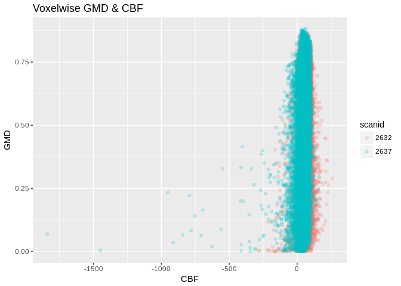
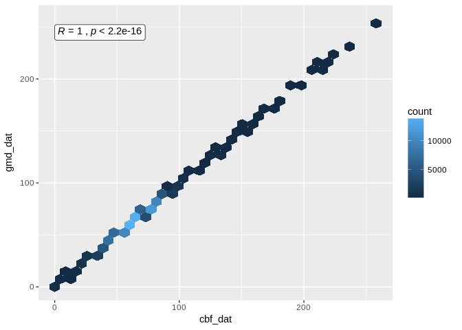

GMD Correlation Plots
================
Tinashe M. Tapera
2018-02-04

``` {.r}
suppressPackageStartupMessages({
  library(tidyr)
  library(dplyr)
  library(knitr)
  library(ggplot2)
  library(magrittr)
  library(stringr)
  library(oro.nifti)
  library(purrr)
  library(ggpubr)
})
```

    ## Warning in .doLoadActions(where, attach): trying to execute load actions
    ## without 'methods' package

    ## Warning: replacing previous import by 'methods::slot<-' when loading
    ## 'oro.nifti'

    ## Warning: replacing previous import by 'methods::as' when loading
    ## 'oro.nifti'

    ## Warning: replacing previous import by 'methods::slotNames' when loading
    ## 'oro.nifti'

    ## Warning: package 'ggpubr' was built under R version 3.4.1

``` {.r}
set.seed(1000)
SAMPLE <- TRUE # sample the full data if memory is limited e.g. not in qsub
```

Introduction
============

Here we visualise the relationship between voxelwise GMD values and CBF, Alff, and Reho in the PNC sample for ISLA. To start, a demonstration of how to create mean measures from NIfTI images.

``` {.r}
gmd_path <- "/data/joy/BBL/studies/pnc/n1601_dataFreeze/neuroimaging/t1struct/voxelwiseMaps_gmd"

gmd_example <-
  list.files(gmd_path,
    pattern = regex("[^tmp.nii.gz]"),
    full.names = TRUE) [1] %>%
  readNIfTI(.)

img_dat <- img_data(gmd_example)
print(paste0("The mean GMD for this participant is ", round(mean(img_dat), 5)))
```

    ## [1] "The mean GMD for this participant is 0.0692"

Use the `purrr` package to map this process. \# GMD\~CBF First, calculate means for CBF

``` {.r}
# get the sample
cbf_sample <- read.csv("/data/jux/BBL/projects/isla/data/cbfSample.csv") %>%
  select(-X) %>%
  { if( SAMPLE ) sample_n(., 50) } %>%
  {.}

# read in the images
gmd_images <-
  list.files(gmd_path,
    pattern = regex("[^tmp.nii.gz]"),
    full.names = TRUE) %>%
  tibble(path = .) %>%
  mutate(scanid = str_extract(path, "(?<=/)[:digit:]{4,}")) %>%
  select(scanid, everything()) %>%
  filter(scanid %in% cbf_sample$scanid) %>%
  mutate(nifti = map(.x = path, .f = readNIfTI))

# calculate means
gmd_images <- gmd_images %>%
  mutate(
    mean_gmd = map(nifti, .f = function(img){
      dat <- img_data(img)
      return(mean(dat))
    })) %>%
  select(-nifti) %>%
  unnest()
```

And then do the same for CBF

``` {.r}
# read in the images
cbf_path <- "/data/joy/BBL/studies/pnc/n1601_dataFreeze/neuroimaging/asl/voxelwiseMaps_cbf"

cbf_images <-
  list.files(cbf_path,
    pattern = regex("[^tmp.nii.gz]"),
    full.names = TRUE) %>%
  tibble(path = .) %>%
  mutate(scanid = str_extract(path, "(?<=/)[:digit:]{4,}")) %>%
  select(scanid, everything()) %>%
  filter(scanid %in% cbf_sample$scanid) %>%
  mutate(nifti = map(.x = path, .f = readNIfTI))

# calculate means
cbf_images <- cbf_images %>%
  mutate(
    mean_cbf = map(nifti, .f = function(img){
      dat <- img_data(img)
      return(mean(dat))
    })) %>%
  select(-nifti) %>%
  unnest()
```

Now, join the means and plot

``` {.r}
cbf_images %>%
  left_join(gmd_images, by = "scanid") %>%
  select(mean_gmd, mean_cbf) %>%
  ggplot(., aes(x = mean_gmd, y = mean_cbf)) +
    geom_point() +
    geom_smooth(method = "lm") +
    stat_cor(method = "pearson") +
    theme_minimal() +
    labs(title = "Correlation Between GMD and CBF per Participant") +
    NULL
```



Using the same method, we can calculate the correlation between GMD and Alff, and GMD and Reho \# GMD\~Alff

``` {.r}
# get the sample
rest_sample <- read.csv("/data/jux/BBL/projects/isla/data/restSample.csv") %>%
  select(-X) %>%
  { if( SAMPLE ) sample_n(., 50) } %>%
  {.}
# read in the images
gmd_images <-
  list.files(gmd_path,
    pattern = regex("[^tmp.nii.gz]"),
    full.names = TRUE) %>%
  tibble(path = .) %>%
  mutate(scanid = str_extract(path, "(?<=/)[:digit:]{4,}")) %>%
  select(scanid, everything()) %>%
  filter(scanid %in% rest_sample$scanid) %>%
  mutate(nifti = map(.x = path, .f = readNIfTI))

# calculate means
gmd_images <- gmd_images %>%
  mutate(
    mean_gmd = map(nifti, .f = function(img){
      dat <- img_data(img)
      return(mean(dat))
    })) %>%
  select(-nifti) %>%
  unnest()

# read in the images
alff_path <- "/data/joy/BBL/studies/pnc/n1601_dataFreeze/neuroimaging/rest/voxelwiseMaps_alff"

alff_images <-
  list.files(alff_path,
    pattern = regex("[^tmp.nii.gz]"),
    full.names = TRUE) %>%
  tibble(path = .) %>%
  mutate(scanid = str_extract(path, "(?<=/)[:digit:]{4,}")) %>%
  select(scanid, everything()) %>%
  filter(scanid %in% rest_sample$scanid) %>%
  mutate(nifti = map(.x = path, .f = readNIfTI))

# calculate means
alff_images <- alff_images %>%
  mutate(
    mean_alff = map(nifti, .f = function(img){
      dat <- img_data(img)
      return(mean(dat))
    })) %>%
  select(-nifti) %>%
  unnest()
```

Now, join the means and plot

``` {.r}
alff_images %>%
  left_join(gmd_images, by = "scanid") %>%
  select(mean_gmd, mean_alff) %>%
  ggplot(aes(x = mean_gmd, y= mean_alff)) +
    geom_point() +
    geom_smooth(method = "lm") +
    stat_cor(method = "pearson") +
    theme_minimal() +
    labs(title = "Correlation Between GMD and Alff per Participant") +
    NULL
```



GMD\~Reho

``` {.r}
# read in the images
reho_path <- "/data/joy/BBL/studies/pnc/n1601_dataFreeze/neuroimaging/rest/voxelwiseMaps_reho"

reho_images <-
  list.files(reho_path,
    pattern = regex("[^tmp.nii.gz]"),
    full.names = TRUE) %>%
  tibble(path = .) %>%
  mutate(scanid = str_extract(path, "(?<=/)[:digit:]{4,}")) %>%
  select(scanid, everything()) %>%
  filter(scanid %in% rest_sample$scanid) %>%
  mutate(nifti = map(.x = path, .f = readNIfTI))

# calculate means
reho_images <- reho_images %>%
  mutate(
    mean_reho = map(nifti, .f = function(img){
      dat <- img_data(img)
      return(mean(dat))
    })) %>%
  select(-nifti) %>%
  unnest()
```

Now, join the means and plot

``` {.r}
reho_images %>%
  left_join(gmd_images, by = "scanid") %>%
  select(mean_gmd, mean_reho) %>%
  ggplot(aes(x = mean_gmd, y= mean_reho)) +
    geom_point() +
    geom_smooth(method = "lm") +
    stat_cor(method = "pearson") +
    theme_minimal() +
    labs(title = "Correlation Between GMD and Reho per Participant") +
    NULL
```


Done! Session info:

``` {.r}
print(R.version.string)
```

    ## [1] "R version 3.2.3 (2015-12-10)"

``` {.r}
print(paste("Updated:", format(Sys.time(), "%Y-%m-%d")))
```

    ## [1] "Updated: 2019-02-04"
