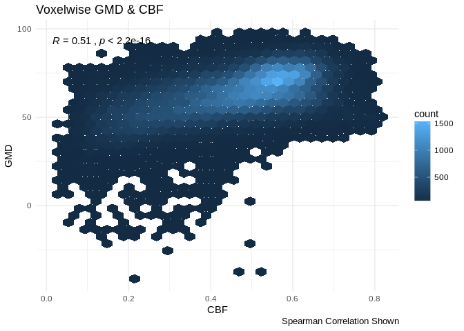
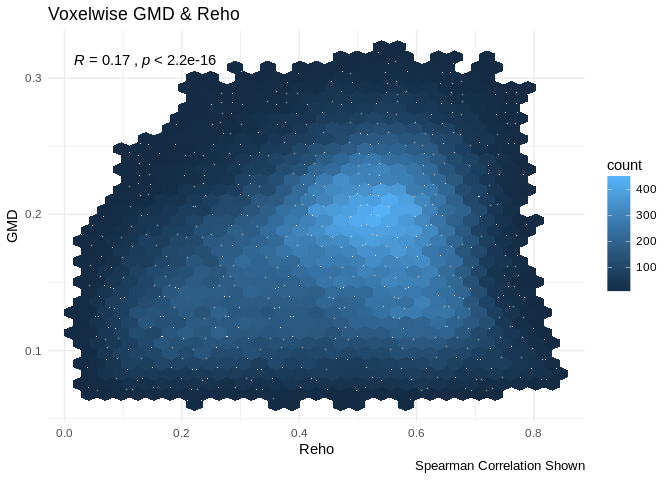

GMD Correlation Plots
================
Tinashe M. Tapera
2018-02-04

``` r
suppressPackageStartupMessages({
  library(tidyr, quietly = TRUE)
  library(dplyr, quietly = TRUE)
  library(knitr, quietly = TRUE)
  library(ggplot2, quietly = TRUE)
  library(magrittr, quietly = TRUE)
  library(stringr, quietly = TRUE)
  library(oro.nifti, quietly = TRUE)
  library(purrr, quietly = TRUE)
  library(ggpubr, quietly = TRUE)
  library(fslr, quietly = TRUE)
})
set.seed(1000)
SAMPLE <- TRUE # sample the full data if memory is limited e.g. not in qsub
```

Introduction
============

Here we visualise the relationship between voxelwise GMD values and CBF, Alff, and Reho in the PNC sample for ISLA. This method uses spatial correlation between two variables. As an example, here we calculate the spatial correlation between two participant's GMD and CBF measures.

``` r
gmd_path <- file.path("/data/joy/BBL/studies/pnc/n1601_dataFreeze/neuroimaging/t1struct/voxelwiseMaps_gmd")
mask_path <- file.path("/data/jux/BBL/projects/isla/data/Masks/gm10perc_PcaslCoverageMask.nii.gz")
cbf_path <- file.path("/data/joy/BBL/studies/pnc/n1601_dataFreeze/neuroimaging/asl/voxelwiseMaps_cbf")

# two gmd images
gmd_example <-
  list.files(gmd_path,
    pattern = regex("[^tmp.nii.gz]"),
    full.names = TRUE)[1:2] %>%
  tibble(path = .) %>%
  mutate(scanid = str_extract(path, "(?<=/)[:digit:]{4,}")) %>%
  select(scanid, everything())

# the same scanid's cbf images
cbf_example <-
  list.files(cbf_path,
    pattern = regex("[^tmp.nii.gz]"),
    full.names = TRUE) %>%
  tibble(path = .) %>%
  mutate(scanid = str_extract(path, "(?<=/)[:digit:]{4,}")) %>%
  select(scanid, everything()) %>%
  filter(scanid == gmd_example$scanid)

# the mask for this sample
pcasl_mask <- readNIfTI(mask_path)
gmd_example <- gmd_example %>%
  mutate(nifti = fsl_mask(path, mask = pcasl_mask))
```

    ## fslmaths "/data/joy/BBL/studies/pnc/n1601_dataFreeze/neuroimaging/t1struct/voxelwiseMaps_gmd/2632_atropos3class_prob02SubjToTemp2mm.nii.gz" -mas "/tmp/4267281.1.all.q/RtmpsW9Wgm/file6931738051ec.nii.gz"  "/tmp/4267281.1.all.q/RtmpsW9Wgm/file693154952388"fslmaths "/data/joy/BBL/studies/pnc/n1601_dataFreeze/neuroimaging/t1struct/voxelwiseMaps_gmd/2637_atropos3class_prob02SubjToTemp2mm.nii.gz" -mas "/tmp/4267281.1.all.q/RtmpsW9Wgm/file6931738051ec.nii.gz"  "/tmp/4267281.1.all.q/RtmpsW9Wgm/file693154952388"

``` r
cbf_example <- cbf_example %>%
  mutate(nifti = fsl_mask(path, mask = pcasl_mask))
```

    ## fslmaths "/data/joy/BBL/studies/pnc/n1601_dataFreeze/neuroimaging/asl/voxelwiseMaps_cbf/2632_asl_quant_ssT1Std.nii.gz" -mas "/tmp/4267281.1.all.q/RtmpsW9Wgm/file693131230316.nii.gz"  "/tmp/4267281.1.all.q/RtmpsW9Wgm/file69314d572c81"fslmaths "/data/joy/BBL/studies/pnc/n1601_dataFreeze/neuroimaging/asl/voxelwiseMaps_cbf/2637_asl_quant_ssT1Std.nii.gz" -mas "/tmp/4267281.1.all.q/RtmpsW9Wgm/file693131230316.nii.gz"  "/tmp/4267281.1.all.q/RtmpsW9Wgm/file69314d572c81"

Next we use `fslmerge` to merge the CBF images into one volume:

``` r
merged_cbf <-
  fslmerge(
    cbf_example$path,
    direction = c("t"),
    retimg = TRUE
  )
```

    ## fslmerge -t "/tmp/4267281.1.all.q/RtmpsW9Wgm/file69316e9c8c1f" /data/joy/BBL/studies/pnc/n1601_dataFreeze/neuroimaging/asl/voxelwiseMaps_cbf/2632_asl_quant_ssT1Std.nii.gz /data/joy/BBL/studies/pnc/n1601_dataFreeze/neuroimaging/asl/voxelwiseMaps_cbf/2637_asl_quant_ssT1Std.nii.gz

And the GMD into one volume:

``` r
merged_gmd <-
  fslmerge(
    gmd_example$path,
    direction = c("t"),
    retimg = TRUE
  )
```

    ## fslmerge -t "/tmp/4267281.1.all.q/RtmpsW9Wgm/file69312017b701" /data/joy/BBL/studies/pnc/n1601_dataFreeze/neuroimaging/t1struct/voxelwiseMaps_gmd/2632_atropos3class_prob02SubjToTemp2mm.nii.gz /data/joy/BBL/studies/pnc/n1601_dataFreeze/neuroimaging/t1struct/voxelwiseMaps_gmd/2637_atropos3class_prob02SubjToTemp2mm.nii.gz

Then we calculate the mean values using `fslmaths`

``` r
mean_cbf <- fslmaths(merged_cbf, opts = "-Tmean")
```

    ## fslmaths "/tmp/4267281.1.all.q/RtmpsW9Wgm/file693154642e38.nii.gz"  -Tmean "/tmp/4267281.1.all.q/RtmpsW9Wgm/file6931b587fbb";

``` r
mean_gmd <- fslmaths(merged_gmd, opts = "-Tmean")
```

    ## fslmaths "/tmp/4267281.1.all.q/RtmpsW9Wgm/file69314e364e2a.nii.gz"  -Tmean "/tmp/4267281.1.all.q/RtmpsW9Wgm/file69311124071a";

From here, we can extract the data from the images and plot it:

``` r
cbf_dat <- img_data(mean_cbf) %>%
  .[pcasl_mask != 0]
gmd_dat <- img_data(mean_gmd) %>%
  .[pcasl_mask != 0]

df <- data_frame(cbf_dat, gmd_dat)
df %>%
  ggplot(aes(x = cbf_dat, y = gmd_dat)) +
    geom_hex()
```

    ## Loading required package: methods


Looks good!

GMD~CBF
=======

We specify the sample here:

``` r
cbf_sample <- read.csv("/data/jux/BBL/projects/isla/data/cbfSample.csv") %>%
  select(-X) %>%
  { if( SAMPLE ) sample_n(., 400) else .}
```

And read in the images:

``` r
gmd_images <-
  list.files(gmd_path,
    pattern = regex("[^tmp.nii.gz]"),
    full.names = TRUE) %>%
  tibble(path = .) %>%
  mutate(scanid = str_extract(path, "(?<=/)[:digit:]{4,}")) %>%
  filter(scanid %in% cbf_sample$scanid) %>%
  select(scanid, everything())

cbf_images <-
  list.files(cbf_path,
    pattern = regex("[^tmp.nii.gz]"),
    full.names = TRUE) %>%
  tibble(path = .) %>%
  mutate(scanid = str_extract(path, "(?<=/)[:digit:]{4,}")) %>%
  filter(scanid %in% cbf_sample$scanid) %>%
  select(scanid, everything())

read_and_load <- function(path, mask){

  dat <- readNIfTI(path)
  dat <- img_data(dat)

  dat[mask != 0]

}
```

Join paths; then 1) merge, 2) mean, and 3) mask the images:

``` r
df <- left_join(gmd_images, cbf_images, by = "scanid") %>%
  summarise_at(
    .vars = vars(contains("path")),
    .funs = fsl_merge,
    direction = c("t")
  ) %>%
  summarise_at(
    .vars = vars(contains("path")),
    .funs = fsl_maths,
    opts = c("-Tmean")
  )
```

    ## fslmerge -t "/tmp/4267281.1.all.q/RtmpsW9Wgm/file693155e1731f" /data/joy/BBL/studies/pnc/n1601_dataFreeze/neuroimaging/t1struct/voxelwiseMaps_gmd/2725_atropos3class_prob02SubjToTemp2mm.nii.gz /data/joy/BBL/studies/pnc/n1601_dataFreeze/neuroimaging/t1struct/voxelwiseMaps_gmd/2738_atropos3class_prob02SubjToTemp2mm.nii.gz /data/joy/BBL/studies/pnc/n1601_dataFreeze/neuroimaging/t1struct/voxelwiseMaps_gmd/2740_atropos3class_prob02SubjToTemp2mm.nii.gz /data/joy/BBL/studies/pnc/n1601_dataFreeze/neuroimaging/t1struct/voxelwiseMaps_gmd/2751_atropos3class_prob02SubjToTemp2mm.nii.gz /data/joy/BBL/studies/pnc/n1601_dataFreeze/neuroimaging/t1struct/voxelwiseMaps_gmd/2796_atropos3class_prob02SubjToTemp2mm.nii.gz /data/joy/BBL/studies/pnc/n1601_dataFreeze/neuroimaging/t1struct/voxelwiseMaps_gmd/2854_atropos3class_prob02SubjToTemp2mm.nii.gz /data/joy/BBL/studies/pnc/n1601_dataFreeze/neuroimaging/t1struct/voxelwiseMaps_gmd/2896_atropos3class_prob02SubjToTemp2mm.nii.gz /data/joy/BBL/studies/pnc/n1601_dataFreeze/neuroimaging/t1struct/voxelwiseMaps_gmd/2909_atropos3class_prob02SubjToTemp2mm.nii.gz /data/joy/BBL/studies/pnc/n1601_dataFreeze/neuroimaging/t1struct/voxelwiseMaps_gmd/2922_atropos3class_prob02SubjToTemp2mm.nii.gz /data/joy/BBL/studies/pnc/n1601_dataFreeze/neuroimaging/t1struct/voxelwiseMaps_gmd/2952_atropos3class_prob02SubjToTemp2mm.nii.gz /data/joy/BBL/studies/pnc/n1601_dataFreeze/neuroimaging/t1struct/voxelwiseMaps_gmd/2954_atropos3class_prob02SubjToTemp2mm.nii.gz /data/joy/BBL/studies/pnc/n1601_dataFreeze/neuroimaging/t1struct/voxelwiseMaps_gmd/3033_atropos3class_prob02SubjToTemp2mm.nii.gz /data/joy/BBL/studies/pnc/n1601_dataFreeze/neuroimaging/t1struct/voxelwiseMaps_gmd/3039_atropos3class_prob02SubjToTemp2mm.nii.gz /data/joy/BBL/studies/pnc/n1601_dataFreeze/neuroimaging/t1struct/voxelwiseMaps_gmd/3040_atropos3class_prob02SubjToTemp2mm.nii.gz /data/joy/BBL/studies/pnc/n1601_dataFreeze/neuroimaging/t1struct/voxelwiseMaps_gmd/3045_atropos3class_prob02SubjToTemp2mm.nii.gz /data/joy/BBL/studies/pnc/n1601_dataFreeze/neuroimaging/t1struct/voxelwiseMaps_gmd/3081_atropos3class_prob02SubjToTemp2mm.nii.gz /data/joy/BBL/studies/pnc/n1601_dataFreeze/neuroimaging/t1struct/voxelwiseMaps_gmd/3116_atropos3class_prob02SubjToTemp2mm.nii.gz /data/joy/BBL/studies/pnc/n1601_dataFreeze/neuroimaging/t1struct/voxelwiseMaps_gmd/3144_atropos3class_prob02SubjToTemp2mm.nii.gz /data/joy/BBL/studies/pnc/n1601_dataFreeze/neuroimaging/t1struct/voxelwiseMaps_gmd/3145_atropos3class_prob02SubjToTemp2mm.nii.gz /data/joy/BBL/studies/pnc/n1601_dataFreeze/neuroimaging/t1struct/voxelwiseMaps_gmd/3184_atropos3class_prob02SubjToTemp2mm.nii.gz /data/joy/BBL/studies/pnc/n1601_dataFreeze/neuroimaging/t1struct/voxelwiseMaps_gmd/3202_atropos3class_prob02SubjToTemp2mm.nii.gz /data/joy/BBL/studies/pnc/n1601_dataFreeze/neuroimaging/t1struct/voxelwiseMaps_gmd/3209_atropos3class_prob02SubjToTemp2mm.nii.gz /data/joy/BBL/studies/pnc/n1601_dataFreeze/neuroimaging/t1struct/voxelwiseMaps_gmd/3224_atropos3class_prob02SubjToTemp2mm.nii.gz /data/joy/BBL/studies/pnc/n1601_dataFreeze/neuroimaging/t1struct/voxelwiseMaps_gmd/3230_atropos3class_prob02SubjToTemp2mm.nii.gz /data/joy/BBL/studies/pnc/n1601_dataFreeze/neuroimaging/t1struct/voxelwiseMaps_gmd/3234_atropos3class_prob02SubjToTemp2mm.nii.gz /data/joy/BBL/studies/pnc/n1601_dataFreeze/neuroimaging/t1struct/voxelwiseMaps_gmd/3235_atropos3class_prob02SubjToTemp2mm.nii.gz /data/joy/BBL/studies/pnc/n1601_dataFreeze/neuroimaging/t1struct/voxelwiseMaps_gmd/3245_atropos3class_prob02SubjToTemp2mm.nii.gz /data/joy/BBL/studies/pnc/n1601_dataFreeze/neuroimaging/t1struct/voxelwiseMaps_gmd/3284_atropos3class_prob02SubjToTemp2mm.nii.gz /data/joy/BBL/studies/pnc/n1601_dataFreeze/neuroimaging/t1struct/voxelwiseMaps_gmd/3291_atropos3class_prob02SubjToTemp2mm.nii.gz /data/joy/BBL/studies/pnc/n1601_dataFreeze/neuroimaging/t1struct/voxelwiseMaps_gmd/3295_atropos3class_prob02SubjToTemp2mm.nii.gz /data/joy/BBL/studies/pnc/n1601_dataFreeze/neuroimaging/t1struct/voxelwiseMaps_gmd/3308_atropos3class_prob02SubjToTemp2mm.nii.gz /data/joy/BBL/studies/pnc/n1601_dataFreeze/neuroimaging/t1struct/voxelwiseMaps_gmd/3309_atropos3class_prob02SubjToTemp2mm.nii.gz /data/joy/BBL/studies/pnc/n1601_dataFreeze/neuroimaging/t1struct/voxelwiseMaps_gmd/3316_atropos3class_prob02SubjToTemp2mm.nii.gz /data/joy/BBL/studies/pnc/n1601_dataFreeze/neuroimaging/t1struct/voxelwiseMaps_gmd/3322_atropos3class_prob02SubjToTemp2mm.nii.gz /data/joy/BBL/studies/pnc/n1601_dataFreeze/neuroimaging/t1struct/voxelwiseMaps_gmd/3323_atropos3class_prob02SubjToTemp2mm.nii.gz /data/joy/BBL/studies/pnc/n1601_dataFreeze/neuroimaging/t1struct/voxelwiseMaps_gmd/3326_atropos3class_prob02SubjToTemp2mm.nii.gz /data/joy/BBL/studies/pnc/n1601_dataFreeze/neuroimaging/t1struct/voxelwiseMaps_gmd/3346_atropos3class_prob02SubjToTemp2mm.nii.gz /data/joy/BBL/studies/pnc/n1601_dataFreeze/neuroimaging/t1struct/voxelwiseMaps_gmd/3350_atropos3class_prob02SubjToTemp2mm.nii.gz /data/joy/BBL/studies/pnc/n1601_dataFreeze/neuroimaging/t1struct/voxelwiseMaps_gmd/3411_atropos3class_prob02SubjToTemp2mm.nii.gz /data/joy/BBL/studies/pnc/n1601_dataFreeze/neuroimaging/t1struct/voxelwiseMaps_gmd/3428_atropos3class_prob02SubjToTemp2mm.nii.gz /data/joy/BBL/studies/pnc/n1601_dataFreeze/neuroimaging/t1struct/voxelwiseMaps_gmd/3430_atropos3class_prob02SubjToTemp2mm.nii.gz /data/joy/BBL/studies/pnc/n1601_dataFreeze/neuroimaging/t1struct/voxelwiseMaps_gmd/3457_atropos3class_prob02SubjToTemp2mm.nii.gz /data/joy/BBL/studies/pnc/n1601_dataFreeze/neuroimaging/t1struct/voxelwiseMaps_gmd/3466_atropos3class_prob02SubjToTemp2mm.nii.gz /data/joy/BBL/studies/pnc/n1601_dataFreeze/neuroimaging/t1struct/voxelwiseMaps_gmd/3467_atropos3class_prob02SubjToTemp2mm.nii.gz /data/joy/BBL/studies/pnc/n1601_dataFreeze/neuroimaging/t1struct/voxelwiseMaps_gmd/3475_atropos3class_prob02SubjToTemp2mm.nii.gz /data/joy/BBL/studies/pnc/n1601_dataFreeze/neuroimaging/t1struct/voxelwiseMaps_gmd/3494_atropos3class_prob02SubjToTemp2mm.nii.gz /data/joy/BBL/studies/pnc/n1601_dataFreeze/neuroimaging/t1struct/voxelwiseMaps_gmd/3500_atropos3class_prob02SubjToTemp2mm.nii.gz /data/joy/BBL/studies/pnc/n1601_dataFreeze/neuroimaging/t1struct/voxelwiseMaps_gmd/3512_atropos3class_prob02SubjToTemp2mm.nii.gz /data/joy/BBL/studies/pnc/n1601_dataFreeze/neuroimaging/t1struct/voxelwiseMaps_gmd/3513_atropos3class_prob02SubjToTemp2mm.nii.gz /data/joy/BBL/studies/pnc/n1601_dataFreeze/neuroimaging/t1struct/voxelwiseMaps_gmd/3524_atropos3class_prob02SubjToTemp2mm.nii.gz /data/joy/BBL/studies/pnc/n1601_dataFreeze/neuroimaging/t1struct/voxelwiseMaps_gmd/3536_atropos3class_prob02SubjToTemp2mm.nii.gz /data/joy/BBL/studies/pnc/n1601_dataFreeze/neuroimaging/t1struct/voxelwiseMaps_gmd/3543_atropos3class_prob02SubjToTemp2mm.nii.gz /data/joy/BBL/studies/pnc/n1601_dataFreeze/neuroimaging/t1struct/voxelwiseMaps_gmd/3567_atropos3class_prob02SubjToTemp2mm.nii.gz /data/joy/BBL/studies/pnc/n1601_dataFreeze/neuroimaging/t1struct/voxelwiseMaps_gmd/3582_atropos3class_prob02SubjToTemp2mm.nii.gz /data/joy/BBL/studies/pnc/n1601_dataFreeze/neuroimaging/t1struct/voxelwiseMaps_gmd/3595_atropos3class_prob02SubjToTemp2mm.nii.gz /data/joy/BBL/studies/pnc/n1601_dataFreeze/neuroimaging/t1struct/voxelwiseMaps_gmd/3596_atropos3class_prob02SubjToTemp2mm.nii.gz /data/joy/BBL/studies/pnc/n1601_dataFreeze/neuroimaging/t1struct/voxelwiseMaps_gmd/3615_atropos3class_prob02SubjToTemp2mm.nii.gz /data/joy/BBL/studies/pnc/n1601_dataFreeze/neuroimaging/t1struct/voxelwiseMaps_gmd/3616_atropos3class_prob02SubjToTemp2mm.nii.gz /data/joy/BBL/studies/pnc/n1601_dataFreeze/neuroimaging/t1struct/voxelwiseMaps_gmd/3618_atropos3class_prob02SubjToTemp2mm.nii.gz /data/joy/BBL/studies/pnc/n1601_dataFreeze/neuroimaging/t1struct/voxelwiseMaps_gmd/3635_atropos3class_prob02SubjToTemp2mm.nii.gz /data/joy/BBL/studies/pnc/n1601_dataFreeze/neuroimaging/t1struct/voxelwiseMaps_gmd/3645_atropos3class_prob02SubjToTemp2mm.nii.gz /data/joy/BBL/studies/pnc/n1601_dataFreeze/neuroimaging/t1struct/voxelwiseMaps_gmd/3646_atropos3class_prob02SubjToTemp2mm.nii.gz /data/joy/BBL/studies/pnc/n1601_dataFreeze/neuroimaging/t1struct/voxelwiseMaps_gmd/3647_atropos3class_prob02SubjToTemp2mm.nii.gz /data/joy/BBL/studies/pnc/n1601_dataFreeze/neuroimaging/t1struct/voxelwiseMaps_gmd/3648_atropos3class_prob02SubjToTemp2mm.nii.gz /data/joy/BBL/studies/pnc/n1601_dataFreeze/neuroimaging/t1struct/voxelwiseMaps_gmd/3676_atropos3class_prob02SubjToTemp2mm.nii.gz /data/joy/BBL/studies/pnc/n1601_dataFreeze/neuroimaging/t1struct/voxelwiseMaps_gmd/3681_atropos3class_prob02SubjToTemp2mm.nii.gz /data/joy/BBL/studies/pnc/n1601_dataFreeze/neuroimaging/t1struct/voxelwiseMaps_gmd/3692_atropos3class_prob02SubjToTemp2mm.nii.gz /data/joy/BBL/studies/pnc/n1601_dataFreeze/neuroimaging/t1struct/voxelwiseMaps_gmd/3708_atropos3class_prob02SubjToTemp2mm.nii.gz /data/joy/BBL/studies/pnc/n1601_dataFreeze/neuroimaging/t1struct/voxelwiseMaps_gmd/3714_atropos3class_prob02SubjToTemp2mm.nii.gz /data/joy/BBL/studies/pnc/n1601_dataFreeze/neuroimaging/t1struct/voxelwiseMaps_gmd/3726_atropos3class_prob02SubjToTemp2mm.nii.gz /data/joy/BBL/studies/pnc/n1601_dataFreeze/neuroimaging/t1struct/voxelwiseMaps_gmd/3738_atropos3class_prob02SubjToTemp2mm.nii.gz /data/joy/BBL/studies/pnc/n1601_dataFreeze/neuroimaging/t1struct/voxelwiseMaps_gmd/3755_atropos3class_prob02SubjToTemp2mm.nii.gz /data/joy/BBL/studies/pnc/n1601_dataFreeze/neuroimaging/t1struct/voxelwiseMaps_gmd/3757_atropos3class_prob02SubjToTemp2mm.nii.gz /data/joy/BBL/studies/pnc/n1601_dataFreeze/neuroimaging/t1struct/voxelwiseMaps_gmd/3798_atropos3class_prob02SubjToTemp2mm.nii.gz /data/joy/BBL/studies/pnc/n1601_dataFreeze/neuroimaging/t1struct/voxelwiseMaps_gmd/3799_atropos3class_prob02SubjToTemp2mm.nii.gz /data/joy/BBL/studies/pnc/n1601_dataFreeze/neuroimaging/t1struct/voxelwiseMaps_gmd/3816_atropos3class_prob02SubjToTemp2mm.nii.gz /data/joy/BBL/studies/pnc/n1601_dataFreeze/neuroimaging/t1struct/voxelwiseMaps_gmd/3844_atropos3class_prob02SubjToTemp2mm.nii.gz /data/joy/BBL/studies/pnc/n1601_dataFreeze/neuroimaging/t1struct/voxelwiseMaps_gmd/3853_atropos3class_prob02SubjToTemp2mm.nii.gz /data/joy/BBL/studies/pnc/n1601_dataFreeze/neuroimaging/t1struct/voxelwiseMaps_gmd/3856_atropos3class_prob02SubjToTemp2mm.nii.gz /data/joy/BBL/studies/pnc/n1601_dataFreeze/neuroimaging/t1struct/voxelwiseMaps_gmd/3894_atropos3class_prob02SubjToTemp2mm.nii.gz /data/joy/BBL/studies/pnc/n1601_dataFreeze/neuroimaging/t1struct/voxelwiseMaps_gmd/3912_atropos3class_prob02SubjToTemp2mm.nii.gz /data/joy/BBL/studies/pnc/n1601_dataFreeze/neuroimaging/t1struct/voxelwiseMaps_gmd/3919_atropos3class_prob02SubjToTemp2mm.nii.gz /data/joy/BBL/studies/pnc/n1601_dataFreeze/neuroimaging/t1struct/voxelwiseMaps_gmd/3924_atropos3class_prob02SubjToTemp2mm.nii.gz /data/joy/BBL/studies/pnc/n1601_dataFreeze/neuroimaging/t1struct/voxelwiseMaps_gmd/3962_atropos3class_prob02SubjToTemp2mm.nii.gz /data/joy/BBL/studies/pnc/n1601_dataFreeze/neuroimaging/t1struct/voxelwiseMaps_gmd/3966_atropos3class_prob02SubjToTemp2mm.nii.gz /data/joy/BBL/studies/pnc/n1601_dataFreeze/neuroimaging/t1struct/voxelwiseMaps_gmd/3967_atropos3class_prob02SubjToTemp2mm.nii.gz /data/joy/BBL/studies/pnc/n1601_dataFreeze/neuroimaging/t1struct/voxelwiseMaps_gmd/4004_atropos3class_prob02SubjToTemp2mm.nii.gz /data/joy/BBL/studies/pnc/n1601_dataFreeze/neuroimaging/t1struct/voxelwiseMaps_gmd/4007_atropos3class_prob02SubjToTemp2mm.nii.gz /data/joy/BBL/studies/pnc/n1601_dataFreeze/neuroimaging/t1struct/voxelwiseMaps_gmd/4010_atropos3class_prob02SubjToTemp2mm.nii.gz /data/joy/BBL/studies/pnc/n1601_dataFreeze/neuroimaging/t1struct/voxelwiseMaps_gmd/4021_atropos3class_prob02SubjToTemp2mm.nii.gz /data/joy/BBL/studies/pnc/n1601_dataFreeze/neuroimaging/t1struct/voxelwiseMaps_gmd/4040_atropos3class_prob02SubjToTemp2mm.nii.gz /data/joy/BBL/studies/pnc/n1601_dataFreeze/neuroimaging/t1struct/voxelwiseMaps_gmd/4069_atropos3class_prob02SubjToTemp2mm.nii.gz /data/joy/BBL/studies/pnc/n1601_dataFreeze/neuroimaging/t1struct/voxelwiseMaps_gmd/4071_atropos3class_prob02SubjToTemp2mm.nii.gz /data/joy/BBL/studies/pnc/n1601_dataFreeze/neuroimaging/t1struct/voxelwiseMaps_gmd/4079_atropos3class_prob02SubjToTemp2mm.nii.gz /data/joy/BBL/studies/pnc/n1601_dataFreeze/neuroimaging/t1struct/voxelwiseMaps_gmd/4094_atropos3class_prob02SubjToTemp2mm.nii.gz /data/joy/BBL/studies/pnc/n1601_dataFreeze/neuroimaging/t1struct/voxelwiseMaps_gmd/4101_atropos3class_prob02SubjToTemp2mm.nii.gz /data/joy/BBL/studies/pnc/n1601_dataFreeze/neuroimaging/t1struct/voxelwiseMaps_gmd/4103_atropos3class_prob02SubjToTemp2mm.nii.gz /data/joy/BBL/studies/pnc/n1601_dataFreeze/neuroimaging/t1struct/voxelwiseMaps_gmd/4119_atropos3class_prob02SubjToTemp2mm.nii.gz /data/joy/BBL/studies/pnc/n1601_dataFreeze/neuroimaging/t1struct/voxelwiseMaps_gmd/4150_atropos3class_prob02SubjToTemp2mm.nii.gz /data/joy/BBL/studies/pnc/n1601_dataFreeze/neuroimaging/t1struct/voxelwiseMaps_gmd/4156_atropos3class_prob02SubjToTemp2mm.nii.gz /data/joy/BBL/studies/pnc/n1601_dataFreeze/neuroimaging/t1struct/voxelwiseMaps_gmd/4172_atropos3class_prob02SubjToTemp2mm.nii.gz /data/joy/BBL/studies/pnc/n1601_dataFreeze/neuroimaging/t1struct/voxelwiseMaps_gmd/4173_atropos3class_prob02SubjToTemp2mm.nii.gz /data/joy/BBL/studies/pnc/n1601_dataFreeze/neuroimaging/t1struct/voxelwiseMaps_gmd/4202_atropos3class_prob02SubjToTemp2mm.nii.gz /data/joy/BBL/studies/pnc/n1601_dataFreeze/neuroimaging/t1struct/voxelwiseMaps_gmd/4203_atropos3class_prob02SubjToTemp2mm.nii.gz /data/joy/BBL/studies/pnc/n1601_dataFreeze/neuroimaging/t1struct/voxelwiseMaps_gmd/4209_atropos3class_prob02SubjToTemp2mm.nii.gz /data/joy/BBL/studies/pnc/n1601_dataFreeze/neuroimaging/t1struct/voxelwiseMaps_gmd/4212_atropos3class_prob02SubjToTemp2mm.nii.gz /data/joy/BBL/studies/pnc/n1601_dataFreeze/neuroimaging/t1struct/voxelwiseMaps_gmd/4222_atropos3class_prob02SubjToTemp2mm.nii.gz /data/joy/BBL/studies/pnc/n1601_dataFreeze/neuroimaging/t1struct/voxelwiseMaps_gmd/4241_atropos3class_prob02SubjToTemp2mm.nii.gz /data/joy/BBL/studies/pnc/n1601_dataFreeze/neuroimaging/t1struct/voxelwiseMaps_gmd/4242_atropos3class_prob02SubjToTemp2mm.nii.gz /data/joy/BBL/studies/pnc/n1601_dataFreeze/neuroimaging/t1struct/voxelwiseMaps_gmd/4248_atropos3class_prob02SubjToTemp2mm.nii.gz /data/joy/BBL/studies/pnc/n1601_dataFreeze/neuroimaging/t1struct/voxelwiseMaps_gmd/4264_atropos3class_prob02SubjToTemp2mm.nii.gz /data/joy/BBL/studies/pnc/n1601_dataFreeze/neuroimaging/t1struct/voxelwiseMaps_gmd/4266_atropos3class_prob02SubjToTemp2mm.nii.gz /data/joy/BBL/studies/pnc/n1601_dataFreeze/neuroimaging/t1struct/voxelwiseMaps_gmd/4278_atropos3class_prob02SubjToTemp2mm.nii.gz /data/joy/BBL/studies/pnc/n1601_dataFreeze/neuroimaging/t1struct/voxelwiseMaps_gmd/4284_atropos3class_prob02SubjToTemp2mm.nii.gz /data/joy/BBL/studies/pnc/n1601_dataFreeze/neuroimaging/t1struct/voxelwiseMaps_gmd/4293_atropos3class_prob02SubjToTemp2mm.nii.gz /data/joy/BBL/studies/pnc/n1601_dataFreeze/neuroimaging/t1struct/voxelwiseMaps_gmd/4331_atropos3class_prob02SubjToTemp2mm.nii.gz /data/joy/BBL/studies/pnc/n1601_dataFreeze/neuroimaging/t1struct/voxelwiseMaps_gmd/4339_atropos3class_prob02SubjToTemp2mm.nii.gz /data/joy/BBL/studies/pnc/n1601_dataFreeze/neuroimaging/t1struct/voxelwiseMaps_gmd/4352_atropos3class_prob02SubjToTemp2mm.nii.gz /data/joy/BBL/studies/pnc/n1601_dataFreeze/neuroimaging/t1struct/voxelwiseMaps_gmd/4361_atropos3class_prob02SubjToTemp2mm.nii.gz /data/joy/BBL/studies/pnc/n1601_dataFreeze/neuroimaging/t1struct/voxelwiseMaps_gmd/4370_atropos3class_prob02SubjToTemp2mm.nii.gz /data/joy/BBL/studies/pnc/n1601_dataFreeze/neuroimaging/t1struct/voxelwiseMaps_gmd/4372_atropos3class_prob02SubjToTemp2mm.nii.gz /data/joy/BBL/studies/pnc/n1601_dataFreeze/neuroimaging/t1struct/voxelwiseMaps_gmd/4373_atropos3class_prob02SubjToTemp2mm.nii.gz /data/joy/BBL/studies/pnc/n1601_dataFreeze/neuroimaging/t1struct/voxelwiseMaps_gmd/4380_atropos3class_prob02SubjToTemp2mm.nii.gz /data/joy/BBL/studies/pnc/n1601_dataFreeze/neuroimaging/t1struct/voxelwiseMaps_gmd/4381_atropos3class_prob02SubjToTemp2mm.nii.gz /data/joy/BBL/studies/pnc/n1601_dataFreeze/neuroimaging/t1struct/voxelwiseMaps_gmd/4415_atropos3class_prob02SubjToTemp2mm.nii.gz /data/joy/BBL/studies/pnc/n1601_dataFreeze/neuroimaging/t1struct/voxelwiseMaps_gmd/4442_atropos3class_prob02SubjToTemp2mm.nii.gz /data/joy/BBL/studies/pnc/n1601_dataFreeze/neuroimaging/t1struct/voxelwiseMaps_gmd/4443_atropos3class_prob02SubjToTemp2mm.nii.gz /data/joy/BBL/studies/pnc/n1601_dataFreeze/neuroimaging/t1struct/voxelwiseMaps_gmd/4469_atropos3class_prob02SubjToTemp2mm.nii.gz /data/joy/BBL/studies/pnc/n1601_dataFreeze/neuroimaging/t1struct/voxelwiseMaps_gmd/4478_atropos3class_prob02SubjToTemp2mm.nii.gz /data/joy/BBL/studies/pnc/n1601_dataFreeze/neuroimaging/t1struct/voxelwiseMaps_gmd/4499_atropos3class_prob02SubjToTemp2mm.nii.gz /data/joy/BBL/studies/pnc/n1601_dataFreeze/neuroimaging/t1struct/voxelwiseMaps_gmd/4500_atropos3class_prob02SubjToTemp2mm.nii.gz /data/joy/BBL/studies/pnc/n1601_dataFreeze/neuroimaging/t1struct/voxelwiseMaps_gmd/4533_atropos3class_prob02SubjToTemp2mm.nii.gz /data/joy/BBL/studies/pnc/n1601_dataFreeze/neuroimaging/t1struct/voxelwiseMaps_gmd/4543_atropos3class_prob02SubjToTemp2mm.nii.gz /data/joy/BBL/studies/pnc/n1601_dataFreeze/neuroimaging/t1struct/voxelwiseMaps_gmd/4545_atropos3class_prob02SubjToTemp2mm.nii.gz /data/joy/BBL/studies/pnc/n1601_dataFreeze/neuroimaging/t1struct/voxelwiseMaps_gmd/4559_atropos3class_prob02SubjToTemp2mm.nii.gz /data/joy/BBL/studies/pnc/n1601_dataFreeze/neuroimaging/t1struct/voxelwiseMaps_gmd/4570_atropos3class_prob02SubjToTemp2mm.nii.gz /data/joy/BBL/studies/pnc/n1601_dataFreeze/neuroimaging/t1struct/voxelwiseMaps_gmd/4577_atropos3class_prob02SubjToTemp2mm.nii.gz /data/joy/BBL/studies/pnc/n1601_dataFreeze/neuroimaging/t1struct/voxelwiseMaps_gmd/4578_atropos3class_prob02SubjToTemp2mm.nii.gz /data/joy/BBL/studies/pnc/n1601_dataFreeze/neuroimaging/t1struct/voxelwiseMaps_gmd/4596_atropos3class_prob02SubjToTemp2mm.nii.gz /data/joy/BBL/studies/pnc/n1601_dataFreeze/neuroimaging/t1struct/voxelwiseMaps_gmd/4614_atropos3class_prob02SubjToTemp2mm.nii.gz /data/joy/BBL/studies/pnc/n1601_dataFreeze/neuroimaging/t1struct/voxelwiseMaps_gmd/4640_atropos3class_prob02SubjToTemp2mm.nii.gz /data/joy/BBL/studies/pnc/n1601_dataFreeze/neuroimaging/t1struct/voxelwiseMaps_gmd/4646_atropos3class_prob02SubjToTemp2mm.nii.gz /data/joy/BBL/studies/pnc/n1601_dataFreeze/neuroimaging/t1struct/voxelwiseMaps_gmd/4647_atropos3class_prob02SubjToTemp2mm.nii.gz /data/joy/BBL/studies/pnc/n1601_dataFreeze/neuroimaging/t1struct/voxelwiseMaps_gmd/4651_atropos3class_prob02SubjToTemp2mm.nii.gz /data/joy/BBL/studies/pnc/n1601_dataFreeze/neuroimaging/t1struct/voxelwiseMaps_gmd/4682_atropos3class_prob02SubjToTemp2mm.nii.gz /data/joy/BBL/studies/pnc/n1601_dataFreeze/neuroimaging/t1struct/voxelwiseMaps_gmd/4695_atropos3class_prob02SubjToTemp2mm.nii.gz /data/joy/BBL/studies/pnc/n1601_dataFreeze/neuroimaging/t1struct/voxelwiseMaps_gmd/4697_atropos3class_prob02SubjToTemp2mm.nii.gz /data/joy/BBL/studies/pnc/n1601_dataFreeze/neuroimaging/t1struct/voxelwiseMaps_gmd/4704_atropos3class_prob02SubjToTemp2mm.nii.gz /data/joy/BBL/studies/pnc/n1601_dataFreeze/neuroimaging/t1struct/voxelwiseMaps_gmd/4710_atropos3class_prob02SubjToTemp2mm.nii.gz /data/joy/BBL/studies/pnc/n1601_dataFreeze/neuroimaging/t1struct/voxelwiseMaps_gmd/4738_atropos3class_prob02SubjToTemp2mm.nii.gz /data/joy/BBL/studies/pnc/n1601_dataFreeze/neuroimaging/t1struct/voxelwiseMaps_gmd/4757_atropos3class_prob02SubjToTemp2mm.nii.gz /data/joy/BBL/studies/pnc/n1601_dataFreeze/neuroimaging/t1struct/voxelwiseMaps_gmd/4776_atropos3class_prob02SubjToTemp2mm.nii.gz /data/joy/BBL/studies/pnc/n1601_dataFreeze/neuroimaging/t1struct/voxelwiseMaps_gmd/4792_atropos3class_prob02SubjToTemp2mm.nii.gz /data/joy/BBL/studies/pnc/n1601_dataFreeze/neuroimaging/t1struct/voxelwiseMaps_gmd/4794_atropos3class_prob02SubjToTemp2mm.nii.gz /data/joy/BBL/studies/pnc/n1601_dataFreeze/neuroimaging/t1struct/voxelwiseMaps_gmd/4804_atropos3class_prob02SubjToTemp2mm.nii.gz /data/joy/BBL/studies/pnc/n1601_dataFreeze/neuroimaging/t1struct/voxelwiseMaps_gmd/4824_atropos3class_prob02SubjToTemp2mm.nii.gz /data/joy/BBL/studies/pnc/n1601_dataFreeze/neuroimaging/t1struct/voxelwiseMaps_gmd/4930_atropos3class_prob02SubjToTemp2mm.nii.gz /data/joy/BBL/studies/pnc/n1601_dataFreeze/neuroimaging/t1struct/voxelwiseMaps_gmd/4932_atropos3class_prob02SubjToTemp2mm.nii.gz /data/joy/BBL/studies/pnc/n1601_dataFreeze/neuroimaging/t1struct/voxelwiseMaps_gmd/4933_atropos3class_prob02SubjToTemp2mm.nii.gz /data/joy/BBL/studies/pnc/n1601_dataFreeze/neuroimaging/t1struct/voxelwiseMaps_gmd/4937_atropos3class_prob02SubjToTemp2mm.nii.gz /data/joy/BBL/studies/pnc/n1601_dataFreeze/neuroimaging/t1struct/voxelwiseMaps_gmd/4944_atropos3class_prob02SubjToTemp2mm.nii.gz /data/joy/BBL/studies/pnc/n1601_dataFreeze/neuroimaging/t1struct/voxelwiseMaps_gmd/4949_atropos3class_prob02SubjToTemp2mm.nii.gz /data/joy/BBL/studies/pnc/n1601_dataFreeze/neuroimaging/t1struct/voxelwiseMaps_gmd/4965_atropos3class_prob02SubjToTemp2mm.nii.gz /data/joy/BBL/studies/pnc/n1601_dataFreeze/neuroimaging/t1struct/voxelwiseMaps_gmd/4980_atropos3class_prob02SubjToTemp2mm.nii.gz /data/joy/BBL/studies/pnc/n1601_dataFreeze/neuroimaging/t1struct/voxelwiseMaps_gmd/4982_atropos3class_prob02SubjToTemp2mm.nii.gz /data/joy/BBL/studies/pnc/n1601_dataFreeze/neuroimaging/t1struct/voxelwiseMaps_gmd/4996_atropos3class_prob02SubjToTemp2mm.nii.gz /data/joy/BBL/studies/pnc/n1601_dataFreeze/neuroimaging/t1struct/voxelwiseMaps_gmd/4998_atropos3class_prob02SubjToTemp2mm.nii.gz /data/joy/BBL/studies/pnc/n1601_dataFreeze/neuroimaging/t1struct/voxelwiseMaps_gmd/5008_atropos3class_prob02SubjToTemp2mm.nii.gz /data/joy/BBL/studies/pnc/n1601_dataFreeze/neuroimaging/t1struct/voxelwiseMaps_gmd/5009_atropos3class_prob02SubjToTemp2mm.nii.gz /data/joy/BBL/studies/pnc/n1601_dataFreeze/neuroimaging/t1struct/voxelwiseMaps_gmd/5012_atropos3class_prob02SubjToTemp2mm.nii.gz /data/joy/BBL/studies/pnc/n1601_dataFreeze/neuroimaging/t1struct/voxelwiseMaps_gmd/5016_atropos3class_prob02SubjToTemp2mm.nii.gz /data/joy/BBL/studies/pnc/n1601_dataFreeze/neuroimaging/t1struct/voxelwiseMaps_gmd/5018_atropos3class_prob02SubjToTemp2mm.nii.gz /data/joy/BBL/studies/pnc/n1601_dataFreeze/neuroimaging/t1struct/voxelwiseMaps_gmd/5020_atropos3class_prob02SubjToTemp2mm.nii.gz /data/joy/BBL/studies/pnc/n1601_dataFreeze/neuroimaging/t1struct/voxelwiseMaps_gmd/5027_atropos3class_prob02SubjToTemp2mm.nii.gz /data/joy/BBL/studies/pnc/n1601_dataFreeze/neuroimaging/t1struct/voxelwiseMaps_gmd/5056_atropos3class_prob02SubjToTemp2mm.nii.gz /data/joy/BBL/studies/pnc/n1601_dataFreeze/neuroimaging/t1struct/voxelwiseMaps_gmd/5060_atropos3class_prob02SubjToTemp2mm.nii.gz /data/joy/BBL/studies/pnc/n1601_dataFreeze/neuroimaging/t1struct/voxelwiseMaps_gmd/5064_atropos3class_prob02SubjToTemp2mm.nii.gz /data/joy/BBL/studies/pnc/n1601_dataFreeze/neuroimaging/t1struct/voxelwiseMaps_gmd/5072_atropos3class_prob02SubjToTemp2mm.nii.gz /data/joy/BBL/studies/pnc/n1601_dataFreeze/neuroimaging/t1struct/voxelwiseMaps_gmd/5073_atropos3class_prob02SubjToTemp2mm.nii.gz /data/joy/BBL/studies/pnc/n1601_dataFreeze/neuroimaging/t1struct/voxelwiseMaps_gmd/5075_atropos3class_prob02SubjToTemp2mm.nii.gz /data/joy/BBL/studies/pnc/n1601_dataFreeze/neuroimaging/t1struct/voxelwiseMaps_gmd/5086_atropos3class_prob02SubjToTemp2mm.nii.gz /data/joy/BBL/studies/pnc/n1601_dataFreeze/neuroimaging/t1struct/voxelwiseMaps_gmd/5119_atropos3class_prob02SubjToTemp2mm.nii.gz /data/joy/BBL/studies/pnc/n1601_dataFreeze/neuroimaging/t1struct/voxelwiseMaps_gmd/5139_atropos3class_prob02SubjToTemp2mm.nii.gz /data/joy/BBL/studies/pnc/n1601_dataFreeze/neuroimaging/t1struct/voxelwiseMaps_gmd/5150_atropos3class_prob02SubjToTemp2mm.nii.gz /data/joy/BBL/studies/pnc/n1601_dataFreeze/neuroimaging/t1struct/voxelwiseMaps_gmd/5159_atropos3class_prob02SubjToTemp2mm.nii.gz /data/joy/BBL/studies/pnc/n1601_dataFreeze/neuroimaging/t1struct/voxelwiseMaps_gmd/5160_atropos3class_prob02SubjToTemp2mm.nii.gz /data/joy/BBL/studies/pnc/n1601_dataFreeze/neuroimaging/t1struct/voxelwiseMaps_gmd/5161_atropos3class_prob02SubjToTemp2mm.nii.gz /data/joy/BBL/studies/pnc/n1601_dataFreeze/neuroimaging/t1struct/voxelwiseMaps_gmd/5179_atropos3class_prob02SubjToTemp2mm.nii.gz /data/joy/BBL/studies/pnc/n1601_dataFreeze/neuroimaging/t1struct/voxelwiseMaps_gmd/5183_atropos3class_prob02SubjToTemp2mm.nii.gz /data/joy/BBL/studies/pnc/n1601_dataFreeze/neuroimaging/t1struct/voxelwiseMaps_gmd/5184_atropos3class_prob02SubjToTemp2mm.nii.gz /data/joy/BBL/studies/pnc/n1601_dataFreeze/neuroimaging/t1struct/voxelwiseMaps_gmd/5189_atropos3class_prob02SubjToTemp2mm.nii.gz /data/joy/BBL/studies/pnc/n1601_dataFreeze/neuroimaging/t1struct/voxelwiseMaps_gmd/5191_atropos3class_prob02SubjToTemp2mm.nii.gz /data/joy/BBL/studies/pnc/n1601_dataFreeze/neuroimaging/t1struct/voxelwiseMaps_gmd/5193_atropos3class_prob02SubjToTemp2mm.nii.gz /data/joy/BBL/studies/pnc/n1601_dataFreeze/neuroimaging/t1struct/voxelwiseMaps_gmd/5195_atropos3class_prob02SubjToTemp2mm.nii.gz /data/joy/BBL/studies/pnc/n1601_dataFreeze/neuroimaging/t1struct/voxelwiseMaps_gmd/5199_atropos3class_prob02SubjToTemp2mm.nii.gz /data/joy/BBL/studies/pnc/n1601_dataFreeze/neuroimaging/t1struct/voxelwiseMaps_gmd/5226_atropos3class_prob02SubjToTemp2mm.nii.gz /data/joy/BBL/studies/pnc/n1601_dataFreeze/neuroimaging/t1struct/voxelwiseMaps_gmd/5259_atropos3class_prob02SubjToTemp2mm.nii.gz /data/joy/BBL/studies/pnc/n1601_dataFreeze/neuroimaging/t1struct/voxelwiseMaps_gmd/5263_atropos3class_prob02SubjToTemp2mm.nii.gz /data/joy/BBL/studies/pnc/n1601_dataFreeze/neuroimaging/t1struct/voxelwiseMaps_gmd/5264_atropos3class_prob02SubjToTemp2mm.nii.gz /data/joy/BBL/studies/pnc/n1601_dataFreeze/neuroimaging/t1struct/voxelwiseMaps_gmd/5267_atropos3class_prob02SubjToTemp2mm.nii.gz /data/joy/BBL/studies/pnc/n1601_dataFreeze/neuroimaging/t1struct/voxelwiseMaps_gmd/5275_atropos3class_prob02SubjToTemp2mm.nii.gz /data/joy/BBL/studies/pnc/n1601_dataFreeze/neuroimaging/t1struct/voxelwiseMaps_gmd/5293_atropos3class_prob02SubjToTemp2mm.nii.gz /data/joy/BBL/studies/pnc/n1601_dataFreeze/neuroimaging/t1struct/voxelwiseMaps_gmd/5295_atropos3class_prob02SubjToTemp2mm.nii.gz /data/joy/BBL/studies/pnc/n1601_dataFreeze/neuroimaging/t1struct/voxelwiseMaps_gmd/5332_atropos3class_prob02SubjToTemp2mm.nii.gz /data/joy/BBL/studies/pnc/n1601_dataFreeze/neuroimaging/t1struct/voxelwiseMaps_gmd/5333_atropos3class_prob02SubjToTemp2mm.nii.gz /data/joy/BBL/studies/pnc/n1601_dataFreeze/neuroimaging/t1struct/voxelwiseMaps_gmd/5336_atropos3class_prob02SubjToTemp2mm.nii.gz /data/joy/BBL/studies/pnc/n1601_dataFreeze/neuroimaging/t1struct/voxelwiseMaps_gmd/5337_atropos3class_prob02SubjToTemp2mm.nii.gz /data/joy/BBL/studies/pnc/n1601_dataFreeze/neuroimaging/t1struct/voxelwiseMaps_gmd/5340_atropos3class_prob02SubjToTemp2mm.nii.gz /data/joy/BBL/studies/pnc/n1601_dataFreeze/neuroimaging/t1struct/voxelwiseMaps_gmd/5366_atropos3class_prob02SubjToTemp2mm.nii.gz /data/joy/BBL/studies/pnc/n1601_dataFreeze/neuroimaging/t1struct/voxelwiseMaps_gmd/5381_atropos3class_prob02SubjToTemp2mm.nii.gz /data/joy/BBL/studies/pnc/n1601_dataFreeze/neuroimaging/t1struct/voxelwiseMaps_gmd/5389_atropos3class_prob02SubjToTemp2mm.nii.gz /data/joy/BBL/studies/pnc/n1601_dataFreeze/neuroimaging/t1struct/voxelwiseMaps_gmd/5409_atropos3class_prob02SubjToTemp2mm.nii.gz /data/joy/BBL/studies/pnc/n1601_dataFreeze/neuroimaging/t1struct/voxelwiseMaps_gmd/5412_atropos3class_prob02SubjToTemp2mm.nii.gz /data/joy/BBL/studies/pnc/n1601_dataFreeze/neuroimaging/t1struct/voxelwiseMaps_gmd/5413_atropos3class_prob02SubjToTemp2mm.nii.gz /data/joy/BBL/studies/pnc/n1601_dataFreeze/neuroimaging/t1struct/voxelwiseMaps_gmd/5428_atropos3class_prob02SubjToTemp2mm.nii.gz /data/joy/BBL/studies/pnc/n1601_dataFreeze/neuroimaging/t1struct/voxelwiseMaps_gmd/5464_atropos3class_prob02SubjToTemp2mm.nii.gz /data/joy/BBL/studies/pnc/n1601_dataFreeze/neuroimaging/t1struct/voxelwiseMaps_gmd/5465_atropos3class_prob02SubjToTemp2mm.nii.gz /data/joy/BBL/studies/pnc/n1601_dataFreeze/neuroimaging/t1struct/voxelwiseMaps_gmd/5469_atropos3class_prob02SubjToTemp2mm.nii.gz /data/joy/BBL/studies/pnc/n1601_dataFreeze/neuroimaging/t1struct/voxelwiseMaps_gmd/5473_atropos3class_prob02SubjToTemp2mm.nii.gz /data/joy/BBL/studies/pnc/n1601_dataFreeze/neuroimaging/t1struct/voxelwiseMaps_gmd/5474_atropos3class_prob02SubjToTemp2mm.nii.gz /data/joy/BBL/studies/pnc/n1601_dataFreeze/neuroimaging/t1struct/voxelwiseMaps_gmd/5481_atropos3class_prob02SubjToTemp2mm.nii.gz /data/joy/BBL/studies/pnc/n1601_dataFreeze/neuroimaging/t1struct/voxelwiseMaps_gmd/5484_atropos3class_prob02SubjToTemp2mm.nii.gz /data/joy/BBL/studies/pnc/n1601_dataFreeze/neuroimaging/t1struct/voxelwiseMaps_gmd/5494_atropos3class_prob02SubjToTemp2mm.nii.gz /data/joy/BBL/studies/pnc/n1601_dataFreeze/neuroimaging/t1struct/voxelwiseMaps_gmd/5496_atropos3class_prob02SubjToTemp2mm.nii.gz /data/joy/BBL/studies/pnc/n1601_dataFreeze/neuroimaging/t1struct/voxelwiseMaps_gmd/5502_atropos3class_prob02SubjToTemp2mm.nii.gz /data/joy/BBL/studies/pnc/n1601_dataFreeze/neuroimaging/t1struct/voxelwiseMaps_gmd/5506_atropos3class_prob02SubjToTemp2mm.nii.gz /data/joy/BBL/studies/pnc/n1601_dataFreeze/neuroimaging/t1struct/voxelwiseMaps_gmd/5512_atropos3class_prob02SubjToTemp2mm.nii.gz /data/joy/BBL/studies/pnc/n1601_dataFreeze/neuroimaging/t1struct/voxelwiseMaps_gmd/5516_atropos3class_prob02SubjToTemp2mm.nii.gz /data/joy/BBL/studies/pnc/n1601_dataFreeze/neuroimaging/t1struct/voxelwiseMaps_gmd/5537_atropos3class_prob02SubjToTemp2mm.nii.gz /data/joy/BBL/studies/pnc/n1601_dataFreeze/neuroimaging/t1struct/voxelwiseMaps_gmd/5544_atropos3class_prob02SubjToTemp2mm.nii.gz /data/joy/BBL/studies/pnc/n1601_dataFreeze/neuroimaging/t1struct/voxelwiseMaps_gmd/5545_atropos3class_prob02SubjToTemp2mm.nii.gz /data/joy/BBL/studies/pnc/n1601_dataFreeze/neuroimaging/t1struct/voxelwiseMaps_gmd/5549_atropos3class_prob02SubjToTemp2mm.nii.gz /data/joy/BBL/studies/pnc/n1601_dataFreeze/neuroimaging/t1struct/voxelwiseMaps_gmd/5556_atropos3class_prob02SubjToTemp2mm.nii.gz /data/joy/BBL/studies/pnc/n1601_dataFreeze/neuroimaging/t1struct/voxelwiseMaps_gmd/5569_atropos3class_prob02SubjToTemp2mm.nii.gz /data/joy/BBL/studies/pnc/n1601_dataFreeze/neuroimaging/t1struct/voxelwiseMaps_gmd/5572_atropos3class_prob02SubjToTemp2mm.nii.gz /data/joy/BBL/studies/pnc/n1601_dataFreeze/neuroimaging/t1struct/voxelwiseMaps_gmd/5589_atropos3class_prob02SubjToTemp2mm.nii.gz /data/joy/BBL/studies/pnc/n1601_dataFreeze/neuroimaging/t1struct/voxelwiseMaps_gmd/5596_atropos3class_prob02SubjToTemp2mm.nii.gz /data/joy/BBL/studies/pnc/n1601_dataFreeze/neuroimaging/t1struct/voxelwiseMaps_gmd/5632_atropos3class_prob02SubjToTemp2mm.nii.gz /data/joy/BBL/studies/pnc/n1601_dataFreeze/neuroimaging/t1struct/voxelwiseMaps_gmd/5639_atropos3class_prob02SubjToTemp2mm.nii.gz /data/joy/BBL/studies/pnc/n1601_dataFreeze/neuroimaging/t1struct/voxelwiseMaps_gmd/5658_atropos3class_prob02SubjToTemp2mm.nii.gz /data/joy/BBL/studies/pnc/n1601_dataFreeze/neuroimaging/t1struct/voxelwiseMaps_gmd/5680_atropos3class_prob02SubjToTemp2mm.nii.gz /data/joy/BBL/studies/pnc/n1601_dataFreeze/neuroimaging/t1struct/voxelwiseMaps_gmd/5683_atropos3class_prob02SubjToTemp2mm.nii.gz /data/joy/BBL/studies/pnc/n1601_dataFreeze/neuroimaging/t1struct/voxelwiseMaps_gmd/5692_atropos3class_prob02SubjToTemp2mm.nii.gz /data/joy/BBL/studies/pnc/n1601_dataFreeze/neuroimaging/t1struct/voxelwiseMaps_gmd/5693_atropos3class_prob02SubjToTemp2mm.nii.gz /data/joy/BBL/studies/pnc/n1601_dataFreeze/neuroimaging/t1struct/voxelwiseMaps_gmd/5724_atropos3class_prob02SubjToTemp2mm.nii.gz /data/joy/BBL/studies/pnc/n1601_dataFreeze/neuroimaging/t1struct/voxelwiseMaps_gmd/5730_atropos3class_prob02SubjToTemp2mm.nii.gz /data/joy/BBL/studies/pnc/n1601_dataFreeze/neuroimaging/t1struct/voxelwiseMaps_gmd/5745_atropos3class_prob02SubjToTemp2mm.nii.gz /data/joy/BBL/studies/pnc/n1601_dataFreeze/neuroimaging/t1struct/voxelwiseMaps_gmd/5748_atropos3class_prob02SubjToTemp2mm.nii.gz /data/joy/BBL/studies/pnc/n1601_dataFreeze/neuroimaging/t1struct/voxelwiseMaps_gmd/5750_atropos3class_prob02SubjToTemp2mm.nii.gz /data/joy/BBL/studies/pnc/n1601_dataFreeze/neuroimaging/t1struct/voxelwiseMaps_gmd/5751_atropos3class_prob02SubjToTemp2mm.nii.gz /data/joy/BBL/studies/pnc/n1601_dataFreeze/neuroimaging/t1struct/voxelwiseMaps_gmd/5758_atropos3class_prob02SubjToTemp2mm.nii.gz /data/joy/BBL/studies/pnc/n1601_dataFreeze/neuroimaging/t1struct/voxelwiseMaps_gmd/5763_atropos3class_prob02SubjToTemp2mm.nii.gz /data/joy/BBL/studies/pnc/n1601_dataFreeze/neuroimaging/t1struct/voxelwiseMaps_gmd/5788_atropos3class_prob02SubjToTemp2mm.nii.gz /data/joy/BBL/studies/pnc/n1601_dataFreeze/neuroimaging/t1struct/voxelwiseMaps_gmd/5789_atropos3class_prob02SubjToTemp2mm.nii.gz /data/joy/BBL/studies/pnc/n1601_dataFreeze/neuroimaging/t1struct/voxelwiseMaps_gmd/5794_atropos3class_prob02SubjToTemp2mm.nii.gz /data/joy/BBL/studies/pnc/n1601_dataFreeze/neuroimaging/t1struct/voxelwiseMaps_gmd/5803_atropos3class_prob02SubjToTemp2mm.nii.gz /data/joy/BBL/studies/pnc/n1601_dataFreeze/neuroimaging/t1struct/voxelwiseMaps_gmd/5844_atropos3class_prob02SubjToTemp2mm.nii.gz /data/joy/BBL/studies/pnc/n1601_dataFreeze/neuroimaging/t1struct/voxelwiseMaps_gmd/5848_atropos3class_prob02SubjToTemp2mm.nii.gz /data/joy/BBL/studies/pnc/n1601_dataFreeze/neuroimaging/t1struct/voxelwiseMaps_gmd/5849_atropos3class_prob02SubjToTemp2mm.nii.gz /data/joy/BBL/studies/pnc/n1601_dataFreeze/neuroimaging/t1struct/voxelwiseMaps_gmd/5850_atropos3class_prob02SubjToTemp2mm.nii.gz /data/joy/BBL/studies/pnc/n1601_dataFreeze/neuroimaging/t1struct/voxelwiseMaps_gmd/5853_atropos3class_prob02SubjToTemp2mm.nii.gz /data/joy/BBL/studies/pnc/n1601_dataFreeze/neuroimaging/t1struct/voxelwiseMaps_gmd/5871_atropos3class_prob02SubjToTemp2mm.nii.gz /data/joy/BBL/studies/pnc/n1601_dataFreeze/neuroimaging/t1struct/voxelwiseMaps_gmd/5876_atropos3class_prob02SubjToTemp2mm.nii.gz /data/joy/BBL/studies/pnc/n1601_dataFreeze/neuroimaging/t1struct/voxelwiseMaps_gmd/5883_atropos3class_prob02SubjToTemp2mm.nii.gz /data/joy/BBL/studies/pnc/n1601_dataFreeze/neuroimaging/t1struct/voxelwiseMaps_gmd/5901_atropos3class_prob02SubjToTemp2mm.nii.gz /data/joy/BBL/studies/pnc/n1601_dataFreeze/neuroimaging/t1struct/voxelwiseMaps_gmd/5902_atropos3class_prob02SubjToTemp2mm.nii.gz /data/joy/BBL/studies/pnc/n1601_dataFreeze/neuroimaging/t1struct/voxelwiseMaps_gmd/5904_atropos3class_prob02SubjToTemp2mm.nii.gz /data/joy/BBL/studies/pnc/n1601_dataFreeze/neuroimaging/t1struct/voxelwiseMaps_gmd/5908_atropos3class_prob02SubjToTemp2mm.nii.gz /data/joy/BBL/studies/pnc/n1601_dataFreeze/neuroimaging/t1struct/voxelwiseMaps_gmd/5912_atropos3class_prob02SubjToTemp2mm.nii.gz /data/joy/BBL/studies/pnc/n1601_dataFreeze/neuroimaging/t1struct/voxelwiseMaps_gmd/5918_atropos3class_prob02SubjToTemp2mm.nii.gz /data/joy/BBL/studies/pnc/n1601_dataFreeze/neuroimaging/t1struct/voxelwiseMaps_gmd/5920_atropos3class_prob02SubjToTemp2mm.nii.gz /data/joy/BBL/studies/pnc/n1601_dataFreeze/neuroimaging/t1struct/voxelwiseMaps_gmd/5941_atropos3class_prob02SubjToTemp2mm.nii.gz /data/joy/BBL/studies/pnc/n1601_dataFreeze/neuroimaging/t1struct/voxelwiseMaps_gmd/5946_atropos3class_prob02SubjToTemp2mm.nii.gz /data/joy/BBL/studies/pnc/n1601_dataFreeze/neuroimaging/t1struct/voxelwiseMaps_gmd/5948_atropos3class_prob02SubjToTemp2mm.nii.gz /data/joy/BBL/studies/pnc/n1601_dataFreeze/neuroimaging/t1struct/voxelwiseMaps_gmd/5955_atropos3class_prob02SubjToTemp2mm.nii.gz /data/joy/BBL/studies/pnc/n1601_dataFreeze/neuroimaging/t1struct/voxelwiseMaps_gmd/5977_atropos3class_prob02SubjToTemp2mm.nii.gz /data/joy/BBL/studies/pnc/n1601_dataFreeze/neuroimaging/t1struct/voxelwiseMaps_gmd/5984_atropos3class_prob02SubjToTemp2mm.nii.gz /data/joy/BBL/studies/pnc/n1601_dataFreeze/neuroimaging/t1struct/voxelwiseMaps_gmd/5985_atropos3class_prob02SubjToTemp2mm.nii.gz /data/joy/BBL/studies/pnc/n1601_dataFreeze/neuroimaging/t1struct/voxelwiseMaps_gmd/5990_atropos3class_prob02SubjToTemp2mm.nii.gz /data/joy/BBL/studies/pnc/n1601_dataFreeze/neuroimaging/t1struct/voxelwiseMaps_gmd/5992_atropos3class_prob02SubjToTemp2mm.nii.gz /data/joy/BBL/studies/pnc/n1601_dataFreeze/neuroimaging/t1struct/voxelwiseMaps_gmd/6000_atropos3class_prob02SubjToTemp2mm.nii.gz /data/joy/BBL/studies/pnc/n1601_dataFreeze/neuroimaging/t1struct/voxelwiseMaps_gmd/6019_atropos3class_prob02SubjToTemp2mm.nii.gz /data/joy/BBL/studies/pnc/n1601_dataFreeze/neuroimaging/t1struct/voxelwiseMaps_gmd/6025_atropos3class_prob02SubjToTemp2mm.nii.gz /data/joy/BBL/studies/pnc/n1601_dataFreeze/neuroimaging/t1struct/voxelwiseMaps_gmd/6029_atropos3class_prob02SubjToTemp2mm.nii.gz /data/joy/BBL/studies/pnc/n1601_dataFreeze/neuroimaging/t1struct/voxelwiseMaps_gmd/6033_atropos3class_prob02SubjToTemp2mm.nii.gz /data/joy/BBL/studies/pnc/n1601_dataFreeze/neuroimaging/t1struct/voxelwiseMaps_gmd/6041_atropos3class_prob02SubjToTemp2mm.nii.gz /data/joy/BBL/studies/pnc/n1601_dataFreeze/neuroimaging/t1struct/voxelwiseMaps_gmd/6073_atropos3class_prob02SubjToTemp2mm.nii.gz /data/joy/BBL/studies/pnc/n1601_dataFreeze/neuroimaging/t1struct/voxelwiseMaps_gmd/6076_atropos3class_prob02SubjToTemp2mm.nii.gz /data/joy/BBL/studies/pnc/n1601_dataFreeze/neuroimaging/t1struct/voxelwiseMaps_gmd/6118_atropos3class_prob02SubjToTemp2mm.nii.gz /data/joy/BBL/studies/pnc/n1601_dataFreeze/neuroimaging/t1struct/voxelwiseMaps_gmd/6119_atropos3class_prob02SubjToTemp2mm.nii.gz /data/joy/BBL/studies/pnc/n1601_dataFreeze/neuroimaging/t1struct/voxelwiseMaps_gmd/6126_atropos3class_prob02SubjToTemp2mm.nii.gz /data/joy/BBL/studies/pnc/n1601_dataFreeze/neuroimaging/t1struct/voxelwiseMaps_gmd/6151_atropos3class_prob02SubjToTemp2mm.nii.gz /data/joy/BBL/studies/pnc/n1601_dataFreeze/neuroimaging/t1struct/voxelwiseMaps_gmd/6184_atropos3class_prob02SubjToTemp2mm.nii.gz /data/joy/BBL/studies/pnc/n1601_dataFreeze/neuroimaging/t1struct/voxelwiseMaps_gmd/6186_atropos3class_prob02SubjToTemp2mm.nii.gz /data/joy/BBL/studies/pnc/n1601_dataFreeze/neuroimaging/t1struct/voxelwiseMaps_gmd/6189_atropos3class_prob02SubjToTemp2mm.nii.gz /data/joy/BBL/studies/pnc/n1601_dataFreeze/neuroimaging/t1struct/voxelwiseMaps_gmd/6190_atropos3class_prob02SubjToTemp2mm.nii.gz /data/joy/BBL/studies/pnc/n1601_dataFreeze/neuroimaging/t1struct/voxelwiseMaps_gmd/6192_atropos3class_prob02SubjToTemp2mm.nii.gz /data/joy/BBL/studies/pnc/n1601_dataFreeze/neuroimaging/t1struct/voxelwiseMaps_gmd/6219_atropos3class_prob02SubjToTemp2mm.nii.gz /data/joy/BBL/studies/pnc/n1601_dataFreeze/neuroimaging/t1struct/voxelwiseMaps_gmd/6246_atropos3class_prob02SubjToTemp2mm.nii.gz /data/joy/BBL/studies/pnc/n1601_dataFreeze/neuroimaging/t1struct/voxelwiseMaps_gmd/6250_atropos3class_prob02SubjToTemp2mm.nii.gz /data/joy/BBL/studies/pnc/n1601_dataFreeze/neuroimaging/t1struct/voxelwiseMaps_gmd/6251_atropos3class_prob02SubjToTemp2mm.nii.gz /data/joy/BBL/studies/pnc/n1601_dataFreeze/neuroimaging/t1struct/voxelwiseMaps_gmd/6259_atropos3class_prob02SubjToTemp2mm.nii.gz /data/joy/BBL/studies/pnc/n1601_dataFreeze/neuroimaging/t1struct/voxelwiseMaps_gmd/6260_atropos3class_prob02SubjToTemp2mm.nii.gz /data/joy/BBL/studies/pnc/n1601_dataFreeze/neuroimaging/t1struct/voxelwiseMaps_gmd/6277_atropos3class_prob02SubjToTemp2mm.nii.gz /data/joy/BBL/studies/pnc/n1601_dataFreeze/neuroimaging/t1struct/voxelwiseMaps_gmd/6280_atropos3class_prob02SubjToTemp2mm.nii.gz /data/joy/BBL/studies/pnc/n1601_dataFreeze/neuroimaging/t1struct/voxelwiseMaps_gmd/6296_atropos3class_prob02SubjToTemp2mm.nii.gz /data/joy/BBL/studies/pnc/n1601_dataFreeze/neuroimaging/t1struct/voxelwiseMaps_gmd/6314_atropos3class_prob02SubjToTemp2mm.nii.gz /data/joy/BBL/studies/pnc/n1601_dataFreeze/neuroimaging/t1struct/voxelwiseMaps_gmd/6326_atropos3class_prob02SubjToTemp2mm.nii.gz /data/joy/BBL/studies/pnc/n1601_dataFreeze/neuroimaging/t1struct/voxelwiseMaps_gmd/6327_atropos3class_prob02SubjToTemp2mm.nii.gz /data/joy/BBL/studies/pnc/n1601_dataFreeze/neuroimaging/t1struct/voxelwiseMaps_gmd/6334_atropos3class_prob02SubjToTemp2mm.nii.gz /data/joy/BBL/studies/pnc/n1601_dataFreeze/neuroimaging/t1struct/voxelwiseMaps_gmd/6338_atropos3class_prob02SubjToTemp2mm.nii.gz /data/joy/BBL/studies/pnc/n1601_dataFreeze/neuroimaging/t1struct/voxelwiseMaps_gmd/6352_atropos3class_prob02SubjToTemp2mm.nii.gz /data/joy/BBL/studies/pnc/n1601_dataFreeze/neuroimaging/t1struct/voxelwiseMaps_gmd/6358_atropos3class_prob02SubjToTemp2mm.nii.gz /data/joy/BBL/studies/pnc/n1601_dataFreeze/neuroimaging/t1struct/voxelwiseMaps_gmd/6362_atropos3class_prob02SubjToTemp2mm.nii.gz /data/joy/BBL/studies/pnc/n1601_dataFreeze/neuroimaging/t1struct/voxelwiseMaps_gmd/6387_atropos3class_prob02SubjToTemp2mm.nii.gz /data/joy/BBL/studies/pnc/n1601_dataFreeze/neuroimaging/t1struct/voxelwiseMaps_gmd/6388_atropos3class_prob02SubjToTemp2mm.nii.gz /data/joy/BBL/studies/pnc/n1601_dataFreeze/neuroimaging/t1struct/voxelwiseMaps_gmd/6393_atropos3class_prob02SubjToTemp2mm.nii.gz /data/joy/BBL/studies/pnc/n1601_dataFreeze/neuroimaging/t1struct/voxelwiseMaps_gmd/6401_atropos3class_prob02SubjToTemp2mm.nii.gz /data/joy/BBL/studies/pnc/n1601_dataFreeze/neuroimaging/t1struct/voxelwiseMaps_gmd/6416_atropos3class_prob02SubjToTemp2mm.nii.gz /data/joy/BBL/studies/pnc/n1601_dataFreeze/neuroimaging/t1struct/voxelwiseMaps_gmd/6430_atropos3class_prob02SubjToTemp2mm.nii.gz /data/joy/BBL/studies/pnc/n1601_dataFreeze/neuroimaging/t1struct/voxelwiseMaps_gmd/6458_atropos3class_prob02SubjToTemp2mm.nii.gz /data/joy/BBL/studies/pnc/n1601_dataFreeze/neuroimaging/t1struct/voxelwiseMaps_gmd/6464_atropos3class_prob02SubjToTemp2mm.nii.gz /data/joy/BBL/studies/pnc/n1601_dataFreeze/neuroimaging/t1struct/voxelwiseMaps_gmd/6470_atropos3class_prob02SubjToTemp2mm.nii.gz /data/joy/BBL/studies/pnc/n1601_dataFreeze/neuroimaging/t1struct/voxelwiseMaps_gmd/6476_atropos3class_prob02SubjToTemp2mm.nii.gz /data/joy/BBL/studies/pnc/n1601_dataFreeze/neuroimaging/t1struct/voxelwiseMaps_gmd/6488_atropos3class_prob02SubjToTemp2mm.nii.gz /data/joy/BBL/studies/pnc/n1601_dataFreeze/neuroimaging/t1struct/voxelwiseMaps_gmd/6489_atropos3class_prob02SubjToTemp2mm.nii.gz /data/joy/BBL/studies/pnc/n1601_dataFreeze/neuroimaging/t1struct/voxelwiseMaps_gmd/6498_atropos3class_prob02SubjToTemp2mm.nii.gz /data/joy/BBL/studies/pnc/n1601_dataFreeze/neuroimaging/t1struct/voxelwiseMaps_gmd/6529_atropos3class_prob02SubjToTemp2mm.nii.gz /data/joy/BBL/studies/pnc/n1601_dataFreeze/neuroimaging/t1struct/voxelwiseMaps_gmd/6533_atropos3class_prob02SubjToTemp2mm.nii.gz /data/joy/BBL/studies/pnc/n1601_dataFreeze/neuroimaging/t1struct/voxelwiseMaps_gmd/6542_atropos3class_prob02SubjToTemp2mm.nii.gz /data/joy/BBL/studies/pnc/n1601_dataFreeze/neuroimaging/t1struct/voxelwiseMaps_gmd/6545_atropos3class_prob02SubjToTemp2mm.nii.gz /data/joy/BBL/studies/pnc/n1601_dataFreeze/neuroimaging/t1struct/voxelwiseMaps_gmd/6573_atropos3class_prob02SubjToTemp2mm.nii.gz /data/joy/BBL/studies/pnc/n1601_dataFreeze/neuroimaging/t1struct/voxelwiseMaps_gmd/6575_atropos3class_prob02SubjToTemp2mm.nii.gz /data/joy/BBL/studies/pnc/n1601_dataFreeze/neuroimaging/t1struct/voxelwiseMaps_gmd/6577_atropos3class_prob02SubjToTemp2mm.nii.gz /data/joy/BBL/studies/pnc/n1601_dataFreeze/neuroimaging/t1struct/voxelwiseMaps_gmd/6598_atropos3class_prob02SubjToTemp2mm.nii.gz /data/joy/BBL/studies/pnc/n1601_dataFreeze/neuroimaging/t1struct/voxelwiseMaps_gmd/6601_atropos3class_prob02SubjToTemp2mm.nii.gz /data/joy/BBL/studies/pnc/n1601_dataFreeze/neuroimaging/t1struct/voxelwiseMaps_gmd/6602_atropos3class_prob02SubjToTemp2mm.nii.gz /data/joy/BBL/studies/pnc/n1601_dataFreeze/neuroimaging/t1struct/voxelwiseMaps_gmd/6606_atropos3class_prob02SubjToTemp2mm.nii.gz /data/joy/BBL/studies/pnc/n1601_dataFreeze/neuroimaging/t1struct/voxelwiseMaps_gmd/6609_atropos3class_prob02SubjToTemp2mm.nii.gz /data/joy/BBL/studies/pnc/n1601_dataFreeze/neuroimaging/t1struct/voxelwiseMaps_gmd/6613_atropos3class_prob02SubjToTemp2mm.nii.gz /data/joy/BBL/studies/pnc/n1601_dataFreeze/neuroimaging/t1struct/voxelwiseMaps_gmd/6617_atropos3class_prob02SubjToTemp2mm.nii.gz /data/joy/BBL/studies/pnc/n1601_dataFreeze/neuroimaging/t1struct/voxelwiseMaps_gmd/6631_atropos3class_prob02SubjToTemp2mm.nii.gz /data/joy/BBL/studies/pnc/n1601_dataFreeze/neuroimaging/t1struct/voxelwiseMaps_gmd/6666_atropos3class_prob02SubjToTemp2mm.nii.gz /data/joy/BBL/studies/pnc/n1601_dataFreeze/neuroimaging/t1struct/voxelwiseMaps_gmd/6675_atropos3class_prob02SubjToTemp2mm.nii.gz /data/joy/BBL/studies/pnc/n1601_dataFreeze/neuroimaging/t1struct/voxelwiseMaps_gmd/6676_atropos3class_prob02SubjToTemp2mm.nii.gz /data/joy/BBL/studies/pnc/n1601_dataFreeze/neuroimaging/t1struct/voxelwiseMaps_gmd/6711_atropos3class_prob02SubjToTemp2mm.nii.gz /data/joy/BBL/studies/pnc/n1601_dataFreeze/neuroimaging/t1struct/voxelwiseMaps_gmd/6731_atropos3class_prob02SubjToTemp2mm.nii.gz /data/joy/BBL/studies/pnc/n1601_dataFreeze/neuroimaging/t1struct/voxelwiseMaps_gmd/6747_atropos3class_prob02SubjToTemp2mm.nii.gz /data/joy/BBL/studies/pnc/n1601_dataFreeze/neuroimaging/t1struct/voxelwiseMaps_gmd/6749_atropos3class_prob02SubjToTemp2mm.nii.gz /data/joy/BBL/studies/pnc/n1601_dataFreeze/neuroimaging/t1struct/voxelwiseMaps_gmd/6759_atropos3class_prob02SubjToTemp2mm.nii.gz /data/joy/BBL/studies/pnc/n1601_dataFreeze/neuroimaging/t1struct/voxelwiseMaps_gmd/6790_atropos3class_prob02SubjToTemp2mm.nii.gz /data/joy/BBL/studies/pnc/n1601_dataFreeze/neuroimaging/t1struct/voxelwiseMaps_gmd/6803_atropos3class_prob02SubjToTemp2mm.nii.gz /data/joy/BBL/studies/pnc/n1601_dataFreeze/neuroimaging/t1struct/voxelwiseMaps_gmd/6827_atropos3class_prob02SubjToTemp2mm.nii.gz /data/joy/BBL/studies/pnc/n1601_dataFreeze/neuroimaging/t1struct/voxelwiseMaps_gmd/6841_atropos3class_prob02SubjToTemp2mm.nii.gz /data/joy/BBL/studies/pnc/n1601_dataFreeze/neuroimaging/t1struct/voxelwiseMaps_gmd/6844_atropos3class_prob02SubjToTemp2mm.nii.gz /data/joy/BBL/studies/pnc/n1601_dataFreeze/neuroimaging/t1struct/voxelwiseMaps_gmd/6867_atropos3class_prob02SubjToTemp2mm.nii.gz /data/joy/BBL/studies/pnc/n1601_dataFreeze/neuroimaging/t1struct/voxelwiseMaps_gmd/6875_atropos3class_prob02SubjToTemp2mm.nii.gz /data/joy/BBL/studies/pnc/n1601_dataFreeze/neuroimaging/t1struct/voxelwiseMaps_gmd/7037_atropos3class_prob02SubjToTemp2mm.nii.gz /data/joy/BBL/studies/pnc/n1601_dataFreeze/neuroimaging/t1struct/voxelwiseMaps_gmd/7265_atropos3class_prob02SubjToTemp2mm.nii.gz /data/joy/BBL/studies/pnc/n1601_dataFreeze/neuroimaging/t1struct/voxelwiseMaps_gmd/7287_atropos3class_prob02SubjToTemp2mm.nii.gz /data/joy/BBL/studies/pnc/n1601_dataFreeze/neuroimaging/t1struct/voxelwiseMaps_gmd/7292_atropos3class_prob02SubjToTemp2mm.nii.gz /data/joy/BBL/studies/pnc/n1601_dataFreeze/neuroimaging/t1struct/voxelwiseMaps_gmd/7315_atropos3class_prob02SubjToTemp2mm.nii.gz /data/joy/BBL/studies/pnc/n1601_dataFreeze/neuroimaging/t1struct/voxelwiseMaps_gmd/7368_atropos3class_prob02SubjToTemp2mm.nii.gz /data/joy/BBL/studies/pnc/n1601_dataFreeze/neuroimaging/t1struct/voxelwiseMaps_gmd/7412_atropos3class_prob02SubjToTemp2mm.nii.gz /data/joy/BBL/studies/pnc/n1601_dataFreeze/neuroimaging/t1struct/voxelwiseMaps_gmd/7419_atropos3class_prob02SubjToTemp2mm.nii.gz /data/joy/BBL/studies/pnc/n1601_dataFreeze/neuroimaging/t1struct/voxelwiseMaps_gmd/7426_atropos3class_prob02SubjToTemp2mm.nii.gz /data/joy/BBL/studies/pnc/n1601_dataFreeze/neuroimaging/t1struct/voxelwiseMaps_gmd/7434_atropos3class_prob02SubjToTemp2mm.nii.gz /data/joy/BBL/studies/pnc/n1601_dataFreeze/neuroimaging/t1struct/voxelwiseMaps_gmd/7484_atropos3class_prob02SubjToTemp2mm.nii.gz /data/joy/BBL/studies/pnc/n1601_dataFreeze/neuroimaging/t1struct/voxelwiseMaps_gmd/7499_atropos3class_prob02SubjToTemp2mm.nii.gz /data/joy/BBL/studies/pnc/n1601_dataFreeze/neuroimaging/t1struct/voxelwiseMaps_gmd/7507_atropos3class_prob02SubjToTemp2mm.nii.gz /data/joy/BBL/studies/pnc/n1601_dataFreeze/neuroimaging/t1struct/voxelwiseMaps_gmd/7546_atropos3class_prob02SubjToTemp2mm.nii.gz /data/joy/BBL/studies/pnc/n1601_dataFreeze/neuroimaging/t1struct/voxelwiseMaps_gmd/7549_atropos3class_prob02SubjToTemp2mm.nii.gz /data/joy/BBL/studies/pnc/n1601_dataFreeze/neuroimaging/t1struct/voxelwiseMaps_gmd/7703_atropos3class_prob02SubjToTemp2mm.nii.gz /data/joy/BBL/studies/pnc/n1601_dataFreeze/neuroimaging/t1struct/voxelwiseMaps_gmd/7865_atropos3class_prob02SubjToTemp2mm.nii.gz /data/joy/BBL/studies/pnc/n1601_dataFreeze/neuroimaging/t1struct/voxelwiseMaps_gmd/7887_atropos3class_prob02SubjToTemp2mm.nii.gz /data/joy/BBL/studies/pnc/n1601_dataFreeze/neuroimaging/t1struct/voxelwiseMaps_gmd/8108_atropos3class_prob02SubjToTemp2mm.nii.gz /data/joy/BBL/studies/pnc/n1601_dataFreeze/neuroimaging/t1struct/voxelwiseMaps_gmd/8166_atropos3class_prob02SubjToTemp2mm.nii.gz /data/joy/BBL/studies/pnc/n1601_dataFreeze/neuroimaging/t1struct/voxelwiseMaps_gmd/8167_atropos3class_prob02SubjToTemp2mm.nii.gz /data/joy/BBL/studies/pnc/n1601_dataFreeze/neuroimaging/t1struct/voxelwiseMaps_gmd/8177_atropos3class_prob02SubjToTemp2mm.nii.gz /data/joy/BBL/studies/pnc/n1601_dataFreeze/neuroimaging/t1struct/voxelwiseMaps_gmd/8221_atropos3class_prob02SubjToTemp2mm.nii.gz /data/joy/BBL/studies/pnc/n1601_dataFreeze/neuroimaging/t1struct/voxelwiseMaps_gmd/8238_atropos3class_prob02SubjToTemp2mm.nii.gz /data/joy/BBL/studies/pnc/n1601_dataFreeze/neuroimaging/t1struct/voxelwiseMaps_gmd/8243_atropos3class_prob02SubjToTemp2mm.nii.gz /data/joy/BBL/studies/pnc/n1601_dataFreeze/neuroimaging/t1struct/voxelwiseMaps_gmd/8256_atropos3class_prob02SubjToTemp2mm.nii.gz /data/joy/BBL/studies/pnc/n1601_dataFreeze/neuroimaging/t1struct/voxelwiseMaps_gmd/8270_atropos3class_prob02SubjToTemp2mm.nii.gz /data/joy/BBL/studies/pnc/n1601_dataFreeze/neuroimaging/t1struct/voxelwiseMaps_gmd/8283_atropos3class_prob02SubjToTemp2mm.nii.gz /data/joy/BBL/studies/pnc/n1601_dataFreeze/neuroimaging/t1struct/voxelwiseMaps_gmd/8290_atropos3class_prob02SubjToTemp2mm.nii.gz /data/joy/BBL/studies/pnc/n1601_dataFreeze/neuroimaging/t1struct/voxelwiseMaps_gmd/8302_atropos3class_prob02SubjToTemp2mm.nii.gz /data/joy/BBL/studies/pnc/n1601_dataFreeze/neuroimaging/t1struct/voxelwiseMaps_gmd/8309_atropos3class_prob02SubjToTemp2mm.nii.gz /data/joy/BBL/studies/pnc/n1601_dataFreeze/neuroimaging/t1struct/voxelwiseMaps_gmd/8311_atropos3class_prob02SubjToTemp2mm.nii.gz /data/joy/BBL/studies/pnc/n1601_dataFreeze/neuroimaging/t1struct/voxelwiseMaps_gmd/8312_atropos3class_prob02SubjToTemp2mm.nii.gz /data/joy/BBL/studies/pnc/n1601_dataFreeze/neuroimaging/t1struct/voxelwiseMaps_gmd/8329_atropos3class_prob02SubjToTemp2mm.nii.gz /data/joy/BBL/studies/pnc/n1601_dataFreeze/neuroimaging/t1struct/voxelwiseMaps_gmd/8361_atropos3class_prob02SubjToTemp2mm.nii.gz /data/joy/BBL/studies/pnc/n1601_dataFreeze/neuroimaging/t1struct/voxelwiseMaps_gmd/8364_atropos3class_prob02SubjToTemp2mm.nii.gz /data/joy/BBL/studies/pnc/n1601_dataFreeze/neuroimaging/t1struct/voxelwiseMaps_gmd/8372_atropos3class_prob02SubjToTemp2mm.nii.gz /data/joy/BBL/studies/pnc/n1601_dataFreeze/neuroimaging/t1struct/voxelwiseMaps_gmd/8412_atropos3class_prob02SubjToTemp2mm.nii.gz /data/joy/BBL/studies/pnc/n1601_dataFreeze/neuroimaging/t1struct/voxelwiseMaps_gmd/8416_atropos3class_prob02SubjToTemp2mm.nii.gz /data/joy/BBL/studies/pnc/n1601_dataFreeze/neuroimaging/t1struct/voxelwiseMaps_gmd/8425_atropos3class_prob02SubjToTemp2mm.nii.gz /data/joy/BBL/studies/pnc/n1601_dataFreeze/neuroimaging/t1struct/voxelwiseMaps_gmd/8435_atropos3class_prob02SubjToTemp2mm.nii.gz /data/joy/BBL/studies/pnc/n1601_dataFreeze/neuroimaging/t1struct/voxelwiseMaps_gmd/8458_atropos3class_prob02SubjToTemp2mm.nii.gz /data/joy/BBL/studies/pnc/n1601_dataFreeze/neuroimaging/t1struct/voxelwiseMaps_gmd/8465_atropos3class_prob02SubjToTemp2mm.nii.gz

    ## fslmerge -t "/tmp/4267281.1.all.q/RtmpsW9Wgm/file6931512c41cf" /data/joy/BBL/studies/pnc/n1601_dataFreeze/neuroimaging/asl/voxelwiseMaps_cbf/2725_asl_quant_ssT1Std.nii.gz /data/joy/BBL/studies/pnc/n1601_dataFreeze/neuroimaging/asl/voxelwiseMaps_cbf/2738_asl_quant_ssT1Std.nii.gz /data/joy/BBL/studies/pnc/n1601_dataFreeze/neuroimaging/asl/voxelwiseMaps_cbf/2740_asl_quant_ssT1Std.nii.gz /data/joy/BBL/studies/pnc/n1601_dataFreeze/neuroimaging/asl/voxelwiseMaps_cbf/2751_asl_quant_ssT1Std.nii.gz /data/joy/BBL/studies/pnc/n1601_dataFreeze/neuroimaging/asl/voxelwiseMaps_cbf/2796_asl_quant_ssT1Std.nii.gz /data/joy/BBL/studies/pnc/n1601_dataFreeze/neuroimaging/asl/voxelwiseMaps_cbf/2854_asl_quant_ssT1Std.nii.gz /data/joy/BBL/studies/pnc/n1601_dataFreeze/neuroimaging/asl/voxelwiseMaps_cbf/2896_asl_quant_ssT1Std.nii.gz /data/joy/BBL/studies/pnc/n1601_dataFreeze/neuroimaging/asl/voxelwiseMaps_cbf/2909_asl_quant_ssT1Std.nii.gz /data/joy/BBL/studies/pnc/n1601_dataFreeze/neuroimaging/asl/voxelwiseMaps_cbf/2922_asl_quant_ssT1Std.nii.gz /data/joy/BBL/studies/pnc/n1601_dataFreeze/neuroimaging/asl/voxelwiseMaps_cbf/2952_asl_quant_ssT1Std.nii.gz /data/joy/BBL/studies/pnc/n1601_dataFreeze/neuroimaging/asl/voxelwiseMaps_cbf/2954_asl_quant_ssT1Std.nii.gz /data/joy/BBL/studies/pnc/n1601_dataFreeze/neuroimaging/asl/voxelwiseMaps_cbf/3033_asl_quant_ssT1Std.nii.gz /data/joy/BBL/studies/pnc/n1601_dataFreeze/neuroimaging/asl/voxelwiseMaps_cbf/3039_asl_quant_ssT1Std.nii.gz /data/joy/BBL/studies/pnc/n1601_dataFreeze/neuroimaging/asl/voxelwiseMaps_cbf/3040_asl_quant_ssT1Std.nii.gz /data/joy/BBL/studies/pnc/n1601_dataFreeze/neuroimaging/asl/voxelwiseMaps_cbf/3045_asl_quant_ssT1Std.nii.gz /data/joy/BBL/studies/pnc/n1601_dataFreeze/neuroimaging/asl/voxelwiseMaps_cbf/3081_asl_quant_ssT1Std.nii.gz /data/joy/BBL/studies/pnc/n1601_dataFreeze/neuroimaging/asl/voxelwiseMaps_cbf/3116_asl_quant_ssT1Std.nii.gz /data/joy/BBL/studies/pnc/n1601_dataFreeze/neuroimaging/asl/voxelwiseMaps_cbf/3144_asl_quant_ssT1Std.nii.gz /data/joy/BBL/studies/pnc/n1601_dataFreeze/neuroimaging/asl/voxelwiseMaps_cbf/3145_asl_quant_ssT1Std.nii.gz /data/joy/BBL/studies/pnc/n1601_dataFreeze/neuroimaging/asl/voxelwiseMaps_cbf/3184_asl_quant_ssT1Std.nii.gz /data/joy/BBL/studies/pnc/n1601_dataFreeze/neuroimaging/asl/voxelwiseMaps_cbf/3202_asl_quant_ssT1Std.nii.gz /data/joy/BBL/studies/pnc/n1601_dataFreeze/neuroimaging/asl/voxelwiseMaps_cbf/3209_asl_quant_ssT1Std.nii.gz /data/joy/BBL/studies/pnc/n1601_dataFreeze/neuroimaging/asl/voxelwiseMaps_cbf/3224_asl_quant_ssT1Std.nii.gz /data/joy/BBL/studies/pnc/n1601_dataFreeze/neuroimaging/asl/voxelwiseMaps_cbf/3230_asl_quant_ssT1Std.nii.gz /data/joy/BBL/studies/pnc/n1601_dataFreeze/neuroimaging/asl/voxelwiseMaps_cbf/3234_asl_quant_ssT1Std.nii.gz /data/joy/BBL/studies/pnc/n1601_dataFreeze/neuroimaging/asl/voxelwiseMaps_cbf/3235_asl_quant_ssT1Std.nii.gz /data/joy/BBL/studies/pnc/n1601_dataFreeze/neuroimaging/asl/voxelwiseMaps_cbf/3245_asl_quant_ssT1Std.nii.gz /data/joy/BBL/studies/pnc/n1601_dataFreeze/neuroimaging/asl/voxelwiseMaps_cbf/3284_asl_quant_ssT1Std.nii.gz /data/joy/BBL/studies/pnc/n1601_dataFreeze/neuroimaging/asl/voxelwiseMaps_cbf/3291_asl_quant_ssT1Std.nii.gz /data/joy/BBL/studies/pnc/n1601_dataFreeze/neuroimaging/asl/voxelwiseMaps_cbf/3295_asl_quant_ssT1Std.nii.gz /data/joy/BBL/studies/pnc/n1601_dataFreeze/neuroimaging/asl/voxelwiseMaps_cbf/3308_asl_quant_ssT1Std.nii.gz /data/joy/BBL/studies/pnc/n1601_dataFreeze/neuroimaging/asl/voxelwiseMaps_cbf/3309_asl_quant_ssT1Std.nii.gz /data/joy/BBL/studies/pnc/n1601_dataFreeze/neuroimaging/asl/voxelwiseMaps_cbf/3316_asl_quant_ssT1Std.nii.gz /data/joy/BBL/studies/pnc/n1601_dataFreeze/neuroimaging/asl/voxelwiseMaps_cbf/3322_asl_quant_ssT1Std.nii.gz /data/joy/BBL/studies/pnc/n1601_dataFreeze/neuroimaging/asl/voxelwiseMaps_cbf/3323_asl_quant_ssT1Std.nii.gz /data/joy/BBL/studies/pnc/n1601_dataFreeze/neuroimaging/asl/voxelwiseMaps_cbf/3326_asl_quant_ssT1Std.nii.gz /data/joy/BBL/studies/pnc/n1601_dataFreeze/neuroimaging/asl/voxelwiseMaps_cbf/3346_asl_quant_ssT1Std.nii.gz /data/joy/BBL/studies/pnc/n1601_dataFreeze/neuroimaging/asl/voxelwiseMaps_cbf/3350_asl_quant_ssT1Std.nii.gz /data/joy/BBL/studies/pnc/n1601_dataFreeze/neuroimaging/asl/voxelwiseMaps_cbf/3411_asl_quant_ssT1Std.nii.gz /data/joy/BBL/studies/pnc/n1601_dataFreeze/neuroimaging/asl/voxelwiseMaps_cbf/3428_asl_quant_ssT1Std.nii.gz /data/joy/BBL/studies/pnc/n1601_dataFreeze/neuroimaging/asl/voxelwiseMaps_cbf/3430_asl_quant_ssT1Std.nii.gz /data/joy/BBL/studies/pnc/n1601_dataFreeze/neuroimaging/asl/voxelwiseMaps_cbf/3457_asl_quant_ssT1Std.nii.gz /data/joy/BBL/studies/pnc/n1601_dataFreeze/neuroimaging/asl/voxelwiseMaps_cbf/3466_asl_quant_ssT1Std.nii.gz /data/joy/BBL/studies/pnc/n1601_dataFreeze/neuroimaging/asl/voxelwiseMaps_cbf/3467_asl_quant_ssT1Std.nii.gz /data/joy/BBL/studies/pnc/n1601_dataFreeze/neuroimaging/asl/voxelwiseMaps_cbf/3475_asl_quant_ssT1Std.nii.gz /data/joy/BBL/studies/pnc/n1601_dataFreeze/neuroimaging/asl/voxelwiseMaps_cbf/3494_asl_quant_ssT1Std.nii.gz /data/joy/BBL/studies/pnc/n1601_dataFreeze/neuroimaging/asl/voxelwiseMaps_cbf/3500_asl_quant_ssT1Std.nii.gz /data/joy/BBL/studies/pnc/n1601_dataFreeze/neuroimaging/asl/voxelwiseMaps_cbf/3512_asl_quant_ssT1Std.nii.gz /data/joy/BBL/studies/pnc/n1601_dataFreeze/neuroimaging/asl/voxelwiseMaps_cbf/3513_asl_quant_ssT1Std.nii.gz /data/joy/BBL/studies/pnc/n1601_dataFreeze/neuroimaging/asl/voxelwiseMaps_cbf/3524_asl_quant_ssT1Std.nii.gz /data/joy/BBL/studies/pnc/n1601_dataFreeze/neuroimaging/asl/voxelwiseMaps_cbf/3536_asl_quant_ssT1Std.nii.gz /data/joy/BBL/studies/pnc/n1601_dataFreeze/neuroimaging/asl/voxelwiseMaps_cbf/3543_asl_quant_ssT1Std.nii.gz /data/joy/BBL/studies/pnc/n1601_dataFreeze/neuroimaging/asl/voxelwiseMaps_cbf/3567_asl_quant_ssT1Std.nii.gz /data/joy/BBL/studies/pnc/n1601_dataFreeze/neuroimaging/asl/voxelwiseMaps_cbf/3582_asl_quant_ssT1Std.nii.gz /data/joy/BBL/studies/pnc/n1601_dataFreeze/neuroimaging/asl/voxelwiseMaps_cbf/3595_asl_quant_ssT1Std.nii.gz /data/joy/BBL/studies/pnc/n1601_dataFreeze/neuroimaging/asl/voxelwiseMaps_cbf/3596_asl_quant_ssT1Std.nii.gz /data/joy/BBL/studies/pnc/n1601_dataFreeze/neuroimaging/asl/voxelwiseMaps_cbf/3615_asl_quant_ssT1Std.nii.gz /data/joy/BBL/studies/pnc/n1601_dataFreeze/neuroimaging/asl/voxelwiseMaps_cbf/3616_asl_quant_ssT1Std.nii.gz /data/joy/BBL/studies/pnc/n1601_dataFreeze/neuroimaging/asl/voxelwiseMaps_cbf/3618_asl_quant_ssT1Std.nii.gz /data/joy/BBL/studies/pnc/n1601_dataFreeze/neuroimaging/asl/voxelwiseMaps_cbf/3635_asl_quant_ssT1Std.nii.gz /data/joy/BBL/studies/pnc/n1601_dataFreeze/neuroimaging/asl/voxelwiseMaps_cbf/3645_asl_quant_ssT1Std.nii.gz /data/joy/BBL/studies/pnc/n1601_dataFreeze/neuroimaging/asl/voxelwiseMaps_cbf/3646_asl_quant_ssT1Std.nii.gz /data/joy/BBL/studies/pnc/n1601_dataFreeze/neuroimaging/asl/voxelwiseMaps_cbf/3647_asl_quant_ssT1Std.nii.gz /data/joy/BBL/studies/pnc/n1601_dataFreeze/neuroimaging/asl/voxelwiseMaps_cbf/3648_asl_quant_ssT1Std.nii.gz /data/joy/BBL/studies/pnc/n1601_dataFreeze/neuroimaging/asl/voxelwiseMaps_cbf/3676_asl_quant_ssT1Std.nii.gz /data/joy/BBL/studies/pnc/n1601_dataFreeze/neuroimaging/asl/voxelwiseMaps_cbf/3681_asl_quant_ssT1Std.nii.gz /data/joy/BBL/studies/pnc/n1601_dataFreeze/neuroimaging/asl/voxelwiseMaps_cbf/3692_asl_quant_ssT1Std.nii.gz /data/joy/BBL/studies/pnc/n1601_dataFreeze/neuroimaging/asl/voxelwiseMaps_cbf/3708_asl_quant_ssT1Std.nii.gz /data/joy/BBL/studies/pnc/n1601_dataFreeze/neuroimaging/asl/voxelwiseMaps_cbf/3714_asl_quant_ssT1Std.nii.gz /data/joy/BBL/studies/pnc/n1601_dataFreeze/neuroimaging/asl/voxelwiseMaps_cbf/3726_asl_quant_ssT1Std.nii.gz /data/joy/BBL/studies/pnc/n1601_dataFreeze/neuroimaging/asl/voxelwiseMaps_cbf/3738_asl_quant_ssT1Std.nii.gz /data/joy/BBL/studies/pnc/n1601_dataFreeze/neuroimaging/asl/voxelwiseMaps_cbf/3755_asl_quant_ssT1Std.nii.gz /data/joy/BBL/studies/pnc/n1601_dataFreeze/neuroimaging/asl/voxelwiseMaps_cbf/3757_asl_quant_ssT1Std.nii.gz /data/joy/BBL/studies/pnc/n1601_dataFreeze/neuroimaging/asl/voxelwiseMaps_cbf/3798_asl_quant_ssT1Std.nii.gz /data/joy/BBL/studies/pnc/n1601_dataFreeze/neuroimaging/asl/voxelwiseMaps_cbf/3799_asl_quant_ssT1Std.nii.gz /data/joy/BBL/studies/pnc/n1601_dataFreeze/neuroimaging/asl/voxelwiseMaps_cbf/3816_asl_quant_ssT1Std.nii.gz /data/joy/BBL/studies/pnc/n1601_dataFreeze/neuroimaging/asl/voxelwiseMaps_cbf/3844_asl_quant_ssT1Std.nii.gz /data/joy/BBL/studies/pnc/n1601_dataFreeze/neuroimaging/asl/voxelwiseMaps_cbf/3853_asl_quant_ssT1Std.nii.gz /data/joy/BBL/studies/pnc/n1601_dataFreeze/neuroimaging/asl/voxelwiseMaps_cbf/3856_asl_quant_ssT1Std.nii.gz /data/joy/BBL/studies/pnc/n1601_dataFreeze/neuroimaging/asl/voxelwiseMaps_cbf/3894_asl_quant_ssT1Std.nii.gz /data/joy/BBL/studies/pnc/n1601_dataFreeze/neuroimaging/asl/voxelwiseMaps_cbf/3912_asl_quant_ssT1Std.nii.gz /data/joy/BBL/studies/pnc/n1601_dataFreeze/neuroimaging/asl/voxelwiseMaps_cbf/3919_asl_quant_ssT1Std.nii.gz /data/joy/BBL/studies/pnc/n1601_dataFreeze/neuroimaging/asl/voxelwiseMaps_cbf/3924_asl_quant_ssT1Std.nii.gz /data/joy/BBL/studies/pnc/n1601_dataFreeze/neuroimaging/asl/voxelwiseMaps_cbf/3962_asl_quant_ssT1Std.nii.gz /data/joy/BBL/studies/pnc/n1601_dataFreeze/neuroimaging/asl/voxelwiseMaps_cbf/3966_asl_quant_ssT1Std.nii.gz /data/joy/BBL/studies/pnc/n1601_dataFreeze/neuroimaging/asl/voxelwiseMaps_cbf/3967_asl_quant_ssT1Std.nii.gz /data/joy/BBL/studies/pnc/n1601_dataFreeze/neuroimaging/asl/voxelwiseMaps_cbf/4004_asl_quant_ssT1Std.nii.gz /data/joy/BBL/studies/pnc/n1601_dataFreeze/neuroimaging/asl/voxelwiseMaps_cbf/4007_asl_quant_ssT1Std.nii.gz /data/joy/BBL/studies/pnc/n1601_dataFreeze/neuroimaging/asl/voxelwiseMaps_cbf/4010_asl_quant_ssT1Std.nii.gz /data/joy/BBL/studies/pnc/n1601_dataFreeze/neuroimaging/asl/voxelwiseMaps_cbf/4021_asl_quant_ssT1Std.nii.gz /data/joy/BBL/studies/pnc/n1601_dataFreeze/neuroimaging/asl/voxelwiseMaps_cbf/4040_asl_quant_ssT1Std.nii.gz /data/joy/BBL/studies/pnc/n1601_dataFreeze/neuroimaging/asl/voxelwiseMaps_cbf/4069_asl_quant_ssT1Std.nii.gz /data/joy/BBL/studies/pnc/n1601_dataFreeze/neuroimaging/asl/voxelwiseMaps_cbf/4071_asl_quant_ssT1Std.nii.gz /data/joy/BBL/studies/pnc/n1601_dataFreeze/neuroimaging/asl/voxelwiseMaps_cbf/4079_asl_quant_ssT1Std.nii.gz /data/joy/BBL/studies/pnc/n1601_dataFreeze/neuroimaging/asl/voxelwiseMaps_cbf/4094_asl_quant_ssT1Std.nii.gz /data/joy/BBL/studies/pnc/n1601_dataFreeze/neuroimaging/asl/voxelwiseMaps_cbf/4101_asl_quant_ssT1Std.nii.gz /data/joy/BBL/studies/pnc/n1601_dataFreeze/neuroimaging/asl/voxelwiseMaps_cbf/4103_asl_quant_ssT1Std.nii.gz /data/joy/BBL/studies/pnc/n1601_dataFreeze/neuroimaging/asl/voxelwiseMaps_cbf/4119_asl_quant_ssT1Std.nii.gz /data/joy/BBL/studies/pnc/n1601_dataFreeze/neuroimaging/asl/voxelwiseMaps_cbf/4150_asl_quant_ssT1Std.nii.gz /data/joy/BBL/studies/pnc/n1601_dataFreeze/neuroimaging/asl/voxelwiseMaps_cbf/4156_asl_quant_ssT1Std.nii.gz /data/joy/BBL/studies/pnc/n1601_dataFreeze/neuroimaging/asl/voxelwiseMaps_cbf/4172_asl_quant_ssT1Std.nii.gz /data/joy/BBL/studies/pnc/n1601_dataFreeze/neuroimaging/asl/voxelwiseMaps_cbf/4173_asl_quant_ssT1Std.nii.gz /data/joy/BBL/studies/pnc/n1601_dataFreeze/neuroimaging/asl/voxelwiseMaps_cbf/4202_asl_quant_ssT1Std.nii.gz /data/joy/BBL/studies/pnc/n1601_dataFreeze/neuroimaging/asl/voxelwiseMaps_cbf/4203_asl_quant_ssT1Std.nii.gz /data/joy/BBL/studies/pnc/n1601_dataFreeze/neuroimaging/asl/voxelwiseMaps_cbf/4209_asl_quant_ssT1Std.nii.gz /data/joy/BBL/studies/pnc/n1601_dataFreeze/neuroimaging/asl/voxelwiseMaps_cbf/4212_asl_quant_ssT1Std.nii.gz /data/joy/BBL/studies/pnc/n1601_dataFreeze/neuroimaging/asl/voxelwiseMaps_cbf/4222_asl_quant_ssT1Std.nii.gz /data/joy/BBL/studies/pnc/n1601_dataFreeze/neuroimaging/asl/voxelwiseMaps_cbf/4241_asl_quant_ssT1Std.nii.gz /data/joy/BBL/studies/pnc/n1601_dataFreeze/neuroimaging/asl/voxelwiseMaps_cbf/4242_asl_quant_ssT1Std.nii.gz /data/joy/BBL/studies/pnc/n1601_dataFreeze/neuroimaging/asl/voxelwiseMaps_cbf/4248_asl_quant_ssT1Std.nii.gz /data/joy/BBL/studies/pnc/n1601_dataFreeze/neuroimaging/asl/voxelwiseMaps_cbf/4264_asl_quant_ssT1Std.nii.gz /data/joy/BBL/studies/pnc/n1601_dataFreeze/neuroimaging/asl/voxelwiseMaps_cbf/4266_asl_quant_ssT1Std.nii.gz /data/joy/BBL/studies/pnc/n1601_dataFreeze/neuroimaging/asl/voxelwiseMaps_cbf/4278_asl_quant_ssT1Std.nii.gz /data/joy/BBL/studies/pnc/n1601_dataFreeze/neuroimaging/asl/voxelwiseMaps_cbf/4284_asl_quant_ssT1Std.nii.gz /data/joy/BBL/studies/pnc/n1601_dataFreeze/neuroimaging/asl/voxelwiseMaps_cbf/4293_asl_quant_ssT1Std.nii.gz /data/joy/BBL/studies/pnc/n1601_dataFreeze/neuroimaging/asl/voxelwiseMaps_cbf/4331_asl_quant_ssT1Std.nii.gz /data/joy/BBL/studies/pnc/n1601_dataFreeze/neuroimaging/asl/voxelwiseMaps_cbf/4339_asl_quant_ssT1Std.nii.gz /data/joy/BBL/studies/pnc/n1601_dataFreeze/neuroimaging/asl/voxelwiseMaps_cbf/4352_asl_quant_ssT1Std.nii.gz /data/joy/BBL/studies/pnc/n1601_dataFreeze/neuroimaging/asl/voxelwiseMaps_cbf/4361_asl_quant_ssT1Std.nii.gz /data/joy/BBL/studies/pnc/n1601_dataFreeze/neuroimaging/asl/voxelwiseMaps_cbf/4370_asl_quant_ssT1Std.nii.gz /data/joy/BBL/studies/pnc/n1601_dataFreeze/neuroimaging/asl/voxelwiseMaps_cbf/4372_asl_quant_ssT1Std.nii.gz /data/joy/BBL/studies/pnc/n1601_dataFreeze/neuroimaging/asl/voxelwiseMaps_cbf/4373_asl_quant_ssT1Std.nii.gz /data/joy/BBL/studies/pnc/n1601_dataFreeze/neuroimaging/asl/voxelwiseMaps_cbf/4380_asl_quant_ssT1Std.nii.gz /data/joy/BBL/studies/pnc/n1601_dataFreeze/neuroimaging/asl/voxelwiseMaps_cbf/4381_asl_quant_ssT1Std.nii.gz /data/joy/BBL/studies/pnc/n1601_dataFreeze/neuroimaging/asl/voxelwiseMaps_cbf/4415_asl_quant_ssT1Std.nii.gz /data/joy/BBL/studies/pnc/n1601_dataFreeze/neuroimaging/asl/voxelwiseMaps_cbf/4442_asl_quant_ssT1Std.nii.gz /data/joy/BBL/studies/pnc/n1601_dataFreeze/neuroimaging/asl/voxelwiseMaps_cbf/4443_asl_quant_ssT1Std.nii.gz /data/joy/BBL/studies/pnc/n1601_dataFreeze/neuroimaging/asl/voxelwiseMaps_cbf/4469_asl_quant_ssT1Std.nii.gz /data/joy/BBL/studies/pnc/n1601_dataFreeze/neuroimaging/asl/voxelwiseMaps_cbf/4478_asl_quant_ssT1Std.nii.gz /data/joy/BBL/studies/pnc/n1601_dataFreeze/neuroimaging/asl/voxelwiseMaps_cbf/4499_asl_quant_ssT1Std.nii.gz /data/joy/BBL/studies/pnc/n1601_dataFreeze/neuroimaging/asl/voxelwiseMaps_cbf/4500_asl_quant_ssT1Std.nii.gz /data/joy/BBL/studies/pnc/n1601_dataFreeze/neuroimaging/asl/voxelwiseMaps_cbf/4533_asl_quant_ssT1Std.nii.gz /data/joy/BBL/studies/pnc/n1601_dataFreeze/neuroimaging/asl/voxelwiseMaps_cbf/4543_asl_quant_ssT1Std.nii.gz /data/joy/BBL/studies/pnc/n1601_dataFreeze/neuroimaging/asl/voxelwiseMaps_cbf/4545_asl_quant_ssT1Std.nii.gz /data/joy/BBL/studies/pnc/n1601_dataFreeze/neuroimaging/asl/voxelwiseMaps_cbf/4559_asl_quant_ssT1Std.nii.gz /data/joy/BBL/studies/pnc/n1601_dataFreeze/neuroimaging/asl/voxelwiseMaps_cbf/4570_asl_quant_ssT1Std.nii.gz /data/joy/BBL/studies/pnc/n1601_dataFreeze/neuroimaging/asl/voxelwiseMaps_cbf/4577_asl_quant_ssT1Std.nii.gz /data/joy/BBL/studies/pnc/n1601_dataFreeze/neuroimaging/asl/voxelwiseMaps_cbf/4578_asl_quant_ssT1Std.nii.gz /data/joy/BBL/studies/pnc/n1601_dataFreeze/neuroimaging/asl/voxelwiseMaps_cbf/4596_asl_quant_ssT1Std.nii.gz /data/joy/BBL/studies/pnc/n1601_dataFreeze/neuroimaging/asl/voxelwiseMaps_cbf/4614_asl_quant_ssT1Std.nii.gz /data/joy/BBL/studies/pnc/n1601_dataFreeze/neuroimaging/asl/voxelwiseMaps_cbf/4640_asl_quant_ssT1Std.nii.gz /data/joy/BBL/studies/pnc/n1601_dataFreeze/neuroimaging/asl/voxelwiseMaps_cbf/4646_asl_quant_ssT1Std.nii.gz /data/joy/BBL/studies/pnc/n1601_dataFreeze/neuroimaging/asl/voxelwiseMaps_cbf/4647_asl_quant_ssT1Std.nii.gz /data/joy/BBL/studies/pnc/n1601_dataFreeze/neuroimaging/asl/voxelwiseMaps_cbf/4651_asl_quant_ssT1Std.nii.gz /data/joy/BBL/studies/pnc/n1601_dataFreeze/neuroimaging/asl/voxelwiseMaps_cbf/4682_asl_quant_ssT1Std.nii.gz /data/joy/BBL/studies/pnc/n1601_dataFreeze/neuroimaging/asl/voxelwiseMaps_cbf/4695_asl_quant_ssT1Std.nii.gz /data/joy/BBL/studies/pnc/n1601_dataFreeze/neuroimaging/asl/voxelwiseMaps_cbf/4697_asl_quant_ssT1Std.nii.gz /data/joy/BBL/studies/pnc/n1601_dataFreeze/neuroimaging/asl/voxelwiseMaps_cbf/4704_asl_quant_ssT1Std.nii.gz /data/joy/BBL/studies/pnc/n1601_dataFreeze/neuroimaging/asl/voxelwiseMaps_cbf/4710_asl_quant_ssT1Std.nii.gz /data/joy/BBL/studies/pnc/n1601_dataFreeze/neuroimaging/asl/voxelwiseMaps_cbf/4738_asl_quant_ssT1Std.nii.gz /data/joy/BBL/studies/pnc/n1601_dataFreeze/neuroimaging/asl/voxelwiseMaps_cbf/4757_asl_quant_ssT1Std.nii.gz /data/joy/BBL/studies/pnc/n1601_dataFreeze/neuroimaging/asl/voxelwiseMaps_cbf/4776_asl_quant_ssT1Std.nii.gz /data/joy/BBL/studies/pnc/n1601_dataFreeze/neuroimaging/asl/voxelwiseMaps_cbf/4792_asl_quant_ssT1Std.nii.gz /data/joy/BBL/studies/pnc/n1601_dataFreeze/neuroimaging/asl/voxelwiseMaps_cbf/4794_asl_quant_ssT1Std.nii.gz /data/joy/BBL/studies/pnc/n1601_dataFreeze/neuroimaging/asl/voxelwiseMaps_cbf/4804_asl_quant_ssT1Std.nii.gz /data/joy/BBL/studies/pnc/n1601_dataFreeze/neuroimaging/asl/voxelwiseMaps_cbf/4824_asl_quant_ssT1Std.nii.gz /data/joy/BBL/studies/pnc/n1601_dataFreeze/neuroimaging/asl/voxelwiseMaps_cbf/4930_asl_quant_ssT1Std.nii.gz /data/joy/BBL/studies/pnc/n1601_dataFreeze/neuroimaging/asl/voxelwiseMaps_cbf/4932_asl_quant_ssT1Std.nii.gz /data/joy/BBL/studies/pnc/n1601_dataFreeze/neuroimaging/asl/voxelwiseMaps_cbf/4933_asl_quant_ssT1Std.nii.gz /data/joy/BBL/studies/pnc/n1601_dataFreeze/neuroimaging/asl/voxelwiseMaps_cbf/4937_asl_quant_ssT1Std.nii.gz /data/joy/BBL/studies/pnc/n1601_dataFreeze/neuroimaging/asl/voxelwiseMaps_cbf/4944_asl_quant_ssT1Std.nii.gz /data/joy/BBL/studies/pnc/n1601_dataFreeze/neuroimaging/asl/voxelwiseMaps_cbf/4949_asl_quant_ssT1Std.nii.gz /data/joy/BBL/studies/pnc/n1601_dataFreeze/neuroimaging/asl/voxelwiseMaps_cbf/4965_asl_quant_ssT1Std.nii.gz /data/joy/BBL/studies/pnc/n1601_dataFreeze/neuroimaging/asl/voxelwiseMaps_cbf/4980_asl_quant_ssT1Std.nii.gz /data/joy/BBL/studies/pnc/n1601_dataFreeze/neuroimaging/asl/voxelwiseMaps_cbf/4982_asl_quant_ssT1Std.nii.gz /data/joy/BBL/studies/pnc/n1601_dataFreeze/neuroimaging/asl/voxelwiseMaps_cbf/4996_asl_quant_ssT1Std.nii.gz /data/joy/BBL/studies/pnc/n1601_dataFreeze/neuroimaging/asl/voxelwiseMaps_cbf/4998_asl_quant_ssT1Std.nii.gz /data/joy/BBL/studies/pnc/n1601_dataFreeze/neuroimaging/asl/voxelwiseMaps_cbf/5008_asl_quant_ssT1Std.nii.gz /data/joy/BBL/studies/pnc/n1601_dataFreeze/neuroimaging/asl/voxelwiseMaps_cbf/5009_asl_quant_ssT1Std.nii.gz /data/joy/BBL/studies/pnc/n1601_dataFreeze/neuroimaging/asl/voxelwiseMaps_cbf/5012_asl_quant_ssT1Std.nii.gz /data/joy/BBL/studies/pnc/n1601_dataFreeze/neuroimaging/asl/voxelwiseMaps_cbf/5016_asl_quant_ssT1Std.nii.gz /data/joy/BBL/studies/pnc/n1601_dataFreeze/neuroimaging/asl/voxelwiseMaps_cbf/5018_asl_quant_ssT1Std.nii.gz /data/joy/BBL/studies/pnc/n1601_dataFreeze/neuroimaging/asl/voxelwiseMaps_cbf/5020_asl_quant_ssT1Std.nii.gz /data/joy/BBL/studies/pnc/n1601_dataFreeze/neuroimaging/asl/voxelwiseMaps_cbf/5027_asl_quant_ssT1Std.nii.gz /data/joy/BBL/studies/pnc/n1601_dataFreeze/neuroimaging/asl/voxelwiseMaps_cbf/5056_asl_quant_ssT1Std.nii.gz /data/joy/BBL/studies/pnc/n1601_dataFreeze/neuroimaging/asl/voxelwiseMaps_cbf/5060_asl_quant_ssT1Std.nii.gz /data/joy/BBL/studies/pnc/n1601_dataFreeze/neuroimaging/asl/voxelwiseMaps_cbf/5064_asl_quant_ssT1Std.nii.gz /data/joy/BBL/studies/pnc/n1601_dataFreeze/neuroimaging/asl/voxelwiseMaps_cbf/5072_asl_quant_ssT1Std.nii.gz /data/joy/BBL/studies/pnc/n1601_dataFreeze/neuroimaging/asl/voxelwiseMaps_cbf/5073_asl_quant_ssT1Std.nii.gz /data/joy/BBL/studies/pnc/n1601_dataFreeze/neuroimaging/asl/voxelwiseMaps_cbf/5075_asl_quant_ssT1Std.nii.gz /data/joy/BBL/studies/pnc/n1601_dataFreeze/neuroimaging/asl/voxelwiseMaps_cbf/5086_asl_quant_ssT1Std.nii.gz /data/joy/BBL/studies/pnc/n1601_dataFreeze/neuroimaging/asl/voxelwiseMaps_cbf/5119_asl_quant_ssT1Std.nii.gz /data/joy/BBL/studies/pnc/n1601_dataFreeze/neuroimaging/asl/voxelwiseMaps_cbf/5139_asl_quant_ssT1Std.nii.gz /data/joy/BBL/studies/pnc/n1601_dataFreeze/neuroimaging/asl/voxelwiseMaps_cbf/5150_asl_quant_ssT1Std.nii.gz /data/joy/BBL/studies/pnc/n1601_dataFreeze/neuroimaging/asl/voxelwiseMaps_cbf/5159_asl_quant_ssT1Std.nii.gz /data/joy/BBL/studies/pnc/n1601_dataFreeze/neuroimaging/asl/voxelwiseMaps_cbf/5160_asl_quant_ssT1Std.nii.gz /data/joy/BBL/studies/pnc/n1601_dataFreeze/neuroimaging/asl/voxelwiseMaps_cbf/5161_asl_quant_ssT1Std.nii.gz /data/joy/BBL/studies/pnc/n1601_dataFreeze/neuroimaging/asl/voxelwiseMaps_cbf/5179_asl_quant_ssT1Std.nii.gz /data/joy/BBL/studies/pnc/n1601_dataFreeze/neuroimaging/asl/voxelwiseMaps_cbf/5183_asl_quant_ssT1Std.nii.gz /data/joy/BBL/studies/pnc/n1601_dataFreeze/neuroimaging/asl/voxelwiseMaps_cbf/5184_asl_quant_ssT1Std.nii.gz /data/joy/BBL/studies/pnc/n1601_dataFreeze/neuroimaging/asl/voxelwiseMaps_cbf/5189_asl_quant_ssT1Std.nii.gz /data/joy/BBL/studies/pnc/n1601_dataFreeze/neuroimaging/asl/voxelwiseMaps_cbf/5191_asl_quant_ssT1Std.nii.gz /data/joy/BBL/studies/pnc/n1601_dataFreeze/neuroimaging/asl/voxelwiseMaps_cbf/5193_asl_quant_ssT1Std.nii.gz /data/joy/BBL/studies/pnc/n1601_dataFreeze/neuroimaging/asl/voxelwiseMaps_cbf/5195_asl_quant_ssT1Std.nii.gz /data/joy/BBL/studies/pnc/n1601_dataFreeze/neuroimaging/asl/voxelwiseMaps_cbf/5199_asl_quant_ssT1Std.nii.gz /data/joy/BBL/studies/pnc/n1601_dataFreeze/neuroimaging/asl/voxelwiseMaps_cbf/5226_asl_quant_ssT1Std.nii.gz /data/joy/BBL/studies/pnc/n1601_dataFreeze/neuroimaging/asl/voxelwiseMaps_cbf/5259_asl_quant_ssT1Std.nii.gz /data/joy/BBL/studies/pnc/n1601_dataFreeze/neuroimaging/asl/voxelwiseMaps_cbf/5263_asl_quant_ssT1Std.nii.gz /data/joy/BBL/studies/pnc/n1601_dataFreeze/neuroimaging/asl/voxelwiseMaps_cbf/5264_asl_quant_ssT1Std.nii.gz /data/joy/BBL/studies/pnc/n1601_dataFreeze/neuroimaging/asl/voxelwiseMaps_cbf/5267_asl_quant_ssT1Std.nii.gz /data/joy/BBL/studies/pnc/n1601_dataFreeze/neuroimaging/asl/voxelwiseMaps_cbf/5275_asl_quant_ssT1Std.nii.gz /data/joy/BBL/studies/pnc/n1601_dataFreeze/neuroimaging/asl/voxelwiseMaps_cbf/5293_asl_quant_ssT1Std.nii.gz /data/joy/BBL/studies/pnc/n1601_dataFreeze/neuroimaging/asl/voxelwiseMaps_cbf/5295_asl_quant_ssT1Std.nii.gz /data/joy/BBL/studies/pnc/n1601_dataFreeze/neuroimaging/asl/voxelwiseMaps_cbf/5332_asl_quant_ssT1Std.nii.gz /data/joy/BBL/studies/pnc/n1601_dataFreeze/neuroimaging/asl/voxelwiseMaps_cbf/5333_asl_quant_ssT1Std.nii.gz /data/joy/BBL/studies/pnc/n1601_dataFreeze/neuroimaging/asl/voxelwiseMaps_cbf/5336_asl_quant_ssT1Std.nii.gz /data/joy/BBL/studies/pnc/n1601_dataFreeze/neuroimaging/asl/voxelwiseMaps_cbf/5337_asl_quant_ssT1Std.nii.gz /data/joy/BBL/studies/pnc/n1601_dataFreeze/neuroimaging/asl/voxelwiseMaps_cbf/5340_asl_quant_ssT1Std.nii.gz /data/joy/BBL/studies/pnc/n1601_dataFreeze/neuroimaging/asl/voxelwiseMaps_cbf/5366_asl_quant_ssT1Std.nii.gz /data/joy/BBL/studies/pnc/n1601_dataFreeze/neuroimaging/asl/voxelwiseMaps_cbf/5381_asl_quant_ssT1Std.nii.gz /data/joy/BBL/studies/pnc/n1601_dataFreeze/neuroimaging/asl/voxelwiseMaps_cbf/5389_asl_quant_ssT1Std.nii.gz /data/joy/BBL/studies/pnc/n1601_dataFreeze/neuroimaging/asl/voxelwiseMaps_cbf/5409_asl_quant_ssT1Std.nii.gz /data/joy/BBL/studies/pnc/n1601_dataFreeze/neuroimaging/asl/voxelwiseMaps_cbf/5412_asl_quant_ssT1Std.nii.gz /data/joy/BBL/studies/pnc/n1601_dataFreeze/neuroimaging/asl/voxelwiseMaps_cbf/5413_asl_quant_ssT1Std.nii.gz /data/joy/BBL/studies/pnc/n1601_dataFreeze/neuroimaging/asl/voxelwiseMaps_cbf/5428_asl_quant_ssT1Std.nii.gz /data/joy/BBL/studies/pnc/n1601_dataFreeze/neuroimaging/asl/voxelwiseMaps_cbf/5464_asl_quant_ssT1Std.nii.gz /data/joy/BBL/studies/pnc/n1601_dataFreeze/neuroimaging/asl/voxelwiseMaps_cbf/5465_asl_quant_ssT1Std.nii.gz /data/joy/BBL/studies/pnc/n1601_dataFreeze/neuroimaging/asl/voxelwiseMaps_cbf/5469_asl_quant_ssT1Std.nii.gz /data/joy/BBL/studies/pnc/n1601_dataFreeze/neuroimaging/asl/voxelwiseMaps_cbf/5473_asl_quant_ssT1Std.nii.gz /data/joy/BBL/studies/pnc/n1601_dataFreeze/neuroimaging/asl/voxelwiseMaps_cbf/5474_asl_quant_ssT1Std.nii.gz /data/joy/BBL/studies/pnc/n1601_dataFreeze/neuroimaging/asl/voxelwiseMaps_cbf/5481_asl_quant_ssT1Std.nii.gz /data/joy/BBL/studies/pnc/n1601_dataFreeze/neuroimaging/asl/voxelwiseMaps_cbf/5484_asl_quant_ssT1Std.nii.gz /data/joy/BBL/studies/pnc/n1601_dataFreeze/neuroimaging/asl/voxelwiseMaps_cbf/5494_asl_quant_ssT1Std.nii.gz /data/joy/BBL/studies/pnc/n1601_dataFreeze/neuroimaging/asl/voxelwiseMaps_cbf/5496_asl_quant_ssT1Std.nii.gz /data/joy/BBL/studies/pnc/n1601_dataFreeze/neuroimaging/asl/voxelwiseMaps_cbf/5502_asl_quant_ssT1Std.nii.gz /data/joy/BBL/studies/pnc/n1601_dataFreeze/neuroimaging/asl/voxelwiseMaps_cbf/5506_asl_quant_ssT1Std.nii.gz /data/joy/BBL/studies/pnc/n1601_dataFreeze/neuroimaging/asl/voxelwiseMaps_cbf/5512_asl_quant_ssT1Std.nii.gz /data/joy/BBL/studies/pnc/n1601_dataFreeze/neuroimaging/asl/voxelwiseMaps_cbf/5516_asl_quant_ssT1Std.nii.gz /data/joy/BBL/studies/pnc/n1601_dataFreeze/neuroimaging/asl/voxelwiseMaps_cbf/5537_asl_quant_ssT1Std.nii.gz /data/joy/BBL/studies/pnc/n1601_dataFreeze/neuroimaging/asl/voxelwiseMaps_cbf/5544_asl_quant_ssT1Std.nii.gz /data/joy/BBL/studies/pnc/n1601_dataFreeze/neuroimaging/asl/voxelwiseMaps_cbf/5545_asl_quant_ssT1Std.nii.gz /data/joy/BBL/studies/pnc/n1601_dataFreeze/neuroimaging/asl/voxelwiseMaps_cbf/5549_asl_quant_ssT1Std.nii.gz /data/joy/BBL/studies/pnc/n1601_dataFreeze/neuroimaging/asl/voxelwiseMaps_cbf/5556_asl_quant_ssT1Std.nii.gz /data/joy/BBL/studies/pnc/n1601_dataFreeze/neuroimaging/asl/voxelwiseMaps_cbf/5569_asl_quant_ssT1Std.nii.gz /data/joy/BBL/studies/pnc/n1601_dataFreeze/neuroimaging/asl/voxelwiseMaps_cbf/5572_asl_quant_ssT1Std.nii.gz /data/joy/BBL/studies/pnc/n1601_dataFreeze/neuroimaging/asl/voxelwiseMaps_cbf/5589_asl_quant_ssT1Std.nii.gz /data/joy/BBL/studies/pnc/n1601_dataFreeze/neuroimaging/asl/voxelwiseMaps_cbf/5596_asl_quant_ssT1Std.nii.gz /data/joy/BBL/studies/pnc/n1601_dataFreeze/neuroimaging/asl/voxelwiseMaps_cbf/5632_asl_quant_ssT1Std.nii.gz /data/joy/BBL/studies/pnc/n1601_dataFreeze/neuroimaging/asl/voxelwiseMaps_cbf/5639_asl_quant_ssT1Std.nii.gz /data/joy/BBL/studies/pnc/n1601_dataFreeze/neuroimaging/asl/voxelwiseMaps_cbf/5658_asl_quant_ssT1Std.nii.gz /data/joy/BBL/studies/pnc/n1601_dataFreeze/neuroimaging/asl/voxelwiseMaps_cbf/5680_asl_quant_ssT1Std.nii.gz /data/joy/BBL/studies/pnc/n1601_dataFreeze/neuroimaging/asl/voxelwiseMaps_cbf/5683_asl_quant_ssT1Std.nii.gz /data/joy/BBL/studies/pnc/n1601_dataFreeze/neuroimaging/asl/voxelwiseMaps_cbf/5692_asl_quant_ssT1Std.nii.gz /data/joy/BBL/studies/pnc/n1601_dataFreeze/neuroimaging/asl/voxelwiseMaps_cbf/5693_asl_quant_ssT1Std.nii.gz /data/joy/BBL/studies/pnc/n1601_dataFreeze/neuroimaging/asl/voxelwiseMaps_cbf/5724_asl_quant_ssT1Std.nii.gz /data/joy/BBL/studies/pnc/n1601_dataFreeze/neuroimaging/asl/voxelwiseMaps_cbf/5730_asl_quant_ssT1Std.nii.gz /data/joy/BBL/studies/pnc/n1601_dataFreeze/neuroimaging/asl/voxelwiseMaps_cbf/5745_asl_quant_ssT1Std.nii.gz /data/joy/BBL/studies/pnc/n1601_dataFreeze/neuroimaging/asl/voxelwiseMaps_cbf/5748_asl_quant_ssT1Std.nii.gz /data/joy/BBL/studies/pnc/n1601_dataFreeze/neuroimaging/asl/voxelwiseMaps_cbf/5750_asl_quant_ssT1Std.nii.gz /data/joy/BBL/studies/pnc/n1601_dataFreeze/neuroimaging/asl/voxelwiseMaps_cbf/5751_asl_quant_ssT1Std.nii.gz /data/joy/BBL/studies/pnc/n1601_dataFreeze/neuroimaging/asl/voxelwiseMaps_cbf/5758_asl_quant_ssT1Std.nii.gz /data/joy/BBL/studies/pnc/n1601_dataFreeze/neuroimaging/asl/voxelwiseMaps_cbf/5763_asl_quant_ssT1Std.nii.gz /data/joy/BBL/studies/pnc/n1601_dataFreeze/neuroimaging/asl/voxelwiseMaps_cbf/5788_asl_quant_ssT1Std.nii.gz /data/joy/BBL/studies/pnc/n1601_dataFreeze/neuroimaging/asl/voxelwiseMaps_cbf/5789_asl_quant_ssT1Std.nii.gz /data/joy/BBL/studies/pnc/n1601_dataFreeze/neuroimaging/asl/voxelwiseMaps_cbf/5794_asl_quant_ssT1Std.nii.gz /data/joy/BBL/studies/pnc/n1601_dataFreeze/neuroimaging/asl/voxelwiseMaps_cbf/5803_asl_quant_ssT1Std.nii.gz /data/joy/BBL/studies/pnc/n1601_dataFreeze/neuroimaging/asl/voxelwiseMaps_cbf/5844_asl_quant_ssT1Std.nii.gz /data/joy/BBL/studies/pnc/n1601_dataFreeze/neuroimaging/asl/voxelwiseMaps_cbf/5848_asl_quant_ssT1Std.nii.gz /data/joy/BBL/studies/pnc/n1601_dataFreeze/neuroimaging/asl/voxelwiseMaps_cbf/5849_asl_quant_ssT1Std.nii.gz /data/joy/BBL/studies/pnc/n1601_dataFreeze/neuroimaging/asl/voxelwiseMaps_cbf/5850_asl_quant_ssT1Std.nii.gz /data/joy/BBL/studies/pnc/n1601_dataFreeze/neuroimaging/asl/voxelwiseMaps_cbf/5853_asl_quant_ssT1Std.nii.gz /data/joy/BBL/studies/pnc/n1601_dataFreeze/neuroimaging/asl/voxelwiseMaps_cbf/5871_asl_quant_ssT1Std.nii.gz /data/joy/BBL/studies/pnc/n1601_dataFreeze/neuroimaging/asl/voxelwiseMaps_cbf/5876_asl_quant_ssT1Std.nii.gz /data/joy/BBL/studies/pnc/n1601_dataFreeze/neuroimaging/asl/voxelwiseMaps_cbf/5883_asl_quant_ssT1Std.nii.gz /data/joy/BBL/studies/pnc/n1601_dataFreeze/neuroimaging/asl/voxelwiseMaps_cbf/5901_asl_quant_ssT1Std.nii.gz /data/joy/BBL/studies/pnc/n1601_dataFreeze/neuroimaging/asl/voxelwiseMaps_cbf/5902_asl_quant_ssT1Std.nii.gz /data/joy/BBL/studies/pnc/n1601_dataFreeze/neuroimaging/asl/voxelwiseMaps_cbf/5904_asl_quant_ssT1Std.nii.gz /data/joy/BBL/studies/pnc/n1601_dataFreeze/neuroimaging/asl/voxelwiseMaps_cbf/5908_asl_quant_ssT1Std.nii.gz /data/joy/BBL/studies/pnc/n1601_dataFreeze/neuroimaging/asl/voxelwiseMaps_cbf/5912_asl_quant_ssT1Std.nii.gz /data/joy/BBL/studies/pnc/n1601_dataFreeze/neuroimaging/asl/voxelwiseMaps_cbf/5918_asl_quant_ssT1Std.nii.gz /data/joy/BBL/studies/pnc/n1601_dataFreeze/neuroimaging/asl/voxelwiseMaps_cbf/5920_asl_quant_ssT1Std.nii.gz /data/joy/BBL/studies/pnc/n1601_dataFreeze/neuroimaging/asl/voxelwiseMaps_cbf/5941_asl_quant_ssT1Std.nii.gz /data/joy/BBL/studies/pnc/n1601_dataFreeze/neuroimaging/asl/voxelwiseMaps_cbf/5946_asl_quant_ssT1Std.nii.gz /data/joy/BBL/studies/pnc/n1601_dataFreeze/neuroimaging/asl/voxelwiseMaps_cbf/5948_asl_quant_ssT1Std.nii.gz /data/joy/BBL/studies/pnc/n1601_dataFreeze/neuroimaging/asl/voxelwiseMaps_cbf/5955_asl_quant_ssT1Std.nii.gz /data/joy/BBL/studies/pnc/n1601_dataFreeze/neuroimaging/asl/voxelwiseMaps_cbf/5977_asl_quant_ssT1Std.nii.gz /data/joy/BBL/studies/pnc/n1601_dataFreeze/neuroimaging/asl/voxelwiseMaps_cbf/5984_asl_quant_ssT1Std.nii.gz /data/joy/BBL/studies/pnc/n1601_dataFreeze/neuroimaging/asl/voxelwiseMaps_cbf/5985_asl_quant_ssT1Std.nii.gz /data/joy/BBL/studies/pnc/n1601_dataFreeze/neuroimaging/asl/voxelwiseMaps_cbf/5990_asl_quant_ssT1Std.nii.gz /data/joy/BBL/studies/pnc/n1601_dataFreeze/neuroimaging/asl/voxelwiseMaps_cbf/5992_asl_quant_ssT1Std.nii.gz /data/joy/BBL/studies/pnc/n1601_dataFreeze/neuroimaging/asl/voxelwiseMaps_cbf/6000_asl_quant_ssT1Std.nii.gz /data/joy/BBL/studies/pnc/n1601_dataFreeze/neuroimaging/asl/voxelwiseMaps_cbf/6019_asl_quant_ssT1Std.nii.gz /data/joy/BBL/studies/pnc/n1601_dataFreeze/neuroimaging/asl/voxelwiseMaps_cbf/6025_asl_quant_ssT1Std.nii.gz /data/joy/BBL/studies/pnc/n1601_dataFreeze/neuroimaging/asl/voxelwiseMaps_cbf/6029_asl_quant_ssT1Std.nii.gz /data/joy/BBL/studies/pnc/n1601_dataFreeze/neuroimaging/asl/voxelwiseMaps_cbf/6033_asl_quant_ssT1Std.nii.gz /data/joy/BBL/studies/pnc/n1601_dataFreeze/neuroimaging/asl/voxelwiseMaps_cbf/6041_asl_quant_ssT1Std.nii.gz /data/joy/BBL/studies/pnc/n1601_dataFreeze/neuroimaging/asl/voxelwiseMaps_cbf/6073_asl_quant_ssT1Std.nii.gz /data/joy/BBL/studies/pnc/n1601_dataFreeze/neuroimaging/asl/voxelwiseMaps_cbf/6076_asl_quant_ssT1Std.nii.gz /data/joy/BBL/studies/pnc/n1601_dataFreeze/neuroimaging/asl/voxelwiseMaps_cbf/6118_asl_quant_ssT1Std.nii.gz /data/joy/BBL/studies/pnc/n1601_dataFreeze/neuroimaging/asl/voxelwiseMaps_cbf/6119_asl_quant_ssT1Std.nii.gz /data/joy/BBL/studies/pnc/n1601_dataFreeze/neuroimaging/asl/voxelwiseMaps_cbf/6126_asl_quant_ssT1Std.nii.gz /data/joy/BBL/studies/pnc/n1601_dataFreeze/neuroimaging/asl/voxelwiseMaps_cbf/6151_asl_quant_ssT1Std.nii.gz /data/joy/BBL/studies/pnc/n1601_dataFreeze/neuroimaging/asl/voxelwiseMaps_cbf/6184_asl_quant_ssT1Std.nii.gz /data/joy/BBL/studies/pnc/n1601_dataFreeze/neuroimaging/asl/voxelwiseMaps_cbf/6186_asl_quant_ssT1Std.nii.gz /data/joy/BBL/studies/pnc/n1601_dataFreeze/neuroimaging/asl/voxelwiseMaps_cbf/6189_asl_quant_ssT1Std.nii.gz /data/joy/BBL/studies/pnc/n1601_dataFreeze/neuroimaging/asl/voxelwiseMaps_cbf/6190_asl_quant_ssT1Std.nii.gz /data/joy/BBL/studies/pnc/n1601_dataFreeze/neuroimaging/asl/voxelwiseMaps_cbf/6192_asl_quant_ssT1Std.nii.gz /data/joy/BBL/studies/pnc/n1601_dataFreeze/neuroimaging/asl/voxelwiseMaps_cbf/6219_asl_quant_ssT1Std.nii.gz /data/joy/BBL/studies/pnc/n1601_dataFreeze/neuroimaging/asl/voxelwiseMaps_cbf/6246_asl_quant_ssT1Std.nii.gz /data/joy/BBL/studies/pnc/n1601_dataFreeze/neuroimaging/asl/voxelwiseMaps_cbf/6250_asl_quant_ssT1Std.nii.gz /data/joy/BBL/studies/pnc/n1601_dataFreeze/neuroimaging/asl/voxelwiseMaps_cbf/6251_asl_quant_ssT1Std.nii.gz /data/joy/BBL/studies/pnc/n1601_dataFreeze/neuroimaging/asl/voxelwiseMaps_cbf/6259_asl_quant_ssT1Std.nii.gz /data/joy/BBL/studies/pnc/n1601_dataFreeze/neuroimaging/asl/voxelwiseMaps_cbf/6260_asl_quant_ssT1Std.nii.gz /data/joy/BBL/studies/pnc/n1601_dataFreeze/neuroimaging/asl/voxelwiseMaps_cbf/6277_asl_quant_ssT1Std.nii.gz /data/joy/BBL/studies/pnc/n1601_dataFreeze/neuroimaging/asl/voxelwiseMaps_cbf/6280_asl_quant_ssT1Std.nii.gz /data/joy/BBL/studies/pnc/n1601_dataFreeze/neuroimaging/asl/voxelwiseMaps_cbf/6296_asl_quant_ssT1Std.nii.gz /data/joy/BBL/studies/pnc/n1601_dataFreeze/neuroimaging/asl/voxelwiseMaps_cbf/6314_asl_quant_ssT1Std.nii.gz /data/joy/BBL/studies/pnc/n1601_dataFreeze/neuroimaging/asl/voxelwiseMaps_cbf/6326_asl_quant_ssT1Std.nii.gz /data/joy/BBL/studies/pnc/n1601_dataFreeze/neuroimaging/asl/voxelwiseMaps_cbf/6327_asl_quant_ssT1Std.nii.gz /data/joy/BBL/studies/pnc/n1601_dataFreeze/neuroimaging/asl/voxelwiseMaps_cbf/6334_asl_quant_ssT1Std.nii.gz /data/joy/BBL/studies/pnc/n1601_dataFreeze/neuroimaging/asl/voxelwiseMaps_cbf/6338_asl_quant_ssT1Std.nii.gz /data/joy/BBL/studies/pnc/n1601_dataFreeze/neuroimaging/asl/voxelwiseMaps_cbf/6352_asl_quant_ssT1Std.nii.gz /data/joy/BBL/studies/pnc/n1601_dataFreeze/neuroimaging/asl/voxelwiseMaps_cbf/6358_asl_quant_ssT1Std.nii.gz /data/joy/BBL/studies/pnc/n1601_dataFreeze/neuroimaging/asl/voxelwiseMaps_cbf/6362_asl_quant_ssT1Std.nii.gz /data/joy/BBL/studies/pnc/n1601_dataFreeze/neuroimaging/asl/voxelwiseMaps_cbf/6387_asl_quant_ssT1Std.nii.gz /data/joy/BBL/studies/pnc/n1601_dataFreeze/neuroimaging/asl/voxelwiseMaps_cbf/6388_asl_quant_ssT1Std.nii.gz /data/joy/BBL/studies/pnc/n1601_dataFreeze/neuroimaging/asl/voxelwiseMaps_cbf/6393_asl_quant_ssT1Std.nii.gz /data/joy/BBL/studies/pnc/n1601_dataFreeze/neuroimaging/asl/voxelwiseMaps_cbf/6401_asl_quant_ssT1Std.nii.gz /data/joy/BBL/studies/pnc/n1601_dataFreeze/neuroimaging/asl/voxelwiseMaps_cbf/6416_asl_quant_ssT1Std.nii.gz /data/joy/BBL/studies/pnc/n1601_dataFreeze/neuroimaging/asl/voxelwiseMaps_cbf/6430_asl_quant_ssT1Std.nii.gz /data/joy/BBL/studies/pnc/n1601_dataFreeze/neuroimaging/asl/voxelwiseMaps_cbf/6458_asl_quant_ssT1Std.nii.gz /data/joy/BBL/studies/pnc/n1601_dataFreeze/neuroimaging/asl/voxelwiseMaps_cbf/6464_asl_quant_ssT1Std.nii.gz /data/joy/BBL/studies/pnc/n1601_dataFreeze/neuroimaging/asl/voxelwiseMaps_cbf/6470_asl_quant_ssT1Std.nii.gz /data/joy/BBL/studies/pnc/n1601_dataFreeze/neuroimaging/asl/voxelwiseMaps_cbf/6476_asl_quant_ssT1Std.nii.gz /data/joy/BBL/studies/pnc/n1601_dataFreeze/neuroimaging/asl/voxelwiseMaps_cbf/6488_asl_quant_ssT1Std.nii.gz /data/joy/BBL/studies/pnc/n1601_dataFreeze/neuroimaging/asl/voxelwiseMaps_cbf/6489_asl_quant_ssT1Std.nii.gz /data/joy/BBL/studies/pnc/n1601_dataFreeze/neuroimaging/asl/voxelwiseMaps_cbf/6498_asl_quant_ssT1Std.nii.gz /data/joy/BBL/studies/pnc/n1601_dataFreeze/neuroimaging/asl/voxelwiseMaps_cbf/6529_asl_quant_ssT1Std.nii.gz /data/joy/BBL/studies/pnc/n1601_dataFreeze/neuroimaging/asl/voxelwiseMaps_cbf/6533_asl_quant_ssT1Std.nii.gz /data/joy/BBL/studies/pnc/n1601_dataFreeze/neuroimaging/asl/voxelwiseMaps_cbf/6542_asl_quant_ssT1Std.nii.gz /data/joy/BBL/studies/pnc/n1601_dataFreeze/neuroimaging/asl/voxelwiseMaps_cbf/6545_asl_quant_ssT1Std.nii.gz /data/joy/BBL/studies/pnc/n1601_dataFreeze/neuroimaging/asl/voxelwiseMaps_cbf/6573_asl_quant_ssT1Std.nii.gz /data/joy/BBL/studies/pnc/n1601_dataFreeze/neuroimaging/asl/voxelwiseMaps_cbf/6575_asl_quant_ssT1Std.nii.gz /data/joy/BBL/studies/pnc/n1601_dataFreeze/neuroimaging/asl/voxelwiseMaps_cbf/6577_asl_quant_ssT1Std.nii.gz /data/joy/BBL/studies/pnc/n1601_dataFreeze/neuroimaging/asl/voxelwiseMaps_cbf/6598_asl_quant_ssT1Std.nii.gz /data/joy/BBL/studies/pnc/n1601_dataFreeze/neuroimaging/asl/voxelwiseMaps_cbf/6601_asl_quant_ssT1Std.nii.gz /data/joy/BBL/studies/pnc/n1601_dataFreeze/neuroimaging/asl/voxelwiseMaps_cbf/6602_asl_quant_ssT1Std.nii.gz /data/joy/BBL/studies/pnc/n1601_dataFreeze/neuroimaging/asl/voxelwiseMaps_cbf/6606_asl_quant_ssT1Std.nii.gz /data/joy/BBL/studies/pnc/n1601_dataFreeze/neuroimaging/asl/voxelwiseMaps_cbf/6609_asl_quant_ssT1Std.nii.gz /data/joy/BBL/studies/pnc/n1601_dataFreeze/neuroimaging/asl/voxelwiseMaps_cbf/6613_asl_quant_ssT1Std.nii.gz /data/joy/BBL/studies/pnc/n1601_dataFreeze/neuroimaging/asl/voxelwiseMaps_cbf/6617_asl_quant_ssT1Std.nii.gz /data/joy/BBL/studies/pnc/n1601_dataFreeze/neuroimaging/asl/voxelwiseMaps_cbf/6631_asl_quant_ssT1Std.nii.gz /data/joy/BBL/studies/pnc/n1601_dataFreeze/neuroimaging/asl/voxelwiseMaps_cbf/6666_asl_quant_ssT1Std.nii.gz /data/joy/BBL/studies/pnc/n1601_dataFreeze/neuroimaging/asl/voxelwiseMaps_cbf/6675_asl_quant_ssT1Std.nii.gz /data/joy/BBL/studies/pnc/n1601_dataFreeze/neuroimaging/asl/voxelwiseMaps_cbf/6676_asl_quant_ssT1Std.nii.gz /data/joy/BBL/studies/pnc/n1601_dataFreeze/neuroimaging/asl/voxelwiseMaps_cbf/6711_asl_quant_ssT1Std.nii.gz /data/joy/BBL/studies/pnc/n1601_dataFreeze/neuroimaging/asl/voxelwiseMaps_cbf/6731_asl_quant_ssT1Std.nii.gz /data/joy/BBL/studies/pnc/n1601_dataFreeze/neuroimaging/asl/voxelwiseMaps_cbf/6747_asl_quant_ssT1Std.nii.gz /data/joy/BBL/studies/pnc/n1601_dataFreeze/neuroimaging/asl/voxelwiseMaps_cbf/6749_asl_quant_ssT1Std.nii.gz /data/joy/BBL/studies/pnc/n1601_dataFreeze/neuroimaging/asl/voxelwiseMaps_cbf/6759_asl_quant_ssT1Std.nii.gz /data/joy/BBL/studies/pnc/n1601_dataFreeze/neuroimaging/asl/voxelwiseMaps_cbf/6790_asl_quant_ssT1Std.nii.gz /data/joy/BBL/studies/pnc/n1601_dataFreeze/neuroimaging/asl/voxelwiseMaps_cbf/6803_asl_quant_ssT1Std.nii.gz /data/joy/BBL/studies/pnc/n1601_dataFreeze/neuroimaging/asl/voxelwiseMaps_cbf/6827_asl_quant_ssT1Std.nii.gz /data/joy/BBL/studies/pnc/n1601_dataFreeze/neuroimaging/asl/voxelwiseMaps_cbf/6841_asl_quant_ssT1Std.nii.gz /data/joy/BBL/studies/pnc/n1601_dataFreeze/neuroimaging/asl/voxelwiseMaps_cbf/6844_asl_quant_ssT1Std.nii.gz /data/joy/BBL/studies/pnc/n1601_dataFreeze/neuroimaging/asl/voxelwiseMaps_cbf/6867_asl_quant_ssT1Std.nii.gz /data/joy/BBL/studies/pnc/n1601_dataFreeze/neuroimaging/asl/voxelwiseMaps_cbf/6875_asl_quant_ssT1Std.nii.gz /data/joy/BBL/studies/pnc/n1601_dataFreeze/neuroimaging/asl/voxelwiseMaps_cbf/7037_asl_quant_ssT1Std.nii.gz /data/joy/BBL/studies/pnc/n1601_dataFreeze/neuroimaging/asl/voxelwiseMaps_cbf/7265_asl_quant_ssT1Std.nii.gz /data/joy/BBL/studies/pnc/n1601_dataFreeze/neuroimaging/asl/voxelwiseMaps_cbf/7287_asl_quant_ssT1Std.nii.gz /data/joy/BBL/studies/pnc/n1601_dataFreeze/neuroimaging/asl/voxelwiseMaps_cbf/7292_asl_quant_ssT1Std.nii.gz /data/joy/BBL/studies/pnc/n1601_dataFreeze/neuroimaging/asl/voxelwiseMaps_cbf/7315_asl_quant_ssT1Std.nii.gz /data/joy/BBL/studies/pnc/n1601_dataFreeze/neuroimaging/asl/voxelwiseMaps_cbf/7368_asl_quant_ssT1Std.nii.gz /data/joy/BBL/studies/pnc/n1601_dataFreeze/neuroimaging/asl/voxelwiseMaps_cbf/7412_asl_quant_ssT1Std.nii.gz /data/joy/BBL/studies/pnc/n1601_dataFreeze/neuroimaging/asl/voxelwiseMaps_cbf/7419_asl_quant_ssT1Std.nii.gz /data/joy/BBL/studies/pnc/n1601_dataFreeze/neuroimaging/asl/voxelwiseMaps_cbf/7426_asl_quant_ssT1Std.nii.gz /data/joy/BBL/studies/pnc/n1601_dataFreeze/neuroimaging/asl/voxelwiseMaps_cbf/7434_asl_quant_ssT1Std.nii.gz /data/joy/BBL/studies/pnc/n1601_dataFreeze/neuroimaging/asl/voxelwiseMaps_cbf/7484_asl_quant_ssT1Std.nii.gz /data/joy/BBL/studies/pnc/n1601_dataFreeze/neuroimaging/asl/voxelwiseMaps_cbf/7499_asl_quant_ssT1Std.nii.gz /data/joy/BBL/studies/pnc/n1601_dataFreeze/neuroimaging/asl/voxelwiseMaps_cbf/7507_asl_quant_ssT1Std.nii.gz /data/joy/BBL/studies/pnc/n1601_dataFreeze/neuroimaging/asl/voxelwiseMaps_cbf/7546_asl_quant_ssT1Std.nii.gz /data/joy/BBL/studies/pnc/n1601_dataFreeze/neuroimaging/asl/voxelwiseMaps_cbf/7549_asl_quant_ssT1Std.nii.gz /data/joy/BBL/studies/pnc/n1601_dataFreeze/neuroimaging/asl/voxelwiseMaps_cbf/7703_asl_quant_ssT1Std.nii.gz /data/joy/BBL/studies/pnc/n1601_dataFreeze/neuroimaging/asl/voxelwiseMaps_cbf/7865_asl_quant_ssT1Std.nii.gz /data/joy/BBL/studies/pnc/n1601_dataFreeze/neuroimaging/asl/voxelwiseMaps_cbf/7887_asl_quant_ssT1Std.nii.gz /data/joy/BBL/studies/pnc/n1601_dataFreeze/neuroimaging/asl/voxelwiseMaps_cbf/8108_asl_quant_ssT1Std.nii.gz /data/joy/BBL/studies/pnc/n1601_dataFreeze/neuroimaging/asl/voxelwiseMaps_cbf/8166_asl_quant_ssT1Std.nii.gz /data/joy/BBL/studies/pnc/n1601_dataFreeze/neuroimaging/asl/voxelwiseMaps_cbf/8167_asl_quant_ssT1Std.nii.gz /data/joy/BBL/studies/pnc/n1601_dataFreeze/neuroimaging/asl/voxelwiseMaps_cbf/8177_asl_quant_ssT1Std.nii.gz /data/joy/BBL/studies/pnc/n1601_dataFreeze/neuroimaging/asl/voxelwiseMaps_cbf/8221_asl_quant_ssT1Std.nii.gz /data/joy/BBL/studies/pnc/n1601_dataFreeze/neuroimaging/asl/voxelwiseMaps_cbf/8238_asl_quant_ssT1Std.nii.gz /data/joy/BBL/studies/pnc/n1601_dataFreeze/neuroimaging/asl/voxelwiseMaps_cbf/8243_asl_quant_ssT1Std.nii.gz /data/joy/BBL/studies/pnc/n1601_dataFreeze/neuroimaging/asl/voxelwiseMaps_cbf/8256_asl_quant_ssT1Std.nii.gz /data/joy/BBL/studies/pnc/n1601_dataFreeze/neuroimaging/asl/voxelwiseMaps_cbf/8270_asl_quant_ssT1Std.nii.gz /data/joy/BBL/studies/pnc/n1601_dataFreeze/neuroimaging/asl/voxelwiseMaps_cbf/8283_asl_quant_ssT1Std.nii.gz /data/joy/BBL/studies/pnc/n1601_dataFreeze/neuroimaging/asl/voxelwiseMaps_cbf/8290_asl_quant_ssT1Std.nii.gz /data/joy/BBL/studies/pnc/n1601_dataFreeze/neuroimaging/asl/voxelwiseMaps_cbf/8302_asl_quant_ssT1Std.nii.gz /data/joy/BBL/studies/pnc/n1601_dataFreeze/neuroimaging/asl/voxelwiseMaps_cbf/8309_asl_quant_ssT1Std.nii.gz /data/joy/BBL/studies/pnc/n1601_dataFreeze/neuroimaging/asl/voxelwiseMaps_cbf/8311_asl_quant_ssT1Std.nii.gz /data/joy/BBL/studies/pnc/n1601_dataFreeze/neuroimaging/asl/voxelwiseMaps_cbf/8312_asl_quant_ssT1Std.nii.gz /data/joy/BBL/studies/pnc/n1601_dataFreeze/neuroimaging/asl/voxelwiseMaps_cbf/8329_asl_quant_ssT1Std.nii.gz /data/joy/BBL/studies/pnc/n1601_dataFreeze/neuroimaging/asl/voxelwiseMaps_cbf/8361_asl_quant_ssT1Std.nii.gz /data/joy/BBL/studies/pnc/n1601_dataFreeze/neuroimaging/asl/voxelwiseMaps_cbf/8364_asl_quant_ssT1Std.nii.gz /data/joy/BBL/studies/pnc/n1601_dataFreeze/neuroimaging/asl/voxelwiseMaps_cbf/8372_asl_quant_ssT1Std.nii.gz /data/joy/BBL/studies/pnc/n1601_dataFreeze/neuroimaging/asl/voxelwiseMaps_cbf/8412_asl_quant_ssT1Std.nii.gz /data/joy/BBL/studies/pnc/n1601_dataFreeze/neuroimaging/asl/voxelwiseMaps_cbf/8416_asl_quant_ssT1Std.nii.gz /data/joy/BBL/studies/pnc/n1601_dataFreeze/neuroimaging/asl/voxelwiseMaps_cbf/8425_asl_quant_ssT1Std.nii.gz /data/joy/BBL/studies/pnc/n1601_dataFreeze/neuroimaging/asl/voxelwiseMaps_cbf/8435_asl_quant_ssT1Std.nii.gz /data/joy/BBL/studies/pnc/n1601_dataFreeze/neuroimaging/asl/voxelwiseMaps_cbf/8458_asl_quant_ssT1Std.nii.gz /data/joy/BBL/studies/pnc/n1601_dataFreeze/neuroimaging/asl/voxelwiseMaps_cbf/8465_asl_quant_ssT1Std.nii.gz

    ## fslmaths "/tmp/4267281.1.all.q/RtmpsW9Wgm/file693155e1731f.nii.gz"  -Tmean "/tmp/4267281.1.all.q/RtmpsW9Wgm/file69314b1f3308";

    ## fslmaths "/tmp/4267281.1.all.q/RtmpsW9Wgm/file6931512c41cf.nii.gz"  -Tmean "/tmp/4267281.1.all.q/RtmpsW9Wgm/file693136d076b";

``` r
df2 <-
  data_frame(
    V1 = read_and_load(df$path.x, pcasl_mask),
    V2 = read_and_load(df$path.y, pcasl_mask)
  )
```

And plot:

``` r
df2 %>%
  ggplot(aes(x = V1, y = V2)) +
  geom_hex() +
  labs(
    x = "CBF",
    y = "GMD",
    title = "Voxelwise GMD & CBF",
    caption = "Spearman Correlation Shown"
  ) +
  stat_cor(method = "spearman") +
  theme_minimal()
```



GMD~Alff
========

We specify the sample, image paths, and mask here:

``` r
rest_sample <- read.csv("/data/jux/BBL/projects/isla/data/restSample.csv") %>%
  select(-X) %>%
  { if( SAMPLE ) sample_n(., 5) else .}

alff_path <- "/data/joy/BBL/studies/pnc/n1601_dataFreeze/neuroimaging/rest/voxelwiseMaps_alff"
mask_path <- file.path("/data/jux/BBL/projects/isla/data/Masks/gm10perc_RestCoverageMask.nii.gz")
rest_mask <- readNIfTI(mask_path)
```

And read in the images:

``` r
gmd_images <-
  list.files(gmd_path,
    pattern = regex("[^tmp.nii.gz]"),
    full.names = TRUE) %>%
  tibble(path = .) %>%
  mutate(scanid = str_extract(path, "(?<=/)[:digit:]{4,}")) %>%
  filter(scanid %in% rest_sample$scanid) %>%
  select(scanid, everything())

alff_images <-
  list.files(alff_path,
    pattern = regex("[^tmp.nii.gz]"),
    full.names = TRUE) %>%
  tibble(path = .) %>%
  mutate(scanid = str_extract(path, "(?<=/)[:digit:]{4,}")) %>%
  filter(scanid %in% rest_sample$scanid) %>%
  select(scanid, everything())
```

Join paths; then 1) merge, 2) mean, and 3) mask the images:

``` r
df <- left_join(gmd_images, alff_images, by = "scanid") %>%
  summarise_at(
    .vars = vars(contains("path")),
    .funs = fsl_merge,
    direction = c("t")
  ) %>%
  summarise_at(
    .vars = vars(contains("path")),
    .funs = fsl_maths,
    opts = c("-Tmean")
  )
```

    ## fslmerge -t "/tmp/4267281.1.all.q/RtmpsW9Wgm/file69313624c149" /data/joy/BBL/studies/pnc/n1601_dataFreeze/neuroimaging/t1struct/voxelwiseMaps_gmd/3020_atropos3class_prob02SubjToTemp2mm.nii.gz /data/joy/BBL/studies/pnc/n1601_dataFreeze/neuroimaging/t1struct/voxelwiseMaps_gmd/3816_atropos3class_prob02SubjToTemp2mm.nii.gz /data/joy/BBL/studies/pnc/n1601_dataFreeze/neuroimaging/t1struct/voxelwiseMaps_gmd/5904_atropos3class_prob02SubjToTemp2mm.nii.gz /data/joy/BBL/studies/pnc/n1601_dataFreeze/neuroimaging/t1struct/voxelwiseMaps_gmd/6324_atropos3class_prob02SubjToTemp2mm.nii.gz /data/joy/BBL/studies/pnc/n1601_dataFreeze/neuroimaging/t1struct/voxelwiseMaps_gmd/6571_atropos3class_prob02SubjToTemp2mm.nii.gz

    ## fslmerge -t "/tmp/4267281.1.all.q/RtmpsW9Wgm/file69311af5daf5" /data/joy/BBL/studies/pnc/n1601_dataFreeze/neuroimaging/rest/voxelwiseMaps_alff/3020_alffStd.nii.gz /data/joy/BBL/studies/pnc/n1601_dataFreeze/neuroimaging/rest/voxelwiseMaps_alff/3816_alffStd.nii.gz /data/joy/BBL/studies/pnc/n1601_dataFreeze/neuroimaging/rest/voxelwiseMaps_alff/5904_alffStd.nii.gz /data/joy/BBL/studies/pnc/n1601_dataFreeze/neuroimaging/rest/voxelwiseMaps_alff/6324_alffStd.nii.gz /data/joy/BBL/studies/pnc/n1601_dataFreeze/neuroimaging/rest/voxelwiseMaps_alff/6571_alffStd.nii.gz

    ## fslmaths "/tmp/4267281.1.all.q/RtmpsW9Wgm/file69313624c149.nii.gz"  -Tmean "/tmp/4267281.1.all.q/RtmpsW9Wgm/file6931574d25fb";

    ## fslmaths "/tmp/4267281.1.all.q/RtmpsW9Wgm/file69311af5daf5.nii.gz"  -Tmean "/tmp/4267281.1.all.q/RtmpsW9Wgm/file69311d5ce6fa";

``` r
df2 <-
  data_frame(
    V1 = read_and_load(df$path.x, rest_mask),
    V2 = read_and_load(df$path.y, rest_mask)
  )
```

And plot:

``` r
df2 %>%
  ggplot(aes(x = V1, y = V2)) +
  geom_hex() +
  labs(
    x = "Alff",
    y = "GMD",
    title = "Voxelwise GMD & Alff",
    caption = "Spearman Correlation Shown"
  ) +
  stat_cor(method = "spearman") +
  theme_minimal()
```


GMD~Reho
========

Sample and mask are already specified, we just need the path to `reho` images:

``` r
reho_path <- "/data/joy/BBL/studies/pnc/n1601_dataFreeze/neuroimaging/rest/voxelwiseMaps_reho"
```

And read in the images (`gmd` is already specified):

``` r
reho_images <-
  list.files(reho_path,
    pattern = regex("[^tmp.nii.gz]"),
    full.names = TRUE) %>%
  tibble(path = .) %>%
  mutate(scanid = str_extract(path, "(?<=/)[:digit:]{4,}")) %>%
  filter(scanid %in% rest_sample$scanid) %>%
  select(scanid, everything())
```

Join paths; then 1) mask, 2) merge, and 3) mean the images:

``` r
df <- left_join(gmd_images, reho_images, by = "scanid") %>%
  summarise_at(
    .vars = vars(contains("path")),
    .funs = fsl_merge,
    direction = c("t")
  ) %>%
  summarise_at(
    .vars = vars(contains("path")),
    .funs = fsl_maths,
    opts = c("-Tmean")
  )
```

    ## fslmerge -t "/tmp/4267281.1.all.q/RtmpsW9Wgm/file693130ed5172" /data/joy/BBL/studies/pnc/n1601_dataFreeze/neuroimaging/t1struct/voxelwiseMaps_gmd/3020_atropos3class_prob02SubjToTemp2mm.nii.gz /data/joy/BBL/studies/pnc/n1601_dataFreeze/neuroimaging/t1struct/voxelwiseMaps_gmd/3816_atropos3class_prob02SubjToTemp2mm.nii.gz /data/joy/BBL/studies/pnc/n1601_dataFreeze/neuroimaging/t1struct/voxelwiseMaps_gmd/5904_atropos3class_prob02SubjToTemp2mm.nii.gz /data/joy/BBL/studies/pnc/n1601_dataFreeze/neuroimaging/t1struct/voxelwiseMaps_gmd/6324_atropos3class_prob02SubjToTemp2mm.nii.gz /data/joy/BBL/studies/pnc/n1601_dataFreeze/neuroimaging/t1struct/voxelwiseMaps_gmd/6571_atropos3class_prob02SubjToTemp2mm.nii.gz

    ## fslmerge -t "/tmp/4267281.1.all.q/RtmpsW9Wgm/file693123150d99" /data/joy/BBL/studies/pnc/n1601_dataFreeze/neuroimaging/rest/voxelwiseMaps_reho/3020_rehoStd.nii.gz /data/joy/BBL/studies/pnc/n1601_dataFreeze/neuroimaging/rest/voxelwiseMaps_reho/3816_rehoStd.nii.gz /data/joy/BBL/studies/pnc/n1601_dataFreeze/neuroimaging/rest/voxelwiseMaps_reho/5904_rehoStd.nii.gz /data/joy/BBL/studies/pnc/n1601_dataFreeze/neuroimaging/rest/voxelwiseMaps_reho/6324_rehoStd.nii.gz /data/joy/BBL/studies/pnc/n1601_dataFreeze/neuroimaging/rest/voxelwiseMaps_reho/6571_rehoStd.nii.gz

    ## fslmaths "/tmp/4267281.1.all.q/RtmpsW9Wgm/file693130ed5172.nii.gz"  -Tmean "/tmp/4267281.1.all.q/RtmpsW9Wgm/file6931525cb074";

    ## fslmaths "/tmp/4267281.1.all.q/RtmpsW9Wgm/file693123150d99.nii.gz"  -Tmean "/tmp/4267281.1.all.q/RtmpsW9Wgm/file69311f89dd91";

``` r
df2 <-
  data_frame(
    V1 = read_and_load(df$path.x, rest_mask),
    V2 = read_and_load(df$path.y, rest_mask)
  )
```

And plot:

``` r
df2 %>%
  ggplot(aes(x = V1, y = V2)) +
  geom_hex() +
  labs(
    x = "Reho",
    y = "GMD",
    title = "Voxelwise GMD & Reho",
    caption = "Spearman Correlation Shown"
  ) +
  stat_cor(method = "spearman") +
  theme_minimal()
```



Done!

Session info:

``` r
print(R.version.string)
```

    ## [1] "R version 3.4.1 (2017-06-30)"

``` r
print(paste("Updated:", format(Sys.time(), "%Y-%m-%d")))
```

    ## [1] "Updated: 2019-02-11"
