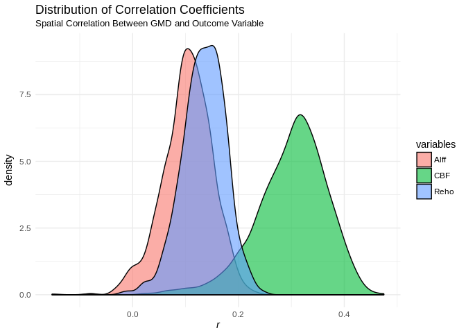
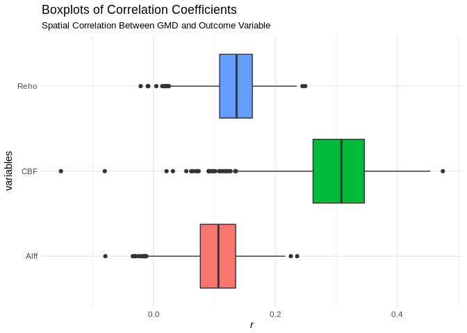

Spatial Correlation Density Plots
================
Tinashe M. Tapera
2018-02-05

``` r
suppressPackageStartupMessages({
  library(tidyr, quietly = TRUE)
  library(dplyr, quietly = TRUE)
  library(knitr, quietly = TRUE)
  library(ggplot2, quietly = TRUE)
  library(magrittr, quietly = TRUE)
  library(stringr, quietly = TRUE)
  library(oro.nifti, quietly = TRUE)
  library(purrr, quietly = TRUE)
  library(ggpubr, quietly = TRUE)
})
set.seed(1000)
SAMPLE <- FALSE # sample the full data if memory is limited e.g. not in qsub
```

Introduction
============

Here we visualise the relationship between GMD values and CBF, Alff, and Reho in the PNC sample for ISLA. We append to the previous work by calculating spatial correlation per participant and then plotting the distribution of these correlation coefficients. First, how to load the images and calculate spatial correlation.

``` r
# relevant paths
gmd_path <- file.path("/data/joy/BBL/studies/pnc/n1601_dataFreeze/neuroimaging/t1struct/voxelwiseMaps_gmd")
cbf_path <- file.path("/data/joy/BBL/studies/pnc/n1601_dataFreeze/neuroimaging/asl/voxelwiseMaps_cbf")
mask_path <- file.path("/data/joy/BBL/studies/pnc/n1601_dataFreeze/neuroimaging/asl/gm10pcalcovemask.nii.gz")

# one gmd image
gmd_example <-
  list.files(gmd_path,
    pattern = regex("[^tmp.nii.gz]"),
    full.names = TRUE)[2] %>%
  tibble(path = .) %>%
  mutate(scanid = str_extract(path, "(?<=/)[:digit:]{4,}")) %>%
  select(scanid, everything())

# the same scanid's cbf image
cbf_example <-
  list.files(cbf_path,
    pattern = regex("[^tmp.nii.gz]"),
    full.names = TRUE) %>%
  tibble(path = .) %>%
  mutate(scanid = str_extract(path, "(?<=/)[:digit:]{4,}")) %>%
  select(scanid, everything()) %>%
  filter(scanid == gmd_example$scanid)
```

Here we use the script `spatialcorr.sh` to calculate the spatial correlation for a participant's two images.

``` r
spatial_corr_script <- "/data/jux/BBL/projects/isla/code/Correlations/spatialcorr.sh"
system(sprintf("%s %s %s %s",
  spatial_corr_script,
  cbf_example$path,
  gmd_example$path,
  mask_path),
  intern = TRUE)
```

    ## [1] ".2599"

We can wrap this in an internal function like so:

``` r
calculate_spatial_corr <- function(img1_path, img2_path, mask_path){

  spatial_corr_script <- "/data/jux/BBL/projects/isla/code/Correlations/spatialcorr.sh"
  spatial_r <- system(sprintf("%s %s %s %s",
    spatial_corr_script,
    img1_path,
    img2_path,
    mask_path),
    intern = TRUE) %>%
    as.numeric()

  spatial_r
}

calculate_spatial_corr(cbf_example$path, gmd_example$path, mask_path)
```

    ## [1] 0.2599

GMD~CBF
=======

We calculate the spatial correlation per participant between GMD and CBF.

``` r
# use the cbf sample
cbf_sample <- read.csv("/data/jux/BBL/projects/isla/data/cbfSample.csv") %>%
  select(-X) %>%
  { if( SAMPLE ) sample_n(., 50) else .} %>%
  {.}

# gather images
gmd_images <-
  list.files(gmd_path,
    pattern = regex("[^tmp.nii.gz]"),
    full.names = TRUE) %>%
  tibble(path = .) %>%
  mutate(scanid = str_extract(path, "(?<=/)[:digit:]{4,}")) %>%
  select(scanid, everything()) %>%
  filter(scanid %in% cbf_sample$scanid) %>%
  arrange(scanid)

cbf_images <-
  list.files(cbf_path,
    pattern = regex("[^tmp.nii.gz]"),
    full.names = TRUE) %>%
  tibble(path = .) %>%
  mutate(scanid = str_extract(path, "(?<=/)[:digit:]{4,}")) %>%
  select(scanid, everything()) %>%
  filter(scanid %in% cbf_sample$scanid) %>%
  arrange(scanid)

# join and calculate correlation
gmd_cbf <- cbf_images %>%
  left_join(gmd_images, by = "scanid") %>%
  mutate(cor_coef = map2_dbl(
    .x = path.x,
    .y = path.y,
    .f = calculate_spatial_corr,
    mask_path = mask_path
    )
  )
```

Plot
----

``` r
gmd_cbf %>%
  ggplot(aes(cor_coef)) +
    geom_histogram() +
    geom_density() +
    theme_minimal() +
    labs(
      title = "Distribution of Correlation Coefficients",
      subtitle = "Spatial Correlation Between GMD and CBF",
      x = expression(italic("r")))
```

    ## `stat_bin()` using `bins = 30`. Pick better value with `binwidth`.


GMD~Alff
========

Now the correlation between GMD and Alff

``` r
# use the rest sample
rest_sample <- read.csv("/data/jux/BBL/projects/isla/data/restSample.csv") %>%
  select(-X) %>%
  { if( SAMPLE ) sample_n(., 50) else .} %>%
  {.}

# gather images
alff_path <- "/data/joy/BBL/studies/pnc/n1601_dataFreeze/neuroimaging/rest/voxelwiseMaps_alff"

alff_images <-
  list.files(alff_path,
    pattern = regex("[^tmp.nii.gz]"),
    full.names = TRUE) %>%
  tibble(path = .) %>%
  mutate(scanid = str_extract(path, "(?<=/)[:digit:]{4,}")) %>%
  select(scanid, everything()) %>%
  filter(scanid %in% rest_sample$scanid) %>%
  arrange(scanid)

gmd_images <-
  list.files(gmd_path,
    pattern = regex("[^tmp.nii.gz]"),
    full.names = TRUE) %>%
  tibble(path = .) %>%
  mutate(scanid = str_extract(path, "(?<=/)[:digit:]{4,}")) %>%
  select(scanid, everything()) %>%
  filter(scanid %in% rest_sample$scanid) %>%
  arrange(scanid)

# join and calculate correlation
gmd_alff <- alff_images %>%
  left_join(gmd_images, by = "scanid") %>%
  mutate(cor_coef = map2_dbl(
    .x = path.x,
    .y = path.y,
    .f = calculate_spatial_corr,
    mask_path = mask_path
    )
  )
```

Plot
----

``` r
gmd_alff %>%
  ggplot(aes(cor_coef)) +
    geom_histogram() +
    geom_density() +
    theme_minimal() +
    labs(
      title = "Distribution of Correlation Coefficients",
      subtitle = "Spatial Correlation Between GMD and Alff",
      x = expression(italic("r")))
```

    ## `stat_bin()` using `bins = 30`. Pick better value with `binwidth`.


GMD~Reho
========

Finally, the correlation between GMD and Reho

``` r
# gather images
reho_path <- "/data/joy/BBL/studies/pnc/n1601_dataFreeze/neuroimaging/rest/voxelwiseMaps_reho"

reho_images <-
  list.files(reho_path,
    pattern = regex("[^tmp.nii.gz]"),
    full.names = TRUE) %>%
  tibble(path = .) %>%
  mutate(scanid = str_extract(path, "(?<=/)[:digit:]{4,}")) %>%
  select(scanid, everything()) %>%
  filter(scanid %in% rest_sample$scanid) %>%
  arrange(scanid)

# join and calculate correlation
gmd_reho <- reho_images %>%
  left_join(gmd_images, by = "scanid") %>%
  mutate(cor_coef = map2_dbl(
    .x = path.x,
    .y = path.y,
    .f = calculate_spatial_corr,
    mask_path = mask_path
    )
  )
```

Plot
----

``` r
gmd_reho %>%
  ggplot(aes(cor_coef)) +
    geom_histogram() +
    geom_density() +
    theme_minimal() +
    labs(
      title = "Distribution of Correlation Coefficients",
      subtitle = "Spatial Correlation Between GMD and Reho",
      x = expression(italic("r")))
```

    ## `stat_bin()` using `bins = 30`. Pick better value with `binwidth`.


Overlayed Plot
==============

Now, for comparison, we can overlay the coefficient distributions to see if there are any differences between them.

``` r
gmd_cbf <- gmd_cbf %>%
  mutate(variables = "CBF")
gmd_alff <- gmd_alff %>%
  mutate(variables = "Alff")
gmd_reho <- gmd_reho %>%
  mutate(variables = "Reho")

df <- bind_rows(gmd_cbf, gmd_alff, gmd_reho)
df %>%
  ggplot(aes(cor_coef)) +
    #geom_histogram(aes(fill = variables), alpha = 0.6) +
    geom_density(aes(fill = variables), alpha = 0.6) +
    theme_minimal() +
    labs(
      title = "Distribution of Correlation Coefficients",
      subtitle = "Spatial Correlation Between GMD and Outcome Variable",
      x = expression(italic("r"))
    )
```



``` r
df %>%
  ggplot(aes(x = variables, y = cor_coef)) +
    geom_boxplot(aes(fill = variables)) +
    guides(fill = FALSE) +
    labs(
      title = "Boxplots of Correlation Coefficients",
      subtitle = "Spatial Correlation Between GMD and Outcome Variable",
      y = expression(italic("r"))
    ) +
    theme_minimal() +
    coord_flip() +
    NULL
```



Session info:

``` r
print(R.version.string)
```

    ## [1] "R version 3.4.1 (2017-06-30)"

``` r
print(paste("Last Run:", format(Sys.time(), "%Y-%m-%d")))
```

    ## [1] "Last Run: 2019-02-05"
