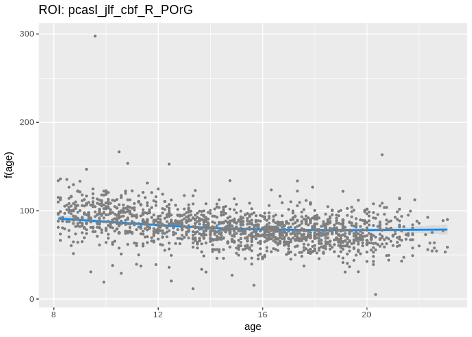

Here we demonstrate the multivariate ROI-based `gam()` for `CBF ~ s(age, by=sex)`. First, for raw CBF data, and then, for ISLA-corrected CBF data.

``` r
suppressPackageStartupMessages({
    library(mgcv)
    library(ggplot2)
    library(visreg)
    library(dplyr)
    library(purrr)
    library(tidyr)
    library(broom)
    library(readr)
    library(knitr)
})
set.seed(1000)
WRITE_OUT <- FALSE # write out the .rds of all the models
```

First, gather the data and join the demographics. We also create an *ordered factor* for sex.

``` r
cbf <- read.csv("/data/joy/BBL/studies/pnc/n1601_dataFreeze/neuroimaging/asl/n1601_jlfAntsCTIntersectionPcaslValues_20170403.csv") %>%
  as_tibble()
demographics <- read.csv("/data/joy/BBL/studies/pnc/n1601_dataFreeze/demographics/n1601_demographics_go1_20161212.csv") %>%
  as_tibble()

df <- demographics %>% left_join(cbf,  by = c("bblid", "scanid"))

df <- df %>%
  mutate(sex = as.ordered(as.factor(sex)),
         age = ageAtScan1 / 12)
```

Now, we run the model. We use tidyverse-style gathering, nesting, mapping, and tidy output.

``` r
nested <- df %>%
  gather(var, val, starts_with("pca")) %>%
  group_by(var) %>%
  nest()

my_gam <- function(data_in){

  g <- gam(val ~ s(age, by=sex), data=data_in)
  g$data <- data_in
  return(g)

}

models <- nested %>%
  mutate(model = map(.x = data, .f = my_gam)) %>%
  mutate(results = map(model, tidy))
```

Observing the results of one the models:

``` r
# pull the model object for visualisation later
# example of single ROI
models %>%
  sample_n(1) %>%
  assign("roi", ., envir = .GlobalEnv) %>%
  pull(results) %>%
  .[[1]] %>%
  knitr::kable(caption = paste("ROI:", roi$var))
```

| term        |       edf|    ref.df|  statistic|  p.value|
|:------------|---------:|---------:|----------:|--------:|
| s(age):sex2 |  2.867626|  3.596466|    15.2362|        0|

``` r
models %>%
  sample_n(1) %>%
  assign("roi", ., envir = .GlobalEnv) %>%
  pull(model) %>%
  .[[1]] %>%
  visreg(., "age", plot = TRUE, gg = TRUE)+
  labs(title = paste("ROI:", roi$var))
```



``` r
# write an rds of models to results directory if on CHEAD and accessible
# note: this will need to be reopened as a tibble using readr::
# as it contains list columns
output <- file.path("/data/jux/BBL/projects/isla/results/")

if(dir.exists(output) & WRITE_OUT) {

  rds_name <- paste("Univar_ROI", Sys.Date(), sep = "_") %>%
    paste(., ".rds", sep = "")

  save_rds(models, file = paste0(output, rds_name))
}
```
