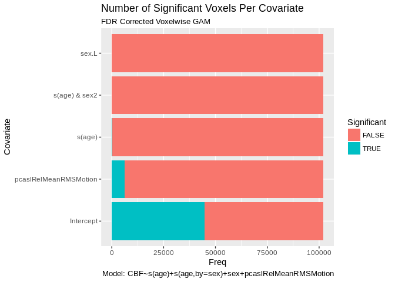

Multivariate Voxelwise `gam()` Example
================
Tinashe M. Tapera
2018-01-16

``` r
suppressPackageStartupMessages({
  library(tidyr)
  library(dplyr)
  library(knitr)
  library(ggplot2)
  library(magrittr)
  library(stringr)
  library(oro.nifti)
})
set.seed(1000)
print(paste("Updated:", format(Sys.time(), '%Y-%m-%d ')))
```

    ## [1] "Updated: 2019-02-01 "

How to Run Voxelwise `gam()` with `voxelwrapper`
================================================

Set up
------

Here we demonstrate the multivariate voxelwise `gam()` for `CBF ~s(age)+s(age,by=sex)+sex+pcaslRelMeanRMSMotion` for a small sample, using raw CBF data. We walk through the arguments of the voxelwrapper, creating each within this notebook.

1.  `covariates`

Here we read in the demographic data and the paths to the CBF images, and write this out to an RDS file in the sandbox:

``` r
demographics <-
  read.csv("/data/joy/BBL/studies/pnc/n1601_dataFreeze/demographics/n1601_demographics_go1_20161212.csv") %>%
  as_tibble() %>%
  mutate(sex = as.ordered(as.factor(sex)),
         age = ageAtScan1 / 12,
         scanid = as.character(scanid))

CBF_path <- file.path("/data/joy/BBL/studies/pnc/n1601_dataFreeze/neuroimaging/asl/voxelwiseMaps_cbf")

cbfMotion <-
  read.csv("/data/joy/BBL/studies/pnc/n1601_dataFreeze/neuroimaging/asl/n1601_PcaslQaData_20170403.csv") %>%
  select(scanid, pcaslRelMeanRMSMotion) %>%
  mutate(scanid = as.character(scanid))

all_scans <-
  list.files(CBF_path,  pattern = ".nii.gz", recursive = TRUE, full.names = TRUE) %>%
  tibble(path = .) %>%
  mutate(scanid = str_extract(path, "(?<=/)[:digit:]{4,}")) %>%
  select(scanid, everything())

covariates_df <-
  all_scans %>%
  left_join(demographics, by = "scanid") %>%
  left_join(cbfMotion, by = "scanid") %>%
  mutate(include = 1) %>%  # for inclusion critera
  filter(scanid != 4445) %>% #broken nifti for this scanID
  filter(complete.cases(.))

if (all(purrr::map_lgl(covariates_df$path, file.exists))){
  #ensures that all of the paths are correctly written

  covariates <- "/data/jux/BBL/projects/isla/data/sandbox/voxelwise_gam_covariates.rds" %T>%
    saveRDS(covariates_df, .)

}
```

``` r
#not run
head(covariates_df) %>% kable()
```

`output` Quickly assign an output directory

``` r
output <- file.path("/data/jux/BBL/projects/isla/results/")
```

`imagepaths` Next we find the voxelwise CBF data, and create a spreadsheet of input paths:

``` r
image_paths <- "path"
```

`mask` Set the path to the mask image

``` r
mask <- file.path("/data/joy/BBL/studies/pnc/n1601_dataFreeze/neuroimaging/asl/gm10pcalcovemask.nii.gz")
```

`smoothing` The smoothing in sigmas required for the fourd image. Recommended default to 0

``` r
smoothing <- 0
```

`inclusion` Whether or not there are some exclusion criteria; currently none

``` r
inclusion <- "include"
```

`subjID` The name of the column denoting the subject ID

``` r
subjID <- "scanid"
```

`formula` The formula call, as a string. Note that there needn't be any spaces

``` r
my_formula <- "\"~s(age)+s(age,by=sex)+sex+pcaslRelMeanRMSMotion\""
```

`padjust` The output type for the model

``` r
padjust <- "fdr"
```

The remaining arguments, `splits`, `residual`, and `numberofcores`, `skipfourD`, and `residual`,all remain default.

Running the Model
-----------------

We will call the voxelwrapper from outside the command line like so:

``` r
# worlds longest single line of code please dont judge me
run_command <- sprintf("Rscript /data/jux/BBL/projects/isla/code/voxelwiseWrappers/gam_voxelwise.R -c %s -o %s -p %s -m %s -s %s -i %s -u %s -f %s -a %s -n 5 -s 0 -k 10", covariates, output, image_paths, mask, smoothing, inclusion, subjID, my_formula, padjust)
#not run
writeLines(c("unset PYTHONPATH; unalias python
export PATH=/data/joy/BBL/applications/miniconda3/bin:$PATH
source activate py2k", run_command), "/data/jux/BBL/projects/isla/code/qsub_Calls/RunVoxelwiseRawCBF.Sh")
```

Results
-------

The results can be found in the `../results/` directory, where the images of the final voxelwise tests are output as nifti's. First, read in the NIfTI outputs and mask:

``` r
fdr_images <-
  list.files("/data/jux/BBL/projects/isla/results/rawCBF/n1132_path_include_smooth0/n1132gam_Cov_sage_sagebysex_sex_pcaslRelMeanRMSMotion/",
  pattern = "fdr",
  full.names = TRUE) %>%
  lapply(., readNIfTI, reorient = FALSE)

mask_img <- readNIfTI(mask)
maskdat <- img_data(mask_img)
```

Also grab a list of the covariates:

``` r
output_covariates <- list.files("/data/jux/BBL/projects/isla/results/rawCBF/n1132_path_include_smooth0/n1132gam_Cov_sage_sagebysex_sex_pcaslRelMeanRMSMotion/",
                                pattern = "fdr") %>%
  str_match(string = ., pattern = "fdr_(.*)\\.nii") %>%
  .[,2] %>%
  str_replace(pattern = "sage", "s(age)") %>%
  str_replace(pattern = "and", " & ")
```

We write a function to find the voxels where the mask applies, and count how many of these voxels are less than our *p* threshold of 0.05:

``` r
returnFDR <- function(nim, title) {

  tempdat <- img_data(nim)
  tempdat <- tempdat[maskdat == 1]
  table(tempdat < 0.05) %>%
    data.frame() %>%
    mutate(Covariate = title) %>%
    rename(Significant = Var1) %>%
    return()
}

fdr_data <- purrr::map2_dfr(fdr_images, output_covariates, returnFDR)
```

Below are plots of the \# of non-zero FDR corrected voxels for each covariate's nifti output:

``` r
fdr_data
```

| Significant |    Freq| Covariate             |
|:------------|-------:|:----------------------|
| FALSE       |      77| Intercept             |
| TRUE        |  102065| Intercept             |
| FALSE       |   92503| pcaslRelMeanRMSMotion |
| TRUE        |    9639| pcaslRelMeanRMSMotion |
| FALSE       |     518| s(age)                |
| TRUE        |  101624| s(age)                |
| FALSE       |   10864| s(age) & sex2         |
| TRUE        |   91278| s(age) & sex2         |
| FALSE       |   89354| sex.L                 |
| TRUE        |   12788| sex.L                 |

``` r
fdr_data %>%
  ggplot(aes(x=Covariate, y = Freq)) +
    geom_bar(aes(fill = Significant), stat = "identity") +
    coord_flip() +
    labs(title = "Number of Significant Voxels Per Covariate",
         subtitle = "FDR Corrected Voxelwise GAM",
         caption = "Model: CBF~s(age)+s(age,by=sex)+sex+pcaslRelMeanRMSMotion")
```


