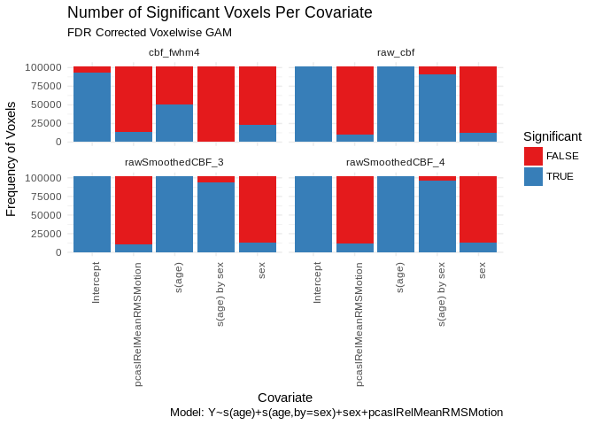

Multivariate Voxelwise `gam()` Results: CBF (incl. imco1.6)
================
Tinashe M. Tapera
2019-02-20

-   [Summarising Results of the ISLA Voxelwise Models](#summarising-results-of-the-isla-voxelwise-models)

``` r
suppressPackageStartupMessages({
  library(tidyr)
  library(dplyr)
  library(knitr)
  library(ggplot2)
  library(magrittr)
  library(stringr)
  library(oro.nifti)
  library(purrr)
  library(RColorBrewer)
})
```

    ## Warning: package 'RColorBrewer' was built under R version 3.5.1

``` r
print(paste("Last Run:", format(Sys.time(), '%Y-%m-%d')))
```

    ## [1] "Last Run: 2019-02-20"

Summarising Results of the ISLA Voxelwise Models
================================================

Here we visualise the results of the isla voxelwise model. The model is of the form:

`Y ~ s(age) + s(age,by=sex) + sex + pcaslRelMeanRMSMotion`

We show the output of the models where `Y` is ISLA corrected CBF where fwhm = 4

``` r
#
```

``` r
results_dir <- "/data/jux/BBL/projects/isla/results/VoxelWrapperModels/imco1"
rawcbf_dir <- file.path(results_dir, "raw_cbf")
smoothed3_dir <- file.path(results_dir, "rawSmoothedCBF_3")
smoothed4_dir <- file.path(results_dir, "rawSmoothedCBF_4")
isla3_dir <- file.path(results_dir, "cbf3")
isla4_dir <- file.path(results_dir, "cbf4")

results_dir <- "/data/jux/BBL/projects/isla/results/VoxelWrapperModels/imco1_6"
isla_cbf_dir <- file.path(results_dir, "cbf_fwhm4")

images_df <- c(
  rawcbf_dir,
  smoothed3_dir,
  smoothed4_dir,
  isla3_dir,
  isla4_dir,
  isla_cbf_dir) %>%
  tibble(path = .) %>%
  group_by(path) %>%
  mutate(
    images_paths = map(
      .x = path,
      .f = list.files,
      pattern = "fdr",
      recursive = TRUE,
      full.names = TRUE)
  ) %>%
  unnest()
```

Read in the Niftis and the mask

``` r
images_df <- images_df %>%
  mutate(
    variable = str_extract(
      string = images_paths,
      pattern = "(?<=fdr_)(.*)(?=\\.nii)") %>%
        str_replace(pattern = "sage", "s(age)") %>%
        str_replace(pattern = "and", " by ") %>%
        str_replace(pattern = "\\.L", "") %>%
        str_replace(pattern = "2", ""),
    nifti = map(images_paths, readNIfTI, reorient = FALSE),
    Y = str_extract(string = path, pattern = "(?<=imco1(_6)?/).*$")
)

mask <- "/data/jux/BBL/projects/isla/data/Masks/gm10perc_PcaslCoverageMask.nii.gz"
mask_img <- readNIfTI(mask)
maskdat <- img_data(mask_img)
```

Below is a helper function to extract the data from a nifti and get the proportion of significant and non-significant voxels at *p* &lt; 0.05. Then, we apply the function

``` r
returnFDR <- function(nif, variable, mask = maskdat) {

  tempdat <- img_data(nif)
  tempdat <- tempdat[mask != 0]
  table(tempdat < 0.05) %>%
    data.frame() %>%
    mutate(Covariate = variable) %>%
    rename(Significant = Var1) %>%
    return()
}

results <- images_df %>%
  group_by(Y, variable) %>%
  mutate(results = list(map2_df(nifti, variable, returnFDR))) %>%
  ungroup() %>%
  select(Y,results) %>%
  unnest()
```

Now, plot:

``` r
results %>%
  ggplot(aes(x = Covariate, y = Freq)) +
    geom_bar(aes(fill = Significant), stat = "identity") +
    theme_minimal() +
    labs(
      title = "Number of Significant Voxels Per Covariate",
      y = "Frequency of Voxels",
      subtitle = "FDR Corrected Voxelwise GAM",
      caption = "Model: Y~s(age)+s(age,by=sex)+sex+pcaslRelMeanRMSMotion") +
    theme(axis.text.x = element_text(angle = 90, hjust = 1)) +
    scale_fill_brewer(palette = "Set1") +
    facet_wrap(~Y)
```


